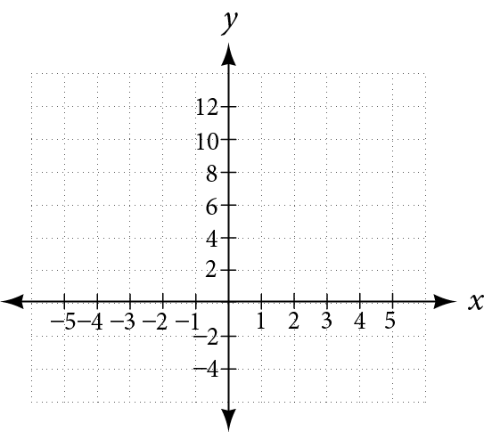
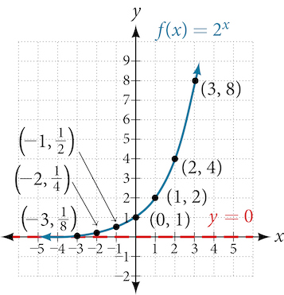
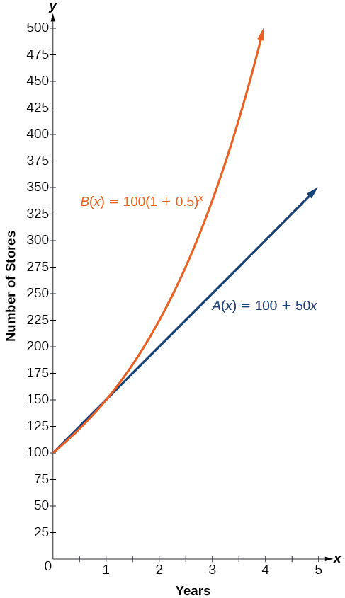
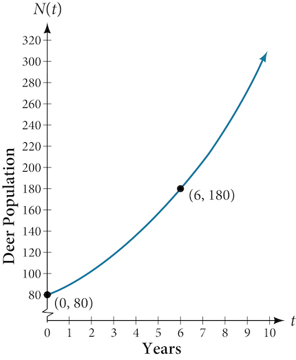
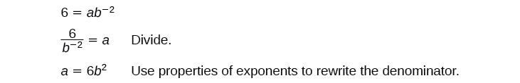
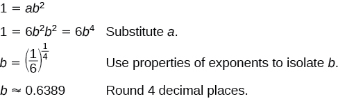
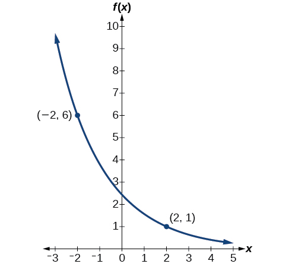
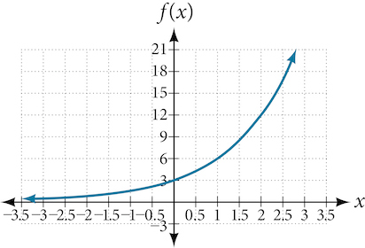
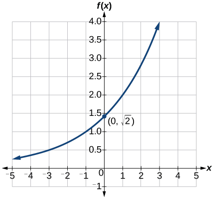

Exponential Functions
=====================

  m49361
  
Exponential Functions
=====================

  In this section, you will:

Evaluate exponential functions.
Find the equation of an exponential function.
Use compound interest formulas.
Evaluate exponential functions with base $e$ .

  694d2eea-4135-47f3-8c06-60472f7e967c

Learning Objectives
===================
Find the value of a function (exponential). (IA 3.5.3)
Graph exponential functions. (IA 10.2.1)

Objective 1: Find the value of a function (exponential). (IA 3.5.3)
===================================================================

Vocabulary.
===========
For the function $y=f\left(x\right)$ , ________ is the **independent variable** as it can be any value in the domain and ________ is the **dependent variable** as its value depends on ________ .
Many natural events and real-life applications can be modeled using exponential functions. For example, the growth of populations, the spread of viruses, radioactive decay and compounding interest all follow exponential patterns.

Definition An exponential function is a function of the form
============================================================
$f\left(x\right)={a}^{x}$ where $a>0$ and $a\ne 1$ *Examples:* $f(x)={5}^{x},f(x)={(\frac{1}{3})}^{x},f(x)=2.{13}^{x}$
Notice that in the exponential function, the variable is the exponent. In our functions so far, the variables were the base.

*Evaluating a function* is the process of finding the value of f(x) for a given value of x.
Evaluate the function $f(x)={3}^{x}$ for the given values

ⓐ $f(2)$
  
ⓑ $f(-1)$
  
ⓒ $f(2h)$
  

  ⓐ Replace x with 2 and find the value of the function $f(2)={3}^{2}=9$
ⓑ Replace x with -1 and find the value of the function $f(2)={3}^{-1}=\frac{1}{3}$

  
ⓒ Replace x with 2h and simplify if possible $f(2)={3}^{2h}$

  

Practice Makes Perfect
======================
Find the value of an exponential function.

  Evaluate the function $f(x)={\left(\frac{3}{2}\right)}^{x}$ for the given values.

          ⓐ $f(2)$
     
     
          ⓑ $f(-2)$
     
     
          ⓒ $f(a)$

  We also find the value of the function when we solve application problems involving exponential functions.

Medicare Premiums. The monthly Medicare Part B health-care premium for most beneficiaries ages 65 and older has increased significantly since 1975. The monthly premium has increased from about $7 in 1975 to $110.50 in 2011 (Source: Centers for Medicare and Medicaid Services). The following exponential function models the premium increases:
 $M(x)=7{(1.080)}^{x}$ where x is the number of years since 1975. 
Estimate the monthly Medicare Part B premium in 1985, in 1992, and in 2002. (Note that x is the number of years since 1975, so for 1985, x=10.) Round to the nearest dollar.

  We can find *Compound Interest* using $A=P{(1+\frac{r}{n})}^{nt}$ , 
Where A is the amount of money, P is the principal, t is the number of years, r is the interest rate, and n is the number of times the interest was compounded per year.
Suppose that $960 is invested at 7% interest, compounded semiannually.

          ⓐ Find the function for the amount to which the investment grows after *t* years.
     
     
          ⓑ Find the amount of money in the account at *t*=1, 6, 10, 15, and 20 years.

Objective 2: Graph exponential functions. (IA 10.2.1)
=====================================================

Practice Makes Perfect
======================
Graph exponential functions.

  Graph the exponential function $f\left(x\right)={2}^{x}$ by making a table.
  

 $x$ 
 $y=f(x)$ 

  

  

  

  

  

  

  

  Graph the exponential function $f(x)={\left(\frac{1}{2}\right)}^{x}$ by making a table.
  

 $x$ 
 $y=f(x)$ 

  

  

  

  

  

  

How does it compare with the graph of $f(x)={2}^{x}$ ?

  Graph $f(x)={3}^{x}$ , $f(x)={4}^{x}$ , $f(x)={2.5}^{x}$ in the same viewing window using a graphing calculator or program. What is the relationship between the base a and the shape of the graph?

  Graph $f(x)={0.2}^{x}$ , $f(x)={0.4}^{x}$ , $f(x)={0.7}^{x}$ in the same viewing window using a graphing calculator or program. What is the relationship between the base a and the shape of the graph?

  Fill in the *Properties of Exponential Function*.
 $f(x)={a}^{x},\ \ a>0,\ \ a\ne 1$ 
Is it continuous? 
Is it one-to-one? 
Domain 
Range 
Increasing if 
Decreasing if 
Asymptotes 
Intercepts

The number *e*, *e ≈ 2.718281827*, is like the number π in that we use a symbol to represent it because its decimal representation never stops or repeats. The irrational number *e* is called the natural base or Euler's number after the Swiss mathematician Leonhard Euler.
The exponential function whose base is e, $f(x)={\mathrm{e}}^{x}$ is called the **natural exponential function**.

Practice Makes Perfect
======================

  Graph the exponential function $f\left(x\right)={e}^{x}$ by making a table.
  

 $x$ 
 $y=f(x)$ 

  

  

  

  

  

  

What is the domain of $f(x)$ ?
What is the range of $f(x)$ ?

India is the second most populous country in the world with a population of about $1.39$ billion people in 2021. The population is growing at a rate of about $1.2\%$ each yearhttp://www.worldometers.info/world-population/. Accessed February 24, 2014.. If this rate continues, the population of India will exceed China’s population by the year $2027.$ When populations grow rapidly, we often say that the growth is “exponential,” meaning that something is growing very rapidly. To a mathematician, however, the term *exponential growth*has a very specific meaning. In this section, we will take a look at *exponential functions*, which model this kind of rapid growth.

Identifying Exponential Functions
=================================

When exploring linear growth, we observed a constant rate of change—a constant number by which the output increased for each unit increase in input. For example, in the equation $f(x)=3x+4,$ the slope tells us the output increases by 3 each time the input increases by 1. The scenario in the India population example is different because we have a *percent* change per unit time (rather than a constant change) in the number of people.

Defining an Exponential Function
================================
A study found that the percent of the population who are vegans in the United States doubled from 2009 to 2011. In 2011, 2.5% of the population was vegan, adhering to a diet that does not include any animal products—no meat, poultry, fish, dairy, or eggs. If this rate continues, vegans will make up 10% of the U.S. population in 2015, 40% in 2019, and 80% in 2021.
What exactly does it mean to *grow exponentially*? What does the word *double*have in common with *percent increase*? People toss these words around errantly. Are these words used correctly? The words certainly appear frequently in the media.

*Percent change*refers to a *change* based on a *percent* of the original amount.
*Exponential growth*refers to an *increase* based on a constant multiplicative rate of change over equal increments of time, that is, a *percent* increase of the original amount over time.
**Exponential decay** refers to a *decrease* based on a constant multiplicative rate of change over equal increments of time, that is, a *percent* decrease of the original amount over time.

For us to gain a clear understanding of **exponential growth**, let us contrast exponential growth with **linear growth**. We will construct two functions. The first function is exponential. We will start with an input of 0, and increase each input by 1. We will double the corresponding consecutive outputs. The second function is linear. We will start with an input of 0, and increase each input by 1. We will add 2 to the corresponding consecutive outputs. See .

 $x$ 
 $f(x)={2}^{x}$ 
 $g(x)=2x$ 

0
1
0

1
2
2

2
4
4

3
8
6

4
16
8

5
32
10

6
64
12

From  we can infer that for these two functions, exponential growth dwarfs linear growth.
*Exponential growth*refers to the original value from the range increases by the *same percentage* over equal increments found in the domain.
*Linear growth* refers to the original value from the range increases by the *same amount* over equal increments found in the domain.
Apparently, the difference between “the same percentage” and “the same amount” is quite significant. For exponential growth, over equal increments, the constant multiplicative rate of change resulted in doubling the output whenever the input increased by one.  For linear growth, the constant additive rate of change over equal increments resulted in adding 2 to the output whenever the input was increased by one.
The general form of the **exponential function** is $f(x)=a{b}^{x},$ where $a$ is any nonzero number, $b$ is a positive real number not equal to 1.
If $b>1,$ the function grows at a rate proportional to its size.
If $0<b<1,$ the function decays at a rate proportional to its size.
Let’s look at the function $f(x)={2}^{x}$ from our example. We will create a table () to determine the corresponding outputs over an interval in the domain from $-3$ to $3.$

*$x$*

 $-3$ 
 $-2$ 
 $-1$ 
 $0$ 
 $1$ 
 $2$ 
 $3$ 

*$f(x)={2}^{x}$*
 ${2}^{-3}=\frac{1}{8}$ 
 ${2}^{-2}=\frac{1}{4}$ 
 ${2}^{-1}=\frac{1}{2}$ 
 ${2}^{0}=1$ 
 ${2}^{1}=2$ 
 ${2}^{2}=4$ 
 ${2}^{3}=8$ 

Let us examine the graph of $f$ by plotting the ordered pairs we observe on the table in , and then make a few observations.

\n\n\n\nLet’s define the behavior of the graph of the exponential function $f(x)={2}^{x}$ and highlight some its key characteristics.
the domain is $\left(-\infty ,\infty \right),$ 
the range is $\left(0,\infty \right),$ 
as $x\to \infty ,f(x)\to \infty ,$ 
as $x\to -\infty ,f(x)\to 0,$ 
 $f(x)$ is always increasing,
the graph of $f(x)$ will never touch the *x*-axis because base two raised to any exponent never has the result of zero.
 $y=0$ is the horizontal asymptote.
the *y*-intercept is 1.

Exponential Function
====================

For any real number $x,$ an exponential function is a function with the form

 $f(x)=a{b}^{x}$ where
 $a$ is a non-zero real number called the initial value and
 $b$ is any positive real number such that $b\ne 1.$ 
The domain of $f$ is all real numbers.
The range of $f$ is all positive real numbers if $a>0.$ 
The range of $f$ is all negative real numbers if $a<0.$ 
The *y*-intercept is $\left(0,a\right),$ and the horizontal asymptote is $y=0.$ 

Identifying Exponential Functions
=================================

Which of the following equations are *not* exponential functions?

 $f(x)={4}^{3\left(x-2\right)}$ 
 $g(x)={x}^{3}$ 
 $h(x)={\left(\frac{1}{3}\right)}^{x}$ 
 $j(x)={\left(-2\right)}^{x}$ 

By definition, an exponential function has a constant as a base and an independent variable as an exponent. Thus, $g(x)={x}^{3}$ does not represent an exponential function because the base is an independent variable. In fact, $g(x)={x}^{3}$ is a power function.

Recall that the base *b*of an exponential function is always a positive constant, and $b\ne 1.$ Thus, $j(x)={\left(\mathrm{-2}\right)}^{x}$ does not represent an exponential function because the base, $\mathrm{-2},$ is less than $0.$

Try It
Which of the following equations represent exponential functions?

 $f(x)=2{x}^{2}-3x+1$ 
 $g(x)={0.875}^{x}$ 
 $h(x)=1.75x+2$ 
 $j(x)={1095.6}^{-2x}$ 

$g(x)={0.875}^{x}$ and $j(x)={1095.6}^{-2x}$ represent exponential functions.

Evaluating Exponential Functions
================================

Recall that the base of an exponential function must be a positive real number other than $1.$ Why do we limit the base $b$ to positive values? To ensure that the outputs will be real numbers. Observe what happens if the base is not positive:

Let $b=-9$ and $x=\frac{1}{2}.$ Then $f(x)=f\left(\frac{1}{2}\right)={\left(-9\right)}^{\frac{1}{2}}=\sqrt{-9},$ which is not a real number.

Why do we limit the base to positive values other than $1?$ Because base $1$ results in the constant function. Observe what happens if the base is $1:$

Let $b=1.$ Then $f(x)={1}^{x}=1$ for any value of $x.$ 

To evaluate an exponential function with the form $f(x)={b}^{x},$ we simply substitute $x$ with the given value, and calculate the resulting power. For example:

Let $f(x)={2}^{x}.$ What is $f(3)?$

 $$
\begin{array}{lll}f\left(x\right)\hfill & ={2}^{x}\hfill & \hfill \\ f\left(3\right)\hfill & ={2}^{3}\phantom{\rule{0.5em}{0ex}}\text{}\hfill & \text{Substitute\}x=3.\hfill \\ \hfill & =8\phantom{\rule{0.5em}{0ex}}\text{}\hfill & \text{Evaluate\ the\ power}\text{.}\hfill \end{array}
$$

To evaluate an exponential function with a form other than the basic form, it is important to follow the order of operations. For example:

Let $f(x)=30{\left(2\right)}^{x}.$ What is $f(3)?$

 $$
\begin{array}{lll}f\left(x\right)\hfill & =30{\left(2\right)}^{x}\hfill & \hfill \\ f\left(3\right)\hfill & =30{\left(2\right)}^{3}\hfill & \text{Substitute\}x=3.\hfill \\ \hfill & =30\left(8\right)\phantom{\rule{0.5em}{0ex}}\text{}\hfill & \text{Simplify\ the\ power\ first}\text{.}\hfill \\ \hfill & =240\hfill & \text{Multiply}\text{.}\hfill \end{array}
$$

Note that if the order of operations were not followed, the result would be incorrect:

 $$
f(3)=30{\left(2\right)}^{3}\ne {60}^{3}=\mathrm{216,000}
$$ 

Evaluating Exponential Functions
================================

Let $f\left(x\right)=5{\left(3\right)}^{x+1}.$ Evaluate $f\left(2\right)$ without using a calculator.

Follow the order of operations. Be sure to pay attention to the parentheses.

 $$
\begin{array}{lll}f\left(x\right)\hfill & =5{\left(3\right)}^{x+1}\hfill & \hfill \\ f\left(2\right)\hfill & =5{\left(3\right)}^{2+1}\hfill & \text{Substitute\}x=2.\hfill \\ \hfill & =5{\left(3\right)}^{3}\hfill & \text{Add\ the\ exponents}.\hfill \\ \hfill & =5\left(27\right)\hfill & \text{Simplify\ the\ power}\text{.}\hfill \\ \hfill & =135\hfill & \text{Multiply}\text{.}\hfill \end{array}
$$

Try It

Let $f\left(x\right)=8{\left(1.2\right)}^{x-5}.$ Evaluate $f\left(3\right)$ using a calculator. Round to four decimal places.

$5.5556$

Defining Exponential Growth
===========================
Because the output of exponential functions increases very rapidly, the term “exponential growth” is often used in everyday language to describe anything that grows or increases rapidly. However, exponential growth can be defined more precisely in a mathematical sense. If the growth rate is proportional to the amount present, the function models exponential growth.

Exponential Growth
==================

A function that models **exponential growth** grows by a rate proportional to the amount present. For any real number $x$ and any positive real numbers $a\$ and $b$ such that $b\ne 1,$ an exponential growth function has the form
 $\text{}f(x)=a{b}^{x}$ where
 $a$ is the initial or starting value of the function.
 $b$ is the growth factor or growth multiplier per unit $x$ .

In more general terms, we have an *exponential function*, in which a constant base is raised to a variable exponent. To differentiate between linear and exponential functions, let’s consider two companies, A and B. Company A has 100 stores and expands by opening 50 new stores a year, so its growth can be represented by the function $A\left(x\right)=100+50x.$ Company B has 100 stores and expands by increasing the number of stores by 50% each year, so its growth can be represented by the function $B(x)=100{\left(1+0.5\right)}^{x}.$

A few years of growth for these companies are illustrated in .

Year, $x$ 
Stores, Company A
Stores, Company B

 $0$ 
 $100+50\left(0\right)=100$ 
 $100{\left(1+0.5\right)}^{0}=100$ 

 $1$ 
 $100+50\left(1\right)=150$ 
 $100{\left(1+0.5\right)}^{1}=150$ 

 $2$ 
 $100+50\left(2\right)=200$ 
 $100{\left(1+0.5\right)}^{2}=225$ 

 $3$ 
 $100+50\left(3\right)=250$ 
 $100{\left(1+0.5\right)}^{3}=337.5$ 

 $x$ 
 $A\left(x\right)=100+50x$ 
 $B(x)=100{\left(1+0.5\right)}^{x}$ 

The graphs comparing the number of stores for each company over a five-year period are shown in *.* We can see that, with exponential growth, the number of stores increases much more rapidly than with linear growth.

\n\n\n\nNotice that the domain for both functions is $[0,\infty ),$ and the range for both functions is $[100,\infty ).$ After year 1, Company B always has more stores than Company A.

Now we will turn our attention to the function representing the number of stores for Company B, $B(x)=100{\left(1+0.5\right)}^{x}.$ In this exponential function, 100 represents the initial number of stores, 0.50 represents the growth rate, and $1+0.5=1.5$ represents the growth factor. Generalizing further, we can write this function as $B(x)=100{\left(1.5\right)}^{x},$ where 100 is the initial value, $1.5$ is called the *base*, and $x$ is called the *exponent*.

Evaluating a Real-World Exponential Model
=========================================

At the beginning of this section, we learned that the population of India was about $1.25$ billion in the year 2013, with an annual growth rate of about $1.2\%.$ This situation is represented by the growth function $P(t)=1.25{\left(1.012\right)}^{t},$ where $t$ is the number of years since $2013.$ To the nearest thousandth, what will the population of India be in $\text{2031?}$

To estimate the population in 2031, we evaluate the models for $t=18,$ because 2031 is $18$ years after 2013. Rounding to the nearest thousandth,
 $$
P(18)=1.25{\left(1.012\right)}^{18}\approx 1.549
$$ 
There will be about 1.549 billion people in India in the year 2031.

Try It

The population of China was about 1.39 billion in the year 2013, with an annual growth rate of about $0.6\%.$ This situation is represented by the growth function $P(t)=1.39{\left(1.006\right)}^{t},$ where $t$ is the number of years since $2013.$ To the nearest thousandth, what will the population of China be for the year 2031? How does this compare to the population prediction we made for India in ?

About $1.548$ billion people; by the year 2031, India’s population will exceed China’s by about 0.001 billion, or 1 million people.

Finding Equations of Exponential Functions
==========================================

In the previous examples, we were given an exponential function, which we then evaluated for a given input. Sometimes we are given information about an exponential function without knowing the function explicitly. We must use the information to first write the form of the function, then determine the constants $a$ and $b,$ and evaluate the function.

How To
*Given two data points, write an exponential model.*

If one of the data points has the form $\left(0,a\right),$ then $a$ is the initial value. Using $a,$ substitute the second point into the equation $f(x)=a{\left(b\right)}^{x},$ and solve for $b.$ 
If neither of the data points have the form $\left(0,a\right),$ substitute both points into two equations with the form $f(x)=a{\left(b\right)}^{x}.$ Solve the resulting system of two equations in two unknowns to find $a$ and $b.$ 
Using the $a$ and $b$ found in the steps above, write the exponential function in the form $f(x)=a{\left(b\right)}^{x}.$ 

Writing an Exponential Model When the Initial Value Is Known
============================================================

In 2006, 80 deer were introduced into a wildlife refuge. By 2012, the population had grown to 180 deer. The population was growing exponentially. Write an exponential function $N(t)$ representing the population $\left(N\right)$ of deer over time $t.$

We let our independent variable $t$ be the number of years after 2006. Thus, the information given in the problem can be written as input-output pairs: (0, 80) and (6, 180). Notice that by choosing our input variable to be measured as years after 2006, we have given ourselves the initial value for the function, $a=80.$ We can now substitute the second point into the equation $N(t)=80{b}^{t}$ to find $b:$

 $$
\begin{array}{lll}N(t)\hfill & =80{b}^{t}\hfill & \hfill \\ \phantom{\rule{0.5em}{0ex}}\phantom{\rule{0.5em}{0ex}}180\hfill & =80{b}^{6}\hfill & \text{Substitute\ using\ point\}(6,\ 180).\hfill \\ \phantom{\rule{0.5em}{0ex}}\phantom{\rule{0.5em}{0ex}}\phantom{\rule{0.5em}{0ex}}\phantom{\rule{0.5em}{0ex}}\phantom{\rule{0.5em}{0ex}}\frac{9}{4}\hfill & ={b}^{6}\hfill & \text{Divide\ and\ write\ in\ lowest\ terms}.\hfill \\ \phantom{\rule{0.5em}{0ex}}\phantom{\rule{0.5em}{0ex}}\phantom{\rule{0.5em}{0ex}}\phantom{\rule{0.5em}{0ex}}\phantom{\rule{0.5em}{0ex}}\phantom{\rule{0.5em}{0ex}}\phantom{\rule{0.5em}{0ex}}\phantom{\rule{0.5em}{0ex}}b\hfill & ={\left(\frac{9}{4}\right)}^{\frac{1}{6}}\hfill & \text{Isolate\}b\phantom{\rule{0.5em}{0ex}}\text{using\ properties\ of\ exponents}.\hfill \\ \phantom{\rule{0.5em}{0ex}}\phantom{\rule{0.5em}{0ex}}\phantom{\rule{0.5em}{0ex}}\phantom{\rule{0.5em}{0ex}}\phantom{\rule{0.5em}{0ex}}\phantom{\rule{0.5em}{0ex}}\phantom{\rule{0.5em}{0ex}}\phantom{\rule{0.5em}{0ex}}b\hfill & \approx 1.1447\begin{array}{cccc}& & & \end{array}\hfill & \text{Round\ to\ 4\ decimal\ places}.\hfill \end{array}
$$
*NOTE:* *Unless otherwise stated, do not round any intermediate calculations. Then round the final answer to four places for the remainder of this section.*

The exponential model for the population of deer is $N(t)=80{\left(1.1447\right)}^{t}.$ (Note that this exponential function models short-term growth. As the inputs gets large, the output will get increasingly larger, so much so that the model may not be useful in the long term.)

We can graph our model to observe the population growth of deer in the refuge over time. Notice that the graph in  passes through the initial points given in the problem, $\left(0,80\right)$ and $\left(\text{6},180\right).$ We can also see that the domain for the function is $[0,\infty ),$ and the range for the function is $[80,\infty ).$

\n\n\n\n

Try It

A wolf population is growing exponentially. In 2011, $129$ wolves were counted. By $\text{2013,}$ the population had reached 236 wolves. What two points can be used to derive an exponential equation modeling this situation? Write the equation representing the population $N$ of wolves over time $t.$

$\left(0,129\right)$ and $\left(2,236\right);\phantom{\rule{0.5em}{0ex}}\phantom{\rule{0.5em}{0ex}}\phantom{\rule{0.5em}{0ex}}N(t)=129{\left(\text{1}\text{.3526}\right)}^{t}$

Writing an Exponential Model When the Initial Value is Not Known
================================================================

Find an exponential function that passes through the points $\left(-2,6\right)$ and $\left(2,1\right).$

Because we don’t have the initial value, we substitute both points into an equation of the form $f(x)=a{b}^{x},$ and then solve the system for $a$ and $b.$

Substituting $\left(-2,6\right)$ gives $6=a{b}^{-2}$ 
Substituting $\left(2,1\right)$ gives $1=a{b}^{2}$ 

Use the first equation to solve for $a$ in terms of $b:$

Substitute $a$ in the second equation, and solve for $b:$

Use the value of $b$ in the first equation to solve for the value of $a:$

Thus, the equation is $f(x)=2.4492{(0.6389)}^{x}.$

We can graph our model to check our work. Notice that the graph in  passes through the initial points given in the problem, $\left(-2,\phantom{\rule{0.5em}{0ex}}\text{6}\right)$ and $\left(2,\phantom{\rule{0.5em}{0ex}}\text{1}\right).$ The graph is an example of an **exponential decay** function.

\n\n\n\n

Try It

Given the two points $\left(1,3\right)$ and $\left(2,4.5\right),$ find the equation of the exponential function that passes through these two points.

$f(x)=2{\left(1.5\right)}^{x}$

Q&A
*Do two points always determine a unique exponential function?*

*Yes, provided the two points are either both above the x-axis or both below the x-axis and have different x-coordinates. But keep in mind that we also need to know that the graph is, in fact, an exponential function. Not every graph that looks exponential really is exponential. We need to know the graph is based on a model that shows the same percent growth with each unit increase in $x,$ which in many real world cases involves time.*

How To
*Given the graph of an exponential function, write its equation.*
First, identify two points on the graph. Choose the *y*-intercept as one of the two points whenever possible. Try to choose points that are as far apart as possible to reduce round-off error.
If one of the data points is the *y-*intercept $\left(0,a\right)$ , then $a$ is the initial value. Using $a,$ substitute the second point into the equation $f(x)=a{\left(b\right)}^{x},$ and solve for $b.$ 
If neither of the data points have the form $\left(0,a\right),$ substitute both points into two equations with the form $f(x)=a{\left(b\right)}^{x}.$ Solve the resulting system of two equations in two unknowns to find $a$ and $b.$ 
Write the exponential function, $f(x)=a{\left(b\right)}^{x}.$ 

Writing an Exponential Function Given Its Graph
===============================================

Find an equation for the exponential function graphed in .

\n\n\n\n

We can choose the *y*-intercept of the graph, $\left(0,3\right),$ as our first point. This gives us the initial value, $a=3.$ Next, choose a point on the curve some distance away from $\left(0,3\right)$ that has integer coordinates. One such point is $(2,12).$
 $$
\begin{array}{ll}\phantom{\rule{0.5em}{0ex}}\text\ y=a{b}^{x}\hfill & \text{Write\ the\ general\ form\ of\ an\ exponential\ equation}.\hfill \\ \phantom{\rule{0.5em}{0ex}}\text\ y=3{b}^{x}\hfill & \text{Substitute\ the\ initial\ value\ 3\ for\}a.\hfill \\ 12=3{b}^{2}\hfill & \text{Substitute\ in\ 12\ for\}y\phantom{\rule{0.5em}{0ex}}\text{and\ 2\ for\}x.\hfill \\ \phantom{\rule{0.5em}{0ex}}\text\ 4={b}^{2}\hfill & \text{Divide\ by\ 3}.\hfill \\ \phantom{\rule{0.5em}{0ex}}\text\ b=\pm 2\begin{array}{cccc}& & & \end{array}\hfill & \text{Take\ the\ square\ root}.\hfill \end{array}
$$
Because we restrict ourselves to positive values of $b,$ we will use $b=2.$ Substitute $a$ and $b$ into the standard form to yield the equation $f(x)=3{(2)}^{x}.$

Try It

Find an equation for the exponential function graphed in .

\n\n\n\n

$f(x)=\sqrt{2}{\left(\sqrt{2}\right)}^{x}.$ Answers may vary due to round-off error. The answer should be very close to $1.4142{\left(1.4142\right)}^{x}.$

How To
*Given two points on the curve of an exponential function, use a graphing calculator to find the equation.*

Press *[STAT].*
Clear any existing entries in columns *L1* or *L2.*
In *L1*, enter the *x*-coordinates given.
In *L2*, enter the corresponding *y*-coordinates.
Press *[STAT]*again. Cursor right to *CALC*, scroll down to *ExpReg (Exponential Regression)*, and press *[ENTER].*
The screen displays the values of *a* and *b* in the exponential equation $y=a\cdot {b}^{x}$ .

Using a Graphing Calculator to Find an Exponential Function
===========================================================

Use a graphing calculator to find the exponential equation that includes the points $(2,24.8)$ and $(5,198.4).$

Follow the guidelines above. First press *[STAT]*, *[EDIT]*, *[1: Edit…],*and clear the lists *L1* and *L2*. Next, in the *L1* column, enter the *x*-coordinates, 2 and 5. Do the same in the *L2* column for the *y*-coordinates, 24.8 and 198.4.

Now press *[STAT]*, *[CALC]*, *[0: ExpReg]*and press *[ENTER]*. The values $a=6.2$ and $b=2$ will be displayed. The exponential equation is $y=6.2\cdot {2}^{x}.$

Try It

Use a graphing calculator to find the exponential equation that includes the points (3, 75.98) and (6, 481.07).

$y\approx 12\cdot {1.85}^{x}$

Applying the Compound-Interest Formula
======================================

Savings instruments in which earnings are continually reinvested, such as mutual funds and retirement accounts, use **compound interest**. The term *compounding* refers to interest earned not only on the original value, but on the accumulated value of the account.
The **annual percentage rate (APR)** of an account, also called the **nominal rate**, is the yearly interest rate earned by an investment account. The term *nominal* is used when the compounding occurs a number of times other than once per year. In fact, when interest is compounded more than once a year, the effective interest rate ends up being *greater* than the nominal rate! This is a powerful tool for investing.
We can calculate the compound interest using the compound interest formula, which is an exponential function of the variables time $t,$ principal $P,$ APR $r,$ and number of compounding periods in a year $n:$
 $$
A(t)=P{\left(1+\frac{r}{n}\right)}^{nt}
$$ For example, observe , which shows the result of investing $1,000 at 10% for one year. Notice how the value of the account increases as the compounding frequency increases.

Frequency
Value after 1 year

Annually
$1100

Semiannually
$1102.50

Quarterly
$1103.81

Monthly
$1104.71

Daily
$1105.16

The Compound Interest Formula
=============================

*Compound interest* can be calculated using the formula

  $A(t)=P{\left(1+\frac{r}{n}\right)}^{nt}$ where

 $A(t)$ is the account value,
 $t$ is measured in years,
 $P$ is the starting amount of the account, often called the principal, or more generally present value,
 $r$ is the annual percentage rate (APR) expressed as a decimal, and
 $n$ is the number of compounding periods in one year.

Calculating Compound Interest
=============================

If we invest $3,000 in an investment account paying 3% interest compounded quarterly, how much will the account be worth in 10 years?

Because we are starting with $3,000, $P=3000.$ Our interest rate is 3%, so $r\phantom{\rule{0.5em}{0ex}}\text{}=\phantom{\rule{0.5em}{0ex}}\text{}\mathrm{0.03.}$ Because we are compounding quarterly, we are compounding 4 times per year, so $n=4.$ We want to know the value of the account in 10 years, so we are looking for $A\left(10\right),$ the value when $t\phantom{\rule{0.5em}{0ex}}\text{}=\phantom{\rule{0.5em}{0ex}}\text{}10.$

 $$
\begin{array}{lll}A(t)\hfill & =P{\left(1+\frac{r}{n}\right)}^{nt}\hfill & \text{Use\ the\ compound\ interest\ formula}.\hfill \\ A(10)\hfill & =3000{\left(1+\frac{0.03}{4}\right)}^{\mathrm{4\cdot 10}}\begin{array}{cccc}& & & \end{array}\hfill & \text{Substitute\ using\ given\ values}.\hfill \\ \hfill & \approx \text{\$}4045.05\hfill & \text{Round\ to\ two\ decimal\ places}.\hfill \end{array}
$$
The account will be worth about $4,045.05 in 10 years.

Try It

An initial investment of $100,000 at 12% interest is compounded weekly (use 52 weeks in a year). What will the investment be worth in 30 years?

about $3,644,675.88

Using the Compound Interest Formula to Solve for the Principal
==============================================================

A 529 Plan is a college-savings plan that allows relatives to invest money to pay for a child’s future college tuition; the account grows tax-free. Lily wants to set up a 529 account for her new granddaughter and wants the account to grow to $40,000 over 18 years. She believes the account will earn 6% compounded semi-annually (twice a year). To the nearest dollar, how much will Lily need to invest in the account now?

The nominal interest rate is 6%, so $r=\mathrm{0.06.}$ Interest is compounded twice a year, so $n=2.$

We want to find the initial investment, $P,$ needed so that the value of the account will be worth $40,000 in $18$ years. Substitute the given values into the compound interest formula, and solve for $P.$
 $$
\begin{array}{lll}\phantom{\rule{0.5em}{0ex}}\phantom{\rule{0.5em}{0ex}}\phantom{\rule{0.5em}{0ex}}\phantom{\rule{0.5em}{0ex}}\phantom{\rule{0.5em}{0ex}}\phantom{\rule{0.5em}{0ex}}\phantom{\rule{0.5em}{0ex}}A(t)\hfill & =P{\left(1+\frac{r}{n}\right)}^{nt}\hfill & \text{Use\ the\ compound\ interest\ formula}.\hfill \\ \mathrm{40,000}\hfill & =P{\left(1+\frac{0.06}{2}\right)}^{2(18)}\begin{array}{cccc}& & & \end{array}\hfill & \text{Substitute\ using\ given\ values\}A\text{,\}r,\ n\text{,\ and\}t.\hfill \\ \mathrm{40,000}\hfill & =P{(1.03)}^{36}\hfill & \text{Simplify}.\hfill \\ \frac{\mathrm{40,000}}{{(1.03)}^{36}}\hfill & =P\hfill & \text{Isolate\}P.\hfill \\ \phantom{\rule{0.5em}{0ex}}\phantom{\rule{0.5em}{0ex}}\phantom{\rule{0.5em}{0ex}}\phantom{\rule{0.5em}{0ex}}\phantom{\rule{0.5em}{0ex}}\phantom{\rule{0.5em}{0ex}}\phantom{\rule{0.5em}{0ex}}\phantom{\rule{0.5em}{0ex}}\phantom{\rule{0.5em}{0ex}}\phantom{\rule{0.5em}{0ex}}P\hfill & \approx \text{\$}13,801\hfill & \text{Divide\ and\ round\ to\ the\ nearest\ dollar}.\hfill \end{array}
$$
Lily will need to invest $13,801 to have $40,000 in 18 years.

Try It

Refer to . To the nearest dollar, how much would Lily need to invest if the account is compounded quarterly?

$13,693

Evaluating Functions with Base *e*
==================================
As we saw earlier, the amount earned on an account increases as the compounding frequency increases.  shows that the increase from annual to semi-annual compounding is larger than the increase from monthly to daily compounding. This might lead us to ask whether this pattern will continue.

Examine the value of $1 invested at 100% interest for 1 year, compounded at various frequencies, listed in .

Frequency
 $A(n)={\left(1+\frac{1}{n}\right)}^{n}$ 
Value

Annually
 ${\left(1+\frac{1}{1}\right)}^{1}$ 
$2

Semiannually
 ${\left(1+\frac{1}{2}\right)}^{2}$ 
$2.25

Quarterly
 ${\left(1+\frac{1}{4}\right)}^{4}$ 
$2.441406

Monthly
 ${\left(1+\frac{1}{12}\right)}^{12}$ 
$2.613035

Daily
 ${\left(1+\frac{1}{365}\right)}^{365}$ 
$2.714567

Hourly
 ${\left(1+\frac{1}{\text{8760}}\right)}^{\text{8760}}$ 
$2.718127

Once per minute
 ${\left(1+\frac{1}{\text{525600}}\right)}^{\text{525600}}$ 
$2.718279

Once per second
 ${\left(1+\frac{1}{31536000}\right)}^{31536000}$ 
$2.718282

These values appear to be approaching a limit as $n$ increases without bound. In fact, as $n$ gets larger and larger, the expression ${\left(1+\frac{1}{n}\right)}^{n}$ approaches a number used so frequently in mathematics that it has its own name: the letter $e.$ This value is an irrational number, which means that its decimal expansion goes on forever without repeating. Its approximation to six decimal places is shown below.

The Number $e$
==============

The letter *e* represents the irrational number

 ${\left(1+\frac{1}{n}\right)}^{n},\text{as}\phantom{\rule{0.5em}{0ex}}n\phantom{\rule{0.5em}{0ex}}\text{increases\ without\ bound}$
The letter *e*is used as a base for many real-world exponential models. To work with base *e*, we use the approximation, $e\approx \mathrm{2.718282.}$ The constant was named by the Swiss mathematician Leonhard Euler (1707–1783) who first investigated and discovered many of its properties.

Using a Calculator to Find Powers of *e*
========================================

Calculate ${e}^{3.14}.$ Round to five decimal places.

On a calculator, press the button labeled $\left[{e}^{x}\right].$ The window shows $\left[e^(\phantom{\rule{0.5em}{0ex}}\text{}\right].$ Type $3.14$ and then close parenthesis, $[)].$ Press [ENTER]. Rounding to $5$ decimal places, ${e}^{3.14}\approx \mathrm{23.10387.}$ Caution: Many scientific calculators have an “Exp” button, which is used to enter numbers in scientific notation. It is not used to find powers of $e.$

Try It

Use a calculator to find ${e}^{-0.5}.$ Round to five decimal places.

${e}^{-0.5}\approx 0.60653$

Investigating Continuous Growth
===============================

So far we have worked with rational bases for exponential functions. For most real-world phenomena, however, *e*is used as the base for exponential functions. Exponential models that use $e$ as the base are called *continuous growth or decay models*. We see these models in finance, computer science, and most of the sciences, such as physics, toxicology, and fluid dynamics.

The Continuous Growth/Decay Formula
===================================

For all real numbers $t,$ and all positive numbers $a$ and $r,$ continuous growth or decay is represented by the formula

 $$
A(t)=a{e}^{rt}
$$ where
 $a$ is the initial value,
 $r$ is the continuous growth rate per unit time,
and $t$ is the elapsed time.
If $r>0$ , then the formula represents continuous growth. If $r<0$ , then the formula represents continuous decay.

For business applications, the continuous growth formula is called the continuous compounding formula and takes the form

 $$
A(t)=P{e}^{rt}
$$
where
 $P$ is the principal or the initial invested,
 $r$ is the growth or interest rate per unit time,
and $t$ is the period or term of the investment.

How To
*Given the initial value, rate of growth or decay, and time $t,$ solve a continuous growth or decay function.*
Use the information in the problem to determine $a$ , the initial value of the function.
Use the information in the problem to determine the growth rate $r.$

If the problem refers to continuous growth, then $r>0.$ 
If the problem refers to continuous decay, then $r<0.$ 

Use the information in the problem to determine the time $t.$ 
Substitute the given information into the continuous growth formula and solve for $A(t).$ 

Calculating Continuous Growth
=============================

A person invested $1,000 in an account earning a nominal 10% per year compounded continuously. How much was in the account at the end of one year?

Since the account is growing in value, this is a continuous compounding problem with growth rate $r=\mathrm{0.10.}$ The initial investment was $1,000, so $P=1000.$ We use the continuous compounding formula to find the value after $t=1$ year:

 $$
\begin{array}{lll}A(t)\hfill & =P{e}^{rt}\hfill & \text{Use\ the\ continuous\ compounding\ formula}.\hfill \\ \hfill & =1000{(e)}^{0.1}\begin{array}{cccc}& & & \end{array}\hfill & \text{Substitute\ known\ values\ for\}P,\ r,\phantom{\rule{0.5em}{0ex}}\text{and\}t.\hfill \\ \hfill & \approx 1105.17\hfill & \text{Use\ a\ calculator\ to\ approximate}.\hfill \end{array}
$$
The account is worth $1,105.17 after one year.

Try It

A person invests $100,000 at a nominal 12% interest per year compounded continuously. What will be the value of the investment in 30 years?

$3,659,823.44

Calculating Continuous Decay
============================

Radon-222 decays at a continuous rate of 17.3% per day. How much will 100 mg of Radon-222 decay to in 3 days?

Since the substance is decaying, the rate, $17.3\%$ , is negative. So, $r\phantom{\rule{0.5em}{0ex}}\text{}=\phantom{\rule{0.5em}{0ex}}\text{}-\mathrm{0.173.}$ The initial amount of radon-222 was $100$ mg, so $a=100.$ We use the continuous decay formula to find the value after $t=3$ days:

 $$
\begin{array}{lll}A(t)\hfill & =a{e}^{rt}\hfill & \text{Use\ the\ continuous\ growth\ formula}.\hfill \\ \hfill & =100{e}^{-0.173(3)}\begin{array}{cccc}& & & \end{array}\hfill & \text{Substitute\ known\ values\ for\}a,\ r,\phantom{\rule{0.5em}{0ex}}\text{and\}t.\hfill \\ \hfill & \approx 59.5115\hfill & \text{Use\ a\ calculator\ to\ approximate}.\hfill \end{array}
$$
So 59.5115 mg of radon-222 will remain.

Try It

Using the data in , how much radon-222 will remain after one year?

3.77E-26 (This is calculator notation for the number written as $3.77\times {10}^{-26}$ in scientific notation. While the output of an exponential function is never zero, this number is so close to zero that for all practical purposes we can accept zero as the answer.)

Media
Access these online resources for additional instruction and practice with exponential functions.

Exponential Growth Function
Compound Interest

Key Equations
=============

definition of the exponential function
 $f(x)={b}^{x}\text{,\ \ where\ \}b>0,\ b\ne 1$ 

definition of exponential growth
 $f(x)=a{b}^{x},\phantom{\rule{0.5em}{0ex}}\text{where\}a>0,b>0,b\ne 1$ 

compound interest formula
 $\begin{array}{l}A(t)=P{\left(1+\frac{r}{n}\right)}^{nt}\ ,\phantom{\rule{0.5em}{0ex}}\text{where}\hfill \\ A(t)\phantom{\rule{0.5em}{0ex}}\text{is\ the\ account\ value\ at\ time\}t\hfill \\ t\phantom{\rule{0.5em}{0ex}}\text{is\ the\ number\ of\ years}\hfill \\ P\phantom{\rule{0.5em}{0ex}}\text{is\ the\ initial\ investment,\ often\ called\ the\ principal}\hfill \\ r\phantom{\rule{0.5em}{0ex}}\text{is\ the\ annual\ percentage\ rate\ (APR),\ or\ nominal\ rate}\hfill \\ n\phantom{\rule{0.5em}{0ex}}\text{is\ the\ number\ of\ compounding\ periods\ in\ one\ year}\hfill \end{array}$ 

continuous growth formula
 $A(t)=a{e}^{rt},\phantom{\rule{0.5em}{0ex}}\text{where}$  $t$ is the number of unit time periods of growth
 $a$ is the starting amount (in the continuous compounding formula a is replaced with P, the principal)
 $e$ is the mathematical constant, $e\approx 2.718282$ 

Key Concepts
============

An exponential function is defined as a function with a positive constant other than $1$ raised to a variable exponent. See .
A function is evaluated by solving at a specific value. See  and .
An exponential model can be found when the growth rate and initial value are known. See .
An exponential model can be found when the two data points from the model are known. See .
An exponential model can be found using two data points from the graph of the model. See .
An exponential model can be found using two data points from the graph and a calculator. See .
The value of an account at any time $t$ can be calculated using the compound interest formula when the principal, annual interest rate, and compounding periods are known. See .
The initial investment of an account can be found using the compound interest formula when the value of the account, annual interest rate, compounding periods, and life span of the account are known. See .
The number $e$ is a mathematical constant often used as the base of real world exponential growth and decay models. Its decimal approximation is $e\approx \mathrm{2.718282.}$ 
Scientific and graphing calculators have the key $\left[{e}^{x}\right]$ or $\left[\mathrm{exp}(x)\right]$ for calculating powers of $e.$ See *.*
Continuous growth or decay models are exponential models that use $e$ as the base. Continuous growth and decay models can be found when the initial value and growth or decay rate are known. See  and .

Section Exercises
=================

Verbal
======

Explain why the values of an increasing exponential function will eventually overtake the values of an increasing linear function.

Linear functions have a constant rate of change. Exponential functions increase based on a percent of the original.

Given a formula for an exponential function, is it possible to determine whether the function grows or decays exponentially just by looking at the formula? Explain.

The Oxford Dictionary defines the word *nominal* as a value that is “stated or expressed but not necessarily corresponding exactly to the real value.”Oxford Dictionary. http://oxforddictionaries.com/us/definition/american_english/nomina. Develop a reasonable argument for why the term *nominal rate* is used to describe the annual percentage rate of an investment account that compounds interest.

When interest is compounded, the percentage of interest earned to principal ends up being greater than the annual percentage rate for the investment account. Thus, the annual percentage rate does not necessarily correspond to the real interest earned, which is the very definition of *nominal*.

Algebraic
=========

For the following exercises, identify whether the statement represents an exponential function. Explain.

The average annual population increase of a pack of wolves is 25.

A population of bacteria decreases by a factor of $\frac{1}{8}$ every $24$ hours.

exponential; the population decreases by a proportional rate. .

The value of a coin collection has increased by $3.25\%$ annually over the last $20$ years.

For each training session, a personal trainer charges his clients $\text{\$}5$
less than the previous training session.

not exponential; the charge decreases by a constant amount each visit, so the statement represents a linear function. .

The height of a projectile at time $t$ is represented by the function $h(t)=-4.9{t}^{2}+18t+40.$

For the following exercises, consider this scenario: For each year $t,$ the population of a forest of trees is represented by the function $A(t)=115{(1.025)}^{t}.$ In a neighboring forest, the population of the same type of tree is represented by the function $B(t)=82{(1.029)}^{t}.$ (Round answers to the nearest whole number.)

Which forest’s population is growing at a faster rate?

The forest represented by the function $B(t)=82{(1.029)}^{t}.$

Which forest had a greater number of trees initially? By how many?

Assuming the population growth models continue to represent the growth of the forests, which forest will have a greater number of trees after $20$ years? By how many?

After $t=20$ years, forest A will have $43$ more trees than forest B.

Assuming the population growth models continue to represent the growth of the forests, which forest will have a greater number of trees after $100$ years? By how many?

Discuss the above results from the previous four exercises. Assuming the population growth models continue to represent the growth of the forests, which forest will have the greater number of trees in the long run? Why? What are some factors that might influence the long-term validity of the exponential growth model?

Answers will vary. Sample response: For a number of years, the population of forest A will increasingly exceed forest B, but because forest B actually grows at a faster rate, the population will eventually become larger than forest A and will remain that way as long as the population growth models hold. Some factors that might influence the long-term validity of the exponential growth model are drought, an epidemic that culls the population, and other environmental and biological factors.

For the following exercises, determine whether the equation represents exponential growth, exponential decay, or neither. Explain.

$y=300{\left(1-t\right)}^{5}$

$y=220{\left(1.06\right)}^{x}$

exponential growth; The growth factor, $1.06,$ is greater than $1.$

$y=16.5{\left(1.025\right)}^{\frac{1}{x}}$

$y=11,701{\left(0.97\right)}^{t}$

exponential decay; The decay factor, $0.97,$ is between $0$ and $1.$

For the following exercises, find the formula for an exponential function that passes through the two points given.

$\left(0,6\right)$ and $(3,750)$

$\left(0,2000\right)$ and $(2,20)$

$f(x)=2000{(0.1)}^{x}$

$\left(-1,\frac{3}{2}\right)$ and $\left(3,24\right)$

$\left(-2,6\right)$ and $\left(3,1\right)$

$f(x)={\left(\frac{1}{6}\right)}^{-\frac{3}{5}}{\left(\frac{1}{6}\right)}^{\frac{x}{5}}\approx 2.93{\left(0.699\right)}^{x}$

$\left(3,1\right)$ and $(5,4)$

For the following exercises, determine whether the table could represent a function that is linear, exponential, or neither. If it appears to be exponential, find a function that passes through the points.

*$x$*
1
2
3 
4 

*$f(x)$*
70
40
10
-20

Linear

*$x$*
1
2
3 
4 

*$h(x)$*
70
49
34.3
24.01

*$x$*
1
2
3 
4 

*$m(x)$*
80
61
42.9
25.61

Neither

*$x$*
1
2
3 
4 

*$f(x)$*
10
20
40
80

*$x$*
1
2
3 
4 

*$g(x)$*
-3.25
2
7.25
12.5

Linear

For the following exercises, use the compound interest formula, $A(t)=P{\left(1+\frac{r}{n}\right)}^{nt}.$

After a certain number of years, the value of an investment account is represented by the equation $A=10,250{\left(1+\frac{0.04}{12}\right)}^{120}.$ What is the value of the account?

What was the initial deposit made to the account in the previous exercise?

$\$10,250$

How many years had the account from the previous exercise been accumulating interest?

An account is opened with an initial deposit of $6,500 and earns $3.6\%$ interest compounded semi-annually. What will the account be worth in $20$ years?

$\$13,268.58$

How much more would the account in the previous exercise have been worth if the interest were compounding weekly?

Solve the compound interest formula for the principal, $P$ .

$P=A(t)\cdot {\left(1+\frac{r}{n}\right)}^{-nt}$

Use the formula found in the previous exercise to calculate the initial deposit of an account that is worth $\$14,472.74$ after earning $5.5\%$ interest compounded monthly for $5$ years. (Round to the nearest dollar.)

How much more would the account in the previous two exercises be worth if it were earning interest for $5$ more years?

$\$\mathrm{4,572.56}$

Use properties of rational exponents to solve the compound interest formula for the interest rate, $r.$

Use the formula found in the previous exercise to calculate the interest rate for an account that was compounded semi-annually, had an initial deposit of $9,000 and was worth $13,373.53 after 10 years.

$4\%$

Use the formula found in the previous exercise to calculate the interest rate for an account that was compounded monthly, had an initial deposit of $5,500, and was worth $38,455 after 30 years.

For the following exercises, determine whether the equation represents continuous growth, continuous decay, or neither. Explain.

$y=3742{\left(e\right)}^{0.75t}$

continuous growth; the growth rate is greater than $0.$

$y=150{\left(e\right)}^{\frac{3.25}{t}}$

$y=2.25{\left(e\right)}^{-2t}$

continuous decay; the growth rate is less than $0.$

Suppose an investment account is opened with an initial deposit of $\$12,000$ earning $7.2\%$ interest compounded continuously. How much will the account be worth after $30$ years?

How much less would the account from Exercise 42 be worth after $30$ years if it were compounded monthly instead?

$\$669.42$

Numeric
=======

For the following exercises, evaluate each function. Round answers to four decimal places, if necessary.

$f(x)=2{\left(5\right)}^{x},$ for $f\left(-3\right)$

$f(x)=-{4}^{2x+3},$ for $f\left(-1\right)$

$f(-1)=-4$

$f(x)={e}^{x},$ for $f\left(3\right)$

$f(x)=-2{e}^{x-1},$ for $f\left(-1\right)$

$f(-1)\approx -0.2707$

$f(x)=2.7{\left(4\right)}^{-x+1}+1.5,$ for $f\left(-2\right)$

$f(x)=1.2{e}^{2x}-0.3,$ for $f\left(3\right)$

$f(3)\approx 483.8146$

$f(x)=-\frac{3}{2}{\left(3\right)}^{-x}+\frac{3}{2},$ for $f\left(2\right)$

Technology
==========

For the following exercises, use a graphing calculator to find the equation of an exponential function given the points on the curve.

$(0,3)$ and $(3,375)$

$y=3\cdot {5}^{x}$

$(3,222.62)$ and $(10,77.456)$

$(20,29.495)$ and $(150,730.89)$

$y\approx 18\cdot {1.025}^{x}$

$(5,2.909)$ and $(13,0.005)$

$(\mathrm{11,310.035})$ and $(\mathrm{25,356365.2})$

$y\approx 0.2\cdot {1.95}^{x}$

Extensions
==========

The *annual percentage yield* (APY) of an investment account is a representation of the actual interest rate earned on a compounding account. It is based on a compounding period of one year. Show that the APY of an account that compounds monthly can be found with the formula $\text{APY}={\left(1+\frac{r}{12}\right)}^{12}-1.$

Repeat the previous exercise to find the formula for the APY of an account that compounds daily. Use the results from this and the previous exercise to develop a function $I(n)$ for the APY of any account that compounds $n$ times per year.

$\text{APY}=\frac{A(t)-a}{a}=\frac{a{\left(1+\frac{r}{365}\right)}^{365(1)}-a}{a}=\frac{a\left[{\left(1+\frac{r}{365}\right)}^{365}-1\right]}{a}={\left(1+\frac{r}{365}\right)}^{365}-1;$ $I(n)={\left(1+\frac{r}{n}\right)}^{n}-1$

Recall that an exponential function is any equation written in the form $f(x)=a\cdot {b}^{x}$ such that $\ a\$ and $\ b\$ are positive numbers and $\ b\ne 1.\$ Any positive number $\ b\$ can be written as $\ b={e}^{n}\$ for some value of $\ n$ . Use this fact to rewrite the formula for an exponential function that uses the number $\ e\$ as a base.

In an exponential decay function, the base of the exponent is a value between 0 and 1. Thus, for some number $b>1,$ the exponential decay function can be written as $f(x)=a\cdot {\left(\frac{1}{b}\right)}^{x}.$ Use this formula, along with the fact that $b={e}^{n},$ to show that an exponential decay function takes the form $f(x)=a{\left(e\right)}^{-nx}$ for some positive number $n$ .

Let $f$ be the exponential decay function $f(x)=a\cdot {\left(\frac{1}{b}\right)}^{x}$ such that $b>1.$ Then for some number $n>0,$ $f(x)=a\cdot {\left(\frac{1}{b}\right)}^{x}=a{\left({b}^{-1}\right)}^{x}=a{\left({\left({e}^{n}\right)}^{-1}\right)}^{x}=a{\left({e}^{-n}\right)}^{x}=a{\left(e\right)}^{-nx}.$

The formula for the amount $A$ in an investment account with a nominal interest rate $r$ at any time $t$ is given by $A(t)=a{\left(e\right)}^{rt},$ where $a$ is the amount of principal initially deposited into an account that compounds continuously. Prove that the percentage of interest earned to principal at any time $t$ can be calculated with the formula $I(t)={e}^{rt}-1.$

Real-World Applications
=======================

The fox population in a certain region has an annual growth rate of 9% per year. In the year 2012, there were 23,900 fox counted in the area. What is the fox population predicted to be in the year 2020?

$47,622$ fox

A scientist begins with 100 milligrams of a radioactive substance that decays exponentially. After 35 hours, 50mg of the substance remains. How many milligrams will remain after 54 hours?

In the year 1985, a house was valued at $110,000. By the year 2005, the value had appreciated to $145,000. What was the annual growth rate between 1985 and 2005? Assume that the value continued to grow by the same percentage. What was the value of the house in the year 2010?

$1.39\%;$ $\$155,368.09$

A car was valued at $38,000 in the year 2007. By 2013, the value had depreciated to $11,000 If the car’s value continues to drop by the same percentage, what will it be worth by 2017?

Jaylen wants to save $54,000 for a down payment on a home. How much will he need to invest in an account with 8.2% APR, compounding daily, in order to reach his goal in 5 years?

$\$35,838.76$

Kyoko has $10,000 that she wants to invest. Her bank has several investment accounts to choose from, all compounding daily. Her goal is to have $15,000 by the time she finishes graduate school in 6 years. To the nearest hundredth of a percent, what should her minimum annual interest rate be in order to reach her goal? (*Hint*: solve the compound interest formula for the interest rate.)

Alyssa opened a retirement account with 7.25% APR in the year 2000. Her initial deposit was $13,500. How much will the account be worth in 2025 if interest compounds monthly? How much more would she make if interest compounded continuously?

$\$82,247.78;$ $\$449.75$

An investment account with an annual interest rate of 7% was opened with an initial deposit of $4,000 Compare the values of the account after 9 years when the interest is compounded annually, quarterly, monthly, and continuously.

**annual percentage rate (APR)**
the yearly interest rate earned by an investment account, also called *nominal rate*

**compound interest**
interest earned on the total balance, not just the principal

**exponential growth**
a model that grows by a rate proportional to the amount present

**nominal rate**
the yearly interest rate earned by an investment account, also called *annual percentage rate*
