Graphs of Exponential Functions
===============================

  m49362
  
Graphs of Exponential Functions
===============================

  
Graph exponential functions.
Graph exponential functions using transformations.

  73c684c9-6dae-4f32-a1a1-5208b5bf59c2

Learning Objectives
===================
Graph exponential functions (IA 10.2.1).
Function transformations (exponential) (CA 3.5.1-3.5.5).
Objective 1: Graph exponential functions (IA 10.2.1).
=====================================================
Graph exponential functions.

On the same coordinate system graph $f\left(x\right)={2}^{x}$ and $g\left(x\right)={2}^{x+1}.$

We will use point plotting to graph the functions.

![This table has seven rows and five columns. The first row is header row and reads x, f of x equals 2 to the x power, (x, f of x), g of x equals 2 to the x plus 1 power, and (x, g of x). The second row reads negative 2, 2 to the negative 2 power equals 1 divided by 2 squared which equals 1 over 4, (negative 2, 1 over 4), 2 to the negative 2 plus 1 power equals 1 divided by 2 to the first power which equals 1 over 2, (negative 2, 1 over 2). The third row reads negative 1, 2 to the negative 1 power equals 1 divided by 2 to the first power which equals 1 over 2, (negative 1, 1 over 2), 2 to the negative 1 plus 1 power equals 2 to the 0 power which equals 1, (negative 1, 1). The fourth row reads 0, 2 to the 0 power equals 1, (0, 1), 2 to the 0 plus 1 power equals 2 to the 1 power which equals 2, (0, 2). The fifth row reads 1, 2 to the 1 power equals 2, (1, 2), 2 to the 1 plus 1 power equals 2 to the second power which equals 4, (1, 4). The sixth row reads 2, 2 to the 2 power equals 4, (2, 4), 2 to the 2 plus 1 power equals 2 to the third power which equals 8, (2, 8). The seventh row reads 3, 2 to the 3 power equals 8, (3, 8), 2 to the 3 plus 1 power equals 2 to the fourth power which equals 16, (3, 16).](../../media/CNX_IntAlg_Figure_10_02_008_img.jpg)

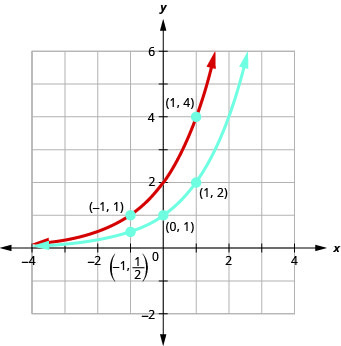

 Looking at the graphs of the functions
 $f\left(x\right)={2}^{x}$ and $g\left(x\right)={2}^{x+1}$ above, we see that adding one in the exponent caused a horizontal shift of one unit to the left. We can use this pattern to graph other functions using horizontal shifts.

On the same coordinate system graph $f\left(x\right)={3}^{x}$ and $g\left(x\right)={3}^{x}-2.$

We will use point plotting to graph the functions.

![This table has five rows and six columns. The first row is header row and reads x, f of x equals 3 to the x power, (x, f of x), g of x equals 3 to the x power minus 2, and (x, g of x). The second row reads negative 2, 3 to the negative 2 power equals 1 over 9, (negative 2, 1 over 9), 3 to the negative 2 power minus 2 equals 1 over 9 minus 2 which equals negative 17 over 9, (negative 2, negative 17 over 9). The third row reads negative 1, 3 to the negative 1 power equals 1 over 3, (negative 1, 1 over 3), 3 to the negative 1 power minus 2 equals 1 over 3 minus 2 which equals negative 5 over 3, (negative 1, negative 5 over 3). The fourth row reads 0, 3 to the 0 power equals 1, (0, 1), 3 to the 0 power minus 2 equals 1 minus 2 which equals negative 1, (0, negative 1). The fifth row reads 1, 3 to the 1 power equals 3, (1, 3), 3 to the 1 power minus 2 equals 3 minus 2 which equals 1, (1, 1). The sixth row reads 2, 3 squared equals 9, (2, 9), 3 squared minus 2 equals 9 minus 2 which equals 7, (2, 7).](../../media/CNX_IntAlg_Figure_10_02_010_img.jpg)

 Looking at the graphs of the functions $f\left(x\right)={3}^{x}$ and $g\left(x\right)={3}^{x}-2$, we see that subtracting 2 caused
vertical shift of down two units. Notice that the horizontal asymptote also shifted down 2 units. We can
use this pattern to help graph other functions with a vertical shift.

Practice Makes Perfect
======================

  On the same coordinate system graph $f\left(x\right)={3}^{x}$ and $g\left(x\right)={3}^{x-1}.$
  

  On the same coordinate system graph $f\left(x\right)={3}^{x}$ and $g\left(x\right)={3}^{x}+1.$
  

Objective 2: Function transformations (exponential). (CA 3.5.1-3.5.5)
=====================================================================
Vertical and Horizontal Shifts:
===============================
Given a function $f(x)$ , a new function $g(x)=f(x)+k$ where $k$ is a constant, is a **vertical shift** of the function $f(x)$. All the output values change by *k* units. If *k* is a positive, the graph will shift up. If *k* is negative, the graph will shift down.
Given a function $f(x)$ , a new function $g(x)=f(x-h)$ , where *h* is a constant, is a **horizontal shift** of the function $f(x)$ . If *h* is positive, the graph will shift right. If *h* is negative, the graph will shift left.
*Given a function and both a vertical and a horizontal shift, sketch the graph.*

Identify the vertical and horizontal shifts from the formula.
The vertical shift results from a constant added to the output. Move the graph up for a positive constant and down for a negative constant.
The horizontal shift results from a constant added to the input. Move the graph left for a positive constant and right for a negative constant.
Note the order of the shifts, transformations, and reflections follow the order of operations.
Function transformations (exponential).

  Graph $f\left(x\right)={3}^{x+2}-3$

  Make a table for $f\left(x\right)={3}^{x}$ 
Add a column on the left for $x+2$ , by subtracting 2 from all the input values
Add a column on the right by subtracting 3 from all the y-value
Two outside columns have the points for the new graph

  

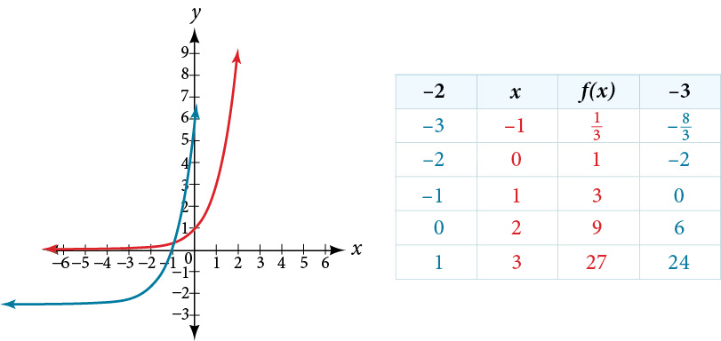

How To
   *Given a function, reflect the graph both vertically and horizontally.*

   Multiply all outputs by –1 for a vertical reflection. The new graph is a reflection of the original graph about the *x*-axis.
   Multiply all inputs by –1 for a horizontal reflection. The new graph is a reflection of the original graph about the *y*-axis.
 
Practice Makes Perfect
======================
Function transformations (exponential).

  Graph $f\left(x\right)={2}^{x-3}-1$

  

  ⓐ Given $f\left(x\right)={3}^{x}$ , reflect it about y-axis and write an equation of a new function below.
 ⓑ Given $f\left(x\right)={3}^{x}$ , reflect it about x-axis and write an
equation of a new function below.
 ⓒ Given $f\left(x\right)={3}^{x}$ , shift the graph up 4 units and write an
equation of a new function below.
 ⓓ Graph the equations found in parts a, b, and c on the coordinate system provided and check your work using a graphing utility.

As we discussed in the previous section, exponential functions are used for many real-world applications such as finance, forensics, computer science, and most of the life sciences. Working with an equation that describes a real-world situation gives us a method for making predictions. Most of the time, however, the equation itself is not enough. We learn a lot about things by seeing their pictorial representations, and that is exactly why graphing exponential equations is a powerful tool. It gives us another layer of insight for predicting future events.

Graphing Exponential Functions
==============================
Before we begin graphing, it is helpful to review the behavior of exponential growth. Recall the table of values for a function of the form $f(x)={b}^{x}$ whose base is greater than one. We’ll use the function $f(x)={2}^{x}.$ Observe how the output values in  change as the input increases by $1.$

*$x$*

 $-3$ 
 $-2$ 
 $-1$ 
 $0$ 
 $1$ 
 $2$ 
 $3$ 

*$f(x)={2}^{x}$*
 $\frac{1}{8}$ 
 $\frac{1}{4}$ 
 $\frac{1}{2}$ 
 $1$ 
 $2$ 
 $4$ 
 $8$ 

Each output value is the product of the previous output and the base, $2.$ We call the base $2$ the *constant ratio*. In fact, for any exponential function with the form $f(x)=a{b}^{x},$ $b$ is the constant ratio of the function. This means that as the input increases by 1, the output value will be the product of the base and the previous output, regardless of the value of $a.$
Notice from the table that

the output values are positive for all values of $x;$ 
as $x$ increases, the output values increase without bound; and
as $x$ decreases, the output values grow smaller, approaching zero.
shows the exponential growth function $f(x)={2}^{x}.$

\n\n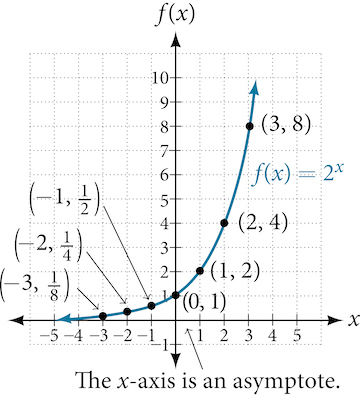\n\nThe domain of $f(x)={2}^{x}$ is all real numbers, the range is $\left(0,\infty \right),$ and the horizontal asymptote is $y=0.$
To get a sense of the behavior of **exponential decay**, we can create a table of values for a function of the form $f(x)={b}^{x}$ whose base is between zero and one. We’ll use the function $g(x)={\left(\frac{1}{2}\right)}^{x}.$ Observe how the output values in  change as the input increases by $1.$

*$x$*
 $-3$ 
 $-2$ 
 $-1$ 
 $0$ 
 $1$ 
 $2$ 
 $3$ 

 $g(x)=(\frac{1}{2}{)}^{x}$ 
 $8$ 
 $4$ 
 $2$ 
 $1$ 
 $\frac{1}{2}$ 
 $\frac{1}{4}$ 
 $\frac{1}{8}$ 

Again, because the input is increasing by 1, each output value is the product of the previous output and the base, or constant ratio $\frac{1}{2}.$

Notice from the table that

the output values are positive for all values of $x;$ 
as $x$ increases, the output values grow smaller, approaching zero; and
as $x$ decreases, the output values grow without bound.

shows the exponential decay function, $g(x)={\left(\frac{1}{2}\right)}^{x}.$

\n\n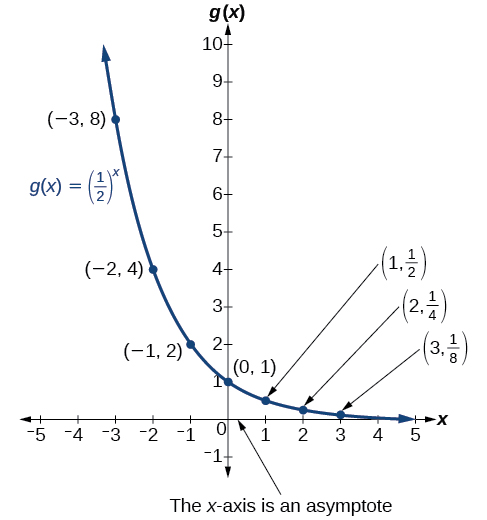\n\n

The domain of $g(x)={\left(\frac{1}{2}\right)}^{x}$ is all real numbers, the range is $\left(0,\infty \right),$ and the horizontal asymptote is $y=0.$

Characteristics of the Graph of the Parent Function $\phantom{\rule{0.5em}{0ex}}f(x)={b}^{x}$
=============================================================================================

An exponential function with the form $f(x)={b}^{x},$ $b>0,$ $b\ne 1,$ has these characteristics:

**one-to-one** function
horizontal asymptote: $y=0$ 
domain: $(\u2013\infty ,\ \infty )$ 
range: $(0,\infty )$ 
*x-*intercept: none
*y-*intercept: $\left(0,1\right)$ 
increasing if $b>1$ 
decreasing if $b<1$ 
compares the graphs of **exponential growth** and decay functions.

\n\n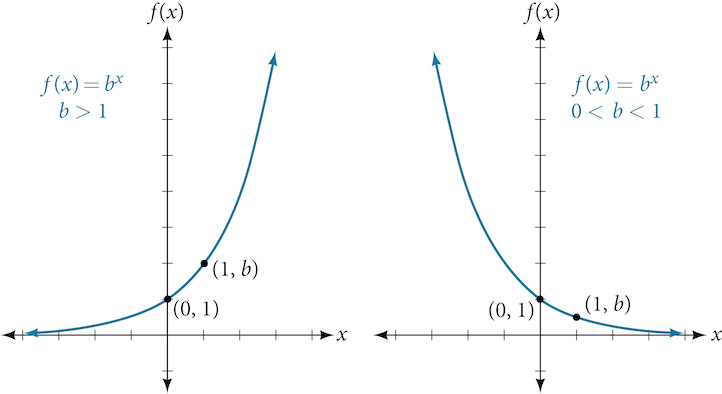\n\n
How To
*Given an exponential function of the form $f(x)={b}^{x},$ graph the function.*

Create a table of points.
Plot at least $3$ point from the table, including the *y*-intercept $\left(0,1\right).$ 
Draw a smooth curve through the points.
State the domain, $\left(-\infty ,\infty \right),$ the range, $\left(0,\infty \right),$ and the horizontal asymptote, $y=0.$ 

Sketching the Graph of an Exponential Function of the Form *f*(*x*) = *b**x*
============================================================================
Sketch a graph of $f(x)={0.25}^{x}.$ State the domain, range, and asymptote.

Before graphing, identify the behavior and create a table of points for the graph.

Since $b=0.25$ is between zero and one, we know the function is decreasing. The left tail of the graph will increase without bound, and the right tail will approach the asymptote $y=0.$ 
Create a table of points as in .

*$x$*
 $-3$ 
 $-2$ 
 $-1$ 
 $0$ 
 $1$ 
 $2$ 
 $3$ 

*$f(x)={0.25}^{x}$*
 $64$ 
 $16$ 
 $4$ 
 $1$ 
 $0.25$ 
 $0.0625$ 
 $0.015625$ 

Plot the *y*-intercept, $\left(0,1\right),$ along with two other points. We can use $\left(-1,4\right)$ and $\left(1,0.25\right).$ 
Draw a smooth curve connecting the points as in .

\n\n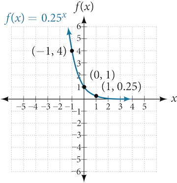\n\n

The domain is $\left(-\infty ,\infty \right);$ the range is $\left(0,\infty \right);$ the horizontal asymptote is $y=0.$

Try It

Sketch the graph of $f(x)={4}^{x}.$ State the domain, range, and asymptote.

The domain is $\left(-\infty ,\infty \right);$ the range is $\left(0,\infty \right);$ the horizontal asymptote is $y=0.$

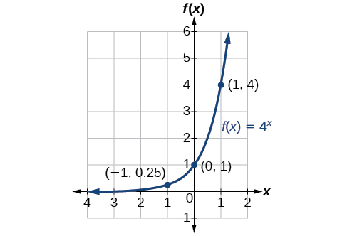

Graphing Transformations of Exponential Functions
=================================================

Transformations of exponential graphs behave similarly to those of other functions. Just as with other parent functions, we can apply the four types of transformations—shifts, reflections, stretches, and compressions—to the parent function $f(x)={b}^{x}$ without loss of shape. For instance, just as the quadratic function maintains its parabolic shape when shifted, reflected, stretched, or compressed, the exponential function also maintains its general shape regardless of the transformations applied.

Graphing a Vertical Shift
=========================
The first transformation occurs when we add a constant $d$ to the parent function $f(x)={b}^{x},$ giving us a **vertical shift** $d$ units in the same direction as the sign. For example, if we begin by graphing a parent function, $f(x)={2}^{x},$ we can then graph two vertical shifts alongside it, using $d=3:$ the upward shift, $g(x)={2}^{x}+3$ and the downward shift, $h(x)={2}^{x}-3.$ Both vertical shifts are shown in .
\n\n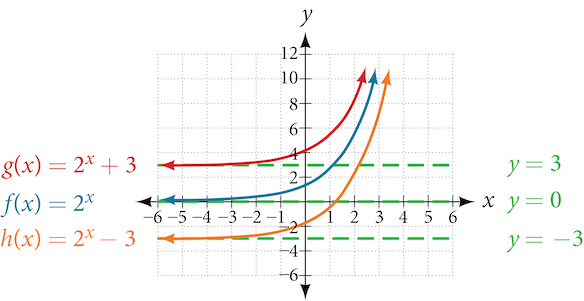\n\n

Observe the results of shifting $f(x)={2}^{x}$ vertically:

The domain, $\left(-\infty ,\infty \right)$ remains unchanged.
When the function is shifted up $3$ units to $g(x)={2}^{x}+3:$

The *y-*intercept shifts up $3$ units to $\left(0,4\right).$ 
The asymptote shifts up $3$ units to $y=3.$ 
The range becomes $\left(3,\infty \right).$ 

When the function is shifted down $3$ units to $h(x)={2}^{x}-3:$

The *y-*intercept shifts down $3$ units to $\left(0,-2\right).$ 
The asymptote also shifts down $3$ units to $y=-3.$ 
The range becomes $\left(-3,\infty \right).$ 

Graphing a Horizontal Shift
===========================

The next transformation occurs when we add a constant $c$ to the input of the parent function $f(x)={b}^{x},$ giving us a **horizontal shift** $c$ units in the *opposite* direction of the sign. For example, if we begin by graphing the parent function $f(x)={2}^{x},$ we can then graph two horizontal shifts alongside it, using $c=3:$ the shift left, $g(x)={2}^{x+3},$ and the shift right, $h(x)={2}^{x-3}.$ Both horizontal shifts are shown in .
\n\n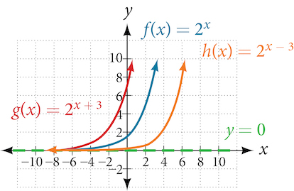\n\n

Observe the results of shifting $f(x)={2}^{x}$ horizontally:

The domain, $\left(-\infty ,\infty \right),$ remains unchanged.
The asymptote, $y=0,$ remains unchanged.
The *y-*intercept shifts such that:
When the function is shifted left $3$ units to $g(x)={2}^{x+3},$ the *y*-intercept becomes $\left(0,8\right).$ This is because ${2}^{x+3}=\left(8\right){2}^{x},$ so the initial value of the function is $8.$ 
When the function is shifted right $3$ units to $h(x)={2}^{x-3},$ the *y*-intercept becomes $\left(0,\frac{1}{8}\right).$ Again, see that ${2}^{x-3}=\left(\frac{1}{8}\right){2}^{x},$ so the initial value of the function is $\frac{1}{8}.$ 

Shifts of the Parent Function *f*(*x*) = *b**x*
===============================================

For any constants $c$ and $d,$ the function $f(x)={b}^{x+c}+d$ shifts the parent function $f(x)={b}^{x}$

vertically $d$ units, in the *same* direction of the sign of $d.$ 
horizontally $c$ units, in the *opposite* direction of the sign of $c.$ 
The *y*-intercept becomes $\left(0,{b}^{c}+d\right).$ 
The horizontal asymptote becomes $y=d.$ 
The range becomes $\left(d,\infty \right).$ 
The domain, $\left(-\infty ,\infty \right),$ remains unchanged.

How To
*Given an exponential function with the form $f(x)={b}^{x+c}+d,$ graph the translation.*

Draw the horizontal asymptote $y=d.$ 
Identify the shift as $\left(-c,d\right).$ Shift the graph of $f(x)={b}^{x}$ left $c$ units if $c$ is positive, and right $c$ units if $c$ is negative.
Shift the graph of $f(x)={b}^{x}$ up $d$ units if $d$ is positive, and down $d$ units if $d$ is negative.
State the domain, $\left(-\infty ,\infty \right),$ the range, $\left(d,\infty \right),$ and the horizontal asymptote $y=d.$ 

Graphing a Shift of an Exponential Function
===========================================

Graph $f(x)={2}^{x+1}-3.$ State the domain, range, and asymptote.

We have an exponential equation of the form $f(x)={b}^{x+c}+d,$ with $b=2,$ $c=1,$ and $d=-3.$
Draw the horizontal asymptote $y=d$ , so draw $y=\mathrm{-3.}$
Identify the shift as $\left(-c,d\right),$ so the shift is $\left(-1,\mathrm{-3}\right).$
Shift the graph of $f(x)={b}^{x}$ left 1 units and down 3 units.

\n\n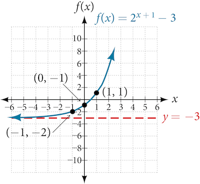\n\n

The domain is $\left(-\infty ,\infty \right);$ the range is $\left(-3,\infty \right);$ the horizontal asymptote is $y=\mathrm{-3.}$

Try It

Graph $f(x)={2}^{x-1}+3.$ State domain, range, and asymptote.

The domain is $\left(-\infty ,\infty \right);$ the range is $\left(3,\infty \right);$ the horizontal asymptote is $y=3.$

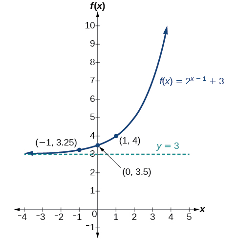

How To
*Given an equation of the form $f(x)={b}^{x+c}+d$ for $x,$ use a graphing calculator to approximate the solution.*

Press *[Y=]*. Enter the given exponential equation in the line headed “*Y1=*”.
Enter the given value for $f(x)$ in the line headed “*Y2=*”.
Press *[WINDOW]*. Adjust the *y*-axis so that it includes the value entered for “*Y2=*”.
Press *[GRAPH]* to observe the graph of the exponential function along with the line for the specified value of $f(x).$ 
To find the value of $x,$ we compute the point of intersection. Press *[2ND]*then *[CALC]*. Select “intersect” and press *[ENTER]* three times. The point of intersection gives the value of *x*for the indicated value of the function.

Approximating the Solution of an Exponential Equation
=====================================================

Solve $42=1.2{\left(5\right)}^{x}+2.8$ graphically. Round to the nearest thousandth.

Press *[Y=]* and enter $1.2{\left(5\right)}^{x}+2.8$ next to *Y1*=. Then enter 42 next to *Y2=*. For a window, use the values –3 to 3 for $x$ and –5 to 55 for $y.$ Press *[GRAPH]*. The graphs should intersect somewhere near $x=2.$

For a better approximation, press *[2ND]*then *[CALC]*. Select *[5: intersect]* and press *[ENTER]* three times. The *x*-coordinate of the point of intersection is displayed as 2.1661943. (Your answer may be different if you use a different window or use a different value for *Guess?*) To the nearest thousandth, $x\approx \mathrm{2.166.}$

Try It

Solve $4=7.85{\left(1.15\right)}^{x}-2.27$ graphically. Round to the nearest thousandth.

$x\approx -1.608$

Graphing a Stretch or Compression
=================================

While horizontal and vertical shifts involve adding constants to the input or to the function itself, a **stretch** or **compression** occurs when we multiply the parent function $f(x)={b}^{x}$ by a constant $\left|a\right|>0.$ For example, if we begin by graphing the parent function $f(x)={2}^{x},$ we can then graph the stretch, using $a=3,$ to get $g(x)=3{\left(2\right)}^{x}$ as shown on the left in , and the compression, using $a=\frac{1}{3},$ to get $h(x)=\frac{1}{3}{\left(2\right)}^{x}$ as shown on the right in .

\n\n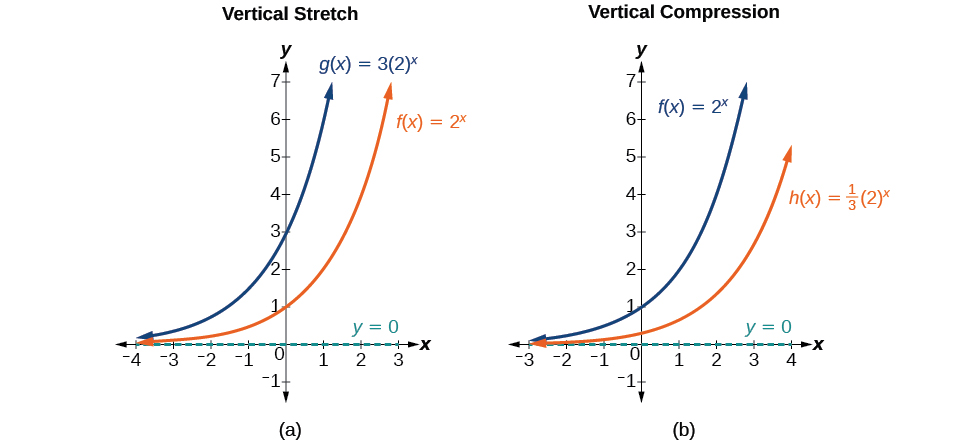\n\n

Stretches and Compressions of the Parent Function $\phantom{\rule{0.5em}{0ex}}f(x)={b}^{x}$
===========================================================================================

For any factor $a>0,$ the function $f(x)=a{\left(b\right)}^{x}$

is stretched vertically by a factor of $a$ if $\left|a\right|>1.$ 
is compressed vertically by a factor of $a$ if $\left|a\right|<1.$ 
has a *y*-intercept of $\left(0,a\right).$ 
has a horizontal asymptote at $y=0,$ a range of $\left(0,\infty \right),$ and a domain of $\left(-\infty ,\infty \right),$ which are unchanged from the parent function.

Graphing the Stretch of an Exponential Function
===============================================
Sketch a graph of $f(x)=4{\left(\frac{1}{2}\right)}^{x}.$ State the domain, range, and asymptote.

Before graphing, identify the behavior and key points on the graph.

Since $b=\frac{1}{2}$ is between zero and one, the left tail of the graph will increase without bound as $x$ decreases, and the right tail will approach the *x*-axis as $x$ increases.
Since $a=4,$ the graph of $f(x)={\left(\frac{1}{2}\right)}^{x}$ will be stretched by a factor of $4.$ 
Create a table of points as shown in .

*$x$*
 $-3$ 
 $-2$ 
 $-1$ 
 $0$ 
 $1$ 
 $2$ 
 $3$ 

 $$
f(x)=4(\frac{1}{2}{)}^{x}
$$ 
 $32$ 
 $16$ 
 $8$ 
 $4$ 
 $2$ 
 $1$ 
 $0.5$ 

Plot the *y-*intercept, $\left(0,4\right),$ along with two other points. We can use $\left(-1,8\right)$ and $\left(1,2\right).$ 
Draw a smooth curve connecting the points, as shown in .

\n\n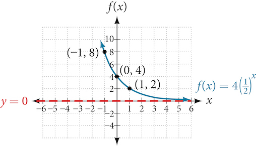\n\n

The domain is $\left(-\infty ,\infty \right);$ the range is $\left(0,\infty \right);$ the horizontal asymptote is $y=0.$

Try It

Sketch the graph of $f(x)=\frac{1}{2}{\left(4\right)}^{x}.$ State the domain, range, and asymptote.

The domain is $\left(-\infty ,\infty \right);$ the range is $\left(0,\infty \right);$ the horizontal asymptote is $y=0.$

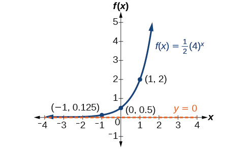

Graphing Reflections
====================

In addition to shifting, compressing, and stretching a graph, we can also reflect it about the *x*-axis or the *y*-axis. When we multiply the parent function $f(x)={b}^{x}$ by $\mathrm{-1},$ we get a reflection about the *x*-axis. When we multiply the input by $\mathrm{-1},$ we get a **reflection** about the *y*-axis. For example, if we begin by graphing the parent function $f(x)={2}^{x},$ we can then graph the two reflections alongside it. The reflection about the *x*-axis, $g(x)={\mathrm{-2}}^{x},$ is shown on the left side of , and the reflection about the *y*-axis $h(x)={2}^{-x},$ is shown on the right side of .
\n\n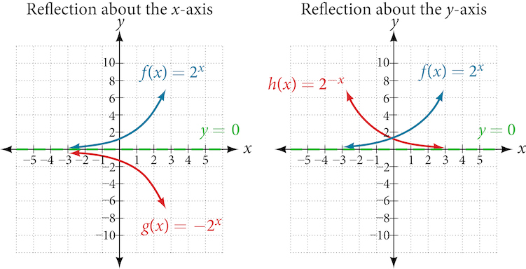\n\n

Reflections of the Parent Function $\phantom{\rule{0.5em}{0ex}}f(x)={b}^{x}$
============================================================================

The function $f(x)=-{b}^{x}$

reflects the parent function $f(x)={b}^{x}$ about the *x*-axis.
has a *y*-intercept of $\left(0,-1\right).$ 
has a range of $\left(-\infty ,0\right).$ 
has a horizontal asymptote at $y=0$ and domain of $\left(-\infty ,\infty \right),$ which are unchanged from the parent function.
The function $f(x)={b}^{-x}$

reflects the parent function $f(x)={b}^{x}$ about the *y*-axis.
has a *y*-intercept of $\left(0,1\right),$ a horizontal asymptote at $y=0,$ a range of $\left(0,\infty \right),$ and a domain of $\left(-\infty ,\infty \right),$ which are unchanged from the parent function.

Writing and Graphing the Reflection of an Exponential Function
==============================================================

Find and graph the equation for a function, $g(x),$ that reflects $f(x)={\left(\frac{1}{4}\right)}^{x}$ about the *x*-axis. State its domain, range, and asymptote.

Since we want to reflect the parent function $f(x)={\left(\frac{1}{4}\right)}^{x}$ about the *x-*axis, we multiply $f(x)$ by $-1$ to get, $g(x)=-{\left(\frac{1}{4}\right)}^{x}.$ Next we create a table of points as in .

*$x$*
 $-3$ 
 $-2$ 
 $-1$ 
 $0$ 
 $1$ 
 $2$ 
 $3$ 

 $$
g(x)=-(\frac{1}{4}{)}^{x}
$$ 
 $-64$ 
 $-16$ 
 $-4$ 
 $-1$ 
 $-0.25$ 
 $-0.0625$ 
 $-0.0156$ 

Plot the *y-*intercept, $\left(0,\mathrm{-1}\right),$ along with two other points. We can use $\left(\mathrm{-1},\mathrm{-4}\right)$ and $\left(1,\mathrm{-0.25}\right).$

Draw a smooth curve connecting the points:

\n\n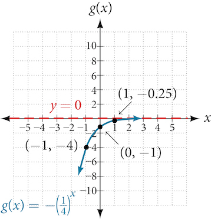\n\n

The domain is $\left(-\infty ,\infty \right);$ the range is $\left(-\infty ,0\right);$ the horizontal asymptote is $y=0.$

Try It

Find and graph the equation for a function, $g(x),$ that reflects $f(x)={1.25}^{x}$ about the *y*-axis. State its domain, range, and asymptote.

The domain is $\left(-\infty ,\infty \right);$ the range is $\left(0,\infty \right);$ the horizontal asymptote is $y=0.$

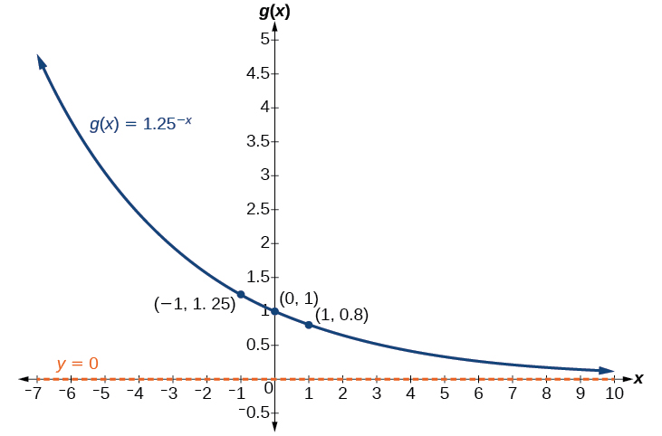

Summarizing Translations of the Exponential Function
====================================================

Now that we have worked with each type of translation for the exponential function, we can summarize them in  to arrive at the general equation for translating exponential functions.

Transformations of the Parent Function $f(x)={b}^{x}$ 

Transformation
Form

Shift
Horizontally $c$ units to the left
Vertically $d$ units up

 $$
f(x)={b}^{x+c}+d
$$ 

Stretch and Compress
Stretch if $\left|a\right|>1$ 
Compression if $0<\left|a\right|<1$ 

 $$
f(x)=a{b}^{x}
$$ 

Reflect about the *x*-axis
 $$
f(x)=-{b}^{x}
$$ 

Reflect about the *y*-axis
 $$
f(x)={b}^{-x}={\left(\frac{1}{b}\right)}^{x}
$$ 

General equation for all transformations
 $$
f(x)=a{b}^{x+c}+d
$$ 

Translations of Exponential Functions
=====================================

A translation of an exponential function has the form

$\ f(x)=a{b}^{x+c}+d$ 

Where the parent function, $y={b}^{x},$ $b>1,$ is

shifted horizontally $c$ units to the left.
stretched vertically by a factor of $\left|a\right|$ if $\left|a\right|>0.$ 
compressed vertically by a factor of $\left|a\right|$ if $0<\left|a\right|<1.$ 
shifted vertically $d$ units.
reflected about the *x-*axis when $a<0.$ 

Note the order of the shifts, transformations, and reflections follow the order of operations.

Writing a Function from a Description
=====================================
Write the equation for the function described below. Give the horizontal asymptote, the domain, and the range.

 $f(x)={e}^{x}$ is vertically stretched by a factor of $2$ , reflected across the *y*-axis, and then shifted up $4$ units.

We want to find an equation of the general form $\ \phantom{\rule{0.5em}{0ex}}f(x)=a{b}^{x+c}+d.$ We use the description provided to find $a,$ $b,$ $c,$ and $d.$
We are given the parent function $f(x)={e}^{x},$ so $b=e.$ 
The function is stretched by a factor of $2$ , so $a=2.$ 
The function is reflected about the *y*-axis. We replace $x$ with $-x$ to get: ${e}^{-x}.$ 
The graph is shifted vertically 4 units, so $d=4.$ 
Substituting in the general form we get,

 $$
\begin{array}{ll}\ f(x)\hfill & =a{b}^{x+c}+d\hfill \\ \hfill & =2{e}^{-x+0}+4\hfill \\ \hfill & =2{e}^{-x}+4\hfill \end{array}
$$ The domain is $\left(-\infty ,\infty \right);$ the range is $\left(4,\infty \right);$ the horizontal asymptote is $y=4.$

Try It

Write the equation for function described below. Give the horizontal asymptote, the domain, and the range.

 $f(x)={e}^{x}$ is compressed vertically by a factor of $\frac{1}{3},$ reflected across the *x*-axis and then shifted down $2$ units.

$f(x)=-\frac{1}{3}{e}^{x}-2;$ the domain is $\left(-\infty ,\infty \right);$ the range is $\left(-\infty ,\mathrm{-2}\right);$ the horizontal asymptote is $y=\mathrm{-2.}$

Media
Access this online resource for additional instruction and practice with graphing exponential functions.

Graph Exponential Functions

Key Equations
=============

General Form for the Translation of the Parent Function  $\text{}f(x)={b}^{x}$ 
 $f(x)=a{b}^{x+c}+d$ 

Key Concepts
============

The graph of the function $f(x)={b}^{x}$ has a *y-*intercept at $\left(0,\ 1\right),$ domain $\left(-\infty ,\ \infty \right),$ range $\left(0,\ \infty \right),$ and horizontal asymptote $y=0.$ See .
If $b>1,$ the function is increasing. The left tail of the graph will approach the asymptote $y=0,$ and the right tail will increase without bound.
If $0<b<1,$ the function is decreasing. The left tail of the graph will increase without bound, and the right tail will approach the asymptote $y=0.$ 
The equation $f(x)={b}^{x}+d$ represents a vertical shift of the parent function $f(x)={b}^{x}.$ 
The equation $f(x)={b}^{x+c}$ represents a horizontal shift of the parent function $f(x)={b}^{x}.$ See .
Approximate solutions of the equation $f(x)={b}^{x+c}+d$ can be found using a graphing calculator. See .
The equation $f(x)=a{b}^{x},$ where $a>0,$ represents a vertical stretch if $\left|a\right|>1$ or compression if $0<\left|a\right|<1$ of the parent function $f(x)={b}^{x}.$ See .
When the parent function $f(x)={b}^{x}$ is multiplied by $-1,$ the result, $f(x)=-{b}^{x},$ is a reflection about the  *x*-axis. When the input is multiplied by $-1,$ the result, $f(x)={b}^{-x},$ is a reflection about the *y*-axis. See .
All translations of the exponential function can be summarized by the general equation $f(x)=a{b}^{x+c}+d.$ See .
Using the general equation $f(x)=a{b}^{x+c}+d,$ we can write the equation of a function given its description. See .

Section Exercises
=================

Verbal
======

What role does the horizontal asymptote of an exponential function play in telling us about the end behavior of the graph?

An asymptote is a line that the graph of a function approaches, as $x$ either increases or decreases without bound. The horizontal asymptote of an exponential function tells us the limit of the function’s values as the independent variable gets either extremely large or extremely small.

What is the advantage of knowing how to recognize transformations of the graph of a parent function algebraically?

Algebraic
=========

The graph of $f(x)={3}^{x}$ is reflected about the *y*-axis and stretched vertically by a factor of $4.$ What is the equation of the new function, $g(x)?$ State its *y*-intercept, domain, and range.

$g(x)=4{\left(3\right)}^{-x};$ *y*-intercept: $(0,4);$ Domain: all real numbers; Range: all real numbers greater than $0.$

The graph of $f(x)={\left(\frac{1}{2}\right)}^{-x}$ is reflected about the *y*-axis and compressed vertically by a factor of $\frac{1}{5}.$ What is the equation of the new function, $g(x)?$ State its *y*-intercept, domain, and range.

The graph of $f(x)={10}^{x}$ is reflected about the *x*-axis and shifted upward $7$ units. What is the equation of the new function, $g(x)?$ State its *y*-intercept, domain, and range.

$g(x)=-{10}^{x}+7;$ *y*-intercept: $\left(0,6\right);$ Domain: all real numbers; Range: all real numbers less than $7.$

The graph of $f(x)={\left(1.68\right)}^{x}$ is shifted right $3$ units, stretched vertically by a factor of $2,$ reflected about the *x*-axis, and then shifted downward $3$ units. What is the equation of the new function, $g(x)?$ State its *y*-intercept (to the nearest thousandth), domain, and range.

The graph of $f\left(x\right)=-\frac{1}{2}{\left(\frac{1}{4}\right)}^{x-2}+4$
is shifted downward $4$ units, and then shifted left $2$ units, stretched vertically by a factor of $4,$ and reflected about the *x*-axis. What is the equation of the new function, $g(x)?$ State its *y*-intercept, domain, and range.

$g(x)=2{\left(\frac{1}{4}\right)}^{x};$ *y*-intercept: $\left(0,\phantom{\rule{0.5em}{0ex}}\text{2}\right);$ Domain: all real numbers; Range: all real numbers greater than $0.$

Graphical
=========
For the following exercises, graph the function and its reflection about the *y*-axis on the same axes, and give the *y*-intercept.

$f(x)=3{\left(\frac{1}{2}\right)}^{x}$

$g(x)=-2{\left(0.25\right)}^{x}$

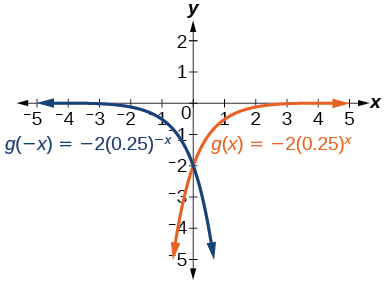

*y*-intercept: $(0,-2)$

$h(x)=6{\left(1.75\right)}^{-x}$

For the following exercises, graph each set of functions on the same axes.

$f(x)=3{\left(\frac{1}{4}\right)}^{x},$ $g(x)=3{\left(2\right)}^{x},$ and $h(x)=3{\left(4\right)}^{x}$

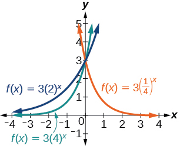

$f(x)=\frac{1}{4}{\left(3\right)}^{x},$ $g(x)=2{\left(3\right)}^{x},$ and $h(x)=4{\left(3\right)}^{x}$

For the following exercises, match each function with one of the graphs in .

\n\n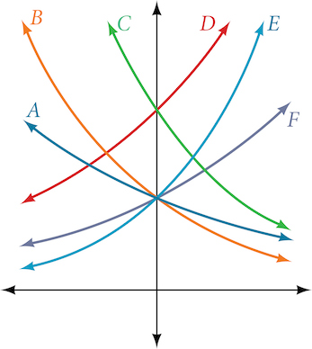\n\n

$f\left(x\right)=2{\left(0.69\right)}^{x}$

B

$f\left(x\right)=2{\left(1.28\right)}^{x}$

$f\left(x\right)=2{\left(0.81\right)}^{x}$

A

$f\left(x\right)=4{\left(1.28\right)}^{x}$

$f\left(x\right)=2{\left(1.59\right)}^{x}$

E

$f\left(x\right)=4{\left(0.69\right)}^{x}$

For the following exercises, use the graphs shown in . All have the form $f\left(x\right)=a{b}^{x}.$

\n\n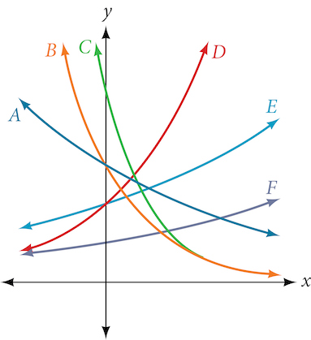\n\n

Which graph has the largest value for $b?$

D

Which graph has the smallest value for $b?$

Which graph has the largest value for $a?$

C

Which graph has the smallest value for $a?$

For the following exercises, graph the function and its reflection about the *x*-axis on the same axes.

$f(x)=\frac{1}{2}{\left(4\right)}^{x}$

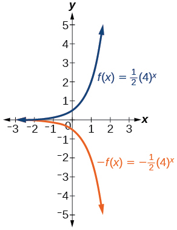

$f(x)=3{\left(0.75\right)}^{x}-1$

$f(x)=-4{\left(2\right)}^{x}+2$

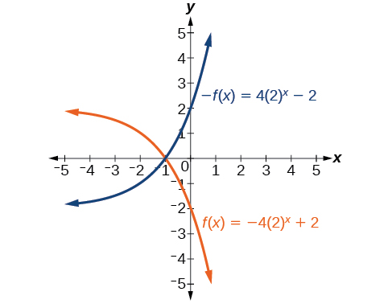

For the following exercises, graph the transformation of $f(x)={2}^{x}.$ Give the horizontal asymptote, the domain, and the range.

$f\left(x\right)={2}^{-x}$

$h\left(x\right)={2}^{x}+3$

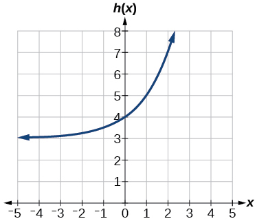

Horizontal asymptote:  $h(x)=3;$ Domain: all real numbers; Range: all real numbers strictly greater than  $3.$

$f\left(x\right)={2}^{x-2}$

For the following exercises, describe the end behavior of the graphs of the functions.

$f\left(x\right)=-5{\left(4\right)}^{x}-1$

As $x\to \infty$ ,
 $f\left(x\right)\to -\infty$ ;
As
 $x\to -\infty$ ,
 $f\left(x\right)\to -1$

$f\left(x\right)=3{\left(\frac{1}{2}\right)}^{x}-2$

$f\left(x\right)=3{\left(4\right)}^{-x}+2$

As $x\to \infty$ ,
 $f\left(x\right)\to 2$ ;
As $x\to -\infty$ ,
 $f\left(x\right)\to \infty$

For the following exercises, start with the graph of $f\left(x\right)={4}^{x}.$ Then write a function that results from the given transformation.

Shift $f(x)$ 4 units upward

Shift $f(x)$ 3 units downward

$f\left(x\right)={4}^{x}-3$

Shift $f(x)$ 2 units left

Shift $f(x)$ 5 units right

$f(x)={4}^{x-5}$

Reflect $f(x)$ about the *x*-axis

Reflect $f(x)$ about the *y*-axis

$f\left(x\right)={4}^{-x}$

For the following exercises, each graph is a transformation of  $y={2}^{x}.$ 
 Write an equation describing the transformation.

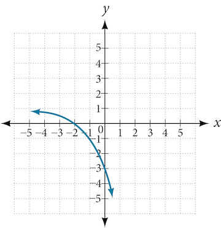

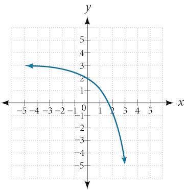

$y=-{2}^{x}+3$

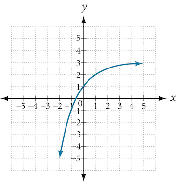

For the following exercises, find an exponential equation for the graph.

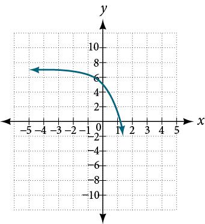

$y=-2{\left(3\right)}^{x}+7$

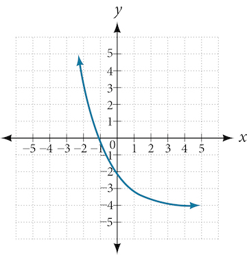

Numeric
=======

For the following exercises, evaluate the exponential functions for the indicated value of $x.$

$g(x)=\frac{1}{3}{\left(7\right)}^{x-2}$ for $g(6).$

$g(6)=800+\frac{1}{3}\approx 800.3333$

$f(x)=4{(2)}^{x-1}-2$ for $f(5).$

$h(x)=-\frac{1}{2}{\left(\frac{1}{2}\right)}^{x}+6$ for $h(-7).$

$h(-7)=-58$

Technology
==========

For the following exercises, use a graphing calculator to approximate the solutions of the equation. Round to the nearest thousandth.

$-50=-{\left(\frac{1}{2}\right)}^{-x}$

$116=\frac{1}{4}{\left(\frac{1}{8}\right)}^{x}$

$x\approx -2.953$

$12=2{\left(3\right)}^{x}+1$

$5=3{\left(\frac{1}{2}\right)}^{x-1}-2$

$x\approx -0.222$

$-30=-4{\left(2\right)}^{x+2}+2$

Extensions
==========

Explore and discuss the graphs of $F(x)={\left(b\right)}^{x}$ and $G(x)={\left(\frac{1}{b}\right)}^{x}.$ Then make a conjecture about the relationship between the graphs of the functions ${b}^{x}$ and ${\left(\frac{1}{b}\right)}^{x}$ for any real number $b>0.$

The graph of $G(x)={\left(\frac{1}{b}\right)}^{x}$ is the refelction about the *y*-axis of the graph of $F(x)={b}^{x};$ For any real number $b>0$ and function $f(x)={b}^{x},$ the graph of ${\left(\frac{1}{b}\right)}^{x}$ is the the reflection about the *y*-axis, $F(-x).$

Prove the conjecture made in the previous exercise.

Explore and discuss the graphs of $f(x)={4}^{x},$ $g(x)={4}^{x-2},$ and $h(x)=\left(\frac{1}{16}\right){4}^{x}.$ Then make a conjecture about the relationship between the graphs of the functions ${b}^{x}$ and $\left(\frac{1}{{b}^{n}}\right){b}^{x}$ for any real number *n*and real number $b>0.$

The graphs of $g(x)$ and $h(x)$ are the same and are a horizontal shift to the right of the graph of $f(x);$ For any real number *n*, real number $b>0,$ and function $f(x)={b}^{x},$ the graph of $\left(\frac{1}{{b}^{n}}\right){b}^{x}$ is the horizontal shift $f(x-n).$

Prove the conjecture made in the previous exercise.
