Graphs of Logarithmic Functions
===============================

  m49364
  
Graphs of Logarithmic Functions
===============================

  In this section, you will:

Identify the domain of a logarithmic function.
Graph logarithmic functions.

  44418435-ed46-454a-aba4-cd57f5266654

   
Learning Objectives
===================

   Find the domain and range of a relation and a function. (IA 3.5.1)
Graph Logarithmic functions. (IA 10.3.3)
Objective 1: Find the domain and range of a relation and a function. (IA 3.5.1)
===============================================================================

Vocabulary
==========
Fill in the blanks: 
The **domain** of a releation or a function is ________.
The **range** of a releation or a function is ________.Find the domain and range of a relation and a function.

          ⓐ
  

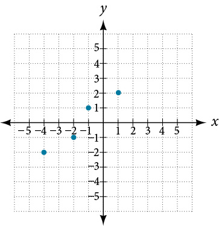

          ⓑ
 

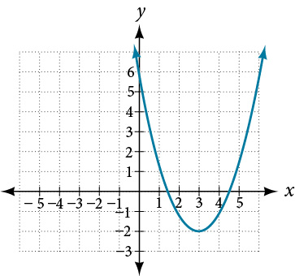

     
          ⓒ
  Find the domain of the function $f\left(x\right)=\frac{5}{x-2}$

     
     
          ⓓ
  Find the domain of the function $f\left(x\right)={\mathrm{log}}_{2}(x-5)$ .

ⓐ The set of points on the graph is $\left\{\right(-4,-2),(-2,-1),(-1,1),(1,2\left)\right\}$ 
The Domain is the set of all x-coordinates: $\{-4,-2,-1,1\}$ 
The Range is the set of all y-coordinates: $\{-2,-1,1\}$ 
*Notice* that even though y-coodinate of 1 appears twice, we only list it once.

 ⓑ Domain: $(-\infty ,\infty )$ 
Range: $[-2,\infty )$ 

*Notice* that $-2$ is included because the point $(3,-2)$ is on the graph of a function.

 ⓒ A function is not defined when the denominator is zero. We need to set the denominator equal zero and exclude this value(s) from the domain. 
 $x-2=0,x=2,$ Domain $(-\infty ,2)\cup (2,\infty )$ 
*Notice* that 2 is excluded from the domain because the function is not defined at $x=2$

 ⓓ From the definition of the logarithmic function $f\left(x\right)={\mathrm{log}}_{a}x$ we know that $x>0$ 
To find domain of $f\left(x\right)={\mathrm{log}}_{2}(x-5$ , we need to set up and solve inequality.
 $x-5>0$ , $x>5)$ Domain: $(5,\infty )$

Practice Makes Perfect
======================
Find the domain and range of a relation and a function.

  Find the domain and range of a relation.

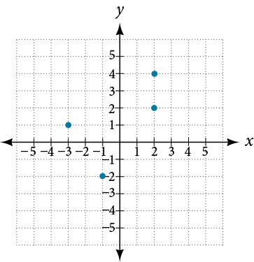

  Find the domain and the range of the function graphed. Use interval notation.

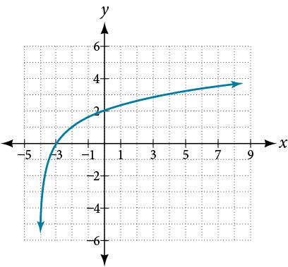

  Find the domain of the function $f\left(x\right)={\mathrm{log}}_{2}(x+4)$ . Notice: this is the same function that was graphed in question 2.

Objective 2: Graph Logarithmic functions. (IA 10.3.3)
=====================================================
To graph a logarithmic function $y={\mathrm{log}}_{a}x\$ , it is easiest to convert the equation to its exponential form, $x={a}^{y}$ . Generally, when we look for ordered pairs for the graph of a function, we usually choose an x-value and then determine its corresponding y-value. In this case you may find it easier to choose y-values and then determine its corresponding x-value.
Graph Logarithmic functions.

Graph $y={\text{log}}_{2}x.$

To graph the function, we will first rewrite the logarithmic equation, $y={\text{log}}_{2}x,$ in exponential form, ${2}^{y}=x.$

We will use point plotting to graph the function. It will be easier to start with values of *y* and then get *x*.

 $y$ 
 ${2}^{y}=x$ 
 $\left(x,y\right)$ 

 $\mathrm{-2}$ 
 ${2}^{\mathrm{-2}}=\frac{1}{{2}^{2}}=\frac{1}{4}$ 
 $\left(\frac{1}{4},2\right)$ 

 $\mathrm{-1}$ 
 ${2}^{\mathrm{-1}}=\frac{1}{{2}^{1}}=\frac{1}{2}$ 
 $\left(\frac{1}{2},\mathrm{-1}\right)$ 

0
 ${2}^{0}=1$ 
 $\left(1,0\right)$ 

1
 ${2}^{1}=2$ 
 $\left(2,1\right)$ 

2
 ${2}^{2}=4$ 
 $\left(4,2\right)$ 

3
 ${2}^{3}=8$ 
 $\left(8,3\right)$ 

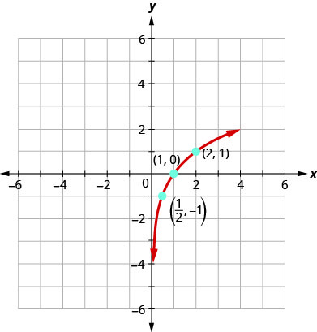

Practice Makes Perfect
======================
Graph Logarithmic functions

  Graph $y={\text{log}}_{3}x$ and $y={\text{log}}_{5}x$ in the same coordinate system. 

 $y$ 
 ${3}^{y}=x$ 
 $(x,y)$ 

  

  

  

  

  

  

  
  
     $y$ 
     ${5}^{y}=x$ 
     $(x,y)$ 
  
  
  
  
  
  
  
  
  
  
  
  

  
  

  
  

  
  

  
  

  

  Graph $y={\mathrm{log}}_{1/3}x\$

 $y$ 
 ${\left(\frac{1}{3}\right)}^{y}=x$ 
 $(x,y)$ 

  

  

  

  

  

  

  
  

  

  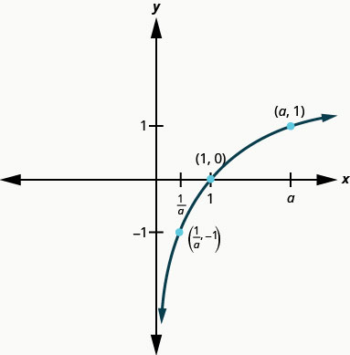

Do the graphs of $y={\mathrm{log}}_{2}x$ , $y={\mathrm{log}}_{3}x$ , and $y={\mathrm{log}}_{5}x$ have the shape we expect from a logarithmic function where $a>0$ ? (Remember a is the base of the log function)

  Is there a point they all share? Why does this make sense?

  Do they all have a point $(a,1)$ ? Why does this make sense?

  Do they all have a point $(\frac{1}{a},-1)$ ? Why does this make sense?

  Do they all have the same vertical asymptote? What is the equation of the vertical asymptote?

  Do they all have the same domain? Write the domain in the interval notation.

  Do they all have the same range? Write the range in the interval notation.

In Graphs of Exponential Functions, we saw how creating a graphical representation of an exponential model gives us another layer of insight for predicting future events. How do logarithmic graphs give us insight into situations? Because every logarithmic function is the inverse function of an exponential function, we can think of every output on a logarithmic graph as the input for the corresponding inverse exponential equation. In other words, logarithms give the *cause* for an *effect*.
To illustrate, suppose we invest $\text{\$}2500$ in an account that offers an annual interest rate of $5\%,$ compounded continuously. We already know that the balance in our account for any year $t$ can be found with the equation $A=2500{e}^{0.05t}.$
But what if we wanted to know the year for any balance? We would need to create a corresponding new function by interchanging the input and the output; thus we would need to create a logarithmic model for this situation. By graphing the model, we can see the output (year) for any input (account balance). For instance, what if we wanted to know how many years it would take for our initial investment to double?  shows this point on the logarithmic graph.

\n\n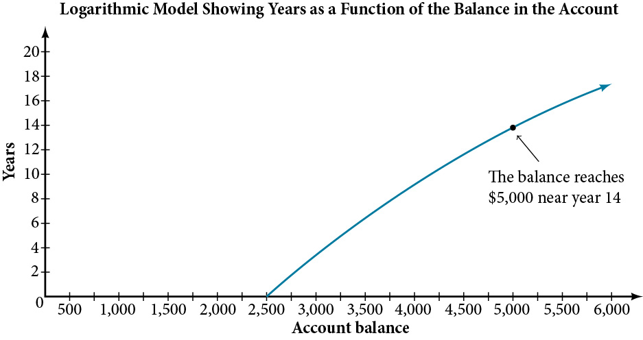\n\n

In this section we will discuss the values for which a logarithmic function is defined, and then turn our attention to graphing the family of logarithmic functions.

Finding the Domain of a Logarithmic Function
============================================

Before working with graphs, we will take a look at the domain (the set of input values) for which the logarithmic function is defined.

Recall that the exponential function is defined as $y={b}^{x}$ for any real number $x$ and constant $b>0,$ $b\ne 1,$ where

The domain of $y$ is $\left(-\infty ,\infty \right).$ 
The range of $y$ is $\left(0,\infty \right).$ 

In the last section we learned that the logarithmic function $y={\mathrm{log}}_{b}\left(x\right)$ is the inverse of the exponential function $y={b}^{x}.$ So, as inverse functions:

The domain of $y={\mathrm{log}}_{b}\left(x\right)$ is the range of $y={b}^{x}:$ $\left(0,\infty \right).$ 
The range of $y={\mathrm{log}}_{b}\left(x\right)$ is the domain of $y={b}^{x}:$ $\left(-\infty ,\infty \right).$ 

Transformations of the parent function $y={\mathrm{log}}_{b}\left(x\right)$ behave similarly to those of other functions. Just as with other parent functions, we can apply the four types of transformations—shifts, stretches, compressions, and reflections.

In Graphs of Exponential Functions we saw that certain transformations can change the *range* of $y={b}^{x}.$ Similarly, applying transformations to the parent function $y={\mathrm{log}}_{b}\left(x\right)$ can change the *domain*. When finding the domain of a logarithmic function, therefore, it is important to remember that the domain consists *only of positive real numbers*. That is, the argument of the logarithmic function must be greater than zero.
For example, consider $f(x)={\mathrm{log}}_{4}\left(2x-3\right).$ This function is defined for any values of $x$ such that the argument, in this case $2x-3,$ is greater than zero. To find the domain, we set up an inequality and solve for $x:$
 $\begin{array}{ll}2x-3>0\hfill & \text{Show\ the\ argument\ greater\ than\ zero}.\hfill \\ \phantom{\rule{0.5em}{0ex}}\phantom{\rule{0.5em}{0ex}}\phantom{\rule{0.5em}{0ex}}\phantom{\rule{0.5em}{0ex}}\phantom{\rule{0.5em}{0ex}}\phantom{\rule{0.5em}{0ex}}\phantom{\rule{0.5em}{0ex}}\phantom{\rule{0.5em}{0ex}}\phantom{\rule{0.5em}{0ex}}\phantom{\rule{0.5em}{0ex}}2x>3\hfill & \text{Add\ 3}.\hfill \\ \phantom{\rule{0.5em}{0ex}}\phantom{\rule{0.5em}{0ex}}\phantom{\rule{0.5em}{0ex}}\phantom{\rule{0.5em}{0ex}}\phantom{\rule{0.5em}{0ex}}\phantom{\rule{0.5em}{0ex}}\phantom{\rule{0.5em}{0ex}}\phantom{\rule{0.5em}{0ex}}\phantom{\rule{0.5em}{0ex}}\phantom{\rule{0.5em}{0ex}}\phantom{\rule{0.5em}{0ex}}\phantom{\rule{0.5em}{0ex}}\phantom{\rule{0.5em}{0ex}}x>1.5\begin{array}{cccc}& & & \end{array}\hfill & \text{Divide\ by\ 2}.\hfill \end{array}$
In interval notation, the domain of $f(x)={\mathrm{log}}_{4}\left(2x-3\right)$ is $\left(1.5,\infty \right).$

How To
*Given a logarithmic function, identify the domain.*

Set up an inequality showing the argument greater than zero.
Solve for $x.$ 
Write the domain in interval notation.

Identifying the Domain of a Logarithmic Shift
=============================================

What is the domain of $f(x)={\mathrm{log}}_{2}(x+3)?$

The logarithmic function is defined only when the input is positive, so this function is defined when $x+3>0.$ Solving this inequality,

 $$
\begin{array}{ll}x+3>0\hfill & \text{The\ input\ must\ be\ positive}.\hfill \\ x>-3\begin{array}{cccc}& & & \end{array}\hfill & \text{Subtract\ 3}.\hfill \end{array}
$$
The domain of $f(x)={\mathrm{log}}_{2}(x+3)$ is $\left(-3,\infty \right).$

Try It

What is the domain of $f(x)={\mathrm{log}}_{5}(x-2)+1?$

$\left(2,\infty \right)$

Identifying the Domain of a Logarithmic Shift and Reflection
============================================================

What is the domain of $f(x)=\mathrm{log}(5-2x)?$

The logarithmic function is defined only when the input is positive, so this function is defined when $5\u20132x>0.$ Solving this inequality,

 $$
\begin{array}{ll}5-2x>0\hfill & \text{The\ input\ must\ be\ positive}.\hfill \\ -2x>-5\hfill & \text{Subtract\}5.\hfill \\ x<\frac{5}{2}\begin{array}{cccc}& & & \end{array}\hfill & \text{Divide\ by\}-2\phantom{\rule{0.5em}{0ex}}\text{and\ switch\ the\ inequality}.\hfill \end{array}
$$
The domain of $f(x)=\mathrm{log}(5-2x)$ is $\left(\u2013\infty ,\frac{5}{2}\right).$

Try It

What is the domain of $f(x)=\mathrm{log}(x-5)+2?$

$\left(5,\infty \right)$

Graphing Logarithmic Functions
==============================
Now that we have a feel for the set of values for which a logarithmic function is defined, we move on to graphing logarithmic functions. The family of logarithmic functions includes the parent function $y={\mathrm{log}}_{b}\left(x\right)$ along with all its transformations: shifts, stretches, compressions, and reflections.

We begin with the parent function $y={\mathrm{log}}_{b}\left(x\right).$ Because every logarithmic function of this form is the inverse of an exponential function with the form $y={b}^{x},$ their graphs will be reflections of each other across the line $y=x.$ To illustrate this, we can observe the relationship between the input and output values of $y={2}^{x}$ and its equivalent $x={\mathrm{log}}_{2}(y)$ in *.*

*$x$*
 $-3$ 
 $-2$ 
 $-1$ 
 $0$ 
 $1$ 
 $2$ 
 $3$ 

*${2}^{x}=y$*
 $\frac{1}{8}$ 
 $\frac{1}{4}$ 
 $\frac{1}{2}$ 
 $1$ 
 $2$ 
 $4$ 
 $8$ 

*${\mathrm{log}}_{2}\left(y\right)=x$*
 $-3$ 
 $-2$ 
 $-1$ 
 $0$ 
 $1$ 
 $2$ 
 $3$ 

Using the inputs and outputs from  , we can build another table to observe the relationship between points on the graphs of the inverse functions $f(x)={2}^{x}$ and $g(x)={\mathrm{log}}_{2}(x).$ See *.*

*$f(x)={2}^{x}$*
 $\left(-3,\frac{1}{8}\right)$ 
 $\left(-2,\frac{1}{4}\right)$ 
 $\left(-1,\frac{1}{2}\right)$ 
 $\left(0,1\right)$ 
 $\left(1,2\right)$ 
 $\left(2,4\right)$ 
 $\left(3,8\right)$ 

*$g(x)={\mathrm{log}}_{2}\left(x\right)$*
 $\left(\frac{1}{8},-3\right)$ 
 $\left(\frac{1}{4},-2\right)$ 
 $\left(\frac{1}{2},-1\right)$ 
 $\left(1,0\right)$ 
 $\left(2,1\right)$ 
 $\left(4,2\right)$ 
 $\left(8,3\right)$ 

As we’d expect, the *x*- and *y*-coordinates are reversed for the inverse functions.  shows the graph of $f$ and $g.$

\n\n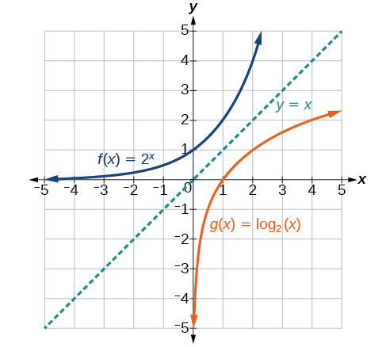\n\n

Observe the following from the graph:

 $f(x)={2}^{x}$ has a *y*-intercept at $(0,1)$ and $g(x)={\mathrm{log}}_{2}\left(x\right)$ has an *x*- intercept at $(1,0).$ 
The domain of $f(x)={2}^{x},$ $\left(-\infty ,\infty \right),$ is the same as the range of $g(x)={\mathrm{log}}_{2}\left(x\right).$ 
The range of $f(x)={2}^{x},$ $\left(0,\infty \right),$ is the same as the domain of $g(x)={\mathrm{log}}_{2}\left(x\right).$ 

Characteristics of the Graph of the Parent Function, $f(x)={\mathrm{log}}_{b}\left(x\right):$
=============================================================================================

For any real number $x$ and constant $b>0,$ $b\ne 1,$ we can see the following characteristics in the graph of $f(x)={\mathrm{log}}_{b}\left(x\right):$
one-to-one function
vertical asymptote: $x=0$ 
domain: $(0,\infty )$ 
range: $\left(-\infty ,\infty \right)$ 
*x-*intercept: $(1,0)$ and key point $(b,1)$

*y*-intercept: none

increasing if $b>1$ 

decreasing if $0<b<1$ 
See .

\n\n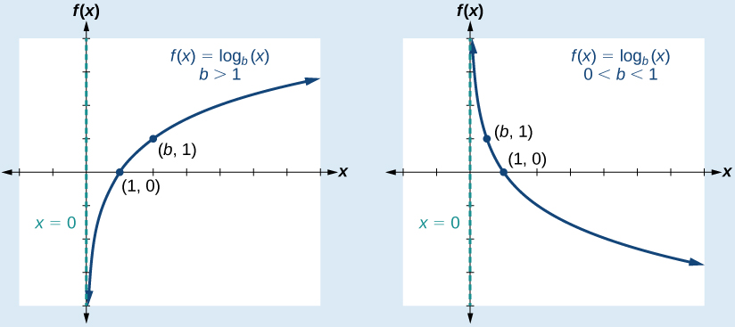\n\nshows how changing the base $b$ in $f(x)={\mathrm{log}}_{b}\left(x\right)$ can affect the graphs. Observe that the graphs compress vertically as the value of the base increases. (*Note:* recall that the function $\mathrm{ln}\left(x\right)$ has base $e\approx \text{2}.\text{718.)}$
\n\n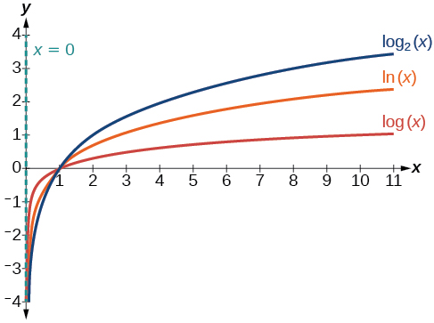\n\n

How To
*Given a logarithmic function with the form $f(x)={\mathrm{log}}_{b}\left(x\right),$ graph the function.*
Draw and label the vertical asymptote, $x=0.$ 
Plot the *x-*intercept, $\left(1,0\right).$ 
Plot the key point $\left(b,1\right).$ 
Draw a smooth curve through the points.
State the domain, $\left(0,\infty \right),$ the range, $\left(-\infty ,\infty \right),$ and the vertical asymptote, $x=0.$ 

Graphing a Logarithmic Function with the Form *f*(*x*) = log*b*(*x*).
=====================================================================

Graph $f(x)={\mathrm{log}}_{5}\left(x\right).$ State the domain, range, and asymptote.

Before graphing, identify the behavior and key points for the graph.

Since $b=5$ is greater than one, we know the function is increasing. The left tail of the graph will approach the vertical asymptote $x=0,$ and the right tail will increase slowly without bound.
The *x*-intercept is $\left(1,0\right).$ 
The key point $\left(5,1\right)$ is on the graph.
We draw and label the asymptote, plot and label the points, and draw a smooth curve through the points (see ).
\n\n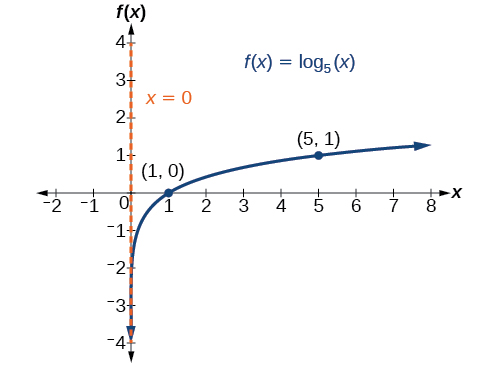\n\n
The domain is $\left(0,\infty \right),$ the range is $\left(-\infty ,\infty \right),$ and the vertical asymptote is $x=0.$

Try It

Graph $f(x)={\mathrm{log}}_{\frac{1}{5}}(x).$ State the domain, range, and asymptote.

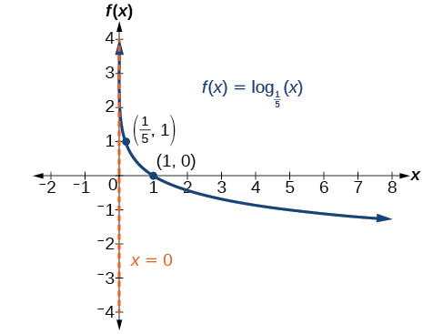

The domain is $\left(0,\infty \right),$ the range is $\left(-\infty ,\infty \right),$ and the vertical asymptote is $x=0.$

Graphing Transformations of Logarithmic Functions
=================================================

As we mentioned in the beginning of the section, transformations of logarithmic graphs behave similarly to those of other parent functions. We can shift, stretch, compress, and reflect the **parent function** $y={\mathrm{log}}_{b}\left(x\right)$ without loss of shape.

Graphing a Horizontal Shift of *f*(*x*) = log*b*(*x*)
=====================================================
When a constant $c$ is added to the input of the parent function $f(x)=lo{g}_{b}(x),$ the result is a **horizontal shift** $c$ units in the *opposite* direction of the sign on $c.$ To visualize horizontal shifts, we can observe the general graph of the parent function $f(x)={\mathrm{log}}_{b}\left(x\right)$ and for $c>0$ alongside the shift left, $g(x)={\mathrm{log}}_{b}\left(x+c\right),$ and the shift right, $h(x)={\mathrm{log}}_{b}\left(x-c\right).$ See .
\n\n\n\n
Horizontal Shifts of the Parent Function $f(x)={\mathrm{log}}_{b}\left(x\right)$
================================================================================

For any constant $c,$ the function $f(x)={\mathrm{log}}_{b}\left(x+c\right)$

shifts the parent function $y={\mathrm{log}}_{b}\left(x\right)$ left $c$ units if $c>0.$ 
shifts the parent function $y={\mathrm{log}}_{b}\left(x\right)$ right $c$ units if $c<0.$ 
has the vertical asymptote $x=-c.$ 
has domain $\left(-c,\infty \right).$ 
has range $\left(-\infty ,\infty \right).$ 

How To
*Given a logarithmic function with the form $f(x)={\mathrm{log}}_{b}\left(x+c\right),$ graph the translation.*
Identify the horizontal shift:

If $c>0,$ shift the graph of $f(x)={\mathrm{log}}_{b}\left(x\right)$ left $c$ units.
If $c<0,$ shift the graph of $f(x)={\mathrm{log}}_{b}\left(x\right)$ right $c$ units.

Draw the vertical asymptote $x=-c.$ 
Identify three key points from the parent function.  Find new coordinates for the shifted functions by subtracting $c$ from the $x$ coordinate.
Label the three points.
The Domain is $\left(-c,\infty \right),$ the range is $\left(-\infty ,\infty \right),$ and the vertical asymptote is $x=-c.$ 

Graphing a Horizontal Shift of the Parent Function *y* = log*b*(*x*)
====================================================================

Sketch the horizontal shift $f(x)={\mathrm{log}}_{3}(x-2)$ alongside its parent function. Include the key points and asymptotes on the graph. State the domain, range, and asymptote.

Since the function is $f(x)={\mathrm{log}}_{3}(x-2),$ we notice $x+\left(-2\right)=x\u20132.$
Thus $c=-2,$ so $c<0.$ This means we will shift the function $f(x)={\mathrm{log}}_{3}(x)$ right 2 units.

The vertical asymptote is $x=-(-2)$ or $x=2.$

Consider the three key points from the parent function, $\left(\frac{1}{3},\mathrm{-1}\right),$ $\left(1,0\right),$ and $\left(3,1\right).$
The new coordinates are found by adding 2 to the $x$ coordinates.

Label the points $\left(\frac{7}{3},\mathrm{-1}\right),$ $\left(3,0\right),$ and $\left(5,1\right).$
The domain is $\left(2,\infty \right),$ the range is $\left(-\infty ,\infty \right),$ and the vertical asymptote is $x=2.$

\n\n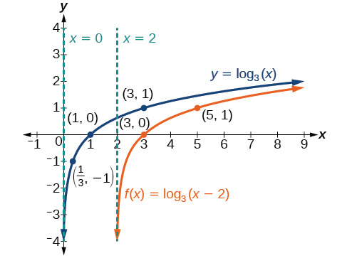\n\n

Try It

Sketch a graph of $f(x)={\mathrm{log}}_{3}(x+4)$ alongside its parent function. Include the key points and asymptotes on the graph. State the domain, range, and asymptote.

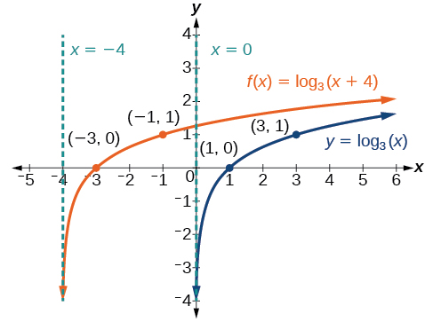

The domain is $\left(-4,\infty \right),$ the range $\left(-\infty ,\infty \right),$ and the asymptote $x=\u20134.$

Graphing a Vertical Shift of *y* = log*b*(*x*)
==============================================
When a constant $d$ is added to the parent function $f(x)={\mathrm{log}}_{b}\left(x\right),$ the result is a **vertical shift** $d$ units in the direction of the sign on $d.$ To visualize vertical shifts, we can observe the general graph of the parent function $f(x)={\mathrm{log}}_{b}\left(x\right)$ alongside the shift up, $g(x)={\mathrm{log}}_{b}\left(x\right)+d$ and the shift down, $h(x)={\mathrm{log}}_{b}\left(x\right)-d.$ See .

\n\n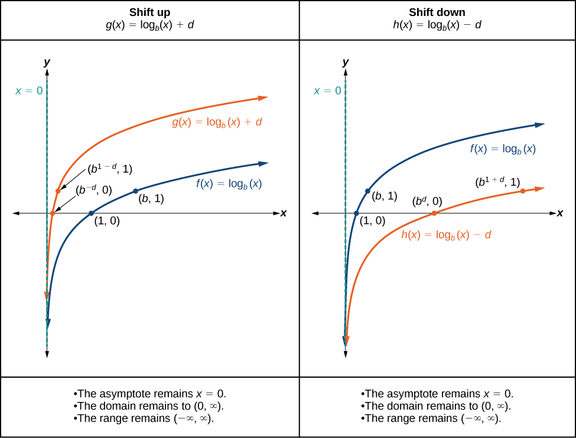\n\n
Vertical Shifts of the Parent Function $y={\mathrm{log}}_{b}\left(x\right)$
===========================================================================

For any constant $d,$ the function $f(x)={\mathrm{log}}_{b}\left(x\right)+d$

shifts the parent function $y={\mathrm{log}}_{b}\left(x\right)$ up $d$ units if $d>0.$ 
shifts the parent function $y={\mathrm{log}}_{b}\left(x\right)$ down $d$ units if $d<0.$ 
has the vertical asymptote $x=0.$ 
has domain $\left(0,\infty \right).$ 
has range $\left(-\infty ,\infty \right).$ 

How To
*Given a logarithmic function with the form $f(x)={\mathrm{log}}_{b}\left(x\right)+d,$ graph the translation.*
Identify the vertical shift:
If $d>0,$ shift the graph of $f(x)={\mathrm{log}}_{b}\left(x\right)$ up $d$ units.
If $d<0,$ shift the graph of $f(x)={\mathrm{log}}_{b}\left(x\right)$ down $d$ units.

Draw the vertical asymptote $x=0.$ 
Identify three key points from the parent function. Find new coordinates for the shifted functions by adding $d$ to the $y$ coordinate.
Label the three points.
The domain is $\left(\mathrm{0,}\infty \right),$ the range is $\left(-\infty ,\infty \right),$ and the vertical asymptote is $x=0.$ 

Graphing a Vertical Shift of the Parent Function *y* = log*b*(*x*)
==================================================================

Sketch a graph of $f(x)={\mathrm{log}}_{3}(x)-2$ alongside its parent function. Include the key points and asymptote on the graph. State the domain, range, and asymptote.

Since the function is $f(x)={\mathrm{log}}_{3}(x)-2,$ we will notice $d=\u20132.$ Thus $d<0.$

This means we will shift the function $f(x)={\mathrm{log}}_{3}(x)$ down 2 units.

The vertical asymptote is $x=0.$

Consider the three key points from the parent function, $\left(\frac{1}{3},\mathrm{-1}\right),$ $\left(1,0\right),$ and $\left(3,1\right).$
The new coordinates are found by subtracting 2 from the *y*coordinates.

Label the points $\left(\frac{1}{3},\mathrm{-3}\right),$ $\left(1,\mathrm{-2}\right),$ and $\left(3,\mathrm{-1}\right).$
The domain is $\left(0,\infty \right),$ the range is $\left(-\infty ,\infty \right),$ and the vertical asymptote is $x=0.$
\n\n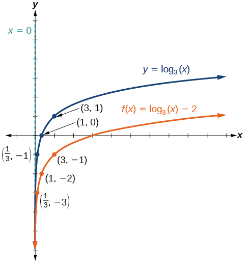\n\n
The domain is $\left(0,\infty \right),$ the range is $\left(-\infty ,\infty \right),$ and the vertical asymptote is $x=0.$

Try It

Sketch a graph of $f(x)={\mathrm{log}}_{2}(x)+2$ alongside its parent function. Include the key points and asymptote on the graph. State the domain, range, and asymptote.

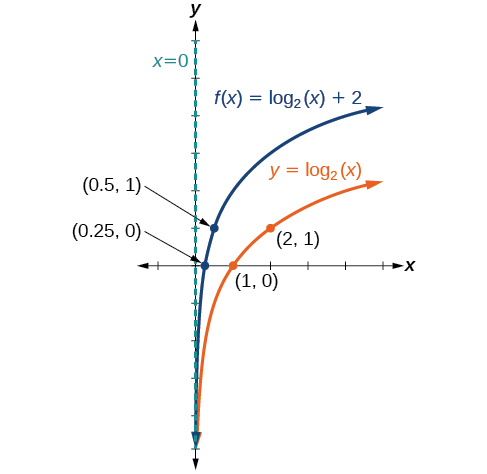

The domain is $\left(0,\infty \right),$ the range is $\left(-\infty ,\infty \right),$ and the vertical asymptote is $x=0.$

Graphing Stretches and Compressions of *y* = log*b*(*x*)
========================================================
When the parent function $f(x)={\mathrm{log}}_{b}\left(x\right)$ is multiplied by a constant $a>0,$ the result is a **vertical stretch** or **compression** of the original graph. To visualize stretches and compressions, we set $a>1$ and observe the general graph of the parent function $f(x)={\mathrm{log}}_{b}\left(x\right)$ alongside the vertical stretch, $g(x)=a{\mathrm{log}}_{b}\left(x\right)$ and the vertical compression, $h(x)=\frac{1}{a}{\mathrm{log}}_{b}\left(x\right).$ See .
\n\n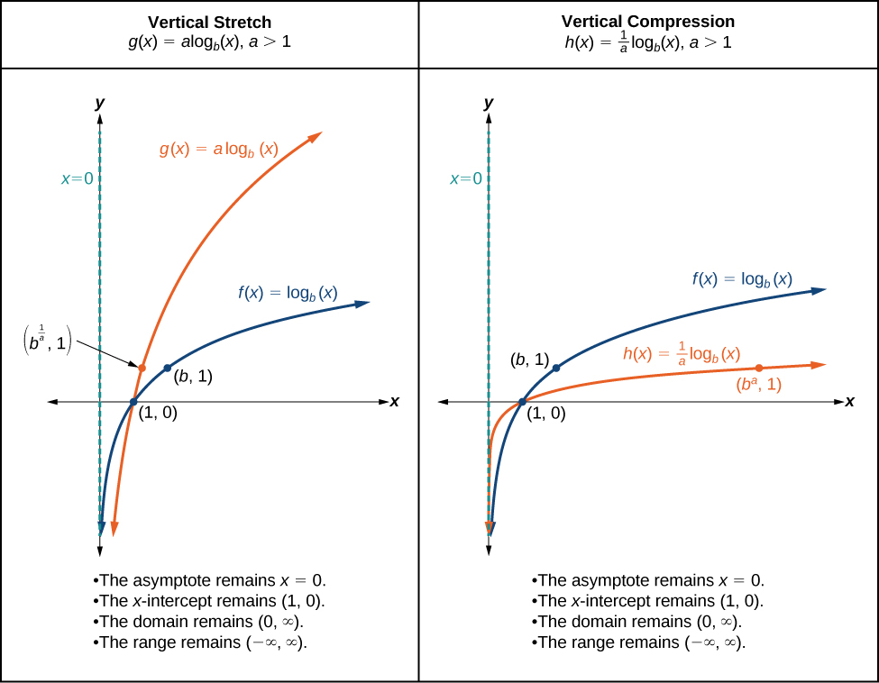\n\n

Vertical Stretches and Compressions of the Parent Function $y={\mathrm{log}}_{b}\left(x\right)$
===============================================================================================

For any constant $a>1,$ the function $f(x)=a{\mathrm{log}}_{b}\left(x\right)$

stretches the parent function $y={\mathrm{log}}_{b}\left(x\right)$ vertically by a factor of $a$ if $a>1.$ 
compresses the parent function $y={\mathrm{log}}_{b}\left(x\right)$ vertically by a factor of $a$ if $0<a<1.$ 
has the vertical asymptote $x=0.$ 
has the *x*-intercept $\left(1,0\right).$ 
has domain $\left(0,\infty \right).$ 
has range $\left(-\infty ,\infty \right).$ 

How To
*Given a logarithmic function with the form $f(x)=a{\mathrm{log}}_{b}\left(x\right),$ $a>0,$ graph the translation.*

Identify the vertical stretch or compressions:
If $\left|a\right|>1,$ the graph of $f(x)={\mathrm{log}}_{b}\left(x\right)$ is stretched by a factor of $a$ units.
If $\left|a\right|<1,$ the graph of $f(x)={\mathrm{log}}_{b}\left(x\right)$ is compressed by a factor of $a$ units.

Draw the vertical asymptote $x=0.$ 
Identify three key points from the parent function. Find new coordinates for the shifted functions by multiplying the $y$ coordinates by $a.$ 
Label the three points.
The domain is $\left(0,\infty \right),$ the range is $\left(-\infty ,\infty \right),$ and the vertical asymptote is $x=0.$ 

Graphing a Stretch or Compression of the Parent Function *y* = log*b*(*x*)
==========================================================================

Sketch a graph of $f(x)=2{\mathrm{log}}_{4}(x)$ alongside its parent function. Include the key points and asymptote on the graph. State the domain, range, and asymptote.

Since the function is $f(x)=2{\mathrm{log}}_{4}(x),$ we will notice $a=2.$

This means we will stretch the function $f(x)={\mathrm{log}}_{4}(x)$ by a factor of 2.

The vertical asymptote is $x=0.$
Consider the three key points from the parent function, $\left(\frac{1}{4},\mathrm{-1}\right),$ $(1,0),$ and $\left(4,1\right).$
The new coordinates are found by multiplying the $y$ coordinates by 2.

Label the points $\left(\frac{1}{4},\mathrm{-2}\right),$ $\left(1,0\right)\phantom{\rule{0.5em}{0ex}},$ and $\left(4,\text{2}\right).$
The domain is $\left(\mathrm{0,}\phantom{\rule{0.5em}{0ex}}\infty \right),$ the range is $(-\infty ,\infty ),$ and the vertical asymptote is $x=0.$ See *.*
\n\n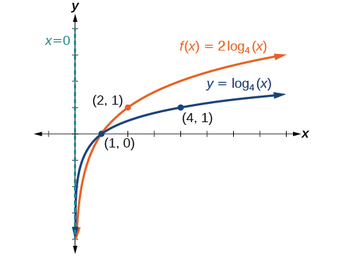\n\n
The domain is $\left(0,\infty \right),$ the range is $\left(-\infty ,\infty \right),$ and the vertical asymptote is $x=0.$

Try It

Sketch a graph of $f(x)=\frac{1}{2}\phantom{\rule{0.5em}{0ex}}{\mathrm{log}}_{4}(x)$ alongside its parent function. Include the key points and asymptote on the graph. State the domain, range, and asymptote.

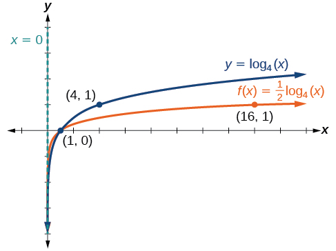

The domain is $\left(0,\infty \right),$ the range is $\left(-\infty ,\infty \right),$ and the vertical asymptote is $x=0.$

Combining a Shift and a Stretch
===============================

Sketch a graph of $f(x)=5\mathrm{log}(x+2).$ State the domain, range, and asymptote.

Remember: what happens inside parentheses happens first. First, we move the graph left 2 units, then stretch the function vertically by a factor of 5, as in . The vertical asymptote will be shifted to $x=\mathrm{-2.}$ The *x*-intercept will be $(\mathrm{-1,}0).$ The domain will be $\left(\mathrm{-2},\infty \right).$ Two points will help give the shape of the graph: $(\mathrm{-1},0)$ and $(8,5).$ We chose $x=8$ as the *x*-coordinate of one point to graph because when $x=\mathrm{8,}$ $x+2=\mathrm{10,}$ the base of the common logarithm.

\n\n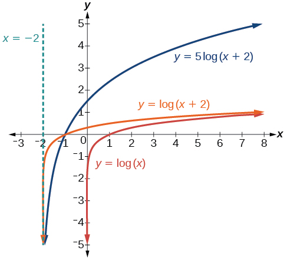\n\n
The domain is $\left(-2,\infty \right),$ the range is $\left(-\infty ,\infty \right),$ and the vertical asymptote is $x=-2.$

Try It

Sketch a graph of the function $f(x)=3\mathrm{log}(x-2)+1.$ State the domain, range, and asymptote.

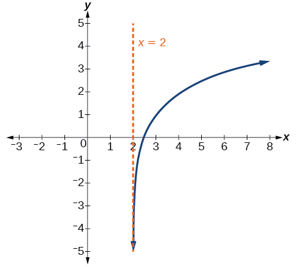

The domain is $\left(2,\infty \right),$ the range is $\left(-\infty ,\infty \right),$ and the vertical asymptote is $x=2.$

Graphing Reflections of *f*(*x*) = log*b*(*x*)
==============================================
When the parent function $f(x)={\mathrm{log}}_{b}\left(x\right)$ is multiplied by $\mathrm{-1},$ the result is a **reflection** about the *x*-axis. When the *input* is multiplied by $\mathrm{-1},$ the result is a reflection about the *y*-axis. To visualize reflections, we restrict $b>\mathrm{1,}$ and observe the general graph of the parent function $f(x)={\mathrm{log}}_{b}\left(x\right)$ alongside the reflection about the *x*-axis, $g(x)={\mathrm{-log}}_{b}\left(x\right)$ and the reflection about the *y*-axis, $h(x)={\mathrm{log}}_{b}\left(-x\right).$

\n\n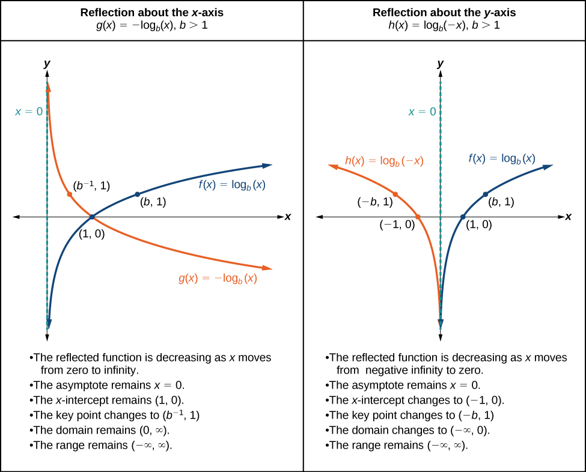\n\n
Reflections of the Parent Function $y={\mathrm{log}}_{b}\left(x\right)$
=======================================================================

The function $f(x)={\mathrm{-log}}_{b}\left(x\right)$
reflects the parent function $y={\mathrm{log}}_{b}\left(x\right)$ about the *x*-axis.
has domain, $\left(0,\infty \right),$ range, $\left(-\infty ,\infty \right),$ and vertical asymptote, $x=0,$ which are unchanged from the parent function.
The function $f(x)={\mathrm{log}}_{b}\left(-x\right)$
reflects the parent function $y={\mathrm{log}}_{b}\left(x\right)$ about the *y*-axis.
has domain $\left(-\infty ,0\right).$ 
has range, $\left(-\infty ,\infty \right),$ and vertical asymptote, $x=0,$ which are unchanged from the parent function.
How To
*Given a logarithmic function with the parent function $f(x)={\mathrm{log}}_{b}\left(x\right),$ graph a translation.*

 $\text{If\}f(x)=-{\mathrm{log}}_{b}(x)$

 $\text{If\}f(x)={\mathrm{log}}_{b}(-x)$

1. Draw the vertical asymptote, $x=0.$

1. Draw the vertical asymptote, $x=0.$

2. Plot the *x-*intercept, $\left(1,0\right).$

2. Plot the *x-*intercept, $\left(1,0\right).$

3. Reflect the graph of the parent function $f(x)={\mathrm{log}}_{b}\left(x\right)$ about the *x*-axis.

3. Reflect the graph of the parent function $f(x)={\mathrm{log}}_{b}\left(x\right)$ about the *y*-axis.

4. Draw a smooth curve through the points.

4. Draw a smooth curve through the points.

5. State the domain, (0, ∞), the range, (−∞, ∞), and the vertical asymptote $x=0$.

5. State the domain, (−∞, 0) the range, (−∞, ∞) and the vertical asymptote $x=0.$

Graphing a Reflection of a Logarithmic Function
===============================================

Sketch a graph of $f(x)=\mathrm{log}(-x)$ alongside its parent function. Include the key points and asymptote on the graph. State the domain, range, and asymptote.

Before graphing $f(x)=\mathrm{log}(-x),$ identify the behavior and key points for the graph.
Since $b=10$ is greater than one, we know that the parent function is increasing. Since the *input* value is multiplied by $\mathrm{-1},$ $f$ is a reflection of the parent graph about the *y-*axis. Thus, $f(x)=\mathrm{log}(-x)$ will be decreasing as $x$ moves from negative infinity to zero, and the right tail of the graph will approach the vertical asymptote $x=0.$ 
The *x*-intercept is $\left(\mathrm{-1},0\right).$ 
We draw and label the asymptote, plot and label the points, and draw a smooth curve through the points.

\n\n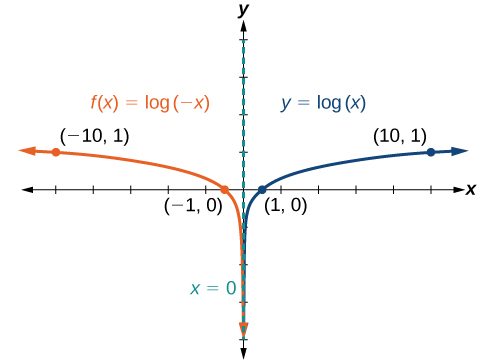\n\nThe domain is $\left(-\infty ,0\right),$ the range is $\left(-\infty ,\infty \right),$ and the vertical asymptote is $x=0.$

Try It

Graph $f(x)=-\mathrm{log}(-x).$ State the domain, range, and asymptote.

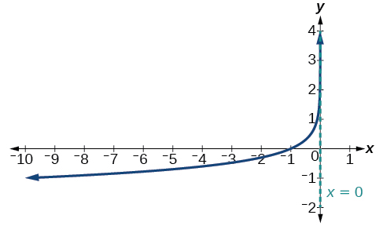

The domain is $\left(-\infty ,0\right),$ the range is $\left(-\infty ,\infty \right),$ and the vertical asymptote is $x=0.$

How To
*Given a logarithmic equation, use a graphing calculator to approximate solutions.*

Press *[Y=]*. Enter the given logarithm equation or equations as *Y1=* and, if needed, *Y2=*.
Press *[GRAPH]* to observe the graphs of the curves and use *[WINDOW]* to find an appropriate view of the graphs, including their point(s) of intersection.
To find the value of $x,$ we compute the point of intersection. Press *[2ND]*then *[CALC]*. Select “intersect” and press *[ENTER]* three times. The point of intersection gives the value of $x,$ for the point(s) of intersection.

Approximating the Solution of a Logarithmic Equation
====================================================

Solve $4\mathrm{ln}\left(x\right)+1=-2\mathrm{ln}\left(x-1\right)$ graphically. Round to the nearest thousandth.

Press *[Y=]* and enter $4\mathrm{ln}\left(x\right)+1$ next to *Y1*=. Then enter $-2\mathrm{ln}\left(x-1\right)$ next to *Y2=*. For a window, use the values 0 to 5 for $x$ and –10 to 10 for $y.$ Press *[GRAPH]*. The graphs should intersect somewhere a little to right of $x=1.$
For a better approximation, press *[2ND]*then *[CALC]*. Select *[5: intersect]* and press *[ENTER]* three times. The *x*-coordinate of the point of intersection is displayed as 1.3385297. (Your answer may be different if you use a different window or use a different value for *Guess?*) So, to the nearest thousandth, $x\approx \mathrm{1.339.}$

Try It

Solve $5\mathrm{log}\left(x+2\right)=4-\mathrm{log}\left(x\right)$ graphically. Round to the nearest thousandth.

$x\approx 3.049$

Summarizing Translations of the Logarithmic Function
====================================================

Now that we have worked with each type of translation for the logarithmic function, we can summarize each in  to arrive at the general equation for translating exponential functions.

Transformations of the Parent Function $y={\mathrm{log}}_{b}\left(x\right)$ 

Transformation
Form

Shift

Horizontally $c$ units to the left
Vertically $d$ units up

 $y={\mathrm{log}}_{b}\left(x+c\right)+d$ 

Stretch and Compress

Stretch if $\left|a\right|>1$ 
Compression if $\left|a\right|<1$ 

 $y=a{\mathrm{log}}_{b}\left(x\right)$ 

Reflect about the *x*-axis
 $y=-{\mathrm{log}}_{b}\left(x\right)$ 

Reflect about the *y*-axis
 $y={\mathrm{log}}_{b}\left(-x\right)$ 

General equation for all translations
 $y=a{\mathrm{log}}_{b}(x+c)+d$

Transformations of Logarithmic Functions
========================================

All transformations of the parent logarithmic function, $y={\mathrm{log}}_{b}\left(x\right),$ have the form
 $\ f(x)=a{\mathrm{log}}_{b}\left(x+c\right)+d$ 
where the parent function, $y={\mathrm{log}}_{b}\left(x\right),b>1,$ is

shifted vertically up $d$ units.
shifted horizontally to the left $c$ units.
stretched vertically by a factor of $\left|a\right|$ if $\left|a\right|>0.$ 
compressed vertically by a factor of $\left|a\right|$ if $0<\left|a\right|<1.$ 
reflected about the *x-*axis when $a<0.$ 

For $f\left(x\right)=\mathrm{log}\left(-x\right),$ the graph of the parent function is reflected about the *y*-axis.

Finding the Vertical Asymptote of a Logarithm Graph
===================================================

What is the vertical asymptote of $f(x)=\mathrm{-2}{\mathrm{log}}_{3}(x+4)+5?$

The vertical asymptote is at $x=-4.$

Analysis
========

The coefficient, the base, and the upward translation do not affect the asymptote. The shift of the curve 4 units to the left shifts the vertical asymptote to $x=\mathrm{-4.}$

Try It

What is the vertical asymptote of $f(x)=3+\mathrm{ln}(x-1)?$

$x=1$

Finding the Equation from a Graph
=================================

Find a possible equation for the common logarithmic function graphed in .

\n\n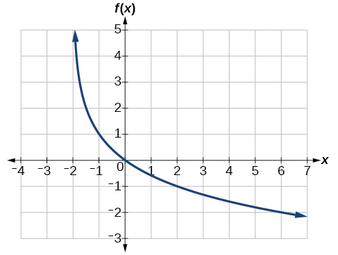\n\n

This graph has a vertical asymptote at $x=\mathrm{\u20132}$ and has been vertically reflected. We do not know yet the vertical shift or the vertical stretch. We know so far that the equation will have form:
 $$
f(x)=-a\mathrm{log}(x+2)+k
$$ 

It appears the graph passes through the points $\left(\mathrm{\u20131},1\right)$ and $\left(2,\mathrm{\u20131}\right).$ Substituting $\left(\mathrm{\u20131},1\right),$
 $$
\begin{array}{ll}1=-a\mathrm{log}(\mathrm{-1}+2)+k\phantom{\rule{0.5em}{0ex}}\phantom{\rule{0.5em}{0ex}}\phantom{\rule{0.5em}{0ex}}\phantom{\rule{0.5em}{0ex}}\phantom{\rule{0.5em}{0ex}}\phantom{\rule{0.5em}{0ex}}\phantom{\rule{0.5em}{0ex}}\phantom{\rule{0.5em}{0ex}}\phantom{\rule{0.5em}{0ex}}\phantom{\rule{0.5em}{0ex}}\phantom{\rule{0.5em}{0ex}}\phantom{\rule{0.5em}{0ex}}\hfill & \text{Substitute\}(\mathrm{-1},1).\hfill \\ 1=-a\mathrm{log}(1)+k\hfill & \text{Arithmetic}.\hfill \\ 1=k\hfill & \text{log(1)}=0.\hfill \end{array}
$$
Next, substituting in $\left(2,\mathrm{\u20131}\right)$ ,
 $$
\begin{array}{lll}-1=-a\mathrm{log}(2+2)+1\hfill & \hfill & \text{Plug\ in\}(2,\mathrm{-1}).\hfill \\ -2=-a\mathrm{log}(4)\hfill & \hfill & \text{Arithmetic}.\hfill \\ \phantom{\rule{0.5em}{0ex}}\text\ a=\frac{2}{\mathrm{log}(4)}\hfill & \hfill & \text{Solve\ for\}a.\hfill \end{array}
$$
This gives us the equation $f(x)=\u2013\frac{2}{\mathrm{log}(4)}\mathrm{log}(x+2)+1.$

Analysis
========

We can verify this answer by comparing the function values in  with the points on the graph in .

    
        *$x$*
        −1
        0
        1
        2
        3
    

        *$f(x)$*
        1
        0
        −0.58496
        −1
        −1.3219
    

        *$x$*
        4
        5
        6
        7
        8
    

        *$f(x)$*
        −1.5850
        −1.8074
        −2
        −2.1699
        −2.3219
    

Try It

Give the equation of the natural logarithm graphed in .

\n\n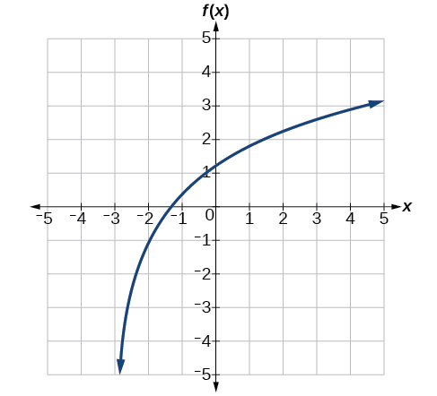\n\n

$f(x)=2\mathrm{ln}(x+3)-1$

Q&A
*Is it possible to tell the domain and range and describe the end behavior of a function just by looking at the graph?*

*Yes, if we know the function is a general logarithmic function. For example, look at the graph in . The graph approaches $x=\mathrm{-3}$ (or thereabouts) more and more closely, so $x=\mathrm{-3}$ is, or is very close to, the vertical asymptote. It approaches from the right, so the domain is all points to the right, $\left\{x\phantom{\rule{0.5em}{0ex}}\right|\phantom{\rule{0.5em}{0ex}}x>\mathrm{-3}\}.$ The range, as with all general logarithmic functions, is all real numbers. And we can see the end behavior because the graph goes down as it goes left and up as it goes right. The end behavior is that as $x\to -{3}^{+},f(x)\to -\infty$ and as $x\to \infty ,f(x)\to \infty .$*

Media
Access these online resources for additional instruction and practice with graphing logarithms.

Graph an Exponential Function and Logarithmic Function
Match Graphs with Exponential and Logarithmic Functions
Find the Domain of Logarithmic Functions

Key Equations
=============

General Form for the Translation of the Parent Logarithmic Function $\text{}f(x)={\mathrm{log}}_{b}\left(x\right)$ 
 $\ f(x)=a{\mathrm{log}}_{b}\left(x+c\right)+d$ 

Key Concepts
============
To find the domain of a logarithmic function, set up an inequality showing the argument greater than zero, and solve for $x.$ See  and 
The graph of the parent function $f(x)={\mathrm{log}}_{b}\left(x\right)$ has an *x-*intercept at $\left(1,0\right),$ domain $\left(0,\infty \right),$ range $\left(-\infty ,\infty \right),$ vertical asymptote $x=0,$ and
if $b>1,$ the function is increasing.
if $0<b<1,$ the function is decreasing.

See .

The equation $f(x)={\mathrm{log}}_{b}\left(x+c\right)$ shifts the parent function $y={\mathrm{log}}_{b}\left(x\right)$ horizontally

left $c$ units if $c>0.$ 
right $c$ units if $c<0.$ 

See .
The equation $f(x)={\mathrm{log}}_{b}\left(x\right)+d$ shifts the parent function $y={\mathrm{log}}_{b}\left(x\right)$ vertically
up $d$ units if $d>0.$ 
down $d$ units if $d<0.$ 

See .
For any constant $a>0,$ the equation $f(x)=a{\mathrm{log}}_{b}\left(x\right)$

stretches the parent function $y={\mathrm{log}}_{b}\left(x\right)$ vertically by a factor of $a$ if $\left|a\right|>1.$ 
compresses the parent function $y={\mathrm{log}}_{b}\left(x\right)$ vertically by a factor of $a$ if $\left|a\right|<1.$ 

See  and .

When the parent function $y={\mathrm{log}}_{b}\left(x\right)$ is multiplied by $-1,$ the result is a reflection about the *x*-axis. When the input is multiplied by $-1,$ the result is a reflection about the *y*-axis.

The equation $f(x)=-{\mathrm{log}}_{b}\left(x\right)$ represents a reflection of the parent function about the *x-*axis.
The equation $f(x)={\mathrm{log}}_{b}\left(-x\right)$ represents a reflection of the parent function about the *y-*axis.

See .
A graphing calculator may be used to approximate solutions to some logarithmic equations See .

All translations of the logarithmic function can be summarized by the general equation $\ f(x)=a{\mathrm{log}}_{b}\left(x+c\right)+d.$ See .
Given an equation with the general form $f(x)=a{\mathrm{log}}_{b}\left(x+c\right)+d,$ we can identify the vertical asymptote $x=-c$ for the transformation. See .
Using the general equation $f(x)=a{\mathrm{log}}_{b}\left(x+c\right)+d,$ we can write the equation of a logarithmic function given its graph. See .

Section Exercises
=================

Verbal
======

The inverse of every logarithmic function is an exponential function and vice-versa. What does this tell us about the relationship between the coordinates of the points on the graphs of each?

Since the functions are inverses, their graphs are mirror images about the line $y=x.$ So for every point $(a,b)$ on the graph of a logarithmic function, there is a corresponding point $(b,a)$ on the graph of its inverse exponential function.

What type(s) of translation(s), if any, affect the range of a logarithmic function?

What type(s) of translation(s), if any, affect the domain of a logarithmic function?

Shifting the function right or left and reflecting the function about the y-axis will affect its domain.

Consider the general logarithmic function $f(x)={\mathrm{log}}_{b}\left(x\right).$ Why can’t $x$ be zero?

Does the graph of a general logarithmic function have a horizontal asymptote? Explain.

No. A horizontal asymptote would suggest a limit on the range, and the range of any logarithmic function in general form is all real numbers.

Algebraic
=========

For the following exercises, state the domain and range of the function.

$f(x)={\mathrm{log}}_{3}\left(x+4\right)$

$h(x)=\mathrm{ln}\left(\frac{1}{2}-x\right)$

Domain: $\left(-\infty ,\frac{1}{2}\right);$ Range: $\left(-\infty ,\infty \right)$

$g(x)={\mathrm{log}}_{5}\left(2x+9\right)-2$

$h(x)=\mathrm{ln}\left(4x+17\right)-5$

Domain: $\left(-\frac{17}{4},\infty \right);$ Range: $\left(-\infty ,\infty \right)$

$f(x)={\mathrm{log}}_{2}\left(12-3x\right)-3$

For the following exercises, state the domain and the vertical asymptote of the function.

$f(x)={\mathrm{log}}_{b}(x-5)$

Domain: $\left(5,\infty \right);$ Vertical asymptote: $x=5$

$g(x)=\mathrm{ln}(3-x)$

$f(x)=\mathrm{log}(3x+1)$

Domain: $\left(-\frac{1}{3},\infty \right);$ Vertical asymptote: $x=-\frac{1}{3}$

$f(x)=3\mathrm{log}(-x)+2$

$g(x)=-\mathrm{ln}(3x+9)-7$

Domain: $\left(-3,\infty \right);$ Vertical asymptote: $x=-3$

For the following exercises, state the domain, vertical asymptote, and end behavior of the function.

$f(x)=\mathrm{ln}\left(2-x\right)$

$f(x)=\mathrm{log}\left(x-\frac{3}{7}\right)$

Domain: $(\frac{3}{7},\infty )$ ;
Vertical asymptote: $x=\frac{3}{7}$ ; End behavior: as $x\to {\left(\frac{3}{7}\right)}^{+},f(x)\to -\infty$ and as $x\to \infty ,f(x)\to \infty$

$h(x)=-\mathrm{log}\left(3x-4\right)+3$

$g(x)=\mathrm{ln}\left(2x+6\right)-5$

Domain: $\left(-3,\infty \right)$ ; Vertical asymptote: $x=-3$ ; End behavior: as $x\to -{3}^{+}$ ,
 $f(x)\to -\infty$ and as $x\to \infty$ ,
 $f(x)\to \infty$

$f(x)={\mathrm{log}}_{3}\left(15-5x\right)+6$

For the following exercises, state the domain, range, and *x*- and *y*-intercepts, if they exist. If they do not exist, write DNE.

$h(x)={\mathrm{log}}_{4}\left(x-1\right)+1$

Domain: $\left(1,\infty \right);$ Range: $\left(-\infty ,\infty \right);$ Vertical asymptote: $x=1;$ *x*-intercept: $\left(\frac{5}{4},0\right);$ *y*-intercept: DNE

$f(x)=\mathrm{log}\left(5x+10\right)+3$

$g(x)=\mathrm{ln}\left(-x\right)-2$

Domain: $\left(-\infty ,0\right);$ Range: $\left(-\infty ,\infty \right);$ Vertical asymptote: $x=0;$ *x*-intercept: $\left(-{e}^{2},0\right);$ *y*-intercept: DNE

$f(x)={\mathrm{log}}_{2}\left(x+2\right)-5$

$h(x)=3\mathrm{ln}\left(x\right)-9$

Domain: $\left(0,\infty \right);$ Range: $\left(-\infty ,\infty \right);$ Vertical asymptote: $x=0;$ *x*-intercept: $\left({e}^{3},0\right);$ *y*-intercept: DNE

Graphical
=========
For the following exercises, match each function in  with the letter corresponding to its graph.
\n\n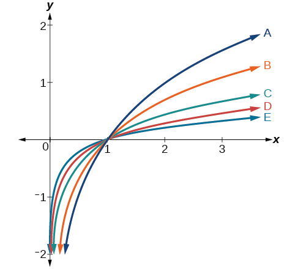\n\n

$d(x)=\mathrm{log}\left(x\right)$

$f(x)=\mathrm{ln}(x)$

B

$g(x)={\mathrm{log}}_{2}\left(x\right)$

$h(x)={\mathrm{log}}_{5}\left(x\right)$

C

$j(x)={\mathrm{log}}_{25}\left(x\right)$

For the following exercises, match each function in  with the letter corresponding to its graph.
\n\n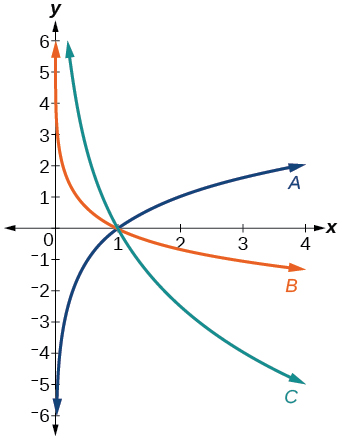\n\n

$f(x)={\mathrm{log}}_{\frac{1}{3}}\left(x\right)$

B

$g(x)={\mathrm{log}}_{2}\left(x\right)$

$h(x)={\mathrm{log}}_{\frac{3}{4}}\left(x\right)$

C

For the following exercises, sketch the graphs of each pair of functions on the same axis.

$f(x)=\mathrm{log}(x)$ and $g(x)={10}^{x}$

$f(x)=\mathrm{log}(x)$ and $g(x)={\mathrm{log}}_{\frac{1}{2}}(x)$

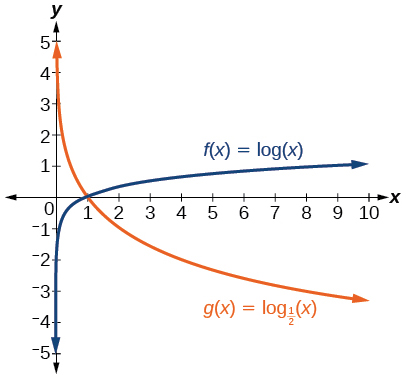

$f(x)={\mathrm{log}}_{4}(x)$ and $g(x)=\mathrm{ln}(x)$

$f(x)={e}^{x}$ and $g(x)=\mathrm{ln}(x)$

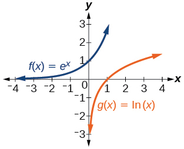

For the following exercises, match each function in  with the letter corresponding to its graph.
\n\n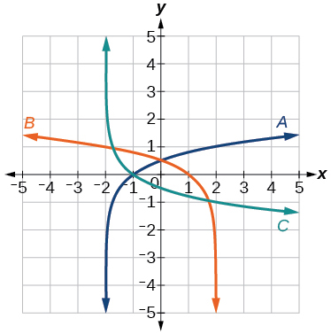\n\n

$f(x)={\mathrm{log}}_{4}\left(-x+2\right)$

$g(x)=-{\mathrm{log}}_{4}\left(x+2\right)$

C

$h(x)={\mathrm{log}}_{4}\left(x+2\right)$

For the following exercises, sketch the graph of the indicated function.

$f(x)={\mathrm{log}}_{2}(x+2)$

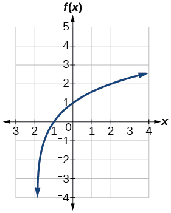

$f(x)=2\mathrm{log}(x)$

$f(x)=\mathrm{ln}(-x)$

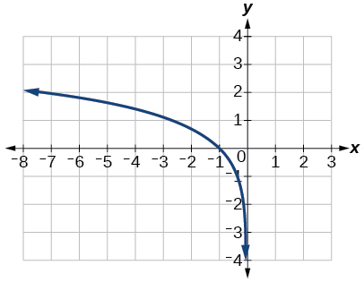

$g(x)=\mathrm{log}\left(4x+16\right)+4$

$g(x)=\mathrm{log}\left(6-3x\right)+1$

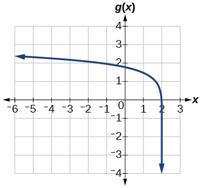

$h(x)=-\frac{1}{2}\mathrm{ln}\left(x+1\right)-3$

For the following exercises, write a logarithmic equation corresponding to the graph shown.

Use $y={\mathrm{log}}_{2}(x)$ as the parent function.

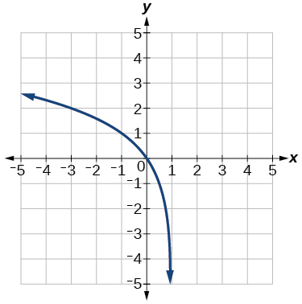

$f(x)={\mathrm{log}}_{2}(-(x-1))$

Use $f(x)={\mathrm{log}}_{3}(x)$ as the parent function.

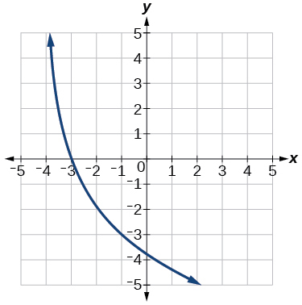

Use $f(x)={\mathrm{log}}_{4}(x)$ as the parent function.

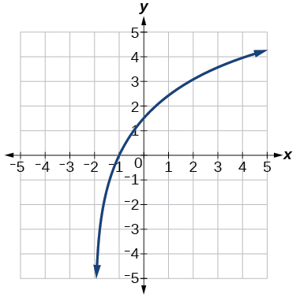

$f(x)=3{\mathrm{log}}_{4}(x+2)$

Use $f(x)={\mathrm{log}}_{5}(x)$ as the parent function.

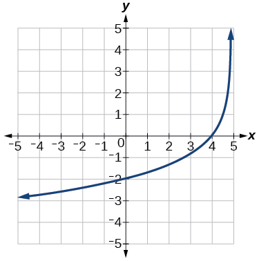

Technology
==========

For the following exercises, use a graphing calculator to find approximate solutions to each equation.

$\mathrm{log}\left(x-1\right)+2=\mathrm{ln}\left(x-1\right)+2$

$x=2$

$\mathrm{log}\left(2x-3\right)+2=-\mathrm{log}\left(2x-3\right)+5$

$\mathrm{ln}\left(x-2\right)=-\mathrm{ln}\left(x+1\right)$

$x\approx \text{2}\text{.303}$

$2\mathrm{ln}\left(5x+1\right)=\frac{1}{2}\mathrm{ln}\left(-5x\right)+1$

$\frac{1}{3}\mathrm{log}\left(1-x\right)=\mathrm{log}\left(x+1\right)+\frac{1}{3}$

$x\approx -0.472$

Extensions
==========

Let $b$ be any positive real number such that $b\ne 1.$ What must ${\mathrm{log}}_{b}1$ be equal to? Verify the result.

Explore and discuss the graphs of $f(x)={\mathrm{log}}_{\frac{1}{2}}\left(x\right)$ and $g(x)=-{\mathrm{log}}_{2}\left(x\right).$ Make a conjecture based on the result.

The graphs of $f(x)={\mathrm{log}}_{\frac{1}{2}}\left(x\right)$ and $g(x)=-{\mathrm{log}}_{2}\left(x\right)$ appear to be the same; Conjecture: for any positive base $b\ne 1,$ ${\mathrm{log}}_{b}\left(x\right)=-{\mathrm{log}}_{\frac{1}{b}}\left(x\right).$

Prove the conjecture made in the previous exercise.

What is the domain of the function $f(x)=\mathrm{ln}\left(\frac{x+2}{x-4}\right)?$ Discuss the result.

Recall that the argument of a logarithmic function must be positive, so we determine where $\frac{x+2}{x-4}>0$ . From the graph of the function $f\left(x\right)=\frac{x+2}{x-4},$ note that the graph lies above the *x*-axis on the interval $\left(-\infty ,-2\right)$ and again to the right of the vertical asymptote, that is $\left(4,\infty \right).$ Therefore, the domain is $\left(-\infty ,-2\right)\cup \left(4,\infty \right).$

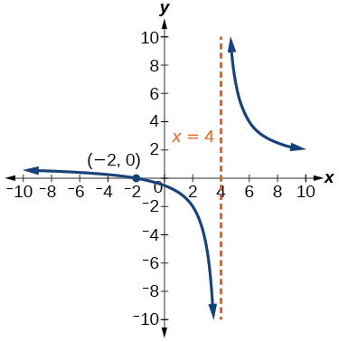

Use properties of exponents to find the *x*-intercepts of the function $f(x)=\mathrm{log}\left({x}^{2}+4x+4\right)$ algebraically. Show the steps for solving, and then verify the result by graphing the function.
