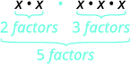
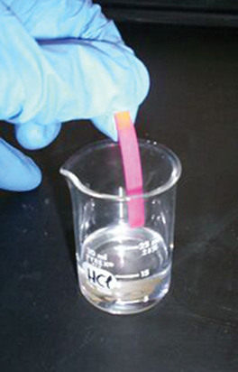

**Logarithmic Properties**

  m49365
  

**Logarithmic Properties**

  In this section, you will:

Use the product rule for logarithms.
Use the quotient rule for logarithms.
Use the power rule for logarithms.
Expand logarithmic expressions.
Condense logarithmic expressions.
Use the change-of-base formula for logarithms.

  9d565dd7-7228-45d1-b907-b0e9b7418fb9

## Learning Objectives
Simplify expressions using the properties for exponents. (IA 5.2.1)
Use the properties of logarithms. (IA 10.4.1)
## Objective 1: Simplify expressions using the properties for exponents (IA 5.2.1)

>
>
> **Vocabulary**
>
> Simplify expressions using the properties for exponents.
> Fill in the blanks:
> In the expression ${a}^{m}$, *a* is called ________, and *m* is called ________.
> For example, $(\mathrm{\u20133}{)}^{4}$ means ________ which simplifies to ________.

### The Product Property
Simplify expressions using the properties for exponents.

| Simplify |  | ${x}^{2}\xb7{x}^{3}$ |
| :--- | :--- | :--- |
| What does this mean? | $\phantom{\rule{5em}{0ex}}$ |  |
| Now we see that |  | ${x}^{2}\xb7{x}^{3}={x}^{5}$ |

*To multiply powers with the same base we need to ________ exponents.*
This leads us to the **Product Property** ${a}^{m}\xb7{a}^{n}={a}^{m+n}$ 

### The Quotient Property
Simplify $\frac{{x}^{5}}{{x}^{2}}$ 

| What does this mean? | $\frac{\mathrm{xxxxx}}{\mathrm{xx}}$ | After simplifying we get ${x}^{3}$ |
| :--- | :--- | :--- |
| Now we see that | $\frac{{x}^{5}}{{x}^{2}}={x}^{3}$ |  |

*To divide powers with the same base we need to __________ exponents.*
This leads us to the **Quotient Property** ${a}^{m}\xb7{a}^{n}={a}^{m-n}$ 

### The Power Property
Simplify $({x}^{2}{)}^{4}$ 

| What does this mean? | ${x}^{2}\xb7{x}^{2}\xb7{x}^{2}\xb7{x}^{2}$ | After adding exponents we get ${x}^{8}$ . |
| :--- | :--- | :--- |
| Now we see that | $({x}^{2}{)}^{4}={x}^{8}$ |  |

*To raise a power to a power we need to __________ exponents.*
This leads us to the **Power Property** $({a}^{m}{)}^{n}={a}^{mn}$ .
We will also use these other properties:

| *Negative Exponents Property* | ${x}^{-n}=\frac{1}{{x}^{n}},\ x\ne 0\$ |
| :--- | :--- |
| *Zero Exponent Property* | ${a}^{0}=1,\ if\ a\ne 0$ |

Simplify expressions using the properties for exponents.

1. ⓐ Simplify $3\bullet {2}^{x}\bullet {2}^{3x}$   ⓑ Simplify $\frac{{b}^{2}{b}^{6}b}{{b}^{4}{b}^{7}}$    ⓒ Simplify ${\left(a{b}^{2}\right)}^{3}{a}^{5}{b}^{-6}$

Solution

ⓐ 

| Use the product property. | $3\bullet {2}^{x+3x}$ |
| :--- | :--- |
| Simplify. | $3\bullet {2}^{4x}$ |

 ⓑ 

| Use the power property and multiply exponents. | ${a}^{3}{b}^{6}{a}^{5}{b}^{-6}$ |
| :--- | :--- |
| Use the product property and add exponents. | ${a}^{8}{b}^{0}$ |
| Any base to the power of zero equals 1. | ${a}^{8}(1)={a}^{8}$ |

ⓒ

| Use the power property and multiply exponents. | ${a}^{3}{b}^{6}{a}^{5}{b}^{-6}$ |
| :--- | :--- |
| Use the product property and add exponents. | ${a}^{8}{b}^{0}$ |
| Any base to the power of zero equals 1. | ${a}^{8}(1)={a}^{8}$ |

### Practice Makes Perfect
Simplify expressions using the properties for exponents.
2. $3{b}^{5}\bullet 2{b}^{12}$

3. $x\bullet {x}^{5}\bullet {x}^{7}$

4. $\frac{{b}^{15}{c}^{4}}{{b}^{4}c}$

5. $4{x}^{0}$

6. $12{x}^{-6}$

7. ${(2{a}^{3})}^{3}{({a}^{4})}^{2}$

8. $\frac{{a}^{-3}{b}^{5}}{2{a}^{-6}}$

## Objective 2: Use the properties of logarithms (IA 10.4.1).

| Property | Base $a$ | Base $e$ |
| :--- | :--- | :--- |
|  | ${\text{log}}_{a}1=0$ | $\text{ln}\phantom{\rule{0.2em}{0ex}}1=0$ |
|  | ${\text{log}}_{a}a=1$ | $\text{ln}\phantom{\rule{0.2em}{0ex}}e=1$ |
| *Inverse Properties* | $\begin{array}{c}{a}^{{\text{log}}_{a}x}=x  \\ {\text{log}}_{a}{a}^{x}=x  \end{array}$ | $\begin{array}{c}{e}^{\text{ln}\phantom{\rule{0.2em}{0ex}}x}=x  \\ \text{ln}\phantom{\rule{0.2em}{0ex}}{e}^{x}=x  \end{array}$ |
| *Product Property of Logarithms* | ${\text{log}}_{a}\left(M\xb7N\right)={\text{log}}_{a}M+{\text{log}}_{a}N$ | $\text{ln}\left(M\phantom{\rule{0.2em}{0ex}}\xb7\phantom{\rule{0.2em}{0ex}}N\right)=\text{ln}\phantom{\rule{0.2em}{0ex}}M+\text{ln}\phantom{\rule{0.2em}{0ex}}N$ |
| *Quotient Property of Logarithms* | ${\text{log}}_{a}\frac{M}{N}={\text{log}}_{a}M-{\text{log}}_{a}N$ | $\text{ln}\phantom{\rule{0.2em}{0ex}}\frac{M}{N}=\text{ln}\phantom{\rule{0.2em}{0ex}}M-\text{ln}\phantom{\rule{0.2em}{0ex}}N$ |
| *Power Property of Logarithms* | ${\text{log}}_{a}{M}^{p}=p\phantom{\rule{0.2em}{0ex}}{\text{log}}_{a}M$ | $\text{ln}\phantom{\rule{0.2em}{0ex}}{M}^{p}=p\phantom{\rule{0.2em}{0ex}}\text{ln}\phantom{\rule{0.2em}{0ex}}M$ |

9. Use the Properties of Logarithms to expand the logarithm ${\text{log}}_{4}\left(2{x}^{3}{y}^{2}\right)$ . Simplify, if possible.

Solution

|  | $\phantom{\rule{2em}{0ex}}{\text{log}}_{4}\left(2{x}^{3}{y}^{2}\right)$ |
| :--- | :--- |
| Use the Product Property, ${\text{log}}_{a}M\xb7N={\text{log}}_{a}M+{\text{log}}_{a}N$ . | $\phantom{\rule{2em}{0ex}}{\text{log}}_{4}2+{\text{log}}_{4}{x}^{3}+{\text{log}}_{4}{y}^{2}$ |
| Use the Power Property, ${\text{log}}_{a}{M}^{p}=p\phantom{\rule{0.2em}{0ex}}{\text{log}}_{a}M$ , on the last two terms. | $\phantom{\rule{2em}{0ex}}{\text{log}}_{4}2+3{\text{log}}_{4}x+2{\text{log}}_{4}y$ |
| Simplify. | $\phantom{\rule{2em}{0ex}}\frac{1}{2}+3{\text{log}}_{4}x+2{\text{log}}_{4}y$ |
|  | $\phantom{\rule{2em}{0ex}}{\text{log}}_{4}\left(2{x}^{3}{y}^{2}\right)=\frac{1}{2}+3{\text{log}}_{4}x+2{\text{log}}_{4}y$ |

10. Use the Properties of Logarithms to expand the logarithm ${\text{log}}_{2}\sqrt[4]{\frac{{x}^{3}}{3{y}^{2}z}}$ . Simplify, if possible.

Solution

|  | $\phantom{\rule{2em}{0ex}}{\text{log}}_{2}\sqrt[4]{\frac{{x}^{3}}{3{y}^{2}z}}$ |
| :--- | :--- |
| Rewrite the radical with a rational exponent. | $\phantom{\rule{2em}{0ex}}{\text{log}}_{2}{\left(\frac{{x}^{3}}{3{y}^{2}z}\right)}^{\frac{1}{4}}$ |
| Use the Power Property, ${\text{log}}_{a}{M}^{p}=p\phantom{\rule{0.2em}{0ex}}{\text{log}}_{a}M$ . | $\phantom{\rule{2em}{0ex}}\frac{1}{4}{\text{log}}_{2}\left(\frac{{x}^{3}}{3{y}^{2}z}\right)$ |
| Use the Quotient Property, ${\text{log}}_{a}M\xb7N={\text{log}}_{a}M-{\text{log}}_{a}N$ . | $\phantom{\rule{2em}{0ex}}\frac{1}{4}\left({\text{log}}_{2}\left({x}^{3}\right)-{\text{log}}_{2}\left(3{y}^{2}z\right)\right)$ |
| Use the Product Property, ${\text{log}}_{a}M\xb7N={\text{log}}_{a}M+{\text{log}}_{a}N$ , in the second term. | $\phantom{\rule{2em}{0ex}}\frac{1}{4}\left({\text{log}}_{2}\left({x}^{3}\right)-\left({\text{log}}_{2}3+{\text{log}}_{2}{y}^{2}+{\text{log}}_{2}z\right)\right)$ |
| Use the Power Property, ${\text{log}}_{a}{M}^{p}=p\phantom{\rule{0.2em}{0ex}}{\text{log}}_{a}M$ , inside the parentheses. | $\phantom{\rule{2em}{0ex}}\frac{1}{4}\left(3{\text{log}}_{2}x-\left({\text{log}}_{2}3+2{\text{log}}_{2}y+{\text{log}}_{2}z\right)\right)$ |
| Simplify by distributing. | $\phantom{\rule{2em}{0ex}}\frac{1}{4}\left(3{\text{log}}_{2}x-{\text{log}}_{2}3-2{\text{log}}_{2}y-{\text{log}}_{2}z\right)$ |
|  | ${\text{log}}_{2}\sqrt[4]{\frac{{x}^{3}}{3{y}^{2}z}}=\frac{1}{4}\left(3{\text{log}}_{2}x-{\text{log}}_{2}3-2{\text{log}}_{2}y-{\text{log}}_{2}z\right)$ |

11. Use the Properties of Logarithms to condense the logarithm ${\text{log}}_{4}3+{\text{log}}_{4}x-{\text{log}}_{4}y$ . Simplify, if possible.

Solution

| The log expressions all have the same base, 4. | $\phantom{\rule{6em}{0ex}}{\text{log}}_{4}3+{\text{log}}_{4}x-{\text{log}}_{4}y$ |
| :--- | :--- |
| The first two terms are added, so we use the Product Property, ${\text{log}}_{a}M+{\text{log}}_{a}N={\text{log}}_{a}M\xb7N$ . | $\phantom{\rule{6em}{0ex}}{\text{log}}_{4}3x-{\text{log}}_{4}y$ |
| Since the logs are subtracted, we use the Quotient Property, ${\text{log}}_{a}M-{\text{log}}_{a}N={\text{log}}_{a}\frac{M}{N}$ . | $\phantom{\rule{6em}{0ex}}{\text{log}}_{4}\frac{3x}{y}$ |
|  | $\phantom{\rule{6em}{0ex}}{\text{log}}_{4}3+{\text{log}}_{4}x-{\text{log}}_{4}y={\text{log}}_{4}\frac{3x}{y}$ |

### Practice Makes Perfect
12. Use the properties of logarithms to expand: ${\mathrm{log}}_{3}(9{x}^{5}{y}^{4})$

13. Use the properties of logarithms to expand:  ${\mathrm{log}}_{5}\sqrt[3]{\frac{{x}^{5}}{25{y}^{3}z}}$

14. Use the Properties of Logarithms to condense the logarithm: ${\mathrm{log}}_{b}5+{\mathrm{log}}_{b}c-{\mathrm{log}}_{b}b$

15. Use the Properties of Logarithms to condense the logarithm: $2{\mathrm{log}}_{3}x+3{\mathrm{log}}_{3}(x+1)$

In chemistry, **pH** is used as a measure of the acidity or alkalinity of a substance. The pH scale runs from 0 to 14. Substances with a pH less than 7 are considered acidic, and substances with a pH greater than 7 are said to be basic. Our bodies, for instance, must maintain a pH close to 7.35 in order for enzymes to work properly. To get a feel for what is acidic and what is basic, consider the following pH levels of some common substances:

Battery acid: 0.8
Stomach acid: 2.7
Orange juice: 3.3
Pure water: 7 (at 25° C)
Human blood: 7.35
Fresh coconut: 7.8
Sodium hydroxide (lye): 14
To determine whether a solution is acidic or basic, we find its pH, which is a measure of the number of active positive hydrogen ions in the solution. The pH is defined by the following formula, where ${H}^{+}$ is the concentration of hydrogen ion  in the solution

 $$
\begin{array}{l}\text{pH}=-\mathrm{log}([{H}^{+}])  \\ =\mathrm{log}\left(\frac{1}{[{H}^{+}]}\right)  \end{array}
$$
The equivalence of $-\mathrm{log}\left(\left[{H}^{+}\right]\right)$ and $\mathrm{log}\left(\frac{1}{\left[{H}^{+}\right]}\right)$ is one of the logarithm properties we will examine in this section.

# Using the Product Rule for Logarithms
Recall that the logarithmic and exponential functions “undo” each other. This means that logarithms have similar properties to exponents. Some important properties of logarithms are given here.  First, the following properties are easy to prove.
 $$
\begin{array}{l}{\mathrm{log}}_{b}1=0\\ {\mathrm{log}}_{b}b=1\end{array}
$$ For example, ${\mathrm{log}}_{5}1=0$ since ${5}^{0}=1.$ And ${\mathrm{log}}_{5}5=1$ since ${5}^{1}=5.$ 
Next, we have the inverse property.
 $$
\begin{array}{l}  \\ {\mathrm{log}}_{b}({b}^{x})=x  \\ \phantom{\rule{0.5em}{0ex}}\text{\ \}{b}^{{\mathrm{log}}_{b}x}=x,x>0  \end{array}
$$
For example, to evaluate $\mathrm{log}\left(100\right),$ we can rewrite the logarithm as ${\mathrm{log}}_{10}\left({10}^{2}\right),$ and then apply the inverse property ${\mathrm{log}}_{b}\left({b}^{x}\right)=x$ to get ${\mathrm{log}}_{10}\left({10}^{2}\right)=2.$ 
To evaluate ${e}^{\mathrm{ln}\left(7\right)},$ we can rewrite the logarithm as ${e}^{{\mathrm{log}}_{e}7},$ and then apply the inverse property ${b}^{{\mathrm{log}}_{b}x}=x$ to get ${e}^{{\mathrm{log}}_{e}7}=7.$ 
Finally, we have the **one-to-one** property.
 $$
{\mathrm{log}}_{b}M={\mathrm{log}}_{b}N\phantom{\rule{0.5em}{0ex}}\phantom{\rule{0.5em}{0ex}}\text{if\ and\ only\ if}\phantom{\rule{0.5em}{0ex}}\phantom{\rule{0.5em}{0ex}}\text{}M=N
$$ We can use the one-to-one property to solve the equation ${\mathrm{log}}_{3}\left(3x\right)={\mathrm{log}}_{3}\left(2x+5\right)$ for $x.$ Since the bases are the same, we can apply the one-to-one property by setting the arguments equal and solving for $x:$ 
 $$
\begin{array}{ll}3x=2x+5\phantom{\rule{0.5em}{0ex}}\phantom{\rule{0.5em}{0ex}}\phantom{\rule{0.5em}{0ex}}\phantom{\rule{0.5em}{0ex}}\phantom{\rule{0.5em}{0ex}}  & \text{Set\ the\ arguments\ equal}\text{.}  \\ \phantom{\rule{0.5em}{0ex}}\phantom{\rule{0.5em}{0ex}}\phantom{\rule{0.5em}{0ex}}\phantom{\rule{0.5em}{0ex}}x=5  & \text{Subtract\ 2}x\text{.}  \end{array}
$$ But what about the equation ${\mathrm{log}}_{3}\left(3x\right)+{\mathrm{log}}_{3}\left(2x+5\right)=2?$ The one-to-one property does not help us in this instance. Before we can solve an equation like this, we need a method for combining terms on the left side of the equation.
Recall that we use the *product rule of exponents* to combine the product of powers by adding exponents: ${x}^{a}{x}^{b}={x}^{a+b}.$ We have a similar property for logarithms, called the *product rule for logarithms*, which says that the logarithm of a product is equal to a sum of logarithms. Because logs are exponents, and we multiply like bases, we can add the exponents. We will use the inverse property to derive the product rule below.
Given any real number $x$ and positive real numbers $\text{}M,N,$ and $b,$ where $b\ne 1,$ we will show
 ${\mathrm{log}}_{b}\left(MN\right)\text{=}{\mathrm{log}}_{b}\left(M\right)+{\mathrm{log}}_{b}\left(N\right).$ Let $m={\mathrm{log}}_{b}M$ and $n={\mathrm{log}}_{b}N.$ In exponential form, these equations are ${b}^{m}=M$ and ${b}^{n}=N.$ It follows that
 $$
\begin{array}{lll}{\mathrm{log}}_{b}\left(MN\right)  & ={\mathrm{log}}_{b}\left({b}^{m}{b}^{n}\right)\phantom{\rule{0.5em}{0ex}}\phantom{\rule{0.5em}{0ex}}\phantom{\rule{0.5em}{0ex}}\phantom{\rule{0.5em}{0ex}}\phantom{\rule{0.5em}{0ex}}\phantom{\rule{0.5em}{0ex}}  & \text{Substitute\ for\}M\phantom{\rule{0.5em}{0ex}}\text{and\}N.  \\   & ={\mathrm{log}}_{b}\left({b}^{m+n}\right)  & \text{Apply\ the\ product\ rule\ for\ exponents}.  \\   & =m+n  & \text{Apply\ the\ inverse\ property\ of\ logs}.  \\   & ={\mathrm{log}}_{b}\left(M\right)+{\mathrm{log}}_{b}\left(N\right)  & \text{Substitute\ for\}m\phantom{\rule{0.5em}{0ex}}\text{and\}n.  \end{array}
$$
Note that repeated applications of the product rule for logarithms allow us to simplify the logarithm of the product of any number of factors. For example, consider ${\mathrm{log}}_{b}(wxyz).$ Using the product rule for logarithms, we can rewrite this logarithm of a product as the sum of logarithms of its factors:
 $$
{\mathrm{log}}_{b}(wxyz)={\mathrm{log}}_{b}w+{\mathrm{log}}_{b}x+{\mathrm{log}}_{b}y+{\mathrm{log}}_{b}z
$$ 

>
>
>
>
> **The Product Rule for Logarithms**
>
>
> The **product rule for logarithms** can be used to simplify a logarithm of a product by rewriting it as a sum of individual logarithms.
>
>
>  $$
> {\mathrm{log}}_{b}(MN)={\mathrm{log}}_{b}\left(M\right)+{\mathrm{log}}_{b}\left(N\right)\phantom{\rule{0.5em}{0ex}}\text{for\}b>0
> $$ 

>
> How To
> *Given the logarithm of a product, use the product rule of logarithms to write an equivalent sum of logarithms.*
>
>
> Factor the argument completely, expressing each whole number factor as a product of primes.
> Write the equivalent expression by summing the logarithms of each factor.
>

16. **Using the Product Rule for Logarithms**   Expand ${\mathrm{log}}_{3}\left(30x\left(3x+4\right)\right).$

Solution

We begin by factoring the argument completely, expressing $30$ as a product of primes.

 $$
{\mathrm{log}}_{3}\left(30x\left(3x+4\right)\right)={\mathrm{log}}_{3}\left(2\cdot 3\cdot 5\cdot x\cdot \left(3x+4\right)\right)
$$ 
Next we write the equivalent equation by summing the logarithms of each factor.

 $$
{\mathrm{log}}_{3}\left(30x\left(3x+4\right)\right)={\mathrm{log}}_{3}\left(2\right)+{\mathrm{log}}_{3}\left(3\right)+{\mathrm{log}}_{3}\left(5\right)+{\mathrm{log}}_{3}\left(x\right)+{\mathrm{log}}_{3}\left(3x+4\right)
$$

>
> Try It
> 17. Expand ${\mathrm{log}}_{b}(8k).$
>
> 

> 
Solution

>
> ${\mathrm{log}}_{b}2+{\mathrm{log}}_{b}2+{\mathrm{log}}_{b}2+{\mathrm{log}}_{b}k=3{\mathrm{log}}_{b}2+{\mathrm{log}}_{b}k$
> 

>
>

# Using the Quotient Rule for Logarithms
For quotients, we have a similar rule for logarithms. Recall that we use the *quotient rule of exponents* to combine the quotient of exponents by subtracting: $\frac{{x}^{a}}{{x}^{b}}={x}^{a-b}.$ The *quotient rule for logarithms* says that the logarithm of a quotient is equal to a difference of logarithms. Just as with the product rule, we can use the inverse property to derive the quotient rule.
Given any real number $x$ and positive real numbers $M,$ $N,$ and $b,$ where $b\ne 1,$ we will show
 $$
{\mathrm{log}}_{b}\left(\frac{M}{N}\right)\text{=}{\mathrm{log}}_{b}\left(M\right)-{\mathrm{log}}_{b}\left(N\right).
$$ Let $m={\mathrm{log}}_{b}M$ and $n={\mathrm{log}}_{b}N.$ In exponential form, these equations are ${b}^{m}=M$ and ${b}^{n}=N.$ It follows that
 $$
\begin{array}{lll}{\mathrm{log}}_{b}\left(\frac{M}{N}\right)  & ={\mathrm{log}}_{b}\left(\frac{{b}^{m}}{{b}^{n}}\right)\phantom{\rule{0.5em}{0ex}}\phantom{\rule{0.5em}{0ex}}\phantom{\rule{0.5em}{0ex}}\phantom{\rule{0.5em}{0ex}}\phantom{\rule{0.5em}{0ex}}  & \text{Substitute\ for\}M\phantom{\rule{0.5em}{0ex}}\text{and\}N.  \\   & ={\mathrm{log}}_{b}\left({b}^{m-n}\right)  & \text{Apply\ the\ quotient\ rule\ for\ exponents}.  \\   & =m-n  & \text{Apply\ the\ inverse\ property\ of\ logs}.  \\   & ={\mathrm{log}}_{b}\left(M\right)-{\mathrm{log}}_{b}\left(N\right)  & \text{Substitute\ for\}m\phantom{\rule{0.5em}{0ex}}\text{and\}n.  \end{array}
$$
For example, to expand $\mathrm{log}\left(\frac{2{x}^{2}+6x}{3x+9}\right),$ we must first express the quotient in lowest terms. Factoring and canceling we get,
 $$
\begin{array}{ll}\mathrm{log}\left(\frac{2{x}^{2}+6x}{3x+9}\right)=\mathrm{log}\left(\frac{2x(x+3)}{3(x+3)}\right)  & \text{Factor\ the\ numerator\ and\ denominator}.  \\ \phantom{\rule{0.5em}{0ex}}\text{\ \ \ \ \ \ \ \ \ \ \ \ \ \ \ \ \ \ \ \ \ \}=\mathrm{log}\left(\frac{2x}{3}\right)  & \text{Cancel\ the\ common\ factors}.  \end{array}
$$
Next we apply the quotient rule by subtracting the logarithm of the denominator from the logarithm of the numerator. Then we apply the product rule.
 $$
\begin{array}{l}\mathrm{log}\left(\frac{2x}{3}\right)=\mathrm{log}(2x)-\mathrm{log}(3)  \\ \phantom{\rule{0.5em}{0ex}}\text{\ \ \ \ \ \ \ \ \ \ \ \}=\mathrm{log}(2)+\mathrm{log}(x)-\mathrm{log}(3)  \end{array}
$$

>
>
>
>
> **The Quotient Rule for Logarithms**
>
>
>
> The **quotient rule for logarithms** can be used to simplify a logarithm or a quotient by rewriting it as the difference of individual logarithms.
>  $$
> {\mathrm{log}}_{b}\left(\frac{M}{N}\right)={\mathrm{log}}_{b}M-{\mathrm{log}}_{b}N
> $$ 
>

>
> How To
> *Given the logarithm of a quotient, use the quotient rule of logarithms to write an equivalent difference of logarithms.*
>
> Express the argument in lowest terms by factoring the numerator and denominator and canceling common terms.
> Write the equivalent expression by subtracting the logarithm of the denominator from the logarithm of the numerator.
> Check to see that each term is fully expanded. If not, apply the product rule for logarithms to expand completely.
>

18. **Using the Quotient Rule for Logarithms**   Expand ${\mathrm{log}}_{2}\left(\frac{15x(x-1)}{(3x+4)(2-x)}\right).$

Solution

First we note that the quotient is factored and in lowest terms, so we apply the quotient rule. 

 $$
{\mathrm{log}}_{2}\left(\frac{15x(x-1)}{(3x+4)(2-x)}\right)={\mathrm{log}}_{2}\left(15x(x-1)\right)-{\mathrm{log}}_{2}\left((3x+4)(2-x)\right)
$$ 
Notice that the resulting terms are logarithms of products. To expand completely, we apply the product rule, noting that the prime factors of the factor 15 are 3 and 5.

 $$
\begin{array}{l}{\mathrm{log}}_{2}(15x(x-1))-{\mathrm{log}}_{2}((3x+4)(2-x))=[{\mathrm{log}}_{2}(3)+{\mathrm{log}}_{2}(5)+{\mathrm{log}}_{2}(x)+{\mathrm{log}}_{2}(x-1)]-[{\mathrm{log}}_{2}(3x+4)+{\mathrm{log}}_{2}(2-x)]  \\ \phantom{\rule{0.5em}{0ex}}\text{\ \ \ \ \ \ \ \ \ \ \ \ \ \ \ \ \ \ \ \ \ \ \ \ \ \ \ \ \ \ \ \ \ \ \ \ \ \ \ \ \ \ \ \ \ \ \ \ \ \ \ \ \ \ \ \ \ \ \ \ \ \ \ \}={\mathrm{log}}_{2}(3)+{\mathrm{log}}_{2}(5)+{\mathrm{log}}_{2}(x)+{\mathrm{log}}_{2}(x-1)-{\mathrm{log}}_{2}(3x+4)-{\mathrm{log}}_{2}(2-x)  \end{array}
$$

>
> Try It
> 19. Expand ${\mathrm{log}}_{3}\left(\frac{7{x}^{2}+21x}{7x\left(x-1\right)\left(x-2\right)}\right).$
>
> 

> 
Solution

>
> ${\mathrm{log}}_{3}\left(x+3\right)-{\mathrm{log}}_{3}\left(x-1\right)-{\mathrm{log}}_{3}\left(x-2\right)$
> 

>
>

# Using the Power Rule for Logarithms
We’ve explored the product rule and the quotient rule, but how can we take the logarithm of a power, such as ${x}^{2}?$ One method is as follows:
 $$
\begin{array}{ll}{\mathrm{log}}_{b}\left({x}^{2}\right)  & ={\mathrm{log}}_{b}\left(x\cdot x\right)  \\   & ={\mathrm{log}}_{b}x+{\mathrm{log}}_{b}x  \\   & =2{\mathrm{log}}_{b}x  \end{array}
$$ Notice that we used the **product rule for logarithms** to find a solution for the example above. By doing so, we have derived the *power rule for logarithms*, which says that the log of a power is equal to the exponent times the log of the base. Keep in mind that, although the input to a logarithm may not be written as a power, we may be able to change it to a power. For example,
 $$
\begin{array}{lll}100={10}^{2}\phantom{\rule{0.5em}{0ex}}\phantom{\rule{0.5em}{0ex}}\phantom{\rule{0.5em}{0ex}}\phantom{\rule{0.5em}{0ex}}\phantom{\rule{0.5em}{0ex}}  & \sqrt{3}={3}^{\frac{1}{2}}\phantom{\rule{0.5em}{0ex}}\phantom{\rule{0.5em}{0ex}}\phantom{\rule{0.5em}{0ex}}\phantom{\rule{0.5em}{0ex}}\phantom{\rule{0.5em}{0ex}}  & \frac{1}{e}={e}^{-1}  \end{array}
$$

>
>
>
>
> **The Power Rule for Logarithms**
>
>
> The **power rule for logarithms** can be used to simplify the logarithm of a power by rewriting it as the product of the exponent times the logarithm of the base.
>
>  $$
> {\mathrm{log}}_{b}\left({M}^{n}\right)=n{\mathrm{log}}_{b}M
> $$ 

>
> How To
> *Given the logarithm of a power, use the power rule of logarithms to write an equivalent product of a factor and a logarithm.*
>
>
> Express the argument as a power, if needed.
> Write the equivalent expression by multiplying the exponent times the logarithm of the base.
>

20. **Expanding a Logarithm with Powers**   Expand ${\mathrm{log}}_{2}{x}^{5}.$

Solution

The argument is already written as a power, so we identify the exponent, 5, and the base, $x,$ and rewrite the equivalent expression by multiplying the exponent times the logarithm of the base.
 $$
{\mathrm{log}}_{2}\left({x}^{5}\right)=5{\mathrm{log}}_{2}x
$$

>
> Try It
> 21. Expand $\mathrm{ln}{x}^{2}.$
>
> 

> 
Solution

>
> $2\mathrm{ln}x$
> 

>
>

22. **Rewriting an Expression as a Power before Using the Power Rule**   Expand ${\mathrm{log}}_{3}\left(25\right)$ using the power rule for logs.

Solution

Expressing the argument as a power, we get ${\mathrm{log}}_{3}\left(25\right)={\mathrm{log}}_{3}\left({5}^{2}\right).$ 

Next we identify the exponent, 2, and the base, 5, and rewrite the equivalent expression by multiplying the exponent times the logarithm of the base.

 $$
{\mathrm{log}}_{3}\left({5}^{2}\right)=2{\mathrm{log}}_{3}\left(5\right)
$$

>
> Try It
> 23. Expand $\mathrm{ln}\left(\frac{1}{{x}^{2}}\right).$
>
> 

> 
Solution

>
> $-2\mathrm{ln}(x)$
> 

>
>

24. **Using the Power Rule in Reverse**   Rewrite $4\mathrm{ln}(x)$ using the power rule for logs to a single logarithm with a leading coefficient of 1.

Solution

Because the logarithm of a power is the product of the exponent times the logarithm of the base, it follows that the product of a number and a logarithm can be written as a power. For the expression $4\mathrm{ln}(x),$ we identify the factor, 4, as the exponent and the argument, $x,$ as the base, and rewrite the product as a logarithm of a power: $4\mathrm{ln}(x)=\mathrm{ln}({x}^{4}).$

>
> Try It
> 25. Rewrite $2{\mathrm{log}}_{3}4$ using the power rule for logs to a single logarithm with a leading coefficient of 1.
>
> 

> 
Solution

>
> ${\mathrm{log}}_{3}16$
> 

>
>

# Expanding Logarithmic Expressions
Taken together, the product rule, quotient rule, and power rule are often called “laws of logs.”  Sometimes we apply more than one rule in order to simplify an expression. For example:
 $$
\begin{array}{ll}{\mathrm{log}}_{b}\left(\frac{6x}{y}\right)  & ={\mathrm{log}}_{b}\left(6x\right)-{\mathrm{log}}_{b}y  \\   & ={\mathrm{log}}_{b}6+{\mathrm{log}}_{b}x-{\mathrm{log}}_{b}y  \end{array}
$$ We can use the power rule to expand logarithmic expressions involving negative and fractional exponents. Here is an alternate proof of the quotient rule for logarithms using the fact that a reciprocal is a negative power:
 $$
\begin{array}{ll}{\mathrm{log}}_{b}\left(\frac{A}{C}\right)  & ={\mathrm{log}}_{b}\left(A{C}^{-1}\right)  \\   & ={\mathrm{log}}_{b}\left(A\right)+{\mathrm{log}}_{b}\left({C}^{-1}\right)  \\   & ={\mathrm{log}}_{b}A+(-1){\mathrm{log}}_{b}C  \\   & ={\mathrm{log}}_{b}A-{\mathrm{log}}_{b}C  \end{array}
$$ We can also apply the product rule to express a sum or difference of logarithms as the logarithm of a product.
With practice, we can look at a logarithmic expression and expand it mentally, writing the final answer. Remember, however, that we can only do this with products, quotients, powers, and roots—never with addition or subtraction inside the argument of the logarithm.

26. **Expanding Logarithms Using Product, Quotient, and Power Rules**   Rewrite $\mathrm{ln}\left(\frac{{x}^{4}y}{7}\right)$ as a sum or difference of logs.

Solution

First, because we have a quotient of two expressions, we can use the quotient rule:

 $$
\mathrm{ln}\left(\frac{{x}^{4}y}{7}\right)=\mathrm{ln}\left({x}^{4}y\right)-\mathrm{ln}(7)
$$ 
Then seeing the product in the first term, we use the product rule:

 $$
\mathrm{ln}\left({x}^{4}y\right)-\mathrm{ln}(7)=\mathrm{ln}\left({x}^{4}\right)+\mathrm{ln}(y)-\mathrm{ln}(7)
$$ 
Finally, we use the power rule on the first term:

 $$
\mathrm{ln}\left({x}^{4}\right)+\mathrm{ln}(y)-\mathrm{ln}(7)=4\mathrm{ln}(x)+\mathrm{ln}(y)-\mathrm{ln}(7)
$$

>
> Try It
> 27. Expand $\mathrm{log}\left(\frac{{x}^{2}{y}^{3}}{{z}^{4}}\right).$
>
> 

> 
Solution

>
> $2\mathrm{log}x+3\mathrm{log}y-4\mathrm{log}z$
> 

>
>

28. **Using the Power Rule for Logarithms to Simplify the Logarithm of a Radical Expression**   Expand $\mathrm{log}\left(\sqrt{x}\right).$

Solution

$\begin{array}{ll}\mathrm{log}\left(\sqrt{x}\right)  & =\mathrm{log}{x}^{\left(\frac{1}{2}\right)}  \\   & =\frac{1}{2}\mathrm{log}x  \end{array}$

>
> Try It
> 29. Expand $\mathrm{ln}\left(\sqrt[3]{{x}^{2}}\right).$
>
> 

> 
Solution

>
> $\frac{2}{3}\mathrm{ln}x$
> 

>
>

>
> Q&A
> *Can we expand* $\phantom{\rule{0.5em}{0ex}}\mathrm{ln}\left({x}^{2}+{y}^{2}\right)?$ 
> *No. There is no way to expand the logarithm of a sum or difference inside the argument of the logarithm.*
>

30. **Expanding Complex Logarithmic Expressions**   Expand ${\mathrm{log}}_{6}\left(\frac{64{x}^{3}\left(4x+1\right)}{\left(2x-1\right)}\right).$

Solution

We can expand by applying the Product and Quotient Rules. 

 $\begin{array}{lll}{\mathrm{log}}_{6}\left(\frac{64{x}^{3}(4x+1)}{(2x-1)}\right)  & ={\mathrm{log}}_{6}64+{\mathrm{log}}_{6}{x}^{3}+{\mathrm{log}}_{6}(4x+1)-{\mathrm{log}}_{6}(2x-1)  & \text{Apply\ the\ Quotient\ Rule}.  \\   & ={\mathrm{log}}_{6}{2}^{6}+{\mathrm{log}}_{6}{x}^{3}+{\mathrm{log}}_{6}(4x+1)-{\mathrm{log}}_{6}(2x-1)  & {\text{Simplify\ by\ writing\ \ 64\ as\ 2}}^{6}.  \\   & =6{\mathrm{log}}_{6}2+3{\mathrm{log}}_{6}x+{\mathrm{log}}_{6}(4x+1)-{\mathrm{log}}_{6}(2x-1)  & \text{Apply\ the\ Power\ Rule}.  \end{array}$

>
> Try It
> 31. Expand $\mathrm{ln}\left(\frac{\sqrt{(x-1){(2x+1)}^{2}}}{({x}^{2}-9)}\right).$
>
> 

> 
Solution

>
> $\frac{1}{2}\mathrm{ln}\left(x-1\right)+\mathrm{ln}\left(2x+1\right)-\mathrm{ln}\left(x+3\right)-\mathrm{ln}\left(x-3\right)$
> 

>
>

# Condensing Logarithmic Expressions
We can use the rules of logarithms we just learned to condense sums, differences, and products with the same base as a single logarithm. It is important to remember that the logarithms must have the same base to be combined. We will learn later how to change the base of any logarithm before condensing.

>
> How To
> *Given a sum, difference, or product of logarithms with the same base, write an equivalent expression as a single logarithm.*
>
> Apply the power property first. Identify terms that are products of factors and a logarithm, and rewrite each as the logarithm of a power.
> Next apply the product property. Rewrite sums of logarithms as the logarithm of a product.
> Apply the quotient property last. Rewrite differences of logarithms as the logarithm of a quotient.
>

32. **Using the Product and Quotient Rules to Combine Logarithms**   Write ${\mathrm{log}}_{3}\left(5\right)+{\mathrm{log}}_{3}\left(8\right)-{\mathrm{log}}_{3}\left(2\right)$ as a single logarithm.

Solution

Using the product and quotient rules

 $$
{\mathrm{log}}_{3}\left(5\right)+{\mathrm{log}}_{3}\left(8\right)={\mathrm{log}}_{3}\left(5\cdot 8\right)={\mathrm{log}}_{3}\left(40\right)
$$ 
This reduces our original expression to

 $$
{\mathrm{log}}_{3}(40)-{\mathrm{log}}_{3}(2)
$$ Then, using the quotient rule

 $$
{\mathrm{log}}_{3}\left(40\right)-{\mathrm{log}}_{3}\left(2\right)={\mathrm{log}}_{3}\left(\frac{40}{2}\right)={\mathrm{log}}_{3}\left(20\right)
$$

>
> Try It
> 33. Condense $\mathrm{log}3-\mathrm{log}4+\mathrm{log}5-\mathrm{log}6.$
>
> 

> 
Solution

>
> $\mathrm{log}\left(\frac{3\cdot 5}{4\cdot 6}\right);$ can also be written $\mathrm{log}\left(\frac{5}{8}\right)$ by reducing the fraction to lowest terms.
> 

>
>

34. **Condensing Complex Logarithmic Expressions**   Condense ${\mathrm{log}}_{2}\left({x}^{2}\right)+\frac{1}{2}{\mathrm{log}}_{2}\left(x-1\right)-3{\mathrm{log}}_{2}\left({\left(x+3\right)}^{2}\right).$

Solution

We apply the power rule first:

 $$
{\mathrm{log}}_{2}\left({x}^{2}\right)+\frac{1}{2}{\mathrm{log}}_{2}\left(x-1\right)-3{\mathrm{log}}_{2}\left({\left(x+3\right)}^{2}\right)={\mathrm{log}}_{2}\left({x}^{2}\right)+{\mathrm{log}}_{2}\left(\sqrt{x-1}\right)-{\mathrm{log}}_{2}\left({\left(x+3\right)}^{6}\right)
$$ 
Next we apply the product rule to the sum:

 $$
{\mathrm{log}}_{2}\left({x}^{2}\right)+{\mathrm{log}}_{2}\left(\sqrt{x-1}\right)-{\mathrm{log}}_{2}\left({\left(x+3\right)}^{6}\right)={\mathrm{log}}_{2}\left({x}^{2}\sqrt{x-1}\right)-{\mathrm{log}}_{2}\left({\left(x+3\right)}^{6}\right)
$$ 
Finally, we apply the quotient rule to the difference:

 $$
{\mathrm{log}}_{2}\left({x}^{2}\sqrt{x-1}\right)-{\mathrm{log}}_{2}\left({\left(x+3\right)}^{6}\right)={\mathrm{log}}_{2}\frac{{x}^{2}\sqrt{x-1}}{{\left(x+3\right)}^{6}}
$$

>
> Try It
> 35. Rewrite $\mathrm{log}\left(5\right)+0.5\mathrm{log}\left(x\right)-\mathrm{log}\left(7x-1\right)+3\mathrm{log}\left(x-1\right)$ as a single logarithm.
>
> 

> 
Solution

>
> $\mathrm{log}\left(\frac{5{\left(x-1\right)}^{3}\sqrt{x}}{\left(7x-1\right)}\right)$
> 

>
>

36. **Rewriting as a Single Logarithm**   Rewrite $2\mathrm{log}x-4\mathrm{log}(x+5)+\frac{1}{x}\mathrm{log}\left(3x+5\right)$ as a single logarithm.

Solution

We apply the power rule first:

 $$
2\mathrm{log}x\u20134\mathrm{log}(x+5)+\frac{1}{x}\mathrm{log}(3x+5)=\mathrm{log}\left({x}^{2}\right)-\mathrm{log}{\left(x+5\right)}^{4}+\mathrm{log}\left({(3x+5)}^{{x}^{-1}}\right)
$$ Next we rearrange and apply the product rule to the sum:

 $$
\mathrm{log}\left({x}^{2}\right)-\mathrm{log}{(x+5)}^{4}+\mathrm{log}\left({(3x+5)}^{{x}^{-1}}\right)
$$  $$
=\mathrm{log}\left({x}^{2}\right)+\mathrm{log}\left({(3x+5)}^{{x}^{-1}}\right)-\mathrm{log}{(x+5)}^{4}
$$  $=\mathrm{log}\left({x}^{2}{(3x+5)}^{{x}^{-1}}\right)-\mathrm{log}{(x+5)}^{4}$ Finally, we apply the quotient rule to the difference:

 $=\mathrm{log}\left({x}^{2}{(3x+5)}^{{x}^{\mathrm{-1}}}\right)-{\mathrm{log}(x+5)}^{4}=\mathrm{log}\frac{{x}^{2}{(3x+5)}^{{x}^{\mathrm{-1}}}}{{(x+5)}^{4}}$

>
> Try It
> 37. Condense $4\left(3\mathrm{log}\left(x\right)+\mathrm{log}\left(x+5\right)-\mathrm{log}\left(2x+3\right)\right).$
>
> 

> 
Solution

>
> $\mathrm{log}\frac{{x}^{12}{\left(x+5\right)}^{4}}{{\left(2x+3\right)}^{4}};$ this answer could also be written $\mathrm{log}{\left(\frac{{x}^{3}\left(x+5\right)}{\left(2x+3\right)}\right)}^{4}.$
> 

>
>

38. **Applying of the Laws of Logs**   Recall that, in chemistry, $\text{pH}=-\mathrm{log}[{H}^{+}].$ If the concentration of hydrogen ions in a liquid is doubled, what is the effect on pH?

Solution

Suppose $C$ is the original concentration of hydrogen ions, and $P$ is the original pH of the liquid. Then $P=\u2013\mathrm{log}(C).$ If the concentration is doubled, the new concentration is $2C.$ Then the pH of the new liquid is
 $$
\text{pH}=-\mathrm{log}\left(2C\right)
$$ Using the product rule of logs

 $$
\text{pH}=-\mathrm{log}\left(2C\right)=-\left(\mathrm{log}(2)+\mathrm{log}(C)\right)=-\mathrm{log}(2)-\mathrm{log}(C)
$$ 
Since $P=\u2013\mathrm{log}(C),$ the new pH is

 $$
\text{pH}=P-\mathrm{log}(2)\approx P-0.301
$$ When the concentration of hydrogen ions is doubled, the pH decreases by about 0.301.

>
> Try It
> 39. How does the pH change when the concentration of positive hydrogen ions is decreased by half?
>
> 

> 
Solution

>
> The pH increases by about 0.301.
> 

>
>

# Using the Change-of-Base Formula for Logarithms
Most calculators can evaluate only common and natural logs. In order to evaluate logarithms with a base other than 10 or $e,$ we use the **change-of-base formula** to rewrite the logarithm as the quotient of logarithms of any other base; when using a calculator, we would change them to common or natural logs.
To derive the change-of-base formula, we use the **one-to-one** property and **power rule for logarithms**.
Given any positive real numbers $M,b,$ and $n,$ where $n\ne 1\$ and $b\ne 1,$ we show
 ${\mathrm{log}}_{b}M\text{=}\frac{{\mathrm{log}}_{n}M}{{\mathrm{log}}_{n}b}$ Let $y={\mathrm{log}}_{b}M.$By exponentiating both sides with base$b$, we arrive at an exponential form, namely ${b}^{y}=M.$ It follows that
 $$
\begin{array}{lll}{\mathrm{log}}_{n}({b}^{y})  & ={\mathrm{log}}_{n}M  & \text{Apply\ the\ one-to-one\ property}.  \\ y{\mathrm{log}}_{n}b  & ={\mathrm{log}}_{n}M\   & \text{Apply\ the\ power\ rule\ for\ logarithms.}  \\ y  & =\frac{{\mathrm{log}}_{n}M}{{\mathrm{log}}_{n}b}  & \text{Isolate\}y.  \\ {\mathrm{log}}_{b}M  & =\frac{{\mathrm{log}}_{n}M}{{\mathrm{log}}_{n}b}  & \text{Substitute\ for\}y.  \end{array}
$$
For example, to evaluate ${\mathrm{log}}_{5}36$ using a calculator, we must first rewrite the expression as a quotient of common or natural logs. We will use the common log.
 $$
\begin{array}{lll}{\mathrm{log}}_{5}36  & =\frac{\mathrm{log}\left(36\right)}{\mathrm{log}\left(5\right)}\phantom{\rule{0.5em}{0ex}}\phantom{\rule{0.5em}{0ex}}  & \text{Apply\ the\ change\ of\ base\ formula\ using\ base\ 10}\text{.}  \\   & \approx 2.2266\phantom{\rule{0.5em}{0ex}}\text{}  & \text{Use\ a\ calculator\ to\ evaluate\ to\ 4\ decimal\ places}\text{.}  \end{array}
$$ 

>
>
>
>
> **The Change-of-Base Formula**
>
>
> The **change-of-base formula** can be used to evaluate a logarithm with any base.
>
> For any positive real numbers $M,b,$ and $n,$ where $n\ne 1\$ and $b\ne 1,$ 
>  $$
> {\mathrm{log}}_{b}M\text{=}\frac{{\mathrm{log}}_{n}M}{{\mathrm{log}}_{n}b}.
> $$ 
>
> It follows that the change-of-base formula can be used to rewrite a logarithm with any base as the quotient of common or natural logs.
>
>  $$
> {\mathrm{log}}_{b}M=\frac{\mathrm{ln}M}{\mathrm{ln}b}
> $$ and
>
>  $$
> {\mathrm{log}}_{b}M=\frac{\mathrm{log}M}{\mathrm{log}b}
> $$ 

>
> How To
> *Given a logarithm with the form ${\mathrm{log}}_{b}M,$ use the change-of-base formula to rewrite it as a quotient of logs with any positive base*$n,$* where $n\ne 1.$*
> Determine the new base $n,$ remembering that the common log, $\mathrm{log}\left(x\right),$ has base 10, and the natural log, $\mathrm{ln}\left(x\right),$ has base $e.$ 
> Rewrite the log as a quotient using the change-of-base formula
> The numerator of the quotient will be a logarithm with base $n$ and argument $M.$ 
> The denominator of the quotient will be a logarithm with base $n$ and argument $b.$ 
>

40. **Changing Logarithmic Expressions to Expressions Involving Only Natural Logs**   Change ${\mathrm{log}}_{5}3$ to a quotient of natural logarithms.

Solution

Because we will be expressing ${\mathrm{log}}_{5}3$ as a quotient of natural logarithms, the new base, $n=e.$ 

We rewrite the log as a quotient using the change-of-base formula. The numerator of the quotient will be the natural log with argument 3. The denominator of the quotient will be the natural log with argument 5.

 $$
\begin{array}{ll}{\mathrm{log}}_{b}M  & =\frac{\mathrm{ln}M}{\mathrm{ln}b}  \\ {\mathrm{log}}_{5}3  & =\frac{\mathrm{ln}3}{\mathrm{ln}5}  \end{array}
$$

>
> Try It
> 41. Change ${\mathrm{log}}_{0.5}8$ to a quotient of natural logarithms.
>
> 

> 
Solution

>
> $\frac{\mathrm{ln}8}{\mathrm{ln}0.5}$
> 

>
>

> Q&A
> *Can we change common logarithms to natural logarithms?*
>
>
> *Yes. Remember that $\mathrm{log}9$ means ${\text{log}}_{\text{10}}\text{9}.$ So, $\mathrm{log}9=\frac{\mathrm{ln}9}{\mathrm{ln}10}.$*

42. **Using the Change-of-Base Formula with a Calculator**   Evaluate ${\mathrm{log}}_{2}(10)$ using the change-of-base formula with a calculator.

Solution

According to the change-of-base formula, we can rewrite the log base 2 as a logarithm of any other base. Since our calculators can evaluate the natural log, we might choose to use the natural logarithm, which is the log base $e.$ 

 $$
\begin{array}{ll}{\mathrm{log}}_{2}10=\frac{\mathrm{ln}10}{\mathrm{ln}2}  & \text{Apply\ the\ change\ of\ base\ formula\ using\ base\}e.  \\ \approx 3.3219  & \text{Use\ a\ calculator\ to\ evaluate\ to\ 4\ decimal\ places}.  \end{array}
$$

>
> Try It
> 43. Evaluate ${\mathrm{log}}_{5}(100)$ using the change-of-base formula.
>
> 

> 
Solution

>
> $\frac{\mathrm{ln}100}{\mathrm{ln}5}\approx \frac{4.6051}{1.6094}=2.861$
> 

>
>

>
> Media
> Access these online resources for additional instruction and practice with laws of logarithms.
>
>
> The Properties of Logarithms
> Expand Logarithmic Expressions
> Evaluate a Natural Logarithmic Expression
>

# Key Equations

| The Product Rule for Logarithms | ${\mathrm{log}}_{b}(MN)={\mathrm{log}}_{b}\left(M\right)+{\mathrm{log}}_{b}\left(N\right)$ |
| :--- | :--- |
| The Quotient Rule for Logarithms | ${\mathrm{log}}_{b}\left(\frac{M}{N}\right)={\mathrm{log}}_{b}M-{\mathrm{log}}_{b}N$ |
| The Power Rule for Logarithms | ${\mathrm{log}}_{b}\left({M}^{n}\right)=n{\mathrm{log}}_{b}M$ |
| The Change-of-Base Formula | ${\mathrm{log}}_{b}M\text{=}\frac{{\mathrm{log}}_{n}M}{{\mathrm{log}}_{n}b}\phantom{\rule{0.5em}{0ex}}\text{\ \ \ \ \ \ \ \}n>0,n\ne 1,b\ne 1$ |

# Key Concepts
We can use the product rule of logarithms to rewrite the log of a product as a sum of logarithms. See .
We can use the quotient rule of logarithms to rewrite the log of a quotient as a difference of logarithms. See .
We can use the power rule for logarithms to rewrite the log of a power as the product of the exponent and the log of its base. See *,* , and .
We can use the product rule, the quotient rule, and the power rule together to combine or expand a logarithm with a complex input. See *,* *,*and .
The rules of logarithms can also be used to condense sums, differences, and products with the same base as a single logarithm. See *,* , , and .
We can convert a logarithm with any base to a quotient of logarithms with any other base using the change-of-base formula. See .
The change-of-base formula is often used to rewrite a logarithm with a base other than 10 and $e$ as the quotient of natural or common logs. That way a calculator can be used to evaluate. See .

# Section Exercises

## Verbal
1. How does the power rule for logarithms help when solving logarithms with the form ${\mathrm{log}}_{b}\left(\sqrt[n]{x}\right)?$

Solution

Any root expression can be rewritten as an expression with a rational exponent so that the power rule can be applied, making the logarithm easier to calculate. Thus, ${\mathrm{log}}_{b}\left({x}^{\frac{1}{n}}\right)=\frac{1}{n}{\mathrm{log}}_{b}(x).$

2. What does the change-of-base formula do? Why is it useful when using a calculator?

## Algebraic
For the following exercises, expand each logarithm as much as possible. Rewrite each expression as a sum, difference, or product of logs.
3. ${\mathrm{log}}_{b}\left(7x\cdot 2y\right)$

Solution

${\mathrm{log}}_{b}\left(2\right)+{\mathrm{log}}_{b}\left(7\right)+{\mathrm{log}}_{b}\left(x\right)+{\mathrm{log}}_{b}\left(y\right)$

4. $\mathrm{ln}\left(3ab\cdot 5c\right)$

5. ${\mathrm{log}}_{b}\left(\frac{13}{17}\right)$

Solution

${\mathrm{log}}_{b}\left(13\right)-{\mathrm{log}}_{b}\left(17\right)$

6. ${\mathrm{log}}_{4}\left(\frac{\phantom{\rule{0.5em}{0ex}}\text{}\frac{x}{z}\phantom{\rule{0.5em}{0ex}}\text{}}{w}\right)$

7. $\mathrm{ln}\left(\frac{1}{{4}^{k}}\right)$

Solution

$-k\mathrm{ln}(4)$

8. ${\mathrm{log}}_{2}\left({y}^{x}\right)$

For the following exercises, condense to a single logarithm if possible.
9. $\mathrm{ln}\left(7\right)+\mathrm{ln}\left(x\right)+\mathrm{ln}\left(y\right)$

Solution

$\mathrm{ln}\left(7xy\right)$

10. ${\mathrm{log}}_{3}(2)+{\mathrm{log}}_{3}(a)+{\mathrm{log}}_{3}(11)+{\mathrm{log}}_{3}(b)$

11. ${\mathrm{log}}_{b}(28)-{\mathrm{log}}_{b}(7)$

Solution

${\mathrm{log}}_{b}(4)$

12. $\mathrm{ln}\left(a\right)-\mathrm{ln}\left(d\right)-\mathrm{ln}\left(c\right)$

13. $-{\mathrm{log}}_{b}\left(\frac{1}{7}\right)$

Solution

${\text{log}}_{b}\left(7\right)$

14. $\frac{1}{3}\mathrm{ln}\left(8\right)$

For the following exercises, use the properties of logarithms to expand each logarithm as much as possible. Rewrite each expression as a sum, difference, or product of logs.
15. $\mathrm{log}\left(\frac{{x}^{15}{y}^{13}}{{z}^{19}}\right)$

Solution

$15\mathrm{log}(x)+13\mathrm{log}(y)-19\mathrm{log}(z)$

16. $\mathrm{ln}\left(\frac{{a}^{\mathrm{-2}}}{{b}^{\mathrm{-4}}{c}^{5}}\right)$

17. $\mathrm{log}\left(\sqrt{{x}^{3}{y}^{-4}}\right)$

Solution

$\frac{3}{2}\mathrm{log}(x)-2\mathrm{log}(y)$

18. $\mathrm{ln}\left(y\sqrt{\frac{y}{1-y}}\right)$

19. $\mathrm{log}\left({x}^{2}{y}^{3}\sqrt[3]{{x}^{2}{y}^{5}}\right)$

Solution

$\frac{8}{3}\mathrm{log}(x)+\frac{14}{3}\mathrm{log}(y)$

For the following exercises, condense each expression to a single logarithm using the properties of logarithms.
20. $\mathrm{log}\left(2{x}^{4}\right)+\mathrm{log}\left(3{x}^{5}\right)$

21. $\mathrm{ln}(6{x}^{9})-\mathrm{ln}(3{x}^{2})$

Solution

$\mathrm{ln}(2{x}^{7})$

22. $2\mathrm{log}(x)+3\mathrm{log}(x+1)$

23. $\mathrm{log}(x)-\frac{1}{2}\mathrm{log}(y)+3\mathrm{log}(z)$

Solution

$\mathrm{log}\left(\frac{x{z}^{3}}{\sqrt{y}}\right)$

24. $4{\mathrm{log}}_{7}\left(c\right)+\frac{{\mathrm{log}}_{7}\left(a\right)}{3}+\frac{{\mathrm{log}}_{7}\left(b\right)}{3}$

For the following exercises, rewrite each expression as an equivalent ratio of logs using the indicated base.
25. ${\mathrm{log}}_{7}\left(15\right)$ to base $e$

Solution

${\mathrm{log}}_{7}\left(15\right)=\frac{\mathrm{ln}\left(15\right)}{\mathrm{ln}\left(7\right)}$

26. ${\mathrm{log}}_{14}\left(55.875\right)$ to base $10$

For the following exercises, suppose ${\mathrm{log}}_{5}\left(6\right)=a$ and ${\mathrm{log}}_{5}\left(11\right)=b.$ Use the change-of-base formula along with properties of logarithms to rewrite each expression in terms of $a$ and $b.$ Show the steps for solving.
27. ${\mathrm{log}}_{11}\left(5\right)$

Solution

${\mathrm{log}}_{11}\left(5\right)=\frac{{\mathrm{log}}_{5}\left(5\right)}{{\mathrm{log}}_{5}\left(11\right)}=\frac{1}{b}$

28. ${\mathrm{log}}_{6}\left(55\right)$

29. ${\mathrm{log}}_{11}\left(\frac{6}{11}\right)$

Solution

${\mathrm{log}}_{11}\left(\frac{6}{11}\right)=\frac{{\mathrm{log}}_{5}\left(\frac{6}{11}\right)}{{\mathrm{log}}_{5}\left(11\right)}=\frac{{\mathrm{log}}_{5}\left(6\right)-{\mathrm{log}}_{5}\left(11\right)}{{\mathrm{log}}_{5}\left(11\right)}=\frac{a-b}{b}=\frac{a}{b}-1$

## Numeric
For the following exercises, use properties of logarithms to evaluate without using a calculator.
30. ${\mathrm{log}}_{3}\left(\frac{1}{9}\right)-3{\mathrm{log}}_{3}\left(3\right)$

31. $6{\mathrm{log}}_{8}\left(2\right)+\frac{{\mathrm{log}}_{8}\left(64\right)}{3{\mathrm{log}}_{8}\left(4\right)}$

Solution

$3$

32. $2{\mathrm{log}}_{9}\left(3\right)-4{\mathrm{log}}_{9}\left(3\right)+{\mathrm{log}}_{9}\left(\frac{1}{729}\right)$

For the following exercises, use the change-of-base formula to evaluate each expression as a quotient of natural logs. Use a calculator to approximate each to five decimal places.
33. ${\mathrm{log}}_{3}\left(22\right)$

Solution

$2.81359$

34. ${\mathrm{log}}_{8}\left(65\right)$

35. ${\mathrm{log}}_{6}\left(5.38\right)$

Solution

$0.93913$

36. ${\mathrm{log}}_{4}\left(\frac{15}{2}\right)$

37. ${\mathrm{log}}_{\frac{1}{2}}\left(4.7\right)$

Solution

$-2.23266$

## Extensions
38. Use the product rule for logarithms to find all $x$ values such that ${\mathrm{log}}_{12}\left(2x+6\right)+{\mathrm{log}}_{12}\left(x+2\right)=2.$ Show the steps for solving.

39. Use the quotient rule for logarithms to find all $x$ values such that ${\mathrm{log}}_{6}\left(x+2\right)-{\mathrm{log}}_{6}\left(x-3\right)=1.$ Show the steps for solving.

Solution

$x=4;$ By the quotient rule: ${\mathrm{log}}_{6}\left(x+2\right)-{\mathrm{log}}_{6}\left(x-3\right)={\mathrm{log}}_{6}\left(\frac{x+2}{x-3}\right)=1.$ 
Rewriting as an exponential equation and solving for $x:$ 

 $$
\begin{array}{ll}  {6}^{1}& =\frac{x+2}{x-3}\phantom{\rule{0.5em}{0ex}}\text{(after multiplying both sides by}(x-3)\text{)}  \\   6(x-3)& =x+2\phantom{\rule{0.5em}{0ex}}\text{(carry out distributive multiplication on left)}  \\   6x-18& =x+2\phantom{\rule{0.5em}{0ex}}\text{(add}\phantom{\rule{0.2em}{0ex}}18\phantom{\rule{0.2em}{0ex}}\text{to both sides, subtract}\phantom{\rule{0.2em}{0ex}}x\phantom{\rule{0.2em}{0ex}}\text{from both sides)}  \\   5x& =20  \\   \text{}x& =4  \end{array}
$$ 

Checking, we find that ${\mathrm{log}}_{6}\left(4+2\right)-{\mathrm{log}}_{6}\left(4-3\right)={\mathrm{log}}_{6}\left(6\right)-{\mathrm{log}}_{6}\left(1\right)$ is defined, so $x=4.$

40. Can the power property of logarithms be derived from the power property of exponents using the equation ${b}^{x}=m?$ If not, explain why. If so, show the derivation.

41. Prove that ${\mathrm{log}}_{b}\left(n\right)=\frac{1}{{\mathrm{log}}_{n}\left(b\right)}$ for any positive integers $b>1$ and $n>1.$

Solution

Let $b$ and $n$ be positive integers greater than $1.$ Then, by the change-of-base formula, ${\mathrm{log}}_{b}\left(n\right)=\frac{{\mathrm{log}}_{n}\left(n\right)}{{\mathrm{log}}_{n}\left(b\right)}=\frac{1}{{\mathrm{log}}_{n}\left(b\right)}.$

42. Does ${\mathrm{log}}_{81}\left(2401\right)={\mathrm{log}}_{3}\left(7\right)?$ Verify the claim algebraically.

**change-of-base formula**
a formula for converting a logarithm with any base to a quotient of logarithms with any other base.

**power rule for logarithms**
a rule of logarithms that states that the log of a power is equal to the product of the exponent and the log of its base

**product rule for logarithms**
a rule of logarithms that states that the log of a product is equal to a sum of logarithms

**quotient rule for logarithms**
a rule of logarithms that states that the log of a quotient is equal to a difference of logarithms
