Exponential and Logarithmic Equations
=====================================

  m49366
  
Exponential and Logarithmic Equations
=====================================

  In this section, you will:

Use like bases to solve exponential equations.
Use logarithms to solve exponential equations.
Use the definition of a logarithm to solve logarithmic equations.
Use the one-to-one property of logarithms to solve logarithmic equations.
Solve applied problems involving exponential and logarithmic equations.

  c1f8641f-2121-4457-adc2-ef58f23500ce

Learning Objectives
===================
Solve Exponential Equations. (IA 10.2.2)
Solve Logarithmic Equations. (IA 10.3.4)
Objective 1: Solve Exponential Equations. (IA 10.2.2)
=====================================================
Equations that include an exponential expression ${a}^{x}$ are called **exponential equations**. There are two types of exponential equations: those with the common base on each side, and those without a common base.
*Type 1*: Possible common base on each side: Use properties of exponents to rewrite each side with a common base. Use base-exponent property to set exponents equal to each other and solve for x.

Base-Exponent Property
======================
For any $a>0,\ a\ne 1$, if ${a}^{x}={a}^{y}$ then $x=y$ *Type 2*: No possible common base: Use properties of exponents to rewrite each side in terms of one exponential expression. Take the log or ln of each side and use the power rule to bring down the power. Solve the remaining equation for x.

Property of Logarithmic Equality:
=================================
For any $M>0,\ N>0,\ a>0,\ and\ a\ne 1$  If ${\mathrm{log}}_{a}M={\mathrm{log}}_{b}N\ \text{then}\ M=N.$ 
Solving Exponential Equations.
==============================

Solve: ${3}^{2x-5}=27.$

Is here a common base?
Yes, both 3 and 27 can be rewritten as powers of 3.

Write both sides of the equation with the same base.
     ${3}^{2x-5}={3}^{3}$ 
  
  
    Since the bases are the same, the exponents must be equal.

    
  
  
    Write a new equation by setting the exponents equal.
     $2x-5=3$ 
  
  
    Solve the equation.
     $2x=8$ 
  
  
    
     $x=4$ 
  
  
    Check the solution by substituting x=4 into the original equation.
     ${3}^{2\left(4\right)-5}=27$ 
  
  
    
     $27=27,$ True
  

  Solve $3{e}^{x+2}=24$ . Find the exact answer and then approximate it to three decimal places.

Rewriting with a common base is not possible.

Isolate the exponential by dividing both sides by 3.
     ${e}^{x+2}=8$ 
  
  
    Take the natural logarithm of both sides.

     $\mathrm{ln}\ {e}^{x+2}=\mathrm{ln}\ 8$ 
  
  
    Use the Power Property to get the x as a factor, not an exponent.
     $(x+2)\mathrm{ln}\ e=\mathrm{ln}\ 8$ 
  
  
    Use the property $\mathrm{ln}e=1$ to simplify.
     $x+2=\mathrm{ln}8$ 
  
  
    Solve the equation. Find the exact answer.
     $x=\mathrm{ln}8-2$ 
  
  
    Approximate the answer.
     $x=0.079$ 
  

Use the following steps to help solve the equation below. Is there a common base? Isolate the variable term first to determine.

Solve $2\left({5}^{x}\right)=12$ .
Isolate the exponential term on one side.
Take ln or log of each side.
Use the Power Property to get the x as a factor, not an exponent.
Solve for x. Give an exact answer and approximate. Check.

Use the following steps to help solve the equation below.

Solve $\ \ {2}^{3x-4}={8}^{-x}$.
Is here a common base here? Yes, both 2 and 8 can be rewritten as powers of 2.
Rewrite each side with a base of 2 using properties of exponents.
Set exponents equal since the bases are the same.
Solve for x. Give an exact answer and approximate. Check.

Practice Makes Perfect
======================
Solve. Find the exact answer and then approximate it to three decimal places.

  ${4}^{2x-3}=\frac{1}{16}$

  $5\left({3}^{x}\right)=20$

Objective 2: Solving Logarithmic Equations.  (IA 10.3.4)
========================================================
There are two types of logarithmic equations: those with log terms on just one side of the equation or those with log terms on each side of the equation.  Since the domain of logarithmic functions is positive numbers only, make sure to check the solutions.
*Type 1*: Log terms on one side of the equation: Use properties of logs to rewrite a side with just one log term. Convert to exponential notation and solve for x.
If ${\mathrm{log}}_{a}x=y$ then $x={a}^{y}$ .
*Type 2*: Log terms on both sides of equation: First, use log properties to rewrite each side in terms of a single log expression, if necessary. Use the one-to-one property of logarithmic equality to set arguments equal to one another. Solve the resulting equation for x.

One-to-One Property of Logarithmic Equations
============================================
For any $M>0,N>0,\phantom{\rule{0.2em}{0ex}}\text{a}\text{>}0,$ and $\text{a}\ne 1$ is any real number:

 $\text{If}\phantom{\rule{0.2em}{0ex}}{\text{log}}_{a}M={\text{log}}_{a}N,\phantom{\rule{0.2em}{0ex}}\text{then}\phantom{\rule{0.2em}{0ex}}M=N.$ 
Solving logarithmic equations.
==============================

  Solve: ${\mathrm{log}}_{2}(3x-5)=4\$

Rewrite in exponential form.
 ${2}^{4}=3x-5$ 

  
    Simplify.
     $16=3x-5$ 
  
  
    Solve for x.
     $x=7$ 
  
  
    Check.
     ${\mathrm{log}}_{2}(3(7)-5)=4$ 
  
  
    
     $4=4$, True
  

  Solve ${\mathrm{log}}_{4}(x+6)-{\mathrm{log}}_{4}(2x+5)=-{\mathrm{log}}_{4}x$

  Use the Quotient Property on the left side and the Power Property on the right.
 ${\mathrm{log}}_{4}\ \frac{x+6}{2x+5}={\mathrm{log}}_{4}{x}^{-1}$ 

  
    Rewrite ${x}^{-1}$ as $\frac{1}{x}$.
     ${\mathrm{log}}_{4}\ \frac{x+6}{2x+5}={\mathrm{log}}_{4}\frac{1}{x}$ 
  
  
    Use the One-to-One Property.
     $\frac{x+6}{2x+5}=\frac{1}{x}$ 
  
  
    Solve the rational equation.
     $x(x+6)=2x+5$ 
  
  
    Distribute and write in standard form.
     ${x}^{2}+4x-5=0$ 
  
  
    Factor and solve for x.
     $(x+5)(x-1)=0$ , $x=-5$ , $x=1$ 
  
  
    Check:
    x=–5 is extraneous solution because $2\left(-5\right)+5<0$ so  x=1 is the only solution.

Try It

Use the following steps to help solve the equation below.

Solve $\mathrm{log}(x+2)-\mathrm{log}\ 3=1$

Use properties of logarithms to rewrite the left side as a single log term.

Convert to exponential form.

Solve for x. Check.

Try It

Use the following steps to help solve the equation below.

Solve $\mathrm{log}x+\mathrm{log}\ (x+1)\ =2$

Use properties of logarithms to rewrite the left side as a single log term.

Use the One-to-One Property.

Solve the quadratic equation.

Check.

Practice Makes Perfect
======================
Don’t forget to check your solutions.

  ${\mathrm{log}}_{3}x=5$

  ${\mathrm{log}}_{2}(x+1)+{\mathrm{log}}_{2}(x-1)=3$

  $\mathrm{log}(x-2)-\mathrm{log}(4x+16)=\mathrm{log}\frac{1}{x}$

\n\n\n\nIn 1859, an Australian landowner named Thomas Austin released 24 rabbits into the wild for hunting. Because Australia had few predators and ample food, the rabbit population exploded. In fewer than ten years, the rabbit population numbered in the millions.

Uncontrolled population growth, as in the wild rabbits in Australia, can be modeled with exponential functions. Equations resulting from those exponential functions can be solved to analyze and make predictions about exponential growth. In this section, we will learn techniques for solving exponential functions.

Using Like Bases to Solve Exponential Equations
===============================================

The first technique involves two functions with like bases. Recall that the one-to-one property of exponential functions tells us that, for any real numbers $b,$ $S,$ and $T,$ where $b>0,\phantom{\rule{0.5em}{0ex}}\text{}b\ne 1,$ ${b}^{S}={b}^{T}$ if and only if $S=T.$
In other words, when an **exponential equation** has the same base on each side, the exponents must be equal. This also applies when the exponents are algebraic expressions. Therefore, we can solve many exponential equations by using the rules of exponents to rewrite each side as a power with the same base. Then, we use the fact that exponential functions are one-to-one to set the exponents equal to one another, and solve for the unknown.
For example, consider the equation ${3}^{4x-7}=\frac{{3}^{2x}}{3}.$ To solve for $x,$ we use the division property of exponents to rewrite the right side so that both sides have the common base, $3.$ Then we apply the one-to-one property of exponents by setting the exponents equal to one another and solving for $x$:
 $$
\begin{array}{lll}{3}^{4x-7}\hfill & =\frac{{3}^{2x}}{3}\hfill & \hfill \\ {3}^{4x-7}\hfill & =\frac{{3}^{2x}}{{3}^{1}}\hfill & {\text{Rewrite\ 3\ as\ 3}}^{1}.\hfill \\ {3}^{4x-7}\hfill & ={3}^{2x-1}\hfill & \text{Use\ the\ division\ property\ of\ exponents}\text{.}\hfill \\ 4x-7\hfill & =2x-1\phantom{\rule{0.5em}{0ex}}\phantom{\rule{0.5em}{0ex}}\phantom{\rule{0.5em}{0ex}}\text{}\hfill & \text{Apply\ the\ one-to-one\ property\ of\ exponents}\text{.}\hfill \\ 2x\hfill & =6\hfill & \text{Subtract\ 2}x\phantom{\rule{0.4em}{0ex}}\text{and\ add\ 7\ to\ both\ sides}\text{.}\hfill \\ x\hfill & =3\hfill & \text{Divide\ by\ 2}\text{.}\hfill \end{array}
$$ 

Using the One-to-One Property of Exponential Functions to Solve Exponential Equations
=====================================================================================

For any algebraic expressions $S\text{and\}T,$ and any positive real number $b\ne 1,$
 $$
{b}^{S}={b}^{T}\phantom{\rule{0.4em}{0ex}}\text{if\ and\ only\ if}\phantom{\rule{0.4em}{0ex}}S=T
$$ 

How To
*Given an exponential equation with the form ${b}^{S}={b}^{T},$ where $S$ and $T$ are algebraic expressions with an unknown, solve for the unknown.*
Use the rules of exponents to simplify, if necessary, so that the resulting equation has the form ${b}^{S}={b}^{T}.$ 
Use the one-to-one property to set the exponents equal.
Solve the resulting equation, $S=T,$ for the unknown.

Solving an Exponential Equation with a Common Base
==================================================

Solve ${2}^{x-1}={2}^{2x-4}.$

 $$
\begin{array}{ll}\ {2}^{x-1}={2}^{2x-4}\hfill & \text{The\ common\ base\ is\}2.\hfill \\ x-1=2x-4\begin{array}{cccc}& & & \end{array}\hfill & \text{By\ the\ one-to-one\ property\ the\ exponents\ must\ be\ equal}.\hfill \\ x=3\hfill & \text{Solve\ for\}x.\hfill \end{array}
$$

Try It

Solve ${5}^{2x}={5}^{3x+2}.$

$x=-2$

Rewriting Equations So All Powers Have the Same Base
====================================================

Sometimes the **common base** for an exponential equation is not explicitly shown. In these cases, we simply rewrite the terms in the equation as powers with a common base, and solve using the one-to-one property.
For example, consider the equation $256={4}^{x-5}.$ We can rewrite both sides of this equation as a power of $2.$ Then we apply the rules of exponents, along with the one-to-one property, to solve for $x:$
 $$
\begin{array}{ll}256={4}^{x-5}\hfill & \hfill \\ {2}^{8}={\left({2}^{2}\right)}^{x-5}\hfill & \text{Rewrite\ each\ side\ as\ a\ power\ with\ base\ 2}.\hfill \\ {2}^{8}={2}^{2x-10}\hfill & \text{Use\ the\ one-to-one\ property\ of\ exponents}.\hfill \\ 8=2x-10\begin{array}{cccc}& & & \end{array}\hfill & \text{Apply\ the\ one-to-one\ property\ of\ exponents}.\hfill \\ 18=2x\hfill & \text{Add\ 10\ to\ both\ sides}.\hfill \\ x=9\hfill & \text{Divide\ by\ 2}.\hfill \end{array}
$$

How To
*Given an exponential equation with unlike bases, use the one-to-one property to solve it.*

Rewrite each side in the equation as a power with a common base.
Use the rules of exponents to simplify, if necessary, so that the resulting equation has the form ${b}^{S}={b}^{T}.$ 
Use the one-to-one property to set the exponents equal.
Solve the resulting equation, $S=T,$ for the unknown.

Solving Equations by Rewriting Them to Have a Common Base
=========================================================

Solve ${8}^{x+2}={16}^{x+1}.$

 $$
\begin{array}{ll}{8}^{x+2}={16}^{x+1}\hfill & \hfill \\ {\left({2}^{3}\right)}^{x+2}={\left({2}^{4}\right)}^{x+1}\hfill & \text{Write}\phantom{\rule{0.5em}{0ex}}8\phantom{\rule{0.5em}{0ex}}\text{and}\phantom{\rule{0.5em}{0ex}}16\phantom{\rule{0.5em}{0ex}}\text{as\ powers\ of}\phantom{\rule{0.5em}{0ex}}2.\hfill \\ {2}^{3x+6}={2}^{4x+4}\hfill & \text{To\ take\ a\ power\ of\ a\ power,\ multiply\ exponents}.\hfill \\ 3x+6=4x+4\hfill & \text{Use\ the\ one-to-one\ property\ to\ set\ the\ exponents\ equal}.\hfill \\ x=2\hfill & \text{Solve\ for\}x.\hfill \end{array}
$$

Try It

Solve ${5}^{2x}={25}^{3x+2}.$

$x=-1$

Solving Equations by Rewriting Roots with Fractional Exponents to Have a Common Base
====================================================================================

Solve ${2}^{5x}=\sqrt{2}.$

 $$
\begin{array}{ll}{2}^{5x}={2}^{\frac{1}{2}}\hfill & \text{Write\ the\ square\ root\ of\ \ 2\ as\ a\ power\ of}\phantom{\rule{0.5em}{0ex}}2.\hfill \\ 5x=\frac{1}{2}\hfill & \text{Use\ the\ one-to-one\ property}.\hfill \\ x=\frac{1}{10}\hfill & \text{Solve\ for}\phantom{\rule{0.5em}{0ex}}x.\hfill \end{array}
$$

Try It

Solve ${5}^{x}=\sqrt{5}.$

$x=\frac{1}{2}$

Q&A
*Do all exponential equations have a solution? If not, how can we tell if there is a solution during the problem-solving process?*

*No. Recall that the range of an exponential function is always positive. While solving the equation, we may obtain an expression that is undefined.*

Solving an Equation with Positive and Negative Powers
=====================================================

Solve ${3}^{x+1}=\mathrm{-2.}$

This equation has no solution. There is no real value of $x$ that will make the equation a true statement because any power of a positive number is positive.

Analysis
========

shows that the two graphs do not cross so the left side is never equal to the right side. Thus the equation has no solution.

\n\n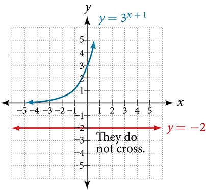\n\n

Try It

Solve ${2}^{x}=\mathrm{-100.}$

The equation has no solution.

Solving Exponential Equations Using Logarithms
==============================================

Sometimes the terms of an exponential equation cannot be rewritten with a common base. In these cases, we solve by taking the logarithm of each side. Recall, since $\mathrm{log}\left(a\right)=\mathrm{log}\left(b\right)$ is equivalent to $a=b,$ we may apply logarithms with the same base on both sides of an exponential equation.

How To
*Given an exponential equation in which a common base cannot be found, solve for the unknown.*

Apply the logarithm of both sides of the equation.
If one of the terms in the equation has base 10, use the common logarithm.
If none of the terms in the equation has base 10, use the natural logarithm.

Use the rules of logarithms to solve for the unknown.

Solving an Equation Containing Powers of Different Bases
========================================================

Solve ${5}^{x+2}={4}^{x}.$

 $$
\begin{array}{ll}{5}^{x+2}={4}^{x}\hfill & \text{There is no easy way to get the powers to have the same base}.\hfill \\ \mathrm{ln}{5}^{x+2}=\mathrm{ln}{4}^{x}\hfill & \text{Take ln of both sides}.\hfill \\ (x+2)\mathrm{ln}5=x\mathrm{ln}4\hfill & \text{Use laws of logs}.\hfill \\ x\mathrm{ln}5+2\mathrm{ln}5=x\mathrm{ln}4\hfill & \text{Use the distributive law}.\hfill \\ x\mathrm{ln}5-x\mathrm{ln}4=-2\mathrm{ln}5\hfill & \text{Get terms containing}\phantom{\rule{0.4em}{0ex}}x\phantom{\rule{0.4em}{0ex}}\text{on one side, terms without}\phantom{\rule{0.4em}{0ex}}x\phantom{\rule{0.4em}{0ex}}\text{on the other}.\hfill \\ x(\mathrm{ln}5-\mathrm{ln}4)=-2\mathrm{ln}5\hfill & \text{On the left hand side, factor out an}x.\hfill \\ x\mathrm{ln}\left(\frac{5}{4}\right)=\mathrm{ln}\left(\frac{1}{25}\right)\begin{array}{cccc}& & & \end{array}\hfill & \text{Use the laws of logs.}\hfill \\ x=\frac{\mathrm{ln}\left(\frac{1}{25}\right)}{\mathrm{ln}\left(\frac{5}{4}\right)}\hfill & \text{Divide by the coefficient of}\phantom{\rule{0.4em}{0ex}}x.\hfill \end{array}
$$

Try It

Solve ${2}^{x}={3}^{x+1}.$

$x={\scriptscriptstyle \frac{\mathrm{ln}3}{\mathrm{ln}\left(\raisebox{1ex}{$2$}\!\left/ \!\raisebox{-1ex}{$3$}\right.\right)}}$

Q&A
*Is there any way to solve ${2}^{x}={3}^{x}?$*

*Yes. The solution is $0.$*

Equations Containing *e*
========================

One common type of exponential equations are those with base $e.$ This constant occurs again and again in nature, in mathematics, in science, in engineering, and in finance. When we have an equation with a base $e$ on either side, we can use the **natural logarithm** to solve it.

How To
*Given an equation of the form $y=A{e}^{kt}\text{,}$ solve for $t.$*
Divide both sides of the equation by $A.$ 
Apply the natural logarithm of both sides of the equation.
Divide both sides of the equation by $k.$ 

Solve an Equation of the Form *y* = *Ae**kt*
============================================

Solve $100=20{e}^{2t}.$

 $$
\begin{array}{lll}100\hfill & =20{e}^{2t}\hfill & \hfill \\ 5\hfill & ={e}^{2t}\hfill & \text{Divide\ by\ the\ coefficient\ of\ the\ power.}\hfill \\ \mathrm{ln}5\hfill & =2t\hfill & \text{Take\ ln\ of\ both\ sides}\text{.\ Use\ the\ fact\ that\}\mathrm{ln}(x)\phantom{\rule{0.4em}{0ex}}\text{and\}{e}^{x}\phantom{\rule{0.5em}{0ex}}\text{are\ inverse\ functions}\text{.}\hfill \\ t\hfill & =\frac{\mathrm{ln}5}{2}\hfill & \text{Divide\ by\ the\ coefficient\ of\}t\text{.}\hfill \end{array}
$$ 

Analysis
========

Using laws of logs, we can also write this answer in the form $t=\mathrm{ln}\sqrt{5}.$ If we want a decimal approximation of the answer, we use a calculator.

Try It

Solve $3{e}^{0.5t}=11.$

$t=2\mathrm{ln}\left(\frac{11}{3}\right)$ or $\mathrm{ln}{\left(\frac{11}{3}\right)}^{2}$

Q&A
*Does every equation of the form* $y=A{e}^{kt}\phantom{\rule{0.5em}{0ex}}$ *have a solution?*
*No. There is a solution when $k\ne 0,$ and when $y$ and $A$ are either both 0 or neither 0, and they have the same sign. An example of an equation with this form that has no solution is $2=\mathrm{-3}{e}^{t}.$*

Solving an Equation That Can Be Simplified to the Form *y* = *Ae**kt*
=====================================================================

Solve $4{e}^{2x}+5=12.$

 $$
\begin{array}{ll}4{e}^{2x}+5=12\hfill & \hfill \\ 4{e}^{2x}=7\hfill & \text{Combine\ like\ terms}.\hfill \\ {e}^{2x}=\frac{7}{4}\hfill & \text{Divide\ by\ the\ coefficient\ of\ the\ power}.\hfill \\ 2x=\mathrm{ln}\left(\frac{7}{4}\right)\hfill & \text{Take\ ln\ of\ both\ sides}.\hfill \\ x=\frac{1}{2}\mathrm{ln}\left(\frac{7}{4}\right)\hfill & \text{Solve\ for\}x.\hfill \end{array}
$$

Try It

Solve $3+{e}^{2t}=7{e}^{2t}.$

$t=\mathrm{ln}\left(\frac{1}{\sqrt{2}}\right)=-\frac{1}{2}\mathrm{ln}\left(2\right)$

Extraneous Solutions
====================

Sometimes the methods used to solve an equation introduce an **extraneous solution**, which is a solution that is correct algebraically but does not satisfy the conditions of the original equation. One such situation arises in solving when the logarithm is taken on both sides of the equation. In such cases, remember that the argument of the logarithm must be positive. If the number we are evaluating in a logarithm function is negative, there is no output.

Solving Exponential Functions in Quadratic Form
===============================================

Solve ${e}^{2x}-{e}^{x}=56.$

 $\begin{array}{lll}\hfill {e}^{2x}-{e}^{x}& =56\hfill & \hfill \\ \hfill {e}^{2x}-{e}^{x}-56& =0\hfill & \text{Get one side of the equation equal to zero}.\hfill \\ \hfill ({e}^{x}+7)({e}^{x}-8)& =0\hfill & \text{Factor by the FOIL method}.\hfill \\ \hfill {e}^{x}+7& =0\phantom{\rule{0.4em}{0ex}}\text{or}{e}^{x}-8=0\begin{array}{cccc}& & & \end{array}\hfill & \text{If a product is zero, then one factor must be zero}.\hfill \\ \hfill {e}^{x}& =-7{\phantom{\rule{0.4em}{0ex}}\text{or e}}^{x}=8\hfill & \text{Isolate the exponentials}.\hfill \\ \hfill {e}^{x}& =8\hfill & \text{Reject the equation in which the power equals a negative number}.\hfill \\ \hfill x& =\mathrm{ln}8\hfill & \text{Solve the equation in which the power equals a positive number}.\hfill \end{array}$

Analysis
========

When we plan to use factoring to solve a problem, we always get zero on one side of the equation, because zero has the unique property that when a product is zero, one or both of the factors must be zero. We reject the equation ${e}^{x}=\mathrm{-7}$ because a positive number never equals a negative number. The solution $\mathrm{ln}(\mathrm{-7})$ is not a real number, and in the real number system this solution is rejected as an extraneous solution.

Try It

Solve ${e}^{2x}={e}^{x}+2.$

$x=\mathrm{ln}2$

Q&A
*Does every logarithmic equation have a solution?*

*No. Keep in mind that we can only apply the logarithm to a positive number. Always check for extraneous solutions.*

Using the Definition of a Logarithm to Solve Logarithmic Equations
==================================================================

We have already seen that every **logarithmic equation** ${\mathrm{log}}_{b}\left(x\right)=y$ is equivalent to the exponential equation ${b}^{y}=x.$ We can use this fact, along with the rules of logarithms, to solve logarithmic equations where the argument is an algebraic expression.

For example, consider the equation ${\mathrm{log}}_{2}\left(2\right)+{\mathrm{log}}_{2}\left(3x-5\right)=3.$ To solve this equation, we can use rules of logarithms to rewrite the left side in compact form and then apply the definition of logs to solve for $x:$
 $$
\begin{array}{ll}{\mathrm{log}}_{2}(2)+{\mathrm{log}}_{2}(3x-5)=3\hfill & \hfill \\ {\mathrm{log}}_{2}(2(3x-5))=3\hfill & \text{Apply the product rule of logarithms.}\hfill \\ {\mathrm{log}}_{2}(6x-10)=3\hfill & \text{Distribute}.\hfill \\ {2}^{3}=6x-10\hfill & \text{Apply the definition of a logarithm}.\hfill \\ 8=6x-10\begin{array}{cccc}& & & \end{array}\hfill & \text{Calculate}{2}^{3}.\hfill \\ 18=6x\hfill & \text{Add 10 to both sides}.\hfill \\ x=3\hfill & \text{Divide by 6}.\hfill \end{array}
$$

Using the Definition of a Logarithm to Solve Logarithmic Equations
==================================================================

For any algebraic expression $S$ and real numbers $b$ and $c,$ where $b>0,\phantom{\rule{0.5em}{0ex}}\text{}b\ne 1,$
 $$
{\mathrm{log}}_{b}(S)=c\phantom{\rule{0.5em}{0ex}}\phantom{\rule{0.5em}{0ex}}\text{if\ and\ only\ if}\phantom{\rule{0.5em}{0ex}}\phantom{\rule{0.5em}{0ex}}{b}^{c}=S
$$ 

Using Algebra to Solve a Logarithmic Equation
=============================================

Solve $2\mathrm{ln}x+3=7.$

 $$
\begin{array}{ll}2\mathrm{ln}x+3=7\hfill & \hfill \\ 2\mathrm{ln}x=4\hfill & \text{Subtract\ 3}.\hfill \\ \mathrm{ln}x=2\hfill & \text{Divide\ by\ 2}.\hfill \\ x={e}^{2}\hfill & \text{Rewrite\ in\ exponential\ form}.\hfill \end{array}
$$

Try It

Solve $6+\mathrm{ln}x=10.$

$x={e}^{4}$

Using Algebra Before and After Using the Definition of the Natural Logarithm
============================================================================

Solve $2\mathrm{ln}(6x)=7.$

 $$
\begin{array}{ll}2\mathrm{ln}(6x)=7\hfill & \hfill \\ \mathrm{ln}(6x)=\frac{7}{2}\hfill & \text{Divide\ by\ 2}.\hfill \\ 6x={e}^{\left(\frac{7}{2}\right)}\hfill & \text{Use\ the\ definition\ of\}\mathrm{ln}.\hfill \\ x=\frac{1}{6}{e}^{\left(\frac{7}{2}\right)}\hfill & \text{Divide\ by\ 6}.\hfill \end{array}
$$

Try It

Solve $2\mathrm{ln}(x+1)=10.$

$x={e}^{5}-1$

Using a Graph to Understand the Solution to a Logarithmic Equation
==================================================================

Solve $\mathrm{ln}x=3.$

 $$
\begin{array}{ll}\mathrm{ln}x=3\hfill & \hfill \\ x={e}^{3}\hfill & \text{Use\ the\ definition\ of\ the\ natural\ logarithm}\text{.}\hfill \end{array}
$$ represents the graph of the equation. On the graph, the *x*-coordinate of the point at which the two graphs intersect is close to 20. In other words ${e}^{3}\approx 20.$ A calculator gives a better approximation: ${e}^{3}\approx \mathrm{20.0855.}$

\n\n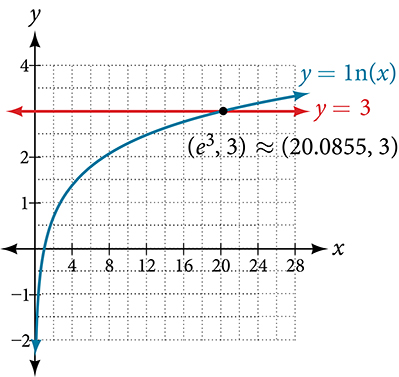\n\n

Try It

Use a graphing calculator to estimate the approximate solution to the logarithmic equation ${2}^{x}=1000$ to 2 decimal places.

$x\approx 9.97$

Using the One-to-One Property of Logarithms to Solve Logarithmic Equations
==========================================================================

As with exponential equations, we can use the one-to-one property to solve logarithmic equations. The one-to-one property of logarithmic functions tells us that, for any real numbers $x>0,$ $S>0,$ $T>0$ and any positive real number $b,$ where $b\ne 1,$
 ${\mathrm{log}}_{b}S={\mathrm{log}}_{b}T\phantom{\rule{0.5em}{0ex}}\text{if\ and\ only\ if\}S=T.$
For example,
 $\text{If\ \}{\mathrm{log}}_{2}(x-1)={\mathrm{log}}_{2}(8),\text{then\}x-1=8.$
So, if $x-1=8,$ then we can solve for $x,$ and we get $x=9.$ To check, we can substitute $x=9$ into the original equation: ${\mathrm{log}}_{2}\left(9-1\right)={\mathrm{log}}_{2}\left(8\right)=3.$ In other words, when a logarithmic equation has the same base on each side, the arguments must be equal. This also applies when the arguments are algebraic expressions. Therefore, when given an equation with logs of the same base on each side, we can use rules of logarithms to rewrite each side as a single logarithm. Then we use the fact that logarithmic functions are one-to-one to set the arguments equal to one another and solve for the unknown.

For example, consider the equation $\mathrm{log}\left(3x-2\right)-\mathrm{log}\left(2\right)=\mathrm{log}\left(x+4\right).$ To solve this equation, we can use the rules of logarithms to rewrite the left side as a single logarithm, and then apply the one-to-one property to solve for $x:$

 $$
\begin{array}{ll}\mathrm{log}(3x-2)-\mathrm{log}(2)=\mathrm{log}(x+4)\hfill & \hfill \\ \mathrm{log}\left(\frac{3x-2}{2}\right)=\mathrm{log}(x+4)\hfill & \text{Apply\ the\ quotient\ rule\ of\ logarithms}.\hfill \\ \frac{3x-2}{2}=x+4\hfill & \text{Apply\ the\ one\ to\ one\ property\ of\ a\ logarithm}.\hfill \\ 3x-2=2x+8\hfill & \text{Multiply\ both\ sides\ of\ the\ equation\ by\}2.\hfill \\ x=10\hfill & \text{Subtract\ 2}x\phantom{\rule{0.5em}{0ex}}\text{and\ add\ 2}.\hfill \end{array}
$$
To check the result, substitute $x=10$ into $\mathrm{log}\left(3x-2\right)-\mathrm{log}\left(2\right)=\mathrm{log}\left(x+4\right).$

 $$
\begin{array}{ll}\mathrm{log}(3(10)-2)-\mathrm{log}(2)=\mathrm{log}((10)+4)\hfill & \hfill \\ \mathrm{log}(28)-\mathrm{log}(2)=\mathrm{log}(14)\hfill & \hfill \\ \mathrm{log}\left(\frac{28}{2}\right)=\mathrm{log}(14)\hfill & \text{The\ solution\ checks}.\hfill \end{array}
$$

Using the One-to-One Property of Logarithms to Solve Logarithmic Equations
==========================================================================

For any algebraic expressions $S$ and $T$ and any positive real number $b,$ where $b\ne 1,$
 ${\mathrm{log}}_{b}S={\mathrm{log}}_{b}T\phantom{\rule{0.5em}{0ex}}\phantom{\rule{0.5em}{0ex}}\text{if\ and\ only\ if}\phantom{\rule{0.5em}{0ex}}\phantom{\rule{0.5em}{0ex}}S=T$ 
Note, when solving an equation involving logarithms, always check to see if the answer is correct or if it is an extraneous solution.

How To
*Given an equation containing logarithms, solve it using the one-to-one property.*

Use the rules of logarithms to combine like terms, if necessary, so that the resulting equation has the form ${\mathrm{log}}_{b}S={\mathrm{log}}_{b}T.$ 
Use the one-to-one property to set the arguments equal.
Solve the resulting equation, $S=T,$ for the unknown.

Solving an Equation Using the One-to-One Property of Logarithms
===============================================================

Solve $\mathrm{ln}({x}^{2})=\mathrm{ln}(2x+3).$

 $$
\begin{array}{ll}\mathrm{ln}({x}^{2})=\mathrm{ln}(2x+3)\hfill & \hfill \\ {x}^{2}=2x+3\hfill & \text{Use\ the\ one-to-one\ property\ of\ the\ logarithm}.\hfill \\ {x}^{2}-2x-3=0\hfill & \text{Get\ zero\ on\ one\ side\ before\ factoring}.\hfill \\ (x-3)(x+1)=0\hfill & \text{Factor\ using\ FOIL}.\hfill \\ x-3=0\phantom{\rule{0.5em}{0ex}}\text{or\}x+1=0\begin{array}{cccc}& & & \end{array}\hfill & \text{If\ a\ product\ is\ zero,\ one\ of\ the\ factors\ must\ be\ zero}.\hfill \\ x=3\phantom{\rule{0.4em}{0ex}}\text{or}\phantom{\rule{0.4em}{0ex}}x=-1\hfill & \text{Solve\ for\}x.\hfill \end{array}
$$

Analysis
========

There are two solutions: $3$ or $\mathrm{-1.}$ The solution $\mathrm{-1}$ is negative, but it checks when substituted into the original equation because the argument of the logarithm functions is still positive.

Try It

Solve $\mathrm{ln}({x}^{2})=\mathrm{ln}1.$

$x=1$ or $x=-1$

Solving Applied Problems Using Exponential and Logarithmic Equations
====================================================================

In previous sections, we learned the properties and rules for both exponential and logarithmic functions. We have seen that any exponential function can be written as a logarithmic function and vice versa. We have used exponents to solve logarithmic equations and logarithms to solve exponential equations. We are now ready to combine our skills to solve equations that model real-world situations, whether the unknown is in an exponent or in the argument of a logarithm.

One such application is in science, in calculating the time it takes for half of the unstable material in a sample of a radioactive substance to decay, called its **half-life**.  lists the half-life for several of the more common radioactive substances.

Substance
Use
Half-life

gallium-67
nuclear medicine
80 hours

cobalt-60
manufacturing
5.3 years

technetium-99m
nuclear medicine
6 hours

americium-241
construction
432 years

carbon-14
archeological dating
5,730 years

uranium-235
atomic power
703,800,000 years

We can see how widely the half-lives for these substances vary. Knowing the half-life of a substance allows us to calculate the amount remaining after a specified time. We can use the formula for radioactive decay:

 $$
\begin{array}{l}A(t)={A}_{0}{e}^{\frac{\mathrm{ln}(0.5)}{T}t}\hfill \\ A(t)={A}_{0}{e}^{\mathrm{ln}(0.5)\frac{t}{T}}\hfill \\ A(t)={A}_{0}{({e}^{\mathrm{ln}(0.5)})}^{\frac{t}{T}}\hfill \\ A(t)={A}_{0}{\left(\frac{1}{2}\right)}^{\frac{t}{T}}\hfill \end{array}
$$
where

 ${A}_{0}$ is the amount initially present
 $T$ is the half-life of the substance
 $t$ is the time period over which the substance is studied
 $A\left(t\right)$ is the amount of the substance present after time $t$ 

Using the Formula for Radioactive Decay to Find the Quantity of a Substance
===========================================================================

How long will it take for ten percent of a 1000-gram sample of uranium-235 to decay?

 $$
\begin{array}{ll}y=\text{1000}e\frac{\mathrm{ln}(0.5)}{\text{703,800,000}}t\hfill & \hfill \\ 900=1000{e}^{\frac{\mathrm{ln}(0.5)}{\text{703,800,000}}t}\hfill & \text{After 10\% decays, 900 grams are left}.\hfill \\ 0.9={e}^{\frac{\mathrm{ln}(0.5)}{\text{703,800,000}}t}\hfill & \text{Divide by 1000}.\hfill \\ \mathrm{ln}(0.9)=\mathrm{ln}\left({e}^{\frac{\mathrm{ln}(0.5)}{\text{703,800,000}}t}\right)\hfill & \text{Take ln of both sides}.\hfill \\ \mathrm{ln}(0.9)=\frac{\mathrm{ln}(0.5)}{\text{703,800,000}}t\hfill & \text{ln}({e}^{M})=M\hfill \\ t=\text{703,800,000}\times \frac{\mathrm{ln}(0.9)}{\mathrm{ln}(0.5)}\text{years}\begin{array}{cccc}& & & \end{array}\hfill & \text{Solve for}\phantom{\rule{0.4em}{0ex}}t.\hfill \\ t\approx \text{106,979,777 years}\hfill & \hfill \end{array}
$$

Analysis
========

Ten percent of 1000 grams is 100 grams. If 100 grams decay, the amount of uranium-235 remaining is 900 grams.

Try It

How long will it take before twenty percent of our 1000-gram sample of uranium-235 has decayed?

$t=703,800,000\times \frac{\mathrm{ln}(0.8)}{\mathrm{ln}(0.5)}\phantom{\rule{0.5em}{0ex}}\text{years\}\approx \phantom{\rule{0.5em}{0ex}}\text{}226,572,993\phantom{\rule{0.5em}{0ex}}\text{years}.$

Media
Access these online resources for additional instruction and practice with exponential and logarithmic equations.

Solving Logarithmic Equations
Solving Exponential Equations with Logarithms

Key Equations
=============

One-to-one property for exponential functions
For any algebraic expressions $\text{}S$ and $\text{}T$ and any positive real number $\text{}b,$ where ${b}^{S}={b}^{T}$ if and only if $\text{}S=T.$ 

Definition of a logarithm
For any algebraic expression *S* and positive real numbers $\text{}b\$ and $\text{}c,$ where $\text{}b\ne 1,$  ${\mathrm{log}}_{b}(S)=c$ if and only if $\text{}{b}^{c}=S.$ 

One-to-one property for logarithmic functions
For any algebraic expressions *S* and *T* and any positive real number $\text{}b,$ where $\text{}b\ne 1,$  ${\mathrm{log}}_{b}S={\mathrm{log}}_{b}T$ if and only if $\text{}S=T.$ 

Key Concepts
============

We can solve many exponential equations by using the rules of exponents to rewrite each side as a power with the same base. Then we use the fact that exponential functions are one-to-one to set the exponents equal to one another and solve for the unknown.
When we are given an exponential equation where the bases are explicitly shown as being equal, set the exponents equal to one another and solve for the unknown. See .
When we are given an exponential equation where the bases are *not* explicitly shown as being equal, rewrite each side of the equation as powers of the same base, then set the exponents equal to one another and solve for the unknown. See , , and .
When an exponential equation cannot be rewritten with a common base, solve by taking the logarithm of each side. See .
We can solve exponential equations with base $e,$ by applying the natural logarithm of both sides because exponential and logarithmic functions are inverses of each other. See  and .
After solving an exponential equation, check each solution in the original equation to find and eliminate any extraneous solutions. See .
When given an equation of the form ${\mathrm{log}}_{b}(S)=c,$ where $S$ is an algebraic expression, we can use the definition of a logarithm to rewrite the equation as the equivalent exponential equation ${b}^{c}=S,$ and solve for the unknown. See  and .
We can also use graphing to solve equations with the form ${\mathrm{log}}_{b}(S)=c.$ We graph both equations $y={\mathrm{log}}_{b}(S)$ and $y=c$ on the same coordinate plane and identify the solution as the *x-*value of the intersecting point. See .
When given an equation of the form ${\mathrm{log}}_{b}S={\mathrm{log}}_{b}T,$ where $S$ and $T$ are algebraic expressions, we can use the one-to-one property of logarithms to solve the equation $S=T$ for the unknown. See .
Combining the skills learned in this and previous sections, we can solve equations that model real world situations, whether the unknown is in an exponent or in the argument of a logarithm. See .

Section Exercises
=================

Verbal
======

How can an exponential equation be solved?

Determine first if the equation can be rewritten so that each side uses the same base. If so, the exponents can be set equal to each other. If the equation cannot be rewritten so that each side uses the same base, then apply the logarithm to each side and use properties of logarithms to solve.

When does an extraneous solution occur? How can an extraneous solution be recognized?

When can the one-to-one property of logarithms be used to solve an equation? When can it not be used?

The one-to-one property can be used if both sides of the equation can be rewritten as a single logarithm with the same base. If so, the arguments can be set equal to each other, and the resulting equation can be solved algebraically. The one-to-one property cannot be used when each side of the equation cannot be rewritten as a single logarithm with the same base.

Algebraic
=========

For the following exercises, use like bases to solve the exponential equation.

${4}^{-3v-2}={4}^{-v}$

$64\cdot {4}^{3x}=16$

$x=-\frac{1}{3}$

${3}^{2x+1}\cdot {3}^{x}=243$

${2}^{-3n}\cdot \frac{1}{4}={2}^{n+2}$

$n=-1$

$625\cdot {5}^{3x+3}=125$

$\frac{{36}^{3b}}{{36}^{2b}}={216}^{2-b}$

$b=\frac{6}{5}$

${\left(\frac{1}{64}\right)}^{3n}\cdot 8={2}^{6}$

For the following exercises, use logarithms to solve.

${9}^{x-10}=1$

$x=10$

$2{e}^{6x}=13$

${e}^{r+10}-10=\mathrm{-42}$

No solution

$2\cdot {10}^{9a}=29$

$-8\cdot {10}^{p+7}-7=\mathrm{-24}$

$p=\mathrm{log}\left(\frac{17}{8}\right)-7$

$7{e}^{3n-5}+5=\mathrm{-89}$

${e}^{-3k}+6=44$

$k=-\frac{\mathrm{ln}\left(38\right)}{3}$

$-5{e}^{9x-8}-8=\mathrm{-62}$

$-6{e}^{9x+8}+2=\mathrm{-74}$

$x=\frac{\mathrm{ln}\left(\frac{38}{3}\right)-8}{9}$

${2}^{x+1}={5}^{2x-1}$

${e}^{2x}-{e}^{x}-132=0$

$x=\mathrm{ln}12$

$7{e}^{8x+8}-5=\mathrm{-95}$

$10{e}^{8x+3}+2=8$

$x=\frac{\mathrm{ln}\left(\frac{3}{5}\right)-3}{8}$

$4{e}^{3x+3}-7=53$

$8{e}^{-5x-2}-4=\mathrm{-90}$

no solution

${3}^{2x+1}={7}^{x-2}$

${e}^{2x}-{e}^{x}-6=0$

$x=\mathrm{ln}\left(3\right)$

$3{e}^{3-3x}+6=\mathrm{-31}$

For the following exercises, use the definition of a logarithm to rewrite the equation as an exponential equation.

$\mathrm{log}\left(\frac{1}{100}\right)=\mathrm{-2}$

${10}^{-2}=\frac{1}{100}$

${\mathrm{log}}_{324}\left(18\right)=\frac{1}{2}$

For the following exercises, use the definition of a logarithm to solve the equation.

$5{\mathrm{log}}_{7}n=10$

$n=49$

$-8{\mathrm{log}}_{9}x=16$

$4+{\mathrm{log}}_{2}\left(9k\right)=2$

$k=\frac{1}{36}$

$2\mathrm{log}\left(8n+4\right)+6=10$

$10-4\mathrm{ln}\left(9-8x\right)=6$

$x=\frac{9-e}{8}$

For the following exercises, use the one-to-one property of logarithms to solve.

$\mathrm{ln}\left(10-3x\right)=\mathrm{ln}\left(-4x\right)$

${\mathrm{log}}_{13}\left(5n-2\right)={\mathrm{log}}_{13}\left(8-5n\right)$

$n=1$

$\mathrm{log}\left(x+3\right)-\mathrm{log}\left(x\right)=\mathrm{log}\left(74\right)$

$\mathrm{ln}\left(-3x\right)=\mathrm{ln}\left({x}^{2}-6x\right)$

No solution

${\mathrm{log}}_{4}\left(6-m\right)={\mathrm{log}}_{4}3m$

$\mathrm{ln}\left(x-2\right)-\mathrm{ln}\left(x\right)=\mathrm{ln}\left(54\right)$

No solution

${\mathrm{log}}_{9}\left(2{n}^{2}-14n\right)={\mathrm{log}}_{9}\left(-45+{n}^{2}\right)$

$\mathrm{ln}\left({x}^{2}-10\right)+\mathrm{ln}\left(9\right)=\mathrm{ln}\left(10\right)$

$x=\pm \frac{10}{3}$

For the following exercises, solve each equation for $x.$

$\mathrm{log}(x+12)=\mathrm{log}(x)+\mathrm{log}(12)$

$\mathrm{ln}(x)+\mathrm{ln}(x-3)=\mathrm{ln}(7x)$

$x=10$

${\mathrm{log}}_{2}(7x+6)=3$

$\mathrm{ln}\left(7\right)+\mathrm{ln}\left(2-4{x}^{2}\right)=\mathrm{ln}\left(14\right)$

$x=0$

${\mathrm{log}}_{8}\left(x+6\right)-{\mathrm{log}}_{8}\left(x\right)={\mathrm{log}}_{8}\left(58\right)$

$\mathrm{ln}\left(3\right)-\mathrm{ln}\left(3-3x\right)=\mathrm{ln}\left(4\right)$

$x=\frac{3}{4}$

${\mathrm{log}}_{3}\left(3x\right)-{\mathrm{log}}_{3}\left(6\right)={\mathrm{log}}_{3}\left(77\right)$

Graphical
=========

For the following exercises, solve the equation for $x,$ if there is a solution*.* Then graph both sides of the equation, and observe the point of intersection (if it exists) to verify the solution.

${\mathrm{log}}_{9}\left(x\right)-5=\mathrm{-4}$

$x=9$

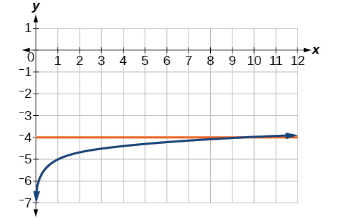

${\mathrm{log}}_{3}\left(x\right)+3=2$

$\mathrm{ln}\left(3x\right)=2$

$x=\frac{{e}^{2}}{3}\approx 2.5$

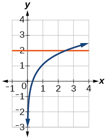

$\mathrm{ln}\left(x-5\right)=1$

$\mathrm{log}\left(4\right)+\mathrm{log}\left(-5x\right)=2$

$x=-5$

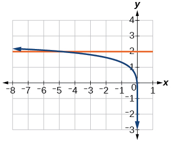

$-7+{\mathrm{log}}_{3}\left(4-x\right)=\mathrm{-6}$

$\mathrm{ln}\left(4x-10\right)-6=-5$

$x=\frac{e+10}{4}\approx 3.2$

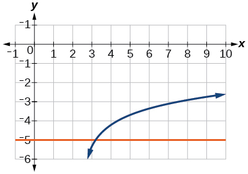

$\mathrm{log}\left(4-2x\right)=\mathrm{log}\left(-4x\right)$

${\mathrm{log}}_{11}\left(-2{x}^{2}-7x\right)={\mathrm{log}}_{11}\left(x-2\right)$

No solution

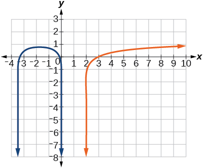

$\mathrm{ln}\left(2x+9\right)=\mathrm{ln}\left(-5x\right)$

${\mathrm{log}}_{9}\left(3-x\right)={\mathrm{log}}_{9}\left(4x-8\right)$

$x=\frac{11}{5}\approx 2.2$

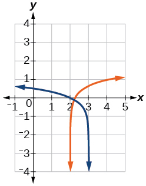

$\mathrm{log}\left({x}^{2}+13\right)=\mathrm{log}\left(7x+3\right)$

$\frac{3}{{\mathrm{log}}_{2}\left(10\right)}-\mathrm{log}\left(x-9\right)=\mathrm{log}\left(44\right)$

$x=\frac{101}{11}\approx 9.2$

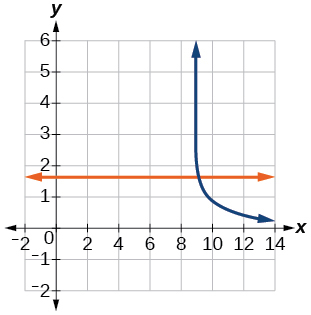

$\mathrm{ln}\left(x\right)-\mathrm{ln}\left(x+3\right)=\mathrm{ln}\left(6\right)$

For the following exercises, solve for the indicated value, and graph the situation showing the solution point.

An account with an initial deposit of $\text{\$6,500}$ earns $7.25\%$ annual interest, compounded continuously. How much will the account be worth after 20 years?

about $\$27,710.24$

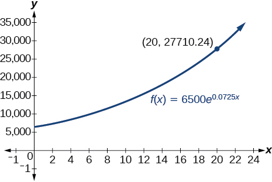

The formula for measuring sound intensity in decibels $D$ is defined by the equation $D=10\mathrm{log}\left(\frac{I}{{I}_{0}}\right),$ where $I$ is the intensity of the sound in watts per square meter and ${I}_{0}={10}^{-12}$ is the lowest level of sound that the average person can hear. How many decibels are emitted from a jet plane with a sound intensity of $8.3\cdot {10}^{2}$ watts per square meter?

The population of a small town is modeled by the equation $P=1650{e}^{0.5t}$ where $t$ is measured in years. In approximately how many years will the town’s population reach $\text{20,000?}$

about 5 years

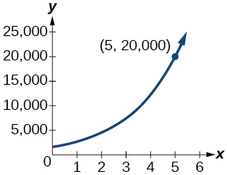

Technology
==========
For the following exercises, solve each equation by rewriting the exponential expression using the indicated logarithm. Then use a calculator to approximate the variable to 3 decimal places.

$1000{\left(1.03\right)}^{t}=5000$ using the common log.

${e}^{5x}=17$ using the natural log

$\frac{\mathrm{ln}(17)}{5}\approx 0.567$

$3{\left(1.04\right)}^{3t}=8$ using the common log

${3}^{4x-5}=38$ using the common log

$x=\frac{\mathrm{log}\left(38\right)+5\mathrm{log}\left(3\right)\phantom{\rule{0.5em}{0ex}}\text{\ \}}{4\mathrm{log}\left(3\right)}\approx 2.078$

$50{e}^{-0.12t}=10$ using the natural log

For the following exercises, use a calculator to solve the equation. Unless indicated otherwise, round all answers to the nearest ten-thousandth.

$7{e}^{3x-5}+7.9=47$

$x\approx 2.2401$

$\mathrm{ln}\left(3\right)+\mathrm{ln}\left(4.4x+6.8\right)=2$

$\mathrm{log}\left(-0.7x-9\right)=1+5\mathrm{log}\left(5\right)$

$x\approx -\text{44655}.\text{7143}$

Atmospheric pressure $P$ in pounds per square inch is represented by the formula $P=14.7{e}^{-0.21x},$ where $x$ is the number of miles above sea level. To the nearest foot, how high is the peak of a mountain with an atmospheric pressure of $8.369$ pounds per square inch? (*Hint*: there are 5280 feet in a mile)

The magnitude *M*of an earthquake is represented by the equation $M=\frac{2}{3}\mathrm{log}\left(\frac{E}{{E}_{0}}\right)$ where $E$ is the amount of energy released by the earthquake in joules and ${E}_{0}={10}^{4.4}$ is the assigned minimal measure released by an earthquake. To the nearest hundredth, what would the magnitude be of an earthquake releasing $1.4\cdot {10}^{13}$ joules of energy?

about $5.83$

Extensions
==========

Use the definition of a logarithm along with the one-to-one property of logarithms to prove that ${b}^{{\mathrm{log}}_{b}x}=x.$

Recall the formula for continually compounding interest, $y=A{e}^{kt}.$ Use the definition of a logarithm along with properties of logarithms to solve the formula for time $t$ such that $t$ is equal to a single logarithm.

$t=\mathrm{ln}\left({\left(\frac{y}{A}\right)}^{\frac{1}{k}}\right)$

Recall the compound interest formula $A=a{\left(1+\frac{r}{k}\right)}^{kt}.$ Use the definition of a logarithm along with properties of logarithms to solve the formula for time $t.$

Newton’s Law of Cooling states that the temperature $T$ of an object at any time *t* can be described by the equation $T={T}_{s}+\left({T}_{0}-{T}_{s}\right){e}^{-kt},$ where ${T}_{s}$ is the temperature of the surrounding environment, ${T}_{0}$ is the initial temperature of the object, and $k$ is the cooling rate. Use the definition of a logarithm along with properties of logarithms to solve the formula for time $t$ such that $t$ is equal to a single logarithm.

$t=\mathrm{ln}\left({\left(\frac{T-{T}_{s}}{{T}_{0}-{T}_{s}}\right)}^{-\phantom{\rule{0.4em}{0ex}}\frac{1}{k}}\right)$

**extraneous solution**
a solution introduced while solving an equation that does not satisfy the conditions of the original equation
