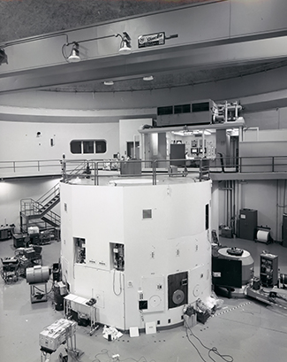
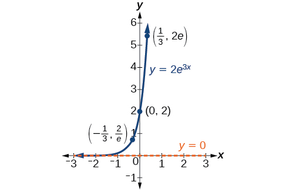
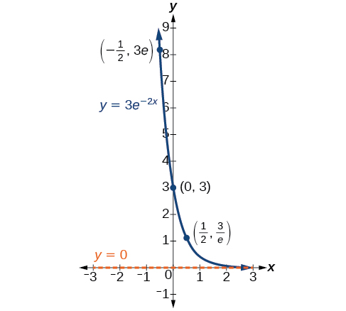
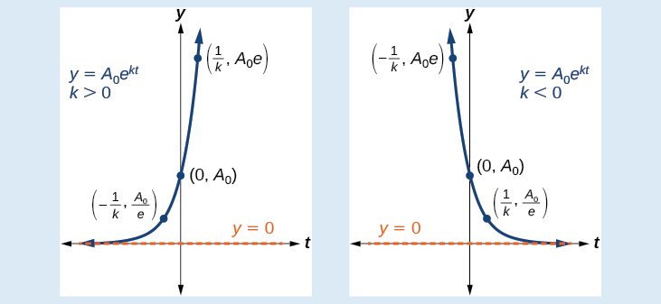
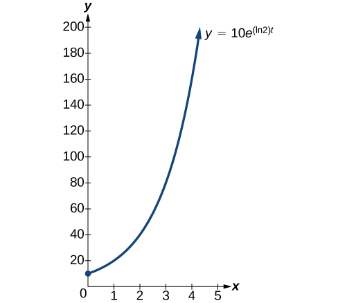
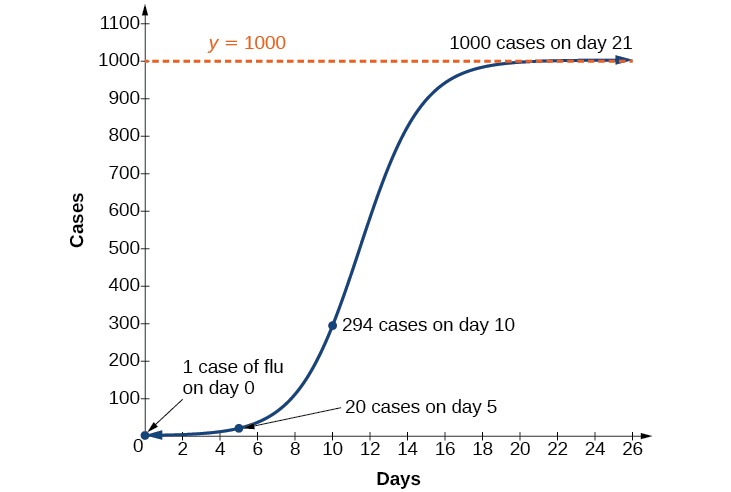
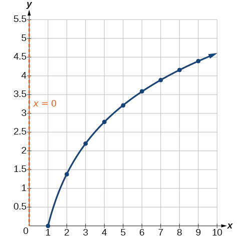

Exponential and Logarithmic Models
==================================

  m49367
  
Exponential and Logarithmic Models
==================================

  In this section, you will:

Model exponential growth and decay.
Use Newton’s Law of Cooling.
Use logistic-growth models.
Choose an appropriate model for data.
Express an exponential model in base $$e$$ .

  feda96a1-a0f3-41ce-9d42-43eef361a909

Learning Objectives
===================
Use exponential models in applications. (IA 10.2.3)
Use logarithmic models in applications. (IA 10.3.5)
Objective 1: Use exponential models in applications. (IA 10.2.3)
================================================================

Vocabulary
==========
Fill in the blanks.
An *Exponential Function* is the function in the form $$f(x)=$$ _________, where $$a>$$ _________.
The *Natural Exponential Function* is an exponential function whose base is _________.
This *irrational number*_________ approximately equals _________.
Using exponential models
========================
Exponential functions model many situations. If you have a savings account, you have experienced the use of an exponential function. There are two formulas that are used to determine the balance in the account when interest is earned. If a principal, *P*, is invested at an interest rate, *r*, for *t* years, the new balance, *A*, will depend on how often the interest is compounded.

Compound Interest
=================
For a principal, *P*, invested at an interest rate, *r*, for *t* years, the new balance, *A*, is:

 $$\begin{array}{}\\ \\ A=P{\left(1+\frac{r}{n}\right)}^{nt}\hfill & & & & & \text{when compounded}\phantom{\rule{0.2em}{0ex}}n\phantom{\rule{0.2em}{0ex}}\text{times a year.}\hfill \\ A=P{e}^{rt}\hfill & & & & & \text{when compounded continuously.}\hfill \end{array}$$ 
A total of $$\text{\$}\mathrm{10,000}$$ was invested in a college fund for a new grandchild.

ⓐ
If the interest rate is $$5\text{\%},$$ how much will be in the account in 18 years by each method of compounding?

ⓑ compound quarterly

ⓒ compound monthly

ⓓ compound continuously

ⓐ

 $$\phantom{\rule{3em}{0ex}}A=?$$ 

Identify the values of each variable in the formulas.
 $$\phantom{\rule{3em}{0ex}}P=\text{\$}\mathrm{10,000}$$ 

Remember to express the percent as a decimal.
 $$\phantom{\rule{3em}{0ex}}r=0.05$$ 

 $$\phantom{\rule{3em}{0ex}}t=18\phantom{\rule{0.2em}{0ex}}\text{years}$$

ⓑ

For quarterly compounding, $$n=4$$. There are 4 quarters in a year.
 $$\phantom{\rule{3em}{0ex}}A=P{\left(1+\frac{r}{n}\right)}^{nt}$$ 

Substitute the values in the formula.
 $$\phantom{\rule{3em}{0ex}}A=\mathrm{10,000}{\left(1+\frac{0.05}{4}\right)}^{4\xb718}$$ 

Compute the amount. Be careful to consider the order of operations as you enter the expression into your calculator.
 $$\phantom{\rule{3em}{0ex}}A=\text{\$}\mathrm{24,459.20}$$

ⓒ

For monthly compounding, $$n=12$$ . There are 12 months in a year.
 $$\phantom{\rule{3em}{0ex}}A=P{\left(1+\frac{r}{n}\right)}^{nt}$$ 

Substitute the values in the formula.
 $$\phantom{\rule{3em}{0ex}}A=\mathrm{10,000}{\left(1+\frac{0.05}{12}\right)}^{12\xb718}$$ 

Compute the amount.
 $$\phantom{\rule{3em}{0ex}}A=\text{\$}\mathrm{24,550.08}$$

ⓓ

For compounding continuously,
 $$\phantom{\rule{3em}{0ex}}A=P{e}^{rt}$$ 

Substitute the values in the formula.
 $$\phantom{\rule{3em}{0ex}}A=\mathrm{10,000}{e}^{0.05\xb718}$$ 

Compute the amount.
 $$\phantom{\rule{3em}{0ex}}A=\text{\$}\mathrm{24,596.03}$$

Exponential Growth and Decay
============================
Other topics that are modeled by exponential functions involve growth and decay. Both also use the formula $$A=P{e}^{rt}$$ we used for the growth of money. For growth and decay, generally we use $${A}_{0},$$ as the original amount instead of calling it $$P,$$ the principal. We see that **exponential growth** has a positive rate of growth and **exponential decay** has a negative rate of growth.

Exponential Growth and Decay
============================
For an original amount, $${A}_{0},$$ that grows or decays at a rate, *r*, for a certain time, *t*, the final amount, *A*, is:

 $$A={A}_{0}{e}^{rt}$$ Chris is a researcher at the Center for Disease Control and Prevention and he is trying to understand the behavior of a new and dangerous virus. He starts his experiment with 100 of the virus that grows at a rate of 25% per hour. He will check on the virus in 24 hours. How many viruses will he find?

Identify the values of each variable in the formulas.
 $$\phantom{\rule{0.5em}{0ex}}A=?$$ 

Be sure to put the percent in decimal form.
 $${A}_{0}=100$$ 

Be sure the units match—the rate is per hour and the time is in hours.
 $$r=0.25\text{/hour}$$ 

 $$t=24\phantom{\rule{0.2em}{0ex}}\text{hours}$$ 

Substitute the values in the formula: $$A={A}_{0}{e}^{rt}$$ .
 $$A=100{e}^{0.25\xb724}$$ 

Compute the amount.
 $$A=\mathrm{40,342.88}$$ 

Round to the nearest whole virus.
 $$A=\mathrm{40,343}$$ 

The researcher will find 40,343 viruses.

Practice Makes Perfect
======================

Angela invested $$\text{\$}\mathrm{15,000}$$ in a savings account. If the interest rate is $$4\text{\%},$$ how much will be in the account in 10 years by each method of compounding?

ⓐ compound quarterly

ⓑ compound monthly

ⓒ compound continuously

Another researcher at the Center for Disease Control and Prevention, Lisa, is studying the growth of a bacteria. She starts her experiment with 50 of the bacteria that grows at a rate of $$15\text{\%}$$ per hour. She will check on the bacteria every 8 hours. How many bacteria will she find in 8 hours?

Objective 2: Use logarithmic models in applications. (IA 10.3.5)
================================================================

Vocabulary
==========
Fill in the blanks.
A **Logarithmic Function** is the function in the form $$f(x)=$$ ________, where $$a>$$ ________, $$x>$$ ________, and $$a\ne $$ ________.
The Logarithmic Function $$f(x)=lnx$$ is called the ________ and has a base ________.
Decibel Level of Sound
======================
There are many applications that are modeled by logarithmic equations. We will first look at the logarithmic equation that gives the decibel (dB) level of sound. Decibels range from 0, which is barely audible to 160, which can rupture an eardrum. The10-12 in the formula represents the intensity of sound that is barely audible.
**The loudness level, *D***, measured in decibels, of a sound of intensity, *I*, measured in watts per square inch is

 $$D=10\phantom{\rule{0.2em}{0ex}}\text{log}\left(\frac{I}{{10}^{\mathrm{-12}}}\right)$$ Use logarithmic models in applications.

  Extended exposure to noise that measures 85 dB can cause permanent damage to the inner ear which will result in hearing loss. What is the decibel level of music coming through earphones with intensity $${10}^{-2}$$ watts per square inch?

  Substitute in the intensity level, I.
 $$D=10\ \text{log}\left(\frac{{10}^{-2}}{{10}^{-12}}\right)$$ 

Simplify.
 $$D=10\ \mathrm{log}\left({10}^{10}\right)$$ 

Since $$\text{log}{10}^{10}=10$$ 
 $$D=10\times 10$$ 

Multiply.
 $$D=100$$

The magnitude $$R$$ of an earthquake is measured by a logarithmic scale called the Richter scale. The model is $$R=\text{log}\phantom{\rule{0.2em}{0ex}}I,$$ where $$I$$ is the intensity of the shock wave. This model provides a way to measure **earthquake intensity**.

Earthquake Intensity
====================
The magnitude *R* of an earthquake is measured by $$R=\text{log}\phantom{\rule{0.2em}{0ex}}I,$$ where *I* is the intensity of its shock wave.

In 1906, San Francisco experienced an intense earthquake with a magnitude of 7.8 on the Richter scale. Over 80% of the city was destroyed by the resulting fires. In 2014, Los Angeles experienced a moderate earthquake that measured 5.1 on the Richter scale and caused $108 million dollars of damage. Compare the intensities of the two earthquakes.

To compare the intensities, we first need to convert the magnitudes to intensities using the log formula. Then we will set up a ratio to compare the intensities.

Convert the magnitudes to intensities.
 $$R=\text{log}\phantom{\rule{0.2em}{0ex}}I$$ 

1906 earthquake
 $$7.8=\text{log}\phantom{\rule{0.2em}{0ex}}I$$ 

Convert to exponential form.
 $$I={10}^{7.8}$$ 

2014 earthquake
 $$5.1=\text{log}\phantom{\rule{0.2em}{0ex}}I$$ 

Convert to exponential form.
 $$I={10}^{5.1}$$ 

Form a ratio of the intensities.
 $$\frac{\text{Intensity}\phantom{\rule{0.2em}{0ex}}\text{for}\phantom{\rule{0.2em}{0ex}}1906}{\text{Intensity}\phantom{\rule{0.2em}{0ex}}\text{for}\phantom{\rule{0.2em}{0ex}}2014}$$ 

Substitute in the values.
 $$\frac{{10}^{7.8}}{{10}^{5.1}}$$ 

Divide by subtracting the exponents.
 $${10}^{2.7}$$ 

Evaluate.
 $$501$$ 

Answer:
The intensity of the 1906 earthquake was about 501 times the intensity of the 2014 earthquake.

Practice Makes Perfect
======================
Use logarithmic models in applications.

  What is the decibel level of one of the new quiet dishwashers with intensity $${10}^{\mathrm{-7}}$$ watts per square inch?

  In 1906, San Francisco experienced an intense earthquake with a magnitude of 7.8 on the Richter scale. In 1989, the Loma Prieta earthquake also affected the San Francisco area, and measured 6.9 on the Richter scale. Compare the intensities of the two earthquakes.

\n\n\n\nWe have already explored some basic applications of exponential and logarithmic functions. In this section, we explore some important applications in more depth, including radioactive isotopes and Newton’s Law of Cooling.

Modeling Exponential Growth and Decay
=====================================
In real-world applications, we need to model the behavior of a function. In mathematical modeling, we choose a familiar general function with properties that suggest that it will model the real-world phenomenon we wish to analyze. In the case of rapid growth, we may choose the exponential growth function:
 $$
y={A}_{0}{e}^{kt}
$$

where $${A}_{0}$$ is equal to the value at time zero, $$e$$ is Euler’s constant, and $$k$$ is a positive constant that determines the rate (percentage) of growth. We may use the **exponential growth** function in applications involving *doubling time*, the time it takes for a quantity to double. Such phenomena as wildlife populations, financial investments, biological samples, and natural resources may exhibit growth based on a doubling time. In some applications, however, as we will see when we discuss the logistic equation, the logistic model sometimes fits the data better than the exponential model.
On the other hand, if a quantity is falling rapidly toward zero, without ever reaching zero, then we should probably choose the **exponential decay** model. Again, we have the form $$y={A}_{0}{e}^{kt}$$ where $${A}_{0}$$ is the starting value, and $$e$$ is Euler’s constant. Now $$k$$ is a negative constant that determines the rate of decay. We may use the exponential decay model when we are calculating **half-life**, or the time it takes for a substance to exponentially decay to half of its original quantity. We use half-life in applications involving radioactive isotopes.
In our choice of a function to serve as a mathematical model, we often use data points gathered by careful observation and measurement to construct points on a graph and hope we can recognize the shape of the graph. Exponential growth and decay graphs have a distinctive shape, as we can see in  and . It is important to remember that, although parts of each of the two graphs seem to lie on the *x*-axis, they are really a tiny distance above the *x*-axis.

\n\n\n\n

\n\n\n\n

Exponential growth and decay often involve very large or very small numbers. To describe these numbers, we often use orders of magnitude. The **order of magnitude** is the power of ten, when the number is expressed in scientific notation, with one digit to the left of the decimal. For example, the distance to the nearest star, **Proxima Centauri**, measured in kilometers, is 40,113,497,200,000 kilometers. Expressed in scientific notation, this is $$4.01134972\phantom{\rule{0.5em}{0ex}}\times \phantom{\rule{0.5em}{0ex}}{10}^{13}.$$ So, we could describe this number as having order of magnitude $${10}^{13}.$$

Characteristics of the Exponential Function, $$y={A}_{0}{e}^{kt}$$
==================================================================

An exponential function with the form $$y={A}_{0}{e}^{kt}$$ has the following characteristics:

one-to-one function
horizontal asymptote: $$y=0$$ 
domain: $$(\u2013\infty ,\ \infty )$$ 
range: $$(0,\infty )$$ 
x intercept: none
y-intercept: $$\left(0,{A}_{0}\right)$$ 
increasing if $$k>0$$ (see )
decreasing if $$k<0$$ (see )

\n\n\n\n

Graphing Exponential Growth
===========================

A population of bacteria doubles every hour. If the culture started with 10 bacteria, graph the population as a function of time.

When an amount grows at a fixed percent per unit time, the growth is exponential. To find $${A}_{0}$$ we use the fact that $${A}_{0}$$ is the amount at time zero, so $${A}_{0}=10.$$ To find $$k,$$ use the fact that after one hour $$\left(t=1\right)$$ the population doubles from $$10$$ to $$20.$$ The formula is derived as follows

 $$
\begin{array}{ll}20=10{e}^{k\cdot 1}\hfill & \hfill \\ 2={e}^{k}\hfill & \text{Divide\ by\ 10}\hfill \\ \mathrm{ln}2=k\hfill & \text{Take\ the\ natural\ logarithm}\hfill \end{array}
$$
so $$k=\mathrm{ln}(2).$$ Thus the equation we want to graph is $$y=10{e}^{(\mathrm{ln}2)t}=10{({e}^{\mathrm{ln}2})}^{t}=10\xb7{2}^{t}.$$ The graph is shown in .

\n\n\n\n

Analysis
========

The population of bacteria after ten hours is 10,240. We could describe this amount is being of the order of magnitude $${10}^{4}.$$ The population of bacteria after twenty hours is 10,485,760 which is of the order of magnitude $${10}^{7},$$ so we could say that the population has increased by three orders of magnitude in ten hours.

Half-Life
=========
We now turn to **exponential decay**. One of the common terms associated with exponential decay, as stated above, is *half-life*, the length of time it takes an exponentially decaying quantity to decrease to half its original amount. Every radioactive isotope has a half-life, and the process describing the exponential decay of an isotope is called radioactive decay.
To find the half-life of a function describing exponential decay, solve the following equation:

 $$
\frac{1}{2}{A}_{0}={A}_{o}{e}^{kt}
$$ We find that the half-life depends only on the constant $$k$$ and not on the starting quantity $${A}_{0}.$$

The formula is derived as follows
 $$
\begin{array}{ll}\frac{1}{2}{A}_{0}={A}_{o}{e}^{kt}\hfill & \hfill \\ \frac{1}{2}={e}^{kt}\hfill & \text{Divide by}{A}_{0}.\hfill \\ \mathrm{ln}\left(\frac{1}{2}\right)=kt\hfill & \text{Take the natural log}.\hfill \\ -\mathrm{ln}(2)=kt\hfill & \text{Apply laws of logarithms}.\hfill \\ -\frac{\mathrm{ln}(2)}{k}=t\hfill & \text{Divide by}k.\hfill \end{array}
$$
Since $$t,$$ the time, is positive, $$k$$ must, as expected, be negative. This gives us the half-life formula

 $$
t=-\frac{\mathrm{ln}(2)}{k}
$$

How To
*Given the half-life, find the decay rate.*

Write $$A={A}_{o}{e}^{kt}.$$ 
Replace $$A$$ by $$\frac{1}{2}{A}_{0}$$ and replace $$t$$ by the given half-life.
Solve to find $$k.$$ Express $$k$$ as an exact value (do not round).

Note: *It is also possible to find the decay rate using* $$k=-\frac{\mathrm{ln}(2)}{t}.$$

Finding the Function that Describes Radioactive Decay
=====================================================

The half-life of carbon-14 is 5,730 years. Express the amount of carbon-14 remaining as a function of time, $$t.$$

This formula is derived as follows.
 $$\begin{array}{ll}A={A}_{0}{e}^{kt}\hfill & \text{The continuous growth formula}.\hfill \\ 0.5{A}_{0}={A}_{0}{e}^{k\cdot 5730}\hfill & \text{Substitute the half-life for}t\phantom{\rule{0.5em}{0ex}}\text{and}0.5{A}_{0}\phantom{\rule{0.5em}{0ex}}\text{for}f(t).\hfill \\ 0.5={e}^{5730k}\hfill & \text{Divide by}{A}_{0}.\hfill \\ \mathrm{ln}(0.5)=5730k\hfill & \text{Take the natural log of both sides}.\hfill \\ k=\frac{\mathrm{ln}(0.5)}{5730}\hfill & \text{Divide by the coefficient of}k.\hfill \\ A={A}_{0}{e}^{\left(\frac{\mathrm{ln}(0.5)}{5730}\right)t}\hfill & \text{Substitute for}r\phantom{\rule{0.5em}{0ex}}\text{in the continuous growth formula}.\hfill \end{array}$$
The function that describes this continuous decay is $$f(t)={A}_{0}{e}^{\left(\frac{\mathrm{ln}(0.5)}{5730}\right)t}.$$ We observe that the coefficient of $$t,$$ $$\frac{\mathrm{ln}(0.5)}{5730}\approx -1.2097\times {10}^{\mathrm{-4}}$$ is negative, as expected in the case of exponential decay.

Try It

The half-life of plutonium-244 is 80,000,000 years. Find a function that gives the amount of plutonium-244 remaining as a function of time, measured in years.

$$f(t)={A}_{0}{e}^{-0.0000000087t}$$

Radiocarbon Dating
==================

The formula for radioactive decay is important in **radiocarbon dating**, which is used to calculate the approximate date a plant or animal died. Radiocarbon dating was discovered in 1949 by Willard Libby, who won a Nobel Prize for his discovery. It compares the difference between the ratio of two isotopes of carbon in an organic artifact or fossil to the ratio of those two isotopes in the air. It is believed to be accurate to within about 1% error for plants or animals that died within the last 60,000 years.

Carbon-14 is a radioactive isotope of carbon that has a half-life of 5,730 years. It occurs in small quantities in the carbon dioxide in the air we breathe. Most of the carbon on Earth is carbon-12, which has an atomic weight of 12 and is not radioactive. Scientists have determined the ratio of carbon-14 to carbon-12 in the air for the last 60,000 years, using tree rings and other organic samples of known dates—although the ratio has changed slightly over the centuries.
As long as a plant or animal is alive, the ratio of the two isotopes of carbon in its body is close to the ratio in the atmosphere. When it dies, the carbon-14 in its body decays and is not replaced. By comparing the ratio of carbon-14 to carbon-12 in a decaying sample to the known ratio in the atmosphere, the date the plant or animal died can be approximated.

Since the half-life of carbon-14 is 5,730 years, the formula for the amount of carbon-14 remaining after $$t$$ years is
 $$
A\approx {A}_{0}{e}^{\left(\frac{\mathrm{ln}(0.5)}{5730}\right)t}
$$ where
$$A$$ is the amount of carbon-14 remaining
 $${A}_{0}$$ is the amount of carbon-14 when the plant or animal began decaying.
This formula is derived as follows:
 $$
\begin{array}{ll}A={A}_{0}{e}^{kt}\hfill & \text{The continuous growth formula}.\hfill \\ \text{}0.5{A}_{0}={A}_{0}{e}^{k\cdot 5730}\hfill & \text{Substitute the half-life for}\phantom{\rule{0.4em}{0ex}}t\phantom{\rule{0.4em}{0ex}}\text{and}\phantom{\rule{0.4em}{0ex}}0.5{A}_{0}\phantom{\rule{0.4em}{0ex}}\text{for}\phantom{\rule{0.4em}{0ex}}f(t).\hfill \\ 0.5={e}^{5730k}\hfill & \text{Divide by}\phantom{\rule{0.4em}{0ex}}{A}_{0}.\hfill \\ \mathrm{ln}(0.5)=5730k\hfill & \text{Take the natural log of both sides}.\hfill \\ k=\frac{\mathrm{ln}(0.5)}{5730}\hfill & \text{Divide by the coefficient of}\phantom{\rule{0.4em}{0ex}}k.\hfill \\ A={A}_{0}{e}^{\left(\frac{\mathrm{ln}(0.5)}{5730}\right)t}\hfill & \text{Substitute for}\phantom{\rule{0.4em}{0ex}}k\phantom{\rule{0.4em}{0ex}}\text{in the continuous growth formula}.\hfill \end{array}
$$ To find the age of an object, we solve this equation for $$t:$$

 $$
t=\frac{\mathrm{ln}\left(\frac{A}{{A}_{0}}\right)}{-0.000121}
$$ Out of necessity, we neglect here the many details that a scientist takes into consideration when doing carbon-14 dating, and we only look at the basic formula. The ratio of carbon-14 to carbon-12 in the atmosphere is approximately 0.0000000001%. Let $$r$$ be the ratio of carbon-14 to carbon-12 in the organic artifact or fossil to be dated, determined by a method called liquid scintillation. From the equation $$A\approx {A}_{0}{e}^{-0.000121t}$$ we know the ratio of the percentage of carbon-14 in the object we are dating to the initial amount of carbon-14 in the object when it was formed is $$r=\frac{A}{{A}_{0}}\approx {e}^{-0.000121t}.$$ We solve this equation for $$t,$$ to get

 $$
t=\frac{\mathrm{ln}\left(r\right)}{-0.000121}
$$ 

How To
*Given the percentage of carbon-14 in an object, determine its age.*

Express the given percentage of carbon-14 as an equivalent decimal, $$k.$$ 
Substitute for *k* in the equation $$t=\frac{\mathrm{ln}\left(r\right)}{-0.000121}$$ and solve for the age, $$t.$$ 

Finding the Age of a Bone
=========================

A bone fragment is found that contains 20% of its original carbon-14. To the nearest year, how old is the bone?

We substitute $$20\%=0.20$$ for $$r$$ in the equation and solve for $$t:$$
 $$
\begin{array}{ll}t=\frac{\mathrm{ln}(r)}{-0.000121}\hfill & \text{Use\ the\ general\ form\ of\ the\ equation}.\hfill \\ =\frac{\mathrm{ln}(0.20)}{-0.000121}\begin{array}{cccc}& & & \end{array}\hfill & \text{Substitute\ for\}r.\hfill \\ \approx 13301\hfill & \text{Round\ to\ the\ nearest\ year}.\hfill \end{array}
$$
The bone fragment is about 13,301 years old.

Analysis
========

The instruments that measure the percentage of carbon-14 are extremely sensitive and, as we mention above, a scientist will need to do much more work than we did in order to be satisfied. Even so, carbon dating is only accurate to about 1%, so this age should be given as $$\text{13,301\ years}\pm \text{1\%\ or\ 13,301\ years}\pm \text{133\ years}\text{.}$$

Try It

Cesium-137 has a half-life of about 30 years. If we begin with 200 mg of cesium-137, will it take more or less than 230 years until only 1 milligram remains?

less than 230 years, 229.3157 to be exact

Calculating Doubling Time
=========================

For decaying quantities, we determined how long it took for half of a substance to decay. For growing quantities, we might want to find out how long it takes for a quantity to double. As we mentioned above, the time it takes for a quantity to double is called the **doubling time**.

Given the basic **exponential growth** equation $$A={A}_{0}{e}^{kt},$$ doubling time can be found by solving for when the original quantity has doubled, that is, by solving $$2{A}_{0}={A}_{0}{e}^{kt}.$$
The formula is derived as follows:
 $$
\begin{array}{ll}2{A}_{0}={A}_{0}{e}^{kt}\hfill & \hfill \\ 2={e}^{kt}\hfill & \text{Divide by}{A}_{0}.\hfill \\ \mathrm{ln}2=kt\hfill & \text{Take the natural logarithm}.\hfill \\ t=\frac{\mathrm{ln}2}{k}\hfill & \text{Divide by the coefficient of}t.\hfill \end{array}
$$ Thus the doubling time is
$$
t=\frac{\mathrm{ln}2}{k}
$$ 

Finding a Function That Describes Exponential Growth
====================================================

According to Moore’s Law, the doubling time for the number of transistors that can be put on a computer chip is approximately two years. Give a function that describes this behavior.

The formula is derived as follows:
 $$
\begin{array}{ll}t=\frac{\mathrm{ln}2}{k}\hfill & \text{The doubling time formula}.\hfill \\ 2=\frac{\mathrm{ln}2}{k}\hfill & \text{Use a doubling time of two years}.\hfill \\ k=\frac{\mathrm{ln}2}{2}\hfill & \text{Multiply by}\phantom{\rule{0.4em}{0ex}}k\phantom{\rule{0.4em}{0ex}}\text{and divide by 2}.\hfill \\ A\phantom{\rule{0.5em}{0ex}}={A}_{0}{e}^{\frac{\mathrm{ln}2}{2}t}\begin{array}{cccc}& & & \end{array}\hfill & \text{Substitute}\phantom{\rule{0.4em}{0ex}}k\phantom{\rule{0.4em}{0ex}}\text{into the continuous growth formula}.\hfill \end{array}
$$
The function is $${A}_{0}{e}^{\frac{\mathrm{ln}2}{2}t}.$$

Try It

Recent data suggests that, as of 2013, the rate of growth predicted by Moore’s Law no longer holds. Growth has slowed to a doubling time of approximately three years. Find the new function that takes that longer doubling time into account.

$$f(t)={A}_{0}{e}^{\frac{\mathrm{ln}2}{3}t}$$

Using Newton’s Law of Cooling
=============================

Exponential decay can also be applied to temperature. When a hot object is left in surrounding air that is at a lower temperature, the object’s temperature will decrease exponentially, leveling off as it approaches the surrounding air temperature. On a graph of the temperature function, the leveling off will correspond to a horizontal asymptote at the temperature of the surrounding air. Unless the room temperature is zero, this will correspond to a **vertical shift** of the generic **exponential decay** function. This translation leads to **Newton’s Law of Cooling**, the scientific formula for temperature as a function of time as an object’s temperature is equalized with the ambient temperature

 $$
T(t)=A{e}^{kt}+{T}_{s}
$$
This formula is derived as follows:
 $$
\begin{array}{ll}T(t)=A{b}^{ct}+{T}_{s}\hfill & \hfill \\ T(t)=A{e}^{\mathrm{ln}({b}^{ct})}+{T}_{s}\begin{array}{cccc}& & & \end{array}\hfill & \text{Laws\ of\ logarithms}.\hfill \\ T(t)=A{e}^{ct\mathrm{ln}b}+{T}_{s}\hfill & \text{Laws\ of\ logarithms}.\hfill \\ T(t)=A{e}^{kt}+{T}_{s}\hfill & \text{Rename\ the\ constant\}c\ \mathrm{ln}\ b,\phantom{\rule{0.5em}{0ex}}\text{calling\ it\}k.\hfill \end{array}
$$

Newton’s Law of Cooling
=======================

The temperature of an object, $$T,$$ in surrounding air with temperature $${T}_{s}$$ will behave according to the formula
 $$
T(t)=A{e}^{kt}+{T}_{s}
$$ 
where

 $$t$$ is time
 $$A$$ is the difference between the initial temperature of the object and the surroundings
 $$k$$ is a constant, the continuous rate of cooling of the object

How To
*Given a set of conditions, apply Newton’s Law of Cooling.*

Set $${T}_{s}$$ equal to the *y*-coordinate of the horizontal asymptote (usually the ambient temperature).
Substitute the given values into the continuous growth formula $$T(t)=A{e}^{k}{}^{t}+{T}_{s}$$ to find the parameters $$A$$ and $$k.$$ 
Substitute in the desired time to find the temperature or the desired temperature to find the time.

Using Newton’s Law of Cooling
=============================

A cheesecake is taken out of the oven with an ideal internal temperature of $$\text{165\xb0F,}$$ and is placed into a $$\mathrm{35\xb0F}$$ refrigerator. After 10 minutes, the cheesecake has cooled to $$\text{150\xb0F}\text{.}$$ If we must wait until the cheesecake has cooled to $$\text{70\xb0F}$$ before we eat it, how long will we have to wait?

Because the surrounding air temperature in the refrigerator is 35 degrees, the cheesecake’s temperature will decay exponentially toward 35, following the equation

 $$
T(t)=A{e}^{kt}+35
$$ We know the initial temperature was 165, so $$T(0)=165.$$

 $$
\begin{array}{ll}165=A{e}^{k0}+35\hfill & \text{Substitute\}(0,165).\hfill \\ \phantom{\rule{0.5em}{0ex}}\phantom{\rule{0.5em}{0ex}}\phantom{\rule{0.5em}{0ex}}\phantom{\rule{0.5em}{0ex}}\phantom{\rule{0.5em}{0ex}}A=130\hfill & \text{Solve\ for\}A.\hfill \end{array}
$$
We were given another data point, $$T(10)=150,$$ which we can use to solve for $$k.$$
 $$
\begin{array}{ll}150=130{e}^{k10}+35\hfill & \text{Substitute (10, 150)}.\hfill \\ 115=130{e}^{k10}\hfill & \text{Subtract 35}.\hfill \\ \frac{115}{130}={e}^{10k}\hfill & \text{Divide by 130}.\hfill \\ \mathrm{ln}\left(\frac{115}{130}\right)=10k\hfill & \text{Take the natural log of both sides}.\hfill \\ k=\frac{\mathrm{ln}\left(\frac{115}{130}\right)}{10}\approx -0.0123\hfill & \text{Divide by the coefficient of}k.\hfill \end{array}
$$
This gives us the equation for the cooling of the cheesecake: $$T(t)=130{e}^{\u20130.0123t}+35.$$

Now we can solve for the time it will take for the temperature to cool to 70 degrees.
 $$
\begin{array}{ll}70=130{e}^{-0.0123t}+35\hfill & \text{Substitute in 70 for}T(t).\hfill \\ 35=130{e}^{-0.0123t}\hfill & \text{Subtract 35}.\hfill \\ \frac{35}{130}={e}^{-0.0123t}\hfill & \text{Divide by 130}.\hfill \\ \mathrm{ln}(\frac{35}{130})=-0.0123t\hfill & \text{Take the natural log of both sides}\hfill \\ t=\frac{\mathrm{ln}(\frac{35}{130})}{-0.0123}\approx 106.68\hfill & \text{Divide by the coefficient of}t.\hfill \end{array}
$$
It will take about 107 minutes, or one hour and 47 minutes, for the cheesecake to cool to $$\text{70\xb0F}\text{.}$$

Try It

A pitcher of water at 40 degrees Fahrenheit is placed into a 70 degree room. One hour later, the temperature has risen to 45 degrees. How long will it take for the temperature to rise to 60 degrees?

6.026 hours

Using Logistic Growth Models
============================
Exponential growth cannot continue forever. Exponential models, while they may be useful in the short term, tend to fall apart the longer they continue. Consider an aspiring writer who writes a single line on day one and plans to double the number of lines she writes each day for a month. By the end of the month, she must write over 17 billion lines, or one-half-billion pages. It is impractical, if not impossible, for anyone to write that much in such a short period of time. Eventually, an exponential model must begin to approach some limiting value, and then the growth is forced to slow. For this reason, it is often better to use a model with an upper bound instead of an **exponential growth** model, though the exponential growth model is still useful over a short term, before approaching the limiting value.
The **logistic growth model** is approximately exponential at first, but it has a reduced rate of growth as the output approaches the model’s upper bound, called the **carrying capacity**. For constants $$\text{a, b,}$$ and $$\text{c,}$$ the logistic growth of a population over time $$t$$ is represented by the model
 $$
f(t)=\frac{c}{1+a{e}^{-bt}}
$$
The graph in  shows how the growth rate changes over time. The graph increases from left to right, but the growth rate only increases until it reaches its point of maximum growth rate, at which point the rate of increase decreases.

\n\n\n\n

Logistic Growth
===============

The logistic growth model is
 $$
f(t)=\frac{c}{1+a{e}^{-bt}}
$$ where

$$\frac{c}{1+a}$$ is the initial value
 $$c$$ is the *carrying capacity*, or *limiting value*
 $$b$$ is a constant determined by the rate of growth.

Using the Logistic-Growth Model
===============================

An influenza epidemic spreads through a population rapidly, at a rate that depends on two factors: The more people who have the flu, the more rapidly it spreads, and also the more uninfected people there are, the more rapidly it spreads. These two factors make the logistic model a good one to study the spread of communicable diseases. And, clearly, there is a maximum value for the number of people infected: the entire population.

For example, at time $$t=0$$ there is one person in a community of 1,000 people who has the flu. So, in that community, at most 1,000 people can have the flu. Researchers find that for this particular strain of the flu, the logistic growth constant is $$b=\mathrm{0.6030.}$$ Estimate the number of people in this community who will have had this flu after ten days. Predict how many people in this community will have had this flu after a long period of time has passed.

We substitute the given data into the logistic growth model

 $$
f(t)=\frac{c}{1+a{e}^{-bt}}
$$ Because at most 1,000 people, the entire population of the community, can get the flu, we know the limiting value is $$c=1000.$$ To find $$a,$$ we use the formula that the number of cases at time $$t=0$$ is $$\frac{c}{1+a}=1,$$ from which it follows that $$a=999.$$ This model predicts that, after ten days, the number of people who have had the flu is $$f(t)=\frac{1000}{1+999{e}^{-0.6030x}}\approx \mathrm{293.8.}$$ Because the actual number must be a whole number (a person has either had the flu or not) we round to 294. In the long term, the number of people who will contract the flu is the limiting value, $$c=1000.$$

Analysis
========

Remember that, because we are dealing with a virus, we cannot predict with certainty the number of people infected. The model only approximates the number of people infected and will not give us exact or actual values.

The graph in  gives a good picture of how this model fits the data.
\n\n\n\n

Try It

Using the model in , estimate the number of cases of flu on day 15.

895 cases on day 15

Choosing an Appropriate Model for Data
======================================

Now that we have discussed various mathematical models, we need to learn how to choose the appropriate model for the raw data we have. Many factors influence the choice of a mathematical model, among which are experience, scientific laws, and patterns in the data itself. Not all data can be described by elementary functions. Sometimes, a function is chosen that approximates the data over a given interval. For instance, suppose data were gathered on the number of homes bought in the United States from the years 1960 to 2013. After plotting these data in a scatter plot, we notice that the shape of the data from the years 2000 to 2013 follow a logarithmic curve. We could restrict the interval from 2000 to 2010, apply regression analysis using a logarithmic model, and use it to predict the number of home buyers for the year 2015.

Three kinds of functions that are often useful in mathematical models are linear functions, exponential functions, and logarithmic functions. If the data lies on a straight line, or seems to lie approximately along a straight line, a linear model may be best. If the data is non-linear, we often consider an exponential or logarithmic model, though other models, such as quadratic models, may also be considered.

In choosing between an exponential model and a logarithmic model, we look at the way the data curves. This is called the concavity. If we draw a line between two data points, and all (or most) of the data between those two points lies above that line, we say the curve is concave down. We can think of it as a bowl that bends downward and therefore cannot hold water. If all (or most) of the data between those two points lies below the line, we say the curve is concave up. In this case, we can think of a bowl that bends upward and can therefore hold water. An exponential curve, whether rising or falling, whether representing growth or decay, is always concave up away from its horizontal asymptote. A logarithmic curve is always concave away from its vertical asymptote. In the case of positive data, which is the most common case, an exponential curve is always concave up, and a logarithmic curve always concave down.

A logistic curve changes concavity. It starts out concave up and then changes to concave down beyond a certain point, called a point of inflection.

After using the graph to help us choose a type of function to use as a model, we substitute points, and solve to find the parameters. We reduce round-off error by choosing points as far apart as possible.

Choosing a Mathematical Model
=============================

Does a linear, exponential, logarithmic, or logistic model best fit the values listed in ? Find the model, and use a graph to check your choice.

*$$x$$*
1
2
3
4
5
6
7
8
9

*$$y$$*
0
1.386
2.197
2.773
3.219
3.584
3.892
4.159
4.394

First, plot the data on a graph as in . For the purpose of graphing, round the data to two decimal places.

\n\n\n\n

Clearly, the points do not lie on a straight line, so we reject a linear model. If we draw a line between any two of the points, most or all of the points between those two points lie above the line, so the graph is concave down, suggesting a logarithmic model. We can try $$y=a\mathrm{ln}(bx).$$ Plugging in the first point, $$\left(\text{1,0}\right)\text{,}$$ gives $$0=a\mathrm{ln}b.$$ We reject the case that $$a=0$$ (if it were, all outputs would be 0), so we know $$\mathrm{ln}(b)=0.$$ Thus $$b=1$$ and $$y=a\mathrm{ln}\left(\text{x}\right).$$ Next we can use the point $$\left(\text{9,4}\text{.394}\right)$$ to solve for $$a:$$

 $$
\begin{array}{l}y=a\mathrm{ln}(x)\hfill \\ 4.394=a\mathrm{ln}(9)\hfill \\ a=\frac{4.394}{\mathrm{ln}(9)}\hfill \end{array}
$$
Because $$a=\frac{4.394}{\mathrm{ln}\left(9\right)}\approx 2,$$ an appropriate model for the data is $$y=2\mathrm{ln}\left(x\right).$$

To check the accuracy of the model, we graph the function together with the given points as in .
\n\n\n\n

We can conclude that the model is a good fit to the data.

Compare  to the graph of $$y=\mathrm{ln}\left({x}^{2}\right)$$ shown in .
\n\n\n\nThe graphs appear to be identical when $$x>0.$$ A quick check confirms this conclusion: $$y=\mathrm{ln}\left({x}^{2}\right)=2\mathrm{ln}\left(x\right)$$ for $$x>0.$$
However, if $$x<0,$$ the graph of $$y=\mathrm{ln}\left({x}^{2}\right)$$ includes a “extra” branch, as shown in . This occurs because, while $$y=2\mathrm{ln}\left(x\right)$$ cannot have negative values in the domain (as such values would force the argument to be negative), the function $$y=\mathrm{ln}\left({x}^{2}\right)$$ can have negative domain values.
\n\n\n\n

Try It

Does a linear, exponential, or logarithmic model best fit the data in ? Find the model.

*$$x$$*
1
2
3
4
5
6
7
8
9

*$$y$$*
3.297
5.437
8.963
14.778
24.365
40.172
66.231
109.196
180.034

Exponential. $$y=2{e}^{0.5x}.$$

Expressing an Exponential Model in Base $$e$$
=============================================
While powers and logarithms of any base can be used in modeling, the two most common bases are $$10$$ and $$e.$$ In science and mathematics, the base $$e$$ is often preferred. We can use laws of exponents and laws of logarithms to change any base to base $$e.$$

How To
*Given a model with the form $$y=a{b}^{x},$$ change it to the form $$y={A}_{0}{e}^{kx}.$$*

Rewrite $$y=a{b}^{x}$$ as $$y=a{e}^{\mathrm{ln}\left({b}^{x}\right)}.$$ 
Use the power rule of logarithms to rewrite y as $$y=a{e}^{x\mathrm{ln}\left(b\right)}=a{e}^{\mathrm{ln}\left(b\right)x}.$$ 
Note that $$a={A}_{0}$$ and $$k=\mathrm{ln}\left(b\right)$$ in the equation $$y={A}_{0}{e}^{kx}.$$ 

Changing to base *e*
====================

Change the function $$y=2.5{(3.1)}^{x}$$ so that this same function is written in the form $$y={A}_{0}{e}^{kx}.$$

The formula is derived as follows
 $$
\begin{array}{ll}y=2.5{(3.1)}^{x}\hfill & \hfill \\ \phantom{\rule{0.5em}{0ex}}=2.5{e}^{\mathrm{ln}\left({3.1}^{x}\right)}\hfill & \text{Insert\ exponential\ and\ its\ inverse}\text{.}\hfill \\ \phantom{\rule{0.5em}{0ex}}=2.5{e}^{x\mathrm{ln}3.1}\hfill & \text{Laws\ of\ logs}\text{.}\hfill \\ \phantom{\rule{0.5em}{0ex}}=2.5{e}^{\left(\mathrm{ln}3.1\right)}{}^{x}\hfill & \text{Commutative\ law\ of\ multiplication}\hfill \end{array}
$$ 

Try It

Change the function $$y=3{(0.5)}^{x}$$ to one having $$e$$ as the base.

$$y=3{e}^{\left(\mathrm{ln}0.5\right)x}$$

Media
Access these online resources for additional instruction and practice with exponential and logarithmic models.

Logarithm Application – pH
Exponential Model – Age Using Half-Life
Newton’s Law of Cooling
Exponential Growth Given Doubling Time
Exponential Growth – Find Initial Amount Given Doubling Time

Key Equations
=============

Half-life formula
If $$\text{}A={A}_{0}{e}^{kt},$$ $$k<0,$$ the half-life is $$\text{}t=-\frac{\mathrm{ln}(2)}{k}.$$ 

Carbon-14 dating
 $$t=\frac{\mathrm{ln}\left(\frac{A}{{A}_{0}}\right)}{-0.000121}.$$
 $${A}_{0}$$ is the amount of carbon-14 when the plant or animal died
 $$A$$ is the amount of carbon-14 remaining today
 $$t$$ is the age of the fossil in years

Doubling time formula
If $$\text{}A={A}_{0}{e}^{kt},$$ $$k>0,$$ the doubling time is $$\text{}t=\frac{\mathrm{ln}2}{k}$$ 

Newton’s Law of Cooling
 $$T(t)=A{e}^{kt}+{T}_{s},$$ where $$\text{}{T}_{s}$$ is the ambient temperature, $$\text{}A=T(0)-{T}_{s},$$ and $$\text{}k$$ is the continuous rate of cooling.

Key Concepts
============

The basic exponential function is $$f(x)=a{b}^{x}.$$ If $$b>1,$$ we have exponential growth; if $$0<b<1,$$ we have exponential decay.
We can also write this formula in terms of continuous growth as $$A={A}_{0}{e}^{kx},$$ where $${A}_{0}$$ is the starting value. If $${A}_{0}$$ is positive, then we have exponential growth when $$k>0$$ and exponential decay when $$k<0.$$ See .
In general, we solve problems involving exponential growth or decay in two steps. First, we set up a model and use the model to find the parameters. Then we use the formula with these parameters to predict growth and decay. See .
We can find the age, $$t,$$ of an organic artifact by measuring the amount, $$k,$$ of carbon-14 remaining in the artifact and using the formula $$t=\frac{\mathrm{ln}\left(k\right)}{-0.000121}$$ to solve for $$t.$$ See .
Given a substance’s doubling time or half-time, we can find a function that represents its exponential growth or decay. See .
We can use Newton’s Law of Cooling to find how long it will take for a cooling object to reach a desired temperature, or to find what temperature an object will be after a given time. See .
We can use logistic growth functions to model real-world situations where the rate of growth changes over time, such as population growth, spread of disease, and spread of rumors. See .
We can use real-world data gathered over time to observe trends. Knowledge of linear, exponential, logarithmic, and logistic graphs help us to develop models that best fit our data. See .
Any exponential function with the form $$y=a{b}^{x}$$ can be rewritten as an equivalent exponential function with the form $$y={A}_{0}{e}^{kx}$$ where $$k=\mathrm{ln}b.$$ See .

Section Exercises
=================

Verbal
======

With what kind of exponential model would *half-life* be associated? What role does half-life play in these models?

Half-life is a measure of decay and is thus associated with exponential decay models. The half-life of a substance or quantity is the amount of time it takes for half of the initial amount of that substance or quantity to decay.

What is carbon dating? Why does it work? Give an example in which carbon dating would be useful.

With what kind of exponential model would *doubling time* be associated? What role does doubling time play in these models?

Doubling time is a measure of growth and is thus associated with exponential growth models. The doubling time of a substance or quantity is the amount of time it takes for the initial amount of that substance or quantity to double in size.

Define Newton’s Law of Cooling. Then name at least three real-world situations where Newton’s Law of Cooling would be applied.

What is an order of magnitude? Why are orders of magnitude useful? Give an example to explain.

An order of magnitude is the nearest power of ten by which a quantity exponentially grows. It is also an approximate position on a logarithmic scale; Sample response: Orders of magnitude are useful when making comparisons between numbers that differ by a great amount. For example, the mass of Saturn is 95 times greater than the mass of Earth. This is the same as saying that the mass of Saturn is about $${10}^{\text{2}}$$ times, or *2 orders of magnitude* greater, than the mass of Earth.

Numeric
=======

The temperature of an object in degrees Fahrenheit after *t*minutes is represented by the equation $$T(t)=68{e}^{-0.0174t}+72.$$ To the nearest degree, what is the temperature of the object after one and a half hours?

For the following exercises, use the logistic growth model $$f(x)=\frac{150}{1+8{e}^{-2x}}.$$

Find and interpret $$f(0).$$ Round to the nearest tenth.

$$f(0)\approx 16.7;$$ The amount initially present is about 16.7 units.

Find and interpret $$f(4).$$ Round to the nearest tenth.

Find the carrying capacity.

150

Graph the model.

Determine whether the data from the table could best be represented as a function that is linear, exponential, or logarithmic. Then write a formula for a model that represents the data.

*$$x$$**$$f(x)$$*

–20.694

–10.833

01

11.2

21.44

31.728

42.074

52.488

exponential; $$f(x)={1.2}^{x}$$

Rewrite $$f(x)=1.68{\left(0.65\right)}^{x}$$ as an exponential equation with base $$e$$ to five decimal places.

Technology
==========

For the following exercises, enter the data from each table into a graphing calculator and graph the resulting scatter plots. Determine whether the data from the table could represent a function that is linear, exponential, or logarithmic.

*$$x$$**$$f(x)$$*

12

24.079

35.296

46.159

56.828

67.375

77.838

88.238

98.592

108.908

logarithmic

*$$x$$**$$f(x)$$*

12.4

22.88

33.456

44.147

54.977

65.972

77.166

88.6

910.32

1012.383

*$$x$$**$$f(x)$$*

49.429

59.972

610.415

710.79

811.115

911.401

1011.657

1111.889

1212.101

1312.295

logarithmic

*$$x$$**$$f(x)$$*

1.255.75

2.258.75

3.5612.68

4.214.6

5.6518.95

6.7522.25

7.2523.75

8.627.8

9.2529.75

10.533.5

For the following exercises, use a graphing calculator and this scenario: the population of a fish farm in  $$t$$ years is modeled by the equation $$P\left(t\right)=\frac{1000}{1+9{e}^{-0.6t}}.$$
Graph the function.

What is the initial population of fish?

To the nearest tenth, what is the doubling time for the fish population?

about $$1.4$$ years

To the nearest whole number, what will the fish population be after $$2$$ years?

To the nearest tenth, how long will it take for the population to reach $$900?$$

about $$7.3$$ years

What is the carrying capacity for the fish population? Justify your answer using the graph of $$P.$$

Extensions
==========

A substance has a half-life of 2.045 minutes. If the initial amount of the substance was 132.8 grams, how many half-lives will have passed before the substance decays to 8.3 grams? What is the total time of decay?

$$4$$ half-lives; $$8.18$$ minutes

The formula for an increasing population is given by $$P(t)={P}_{0}{e}^{rt}$$ where $${P}_{0}$$ is the initial population and $$r>0.$$ Derive a general formula for the time *t* it takes for the population to increase by a factor of *M*.

Recall the formula for calculating the magnitude of an earthquake, $$M=\frac{2}{3}\mathrm{log}\left(\frac{S}{{S}_{0}}\right).$$ Show each step for solving this equation algebraically for the seismic moment $$S.$$

$$\begin{array}{l}M=\frac{2}{3}\mathrm{log}\left(\frac{S}{{S}_{0}}\right)\hfill \\ \mathrm{log}\left(\frac{S}{{S}_{0}}\right)=\frac{3}{2}M\hfill \\ \frac{S}{{S}_{0}}={10}^{\frac{3M}{2}}\hfill \\ S={S}_{0}{10}^{\frac{3M}{2}}\hfill \end{array}$$

What is the *y*-intercept of the logistic growth model $$y=\frac{c}{1+a{e}^{-rx}}?$$ Show the steps for calculation. What does this point tell us about the population?

Prove that $${b}^{x}={e}^{x\mathrm{ln}\left(b\right)}$$ for positive $$b\ne 1.$$

Let $$y={b}^{x}$$ for some non-negative real number $$b$$ such that $$b\ne 1.$$ Then,

$$\begin{array}{l}\mathrm{ln}(y)=\mathrm{ln}({b}^{x})\hfill \\ \mathrm{ln}(y)=x\mathrm{ln}(b)\hfill \\ {e}^{\mathrm{ln}(y)}={e}^{x\mathrm{ln}(b)}\hfill \\ \ \ \ \ \ \ y={e}^{x\mathrm{ln}(b)}\hfill \end{array}$$

Real-World Applications
=======================
For the following exercises, use this scenario: A doctor prescribes 125 milligrams of a therapeutic drug that decays by about 30% each hour.

To the nearest hour, what is the half-life of the drug?

Write an exponential model representing the amount of the drug remaining in the patient’s system after $$t$$ hours. Then use the formula to find the amount of the drug that would remain in the patient’s system after 3 hours. Round to the nearest milligram.

$$A=125{e}^{\left(-0.3567t\right)};A\approx 43$$ mg

Using the model found in the previous exercise, find $$f\left(10\right)$$ and interpret the result. Round to the nearest hundredth.

For the following exercises, use this scenario: A tumor is injected with $$0.5$$ grams of Iodine-125, which has a decay rate of $$\mathrm{1.15\%}$$ 
 per day.

To the nearest day, how long will it take for half of the Iodine-125 to decay?

about $$60$$ days

Write an exponential model representing the amount of Iodine-125 remaining in the tumor after $$t$$ days. Then use the formula to find the amount of Iodine-125 that would remain in the tumor after 60 days. Round to the nearest tenth of a gram.

A scientist begins with $$\text{250}$$ grams of a radioactive substance. After $$\text{250}$$ minutes, the sample has decayed to $$\text{32}$$ grams. Rounding to five decimal places, write an exponential equation representing this situation. To the nearest minute, what is the half-life of this substance?

$$A(t)=250{e}^{(-0.00822t)};$$ half-life: about $$\text{84}$$ minutes

The half-life of Radium-226 is $$1590$$ years. What is the annual decay rate? Express the decimal result to four decimal places and the percentage to two decimal places.

The half-life of Erbium-165 is $$\text{10}\text{.4}$$ hours. What is the hourly decay rate? Express the decimal result to four decimal places and the percentage to two decimal places.

$$r\approx -0.0667,$$ So the hourly decay rate is about $$6.67\%$$

A wooden artifact from an archeological dig contains 60 percent of the carbon-14 that is present in living trees. To the nearest year, about how many years old is the artifact? (The half-life of carbon-14 is $$\text{573}0$$ years.)

A research student is working with a culture of bacteria that doubles in size every twenty minutes. The initial population count was $$1350$$ bacteria. Rounding to five decimal places, write an exponential equation representing this situation. To the nearest whole number, what is the population size after $$3$$ hours?

$$f(t)=1350{e}^{(0.03466t)};$$ after 3 hours: $$P(180)\approx 691,200$$

For the following exercises, use this scenario: A biologist recorded a count of $$360$$ bacteria present in a culture after 5 minutes and 1000 bacteria present after 20 minutes.

To the nearest whole number, what was the initial population in the culture?

Rounding to six decimal places, write an exponential equation representing this situation. To the nearest minute, how long did it take the population to double?

$$f(t)=256{e}^{(0.068110t)};$$ doubling time: about $$10$$ minutes

For the following exercises, use this scenario: A pot of warm soup with an internal temperature of $$\text{100\xb0}$$ Fahrenheit was taken off the stove to cool in a $$\text{69\xb0\ F}$$ room. After fifteen minutes, the internal temperature of the soup was $$\text{95\xb0\ F}\text{.}$$

Use Newton’s Law of Cooling to write a formula that models this situation.

To the nearest minute, how long will it take the soup to cool to $$\text{80\xb0\ F?}$$

about $$\text{88}$$ minutes

To the nearest degree, what will the temperature be after $$2$$ and a half hours?

For the following exercises, use this scenario: A turkey is taken out of the oven with an internal temperature of $$\text{165\xb0F}$$ and is allowed to cool in a $$\text{75\xb0F}$$ room. After half an hour, the internal temperature of the turkey is $$\text{145\xb0F}\text{.}$$

Write a formula that models this situation.

$$T(t)=90{e}^{(-0.008377t)}+75,$$ where $$t$$ is in minutes.

To the nearest degree, what will the temperature be after 50 minutes?

To the nearest minute, how long will it take the turkey to cool to $$\text{110\xb0\ F?}$$

about $$\text{113}$$ minutes

For the following exercises, find the value of the number shown on each logarithmic scale. Round all answers to the nearest thousandth.

$$\mathrm{log}\left(x\right)=1.5;\phantom{\rule{0.5em}{0ex}}x\approx 31.623$$

Plot each set of approximate values of intensity of sounds on a logarithmic scale: Whisper: $${10}^{-10}\ \frac{W}{{m}^{2}},$$ Vacuum: $${10}^{-4}\frac{W}{{m}^{2}},$$ Jet: $${10}^{2}\ \frac{W}{{m}^{2}}$$

Recall the formula for calculating the magnitude of an earthquake, $$M=\frac{2}{3}\mathrm{log}\left(\frac{S}{{S}_{0}}\right).$$ One earthquake has magnitude $$\text{3}.\text{9}$$ on the MMS scale. If a second earthquake has $$\text{75}0$$ times as much energy as the first, find the magnitude of the second quake. Round to the nearest hundredth.

MMS magnitude: $$5.82$$

For the following exercises, use this scenario: The equation $$N\left(t\right)=\frac{500}{1+49{e}^{-0.7t}}$$ models the number of people in a town who have heard a rumor after *t* days.

How many people started the rumor?

To the nearest whole number, how many people will have heard the rumor after 3 days?

$$N(3)\approx 71$$

As $$t$$ increases without bound, what value does $$N\left(t\right)$$ approach? Interpret your answer.

For the following exercise, choose the correct answer choice.

A doctor injects a patient with 13 milligrams of radioactive dye that decays exponentially. After 12 minutes, there are 4.75 milligrams of dye remaining in the patient’s system. Which is an appropriate model for this situation?

ⓐ
 $$f\left(t\right)=13{\left(0.0805\right)}^{t}$$ 
ⓑ
 $$f\left(t\right)=13{e}^{0.9195t}$$ 
ⓒ
 $$f(t)=13{e}^{(-0.0839t)}$$ 
ⓓ
 $$f\left(t\right)=\frac{4.75}{1+13{e}^{-0.83925t}}$$ 

C

**carrying capacity**
in a logistic model, the limiting value of the output

**doubling time**
the time it takes for a quantity to double

**half-life**
the length of time it takes for a substance to exponentially decay to half of its original quantity

**logistic growth model**
a function of the form $$f(x)=\frac{c}{1+a{e}^{-bx}}$$ where $$\frac{c}{1+a}$$ is the initial value, $$c$$ is the carrying capacity, or limiting value, and $$b$$ is a constant determined by the rate of growth

**Newton’s Law of Cooling**
the scientific formula for temperature as a function of time as an object’s temperature is equalized with the ambient temperature

**order of magnitude**
the power of ten, when a number is expressed in scientific notation, with one non-zero digit to the left of the decimal
