**Systems of Linear Equations: Three Variables**

  m49419
  

**Systems of Linear Equations: Three Variables**

  In this section, you will:

Solve systems of three equations in three variables.
Identify inconsistent systems of equations containing three variables.
Express the solution of a system of dependent equations containing three variables.

  4f2b4755-b59c-4f4f-b4c3-e97938c93fcd

## Learning Objectives

Determine whether an ordered triple is a solution of a system of three linear equations with three variables (IA 4.4.1)

Solve a system of three linear equations with three variables (IA 4.4.2)

## Objective 1: Determine whether an ordered triple is a solution of a system of three linear equations with three variables (IA 4.4.1)
A **linear equation with three variables** where *a*, *b*, *c*, and *d* are real numbers and *a*, *b*, and *c* are not all 0, is of the form $ax+by+cz=d$ . The graph of a linear equation with three variables is a **plane**.

A system of linear equations with three variables is a set of linear equations with three variables. For example,

$\left\{\begin{array}{c}3x+y+z=2\\ x+2y+z=-3\\ 3x+y+2z=4\end{array}\right.$ is a system of linear equations with three variables.
**Solutions** of a system of equations are the values of the variables that make all the equations true. A solution is represented by an **ordered triple** (*x,y,z*).

Determine whether the ordered triples are solutions to the given system.

1. $\left\{\begin{array}{l}3x+y+z=2\\ x+2y+z=-3\\ 3x+y+2z=4\end{array}\right.$   at $(1,-3,2)$ and at $(4,-1,-5)$

Solution

We substitute 1, –3, 2  into all three equations:

  

| $3x+y+z=2$ | $x+2y+z=-3$ | $3x+y+2z=4$ |
| :--- | :--- | :--- |
| $\begin{array}{c}3\left(1\right)+(-3)+2=2\\ 2=2\end{array}$ True | $\begin{array}{c}1+2(-3)+2=-3\\ -3=-3\end{array}$ True | $\begin{array}{c}3\left(1\right)+(-3)+2\left(2\right)=4\\ 4=4\end{array}$ True |
| Conclusion: Since (1,-3,2) is a solution to all three equations, then it *is a solution* to the system  $\left\{\begin{array}{c}3x+y+z=2\\ x+2y+z=-3\\ 3x+y+2z=4\end{array}\right.$ |

Next we substitute (4, –1,  –5) into all three equations:

| $3x+y+z=2$ | $x+2y+z=-3$ | $3x+y+2z=4$ |
| :--- | :--- | :--- |
| $\begin{array}{c}3\left(4\right)+(-1)+(-5)=2\\ 6=2\end{array}$ False | $\begin{array}{c}4+2(-1)+(-5)=-3\\ -3=-3\end{array}$ True | $\begin{array}{c}3\left(4\right)+(-1)+2(-5)=4\\ 1=4\end{array}$ False |
| Conclusion: Since (4,–1,–5) is not a solution to all three equations, then *it is not a solution* to the system  $\left\{\begin{array}{c}3x+y+z=2\\ x+2y+z=-3\\ 3x+y+2z=4\end{array}\right.$ |

### Practice Makes Perfect

Determine whether the ordered pairs are solutions to the given system.

$\left\{\begin{array}{l}2x\u20136y+z=3\\ 3x\u20134y\u20133z=2\phantom{\rule{0.4em}{0ex}}\mathrm{at}\phantom{\rule{0.4em}{0ex}}(3,\phantom{\rule{0.4em}{0ex}}1,\phantom{\rule{0.4em}{0ex}}3)\phantom{\rule{0.4em}{0ex}}\mathrm{and\; at}\phantom{\rule{0.4em}{0ex}}(4,\phantom{\rule{0.4em}{0ex}}3,\phantom{\rule{0.4em}{0ex}}7)\\ 2x+y\u20132z=3\end{array}\right.$ 2. At (3, 1, 3):      | $2x\u20136y+z=3$ | $3x\u20134y\u20133z=2$ | $2x+3y\u20132z=3$ | | :--- | :--- | :--- | | ________________________ | ________________________ | ________________________ | | Conclusion: ________________________ |

3. At (4, 3, 7):      | $2x\u20136y+z=3$ | $3x\u20134y\u20133z=2$ | $2x+3y\u20132z=3$ | | :--- | :--- | :--- | | ________________________ | ________________________ | ________________________ | | Conclusion: ________________________ |

## Objective 2: Solve a system of three linear equations with three variables (IA 4.4.2)
When we solve a system of linear equations with three variables, we have many possible solutions.

The solutions are summarized in the table below.

| *One Solution* |
| :--- |
| The three planes intersect at a common point.  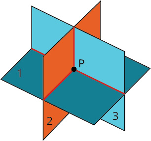 |
| *No Solution* |
| The planes are parallel; they have no points in common.  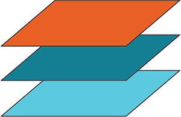 | Two planes are the same and they are parallel to the third plane. They have no points in common.  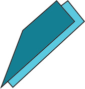 | Two planes are parallel and they each intersect the third plane. They have no points in common.  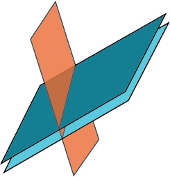 | Each plane intersects the other two but they have no points in common.  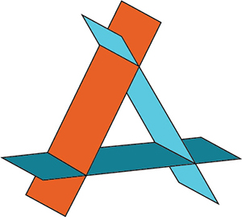 |
| *Infinitely many solutions* |
| The three planes intersect in one line. They have many points on that line in common.  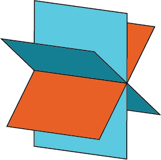 | Two planes are the same and intersect the third one in a line. they have many points on that line in common.  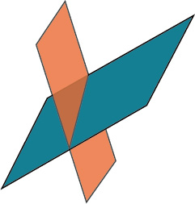 | The three planes are exactly the same. They have many points in common.  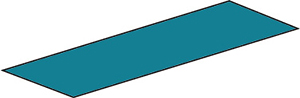 |

>
>
> **Solve a system of linear equations with three variables.**
>
> Write the equations in standard form. If any coefficients are fractions, clear them.
> Eliminate the same variable from two equations.
> Decide which variable you will eliminate.
> Work with a pair of equations to eliminate the chosen variable.
> Multiply one or both equations so that the coefficients of that variable are opposites.
> Add the equations resulting from Step 2 to eliminate one variable.
>
>
>
> Repeat Step 2 using two other equations and eliminate the same variable as in Step 2.
> The two new equations form a system of two equations with two variables. Solve this system.
> Use the values of the two variables found in Step 4 to find the third variable.
> Write the solution as an ordered triple.
> Check that the ordered triple is a solution to all three original equations
>
>

4. Solve the system of equations: $\{\begin{array}{c}x+2y-z=1  \\ 2x+7y+4z=11  \\ x+3y+z=4  \end{array}.$

Solution

$\{\begin{array}{c}x+2y-z=1\phantom{\rule{1.7em}{0ex}}\left(1\right)  \\ 2x+7y+4z=11\phantom{\rule{0.3em}{0ex}}\left(2\right)  \\ x+3y+z=4\phantom{\rule{1.7em}{0ex}}\left(3\right)  \end{array}$ 
Use equation (1) and (3) to eliminate *x*.

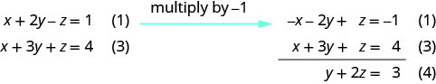

Use equation (1) and (2) to eliminate *x* again.

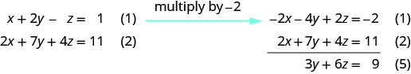

Use equation (4) and (5) to eliminate $y$ .

|  | There are infinitely many solutions. |
| :--- | :--- |
| Solve equation (4) for *y*. | Represent the solution showing how *x* and *y* are dependent on *z*. $\begin{array}{ccc}  y+2z& =  & 3  \\   y& =  & \mathrm{-2}z+3  \end{array}$ |
| Use equation (1) to solve for *x*. | $\phantom{\rule{4em}{0ex}}x+2y-z=1$ |
| Substitute $y=\mathrm{-2}z+3.$ | $\begin{array}{ccc}  x+2(\mathrm{-2}z+3)-z& =  & 1  \\   x-4z+6-z& =  & 1  \\   x-5z+6& =  & 1  \\   x& =  & 5z-5  \end{array}$ |

The true statement $0=0$ tells us that this is a dependent system that has infinitely many solutions. The solutions are of the form $\left(x,y,z\right)$ where $x=5z-5;y=\mathrm{-2}z+3$ and *z* is any real number.

> 5. Solve the system of linear equations with three variables.     $\left\{\begin{array}{l}x+2y-3z=-1\\ x-3y+z=1\\ 2x-y-2z=2\end{array}\right.\begin{array}{c}\left(1\right)\\ \left(2\right)\\ \left(3\right)\end{array}$    | Step 1 | Write the equations in standard form. If any coefficients are fractions, clear them.________________________________________ | | :--- | :--- | | Step 2 | Let's use equations (1) and (2) to eliminate $x$________________________________________ | | Step 3 | Let's use equations (1) and (3) to eliminate $x$________________________________________ | | Step 4 | Let's now use the new equations (4) and (5) to eliminate $y$________________________________________ | | Step 5 |  | | Step 6 |  |
>

### Practice Makes Perfect
6. Determine whether the ordered pair is a solution to the given system  $\left\{\begin{array}{l}y-10z=-8\\ 2x-y=2\\ x-5z=3\end{array}\right.\begin{array}{c}\\ \text{at}\phantom{\rule{0.5em}{0ex}}(7,\phantom{\rule{0.5em}{0ex}}12,\phantom{\rule{0.5em}{0ex}}2)\phantom{\rule{0.5em}{0ex}}\text{and at}\phantom{\rule{0.5em}{0ex}}(2,\phantom{\rule{0.5em}{0ex}}2,\phantom{\rule{0.5em}{0ex}}1)\\ \end{array}$

Jordi received an inheritance of $12,000 that he divided into three parts and invested in three ways: in a money-market fund paying 3% annual interest; in municipal bonds paying 4% annual interest; and in mutual funds paying 7% annual interest. Jordi invested $4,000 more in mutual funds than in municipal bonds. He earned $670 in interest the first year. How much did Jordi invest in each type of fund?

Understanding the correct approach to setting up problems such as this one makes finding a solution a matter of following a pattern. We will solve this and similar problems involving three equations and three variables in this section. Doing so uses similar techniques as those used to solve systems of two equations in two variables. However, finding solutions to systems of three equations requires a bit more organization and a touch of visualization.

# Solving Systems of Three Equations in Three Variables
In order to solve systems of equations in three variables, known as three-by-three systems, the primary tool we will be using is called **Gaussian elimination**, named after the prolific German mathematician Karl Friedrich **Gauss**. While there is no definitive order in which operations are to be performed, there are specific guidelines as to what type of moves can be made. We may number the equations to keep track of the steps we apply. The goal is to eliminate one variable at a time to achieve **upper triangular form**, the ideal form for a three-by-three system because it allows for straightforward back-substitution to find a solution $\left(x,y,z\right),$ which we call an **ordered triple**. A system in upper triangular form looks like the following:
$$
\begin{array}{l}Ax+By+Cz=D  \\ \phantom{\rule{0.5em}{0ex}}\text{}Ey+Fz=G  \\ \phantom{\rule{0.5em}{0ex}}\text{}Hz=K  \end{array}
$$
The third equation can be solved for $z,$ and then we back-substitute to find $y$ 
 and $x.$ 
 To write the system in upper triangular form, we can perform the following operations:
Interchange the order of any two equations.
Multiply both sides of an equation by a nonzero constant.
Add a nonzero multiple of one equation to another equation.
The *solution set* to a three-by-three system is an ordered triple $\left\{\left(x,y,z\right)\right\}.$ 
 Graphically, the ordered triple defines the point that is the intersection of three planes in space. You can visualize such an intersection by imagining any corner in a rectangular room.  A corner is defined by three planes: two adjoining walls and the floor (or ceiling). Any point where two walls and the floor meet represents the intersection of three planes.

>
>
>
>
> **Number of Possible Solutions**
>
>
>  and  illustrate possible solution scenarios for three-by-three systems.
>
> Systems that have a single solution are those which, after elimination, result in a **solution set** consisting of an ordered triple $\left\{\left(x,y,z\right)\right\}.$ Graphically, the ordered triple defines a point that is the intersection of three planes in space.
> Systems that have an infinite number of solutions are those which, after elimination, result in an expression that is always true, such as $0=0.$ Graphically, an infinite number of solutions represents a line or coincident plane that serves as the intersection of three planes in space.
> Systems that have no solution are those that, after elimination, result in a statement that is a contradiction, such as $3=0.$ Graphically, a system with no solution is represented by three planes with no point in common.
>
>
> 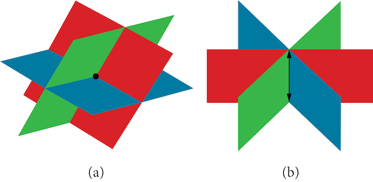
>
>
>
> 
>

7. **Determining Whether an Ordered Triple Is a Solution to a System**   Determine whether the ordered triple $\left(3,\mathrm{-2},1\right)$   is a solution to the system. $$ \begin{array}{l}\phantom{\rule{0.5em}{0ex}}\text{}x+y+z=2  \\ \phantom{\rule{0.5em}{0ex}}6x-4y+5z=31  \\ 5x+2y+2z=13  \end{array} $$

Solution

We will check each equation by substituting in the values of the ordered triple for $x,y,$ and $z.$

 $\begin{array}{ccccc}\begin{array}{r}  x+y+z=2\\   (3)+(\mathrm{-2})+(1)=2\\   \phantom{\rule{0.8}{0ex}}\text{True}\end{array}& \phantom{\rule{3em}{0ex}}& \begin{array}{r}  \phantom{\rule{0.8}{0ex}}\text{}6x\mathrm{-4}y+5z=31\\   6(3)\mathrm{-4}(\mathrm{-2})+5(1)=31\\   18+8+5=31\\   \phantom{\rule{0.8}{0ex}}\text{True}\end{array}& \phantom{\rule{3em}{0ex}}& \begin{array}{r}  \phantom{\rule{0.8}{0ex}}\text{}5x+2y+2z=13\\   5(3)+2(\mathrm{-2})+2(1)=13\\   \phantom{\rule{0.8}{0ex}}\text{}15\mathrm{-4}+2=13\\   \phantom{\rule{0.8}{0ex}}\text{True}\end{array}\end{array}$ 
The ordered triple $\left(3,\mathrm{-2},1\right)$ 
 is indeed a solution to the system.

>
> How To
> *Given a linear system of three equations, solve for three unknowns.*
>
> Pick any pair of equations and solve for one variable.
> Pick another pair of equations and solve for the same variable.
> You have created a system of two equations in two unknowns.  Solve the resulting two-by-two system.
> Back-substitute known variables into any one of the original equations and solve for the missing variable.

8. **Solving a System of Three Equations in Three Variables by Elimination**   Find a solution to the following system:  $$ \begin{array}{ll}\phantom{\rule{0.5em}{0ex}}\text{}\phantom{\rule{0.5em}{0ex}}x\mathrm{-2}y+3z=9  & \text{(1)}  \\ -x+3y-z=\mathrm{-6}  & \text{(2)}  \\ \phantom{\rule{0.5em}{0ex}}2x\mathrm{-5}y+5z=17  & \text{(3)}  \end{array} $$

Solution

There will always be several choices as to where to begin, but the most obvious first step here is to eliminate $x$ 
 by adding equations (1) and (2). 

$$
\frac{\begin{array}{ll}x-2y+3z=9  & \text{(1)}  \\ \phantom{\rule{0.5em}{0ex}}\text{}-x+3y-z=\mathrm{-6}  & \phantom{\rule{0.5em}{0ex}}\text{(2)}  \end{array}}{\begin{array}{ll}\phantom{\rule{0.5em}{0ex}}\text{}\text{}y+2z=3  & \phantom{\rule{0.5em}{0ex}}\text{(4)}  \end{array}}
$$
The second step is multiplying equation (1) by $\mathrm{-2}$ 
 and adding the result to equation (3). These two steps will eliminate the variable $x.$

$$
\begin{array}{l}\underset{\_\_\_\_\_\_\_\_\_\_\_\_\_\_\_\_\_\_\_\_\_\_\_\_\_\_\_\_\_\_\_\_\_\_\_\_}{\begin{array}{ll}  &   \\ \mathrm{-2}x+4y-6z=\mathrm{-18}  & (1)\phantom{\rule{0.5em}{0ex}}\text{multiplied}\phantom{\rule{0.5em}{0ex}}\text{by}\phantom{\rule{0.5em}{0ex}}-2  \\ \phantom{\rule{0.5em}{0ex}}2x-5y+5z=17  & (3)  \end{array}}  \\ \phantom{\rule{0.5em}{0ex}}\text{}\text{}\text{}-y-z=\mathrm{-1}\phantom{\rule{0.5em}{0ex}}\text{}(5)  \end{array}
$$
In equations (4) and (5), we have created a new two-by-two system. We can solve for $z$ 
 by adding the two equations.

 $$
\frac{\begin{array}{l}\begin{array}{l}  \\ \text{}y+2z=3\phantom{\rule{0.5em}{0ex}}\text{}\phantom{\rule{0.5em}{0ex}}(4)  \end{array}  \\ -y-z=-1\phantom{\rule{0.5em}{0ex}}\text{}(5)  \end{array}}{\phantom{\rule{0.5em}{0ex}}z=2\phantom{\rule{0.5em}{0ex}}\text{}\phantom{\rule{0.5em}{0ex}}(6)}
$$
Choosing one equation from each new system, we obtain the upper triangular form:

 $$
\begin{array}{ll}\text{}\text{}x\mathrm{-2}y+3z=9\phantom{\rule{0.5em}{0ex}}\text{}  & (1)  \\ \phantom{\rule{0.5em}{0ex}}\text{}y+2z=3  & (4)  \\ \phantom{\rule{0.5em}{0ex}}\text{}z=2  & (6)  \end{array}
$$
Next, we back-substitute $z=2$ 
 into equation (4) and solve for $y.$

 $$
\begin{array}{l}y+2(2)=3  \\ y+4=3  \\ \phantom{\rule{0.5em}{0ex}}\text{}y=\mathrm{-1}  \end{array}
$$
Finally, we can back-substitute $z=2$ 
 and $y=\mathrm{-1}$ 
 into equation (1). This will yield the solution for $x.$

 $$
\begin{array}{r}  x\mathrm{-2}(\mathrm{-1})+3(2)=9\\   \phantom{\rule{0.5em}{0ex}}\text{}x+2+6=9\\   \phantom{\rule{0.5em}{0ex}}\text{}x=1\end{array}
$$
The solution is the ordered triple $\left(1,\mathrm{-1},2\right).$ 
 See .

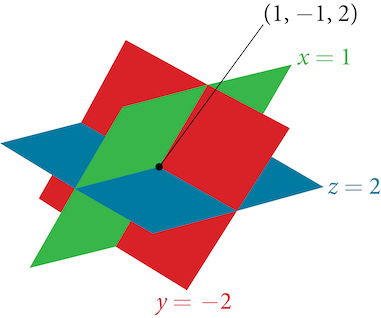

9. **Solving a Real-World Problem Using a System of Three Equations in Three Variables**   In the problem posed at the beginning of the section, Jordi invested his inheritance of $12,000 in three different funds: part in a money-market fund paying 3% interest annually; part in municipal bonds paying 4% annually; and the rest in mutual funds paying 7% annually. Jordi invested $4,000 more in mutual funds than he invested in municipal bonds. The total interest earned in one year was $670. How much did he invest in each type of fund?

Solution

To solve this problem, we use all of the information given and set up three equations.  First, we assign a variable to each of the three investment amounts:

 $$
\begin{array}{l}x=\text{amount invested in money-market fund}  \\ y=\text{amount invested in municipal bonds}  \\ z=\text{amount invested in mutual funds}  \end{array}
$$
The first equation indicates that the sum of the three principal amounts is $12,000.

	$x+y+z=\mathrm{12,000}$ We form the second equation according to the information that Jordi invested $4,000 more in mutual funds than he invested in municipal bonds.

	$z=y+\mathrm{4,000}$
The third equation shows that the total amount of interest earned from each fund equals $670.

	$0.03x+0.04y+0.07z=670$

Then, we write the three equations as a system.

   	 $$
\begin{array}{l}\phantom{\rule{0.5em}{0ex}}\text{}x+y+z=\mathrm{12,000}  \\ \phantom{\rule{0.5em}{0ex}}\text{}-y+z=\mathrm{4,000}  \\ 0.03x+0.04y+0.07z=670  \end{array}
$$
To make the calculations simpler, we can multiply the third equation by 100. Thus,

    $$
\begin{array}{ll}\phantom{\rule{0.5em}{0ex}}\text{}x+\phantom{\rule{0.5em}{0ex}}\text{}y+z\phantom{\rule{0.5em}{0ex}}\text{}=\mathrm{12,000}  & (1)  \\ \phantom{\rule{0.5em}{0ex}}\text{}-y+z\phantom{\rule{0.5em}{0ex}}\text{}=\mathrm{4,000}  & (2)  \\ 3x+4y+7z=\mathrm{67,000}  & (3)  \end{array}
$$
Step 1. Interchange equation (2) and equation (3) so that the two equations with three variables will line up.

	 $$
\begin{array}{l}\phantom{\rule{0.5em}{0ex}}\text{}x+\phantom{\rule{0.5em}{0ex}}\text{}y+\phantom{\rule{0.5em}{0ex}}\text{}z=\mathrm{12,000}  \\ 3x+4y+7z=\mathrm{67,000}  \\ \phantom{\rule{0.5em}{0ex}}\text{}-y\phantom{\rule{0.5em}{0ex}}\text{}+\phantom{\rule{0.5em}{0ex}}\text{}z=\mathrm{4,000}  \end{array}
$$
Step 2. Multiply equation (1) by $\mathrm{-3}$ 
 and add to equation (2). Write the result as row 2.
 $$
\begin{array}{l}x+y+z\phantom{\rule{0.5em}{0ex}}\text{}=\mathrm{12,000}  \\ y+4z=\mathrm{31,000}  \\ \phantom{\rule{0.5em}{0ex}}\text{}-y+z\phantom{\rule{0.5em}{0ex}}\text{}=\mathrm{4,000}  \end{array}
$$
Step 3. Add equation (2) to equation (3) and write the result as equation (3).

	 $$
\begin{array}{l}x+y+\phantom{\rule{0.5em}{0ex}}\text{}z=\mathrm{12,000}  \\ \phantom{\rule{0.5em}{0ex}}\text{}y+4z=\mathrm{31,000}  \\ \phantom{\rule{0.5em}{0ex}}\text{}5z\phantom{\rule{0.5em}{0ex}}\text{}=\mathrm{35,000}  \end{array}
$$
Step 4. Solve for $z$ 
 in equation (3). Back-substitute that value in equation (2) and solve for $y.$ 
 Then, back-substitute the values for $z$ 
 and $y$ 
 into equation (1) and solve for $x.$

	 $$
\begin{array}{l}\phantom{\rule{0.5em}{0ex}}\text{}5z=\mathrm{35,000}  \\ \phantom{\rule{0.5em}{0ex}}\text{}z=\mathrm{7,000}  \\   \\   \\ \phantom{\rule{0.5em}{0ex}}\text{}y+4(\mathrm{7,000})=\mathrm{31,000}  \\ \phantom{\rule{0.5em}{0ex}}\text{}y=\mathrm{3,000}  \\   \\   \\ x+\mathrm{3,000}+\mathrm{7,000}=\mathrm{12,000}  \\ \phantom{\rule{0.5em}{0ex}}\text{}x=\mathrm{2,000}  \end{array}
$$
Jordi invested $2,000 in a money-market fund, $3,000 in municipal bonds, and $7,000 in mutual funds.

>
> Try It
> 10. Solve the system of equations in three variables.    $$ \begin{array}{l}2x+y\mathrm{-2}z=\mathrm{-1}  \\ 3x\mathrm{-3}y-z=5  \\ x\mathrm{-2}y+3z=6  \end{array} $$
>
> 

> 
Solution

>
> $\left(1,\mathrm{-1},1\right)$
> 

>
>

# Identifying Inconsistent Systems of Equations Containing Three Variables
Just as with systems of equations in two variables, we may come across an **inconsistent system** of equations in three variables, which means that it does not have a solution that satisfies all three equations. The equations could represent three parallel planes, two parallel planes and one intersecting plane, or three planes that intersect the other two but not at the same location. The process of elimination will result in a false statement, such as $3=7$ 
 or some other contradiction.

11. **Solving an Inconsistent System of Three Equations in Three Variables**   Solve the following system.   $$ \begin{array}{ll}\phantom{\rule{0.5em}{0ex}}\text{}x\mathrm{-3}y+z=4  & (1)  \\ \phantom{\rule{0.5em}{0ex}}\text{}-x+2y\mathrm{-5}z=3  & (2)  \\ 5x\mathrm{-13}y+13z=8  & (3)  \end{array} $$

Solution

Looking at the coefficients of $x,$ we can see that we can eliminate $x$ by adding equation (1) to equation (2).
 $$
\frac{\begin{array}{l}x\mathrm{-3}y+z=4\phantom{\rule{0.5em}{0ex}}\text{}(1)  \\ -x+2y\mathrm{-5}z=3\phantom{\rule{0.5em}{0ex}}\text{}(2)  \end{array}}{\phantom{\rule{0.5em}{0ex}}\text{}-y\mathrm{-4}z=7\phantom{\rule{0.5em}{0ex}}\text{}(4)}
$$
Next, we multiply equation (1) by $\mathrm{-5}$ 
 and add it to equation (3).
 $$
\begin{array}{l}\underset{\_\_\_\_\_\_\_\_\_\_\_\_\_\_\_\_\_\_\_\_\_\_\_\_\_\_\_\_\_\_\_\_\_\_\_\_\_\_}{\begin{array}{llll}-5x+15y-5z=\mathrm{-20}  &   &   & (1)\phantom{\rule{0.5em}{0ex}}\text{multiplied}\phantom{\rule{0.5em}{0ex}}\text{by}\phantom{\rule{0.5em}{0ex}}\mathrm{-5}  \\ \text{}5x-13y+13z=8  &   &   & (3)  \end{array}}  \\ \begin{array}{llll}\phantom{\rule{0.5em}{0ex}}\text{}2y+8z=\mathrm{-12}  &   &   & (5)  \end{array}  \end{array}
$$
Then, we multiply equation (4) by 2 and add it to equation (5).

 $$
\begin{array}{l}\underset{\_\_\_\_\_\_\_\_\_\_\_\_\_\_\_\_\_\_\_\_\_\_\_\_\_\_\_\_\_\_\_\_\_\_\_\_\_\_\_}{\begin{array}{l}\mathrm{-2}y-8z=14(4)\phantom{\rule{0.5em}{0ex}}\text{multiplied}\phantom{\rule{0.5em}{0ex}}\text{by}\phantom{\rule{0.5em}{0ex}}2  \\ \phantom{\rule{0.5em}{0ex}}2y+8z=-12\phantom{\rule{0.5em}{0ex}}\text{}(5)  \end{array}}  \\ \phantom{\rule{0.5em}{0ex}}0=2  \end{array}
$$ 

The final equation $0=2$ is a contradiction, so we conclude that the system of equations in inconsistent and, therefore, has no solution.

>
> Try It
> 12. Solve the system of three equations in three variables.    $$ \begin{array}{l}\phantom{\rule{0.5em}{0ex}}\text{}x+y+z=2  \\ \phantom{\rule{0.5em}{0ex}}\text{}y\mathrm{-3}z=1  \\ 2x+y+5z=0  \end{array} $$
>
> 

> 
Solution

>
> No solution.
> 

>
>

# Expressing the Solution of a System of Dependent Equations Containing Three Variables
We know from working with systems of equations in two variables that a **dependent system** of equations has an infinite number of solutions. The same is true for dependent systems of equations in three variables. An infinite number of solutions can result from several situations. The three planes could be the same, so that a solution to one equation will be the solution to the other two equations. All three equations could be different but they intersect on a line, which has infinite solutions. Or two of the equations could be the same and intersect the third on a line.

13. **Finding the Solution to a Dependent System of Equations**   Find the solution to the given system of three equations in three variables.   $$ \begin{array}{rr}  \phantom{\rule{0.5em}{0ex}}\text{}2x+y\mathrm{-3}z=0&   (1)\\   4x+2y\mathrm{-6}z=0&   (2)\\   x-y+z=0&   (3)\end{array} $$

Solution

First, we can multiply equation (1) by $\mathrm{-2}$ 
 and add it to equation (2).
 $$
\begin{array}{l}\underset{\_\_\_\_\_\_\_\_\_\_\_\_\_\_\_\_\_\_\_\_\_\_\_\_\_\_\_\_\_\_\_\_\_\_\_\_\_\_\_\_\_\_\_\_}{\begin{array}{l}\mathrm{-4}x\mathrm{-2}y+6z=0\phantom{\rule{0.5em}{0ex}}\text{equation}(1)\phantom{\rule{0.5em}{0ex}}\text{multiplied}\phantom{\rule{0.5em}{0ex}}\text{by}\phantom{\rule{0.5em}{0ex}}\mathrm{-2}  \\ \text{}\text{}\text{}\text{}\phantom{\rule{0.5em}{0ex}}4x+2y\mathrm{-6}z=0\phantom{\rule{0.5em}{0ex}}\text{}\phantom{\rule{0.5em}{0ex}}(2)  \end{array}}  \\ \phantom{\rule{0.5em}{0ex}}0=0  \end{array}
$$
We do not need to proceed any further. The result we get is an identity, $0=0,$ which tells us that this system has an infinite number of solutions. There are other ways to begin to solve this system, such as multiplying equation (3) by $\mathrm{-2},$ and adding it to equation (1). We then perform the same steps as above and find the same result, $0=0.$

When a system is dependent, we can find general expressions for the solutions. Adding equations (1) and (3), we have

	 $$
\begin{array}{l}\underset{\_\_\_\_\_\_\_\_\_\_\_\_\_}{\begin{array}{l}\begin{array}{l}\\ 2x+y\mathrm{-3}z=0\end{array}  \\ \phantom{\rule{0.5em}{0ex}}\text{}x-y+z=0  \end{array}}  \\ \phantom{\rule{0.5em}{0ex}}\text{}\phantom{\rule{0.5em}{0ex}}3x\mathrm{-2}z=0  \end{array}
$$
We then solve the resulting equation for $z.$

	 $$
\begin{array}{l}3x\mathrm{-2}z=0  \\ \phantom{\rule{0.5em}{0ex}}\text{}z=\frac{3}{2}x  \end{array}
$$
We back-substitute the expression for $z$ 
 into one of the equations and solve for $y.$

	 $$
\begin{array}{l}2x+y-3\left(\frac{3}{2}x\right)=0  \\ 2x+y-\frac{9}{2}x=0  \\ \phantom{\rule{0.5em}{0ex}}\text{}y=\frac{9}{2}x-2x  \\ \phantom{\rule{0.5em}{0ex}}\text{}y=\frac{5}{2}x  \end{array}
$$
So the general solution is $\left(x,\frac{5}{2}x,\frac{3}{2}x\right).$ 
 In this solution, $x$ 
 can be any real number. The values of $y$ 
 and $z$ 
 are dependent on the value selected for $x.$

>
> Q&A
> *Does the generic solution to a dependent system always have to be written in terms of $x?$*
>
> *No, you can write the generic solution in terms of any of the variables, but it is common to write it in terms of x and if needed $x$ 
>  and $y.$*
>

>
> Try It
> 14. Solve the following system.   	 $$ \begin{array}{l}\phantom{\rule{0.5em}{0ex}}\text{}\phantom{\rule{0.5em}{0ex}}x+y+z=7  \\ \phantom{\rule{0.5em}{0ex}}3x-2y-z=4  \\ \phantom{\rule{0.5em}{0ex}}x+6y+5z=24  \end{array} $$
>
> 

> 
Solution

>
> Infinite number of solutions of the form $\left(x,4x\mathrm{-11},\mathrm{-5}x+18\right).$
> 

>
>

>
> Media
> Access these online resources for additional instruction and practice with systems of equations in three variables.
>
>   Ex 1: System of Three Equations with Three Unknowns Using Elimination
>   Ex. 2: System of Three Equations with Three Unknowns Using Elimination

  
# Key Concepts
A solution set is an ordered triple $\left\{\left(x,y,z\right)\right\}$ 
 that represents the intersection of three planes in space. See .
A system of three equations in three variables can be solved by using a series of steps that forces a variable to be eliminated.   The steps include interchanging the order of equations, multiplying both sides of an equation by a nonzero constant, and adding a nonzero multiple of one equation to another equation. See .
Systems of three equations in three variables are useful for solving many different types of real-world problems. See .
A system of equations in three variables is inconsistent if no solution exists. After performing elimination operations, the result is a contradiction. See .
Systems of equations in three variables that are inconsistent could result from three parallel planes, two parallel planes and one intersecting plane, or three planes that intersect the other two but not at the same location.
A system of equations in three variables is dependent if it has an infinite number of solutions. After performing elimination operations, the result is an identity. See .
Systems of equations in three variables that are dependent could result from three identical planes, three planes intersecting at a line, or two identical planes that intersect the third on a line.

# Section Exercises

## Verbal
1. Can a linear system of three equations have exactly two solutions? Explain why or why not

Solution

No, there can be only one, zero, or infinitely many solutions.

2. If a given ordered triple solves the system of equations, is that solution unique? If so, explain why. If not, give an example where it is not unique.

3. If a given ordered triple does not solve the system of equations, is there no solution? If so, explain why. If not, give an example.

Solution

Not necessarily. There could be zero, one, or infinitely many solutions. For example, $\left(0,0,0\right)$ 
 is not a solution to the system below, but that does not mean that it has no solution.

 $\begin{array}{l}\phantom{\rule{0.5em}{0ex}}\text{}2x+3y\mathrm{-6}z=1  \\ \mathrm{-4}x\mathrm{-6}y+12z=\mathrm{-2}  \\ \phantom{\rule{0.5em}{0ex}}\text{}x+2y+5z=10  \end{array}$

4. Using the method of addition, is there only one way to solve the system?

5. Can you explain whether there can be only one method to solve a linear system of equations? If yes, give an example of such a system of equations. If not, explain why not.

Solution

Every system of equations can be solved graphically, by substitution, and by addition. However, systems of three equations become very complex to solve graphically so other methods are usually preferable.

## Algebraic
For the following exercises, determine whether the ordered triple given is the solution to the system of equations.
6. $\begin{array}{l}2x\mathrm{-6}y+6z=\mathrm{-12}  \\ \phantom{\rule{0.5em}{0ex}}\text{}x+4y+5z=\mathrm{-1}  \\ -x+2y+3z=\mathrm{-1}\phantom{\rule{0.5em}{0ex}}  \end{array}$ and $(0,1,\mathrm{-1})$

7. $\begin{array}{l}\phantom{\rule{0.5em}{0ex}}\text{}6x-y+3z=6  \\ 3x+5y+2z=0\phantom{\rule{0.5em}{0ex}}  \\ \phantom{\rule{0.5em}{0ex}}\text{}x+y=0  \end{array}$ and $(3,\mathrm{-3},\mathrm{-5})$

Solution

No

8. $\begin{array}{l}6x\mathrm{-7}y+z=2  \\ -x-y+3z=4\phantom{\rule{0.5em}{0ex}}  \\ \phantom{\rule{0.5em}{0ex}}\text{}2x+y-z=1  \end{array}$ and $(4,2,\mathrm{-6})$

9. $\begin{array}{l}x-y=0  \\ \phantom{\rule{0.5em}{0ex}}\text{}x-z=5  \\ x-y+z=\mathrm{-1}\phantom{\rule{0.5em}{0ex}}  \end{array}$ and $(4,4,\mathrm{-1})$

Solution

Yes

10. $\begin{array}{l}-x-y+2z=3  \\ \phantom{\rule{0.5em}{0ex}}\text{}5x+8y\mathrm{-3}z=4  \\ -x+3y\mathrm{-5}z=\mathrm{-5}\phantom{\rule{0.5em}{0ex}}  \end{array}$ and $(4,1,\mathrm{-7})$

For the following exercises, solve each system by elimination.
11. $\begin{array}{l}3x\mathrm{-4}y+2z=\mathrm{-15}  \\ \phantom{\rule{0.5em}{0ex}}\text{}2x+4y+z=16  \\ \phantom{\rule{0.5em}{0ex}}\text{}2x+3y+5z=20  \end{array}$

Solution

$\left(\mathrm{-1},4,2\right)$

12. $\begin{array}{l}5x\mathrm{-2}y+3z=20  \\ 2x\mathrm{-4}y\mathrm{-3}z=\mathrm{-9}  \\ \phantom{\rule{0.5em}{0ex}}\text{}x+6y\mathrm{-8}z=21  \end{array}$

13. $\begin{array}{l}\phantom{\rule{0.5em}{0ex}}\text{}5x+2y+4z=9  \\ \mathrm{-3}x+2y+z=10  \\ \phantom{\rule{0.5em}{0ex}}\text{}4x\mathrm{-3}y+5z=\mathrm{-3}  \end{array}$

Solution

$\left(-\frac{85}{107},\frac{312}{107},\frac{191}{107}\right)$

14. $\begin{array}{l}4x\mathrm{-3}y+5z=31  \\ -x+2y+4z=20  \\ \phantom{\rule{0.5em}{0ex}}\text{}x+5y\mathrm{-2}z=\mathrm{-29}  \end{array}$

15. $\begin{array}{l}\phantom{\rule{0.5em}{0ex}}\text{}5x\mathrm{-2}y+3z=4  \\ \mathrm{-4}x+6y\mathrm{-7}z=\mathrm{-1}  \\ \phantom{\rule{0.5em}{0ex}}\text{}3x+2y-z=4  \end{array}$

Solution

$\left(1,\frac{1}{2},0\right)$

16. $\begin{array}{l}\phantom{\rule{0.5em}{0ex}}4x+6y+9z=0  \\ \mathrm{-5}x+2y\mathrm{-6}z=3  \\ \phantom{\rule{0.5em}{0ex}}7x\mathrm{-4}y+3z=\mathrm{-3}  \end{array}$

For the following exercises, solve each system by Gaussian elimination.
17. $\begin{array}{l}\phantom{\rule{0.5em}{0ex}}\text{}2x-y+3z=17  \\ \mathrm{-5}x+4y\mathrm{-2}z=\mathrm{-46}  \\ \phantom{\rule{0.5em}{0ex}}\text{}2y+5z=\mathrm{-7}  \end{array}$

Solution

$\left(4,\mathrm{-6},1\right)$

18. $\begin{array}{l}5x\mathrm{-6}y+3z=50  \\ -x+4y=10  \\ \phantom{\rule{0.5em}{0ex}}\text{}2x-z=10  \end{array}$

19. $\begin{array}{l}\phantom{\rule{0.5em}{0ex}}\text{}2x+3y\mathrm{-6}z=1  \\ \mathrm{-4}x\mathrm{-6}y+12z=\mathrm{-2}  \\ \phantom{\rule{0.5em}{0ex}}\text{}x+2y+5z=10  \end{array}$

Solution

$\left(x,\frac{1}{27}(65\mathrm{-16}x),\frac{x+28}{27}\right)$

20. $\begin{array}{l}\phantom{\rule{0.5em}{0ex}}\text{}4x+6y\mathrm{-2}z=8  \\ \phantom{\rule{0.5em}{0ex}}\text{}6x+9y\mathrm{-3}z=12  \\ \mathrm{-2}x\mathrm{-3}y+z=\mathrm{-4}  \end{array}$

21. $\begin{array}{l}\phantom{\rule{0.5em}{0ex}}2x+3y\mathrm{-4}z=5  \\ \mathrm{-3}x+2y+z=11  \\ -x+5y+3z=4  \end{array}$

Solution

$\left(-\frac{45}{13},\frac{17}{13},\mathrm{-2}\right)$

22. $\begin{array}{l}10x+2y\mathrm{-14}z=8  \\ \phantom{\rule{0.5em}{0ex}}\text{}\mathrm{-x}\mathrm{-2}y\mathrm{-4}z=\mathrm{-1}  \\ \mathrm{-12}x\mathrm{-6}y+6z=\mathrm{-12}  \end{array}$

23. $\begin{array}{l}\phantom{\rule{0.5em}{0ex}}\text{}x+y+z=14  \\ \phantom{\rule{0.5em}{0ex}}\text{}2y+3z=\mathrm{-14}  \\ \mathrm{-16}y\mathrm{-24}z=\mathrm{-112}  \end{array}$

Solution

No solutions exist

24. $\begin{array}{l}\phantom{\rule{0.5em}{0ex}}\text{}5x\mathrm{-3}y+4z=\mathrm{-1}  \\ \mathrm{-4}x+2y\mathrm{-3}z=0  \\ \phantom{\rule{0.5em}{0ex}}\text{}\mathrm{-x}+5y+7z=\mathrm{-11}  \end{array}$

25. $\begin{array}{l}\phantom{\rule{0.5em}{0ex}}\text{}x+y+z=0  \\ \phantom{\rule{0.5em}{0ex}}\text{}2x-y+3z=0  \\ \phantom{\rule{0.5em}{0ex}}\text{}x-z=0  \end{array}$

Solution

$\left(0,0,0\right)$

26. $\begin{array}{l}3x+2y\mathrm{-5}z=6\\ 5x\mathrm{-4}y+3z=\mathrm{-12}\\ 4x+5y\mathrm{-2}z=15\end{array}$

27. $\begin{array}{l}\phantom{\rule{0.5em}{0ex}}\text{}x+y+z=0  \\ 2x-y+3z=0  \\ \phantom{\rule{0.5em}{0ex}}\text{}x-z=1  \end{array}$

Solution

$\left(\frac{4}{7},-\frac{1}{7},-\frac{3}{7}\right)$

28. $\begin{array}{l}\begin{array}{l}\\ 3x-\frac{1}{2}y-z=-\frac{1}{2}\end{array}  \\ \phantom{\rule{0.5em}{0ex}}\text{}4x+z=3  \\ \phantom{\rule{0.5em}{0ex}}\text{}-x+\frac{3}{2}y=\frac{5}{2}  \end{array}$

29. $\begin{array}{l}\phantom{\rule{0.5em}{0ex}}\text{}6x\mathrm{-5}y+6z=38  \\ \frac{1}{5}x-\frac{1}{2}y+\frac{3}{5}z=1  \\ \phantom{\rule{0.5em}{0ex}}\text{}\mathrm{-4}x-\frac{3}{2}y-z=\mathrm{-74}  \end{array}$

Solution

$\left(7,20,16\right)$

30. $\begin{array}{l}\phantom{\rule{0.5em}{0ex}}\frac{1}{2}x-\frac{1}{5}y+\frac{2}{5}z=-\frac{13}{10}  \\ \phantom{\rule{0.5em}{0ex}}\frac{1}{4}x-\frac{2}{5}y-\frac{1}{5}z=-\frac{7}{20}  \\ -\frac{1}{2}x-\frac{3}{4}y-\frac{1}{2}z=-\frac{5}{4}  \end{array}$

31. $\begin{array}{l}-\frac{1}{3}x-\frac{1}{2}y-\frac{1}{4}z=\frac{3}{4}\\ -\frac{1}{2}x-\frac{1}{4}y-\frac{1}{2}z=2  \\ -\frac{1}{4}x-\frac{3}{4}y-\frac{1}{2}z=-\frac{1}{2}  \end{array}$

Solution

$\left(\mathrm{-6},2,1\right)$

32. $\begin{array}{l}\frac{1}{2}x-\frac{1}{4}y+\frac{3}{4}z=0\\ \frac{1}{4}x-\frac{1}{10}y+\frac{2}{5}z=\mathrm{-2}\\ \frac{1}{8}x+\frac{1}{5}y-\frac{1}{8}z=2\end{array}$

33. $\begin{array}{l}\phantom{\rule{0.5em}{0ex}}\text{}\frac{4}{5}x-\frac{7}{8}y+\frac{1}{2}z=1  \\ -\frac{4}{5}x-\frac{3}{4}y+\frac{1}{3}z=\mathrm{-8}  \\ -\frac{2}{5}x-\frac{7}{8}y+\frac{1}{2}z=\mathrm{-5}  \end{array}$

Solution

$\left(5,12,15\right)$

34. $\begin{array}{l}\\ -\frac{1}{3}x-\frac{1}{8}y+\frac{1}{6}z=-\frac{4}{3}\\ -\frac{2}{3}x-\frac{7}{8}y+\frac{1}{3}z=-\frac{23}{3}  \\ -\frac{1}{3}x-\frac{5}{8}y+\frac{5}{6}z=0  \end{array}$

35. $\begin{array}{l}\\ -\frac{1}{4}x-\frac{5}{4}y+\frac{5}{2}z=\mathrm{-5}\\ -\frac{1}{2}x-\frac{5}{3}y+\frac{5}{4}z=\frac{55}{12}  \\ -\frac{1}{3}x-\frac{1}{3}y+\frac{1}{3}z=\frac{5}{3}  \end{array}$

Solution

$\left(\mathrm{-5},\mathrm{-5},\mathrm{-5}\right)$

36. $\begin{array}{l}\frac{1}{40}x+\frac{1}{60}y+\frac{1}{80}z=\frac{1}{100}  \\ \phantom{\rule{0.5em}{0ex}}-\frac{1}{2}x-\frac{1}{3}y-\frac{1}{4}z=-\frac{1}{5}  \\ \phantom{\rule{0.5em}{0ex}}\frac{3}{8}x+\frac{3}{12}y+\frac{3}{16}z=\frac{3}{20}  \end{array}$

37. $\begin{array}{l}0.1x\mathrm{-0.2}y+0.3z=2\\ 0.5x\mathrm{-0.1}y+0.4z=8\\ 0.7x\mathrm{-0.2}y+0.3z=8\end{array}$

Solution

$\left(10,10,10\right)$

38. $\begin{array}{l}0.2x+0.1y\mathrm{-0.3}z=0.2\\ 0.8x+0.4y\mathrm{-1.2}z=0.1\\ 1.6x+0.8y\mathrm{-2.4}z=0.2\end{array}$

39. $\begin{array}{l}1.1x+0.7y\mathrm{-3.1}z=\mathrm{-1.79}\\ 2.1x+0.5y\mathrm{-1.6}z=\mathrm{-0.13}\\ 0.5x+0.4y\mathrm{-0.5}z=\mathrm{-0.07}\end{array}$

Solution

$\left(\frac{1}{2},\frac{1}{5},\frac{4}{5}\right)$

40. $\begin{array}{l}0.5x\mathrm{-0.5}y+0.5z=10\\ 0.2x\mathrm{-0.2}y+0.2z=4\\ 0.1x\mathrm{-0.1}y+0.1z=2\end{array}$

41. $\begin{array}{l}0.1x+0.2y+0.3z=0.37\\ 0.1x\mathrm{-0.2}y\mathrm{-0.3}z=\mathrm{-0.27}\\ 0.5x\mathrm{-0.1}y\mathrm{-0.3}z=\mathrm{-0.03}\end{array}$

Solution

$\left(\frac{1}{2},\frac{2}{5},\frac{4}{5}\right)$

42. $\begin{array}{l}0.5x\mathrm{-0.5}y\mathrm{-0.3}z=0.13\\ 0.4x\mathrm{-0.1}y\mathrm{-0.3}z=0.11\\ 0.2x\mathrm{-0.8}y\mathrm{-0.9}z=\mathrm{-0.32}\end{array}$

43. $\begin{array}{l}0.5x+0.2y\mathrm{-0.3}z=1\\ 0.4x\mathrm{-0.6}y+0.7z=0.8\\ 0.3x\mathrm{-0.1}y\mathrm{-0.9}z=0.6\end{array}$

Solution

$\left(2,0,0\right)$

44. $\begin{array}{l}0.3x+0.3y+0.5z=0.6\\ 0.4x+0.4y+0.4z=1.8\\ 0.4x+0.2y+0.1z=1.6\end{array}$

45. $\begin{array}{l}0.8x+0.8y+0.8z=2.4\\ 0.3x\mathrm{-0.5}y+0.2z=0\\ 0.1x+0.2y+0.3z=0.6\end{array}$

Solution

$\left(1,1,1\right)$

## Extensions
For the following exercises, solve the system for $x,y,$ and $z.$

46. $\begin{array}{l}\phantom{\rule{0.5em}{0ex}}\text{}x+y+z=3  \\ \frac{x\mathrm{-1}}{2}+\frac{y\mathrm{-3}}{2}+\frac{z+1}{2}=0  \\ \frac{x\mathrm{-2}}{3}+\frac{y+4}{3}+\frac{z\mathrm{-3}}{3}=\frac{2}{3}  \end{array}$

47. $\begin{array}{l}5x\mathrm{-3}y-\frac{z+1}{2}=\frac{1}{2}  \\ 6x+\frac{y\mathrm{-9}}{2}+2z=\mathrm{-3}  \\ \phantom{\rule{0.5em}{0ex}}\text{}\frac{x+8}{2}\mathrm{-4}y+z=4  \end{array}$

Solution

$\left(\frac{128}{557},\frac{23}{557},\frac{28}{557}\right)$

48. $\begin{array}{l}\frac{x+4}{7}-\frac{y\mathrm{-1}}{6}+\frac{z+2}{3}=1\\ \frac{x\mathrm{-2}}{4}+\frac{y+1}{8}-\frac{z+8}{12}=0\\ \frac{x+6}{3}-\frac{y+2}{3}+\frac{z+4}{2}=3\end{array}$

49. $\begin{array}{l}\frac{x\mathrm{-3}}{6}+\frac{y+2}{2}-\frac{z\mathrm{-3}}{3}=2\\ \frac{x+2}{4}+\frac{y\mathrm{-5}}{2}+\frac{z+4}{2}=1\\ \frac{x+6}{2}-\frac{y\mathrm{-3}}{2}+z+1=9\end{array}$

Solution

$\left(6,\mathrm{-1},0\right)$

50. $\begin{array}{l}\phantom{\rule{0.5em}{0ex}}\text{}\frac{x\mathrm{-1}}{3}+\frac{y+3}{4}+\frac{z+2}{6}=1  \\ \phantom{\rule{0.5em}{0ex}}\text{}4x+3y\mathrm{-2}z=11  \\ 0.02x+0.015y\mathrm{-0.01}z=0.065  \end{array}$

## Real-World Applications
51. Three even numbers sum up to 108. The smaller is half the larger and the middle number is $\frac{3}{4}$   the larger. What are the three numbers?

Solution

24, 36, 48

52. Three numbers sum up to 147. The smallest number is half the middle number, which is half the largest number. What are the three numbers?

53. At a family reunion, there were only blood relatives, consisting of children, parents, and grandparents, in attendance. There were 400 people total. There were twice as many parents as grandparents, and 50 more children than parents. How many children, parents, and grandparents were in attendance?

Solution

70 grandparents, 140 parents, 190 children

54. An animal shelter has a total of 350 animals comprised of cats, dogs, and rabbits. If the number of rabbits is 5 less than one-half the number of cats, and there are 20 more cats than dogs, how many of each animal are at the shelter?

55. Your roommate, Shani, offered to buy groceries for you and your other roommate. The total bill was $82. She forgot to save the individual receipts but remembered that your groceries were $0.05 cheaper than half of her groceries, and that your other roommate’s groceries were $2.10 more than your groceries. How much was each of your share of the groceries?

Solution

Your share was $19.95, Shani’s share was $40, and your other roommate’s share was $22.05.

56. Your roommate, John, offered to buy household supplies for you and your other roommate. You live near the border of three states, each of which has a different sales tax. The total amount of money spent was $100.75. Your supplies were bought with 5% tax, John’s with 8% tax, and your third roommate’s with 9% sales tax. The total amount of money spent without taxes is $93.50. If your supplies before tax were $1 more than half of what your third roommate’s supplies were before tax, how much did each of you spend? Give your answer both with and without taxes.

57. Three coworkers work for the same employer. Their jobs are warehouse manager, office manager, and truck driver. The sum of the annual salaries of the warehouse manager and office manager is $82,000. The office manager makes $4,000 more than the truck driver annually. The annual salaries of the warehouse manager and the truck driver total $78,000. What is the annual salary of each of the co-workers?

Solution

There are infinitely many solutions; we need more information

58. At a carnival, $2,914.25 in receipts were taken at the end of the day. The cost of a child’s ticket was $20.50, an adult ticket was $29.75, and a senior citizen ticket was $15.25. There were twice as many senior citizens as adults in attendance, and 20 more children than senior citizens. How many children, adult, and senior citizen tickets were sold?

59. A local band sells out for their concert. They sell all 1,175 tickets for a total purse of $28,112.50. The tickets were priced at $20 for student tickets, $22.50 for children, and $29 for adult tickets. If the band sold twice as many adult as children tickets, how many of each type was sold?

Solution

500 students, 225 children, and 450 adults

60. In a bag, a child has 325 coins worth $19.50. There were three types of coins: pennies, nickels, and dimes. If the bag contained the same number of nickels as dimes, how many of each type of coin was in the bag?

61. Last year, at Haven’s Pond Car Dealership, for a particular model of BMW, Jeep, and Toyota, one could purchase all three cars for a total of $140,000. This year, due to inflation, the same cars would cost $151,830. The cost of the BMW increased by 8%, the Jeep by 5%, and the Toyota by 12%. If the price of last year’s Jeep was $7,000 less than the price of last year’s BMW, what was the price of each of the three cars last year?

Solution

The BMW was $49,636, the Jeep was $42,636, and the Toyota was $47,727.

62. When his youngest child moved out, Deandre sold his home and made three investments using gains from the sale. He invested $80,500 into three accounts, one that paid 4% simple interest, one that paid $3\frac{1}{8}\text{\%}$   simple interest, and one that paid $2\frac{1}{2}\text{\%}$   simple interest. He earned $2,670 interest at the end of one year. If the amount of the money invested in the second account was four times the amount invested in the third account, how much was invested in each account?

63. You inherit one million dollars. You invest it all in three accounts for one year. The first account pays 3% compounded annually, the second account pays 4% compounded annually, and the third account pays 2% compounded annually. After one year, you earn $34,000 in interest. If you invest four times the money into the account that pays 3% compared to 2%, how much did you invest in each account?

Solution

$400,000 in the account that pays 3% interest, $500,000 in the account that pays 4% interest, and $100,000 in the account that pays 2% interest.

64. An entrepreneur sells a portion of their business for one hundred thousand dollars and invests it all in three accounts for one year. The first account pays 4% compounded annually, the second account pays 3% compounded annually, and the third account pays 2% compounded annually. After one year, the entrepreneur earns $3,650 in interest. If they invested five times the money in the account that pays 4% compared to 3%, how much did they invest in each account?

65. The top three countries in oil consumption in a certain year are as follows: the United States, Japan, and China. In millions of barrels per day, the three top countries consumed 39.8% of the world’s consumed oil. The United States consumed 0.7% more than four times China’s consumption. The United States consumed 5% more than triple Japan’s consumption. What percent of the world oil consumption did the United States, Japan, and China consume?“Oil reserves, production and consumption in 2001,” accessed April 6, 2014, http://scaruffi.com/politics/oil.html.

Solution

The United States consumed 26.3%, Japan 7.1%, and China 6.4% of the world’s oil.

66. The top three countries in oil production in the same year are Saudi Arabia, the United States, and Russia. In millions of barrels per day, the top three countries produced 31.4% of the world’s produced oil. Saudi Arabia and the United States combined for 22.1% of the world’s production, and Saudi Arabia produced 2% more oil than Russia. What percent of the world oil production did Saudi Arabia, the United States, and Russia produce?“Oil reserves, production and consumption in 2001,” accessed April 6, 2014, http://scaruffi.com/politics/oil.html.

67. The top three sources of oil imports for the United States in the same year were Saudi Arabia, Mexico, and Canada. The three top countries accounted for 47% of oil imports. The United States imported 1.8% more from Saudi Arabia than they did from Mexico, and 1.7% more from Saudi Arabia than they did from Canada. What percent of the United States oil imports were from these three countries?“Oil reserves, production and consumption in 2001,” accessed April 6, 2014, http://scaruffi.com/politics/oil.html.

Solution

Saudi Arabia imported 16.8%, Canada imported 15.1%, and Mexico 15.0%

68. The top three oil producers in the United States in a certain year are the Gulf of Mexico, Texas, and Alaska. The three regions were responsible for 64% of the United States oil production. The Gulf of Mexico and Texas combined for 47% of oil production. Texas produced 3% more than Alaska. What percent of United States oil production came from these regions?“USA: The coming global oil crisis,” accessed April 6, 2014, http://www.oilcrisis.com/us/.

69. At one time, in the United States, 398 species of animals were on the endangered species list. The top groups were mammals, birds, and fish, which comprised 55% of the endangered species. Birds accounted for 0.7% more than fish, and fish accounted for 1.5% more than mammals. What percent of the endangered species came from mammals, birds, and fish?

Solution

Birds were 19.3%, fish were 18.6%, and mammals were 17.1% of endangered species

70. Meat consumption in the United States can be broken into three categories: red meat, poultry, and fish. If fish makes up 4% less than one-quarter of poultry consumption, and red meat consumption is 18.2% higher than poultry consumption, what are the percentages of meat consumption?“The United States Meat Industry at a Glance,” accessed April 6, 2014, http://www.meatami.com/ht/d/sp/i/47465/pid/47465.

**solution set** the set of all ordered pairs or triples that satisfy all equations in a system of equations
