Systems of Linear Equations: Two Variables
==========================================

  m49420
  
Systems of Linear Equations: Two Variables
==========================================

  In this section, you will:

Solve systems of equations by graphing.
Solve systems of equations by substitution.
Solve systems of equations by addition.
Identify inconsistent systems of equations containing two variables.
Express the solution of a system of dependent equations containing two variables.

  0bb1dacf-671b-4fe5-a5a4-e67ad9a48d54

Learning Objectives
===================
Determine whether an ordered pair is a solution of a system of equations (IA 4.1.1) 
Solve a system of linear equations by graphing (IA 4.1.2)
Objective: Determine whether an ordered pair is a solution of a system of equations (IA 4.1.1)
==============================================================================================
A *system* of linear equations is a group of two or more linear equations.  For example,
 $\left\{\begin{array}{l}y=-2x+5\\ y=2x+7\end{array}\right.$ is a system of linear equations
A *solution* to a system of linear equations is an ordered pair x,y that is a solution to every equation in the system.
Determine whether the ordered pairs are solutions to the given system.

  $\left\{\begin{array}{l}2x-6y=0\\ 3x-y=5\end{array}\right.$ at $(3,1)$ and $(-3,4)$

We substitute (3, 1) into both equations:

  
    $2x-6y=0$ 
    $3x-4y=5$ 
  
  
    $\begin{array}{c}2\left(3\right)-6\left(1\right)=0\hfill \\ 6-6=0\hfill \\ 0=0\hfill \end{array}$ True
    $\begin{array}{c}3\left(3\right)-4\left(1\right)=5\hfill \\ 9-4=5\hfill \\ 5=5\hfill \end{array}$ True
  
  
     $(3,1)$ is a solution to $2x-6y=0$
     $(3,1)$ is a solution to $3x-4y=5$ 
  
  
    Conclusion: since $(3,1)$ is a solution to both equations, then it is a solution to the system $\left\{\begin{array}{l}2x-6y=0\\ 3\mathrm{x}-4y=5\end{array}\right.$ 

  

Next we substitute (-3, -1) into both equations:

  
    $2x-6y=0$ 
    $3x-4y=5$ 
  
  
    $\begin{array}{c}2(-3)-6(-1)=0\hfill \\ -6+6=0\hfill \\ 0=0\hfill \end{array}$  True
    $\begin{array}{c}3(-3)-4(-1)=5\hfill \\ -9+4=5\hfill \\ -5=5\hfill \end{array}$ False
  
  
     $(-3,-1)$ is a solution to $2x-6y=0$ 
     $(-3,-1)$ is *not* a solution to $3x-4y=5$ 
  
  
    Conclusion: Since $(-3,-1)$ is not a solution to one of the equations, then it is not a solution to the system $\left\{\begin{array}{l}2x-6y=0\\ 3x-4y=5\end{array}\right.$ 

  

Practice Makes Perfect
======================
Determine whether the ordered pairs are solutions to the given system.
$\left\{\begin{array}{l}3x+y=0\\ x+2y=-5\end{array}\right.$ at $(0,0)$ and $(1,-3)$

  At (0, 0):

  
     $3x+y=0$ 
     $x+2y=\mathrm{\u20135}$ 
  
  
    ________________________________________________
    ________________________________________________
  
  
    ________________________________________________
    ________________________________________________
  
  
    Conclusion: ________________________

  

  At (1, –3)

  
     $3x+y=0$ 
     $x+2y=\mathrm{\u20135}$ 
  
  
    ________________________________________________
    ________________________________________________
  
  
    ________________________________________________
    ________________________________________________
  
  
    Conclusion: ________________________

  

Solve a system of linear equations by graphing (IA 4.1.2)
=========================================================

Solve a system of linear equations by graphing
==============================================
Graph the first equation.
Graph the second equation on the same rectangular coordinate system.
Determine whether the lines intersect, are parallel, or are the same line.
Identify the solution to the system.
Check the solution in both equations.

  
    If the lines intersect, identify the point of intersection. This is the solution to the system.
    

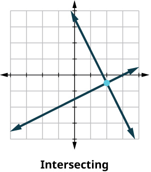

  
  
    If the lines are parallel, the system has no solutions.
    

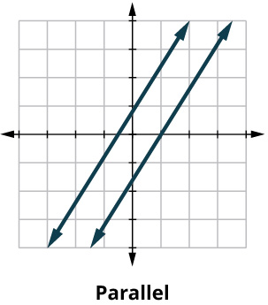

  
  
    If the lines are the same, the system has an infinite number of solutions.
    

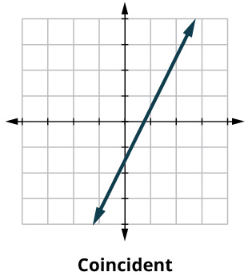

  

Solve the system by graphing.

Solve the system by graphing.
=============================

  $\left\{\begin{array}{l}-x+y=1\\ 2x+y=10\end{array}\right.$

  
    Step 1
    
Graph $-x+y=1$ 
We can use the slope intercept – form: $y=x+1$ 
Slope  = 1  
y-intercept: (0, 1)

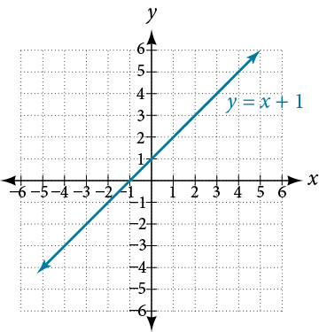

  
  
    Step 2
    
Graph $2x+y=10$ 
We can use the slope intercept – form: $y=-2x+10$ 
Slope  = –2  
y-intercept: (0, 10)

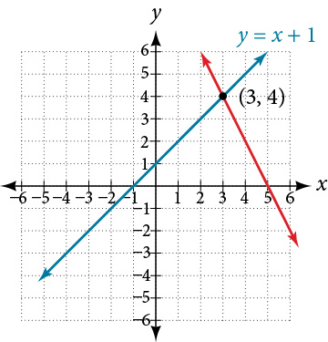

  
  
    Step 3
    The lines intersect
  
  
    Step 4
    The solution is the point (3, 4)
  
  
    Step 5
    
Let’s check the solution:
 $\begin{array}{cc}-x+y=1& 2x+y=10\\ -3+4=1& 2\left(3\right)+4=10\\ 1=1& 10=10\end{array}$

Since (3,  4) is a solution to both equations, then it *is a solution* to the system
 $-x+y=1$ 
 $2x+y=10$

  

Solve a system of linear equations by graphing
$\left\{\begin{array}{l}y=-2x+4\\ 4x+2y=6\end{array}\right.$

  
    Step 1
    Graph $y=-2x+4$ 
Slope = ________
y-intercept = ________

  
  
    Step 2
    Graph $4x+2y=6$
Slope = ________
y-intercept = ________

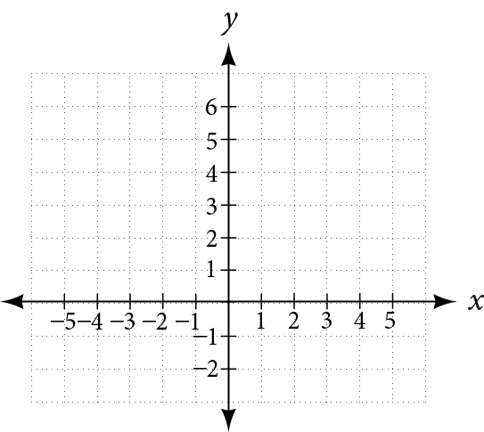

 

  
  
    Step 3
    Do the lines intersect?________
  
  
    Step 4
    Read from the graph the point of intersection.________
  
  
    Step 5
    Check the solution in both equations.________
  

Practice Makes Perfect
======================

  Determine whether the ordered pair is a solution to the given system

 $\left\{\begin{array}{l}x-3y=-8\\ -3x-y=4\end{array}\right.$

  Solve the following system by graphing.
 $\left\{\begin{array}{l}y=-\frac{1}{4}x+2\\ x+4y=8\end{array}\right.$
  

\n\n\n\n

A skateboard manufacturer introduces a new line of boards. The manufacturer tracks its costs, which is the amount it spends to produce the boards, and its revenue, which is the amount it earns through sales of its boards. How can the company determine if it is making a profit with its new line? How many skateboards must be produced and sold before a profit is possible? In this section, we will consider linear equations with two variables to answer these and similar questions.

Introduction to Systems of Equations
====================================

In order to investigate situations such as that of the skateboard manufacturer, we need to recognize that we are dealing with more than one variable and likely more than one equation. A **system of linear equations** consists of two or more linear equations made up of two or more variables such that all equations in the system are considered simultaneously. To find the unique solution to a system of linear equations, we must find a numerical value for each variable in the system that will satisfy all equations in the system at the same time. Some linear systems may not have a solution and others may have an infinite number of solutions. In order for a linear system to have a unique solution, there must be at least as many equations as there are variables. Even so, this does not guarantee a unique solution.

In this section, we will look at systems of linear equations in two variables, which consist of two equations that contain two different variables. For example, consider the following system of linear equations in two variables.

 $$
\begin{array}{c}2x+y=\phantom{\rule{0.5em}{0ex}}\text{}15\\ 3x\u2013y=\phantom{\rule{0.5em}{0ex}}\text{}5\end{array}
$$

The *solution* to a system of linear equations in two variables is any ordered pair that satisfies each equation independently. In this example, the ordered pair (4, 7) is the solution to the system of linear equations. We can verify the solution by substituting the values into each equation to see if the ordered pair satisfies both equations. Shortly we will investigate methods of finding such a solution if it exists.

 $$
\begin{array}{l}2(4)+(7)=15\phantom{\rule{0.5em}{0ex}}\text{True}\hfill \\ 3(4)-(7)=5\phantom{\rule{0.5em}{0ex}}\text{True}\hfill \end{array}
$$
In addition to considering the number of equations and variables, we can categorize systems of linear equations by the number of solutions. A **consistent system** of equations has at least one solution. A consistent system is considered to be an *independent system* if it has a single solution, such as the example we just explored. The two lines have different slopes and intersect at one point in the plane. A consistent system is considered to be a *dependent system* if the equations have the same slope and the same *y*-intercepts. In other words, the lines coincide so the equations represent the same line. Every point on the line represents a coordinate pair that satisfies the system. Thus, there are an infinite number of solutions.
Another type of system of linear equations is an *inconsistent system*, which is one in which the equations represent two parallel lines. The lines have the same slope and different *y-*intercepts. There are no points common to both lines; hence, there is no solution to the system.

Types of Linear Systems
=======================

There are three types of systems of linear equations in two variables, and three types of solutions.

An **independent system** has exactly one solution pair $\left(x,y\right).$ The point where the two lines intersect is the only solution.
An **inconsistent system** has no solution. Notice that the two lines are parallel and will never intersect.
A **dependent system** has infinitely many solutions. The lines are coincident. They are the same line, so every coordinate pair on the line is a solution to both equations.

compares graphical representations of each type of system.

\n\n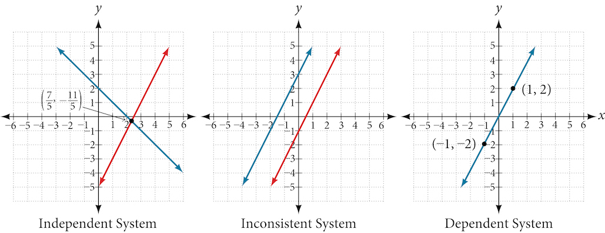\n\n
How To
*Given a system of linear equations and an ordered pair, determine whether the ordered pair is a solution.*

Substitute the ordered pair into each equation in the system.
Determine whether true statements result from the substitution in both equations; if so, the ordered pair is a solution.

Determining Whether an Ordered Pair Is a Solution to a System of Equations
==========================================================================

Determine whether the ordered pair $\left(5,1\right)$ is a solution to the given system of equations.
 $$
\begin{array}{l}\phantom{\rule{0.5em}{0ex}}x+3y=8\hfill \\ \phantom{\rule{0.5em}{0ex}}2x-9=y\hfill \end{array}
$$

Substitute the ordered pair $\left(5,1\right)$ into both equations.
 $$
\begin{array}{ll}(5)+3(1)=8\hfill & \hfill \\ 8=8\hfill & \text{True}\hfill \\ 2(5)-9=(1)\hfill & \hfill \\ \text{1=1}\hfill & \text{True}\hfill \end{array}
$$
The ordered pair $\left(5,1\right)$ satisfies both equations, so it is the solution to the system.

Analysis
========

We can see the solution clearly by plotting the graph of each equation. Since the solution is an ordered pair that satisfies both equations, it is a point on both of the lines and thus the point of intersection of the two lines. See .

\n\n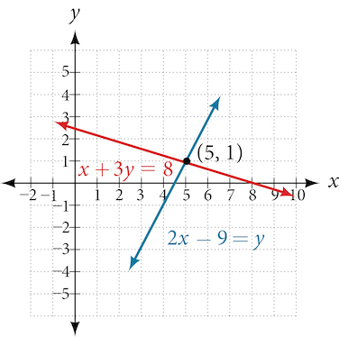\n\n

Try It
Determine whether the ordered pair $\left(8,5\right)$ is a solution to the following system.
 $\begin{array}{c}5x\mathrm{-4}y=20\\ 2x+1=3y\end{array}$

Not a solution.

Solving Systems of Equations by Graphing
========================================

There are multiple methods of solving systems of linear equations. For a **system of linear equations** in two variables, we can determine both the type of system and the solution by graphing the system of equations on the same set of axes.

Solving a System of Equations in Two Variables by Graphing
==========================================================

Solve the following system of equations by graphing. Identify the type of system.

 $$
\begin{array}{c}2x+y=\mathrm{-8}\\ x-y=\mathrm{-1}\end{array}
$$

Solve the first equation for $y.$

 $$
\begin{array}{c}2x+y=\mathrm{-8}\\ y=\mathrm{-2}x\mathrm{-8}\end{array}
$$
Solve the second equation for $y.$

 $$
\begin{array}{c}x-y=\mathrm{-1}\\ y=x+1\end{array}
$$
Graph both equations on the same set of axes as in .

\n\n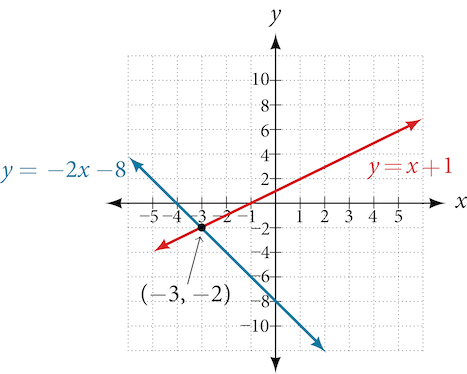\n\n

The lines appear to intersect at the point $\left(\mathrm{-3,}\mathrm{-2}\right).$ We can check to make sure that this is the solution to the system by substituting the ordered pair into both equations.
 $$
\begin{array}{ll}2(\mathrm{-3})+(\mathrm{-2})=\mathrm{-8}\hfill & \hfill \\ \phantom{\rule{0.5em}{0ex}}\mathrm{-8}=\mathrm{-8}\hfill & \text{True}\hfill \\ \phantom{\rule{0.5em}{0ex}}(\mathrm{-3})-(\mathrm{-2})=\mathrm{-1}\hfill & \hfill \\ \phantom{\rule{0.5em}{0ex}}\mathrm{-1}=\mathrm{-1}\hfill & \text{True}\hfill \end{array}
$$
The solution to the system is the ordered pair $\left(\mathrm{-3,}\mathrm{-2}\right),$ so the system is independent.

Try It
Solve the following system of equations by graphing.

 $$
\begin{array}{l}2x-5y=\mathrm{-25}\hfill \\ -4x+5y=35\hfill \end{array}
$$

The solution to the system is the ordered pair $\left(\mathrm{-5},3\right).$

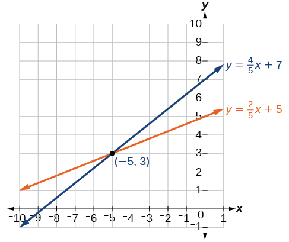

Q&A
*Can graphing be used if the system is inconsistent or dependent?*

*Yes, in both cases we can still graph the system to determine the type of system and solution. If the two lines are parallel, the system has no solution and is inconsistent. If the two lines are identical, the system has infinite solutions and is a dependent system.*

Solving Systems of Equations by Substitution
============================================

Solving a linear system in two variables by graphing works well when the solution consists of integer values, but if our solution contains decimals or fractions, it is not the most precise method. We will consider two more methods of solving a **system of linear equations** that are more precise than graphing. One such method is solving a system of equations by the **substitution method**, in which we solve one of the equations for one variable and then substitute the result into the second equation to solve for the second variable. Recall that we can solve for only one variable at a time, which is the reason the substitution method is both valuable and practical.

How To
*Given a system of two equations in two variables, solve using the substitution method.*

Solve one of the two equations for one of the variables in terms of the other.
Substitute the expression for this variable into the second equation, then solve for the remaining variable.
Substitute that solution into either of the original equations to find the value of the first variable. If possible, write the solution as an ordered pair.
Check the solution in both equations.

Solving a System of Equations in Two Variables by Substitution
==============================================================

Solve the following system of equations by substitution.

 $$
\begin{array}{l}-x+y=\mathrm{-5}\hfill \\ 2x-5y=1\hfill \end{array}
$$

First, we will solve the first equation for $y.$

 $$
\begin{array}{l}-x+y=\mathrm{-5}\hfill \\ y=x\mathrm{-5}\hfill \end{array}
$$
Now we can substitute the expression $x\mathrm{-5}$ for $y$ in the second equation.

	 $$
\begin{array}{l}2x-5y=1\hfill \\ 2x-5(x-5)=1\hfill \\ 2x-5x+25=1\hfill \\ -3x=\mathrm{-24}\hfill \\ x=8\hfill \end{array}
$$
Now, we substitute $x=8$ into the first equation and solve for $y.$

	 $$
\begin{array}{l}-(8)+y=\mathrm{-5}\hfill \\ y=3\hfill \end{array}
$$
Our solution is $\left(8,3\right).$
Check the solution by substituting $\left(8,3\right)$ into both equations.

	 $$
\begin{array}{llll}-x+y=-5\hfill & \hfill & \hfill & \hfill \\ -(8)+(3)=-5\hfill & \hfill & \hfill & \text{True}\hfill \\ 2x-5y=1\hfill & \hfill & \hfill & \hfill \\ 2(8)-5(3)=1\hfill & \hfill & \hfill & \text{True}\hfill \end{array}
$$

Try It
Solve the following system of equations by substitution.

 $$
\begin{array}{l}x=y+3\hfill \\ 4=3x\mathrm{-2}y\hfill \end{array}
$$

$\left(\mathrm{-2},\mathrm{-5}\right)$

Q&A
*Can the substitution method be used to solve any linear system in two variables?*

*Yes, but the method works best if one of the equations contains a coefficient of 1 or –1 so that we do not have to deal with fractions.*

Solving Systems of Equations in Two Variables by the Addition Method
====================================================================

A third method of **solving systems of linear equations** is the **addition method**. In this method, we add two terms with the same variable, but opposite coefficients, so that the sum is zero. Of course, not all systems are set up with the two terms of one variable having opposite coefficients. Often we must adjust one or both of the equations by multiplication so that one variable will be eliminated by addition.

How To
*Given a system of equations, solve using the addition method.*

Write both equations with *x*- and *y*-variables on the left side of the equal sign and constants on the right.
Write one equation above the other, lining up corresponding variables. If one of the variables in the top equation has the opposite coefficient of the same variable in the bottom equation, add the equations together, eliminating one variable. If not, use multiplication by a nonzero number so that one of the variables in the top equation has the opposite coefficient of the same variable in the bottom equation, then add the equations to eliminate the variable.
Solve the resulting equation for the remaining variable.
Substitute that value into one of the original equations and solve for the second variable.
Check the solution by substituting the values into the other equation.

Solving a System by the Addition Method
=======================================

Solve the given system of equations by addition.

 $$
\begin{array}{l}x+2y=\mathrm{-1}\hfill \\ -x+y=3\hfill \end{array}
$$

Both equations are already set equal to a constant. Notice that the coefficient of $x$ in the second equation, –1, is the opposite of the coefficient of $x$ in the first equation, 1. We can add the two equations to eliminate $x$ without needing to multiply by a constant.

	 $$
\frac{\begin{array}{l}\hfill \\ x+2y=-1\hfill \\ -x+y=3\hfill \end{array}}{\text{}\text{}\text{}\text{}\text{}3y=2}
$$
Now that we have eliminated $x,$ we can solve the resulting equation for $y.$
 $$
\begin{array}{l}3y=2\hfill \\ y=\frac{2}{3}\hfill \end{array}
$$
Then, we substitute this value for $y$ into one of the original equations and solve for $x.$
 $$
\begin{array}{l}-x+y=3\hfill \\ -x+\frac{2}{3}=3\hfill \\ -x=3-\frac{2}{3}\hfill \\ -x=\frac{7}{3}\hfill \\ x=-\frac{7}{3}\hfill \end{array}
$$
The solution to this system is $\left(-\frac{7}{3},\frac{2}{3}\right).$

Check the solution in the first equation.

 $$
\begin{array}{llll}x+2y=\mathrm{-1}\hfill & \hfill & \hfill & \hfill \\ \left(-\frac{7}{3}\right)+2\left(\frac{2}{3}\right)=\hfill & \hfill & \hfill & \hfill \\ -\frac{7}{3}+\frac{4}{3}=\hfill & \hfill & \hfill & \hfill \\ -\frac{3}{3}=\hfill & \hfill & \hfill & \hfill \\ \mathrm{-1}=\mathrm{-1}\hfill & \hfill & \hfill & \text{True}\hfill \end{array}
$$

Analysis
========

We gain an important perspective on systems of equations by looking at the graphical representation. See  to find that the equations intersect at the solution. We do not need to ask whether there may be a second solution because observing the graph confirms that the system has exactly one solution.

\n\n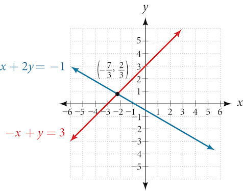\n\n

Using the Addition Method When Multiplication of One Equation Is Required
=========================================================================

Solve the given system of equations by the **addition method**.

 $$
\begin{array}{l}3x+5y=\mathrm{-11}\hfill \\ \hfill \\ \phantom{\rule{0.5em}{0ex}}x-2y=11\hfill \end{array}
$$

Adding these equations as presented will not eliminate a variable. However, we see that the first equation has $3x$ in it and the second equation has $x.$ So if we multiply the second equation by $\mathrm{-3},$ the *x*-terms will add to zero.
 $$
\begin{array}{llll}x\mathrm{-2}y=11\hfill & \hfill & \hfill & \hfill \\ \mathrm{-3}(x\mathrm{-2}y)=\mathrm{-3}(11)\hfill & \hfill & \hfill & \text{Multiply\ both\ sides\ by\}\mathrm{-3.}\hfill \\ \mathrm{-3}x+6y=\mathrm{-33}\hfill & \hfill & \hfill & \text{Use\ the\ distributive\ property}.\hfill \end{array}
$$
Now, let’s add them.

 $$
\begin{array}{l}\underset{\_\_\_\_\_\_\_\_\_\_\_\_\_\_\_}{\begin{array}{l}\hfill \\ \begin{array}{l}\phantom{\rule{0.5em}{0ex}}\text{\ \}3x+5y=\mathrm{-11}\hfill \\ \mathrm{-3}x+6y=\mathrm{-33}\hfill \end{array}\hfill \end{array}}\hfill \\ \phantom{\rule{0.5em}{0ex}}\text{\ \ \ \ \ \ \ \}11y=\mathrm{-44}\hfill \\ \phantom{\rule{0.5em}{0ex}}\text{\ \ \ \ \ \ \ \ \ \ \ \}y=\mathrm{-4}\hfill \end{array}
$$
For the last step, we substitute $y=\mathrm{-4}$ into one of the original equations and solve for $x.$
 $$
\begin{array}{c}\phantom{\rule{0.5em}{0ex}}3x+5y=-11\\ \phantom{\rule{0.5em}{0ex}}3x+5(-4)=-11\\ \phantom{\rule{0.5em}{0ex}}3x-20=-11\\ \phantom{\rule{0.5em}{0ex}}3x=9\\ \phantom{\rule{0.5em}{0ex}}x=3\end{array}
$$
Our solution is the ordered pair $\left(3,\mathrm{-4}\right).$ See . Check the solution in the original second equation.
 $$
\begin{array}{llll}\phantom{\rule{0.5em}{0ex}}x-2y=11\hfill & \hfill & \hfill & \hfill \\ (3)-2(-4)=3+8\hfill & \hfill & \hfill & \hfill \\ \phantom{\rule{0.5em}{0ex}}11=11\hfill & \hfill & \hfill & \text{True}\hfill \end{array}
$$
\n\n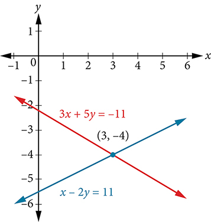\n\n

Try It

Solve the system of equations by addition.

 $\begin{array}{c}2x\mathrm{-7}y=2\\ 3x+y=\mathrm{-20}\end{array}$

$\left(\mathrm{-6},\mathrm{-2}\right)$

Using the Addition Method When Multiplication of Both Equations Is Required
===========================================================================

Solve the given system of equations in two variables by addition.

	 $$
\begin{array}{c}2x+3y=\mathrm{-16}\\ 5x\mathrm{-10}y=30\end{array}
$$

One equation has $2x$ and the other has $5x.$ The least common multiple is $10x$ so we will have to multiply both equations by a constant in order to eliminate one variable. Let’s eliminate $x$ by multiplying the first equation by $\mathrm{-5}$ and the second equation by $2.$
 $$
\begin{array}{l}\ -5(2x+3y)=-5(\mathrm{-16})\hfill \\ \phantom{\rule{0.5em}{0ex}}\text{\ \ \}-10x-15y=80\hfill \\ \phantom{\rule{0.5em}{0ex}}\text{\ \ \ \ \}2(5x-10y)=2(30)\hfill \\ \phantom{\rule{0.5em}{0ex}}\text{\ \ \ \ \ \ \ \}10x-20y=60\hfill \end{array}
$$
Then, we add the two equations together.

	 $$
\begin{array}{l}\underset{\_\_\_\_\_\_\_\_\_\_\_\_\_\_\_\_}{\begin{array}{l}\hfill \\ \begin{array}{l}\mathrm{-10}x\mathrm{-15}y=80\phantom{\rule{0.5em}{0ex}}\text{\ \}\hfill \\ 10x\mathrm{-20}y=60\hfill \end{array}\hfill \end{array}}\hfill \\ \mathrm{-35}y=140\hfill \\ y=\mathrm{-4}\hfill \end{array}
$$
Substitute $y=\mathrm{-4}$ into the original first equation.
 $$
\begin{array}{c}2x+3(\mathrm{-4})=\mathrm{-16}\\ \phantom{\rule{0.5em}{0ex}}2x-12=\mathrm{-16}\\ \phantom{\rule{0.5em}{0ex}}2x=\mathrm{-4}\\ \phantom{\rule{0.5em}{0ex}}x=\mathrm{-2}\end{array}
$$
The solution is $\left(\mathrm{-2},\mathrm{-4}\right).$ Check it in the other equation.
 $$
\begin{array}{r}\hfill \phantom{\rule{0.5em}{0ex}}\text{\ \ \ \ \ \ \ \ \}5x\mathrm{-10}y=30\\ \hfill 5(\mathrm{-2})\mathrm{-10}(\mathrm{-4})=30\\ \hfill \phantom{\rule{0.5em}{0ex}}\text{\ \ \ \ \ \ \ \}\mathrm{-10}+40=30\\ \hfill \phantom{\rule{0.5em}{0ex}}\text{\ \ \ \ \ \ \ \ \ \ \ \ \ \ \ \ \ \ \}30=30\end{array}
$$
See .
\n\n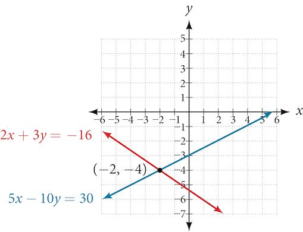\n\n

Using the Addition Method in Systems of Equations Containing Fractions
======================================================================

Solve the given system of equations in two variables by addition.

	 $$
\begin{array}{l}\frac{x}{3}+\frac{y}{6}=3\hfill \\ \frac{x}{2}-\frac{y}{4}=\text{}\phantom{\rule{0.5em}{0ex}}\phantom{\rule{0.5em}{0ex}}1\hfill \end{array}
$$

First clear each equation of fractions by multiplying both sides of the equation by the least common denominator.

 $$
\begin{array}{l}6\left(\frac{x}{3}+\frac{y}{6}\right)=6(3)\hfill \\ \phantom{\rule{0.5em}{0ex}}\text{\ \ \}2x+y=18\hfill \\ 4\left(\frac{x}{2}-\frac{y}{4}\right)=4(1)\hfill \\ \phantom{\rule{0.5em}{0ex}}\text{\ \ \}2x-y=4\hfill \end{array}
$$
Now multiply the second equation by $\mathrm{-1}$ so that we can eliminate the *x*-variable.
 $$
\begin{array}{l}\mathrm{-1}(2x-y)=\mathrm{-1}(4)\hfill \\ \phantom{\rule{0.5em}{0ex}}\text{\ \ \}\mathrm{-2}x+y=\mathrm{-4}\hfill \end{array}
$$
Add the two equations to eliminate the *x*-variable and solve the resulting equation.
 $$
\begin{array}{l}2x+y=18\hfill \\ \underset{\_\_\_\_\_\_\_\_\_\_\_\_\_}{\mathrm{-2}x+y=\mathrm{-4}}\hfill \\ 2y=14\hfill \\ y=7\hfill \end{array}
$$
Substitute $y=7$ into the first equation.

 $$
\begin{array}{l}2x+(7)=18\hfill \\ \phantom{\rule{0.5em}{0ex}}\text{\ \ \ \ \ \ \ \}2x=11\hfill \\ \phantom{\rule{0.5em}{0ex}}\text{\ \ \ \ \ \ \ \ \ \}x=\frac{11}{2}\hfill \\ \phantom{\rule{0.5em}{0ex}}\text{\ \ \ \ \ \ \ \ \ \ \ \}=5.5\hfill \end{array}
$$
The solution is $\left(\frac{11}{2},7\right).$ Check it in the other equation.

 $$
\begin{array}{c}\phantom{\rule{0.5em}{0ex}}\frac{x}{2}-\frac{y}{4}=1\\ \frac{\frac{11}{2}}{2}-\frac{7}{4}=1\\ \phantom{\rule{0.5em}{0ex}}\frac{11}{4}-\frac{7}{4}=1\\ \phantom{\rule{0.5em}{0ex}}\frac{4}{4}=1\end{array}
$$

Try It

Solve the system of equations by addition.

$\begin{array}{ccc}2x+3y\hfill & =& \hfill 8\\ 3x+5y\hfill & =& \hfill 10\end{array}$
$\left(10,\mathrm{-4}\right)$

Identifying Inconsistent Systems of Equations Containing Two Variables
======================================================================

Now that we have several methods for solving systems of equations, we can use the methods to identify inconsistent systems. Recall that an **inconsistent system** consists of parallel lines that have the same slope but different $y$ -intercepts. They will never intersect. When searching for a solution to an inconsistent system, we will come up with a false statement, such as $12=0.$

Solving an Inconsistent System of Equations
===========================================

Solve the following system of equations.

 $$
\begin{array}{l}x=9\mathrm{-2}y\hfill \\ x+2y=13\hfill \end{array}
$$

We can approach this problem in two ways. Because one equation is already solved for $x,$ the most obvious step is to use substitution.
 $$
\begin{array}{l}\phantom{\rule{0.5em}{0ex}}x+2y=13\hfill \\ \phantom{\rule{0.5em}{0ex}}(9-2y)+2y=13\hfill \\ \phantom{\rule{0.5em}{0ex}}9+0y=13\hfill \\ \phantom{\rule{0.5em}{0ex}}9=13\hfill \end{array}
$$
Clearly, this statement is a contradiction because $9\ne 13.$ Therefore, the system has no solution.

The second approach would be to first manipulate the equations so that they are both in slope-intercept form. We manipulate the first equation as follows.

	 $$
\begin{array}{l}\phantom{\rule{0.5em}{0ex}}x=9\mathrm{-2}y\hfill \\ 2y=-x+9\hfill \\ \phantom{\rule{0.5em}{0ex}}y=-\frac{1}{2}x+\frac{9}{2}\hfill \end{array}
$$
We then convert the second equation expressed to slope-intercept form.

	 $$
\begin{array}{l}x+2y=13\hfill \\ \phantom{\rule{0.5em}{0ex}}2y=-x+13\hfill \\ \phantom{\rule{0.5em}{0ex}}y=-\frac{1}{2}x+\frac{13}{2}\hfill \end{array}
$$
Comparing the equations, we see that they have the same slope but different *y*-intercepts. Therefore, the lines are parallel and do not intersect.
 $$
\begin{array}{l}\begin{array}{l}\\ y=-\frac{1}{2}x+\frac{9}{2}\end{array}\hfill \\ y=-\frac{1}{2}x+\frac{13}{2}\hfill \end{array}
$$

Analysis
========

Writing the equations in slope-intercept form confirms that the system is inconsistent because all lines will intersect eventually unless they are parallel. Parallel lines will never intersect; thus, the two lines have no points in common. The graphs of the equations in this example are shown in .
\n\n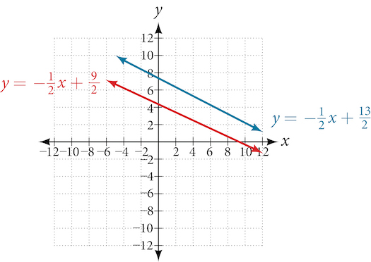\n\n

Try It
Solve the following system of equations in two variables.

	 $$
\begin{array}{l}2y\mathrm{-2}x=2\\ 2y\mathrm{-2}x=6\end{array}
$$

No solution. It is an inconsistent system.

Expressing the Solution of a System of Dependent Equations Containing Two Variables
===================================================================================

Recall that a **dependent system** of equations in two variables is a system in which the two equations represent the same line. Dependent systems have an infinite number of solutions because all of the points on one line are also on the other line. After using substitution or addition, the resulting equation will be an identity, such as $0=0.$

Finding a Solution to a Dependent System of Linear Equations
============================================================

Find a solution to the system of equations using the **addition method**.
 $$
\begin{array}{c}\phantom{\rule{0.5em}{0ex}}x+3y=2\\ 3x+9y=6\end{array}
$$

With the addition method, we want to eliminate one of the variables by adding the equations. In this case, let’s focus on eliminating $x.$ If we multiply both sides of the first equation by $\mathrm{-3},$ then we will be able to eliminate the $x$ -variable.
 $$
\begin{array}{l}\phantom{\rule{0.5em}{0ex}}x+3y=2\hfill \\ \ (\mathrm{-3})(x+3y)=(\mathrm{-3})(2)\hfill \\ \phantom{\rule{0.5em}{0ex}}\mathrm{-3}x-9y=-6\hfill \end{array}
$$
Now add the equations.

 $$
\begin{array}{l}\underset{\_\_\_\_\_\_\_\_\_\_\_\_\_\_}{\begin{array}{ll}\phantom{\rule{0.5em}{0ex}}-3x-9y\hfill & =\mathrm{-6}\hfill \\ +\phantom{\rule{0.5em}{0ex}}3x+9y\hfill & =6\hfill \end{array}}\hfill \\ \begin{array}{ll}\phantom{\rule{0.5em}{0ex}}0\hfill & =0\hfill \end{array}\hfill \end{array}
$$
We can see that there will be an infinite number of solutions that satisfy both equations.

Analysis
========

If we rewrote both equations in the slope-intercept form, we might know what the solution would look like before adding. Let’s look at what happens when we convert the system to slope-intercept form.

 $$
\begin{array}{l}\phantom{\rule{0.5em}{0ex}}\text\ x+3y=2\hfill \\ \phantom{\rule{0.5em}{0ex}}\text{\ \ \ \ \ \ \}3y=-x+2\hfill \\ \phantom{\rule{0.5em}{0ex}}\text{\ \ \ \ \ \ \ \ \}y=-\frac{1}{3}x+\frac{2}{3}\hfill \\ 3x+9y=6\hfill \\ \phantom{\rule{0.5em}{0ex}}\text{\ \ \ \ \ \ \}9y=\mathrm{-3}x+6\hfill \\ \phantom{\rule{0.5em}{0ex}}\text{\ \ \ \ \ \ \ \ \}y=-\frac{3}{9}x+\frac{6}{9}\hfill \\ \phantom{\rule{0.5em}{0ex}}\text{\ \ \ \ \ \ \ \ \}y=-\frac{1}{3}x+\frac{2}{3}\hfill \end{array}
$$
See . Notice the results are the same. The general solution to the system is $\left(x,\; -\frac{1}{3}x+\frac{2}{3}\right).$
\n\n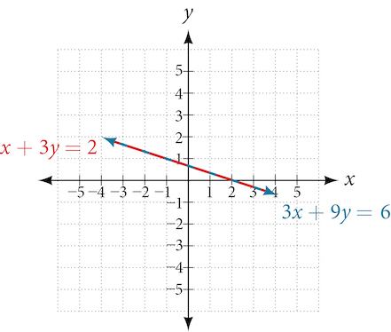\n\n

Try It
Solve the following system of equations in two variables.

	 $$
\begin{array}{l}\begin{array}{l}\\ \phantom{\rule{0.5em}{0ex}}\text{\ \ \}\text{}\text{}y\mathrm{-2}x=5\end{array}\hfill \\ \mathrm{-3}y+6x=\mathrm{-15}\hfill \end{array}
$$

The system is dependent so there are infinite solutions of the form $(x,2x+5).$

Using Systems of Equations to Investigate Profits
=================================================

Using what we have learned about systems of equations, we can return to the skateboard manufacturing problem at the beginning of the section. The skateboard manufacturer’s **revenue function** is the function used to calculate the amount of money that comes into the business. It can be represented by the equation $R=xp,$ where $x=$ quantity and $p=$ price. The revenue function is shown in orange in .
The **cost function** is the function used to calculate the costs of doing business. It includes fixed costs, such as rent and salaries, and variable costs, such as utilities. The cost function is shown in blue in . The $x$ -axis represents quantity in hundreds of units. The *y*-axis represents either cost or revenue in hundreds of dollars.
\n\n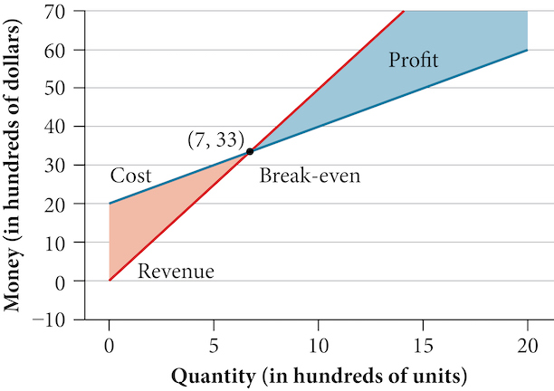\n\n

The point at which the two lines intersect is called the **break-even point**. We can see from the graph that if 700 units are produced, the cost is $3,300 and the revenue is also $3,300. In other words, the company breaks even if they produce and sell 700 units. They neither make money nor lose money.

The shaded region to the right of the break-even point represents quantities for which the company makes a profit. The shaded region to the left represents quantities for which the company suffers a loss. The **profit function** is the revenue function minus the cost function, written as $P(x)=R(x)-C(x).$ Clearly, knowing the quantity for which the cost equals the revenue is of great importance to businesses.

Finding the Break-Even Point and the Profit Function Using Substitution
=======================================================================

Given the cost function $C(x)=0.85x+\mathrm{35,000}$ and the revenue function $R(x)=1.55x,$ find the break-even point and the profit function.

Write the system of equations using $y$ to replace function notation.
 $$
\begin{array}{l}\begin{array}{l}\\ y=0.85x+\mathrm{35,000}\end{array}\hfill \\ y=1.55x\hfill \end{array}
$$
Substitute the expression $0.85x+\mathrm{35,000}$ from the first equation into the second equation and solve for $x.$
 $$
\begin{array}{c}0.85x+\mathrm{35,000}=1.55x\\ \phantom{\rule{0.5em}{0ex}}\mathrm{35,000}=0.7x\\ \phantom{\rule{0.5em}{0ex}}\mathrm{50,000}=x\end{array}
$$
Then, we substitute $x=\mathrm{50,000}$ into either the cost function or the revenue function.
 $$
1.55\left(\mathrm{50,000}\right)=\mathrm{77,500}
$$
The break-even point is $\left(\mathrm{50,000},\mathrm{77,500}\right).$
The profit function is found using the formula $P(x)=R(x)-C(x).$

	 $$
\begin{array}{l}P(x)=1.55x-(0.85x+35,000)\hfill \\ \phantom{\rule{0.5em}{0ex}}\text{\ \ \ \ \ \ \}=0.7x-35,000\hfill \end{array}
$$
The profit function is $P(x)=0.7x\mathrm{-35,000.}$

Analysis
========

The cost to produce 50,000 units is $77,500, and the revenue from the sales of 50,000 units is also $77,500. To make a profit, the business must produce and sell more than 50,000 units. See .

\n\n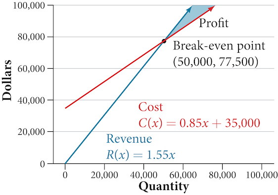\n\n

We see from the graph in  that the profit function has a negative value until $x=\mathrm{50,000},$ when the graph crosses the *x*-axis. Then, the graph emerges into positive *y*-values and continues on this path as the profit function is a straight line. This illustrates that the break-even point for businesses occurs when the profit function is 0. The area to the left of the break-even point represents operating at a loss.
\n\n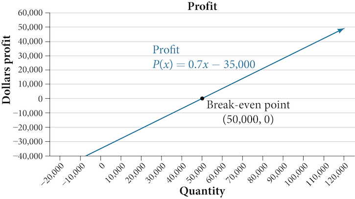\n\n

Writing and Solving a System of Equations in Two Variables
==========================================================

The cost of a ticket to the circus is $\text{\$}25.00$ for children and $\text{\$}50.00$ for adults. On a certain day, attendance at the circus is $\mathrm{2,000}$ and the total gate revenue is $\text{\$}\mathrm{70,000.}$ How many children and how many adults bought tickets?

Let *c* = the number of children and *a* = the number of adults in attendance.
The total number of people is $\mathrm{2,000.}$ We can use this to write an equation for the number of people at the circus that day.
 $$
c+a=\mathrm{2,000}
$$
The revenue from all children can be found by multiplying $\text{\$}25.00$ by the number of children, $25c.$ The revenue from all adults can be found by multiplying $\text{\$}50.00$ by the number of adults, $50a.$ The total revenue is $\text{\$}\mathrm{70,000.}$ We can use this to write an equation for the revenue.
 $$
25c+50a=\mathrm{70,000}
$$
We now have a system of linear equations in two variables.

 $$
\begin{array}{c}\phantom{\rule{0.5em}{0ex}}c+a=\mathrm{2,000}\\ 25c+50a=\mathrm{70,000}\end{array}
$$
In the first equation, the coefficient of both variables is 1. We can quickly solve the first equation for either $c$ or $a.$ We will solve for $a.$
 $$
\begin{array}{c}c+a=\mathrm{2,000}\\ a=\mathrm{2,000}-c\end{array}
$$
Substitute the expression $\mathrm{2,000}-c$ in the second equation for $a$ and solve for $c.$
 $$
\begin{array}{l}25c+50(\mathrm{2,000}-c)=\mathrm{70,000}\hfill \\ 25c+\mathrm{100,000}-50c=\mathrm{70,000}\hfill \\ -25c=\mathrm{-30,000}\hfill \\ c=\mathrm{1,200}\hfill \end{array}
$$
Substitute $c=\mathrm{1,200}$ into the first equation to solve for $a.$
 $$
\begin{array}{l}\mathrm{1,200}+a=\mathrm{2,000}\hfill \\ a=800\hfill \end{array}
$$
We find that $\mathrm{1,200}$ children and $800$ adults bought tickets to the circus that day.

Try It
Meal tickets at the circus cost $\text{\$}4.00$ for children and $\text{\$}12.00$ for adults. If $\mathrm{1,650}$ meal tickets were bought for a total of $\text{\$}\mathrm{14,200},$ how many children and how many adults bought meal tickets?

700 children, 950 adults

Media
Access these online resources for additional instruction and practice with systems of linear equations.

Solving Systems of Equations Using Substitution
Solving Systems of Equations Using Elimination
Applications of Systems of Equations

Key Concepts
============

A system of linear equations consists of two or more equations made up of two or more variables such that all equations in the system are considered simultaneously.
The solution to a system of linear equations in two variables is any ordered pair that satisfies each equation independently. See .
Systems of equations are classified as independent with one solution, dependent with an infinite number of solutions, or inconsistent with no solution.
One method of solving a system of linear equations in two variables is by graphing. In this method, we graph the equations on the same set of axes. See .
Another method of solving a system of linear equations is by substitution. In this method, we solve for one variable in one equation and substitute the result into the second equation. See .
A third method of solving a system of linear equations is by addition, in which we can eliminate a variable by adding opposite coefficients of corresponding variables. See .
It is often necessary to multiply one or both equations by a constant to facilitate elimination of a variable when adding the two equations together. See , , and .
Either method of solving a system of equations results in a false statement for inconsistent systems because they are made up of parallel lines that never intersect. See .
The solution to a system of dependent equations will always be true because both equations describe the same line. See .
Systems of equations can be used to solve real-world problems that involve more than one variable, such as those relating to revenue, cost, and profit. See  and .

Section Exercises
=================

Verbal
======

Can a system of linear equations have exactly two solutions? Explain why or why not.

No, you can either have zero, one, or infinitely many. Examine graphs.

If you are performing a break-even analysis for a business and their cost and revenue equations are dependent, explain what this means for the company’s profit margins.

If you are solving a break-even analysis and get a negative break-even point, explain what this signifies for the company?

This means there is no realistic break-even point. By the time the company produces one unit they are already making profit.

If you are solving a break-even analysis and there is no break-even point, explain what this means for the company. How should they ensure there is a break-even point?

Given a system of equations, explain at least two different methods of solving that system.

You can solve by substitution (isolating $x$ or $y$ ), graphically, or by addition.

Algebraic
=========

For the following exercises, determine whether the given ordered pair is a solution to the system of equations.

$\begin{array}{c}5x-y=4\phantom{\rule{0.5em}{0ex}}\\ x+6y=2\end{array}$ and $(4,0)$

$\begin{array}{l}\mathrm{-3}x-5y=13\hfill \\ -x+4y=10\hfill \end{array}$ and $(\mathrm{-6},1)$

Yes

$\begin{array}{c}3x+7y=1\phantom{\rule{0.5em}{0ex}}\\ 2x+4y=0\end{array}$ and $(2,3)$

$\begin{array}{l}\mathrm{-2}x+5y=7\hfill \\ \phantom{\rule{0.5em}{0ex}}2x+9y=7\hfill \end{array}$ and $(\mathrm{-1},1)$

Yes

$\begin{array}{c}x+8y=43\phantom{\rule{0.5em}{0ex}}\\ 3x\mathrm{-2}y=\mathrm{-1}\end{array}$ and $(3,5)$

For the following exercises, solve each system by substitution.

$\begin{array}{l}\phantom{\rule{0.5em}{0ex}}x+3y=5\hfill \\ 2x+3y=4\hfill \end{array}$

$(\mathrm{-1},2)$

$\begin{array}{l}\phantom{\rule{0.5em}{0ex}}\text{}3x\mathrm{-2}y=18\hfill \\ 5x+10y=\mathrm{-10}\hfill \end{array}$

$\begin{array}{l}4x+2y=\mathrm{-10}\\ 3x+9y=0\end{array}$

$(\mathrm{-3},1)$

$\begin{array}{l}2x+4y=\mathrm{-3.8}\\ 9x\mathrm{-5}y=1.3\end{array}$

$\begin{array}{l}-2x+3y=1.2\hfill \\ -3x-6y=1.8\hfill \end{array}$

$\left(-\frac{3}{5},0\right)$

$\begin{array}{l}\phantom{\rule{0.5em}{0ex}}\text{}x\mathrm{-0.2}y=1\hfill \\ \mathrm{-10}x+2y=5\hfill \end{array}$

$\begin{array}{l}\phantom{\rule{0.5em}{0ex}}\text{}3x+5y=9\hfill \\ 30x+50y=\mathrm{-90}\hfill \end{array}$

No solutions exist.

$\begin{array}{l}\phantom{\rule{0.5em}{0ex}}\text{}\mathrm{-3}x+y=2\hfill \\ 12x\mathrm{-4}y=\mathrm{-8}\hfill \end{array}$

$\begin{array}{l}\frac{1}{2}x+\frac{1}{3}y=16\\ \frac{1}{6}x+\frac{1}{4}y=9\end{array}$

$\left(\frac{72}{5},\frac{132}{5}\right)$

$\begin{array}{l}-\frac{1}{4}x+\frac{3}{2}y=11\hfill \\ -\frac{1}{8}x+\frac{1}{3}y=3\hfill \end{array}$

For the following exercises, solve each system by addition.

$\begin{array}{l}\mathrm{-2}x+5y=\mathrm{-42}\hfill \\ \phantom{\rule{0.5em}{0ex}}7x+2y=30\hfill \end{array}$

$\left(6,\mathrm{-6}\right)$

$\begin{array}{l}6x\mathrm{-5}y=\mathrm{-34}\\ 2x+6y=4\end{array}$

$\begin{array}{l}\phantom{\rule{0.5em}{0ex}}\text{}5x-y=\mathrm{-2.6}\hfill \\ \mathrm{-4}x\mathrm{-6}y=1.4\hfill \end{array}$

$\left(-\frac{1}{2},\frac{1}{10}\right)$

$\begin{array}{l}7x\mathrm{-2}y=3\\ 4x+5y=3.25\end{array}$

$\begin{array}{l}\phantom{\rule{0.5em}{0ex}}\text{}\mathrm{-x}+2y=\mathrm{-1}\hfill \\ 5x\mathrm{-10}y=6\hfill \end{array}$

No solutions exist.

$\begin{array}{l}\phantom{\rule{0.5em}{0ex}}\text{}7x+6y=2\hfill \\ \mathrm{-28}x\mathrm{-24}y=\mathrm{-8}\hfill \end{array}$

$\begin{array}{l}\frac{5}{6}x+\frac{1}{4}y=0\\ \frac{1}{8}x-\frac{1}{2}y=-\frac{43}{120}\end{array}$

$\left(-\frac{1}{5},\frac{2}{3}\right)$

$\begin{array}{l}\phantom{\rule{0.5em}{0ex}}\frac{1}{3}x+\frac{1}{9}y=\frac{2}{9}\hfill \\ -\frac{1}{2}x+\frac{4}{5}y=-\frac{1}{3}\hfill \end{array}$

$\begin{array}{l}\hfill \\ \begin{array}{l}\mathrm{-0.2}x+0.4y=0.6\hfill \\ \phantom{\rule{0.5em}{0ex}}\text{}x\mathrm{-2}y=\mathrm{-3}\hfill \end{array}\hfill \end{array}$

$\left(x,\frac{x+3}{2}\right)$

$\begin{array}{l}\begin{array}{l}\\ \mathrm{-0.1}x+0.2y=0.6\end{array}\hfill \\ \phantom{\rule{0.5em}{0ex}}5x\mathrm{-10}y=1\hfill \end{array}$

For the following exercises, solve each system by any method.

$\begin{array}{l}5x+9y=16\hfill \\ \phantom{\rule{0.5em}{0ex}}\text{}x+2y=4\hfill \end{array}$

$(\mathrm{-4},4)$

$\begin{array}{l}6x\mathrm{-8}y=\mathrm{-0.6}\\ 3x+2y=0.9\end{array}$

$\begin{array}{l}5x\mathrm{-2}y=2.25\\ 7x\mathrm{-4}y=3\end{array}$

$\left(\frac{1}{2},\frac{1}{8}\right)$

$\begin{array}{l}\phantom{\rule{0.5em}{0ex}}x-\frac{5}{12}y=-\frac{55}{12}\hfill \\ \mathrm{-6}x+\frac{5}{2}y=\frac{55}{2}\hfill \end{array}$

$\begin{array}{l}7x\mathrm{-4}y=\frac{7}{6}\hfill \\ 2x+4y=\frac{1}{3}\hfill \end{array}$

$\left(\frac{1}{6},0\right)$

$\begin{array}{l}3x+6y=11\\ 2x+4y=9\end{array}$

$\begin{array}{l}\phantom{\rule{0.5em}{0ex}}\text{}\frac{7}{3}x-\frac{1}{6}y=2\hfill \\ -\frac{21}{6}x+\frac{3}{12}y=\mathrm{-3}\hfill \end{array}$

$\left(x,2(7x\mathrm{-6})\right)$

$\begin{array}{l}\frac{1}{2}x+\frac{1}{3}y=\frac{1}{3}\\ \frac{3}{2}x+\frac{1}{4}y=-\frac{1}{8}\end{array}$

$\begin{array}{l}2.2x+1.3y=\mathrm{-0.1}\\ 4.2x+4.2y=2.1\end{array}$

$\left(-\frac{5}{6},\frac{4}{3}\right)$

$\begin{array}{l}0.1x+0.2y=2\hfill \\ 0.35x\mathrm{-0.3}y=0\hfill \end{array}$

Graphical
=========

For the following exercises, graph the system of equations and state whether the system is consistent, inconsistent, or dependent and whether the system has one solution, no solution, or infinite solutions.

$\begin{array}{l}3x-y=0.6\\ x\mathrm{-2}y=1.3\end{array}$

Consistent with one solution

$\begin{array}{l}\\ -x+2y=4\\ \phantom{\rule{0.5em}{0ex}}\text{}2x\mathrm{-4}y=1\hfill \end{array}$

$\begin{array}{l}\phantom{\rule{0.5em}{0ex}}x+2y=7\hfill \\ 2x+6y=12\hfill \end{array}$

Consistent with one solution

$\begin{array}{l}3x\mathrm{-5}y=7\hfill \\ \phantom{\rule{0.5em}{0ex}}\text{}x\mathrm{-2}y=3\hfill \end{array}$

$\begin{array}{l}\phantom{\rule{0.5em}{0ex}}3x\mathrm{-2}y=5\hfill \\ \mathrm{-9}x+6y=\mathrm{-15}\hfill \end{array}$

Dependent with infinitely many solutions

Technology
==========

For the following exercises, use the intersect function on a graphing device to solve each system. Round all answers to the nearest hundredth.

$\begin{array}{l}\phantom{\rule{0.5em}{0ex}}\text{}0.1x+0.2y=0.3\hfill \\ \mathrm{-0.3}x+0.5y=1\hfill \end{array}$

$\begin{array}{l}\mathrm{-0.01}x+0.12y=0.62\hfill \\ \phantom{\rule{0.5em}{0ex}}0.15x+0.20y=0.52\hfill \end{array}$

$\left(\mathrm{-3.08},4.91\right)$

$\begin{array}{l}\phantom{\rule{0.5em}{0ex}}0.5x+0.3y=4\hfill \\ 0.25x\mathrm{-0.9}y=0.46\hfill \end{array}$

$\begin{array}{l}\phantom{\rule{0.5em}{0ex}}0.15x+0.27y=0.39\hfill \\ \mathrm{-0.34}x+0.56y=1.8\hfill \end{array}$

$\left(\mathrm{-1.52},2.29\right)$

$\begin{array}{l}\\ \mathrm{-0.71}x+0.92y=0.13\\ \phantom{\rule{0.5em}{0ex}}0.83x+0.05y=2.1\hfill \end{array}$

Extensions
==========

For the following exercises, solve each system in terms of $A,B,C,D,E,$ and $F$ where $A\u2013F$ are nonzero numbers. Note that $A\ne B$ and $AE\ne BD.$
$\begin{array}{l}x+y=A\\ x-y=B\end{array}$

$\left(\frac{A+B}{2},\frac{A-B}{2}\right)$

$\begin{array}{l}x+Ay=1\\ x+By=1\end{array}$

$\begin{array}{l}Ax+y=0\\ Bx+y=1\end{array}$

$\left(\frac{\mathrm{-1}}{A-B},\frac{A}{A-B}\right)$

$\begin{array}{l}Ax+By=C\\ x+y=1\end{array}$

$\begin{array}{l}Ax+By=C\\ Dx+Ey=F\end{array}$

$\left(\frac{CE-BF}{BD-AE},\frac{AF-CD}{BD-AE}\right)$

Real-World Applications
=======================

For the following exercises, solve for the desired quantity.

A stuffed animal business has a total cost of production $C=12x+30$ and a revenue function $R=20x.$ Find the break-even point.

An Ethiopian restaurant has a cost of production $C(x)=11x+120$ and a revenue function $R(x)=5x.$ When does the company start to turn a profit?

They never turn a profit.

A cell phone factory has a cost of production $C(x)=150x+10,000$ and a revenue function $R(x)=200x.$ What is the break-even point?

A musician charges $C(x)=64x+\mathrm{20,000}$ where $x$ is the total number of attendees at the concert. The venue charges $80 per ticket. After how many people buy tickets does the venue break even, and what is the value of the total tickets sold at that point?

$(1,250,100,000)$

A guitar factory has a cost of production $C(x)=75x+\mathrm{50,000.}$ If the company needs to break even after 150 units sold, at what price should they sell each guitar? Round up to the nearest dollar, and write the revenue function.

For the following exercises, use a system of linear equations with two variables and two equations to solve.

Find two numbers whose sum is 28 and difference is 13.

The numbers are 7.5 and 20.5.

A number is 9 more than another number. Twice the sum of the two numbers is 10. Find the two numbers.

The startup cost for a restaurant is $120,000, and each meal costs $10 for the restaurant to make. If each meal is then sold for $15, after how many meals does the restaurant break even?

24,000

A moving company charges a flat rate of $150, and an additional $5 for each box. If a taxi service would charge $20 for each box, how many boxes would you need for it to be cheaper to use the moving company, and what would be the total cost?

A total of 1,595 first- and second-year college students gathered at a pep rally. The number of first-years exceeded the number of second-years by 15. How many students from each year group were in attendance?

790 second-year students, 805 first-year students

276 students enrolled in an introductory chemistry class. By the end of the semester, 5 times the number of students passed as failed. Find the number of students who passed, and the number of students who failed.

There were 130 faculty at a conference. If there were 18 more women than men attending, how many of each gender attended the conference?

56 men, 74 women

A jeep and a pickup truck enter a highway running east-west at the same exit heading in opposite directions. The jeep entered the highway 30 minutes before the pickup did, and traveled 7 mph slower than the pickup. After 2 hours from the time the pickup entered the highway, the cars were 306.5 miles apart. Find the speed of each car, assuming they were driven on cruise control and retained the same speed.

If a scientist mixed 10% saline solution with 60% saline solution to get 25 gallons of 40% saline solution, how many
gallons of 10% and 60% solutions were mixed?

10 gallons of 10% solution, 15 gallons of 60% solution

An investor earned triple the profits of what they earned last year. If they made $500,000.48 total for both years, how much did the investor earn in profits each year?

An investor invested 1.1 million dollars into two land investments. On the first investment, Swan Peak, her return was a 110% increase on the money she invested. On the second investment, Riverside Community, she earned 50% over what she invested. If she earned $1 million in profits, how much did she invest in each of the land deals?

Swan Peak: $750,000, Riverside: $350,000

If an investor invests a total of $25,000 into two bonds, one that pays 3% simple interest, and the other that pays $2\frac{7}{8}\text{\%}$ interest, and the investor earns $737.50 annual interest, how much was invested in each account?

If an investor invests $23,000 into two bonds, one that pays 4% in simple interest, and the other paying 2% simple interest, and the investor earns $710.00 annual interest, how much was invested in each account?

$12,500 in the first account, $10,500 in the second account.

Blu-rays cost $5.96 more than regular DVDs at All Bets Are Off Electronics. How much would 6 Blu-rays and 2 DVDs cost if 5 Blu-rays and 2 DVDs cost $127.73?

A store clerk sold 60 pairs of sneakers. The high-tops sold for $98.99 and the low-tops sold for $129.99. If the receipts for the two types of sales totaled $6,404.40, how many of each type of sneaker were sold?

High-tops: 45, Low-tops: 15

A concert manager counted 350 ticket receipts the day after a concert. The price for a student ticket was $12.50, and the price for an adult ticket was $16.00. The register confirms that $5,075 was taken in. How many student tickets and adult tickets were sold?

Admission into an amusement park for 4 children and 2 adults is $116.90. For 6 children and 3 adults, the admission is $175.35. Assuming a different price for children and adults, what is the price of the child’s ticket and the price of the adult ticket?

Infinitely many solutions. We need more information.

**addition method**an algebraic technique used to solve systems of linear equations in which the equations are added in a way that eliminates one variable, allowing the resulting equation to be solved for the remaining variable; substitution is then used to solve for the first variable
**break-even point**the point at which a cost function intersects a revenue function; where profit is zero
**consistent system**a system for which there is a single solution to all equations in the system and it is an independent system, or if there are an infinite number of solutions and it is a dependent system
**cost function**the function used to calculate the costs of doing business; it usually has two parts, fixed costs and variable costs
**dependent system**a system of linear equations in which the two equations represent the same line; there are an infinite number of solutions to a dependent system
**inconsistent system**a system of linear equations with no common solution because they represent parallel lines, which have no point or line in common
**independent system**a system of linear equations with exactly one solution pair $\left(x,y\right)$

**profit function**the profit function is written as $P(x)=R(x)-C(x),$ revenue minus cost
**revenue function** the function that is used to calculate revenue, simply written as $R=xp,$ where $x=$ quantity and $p=$ price
**substitution method**an algebraic technique used to solve systems of linear equations in which one of the two equations is solved for one variable and then substituted into the second equation to solve for the second variable
**system of linear equations**a set of two or more equations in two or more variables that must  be considered simultaneously.
