**Systems of Nonlinear Equations and Inequalities: Two Variables**

  m49431
  

**Systems of Nonlinear Equations and Inequalities: Two Variables**

  In this section, you will:

Solve a system of nonlinear equations using substitution.
Solve a system of nonlinear equations using elimination.
Graph a nonlinear inequality.
Graph a system of nonlinear inequalities.

  228bf1c6-e200-41b3-9bc0-79b6f6edbb37

## Learning Objectives

Graph a parabola (IA 11.2.1)
Graph a circle (IA 11.1.4)

## Objective 1: Graph a parabola (IA 11.2.1)
A **parabola** is all points in a plane that are the same distance from a fixed point and a fixed line. The fixed point is called the **focus**, and the fixed line is called the **directrix** of the parabola.

>
>
> **Properties of parabolas**
>
>
>
>
> 
>

| Vertical Parabolas |
|  | General form $y=a{x}^{2}+bx+c$ | Standard form $y=a{\left(x-h\right)}^{2}+k$ |
| :--- |
| *Orientation* | $a>0$ up; $a<0$ down | $a>0$ up; $a<0$ down |
| *Axis of symmetry* | $x=-\frac{b}{2a}$ | $x=h$ |
| *Vertex* | Substitute $x=-\frac{b}{2a}$ andsolve for *y*. | $\left(h,k\right)$ |
| **y*-intercept* | Let $x=0$ | Let $x=0$ |
| **x*-intercepts* | Let $y=0$ | Let $y=0$ |

>
>
>
> **Graphs of parabolas**
>
>
>
>
> 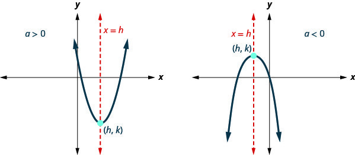
>
>

>
>
> **Graphing parabolas using properties.**
>
> Determine whether the parabola opens upward or downward.
> Find the axis of symmetry.
> Find the vertex.
> Find the y-intercept. Find the point symmetric to the y-intercept across the axis of symmetry.
> Find the x-intercepts.
> Graph the parabola.

1. Graph the parabola $y=-{x}^{2}+4x-3$

Solution

| Standard form | $y=-{x}^{2}+4x-3\ a=-1,\ b=4,\ c=-3$ |
| :--- | :--- |
| Step 1 | Since $a=-1$ the parabola opens downward | 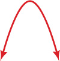 |
| Step 2 | The axis of symmetry is given by $x=-\frac{b}{2a}$ ,  $x=-\frac{4}{2(-1)}=2$ The axis of symmetry is $x=2$ | 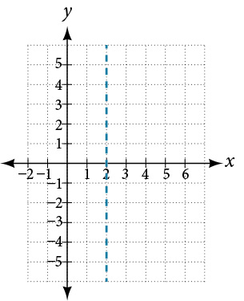 |
| Step 3 | The vertex is on the line $x=2$ Let's substitute $x=2$ into $y=-{x}^{2}+4x-3$    $\begin{array}{c}y=-{\left(2\right)}^{2}+4\left(2\right)-3\\ y=-4+8-3\\ y=1\end{array}$  The vertex is the point (2, 1) | 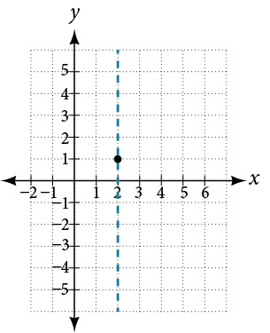 |
| Step 4 | To find y-intercept, substitute $x=0$ into $y=-{x}^{2}+4x-3$  $\begin{array}{c}y=-{\left(0\right)}^{2}+4\left(0\right)-3\\ y=-3\end{array}$ The y-intercept is the point (0,  -3) and is it 2 units to the left of the vertex. The symmetric point is 2 units to the right of the vertex and is (4, -3) | 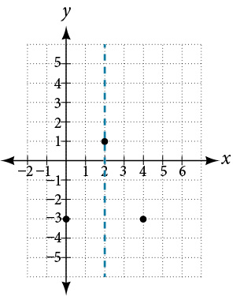 |
| Step 5 | To find the x-intercepts, substitute $y=0$ into $y=-{x}^{2}+4x-3$ and solve for $x$  $\begin{array}{c}0=-{x}^{2}+4x-3\\ 0=-({x}^{2}-4x+3)\\ 0={x}^{2}-4x+3\\ 0=(x-3)(x-1)\\ x=3\ or\ x=1\end{array}$ The x-intercepts are (3, 0) *and* (1, 0) | 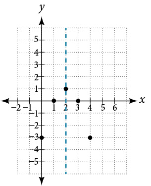 |
| Step 6 | Graph the parabola Axis of symmetry $x=2$  Vertex: (2,1) y-intercept: (0, -3),  symmetric point: (4, -3) x-intercepts: (3, 0) and (1, 0) | 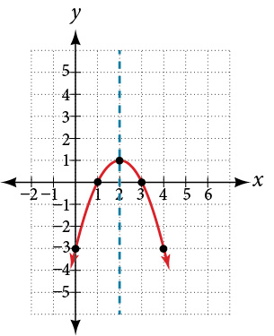 |

### Practice Makes Perfect
2. Graph the parabola $y=2{x}^{2}+4x+6$       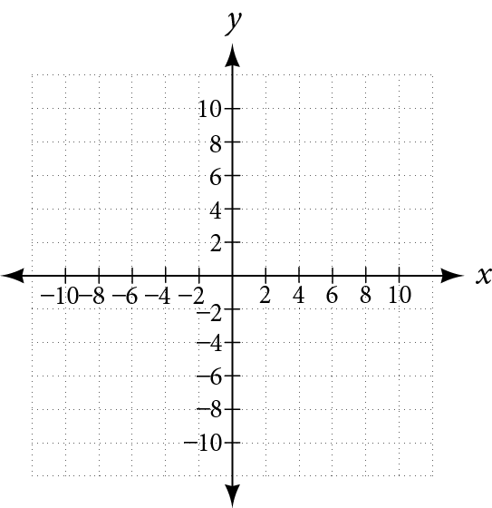

## Objective 2: Graph a circle (IA 11.1.4)
Any equation of the form ${(x-h)}^{2}+{(y-k)}^{2}={r}^{2}$ is the standard form of the equation of a circle with center, (h,k) and radius. We can then graph the circle on a rectangular coordinate system using the center and radius.

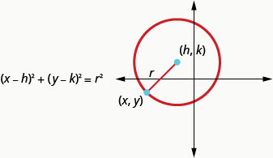

3. **Graph a circle**    ⓐ Find the center and radius and then graph the circle ${(x+3)}^{2}+{(y+4)}^{2}=4$  ⓑ Find the center and radius and then graph the circle ${x}^{2}+{y}^{2}-6x-8y+9=0$

Solution

ⓐ

| Use the standard form of the equation of a circle.
Identify the center, (h,k) and radius, r. | $\begin{array}{c}{(x-h)}^{2}+{(y-k)}^{2}={r}^{2}\\ {(x+3)}^{2}+{(y+4)}^{2}=4\\ (x-{(-3))}^{2}+(y-{(-4))}^{2}={2}^{2}\end{array}$  Center: (-3, -4) Radius: 2 |
| :--- | :--- |
| Graph the circle | 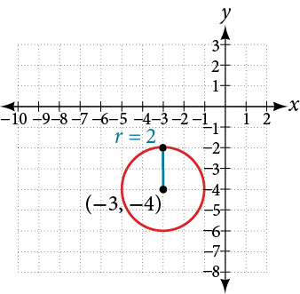 |

ⓑ
We need to rewrite this general form into standard form in order to find the center and radius.

| Step 1 Group the x-terms and y-terms. Collect the constants on the right side. | $\begin{array}{c}{x}^{2}+{y}^{2}-6x-8y+9=0\\ {x}^{2}-6x+{y}^{2}-8y=-9\end{array}$ |
| :--- | :--- |
| Step 2 Complete the squares | $\begin{array}{c}{x}^{2}-6x+{\left(\frac{6}{2}\right)}^{2}+{y}^{2}-8y+\ {\left(\frac{8}{2}\right)}^{2}=-9\ +{\left(\frac{6}{2}\right)}^{2}+{\left(\frac{8}{2}\right)}^{2}\ \\ {x}^{2}-6x+9+{y}^{2}-8y+\ 16=-9\ +\ \ 9+16\end{array}$ |
| Step 3 Rewrite as binomial squares. | ${(x-3)}^{2}+{(y-4)}^{2}=16$ |
| Step 4 Identify the center and radius. | Center: (3,4) Radius: 4 |
| Step 5 Graph the circle. | 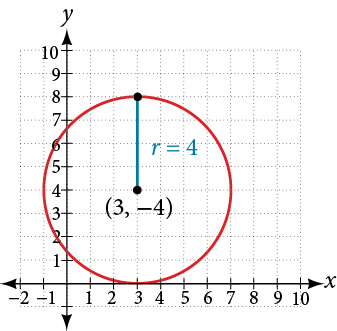 |

### Practice Makes Perfect
Graph a circle.
4. Find the center and radius and then graph the circle ${(x-3)}^{2}+{(y+4)}^{2}=25$        | Use the standard form of the equation of a circle. Identify the center, (*h*, *k*) and radius, *r*. |  | | :--- | :--- | | Graph the circle | 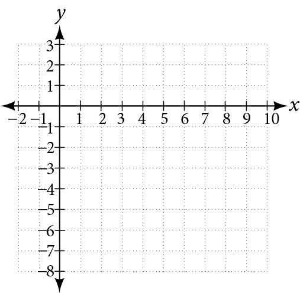 |

5. Find the center and radius and then graph the circle ${x}^{2}+{y}^{2}+12x-14y+21=0$        | Step 1 Group the x-terms and y-terms. Collect the constants on the right side. |  | | :--- | :--- | | Step 2 Complete the squares | ________________________________________ | | Step 3 Rewrite as binomial squares. | ________________________________________ | | Step 4 Identify the center and radius. | Center: ________ Radius: ________ | | Step 5 Graph the circle. |  |

Halley’s Comet () orbits the sun about once every 75 years. Its path can be considered to be a very elongated ellipse. Other comets follow similar paths in space. These orbital paths can be studied using systems of equations. These systems, however, are different from the ones we considered in the previous section because the equations are not linear.

In this section, we will consider the intersection of a parabola and a line, a circle and a line, and a circle and an ellipse. The methods for solving systems of nonlinear equations are similar to those for linear equations.

# Solving a System of Nonlinear Equations Using Substitution
A **system of nonlinear equations** is a system of two or more equations in two or more variables containing at least one equation that is not linear. Recall that a linear equation can take the form $Ax+By+C=0.$ Any equation that cannot be written in this form in nonlinear. The substitution method we used for linear systems is the same method we will use for nonlinear systems. We solve one equation for one variable and then substitute the result into the second equation to solve for another variable, and so on. There is, however, a variation in the possible outcomes.

## Intersection of a Parabola and a Line
There are three possible types of solutions for a system of nonlinear equations involving a **parabola** and a line.

>
>
>
>
> **Possible Types of Solutions for Points of Intersection of a Parabola and a Line**
>
>
>  illustrates possible solution sets for a system of equations involving a parabola and a line.
>
>
> No solution. The line will never intersect the parabola.
> One solution. The line is tangent to the parabola and intersects the parabola at exactly one point.
> Two solutions. The line crosses on the inside of the parabola and intersects the parabola at two points.
>
>
>
>
> 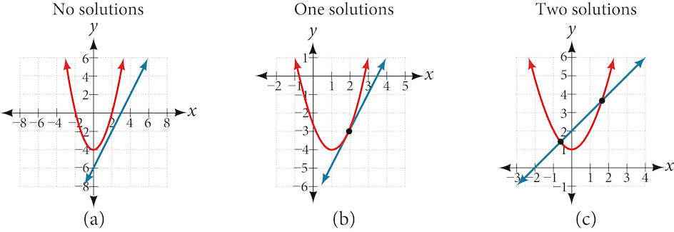
>

>
> How To
> *Given a system of equations containing a line and a parabola, find the solution.*
>
> Solve the linear equation for one of the variables.
> Substitute the expression obtained in step one into the parabola equation.
> Solve for the remaining variable.
> Check your solutions in both equations.

6. **Solving a System of Nonlinear Equations Representing a Parabola and a Line**   Solve the system of equations.   $$ \begin{array}{l}x-y=\mathrm{-1}  \\ y={x}^{2}+1  \end{array} $$

Solution

Solve the first equation for $x$ and then substitute the resulting expression into the second equation. 

 $$
\begin{array}{llll}x-y=\mathrm{-1}  &   &   &   \\ \text{\ \ \ \ \}x=y\mathrm{-1}  &   &   & \text{Solve\ for\}x.  \\   &   &   &   \\ \text{\ \ \ \ \}y={x}^{2}+1  &   &   &   \\ \text{\ \ \ \ \}y={(y\mathrm{-1})}^{2}+1  &   &   & \text{Substitute\ expression\ for\}x.  \end{array}
$$
Expand the equation and set it equal to zero.

 $$
\begin{array}{l}y={(y\mathrm{-1})}^{2}+1  \\ \text\ =({y}^{2}\mathrm{-2}y+1)+1  \\ \text\ ={y}^{2}\mathrm{-2}y+2  \\ 0={y}^{2}\mathrm{-3}y+2  \\ \text\ =(y\mathrm{-2})(y\mathrm{-1})  \end{array}
$$
Solving for $y$ gives $y=2$ and $y=1.$ Next, substitute each value for $y$ into the first equation to solve for $x.$ Always substitute the value into the linear equation to check for extraneous solutions.
 $$
\begin{array}{l}\text{\ \}x-y=\mathrm{-1}  \\ x-(2)=\mathrm{-1}  \\ \text{\ \ \ \ \ \ \ \}x=1  \\   \\ x-(1)=\mathrm{-1}  \\ \text{\ \ \ \ \ \ \ \}x=0  \end{array}
$$
The solutions are $\left(1,2\right)$ and $\left(0,1\right),$ which can be verified by substituting these $\left(x,y\right)$ values into both of the original equations. See .

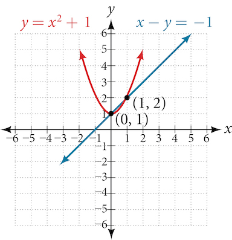

>
> Q&A
> *Could we have substituted values for $y$ into the second equation to solve for $x$ in ?*
> *Yes, but because $x$ is squared in the second equation this could give us extraneous solutions for $x.$*
>
> *For* $y=1$
>
>  $$
> \begin{array}{l}y={x}^{2}+1  \\ 1={x}^{2}+1  \\ {x}^{2}=0  \\ x=\pm \sqrt{0}=0  \end{array}
> $$
> *This gives us the same value as in the solution.*
> *For* $y=2$
>
>  $$
> \begin{array}{l}y={x}^{2}+1  \\ 2={x}^{2}+1  \\ {x}^{2}=1  \\ x=\pm \sqrt{1}=\pm 1  \end{array}
> $$
> *Notice that $\mathrm{-1}$ is an extraneous solution.*

>
> Try It
> 7. Solve the given system of equations by substitution.  $\begin{array}{ccc}  3x-y& =& -2  \\   2{x}^{2}-y& =& 0  \end{array}$
>
> 

> 
Solution

>
> $\left(-\frac{1}{2},\frac{1}{2}\right)$ and $\left(2,8\right)$
> 

>
>

## Intersection of a Circle and a Line
Just as with a parabola and a line, there are three possible outcomes when solving a system of equations representing a circle and a line.

>
>
>
>
> **Possible Types of Solutions for the Points of Intersection of a Circle and a Line**
>
>
>  illustrates possible solution sets for a system of equations involving a **circle** and a line.
>
> No solution. The line does not intersect the circle.
> One solution. The line is tangent to the circle and intersects the circle at exactly one point.
> Two solutions. The line crosses the circle and intersects it at two points.
>
>
>
>
> 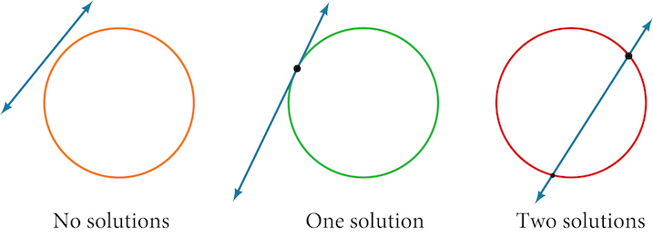
>

>
> How To
> *Given a system of equations containing a line and a circle, find the solution.*
>
> Solve the linear equation for one of the variables.
> Substitute the expression obtained in step one into the equation for the circle.
> Solve for the remaining variable.
> Check your solutions in both equations.

8. **Finding the Intersection of a Circle and a Line by Substitution**   Find the intersection of the given circle and the given line by substitution.   $$ \begin{array}{l}{x}^{2}+{y}^{2}=5  \\ y=3x\mathrm{-5}  \end{array} $$

Solution

One of the equations has already been solved for $y.$ We will substitute $y=3x\mathrm{-5}$ into the equation for the circle.

 $$
\begin{array}{c}{x}^{2}+{(3x\mathrm{-5})}^{2}=5\\ {x}^{2}+9{x}^{2}\mathrm{-30}x+25=5\\ 10{x}^{2}\mathrm{-30}x+20=0\end{array}
$$
Now, we factor and solve for $x.$

 $$
\begin{array}{l}10({x}^{2}-3x+2)=0  \\ 10(x-2)(x-1)=0  \\ x=2  \\ x=1  \end{array}
$$
Substitute the two *x*-values into the original linear equation to solve for $y.$

 $$
\begin{array}{l}y=3(2)\mathrm{-5}  \\ =1  \\   \\   \\   \\ y=3(1)\mathrm{-5}  \\ =\mathrm{-2}  \end{array}
$$
The line intersects the circle at $\left(2,1\right)$ and $\left(1,\mathrm{-2}\right),$ which can be verified by substituting these $\left(x,y\right)$ values into both of the original equations. See .

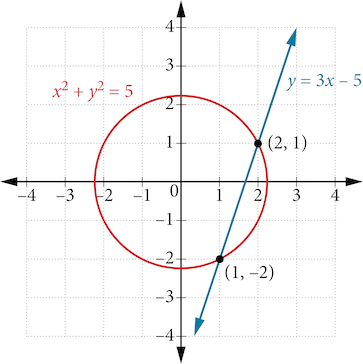

>
> Try It
> 9. Solve the system of nonlinear equations.  $\begin{array}{ccc}  {x}^{2}+{y}^{2}& =& 10  \\   x-3y& =& -10  \end{array}$
>
> 

> 
Solution

>
> $\left(\mathrm{-1},3\right)$
> 

>
>

# Solving a System of Nonlinear Equations Using Elimination
We have seen that substitution is often the preferred method when a system of equations includes a linear equation and a nonlinear equation. However, when both equations in the system have like variables of the second degree, solving them using elimination by addition is often easier than substitution. Generally, **elimination** is a far simpler method when the system involves only two equations in two variables (a two-by-two system), rather than a three-by-three system, as there are fewer steps. As an example, we will investigate the possible types of solutions when solving a system of equations representing a **circle** and an ellipse.

>
>
> **Possible Types of Solutions for the Points of Intersection of a Circle and an Ellipse**
>
>
>  illustrates possible solution sets for a system of equations involving a circle and an **ellipse**.
>
>
> No solution. The circle and ellipse do not intersect. One shape is inside the other or the circle and the ellipse are a distance away from the other.
> One solution. The circle and ellipse are tangent to each other, and intersect at exactly one point.
> Two solutions. The circle and the ellipse intersect at two points.
> Three solutions. The circle and the ellipse intersect at three points.
> Four solutions. The circle and the ellipse intersect at four points.
>
>
>
>
> 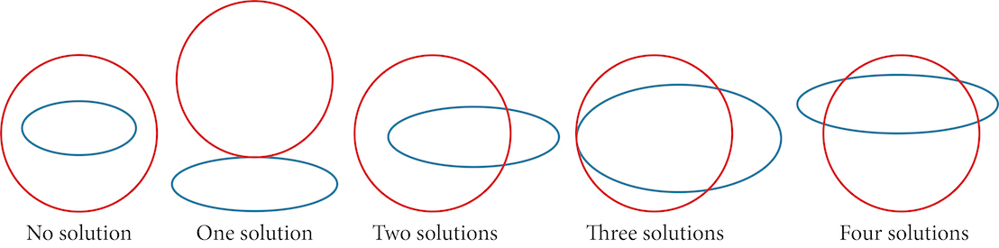
>

10. **Solving a System of Nonlinear Equations Representing a Circle and an Ellipse**   Solve the system of nonlinear equations.   $$ \begin{array}{rr}  {x}^{2}+{y}^{2}=26&   (1)\\   3{x}^{2}+25{y}^{2}=100&   (2)\end{array} $$

Solution

Let’s begin by multiplying equation (1) by $\mathrm{-3},$ and adding it to equation (2).
 $$
\frac{\begin{array}{l}\begin{array}{l}  \\ (-3)({x}^{2}+{y}^{2})=(-3)(26)  \\ \text\ \phantom{\rule{0.5em}{0ex}}-3{x}^{2}-3{y}^{2}=-78  \end{array}  \\ \text{\ \ \}\phantom{\rule{0.5em}{0ex}}3{x}^{2}+25{y}^{2}=100  \end{array}}{\text{\ \ \ \ \}22{y}^{2}=22}
$$
After we add the two equations together, we solve for $y.$

 $$
\begin{array}{l}{y}^{2}=1  \\ y=\pm \sqrt{1}=\pm 1  \end{array}
$$
Substitute $y=\pm 1$ into one of the equations and solve for $x.$

 $$
\begin{array}{l}\text{\ \ \}{x}^{2}+{(1)}^{2}=26  \\ \text{\ \ \ \ \ \ \ \}{x}^{2}+1=26  \\ \text{\ \ \ \ \ \ \ \ \ \ \ \ \ \}{x}^{2}=25  \\ \text{\ \ \ \ \ \ \ \ \ \ \ \ \ \ \ \}x=\pm \sqrt{25}=\pm 5  \\   \\ {x}^{2}+{(\mathrm{-1})}^{2}=26  \\ \text{\ \ \ \ \ \ \ \}{x}^{2}+1=26  \\ \text{\ \ \ \ \ \ \ \ \ \ \ \ \ \}{x}^{2}=25=\pm 5  \end{array}
$$
There are four solutions: $\left(5,1\right),\left(\mathrm{-5},1\right),\left(5,\mathrm{-1}\right),\text{and}\phantom{\rule{0.5em}{0ex}}\left(\mathrm{-5},\mathrm{-1}\right).$ See .

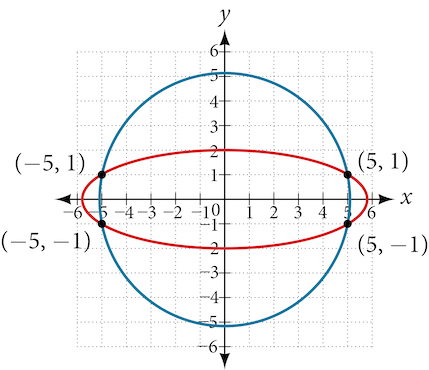

>
> Try It
> 11. Find the solution set for the given system of nonlinear equations.  $\begin{array}{ccc}  4{x}^{2}+{y}^{2}& =& 13  \\   {x}^{2}+{y}^{2}& =& 10  \end{array}$
>
> 

> 
Solution

>
> $\left\{\left(1,3\right),\left(1,\mathrm{-3}\right),\left(\mathrm{-1},3\right),\left(\mathrm{-1},\mathrm{-3}\right)\right\}$
> 

>
>

# Graphing a Nonlinear Inequality
All of the equations in the systems that we have encountered so far have involved equalities, but we may also encounter systems that involve inequalities. We have already learned to graph linear inequalities by graphing the corresponding equation, and then shading the region represented by the **inequality** symbol. Now, we will follow similar steps to graph a nonlinear inequality so that we can learn to solve systems of nonlinear inequalities. A **nonlinear inequality** is an inequality containing a nonlinear expression. Graphing a nonlinear inequality is much like graphing a linear inequality.
Recall that when the inequality is greater than, $y>a,$ or less than, $y<a,$ the graph is drawn with a dashed line. When the inequality is greater than or equal to, $y\ge a,$ or less than or equal to, $y\le a,$ the graph is drawn with a solid line. The graphs will create regions in the plane, and we will test each region for a solution. If one point in the region works, the whole region works. That is the region we shade. See .

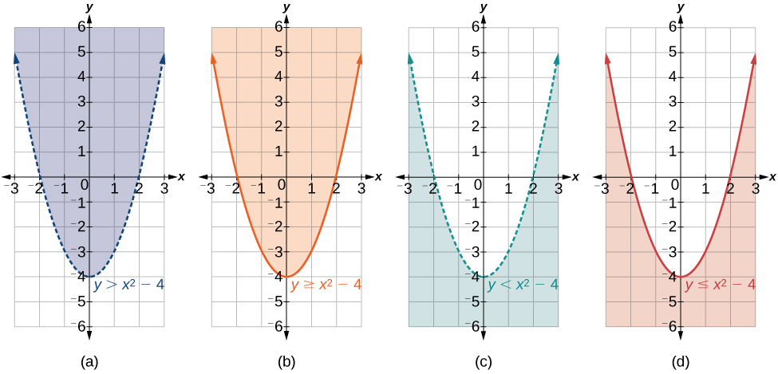

>
> How To
> *Given an inequality bounded by a parabola, sketch a graph.*
>
> Graph the parabola as if it were an equation. This is the boundary for the region that is the solution set.
> If the boundary is included in the region (the operator is $\le$ or $\ge$ ), the parabola is graphed as a solid line.
> If the boundary is not included in the region (the operator is < or >), the parabola is graphed as a dashed line.
> Test a point in one of the regions to determine whether it satisfies the inequality statement. If the statement is true, the solution set is the region including the point. If the statement is false, the solution set is the region on the other side of the boundary line.
> Shade the region representing the solution set.

12. **Graphing an Inequality for a Parabola**   Graph the inequality $y>{x}^{2}+1.$

Solution

First, graph the corresponding equation $y={x}^{2}+1.$ Since $y>{x}^{2}+1$ has a greater than symbol, we draw the graph with a dashed line. Then we choose points to test both inside and outside the parabola. Let’s test the points $\left(0,2\right)$ and $\left(2,0\right).$ One point is clearly inside the parabola and the other point is clearly outside.
 $$
\begin{array}{ll}y>{x}^{2}+1  &   \\ 2>{(0)}^{2}+1  &   \\ 2>1  & \text{True}  \\   &   \\   &   \\   &   \\ 0>{(2)}^{2}+1  &   \\ 0>5  & \text{False}  \end{array}
$$
The graph is shown in . We can see that the solution set consists of all points inside the parabola, but not on the graph itself.

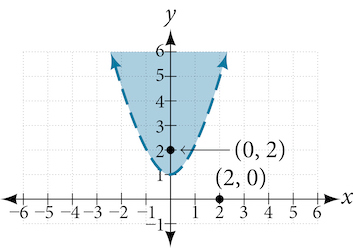

# Graphing a System of Nonlinear Inequalities
Now that we have learned to graph nonlinear inequalities, we can learn how to graph systems of nonlinear inequalities. A **system of nonlinear inequalities** is a system of two or more inequalities in two or more variables containing at least one inequality that is not linear. Graphing a system of nonlinear inequalities is similar to graphing a system of linear inequalities. The difference is that our graph may result in more shaded regions that represent a solution than we find in a system of linear inequalities. The solution to a nonlinear system of inequalities is the region of the graph where the shaded regions of the graph of each inequality overlap, or where the regions intersect, called the **feasible region**.

>
> How To
> *Given a system of nonlinear inequalities, sketch a graph.*
>
> Find the intersection points by solving the corresponding system of nonlinear equations.
> Graph the nonlinear equations.
> Find the shaded regions of each inequality.
> Identify the feasible region as the intersection of the shaded regions of each inequality or the set of points common to each inequality.

13. **Graphing a System of Inequalities**   Graph the given system of inequalities.    $$ \begin{array}{r}  {x}^{2}-y\le 0\\   2{x}^{2}+y\le 12\end{array} $$

Solution

These two equations are clearly parabolas. We can find the points of intersection by the elimination process: Add both equations and the variable $y$ will be eliminated. Then we solve for $x.$
 

  $$
\begin{array}{l}\underset{\_\_\_\_\_\_\_\_\_\_\_\_}{\begin{array}{c}\begin{array}{l}  \\ {x}^{2}-y=0  \end{array}\\ 2{x}^{2}+y=12\end{array}}  \\ \text{\ \ \ \ \}3{x}^{2}=12  \\ \text{\ \ \ \ \ \ \}{x}^{2}=4  \\ \text{\ \ \ \ \ \ \ \ \}x=\pm 2  \end{array}
$$
Substitute the *x*-values into one of the equations and solve for $y.$
 
 $$
\begin{array}{r}  {x}^{2}-y=0\\   {(2)}^{2}-y=0\\   4-y=0\\   y=4\\   \\   {(\mathrm{-2})}^{2}-y=0\\   4-y=0\\   y=4\end{array}
$$
The two points of intersection are $\left(2,4\right)$ and $\left(\mathrm{-2},4\right).$ Notice that the equations can be rewritten as follows.
 $$
\begin{array}{l}{x}^{2}-y\le 0  \\ {x}^{2}\le y  \\ y\ge {x}^{2}  \\   \\ 2{x}^{2}+y\le 12  \\ y\le \mathrm{-2}{x}^{2}+12  \end{array}
$$
Graph each inequality. See . The feasible region is the region between the two equations bounded by $2{x}^{2}+y\le 12$ on the top and ${x}^{2}-y\le 0$ on the bottom.

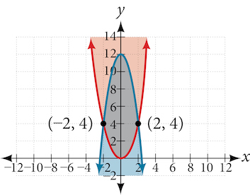

>
> Try It
> 14. Graph the given system of inequalities.   $$ \begin{array}{ccc}  y& \ge & {x}^{2}-1  \\   x-y& \ge & -1  \end{array} $$
>
> 

> 
Solution

>
> 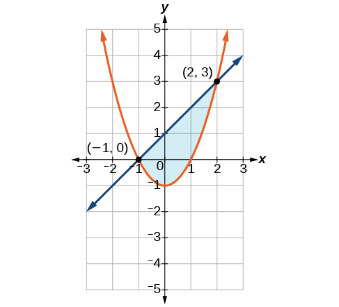
> 

>

>
> Media
> Access these online resources for additional instruction and practice with nonlinear equations.
>
>
>   Solve a System of Nonlinear Equations Using Substitution
>  Solve a System of Nonlinear Equations Using Elimination
>
>

# Key Concepts
There are three possible types of solutions to a system of equations representing a line and a parabola: (1) no solution, the line does not intersect the parabola; (2) one solution, the line is tangent to the parabola; and (3) two solutions, the line intersects the parabola in two points. See .
 There are three possible types of solutions to a system of equations representing a circle and a line: (1) no solution, the line does not intersect the circle; (2) one solution, the line is tangent to the circle; (3) two solutions, the line intersects the circle in two points. See .
 There are five possible types of solutions to the system of nonlinear equations representing an ellipse and a circle: (1) no solution, the circle and the ellipse do not intersect; (2) one solution, the circle and the ellipse are tangent to each other; (3) two solutions, the circle and the ellipse intersect in two points; (4) three solutions, the circle and ellipse intersect in three places; (5) four solutions, the circle and the ellipse intersect in four points. See .
 An inequality is graphed in much the same way as an equation, except for > or <, we draw a dashed line and shade the region containing the solution set. See .
 Inequalities are solved the same way as equalities, but solutions to systems of inequalities must satisfy both inequalities. See .

 
# Section Exercises

## Verbal
1. Explain whether a system of two nonlinear equations can have exactly two solutions. What about exactly three? If not, explain why not. If so, give an example of such a system, in graph form, and explain why your choice gives two or three answers.

Solution

A nonlinear system could be representative of two circles that overlap and intersect in two locations, hence two solutions. A nonlinear system could be representative of a parabola and a circle, where the vertex of the parabola meets the circle and the branches also intersect the circle, hence three solutions.

2. When graphing an inequality, explain why we only need to test one point to determine whether an entire region is the solution?

3. When you graph a system of inequalities, will there always be a feasible region? If so, explain why. If not, give an example of a graph of inequalities that does not have a feasible region. Why does it not have a feasible region?

Solution

No. There does not need to be a feasible region. Consider a system that is bounded by two parallel lines. One inequality represents the region above the upper line; the other represents the region below the lower line. In this case, no points in the plane are located in both regions; hence there is no feasible region.

4. If you graph a revenue and cost function, explain how to determine in what regions there is profit.

5. If you perform your break-even analysis and there is more than one solution, explain how you would determine which *x*-values are profit and which are not.

Solution

Choose any number between each solution and plug into $C(x)$ and $R(x).$ If $C(x)<R(x),$ then there is profit.

## Algebraic
For the following exercises, solve the system of nonlinear equations using substitution.
6. $\begin{array}{l}\text{\ \}x+y=4  \\ {x}^{2}+{y}^{2}=9  \end{array}$

7. $\begin{array}{l}\text{\ \ \ \ \ \ \ \}y=x\mathrm{-3}  \\ {x}^{2}+{y}^{2}=9  \end{array}$

Solution

$\left(0,\mathrm{-3}\right),\left(3,0\right)$

8. $\begin{array}{l}\text{\ \ \ \ \ \ \ \}y=x  \\ {x}^{2}+{y}^{2}=9  \end{array}$

9. $\begin{array}{l}\text{\ \ \ \ \ \ \ \}y=-x  \\ {x}^{2}+{y}^{2}=9  \end{array}$

Solution

$\left(-\frac{3\sqrt{2}}{2},\frac{3\sqrt{2}}{2}\right),\left(\frac{3\sqrt{2}}{2},-\frac{3\sqrt{2}}{2}\right)$

10. $\begin{array}{l}\text{\ \ \ \ \ \ \ \}x=2  \\ {x}^{2}-{y}^{2}=9  \end{array}$

For the following exercises, solve the system of nonlinear equations using elimination.
11. $\begin{array}{l}4{x}^{2}\mathrm{-9}{y}^{2}=36  \\ 4{x}^{2}+9{y}^{2}=36  \end{array}$

Solution

$\left(\mathrm{-3},0\right),\left(3,0\right)$

12. $\begin{array}{l}{x}^{2}+{y}^{2}=25\\ {x}^{2}-{y}^{2}=1\end{array}$

13. $\begin{array}{l}2{x}^{2}+4{y}^{2}=4  \\ 2{x}^{2}\mathrm{-4}{y}^{2}=25x\mathrm{-10}  \end{array}$

Solution

$\left(\frac{1}{4},-\frac{\sqrt{62}}{8}\right),\left(\frac{1}{4},\frac{\sqrt{62}}{8}\right)$

14. $\begin{array}{l}{y}^{2}-{x}^{2}=9\\ 3{x}^{2}+2{y}^{2}=8\end{array}$

15. $\begin{array}{l}{x}^{2}+{y}^{2}+\frac{1}{16}=2500\\ y=2{x}^{2}\end{array}$

Solution

$\left(-\frac{\sqrt{398}}{4},\frac{199}{4}\right),\left(\frac{\sqrt{398}}{4},\frac{199}{4}\right)$

For the following exercises, use any method to solve the system of nonlinear equations.
16. $\begin{array}{l}\mathrm{-2}{x}^{2}+y=\mathrm{-5}\\ \text{\ \ \}6x-y=9  \end{array}$

17. $\begin{array}{l}-{x}^{2}+y=2\\ \text{}-x+y=2  \end{array}$

Solution

$\left(0,2\right),\left(1,3\right)$

18. $\begin{array}{l}{x}^{2}+{y}^{2}=1  \\ \text{\ \ \ \ \ \ \ \ \}y=20{x}^{2}\mathrm{-1}  \end{array}$

19. $\begin{array}{l}{x}^{2}+{y}^{2}=1  \\ \text{\ \ \ \ \ \ \ \ \}y=-{x}^{2}  \end{array}$

Solution

$\left(-\sqrt{\frac{1}{2}\left(\sqrt{5}\mathrm{-1}\right)},\frac{1}{2}\left(1-\sqrt{5}\right)\right),\left(\sqrt{\frac{1}{2}\left(\sqrt{5}\mathrm{-1}\right)},\frac{1}{2}\left(1-\sqrt{5}\right)\right)$

20. $\begin{array}{l}2{x}^{3}-{x}^{2}=y  \\ \text{\ \ \ \ \ \ \ \ \ \}y=\frac{1}{2}-x  \end{array}$

21. $\begin{array}{l}9{x}^{2}+25{y}^{2}=225  \\ {(x\mathrm{-6})}^{2}+{y}^{2}=1  \end{array}$

Solution

$\left(5,0\right)$

22. $\begin{array}{l}{x}^{4}-{x}^{2}=y  \\ \text\ {x}^{2}+y=0  \end{array}$

23. $\begin{array}{l}2{x}^{3}-{x}^{2}=y  \\ \text{\ \ \}{x}^{2}+y=0  \end{array}$

Solution

$\left(0,0\right)$

For the following exercises, use any method to solve the nonlinear system.
24. $\begin{array}{l}{x}^{2}+{y}^{2}=9  \\ \text{\ \ \ \ \ \ \ \}y=3-{x}^{2}  \end{array}$

25. $\begin{array}{l}{x}^{2}-{y}^{2}=9  \\ \text{\ \ \ \ \ \ \ \ \}x=3  \end{array}$

Solution

$\left(3,0\right)$

26. $\begin{array}{l}{x}^{2}-{y}^{2}=9  \\ \text{\ \ \ \ \ \ \ \ \}y=3  \end{array}$

27. $\begin{array}{l}{x}^{2}-{y}^{2}=9  \\ \text{\ \ \}x-y=0  \end{array}$

Solution

No Solutions Exist

28. $\begin{array}{l}-{x}^{2}+y=2  \\ \mathrm{-4}x+y=\mathrm{-1}  \end{array}$

29. $\begin{array}{l}-{x}^{2}+y=2  \\ \text{\ \ \ \ \ \ \ \}2y=-x  \end{array}$

Solution

No Solutions Exist

30. $\begin{array}{l}{x}^{2}+{y}^{2}=25\\ {x}^{2}-{y}^{2}=36\end{array}$

31. $\begin{array}{l}{x}^{2}+{y}^{2}=1  \\ \text{\ \ \ \ \ \ \}{y}^{2}={x}^{2}  \end{array}$

Solution

$\left(-\frac{\sqrt{2}}{2},-\frac{\sqrt{2}}{2}\right),\left(-\frac{\sqrt{2}}{2},\frac{\sqrt{2}}{2}\right),\left(\frac{\sqrt{2}}{2},-\frac{\sqrt{2}}{2}\right),\left(\frac{\sqrt{2}}{2},\frac{\sqrt{2}}{2}\right)$

32. $\begin{array}{l}16{x}^{2}\mathrm{-9}{y}^{2}+144=0  \\ \text{\ \ \ \ \ \ \ \ \ \ \ \ \ \ \}{y}^{2}+{x}^{2}=16  \end{array}$

33. $\begin{array}{l}\text{\ \ \ \ \}3{x}^{2}-{y}^{2}=12  \\ {(x\mathrm{-1})}^{2}+{y}^{2}=1  \end{array}$

Solution

$(2,0)$

34. $\begin{array}{l}\text{\ \ \ \ \}3{x}^{2}-{y}^{2}=12  \\ {(x\mathrm{-1})}^{2}+{y}^{2}=4  \end{array}$

35. $\begin{array}{l}3{x}^{2}-{y}^{2}=12  \\ \text{\ \}{x}^{2}+{y}^{2}=16  \end{array}$

Solution

$\left(-\sqrt{7},\mathrm{-3}\right),\left(-\sqrt{7},3\right),\left(\sqrt{7},\mathrm{-3}\right),\left(\sqrt{7},3\right)$

36. $\begin{array}{l}{x}^{2}-{y}^{2}-6x-4y-11=0  \\ \text{\ \ \ \ \ \ \ \ \ \ \ \ \ \ \ \ \ \}\phantom{\rule{0.5em}{0ex}}-{x}^{2}+{y}^{2}=5  \end{array}$

37. $\begin{array}{l}{x}^{2}+{y}^{2}\mathrm{-6}y=7  \\ \text{\ \ \ \ \ \ \ \ \}{x}^{2}+y=1  \end{array}$

Solution

$\left(-\sqrt{\frac{1}{2}\left(\sqrt{73}\mathrm{-5}\right)},\frac{1}{2}\left(7-\sqrt{73}\right)\right),\left(\sqrt{\frac{1}{2}\left(\sqrt{73}\mathrm{-5}\right)},\frac{1}{2}\left(7-\sqrt{73}\right)\right)$

38. $\begin{array}{l}{x}^{2}+{y}^{2}=6  \\ \text{\ \ \ \ \ \ \}xy=1  \end{array}$

## Graphical
For the following exercises, graph the inequality.
39. ${x}^{2}+y<9$

Solution

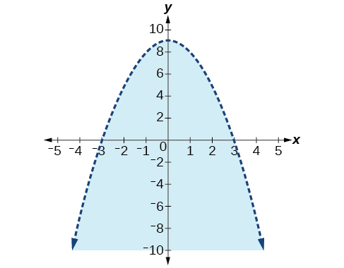

40. ${x}^{2}+{y}^{2}<4$

For the following exercises, graph the system of inequalities. Label all points of intersection.
41. $\begin{array}{l}{x}^{2}+y<1\\ y>2x\end{array}$

Solution

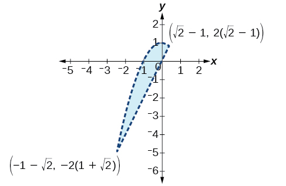

42. $\begin{array}{l}{x}^{2}+y<\mathrm{-5}\\ y>5x+10\end{array}$

43. $\begin{array}{l}{x}^{2}+{y}^{2}<25\\ 3{x}^{2}-{y}^{2}>12\end{array}$

Solution

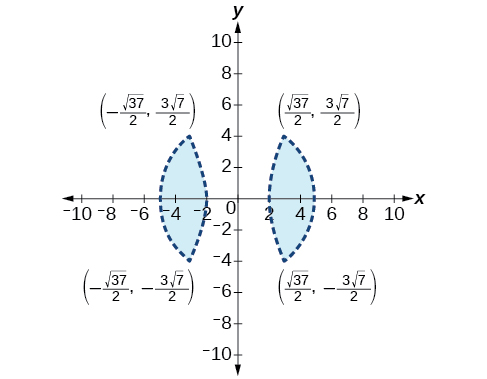

44. $\begin{array}{l}{x}^{2}-{y}^{2}>\mathrm{-4}\\ {x}^{2}+{y}^{2}<12\end{array}$

45. $\begin{array}{l}{x}^{2}+3{y}^{2}>16\\ 3{x}^{2}-{y}^{2}<1\end{array}$

Solution

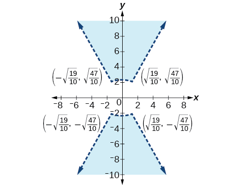

## Extensions
For the following exercises, graph the inequality.
46. $\begin{array}{l}y\ge {e}^{x}  \\ y\le \mathrm{ln}(x)+5  \end{array}$

47. $\begin{array}{l}y\le -\mathrm{log}(x)\\ y\le {e}^{x}\end{array}$

Solution

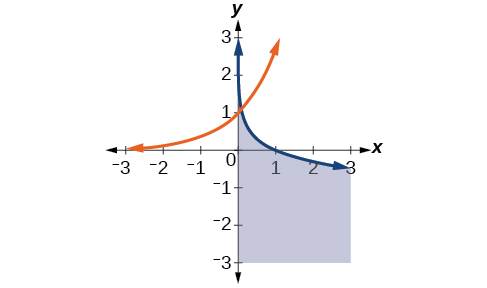

For the following exercises, find the solutions to the nonlinear equations with two variables.
48. $\begin{array}{l}\frac{4}{{x}^{2}}+\frac{1}{{y}^{2}}=24\\ \frac{5}{{x}^{2}}-\frac{2}{{y}^{2}}+4=0\end{array}$

49. $\begin{array}{c}\frac{6}{{x}^{2}}-\frac{1}{{y}^{2}}=8\\ \frac{1}{{x}^{2}}-\frac{6}{{y}^{2}}=\frac{1}{8}\end{array}$

Solution

$\left(\mathrm{-2}\sqrt{\frac{70}{383}},\mathrm{-2}\sqrt{\frac{35}{29}}\right),\left(\mathrm{-2}\sqrt{\frac{70}{383}},2\sqrt{\frac{35}{29}}\right),\left(2\sqrt{\frac{70}{383}},\mathrm{-2}\sqrt{\frac{35}{29}}\right),\left(2\sqrt{\frac{70}{383}},2\sqrt{\frac{35}{29}}\right)$

50. $\begin{array}{l}{x}^{2}-xy+{y}^{2}\mathrm{-2}=0  \\ x+3y=4  \end{array}$

51. $\begin{array}{l}{x}^{2}-xy\mathrm{-2}{y}^{2}\mathrm{-6}=0  \\ {x}^{2}+{y}^{2}=1  \end{array}$

Solution

No Solution Exists

52. $\begin{array}{l}{x}^{2}+4xy\mathrm{-2}{y}^{2}\mathrm{-6}=0  \\ x=y+2  \end{array}$

## Technology
For the following exercises, solve the system of inequalities. Use a calculator to graph the system to confirm the answer.
53. $\begin{array}{l}xy<1\\ y>\sqrt{x}\end{array}$

Solution

$x=0,y>0$ and $0<x<1,\sqrt{x}<y<\frac{1}{x}$

54. $\begin{array}{l}{x}^{2}+y<3\\ y>2x\end{array}$

## Real-World Applications
For the following exercises, construct a system of nonlinear equations to describe the given behavior, then solve for the requested solutions.
55. Two numbers add up to 300. One number is twice the square of the other number. What are the numbers?

Solution

12, 288

56. The squares of two numbers add to 360. The second number is half the value of the first number squared. What are the numbers?

57. A laptop company has discovered their cost and revenue functions for each day: $C(x)=3{x}^{2}\mathrm{-10}x+200$ and $R(x)=\mathrm{-2}{x}^{2}+100x+50.$ If they want to make a profit, what is the range of laptops per day that they should produce? Round to the nearest number which would generate profit.

Solution

2–20 computers

58. A cell phone company has the following cost and revenue functions: $C(x)=8{x}^{2}\mathrm{-600}x+\mathrm{21,500}$ and $R(x)=\mathrm{-3}{x}^{2}+480x.$ What is the range of cell phones they should produce each day so there is profit? Round to the nearest number that generates profit.

 
  
   **feasible region** the solution to a system of nonlinear inequalities that is the region of the graph where the shaded regions of each inequality intersect
  
   **nonlinear inequality** an inequality containing a nonlinear expression
  
   **system of nonlinear equations** a system of equations containing at least one equation that is of degree larger than one
  
   **system of nonlinear inequalities** a system of two or more inequalities in two or more variables containing at least one inequality that is not linear
