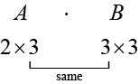
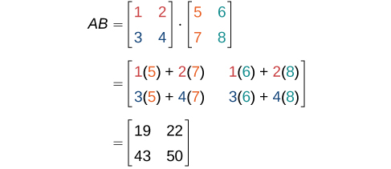

**Matrices and Matrix Operations**

  m49433
  

**Matrices and Matrix Operations**

  In this section, you will:

Find the sum and difference of two matrices.
Find scalar multiples of a matrix.
Find the product of two matrices.

  508a4d4e-0136-4c6c-87b8-e210022d69b4

## Learning Objectives

Write the augmented matrix for a system of equations (IA 4.5.1)
Add, subtract matrices and multiply a matrix by a scalar

## Objective 1: Write the augmented matrix for a system of equations (IA 4.5.1)
A **matrix** is a rectangular array of numbers arranged in rows and columns.
A matrix with *m* rows and *n* columns has dimension m×n.

Each number in the matrix is called an **element** or **entry** in the matrix.

The matrix on the left below has 2 rows and 3 columns and so it has order 2×3. We say it is a 2 by 3 matrix.

We will use a matrix to represent systems of equations.

Each *column* then would be the coefficients of one of the variables in the system or the constants.

A *vertical* line replaces the *equal signs*.

We call the resulting matrix the *augmented* matrix for the system of equations.

Write each system of linear equations as an augmented matrix

1. ⓐ  $\left\{\begin{array}{l}3x-y=-1\\ 2y=2x+5\end{array}\right.$       ⓑ  $\left\{\begin{array}{l}4x+3y=-2\\ x-2y-3z=7\\ 2x-y+2z=-6\end{array}\right.$

Solution

ⓐ
 We first rewrite the second equation in standard form 

 $\left\{\begin{array}{l}3x-y=-1\\ -2x+2y=5\end{array}\right.$ 

Next we write the augmented matrix

 $\left\{\begin{array}{l}3x-y=-1\\ -2x+2y=5\end{array}\right.\Rightarrow \stackrel{x\phantom{\rule{2em}{0ex}}y\phantom{\rule{4em}{0ex}}}{\left[\begin{array}{rr}  3&   \mathrm{-1}\\   \mathrm{-2}&   2\end{array}\phantom{\rule{0.5em}{0ex}}|\phantom{\rule{0.5em}{0ex}}\begin{array}{r}  \mathrm{-1}\\   5\end{array}\right]}$ 

ⓑ
 Each equation is in standard form

Write the augmented matrix

 $\left\{\begin{array}{l}4x+3y=-2\\ x-2y-3z=7\\ 2x-y+2z=-6\end{array}\right.\Rightarrow \stackrel{x\phantom{\rule{2em}{0ex}}y\phantom{\rule{2em}{0ex}}z\phantom{\rule{4em}{0ex}}}{\left[\begin{array}{rrr}  4&   3&   0\\   1&   \mathrm{-2}&   \mathrm{-3}\\   2&   \mathrm{-1}&   2\end{array}\phantom{\rule{0.5em}{0ex}}|\phantom{\rule{0.5em}{0ex}}\begin{array}{r}  \mathrm{-2}\\   7\\   \mathrm{-6}\end{array}\right]}$

### Practice Makes Perfect

Write each system of linear equations as an augmented matrix

2. $\left\{\begin{array}{l}2x-5y=-3\\ 4x=3y-1\end{array}\right.$

3. $\left\{\begin{array}{l}4x+3y-2z=-3\\ -2x+y-3z=4\\ -x-4y+5z=-2\end{array}\right.$

## Objective 2: Add, subtract matrices and multiply a matrix by a scalar
We add or subtract matrices by adding or subtracting corresponding entries.

In order to do this, the *entries must correspond*. Therefore, *addition and subtraction of matrices is only possible when the matrices have the same dimensions*. We can add or subtract a 3 × 3 matrix and another 3 × 3 matrix, but we cannot add or subtract a 2 × 3 matrix and a 3 × 3 matrix because some entries in one matrix will not have a corresponding entry in the other matrix.

The process of scalar multiplication involves multiplying each entry in a matrix by a scalar. A **scalar multiple** is any entry of a matrix that results from scalar multiplication.

4. ⓐ Add the two matrices $A=\left[\begin{array}{cc}a& b\\ c& d\end{array}\right]\ B=\left[\begin{array}{cc}e& f\\ g& h\end{array}\right]$      ⓑ Subtract the two matrices $A=\left[\begin{array}{cc}2& -4\\ 5& 3\end{array}\right]B=\left[\begin{array}{cc}6& 9\\ 7& 8\end{array}\right]$        ⓒ Multiply the matrix $A=\left[\begin{array}{cc}2& -4\\ 5& 3\end{array}\right]$ by 5.

Solution

ⓐ
 $A+B=\left[\begin{array}{cc}a& b\\ c& d\end{array}\right]+\left[\begin{array}{cc}e& f\\ g& h\end{array}\right]=\left[\begin{array}{cc}a+e& b+f\\ c+g& d+h\end{array}\right]$
  

  ⓑ
 $A-B=\left[\begin{array}{cc}2& -4\\ 5& 3\end{array}\right]-\left[\begin{array}{cc}6& 9\\ 7& 8\end{array}\right]=\left[\begin{array}{cc}2-6& -4-9\\ 5-7& 3-8\end{array}\right]=\left[\begin{array}{cc}-4& -13\\ -2& -5\end{array}\right]$
  

  ⓒ
 $5A=\left[\begin{array}{cc}5\left(2\right)& 5(-4)\\ 5\left(5\right)& 5\left(3\right)\end{array}\right]=\left[\begin{array}{cc}10& -20\\ 25& 15\end{array}\right]$

### Practice Makes Perfect

Perform the indicated operations

5. Add the two matrices $A=\left[\begin{array}{cc}l& m\\ n& p\end{array}\right]\ B=\left[\begin{array}{cc}q& r\\ s& t\end{array}\right]$

6. Subtract the two matrices $A=\left[\begin{array}{cc}-3& 2\\ 1& 0\end{array}\right]\ B=\left[\begin{array}{cc}-5& 4\\ 1& 5\end{array}\right]$

7. Multiply the matrix $A=\left[\begin{array}{cc}2& -4\\ 5& 3\end{array}\right]$ by –2

8. Find $2A+3B$ when $A=\left[\begin{array}{cc}1& -6\\ 4& 8\end{array}\right]$ and $B=\left[\begin{array}{cc}1& -5\\ 3& -1\end{array}\right]$

Two club soccer teams, the Wildcats and the Mud Cats, are hoping to obtain new equipment for an upcoming season.  shows the needs of both teams.

  

|  | Wildcats | Mud Cats |
| :--- | :--- | :--- |
| *Goals* | 6 | 10 |
| *Balls* | 30 | 24 |
| *Jerseys* | 14 | 20 |

A goal costs $300; a ball costs $10; and a jersey costs $30. How can we find the total cost for the equipment needed for each team? In this section, we discover a method in which the data in the soccer equipment table can be displayed and used for calculating other information. Then, we will be able to calculate the cost of the equipment.

# Finding the Sum and Difference of Two Matrices
To solve a problem like the one described for the soccer teams, we can use a **matrix**, which is a rectangular array of numbers. A **row** in a matrix is a set of numbers that are aligned horizontally. A **column** in a matrix is a set of numbers that are aligned vertically. Each number is an **entry**, sometimes called an element, of the matrix. Matrices (plural) are enclosed in [  ] or (  ), and are usually named with capital letters. For example, three matrices named $A,B,$ and $C$ are shown below.
 $$
A=\left[\begin{array}{cc}1& 2\\ 3& 4\end{array}\right],B=\left[\begin{array}{ccc}1& 2& 7\\ 0& \mathrm{-5}& 6\\ 7& 8& 2\end{array}\right],C=\left[\begin{array}{c}\mathrm{-1}\\ \phantom{\rule{0.5em}{0ex}}\phantom{\rule{0.5em}{0ex}}\phantom{\rule{0.5em}{0ex}}0\\ \phantom{\rule{0.5em}{0ex}}\phantom{\rule{0.5em}{0ex}}\phantom{\rule{0.5em}{0ex}}3\end{array}\phantom{\rule{0.5em}{0ex}}\phantom{\rule{0.5em}{0ex}}\phantom{\rule{0.5em}{0ex}}\phantom{\rule{0.5em}{0ex}}\begin{array}{c}3\\ 2\\ 1\end{array}\right]
$$
  
## Describing Matrices
A matrix is often referred to by its size or dimensions: $\text{}m\times n$ indicating $m$ rows and $n$ columns. Matrix entries are defined first by row and then by column. For example, to locate the entry in matrix $A$ identified as ${a}_{ij},$ we look for the entry in row $i,$ column $j.$ In matrix $A\text{, \hspace{0.17em}}$ shown below, the entry in row 2, column 3 is ${a}_{23}.$
  
 $$
A=\left[\begin{array}{ccc}{a}_{11}& {a}_{12}& {a}_{13}\\ {a}_{21}& {a}_{22}& {a}_{23}\\ {a}_{31}& {a}_{32}& {a}_{33}\end{array}\right]
$$
  A **square matrix** is a matrix with dimensions $\text{}n\times n,$ meaning that it has the same number of rows as columns. The $3\times 3$ matrix above is an example of a square matrix.
A **row matrix** is a matrix consisting of one row with dimensions $1\times n.$
  
 $$
\left[\begin{array}{ccc}{a}_{11}& {a}_{12}& {a}_{13}\end{array}\right]
$$
  A **column matrix** is a matrix consisting of one column with dimensions $m\times 1.$
  
 $$
\left[\begin{array}{c}{a}_{11}\\ {a}_{21}\\ {a}_{31}\end{array}\right]
$$
  A matrix may be used to represent a system of equations. In these cases, the numbers represent the coefficients of the variables in the system. Matrices often make solving systems of equations easier because they are not encumbered with variables. We will investigate this idea further in the next section, but first we will look at basic **matrix operations**.

>
>
>
>
> **Matrices**
>
>
>   A **matrix** is a rectangular array of numbers that is usually named by a capital letter: $A,B,C,$ and so on. Each entry in a matrix is referred to as ${a}_{ij},$ such that $i$ represents the row and $j$ represents the column. Matrices are often referred to by their dimensions: $m\times n$ indicating $m$ rows and $n$ columns.

9. **Finding the Dimensions of the Given Matrix and Locating Entries**       Given matrix $A:$           ⓐWhat are the dimensions of matrix $A?$            ⓑWhat are the entries at ${a}_{31}$ and ${a}_{22}?$          $$ A=\left[\begin{array}{rrrr}  2&   &   1&   0\\   2&   &   4&   7\\   3&   &   1&   -2\end{array}\right] $$

Solution

ⓐThe dimensions are $\text{}3\times 3$ because there are three rows and three columns.
    ⓑEntry ${a}_{31}$ is the number at row 3, column 1, which is 3. The entry ${a}_{22}$ is the number at row 2, column 2, which is 4. Remember, the row comes first, then the column.

 

## Adding and Subtracting Matrices
We use matrices to list data or to represent systems. Because the entries are numbers, we can perform operations on matrices. We add or subtract matrices by adding or subtracting corresponding entries.
In order to do this, the entries must correspond. Therefore, *addition and subtraction of matrices is only possible when the matrices have the same dimensions*. We can add or subtract a $\text{}3\times 3$ matrix and another $\text{}3\times 3$ matrix, but we cannot add or subtract a $\text{}2\times 3$ matrix and a $\text{}3\times 3$ matrix because some entries in one matrix will not have a corresponding entry in the other matrix.

>
>
>
>
> **Adding and Subtracting Matrices**
>
>
>   Given matrices $A$ and $B$ of like dimensions, addition and subtraction of $A$ and $B$ will produce matrix $C$ or matrix $D$ of the same dimension.
>  $A+B=C\phantom{\rule{0.5em}{0ex}}\text{such\ that\}{a}_{ij}+{b}_{ij}={c}_{ij}$
>
>    $A-B=D\phantom{\rule{0.5em}{0ex}}\text{such\ that\}{a}_{ij}-{b}_{ij}={d}_{ij}$
>
> Matrix addition is commutative.
>
>    $$
> A+B=B+A
> $$
>
> It is also associative.
>
>    $$
> \left(A+B\right)+C=A+\left(B+C\right)
> $$
>

10. **Finding the Sum of Matrices**       Find the sum of $A$ and $B,$ given  $$ A=\left[\begin{array}{cc}a& b\\ c& d\end{array}\right]\phantom{\rule{0.5em}{0ex}}\text{\ \ and\ \}B=\left[\begin{array}{cc}e& f\\ g& h\end{array}\right] $$

Solution

Add corresponding entries.

     $$
\begin{array}{l}A+B=\left[\begin{array}{cc}a& b\\ c& d\end{array}\right]+\left[\begin{array}{cc}e& f\\ g& h\end{array}\right]  \\ \phantom{\rule{0.5em}{0ex}}\text{\ \ \ \ \ \ \ \}=\left[\begin{array}{ccc}a+e& & b+f\\ c+g& & d+h\end{array}\right]  \end{array}
$$

  

11. **Adding Matrix *A*and Matrix *B***       Find the sum of $A$ and $B.$            $$ A=\left[\begin{array}{cc}4& 1\\ 3& 2\end{array}\right]\phantom{\rule{0.5em}{0ex}}\text{\ and\ \}B=\left[\begin{array}{cc}5& 9\\ 0& 7\end{array}\right] $$

Solution

Add corresponding entries. Add the entry in row 1, column 1, ${a}_{11},$ of matrix $A$ to the entry in row 1, column 1, ${b}_{11},$ of $B.$ Continue the pattern until all entries have been added.
 $$
\begin{array}{l}A+B=\left[\begin{array}{cc}4& 1\\ 3& 2\end{array}\right]+\left[\begin{array}{cc}5& 9\\ 0& 7\end{array}\right]  \\ \phantom{\rule{0.5em}{0ex}}\text{\ \ \ \ \ \ \ \}=\left[\begin{array}{ccc}4+5& & 1+9\\ 3+0& & 2+7\end{array}\right]  \\ \phantom{\rule{0.5em}{0ex}}\text{\ \ \ \ \ \ \ \}=\left[\begin{array}{cc}9& 10\\ 3& 9\end{array}\right]  \end{array}
$$

12. **Finding the Difference of Two Matrices**       Find the difference of $A$ and $B.$            $$ A=\left[\begin{array}{cc}\mathrm{-2}& 3\\ 0& 1\end{array}\right]\phantom{\rule{0.5em}{0ex}}\text{\ and\ \}B=\left[\begin{array}{cc}8& 1\\ 5& 4\end{array}\right] $$

Solution

We subtract the corresponding entries of each matrix.

     $$
\begin{array}{l}A-B=\left[\begin{array}{rr}  -2&   3\\   0&   1\end{array}\right]-\left[\begin{array}{rr}  8&   1\\   5&   4\end{array}\right]  \\ \phantom{\rule{0.5em}{0ex}}\text{\ \ \ \ \ \ \ \}=\left[\begin{array}{rrr}  -2-8&   &   3-1\\   0-5&   &   1-4\end{array}\right]  \\ \phantom{\rule{0.5em}{0ex}}\text{\ \ \ \ \ \ \ \}=\left[\begin{array}{rrr}  -10&   &   2\\   -5&   &   -3\end{array}\right]  \end{array}
$$

  

13. **Finding the Sum and Difference of Two 3 x 3 Matrices**       Given $A$ and $B:$        ⓐFind the sum. ⓑFind the difference.       $$ A=\left[\begin{array}{rrr}  2&   \mathrm{-10}&   \mathrm{-2}\\   14&   12&   10\\   4&   \mathrm{-2}&   2\end{array}\right]\phantom{\rule{0.5em}{0ex}}\text{and\}B=\left[\begin{array}{rrr}  6&   10&   \mathrm{-2}\\   0&   \mathrm{-12}&   \mathrm{-4}\\   \mathrm{-5}&   2&   \mathrm{-2}\end{array}\right] $$

Solution

ⓐAdd the corresponding entries.
       $$
\begin{array}{l}  \\ A+B=\left[\begin{array}{rrr}  2&   \phantom{\rule{0.5em}{0ex}}\phantom{\rule{0.5em}{0ex}}-10&   \phantom{\rule{0.5em}{0ex}}\phantom{\rule{0.5em}{0ex}}-2\\   14&   \phantom{\rule{0.5em}{0ex}}\phantom{\rule{0.5em}{0ex}}12&   \phantom{\rule{0.5em}{0ex}}\phantom{\rule{0.5em}{0ex}}10\\   4&   \phantom{\rule{0.5em}{0ex}}\phantom{\rule{0.5em}{0ex}}-2&   \phantom{\rule{0.5em}{0ex}}\phantom{\rule{0.5em}{0ex}}2\end{array}\right]+\left[\begin{array}{rrr}  6&   \phantom{\rule{0.5em}{0ex}}\phantom{\rule{0.5em}{0ex}}10&   \phantom{\rule{0.5em}{0ex}}\phantom{\rule{0.5em}{0ex}}-2\\   0&   \phantom{\rule{0.5em}{0ex}}\phantom{\rule{0.5em}{0ex}}-12&   \phantom{\rule{0.5em}{0ex}}\phantom{\rule{0.5em}{0ex}}-4\\   -5&   \phantom{\rule{0.5em}{0ex}}\phantom{\rule{0.5em}{0ex}}2&   \phantom{\rule{0.5em}{0ex}}\phantom{\rule{0.5em}{0ex}}-2\end{array}\right]  \\ \phantom{\rule{0.5em}{0ex}}\phantom{\rule{0.5em}{0ex}}\phantom{\rule{0.5em}{0ex}}\phantom{\rule{0.5em}{0ex}}\phantom{\rule{0.5em}{0ex}}\phantom{\rule{0.5em}{0ex}}\phantom{\rule{0.5em}{0ex}}\phantom{\rule{0.5em}{0ex}}\phantom{\rule{0.5em}{0ex}}\phantom{\rule{0.5em}{0ex}}\phantom{\rule{0.5em}{0ex}}\phantom{\rule{0.5em}{0ex}}\phantom{\rule{0.5em}{0ex}}\phantom{\rule{0.5em}{0ex}}\phantom{\rule{0.5em}{0ex}}=\left[\begin{array}{rrr}  2+6&   \phantom{\rule{0.5em}{0ex}}\phantom{\rule{0.5em}{0ex}}-10+10&   \phantom{\rule{0.5em}{0ex}}\phantom{\rule{0.5em}{0ex}}-2-2\\   14+0&   \phantom{\rule{0.5em}{0ex}}\phantom{\rule{0.5em}{0ex}}12-12&   \phantom{\rule{0.5em}{0ex}}\phantom{\rule{0.5em}{0ex}}10-4\\   4-5&   \phantom{\rule{0.5em}{0ex}}\phantom{\rule{0.5em}{0ex}}-2+2&   \phantom{\rule{0.5em}{0ex}}\phantom{\rule{0.5em}{0ex}}2-2\end{array}\right]  \\ \phantom{\rule{0.5em}{0ex}}\phantom{\rule{0.5em}{0ex}}\phantom{\rule{0.5em}{0ex}}\phantom{\rule{0.5em}{0ex}}\phantom{\rule{0.5em}{0ex}}\phantom{\rule{0.5em}{0ex}}\phantom{\rule{0.5em}{0ex}}\phantom{\rule{0.5em}{0ex}}\phantom{\rule{0.5em}{0ex}}\phantom{\rule{0.5em}{0ex}}\phantom{\rule{0.5em}{0ex}}\phantom{\rule{0.5em}{0ex}}\phantom{\rule{0.5em}{0ex}}\phantom{\rule{0.5em}{0ex}}\phantom{\rule{0.5em}{0ex}}=\left[\begin{array}{rrr}  8&   \phantom{\rule{0.5em}{0ex}}\phantom{\rule{0.5em}{0ex}}0&   \phantom{\rule{0.5em}{0ex}}\phantom{\rule{0.5em}{0ex}}-4\\   14&   \phantom{\rule{0.5em}{0ex}}\phantom{\rule{0.5em}{0ex}}0&   \phantom{\rule{0.5em}{0ex}}\phantom{\rule{0.5em}{0ex}}6\\   -1&   \phantom{\rule{0.5em}{0ex}}\phantom{\rule{0.5em}{0ex}}0&   \phantom{\rule{0.5em}{0ex}}\phantom{\rule{0.5em}{0ex}}0\end{array}\right]  \end{array}
$$

  ⓑSubtract the corresponding entries.
     $$
\begin{array}{l}  \\ A-B=\left[\begin{array}{rrr}  2&   \mathrm{-10}&   \mathrm{-2}\\   14&   12&   10\\   4&   \mathrm{-2}&   2\end{array}\right]-\left[\begin{array}{rrr}  6&   10&   \mathrm{-2}\\   0&   \mathrm{-12}&   \mathrm{-4}\\   \mathrm{-5}&   2&   \mathrm{-2}\end{array}\right]  \\ \phantom{\rule{0.5em}{0ex}}\phantom{\rule{0.5em}{0ex}}\phantom{\rule{0.5em}{0ex}}\phantom{\rule{0.5em}{0ex}}\phantom{\rule{0.5em}{0ex}}\phantom{\rule{0.5em}{0ex}}\phantom{\rule{0.5em}{0ex}}\phantom{\rule{0.5em}{0ex}}\phantom{\rule{0.5em}{0ex}}\phantom{\rule{0.5em}{0ex}}\phantom{\rule{0.5em}{0ex}}\phantom{\rule{0.5em}{0ex}}\phantom{\rule{0.5em}{0ex}}\phantom{\rule{0.5em}{0ex}}\phantom{\rule{0.5em}{0ex}}=\left[\begin{array}{rrr}  2-6&   \phantom{\rule{0.5em}{0ex}}\phantom{\rule{0.5em}{0ex}}\mathrm{-10}-10&   \phantom{\rule{0.5em}{0ex}}\phantom{\rule{0.5em}{0ex}}\mathrm{-2}+2\\   14-0&   \phantom{\rule{0.5em}{0ex}}\phantom{\rule{0.5em}{0ex}}12+12&   \phantom{\rule{0.5em}{0ex}}\phantom{\rule{0.5em}{0ex}}10+4\\   4+5&   \phantom{\rule{0.5em}{0ex}}\phantom{\rule{0.5em}{0ex}}\mathrm{-2}-2&   \phantom{\rule{0.5em}{0ex}}\phantom{\rule{0.5em}{0ex}}2+2\end{array}\right]  \\ \phantom{\rule{0.5em}{0ex}}\phantom{\rule{0.5em}{0ex}}\phantom{\rule{0.5em}{0ex}}\phantom{\rule{0.5em}{0ex}}\phantom{\rule{0.5em}{0ex}}\phantom{\rule{0.5em}{0ex}}\phantom{\rule{0.5em}{0ex}}\phantom{\rule{0.5em}{0ex}}\phantom{\rule{0.5em}{0ex}}\phantom{\rule{0.5em}{0ex}}\phantom{\rule{0.5em}{0ex}}\phantom{\rule{0.5em}{0ex}}\phantom{\rule{0.5em}{0ex}}\phantom{\rule{0.5em}{0ex}}\phantom{\rule{0.5em}{0ex}}=\left[\begin{array}{rrr}  \mathrm{-4}&   \phantom{\rule{0.5em}{0ex}}\phantom{\rule{0.5em}{0ex}}\mathrm{-20}&   \phantom{\rule{0.5em}{0ex}}\phantom{\rule{0.5em}{0ex}}0\\   14&   \phantom{\rule{0.5em}{0ex}}\phantom{\rule{0.5em}{0ex}}24&   \phantom{\rule{0.5em}{0ex}}\phantom{\rule{0.5em}{0ex}}14\\   9&   \phantom{\rule{0.5em}{0ex}}\phantom{\rule{0.5em}{0ex}}\mathrm{-4}&   \phantom{\rule{0.5em}{0ex}}\phantom{\rule{0.5em}{0ex}}4\end{array}\right]  \end{array}
$$

>
> Try It
> 14. Add matrix $A$ and matrix $B.$          $$ A=\left[\begin{array}{rr}  2&   6\\   1&   0\\   1&   \mathrm{-3}\end{array}\right]\phantom{\rule{0.5em}{0ex}}\text{\ and\ \}B=\left[\begin{array}{rr}  3&   \mathrm{-2}\\   1&   5\\   \mathrm{-4}&   3\end{array}\right] $$
>
> 

> 
Solution

>
> $A+B=\left[\begin{array}{c}2\\ 1\\ 1\end{array}\begin{array}{c}\phantom{\rule{0.5em}{0ex}}\phantom{\rule{0.5em}{0ex}}\phantom{\rule{0.5em}{0ex}}\phantom{\rule{0.5em}{0ex}}6\\ \text{}\text{}\text{}\phantom{\rule{0.5em}{0ex}}\phantom{\rule{0.5em}{0ex}}\phantom{\rule{0.5em}{0ex}}\phantom{\rule{0.5em}{0ex}}\phantom{\rule{0.5em}{0ex}}0\\ \phantom{\rule{0.5em}{0ex}}\phantom{\rule{0.5em}{0ex}}\phantom{\rule{0.5em}{0ex}}\mathrm{-3}\end{array}\right]+\left[\phantom{\rule{0.5em}{0ex}}\begin{array}{c}\phantom{\rule{0.5em}{0ex}}3\\ \phantom{\rule{0.5em}{0ex}}1\\ \mathrm{-4}\end{array}\begin{array}{c}\phantom{\rule{0.5em}{0ex}}\phantom{\rule{0.5em}{0ex}}\mathrm{-2}\\ \phantom{\rule{0.5em}{0ex}}\phantom{\rule{0.5em}{0ex}}\phantom{\rule{0.5em}{0ex}}\phantom{\rule{0.5em}{0ex}}\phantom{\rule{0.5em}{0ex}}5\\ \phantom{\rule{0.5em}{0ex}}\phantom{\rule{0.5em}{0ex}}\phantom{\rule{0.5em}{0ex}}\phantom{\rule{0.5em}{0ex}}\phantom{\rule{0.5em}{0ex}}\phantom{\rule{0.5em}{0ex}}3\end{array}\right]$$=\left[\begin{array}{c}2\phantom{\rule{0.5em}{0ex}}\phantom{\rule{0.5em}{0ex}}+\phantom{\rule{0.5em}{0ex}}3\\ 1\phantom{\rule{0.5em}{0ex}}\phantom{\rule{0.5em}{0ex}}\phantom{\rule{0.5em}{0ex}}+\phantom{\rule{0.5em}{0ex}}\phantom{\rule{0.5em}{0ex}}\phantom{\rule{0.5em}{0ex}}1\\ 1+(\mathrm{-4})\end{array}\phantom{\rule{0.5em}{0ex}}\phantom{\rule{0.5em}{0ex}}\phantom{\rule{0.5em}{0ex}}\phantom{\rule{0.5em}{0ex}}\phantom{\rule{0.5em}{0ex}}\phantom{\rule{0.5em}{0ex}}\begin{array}{c}6+(\mathrm{-2})\\ 0\phantom{\rule{0.5em}{0ex}}\phantom{\rule{0.5em}{0ex}}+\phantom{\rule{0.5em}{0ex}}\phantom{\rule{0.5em}{0ex}}5\\ \mathrm{-3}\phantom{\rule{0.5em}{0ex}}\phantom{\rule{0.5em}{0ex}}\phantom{\rule{0.5em}{0ex}}+\phantom{\rule{0.5em}{0ex}}\phantom{\rule{0.5em}{0ex}}\phantom{\rule{0.5em}{0ex}}3\end{array}\right]=\left[\begin{array}{c}\phantom{\rule{0.5em}{0ex}}5\\ \phantom{\rule{0.5em}{0ex}}\phantom{\rule{0.5em}{0ex}}2\\ \mathrm{-3}\end{array}\phantom{\rule{0.5em}{0ex}}\phantom{\rule{0.5em}{0ex}}\phantom{\rule{0.5em}{0ex}}\phantom{\rule{0.5em}{0ex}}\phantom{\rule{0.5em}{0ex}}\phantom{\rule{0.5em}{0ex}}\begin{array}{c}4\\ 5\\ 0\end{array}\right]$
> 

>

  
# Finding Scalar Multiples of a Matrix
Besides adding and subtracting whole matrices, there are many situations in which we need to multiply a matrix by a constant called a scalar. Recall that a **scalar** is a real number quantity that has magnitude, but not direction. For example, time, temperature, and distance are scalar quantities. The process of **scalar multiplication** involves multiplying each entry in a matrix by a scalar. A **scalar multiple** is any entry of a matrix that results from scalar multiplication.
Consider a real-world scenario in which a university needs to add to its inventory of computers, computer tables, and chairs in two of the campus labs due to increased enrollment. They estimate that 15% more equipment is needed in both labs. The school’s current inventory is displayed in .

|  | Lab A | Lab B |
| :--- | :--- | :--- |
| *Computers* | 15 | 27 |
| *Computer Tables* | 16 | 34 |
| *Chairs* | 16 | 34 |

Converting the data to a matrix, we have
 $$
{C}_{2013}=\left[\begin{array}{c}15\\ 16\\ 16\end{array}\phantom{\rule{0.5em}{0ex}}\phantom{\rule{0.5em}{0ex}}\phantom{\rule{0.5em}{0ex}}\phantom{\rule{0.5em}{0ex}}\phantom{\rule{0.5em}{0ex}}\phantom{\rule{0.5em}{0ex}}\phantom{\rule{0.5em}{0ex}}\begin{array}{c}27\\ 34\\ 34\end{array}\right]
$$
    To calculate how much computer equipment will be needed, we multiply all entries in matrix $C$ by 0.15.
 $$
(0.15){C}_{2013}=\left[\begin{array}{c}(0.15)15\\ (0.15)16\\ (0.15)16\end{array}\phantom{\rule{0.5em}{0ex}}\phantom{\rule{0.5em}{0ex}}\phantom{\rule{0.5em}{0ex}}\phantom{\rule{0.5em}{0ex}}\phantom{\rule{0.5em}{0ex}}\phantom{\rule{0.5em}{0ex}}\phantom{\rule{0.5em}{0ex}}\phantom{\rule{0.5em}{0ex}}\begin{array}{c}(0.15)27\\ (0.15)34\\ (0.15)34\end{array}\right]=\left[\begin{array}{c}2.25\\ 2.4\\ 2.4\end{array}\phantom{\rule{0.5em}{0ex}}\phantom{\rule{0.5em}{0ex}}\phantom{\rule{0.5em}{0ex}}\phantom{\rule{0.5em}{0ex}}\phantom{\rule{0.5em}{0ex}}\begin{array}{c}4.05\\ 5.1\\ 5.1\end{array}\right]
$$
    We must round up to the next integer, so the amount of new equipment needed is
 $$
\left[\begin{array}{c}3\\ 3\\ 3\end{array}\phantom{\rule{0.5em}{0ex}}\phantom{\rule{0.5em}{0ex}}\phantom{\rule{0.5em}{0ex}}\phantom{\rule{0.5em}{0ex}}\phantom{\rule{0.5em}{0ex}}\begin{array}{c}5\\ 6\\ 6\end{array}\right]
$$
    Adding the two matrices as shown below, we see the new inventory amounts.
 $$
\left[\begin{array}{c}15\\ 16\\ 16\end{array}\phantom{\rule{0.5em}{0ex}}\phantom{\rule{0.5em}{0ex}}\phantom{\rule{0.5em}{0ex}}\phantom{\rule{0.5em}{0ex}}\phantom{\rule{0.5em}{0ex}}\phantom{\rule{0.5em}{0ex}}\phantom{\rule{0.5em}{0ex}}\begin{array}{c}27\\ 34\\ 34\end{array}\right]+\left[\begin{array}{c}3\\ 3\\ 3\end{array}\phantom{\rule{0.5em}{0ex}}\phantom{\rule{0.5em}{0ex}}\phantom{\rule{0.5em}{0ex}}\phantom{\rule{0.5em}{0ex}}\phantom{\rule{0.5em}{0ex}}\begin{array}{c}5\\ 6\\ 6\end{array}\right]=\left[\begin{array}{c}18\\ 19\\ 19\end{array}\phantom{\rule{0.5em}{0ex}}\phantom{\rule{0.5em}{0ex}}\phantom{\rule{0.5em}{0ex}}\phantom{\rule{0.5em}{0ex}}\phantom{\rule{0.5em}{0ex}}\begin{array}{c}32\\ 40\\ 40\end{array}\right]
$$
    This means
 $$
{C}_{2014}=\left[\begin{array}{c}18\\ 19\\ 19\end{array}\phantom{\rule{0.5em}{0ex}}\phantom{\rule{0.5em}{0ex}}\phantom{\rule{0.5em}{0ex}}\phantom{\rule{0.5em}{0ex}}\phantom{\rule{0.5em}{0ex}}\begin{array}{c}32\\ 40\\ 40\end{array}\right]
$$
    Thus, Lab A will have 18 computers, 19 computer tables, and 19 chairs; Lab B will have 32 computers, 40 computer tables, and 40 chairs.

>
>
>
>
> **Scalar Multiplication**
>
>
>       Scalar multiplication involves finding the product of a constant by each entry in the matrix. Given
>
>        $$
> A=\left[\begin{array}{cccc}{a}_{11}& & & {a}_{12}\\ {a}_{21}& & & {a}_{22}\end{array}\right]
> $$
> the scalar multiple $cA$ is
>
>        $$
> \begin{array}{l}cA=c\left[\begin{array}{ccc}{a}_{11}& & {a}_{12}\\ {a}_{21}& & {a}_{22}\end{array}\right]  \\ \phantom{\rule{0.5em}{0ex}}\text{\ \ \}=\left[\begin{array}{ccc}c{a}_{11}& & c{a}_{12}\\ c{a}_{21}& & c{a}_{22}\end{array}\right]  \end{array}
> $$
> Scalar multiplication is distributive. For the matrices $A,B,$ and $C$ with scalars $a$ and $b,$
>
>  $\begin{array}{l}\\ \begin{array}{c}a(A+B)=aA+aB\\ (a+b)A=aA+bA\end{array}\end{array}$

      15. **Multiplying the Matrix by a Scalar**             Multiply matrix $A$ by the scalar 3.             $$ A=\left[\begin{array}{cc}8& 1\\ 5& 4\end{array}\right] $$

Solution

Multiply each entry in $A$ by the scalar 3.

           $$
\begin{array}{l}3A=3\left[\begin{array}{rr}  8&   \phantom{\rule{0.5em}{0ex}}\phantom{\rule{0.5em}{0ex}}1\\   5&   \phantom{\rule{0.5em}{0ex}}\phantom{\rule{0.5em}{0ex}}4\end{array}\right]  \\ \phantom{\rule{0.5em}{0ex}}\phantom{\rule{0.5em}{0ex}}\phantom{\rule{0.5em}{0ex}}\phantom{\rule{0.5em}{0ex}}\phantom{\rule{0.5em}{0ex}}\phantom{\rule{0.5em}{0ex}}\phantom{\rule{0.5em}{0ex}}\phantom{\rule{0.5em}{0ex}}=\ \left[\begin{array}{rr}  3\cdot 8&   \phantom{\rule{0.5em}{0ex}}\phantom{\rule{0.5em}{0ex}}3\cdot 1\\   3\cdot 5&   \phantom{\rule{0.5em}{0ex}}\phantom{\rule{0.5em}{0ex}}3\cdot 4\end{array}\right]  \\ \phantom{\rule{0.5em}{0ex}}\phantom{\rule{0.5em}{0ex}}\phantom{\rule{0.5em}{0ex}}\phantom{\rule{0.5em}{0ex}}\phantom{\rule{0.5em}{0ex}}\phantom{\rule{0.5em}{0ex}}\phantom{\rule{0.5em}{0ex}}\phantom{\rule{0.5em}{0ex}}=\ \left[\begin{array}{rr}  24&   3\\   15&   12\end{array}\right]  \end{array}
$$

        

>
>       Try It
>     16. Given matrix $B,$ find $\mathrm{-2}B$ where  $B=\left[\begin{array}{cc}4& 1\\ 3& 2\end{array}\right]$
>
> 

> 
Solution

>
> $\mathrm{-2}B=\left[\begin{array}{cc}\mathrm{-8}& \mathrm{-2}\\ \mathrm{-6}& \mathrm{-4}\end{array}\right]$
> 

>
>
>

      17. **Finding the Sum of Scalar Multiples**             Find the sum $3A+2B.$                        $$ A=\left[\begin{array}{rrr}  1&   \mathrm{-2}&   0\\   0&   \mathrm{-1}&   2\\   4&   3&   \mathrm{-6}\end{array}\right]\phantom{\rule{0.5em}{0ex}}\text{and\}B=\left[\begin{array}{rrr}  \mathrm{-1}&   2&   1\\   0&   \mathrm{-3}&   2\\   0&   1&   \mathrm{-4}\end{array}\right] $$

Solution

First, find $3A,$ then $2B.$
          
 $$
\begin{array}{l}\begin{array}{l}  \\   \\ 3A=\left[\begin{array}{lll}3\cdot 1  & \phantom{\rule{0.5em}{0ex}}\phantom{\rule{0.5em}{0ex}}3(\mathrm{-2})  & \phantom{\rule{0.5em}{0ex}}\phantom{\rule{0.5em}{0ex}}3\cdot 0  \\ 3\cdot 0  & \phantom{\rule{0.5em}{0ex}}\phantom{\rule{0.5em}{0ex}}3(\mathrm{-1})  & \phantom{\rule{0.5em}{0ex}}\phantom{\rule{0.5em}{0ex}}3\cdot 2  \\ 3\cdot 4  & \phantom{\rule{0.5em}{0ex}}\phantom{\rule{0.5em}{0ex}}3\cdot 3  & \phantom{\rule{0.5em}{0ex}}\phantom{\rule{0.5em}{0ex}}3(\mathrm{-6})  \end{array}\right]  \end{array}  \\ \phantom{\rule{0.5em}{0ex}}\phantom{\rule{0.5em}{0ex}}\phantom{\rule{0.5em}{0ex}}\phantom{\rule{0.5em}{0ex}}\phantom{\rule{0.5em}{0ex}}\phantom{\rule{0.5em}{0ex}}\phantom{\rule{0.5em}{0ex}}=\left[\begin{array}{rrr}  3&   \phantom{\rule{0.5em}{0ex}}\phantom{\rule{0.5em}{0ex}}\mathrm{-6}&   \phantom{\rule{0.5em}{0ex}}\phantom{\rule{0.5em}{0ex}}0\\   0&   \phantom{\rule{0.5em}{0ex}}\phantom{\rule{0.5em}{0ex}}\mathrm{-3}&   \phantom{\rule{0.5em}{0ex}}\phantom{\rule{0.5em}{0ex}}6\\   12&   \phantom{\rule{0.5em}{0ex}}\phantom{\rule{0.5em}{0ex}}9&   \phantom{\rule{0.5em}{0ex}}\phantom{\rule{0.5em}{0ex}}\mathrm{-18}\end{array}\right]  \end{array}
$$
 $$
\begin{array}{l}\begin{array}{l}  \\   \\ 2B=\left[\begin{array}{lll}2(\mathrm{-1})  & \phantom{\rule{0.5em}{0ex}}\phantom{\rule{0.5em}{0ex}}2\cdot 2  & \phantom{\rule{0.5em}{0ex}}\phantom{\rule{0.5em}{0ex}}2\cdot 1  \\ 2\cdot 0  & \phantom{\rule{0.5em}{0ex}}\phantom{\rule{0.5em}{0ex}}2(\mathrm{-3})  & \phantom{\rule{0.5em}{0ex}}\phantom{\rule{0.5em}{0ex}}2\cdot 2  \\ 2\cdot 0  & \phantom{\rule{0.5em}{0ex}}\phantom{\rule{0.5em}{0ex}}2\cdot 1  & \phantom{\rule{0.5em}{0ex}}\phantom{\rule{0.5em}{0ex}}2(\mathrm{-4})  \end{array}\right]  \end{array}  \\ \phantom{\rule{0.5em}{0ex}}\phantom{\rule{0.5em}{0ex}}\phantom{\rule{0.5em}{0ex}}\phantom{\rule{0.5em}{0ex}}\phantom{\rule{0.5em}{0ex}}\phantom{\rule{0.5em}{0ex}}\phantom{\rule{0.5em}{0ex}}=\left[\begin{array}{rrr}  \mathrm{-2}&   4&   2\\   0&   \mathrm{-6}&   4\\   0&   2&   \mathrm{-8}\end{array}\right]  \end{array}
$$
Now, add $3A+2B.$
          

 $$
\begin{array}{l}  \\   \\ 3A+2B=\left[\begin{array}{rrr}  3&   \mathrm{-6}&   0\\   0&   \mathrm{-3}&   6\\   12&   9&   \mathrm{-18}\end{array}\right]+\left[\begin{array}{rrr}  \mathrm{-2}&   4&   2\\   0&   \mathrm{-6}&   4\\   0&   2&   \mathrm{-8}\end{array}\right]  \\ \phantom{\rule{0.5em}{0ex}}\text{\ \ \ \ \ \ \ \ \ \ \ \}=\left[\begin{array}{rrr}  3-2&   \phantom{\rule{0.5em}{0ex}}\phantom{\rule{0.5em}{0ex}}\mathrm{-6}+4&   0+2\\   0+0&   \phantom{\rule{0.5em}{0ex}}\phantom{\rule{0.5em}{0ex}}\mathrm{-3}-6&   6+4\\   12+0&   \phantom{\rule{0.5em}{0ex}}\phantom{\rule{0.5em}{0ex}}9+2&   \mathrm{-18}\mathrm{-8}\end{array}\right]  \\ \phantom{\rule{0.5em}{0ex}}\text{\ \ \ \ \ \ \ \ \ \ \ \}=\left[\begin{array}{rrr}  1&   \phantom{\rule{0.5em}{0ex}}\phantom{\rule{0.5em}{0ex}}\mathrm{-2}&   2\\   0&   \phantom{\rule{0.5em}{0ex}}\phantom{\rule{0.5em}{0ex}}\mathrm{-9}&   10\\   12&   \phantom{\rule{0.5em}{0ex}}\phantom{\rule{0.5em}{0ex}}11&   -26\end{array}\right]  \end{array}
$$

  
# Finding the Product of Two Matrices
In addition to multiplying a matrix by a scalar, we can multiply two matrices. Finding the **product of two matrices** is only possible when the inner dimensions are the same, meaning that the number of columns of the first matrix is equal to the number of rows of the second matrix. If $A$ is an $\text{}m\times r$ matrix and $B$ is an $\text{}r\times n$ matrix, then the product matrix $AB$ is an $\text{}m\times n$ matrix. For example, the product $AB$ is possible because the number of columns in $A$ is the same as the number of rows in $B.$ If the inner dimensions do not match, the product is not defined.

We multiply entries of $A$ with entries of $B$ according to a specific pattern as outlined below. The process of **matrix multiplication** becomes clearer when working a problem with real numbers.
To obtain the entries in row $i$ of $AB,$ we multiply the entries in row $i$ of $A$ by column $j$ in $B$ and add. For example, given matrices $A$ and $B,$ where the dimensions of $A$ are $2\times 3$ and the dimensions of $B$ are $3\times 3,$ the product of $AB$ will be a $2\times 3$ matrix.
 $$
A=\left[\begin{array}{rrr}  {a}_{11}&   {a}_{12}&   {a}_{13}\\   {a}_{21}&   {a}_{22}&   {a}_{23}\end{array}\right]\phantom{\rule{0.5em}{0ex}}\text{and\}B=\left[\begin{array}{rrr}  {b}_{11}&   {b}_{12}&   {b}_{13}\\   {b}_{21}&   {b}_{22}&   {b}_{23}\\   {b}_{31}&   {b}_{32}&   {b}_{33}\end{array}\right]
$$
Multiply and add as follows to obtain the first entry of the product matrix $AB.$
    
To obtain the entry in row 1, column 1 of $AB,$ multiply the first row in $A$ by the first column in $B,$ and add.
         $$
\left[\begin{array}{ccc}{a}_{11}& {a}_{12}& {a}_{13}\end{array}\right]\left[\begin{array}{c}{b}_{11}\\ {b}_{21}\\ {b}_{31}\end{array}\right]={a}_{11}\cdot {b}_{11}+{a}_{12}\cdot {b}_{21}+{a}_{13}\cdot {b}_{31}
$$
        
      To obtain the entry in row 1, column 2 of $AB,$ multiply the first row of $A$ by the second column in $B,$ and add.
         $$
\left[\begin{array}{ccc}{a}_{11}& {a}_{12}& {a}_{13}\end{array}\right]\left[\begin{array}{c}{b}_{12}\\ {b}_{22}\\ {b}_{32}\end{array}\right]={a}_{11}\cdot {b}_{12}+{a}_{12}\cdot {b}_{22}+{a}_{13}\cdot {b}_{32}
$$
        
      To obtain the entry in row 1, column 3 of $AB,$ multiply the first row of $A$ by the third column in $B,$ and add.
         $$
\left[\begin{array}{ccc}{a}_{11}& {a}_{12}& {a}_{13}\end{array}\right]\left[\begin{array}{c}{b}_{13}\\ {b}_{23}\\ {b}_{33}\end{array}\right]={a}_{11}\cdot {b}_{13}+{a}_{12}\cdot {b}_{23}+{a}_{13}\cdot {b}_{33}
$$
        
    We proceed the same way to obtain the second row of $AB.$ In other words, row 2 of $A$ times column 1 of $B;$ row 2 of $A$ times column 2 of $B;$ row 2 of $A$ times column 3 of $B.$ When complete, the product matrix will be
 $$
AB=\left[\begin{array}{c}\begin{array}{l}{a}_{11}\cdot {b}_{11}+{a}_{12}\cdot {b}_{21}+{a}_{13}\cdot {b}_{31}\\ \end{array}\\ {a}_{21}\cdot {b}_{11}+{a}_{22}\cdot {b}_{21}+{a}_{23}\cdot {b}_{31}\end{array}\phantom{\rule{0.5em}{0ex}}\phantom{\rule{0.5em}{0ex}}\phantom{\rule{0.5em}{0ex}}\phantom{\rule{0.5em}{0ex}}\phantom{\rule{0.5em}{0ex}}\phantom{\rule{0.5em}{0ex}}\phantom{\rule{0.5em}{0ex}}\phantom{\rule{0.5em}{0ex}}\phantom{\rule{0.5em}{0ex}}\begin{array}{c}\begin{array}{l}{a}_{11}\cdot {b}_{12}+{a}_{12}\cdot {b}_{22}+{a}_{13}\cdot {b}_{32}\\ \end{array}\\ {a}_{21}\cdot {b}_{12}+{a}_{22}\cdot {b}_{22}+{a}_{23}\cdot {b}_{32}\end{array}\phantom{\rule{0.5em}{0ex}}\phantom{\rule{0.5em}{0ex}}\phantom{\rule{0.5em}{0ex}}\phantom{\rule{0.5em}{0ex}}\phantom{\rule{0.5em}{0ex}}\phantom{\rule{0.5em}{0ex}}\phantom{\rule{0.5em}{0ex}}\phantom{\rule{0.5em}{0ex}}\begin{array}{c}\begin{array}{l}{a}_{11}\cdot {b}_{13}+{a}_{12}\cdot {b}_{23}+{a}_{13}\cdot {b}_{33}\\ \end{array}\\ {a}_{21}\cdot {b}_{13}+{a}_{22}\cdot {b}_{23}+{a}_{23}\cdot {b}_{33}\end{array}\right]
$$

>
>
>
>
> **Properties of Matrix Multiplication**
>
>
>       For the matrices $A,B,$ and $C$ the following properties hold.
> Matrix multiplication is associative: $\left(AB\right)C=A\left(BC\right).$
>
>         Matrix multiplication is distributive: $\begin{array}{l}\begin{array}{l}\\ \phantom{\rule{0.5em}{0ex}}C(A+B)=CA+CB,\end{array}  \\ \phantom{\rule{0.5em}{0ex}}(A+B)C=AC+BC.  \end{array}$
>
>       Note that matrix multiplication is not commutative.
>
>

      18. **Multiplying Two Matrices**             Multiply matrix $A$ and matrix $B.$                        $$ A=\left[\begin{array}{cc}1& 2\\ 3& 4\end{array}\right]\phantom{\rule{0.5em}{0ex}}\text{\ and\ \}B=\left[\begin{array}{cc}5& 6\\ 7& 8\end{array}\right] $$

Solution

First, we check the dimensions of the matrices. Matrix $A$ has dimensions $2\times 2$ and matrix $B$ has dimensions $2\times 2.$ The inner dimensions are the same so we can perform the multiplication. The product will have the dimensions $2\times 2.$
        
We perform the operations outlined previously.

      19. **Multiplying Two Matrices**             Given $A$ and $B:$                        ⓐ Find $AB.$                          ⓑ Find $BA.$                         $$ A=\left[\begin{array}{l}\begin{array}{ccc}\mathrm{-1}& 2& 3\end{array}  \\ \begin{array}{ccc}\phantom{\rule{0.5em}{0ex}}\phantom{\rule{0.5em}{0ex}}\phantom{\rule{0.5em}{0ex}}4& 0& 5\end{array}  \end{array}\right]\phantom{\rule{0.5em}{0ex}}\text{and\ \}B=\left[\begin{array}{c}\phantom{\rule{0.5em}{0ex}}\phantom{\rule{0.5em}{0ex}}5\\ \mathrm{-4}\\ \phantom{\rule{0.5em}{0ex}}\phantom{\rule{0.5em}{0ex}}2\end{array}\phantom{\rule{0.5em}{0ex}}\phantom{\rule{0.5em}{0ex}}\phantom{\rule{0.5em}{0ex}}\begin{array}{c}\mathrm{-1}\\ \phantom{\rule{0.5em}{0ex}}\phantom{\rule{0.5em}{0ex}}0\\ \phantom{\rule{0.5em}{0ex}}\phantom{\rule{0.5em}{0ex}}3\end{array}\right] $$

Solution

ⓐAs the dimensions of $A$ are $2\times 3$ and the dimensions of $B$ are $3\times 2,$ these matrices can be multiplied together because the number of columns in $A$ matches the number of rows in $B.$ The resulting product will be a $2\times 2$ matrix, the number of rows in $A$ by the number of columns in $B.$

         $$
\begin{array}{l}  \\ AB=\left[\begin{array}{rrr}  \mathrm{-1}&   2&   3\\   4&   0&   5\end{array}\right]\phantom{\rule{0.5em}{0ex}}\text{\ \}\left[\begin{array}{rr}  5&   \mathrm{-1}\\   -4&   0\\   2&   3\end{array}\right]  \\ =\left[\begin{array}{rr}  \mathrm{-1}(5)+2(\mathrm{-4})+3(2)&   \phantom{\rule{0.5em}{0ex}}\phantom{\rule{0.5em}{0ex}}\mathrm{-1}(\mathrm{-1})+2(0)+3(3)\\   4(5)+0(\mathrm{-4})+5(2)&   \phantom{\rule{0.5em}{0ex}}\phantom{\rule{0.5em}{0ex}}4(\mathrm{-1})+0(0)+5(3)\end{array}\right]  \\ =\left[\begin{array}{rr}  \mathrm{-7}&   10\\   30&   11\end{array}\right]  \end{array}
$$

        ⓑThe dimensions of $B$ are $3\times 2$ and the dimensions of $A$ are $2\times 3.$ The inner dimensions match so the product is defined and will be a $3\times 3$ matrix.
         $$
\begin{array}{l}  \\ BA=\left[\begin{array}{rr}  5&   \mathrm{-1}\\   \mathrm{-4}&   0\\   2&   3\end{array}\right]\phantom{\rule{0.5em}{0ex}}\text{\ \}\left[\begin{array}{rrr}  \mathrm{-1}&   2&   3\\   4&   0&   5\end{array}\right]  \\ =\left[\begin{array}{rrr}  5(\mathrm{-1})+\mathrm{-1}(4)&   \phantom{\rule{0.5em}{0ex}}\phantom{\rule{0.5em}{0ex}}5(2)+\mathrm{-1}(0)&   \phantom{\rule{0.5em}{0ex}}\phantom{\rule{0.5em}{0ex}}5(3)+\mathrm{-1}(5)\\   \mathrm{-4}(\mathrm{-1})+0(4)&   \phantom{\rule{0.5em}{0ex}}\phantom{\rule{0.5em}{0ex}}\mathrm{-4}(2)+0(0)&   \phantom{\rule{0.5em}{0ex}}\phantom{\rule{0.5em}{0ex}}\mathrm{-4}(3)+0(5)\\   2(\mathrm{-1})+3(4)&   \phantom{\rule{0.5em}{0ex}}\phantom{\rule{0.5em}{0ex}}2(2)+3(0)&   \phantom{\rule{0.5em}{0ex}}\phantom{\rule{0.5em}{0ex}}2(3)+3(5)\end{array}\right]  \\ =\left[\begin{array}{rrr}  \mathrm{-9}&   10&   10\\   4&   \mathrm{-8}&   \mathrm{-12}\\   10&   4&   21\end{array}\right]  \end{array}
$$

>
>       Q&A
>       *Is it possible for *AB* to be defined but not *BA*?*
>
>       *Yes, consider a matrix A with dimension $3\times 4$ and matrix B with dimension $4\times 2.$ For the product AB the inner dimensions are 4 and the product is defined, but for the product BA the inner dimensions are 2 and 3 so the product is undefined.*

      20. **Using Matrices in Real-World Problems**             Let’s return to the problem presented at the opening of this section. We have , representing the equipment needs of two soccer teams.               |  | Wildcats | Mud Cats | | :--- | :--- | :--- | | *Goals* | 6 | 10 | | *Balls* | 30 | 24 | | *Jerseys* | 14 | 20 |  We are also given the prices of the equipment, as shown in .             | *Goal* | $300 | | :--- | :--- | | *Ball* | $10 | | *Jersey* | $30 |  We will convert the data to matrices. Thus, the equipment need matrix is written as             $$ E=\left[\begin{array}{c}6\\ 30\\ 14\end{array}\phantom{\rule{0.5em}{0ex}}\phantom{\rule{0.5em}{0ex}}\phantom{\rule{0.5em}{0ex}}\phantom{\rule{0.5em}{0ex}}\phantom{\rule{0.5em}{0ex}}\begin{array}{c}10\\ 24\\ 20\end{array}\right] $$            The cost matrix is written as             $$ C=\left[\begin{array}{ccc}300& 10& 30\end{array}\right] $$            We perform matrix multiplication to obtain costs for the equipment.  $$ \begin{array}{l}  \\   \\ CE=\left[\begin{array}{rrr}  300&   10&   30\end{array}\right]\left[\begin{array}{rr}  6&   10\\   30&   24\\   14&   20\end{array}\right]  \\ =\left[\begin{array}{rr}  300(6)+10(30)+30(14)&   300(10)+10(24)+30(20)\end{array}\right]  \\ =\left[\begin{array}{rr}  \mathrm{2,520}&   \mathrm{3,840}\end{array}\right]  \end{array} $$ The total cost for equipment for the Wildcats is $2,520, and the total cost for equipment for the Mud Cats is $3,840.

    

>
>       How To
>       *Given a matrix operation, evaluate using a calculator.*
>
> Save each matrix as a matrix variable $\left[A\right],\left[B\right],\left[C\right],\mathrm{...}$
>
>       Enter the operation into the calculator, calling up each matrix variable as needed.
>       If the operation is defined, the calculator will present the solution matrix; if the operation is undefined, it will display an error message.

      21. **Using a Calculator to Perform Matrix Operations**             Find $AB-C$ given             $$ A=\left[\begin{array}{rrr}  \mathrm{-15}&   25&   32\\   41&   \mathrm{-7}&   \mathrm{-28}\\   10&   34&   \mathrm{-2}\end{array}\right],B=\left[\begin{array}{rrr}  45&   21&   \mathrm{-37}\\   \mathrm{-24}&   52&   19\\   6&   \mathrm{-48}&   \mathrm{-31}\end{array}\right],\text{and\}C=\left[\begin{array}{rrr}  \mathrm{-100}&   \mathrm{-89}&   \mathrm{-98}\\   25&   \mathrm{-56}&   74\\   \mathrm{-67}&   42&   \mathrm{-75}\end{array}\right]. $$

Solution

On the matrix page of the calculator, we enter matrix $A$ above as the matrix variable $\left[A\right],$ matrix $B$ above as the matrix variable $\left[B\right],$ and matrix $C$ above as the matrix variable $\left[C\right].$

        On the home screen of the calculator, we type in the problem and call up each matrix variable as needed.

         $\left[A\right]\left[B\right]-\left[C\right]$
The calculator gives us the following matrix.

         $$
\left[\begin{array}{rrr}  -983&   \phantom{\rule{0.5em}{0ex}}\phantom{\rule{0.5em}{0ex}}-462&   \phantom{\rule{0.5em}{0ex}}\phantom{\rule{0.5em}{0ex}}136\\   1,820&   \phantom{\rule{0.5em}{0ex}}\phantom{\rule{0.5em}{0ex}}1,897&   \phantom{\rule{0.5em}{0ex}}\phantom{\rule{0.5em}{0ex}}-856\\   -311&   \phantom{\rule{0.5em}{0ex}}\phantom{\rule{0.5em}{0ex}}2,032&   \phantom{\rule{0.5em}{0ex}}\phantom{\rule{0.5em}{0ex}}413\end{array}\right]
$$

        

> Media
>       Access these online resources for additional instruction and practice with matrices and matrix operations.
>
>
>      Dimensions of a Matrix
>         Matrix Addition and Subtraction
>           Matrix Operations
>             Matrix Multiplication
>

# Key Concepts
A matrix is a rectangular array of numbers. Entries are arranged in rows and columns.
The dimensions of a matrix refer to the number of rows and the number of columns. A $3\times 2$ matrix has three rows and two columns. See .
We add and subtract matrices of equal dimensions by adding and subtracting corresponding entries of each matrix. See , , , and .
Scalar multiplication involves multiplying each entry in a matrix by a constant. See .
Scalar multiplication is often required before addition or subtraction can occur. See .
Multiplying matrices is possible when inner dimensions are the same—the number of columns in the first matrix must match the number of rows in the second.
The product of two matrices, $A$ and $B,$ is obtained by multiplying each entry in row 1 of $A$ by each entry in column 1 of $B;$ then multiply each entry of row 1 of $A$ by each entry in columns 2 of $B,$ and so on. See  and .
Many real-world problems can often be solved using matrices. See .
We can use a calculator to perform matrix operations after saving each matrix as a matrix variable. See .

# Section Exercises

## Verbal
1. Can we add any two matrices together? If so, explain why; if not, explain why not and give an example of two matrices that cannot be added together.

Solution

No, they must have the same dimensions. An example would include two matrices of different dimensions.  One cannot add the following two matrices because the first is a $2\times 2$ matrix and the second is a $2\times 3$ matrix. $\left[\begin{array}{cc}1& 2\\ 3& 4\end{array}\right]+\left[\begin{array}{ccc}6& 5& 4\\ 3& 2& 1\end{array}\right]$ has no sum.

2. Can we multiply any column matrix by any row matrix? Explain why or why not.

3. Can both the products $AB$ and $BA$ be defined? If so, explain how; if not, explain why.

Solution

Yes, if the dimensions of $A$ are $m\times n$ and the dimensions of $B$ are $n\times m,$ both products will be defined.

4. Can any two matrices of the same size be multiplied? If so, explain why, and if not, explain why not and give an example of two matrices of the same size that cannot be multiplied together.

5. Does matrix multiplication commute? That is, does $AB=BA?$ If so, prove why it does. If not, explain why it does not.

Solution

Not necessarily. To find $AB,$ we multiply the first row of $A$ by the first column of $B$ to get the first entry of $AB.$ To find $BA,$ we multiply the first row of $B$ by the first column of $A$ to get the first entry of $BA.$ Thus, if those are unequal, then the matrix multiplication does not commute.

## Algebraic
For the following exercises, use the matrices below and perform the matrix addition or subtraction. Indicate if the operation is undefined.
 $$
A=\left[\begin{array}{cc}1& 3\\ 0& 7\end{array}\right],B=\left[\begin{array}{cc}2& 14\\ 22& 6\end{array}\right],C=\left[\begin{array}{cc}1& 5\\ 8& 92\\ 12& 6\end{array}\right],D=\left[\begin{array}{cc}10& 14\\ 7& 2\\ 5& 61\end{array}\right],E=\left[\begin{array}{cc}6& 12\\ 14& 5\end{array}\right],F=\left[\begin{array}{cc}0& 9\\ 78& 17\\ 15& 4\end{array}\right]
$$
6. $A+B$

7. $C+D$

Solution

$\left[\begin{array}{cc}11& 19\\ 15& 94\\ 17& 67\end{array}\right]$

8. $A+C$

9. $B-E$

Solution

$\left[\begin{array}{cc}\mathrm{-4}& 2\\ 8& 1\end{array}\right]$

10. $C+F$

11. $D-B$

Solution

Undidentified; dimensions do not match

For the following exercises, use the matrices below to perform scalar multiplication.
 $$
A=\left[\begin{array}{rr}  4&   6\\   13&   12\end{array}\right],B=\left[\begin{array}{rr}  3&   9\\   21&   12\\   0&   64\end{array}\right],C=\left[\begin{array}{rrrr}  16&   3&   7&   18\\   90&   5&   3&   29\end{array}\right],D=\left[\begin{array}{rrr}  18&   12&   13\\   8&   14&   6\\   7&   4&   21\end{array}\right]
$$
12. $5A$

13. $3B$

Solution

$\left[\begin{array}{cc}9& 27\\ 63& 36\\ 0& 192\end{array}\right]$

14. $\mathrm{-2}B$

15. $\mathrm{-4}C$

Solution

$\left[\begin{array}{cccc}\mathrm{-64}& \mathrm{-12}& \mathrm{-28}& \mathrm{-72}\\ \mathrm{-360}& \mathrm{-20}& \mathrm{-12}& \mathrm{-116}\end{array}\right]$

16. $\frac{1}{2}C$

17. $100D$

Solution

$\left[\begin{array}{ccc}1,800& 1,200& 1,300\\ 800& 1,400& 600\\ 700& 400& 2,100\end{array}\right]$

For the following exercises, use the matrices below to perform matrix multiplication.
 $$
A=\left[\begin{array}{rr}  \mathrm{-1}&   5\\   3&   2\end{array}\right],B=\left[\begin{array}{rrr}  3&   6&   4\\   \mathrm{-8}&   0&   12\end{array}\right],C=\left[\begin{array}{rr}  4&   10\\   \mathrm{-2}&   6\\   5&   9\end{array}\right],D=\left[\begin{array}{rrr}  2&   \mathrm{-3}&   12\\   9&   3&   1\\   0&   8&   \mathrm{-10}\end{array}\right]
$$
18. $AB$

19. $BC$

Solution

$\left[\begin{array}{cc}20& 102\\ 28& 28\end{array}\right]$

20. $CA$

21. $BD$

Solution

$\left[\begin{array}{ccc}60& 41& 2\\ \mathrm{-16}& 120& \mathrm{-216}\end{array}\right]$

22. $DC$

23. $CB$

Solution

$\left[\begin{array}{ccc}\mathrm{-68}& 24& 136\\ \mathrm{-54}& \mathrm{-12}& 64\\ \mathrm{-57}& 30& 128\end{array}\right]$

For the following exercises, use the matrices below to perform the indicated operation if possible. If not possible, explain why the operation cannot be performed.
 $$
A=\left[\begin{array}{rr}  2&   \mathrm{-5}\\   6&   7\end{array}\right],B=\left[\begin{array}{rr}  \mathrm{-9}&   6\\   \mathrm{-4}&   2\end{array}\right],C=\left[\begin{array}{rr}  0&   9\\   7&   1\end{array}\right],D=\left[\begin{array}{rrr}  \mathrm{-8}&   7&   \mathrm{-5}\\   4&   3&   2\\   0&   9&   2\end{array}\right],E=\left[\begin{array}{rrr}  4&   5&   3\\   7&   \mathrm{-6}&   \mathrm{-5}\\   1&   0&   9\end{array}\right]
$$
24. $A+B-C$

25. $4A+5D$

Solution

Undefined; dimensions do not match.

26. $2C+B$

27. $3D+4E$

Solution

$\left[\begin{array}{ccc}\mathrm{-8}& 41& \mathrm{-3}\\ 40& \mathrm{-15}& \mathrm{-14}\\ 4& 27& 42\end{array}\right]$

28. $C\mathrm{-0.5}D$

29. $100D\mathrm{-10}E$

Solution

$\left[\begin{array}{ccc}\mathrm{-840}& 650& \mathrm{-530}\\ 330& 360& 250\\ \mathrm{-10}& 900& 110\end{array}\right]$

For the following exercises, use the matrices below to perform the indicated operation if possible. If not possible, explain why the operation cannot be performed. (Hint: ${A}^{2}=A\cdot A$
)
 $$
A=\left[\begin{array}{rr}  \mathrm{-10}&   20\\   5&   25\end{array}\right],B=\left[\begin{array}{rr}  40&   10\\   \mathrm{-20}&   30\end{array}\right],C=\left[\begin{array}{rr}  \mathrm{-1}&   0\\   0&   \mathrm{-1}\\   1&   0\end{array}\right]
$$
30. $AB$

31. $BA$

Solution

$\left[\begin{array}{cc}\mathrm{-350}& 1,050\\ 350& 350\end{array}\right]$

32. $CA$

33. $BC$

Solution

Undefined; inner dimensions do not match.

34. ${A}^{2}$

35. ${B}^{2}$

Solution

$\left[\begin{array}{cc}1,400& 700\\ \mathrm{-1},400& 700\end{array}\right]$

36. ${C}^{2}$

37. ${B}^{2}{A}^{2}$

Solution

$\left[\begin{array}{cc}332,500& 927,500\\ \mathrm{-227},500& 87,500\end{array}\right]$

38. ${A}^{2}{B}^{2}$

39. ${(AB)}^{2}$

Solution

$\left[\begin{array}{cc}490,000& 0\\ 0& 490,000\end{array}\right]$

40. ${(BA)}^{2}$

For the following exercises, use the matrices below to perform the indicated operation if possible. If not possible, explain why the operation cannot be performed. (Hint: ${A}^{2}=A\cdot A$
)
 $$
A=\left[\begin{array}{rr}  1&   0\\   2&   3\end{array}\right],B=\left[\begin{array}{rrr}  \mathrm{-2}&   3&   4\\   \mathrm{-1}&   1&   \mathrm{-5}\end{array}\right],C=\left[\begin{array}{rr}  0.5&   0.1\\   1&   0.2\\   \mathrm{-0.5}&   0.3\end{array}\right],D=\left[\begin{array}{rrr}  1&   0&   \mathrm{-1}\\   \mathrm{-6}&   7&   5\\   4&   2&   1\end{array}\right]
$$
41. $AB$

Solution

$\left[\begin{array}{ccc}\mathrm{-2}& 3& 4\\ \mathrm{-7}& 9& \mathrm{-7}\end{array}\right]$

42. $BA$

43. $BD$

Solution

$\left[\begin{array}{ccc}\mathrm{-4}& 29& 21\\ \mathrm{-27}& \mathrm{-3}& 1\end{array}\right]$

44. $DC$

45. ${D}^{2}$

Solution

$\left[\begin{array}{ccc}\mathrm{-3}& \mathrm{-2}& \mathrm{-2}\\ \mathrm{-28}& 59& 46\\ \mathrm{-4}& 16& 7\end{array}\right]$

46. ${A}^{2}$

47. ${D}^{3}$

Solution

$\left[\begin{array}{ccc}1& \mathrm{-18}& \mathrm{-9}\\ \mathrm{-198}& 505& 369\\ \mathrm{-72}& 126& 91\end{array}\right]$

48. $(AB)C$

49. $A(BC)$

Solution

$\left[\begin{array}{cc}0& 1.6\\ 9& \mathrm{-1}\end{array}\right]$

## Technology
For the following exercises, use the matrices below to perform the indicated operation if possible. If not possible, explain why the operation cannot be performed. Use a calculator to verify your solution.
 $$
A=\left[\begin{array}{rrr}  \mathrm{-2}&   0&   9\\   1&   8&   \mathrm{-3}\\   0.5&   4&   5\end{array}\right],B=\left[\begin{array}{rrr}  0.5&   3&   0\\   \mathrm{-4}&   1&   6\\   8&   7&   2\end{array}\right],C=\left[\begin{array}{rrr}  1&   0&   1\\   0&   1&   0\\   1&   0&   1\end{array}\right]
$$
50. $AB$

51. $BA$

Solution

$\left[\begin{array}{ccc}2& 24& \mathrm{-4.5}\\ 12& 32& \mathrm{-9}\\ \mathrm{-8}& 64& 61\end{array}\right]$

52. $CA$

53. $BC$

Solution

$\left[\begin{array}{ccc}0.5& 3& 0.5\\ 2& 1& 2\\ 10& 7& 10\end{array}\right]$

54. $ABC$

## Extensions
For the following exercises, use the matrix below to perform the indicated operation on the given matrix.
 $B=\left[\begin{array}{rrr}  1&   0&   0\\   0&   0&   1\\   0&   1&   0\end{array}\right]$
55. ${B}^{2}$

Solution

$\left[\begin{array}{ccc}1& 0& 0\\ 0& 1& 0\\ 0& 0& 1\end{array}\right]$

56. ${B}^{3}$

57. ${B}^{4}$

Solution

$\left[\begin{array}{ccc}1& 0& 0\\ 0& 1& 0\\ 0& 0& 1\end{array}\right]$

58. ${B}^{5}$

59. Using the above questions, find a formula for ${B}^{n}.$ Test the formula for ${B}^{201}$ and ${B}^{202},$ using a calculator.

Solution

${B}^{n}=\{\begin{array}{l}\left[\begin{array}{ccc}1& 0& 0\\ 0& 1& 0\\ 0& 0& 1\end{array}\right],\text{\hspace{1em}}n\phantom{\rule{0.5em}{0ex}}\text{even,}\\ \left[\begin{array}{ccc}1& 0& 0\\ 0& 0& 1\\ 0& 1& 0\end{array}\right],\text{\hspace{1em}}n\phantom{\rule{0.5em}{0ex}}\text{odd}\text{.}\end{array}$

**column** a set of numbers aligned vertically in a matrix

**entry** an element, coefficient, or constant in a matrix

**matrix** a rectangular array of numbers

**row** a set of numbers aligned horizontally in a matrix
**scalar multiple** an entry of a matrix that has been multiplied by a scalar
