Solving Systems with Gaussian Elimination
=========================================

  m49434
  
Solving Systems with Gaussian Elimination
=========================================

  In this section, you will:

Write the augmented matrix of a system of equations.
Write the system of equations from an augmented matrix.
Perform row operations on a matrix.
Solve a system of linear equations using matrices.

  69e0b9a7-0928-46a6-bb59-6cd28f18eec9

Learning Objectives
===================

Use row operations on a matrix (IA 4.5.2)
Solve systems of equations using matrices (IA 4.5.3)

Objective 1: Use row operations on a matrix (IA 4.5.2)
======================================================
In the last section, we learned how to write the augmented matrix for a system of equations.
Once a system of equations is in its **augmented matrix form**, we will *solve by elimination* by *performing operations on the rows* that will lead us to the solution. Our goal will be to get 1 on the diagonal of the matrix and all entries below the diagonal must be zeros.

Row Operations
==============

In a matrix, the following operations can be performed on any row and the resulting matrix will be equivalent to the original matrix.
Interchange any two rows.
Multiply a row by any real number except 0.
Add a nonzero multiple of one row to another row.
These actions are called row operations and will help us use the matrix to solve a system of equations.

  Use the indicated row operations on the augmented matrix:

  
    ⓐ Interchange rows 2 and 3.
ⓑ
 Multiply row 2 by 5.

ⓒ Multiply row 3 by −2 and add to row 1.

$\left[\begin{array}{rrr}6& -5& 2\\ 1& 1& -4\\ 3& -3& 1\end{array}\right|\begin{array}{r}3\\ 5\\ -1\end{array}]$

  
    ⓐ Interchange rows 2 and 3.

     

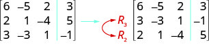

  
  
    ⓑ Multiply row 2 by 5.
    

  
  
    ⓒ Multiply row 3 by −2 and  add to row 1.

    

  

Use the indicated row operations on the augmented matrix:

  
    ⓐ Interchange rows 1 and 3.

ⓑ Multiply row 3 by 3.

ⓒ Multiply row 3 by 2 and add to row 2.

$\left[\begin{array}{cccr}5& -2& -2& -2\\ 4& -1& -4& 4\\ -2& 3& 0& -1\end{array}\right]$

Use the needed row operation that will get the first entry in row 2 to be zero in the augmented matrix: $[\begin{array}{cccccc}1\hfill & & & \hfill \mathrm{-1}& & \\ 4\hfill & & & \hfill \mathrm{-8}& & \end{array}|\begin{array}{ccc}& & \hfill 2\\ & & \hfill 0\end{array}].$

To make the 4 a 0, we could multiply row 1 by $\mathrm{-4}$ and then add it to row 2.

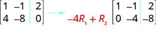

Practice Makes Perfect
======================
Use the needed row operation that will get the first entry in row 2 to be zero in the augmented matrix

$\left[\begin{array}{rcc}1& -1& 2\\ 3& -6& 2\end{array}\right]$

Objective 2: Solve systems of equations using matrices (IA 4.5.3)
=================================================================
To solve a system of equations using matrices, we transform the augmented matrix into a matrix in **row-echelon form** using row operations. For a consistent and independent system of equations, the augmented matrix is in row-echelon form when to the left of the vertical line, each entry on the diagonal is a 1 and all entries below the diagonal are zeros.

Once we get the augmented matrix into *row-echelon form*, we can write the equivalent system of equations and solve for at least one variable. We then substitute this value in another equation to continue to solve for the other variables.

Solving a system of equations using matrices.
=============================================
Write the augmented matrix for the system of equations.
Using row operations get the entry in row 1, column 1 to be 1.
Using row operations, get zeros in column 1 below the 1.
Using row operations, get the entry in row 2, column 2 to be 1.
Continue the process until the matrix is in row-echelon form.
Write the corresponding system of equations.
Use substitution to find the remaining variables.
Write the solution as an ordered pair or triple.
Check that the solution makes the original equations true.

Solve the system of equations using matrices

$\{\begin{array}{c}3x+8y+2z=\mathrm{-5}\hfill \\ 2x+5y-3z=0\hfill \\ x+2y-2z=\mathrm{-1}\hfill \end{array}$

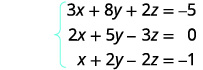

Write the augmented matrix for the system of equations.

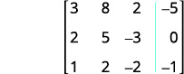

Interchange row 1 and row 3 to get a 1 in the first row and first column.

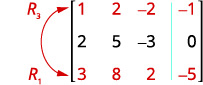

Using row operations, get zeros in column 1 below the 1

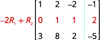

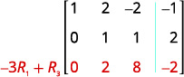

The entry in row 2, column 2 is now 1.

Continue the process until the matrixis in row-echelon form.

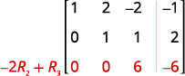

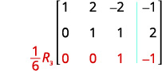

The matrix is now in row-echelon form.

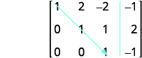

Write the corresponding system of equations.

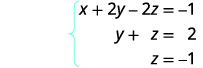

Use substitution to find the remaining variables.

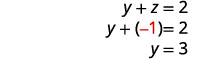

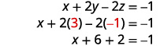

Write the solution as an ordered pair or triple.

Check that the solution makes the original equations true.

Practice Makes Perfect
======================
Solve the system of equations using matrices

$\left\{\begin{array}{l}x-y-z=1\\ -x+2y-3z=-4\\ 3x-2y-7z=0\end{array}\right.$

\n\n\n\nCarl Friedrich **Gauss** lived during the late 18th century and early 19th century, but he is still considered one of the most prolific mathematicians in history. His contributions to the science of mathematics and physics span fields such as algebra, number theory, analysis, differential geometry, astronomy, and optics, among others. His discoveries regarding matrix theory changed the way mathematicians have worked for the last two centuries.

 We first encountered Gaussian elimination in Systems of Linear Equations: Two Variables. In this section, we will revisit this technique for solving systems, this time using matrices.

Writing the Augmented Matrix of a System of Equations
=====================================================

A **matrix** can serve as a device for representing and solving a system of equations. To express a system in matrix form, we extract the coefficients of the variables and the constants, and these become the entries of the matrix. We use a vertical line to separate the coefficient entries from the constants, essentially replacing the equal signs. When a system is written in this form, we call it an **augmented matrix**.

For example, consider the following $2\times 2$ system of equations.
 $$
\begin{array}{l}3x+4y=7\\ 4x\mathrm{-2}y=5\end{array}
$$ 
We can write this system as an augmented matrix:

   $$
\left[\begin{array}{rr}\hfill 3& \hfill 4\\ \hfill 4& \hfill \mathrm{-2}\end{array}\phantom{\rule{0.5em}{0ex}}\text\ |\phantom{\rule{0.5em}{0ex}}\text\ \begin{array}{r}\hfill 7\\ \hfill 5\end{array}\right]
$$
We can also write a matrix containing just the coefficients. This is called the **coefficient matrix**.

 $$
\left[\begin{array}{cc}3& 4\\ 4& \mathrm{-2}\end{array}\right]
$$ 
A three-by-three **system of equations** such as

   $$
\begin{array}{l}3x-y-z=0\hfill \\ \text{\ \ \ \ \ \ \}x+y=5\hfill \\ \text{\ \ \}2x\mathrm{-3}z=2\hfill \end{array}
$$
has a coefficient matrix

 $$
\left[\begin{array}{rrr}\hfill 3& \hfill \mathrm{-1}& \hfill \mathrm{-1}\\ \hfill 1& \hfill 1& \hfill 0\\ \hfill 2& \hfill 0& \hfill \mathrm{-3}\end{array}\right]
$$
and is represented by the augmented matrix

  	 $$
\left[\begin{array}{rrr}\hfill 3& \hfill \mathrm{-1}& \hfill \mathrm{-1}\\ \hfill 1& \hfill 1& \hfill 0\\ \hfill 2& \hfill 0& \hfill \mathrm{-3}\end{array}\phantom{\rule{0.5em}{0ex}}\text\ |\phantom{\rule{0.5em}{0ex}}\text\ \begin{array}{r}\hfill 0\\ \hfill 5\\ \hfill 2\end{array}\right]
$$
Notice that the matrix is written so that the variables line up in their own columns: *x*-terms go in the first column, *y*-terms in the second column, and *z*-terms in the third column. It is very important that each equation is written in standard form $ax+by+cz=d$ so that the variables line up. When there is a missing variable term in an equation, the coefficient is 0.
How To
*Given a system of equations, write an augmented matrix.*

Write the coefficients of the *x*-terms as the numbers down the first column.
Write the coefficients of the *y*-terms as the numbers down the second column.
If there are *z*-terms, write the coefficients as the numbers down the third column.
Draw a vertical line and write the constants to the right of the line.

Writing the Augmented Matrix for a System of Equations
======================================================

Write the augmented matrix for the given system of equations.

   $$
\begin{array}{l}\text{\ \}x+2y-z=3\hfill \\ \text{}2x-y+2z=6\hfill \\ \text\ x-3y+3z=4\hfill \end{array}
$$

The augmented matrix displays the coefficients of the variables, and an additional column for the constants.

   $$
\left[\begin{array}{rrr}\hfill 1& \hfill 2& \hfill \mathrm{-1}\\ \hfill 2& \hfill \mathrm{-1}& \hfill 2\\ \hfill 1& \hfill \mathrm{-3}& \hfill 3\end{array}\phantom{\rule{0.5em}{0ex}}\text\ |\phantom{\rule{0.5em}{0ex}}\text\ \begin{array}{r}\hfill 3\\ \hfill 6\\ \hfill 4\end{array}\right]
$$

Try It

Write the augmented matrix of the given system of equations.

     $$
\begin{array}{l}4x\mathrm{-3}y=11\\ 3x+2y=4\end{array}
$$ 

$\left[\begin{array}{cc}4& \mathrm{-3}\\ 3& 2\end{array}|\begin{array}{c}11\\ 4\end{array}\right]$

Writing a System of Equations from an Augmented Matrix
======================================================

We can use augmented matrices to help us solve systems of equations because they simplify operations when the systems are not encumbered by the variables. However, it is important to understand how to move back and forth between formats in order to make finding solutions smoother and more intuitive. Here, we will use the information in an augmented matrix to write the **system of equations** in standard form.

Writing a System of Equations from an Augmented Matrix Form
===========================================================

Find the system of equations from the augmented matrix.

   $$
\left[\begin{array}{rrr}\hfill 1& \hfill \mathrm{-3}& \hfill \mathrm{-5}\\ \hfill 2& \hfill \mathrm{-5}& \hfill \mathrm{-4}\\ \hfill \mathrm{-3}& \hfill 5& \hfill 4\end{array}\phantom{\rule{0.5em}{0ex}}\text\ |\phantom{\rule{0.5em}{0ex}}\text\ \begin{array}{r}\hfill \mathrm{-2}\\ \hfill 5\\ \hfill 6\end{array}\right]
$$

When the columns represent the variables $x,$ $y,$ and $z,$

 $$
\left[\begin{array}{rrr}\hfill 1& \hfill \mathrm{-3}& \hfill \mathrm{-5}\\ \hfill 2& \hfill \mathrm{-5}& \hfill \mathrm{-4}\\ \hfill \mathrm{-3}& \hfill 5& \hfill 4\end{array}\phantom{\rule{0.5em}{0ex}}\text\ |\phantom{\rule{0.5em}{0ex}}\text\ \begin{array}{r}\hfill \mathrm{-2}\\ \hfill 5\\ \hfill 6\end{array}\right]\to \begin{array}{l}x-3y-5z=-2\hfill \\ 2x-5y-4z=5\hfill \\ \mathrm{-3}x+5y+4z=6\hfill \end{array}
$$

Try It

Write the system of equations from the augmented matrix.

 $$
\left[\begin{array}{ccc}1& \mathrm{-1}& 1\\ 2& \mathrm{-1}& 3\\ 0& 1& 1\end{array}|\begin{array}{c}5\\ 1\\ \mathrm{-9}\end{array}\right]
$$ 
$\begin{array}{c}x-y+z=5\\ 2x-y+3z=1\\ y+z=\mathrm{-9}\end{array}$

Performing Row Operations on a Matrix
=====================================

Now that we can write systems of equations in augmented matrix form, we will examine the various **row operations** that can be performed on a matrix, such as addition, multiplication by a constant, and interchanging rows.

Performing row operations on a matrix is the method we use for solving a system of equations. In order to solve the system of equations, we want to convert the matrix to **row-echelon form**, in which there are ones down the **main diagonal** from the upper left corner to the lower right corner, and zeros in every position below the main diagonal as shown.

 $$
\begin{array}{c}\text{Row-echelon\ form}\\ \left[\begin{array}{ccc}1& a& b\\ 0& 1& d\\ 0& 0& 1\end{array}\right]\end{array}
$$
We use row operations corresponding to equation operations to obtain a new matrix that is **row-equivalent** in a simpler form. Here are the guidelines to obtaining row-echelon form.

In any nonzero row, the first nonzero number is a 1. It is called a *leading* 1.
Any all-zero rows are placed at the bottom on the matrix.
Any leading 1 is below and to the right of a previous leading 1.
Any column containing a leading 1 has zeros in all other positions in the column.

To solve a system of equations we can perform the following row operations to convert the **coefficient matrix** to row-echelon form and do back-substitution to find the solution.
Interchange rows. (Notation: ${R}_{i}\phantom{\rule{0.5em}{0ex}}\leftrightarrow \phantom{\rule{0.5em}{0ex}}\phantom{\rule{0.5em}{0ex}}{R}_{j}$ )
Multiply a row by a constant. (Notation: $c{R}_{i}$ )
Add the product of a row multiplied by a constant to another row. (Notation: ${R}_{i}+c{R}_{j})$ 
Each of the row operations corresponds to the operations we have already learned to solve systems of equations in three variables. With these operations, there are some key moves that will quickly achieve the goal of writing a matrix in row-echelon form. To obtain a matrix in row-echelon form for finding solutions, we use Gaussian elimination, a method that uses row operations to obtain a 1 as the first entry so that row 1 can be used to convert the remaining rows.

Gaussian Elimination
====================

The **Gaussian elimination** method refers to a strategy used to obtain the row-echelon form of a matrix. The goal is to write matrix $A$ with the number 1 as the entry down the main diagonal and have all zeros below.

   $$
A=\left[\begin{array}{rrr}\hfill {a}_{11}& \hfill {a}_{12}& \hfill {a}_{13}\\ \hfill {a}_{21}& \hfill {a}_{22}& \hfill {a}_{23}\\ \hfill {a}_{31}& \hfill {a}_{32}& \hfill {a}_{33}\end{array}\right]\stackrel{\text{After\ Gaussian\ elimination}}{\to}A=\left[\begin{array}{rrr}\hfill 1& \hfill \phantom{\rule{0.5em}{0ex}}\phantom{\rule{0.5em}{0ex}}{b}_{12}& \hfill \phantom{\rule{0.5em}{0ex}}\phantom{\rule{0.5em}{0ex}}{b}_{13}\\ \hfill 0& \hfill \phantom{\rule{0.5em}{0ex}}\phantom{\rule{0.5em}{0ex}}1& \hfill \phantom{\rule{0.5em}{0ex}}\phantom{\rule{0.5em}{0ex}}{b}_{23}\\ \hfill 0& \hfill \phantom{\rule{0.5em}{0ex}}\phantom{\rule{0.5em}{0ex}}0& \hfill \phantom{\rule{0.5em}{0ex}}\phantom{\rule{0.5em}{0ex}}1\end{array}\right]
$$
The first step of the Gaussian strategy includes obtaining a 1 as the first entry, so that row 1 may be used to alter the rows below.

How To
*Given an augmented matrix, perform row operations to achieve row-echelon form.*

The first equation should have a leading coefficient of 1. Interchange rows or multiply by a constant, if necessary.
Use row operations to obtain zeros down the first column below the first entry of 1.
Use row operations to obtain a 1 in row 2, column 2.
Use row operations to obtain zeros down column 2, below the entry of 1.
Use row operations to obtain a 1 in row 3, column 3.
Continue this process for all rows until there is a 1 in every entry down the main diagonal and there are only zeros below.
If any rows contain all zeros, place them at the bottom.

Solving a $2\times 2$ System by Gaussian Elimination
====================================================

Solve the given system by Gaussian elimination.

 $$
\begin{array}{l}2x+3y=6\hfill \\ \text{\ \ \}x-y=\frac{1}{2}\hfill \end{array}
$$

First, we write this as an augmented matrix.

   $$
\left[\begin{array}{rr}\hfill 2& \hfill 3\\ \hfill 1& \hfill \mathrm{-1}\end{array}\phantom{\rule{0.5em}{0ex}}\text\ |\phantom{\rule{0.5em}{0ex}}\text\ \begin{array}{r}\hfill 6\\ \hfill \frac{1}{2}\end{array}\right]
$$
We want a 1 in row 1, column 1. This can be accomplished by interchanging row 1 and row 2.

   $$
{R}_{1}\leftrightarrow {R}_{2}\to \left[\begin{array}{rrr}\hfill 1& \hfill \mathrm{-1}& \hfill \\ \hfill 2& \hfill 3& \hfill \end{array}|\begin{array}{rr}\hfill & \hfill \frac{1}{2}\\ \hfill & \hfill 6\end{array}\right]
$$
We now have a 1 as the first entry in row 1, column 1. Now let’s obtain a 0 in row 2, column 1. This can be accomplished by multiplying row 1 by $\mathrm{-2},$ and then adding the result to row 2.
 $$
\mathrm{-2}{R}_{1}+{R}_{2}={R}_{2}\to \left[\begin{array}{rrr}\hfill 1& \hfill \mathrm{-1}& \hfill \\ \hfill 0& \hfill 5& \hfill \end{array}|\begin{array}{rr}\hfill & \hfill \frac{1}{2}\\ \hfill & \hfill 5\end{array}\right]
$$
We only have one more step, to multiply row 2 by $\frac{1}{5}.$

   $$
\frac{1}{5}{R}_{2}={R}_{2}\to \left[\begin{array}{rrr}\hfill 1& \hfill \mathrm{-1}& \hfill \\ \hfill 0& \hfill 1& \hfill \end{array}|\begin{array}{cc}& \frac{1}{2}\\ & 1\end{array}\right]
$$
Use back-substitution. The second row of the matrix represents $y=1.$ Back-substitute $y=1$ into the first equation.

   $$
\begin{array}{l}x-(1)=\frac{1}{2}\hfill \\ \text{\ \ \ \ \ \ \ \}x=\frac{3}{2}\hfill \end{array}
$$
The solution is the point $\left(\frac{3}{2},1\right).$

Try It

Solve the given system by Gaussian elimination.

   $$
\begin{array}{l}4x+3y=11\hfill \\ \text\ \text{}\text{}x\mathrm{-3}y=\mathrm{-1}\hfill \end{array}
$$

$\left(2,\phantom{\rule{0.5em}{0ex}}1\right)$

Using Gaussian Elimination to Solve a System of Equations
=========================================================

Use **Gaussian elimination** to solve the given $2\times 2$
**system of equations**.

   $$
\begin{array}{l}\text\ 2x+y=1\hfill \\ 4x+2y=6\hfill \end{array}
$$

Write the system as an **augmented matrix**.

   $$
\left[\begin{array}{ll}2\hfill & 1\hfill \\ 4\hfill & 2\hfill \end{array}\phantom{\rule{0.5em}{0ex}}\text\ |\phantom{\rule{0.5em}{0ex}}\text\ \begin{array}{l}1\hfill \\ 6\hfill \end{array}\right]
$$
Obtain a 1 in row 1, column 1. This can be accomplished by multiplying the first row by $\frac{1}{2}.$

   $$
\frac{1}{2}{R}_{1}={R}_{1}\to \left[\begin{array}{cc}1& \frac{1}{2}\\ 4& 2\end{array}\phantom{\rule{0.5em}{0ex}}\text\ |\phantom{\rule{0.5em}{0ex}}\text\ \begin{array}{c}\frac{1}{2}\\ 6\end{array}\right]
$$
Next, we want a 0 in row 2, column 1. Multiply row 1 by $\mathrm{-4}$ and add row 1 to row 2.
 $$
\mathrm{-4}{R}_{1}+{R}_{2}={R}_{2}\to \left[\begin{array}{cc}1& \frac{1}{2}\\ 0& 0\end{array}\phantom{\rule{0.5em}{0ex}}\text\ |\phantom{\rule{0.5em}{0ex}}\text\ \begin{array}{c}\frac{1}{2}\\ 4\end{array}\right]
$$
The second row represents the equation $0=4.$ Therefore, the system is inconsistent and has no solution.

Solving a Dependent System
==========================

Solve the system of equations.

   $$
\begin{array}{l}3x+4y=12\\ 6x+8y=24\end{array}
$$ 

Perform **row operations** on the augmented matrix to try and achieve **row-echelon form**.
 $$
A=\left[\begin{array}{llll}3\hfill & \hfill & 4\hfill & \hfill \\ 6\hfill & \hfill & 8\hfill & \hfill \end{array}|\begin{array}{ll}\hfill & 12\hfill \\ \hfill & 24\hfill \end{array}\right]
$$
 $$
\begin{array}{l}\hfill \\ \begin{array}{l}-\frac{1}{2}{R}_{2}+{R}_{1}={R}_{1}\to \left[\begin{array}{llll}0\hfill & \hfill & 0\hfill & \hfill \\ 6\hfill & \hfill & 8\hfill & \hfill \end{array}|\begin{array}{ll}\hfill & 0\hfill \\ \hfill & 24\hfill \end{array}\right]\hfill \\ {R}_{1}\leftrightarrow {R}_{2}\to \left[\begin{array}{llll}6\hfill & \hfill & 8\hfill & \hfill \\ 0\hfill & \hfill & 0\hfill & \hfill \end{array}|\begin{array}{ll}\hfill & 24\hfill \\ \hfill & 0\hfill \end{array}\right]\hfill \end{array}\hfill \end{array}
$$
The matrix ends up with all zeros in the last row: $0y=0.$ Thus, there are an infinite number of solutions and the system is classified as dependent. To find the generic solution, return to one of the original equations and solve for $y.$

   $$
\begin{array}{l}3x+4y=12\hfill \\ \text{\ \ \ \ \ \ \ \}4y=12\mathrm{-3}x\hfill \\ \text{\ \ \ \ \ \ \ \ \ \}y=3-\frac{3}{4}x\hfill \end{array}
$$
So the solution to this system is $\left(x,3-\frac{3}{4}x\right).$

Performing Row Operations on a 3×3 Augmented Matrix to Obtain Row-Echelon Form
==============================================================================

Perform row operations on the given matrix to obtain row-echelon form.

   $$
\left[\begin{array}{rrr}\hfill 1& \hfill \mathrm{-3}& \hfill 4\\ \hfill 2& \hfill \mathrm{-5}& \hfill 6\\ \hfill \mathrm{-3}& \hfill 3& \hfill 4\end{array}\phantom{\rule{0.5em}{0ex}}\text\ |\phantom{\rule{0.5em}{0ex}}\text\ \begin{array}{r}\hfill 3\\ \hfill 6\\ \hfill 6\end{array}\right]
$$

The first row already has a 1 in row 1, column 1. The next step is to multiply row 1 by $\mathrm{-2}$ and add it to row 2. Then replace row 2 with the result.

   $$
\mathrm{-2}{R}_{1}+{R}_{2}={R}_{2}\to \left[\begin{array}{rrrrrr}\hfill 1& \hfill & \hfill \mathrm{-3}& \hfill & \hfill 4& \hfill \\ \hfill 0& \hfill & \hfill 1& \hfill & \hfill \mathrm{-2}& \hfill \\ \hfill \mathrm{-3}& \hfill & \hfill 3& \hfill & \hfill 4& \hfill \end{array}|\begin{array}{rr}\hfill & \hfill 3\\ \hfill & \hfill 0\\ \hfill & \hfill 6\end{array}\right]
$$
Next, obtain a zero in row 3, column 1.

   $$
3{R}_{1}+{R}_{3}={R}_{3}\to \left[\begin{array}{rrrrrr}\hfill 1& \hfill & \hfill \mathrm{-3}& \hfill & \hfill 4& \hfill \\ \hfill 0& \hfill & \hfill 1& \hfill & \hfill \mathrm{-2}& \hfill \\ \hfill 0& \hfill & \hfill \mathrm{-6}& \hfill & \hfill 16& \hfill \end{array}|\begin{array}{rr}\hfill & \hfill 3\\ \hfill & \hfill 0\\ \hfill & \hfill 15\end{array}\right]
$$
Next, obtain a zero in row 3, column 2.

   $$
6{R}_{2}+{R}_{3}={R}_{3}\to \left[\begin{array}{rrrrrr}\hfill 1& \hfill & \hfill \mathrm{-3}& \hfill & \hfill 4& \hfill \\ \hfill 0& \hfill & \hfill 1& \hfill & \hfill \mathrm{-2}& \hfill \\ \hfill 0& \hfill & \hfill 0& \hfill & \hfill 4& \hfill \end{array}|\begin{array}{rr}\hfill & \hfill 3\\ \hfill & \hfill 0\\ \hfill & \hfill 15\end{array}\right]
$$
The last step is to obtain a 1 in row 3, column 3.

   $$
\frac{1}{4}{R}_{3}={R}_{3}\to \left[\begin{array}{rrr}\hfill 1& \hfill \mathrm{-3}& \hfill 4\\ \hfill 0& \hfill 1& \hfill \mathrm{-2}\\ \hfill 0& \hfill 0& \hfill 1\end{array}\phantom{\rule{0.5em}{0ex}}\text\ |\phantom{\rule{0.5em}{0ex}}\text\ \begin{array}{r}\hfill 3\\ \hfill 0\\ \hfill \frac{15}{4}\end{array}\right]
$$

Try It

Write the system of equations in row-echelon form.

   $$
\begin{array}{l}\text\ x-2y+3z=9\hfill \\ -x+3y=-4\hfill \\ 2x-5y+5z=17\hfill \end{array}
$$

$\left[\begin{array}{ccc}1& -\frac{5}{2}& \frac{5}{2}\\ \text{}0& 1& 5\\ 0& 0& 1\end{array}|\begin{array}{c}\frac{17}{2}\\ 9\\ 2\end{array}\right]$

Solving a System of Linear Equations Using Matrices
===================================================

We have seen how to write a **system of equations** with an **augmented matrix**, and then how to use row operations and back-substitution to obtain **row-echelon form**. Now, we will take row-echelon form a step farther to solve a 3 by 3 system of linear equations. The general idea is to eliminate all but one variable using row operations and then back-substitute to solve for the other variables.

Solving a System of Linear Equations Using Matrices
===================================================

Solve the system of linear equations using matrices.

   $$
\begin{array}{c}\begin{array}{l}\hfill \\ \hfill \\ x-y+z=8\hfill \end{array}\\ 2x+3y-z=\mathrm{-2}\\ 3x-2y-9z=9\end{array}
$$

First, we write the augmented matrix.

   $$
\left[\begin{array}{rrr}\hfill 1& \hfill -1& \hfill 1\\ \hfill 2& \hfill 3& \hfill -1\\ \hfill 3& \hfill -2& \hfill -9\end{array}\phantom{\rule{0.5em}{0ex}}\text{\ \}|\phantom{\rule{0.5em}{0ex}}\text\ \begin{array}{r}\hfill 8\\ \hfill -2\\ \hfill 9\end{array}\right]
$$
Next, we perform row operations to obtain row-echelon form.

   $$
\begin{array}{rrrrr}\hfill -2{R}_{1}+{R}_{2}={R}_{2}\to \left[\begin{array}{rrrrrr}\hfill 1& \hfill & \hfill -1& \hfill & \hfill 1& \hfill \\ \hfill 0& \hfill & \hfill 5& \hfill & \hfill -3& \hfill \\ \hfill 3& \hfill & \hfill -2& \hfill & \hfill -9& \hfill \end{array}|\begin{array}{rr}\hfill & \hfill 8\\ \hfill & \hfill -18\\ \hfill & \hfill 9\end{array}\right]& \hfill & \hfill & \hfill & \hfill -3{R}_{1}+{R}_{3}={R}_{3}\to \left[\begin{array}{rrrrrr}\hfill 1& \hfill & \hfill -1& \hfill & \hfill 1& \hfill \\ \hfill 0& \hfill & \hfill 5& \hfill & \hfill -3& \hfill \\ \hfill 0& \hfill & \hfill 1& \hfill & \hfill -12& \hfill \end{array}|\begin{array}{rr}\hfill & \hfill 8\\ \hfill & \hfill -18\\ \hfill & \hfill -15\end{array}\right]\end{array}
$$
The easiest way to obtain a 1 in row 2 of column 1 is to interchange ${R}_{2}$ and ${R}_{3}.$

   $$
\text{Interchange}\phantom{\rule{0.5em}{0ex}}{R}_{2}\phantom{\rule{0.5em}{0ex}}\text{and}\phantom{\rule{0.5em}{0ex}}{R}_{3}\to \left[\begin{array}{rrrrrrr}\hfill 1& \hfill & \hfill \mathrm{-1}& \hfill & \hfill 1& \hfill & \hfill 8\\ \hfill 0& \hfill & \hfill 1& \hfill & \hfill \mathrm{-12}& \hfill & \hfill \mathrm{-15}\\ \hfill 0& \hfill & \hfill 5& \hfill & \hfill \mathrm{-3}& \hfill & \hfill \mathrm{-18}\end{array}\right]
$$
Then

   $$
\begin{array}{l}\\ \begin{array}{rrrrr}\hfill \mathrm{-5}{R}_{2}+{R}_{3}={R}_{3}\to \left[\begin{array}{rrrrrr}\hfill 1& \hfill & \hfill \mathrm{-1}& \hfill & \hfill 1& \hfill \\ \hfill 0& \hfill & \hfill 1& \hfill & \hfill \mathrm{-12}& \hfill \\ \hfill 0& \hfill & \hfill 0& \hfill & \hfill 57& \hfill \end{array}|\begin{array}{rr}\hfill & \hfill 8\\ \hfill & \hfill \mathrm{-15}\\ \hfill & \hfill 57\end{array}\right]& \hfill & \hfill & \hfill & \hfill -\frac{1}{57}{R}_{3}={R}_{3}\to \left[\begin{array}{rrrrrr}\hfill 1& \hfill & \hfill \mathrm{-1}& \hfill & \hfill 1& \hfill \\ \hfill 0& \hfill & \hfill 1& \hfill & \hfill \mathrm{-12}& \hfill \\ \hfill 0& \hfill & \hfill 0& \hfill & \hfill 1& \hfill \end{array}|\begin{array}{rr}\hfill & \hfill 8\\ \hfill & \hfill \mathrm{-15}\\ \hfill & \hfill 1\end{array}\right]\end{array}\end{array}
$$
The last matrix represents the equivalent system.

   $$
\begin{array}{l}\text{}x-y+z=8\hfill \\ \text{\ \}y-12z=\mathrm{-15}\hfill \\ \text{\ \ \ \ \ \ \ \ \ \ \}z=1\hfill \end{array}
$$
Using back-substitution, we obtain the solution as $\left(4,\mathrm{-3},1\right).$

Solving a Dependent System of Linear Equations Using Matrices
=============================================================

Solve the following system of linear equations using matrices.

   $$
\begin{array}{r}\hfill -x\mathrm{-2}y+z=\mathrm{-1}\\ \hfill \ 2x+3y=2\\ \hfill y\mathrm{-2}z=0\end{array}
$$

Write the augmented matrix.

   $$
\left[\begin{array}{rrr}\hfill \mathrm{-1}& \hfill \mathrm{-2}& \hfill 1\\ \hfill 2& \hfill 3& \hfill 0\\ \hfill 0& \hfill 1& \hfill \mathrm{-2}\end{array}\phantom{\rule{0.5em}{0ex}}\text\ |\phantom{\rule{0.5em}{0ex}}\text\ \begin{array}{r}\hfill \mathrm{-1}\\ \hfill 2\\ \hfill 0\end{array}\right]
$$
First, multiply row 1 by $\mathrm{-1}$ to get a 1 in row 1, column 1. Then, perform **row operations** to obtain row-echelon form.
 $$
-{R}_{1}\to \left[\begin{array}{rrr}\hfill 1& \hfill 2& \hfill \mathrm{-1}\\ \hfill 2& \hfill 3& \hfill 0\\ \hfill 0& \hfill 1& \hfill \mathrm{-2}\end{array}\phantom{\rule{0.5em}{0ex}}\text\ |\phantom{\rule{0.5em}{0ex}}\text\ \begin{array}{r}\hfill 1\\ \hfill 2\\ \hfill 0\end{array}\right]
$$
 $$
{R}_{2}\leftrightarrow {R}_{3}\to \left[\begin{array}{rrrrr}\hfill 1& \hfill & \hfill 2& \hfill & \hfill -1\\ \hfill 0& \hfill & \hfill 1& \hfill & \hfill -2\\ \hfill 2& \hfill & \hfill 3& \hfill & \hfill 0\end{array}\phantom{\rule{0.5em}{0ex}}\text\ |\begin{array}{rr}\hfill & \hfill 1\\ \hfill & \hfill 0\\ \hfill & \hfill 2\end{array}\right]
$$
 $$
\mathrm{-2}{R}_{1}+{R}_{3}={R}_{3}\to \left[\begin{array}{rrrrrr}\hfill 1& \hfill & \hfill 2& \hfill & \hfill \mathrm{-1}& \hfill \\ \hfill 0& \hfill & \hfill 1& \hfill & \hfill \mathrm{-2}& \hfill \\ \hfill 0& \hfill & \hfill \mathrm{-1}& \hfill & \hfill 2& \hfill \end{array}|\begin{array}{rr}\hfill & \hfill 1\\ \hfill & \hfill 0\\ \hfill & \hfill 0\end{array}\right]
$$
 $$
{R}_{2}+{R}_{3}={R}_{3}\to \left[\begin{array}{rrrrrr}\hfill 1& \hfill & \hfill 2& \hfill & \hfill \mathrm{-1}& \hfill \\ \hfill 0& \hfill & \hfill 1& \hfill & \hfill \mathrm{-2}& \hfill \\ \hfill 0& \hfill & \hfill 0& \hfill & \hfill 0& \hfill \end{array}|\begin{array}{rr}\hfill & \hfill 1\\ \hfill & \hfill 1\\ \hfill & \hfill 0\end{array}\right]
$$
The last matrix represents the following system.

   $$
\begin{array}{l}\text{}x+2y-z=1\hfill \\ \text{\ \ \ \ \ \}y-2z=0\hfill \\ \text{\ \ \ \ \ \ \ \ \ \ \ \ \}0=0\hfill \end{array}
$$
We see by the identity $0=0$ that this is a dependent system with an infinite number of solutions. We then find the generic solution. By solving the second equation for $y$ and substituting it into the first equation we can solve for $z$ in terms of $x.$
 $$
\begin{array}{l}x+2y-z=1\hfill \\ \text{\ \ \ \ \ \ \ \ \ \ \ \ \ \ \ \ \}y=2z\hfill \\ \hfill \\ x+2(2z)-z=1\hfill \\ \text{\ \ \ \ \ \ \ \ \ \}x+3z=1\hfill \\ \text{\ \ \ \ \ \ \ \ \ \ \ \ \ \ \ \ \}z=\frac{1-x}{3}\hfill \end{array}
$$
Now we substitute the expression for $z$ into the second equation to solve for $y$ in terms of $x.$
 $$
\begin{array}{l}y-2z=0\hfill \\ z=\frac{1-x}{3}\hfill \\ \hfill \\ y-2\left(\frac{1-x}{3}\right)=0\hfill \\ y=\frac{2-2x}{3}\hfill \end{array}
$$
The generic solution is $\left(x,\frac{2\mathrm{-2}x}{3},\frac{1-x}{3}\right).$

Try It

Solve the system using matrices.

   $$
\begin{array}{c}x+4y-z=4\\ 2x+5y+8z=15\\ x+3y\mathrm{-3}z=1\end{array}
$$ 

$\left(1,\phantom{\rule{0.5em}{0ex}}\phantom{\rule{0.5em}{0ex}}1,\phantom{\rule{0.5em}{0ex}}\phantom{\rule{0.5em}{0ex}}1\right)$

Q&A
*Can any system of linear equations be solved by Gaussian elimination?*

*Yes, a system of linear equations of any size can be solved by Gaussian elimination.*

How To
*Given a system of equations, solve with matrices using a calculator.*

Save the augmented matrix as a matrix variable $[A],\phantom{\rule{0.5em}{0ex}}[B],\phantom{\rule{0.5em}{0ex}}[C]\text{,}\ \dots .$

Use the *ref(* function in the calculator, calling up each matrix variable as needed.

Solving Systems of Equations with Matrices Using a Calculator
=============================================================

Solve the system of equations.

 $$
\begin{array}{r}\hfill \ 5x+3y+9z=\mathrm{-1}\\ \hfill \mathrm{-2}x+3y-z=\mathrm{-2}\\ \hfill -x\mathrm{-4}y+5z=1\end{array}
$$

Write the augmented matrix for the system of equations.

 $$
\left[\begin{array}{rrr}\hfill 5& \hfill 3& \hfill 9\\ \hfill \mathrm{-2}& \hfill 3& \hfill \mathrm{-1}\\ \hfill \mathrm{-1}& \hfill \mathrm{-4}& \hfill 5\end{array}\phantom{\rule{0.5em}{0ex}}\text\ |\phantom{\rule{0.5em}{0ex}}\text\ \begin{array}{r}\hfill \mathrm{-1}\\ \hfill \mathrm{-2}\\ \hfill \mathrm{-1}\end{array}\right]
$$
On the matrix page of the calculator, enter the augmented matrix above as the matrix variable $\left[A\right].$

 $$
[A]=\left[\begin{array}{rrrrrrr}\hfill 5& \hfill & \hfill 3& \hfill & \hfill 9& \hfill & \hfill \mathrm{-1}\\ \hfill \mathrm{-2}& \hfill & \hfill 3& \hfill & \hfill \mathrm{-1}& \hfill & \hfill \mathrm{-2}\\ \hfill \mathrm{-1}& \hfill & \hfill \mathrm{-4}& \hfill & \hfill 5& \hfill & \hfill 1\end{array}\right]
$$
Use the *ref(* function in the calculator, calling up the matrix variable $\left[A\right].$

 $$
\text{ref}([A])
$$
Evaluate.

 $$
\begin{array}{l}\hfill \\ \left[\begin{array}{rrrr}\hfill 1& \hfill \phantom{\rule{0.5em}{0ex}}\phantom{\rule{0.5em}{0ex}}\frac{3}{5}& \hfill \phantom{\rule{0.5em}{0ex}}\phantom{\rule{0.5em}{0ex}}\frac{9}{5}& \hfill -\frac{1}{5}\\ \hfill 0& \hfill \phantom{\rule{0.5em}{0ex}}\phantom{\rule{0.5em}{0ex}}1& \hfill \phantom{\rule{0.5em}{0ex}}\phantom{\rule{0.5em}{0ex}}\frac{13}{21}& \hfill -\frac{4}{7}\\ \hfill 0& \hfill \phantom{\rule{0.5em}{0ex}}\phantom{\rule{0.5em}{0ex}}0& \hfill \phantom{\rule{0.5em}{0ex}}\phantom{\rule{0.5em}{0ex}}1& \hfill -\frac{24}{187}\end{array}\right]\to \begin{array}{l}x+\frac{3}{5}y+\frac{9}{5}z=-\frac{1}{5}\hfill \\ y+\frac{13}{21}z=-\frac{4}{7}\hfill \\ z=-\frac{24}{187}\hfill \end{array}\hfill \end{array}
$$
Using back-substitution, the solution is $\left(\frac{61}{187},-\frac{92}{187},-\frac{24}{187}\right).$

Applying 2 × 2 Matrices to Finance
==================================

Carolyn invests a total of $12,000 in two municipal bonds, one paying 10.5% interest and the other paying 12% interest. The annual interest earned on the two investments last year was $1,335. How much was invested at each rate?

We have a system of two equations in two variables. Let $x=$ the amount invested at 10.5% interest, and $y=$ the amount invested at 12% interest.

   $$
\begin{array}{l}\text{\ \ \ \ \ \ \ \ \ \ \ \ \ \ \}x+y=\mathrm{12,000}\hfill \\ 0.105x+0.12y=\mathrm{1,335}\hfill \end{array}
$$
As a matrix, we have

   $$
\left[\begin{array}{rr}\hfill 1& \hfill 1\\ \hfill 0.105& \hfill 0.12\end{array}\phantom{\rule{0.5em}{0ex}}\text\ |\phantom{\rule{0.5em}{0ex}}\text\ \begin{array}{r}\hfill \mathrm{12,000}\\ \hfill \mathrm{1,335}\end{array}\right]
$$
Multiply row 1 by $\mathrm{-0.105}$ and add the result to row 2.
 $$
\left[\begin{array}{rr}\hfill 1& \hfill 1\\ \hfill 0& \hfill 0.015\end{array}\phantom{\rule{0.5em}{0ex}}\text\ |\phantom{\rule{0.5em}{0ex}}\text\ \begin{array}{r}\hfill \mathrm{12,000}\\ \hfill 75\end{array}\right]
$$
Then,

 $$
\begin{array}{l}0.015y=75\hfill \\ \text{\ \ \ \ \ \ \ \}y=\mathrm{5,000}\hfill \end{array}
$$
So $\mathrm{12,000}\mathrm{-5,000}=\mathrm{7,000.}$
Thus, $5,000 was invested at 12% interest and $7,000 at 10.5% interest.

Applying 3 × 3 Matrices to Finance
==================================

Ava invests a total of $10,000 in three accounts, one paying 5% interest, another paying 8% interest, and the third paying 9% interest. The annual interest earned on the three investments last year was $770. The amount invested at 9% was twice the amount invested at 5%. How much was invested at each rate?

We have a system of three equations in three variables. Let $x$ be the amount invested at 5% interest, let $y$ be the amount invested at 8% interest, and let $z$ be the amount invested at 9% interest. Thus,

   $$
\begin{array}{l}\text{\ \ \ \ \ \ \ \ \ \ \ \ \ \ \ \ \ \ \ \}x+y+z=10,000\hfill \\ 0.05x+0.08y+0.09z=770\hfill \\ \text{\ \ \ \ \ \ \ \ \ \ \ \ \ \ \ \ \ \ \ \ \ \ \ \}2x-z=0\hfill \end{array}
$$
As a matrix, we have

   $$
\left[\begin{array}{rrr}\hfill 1& \hfill 1& \hfill 1\\ \hfill 0.05& \hfill 0.08& \hfill 0.09\\ \hfill 2& \hfill 0& \hfill \mathrm{-1}\end{array}\phantom{\rule{0.5em}{0ex}}\text\ |\phantom{\rule{0.5em}{0ex}}\text\ \begin{array}{r}\hfill 10,000\\ \hfill 770\\ \hfill 0\end{array}\right]
$$
Now, we perform Gaussian elimination to achieve row-echelon form.

 $$
\begin{array}{l}\begin{array}{l}\hfill \\ \mathrm{-0.05}{R}_{1}+{R}_{2}={R}_{2}\to \left[\begin{array}{rrrrrr}\hfill 1& \hfill & \hfill 1& \hfill & \hfill 1& \hfill \\ \hfill 0& \hfill & \hfill 0.03& \hfill & \hfill 0.04& \hfill \\ \hfill 2& \hfill & \hfill 0& \hfill & \hfill \mathrm{-1}& \hfill \end{array}|\begin{array}{rr}\hfill & \hfill \mathrm{10,000}\\ \hfill & \hfill 270\\ \hfill & \hfill 0\end{array}\right]\hfill \end{array}\hfill \\ \mathrm{-2}{R}_{1}+{R}_{3}={R}_{3}\to \left[\begin{array}{rrrrrr}\hfill 1& \hfill & \hfill 1& \hfill & \hfill 1& \hfill \\ \hfill 0& \hfill & \hfill 0.03& \hfill & \hfill 0.04& \hfill \\ \hfill 0& \hfill & \hfill \mathrm{-2}& \hfill & \hfill \mathrm{-3}& \hfill \end{array}|\begin{array}{rr}\hfill & \hfill \mathrm{10,000}\\ \hfill & \hfill 270\\ \hfill & \hfill \mathrm{-20,000}\end{array}\right]\hfill \\ \frac{1}{0.03}{R}_{2}={R}_{2}\to \left[\begin{array}{rrrrrr}\hfill 0& \hfill & \hfill 1& \hfill & \hfill 1& \hfill \\ \hfill 0& \hfill & \hfill 1& \hfill & \hfill \frac{4}{3}& \hfill \\ \hfill 0& \hfill & \hfill \mathrm{-2}& \hfill & \hfill \mathrm{-3}& \hfill \end{array}|\begin{array}{rr}\hfill & \hfill \mathrm{10,000}\\ \hfill & \hfill \mathrm{9,000}\\ \hfill & \hfill \mathrm{-20,000}\end{array}\right]\hfill \\ 2{R}_{2}+{R}_{3}={R}_{3}\to \left[\begin{array}{rrrrrr}\hfill 1& \hfill & \hfill 1& \hfill & \hfill 1& \hfill \\ \hfill 0& \hfill & \hfill 1& \hfill & \hfill \frac{4}{3}& \hfill \\ \hfill 0& \hfill & \hfill 0& \hfill & \hfill -\frac{1}{3}& \hfill \end{array}|\begin{array}{rr}\hfill & \hfill \mathrm{10,000}\\ \hfill & \hfill \mathrm{9,000}\\ \hfill & \hfill \mathrm{-2,000}\end{array}\right]\hfill \end{array}
$$
The third row tells us $-\frac{1}{3}z=\mathrm{-2,000};$ thus $z=\mathrm{6,000.}$
The second row tells us $y+\frac{4}{3}z=\mathrm{9,000.}$ Substituting $z=\mathrm{6,000},$ we get
 $\begin{array}{r}\hfill y+\frac{4}{3}(\mathrm{6,000})=\mathrm{9,000}\\ \hfill y+\mathrm{8,000}=\mathrm{9,000}\\ \hfill y=\mathrm{1,000}\end{array}$
The first row tells us $x+y+z=10,000.$ Substituting $y=1,000$ and $z=6,000,$ we get
 $$
\begin{array}{l}x+1,000+6,000=\mathrm{10,000}\hfill \\ \text{\ \ \ \ \ \ \ \ \ \ \ \ \ \ \ \ \ \ \ \ \ \ \ \ \ \ \ \ \}x=\mathrm{3,000}\hfill \end{array}
$$
The answer is $3,000 invested at 5% interest, $1,000 invested at 8%, and $6,000 invested at 9% interest.

Try It

A small shoe company took out a loan of $1,500,000 to expand their inventory. Part of the money was borrowed at 7%, part was borrowed at 8%, and part was borrowed at 10%. The amount borrowed at 10% was four times the amount borrowed at 7%, and the annual interest on all three loans was $130,500. Use matrices to find the amount borrowed at each rate.

$150,000 at 7%, $750,000 at 8%, $600,000 at 10%

Media
Access these online resources for additional instruction and practice with solving systems of linear equations using Gaussian elimination.

Solve a System of Two Equations Using an Augmented Matrix
Solve a System of Three Equations Using an Augmented Matrix
Augmented Matrices on the Calculator

Key Concepts
============

An augmented matrix is one that contains the coefficients and constants of a system of equations. See .
A matrix augmented with the constant column can be represented as the original system of equations. See .
Row operations include multiplying a row by a constant, adding one row to another row, and interchanging rows.
We can use Gaussian elimination to solve a system of equations. See , , and .
Row operations are performed on matrices to obtain row-echelon form. See .
To solve a system of equations, write it in augmented matrix form. Perform row operations to obtain row-echelon form. Back-substitute to find the solutions. See  and .
A calculator can be used to solve systems of equations using matrices. See .
Many real-world problems can be solved using augmented matrices. See  and .

Section Exercises
=================

Verbal
======

Can any system of linear equations be written as an augmented matrix? Explain why or why not. Explain how to write that augmented matrix.

Yes.  For each row, the coefficients of the variables are written across the corresponding row, and a vertical bar is placed; then the constants are placed to the right of the vertical bar.

Can any matrix be written as a system of linear equations? Explain why or why not. Explain how to write that system of equations.

Is there only one correct method of using row operations on a matrix? Try to explain two different row operations possible to solve the augmented matrix $\left[\begin{array}{rr}\hfill 9& \hfill 3\\ \hfill 1& \hfill -2\end{array}\phantom{\rule{0.5em}{0ex}}\text\ |\phantom{\rule{0.5em}{0ex}}\text\ \begin{array}{r}\hfill 0\\ \hfill 6\end{array}\right].$

No, there are numerous correct methods of using row operations on a matrix. Two possible ways are the following: (1) Interchange rows 1 and 2. Then ${R}_{2}={R}_{2}\mathrm{-9}{R}_{1}.$ (2) ${R}_{2}={R}_{1}\mathrm{-9}{R}_{2}.$ Then divide row 1 by 9.

Can a matrix whose entry is 0 on the diagonal be solved? Explain why or why not. What would you do to remedy the situation?

Can a matrix that has 0 entries for an entire row have one solution? Explain why or why not.

No. A matrix with 0 entries for an entire row would have either zero or infinitely many solutions.

Algebraic
=========

For the following exercises, write the augmented matrix for the linear system.

$\begin{array}{l}8x\mathrm{-37}y=8\\ 2x+12y=3\end{array}$

$\begin{array}{l}\text{\ \}16y=4\hfill \\ 9x-y=2\hfill \end{array}$

$\left[\begin{array}{rrrr}\hfill 0& \hfill & \hfill 16& \hfill \\ \hfill 9& \hfill & \hfill \mathrm{-1}& \hfill \end{array}|\begin{array}{rr}\hfill & \hfill 4\\ \hfill & \hfill 2\end{array}\right]$

$\begin{array}{l}\text{}3x+2y+10z=3\hfill \\ \mathrm{-6}x+2y+5z=13\hfill \\ \text{\ \ \ \ \ \ \ \ \ \ \ \}4x+z=18\hfill \end{array}$

$\begin{array}{l}\hfill \\ \text\ x+5y+8z=19\hfill \\ 12x+3y=4\hfill \\ 3x+4y+9z=\mathrm{-7}\hfill \end{array}$

$\left[\begin{array}{rrrrrr}\hfill 1& \hfill & \hfill 5& \hfill & \hfill 8& \hfill \\ \hfill 12& \hfill & \hfill 3& \hfill & \hfill 0& \hfill \\ \hfill 3& \hfill & \hfill 4& \hfill & \hfill 9& \hfill \end{array}|\begin{array}{rr}\hfill & \hfill 19\\ \hfill & \hfill 4\\ \hfill & \hfill \mathrm{-7}\end{array}\right]$

$\begin{array}{l}6x+12y+16z=4\hfill \\ \text\ 19x\mathrm{-5}y+3z=\mathrm{-9}\hfill \\ \text{\ \ \ \ \ \ \ \ \ \ \ \}x+2y=\mathrm{-8}\hfill \end{array}$

For the following exercises, write the linear system from the augmented matrix.

$\left[\begin{array}{rr}\hfill \mathrm{-2}& \hfill 5\\ \hfill 6& \hfill \mathrm{-18}\end{array}\phantom{\rule{0.5em}{0ex}}\text\ |\phantom{\rule{0.5em}{0ex}}\text\ \begin{array}{r}\hfill 5\\ \hfill 26\end{array}\right]$

$\begin{array}{l}\mathrm{-2}x+5y=5\\ 6x\mathrm{-18}y=26\end{array}$

$\left[\begin{array}{rr}\hfill 3& \hfill 4\\ \hfill 10& \hfill 17\end{array}\phantom{\rule{0.5em}{0ex}}\text\ |\phantom{\rule{0.5em}{0ex}}\text\ \begin{array}{r}\hfill 10\\ \hfill 439\end{array}\right]$

$\left[\begin{array}{rrr}\hfill 3& \hfill 2& \hfill 0\\ \hfill \mathrm{-1}& \hfill \mathrm{-9}& \hfill 4\\ \hfill 8& \hfill 5& \hfill 7\end{array}\phantom{\rule{0.5em}{0ex}}\text\ |\phantom{\rule{0.5em}{0ex}}\text\ \begin{array}{r}\hfill 3\\ \hfill \mathrm{-1}\\ \hfill 8\end{array}\right]$

$\begin{array}{l}3x+2y=3\\ -x\mathrm{-9}y+4z=\mathrm{-1}\\ 8x+5y+7z=8\end{array}$

$\left[\begin{array}{rrr}\hfill 8& \hfill 29& \hfill 1\\ \hfill \mathrm{-1}& \hfill 7& \hfill 5\\ \hfill 0& \hfill 0& \hfill 3\end{array}\phantom{\rule{0.5em}{0ex}}\text\ |\phantom{\rule{0.5em}{0ex}}\text\ \begin{array}{r}\hfill 43\\ \hfill 38\\ \hfill 10\end{array}\right]$

$\left[\begin{array}{rrr}\hfill 4& \hfill 5& \hfill \mathrm{-2}\\ \hfill 0& \hfill 1& \hfill 58\\ \hfill 8& \hfill 7& \hfill \mathrm{-3}\end{array}\phantom{\rule{0.5em}{0ex}}\text\ |\phantom{\rule{0.5em}{0ex}}\text\ \begin{array}{r}\hfill 12\\ \hfill 2\\ \hfill \mathrm{-5}\end{array}\right]$

$\begin{array}{l}4x+5y\mathrm{-2}z=12\hfill \\ \text{\ \ \ \ \ \ \}y+58z=2\hfill \\ 8x+7y\mathrm{-3}z=\mathrm{-5}\hfill \end{array}$

For the following exercises, solve the system by Gaussian elimination.

$\left[\begin{array}{rr}\hfill 1& \hfill 0\\ \hfill 0& \hfill 0\end{array}\phantom{\rule{0.5em}{0ex}}\text\ |\phantom{\rule{0.5em}{0ex}}\text\ \begin{array}{r}\hfill 3\\ \hfill 0\end{array}\right]$

$\left[\begin{array}{rr}\hfill 1& \hfill 0\\ \hfill 1& \hfill 0\end{array}\phantom{\rule{0.5em}{0ex}}\text\ |\phantom{\rule{0.5em}{0ex}}\text\ \begin{array}{r}\hfill 1\\ \hfill 2\end{array}\right]$

No solutions

$\left[\begin{array}{rr}\hfill 1& \hfill 2\\ \hfill 4& \hfill 5\end{array}\phantom{\rule{0.5em}{0ex}}\text\ |\phantom{\rule{0.5em}{0ex}}\text\ \begin{array}{r}\hfill 3\\ \hfill 6\end{array}\right]$

$\left[\begin{array}{rr}\hfill \mathrm{-1}& \hfill 2\\ \hfill 4& \hfill \mathrm{-5}\end{array}\phantom{\rule{0.5em}{0ex}}\text\ |\phantom{\rule{0.5em}{0ex}}\text\ \begin{array}{r}\hfill \mathrm{-3}\\ \hfill 6\end{array}\right]$

$(\mathrm{-1},\mathrm{-2})$

$\left[\begin{array}{rr}\hfill \mathrm{-2}& \hfill 0\\ \hfill 0& \hfill 2\end{array}\phantom{\rule{0.5em}{0ex}}\text\ |\phantom{\rule{0.5em}{0ex}}\text\ \begin{array}{r}\hfill 1\\ \hfill \mathrm{-1}\end{array}\right]$

$\begin{array}{l}\text\ 2x-3y=-9\hfill \\ 5x+4y=58\hfill \end{array}$

$\left(6,7\right)$

$\begin{array}{l}6x+2y=\mathrm{-4}\\ 3x+4y=\mathrm{-17}\end{array}$

$\begin{array}{l}2x+3y=12\hfill \\ \text\ 4x+y=14\hfill \end{array}$

$\left(3,2\right)$

$\begin{array}{l}\mathrm{-4}x\mathrm{-3}y=\mathrm{-2}\hfill \\ \text\ 3x\mathrm{-5}y=\mathrm{-13}\hfill \end{array}$

$\begin{array}{l}\mathrm{-5}x+8y=3\hfill \\ 10x+6y=5\hfill \end{array}$

$\left(\frac{1}{5},\frac{1}{2}\right)$

$\begin{array}{l}\text\ 3x+4y=12\hfill \\ \mathrm{-6}x\mathrm{-8}y=\mathrm{-24}\hfill \end{array}$

$\begin{array}{l}\mathrm{-60}x+45y=12\hfill \\ \text\ 20x\mathrm{-15}y=\mathrm{-4}\hfill \end{array}$

$\left(x,\frac{4}{15}(5x+1)\right)$

$\begin{array}{l}11x+10y=43\\ 15x+20y=65\end{array}$

$\begin{array}{l}\text{}2x-y=2\hfill \\ 3x+2y=17\hfill \end{array}$

$\left(3,4\right)$

$\begin{array}{l}\begin{array}{l}\\ \mathrm{-1.06}x\mathrm{-2.25}y=5.51\end{array}\hfill \\ \mathrm{-5.03}x\mathrm{-1.08}y=5.40\hfill \end{array}$

$\begin{array}{l}\frac{3}{4}x-\frac{3}{5}y=4\\ \frac{1}{4}x+\frac{2}{3}y=1\end{array}$

$\left(\frac{196}{39},-\frac{5}{13}\right)$

$\begin{array}{l}\frac{1}{4}x-\frac{2}{3}y=\mathrm{-1}\\ \frac{1}{2}x+\frac{1}{3}y=3\end{array}$

$\left[\begin{array}{rrr}\hfill 1& \hfill 0& \hfill 0\\ \hfill 0& \hfill 1& \hfill 1\\ \hfill 0& \hfill 0& \hfill 1\end{array}\phantom{\rule{0.5em}{0ex}}\text\ |\phantom{\rule{0.5em}{0ex}}\text\ \begin{array}{r}\hfill 31\\ \hfill 45\\ \hfill 87\end{array}\right]$

$\left(31,\mathrm{-42},87\right)$

$\left[\begin{array}{rrr}\hfill 1& \hfill 0& \hfill 1\\ \hfill 1& \hfill 1& \hfill 0\\ \hfill 0& \hfill 1& \hfill 1\end{array}\phantom{\rule{0.5em}{0ex}}\text\ |\phantom{\rule{0.5em}{0ex}}\text\ \begin{array}{r}\hfill 50\\ \hfill 20\\ \hfill \mathrm{-90}\end{array}\right]$

$\left[\begin{array}{rrr}\hfill 1& \hfill 2& \hfill 3\\ \hfill 0& \hfill 5& \hfill 6\\ \hfill 0& \hfill 0& \hfill 8\end{array}\phantom{\rule{0.5em}{0ex}}\text\ |\phantom{\rule{0.5em}{0ex}}\text\ \begin{array}{r}\hfill 4\\ \hfill 7\\ \hfill 9\end{array}\right]$

$\left(\frac{21}{40},\frac{1}{20},\frac{9}{8}\right)$

$\left[\begin{array}{rrr}\hfill \mathrm{-0.1}& \hfill 0.3& \hfill \mathrm{-0.1}\\ \hfill \mathrm{-0.4}& \hfill 0.2& \hfill 0.1\\ \hfill 0.6& \hfill 0.1& \hfill 0.7\end{array}\phantom{\rule{0.5em}{0ex}}\text\ |\phantom{\rule{0.5em}{0ex}}\text\ \begin{array}{r}\hfill 0.2\\ \hfill 0.8\\ \hfill \mathrm{-0.8}\end{array}\right]$

$\begin{array}{l}\text{}\mathrm{-2}x+3y-2z=3\hfill \\ \text{\ \ \ \ \}4x+2y-z=9\hfill \\ 4x-8y+2z=\mathrm{-6}\hfill \end{array}$

$\left(\frac{18}{13},\frac{15}{13},-\frac{15}{13}\right)$

$\begin{array}{l}\text{\ \ \ \ \}x+y-4z=\mathrm{-4}\hfill \\ \text\ 5x-3y-2z=0\hfill \\ \text\ 2x+6y+7z=30\hfill \end{array}$

$\begin{array}{l}\text{\ \ \ \ \}2x+3y+2z=1\hfill \\ \text\ \mathrm{-4}x-6y-4z=\mathrm{-2}\hfill \\ \text{}10x+15y+10z=5\hfill \end{array}$

$\left(x,y,\frac{1}{2}(1\mathrm{-2}x\mathrm{-3}y)\right)$

$\begin{array}{l}\text{\ \ \}x+2y-z=1\hfill \\ -x-2y+2z=\mathrm{-2}\hfill \\ 3x+6y-3z=5\hfill \end{array}$

$\begin{array}{l}\text{\ \ \}x+2y-z=1\hfill \\ -x\mathrm{-2}y+2z=\mathrm{-2}\hfill \\ \text{}3x+6y\mathrm{-3}z=3\hfill \end{array}$

$\left(x,-\frac{x}{2},\mathrm{-1}\right)$

$\begin{array}{l}x+y=2\hfill \\ \text{\ \}x+z=1\hfill \\ -y-z=\mathrm{-3}\hfill \end{array}$

$\begin{array}{l}x+y+z=100\hfill \\ \text{\ \ \}x+2z=125\hfill \\ -y+2z=25\hfill \end{array}$

$\left(125,\mathrm{-25},0\right)$

$\begin{array}{l}\frac{1}{4}x-\frac{2}{3}z=-\frac{1}{2}\\ \frac{1}{5}x+\frac{1}{3}y=\frac{4}{7}\\ \frac{1}{5}y-\frac{1}{3}z=\frac{2}{9}\end{array}$

$\begin{array}{l}-\frac{1}{2}x+\frac{1}{2}y+\frac{1}{7}z=-\frac{53}{14}\hfill \\ \text{\ \}\frac{1}{2}x-\frac{1}{2}y+\frac{1}{4}z=3\hfill \\ \text{\ \ \}\frac{1}{4}x+\frac{1}{5}y+\frac{1}{3}z=\frac{23}{15}\hfill \end{array}$

$\left(8,1,\mathrm{-2}\right)$

$\begin{array}{l}-\frac{1}{2}x-\frac{1}{3}y+\frac{1}{4}z=-\frac{29}{6}\hfill \\ \text{\ \}\frac{1}{5}x+\frac{1}{6}y-\frac{1}{7}z=\frac{431}{210}\hfill \\ -\frac{1}{8}x+\frac{1}{9}y+\frac{1}{10}z=-\frac{49}{45}\hfill \end{array}$

Extensions
==========

For the following exercises, use Gaussian elimination to solve the system.

$\begin{array}{l}\frac{x\mathrm{-1}}{7}+\frac{y\mathrm{-2}}{8}+\frac{z\mathrm{-3}}{4}=0\hfill \\ x+y+z=6\hfill \\ \frac{x+2}{3}+2y+\frac{z\mathrm{-3}}{3}=5\hfill \end{array}$

$\left(1,2,3\right)$

$\begin{array}{l}\frac{x\mathrm{-1}}{4}-\frac{y+1}{4}+3z=\mathrm{-1}\hfill \\ \ \phantom{\rule{0.5em}{0ex}}\text{}\frac{x+5}{2}+\frac{y+7}{4}-z=4\hfill \\ \text{\ \ \ \ \ \ \ \}x+y-\frac{z\mathrm{-2}}{2}=1\hfill \end{array}$

$\begin{array}{l}\frac{x\mathrm{-3}}{4}-\frac{y\mathrm{-1}}{3}+2z=\mathrm{-1}\hfill \\ \frac{x+5}{2}+\frac{y+5}{2}+\frac{z+5}{2}=8\hfill \\ x+y+z=1\hfill \end{array}$

$\left(x,\frac{31}{28}-\frac{3x}{4},\frac{1}{28}(\mathrm{-7}x\mathrm{-3})\right)$

$\begin{array}{l}\frac{x\mathrm{-3}}{10}+\frac{y+3}{2}\mathrm{-2}z=3\hfill \\ \text{}\frac{x+5}{4}-\frac{y\mathrm{-1}}{8}+z=\frac{3}{2}\hfill \\ \frac{x\mathrm{-1}}{4}+\frac{y+4}{2}+3z=\frac{3}{2}\hfill \end{array}$

$\begin{array}{l}\frac{x\mathrm{-3}}{4}-\frac{y\mathrm{-1}}{3}+2z=\mathrm{-1}\hfill \\ \frac{x+5}{2}+\frac{y+5}{2}+\frac{z+5}{2}=7\hfill \\ x+y+z=1\hfill \end{array}$

No solutions exist.

Real-World Applications
=======================

For the following exercises, set up the augmented matrix that describes the situation, and solve for the desired solution.

Every day, Angeni's cupcake store sells 5,000 cupcakes in chocolate and vanilla flavors. If the chocolate flavor is 3 times as popular as the vanilla flavor, how many of each cupcake does the store sell per day?

At Bakari's competing cupcake store, $4,520 worth of cupcakes are sold daily. The chocolate cupcakes cost $2.25 and the red velvet cupcakes cost $1.75. If the total number of cupcakes sold per day is 2,200, how many of each flavor are sold each day?

860 red velvet, 1,340 chocolate

You invested $10,000 into two accounts: one that has simple 3% interest, the other with 2.5% interest. If your total interest payment after one year was $283.50, how much was in each account after the year passed?

You invested $2,300 into account 1, and $2,700 into account 2. If the total amount of interest after one year is $254, and account 2 has 1.5 times the interest rate of account 1, what are the interest rates? Assume simple interest rates.

4% for account 1, 6% for account 2

Bikes’R’Us manufactures bikes, which sell for $250. It costs the manufacturer $180 per bike, plus a startup fee of $3,500. After how many bikes sold will the manufacturer break even?

A major appliance store has agreed to order vacuums from a startup founded by college engineering students. The store would be able to purchase the vacuums for $86 each, with a delivery fee of $9,200, regardless of how many vacuums are sold. If the store needs to start seeing a profit after 230 units are sold, how much should they charge for the vacuums?

$126

The three most popular ice cream flavors are chocolate, strawberry, and vanilla, comprising 83% of the flavors sold at an ice cream shop. If vanilla sells 1% more than twice strawberry, and chocolate sells 11% more than vanilla, how much of the total ice cream consumption are the vanilla, chocolate, and strawberry flavors?

At an ice cream shop, three flavors are increasing in demand.  Last year, banana, pumpkin, and rocky road ice cream made up 12% of total ice cream sales. This year, the same three ice creams made up 16.9% of ice cream sales. The rocky road sales doubled, the banana sales increased by 50%, and the pumpkin sales increased by 20%. If the rocky road ice cream had one less percent of sales than the banana ice cream, find out the percentage of ice cream sales each individual ice cream made last year.

Banana was 3%, pumpkin was 7%, and rocky road was 2%

A bag of mixed nuts contains cashews, pistachios, and almonds. There are 1,000 total nuts in the bag, and there are 100 less almonds than pistachios. The cashews weigh 3 g, pistachios weigh 4 g, and almonds weigh 5 g. If the bag weighs 3.7 kg, find out how many of each type of nut is in the bag.

A bag of mixed nuts contains cashews, pistachios, and almonds. Originally there were 900 nuts in the bag. 30% of the almonds, 20% of the cashews, and 10% of the pistachios were eaten, and now there are 770 nuts left in the bag. Originally, there were 100 more cashews than almonds. Figure out how many of each type of nut was in the bag to begin with.

100 almonds, 200 cashews, 600 pistachios

**augmented matrix**
a coefficient matrix adjoined with the constant column separated by a vertical line within the matrix brackets

**coefficient matrix**
a matrix that contains only the coefficients from a system of equations

**Gaussian elimination**
using elementary row operations to obtain a matrix in row-echelon form

**main diagonal**
entries from the upper left corner diagonally to the lower right corner of a square matrix

**row-echelon form**
after performing row operations, the matrix form that contains ones down the main diagonal and zeros at every space below the diagonal

**row-equivalent**
two matrices $A$ and $B$ are row-equivalent if one can be obtained from the other by performing basic row operations

**row operations**
adding one row to another row, multiplying a row by a constant, interchanging rows, and so on, with the goal of achieving row-echelon form
