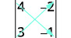
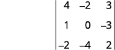
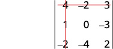
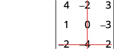
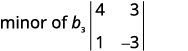
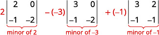

**Solving Systems with Inverses**

  m49435
  

**Solving Systems with Inverses**

  In this section, you will:

Find the inverse of a matrix.
Solve a system of linear equations using an inverse matrix.

  634d2387-7429-480f-a04e-867c2f9699fb

  
## Learning Objectives

Evaluate the determinant of a 2×2 matrix (IA 4.6.1)
Evaluate the determinant of a 3x3 matrix (IA 4.6.2)

## Objective 1: Evaluate the determinant of a 2×2 matrix (IA 4.6.1)
If a matrix has the same number of rows and columns, we call it a **square matrix**. Each square matrix has a real number associated with it called its **determinant**.

>
>
> **Determinant**
>
> The determinant of any square matrix $\left[\begin{array}{cc}a& b\\ c& d\end{array}\right]$ , where a, b, c, and d are real numbers, is $\left[\begin{array}{cc}a& b\\ c& d\end{array}\right]=ad-bc$ 
> To get the real number value of the determinate we subtract the products of the diagonals, as shown.
>
>
> 
>
>

1. Find the determinant of the 2x2 matrix $\left[\begin{array}{cc}4& -2\\ 3& -1\end{array}\right]$

Solution

| Write the determinant |  |
| :--- | :--- |
| Subtract the products of the diagonals | $4(-1)-3(-2)$ |
| Simplify | $\begin{array}{c}-4+6\\ 2\end{array}$ |

### Practice Makes Perfect

Find the determinant of the 2x2 matrices.
2. $\left[\begin{array}{cc}6& -2\\ 3& -1\end{array}\right]$

3. $\left[\begin{array}{cc}-4& 8\\ -3& 5\end{array}\right]$

## Objective 2: Evaluate the determinant of a 3×3 matrix (IA 4.6.2)
To evaluate the determinant of a 3×3 matrix, we must be able to evaluate the **minor of an entry** in the determinant.

The minor of an entry is the 2×2 determinant found by eliminating the row and column in the 3×3 determinant that contains the entry.

For example, to find the minor of entry a1, we eliminate the row and column which contain it. So, we eliminate the first row and first column. Then we write the 2×2 determinant that remains.

To find the minor of entry b2, we eliminate the row and column that contain it. So, we eliminate the second row and second column. Then we write the 2×2 determinant that remains.

4. For the determinant $\left|\begin{array}{ccccccc}  4& & &   \mathrm{-2}& & &   3\\   1& & &   0& & &   \mathrm{-3}\\   \mathrm{-2}& & &   \mathrm{-4}& & &   2\end{array}\right|,$ find and then evaluate the minor of ⓐ ${a}_{1}$ ⓑ ${b}_{3}$

Solution

ⓐ

|  |  |
| :--- | :--- |
| Eliminate the row and column that contains ${a}_{1}.$ |  |
| Write the $2\phantom{\rule{0.2em}{0ex}}\times \phantom{\rule{0.2em}{0ex}}2$ determinant that remains. |  |
| Evaluate. |  |
| Simplify. |  |

ⓑ

| Eliminate the row and column that contains ${b}_{3}.$ |  |
| :--- | :--- |
| Write the $2\phantom{\rule{0.2em}{0ex}}\times \phantom{\rule{0.2em}{0ex}}2$ determinant that remains. |  |
| Evaluate. |  |
| Simplify. |  |

> For the following determinant, find and then evaluate the minor of c2
>
>
>  $\left|\begin{array}{rrr}4& -2& 3\\ 1& 0& -3\\ -2& -4& 2\end{array}\right|$ 
>
>
>
> | Eliminate the row and column that contains ${c}_{2}$. |  |
> | :--- | :--- |
> | Write the $2\times 2$ determinant that remains. |  |
> | Evaluate and simplify. | ________________________________________ |
>

### Strategy for evaluating the determinant of a 3x3 matrix
To evaluate a 3×3 determinant we can expand by minors using any row or column. Choosing a row or column other than the first row sometimes makes the work easier.

When we expand by any row or column, we must be careful about the sign of the terms in the expansion. To determine the sign of the terms, we use the following sign pattern chart.

 $\left|\begin{array}{ccc}+& -& +\\ -& +& -\\ +& -& +\end{array}\right|$ 

### Expanding by minors along the first row to evaluate a 3x3 determinant.
To evaluate a 3×3 determinant by expanding by minors along the first row, we use the following pattern:

NOTE: We can evaluate the determinant of a matrix by expanding minors along any row or column. When a row or a column has a zero entry, expanding by that row or column results in less calculations.

5. Evaluate the determinant of the 3x3 matrix by expanding by minors along the first row      $\left|\begin{array}{rrr}2& -3& -1\\ 3& 2& 0\\ -1& -1& -2\end{array}\right|$

Solution

|  |  |
| :--- | :--- |
| Expand by minors along the first row |  |
| Evaluate each determinant. |  |
| Simplify. |  |
| Simplify. |  |
| Simplify. |  |

### Practice Makes Perfect
6. Evaluate the determinant of the 3x3 matrix by expanding by minors along the first row.  $\left|\begin{array}{rrr}-5& -1& -4\\ 4& 0& -3\\ 2& -2& 6\end{array}\right|$

Soriya plans to invest $10,500 into two different bonds to spread out her risk. The first bond has an annual return of 10%, and the second bond has an annual return of 6%. In order to receive an 8.5% return from the two bonds, how much should Soriya invest in each bond? What is the best method to solve this problem?

  There are several ways we can solve this problem. As we have seen in previous sections, systems of equations and matrices are useful in solving real-world problems involving finance. After studying this section, we will have the tools to solve the bond problem using the inverse of a matrix.

  
# Finding the Inverse of a Matrix
We know that the multiplicative inverse of a real number $a$ is ${a}^{\mathrm{-1}},$ and $a{a}^{\mathrm{-1}}={a}^{\mathrm{-1}}a=\left(\frac{1}{a}\right)a=1.$ For example, ${2}^{\mathrm{-1}}=\frac{1}{2}$ and $\left(\frac{1}{2}\right)2=1.$ The **multiplicative inverse of a matrix** is similar in concept, except that the product of matrix $A$ and its inverse ${A}^{\mathrm{-1}}$ equals the **identity matrix**. The identity matrix is a square matrix containing ones down the main diagonal and zeros everywhere else. We identify identity matrices by ${I}_{n}$ where $n$ represents the dimension of the matrix. Observe the following equations. 
 $$
{I}_{2}=\left[\begin{array}{rrr}  1&   &   0\\   0&   &   1\end{array}\right]
$$
 $$
{I}_{3}=\left[\begin{array}{rrrrr}  1&   &   0&   &   0\\   0&   &   1&   &   0\\   0&   &   0&   &   1\end{array}\right]
$$
The identity matrix acts as a 1 in matrix algebra. For example, $AI=IA=A.$
    
A matrix that has a multiplicative inverse has the properties
 $\begin{array}{l}A{A}^{\mathrm{-1}}=I\\ {A}^{\mathrm{-1}}A=I\end{array}$
    A matrix that has a multiplicative inverse is called an **invertible matrix**. Only a square matrix may have a multiplicative inverse, as the reversibility, $A{A}^{\mathrm{-1}}={A}^{\mathrm{-1}}A=I,$ is a requirement. Not all square matrices have an inverse, but if $A$ is invertible, then ${A}^{\mathrm{-1}}$ is unique. We will look at two methods for finding the inverse of a $2\times 2$ matrix and a third method that can be used on both $2\times 2$ and $3\times 3$ matrices.

>
>
>
>
> **The Identity Matrix and Multiplicative Inverse**
>
>
>       The **identity matrix**, ${I}_{n},$ is a square matrix containing ones down the main diagonal and zeros everywhere else.
>
>        $$
> \begin{array}{l}  \\ \begin{array}{l}\begin{array}{l}  \\ {I}_{2}=\left[\begin{array}{rr}  1&   0\\   0&   1\end{array}\right]\begin{array}{cccc}& & & \end{array}{I}_{3}=\left[\begin{array}{rrr}  1&   0&   0\\   0&   1&   0\\   0&   0&   1\end{array}\right]  \end{array}  \\ \text{\ \ \ \ \ \ \}2\times 2\phantom{\rule{0.5em}{0ex}}\text{\ \ \ \ \ \ \ \ \ \ \ \ \ \ \ \ 3}\times 3  \end{array}  \end{array}
> $$
> If $A$ is an $\phantom{\rule{0.5em}{0ex}}n\times n$
> matrix and $B$ is an $\phantom{\rule{0.5em}{0ex}}n\times n$
> matrix such that $AB=BA={I}_{n},$ then $B={A}^{\mathrm{-1}},$ the **multiplicative inverse of a matrix** $A.$
>

      7. **Showing That the Identity Matrix Acts as a 1**             Given matrix *A*, show that $AI=IA=A.$                        $$ A=\left[\begin{array}{cc}3& 4\\ \mathrm{-2}& 5\end{array}\right] $$

Solution

Use matrix multiplication to show that the product of $A$ and the identity is equal to the product of the identity and *A.*

           $$
AI=\left[\begin{array}{rrr}  3&   &   4\\   \mathrm{-2}&   &   5\end{array}\right]\begin{array}{r}  \end{array}\left[\begin{array}{rrr}  1&   &   0\\   0&   &   1\end{array}\right]=\left[\begin{array}{rrrr}  3\cdot 1+4\cdot 0&   &   &   3\cdot 0+4\cdot 1\\   \mathrm{-2}\cdot 1+5\cdot 0&   &   &   \mathrm{-2}\cdot 0+5\cdot 1\end{array}\right]=\left[\begin{array}{rrr}  3&   &   4\\   \mathrm{-2}&   &   5\end{array}\right]
$$
 $$
IA=\left[\begin{array}{rrr}  1&   &   0\\   0&   &   1\end{array}\right]\begin{array}{r}  \end{array}\left[\begin{array}{rrr}  3&   &   4\\   \mathrm{-2}&   &   5\end{array}\right]=\left[\begin{array}{rrrr}  1\cdot 3+0\cdot (\mathrm{-2})&   &   &   1\cdot 4+0\cdot 5\\   0\cdot 3+1\cdot (\mathrm{-2})&   &   &   0\cdot 4+1\cdot 5\end{array}\right]=\left[\begin{array}{rrr}  3&   &   4\\   \mathrm{-2}&   &   5\end{array}\right]
$$

    

>
>       How To
>       *Given two matrices, show that one is the multiplicative inverse of the other.*
>
>       Given matrix $A$ of order $n\times n$ and matrix $B$ of order $n\times n$ multiply $AB.$
>
>         If $AB=I,$ then find the product $BA.$ If $BA=I,$ then $B={A}^{\mathrm{-1}}$ and $A={B}^{\mathrm{-1}}.$
>
>

      8. **Showing That Matrix *A* Is the Multiplicative Inverse of Matrix *B***             Show that the given matrices are multiplicative inverses of each other.             $$ A=\left[\begin{array}{rrr}  1&   &   5\\   \mathrm{-2}&   &   \mathrm{-9}\end{array}\right],B=\left[\begin{array}{rrr}  \mathrm{-9}&   &   \mathrm{-5}\\   2&   &   1\end{array}\right] $$

Solution

Multiply $AB$ and $BA.$ If both products equal the identity, then the two matrices are inverses of each other.

           $$
\begin{array}{l}AB=\left[\begin{array}{rrr}  1&   &   5\\   \mathrm{-2}&   &   \mathrm{-9}\end{array}\right]\xb7\left[\begin{array}{rrr}  \mathrm{-9}&   &   \mathrm{-5}\\   2&   &   1\end{array}\right]  \\ =\left[\begin{array}{rrr}  1(\mathrm{-9})+5(2)&   &   1(\mathrm{-5})+5(1)\\   \mathrm{-2}(\mathrm{-9})\mathrm{-9}(2)&   &   \mathrm{-2}(\mathrm{-5})\mathrm{-9}(1)\end{array}\right]  \\ =\left[\begin{array}{ccc}1& & 0\\ 0& & 1\end{array}\right]  \end{array}
$$
 $$
\begin{array}{l}BA=\left[\begin{array}{rrr}  \mathrm{-9}&   &   \mathrm{-5}\\   2&   &   1\end{array}\right]\xb7\left[\begin{array}{rrr}  1&   &   5\\   \mathrm{-2}&   &   \mathrm{-9}\end{array}\right]  \\ =\left[\begin{array}{rrr}  \mathrm{-9}(1)\mathrm{-5}(\mathrm{-2})&   &   \mathrm{-9}(5)\mathrm{-5}(\mathrm{-9})\\   2(1)+1(\mathrm{-2})&   &   2(5)+1(\mathrm{-9})\end{array}\right]  \\ =\left[\begin{array}{ccc}1& & 0\\ 0& & 1\end{array}\right]  \end{array}
$$
 $A$ and $B$ are inverses of each other.

>
>       Try It
>       9. Show that the following two matrices are inverses of each other.             $$ A=\left[\begin{array}{rrr}  1&   &   4\\   \mathrm{-1}&   &   \mathrm{-3}\end{array}\right],B=\left[\begin{array}{rrr}  \mathrm{-3}&   &   \mathrm{-4}\\   1&   &   1\end{array}\right] $$
>
> 

> 
Solution

>
> $\begin{array}{l}AB=\left[\begin{array}{rrr}  1&   &   4\\   \mathrm{-1}&   &   \mathrm{-3}\end{array}\right]\begin{array}{r}  \end{array}\left[\begin{array}{rrr}  \mathrm{-3}&   &   \mathrm{-4}\\   1&   &   1\end{array}\right]=\left[\begin{array}{rrr}  1(\mathrm{-3})+4(1)&   &   1(\mathrm{-4})+4(1)\\   \mathrm{-1}(\mathrm{-3})+\mathrm{-3}(1)&   &   \mathrm{-1}(\mathrm{-4})+\mathrm{-3}(1)\end{array}\right]=\left[\begin{array}{rrr}  1&   &   0\\   0&   &   1\end{array}\right]  \\ BA=\left[\begin{array}{rrr}  \mathrm{-3}&   &   \mathrm{-4}\\   1&   &   1\end{array}\right]\begin{array}{r}  \end{array}\left[\begin{array}{rrr}  1&   &   4\\   \mathrm{-1}&   &   \mathrm{-3}\end{array}\right]=\left[\begin{array}{rrr}  \mathrm{-3}(1)+\mathrm{-4}(\mathrm{-1})&   &   \mathrm{-3}(4)+\mathrm{-4}(\mathrm{-3})\\   1(1)+1(\mathrm{-1})&   &   1(4)+1(\mathrm{-3})\end{array}\right]=\left[\begin{array}{rrr}  1&   &   0\\   0&   &   1\end{array}\right]  \end{array}$
> 

>

## Finding the Multiplicative Inverse Using Matrix Multiplication
We can now determine whether two matrices are inverses, but how would we find the inverse of a given matrix? Since we know that the product of a matrix and its inverse is the identity matrix, we can find the inverse of a matrix by setting up an equation using **matrix multiplication**.

        10. **Finding the Multiplicative Inverse Using Matrix Multiplication**               Use matrix multiplication to find the inverse of the given matrix.               $$ A=\left[\begin{array}{rrr}  1&   &   \mathrm{-2}\\   2&   &   \mathrm{-3}\end{array}\right] $$

Solution

For this method, we multiply $A$ by a matrix containing unknown constants and set it equal to the identity.

             $$
\left[\begin{array}{rr}  1&   \mathrm{-2}\\   2&   \mathrm{-3}\end{array}\right]\phantom{\rule{0.5em}{0ex}}\text{\ \}\left[\begin{array}{rr}  a&   b\\   c&   d\end{array}\right]=\left[\begin{array}{rr}  1&   0\\   0&   1\end{array}\right]
$$
Find the product of the two matrices on the left side of the equal sign.

             $$
\left[\begin{array}{rr}  1&   \mathrm{-2}\\   2&   \mathrm{-3}\end{array}\right]\phantom{\rule{0.5em}{0ex}}\text{\ \}\left[\begin{array}{rr}  a&   b\\   c&   d\end{array}\right]=\left[\begin{array}{rr}  1a\mathrm{-2}c&   1b\mathrm{-2}d\\   2a\mathrm{-3}c&   2b\mathrm{-3}d\end{array}\right]
$$
Next, set up a system of equations with the entry in row 1, column 1 of the new matrix equal to the first entry of the identity, 1. Set the entry in row 2, column 1 of the new matrix equal to the corresponding entry of the identity, which is 0.
 $$
\begin{array}{c}1a\mathrm{-2}c=1\phantom{\rule{0.5em}{0ex}}\text{\ \ \}{R}_{1}\\ 2a\mathrm{-3}c=0\phantom{\rule{0.5em}{0ex}}\text{\ \ \}{R}_{2}\end{array}
$$
            
            Using row operations, multiply and add as follows: $(\mathrm{-2}){R}_{1}+{R}_{2}\to {R}_{2}.$ Add the equations, and solve for $c.$
            
 $$
\begin{array}{r}  1a-2c=1\phantom{\rule{0.5em}{0ex}}\\   0+1c=-2\\   c=-2\end{array}
$$
Back-substitute to solve for $a.$
            

             $$
\begin{array}{r}  a\mathrm{-2}(\mathrm{-2})=1\phantom{\rule{0.5em}{0ex}}\\   a+4=1\phantom{\rule{0.5em}{0ex}}\\   a=\mathrm{-3}\end{array}
$$
Write another system of equations setting the entry in row 1, column 2 of the new matrix equal to the corresponding entry of the identity, 0. Set the entry in row 2, column 2 equal to the corresponding entry of the identity.

             $$
\begin{array}{rr}  1b\mathrm{-2}d=0&   {R}_{1}\\   2b\mathrm{-3}d=1&   {R}_{2}\end{array}
$$
Using row operations, multiply and add as follows: $\left(\mathrm{-2}\right){R}_{1}+{R}_{2}={R}_{2}.$ Add the two equations and solve for $d.$
            

             $$
\begin{array}{r}  1b\mathrm{-2}d=0\\   \frac{0+1d=1}{\phantom{\rule{0.5em}{0ex}}d=1}\\   \end{array}
$$
Once more, back-substitute and solve for $b.$
            

             $$
\begin{array}{r}  b\mathrm{-2}(1)=0\\   b\mathrm{-2}=0\\   b=2\end{array}
$$
 $$
{A}^{\mathrm{-1}}=\left[\begin{array}{rrr}  \mathrm{-3}&   &   2\\   \mathrm{-2}&   &   1\end{array}\right]
$$

## Finding the Multiplicative Inverse by Augmenting with the Identity
Another way to find the **multiplicative inverse** is by augmenting with the identity. When matrix $A$ is transformed into $I,$ the augmented matrix $I$ transforms into ${A}^{\mathrm{-1}}.$
      
For example, given
 $$
A=\left[\begin{array}{rrr}  2&   &   1\\   5&   &   3\end{array}\right]
$$
augment $A$ with the identity
 $$
\left[\begin{array}{rr}  2&   1\\   5&   3\end{array}\phantom{\rule{0.5em}{0ex}}\text{}|\phantom{\rule{0.5em}{0ex}}\text{}\begin{array}{rr}  1&   0\\   0&   1\end{array}\right]
$$
Perform **row operations** with the goal of turning $A$ into the identity.
Switch row 1 and row 2.
          $$
\left[\begin{array}{rr}  5&   3\\   2&   1\end{array}\phantom{\rule{0.5em}{0ex}}\text{}|\phantom{\rule{0.5em}{0ex}}\text{}\begin{array}{rr}  0&   1\\   1&   0\end{array}\right]
$$

      Multiply row 2 by $\mathrm{-2}$ and add to row 1.
         $$
\left[\begin{array}{rr}  1&   1\\   2&   1\end{array}\phantom{\rule{0.5em}{0ex}}\text{}|\phantom{\rule{0.5em}{0ex}}\text{}\begin{array}{rr}  \mathrm{-2}&   1\\   1&   0\end{array}\right]
$$

      Multiply row 1 by $\mathrm{-2}$ and add to row 2.
         $$
\left[\begin{array}{rr}  1&   1\\   0&   \mathrm{-1}\end{array}\phantom{\rule{0.5em}{0ex}}\text{}|\phantom{\rule{0.5em}{0ex}}\text{}\begin{array}{rr}  \mathrm{-2}&   1\\   5&   \mathrm{-2}\end{array}\right]
$$

      Add row 2 to row 1.
         $$
\left[\begin{array}{rr}  1&   0\\   0&   \mathrm{-1}\end{array}\phantom{\rule{0.5em}{0ex}}\text{}|\phantom{\rule{0.5em}{0ex}}\text{}\begin{array}{rr}  3&   \mathrm{-1}\\   5&   \mathrm{-2}\end{array}\right]
$$

       Multiply row 2 by $\phantom{\rule{0.5em}{0ex}}\mathrm{-1.}$

          $$
\left[\begin{array}{rr}  1&   0\\   0&   1\end{array}\phantom{\rule{0.5em}{0ex}}\text{}|\phantom{\rule{0.5em}{0ex}}\text{}\begin{array}{rr}  3&   \mathrm{-1}\\   \mathrm{-5}&   2\end{array}\right]
$$

     The matrix we have found is ${A}^{\mathrm{-1}}.$

         
 $$
{A}^{\mathrm{-1}}=\left[\begin{array}{rrr}  3&   &   \mathrm{-1}\\   \mathrm{-5}&   &   2\end{array}\right]
$$

## Finding the Multiplicative Inverse of 2×2 Matrices Using a Formula
When we need to find the **multiplicative inverse** of a $2\times 2$ matrix, we can use a special formula instead of using matrix multiplication or augmenting with the identity.
If $A$ is a $2\times 2$ matrix, such as
 $A=\left[\begin{array}{rrr}  a&   &   b\\   c&   &   d\end{array}\right]$
the multiplicative inverse of $A$ is given by the formula
 $$
{A}^{\mathrm{-1}}=\frac{1}{ad-bc}\left[\begin{array}{rrr}  d&   &   -b\\   -c&   &   a\end{array}\right]
$$
where $ad-bc\ne 0.$ If $ad-bc=0,$ then $A$ has no inverse.

        11. **Using the Formula to Find the Multiplicative Inverse of Matrix *A***               Use the formula to find the multiplicative inverse of               $$ A=\left[\begin{array}{cc}1& \mathrm{-2}\\ 2& \mathrm{-3}\end{array}\right] $$

Solution

Using the formula, we have

             $$
\begin{array}{l}{A}^{\mathrm{-1}}=\frac{1}{(1)(\mathrm{-3})-(\mathrm{-2})(2)}\left[\begin{array}{cc}\mathrm{-3}& 2\\ \mathrm{-2}& 1\end{array}\right]  \\ \phantom{\rule{0.5em}{0ex}}=\frac{1}{\mathrm{-3}+4}\left[\begin{array}{cc}\mathrm{-3}& 2\\ \mathrm{-2}& 1\end{array}\right]  \\ \phantom{\rule{0.5em}{0ex}}=\left[\begin{array}{cc}\mathrm{-3}& 2\\ \mathrm{-2}& 1\end{array}\right]  \end{array}
$$

>
>         Try It
>         12. Use the formula to find the inverse of matrix $A.$ Verify your answer by augmenting with the identity matrix.               $$ A=\left[\begin{array}{cc}1& \mathrm{-1}\\ 2& \phantom{\rule{0.5em}{0ex}}3\end{array}\right] $$
>
> 

> 
Solution

>
> ${A}^{\mathrm{-1}}=\left[\begin{array}{cc}\frac{3}{5}& \frac{1}{5}\\ -\frac{2}{5}& \frac{1}{5}\end{array}\right]$
> 

>
>
>

        13. **Finding the Inverse of the Matrix, If It Exists**               Find the inverse, if it exists, of the given matrix.               $$ A=\left[\begin{array}{cc}3& 6\\ 1& 2\end{array}\right] $$

Solution

We will use the method of augmenting with the identity.

           $$
\left[\begin{array}{cc}3& 6\\ 1& 2\end{array}|\begin{array}{cc}1& 0\\ 0& 1\end{array}\right]
$$
          Switch row 1 and row 2.
             $$
\left[\begin{array}{cc}1& 3\\ 3& 2\end{array}|\begin{array}{cc}0& 1\\ 1& 0\end{array}\right]
$$
            
            Multiply row 1 by −3 and add it to row 2.
               $$
\left[\begin{array}{cc}1& 2\\ 0& 0\end{array}|\begin{array}{cc}1& 0\\ \mathrm{-3}& 1\end{array}\right]
$$
              
          There is nothing further we can do. The zeros in row 2 indicate that this matrix has no inverse.

      

## Finding the Multiplicative Inverse of 3×3 Matrices
Unfortunately, we do not have a formula similar to the one for a $2\text{}\times \text{}2$ matrix to find the inverse of a $3\text{}\times \text{}3$ matrix. Instead, we will augment the original matrix with the identity matrix and use **row operations** to obtain the inverse.
Given a $3\times 3$
        matrix
 $$
A=\left[\begin{array}{ccc}2& 3& 1\\ 3& 3& 1\\ 2& 4& 1\end{array}\right]
$$
      augment $A$ with the identity matrix
 $$
A|I=\left[\begin{array}{ccc}2& 3& 1\\ 3& 3& 1\\ 2& 4& 1\end{array}\phantom{\rule{0.5em}{0ex}}\text\ |\phantom{\rule{0.5em}{0ex}}\text\ \begin{array}{ccc}1& 0& 0\\ 0& 1& 0\\ 0& 0& 1\end{array}\right]
$$
To begin, we write the **augmented matrix** with the identity on the right and $A$ on the left. Performing elementary **row operations** so that the **identity matrix** appears on the left, we will obtain the **inverse matrix** on the right. We will find the inverse of this matrix in the next example.

>
>         How To
>         *Given a $3\times 3$ matrix, find the inverse*
> Write the original matrix augmented with the identity matrix on the right.
>         Use elementary row operations so that the identity appears on the left.
>         What is obtained on the right is the inverse of the original matrix.
>           Use matrix multiplication to show that $A{A}^{\mathrm{-1}}=I$ and ${A}^{\mathrm{-1}}A=I.$
>
>

        14. **Finding the Inverse of a 3 × 3 Matrix**               Given the $3\times 3$ matrix $A,$ find the inverse.  $$ A=\left[\begin{array}{ccc}2& 3& 1\\ 3& 3& 1\\ 2& 4& 1\end{array}\right] $$

Solution

Augment $A$ with the identity matrix, and then begin row operations until the identity matrix replaces $A.$ The matrix on the right will be the inverse of $A.$
            

             $$
\left[\begin{array}{ccc}2& 3& 1\\ 3& 3& 1\\ 2& 4& 1\end{array}\phantom{\rule{0.5em}{0ex}}|\begin{array}{ccc}1& 0& 0\\ 0& 1& 0\\ \phantom{\rule{0.5em}{0ex}}0& 0& 1\end{array}\right]\stackrel{\text{Interchange\}{R}_{2}\phantom{\rule{0.5em}{0ex}}\text{and\}{R}_{1}}{\to}\left[\begin{array}{ccc}3& 3& 1\\ 2& 3& 1\\ 2& 4& 1\end{array}\phantom{\rule{0.5em}{0ex}}|\begin{array}{ccc}0& 1& 0\\ 1& 0& 0\\ \phantom{\rule{0.5em}{0ex}}0& 0& 1\end{array}\right]
$$
            
             $$
-{R}_{2}+{R}_{1}={R}_{1}\to \left[\begin{array}{ccc}1& 0& 0\\ 2& 3& 1\\ 2& 4& 1\end{array}\phantom{\rule{0.5em}{0ex}}|\phantom{\rule{0.5em}{0ex}}\begin{array}{rrr}  \mathrm{-1}&   1&   0\\   1&   0&   0\\   0&   0&   1\end{array}\right]
$$
 $$
-{R}_{2}+{R}_{3}={R}_{3}\to \left[\begin{array}{ccc}1& 0& 0\\ 2& 3& 1\\ 0& 1& 0\end{array}\phantom{\rule{0.5em}{0ex}}|\phantom{\rule{0.5em}{0ex}}\begin{array}{rrr}  \mathrm{-1}&   1&   0\\   1&   0&   0\\   \mathrm{-1}&   0&   1\end{array}\right]
$$
 $$
{R}_{3}\phantom{\rule{0.5em}{0ex}}\leftrightarrow \ {R}_{2}\to \left[\begin{array}{ccc}1& 0& 0\\ 0& 1& 0\\ 2& 3& 1\end{array}\phantom{\rule{0.5em}{0ex}}|\phantom{\rule{0.5em}{0ex}}\begin{array}{rrr}  \mathrm{-1}&   1&   0\\   \mathrm{-1}&   0&   1\\   1&   0&   0\end{array}\right]
$$
 $$
\mathrm{-2}{R}_{1}+{R}_{3}={R}_{3}\to \left[\begin{array}{ccc}1& 0& 0\\ 0& 1& 0\\ 0& 3& 1\end{array}\phantom{\rule{0.5em}{0ex}}|\phantom{\rule{0.5em}{0ex}}\begin{array}{rrr}  \mathrm{-1}&   1&   0\\   \mathrm{-1}&   0&   1\\   3&   \mathrm{-2}&   0\end{array}\right]
$$
 $$
\mathrm{-3}{R}_{2}+{R}_{3}={R}_{3}\to \left[\begin{array}{ccc}1& 0& 0\\ 0& 1& 0\\ 0& 0& 1\end{array}\phantom{\rule{0.5em}{0ex}}|\phantom{\rule{0.5em}{0ex}}\begin{array}{rrr}  \mathrm{-1}&   1&   0\\   \mathrm{-1}&   0&   1\\   6&   \mathrm{-2}&   \mathrm{-3}\end{array}\right]
$$
Thus,

             $$
{A}^{\mathrm{-1}}=B=\left[\begin{array}{ccc}\mathrm{-1}& \phantom{\rule{0.5em}{0ex}}1& \phantom{\rule{0.5em}{0ex}}0\\ \mathrm{-1}& \phantom{\rule{0.5em}{0ex}}0& \phantom{\rule{0.5em}{0ex}}1\\ \phantom{\rule{0.5em}{0ex}}6& \mathrm{-2}& \mathrm{-3}\end{array}\phantom{\rule{0.5em}{0ex}}\right]
$$

>
>         Try It
>         15. Find the inverse of the $3\times 3$ matrix.               $$ A=\left[\begin{array}{ccc}\phantom{\rule{0.5em}{0ex}}2& \mathrm{-17}& 11\\ \mathrm{-1}& \phantom{\rule{0.5em}{0ex}}11& \mathrm{-7}\\ \phantom{\rule{0.5em}{0ex}}0& \phantom{\rule{0.5em}{0ex}}3& \mathrm{-2}\end{array}\right] $$
>
> 

> 
Solution

>
> ${A}^{\mathrm{-1}}=\left[\begin{array}{ccc}1& 1& \phantom{\rule{0.5em}{0ex}}2\\ 2& 4& \mathrm{-3}\\ 3& 6& \mathrm{-5}\end{array}\right]$
> 

>
>
>

  
# Solving a System of Linear Equations Using the Inverse of a Matrix
Solving a system of linear equations using the inverse of a matrix requires the definition of two new matrices: $X$ is the matrix representing the variables of the system, and $B$ is the matrix representing the constants. Using **matrix multiplication**, we may define a system of equations with the same number of equations as variables as
 $AX=B$
    To solve a system of linear equations using an **inverse matrix**, let $A$ be the **coefficient matrix**, let $X$ be the variable matrix, and let $B$ be the constant matrix. Thus, we want to solve a system $AX=B.$ For example, look at the following system of equations.
 $$
\begin{array}{c}{a}_{1}x+{b}_{1}y={c}_{1}\\ {a}_{2}x+{b}_{2}y={c}_{2}\end{array}
$$
From this system, the coefficient matrix is
 $$
A=\left[\begin{array}{cc}{a}_{1}& {b}_{1}\\ {a}_{2}& {b}_{2}\end{array}\right]
$$
    The variable matrix is
 $$
X=\left[\begin{array}{c}x\\ y\end{array}\right]
$$
    And the constant matrix is
 $$
B=\left[\begin{array}{c}{c}_{1}\\ {c}_{2}\end{array}\right]
$$
    
    Then $AX=B$ looks like
 $$
\left[\begin{array}{cc}{a}_{1}& {b}_{1}\\ {a}_{2}& {b}_{2}\end{array}\right]\phantom{\rule{0.5em}{0ex}}\text{\ \}\left[\begin{array}{c}x\\ y\end{array}\right]=\left[\begin{array}{c}{c}_{1}\\ {c}_{2}\end{array}\right]
$$
Recall the discussion earlier in this section regarding multiplying a real number by its inverse, $({2}^{\mathrm{-1}})\phantom{\rule{0.5em}{0ex}}2=\left(\frac{1}{2}\right)\phantom{\rule{0.5em}{0ex}}2=1.$ To solve a single linear equation $ax=b$ for $x,$ we would simply multiply both sides of the equation by the multiplicative inverse (reciprocal) of $a.$ Thus,
 $$
\begin{array}{c}\phantom{\rule{0.5em}{0ex}}\text\ ax=b\\ \phantom{\rule{0.5em}{0ex}}\text\ \left(\frac{1}{a}\right)ax=\left(\frac{1}{a}\right)b\\ ({a}^{\mathrm{-1}}\phantom{\rule{0.5em}{0ex}}\text{\ \})ax=({a}^{\mathrm{-1}})b\\ [({a}^{\mathrm{-1}})a]x=({a}^{\mathrm{-1}})b\\ \phantom{\rule{0.5em}{0ex}}\text{\ \ \ \ \ \ \ \ \ \ \}1x=({a}^{\mathrm{-1}})b\\ \phantom{\rule{0.5em}{0ex}}\text{\ \ \ \ \ \ \ \ \ \ \ \ \}x=({a}^{\mathrm{-1}})b\end{array}
$$
The only difference between a solving a linear equation and a **system of equations** written in matrix form is that finding the inverse of a matrix is more complicated, and matrix multiplication is a longer process. However, the goal is the same—to isolate the variable.
We will investigate this idea in detail, but it is helpful to begin with a $2\times 2$ system and then move on to a $3\times 3$ system.

>
>
>
>
> **Solving a System of Equations Using the Inverse of a Matrix**
>
>
>       Given a system of equations, write the coefficient matrix $A,$ the variable matrix $X,$ and the constant matrix $B.$ Then
>
>        $$
> AX=B
> $$
>
>       Multiply both sides by the inverse of $A$ to obtain the solution.
>
>        $$
> \begin{array}{r}  \left({A}^{\mathrm{-1}}\right)AX=\left({A}^{\mathrm{-1}}\right)B\\   \left[\left({A}^{\mathrm{-1}}\right)A\right]X=\left({A}^{\mathrm{-1}}\right)B\\   IX=\left({A}^{\mathrm{-1}}\right)B\\   X=\left({A}^{\mathrm{-1}}\right)B\end{array}
> $$

>
>       Q&A
>       *If the coefficient matrix does not have an inverse, does that mean the system has no solution?*
>
>       *No, if the coefficient matrix is not invertible, the system could be inconsistent and have no solution, or be dependent and have infinitely many solutions.*
>
>

      16. **Solving a 2 × 2 System Using the Inverse of a Matrix**             Solve the given system of equations using the inverse of a matrix.             $$ \begin{array}{r}  3x+8y=5\\   4x+11y=7\end{array} $$

Solution

Write the system in terms of a coefficient matrix, a variable matrix, and a constant matrix.

           $$
A=\left[\begin{array}{cc}3& 8\\ 4& 11\end{array}\right],X=\left[\begin{array}{c}x\\ y\end{array}\right],B=\left[\begin{array}{c}5\\ 7\end{array}\right]
$$
Then

           $$
\left[\begin{array}{cc}3& 8\\ 4& 11\end{array}\right]\phantom{\rule{0.5em}{0ex}}\text{\ \}\left[\begin{array}{c}x\\ y\end{array}\right]=\left[\begin{array}{c}5\\ 7\end{array}\right]
$$
First, we need to calculate ${A}^{\mathrm{-1}}.$ Using the formula to calculate the inverse of a 2 by 2 matrix, we have:

           $$
\begin{array}{l}{A}^{\mathrm{-1}}=\frac{1}{ad-bc}\left[\begin{array}{cc}d& -b\\ -c& a\end{array}\right]  \\ \phantom{\rule{0.5em}{0ex}}\text{\ \ \ \ \}=\frac{1}{3(11)\mathrm{-8}(4)}\left[\begin{array}{cc}11& \mathrm{-8}\\ \mathrm{-4}& 3\end{array}\right]  \\ \phantom{\rule{0.5em}{0ex}}\text{\ \ \ \ \}=\frac{1}{1}\left[\begin{array}{cc}11& \mathrm{-8}\\ \mathrm{-4}& 3\end{array}\right]  \end{array}
$$
So,

           $$
{A}^{\mathrm{-1}}=\left[\begin{array}{cc}11& \mathrm{-8}\\ \mathrm{-4}& \text{}\text{}\phantom{\rule{0.5em}{0ex}}3\end{array}\right]
$$
          
          Now we are ready to solve. Multiply both sides of the equation by ${A}^{\mathrm{-1}}.$
          

           $$
\begin{array}{l}\phantom{\rule{0.5em}{0ex}}({A}^{\mathrm{-1}})AX=({A}^{\mathrm{-1}})B  \\ \left[\begin{array}{rr}  11&   \mathrm{-8}\\   \mathrm{-4}&   3\end{array}\right]\phantom{\rule{0.5em}{0ex}}\text{\ \}\left[\begin{array}{cc}3& 8\\ 4& 11\end{array}\right]\phantom{\rule{0.5em}{0ex}}\text{\ \}\left[\begin{array}{c}x\\ y\end{array}\right]=\left[\begin{array}{rr}  11&   \mathrm{-8}\\   \mathrm{-4}&   3\end{array}\right]\phantom{\rule{0.5em}{0ex}}\text{\ \}\left[\begin{array}{c}5\\ 7\end{array}\right]  \\ \phantom{\rule{0.5em}{0ex}}\left[\begin{array}{cc}1& 0\\ 0& 1\end{array}\right]\phantom{\rule{0.5em}{0ex}}\text{\ \}\left[\begin{array}{c}x\\ y\end{array}\right]=\left[\begin{array}{r}  11(5)+(\mathrm{-8})7\\   \mathrm{-4}(5)+3(7)\end{array}\right]  \\ \phantom{\rule{0.5em}{0ex}}\left[\begin{array}{c}x\\ y\end{array}\right]=\left[\begin{array}{r}  \mathrm{-1}\\   1\end{array}\right]  \end{array}
$$
The solution is $\left(\mathrm{-1},1\right).$

>
>       Q&A
>       *Can we solve for $X$ by finding the product $B{A}^{\mathrm{-1}}?$*
>
>       *No, recall that matrix multiplication is not commutative, so ${A}^{\mathrm{-1}}B\ne B{A}^{\mathrm{-1}}.$ Consider our steps for solving the matrix equation.*
>  $\begin{array}{r}  \left({A}^{\mathrm{-1}}\right)AX=\left({A}^{\mathrm{-1}}\right)B\\   \left[\left({A}^{\mathrm{-1}}\right)A\right]X=\left({A}^{\mathrm{-1}}\right)B\\   IX=\left({A}^{\mathrm{-1}}\right)B\\   X=\left({A}^{\mathrm{-1}}\right)B\end{array}$
> *Notice in the first step we multiplied both sides of the equation by ${A}^{\mathrm{-1}},$ but the ${A}^{\mathrm{-1}}$ was to the left of $A$ on the left side and to the left of $B$ on the right side. Because matrix multiplication is not commutative, order matters.*

      17. **Solving a 3 × 3 System Using the Inverse of a Matrix**             Solve the following system using the inverse of a matrix.              $$ \begin{array}{r}  5x+15y+56z=35\phantom{\rule{0.5em}{0ex}}\\   \mathrm{-4}x\mathrm{-11}y\mathrm{-41}z=\mathrm{-26}\\   -x\mathrm{-3}y\mathrm{-11}z=\mathrm{-7}\phantom{\rule{0.5em}{0ex}}\end{array} $$

Solution

Write the equation $AX=B.$
          

           $$
\left[\begin{array}{ccc}5& 15& 56\\ \mathrm{-4}& \mathrm{-11}& \mathrm{-41}\\ \mathrm{-1}& \mathrm{-3}& \mathrm{-11}\end{array}\right]\phantom{\rule{0.5em}{0ex}}\text{\ \}\left[\begin{array}{c}x\\ y\\ z\end{array}\right]=\left[\begin{array}{r}  35\\   \mathrm{-26}\\   \mathrm{-7}\end{array}\right]
$$
First, we will find the inverse of $A$ by augmenting with the identity.

           $$
\left[\begin{array}{rrr}  5&   15&   56\\   \mathrm{-4}&   \mathrm{-11}&   \mathrm{-41}\\   \mathrm{-1}&   \mathrm{-3}&   \mathrm{-11}\end{array}\phantom{\rule{0.5em}{0ex}}|\phantom{\rule{0.5em}{0ex}}\begin{array}{ccc}1& 0& 0\\ 0& 1& 0\\ 0& 0& 1\end{array}\right]
$$
Multiply row 1 by $\frac{1}{5}.$
          

           $$
\left[\begin{array}{ccc}1& 3& \frac{56}{5}\\ \mathrm{-4}& \mathrm{-11}& \mathrm{-41}\\ \mathrm{-1}& \mathrm{-3}& \mathrm{-11}\end{array}\phantom{\rule{0.5em}{0ex}}|\phantom{\rule{0.5em}{0ex}}\begin{array}{ccc}\frac{1}{5}& 0& 0\\ 0& 1& 0\\ 0& 0& 1\end{array}\right]
$$
          
        Multiply row 1 by 4 and add to row 2.

           $$
\left[\begin{array}{ccc}1& 3& \frac{56}{5}\\ 0& 1& \frac{19}{5}\\ \mathrm{-1}& \mathrm{-3}& \mathrm{-11}\end{array}\phantom{\rule{0.5em}{0ex}}|\phantom{\rule{0.5em}{0ex}}\begin{array}{ccc}\frac{1}{5}& 0& 0\\ \frac{4}{5}& 1& 0\\ 0& 0& 1\end{array}\right]
$$
          
        Add row 1 to row 3.

           $$
\left[\begin{array}{ccc}1& 3& \frac{56}{5}\\ 0& 1& \frac{19}{5}\\ 0& 0& \frac{1}{5}\end{array}\phantom{\rule{0.5em}{0ex}}|\phantom{\rule{0.5em}{0ex}}\begin{array}{ccc}\frac{1}{5}& 0& 0\\ \frac{4}{5}& 1& 0\\ \frac{1}{5}& 0& 1\end{array}\right]
$$
          
        Multiply row 2 by −3 and add to row 1.

           $$
\left[\begin{array}{ccc}1& 0& -\frac{1}{5}\\ 0& 1& \frac{19}{5}\\ 0& 0& \frac{1}{5}\end{array}\phantom{\rule{0.5em}{0ex}}|\phantom{\rule{0.5em}{0ex}}\begin{array}{ccc}-\frac{11}{5}& \mathrm{-3}& 0\\ \frac{4}{5}& 1& 0\\ \frac{1}{5}& 0& 1\end{array}\right]
$$
          
        Multiply row 3 by 5.

           $$
\left[\begin{array}{ccc}1& 0& -\frac{1}{5}\\ 0& 1& \frac{19}{5}\\ 0& 0& 1\end{array}\phantom{\rule{0.5em}{0ex}}|\phantom{\rule{0.5em}{0ex}}\begin{array}{ccc}-\frac{11}{5}& \mathrm{-3}& 0\\ \frac{4}{5}& 1& 0\\ 1& 0& 5\end{array}\right]
$$
          
          Multiply row 3 by $\frac{1}{5}$ and add to row 1.

           $$
\left[\begin{array}{ccc}1& 0& 0\\ 0& 1& \frac{19}{5}\\ 0& 0& 1\end{array}\phantom{\rule{0.5em}{0ex}}|\phantom{\rule{0.5em}{0ex}}\begin{array}{ccc}\mathrm{-2}& \mathrm{-3}& 1\\ \frac{4}{5}& 1& 0\\ 1& 0& 5\end{array}\right]
$$
          
          Multiply row 3 by $-\frac{19}{5}$ and add to row 2.

           $$
\left[\begin{array}{ccc}1& 0& 0\\ 0& 1& 0\\ 0& 0& 1\end{array}\phantom{\rule{0.5em}{0ex}}|\phantom{\rule{0.5em}{0ex}}\begin{array}{ccc}\mathrm{-2}& \mathrm{-3}& 1\\ \mathrm{-3}& 1& \mathrm{-19}\\ 1& 0& 5\end{array}\right]
$$
          
        So,

           $$
{A}^{\mathrm{-1}}=\left[\begin{array}{ccc}\mathrm{-2}& \mathrm{-3}& 1\\ \mathrm{-3}& 1& \mathrm{-19}\\ 1& 0& 5\end{array}\right]
$$
          Multiply both sides of the equation by ${A}^{\mathrm{-1}}.$ We want ${A}^{\mathrm{-1}}AX={A}^{\mathrm{-1}}B:$
          

           $$
\left[\begin{array}{rrr}  \mathrm{-2}&   \mathrm{-3}&   1\\   \mathrm{-3}&   1&   \mathrm{-19}\\   1&   0&   5\end{array}\right]\phantom{\rule{0.5em}{0ex}}\text{\ \}\left[\begin{array}{rrr}  5&   15&   56\\   \mathrm{-4}&   \mathrm{-11}&   \mathrm{-41}\\   \mathrm{-1}&   \mathrm{-3}&   \mathrm{-11}\end{array}\right]\phantom{\rule{0.5em}{0ex}}\text{\ \}\left[\begin{array}{c}x\\ y\\ z\end{array}\right]=\left[\begin{array}{rrr}  \mathrm{-2}&   \mathrm{-3}&   1\\   \mathrm{-3}&   1&   \mathrm{-19}\\   1&   0&   5\end{array}\right]\phantom{\rule{0.5em}{0ex}}\text{\ \}\left[\begin{array}{r}  35\\   \mathrm{-26}\\   \mathrm{-7}\end{array}\right]
$$
Thus,

           $$
{A}^{\mathrm{-1}}B=\left[\begin{array}{r}  \mathrm{-70}+78\mathrm{-7}\\   \mathrm{-105}\mathrm{-26}+133\\   35+0\mathrm{-35}\end{array}\right]=\left[\begin{array}{c}1\\ 2\\ 0\end{array}\right]
$$
The solution is $\left(1,2,0\right).$

>
>       Try It
>       18. Solve the system using the inverse of the coefficient matrix.            $$ \begin{array}{l}\phantom{\rule{0.5em}{0ex}}\text\ 2x-17y+11z=0  \\ \phantom{\rule{0.5em}{0ex}}\text\ -x+11y-7z=8  \\ \phantom{\rule{0.5em}{0ex}}\text{\ \ \ \ \ \ \ \ \ \ \ \ \ \}3y-2z=\mathrm{-2}  \end{array} $$
>
> 

> 
Solution

>
> $X=\left[\begin{array}{c}4\\ 38\\ 58\end{array}\right]$
> 

>
>
>

>
>       How To
>       *Given a system of equations, solve with matrix inverses using a calculator.*
>
>       Save the coefficient matrix and the constant matrix as matrix variables $\left[A\right]$ and $\left[B\right].$
>
>       Enter the multiplication into the calculator, calling up each matrix variable as needed.
>       If the coefficient matrix is invertible, the calculator will present the solution matrix; if the coefficient matrix is not invertible, the calculator will present an error message.
>

      19. **Using a Calculator to Solve a System of Equations with Matrix Inverses**             Solve the system of equations with matrix inverses using a calculator             $$ \begin{array}{l}2x+3y+z=32  \\ 3x+3y+z=\mathrm{-27}  \\ 2x+4y+z=\mathrm{-2}  \end{array} $$

Solution

On the matrix page of the calculator, enter the **coefficient matrix** as the matrix variable $\left[A\right],$ and enter the constant matrix as the matrix variable $\left[B\right].$
          
 $$
[A]=\left[\begin{array}{ccc}2& 3& 1\\ 3& 3& 1\\ 2& 4& 1\end{array}\right],\text{\hspace{1em}}[B]=\left[\begin{array}{c}32\\ \mathrm{-27}\\ \mathrm{-2}\end{array}\right]
$$
          
          On the home screen of the calculator, type in the multiplication to solve for $X,$ calling up each matrix variable as needed.

           $$
{[A]}^{\mathrm{-1}}\times [B]
$$
          
        Evaluate the expression.

           $$
\left[\begin{array}{c}\mathrm{-59}\\ \mathrm{-34}\\ 252\end{array}\right]
$$

    

>
>       Media
>       Access these online resources for additional instruction and practice with solving systems with inverses.
>
>
>         The Identity Matrix
>         Determining Inverse Matrices
>         Using a Matrix Equation to Solve a System of Equations
>
>

# Key Equations

| Identity matrix for a $2\times 2$ matrix | ${I}_{2}=\left[\begin{array}{cc}1& 0\\ 0& 1\end{array}\right]$ |
| :--- | :--- |
| Identity matrix for a $\text{3}\times 3$ matrix | ${I}_{3}=\left[\begin{array}{ccc}1& 0& 0\\ 0& 1& 0\\ 0& 0& 1\end{array}\right]$ |
| Multiplicative inverse of a $2\times 2$ matrix | ${A}^{\mathrm{-1}}=\frac{1}{ad-bc}\left[\begin{array}{cc}d& -b\\ -c& a\end{array}\right],\phantom{\rule{0.5em}{0ex}}\text{where\}ad-bc\ne 0$ |

# Key Concepts

      An identity matrix has the property $AI=IA=A.$ See .
    An invertible matrix has the property $A{A}^{\mathrm{-1}}={A}^{\mathrm{-1}}A=I.$ See .
    Use matrix multiplication and the identity to find the inverse of a $2\times 2$ matrix. See .
      The multiplicative inverse can be found using a formula.  See .
      Another method of finding the inverse is by augmenting with the identity. See .
    We can augment a $3\times 3$ matrix with the identity on the right and use row operations to turn the original matrix into the identity, and the matrix on the right becomes the inverse. See .
    	Write the system of equations as $AX=B,$ and multiply both sides by the inverse of $A:{A}^{\mathrm{-1}}AX={A}^{\mathrm{-1}}B.$ See  and .
      We can also use a calculator to solve a system of equations with matrix inverses. See .
    

  
# Section Exercises

## Verbal
1. In a previous section, we showed that matrix multiplication is not commutative, that is, $AB\ne BA$ in most cases. Can you explain why matrix multiplication is commutative for matrix inverses, that is, ${A}^{\mathrm{-1}}A=A{A}^{\mathrm{-1}}?$

Solution

If ${A}^{\mathrm{-1}}$ is the inverse of $A,$ then $A{A}^{\mathrm{-1}}=I,$ the identity matrix. Since $A$ is also the inverse of ${A}^{\mathrm{-1}},{A}^{\mathrm{-1}}A=I.$ You can also check by proving this for a $2\times 2$ matrix.

2. Does every $2\times 2$ matrix have an inverse? Explain why or why not. Explain what condition is necessary for an inverse to exist.

3. Can you explain whether a $2\times 2$ matrix with an entire row of zeros can have an inverse?

Solution

No, because $ad$ and $bc$ are both 0, so $ad-bc=0,$ which requires us to divide by 0 in the formula.

4. Can a matrix with an entire column of zeros have an inverse? Explain why or why not.

5. Can a matrix with zeros on the diagonal have an inverse? If so, find an example. If not, prove why not. For simplicity, assume a $2\times 2$ matrix.

Solution

Yes.  Consider the matrix $\left[\begin{array}{cc}0& 1\\ 1& 0\end{array}\right].$ The inverse is found with the following calculation: ${A}^{\mathrm{-1}}=\frac{1}{0(0)\mathrm{-1}(1)}\left[\begin{array}{cc}0& \mathrm{-1}\\ \mathrm{-1}& 0\end{array}\right]=\left[\begin{array}{cc}0& 1\\ 1& 0\end{array}\right].$

## Algebraic
In the following exercises, show that matrix $A$ is the inverse of matrix $B.$
      
6. $A=\left[\begin{array}{cc}1& 0\\ \mathrm{-1}& 1\end{array}\right],\phantom{\rule{0.5em}{0ex}}B=\left[\begin{array}{cc}1& 0\\ 1& 1\end{array}\right]$

7. $A=\left[\begin{array}{cc}1& 2\\ 3& 4\end{array}\right],\phantom{\rule{0.5em}{0ex}}B=\left[\begin{array}{cc}\mathrm{-2}& 1\\ \frac{3}{2}& -\frac{1}{2}\end{array}\right]$

Solution

$AB=BA=\left[\begin{array}{cc}1& 0\\ 0& 1\end{array}\right]=I$

8. $A=\left[\begin{array}{cc}4& 5\\ 7& 0\end{array}\right],\phantom{\rule{0.5em}{0ex}}B=\left[\begin{array}{cc}0& \frac{1}{7}\\ \frac{1}{5}& -\frac{4}{35}\end{array}\right]$

9. $A=\left[\begin{array}{cc}\mathrm{-2}& \frac{1}{2}\\ 3& \mathrm{-1}\end{array}\right],\phantom{\rule{0.5em}{0ex}}B=\left[\begin{array}{cc}\mathrm{-2}& \mathrm{-1}\\ \mathrm{-6}& \mathrm{-4}\end{array}\right]$

Solution

$AB=BA=\left[\begin{array}{cc}1& 0\\ 0& 1\end{array}\right]=I$

10. $A=\left[\begin{array}{ccc}1& 0& 1\\ 0& 1& \mathrm{-1}\\ 0& 1& 1\end{array}\right],\phantom{\rule{0.5em}{0ex}}B=\frac{1}{2}\left[\begin{array}{ccc}2& 1& \mathrm{-1}\\ 0& 1& 1\\ 0& \mathrm{-1}& 1\end{array}\right]$

11. $A=\left[\begin{array}{ccc}1& 2& 3\\ 4& 0& 2\\ 1& 6& 9\end{array}\right],\phantom{\rule{0.5em}{0ex}}B=\frac{1}{4}\left[\begin{array}{ccc}6& 0& \mathrm{-2}\\ 17& \mathrm{-3}& \mathrm{-5}\\ \mathrm{-12}& 2& 4\end{array}\right]$

Solution

$AB=BA=\left[\begin{array}{ccc}1& 0& 0\\ 0& 1& 0\\ 0& 0& 1\end{array}\right]=I$

12. $A=\left[\begin{array}{ccc}3& 8& 2\\ 1& 1& 1\\ 5& 6& 12\end{array}\right],\phantom{\rule{0.5em}{0ex}}B=\frac{1}{36}\left[\begin{array}{ccc}\mathrm{-6}& 84& \mathrm{-6}\\ 7& \mathrm{-26}& 1\\ \mathrm{-1}& \mathrm{-22}& 5\end{array}\right]$

For the following exercises, find the multiplicative inverse of each matrix, if it exists.
13. $\left[\begin{array}{cc}3& \mathrm{-2}\\ 1& 9\end{array}\right]$

Solution

$\frac{1}{29}\left[\begin{array}{cc}9& 2\\ \mathrm{-1}& 3\end{array}\right]$

14. $\left[\begin{array}{cc}\mathrm{-2}& 2\\ 3& 1\end{array}\right]$

15. $\left[\begin{array}{cc}\mathrm{-3}& 7\\ 9& 2\end{array}\right]$

Solution

$\frac{1}{69}\left[\begin{array}{cc}\mathrm{-2}& 7\\ 9& 3\end{array}\right]$

16. $\left[\begin{array}{cc}\mathrm{-4}& \mathrm{-3}\\ \mathrm{-5}& 8\end{array}\right]$

17. $\left[\begin{array}{cc}1& 1\\ 2& 2\end{array}\right]$

Solution

There is no inverse

18. $\left[\begin{array}{cc}0& 1\\ 1& 0\end{array}\right]$

19. $\left[\begin{array}{cc}0.5& 1.5\\ 1& \mathrm{-0.5}\end{array}\right]$

Solution

$\frac{4}{7}\left[\begin{array}{cc}0.5& 1.5\\ 1& \mathrm{-0.5}\end{array}\right]$

20. $\left[\begin{array}{ccc}1& 0& 6\\ \mathrm{-2}& 1& 7\\ 3& 0& 2\end{array}\right]$

21. $\left[\begin{array}{ccc}0& 1& \mathrm{-3}\\ 4& 1& 0\\ 1& 0& 5\end{array}\right]$

Solution

$\frac{1}{17}\left[\begin{array}{ccc}\mathrm{-5}& 5& \mathrm{-3}\\ 20& \mathrm{-3}& 12\\ 1& \mathrm{-1}& 4\end{array}\right]$

22. $\left[\begin{array}{ccc}1& 2& \mathrm{-1}\\ \mathrm{-3}& 4& 1\\ \mathrm{-2}& \mathrm{-4}& \mathrm{-5}\end{array}\right]$

23. $\left[\begin{array}{ccc}1& 9& \mathrm{-3}\\ 2& 5& 6\\ 4& \mathrm{-2}& 7\end{array}\right]$

Solution

$\frac{1}{209}\left[\begin{array}{ccc}47& \mathrm{-57}& 69\\ 10& 19& \mathrm{-12}\\ \mathrm{-24}& 38& \mathrm{-13}\end{array}\right]$

24. $\left[\begin{array}{ccc}1& \mathrm{-2}& 3\\ \mathrm{-4}& 8& \mathrm{-12}\\ 1& 4& 2\end{array}\right]$

25. $\left[\begin{array}{ccc}\frac{1}{2}& \frac{1}{2}& \frac{1}{2}\\ \frac{1}{3}& \frac{1}{4}& \frac{1}{5}\\ \frac{1}{6}& \frac{1}{7}& \frac{1}{8}\end{array}\right]$

Solution

$\left[\begin{array}{ccc}18& 60& \mathrm{-168}\\ \mathrm{-56}& \mathrm{-140}& 448\\ 40& 80& \mathrm{-280}\end{array}\right]$

26. $\left[\begin{array}{ccc}1& 2& 3\\ 4& 5& 6\\ 7& 8& 9\end{array}\right]$

For the following exercises, solve the system using the inverse of a $2\times 2$ matrix.
27. $\begin{array}{l}5x-6y=-61  \\ 4x+3y=-2  \end{array}$

Solution

$\left(\mathrm{-5},6\right)$

28. $\begin{array}{l}8x+4y=\mathrm{-100}\\ 3x\mathrm{-4}y=1\end{array}$

29. $\begin{array}{l}3x\mathrm{-2}y=6  \\ -x+5y=\mathrm{-2}  \end{array}$

Solution

$\left(2,0\right)$

30. $\begin{array}{l}5x\mathrm{-4}y=\mathrm{-5}  \\ 4x+y=2.3  \end{array}$

31. $\begin{array}{l}\mathrm{-3}x\mathrm{-4}y=9  \\ 12x+4y=\mathrm{-6}  \end{array}$

Solution

$\left(\frac{1}{3},-\frac{5}{2}\right)$

32. $\begin{array}{l}\mathrm{-2}x+3y=\frac{3}{10}  \\ -x+5y=\frac{1}{2}  \end{array}$

33. $\begin{array}{l}\frac{8}{5}x-\frac{4}{5}y=\frac{2}{5}  \\ -\frac{8}{5}x+\frac{1}{5}y=\frac{7}{10}  \end{array}$

Solution

$\left(-\frac{2}{3},-\frac{11}{6}\right)$

34. $\begin{array}{l}\frac{1}{2}x+\frac{1}{5}y=-\frac{1}{4}\\ \frac{1}{2}x-\frac{3}{5}y=-\frac{9}{4}\end{array}$

For the following exercises, solve a system using the inverse of a $3\text{}\times \text{}3$
        matrix.
35. $\begin{array}{l}3x\mathrm{-2}y+5z=21  \\ 5x+4y=37  \\ x\mathrm{-2}y\mathrm{-5}z=5  \end{array}$

Solution

$\left(7,\frac{1}{2},\frac{1}{5}\right)$

36. $\begin{array}{l}4x+4y+4z=40  \\ 2x-3y+4z=\mathrm{-12}  \\ -x+3y+4z=9  \end{array}$

37. $\begin{array}{l}6x-5y-z=31  \\ -x+2y+z=\mathrm{-6}  \\ 3x+3y+2z=13  \end{array}$

Solution

$\left(5,0,\mathrm{-1}\right)$

38. $\begin{array}{l}6x\mathrm{-5}y+2z=\mathrm{-4}  \\ 2x+5y-z=12  \\ 2x+5y+z=12  \end{array}$

39. $\begin{array}{l}4x\mathrm{-2}y+3z=\mathrm{-12}  \\ 2x+2y\mathrm{-9}z=33  \\ 6y\mathrm{-4}z=1  \end{array}$

Solution

$\frac{1}{34}\left(\mathrm{-35},\mathrm{-97},\mathrm{-154}\right)$

40. $\begin{array}{l}\frac{1}{10}x-\frac{1}{5}y+4z=\frac{\mathrm{-41}}{2}\\ \frac{1}{5}x\mathrm{-20}y+\frac{2}{5}z=\mathrm{-101}\\ \frac{3}{10}x+4y-\frac{3}{10}z=23\end{array}$

41. $\begin{array}{l}\frac{1}{2}x-\frac{1}{5}y+\frac{1}{5}z=\frac{31}{100}  \\ -\frac{3}{4}x-\frac{1}{4}y+\frac{1}{2}z=\frac{7}{40}  \\ -\frac{4}{5}x-\frac{1}{2}y+\frac{3}{2}z=\frac{1}{4}  \end{array}$

Solution

$\frac{1}{690}\left(65,\mathrm{-1136},\mathrm{-229}\right)$

42. $\begin{array}{l}0.1x+0.2y+0.3z=\mathrm{-1.4}  \\ 0.1x\mathrm{-0.2}y+0.3z=0.6  \\ 0.4y+0.9z=\mathrm{-2}  \end{array}$

## Technology
For the following exercises, use a calculator to solve the system of equations with matrix inverses.
43. $\begin{array}{l}2x-y=\mathrm{-3}  \\ -x+2y=2.3  \end{array}$

Solution

$\left(-\frac{37}{30},\frac{8}{15}\right)$

44. $\begin{array}{l}-\frac{1}{2}x-\frac{3}{2}y=-\frac{43}{20}  \\ \frac{5}{2}x+\frac{11}{5}y=\frac{31}{4}  \end{array}$

45. $\begin{array}{l}12.3x\mathrm{-2}y\mathrm{-2.5}z=2  \\ 36.9x+7y\mathrm{-7.5}z=\mathrm{-7}  \\ 8y\mathrm{-5}z=\mathrm{-10}  \end{array}$

Solution

$\left(\frac{10}{123},\mathrm{-1},\frac{2}{5}\right)$

46. $\begin{array}{l}0.5x\mathrm{-3}y+6z=\mathrm{-0.8}  \\ 0.7x\mathrm{-2}y=\mathrm{-0.06}  \\ 0.5x+4y+5z=0  \end{array}$

## Extensions
For the following exercises, find the inverse of the given matrix.
47. $\left[\begin{array}{cccc}1& 0& 1& 0\\ 0& 1& 0& 1\\ 0& 1& 1& 0\\ 0& 0& 1& 1\end{array}\right]$

Solution

$\frac{1}{2}\left[\begin{array}{rrrr}  2&   1&   -1&   -1\\   0&   1&   1&   -1\\   0&   -1&   1&   1\\   0&   1&   -1&   1\end{array}\right]$

48. $\left[\begin{array}{rrrr}  -1&   0&   2&   5\\   0&   0&   0&   2\\   0&   2&   -1&   0\\   1&   -3&   0&   1\end{array}\right]$

49. $\left[\begin{array}{rrrr}  1&   -2&   3&   0\\   0&   1&   0&   2\\   1&   4&   -2&   3\\   -5&   0&   1&   1\end{array}\right]$

Solution

$\frac{1}{39}\left[\begin{array}{rrrr}  3&   2&   1&   -7\\   18&   -53&   32&   10\\   24&   -36&   21&   9\\   -9&   46&   -16&   -5\end{array}\right]$

50. $\left[\begin{array}{rrrrr}  1&   2&   0&   2&   3\\   0&   2&   1&   0&   0\\   0&   0&   3&   0&   1\\   0&   2&   0&   0&   1\\   0&   0&   1&   2&   0\end{array}\right]$

51. $\left[\begin{array}{rrrrrr}  1&   0&   0&   0&   0&   0\\   0&   1&   0&   0&   0&   0\\   0&   0&   1&   0&   0&   0\\   0&   0&   0&   1&   0&   0\\   0&   0&   0&   0&   1&   0\\   1&   1&   1&   1&   1&   1\end{array}\right]$

Solution

$\left[\begin{array}{rrrrrr}  1&   0&   0&   0&   0&   0\\   0&   1&   0&   0&   0&   0\\   0&   0&   1&   0&   0&   0\\   0&   0&   0&   1&   0&   0\\   0&   0&   0&   0&   1&   0\\   -1&   -1&   -1&   -1&   -1&   1\end{array}\right]$

## Real-World Applications
For the following exercises, write a system of equations that represents the situation. Then, solve the system using the inverse of a matrix.
52. 2,400 tickets were sold for a basketball game. If the prices for floor 1 and floor 2 were different, and the total amount of money brought in is $64,000, how much was the price of each ticket?

53. In the previous exercise, if you were told there were 400 more tickets sold for floor 2 than floor 1, how much was the price of each ticket?

Solution

Infinite solutions.

54. A food drive collected two different types of canned goods, green beans and kidney beans. The total number of collected cans was 350 and the total weight of all donated food was 348 lb, 12 oz. If the green bean cans weigh 2 oz less than the kidney bean cans, how many of each can was donated?

55. Students were asked to bring their favorite fruit to class. 95% of the fruits consisted of banana, apple, and oranges. If oranges were twice as popular as bananas, and apples were 5% less popular than bananas, what are the percentages of each individual fruit?

Solution

50% oranges, 25% bananas, 20% apples

56. The nursing club held a bake sale to raise money and sold brownies and chocolate chip cookies. They priced the brownies at $1 and the chocolate chip cookies at $0.75. They raised $700 and sold 850 items. How many brownies and how many cookies were sold?

57. A clothing store needs to order new inventory. It has three different types of hats for sale: straw hats, beanies, and cowboy hats. The straw hat is priced at $13.99, the beanie at $7.99, and the cowboy hat at $14.49. If 100 hats were sold this past quarter, $1,119 was taken in by sales, and the amount of beanies sold was 10 more than cowboy hats, how many of each should the clothing store order to replace those already sold?

Solution

10 straw hats, 50 beanies, 40 cowboy hats

58. Anna, Percy, and Morgan weigh a combined 370 lb. If Morgan weighs 20 lb more than Percy, and Anna weighs 1.5 times as much as Percy, how much does each person weigh?

59. Three roommates shared a package of 12 ice cream bars, but no one remembers who ate how many. If Micah ate twice as many ice cream bars as Joe, and Albert ate three less than Micah, how many ice cream bars did each roommate eat?

Solution

Micah ate 6, Joe ate 3, and Albert ate 3.

60. A farmer constructed a chicken coop out of chicken wire, wood, and plywood. The chicken wire cost $2 per square foot, the wood $10 per square foot, and the plywood $5 per square foot. The farmer spent a total of $51, and the total amount of materials used was $14{\phantom{\rule{0.3em}{0ex}}\text{ft}}^{2}.$ He used ${\text{3\ ft}}^{2}$ more chicken wire than plywood. How much of each material in did the farmer use?

61. Jay has lemon, orange, and pomegranate trees in his backyard. An orange weighs 8 oz, a lemon 5 oz, and a pomegranate 11 oz. Jay picked 142 pieces of fruit weighing a total of 70 lb, 10 oz. He picked 15.5 times more oranges than pomegranates. How many of each fruit did Jay pick?

Solution

124 oranges, 10 lemons, 8 pomegranates

  
    
      **identity matrix** a square matrix containing ones down the main diagonal and zeros everywhere else; it acts as a 1 in matrix algebra
    
      **multiplicative inverse of a matrix** a matrix that, when multiplied by the original, equals the identity matrix
