**Solving Systems with Cramer's Rule**

  m49436
  

**Solving Systems with Cramer's Rule**

  In this section, you will:
Evaluate  2 × 2  determinants.
    Use Cramer’s Rule to solve a system of equations in two variables.
    Evaluate  3 × 3  determinants.
    Use Cramer’s Rule to solve a system of three equations in three variables.
    Know the properties of determinants.
  e75dadb0-5d43-42f2-8e78-0ad237f10096

  
## Learning Objectives

Use Cramer’s Rule to solve systems of equations (IA 4.6.3)

## Objective 1: Use Cramer’s Rule to solve systems of equations (IA 4.6.3)
**Cramer’s Rule** uses determinants to solve systems of equations.

1. Use Cramer’s rule to solve the system of equations.       $\left\{\begin{array}{l}-2x+3y=3\\ x+3y=12\end{array}\right.$

Solution

| Evaluate the determinant of the system by using the coefficients of the variables | $D=\left|\begin{array}{cc}-2& 3\\ 1& 3\end{array}\right|=-6-3=-9$ |
| :--- | :--- |
| Evaluate the determinant Dx.
Replace the coefficients of the variable x, -2 and 1, by the constants 3 and 12 | ${D}_{x}=\left|\begin{array}{cc}3& 3\\ 12& 3\end{array}\right|=9-36=-27$ |
| Evaluate the determinant Dy.
Replace the coefficients of the variable y, 3 and 3, by the constants 3 and 12 | ${D}_{y}=\left|\begin{array}{cc}-2& 3\\ 1& 12\end{array}\right|=-24-3=-27$ |
| Find x and y | $\begin{array}{c}x=\frac{{D}_{x}}{D}=\frac{-27}{-9}=3\\ y=\frac{{D}_{y}}{D}=\frac{-27}{-9}=3\end{array}$ |
| Write the solution as an ordered pair | $(3,3)$ |
| Check the solution in the original equations |  |

### Practice Makes Perfect
2. Use Cramer’s Rule to solve the system of equations.     $\left\{\begin{array}{l}3x+8y=-3\\ 2x+5y=-3\end{array}\right.$

3. Solve the system of equations using Cramer’s Rule: $\{\begin{array}{c}3x-5y+4z=5  \\ 5x+2y+z=0  \\ 2x+3y-2z=3  \end{array}.$

Solution

| Evaluate the determinant *D*. | 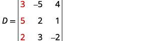 |
| :--- | :--- |
| Expand by minors using column 1. |  |
| 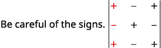 | 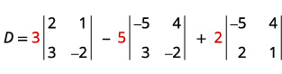 |
| Evaluate the determinants. |  |
| Simplify. |  |
| Simplify. |  |
| Simplify. |  |
| Evaluate the determinant ${D}_{x}.$ Use theconstants to replace the coefficients of *x*. | 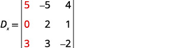 |
| Expand by minors using column 1. | 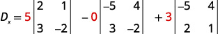 |
| Evaluate the determinants. | 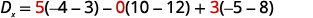 |
| Simplify. | 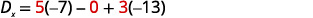 |
| Simplify. | 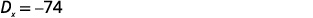 |
| Evaluate the determinant ${D}_{y}.$ Use theconstants to replace the coefficients of *y*. | 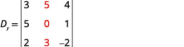 |
| 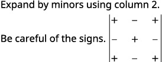 | 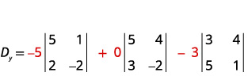 |
| Evaluate the determinants. | 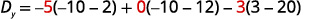 |
| Simplify. | 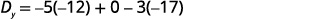 |
| Simplify. | 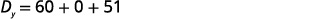 |
| Simplify. | 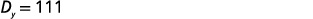 |
| Evaluate the determinant ${D}_{z}.$ Use theconstants to replace the coefficients of *z*. | 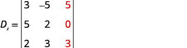 |
| 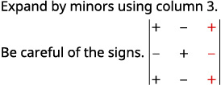 | 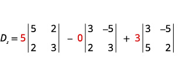 |
| Evaluate the determinants. | 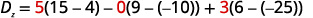 |
| Simplify. | 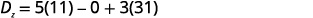 |
| Simplify. | 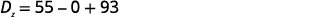 |
| Simplify. | 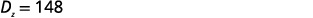 |
| Find *x*, *y*, and *z*. | 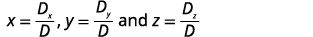 |
| Substitute in the values. | 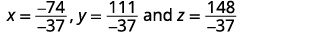 |
| Simplify. | 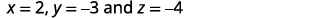 |
| Write the solution as an ordered triple. |  |
| Check that the ordered triple is a solutionto *all three* original equations. | We leave the check to you. |
|  | The solution is $\left(2,\mathrm{-3},\mathrm{-4}\right).$ |

### Practice Makes Perfect
4. Use Cramer’s Rule to solve the system of three equations.     $\left\{\begin{array}{l}3x+8y+2z=-5\\ 2x+5y-3z=0\\ x+2y-2z=-1\end{array}\right.$

We have learned how to solve systems of equations in two variables and three variables, and by multiple methods: substitution, addition, Gaussian elimination, using the inverse of a matrix, and graphing. Some of these methods are easier to apply than others and are more appropriate in certain situations. In this section, we will study two more strategies for solving systems of equations.

# Evaluating the Determinant of a 2×2 Matrix
A determinant is a real number that can be very useful in mathematics because it has multiple applications, such as calculating area, volume, and other quantities. Here, we will use determinants to reveal whether a matrix is invertible by using the entries of a **square matrix** to determine whether there is a solution to the system of equations. Perhaps one of the more interesting applications, however, is their use in cryptography. Secure signals or messages are sometimes sent encoded in a matrix. The data can only be decrypted with an **invertible matrix** and the determinant. For our purposes, we focus on the determinant as an indication of the invertibility of the matrix. Calculating the determinant of a matrix involves following the specific patterns that are outlined in this section.

>
>
> **Find the Determinant of a 2 × 2 Matrix**
>
>
>
> The **determinant** of a $2\times 2$ matrix, given
>  $$
> A=\left[\begin{array}{cc}a& b\\ c& d\end{array}\right]
> $$
>
> is defined as
>
>
>
>
> 
>
>
>
>
> Notice the change in notation. There are several ways to indicate the determinant, including $\mathrm{det}\left(A\right)$ and replacing the brackets in a matrix with straight lines, $\left|A\right|.$
>
>

5. **Finding the Determinant of a 2 × 2 Matrix**   Find the determinant of the given matrix.   $$ A=\left[\begin{array}{cc}5& 2\\ -6& 3\end{array}\right] $$

Solution

$$
\begin{array}{l}\mathrm{det}(A)=\left|\begin{array}{cc}5& 2\\ -6& 3\end{array}\right|  \\ =5(3)-(\mathrm{-6})(2)  \\ =27  \end{array}
$$

# Using Cramer’s Rule to Solve a System of Two Equations in Two Variables
We will now introduce a final method for solving systems of equations that uses determinants. Known as **Cramer’s Rule**, this technique dates back to the middle of the 18th century and is named for its innovator, the Swiss mathematician Gabriel Cramer (1704-1752), who introduced it in 1750 in Introduction à l'Analyse des lignes Courbes algébriques. Cramer’s Rule is a viable and efficient method for finding solutions to systems with an arbitrary number of unknowns, provided that we have the same number of equations as unknowns.
Cramer’s Rule will give us the unique solution to a system of equations, if it exists. However, if the system has no solution or an infinite number of solutions, this will be indicated by a determinant of zero. To find out if the system is inconsistent or dependent, another method, such as elimination, will have to be used.
To understand Cramer’s Rule, let’s look closely at how we solve systems of linear equations using basic row operations. Consider a system of two equations in two variables.
 $$
\begin{array}{c}{a}_{1}x+{b}_{1}y={c}_{1}\phantom{\rule{0.5em}{0ex}}\left(1\right)\\ {a}_{2}x+{b}_{2}y={c}_{2}\phantom{\rule{0.5em}{0ex}}\left(2\right)\end{array}
$$
We eliminate one variable using row operations and solve for the other. Say that we wish to solve for $x.$ If equation (2) is multiplied by the opposite of the coefficient of $y$ in equation (1), equation (1) is multiplied by the coefficient of $y$ in equation (2), and we add the two equations, the variable $y$ will be eliminated.
 $$
\begin{array}{l}\underset{\_\_\_\_\_\_\_\_\_\_\_\_\_\_\_\_\_\_\_\_\_\_\_\_\_\_\_\_\_\_\_\_\_\_\_\_\_\_\_\_\_\_\_\_\_\_\_\_\_\_\_\_\_\_\_\_}{\begin{array}{llll}  &   &   &   \\ {b}_{2}{a}_{1}x+{b}_{2}{b}_{1}y={b}_{2}{c}_{1}  &   &   & \text{Multiply\}{R}_{1}\phantom{\rule{0.5em}{0ex}}\text{by\}{b}_{2}  \\ -{b}_{1}{a}_{2}x-{b}_{1}{b}_{2}y=-{b}_{1}{c}_{2}  &   &   & \text{Multiply\}{R}_{2}\phantom{\rule{0.5em}{0ex}}\text{by}-{b}_{1}  \end{array}}  \\ \begin{array}{ll}\ {b}_{2}{a}_{1}x-{b}_{1}{a}_{2}x={b}_{2}{c}_{1}-{b}_{1}{c}_{2}  &   \end{array}  \end{array}
$$
Now, solve for $x.$

 $$
\begin{array}{l}{b}_{2}{a}_{1}x-{b}_{1}{a}_{2}x={b}_{2}{c}_{1}-{b}_{1}{c}_{2}  \\ x({b}_{2}{a}_{1}-{b}_{1}{a}_{2})={b}_{2}{c}_{1}-{b}_{1}{c}_{2}  \\ \text{\ \ \ \ \ \ \ \ \ \ \ \ \ \ \ \ \ \ \ \ \ \}x=\frac{{b}_{2}{c}_{1}-{b}_{1}{c}_{2}}{{b}_{2}{a}_{1}-{b}_{1}{a}_{2}}=\frac{\left|\begin{array}{cc}{c}_{1}& {b}_{1}\\ {c}_{2}& {b}_{2}\end{array}\right|}{\left|\begin{array}{cc}{a}_{1}& {b}_{1}\\ {a}_{2}& {b}_{2}\end{array}\right|}  \end{array}
$$
Similarly, to solve for $y,$ we will eliminate $x.$

 $$
\begin{array}{l}\underset{\_\_\_\_\_\_\_\_\_\_\_\_\_\_\_\_\_\_\_\_\_\_\_\_\_\_\_\_\_\_\_\_\_\_\_\_\_\_\_\_\_\_\_\_\_\_\_\_\_\_\_\_\_\_\_\_}{\begin{array}{llll}  &   &   &   \\ {a}_{2}{a}_{1}x+{a}_{2}{b}_{1}y={a}_{2}{c}_{1}  &   &   & \text{Multiply\}{R}_{1}\phantom{\rule{0.5em}{0ex}}\text{by\}{a}_{2}  \\ -{a}_{1}{a}_{2}x-{a}_{1}{b}_{2}y=-{a}_{1}{c}_{2}  &   &   & \text{Multiply\}{R}_{2}\phantom{\rule{0.5em}{0ex}}\text{by}-{a}_{1}  \end{array}}  \\ \begin{array}{ll}{a}_{2}{b}_{1}y-{a}_{1}{b}_{2}y={a}_{2}{c}_{1}-{a}_{1}{c}_{2}  &   \end{array}  \end{array}
$$
Solving for $y$ gives
 $$
\begin{array}{l}{a}_{2}{b}_{1}y-{a}_{1}{b}_{2}y={a}_{2}{c}_{1}-{a}_{1}{c}_{2}  \\ y({a}_{2}{b}_{1}-{a}_{1}{b}_{2})={a}_{2}{c}_{1}-{a}_{1}{c}_{2}  \\ \text{\ \ \ \ \ \ \ \ \ \ \ \ \ \ \ \ \ \ \ \ \ \ \}y=\frac{{a}_{2}{c}_{1}-{a}_{1}{c}_{2}}{{a}_{2}{b}_{1}-{a}_{1}{b}_{2}}=\frac{{a}_{1}{c}_{2}-{a}_{2}{c}_{1}}{{a}_{1}{b}_{2}-{a}_{2}{b}_{1}}=\frac{\left|\begin{array}{cc}{a}_{1}& {c}_{1}\\ {a}_{2}& {c}_{2}\end{array}\right|}{\left|\begin{array}{cc}{a}_{1}& {b}_{1}\\ {a}_{2}& {b}_{2}\end{array}\right|}  \end{array}
$$
Notice that the denominator for both $x$ and $y$ is the determinant of the coefficient matrix.
We can use these formulas to solve for $x$ and $y,$ but Cramer’s Rule also introduces new notation:
 $D:$ determinant of the coefficient matrix
 ${D}_{x}:$ determinant of the numerator in the solution of $x$  $$
x=\frac{{D}_{x}}{D}
$$

 ${D}_{y}:$ determinant of the numerator in the solution of $y$
 $y=\frac{{D}_{y}}{D}$

The key to Cramer’s Rule is replacing the variable column of interest with the constant column and calculating the determinants. We can then express $x$ and $y$ as a quotient of two determinants.

>
>
> **Cramer’s Rule for 2×2 Systems**
>
>
>
> **Cramer’s Rule** is a method that uses determinants to solve systems of equations that have the same number of equations as variables.
>
> Consider a system of two linear equations in two variables.
>
>  $$
> \begin{array}{c}{a}_{1}x+{b}_{1}y={c}_{1}\\ {a}_{2}x+{b}_{2}y={c}_{2}\end{array}
> $$
>
> The solution using Cramer’s Rule is given as
>
>  $$
> x=\frac{{D}_{x}}{D}=\frac{\left|\begin{array}{cc}{c}_{1}& {b}_{1}\\ {c}_{2}& {b}_{2}\end{array}\right|}{\left|\begin{array}{cc}{a}_{1}& {b}_{1}\\ {a}_{2}& {b}_{2}\end{array}\right|},\phantom{\rule{0.5em}{0ex}}D\ne 0;\phantom{\rule{0.5em}{0ex}}\text{}\text{}\phantom{\rule{0.5em}{0ex}}y=\frac{{D}_{y}}{D}=\frac{\left|\begin{array}{cc}{a}_{1}& {c}_{1}\\ {a}_{2}& {c}_{2}\end{array}\right|}{\left|\begin{array}{cc}{a}_{1}& {b}_{1}\\ {a}_{2}& {b}_{2}\end{array}\right|},\phantom{\rule{0.5em}{0ex}}D\ne 0.
> $$
>
> If we are solving for $x,$ the $x$ column is replaced with the constant column. If we are solving for $y,$ the $y$ column is replaced with the constant column.
>

6. **Using Cramer’s Rule to Solve a 2 × 2 System**   Solve the following $2\times 2$ system using Cramer’s Rule.     $$ \begin{array}{c}12x+3y=15\\ \text\ 2x-3y=13\end{array} $$

Solution

Solve for $x.$

   $$
x=\frac{{D}_{x}}{D}=\frac{\left|\begin{array}{rr}  15&   3\\   13&   -3\end{array}\right|}{\left|\begin{array}{rr}  12&   3\\   2&   -3\end{array}\right|}=\frac{-45-39}{-36-6}=\frac{-84}{-42}=2
$$
Solve for $y.$

   $$
y=\frac{{D}_{y}}{D}=\frac{\left|\begin{array}{rr}  12&   15\\   2&   13\end{array}\right|}{\left|\begin{array}{rr}  12&   3\\   2&   -3\end{array}\right|}=\frac{156-30}{-36-6}=-\frac{126}{42}=\mathrm{-3}
$$
The solution is $\left(2,\mathrm{-3}\right).$

>
> try it feature
> 7. Use Cramer’s Rule to solve the 2 × 2 system of equations.  $$ \begin{array}{l}\text\ x+2y=\mathrm{-11}  \\ -2x+y=\mathrm{-13}  \end{array} $$
>
> 

> 
Solution

>
> $\left(3,-7\right)$
> 

>

# Evaluating the Determinant of a 3 × 3 Matrix
Finding the determinant of a 2×2 matrix is straightforward, but finding the determinant of a 3×3 matrix is more complicated. One method is to augment the 3×3 matrix with a repetition of the first two columns, giving a 3×5 matrix. Then we calculate the sum of the products of entries *down* each of the three diagonals (upper left to lower right), and subtract the products of entries *up* each of the three diagonals (lower left to upper right). This is more easily understood with a visual and an example.
Find the **determinant** of the 3×3 matrix.
 $$
A=\left[\begin{array}{ccc}{a}_{1}& {b}_{1}& {c}_{1}\\ {a}_{2}& {b}_{2}& {c}_{2}\\ {a}_{3}& {b}_{3}& {c}_{3}\end{array}\right]
$$
Augment $A$ with the first two columns.
   $$
\mathrm{det}(A)=\left|\begin{array}{ccc}{a}_{1}& {b}_{1}& {c}_{1}\\ {a}_{2}& {b}_{2}& {c}_{2}\\ {a}_{3}& {b}_{3}& {c}_{3}\end{array}|\begin{array}{c}{a}_{1}\\ {a}_{2}\\ {a}_{3}\end{array}\begin{array}{c}{b}_{1}\\ {b}_{2}\\ {b}_{3}\end{array}\right|
$$

From upper left to lower right: Multiply the entries down the first diagonal. Add the result to the product of entries down the second diagonal. Add this result to the product of the entries down the third diagonal.
From lower left to upper right: Subtract the product of entries up the first diagonal. From this result subtract the product of entries up the second diagonal. From this result, subtract the product of entries up the third diagonal.

The algebra is as follows:
 $$
\left|A\right|={a}_{1}{b}_{2}{c}_{3}+{b}_{1}{c}_{2}{a}_{3}+{c}_{1}{a}_{2}{b}_{3}-{a}_{3}{b}_{2}{c}_{1}-{b}_{3}{c}_{2}{a}_{1}-{c}_{3}{a}_{2}{b}_{1}
$$

8. **Finding the Determinant of a 3 × 3 Matrix**   Find the determinant of the 3 × 3 matrix given     $$ A=\left[\begin{array}{ccc}0& 2& 1\\ 3& -1& 1\\ 4& 0& 1\end{array}\right] $$

Solution

Augment the matrix with the first two columns and then follow the formula. Thus,

   $$
\begin{array}{l}\left|A\right|=\left|\begin{array}{ccc}0& 2& 1\\ 3& -1& 1\\ 4& 0& 1\end{array}|\begin{array}{c}0\\ 3\\ 4\end{array}\begin{array}{c}2\\ -1\\ 0\end{array}\right|  \\ =0\left(-1\right)\left(1\right)+2\left(1\right)\left(4\right)+1\left(3\right)\left(0\right)-4\left(-1\right)\left(1\right)-0\left(1\right)\left(0\right)-1\left(3\right)\left(2\right)  \\ =0+8+0+4-0-6  \\ =6  \end{array}
$$

>
> try it feature
> 9. Find the determinant of the 3 × 3 matrix.  $$ \mathrm{det}(A)=\left|\begin{array}{ccc}1& -3& 7\\ 1& 1& 1\\ 1& -2& 3\end{array}\right| $$
>
> 

> 
Solution

>
> $-10$
> 

>

>
> qa feature
> *Can we use the same method to find the determinant of a larger matrix?*
>
> *No, this method only works for $2\times 2$ and $\text{3}\times 3$ matrices. For larger matrices it is best to use a graphing utility or computer software.*

# Using Cramer’s Rule to Solve a System of Three Equations in Three Variables
Now that we can find the **determinant** of a 3 × 3 matrix, we can apply **Cramer’s Rule** to solve a **system of three equations in three variables**. Cramer’s Rule is straightforward, following a pattern consistent with Cramer’s Rule for 2 × 2 matrices. As the order of the matrix increases to 3 × 3, however, there are many more calculations required.
When we calculate the determinant to be zero, Cramer’s Rule gives no indication as to whether the system has no solution or an infinite number of solutions. To find out, we have to perform elimination on the system.
Consider a 3 × 3 system of equations.

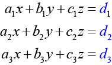

 $$
x=\frac{{D}_{x}}{D},y=\frac{{D}_{y}}{D},z=\frac{{D}_{z}}{D},D\ne 0
$$
where

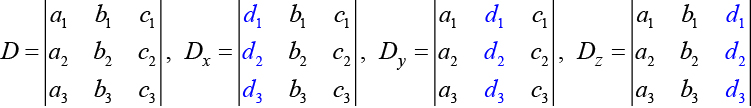

If we are writing the determinant ${D}_{x},$ we replace the $x$ column with the constant column. If we are writing the determinant ${D}_{y},$ we replace the $y$ column with the constant column. If we are writing the determinant ${D}_{z},$ we replace the $z$ column with the constant column. Always check the answer.

10. **Solving a 3 × 3 System Using Cramer’s Rule**   Find the solution to the given 3 × 3 system using Cramer’s Rule.     $$ \begin{array}{c}x+y-z=6\\ 3x-2y+z=\mathrm{-5}\\ x+3y-2z=14\end{array} $$

Solution

Use Cramer’s Rule.

   $$
D=\left|\begin{array}{ccc}1& 1& -1\\ 3& -2& 1\\ 1& 3& -2\end{array}\right|,{D}_{x}=\left|\begin{array}{ccc}6& 1& -1\\ -5& -2& 1\\ 14& 3& -2\end{array}\right|,{D}_{y}=\left|\begin{array}{ccc}1& 6& -1\\ 3& -5& 1\\ 1& 14& -2\end{array}\right|,{D}_{z}=\left|\begin{array}{ccc}1& 1& 6\\ 3& -2& -5\\ 1& 3& 14\end{array}\right|
$$

Then,

   $$
\begin{array}{l}x=\frac{{D}_{x}}{D}=\frac{-3}{-3}=1  \\ y=\frac{{D}_{y}}{D}=\frac{-9}{-3}=3  \\ z=\frac{{D}_{z}}{D}=\frac{6}{-3}=-2  \end{array}
$$
The solution is $\left(1,3,\mathrm{-2}\right).$

>
> try it feature
> 11. Use Cramer’s Rule to solve the 3 × 3 matrix.  $$ \begin{array}{r}  x-3y+7z=13\\   x+y+z=1\\   x-2y+3z=4\end{array} $$
>
> 

> 
Solution

>
> $\left(-2,\frac{3}{5},\frac{12}{5}\right)$
> 

>

12. **Using Cramer’s Rule to Solve an Inconsistent System**   Solve the system of equations using Cramer’s Rule.     $$ \begin{array}{l}3x-2y=4\text{\hspace{1em}}(1)\\ 6x-4y=0\text{\hspace{1em}}(2)\end{array} $$

Solution

We begin by finding the determinants $D,{D}_{x},\text{and\}{D}_{y}.$

   $$
D=\left|\begin{array}{cc}3& -2\\ 6& -4\end{array}\right|=3\left(-4\right)-6\left(-2\right)=0
$$

We know that a determinant of zero means that either the system has no solution or it has an infinite number of solutions. To see which one, we use the process of elimination. Our goal is to eliminate one of the variables.

Multiply equation (1) by $\mathrm{-2.}$ 
Add the result to equation $\left(2\right).$

 $$
\begin{array}{l}\underset{\_\_\_\_\_\_\_\_\_\_\_\_\_\_\_}{\begin{array}{l}\begin{array}{l}  \\ -6x+4y\phantom{\rule{0.5em}{0ex}}=\mathrm{-8}  \end{array}  \\ 6x-4y=0  \end{array}}  \\ 0=\mathrm{-8}  \end{array}
$$
We obtain the equation $0=\mathrm{-8},$ which is false. Therefore, the system has no solution. Graphing the system reveals two parallel lines. See .

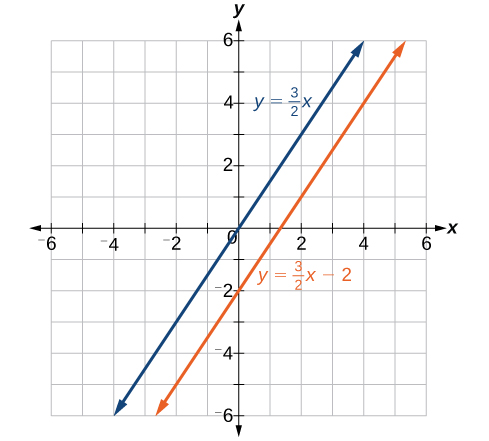

13. **Use Cramer’s Rule to Solve a Dependent System**   Solve the system with an infinite number of solutions.     $$ \begin{array}{rr}  x-2y+3z=0&   (1)\\   3x+y-2z=0&   (2)\\   2x-4y+6z=0&   (3)\end{array} $$

Solution

Let’s find the determinant first. Set up a matrix augmented by the first two columns.

   $$
\left|\begin{array}{rrr}  1&   \mathrm{-2}&   3\\   3&   1&   \mathrm{-2}\\   2&   \mathrm{-4}&   6\end{array}\text{\ \}|\text{\ \}\begin{array}{rr}  1&   \mathrm{-2}\\   3&   1\\   2&   \mathrm{-4}\end{array}\right|
$$
Then,

   $$
1\left(1\right)\left(6\right)+\left(-2\right)\left(-2\right)\left(2\right)+3\left(3\right)\left(-4\right)-2\left(1\right)\left(3\right)-\left(-4\right)\left(-2\right)\left(1\right)-6\left(3\right)\left(-2\right)=0
$$

As the determinant equals zero, there is either no solution or an infinite number of solutions. We have to perform elimination to find out.

Multiply equation (1) by $\mathrm{-2}$ and add the result to equation (3):
   $$
\frac{\begin{array}{r}  -2x+4y-6z=0\\   2x-4y+6z=0\end{array}}{0=0}
$$

Obtaining an answer of $0=0,$ a statement that is always true, means that the system has an infinite number of solutions. Graphing the system, we can see that two of the planes are the same and they both intersect the third plane on a line. See .

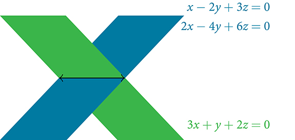

# Understanding Properties of Determinants
There are many **properties of determinants**. Listed here are some properties that may be helpful in calculating the determinant of a matrix.

>
> a general note label
>
>
> **Properties of Determinants**
>
>
> If the matrix is in upper triangular form, the determinant equals the product of entries down the main diagonal.
> When two rows are interchanged, the determinant changes sign.
> If either two rows or two columns are identical, the determinant equals zero.
> If a matrix contains either a row of zeros or a column of zeros, the determinant equals zero.
> The determinant of an inverse matrix ${A}^{-1}$ is the reciprocal of the determinant of the matrix $A.$ 
> If any row or column is multiplied by a constant, the determinant is multiplied by the same factor.

14. **Illustrating Properties of Determinants**   Illustrate each of the properties of determinants.

Solution

Property 1 states that if the matrix is in upper triangular form, the determinant is the product of the entries down the main diagonal.

   $$
A=\left[\begin{array}{rrr}  1&   2&   3\\   0&   2&   1\\   0&   0&   -1\end{array}\right]
$$
Augment $A$ with the first two columns.

   $$
A=\left[\begin{array}{ccc}1& 2& 3\\ 0& 2& 1\\ 0& 0& -1\end{array}|\begin{array}{c}1\\ 0\\ 0\end{array}\begin{array}{c}2\\ 2\\ 0\end{array}\right]
$$

Then

   $$
\begin{array}{l}\mathrm{det}(A)=1(2)(\mathrm{-1})+2(1)(0)+3(0)(0)-0(2)(3)-0(1)(1)+1(0)(2)  \\ =\mathrm{-2}  \end{array}
$$
Property 2 states that interchanging rows changes the sign. Given

 $$
\begin{array}{l}\begin{array}{l}\\ A=\left[\begin{array}{cc}\mathrm{-1}& 5\\ 4& \mathrm{-3}\end{array}\right],\phantom{\rule{0.5em}{0ex}}\mathrm{det}(A)=(\mathrm{-1})(\mathrm{-3})-(4)(5)=3-20=\mathrm{-17}\end{array}  \\   \\ B=\left[\begin{array}{cc}4& -3\\ -1& 5\end{array}\right],\phantom{\rule{0.5em}{0ex}}\mathrm{det}(B)=(4)(5)-(\mathrm{-1})(\mathrm{-3})=20-3=17  \end{array}
$$
Property 3 states that if two rows or two columns are identical, the determinant equals zero.

   $$
\begin{array}{l}A=\left[\begin{array}{ccc}1& 2& 2\\ 2& 2& 2\\ \mathrm{-1}& 2& 2\end{array}\phantom{\rule{0.5em}{0ex}}\text\ |\phantom{\rule{0.5em}{0ex}}\text\ \begin{array}{c}1\\ 2\\ \mathrm{-1}\end{array}\ \begin{array}{c}2\\ 2\\ 2\end{array}\right]  \\   \\ \mathrm{det}(A)=1(2)(2)+2(2)(\mathrm{-1})+2(2)(2)+1(2)(2)-2(2)(1)-2(2)(2)  \\ =4-4+8+4-4-8=0  \end{array}
$$
Property 4 states that if a row or column equals zero, the determinant equals zero. Thus,

   $$
A=\left[\begin{array}{cc}1& 2\\ 0& 0\end{array}\right],\phantom{\rule{0.5em}{0ex}}\mathrm{det}(A)=1\left(0\right)-2\left(0\right)=0
$$

Property 5 states that the determinant of an inverse matrix ${A}^{-1}$ is the reciprocal of the determinant $A.$ Thus,
 $$
\begin{array}{l}A=\left[\begin{array}{cc}1& 2\\ 3& 4\end{array}\right],\mathrm{det}\left(A\right)=1\left(4\right)-3\left(2\right)=\mathrm{-2}  \\   \\ {A}^{-1}=\left[\begin{array}{cc}-2& 1\\ \frac{3}{2}& -\frac{1}{2}\end{array}\right],\mathrm{det}\left({A}^{-1}\right)=-2\left(-\frac{1}{2}\right)-\left(\frac{3}{2}\right)\left(1\right)=-\frac{1}{2}  \end{array}
$$
Property 6 states that if any row or column of a matrix is multiplied by a constant, the determinant is multiplied by the same factor. Thus,

   $$
\begin{array}{l}A=\left[\begin{array}{cc}1& 2\\ 3& 4\end{array}\right],\mathrm{det}\left(A\right)=1\left(4\right)-2\left(3\right)=\mathrm{-2}  \\   \\ B=\left[\begin{array}{cc}2\left(1\right)& 2\left(2\right)\\ 3& 4\end{array}\right],\mathrm{det}\left(B\right)=2\left(4\right)-3\left(4\right)=\mathrm{-4}  \end{array}
$$

15. **Using Cramer’s Rule and Determinant Properties to Solve a System**   Find the solution to the given 3 × 3 system.  $$ \begin{array}{ll}2x+4y+4z=2  & (1)  \\ 3x+7y+7z=\mathrm{-5}  & (2)  \\ \text\ x+2y+2z=4  & (3)  \end{array} $$

Solution

Using **Cramer’s Rule**, we have

   $$
D=\left|\begin{array}{ccc}2& 4& 4\\ 3& 7& 7\\ 1& 2& 2\end{array}\right|
$$
Notice that the second and third columns are identical. According to Property 3, the determinant will be zero, so there is either no solution or an infinite number of solutions. We have to perform elimination to find out.

Multiply equation (3) by –2 and add the result to equation (1).
   $$
\frac{\begin{array}{l}-2x-4y-4x=-8  \\ \phantom{\rule{0.5em}{0ex}}\text{\ \}2x+4y+4z=2\phantom{\rule{0.5em}{0ex}}  \end{array}}{\phantom{\rule{0.5em}{0ex}}0=-6}
$$
Obtaining a statement that is a contradiction means that the system has no solution.

>
> media feature label
> Access these online resources for additional instruction and practice with Cramer’s Rule.
>
> Solve a System of Two Equations Using Cramer's Rule
> Solve a Systems of Three Equations using Cramer's Rule

# Key Concepts
The determinant for $\left[\begin{array}{cc}a& b\\ c& d\end{array}\right]$ is $ad-bc.$ See .

Cramer’s Rule replaces a variable column with the constant column. Solutions are $x=\frac{{D}_{x}}{D},y=\frac{{D}_{y}}{D}.$ See .

To find the determinant of a 3×3 matrix, augment with the first two columns. Add the three diagonal entries (upper left to lower right) and subtract the three diagonal entries (lower left to upper right). See .

To solve a system of three equations in three variables using Cramer’s Rule, replace a variable column with the constant column for each desired solution: $x=\frac{{D}_{x}}{D},y=\frac{{D}_{y}}{D},z=\frac{{D}_{z}}{D}.$ See .
Cramer’s Rule is also useful for finding the solution of a system of equations with no solution or infinite solutions. See  and .

Certain properties of determinants are useful for solving problems. For example:

If the matrix is in upper triangular form, the determinant equals the product of entries down the main diagonal.
When two rows are interchanged, the determinant changes sign.
If either two rows or two columns are identical, the determinant equals zero.
If a matrix contains either a row of zeros or a column of zeros, the determinant equals zero.
The determinant of an inverse matrix ${A}^{-1}$ is the reciprocal of the determinant of the matrix $A.$

If any row or column is multiplied by a constant, the determinant is multiplied by the same factor. See  and .

# Section Exercises

## Verbal
1. Explain why we can always evaluate the determinant of a square matrix.

Solution

A determinant is the sum and products of the entries in the matrix, so you can always evaluate that product—even if it does end up being 0.

2. Examining Cramer’s Rule, explain why there is no unique solution to the system when the determinant of your matrix is 0. For simplicity, use a $2\times 2$ matrix.

3. Explain what it means in terms of an inverse for a matrix to have a 0 determinant.

Solution

The inverse does not exist.

4. The determinant of $2\times 2$ matrix $A$ is 3. If you switch the rows and multiply the first row by 6 and the second row by 2, explain how to find the determinant and provide the answer.

## Algebraic
For the following exercises, find the determinant.
5. $\left|\begin{array}{cc}1& 2\\ 3& 4\end{array}\right|$

Solution

$-2$

6. $\left|\begin{array}{rr}  -1&   2\\   3&   -4\end{array}\right|$

7. $\left|\begin{array}{rr}  2&   -5\\   -1&   6\end{array}\right|$

Solution

$7$

8. $\left|\begin{array}{cc}-8& 4\\ -1& 5\end{array}\right|$

9. $\left|\begin{array}{rr}  1&   0\\   3&   -4\end{array}\right|$

Solution

$-4$

10. $\left|\begin{array}{rr}  10&   20\\   0&   -10\end{array}\right|$

11. $\left|\begin{array}{cc}10& 0.2\\ 5& 0.1\end{array}\right|$

Solution

$0$

12. $\left|\begin{array}{rr}  6&   -3\\   8&   4\end{array}\right|$

13. $\left|\begin{array}{rr}  -2&   -3\\   3.1&   4,000\end{array}\right|$

Solution

$-7,990.7$

14. $\left|\begin{array}{rr}  -1.1&   0.6\\   7.2&   -0.5\end{array}\right|$

15. $\left|\begin{array}{rrr}  -1&   0&   0\\   0&   1&   0\\   0&   0&   -3\end{array}\right|$

Solution

$3$

16. $\left|\begin{array}{rrr}  -1&   4&   0\\   0&   2&   3\\   0&   0&   -3\end{array}\right|$

17. $\left|\begin{array}{ccc}1& 0& 1\\ 0& 1& 0\\ 1& 0& 0\end{array}\right|$

Solution

$-1$

18. $\left|\begin{array}{rrr}  2&   -3&   1\\   3&   -4&   1\\   -5&   6&   1\end{array}\right|$

19. $\left|\begin{array}{rrr}  -2&   1&   4\\   -4&   2&   -8\\   2&   -8&   -3\end{array}\right|$

Solution

$224$

20. $\left|\begin{array}{rrr}  6&   -1&   2\\   -4&   -3&   5\\   1&   9&   -1\end{array}\right|$

21. $\left|\begin{array}{rrr}  5&   1&   -1\\   2&   3&   1\\   3&   -6&   -3\end{array}\right|$

Solution

$15$

22. $\left|\begin{array}{rrr}  1.1&   2&   -1\\   -4&   0&   0\\   4.1&   -0.4&   2.5\end{array}\right|$

23. $\left|\begin{array}{rrr}  2&   -1.6&   3.1\\   1.1&   3&   -8\\   -9.3&   0&   2\end{array}\right|$

Solution

$-17.03$

24. $\left|\begin{array}{ccc}-\frac{1}{2}& \frac{1}{3}& \frac{1}{4}\\ \frac{1}{5}& -\frac{1}{6}& \frac{1}{7}\\ 0& 0& \frac{1}{8}\end{array}\right|$

For the following exercises, solve the system of linear equations using Cramer’s Rule.
25. $\begin{array}{l}2x-3y=\mathrm{-1}\\ 4x+5y=9\end{array}$

Solution

$\left(1,1\right)$

26. $\begin{array}{r}5x-4y=2\\ -4x+7y=6\end{array}$

27. $\begin{array}{l}6x-3y=2  \\ -8x+9y=\mathrm{-1}  \end{array}$

Solution

$\left(\frac{1}{2},\frac{1}{3}\right)$

28. $\begin{array}{l}2x+6y=12\\ 5x-2y=13\end{array}$

29. $\begin{array}{l}4x+3y=23  \\ 2x-y=\mathrm{-1}  \end{array}$

Solution

$\left(2,5\right)$

30. $\begin{array}{l}10x-6y=2  \\ -5x+8y=\mathrm{-1}  \end{array}$

31. $\begin{array}{l}4x-3y=\mathrm{-3}\\ 2x+6y=\mathrm{-4}\end{array}$

Solution

$\left(-1,-\frac{1}{3}\right)$

32. $\begin{array}{r}4x-5y=7\\ -3x+9y=0\end{array}$

33. $\begin{array}{l}4x+10y=180  \\ -3x-5y=\mathrm{-105}  \end{array}$

Solution

$\left(15,12\right)$

34. $\begin{array}{l}8x-2y=\mathrm{-3}  \\ -4x+6y=4  \end{array}$

For the following exercises, solve the system of linear equations using Cramer’s Rule.
35. $\begin{array}{l}x+2y-4z=-1  \\ 7x+3y+5z=26  \\ -2x-6y+7z=-6  \end{array}$

Solution

$\left(1,3,2\right)$

36. $\begin{array}{l}-5x+2y-4z=-47  \\ 4x-3y-z=-94  \\ 3x-3y+2z=94  \end{array}$

37. $\begin{array}{l}4x+5y-z=\mathrm{-7}  \\ \mathrm{-2}x-9y+2z=8  \\ 5y+7z=21  \end{array}$

Solution

$\left(-1,0,3\right)$

38. $\begin{array}{r}4x-3y+4z=10\\ 5x-2z=-2\\ 3x+2y-5z=-9\end{array}$

39. $\begin{array}{l}4x-2y+3z=6  \\ -6x+y=-2  \\ 2x+7y+8z=24  \end{array}$

Solution

$\left(\frac{1}{2},1,2\right)$

40. $\begin{array}{r}  5x+2y-z=1\\   -7x-8y+3z=1.5\\   6x-12y+z=7\end{array}$

41. $\begin{array}{l}13x-17y+16z=73  \\ -11x+15y+17z=61  \\ 46x+10y-30z=-18  \end{array}$

Solution

$\left(2,1,4\right)$

42. $\begin{array}{l}  \\ -4x-3y-8z=-7  \\ 2x-9y+5z=0.5  \\ 5x-6y-5z=-2  \end{array}$

43. $\begin{array}{l}4x-6y+8z=10  \\ -2x+3y-4z=-5  \\ x+y+z=1  \end{array}$

Solution

Infinite solutions

44. $\begin{array}{r}  4x-6y+8z=10\\   -2x+3y-4z=-5\\   12x+18y-24z=-30\end{array}$

## Technology
For the following exercises, use the determinant function on a graphing utility.
45. $\left|\begin{array}{rrrr}  1&   0&   8&   9\\   0&   2&   1&   0\\   1&   0&   3&   0\\   0&   2&   4&   3\end{array}\right|$

Solution

$24$

46. $\left|\begin{array}{rrrr}  1&   0&   2&   1\\   0&   \mathrm{-9}&   1&   3\\   3&   0&   \mathrm{-2}&   \mathrm{-1}\\   0&   1&   1&   \mathrm{-2}\end{array}\right|$

47. $\left|\begin{array}{rrrr}  \frac{1}{2}&   1&   7&   4\\   0&   \frac{1}{2}&   100&   5\\   0&   0&   2&   \mathrm{2,000}\\   0&   0&   0&   2\end{array}\right|$

Solution

$1$

48. $\left|\begin{array}{rrrr}  1&   0&   0&   0\\   2&   3&   0&   0\\   4&   5&   6&   0\\   7&   8&   9&   0\end{array}\right|$

## Real-World Applications
For the following exercises, create a system of linear equations to describe the behavior. Then, calculate the determinant. Will there be a unique solution? If so, find the unique solution.
49. Two numbers add up to 56. One number is 20 less than the other.

Solution

Yes; 18, 38

50. Two numbers add up to 104. If you add two times the first number plus two times the second number, your total is 208

51. Three numbers add up to 106. The first number is 3 less than the second number. The third number is 4 more than the first number.

Solution

Yes; 33, 36, 37

52. Three numbers add to 216. The sum of the first two numbers is 112. The third number is 8 less than the first two numbers combined.

For the following exercises, create a system of linear equations to describe the behavior. Then, solve the system for all solutions using Cramer’s Rule.
53. You invest $10,000 into two accounts, which receive 8% interest and 5% interest. At the end of a year, you had $10,710 in your combined accounts. How much was invested in each account?

Solution

$7,000 in first account, $3,000 in second account.

54. You invest $80,000 into two accounts, $22,000 in one account, and $58,000 in the other account. At the end of one year, assuming simple interest, you have earned $2,470 in interest. The second account receives half a percent less than twice the interest on the first account. What are the interest rates for your accounts?

55. A theater needs to know how many adult tickets and children tickets were sold out of the 1,200 total tickets. If children’s tickets are $5.95, adult tickets are $11.15, and the total amount of revenue was $12,756, how many children’s tickets and adult tickets were sold?

Solution

120 children, 1,080 adult

56. A concert venue sells single tickets for $40 each and couple’s tickets for $65. If the total revenue was $18,090 and the 321 tickets were sold, how many single tickets and how many couple’s tickets were sold?

57. You decide to paint your kitchen green. You create the color of paint by mixing yellow and blue paints. You cannot remember how many gallons of each color went into your mix, but you know there were 10 gal total. Additionally, you kept your receipt, and know the total amount spent was $29.50. If each gallon of yellow costs $2.59, and each gallon of blue costs $3.19, how many gallons of each color go into your green mix?

Solution

4 gal yellow, 6 gal blue

58. You sold two types of scarves at a farmers’ market and would like to know which one was more popular. The total number of scarves sold was 56, the yellow scarf cost $10, and the purple scarf cost $11. If you had total revenue of $583, how many yellow scarves and how many purple scarves were sold?

59. Your garden produced two types of tomatoes, one green and one red. The red weigh 10 oz, and the green weigh 4 oz. You have 30 tomatoes, and a total weight of 13 lb, 14 oz. How many of each type of tomato do you have?

Solution

13 green tomatoes, 17 red tomatoes

60. At a market, the three most popular vegetables make up 53% of vegetable sales. Corn has 4% higher sales than broccoli, which has 5% more sales than onions. What percentage does each vegetable have in the market share?

61. At the same market, the three most popular fruits make up 37% of the total fruit sold. Strawberries sell twice as much as oranges, and kiwis sell one more percentage point than oranges. For each fruit, find the percentage of total fruit sold.

Solution

Strawberries 18%, oranges 9%, kiwi 10%

62. Three artists performed at a concert venue. The first one charged $15 per ticket, the second artist charged $45 per ticket, and the final one charged $22 per ticket. There were 510 tickets sold, for a total of $12,700. If the first band had 40 more audience members than the second band, how many tickets were sold for each band?

63. A movie theatre sold tickets to three movies. The tickets to the first movie were $5, the tickets to the second movie were $11, and the third movie was $12. 100 tickets were sold to the first movie. The total number of tickets sold was 642, for a total revenue of $6,774. How many tickets for each movie were sold?

Solution

100 for movie 1, 230 for movie 2, 312 for movie 3

For the following exercises, use this scenario: A health-conscious company decides to make a trail mix out of almonds, dried cranberries, and chocolate-covered cashews. The nutritional information for these items is shown in .

|  | Fat (g) | Protein (g) | Carbohydrates (g) |
| :--- | :--- | :--- | :--- |
| *Almonds (10)* | 6 | 2 | 3 |
| *Cranberries (10)* | 0.02 | 0 | 8 |
| *Cashews (10)* | 7 | 3.5 | 5.5 |

64. For the special “low-carb”trail mix, there are 1,000 pieces of mix. The total number of carbohydrates is 425 g, and the total amount of fat is 570.2 g. If there are 200 more pieces of cashews than cranberries, how many of each item is in the trail mix?

65. For the “hiking” mix, there are 1,000 pieces in the mix, containing 390.8 g of fat, and 165 g of protein. If there is the same amount of almonds as cashews, how many of each item is in the trail mix?

Solution

300 almonds, 400 cranberries, 300 cashews

66. For the “energy-booster” mix, there are 1,000 pieces in the mix, containing 145 g of protein and 625 g of carbohydrates. If the number of almonds and cashews summed together is equivalent to the amount of cranberries, how many of each item is in the trail mix?

# Review Exercises

## Systems of Linear Equations: Two Variables
For the following exercises, determine whether the ordered pair is a solution to the system of equations.
16. $\begin{array}{l}3x-y=4\\ x+4y=-3\end{array}$ and $(-1,1)$

Solution

No

17. $\begin{array}{l}6x-2y=24\\ -3x+3y=18\end{array}$ and $(9,15)$

For the following exercises, use substitution to solve the system of equations.
18. $\begin{array}{l}10x+5y=\mathrm{-5}  \\ 3x-2y=\mathrm{-12}  \end{array}$

Solution

$\left(-2,3\right)$

19. $\begin{array}{l}\frac{4}{7}x+\frac{1}{5}y=\frac{43}{70}\\ \frac{5}{6}x-\frac{1}{3}y=-\frac{2}{3}\end{array}$

20. $\begin{array}{l}5x+6y=14\\ 4x+8y=8\end{array}$

Solution

$\left(4,-1\right)$

For the following exercises, use addition to solve the system of equations.
21. $\begin{array}{l}3x+2y=\mathrm{-7}\\ 2x+4y=6\end{array}$

22. $\begin{array}{r}3x+4y=2\\ 9x+12y=3\end{array}$

Solution

No solutions exist.

23. $\begin{array}{l}8x+4y=2\\ 6x-5y=0.7\end{array}$

For the following exercises, write a system of equations to solve each problem. Solve the system of equations.
24. A factory has a cost of production $C(x)=150x+15\text{,}000$ and a revenue function $R(x)=200x.$ What is the break-even point?

Solution

$(300,60,000)$

25. A performer charges $C(x)=50x+10\text{,}000,$ where $x$ is the total number of attendees at a show. The venue charges $75 per ticket. After how many people buy tickets does the venue break even, and what is the value of the total tickets sold at that point?

## Systems of Linear Equations: Three Variables
For the following exercises, solve the system of three equations using substitution or addition.
26. $\begin{array}{l}0.5x-0.5y=10  \\ -0.2y+0.2x=4  \\ 0.1x+0.1z=2  \end{array}$

Solution

Infinite solutions

27. $\begin{array}{r}  5x+3y-z=5\\   3x-2y+4z=13\\   4x+3y+5z=22\end{array}$

28. $\begin{array}{r}x+y+z=1\\ 2x+2y+2z=1\\ 3x+3y=2\end{array}$

Solution

No solutions exist.

29. $\begin{array}{l}2x-3y+z=\mathrm{-1}  \\ x+y+z=\mathrm{-4}  \\ 4x+2y-3z=33  \end{array}$

30. $\begin{array}{l}3x+2y-z=\mathrm{-10}  \\ x-y+2z=7  \\ -x+3y+z=\mathrm{-2}  \end{array}$

Solution

$\left(-1,-2,3\right)$

31. $\begin{array}{r}  3x+4z=\mathrm{-11}\\   x-2y=5\\   4y-z=\mathrm{-10}\end{array}$

32. $\begin{array}{r}2x-3y+z=0\\ 2x+4y-3z=0\\ 6x-2y-z=0\end{array}$

Solution

$\left(x,\frac{8x}{5},\frac{14x}{5}\right)$

33. $\begin{array}{r}6x-4y-2z=2\\ 3x+2y-5z=4\\ 6y-7z=5\end{array}$

For the following exercises, write a system of equations to solve each problem. Solve the system of equations.
34. Three odd numbers sum up to 61. The smaller is one-third the larger and the middle number is 16 less than the larger. What are the three numbers?

Solution

11, 17, 33

35. A local theatre sells out for their show. They sell all 500 tickets for a total purse of $8,070.00. The tickets were priced at $15 for students, $12 for children, and $18 for adults. If the band sold three times as many adult tickets as children’s tickets, how many of each type was sold?

## Systems of Nonlinear Equations and Inequalities: Two Variables
For the following exercises, solve the system of nonlinear equations.
36. $\begin{array}{l}y={x}^{2}-7  \\ y=5x-13  \end{array}$

Solution

$\left(2,-3\right),\left(3,2\right)$

37. $\begin{array}{l}y={x}^{2}-4  \\ y=5x+10  \end{array}$

38. $\begin{array}{l}{x}^{2}+{y}^{2}=16  \\ y=x-8  \end{array}$

Solution

No solution

39. $\begin{array}{l}{x}^{2}+{y}^{2}=25  \\ y={x}^{2}+5  \end{array}$

40. $\begin{array}{r}{x}^{2}+{y}^{2}=4\\ y-{x}^{2}=3\end{array}$

Solution

No solution

For the following exercises, graph the inequality.
41. $y>{x}^{2}-1$

42. $\frac{1}{4}{x}^{2}+{y}^{2}<4$

Solution

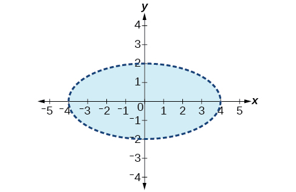

For the following exercises, graph the system of inequalities.
43. $\begin{array}{l}{x}^{2}+{y}^{2}+2x<3  \\ y>-{x}^{2}-3  \end{array}$

44. $\begin{array}{l}{x}^{2}-2x+{y}^{2}-4x<4  \\ y<-x+4  \end{array}$

Solution

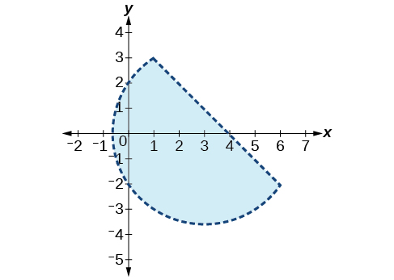

45. $\begin{array}{l}{x}^{2}+{y}^{2}<1  \\ {y}^{2}<x  \end{array}$

## Partial Fractions
For the following exercises, decompose into partial fractions.
46. $\frac{-2x+6}{{x}^{2}+3x+2}$

Solution

$\frac{2}{x+2},\frac{-4}{x+1}$

47. $\frac{10x+2}{4{x}^{2}+4x+1}$

48. $\frac{7x+20}{{x}^{2}+10x+25}$

Solution

$\frac{7}{x+5},\frac{-15}{{(x+5)}^{2}}$

49. $\frac{x-18}{{x}^{2}-12x+36}$

50. $\frac{-{x}^{2}+36x+70}{{x}^{3}-125}$

Solution

$\frac{3}{x-5},\frac{-4x+1}{{x}^{2}+5x+25}$

51. $\frac{-5{x}^{2}+6x-2}{{x}^{3}+27}$

52. $\frac{{x}^{3}-4{x}^{2}+3x+11}{{({x}^{2}-2)}^{2}}$

Solution

$\frac{x-4}{({x}^{2}-2)},\frac{5x+3}{{({x}^{2}-2)}^{2}}$

53. $\frac{4{x}^{4}-2{x}^{3}+22{x}^{2}-6x+48}{x{({x}^{2}+4)}^{2}}$

## Matrices and Matrix Operations
For the following exercises, perform the requested operations on the given matrices.
 $A=\left[\begin{array}{rr}  4&   -2\\   1&   3\end{array}\right],B=\left[\begin{array}{rrr}  6&   7&   -3\\   11&   -2&   4\end{array}\right],C=\left[\begin{array}{r}  \begin{array}{cc}6& 7\\ 11& -2\end{array}\\   \begin{array}{cc}14& 0\end{array}\end{array}\right],D=\left[\begin{array}{rrr}  1&   -4&   9\\   10&   5&   -7\\   2&   8&   5\end{array}\right],E=\left[\begin{array}{rrr}  7&   -14&   3\\   2&   -1&   3\\   0&   1&   9\end{array}\right]$
54. $-4A$

Solution

$\left[\begin{array}{cc}-16& 8\\ -4& -12\end{array}\right]$

55. $10D-6E$

56. $B+C$

Solution

undefined; dimensions do not match

57. $AB$

58. $BA$

Solution

undefined; inner dimensions do not match

59. $BC$

60. $CB$

Solution

$\left[\begin{array}{ccc}113& 28& 10\\ 44& 81& -41\\ 84& 98& -42\end{array}\right]$

61. $DE$

62. $ED$

Solution

$\left[\begin{array}{ccc}-127& -74& 176\\ -2& 11& 40\\ 28& 77& 38\end{array}\right]$

63. $EC$

64. $CE$

Solution

undefined; inner dimensions do not match

65. ${A}^{3}$

## Solving Systems with Gaussian Elimination
For the following exercises, write the system of linear equations from the augmented matrix. Indicate whether there will be a unique solution.
66. $\left[\begin{array}{rrr}  1&   0&   \mathrm{-3}\\   0&   1&   2\\   0&   0&   0\end{array}|\begin{array}{r}  7\\   \mathrm{-5}\\   0\end{array}\right]$

Solution

$\begin{array}{l}x-3z=7\\ y+2z=-5\end{array}$ with infinite solutions

67. $\left[\begin{array}{rrr}  1&   0&   5\\   0&   1&   \mathrm{-2}\\   0&   0&   0\end{array}|\begin{array}{r}  \mathrm{-9}\\   4\\   3\end{array}\right]$

For the following exercises, write the augmented matrix from the system of linear equations.
68. $\begin{array}{r}  -2x+2y+z=7\\   2x-8y+5z=0\\   19x-10y+22z=3\end{array}$

Solution

$\left[\begin{array}{rrr}  -2&   2&   1\\   2&   -8&   5\\   19&   -10&   22\end{array}|\begin{array}{r}  7\\   0\\   3\end{array}\right]$

69. $\begin{array}{l}4x+2y-3z=14  \\ -12x+3y+z=100  \\ 9x-6y+2z=31  \end{array}$

70. $\begin{array}{r}  x+3z=12\\   -x+4y=0\\   y+2z=-7\end{array}$

Solution

$\left[\begin{array}{rrr}  1&   0&   3\\   \mathrm{-1}&   4&   0\\   0&   1&   2\end{array}|\begin{array}{r}  12\\   0\\   \mathrm{-7}\end{array}\right]$

For the following exercises, solve the system of linear equations using Gaussian elimination.
71. $\begin{array}{r}3x-4y=-7\\ -6x+8y=14\end{array}$

72. $\begin{array}{r}3x-4y=1\\ -6x+8y=6\end{array}$

Solution

No solutions exist.

73. $\begin{array}{l}-1.1x-2.3y=6.2\\ -5.2x-4.1y=4.3  \end{array}$

74. $\begin{array}{r}  2x+3y+2z=1\\   -4x-6y-4z=-2\\   10x+15y+10z=0\end{array}$

Solution

No solutions exist.

75. $\begin{array}{r}  -x+2y-4z=8\\   3y+8z=-4\\   -7x+y+2z=1\end{array}$

## Solving Systems with Inverses
For the following exercises, find the inverse of the matrix.
76. $\left[\begin{array}{rr}  -0.2&   1.4\\   1.2&   -0.4\end{array}\right]$

Solution

$\frac{1}{8}\left[\begin{array}{cc}2& 7\\ 6& 1\end{array}\right]$

77. $\left[\begin{array}{rr}  \frac{1}{2}&   -\frac{1}{2}\\   -\frac{1}{4}&   \frac{3}{4}\end{array}\right]$

78. $\left[\begin{array}{ccc}12& 9& -6\\ -1& 3& 2\\ -4& -3& 2\end{array}\right]$

Solution

No inverse exists.

79. $\left[\begin{array}{ccc}2& 1& 3\\ 1& 2& 3\\ 3& 2& 1\end{array}\right]$

For the following exercises, find the solutions by computing the inverse of the matrix.
80. $\begin{array}{l}0.3x-0.1y=-10  \\ -0.1x+0.3y=14  \end{array}$

Solution

$\left(-20,40\right)$

81. $\begin{array}{l}0.4x-0.2y=-0.6  \\ -0.1x+0.05y=0.3  \end{array}$

82. $\begin{array}{r}4x+3y-3z=-4.3\\ 5x-4y-z=-6.1\\ x+z=-0.7\end{array}$

Solution

$\left(-1,0.2,0.3\right)$

83. $\begin{array}{r}  \begin{array}{l}\\ -2x-3y+2z=3\end{array}\\   -x+2y+4z=-5\\   -2y+5z=-3\end{array}$

For the following exercises, write a system of equations to solve each problem. Solve the system of equations.
84. Students were asked to bring their favorite fruit to class. 90% of the fruits consisted of banana, apple, and oranges. If oranges were half as popular as bananas and apples were 5% more popular than bananas, what are the percentages of each individual fruit?

Solution

17% oranges, 34% bananas, 39% apples

85. A school club held a bake sale to raise money and sold brownies and chocolate chip cookies. They priced the brownies at $2 and the chocolate chip cookies at $1. They raised $250 and sold 175 items. How many brownies and how many cookies were sold?

## Solving Systems with Cramer's Rule
For the following exercises, find the determinant.
86. $\left|\begin{array}{cc}100& 0\\ 0& 0\end{array}\right|$

Solution

0

87. $\left|\begin{array}{cc}0.2& -0.6\\ 0.7& -1.1\end{array}\right|$

88. $\left|\begin{array}{ccc}-1& 4& 3\\ 0& 2& 3\\ 0& 0& -3\end{array}\right|$

Solution

6

89. $\left|\begin{array}{ccc}\sqrt{2}& 0& 0\\ 0& \sqrt{2}& 0\\ 0& 0& \sqrt{2}\end{array}\right|$

For the following exercises, use Cramer’s Rule to solve the linear systems of equations.
90. $\begin{array}{r}  4x-2y=23\\   -5x-10y=-35\end{array}$

Solution

$\left(6,\frac{1}{2}\right)$

91. $\begin{array}{l}0.2x-0.1y=0\\ -0.3x+0.3y=2.5\end{array}$

92. $\begin{array}{r}  -0.5x+0.1y=0.3\\   -0.25x+0.05y=0.15\end{array}$

Solution

(*x*, 5*x*+ 3)

93. $\begin{array}{l}x+6y+3z=4\\ 2x+y+2z=3\\ 3x-2y+z=0\end{array}$

94. $\begin{array}{r}  4x-3y+5z=-\frac{5}{2}\\   7x-9y-3z=\frac{3}{2}\\   x-5y-5z=\frac{5}{2}\end{array}$

Solution

$\left(0,0,-\frac{1}{2}\right)$

95. $\begin{array}{r}\frac{3}{10}x-\frac{1}{5}y-\frac{3}{10}z=-\frac{1}{50}\\ \frac{1}{10}x-\frac{1}{10}y-\frac{1}{2}z=-\frac{9}{50}\\ \frac{2}{5}x-\frac{1}{2}y-\frac{3}{5}z=-\frac{1}{5}\end{array}$

# Practice Test
Is the following ordered pair a solution to the system of equations?
96. $\begin{array}{l}\\ \begin{array}{l}-5x-y=12  \\ x+4y=9  \end{array}\end{array}$ with $(-3,3)$

Solution

Yes

For the following exercises, solve the systems of linear and nonlinear equations using substitution or elimination. Indicate if no solution exists.
97. $\begin{array}{r}\frac{1}{2}x-\frac{1}{3}y=4\\ \frac{3}{2}x-y=0\end{array}$

98. $\begin{array}{l}\\ -\frac{1}{2}x-4y=4\\   2x+16y=2\end{array}$

Solution

No solutions exist.

99. $\begin{array}{r}  5x-y=1\\   -10x+2y=-2\end{array}$

100. $\begin{array}{l}4x-6y-2z=\frac{1}{10}  \\ x-7y+5z=-\frac{1}{4}  \\ 3x+6y-9z=\frac{6}{5}  \end{array}$

Solution

$\frac{1}{20}\left(10,5,4\right)$

101. $\begin{array}{r}x+z=20\\ x+y+z=20\\ x+2y+z=10\end{array}$

102. $\begin{array}{r}5x-4y-3z=0\\ 2x+y+2z=0\\ x-6y-7z=0\end{array}$

Solution

$\left(x,\frac{16x}{5}-\frac{13x}{5}\right)$

103. $\begin{array}{l}y={x}^{2}+2x-3\\ y=x-1\end{array}$

104. $\begin{array}{l}{y}^{2}+{x}^{2}=25\\ {y}^{2}-2{x}^{2}=1\end{array}$

Solution

$(-2\sqrt{2},-\sqrt{17}),\left(-2\sqrt{2},\sqrt{17}\right),\left(2\sqrt{2},-\sqrt{17}\right),\left(2\sqrt{2},\sqrt{17}\right)$

For the following exercises, graph the following inequalities.
105. $y<{x}^{2}+9$

106. $\begin{array}{l}{x}^{2}+{y}^{2}>4\\ y<{x}^{2}+1\end{array}$

Solution

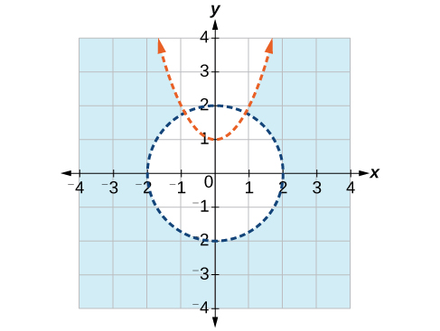

For the following exercises, write the partial fraction decomposition.
107. $\frac{-8x-30}{{x}^{2}+10x+25}$

108. $\frac{13x+2}{{(3x+1)}^{2}}$

Solution

$\frac{5}{3x+1}-\frac{2x+3}{{(3x+1)}^{2}}$

109. $\frac{{x}^{4}-{x}^{3}+2x-1}{x{({x}^{2}+1)}^{2}}$

For the following exercises, perform the given matrix operations.
110. $5\left[\begin{array}{cc}4& 9\\ -2& 3\end{array}\right]+\frac{1}{2}\left[\begin{array}{cc}-6& 12\\ 4& -8\end{array}\right]$

Solution

$\left[\begin{array}{cc}17& 51\\ -8& 11\end{array}\right]$

111. $\left[\begin{array}{rrr}  1&   4&   -7\\   -2&   9&   5\\   12&   0&   -4\end{array}\right]\phantom{\rule{0.5em}{0ex}}\left[\begin{array}{cc}3& -4\\ 1& 3\\ 5& 10\end{array}\right]$

112. ${\left[\begin{array}{rr}  \frac{1}{2}&   \frac{1}{3}\\   \frac{1}{4}&   \frac{1}{5}\end{array}\right]}^{-1}$

Solution

$\left[\begin{array}{cc}12& -20\\ -15& 30\end{array}\right]$

113. $\mathrm{det}\left|\begin{array}{cc}0& 0\\ 400& 4\text{,}000\end{array}\right|$

114. $\mathrm{det}\left|\begin{array}{rrr}  \frac{1}{2}&   -\frac{1}{2}&   0\\   -\frac{1}{2}&   0&   \frac{1}{2}\\   0&   \frac{1}{2}&   0\end{array}\right|$

Solution

$-\frac{1}{8}$

115. If $\mathrm{det}(A)=\mathrm{-6},$ what would be the determinant if you switched rows 1 and 3, multiplied the second row by 12, and took the inverse?

116. Rewrite the system of linear equations as an augmented matrix.      $\begin{array}{l}14x-2y+13z=140  \\ -2x+3y-6z=-1  \\ x-5y+12z=11  \end{array}$

Solution

$\left[\begin{array}{rrr}  14&   -2&   13\\   -2&   3&   -6\\   1&   -5&   12\end{array}\phantom{\rule{0.5em}{0ex}}|\begin{array}{r}  140\\   -1\\   11\end{array}\right]$

117. Rewrite the augmented matrix as a system of linear equations.      $\left[\begin{array}{rrr}  1&   0&   3\\   -2&   4&   9\\   -6&   1&   2\end{array}|\begin{array}{r}  12\\   -5\\   8\end{array}\right]$

For the following exercises, use Gaussian elimination to solve the systems of equations.
118. $\begin{array}{r}x-6y=4\\ 2x-12y=0\end{array}$

Solution

No solutions exist.

119. $\begin{array}{r}  2x+y+z=-3\\   x-2y+3z=6\\   x-y-z=6\end{array}$

For the following exercises, use the inverse of a matrix to solve the systems of equations.
120. $\begin{array}{r}  4x-5y=-50\\   -x+2y=80\end{array}$

Solution

$\left(100,90\right)$

121. $\begin{array}{r}  \frac{1}{100}x-\frac{3}{100}y+\frac{1}{20}z=-49\\   \frac{3}{100}x-\frac{7}{100}y-\frac{1}{100}z=13\\   \frac{9}{100}x-\frac{9}{100}y-\frac{9}{100}z=99\end{array}$

For the following exercises, use Cramer’s Rule to solve the systems of equations.
122. $\begin{array}{l}200x-300y=2\\ 400x+715y=4\end{array}$

Solution

$\left(\frac{1}{100},0\right)$

123. $\begin{array}{l}0.1x+0.1y-0.1z=-1.2\\ 0.1x-0.2y+0.4z=-1.2\\ 0.5x-0.3y+0.8z=-5.9\end{array}$

For the following exercises, solve using a system of linear equations.
124. A factory producing cell phones has the following cost and revenue functions: $C(x)={x}^{2}+75x+2\text{,}688$ and $R(x)={x}^{2}+160x.$ What is the range of cell phones they should produce each day so there is profit? Round to the nearest number that generates profit.

Solution

32 or more cell phones per day

125. A small fair charges $1.50 for students, $1 for children, and $2 for adults. In one day, three times as many children as adults attended. A total of 800 tickets were sold for a total revenue of $1,050. How many of each type of ticket was sold?

 
  
   **Cramer’s Rule** a method for solving systems of equations that have the same number of equations as variables using determinants
  
  
   **determinant**  a number calculated using the entries of a square matrix that determines such information as whether there is a solution to a system of equations
