**The Ellipse**

  m49438
  

**The Ellipse**

  In this section, you will:

Write equations of ellipses in standard form.
Graph ellipses centered at the origin.
Graph ellipses not centered at the origin.
Solve applied problems involving ellipses.

  99d38770-49c7-49d3-b567-88f393ffb4fe

## Learning Objectives

Complete the square of a binomial expression. (IA 9.2.1)
Graph a circle. (IA 11.1.4)

## Objective 1: Complete the square of a binomial expression. (IA 9.2.1)

>
>
> **Vocabulary**
>
> Fill in the blanks.
>
> We say that ${x}^{2}+4x+4$ is a ________ **square trinomial** because ${x}^{2}+4x+4={(\ +\ )}^{2}$ .
> The **square root property** states that ${(x+2)}^{2}=9$ means that
> $(x+2)=$ ________ and $(x+2)=\u2013$ ________.

> Complete the square of a binomial expression.
>
>     1. Use the square root property to solve ${(x+3)}^{2}=5$ . Use the steps below to guide your work.           ⓐ Take a square root of both sides. Remember to have  ± on the right side. ⓑ Solve for x.
>

> Complete the square of a binomial expression.
>
>     2. Use the square root property to solve ${x}^{2}+6x+9=7$. Use the steps below to guide your work.           ⓐ ${x}^{2}+6x+9$ is a perfect square trinomial. Factor it into ${(\_+\_)}^{2}$ . ⓑ Take a square root of both sides. Remember to have ± on the right side. ⓒ Solve for x.
>

But what happens if we have to solve an equation where the trinomial is not a perfect square? 
For example, ${x}^{2}+4x+5=2$ ? For these types of equations, we can use a process called **completing the square**.
Recall ${(x+1)}^{2}=(x+1)(x+1)={x}^{2}+x+x+1={x}^{2}+2+1$ .
We can use the **Binomial Squares Pattern** to make a perfect square. 

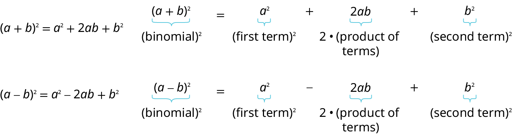

3. **Complete the square of a binomial expression**      Complete the square for  ${x}^{2}+6x$ to make it a perfect square.

Solution

| Since there is a plus sign between the two terms, we will use the (*a* + *b*)2 pattern ${a}^{2}+2ab+{b}^{2}={(a+b)}^{2}$ . | ${x}^{2}+6x$ |
| :--- | :--- |
| We ultimately need to find the last term of this trinomial that will make it a perfect square trinomial. To do that we will need to find *b*. But first we start with determining *a*. Notice that the first term of *x*2 + 6*x* is a square, *x*2. This tells us that *a* = *x*. | ${x}^{2}+2\xb7x\xb7b+{b}^{2}$ |
| What number, *b*, when multiplied with 2*x*, gives 6*x*? It would have to be 3, which is (½)(6).  So *b* = 3. | ${x}^{2}+2\xb73\xb7x+\_$ |
| Now to complete the perfect square trinomial, we will find the last term by squaring *b*, which is 32 = 9. | ${x}^{2}+6x+9$ |
| We can now factor. | ${(x+3)}^{2}$ |

So, we found that adding 9 to *x*2 + 6*x* completes the square, and we write it as (*x* + 3)2.

>
>
> **How to Complete a square of *x*2+*b**x*+*c***
>
>
>       Identify *b*, the coefficient of *x*.
> Find $\frac{1}{2}{b}^{2}$ , the number needed to complete the square.
> Add $\frac{1}{2}{b}^{2}$ to ${x}^{2}+bx$ 
> Factor the perfect square trinomial, writing it as a binomial squared.

### Practice Makes Perfect
Determine what number would have to be added to the given terms to create a perfect square trinomial. Then rewrite as a binomial squared.
4. ${x}^{2}+12x$

5. ${x}^{2}+5x$

6. ${x}^{2}-\frac{1}{2}x$

7. ${x}^{2}+\frac{3}{2}x$

## Objective 2: Graph a circle. (IA 11.1.4)

A **circle** is all points in a plane that are a fixed distance from a given point in the plane. The given point is called the **center**, (*h*, *k*) and the fixed distance is called the **radius**, *r*, of the circle.

The **standard or graphing form** of the equation of a circle with center, (*h*, *k*) and radius, *r*, is ${(x-h)}^{2}+{(y-k)}^{2}={r}^{2}$ .

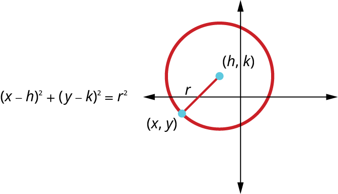

8. **Write the standard form the equation of a circle**      Write the standard (graphing) form of the equation of the circle with radius 2 and center (-1, 3).

Solution

| Use the standard, (graphing)  form of the equation of a circle. | ${(x-h)}^{2}+{(y-k)}^{2}={r}^{2}$ |
| :--- | :--- |
| Substitute in the values (h, k)=(1, -3), where h=1, k=-3. | $(x-{(-1))}^{2}+(y-{\left(3\right))}^{2}={2}^{2}$ |
| Simplify. | ${(x+1)}^{2}+{(y-3)}^{2}=4$ |

**Graph a circle**

9. **Graph a circle**      Find the center and radius, then graph the circle: ${(x+2)}^{2}+{(y-1)}^{2}=9$

Solution

| Use the standard (graphing) form of the equation of a circle. | ${(x-h)}^{2}+{(y-k)}^{2}={r}^{2}$ |
| :--- | :--- |
| Identify the center, (*h*,*k*) and radius, *r*. | $(x-{(-2))}^{2}+{(y-1)}^{2}={3}^{2}$ |
| Graph the circle. | Center (-2, 1),  *r*=3   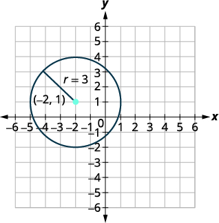 |

The **general form of the equation of a circle** is ${x}^{2}+{y}^{2}+ax+by+c=0$ . If we are given an equation in general form, we can change it to standard, also called the graphing form, by completing the squares in both x  and y. Then we can graph the circle using its center and radius. 

10. **Graph a circle**     Find the center and radius, then  graph the circle: ${x}^{2}+{y}^{2}-4x-6y+4=0$

Solution

We need to rewrite this general form into standard (graphing) form in order to find the center and radius.

| Group the x-terms and y-terms. Collect the constants on the right side. | ${x}^{2}-4x+{y}^{2}-6y=-4$ |
| :--- | :--- |
| Complete the squares. | ${x}^{2}-4x+4+{y}^{2}-6y+9=-4+4+9$ |
| Rewrite as binomial squares. | ${(x-2)}^{2}+{(y-3)}^{2}=9$ |
| Identify the center and radius. | Center (2, 3), *r*=3 |
| Graph the circle. | 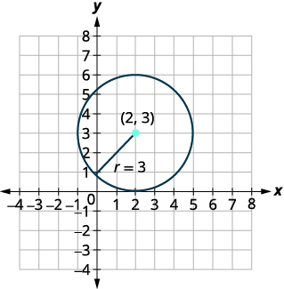 |

### Practice Makes Perfect
11. Write the standard (graphing) form of the equation of the circle with radius 4 and center (2,–5).

12. Find the center and radius, then  graph the circle: ${(x-3)}^{2}+{(y+1)}^{2}=4$

13. Find the center and radius, then graph the circle: ${x}^{2}+{y}^{2}-6x-8y+9=0$

Can you imagine standing at one end of a large room and still being able to hear a whisper from a person standing at the other end? The National Statuary Hall in Washington, D.C., shown in , is such a room.Architect of the Capitol. http://www.aoc.gov. Accessed April 15, 2014. It is an semi-circular room called a *whispering chamber* because the shape makes it possible for sound to travel along the walls and dome. In this section, we will investigate the shape of this room and its real-world applications, including how far apart two people in Statuary Hall can stand and still hear each other whisper.

# Writing Equations of Ellipses in Standard Form
A conic section, or **conic**, is a shape resulting from intersecting a right circular cone with a plane. The angle at which the plane intersects the cone determines the shape, as shown in .

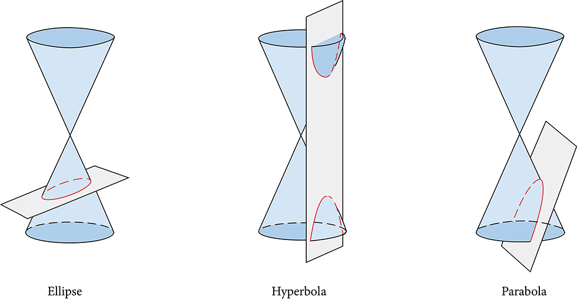

Conic sections can also be described by a set of points in the coordinate plane. Later in this chapter, we will see that the graph of any quadratic equation in two variables is a conic section. The signs of the equations and the coefficients of the variable terms determine the shape. This section focuses on the four variations of the standard form of the equation for the ellipse. An **ellipse** is the set of all points $\left(x,y\right)$ in a plane such that the sum of their distances from two fixed points is a constant. Each fixed point is called a **focus** (plural: **foci**).
We can draw an ellipse using a piece of cardboard, two thumbtacks, a pencil, and string. Place the thumbtacks in the cardboard to form the foci of the ellipse. Cut a piece of string longer than the distance between the two thumbtacks (the length of the string represents the constant in the definition). Tack each end of the string to the cardboard, and trace a curve with a pencil held taut against the string. The result is an ellipse. See .

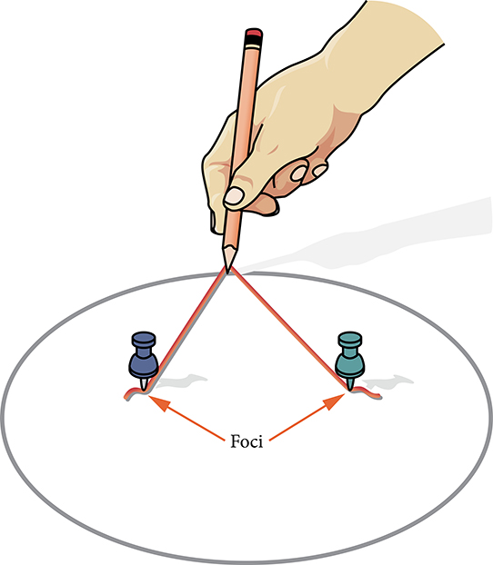

Every ellipse has two axes of symmetry. The longer axis is called the **major axis**, and the shorter axis is called the **minor axis**. Each endpoint of the major axis is the **vertex** of the ellipse (plural: **vertices**), and each endpoint of the minor axis is a **co-vertex** of the ellipse. The **center of an ellipse** is the midpoint of both the major and minor axes. The axes are perpendicular at the center. The foci always lie on the major axis, and the sum of the distances from the foci to any point on the ellipse (the constant sum) is greater than the distance between the foci. See .

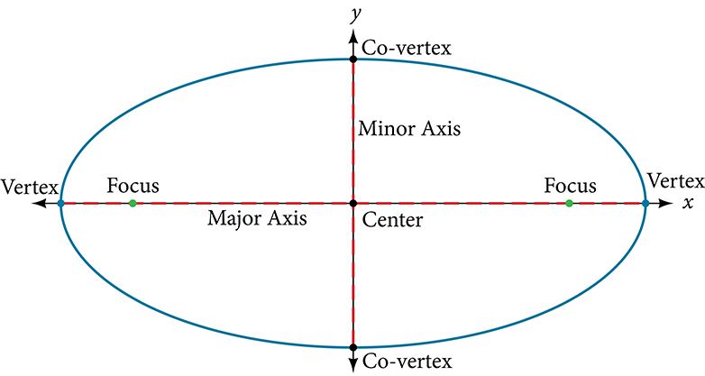

In this section, we restrict ellipses to those that are positioned vertically or horizontally in the coordinate plane. That is, the axes will either lie on or be parallel to the *x*- and *y*-axes. Later in the chapter, we will see ellipses that are rotated in the coordinate plane.
To work with horizontal and vertical ellipses in the coordinate plane, we consider two cases: those that are centered at the origin and those that are centered at a point other than the origin. First we will learn to derive the equations of ellipses, and then we will learn how to write the equations of ellipses in standard form. Later we will use what we learn to draw the graphs.

## Deriving the Equation of an Ellipse Centered at the Origin
To derive the equation of an **ellipse** centered at the origin, we begin with the foci $\left(-c,0\right)$ and $(c,0).$ The ellipse is the set of all points $\left(x,y\right)$ such that the sum of the distances from $\left(x,y\right)$ to the foci is constant, as shown in .

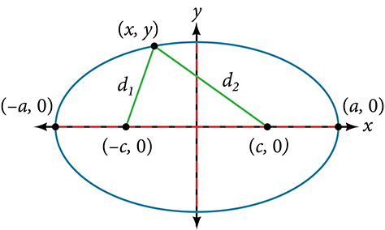

If $\left(a,0\right)$ is a **vertex** of the ellipse, the distance from $\left(-c,0\right)$ to $(a,0)$ is $a-(-c)=a+c.$ The distance from $\left(c,0\right)$ to $\left(a,0\right)$ is $a-c$ . The sum of the distances from the **foci** to the vertex is
 $\left(a+c\right)+\left(a-c\right)=2a$
If $\left(x,y\right)$ is a point on the ellipse, then we can define the following variables:
 $\begin{array}{l}{d}_{1}=\text{the\ distance\ from\}(-c,0)\phantom{\rule{0.5em}{0ex}}\text{to\}(x,y)  \\ {d}_{2}=\text{the\ distance\ from\}(c,0)\phantom{\rule{0.5em}{0ex}}\text{to\}(x,y)  \end{array}$
By the definition of an ellipse, ${d}_{1}+{d}_{2}$ is constant for any point $\left(x,y\right)$ on the ellipse. We know that the sum of these distances is $2a$ for the vertex $(a,0).$ It follows that ${d}_{1}+{d}_{2}=2a$ for any point on the ellipse. We will begin the derivation by applying the distance formula. The rest of the derivation is algebraic.
 $$
\begin{array}{ll}{d}_{1}+{d}_{2}=\sqrt{{(x-(-c))}^{2}+{(y-0)}^{2}}+\sqrt{{(x-c)}^{2}+{(y-0)}^{2}}=2a  & \text{Distance\ formula}  \\ \sqrt{{(x+c)}^{2}+{y}^{2}}+\sqrt{{(x-c)}^{2}+{y}^{2}}=2a  & \text{Simplify\ expressions}\text{.}  \\ \sqrt{{(x+c)}^{2}+{y}^{2}}=2a-\sqrt{{(x-c)}^{2}+{y}^{2}}  & \text{Move\ radical\ to\ opposite\ side}\text{.}  \\ {(x+c)}^{2}+{y}^{2}={\left[2a-\sqrt{{(x-c)}^{2}+{y}^{2}}\right]}^{2}  & \text{Square\ both\ sides}\text{.}  \\ {x}^{2}+2cx+{c}^{2}+{y}^{2}=4{a}^{2}-4a\sqrt{{(x-c)}^{2}+{y}^{2}}+{(x-c)}^{2}+{y}^{2}  & \text{Expand\ the\ squares}\text{.}  \\ {x}^{2}+2cx+{c}^{2}+{y}^{2}=4{a}^{2}-4a\sqrt{{(x-c)}^{2}+{y}^{2}}+{x}^{2}-2cx+{c}^{2}+{y}^{2}  & \text{Expand\ remaining\ squares}\text{.}  \\ 2cx=4{a}^{2}-4a\sqrt{{(x-c)}^{2}+{y}^{2}}-2cx  & \text{Combine\ like\ terms}\text{.}  \\ 4cx-4{a}^{2}=-4a\sqrt{{(x-c)}^{2}+{y}^{2}}  & \text{Isolate\ the\ radical}\text{.}  \\ cx-{a}^{2}=-a\sqrt{{(x-c)}^{2}+{y}^{2}}  & \text{Divide\ by\ 4}\text{.}  \\ {\left[cx-{a}^{2}\right]}^{2}={a}^{2}{\left[\sqrt{{(x-c)}^{2}+{y}^{2}}\right]}^{2}  & \text{Square\ both\ sides}\text{.}  \\ {c}^{2}{x}^{2}-2{a}^{2}cx+{a}^{4}={a}^{2}\left({x}^{2}-2cx+{c}^{2}+{y}^{2}\right)  & \text{Expand\ the\ squares}\text{.}  \\ {c}^{2}{x}^{2}-2{a}^{2}cx+{a}^{4}={a}^{2}{x}^{2}-2{a}^{2}cx+{a}^{2}{c}^{2}+{a}^{2}{y}^{2}  & \text{Distribute\}{a}^{2}.  \\ {a}^{2}{x}^{2}-{c}^{2}{x}^{2}+{a}^{2}{y}^{2}={a}^{4}-{a}^{2}{c}^{2}  & \text{Rewrite}\text{.}  \\ {x}^{2}\left({a}^{2}-{c}^{2}\right)+{a}^{2}{y}^{2}={a}^{2}\left({a}^{2}-{c}^{2}\right)  & \text{Factor\ common\ terms}\text{.}  \\ {x}^{2}{b}^{2}+{a}^{2}{y}^{2}={a}^{2}{b}^{2}  & \text{Set\}{b}^{2}={a}^{2}-{c}^{2}.  \\ \frac{{x}^{2}{b}^{2}}{{a}^{2}{b}^{2}}+\frac{{a}^{2}{y}^{2}}{{a}^{2}{b}^{2}}=\frac{{a}^{2}{b}^{2}}{{a}^{2}{b}^{2}}  & \text{Divide\ both\ sides\ by\}{a}^{2}{b}^{2}.  \\ \frac{{x}^{2}}{{a}^{2}}+\frac{{y}^{2}}{{b}^{2}}=1  & \text{Simplify}\text{.}  \end{array}
$$
Thus, the standard equation of an ellipse is $\frac{{x}^{2}}{{a}^{2}}+\frac{{y}^{2}}{{b}^{2}}=1.$ This equation defines an ellipse centered at the origin. If $a>b,$ the ellipse is stretched further in the horizontal direction, and if $b>a,$ the ellipse is stretched further in the vertical direction.

## Writing Equations of Ellipses Centered at the Origin in Standard Form
Standard forms of equations tell us about key features of graphs. Take a moment to recall some of the standard forms of equations we’ve worked with in the past: linear, quadratic, cubic, exponential, logarithmic, and so on. By learning to interpret standard forms of equations, we are bridging the relationship between algebraic and geometric representations of mathematical phenomena.
The key features of the **ellipse** are its center, **vertices**, **co-vertices**, **foci**, and lengths and positions of the **major and minor axes**. Just as with other equations, we can identify all of these features just by looking at the standard form of the equation. There are four variations of the standard form of the ellipse. These variations are categorized first by the location of the center (the origin or not the origin), and then by the position (horizontal or vertical). Each is presented along with a description of how the parts of the equation relate to the graph. Interpreting these parts allows us to form a mental picture of the ellipse.

>
>
> **Standard Forms of the Equation of an Ellipse with Center (0,0)**
>
> The standard form of the equation of an ellipse with center $\left(0,0\right)$ and major axis on the *x-axis* is
>  $\frac{{x}^{2}}{{a}^{2}}+\frac{{y}^{2}}{{b}^{2}}=1$
>
> where
>  $a>b$
>
> the length of the major axis is $2a$ 
> the coordinates of the vertices are $\left(\pm a,0\right)$ 
> the length of the minor axis is $2b$ 
> the coordinates of the co-vertices are $\left(\mathrm{0,}\pm b\right)$ 
> the coordinates of the foci are $\left(\pm c,0\right)$ , where ${c}^{2}={a}^{2}-{b}^{2}.$ See *a*
> The standard form of the equation of an ellipse with center $\left(0,0\right)$ and major axis on the *y-axis* is
>  $\frac{{x}^{2}}{{b}^{2}}+\frac{{y}^{2}}{{a}^{2}}=1$
> where
>  $a>b$
>
> the length of the major axis is $2a$
>
> the coordinates of the vertices are $\left(\mathrm{0,}\pm a\right)$ 
> the length of the minor axis is $2b$ 
> the coordinates of the co-vertices are $\left(\pm b,0\right)$ 
>
>
> the coordinates of the foci are $\left(\mathrm{0,}\pm c\right)$ , where ${c}^{2}={a}^{2}-{b}^{2}.$ See *b*
>
> Note that the vertices, co-vertices, and foci are related by the equation ${c}^{2}={a}^{2}-{b}^{2}.$ When we are given the coordinates of the foci and vertices of an ellipse, we can use this relationship to find the equation of the ellipse in standard form.
>
>
>
>
> 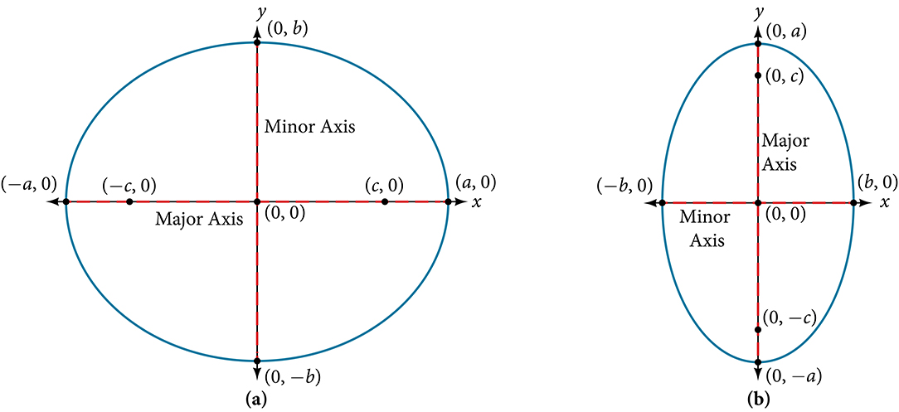
>

> How To
> *Given the vertices and foci of an ellipse centered at the origin, write its equation in standard form.*
>
>
> Determine whether the major axis lies on the *x*- or *y*-axis.
> If the given coordinates of the vertices and foci have the form $\left(\pm a,0\right)$ and $(\pm c,0)$ respectively, then the major axis is the *x*-axis. Use the standard form $\frac{{x}^{2}}{{a}^{2}}+\frac{{y}^{2}}{{b}^{2}}=1.$
>
> If the given coordinates of the vertices and foci have the form $\left(\mathrm{0,}\pm a\right)$ and $(0,\pm c),$ respectively, then the major axis is the *y*-axis. Use the standard form $\frac{{x}^{2}}{{b}^{2}}+\frac{{y}^{2}}{{a}^{2}}=1.$ 
>
> Use the equation ${c}^{2}={a}^{2}-{b}^{2},$ along with the given coordinates of the vertices and foci, to solve for ${b}^{2}.$
>
> Substitute the values for ${a}^{2}$ and ${b}^{2}$ into the standard form of the equation determined in Step 1.

14. **Writing the Equation of an Ellipse Centered at the Origin in Standard Form**   What is the standard form equation of the ellipse that has vertices $\left(\pm 8,0\right)$ and foci $\left(\pm 5,0\right)?$

Solution

The foci are on the *x*-axis, so the major axis is the *x*-axis. Thus, the equation will have the form

 $\frac{{x}^{2}}{{a}^{2}}+\frac{{y}^{2}}{{b}^{2}}=1$

The vertices are $\left(\pm 8,0\right),$ so $a=8$ and ${a}^{2}=64.$

The foci are $\left(\pm 5,0\right),$ so $c=5$ and ${c}^{2}=25.$

We know that the vertices and foci are related by the equation ${c}^{2}={a}^{2}-{b}^{2}.$ Solving for ${b}^{2},$ we have:

 $$
\begin{array}{ll}{c}^{2}={a}^{2}-{b}^{2}  &   \\ 25=64-{b}^{2}\begin{array}{cccc}& & & \end{array}  & \text{Substitute\ for\}{c}^{2}\phantom{\rule{0.5em}{0ex}}\text{and\}{a}^{2}.  \\ {b}^{2}=39  & \text{Solve\ for\}{b}^{2}.  \end{array}
$$
Now we need only substitute ${a}^{2}=64$ and ${b}^{2}=39$ into the standard form of the equation. The equation of the ellipse is $\frac{{x}^{2}}{64}+\frac{{y}^{2}}{39}=1.$

>
> Try It
> 15. What is the standard form equation of the ellipse that has vertices $\left(\mathrm{0,}\pm 4\right)$ and foci $\left(\mathrm{0,}\pm \sqrt{15}\right)?$
>
> 

> 
Solution

>
> ${x}^{2}+\frac{{y}^{2}}{16}=1$
> 

>
>

>
> Q&A
> *Can we write the equation of an ellipse centered at the origin given coordinates of just one focus and vertex?*
>
> *Yes. Ellipses are symmetrical, so the coordinates of the vertices of an ellipse centered around the origin will always have the form $\left(\pm a,0\right)$ or $(0,\phantom{\rule{0.5em}{0ex}}\pm a).$ Similarly, the coordinates of the foci will always have the form $\left(\pm c,0\right)$ or $(0,\phantom{\rule{0.5em}{0ex}}\pm c).$ Knowing this, we can use $a$ and $c$ from the given points, along with the equation ${c}^{2}={a}^{2}-{b}^{2},$ to find ${b}^{2}.$*

## Writing Equations of Ellipses Not Centered at the Origin
Like the graphs of other equations, the graph of an **ellipse** can be translated. If an ellipse is translated $h$ units horizontally and $k$ units vertically, the center of the ellipse will be $\left(h,k\right).$ This **translation** results in the standard form of the equation we saw previously, with $x$ replaced by $\left(x-h\right)$ and *y* replaced by $\left(y-k\right).$

>
>
> **Standard Forms of the Equation of an Ellipse with Center (*h*, *k*)**
>
> The standard form of the equation of an ellipse with center $\left(h,\phantom{\rule{0.5em}{0ex}}\text{}k\right)$ and **major axis** parallel to the *x*-axis is
>
>  $\frac{{\left(x-h\right)}^{2}}{{a}^{2}}+\frac{{\left(y-k\right)}^{2}}{{b}^{2}}=1$
>
> where
>  $a>b$
>
> the length of the major axis is $2a$
>
> the coordinates of the vertices are $\left(h\pm a,k\right)$ 
> the length of the minor axis is $2b$
>
> the coordinates of the co-vertices are $\left(h,k\pm b\right)$ 
> the coordinates of the foci are $\left(h\pm c,k\right),$ where ${c}^{2}={a}^{2}-{b}^{2}.$ See *a*
> The standard form of the equation of an ellipse with center $\left(h,k\right)$ and major axis parallel to the *y*-axis is
>
>  $\frac{{\left(x-h\right)}^{2}}{{b}^{2}}+\frac{{\left(y-k\right)}^{2}}{{a}^{2}}=1$
>
> where
>  $a>b$
>
> the length of the major axis is $2a$
>
> the coordinates of the vertices are $\left(h,k\pm a\right)$
>
> the length of the minor axis is $2b$
>
> the coordinates of the co-vertices are $\left(h\pm b,k\right)$
>
> the coordinates of the foci are $\left(h,k\pm c\right),$ where ${c}^{2}={a}^{2}-{b}^{2}.$ See *b*
> Just as with ellipses centered at the origin, ellipses that are centered at a point $\left(h,k\right)$ have vertices, co-vertices, and foci that are related by the equation ${c}^{2}={a}^{2}-{b}^{2}.$ We can use this relationship along with the midpoint and distance formulas to find the equation of the ellipse in standard form when the vertices and foci are given.
>
>
>
> 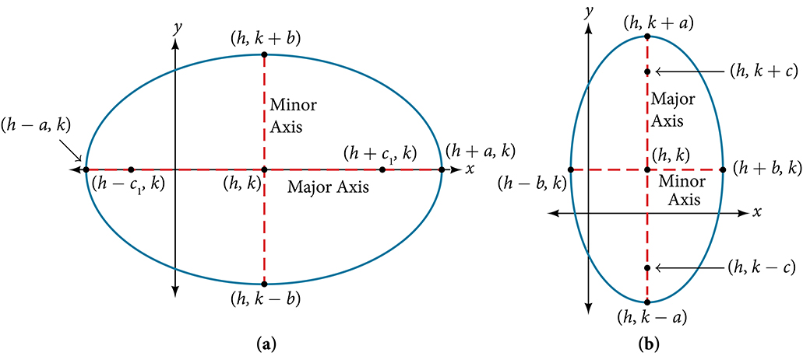
>

>
> How To
> *Given the vertices and foci of an ellipse not centered at the origin, write its equation in standard form.*
>
> Determine whether the major axis is parallel to the *x*- or *y*-axis.
> If the *y*-coordinates of the given vertices and foci are the same, then the major axis is parallel to the *x*-axis. Use the standard form $\frac{{\left(x-h\right)}^{2}}{{a}^{2}}+\frac{{\left(y-k\right)}^{2}}{{b}^{2}}=1.$
>
> If the *x*-coordinates of the given vertices and foci are the same, then the major axis is parallel to the *y*-axis. Use the standard form $\frac{{\left(x-h\right)}^{2}}{{b}^{2}}+\frac{{\left(y-k\right)}^{2}}{{a}^{2}}=1.$
>
>
> Identify the center of the ellipse $\left(h,k\right)$ using the midpoint formula and the given coordinates for the vertices.
> Find ${a}^{2}$ by solving for the length of the major axis, $2a,$ which is the distance between the given vertices.
> Find ${c}^{2}$ using $h$ and $k,$ found in Step 2, along with the given coordinates for the foci.
> Solve for ${b}^{2}$ using the equation ${c}^{2}={a}^{2}-{b}^{2}.$ 
> Substitute the values for $h,k,{a}^{2},$ and ${b}^{2}$ into the standard form of the equation determined in Step 1.

16. **Writing the Equation of an Ellipse Centered at a Point Other Than the Origin**   What is the standard form equation of the ellipse that has vertices $\left(\mathrm{-2},\mathrm{-8}\right)$ and $\left(\mathrm{-2},\text{2}\right)$  and foci $\left(\mathrm{-2},\mathrm{-7}\right)$ and $\left(\mathrm{-2},\text{1}\right)?$

Solution

The *x*-coordinates of the vertices and foci are the same, so the major axis is parallel to the *y*-axis. Thus, the equation of the ellipse will have the form

 $\frac{{\left(x-h\right)}^{2}}{{b}^{2}}+\frac{{\left(y-k\right)}^{2}}{{a}^{2}}=1$

First, we identify the center, $\left(h,k\right).$ The center is halfway between the vertices, $\left(-\mathrm{2,}-8\right)$ and $\left(-2,\text{2}\right).$ Applying the midpoint formula, we have:

 $$
\begin{array}{l}(h,k)=\left(\frac{\mathrm{-2}+(\mathrm{-2})}{2},\frac{\mathrm{-8}+2}{2}\right)  \\ \text{\ \ \ \ \ \ \ \}=(\mathrm{-2},\mathrm{-3})  \end{array}
$$
Next, we find ${a}^{2}.$ The length of the major axis, $2a,$ is bounded by the vertices. We solve for $a$ by finding the distance between the *y*-coordinates of the vertices.

 $\begin{array}{c}2a=2-(\mathrm{-8})\\ 2a=10\\ a=5\end{array}$
So ${a}^{2}=25.$

Now we find ${c}^{2}.$ The foci are given by $\left(h,k\pm c\right).$ So, $\left(h,k-c\right)=\left(\mathrm{-2},\mathrm{-7}\right)$ and $\left(h,k+c\right)=\left(\mathrm{-2},\text{1}\right).$ We substitute $k=\mathrm{-3}$ using either of these points to solve for $c.$

 $\begin{array}{c}k+c=1\\ \mathrm{-3}+c=1\\ c=4\end{array}$

So ${c}^{2}=16.$

Next, we solve for ${b}^{2}$ using the equation ${c}^{2}={a}^{2}-{b}^{2}.$

 $\begin{array}{c}{c}^{2}={a}^{2}-{b}^{2}\\ 16=25-{b}^{2}\\ {b}^{2}=9\end{array}$
Finally, we substitute the values found for $h,k,{a}^{2},$ and ${b}^{2}$ into the standard form equation for an ellipse:

 $\frac{{\left(x+2\right)}^{2}}{9}+\frac{{\left(y+3\right)}^{2}}{25}=1$

>
> Try It
> 17. What is the standard form equation of the ellipse that has vertices $\left(\mathrm{-3},3\right)$ and $\left(5,3\right)$ and foci $\left(1-2\sqrt{3},3\right)$ and $\left(1+2\sqrt{3},3\right)?$
>
> 

> 
Solution

>
> $\frac{{\left(x-1\right)}^{2}}{16}+\frac{{\left(y-3\right)}^{2}}{4}=1$
> 

>
>

# Graphing Ellipses Centered at the Origin
Just as we can write the equation for an ellipse given its graph, we can graph an ellipse given its equation. To graph ellipses centered at the origin, we use the standard form $\frac{{x}^{2}}{{a}^{2}}+\frac{{y}^{2}}{{b}^{2}}=1,\phantom{\rule{0.5em}{0ex}}\text{}a>b$ for horizontal ellipses and $\frac{{x}^{2}}{{b}^{2}}+\frac{{y}^{2}}{{a}^{2}}=1,\phantom{\rule{0.5em}{0ex}}\text{}a>b$ for vertical ellipses.

>
> How To
> *Given the standard form of an equation for an ellipse centered at $\left(0,0\right),$ sketch the graph.*
>
> Use the standard forms of the equations of an ellipse to determine the major axis, vertices, co-vertices, and foci.
> If the equation is in the form $\frac{{x}^{2}}{{a}^{2}}+\frac{{y}^{2}}{{b}^{2}}=1,$ where $a>b,$ then
> the major axis is the *x*-axis
> the coordinates of the vertices are $\left(\pm a,0\right)$
>
> the coordinates of the co-vertices are $\left(\mathrm{0,}\pm b\right)$
>
> the coordinates of the foci are $\left(\pm c,0\right)$
>
>
> If the equation is in the form $\frac{{x}^{2}}{{b}^{2}}+\frac{{y}^{2}}{{a}^{2}}=1,$ where $a>b,$ then
> the major axis is the *y*-axis
> the coordinates of the vertices are $\left(\mathrm{0,}\pm a\right)$
>
> the coordinates of the co-vertices are $\left(\pm b,0\right)$
>
> the coordinates of the foci are $\left(\mathrm{0,}\pm c\right)$
>
>
>
> Solve for $c$ using the equation ${c}^{2}={a}^{2}-{b}^{2}.$
>
> Plot the center, vertices, co-vertices, and foci in the coordinate plane, and draw a smooth curve to form the ellipse.
>

18. **Graphing an Ellipse Centered at the Origin**    Graph the ellipse given by the equation, $\frac{{x}^{2}}{9}+\frac{{y}^{2}}{25}=1.$ Identify and label the center, vertices, co-vertices, and foci.

Solution

First, we determine the position of the major axis. Because $25>9,$ the major axis is on the *y*-axis. Therefore, the equation is in the form $\frac{{x}^{2}}{{b}^{2}}+\frac{{y}^{2}}{{a}^{2}}=1,$ where ${b}^{2}=9$ and ${a}^{2}=25.$ It follows that:
the center of the ellipse is $\left(0,0\right)$

the coordinates of the vertices are $\left(\mathrm{0,}\pm a\right)=\left(\mathrm{0,}\pm \sqrt{25}\right)=\left(\mathrm{0,}\pm 5\right)$

the coordinates of the co-vertices are $\left(\pm b,0\right)=\left(\pm \sqrt{9},0\right)=\left(\pm 3,0\right)$

the coordinates of the foci are $\left(\mathrm{0,}\pm c\right),$ where ${c}^{2}={a}^{2}-{b}^{2}$ Solving for $c,$ we have:

 $$
\begin{array}{l}c=\pm \sqrt{{a}^{2}-{b}^{2}}  \\ =\pm \sqrt{25-9}  \\ =\pm \sqrt{16}  \\ =\pm 4  \end{array}
$$

Therefore, the coordinates of the foci are $\left(\mathrm{0,}\pm 4\right).$

Next, we plot and label the center, vertices, co-vertices, and foci, and draw a smooth curve to form the ellipse. See .

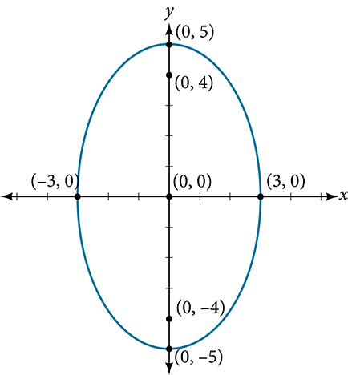

>
> Try It
> 19. Graph the ellipse given by the equation $\frac{{x}^{2}}{36}+\frac{{y}^{2}}{4}=1.$ Identify and label the center, vertices, co-vertices, and foci.
>
> 

> 
Solution

>
> center: $\left(0,0\right);$ vertices: $\left(\pm 6,0\right);$ co-vertices: $\left(0,\pm 2\right);$ foci: $\left(\pm 4\sqrt{2},0\right)$
>
>
>
>
> 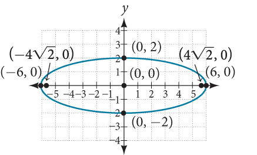
> 

>

20. **Graphing an Ellipse Centered at the Origin from an Equation Not in Standard Form**   Graph the ellipse given by the equation $4{x}^{2}+25{y}^{2}=100.$ Rewrite the equation in standard form. Then identify and label the center, vertices, co-vertices, and foci.

Solution

First, use algebra to rewrite the equation in standard form.

  $\begin{array}{l}\ 4{x}^{2}+25{y}^{2}=100  \\ \text\ \frac{4{x}^{2}}{100}+\frac{25{y}^{2}}{100}=\frac{100}{100}  \\ \text{\ \ \ \ \ \ \}\frac{{x}^{2}}{25}+\frac{{y}^{2}}{4}=1  \end{array}$ Next, we determine the position of the major axis. Because $25>4,$ the major axis is on the *x*-axis. Therefore, the equation is in the form $\frac{{x}^{2}}{{a}^{2}}+\frac{{y}^{2}}{{b}^{2}}=1,$ where ${a}^{2}=25$ and ${b}^{2}=4.$ It follows that:
the center of the ellipse is $\left(0,0\right)$

the coordinates of the vertices are $\left(\pm a,0\right)=\left(\pm \sqrt{25},0\right)=\left(\pm 5,0\right)$

the coordinates of the co-vertices are $\left(\mathrm{0,}\pm b\right)=\left(\mathrm{0,}\pm \sqrt{4}\right)=\left(\mathrm{0,}\pm 2\right)$

the coordinates of the foci are $\left(\pm c,0\right),$ where ${c}^{2}={a}^{2}-{b}^{2}.$ Solving for $c,$ we have:

 $$
\begin{array}{l}c=\pm \sqrt{{a}^{2}-{b}^{2}}  \\ =\pm \sqrt{25-4}  \\ =\pm \sqrt{21}  \end{array}
$$

Therefore the coordinates of the foci are $\left(\pm \sqrt{21},0\right).$

Next, we plot and label the center, vertices, co-vertices, and foci, and draw a smooth curve to form the ellipse.

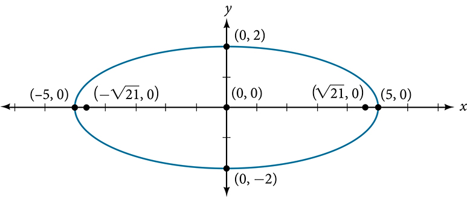

>
> Try It
> 21. Graph the ellipse given by the equation $49{x}^{2}+16{y}^{2}=784.$ Rewrite the equation in standard form. Then identify and label the center, vertices, co-vertices, and foci.
>
> 

> 
Solution

>
> Standard form: $\frac{{x}^{2}}{16}+\frac{{y}^{2}}{49}=1;$ center: $\left(0,0\right);$ vertices: $\left(0,\pm 7\right);$ co-vertices: $\left(\pm 4,0\right);$ foci: $\left(0,\pm \sqrt{33}\right)$
>
>
>
>
> 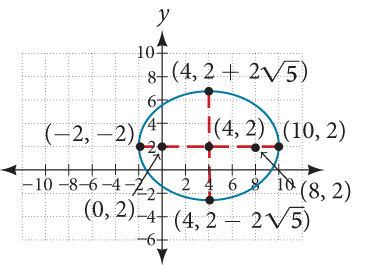
> 

>

 
# Graphing Ellipses Not Centered at the Origin
When an **ellipse** is not centered at the origin, we can still use the standard forms to find the key features of the graph. When the ellipse is centered at some point, $\left(h,k\right),$ we use the standard forms $\frac{{\left(x-h\right)}^{2}}{{a}^{2}}+\frac{{\left(y-k\right)}^{2}}{{b}^{2}}=1,\phantom{\rule{0.5em}{0ex}}\text{}a>b$ for horizontal ellipses and $\frac{{\left(x-h\right)}^{2}}{{b}^{2}}+\frac{{\left(y-k\right)}^{2}}{{a}^{2}}=1,\phantom{\rule{0.5em}{0ex}}\text{}a>b$ for vertical ellipses. From these standard equations, we can easily determine the center, vertices, co-vertices, foci, and positions of the major and minor axes.

>
>    How To
>    *Given the standard form of an equation for an ellipse centered at $\left(h,k\right),$ sketch the graph.*
>
> Use the standard forms of the equations of an ellipse to determine the center, position of the major axis, vertices, co-vertices, and foci.
>
>     If the equation is in the form $\frac{{\left(x-h\right)}^{2}}{{a}^{2}}+\frac{{\left(y-k\right)}^{2}}{{b}^{2}}=1,$ where $a>b,$ then
>    the center is $\left(h,k\right)$
>
> the major axis is parallel to the *x*-axis
>     the coordinates of the vertices are $\left(h\pm a,k\right)$
>
>     the coordinates of the co-vertices are $\left(h,k\pm b\right)$
>
>     the coordinates of the foci are $\left(h\pm c,k\right)$
>
>
>     If the equation is in the form $\frac{{\left(x-h\right)}^{2}}{{b}^{2}}+\frac{{\left(y-k\right)}^{2}}{{a}^{2}}=1,$ where $a>b,$ then
>    the center is $\left(h,k\right)$
>
>    the major axis is parallel to the *y*-axis
>     the coordinates of the vertices are $\left(h,k\pm a\right)$
>
>     the coordinates of the co-vertices are $\left(h\pm b,k\right)$
>
>     the coordinates of the foci are $\left(h,k\pm c\right)$
>
>
>
>
>  Solve for $c$ using the equation ${c}^{2}={a}^{2}-{b}^{2}.$
>
>  Plot the center, vertices, co-vertices, and foci in the coordinate plane, and draw a smooth curve to form the ellipse.

   22. **Graphing an Ellipse Centered at (*h*, *k*)**        Graph the ellipse given by the equation, $\frac{{\left(x+2\right)}^{2}}{4}+\frac{{\left(y-5\right)}^{2}}{9}=1.$ Identify and label the center, vertices, co-vertices, and foci.

Solution

First, we determine the position of the major axis. Because $9>4,$ the major axis is parallel to the *y*-axis. Therefore, the equation is in the form $\frac{{\left(x-h\right)}^{2}}{{b}^{2}}+\frac{{\left(y-k\right)}^{2}}{{a}^{2}}=1,$ where ${b}^{2}=4$ and ${a}^{2}=9.$ It follows that:
the center of the ellipse is $\left(h,k\right)=\left(\mathrm{-2},\text{5}\right)$
     
     the coordinates of the vertices are $(h,k\pm a)=(-2,5\pm \sqrt{9})=(-2,5\pm 3),$ or $\left(\mathrm{-2},\text{2}\right)$ and $\left(\mathrm{-2},\text{8}\right)$
     
     the coordinates of the co-vertices are $(h\pm b,k)=(-2\pm \sqrt{4},5)=(-2\pm 2,5),$ or $\left(\mathrm{-4},5\right)$ and $\left(0,\text{5}\right)$
     
     the coordinates of the foci are $\left(h,k\pm c\right),$ where ${c}^{2}={a}^{2}-{b}^{2}.$ Solving for $c,$ we have:
    

 $$
\begin{array}{l}\begin{array}{l}\\ c=\pm \sqrt{{a}^{2}-{b}^{2}}\end{array}  \\ =\pm \sqrt{9-4}  \\ =\pm \sqrt{5}  \end{array}
$$

Therefore, the coordinates of the foci are $\left(\mathrm{-2},\text{5}-\sqrt{5}\right)$ and $\left(\mathrm{-2},\text{5+}\sqrt{5}\right).$
     
Next, we plot and label the center, vertices, co-vertices, and foci, and draw a smooth curve to form the ellipse.

    

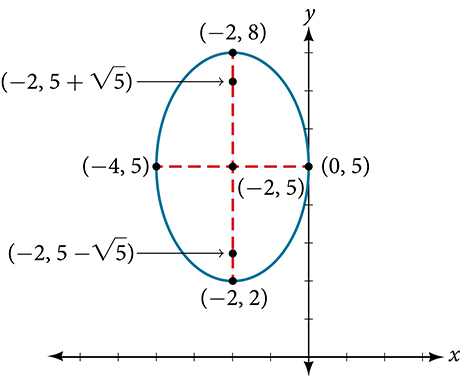

>
>    Try It
>    23. Graph the ellipse given by the equation $\frac{{\left(x-4\right)}^{2}}{36}+\frac{{\left(y-2\right)}^{2}}{20}=1.$ Identify and label the center, vertices, co-vertices, and foci.
>
> 

> 
Solution

>
> Center: $\left(4,2\right);$ vertices: $\left(-2,2\right)$ and $\left(10,2\right);$ co-vertices: $\left(4,2-2\sqrt{5}\right)$ and $\left(4,2+2\sqrt{5}\right);$ foci: $\left(0,2\right)$ and $\left(8,2\right)$
>
>
>
> 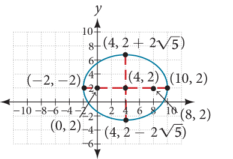
> 

>

> How To
>    *Given the general form of an equation for an ellipse centered at (*h*, *k*), express the equation in standard form.*
> Recognize that an ellipse described by an equation in the form $a{x}^{2}+b{y}^{2}+cx+dy+e=0$ is in general form.
> Rearrange the equation by grouping terms that contain the same variable. Move the constant term to the opposite side of the equation.
>     Factor out the coefficients of the ${x}^{2}$ and ${y}^{2}$ terms in preparation for completing the square.
>     Complete the square for each variable to rewrite the equation in the form of the sum of multiples of two binomials squared set equal to a constant, ${m}_{1}{\left(x-h\right)}^{2}+{m}_{2}{\left(y-k\right)}^{2}={m}_{3},$ where ${m}_{1},{m}_{2},$ and ${m}_{3}$ are constants.
>     Divide both sides of the equation by the constant term to express the equation in standard form.
>

   24. **Graphing an Ellipse Centered at (*h*, *k*) by First Writing It in Standard Form**        Graph the ellipse given by the equation $4{x}^{2}+9{y}^{2}-40x+36y+100=0.$ Identify and label the center, vertices, co-vertices, and foci.

Solution

We must begin by rewriting the equation in standard form.

      $4{x}^{2}+9{y}^{2}-40x+36y+100=0$
     
    Group terms that contain the same variable, and move the constant to the opposite side of the equation.

      $\left(4{x}^{2}-40x\right)+\left(9{y}^{2}+36y\right)=\mathrm{-100}$
     Factor out the coefficients of the squared terms.

      $4\left({x}^{2}-10x\right)+9\left({y}^{2}+4y\right)=\mathrm{-100}$
     Complete the square twice. Remember to balance the equation by adding the same constants to each side.

      $4\left({x}^{2}-10x+25\right)+9\left({y}^{2}+4y+4\right)=\mathrm{-100}+100+36$
     Rewrite as perfect squares.

      $4{\left(x-5\right)}^{2}+9{\left(y+2\right)}^{2}=36$
     
    Divide both sides by the constant term to place the equation in standard form.

      $\frac{{\left(x-5\right)}^{2}}{9}+\frac{{\left(y+2\right)}^{2}}{4}=1$
     
     Now that the equation is in standard form, we can determine the position of the major axis. Because $9>4,$ the major axis is parallel to the *x*-axis. Therefore, the equation is in the form $\frac{{\left(x-h\right)}^{2}}{{a}^{2}}+\frac{{\left(y-k\right)}^{2}}{{b}^{2}}=1,$ where ${a}^{2}=9$ and ${b}^{2}=4.$ It follows that:
the center of the ellipse is $\left(h,k\right)=\left(5,\mathrm{-2}\right)$
     
     the coordinates of the vertices are $\left(h\pm a,k\right)=\left(5\pm \sqrt{9},\mathrm{-2}\right)=\left(5\pm 3,\mathrm{-2}\right),$ or $\left(2,\mathrm{-2}\right)$ and $\left(8,\mathrm{-2}\right)$
     
     the coordinates of the co-vertices are $\left(h,k\pm b\right)=\left(\text{5},\mathrm{-2}\pm \sqrt{4}\right)=\left(\text{5},\mathrm{-2}\pm 2\right),$ or $\left(5,\mathrm{-4}\right)$ and $\left(5,\text{0}\right)$
     
     the coordinates of the foci are $\left(h\pm c,k\right),$ where ${c}^{2}={a}^{2}-{b}^{2}.$ Solving for $c,$ we have:
     $$
\begin{array}{l}c=\pm \sqrt{{a}^{2}-{b}^{2}}  \\ =\pm \sqrt{9-4}  \\ =\pm \sqrt{5}  \end{array}
$$
Therefore, the coordinates of the foci are $\left(\text{5}-\sqrt{5},\mathrm{-2}\right)$ and $\left(\text{5+}\sqrt{5},\mathrm{-2}\right).$
     
Next we plot and label the center, vertices, co-vertices, and foci, and draw a smooth curve to form the ellipse as shown in .

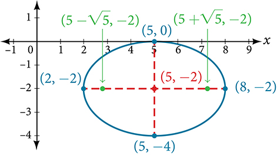

>
>    Try It
>    25. Express the equation of the ellipse given in standard form. Identify the center, vertices, co-vertices, and foci of the ellipse.   $4{x}^{2}+{y}^{2}-24x+2y+21=0$
>
> 

> 
Solution

>
> $\frac{{(x-3)}^{2}}{4}+\frac{{\left(y+1\right)}^{2}}{16}=1;$ center: $\left(3,-1\right);$ vertices: $\left(3,-\text{5}\right)$ and $\left(3,\text{3}\right);$ co-vertices: $\left(1,-1\right)$ and $\left(5,-1\right);$ foci: $\left(3,-\text{1}-2\sqrt{3}\right)$ and $\left(3,-\text{1+}2\sqrt{3}\right)$
> 

>
>
>

 
# Solving Applied Problems Involving Ellipses
Many real-world situations can be represented by ellipses, including orbits of planets, satellites, moons and comets, and shapes of boat keels, rudders, and some airplane wings. A medical device called a lithotripter uses elliptical reflectors to break up kidney stones by generating sound waves. Some buildings, called whispering chambers, are designed with elliptical domes so that a person whispering at one focus can easily be heard by someone standing at the other focus. This occurs because of the acoustic properties of an ellipse. When a sound wave originates at one focus of a whispering chamber, the sound wave will be reflected off the elliptical dome and back to the other focus. See . In the whisper chamber at the Museum of Science and Industry in Chicago, two people standing at the foci—about 43 feet apart—can hear each other whisper.  When these chambers are placed in unexpected places, such as the ones inside Bush International Airport in Houston and Grand Central Terminal in New York City, they can induce surprised reactions among travelers. 

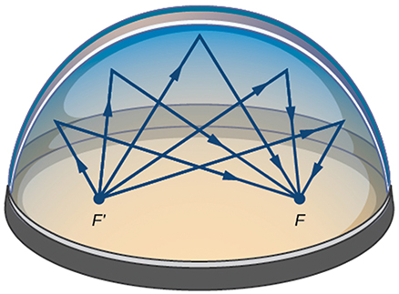

   26. **Locating the Foci of a Whispering Chamber**        A large room in an art gallery is a whispering chamber. Its dimensions are 46 feet wide by 96 feet long as shown in . What is the standard form of the equation of the ellipse representing the outline of the room? Hint: assume a horizontal ellipse, and let the center of the room be the point $\left(0,0\right).$       If two visitors standing at the foci of this room can hear each other whisper, how far apart are the two visitors? Round to the nearest foot.        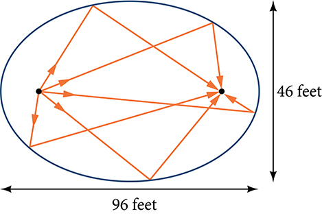

Solution

We are assuming a horizontal ellipse with center $\left(0,0\right),$ so we need to find an equation of the form $\frac{{x}^{2}}{{a}^{2}}+\frac{{y}^{2}}{{b}^{2}}=1,$ where $a>b.$ We know that the length of the major axis, $2a,$ is longer than the length of the minor axis, $2b.$ So the length of the room, 96, is represented by the major axis, and the width of the room, 46, is represented by the minor axis.
    Solving for $a,$ we have $2a=96,$ so $a=48,$ and ${a}^{2}=2304.$
     
     Solving for $b,$ we have $2b=46,$ so $b=23,$ and ${b}^{2}=529.$
     
    Therefore, the equation of the ellipse is $\frac{{x}^{2}}{2304}+\frac{{y}^{2}}{529}=1.$ 

     
     To find the distance between the senators, we must find the distance between the foci, $\left(\pm c,0\right),$ where ${c}^{2}={a}^{2}-{b}^{2}.$ Solving for $c,$ we have:
       $$
\begin{array}{ll}{c}^{2}={a}^{2}-{b}^{2}  &   \\ {c}^{2}=2304-529  & \begin{array}{cccc}& & & \end{array}\text{Substitute\ using\ the\ values\ found\ in\ part\ (a)}.  \\ c=\pm \sqrt{2304-529}  & \begin{array}{cccc}& & & \end{array}\text{Take\ the\ square\ root\ of\ both\ sides}.  \\ c=\pm \sqrt{1775}\   & \begin{array}{cccc}& & & \end{array}\text{Subtract}.  \\ c\approx \pm 42  & \begin{array}{cccc}& & & \end{array}\text{Round\ to\ the\ nearest\ foot}.  \end{array}
$$
The points $\left(\pm 42,0\right)$ represent the foci. Thus, the distance between the senators is $2\left(42\right)=84$ feet.

>
>    Try It
>    27. Suppose a whispering chamber is 480 feet long and 320 feet wide.  ⓐ What is the standard form of the equation of the ellipse representing the room? Hint: assume a horizontal ellipse, and let the center of the room be the point $\left(0,0\right).$ ⓑ If two people are standing at the foci of this room and can hear each other whisper, how far apart are the people? Round to the nearest foot.
>
> 

> 
Solution

>
> ⓐ $\frac{{x}^{2}}{57,600}+\frac{{y}^{2}}{25,600}=1$
>
>    ⓑ The people are standing 358 feet apart.
> 

>
>
>

>
>    Media
>
>    Access these online resources for additional instruction and practice with ellipses.
>
>
>    Conic Sections: The Ellipse
>
>     Graph an Ellipse with Center at the Origin
>
>    Graph an Ellipse with Center Not at the Origin
>

  
# Key Equations

| Horizontal ellipse, center at origin | $\frac{{x}^{2}}{{a}^{2}}+\frac{{y}^{2}}{{b}^{2}}=1,\phantom{\rule{0.5em}{0ex}}\text{}a>b$ |
| :--- | :--- |
| Vertical ellipse, center at origin | $\frac{{x}^{2}}{{b}^{2}}+\frac{{y}^{2}}{{a}^{2}}=1,\phantom{\rule{0.5em}{0ex}}\text{}a>b$ |
| Horizontal ellipse, center $(h,k)$ | $\frac{{\left(x-h\right)}^{2}}{{a}^{2}}+\frac{{\left(y-k\right)}^{2}}{{b}^{2}}=1,\phantom{\rule{0.5em}{0ex}}\text{}a>b$ |
| Vertical ellipse, center $(h,k)$ | $\frac{{\left(x-h\right)}^{2}}{{b}^{2}}+\frac{{\left(y-k\right)}^{2}}{{a}^{2}}=1,\phantom{\rule{0.5em}{0ex}}\text{}a>b$ |

  
# Key Concepts
An ellipse is the set of all points $\left(x,y\right)$ in a plane such that the sum of their distances from two fixed points is a constant. Each fixed point is called a focus (plural: foci).
 When given the coordinates of the foci and vertices of an ellipse, we can write the equation of the ellipse in standard form. See  and .
 When given an equation for an ellipse centered at the origin in standard form, we can identify its vertices, co-vertices, foci, and the lengths and positions of the major and minor axes in order to graph the ellipse. See  and .

 When given the equation for an ellipse centered at some point other than the origin, we can identify its key features and graph the ellipse. See  and .

 Real-world situations can be modeled using the standard equations of ellipses and then evaluated to find key features, such as lengths of axes and distance between foci. See .

  
# Section Exercises

## Verbal
1. Define an ellipse in terms of its foci.

Solution

An ellipse is the set of all points in the plane the sum of whose distances from two fixed points, called the foci, is a constant.

2. Where must the foci of an ellipse lie?

3. What special case of the ellipse do we have when the major and minor axis are of the same length?

Solution

This special case would be a circle.

4. For the special case mentioned in the previous question, what would be true about the foci of that ellipse?

5. What can be said about the symmetry of the graph of an ellipse with center at the origin and foci along the *y*-axis?

Solution

It is symmetric about the *x*-axis, *y*-axis, and the origin.

## Algebraic
For the following exercises, determine whether the given equations represent ellipses. If yes, write in standard form.
6. $2{x}^{2}+y=4$

7. $4{x}^{2}+9{y}^{2}=36$

Solution

yes; $\frac{{x}^{2}}{{3}^{2}}+\frac{{y}^{2}}{{2}^{2}}=1$

8. $4{x}^{2}-{y}^{2}=4$

9. $4{x}^{2}+9{y}^{2}=1$

Solution

yes; $\frac{{x}^{2}}{{\left(\frac{1}{2}\right)}^{2}}+\frac{{y}^{2}}{{\left(\frac{1}{3}\right)}^{2}}=1$

10. $4{x}^{2}-8x+9{y}^{2}-72y+112=0$

For the following exercises, write the equation of an ellipse in standard form, and identify the end points of the major and minor axes as well as the foci.
11. $\frac{{x}^{2}}{4}+\frac{{y}^{2}}{49}=1$

Solution

$\frac{{x}^{2}}{{2}^{2}}+\frac{{y}^{2}}{{7}^{2}}=1;$ Endpoints of major axis $\left(0,7\right)$ and $\left(0,-7\right).$ Endpoints of minor axis $\left(2,0\right)$ and $\left(-2,0\right).$ Foci at $\left(0,3\sqrt{5}\right),\left(0,-3\sqrt{5}\right).$

12. $\frac{{x}^{2}}{100}+\frac{{y}^{2}}{64}=1$

13. ${x}^{2}+9{y}^{2}=1$

Solution

$\frac{{x}^{2}}{{\left(1\right)}^{2}}+\frac{{y}^{2}}{{\left(\frac{1}{3}\right)}^{2}}=1;$ Endpoints of major axis $\left(1,0\right)$ and $\left(-1,0\right).$ Endpoints of minor axis $\left(0,\frac{1}{3}\right),\left(0,-\frac{1}{3}\right).$ Foci at $\left(\frac{2\sqrt{2}}{3},0\right),\left(-\frac{2\sqrt{2}}{3},0\right).$

14. $4{x}^{2}+16{y}^{2}=1$

15. $\frac{{\left(x-2\right)}^{2}}{49}+\frac{{\left(y-4\right)}^{2}}{25}=1$

Solution

$\frac{{\left(x-2\right)}^{2}}{{7}^{2}}+\frac{{\left(y-4\right)}^{2}}{{5}^{2}}=1;$ Endpoints of major axis $\left(9,4\right),\left(-5,4\right).$ Endpoints of minor axis $\left(2,9\right),\left(2,-1\right).$ Foci at $\left(2+2\sqrt{6},4\right),\left(2-2\sqrt{6},4\right).$

16. $\frac{{\left(x-2\right)}^{2}}{81}+\frac{{\left(y+1\right)}^{2}}{16}=1$

17. $\frac{{\left(x+5\right)}^{2}}{4}+\frac{{\left(y-7\right)}^{2}}{9}=1$

Solution

$\frac{{\left(x+5\right)}^{2}}{{2}^{2}}+\frac{{\left(y-7\right)}^{2}}{{3}^{2}}=1;$ Endpoints of major axis $\left(-5,10\right),\left(-5,4\right).$ Endpoints of minor axis $\left(-3,7\right),\left(-7,7\right).$ Foci at $\left(-5,7+\sqrt{5}\right),\left(-5,7-\sqrt{5}\right).$

18. $\frac{{\left(x-7\right)}^{2}}{49}+\frac{{\left(y-7\right)}^{2}}{49}=1$

19. $4{x}^{2}-8x+9{y}^{2}-72y+112=0$

Solution

$\frac{{\left(x-1\right)}^{2}}{{3}^{2}}+\frac{{\left(y-4\right)}^{2}}{{2}^{2}}=1;$ Endpoints of major axis $\left(4,4\right),\left(-2,4\right).$ Endpoints of minor axis $\left(1,6\right),\left(1,2\right).$ Foci at $\left(1+\sqrt{5},4\right),\left(1-\sqrt{5},4\right).$

20. $9{x}^{2}-54x+9{y}^{2}-54y+81=0$

21. $4{x}^{2}-24x+36{y}^{2}-360y+864=0$

Solution

$\frac{{\left(x-3\right)}^{2}}{{\left(3\sqrt{2}\right)}^{2}}+\frac{{\left(y-5\right)}^{2}}{{\left(\sqrt{2}\right)}^{2}}=1;$ Endpoints of major axis $\left(3+3\sqrt{2},5\right),\left(3-3\sqrt{2},5\right).$ Endpoints of minor axis $\left(3,5+\sqrt{2}\right),\left(3,5-\sqrt{2}\right).$ Foci at $\left(7,5\right),\left(-1,5\right).$

22. $4{x}^{2}+24x+16{y}^{2}-128y+228=0$

23. $4{x}^{2}+40x+25{y}^{2}-100y+100=0$

Solution

$\frac{{\left(x+5\right)}^{2}}{{\left(5\right)}^{2}}+\frac{{\left(y-2\right)}^{2}}{{\left(2\right)}^{2}}=1;$ Endpoints of major axis $\left(0,2\right),\left(-10,2\right).$ Endpoints of minor axis $\left(-5,4\right),\left(-5,0\right).$ Foci at $\left(-5+\sqrt{21},2\right),\left(-5-\sqrt{21},2\right).$

24. ${x}^{2}+2x+100{y}^{2}-1000y+2401=0$

25. $4{x}^{2}+24x+25{y}^{2}+200y+336=0$

Solution

$\frac{{\left(x+3\right)}^{2}}{{\left(5\right)}^{2}}+\frac{{\left(y+4\right)}^{2}}{{\left(2\right)}^{2}}=1;$ Endpoints of major axis $\left(2,-4\right),\left(-8,-4\right).$ Endpoints of minor axis $\left(-3,-2\right),\left(-3,-6\right).$ Foci at $\left(-3+\sqrt{21},-4\right),\left(-3-\sqrt{21},-4\right).$

26. $9{x}^{2}+72x+16{y}^{2}+16y+4=0$

For the following exercises, find the foci for the given ellipses.
27. $\frac{{\left(x+3\right)}^{2}}{25}+\frac{{\left(y+1\right)}^{2}}{36}=1$

Solution

Foci $\left(-3,-1+\sqrt{11}\right),\left(-3,-1-\sqrt{11}\right)$

28. $\frac{{\left(x+1\right)}^{2}}{100}+\frac{{\left(y-2\right)}^{2}}{4}=1$

29. ${x}^{2}+{y}^{2}=1$

Solution

Focus $\left(0,0\right)$

30. ${x}^{2}+4{y}^{2}+4x+8y=1$

31. $10{x}^{2}+{y}^{2}+200x=0$

Solution

Foci $\left(-10,30\right),\left(-10,-30\right)$

## Graphical
For the following exercises, graph the given ellipses, noting center, vertices, and foci.
32. $\frac{{x}^{2}}{25}+\frac{{y}^{2}}{36}=1$

33. $\frac{{x}^{2}}{16}+\frac{{y}^{2}}{9}=1$

Solution

Center $\left(0,0\right),$ Vertices $\left(4,0\right),\left(-4,0\right),(0,3),(0,-3),$ Foci $\left(\sqrt{7},0\right),\left(-\sqrt{7},0\right)$
     

     

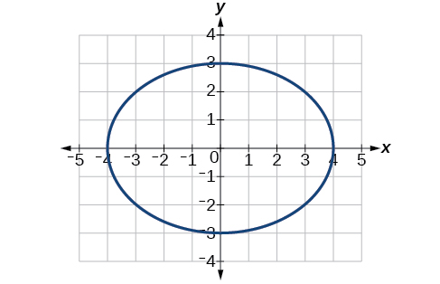

34. $4{x}^{2}+9{y}^{2}=1$

35. $81{x}^{2}+49{y}^{2}=1$

Solution

Center $\left(0,0\right),$ Vertices $\left(\frac{1}{9},0\right),\left(-\frac{1}{9},0\right),\left(0,\frac{1}{7}\right),\left(0,-\frac{1}{7}\right),$ Foci $\left(0,\frac{4\sqrt{2}}{63}\right),\left(0,-\frac{4\sqrt{2}}{63}\right)$
     

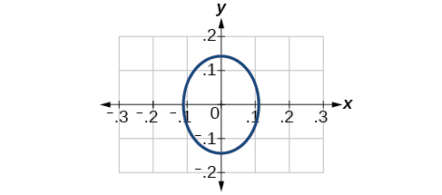

36. $\frac{{\left(x-2\right)}^{2}}{64}+\frac{{\left(y-4\right)}^{2}}{16}=1$

37. $\frac{{\left(x+3\right)}^{2}}{9}+\frac{{\left(y-3\right)}^{2}}{9}=1$

Solution

Center $\left(-3,3\right),$ Vertices $\left(0,3\right),\left(-6,3\right),\left(-3,0\right),\left(-3,6\right),$ Focus $\left(-3,3\right)$ 

    Note that this ellipse is a circle. The circle has only one focus, which coincides with the center.

     

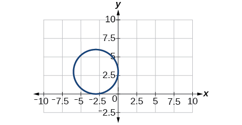

38. $\frac{{x}^{2}}{2}+\frac{{\left(y+1\right)}^{2}}{5}=1$

39. $4{x}^{2}-8x+16{y}^{2}-32y-44=0$

Solution

Center $\left(1,1\right),$ Vertices $\left(5,1\right),\left(-3,1\right),\left(1,3\right),\left(1,-1\right),$ Foci $(1+2\sqrt{3},1),(1-2\sqrt{3},1)$
     

     

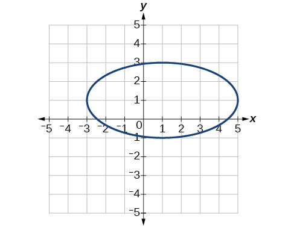

40. ${x}^{2}-8x+25{y}^{2}-100y+91=0$

41. ${x}^{2}+8x+4{y}^{2}-40y+112=0$

Solution

Center $\left(-4,5\right),$ Vertices $\left(-2,5\right),\left(-6,5\right),\left(-4,6\right),\left(-4,4\right),$ Foci $\left(-4+\sqrt{3},5\right),\left(-4-\sqrt{3},5\right)$
     

     

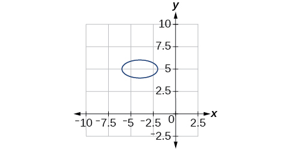

42. $64{x}^{2}+128x+9{y}^{2}-72y-368=0$

43. $16{x}^{2}+64x+4{y}^{2}-8y+4=0$

Solution

Center $\left(-2,1\right),$ Vertices $\left(0,1\right),\left(-4,1\right),\left(-2,5\right),\left(-2,-3\right),$ Foci $\left(-2,1+2\sqrt{3}\right),\left(-2,1-2\sqrt{3}\right)$
     

     

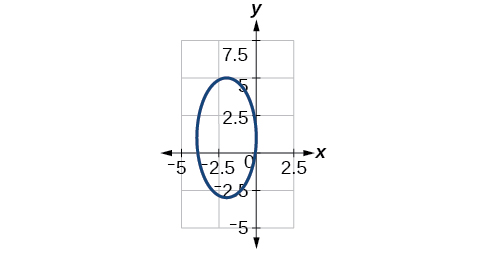

44. $100{x}^{2}+1000x+{y}^{2}-10y+2425=0$

45. $4{x}^{2}+16x+4{y}^{2}+16y+16=0$

Solution

Center $\left(-2,-2\right),$ Vertices $\left(0,-2\right),\left(-4,-2\right),\left(-2,0\right),\left(-2,-4\right),$ Focus $\left(-2,-2\right)$
     

     

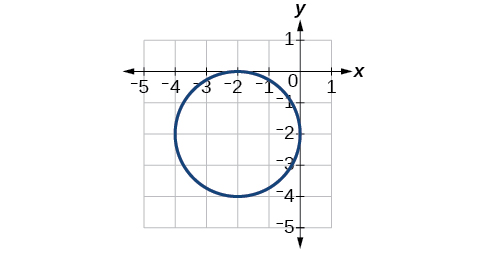

For the following exercises, use the given information about the graph of each ellipse to determine its equation.
46. Center at the origin, symmetric with respect to the *x*- and *y*-axes, focus at $(4,0),$ and point on graph $(0,3).$

47. Center at the origin, symmetric with respect to the *x*- and *y*-axes, focus at $(0,\mathrm{-2}),$ and point on graph $(5,0).$

Solution

$\frac{{x}^{2}}{25}+\frac{{y}^{2}}{29}=1$

48. Center at the origin, symmetric with respect to the *x*- and *y*-axes, focus at $(3,0),$ and major axis is twice as long as minor axis.

49. Center $\left(4,2\right)$ ; vertex $\left(9,2\right)$ ; one focus: $\left(4+2\sqrt{6},2\right)$ .

Solution

$\frac{{\left(x-4\right)}^{2}}{25}+\frac{{\left(y-2\right)}^{2}}{1}=1$

50. Center $\left(3,5\right)$ ; vertex $\left(3,11\right)$ ; one focus: $\left(3,\phantom{\rule{0.5em}{0ex}}\text{5+4}\sqrt{\text{2}}\right)$

51. Center $\left(\mathrm{-3},4\right)$ ; vertex $\left(1,4\right)$ ; one focus: $\left(\mathrm{-3}+2\sqrt{3},4\right)$

Solution

$\frac{{\left(x+3\right)}^{2}}{16}+\frac{{\left(y-4\right)}^{2}}{4}=1$

For the following exercises, given the graph of the ellipse, determine its equation.
52. 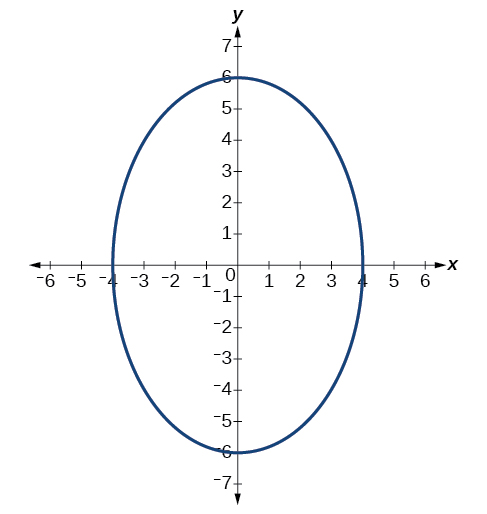

53. 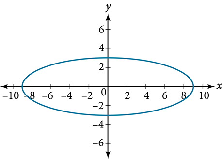

Solution

$\frac{{x}^{2}}{81}+\frac{{y}^{2}}{9}=1$

54. 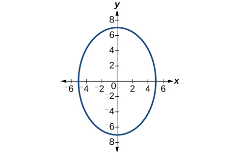

55. 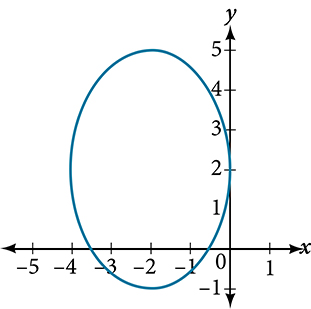

Solution

$\frac{{\left(x+2\right)}^{2}}{4}+\frac{{\left(y-2\right)}^{2}}{9}=1$

56. 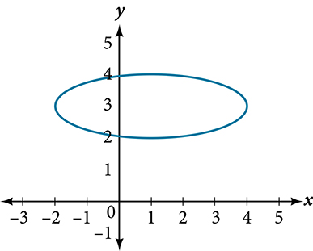

## Extensions
For the following exercises, find the area of the ellipse. The area of an ellipse is given by the formula $\text{Area}=a\cdot b\cdot \pi .$
    
57. $\frac{{\left(x-3\right)}^{2}}{9}+\frac{{\left(y-3\right)}^{2}}{16}=1$

Solution

$\text{Area\ =\ 12\pi}\phantom{\rule{0.5em}{0ex}}\text{square}\phantom{\rule{0.5em}{0ex}}\text{units}$

58. $\frac{{\left(x+6\right)}^{2}}{16}+\frac{{\left(y-6\right)}^{2}}{36}=1$

59. $\frac{{\left(x+1\right)}^{2}}{4}+\frac{{\left(y-2\right)}^{2}}{5}=1$

Solution

$\text{Area\ =\ 2}\sqrt{\text{5}}\text{\pi}$ square units.

60. $4{x}^{2}-8x+9{y}^{2}-72y+112=0$

61. $9{x}^{2}-54x+9{y}^{2}-54y+81=0$

Solution

$\text{Area\ =\ 9\pi}$ square units.

## Real-World Applications
62. Find the equation of the ellipse that will just fit inside a box that is 8 units wide and 4 units high.

63. Find the equation of the ellipse that will just fit inside a box that is four times as wide as it is high. Express in terms of $h,$ the height.

Solution

$\frac{{x}^{2}}{4{h}^{2}}+\frac{{y}^{2}}{\frac{1}{4}{h}^{2}}=1$

64. An arch has the shape of a semi-ellipse (the top half of an ellipse). The arch has a height of 8 feet and a span of 20 feet. Find an equation for the ellipse, and use that to find the height to the nearest 0.01 foot of the arch at a distance of 4 feet from the center.

65. An arch has the shape of a semi-ellipse. The arch has a height of 12 feet and a span of 40 feet. Find an equation for the ellipse, and use that to find the distance from the center to a point at which the height is 6 feet. Round to the nearest hundredth.

Solution

$\frac{{x}^{2}}{400}+\frac{{y}^{2}}{144}=1$ . Distance = 17.32 feet

66. A bridge is to be built in the shape of a semi-elliptical arch and is to have a span of 120 feet. The height of the arch at a distance of 40 feet from the center is to be 8 feet. Find the height of the arch at its center.

67. A person in a whispering gallery standing at one focus of the ellipse can whisper and be heard by a person standing at the other focus because all the sound waves that reach the ceiling are reflected to the other person. If a whispering gallery has a length of 120 feet, and the foci are located 30 feet from the center, find the height of the ceiling at the center.

Solution

Approximately 51.96 feet

68. A person is standing 8 feet from the nearest wall in a whispering gallery. If that person is at one focus, and the other focus is 80 feet away, what is the length and height at the center of the gallery?

 
 **center of an ellipse** the midpoint of both the major and minor axes
 **conic section** any shape resulting from the intersection of a right circular cone with a plane
  **ellipse** the set of all points $\left(x,y\right)$ in a plane such that the sum of their distances from two fixed points is a constant
 **foci** plural of focus
  **focus (of an ellipse)** one of the two fixed points on the major axis of an ellipse such that the sum of the distances from these points to any point $\left(x,y\right)$ on the ellipse is a constant
 **major axis** the longer of the two axes of an ellipse
 **minor axis** the shorter of the two axes of an ellipse
