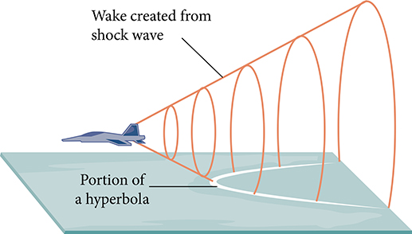
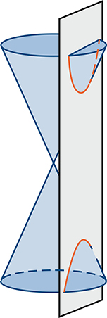
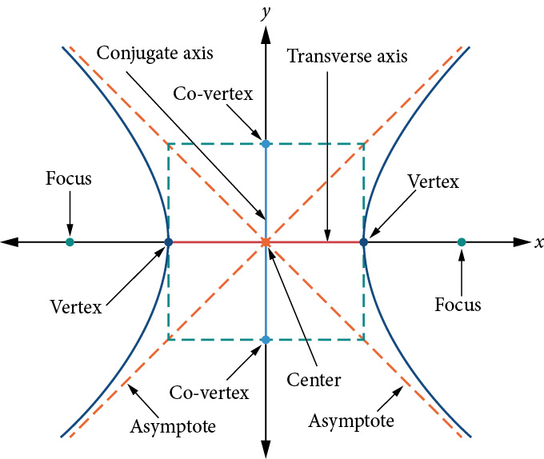
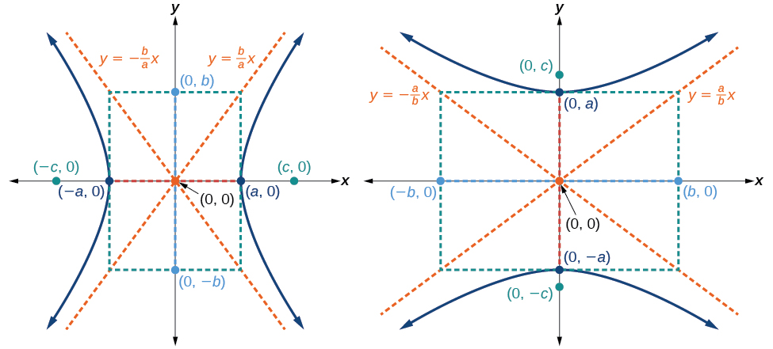
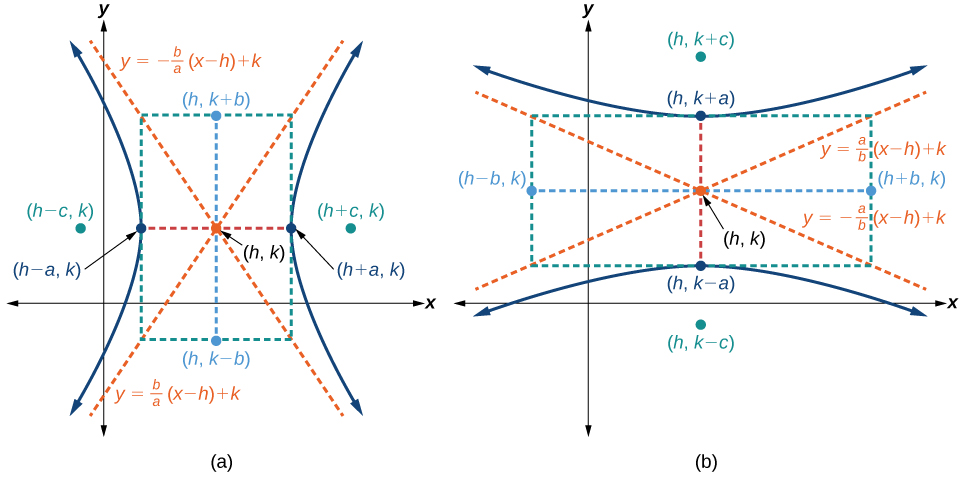
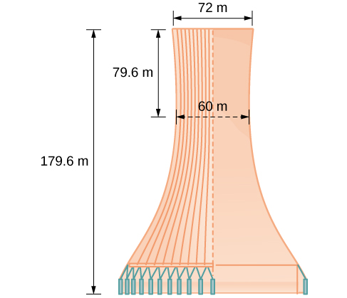

The Hyperbola
=============

  m49439
  
The Hyperbola
=============

  In this section, you will:

Locate a hyperbola’s vertices and foci.
Write equations of hyperbolas in standard form.
Graph hyperbolas centered at the origin.
Graph hyperbolas not centered at the origin.
Solve applied problems involving hyperbolas.

  23e28179-8eb8-4790-a332-861509a3d9fb

Learning Objectives
===================

Use the Distance Formula. (IA 11.1.1)
Graph a hyperbola with center at (0,0). (IA 11.4.1)

Objective 1: Use the Distance Formula. (IA 11.1.1)
==================================================

Distance Formula
================
**Distance Formula**: The distance *d* between two points $$\left({x}_{1},\ {y}_{1}\right)$$ and $$\left({x}_{2},\ {y}_{2}\right)$$ is $$d=\sqrt{{\left({x}_{2}-{x}_{1}\right)}^{2}+{\left({y}_{2}-{y}_{1}\right)}^{2}}$$ .

Use the Distance Formula
========================
Use the distance formula to find the distance between the points (−5, −3) and (7,2).

  
    Write the Distance Formula.
     $$d=\sqrt{{\left({x}_{2}-{x}_{1}\right)}^{2}+{\left({y}_{2}-{y}_{1}\right)}^{2}}$$ 
  
  
    Label the points (–5, –3) as (*x*1, *y*1) and point (7, 2) as (*x*2, *y*2) and substitute.
     $$d=\sqrt{{\left(72-\left(-5\right)\right)}^{2}+{\left(2-\left(-3\right)\right)}^{2}}$$ 
  
  
    Simplify.
     $$d=\sqrt{{12}^{2}+{5}^{2}}=\sqrt{144+55}=\sqrt{169}$$ 
  
 $$d=13$$ 

Practice Makes Perfect
======================
Use the Distance Formula.

  Use the Distance Formula to find the distance between the points (−2,−5) and (−14,−10).

  Use the Distance Formula to find the distance between the points (10, −4) and (−1,5). Write the answer in exact form and then find the decimal approximation, rounded to the nearest tenth if needed.

Objective 2: Graph a hyperbola with center at (0,0). (IA 11.4.1)
================================================================
A **hyperbola** is all points in a plane where the difference of their distances from two fixed points is constant. Each of the fixed points is called a **focus** of the hyperbola.
The line through the foci is called the **transverse axis**. The two points where the transverse axis intersects the hyperbola are each a **vertex** of the hyperbola. The midpoint of the segment joining the foci is called the **center** of the hyperbola. The line perpendicular to the transverse axis that passes through the center is called the **conjugate axis**. Each piece of the graph is called a **branch** of the hyperbola.

The standard form of the equation of a hyperbola with center (0,0)
==================================================================

  
    *Equation*
     $$\frac{{x}^{2}}{{a}^{2}}-\frac{{\displaystyle {y}^{2}}}{{b}^{2}}=1$$ 
     $$\frac{{y}^{2}}{{a}^{2}}-\frac{{\displaystyle {x}^{2}}}{{b}^{2}}=1$$ 
  
  
    *Orientation*
    Transverse axis is horizontal.
Opens right and left.

    Transverse axis is vertical.
Opens up and down.

  
  
    *Vertices*
    (-a, 0), (a, 0)
    (0, -a), (0, a)
  
  
    *x-intercepts*
    (-a, 0), (a, 0)
    none)
  
  
    *y-intercepts*
    none
    (0, -a), (0, a)
  
  
    *Rectangle*
    Use (±a,0), (0,±b)
    Use (0,±a), (±b,0)
  
  
    *Asymptotes*
    ( $$y=\pm \frac{{\displaystyle b}}{a}x$$ 
     $$y=\pm \frac{{\displaystyle a}}{b}x$$ 
  

*Notice* that, unlike the equation of an ellipse, the denominator of $${x}^{2}$$ is not always $${a}^{2}$$ and the denominator of $${y}^{2}$$ is not always $${b}^{2}$$ .
**Notice** that when the $${x}^{2}$$ term is positive, the transverse axis is on the x-axis. When the $${y}^{2}$$ term is positive, the transverse axis is on the y-axis.

How To Graph a hyperbola with center at (0, 0).
===============================================

Write the equation in standard form.
Determine if the transverse axis is horizontal or vertical.
Find the vertices.
Sketch the rectangle, entered at the origin, intersecting one axis at ±*a* and the other at ±*b*.
Sketch the asymptotes – the lines through the diagonals of the rectangle.
Draw the two branches of the hyperbola. Start at the vertex and use the asymptotes as a guide.

Graph a hyperbola with center at (0,0).
=======================================

Graph
 $$\frac{{x}^{2}}{25}-\frac{{y}^{2}}{4}=1.$$

Graph
 $$4{y}^{2}-16{x}^{2}=64.$$

$$4{y}^{2}-16{x}^{2}=64$$

To write the equation in standard form, divide

each term by 64 to make the equation equal to 1.

 $$\frac{4{y}^{2}}{64}-\frac{16{x}^{2}}{64}=\frac{64}{64}$$

Simplify.

 $$\phantom{\rule{1em}{0ex}}\frac{{y}^{2}}{16}-\frac{{x}^{2}}{4}=1$$

Since the
*y*
2
-term is positive, the transverse axis is vertical.

Since
 $${a}^{2}=16$$
then
 $$a=\text{\xb1}4.$$

The vertices are on the
*y*
-axis,
 $$\left(0,\text{\u2212}a\right),$$
 $$\left(0,a\right).$$

Since
 $${b}^{2}=4$$
then
 $$b=\text{\xb1}2.$$

 $$\left(0,\mathrm{-4}\right),$$
 $$\left(0,4\right)$$

Sketch the rectangle intersecting the
*x*
-axis at
 $$\left(\mathrm{-2},0\right),$$
 $$\left(2,0\right)$$
and the
*y*
-axis at the vertices.

Sketch the asymptotes through the diagonals of the rectangle.

Draw the two branches of the hyperbola.

Practice Makes Perfect
======================
Graph a hyperbola with center at (0,0).

  Graph $$\frac{{x}^{2}}{9}-\frac{{\displaystyle {y}^{2}}}{16}=1$$ .

Graph $$25{y}^{2}-9{x}^{2}=225$$ .
What do paths of comets, supersonic booms, ancient Grecian pillars, and natural draft cooling towers have in common? They can all be modeled by the same type of **conic**. For instance, when something moves faster than the speed of sound, a shock wave in the form of a cone is created. A portion of a conic is formed when the wave intersects the ground, resulting in a sonic boom. See .

\n\n\n\n

Most people are familiar with the sonic boom created by supersonic aircraft, but humans were breaking the sound barrier long before the first supersonic flight. The crack of a whip occurs because the tip is exceeding the speed of sound. The bullets shot from many firearms also break the sound barrier, although the bang of the gun usually supersedes the sound of the sonic boom.

Locating the Vertices and Foci  of a Hyperbola
==============================================
In analytic geometry, a **hyperbola** is a conic section formed by intersecting a right circular cone with a plane at an angle such that both halves of the cone are intersected. This intersection produces two separate unbounded curves that are mirror images of each other. See .

\n\n\n\n

Like the ellipse, the hyperbola can also be defined as a set of points in the coordinate plane. A hyperbola is the set of all points $$\left(x,y\right)$$ in a plane such that the difference of the distances between $$\left(x,y\right)$$ and the foci is a positive constant.
Notice that the definition of a hyperbola is very similar to that of an ellipse. The distinction is that the hyperbola is defined in terms of the *difference* of two distances, whereas the ellipse is defined in terms of the *sum* of two distances.
As with the ellipse, every hyperbola has two **axes of symmetry**. The **transverse axis** is a line segment that passes through the center of the hyperbola and has vertices as its endpoints. The foci lie on the line that contains the transverse axis. The **conjugate axis** is perpendicular to the transverse axis and has the co-vertices as its endpoints. The **center of a hyperbola** is the midpoint of both the transverse and conjugate axes, where they intersect. Every hyperbola also has two **asymptotes** that pass through its center. As a hyperbola recedes from the center, its branches approach these asymptotes. The **central rectangle** of the hyperbola is centered at the origin with sides that pass through each vertex and co-vertex; it is a useful tool for graphing the hyperbola and its asymptotes. To sketch the asymptotes of the hyperbola, simply sketch and extend the diagonals of the central rectangle. See .
\n\n\n\n

In this section, we will limit our discussion to hyperbolas that are positioned vertically or horizontally in the coordinate plane; the axes will either lie on or be parallel to the *x*- and *y*-axes. We will consider two cases: those that are centered at the origin, and those that are centered at a point other than the origin.

Deriving the Equation of a Hyperbola Centered at the Origin
===========================================================
Let $$\left(-c,0\right)$$ and $$\left(c,0\right)$$ be the **foci** of a hyperbola centered at the origin. The hyperbola is the set of all points $$\left(x,y\right)$$ such that the difference of the distances from $$\left(x,y\right)$$ to the foci is constant. See .

\n\n\n\n
If $$\left(a,0\right)$$ is a vertex of the hyperbola, the distance from $$\left(-c,0\right)$$ to $$\left(a,0\right)$$ is $$a-\left(-c\right)=a+c.$$ The distance from $$\left(c,0\right)$$ to $$\left(a,0\right)$$ is $$c-a.$$ The difference of the distances from the foci to the vertex is
 $$\left(a+c\right)-\left(c-a\right)=2a$$
If $$\left(x,y\right)$$ is a point on the hyperbola, we can define the following variables:

 $$\begin{array}{l}{d}_{2}=\text{the\ distance\ from\}\left(-c,0\right)\phantom{\rule{0.5em}{0ex}}\text{to\}\left(x,y\right)\\ {d}_{1}=\text{the\ distance\ from\}\left(c,0\right)\phantom{\rule{0.5em}{0ex}}\text{to\}\left(x,y\right)\end{array}$$

By definition of a hyperbola, $${d}_{2}-{d}_{1}$$ is constant for any point $$\left(x,y\right)$$ on the hyperbola. We know that the difference of these distances is $$2a$$ for the vertex $$(a,0).$$ It follows that $${d}_{2}-{d}_{1}=2a$$ for any point on the hyperbola. As with the derivation of the equation of an ellipse, we will begin by applying the **distance formula**. The rest of the derivation is algebraic. Compare this derivation with the one from the previous section for ellipses.

 $$
\begin{array}{ll}\phantom{\rule{0.5em}{0ex}}\text{\ \ \ \ \ \ \ \ \ \ \ \ \ \ \ \ \ \ \ \ \ \ \ \ \ \ \ \ \ \ \ \ \ \ \ \ \}{d}_{2}-{d}_{1}=\sqrt{{(x-(-c))}^{2}+{(y-0)}^{2}}-\sqrt{{(x-c)}^{2}+{(y-0)}^{2}}=2a\hfill & \text{Distance\ Formula}\hfill \\ \sqrt{{(x+c)}^{2}+{y}^{2}}-\sqrt{{(x-c)}^{2}+{y}^{2}}=2a\hfill & \text{Simplify\ expressions}\text{.}\hfill \\ \phantom{\rule{0.5em}{0ex}}\text{\ \ \ \ \ \ \ \ \ \ \ \ \ \ \ \ \ \ \ \ \ \ \ \ \ \}\sqrt{{(x+c)}^{2}+{y}^{2}}=2a+\sqrt{{(x-c)}^{2}+{y}^{2}}\hfill & \text{Move\ radical\ to\ opposite\ side}\text{.}\hfill \\ \phantom{\rule{0.5em}{0ex}}\text{\ \ \ \ \ \ \ \ \ \ \ \ \ \ \ \ \ \ \ \ \ \ \ \ \ \ \ \}{(x+c)}^{2}+{y}^{2}={\left(2a+\sqrt{{(x-c)}^{2}+{y}^{2}}\right)}^{2}\hfill & \text{Square\ both\ sides}\text{.}\hfill \\ \phantom{\rule{0.5em}{0ex}}\text{\ \ \ \ \ \ \ \ \ \ \ \ \ \ \ \ \ \ \}{x}^{2}+2cx+{c}^{2}+{y}^{2}=4{a}^{2}+4a\sqrt{{(x-c)}^{2}+{y}^{2}}+{(x-c)}^{2}+{y}^{2}\hfill & \text{Expand\ the\ squares}\text{.}\hfill \\ \phantom{\rule{0.5em}{0ex}}\text{\ \ \ \ \ \ \ \ \ \ \ \ \ \ \ \ \ \ \}{x}^{2}+2cx+{c}^{2}+{y}^{2}=4{a}^{2}+4a\sqrt{{(x-c)}^{2}+{y}^{2}}+{x}^{2}-2cx+{c}^{2}+{y}^{2}\hfill & \text{Expand\ remaining\ square}\text{.}\hfill \\ \phantom{\rule{0.5em}{0ex}}\text{\ \ \ \ \ \ \ \ \ \ \ \ \ \ \ \ \ \ \ \ \ \ \ \ \ \ \ \ \ \ \ \ \ \ \ \ \ \ \ \ \ \ \ \}2cx=4{a}^{2}+4a\sqrt{{(x-c)}^{2}+{y}^{2}}-2cx\hfill & \text{Combine\ like\ terms}\text{.}\hfill \\ \phantom{\rule{0.5em}{0ex}}\text{\ \ \ \ \ \ \ \ \ \ \ \ \ \ \ \ \ \ \ \ \ \ \ \ \ \ \ \ \ \ \ \ \}4cx-4{a}^{2}=4a\sqrt{{(x-c)}^{2}+{y}^{2}}\hfill & \text{Isolate\ the\ radical}\text{.}\hfill \\ \phantom{\rule{0.5em}{0ex}}\text{\ \ \ \ \ \ \ \ \ \ \ \ \ \ \ \ \ \ \ \ \ \ \ \ \ \ \ \ \ \ \ \ \ \ \ \ \}cx-{a}^{2}=a\sqrt{{(x-c)}^{2}+{y}^{2}}\hfill & \text{Divide\ by\ 4}\text{.}\hfill \\ \phantom{\rule{0.5em}{0ex}}\text{\ \ \ \ \ \ \ \ \ \ \ \ \ \ \ \ \ \ \ \ \ \ \ \ \ \ \ \ \ \ \ \ \}{\left(cx-{a}^{2}\right)}^{2}={a}^{2}{\left(\sqrt{{(x-c)}^{2}+{y}^{2}}\right)}^{2}\hfill & \text{Square\ both\ sides}\text{.}\hfill \\ \phantom{\rule{0.5em}{0ex}}\text{\ \ \ \ \ \ \ \ \ \ \ \ \ \ \ \ \ \ \}{c}^{2}{x}^{2}-2{a}^{2}cx+{a}^{4}={a}^{2}\left({x}^{2}-2cx+{c}^{2}+{y}^{2}\right)\hfill & \text{Expand\ the\ squares}\text{.}\hfill \\ \phantom{\rule{0.5em}{0ex}}\text{\ \ \ \ \ \ \ \ \ \ \ \ \ \ \ \ \ \}{c}^{2}{x}^{2}-2{a}^{2}cx+{a}^{4}={a}^{2}{x}^{2}-2{a}^{2}cx+{a}^{2}{c}^{2}+{a}^{2}{y}^{2}\hfill & \text{Distribute\}{a}^{2}\text{.}\hfill \\ \phantom{\rule{0.5em}{0ex}}\text{\ \ \ \ \ \ \ \ \ \ \ \ \ \ \ \ \ \ \ \ \ \ \ \ \ \ \ \ \ \ \ \ \}{a}^{4}+{c}^{2}{x}^{2}={a}^{2}{x}^{2}+{a}^{2}{c}^{2}+{a}^{2}{y}^{2}\hfill & \text{Combine\ like\ terms}\text{.}\hfill \\ \phantom{\rule{0.5em}{0ex}}\text{\ \ \ \ \ \ \ \ \ \ \ \ \ \ \ \}{c}^{2}{x}^{2}-{a}^{2}{x}^{2}-{a}^{2}{y}^{2}={a}^{2}{c}^{2}-{a}^{4}\hfill & \text{Rearrange\ terms}\text{.}\hfill \\ \phantom{\rule{0.5em}{0ex}}\text{\ \ \ \ \ \ \ \ \ \ \ \ \ \ \ \ \ \}{x}^{2}\left({c}^{2}-{a}^{2}\right)-{a}^{2}{y}^{2}={a}^{2}\left({c}^{2}-{a}^{2}\right)\hfill & \text{Factor\ common\ terms}\text{.}\hfill \\ \phantom{\rule{0.5em}{0ex}}\text{\ \ \ \ \ \ \ \ \ \ \ \ \ \ \ \ \ \ \ \ \ \ \ \ \ \ \ \}{x}^{2}{b}^{2}-{a}^{2}{y}^{2}={a}^{2}{b}^{2}\hfill & \text{Set\}{b}^{2}={c}^{2}-{a}^{2}.\hfill \\ \phantom{\rule{0.5em}{0ex}}\text{\ \ \ \ \ \ \ \ \ \ \ \ \ \ \ \ \ \ \ \ \ \ \ \ \ \ \}\frac{{x}^{2}{b}^{2}}{{a}^{2}{b}^{2}}-\frac{{a}^{2}{y}^{2}}{{a}^{2}{b}^{2}}=\frac{{a}^{2}{b}^{2}}{{a}^{2}{b}^{2}}\hfill & \text{Divide\ both\ sides\ by\}{a}^{2}{b}^{2}\hfill \\ \phantom{\rule{0.5em}{0ex}}\text{\ \ \ \ \ \ \ \ \ \ \ \ \ \ \ \ \ \ \ \ \ \ \ \ \ \ \ \ \ \ \ \ \ \ \}\frac{{x}^{2}}{{a}^{2}}-\frac{{y}^{2}}{{b}^{2}}=1\hfill & \hfill \end{array}
$$
This equation defines a hyperbola centered at the origin with vertices $$\left(\pm a,0\right)$$ and co-vertices $$\left(0\pm b\right).$$

Standard Forms of the Equation of a Hyperbola with Center (0,0)
===============================================================

The standard form of the equation of a hyperbola with center $$\left(0,0\right)$$ and transverse axis on the *x*-axis is
 $$\frac{{x}^{2}}{{a}^{2}}-\frac{{y}^{2}}{{b}^{2}}=1$$

where

the length of the transverse axis is $$2a$$

the coordinates of the vertices are $$\left(\pm a,0\right)$$

the length of the conjugate axis is $$2b$$

the coordinates of the co-vertices are $$\left(\mathrm{0,}\pm b\right)$$

the distance between the foci is $$2c,$$ where $${c}^{2}={a}^{2}+{b}^{2}$$

the coordinates of the foci are $$\left(\pm c,0\right)$$

the equations of the asymptotes are $$y=\pm \frac{b}{a}x$$

See *a*.
The standard form of the equation of a hyperbola with center $$\left(0,0\right)$$ and transverse axis on the *y*-axis is
 $$\frac{{y}^{2}}{{a}^{2}}-\frac{{x}^{2}}{{b}^{2}}=1$$

where

the length of the transverse axis is $$2a$$

the coordinates of the vertices are $$\left(\mathrm{0,}\pm a\right)$$

the length of the conjugate axis is $$2b$$

the coordinates of the co-vertices are $$\left(\pm b,0\right)$$

the distance between the foci is $$2c,$$ where $${c}^{2}={a}^{2}+{b}^{2}$$

the coordinates of the foci are $$\left(\mathrm{0,}\pm c\right)$$

the equations of the asymptotes are $$y=\pm \frac{a}{b}x$$

See *b*.
Note that the vertices, co-vertices, and foci are related by the equation $${c}^{2}={a}^{2}+{b}^{2}.$$ When we are given the equation of a hyperbola, we can use this relationship to identify its vertices and foci.

\n\n\n\n

How To
*Given the equation of a hyperbola in standard form, locate its vertices and foci.*

Determine whether the transverse axis lies on the *x*- or *y*-axis. Notice that $${a}^{2}$$ is always under the variable with the positive coefficient. So, if you set the other variable equal to zero, you can easily find the intercepts. In the case where the hyperbola is centered at the origin, the intercepts coincide with the vertices.

If the equation has the form $$\frac{{x}^{2}}{{a}^{2}}-\frac{{y}^{2}}{{b}^{2}}=1,$$ then the transverse axis lies on the *x*-axis. The vertices are located at $$(\pm a,0),$$ and the foci are located at $$\left(\pm c,0\right).$$

If the equation has the form $$\frac{{y}^{2}}{{a}^{2}}-\frac{{x}^{2}}{{b}^{2}}=1,$$ then the transverse axis lies on the *y*-axis. The vertices are located at $$(0,\pm a),$$ and the foci are located at $$\left(\mathrm{0,}\pm c\right).$$

Solve for $$a$$ using the equation $$a=\sqrt{{a}^{2}}.$$

Solve for $$c$$ using the equation $$c=\sqrt{{a}^{2}+{b}^{2}}.$$

Locating a Hyperbola’s Vertices and Foci
========================================

Identify the vertices and foci of the **hyperbola** with equation $$\frac{{y}^{2}}{49}-\frac{{x}^{2}}{32}=1.$$

The equation has the form $$\frac{{y}^{2}}{{a}^{2}}-\frac{{x}^{2}}{{b}^{2}}=1,$$ so the transverse axis lies on the *y*-axis. The hyperbola is centered at the origin, so the vertices serve as the *y*-intercepts of the graph. To find the vertices, set $$x=0,$$ and solve for $$y.$$

 $$\begin{array}{l}1=\frac{{y}^{2}}{49}-\frac{{x}^{2}}{32}\hfill \\ 1=\frac{{y}^{2}}{49}-\frac{{0}^{2}}{32}\hfill \\ 1=\frac{{y}^{2}}{49}\hfill \\ {y}^{2}=49\hfill \\ y=\pm \sqrt{49}=\pm 7\hfill \end{array}$$
The foci are located at $$\left(\mathrm{0,}\pm c\right).$$ Solving for $$c,$$

 $$c=\sqrt{{a}^{2}+{b}^{2}}=\sqrt{49+32}=\sqrt{81}=9$$

Therefore, the vertices are located at $$\left(\mathrm{0,}\pm 7\right),$$ and the foci are located at $$\left(\mathrm{0,}\pm 9\right).$$

Try It

Identify the vertices and foci of the hyperbola with equation $$\frac{{x}^{2}}{9}-\frac{{y}^{2}}{25}=1.$$

Vertices: $$\left(\pm 3,0\right);$$ Foci: $$\left(\pm \sqrt{34},0\right)$$

Writing Equations of Hyperbolas in Standard Form
================================================

Just as with ellipses, writing the equation for a hyperbola in standard form allows us to calculate the key features: its center, vertices, co-vertices, foci, asymptotes, and the lengths and positions of the transverse and conjugate axes. Conversely, an equation for a hyperbola can be found given its key features. We begin by finding standard equations for hyperbolas centered at the origin. Then we will turn our attention to finding standard equations for hyperbolas centered at some point other than the origin.

Hyperbolas Centered at the Origin
=================================
Reviewing the standard forms given for hyperbolas centered at $$\left(0,0\right),$$ we see that the vertices, co-vertices, and foci are related by the equation $${c}^{2}={a}^{2}+{b}^{2}.$$ Note that this equation can also be rewritten as $${b}^{2}={c}^{2}-{a}^{2}.$$ This relationship is used to write the equation for a hyperbola when given the coordinates of its foci and vertices.

How To
*Given the vertices and foci of a hyperbola centered at $$\left(0,\phantom{\rule{0.5em}{0ex}}\text{0}\right),$$ write its equation in standard form.*

Determine whether the transverse axis lies on the *x*- or *y*-axis.

If the given coordinates of the vertices and foci have the form $$\left(\pm a,0\right)$$ and $$\left(\pm c,0\right),$$ respectively, then the transverse axis is the *x*-axis. Use the standard form $$\frac{{x}^{2}}{{a}^{2}}-\frac{{y}^{2}}{{b}^{2}}=1.$$

If the given coordinates of the vertices and foci have the form $$\left(\mathrm{0,}\pm a\right)$$ and $$\left(\mathrm{0,}\pm c\right),$$ respectively, then the transverse axis is the *y*-axis. Use the standard form $$\frac{{y}^{2}}{{a}^{2}}-\frac{{x}^{2}}{{b}^{2}}=1.$$ 

Find $${b}^{2}$$ using the equation $${b}^{2}={c}^{2}-{a}^{2}.$$

Substitute the values for $${a}^{2}$$ and $${b}^{2}$$ into the standard form of the equation determined in Step 1.

Finding the Equation of a Hyperbola Centered at (0,0) Given its Foci and Vertices
=================================================================================

What is the standard form equation of the **hyperbola** that has vertices $$\left(\pm 6,0\right)$$ and foci $$\left(\pm 2\sqrt{10},0\right)?$$

The vertices and foci are on the *x*-axis. Thus, the equation for the hyperbola will have the form $$\frac{{x}^{2}}{{a}^{2}}-\frac{{y}^{2}}{{b}^{2}}=1.$$

The vertices are $$\left(\pm 6,0\right),$$ so $$a=6$$ and $${a}^{2}=36.$$

The foci are $$\left(\pm 2\sqrt{10},0\right),$$ so $$c=2\sqrt{10}$$ and $${c}^{2}=40.$$

Solving for $${b}^{2},$$ we have

 $$
\begin{array}{ll}{b}^{2}={c}^{2}-{a}^{2}\hfill & \hfill \\ {b}^{2}=40-36\hfill & \begin{array}{cccc}& & & \end{array}\text{Substitute\ for\}{c}^{2}\phantom{\rule{0.5em}{0ex}}\text{and\}{a}^{2}.\hfill \\ {b}^{2}=4\hfill & \begin{array}{cccc}& & & \end{array}\text{Subtract}.\hfill \end{array}
$$
Finally, we substitute $${a}^{2}=36$$ and $${b}^{2}=4$$ into the standard form of the equation, $$\frac{{x}^{2}}{{a}^{2}}-\frac{{y}^{2}}{{b}^{2}}=1.$$ The equation of the hyperbola is $$\frac{{x}^{2}}{36}-\frac{{y}^{2}}{4}=1,$$ as shown in .
\n\n\n\n

Try It

What is the standard form equation of the hyperbola that has vertices $$\left(\mathrm{0,}\pm 2\right)$$ and foci $$\left(\mathrm{0,}\pm 2\sqrt{5}\right)?$$

$$\frac{{y}^{2}}{4}-\frac{{x}^{2}}{16}=1$$

Hyperbolas Not Centered at the Origin
=====================================
Like the graphs for other equations, the graph of a hyperbola can be translated. If a hyperbola is translated $$h$$ units horizontally and $$k$$ units vertically, the center of the **hyperbola** will be $$\left(h,k\right).$$ This translation results in the standard form of the equation we saw previously, with $$x$$ replaced by $$\left(x-h\right)$$ and $$y$$ replaced by $$\left(y-k\right).$$

Standard Forms of the Equation of a Hyperbola with Center (*h*, *k*)
====================================================================

The standard form of the equation of a hyperbola with center $$\left(h,k\right)$$ and transverse axis parallel to the *x*-axis is
 $$\frac{{\left(x-h\right)}^{2}}{{a}^{2}}-\frac{{\left(y-k\right)}^{2}}{{b}^{2}}=1$$

where
the length of the transverse axis is $$2a$$

the coordinates of the vertices are $$\left(h\pm a,k\right)$$

the length of the conjugate axis is $$2b$$

the coordinates of the co-vertices are $$\left(h,k\pm b\right)$$

the distance between the foci is $$2c,$$ where $${c}^{2}={a}^{2}+{b}^{2}$$

the coordinates of the foci are $$\left(h\pm c,k\right)$$

The asymptotes of the hyperbola coincide with the diagonals of the central rectangle. The length of the rectangle is $$2a$$ and its width is $$2b.$$ The slopes of the diagonals are $$\pm \frac{b}{a},$$ and each diagonal passes through the center $$\left(h,k\right).$$ Using the **point-slope formula**, it is simple to show that the equations of the asymptotes are $$y=\pm \frac{b}{a}\left(x-h\right)+k.$$ See *a*
The standard form of the equation of a hyperbola with center $$\left(h,k\right)$$ and transverse axis parallel to the *y*-axis is

 $$\frac{{\left(y-k\right)}^{2}}{{a}^{2}}-\frac{{\left(x-h\right)}^{2}}{{b}^{2}}=1$$

where
the length of the transverse axis is $$2a$$ 
the coordinates of the vertices are $$\left(h,k\pm a\right)$$

the length of the conjugate axis is $$2b$$

the coordinates of the co-vertices are $$\left(h\pm b,k\right)$$

the distance between the foci is $$2c,$$ where $${c}^{2}={a}^{2}+{b}^{2}$$

the coordinates of the foci are $$\left(h,k\pm c\right)$$

Using the reasoning above, the equations of the asymptotes are $$y=\pm \frac{a}{b}\left(x-h\right)+k.$$ See *b*.
\n\n\n\nLike hyperbolas centered at the origin, hyperbolas centered at a point $$\left(h,k\right)$$ have vertices, co-vertices, and foci that are related by the equation $${c}^{2}={a}^{2}+{b}^{2}.$$ We can use this relationship along with the midpoint and distance formulas to find the standard equation of a hyperbola when the vertices and foci are given.

How To
*Given the vertices and foci of a hyperbola centered at $$\left(h,k\right),$$ write its equation in standard form.*
Determine whether the transverse axis is parallel to the *x*- or *y*-axis.

 If the *y*-coordinates of the given vertices and foci are the same, then the transverse axis is parallel to the *x*-axis. Use the standard form $$\frac{{\left(x-h\right)}^{2}}{{a}^{2}}-\frac{{\left(y-k\right)}^{2}}{{b}^{2}}=1.$$

If the *x*-coordinates of the given vertices and foci are the same, then the transverse axis is parallel to the *y*-axis. Use the standard form $$\frac{{\left(y-k\right)}^{2}}{{a}^{2}}-\frac{{\left(x-h\right)}^{2}}{{b}^{2}}=1.$$

Identify the center of the hyperbola, $$\left(h,k\right),$$ using the midpoint formula and the given coordinates for the vertices.
Find $${a}^{2}$$ by solving for the length of the transverse axis, $$2a$$ , which is the distance between the given vertices.
Find $${c}^{2}$$ using $$h$$ and $$k$$ found in Step 2 along with the given coordinates for the foci.
Solve for $${b}^{2}$$ using the equation $${b}^{2}={c}^{2}-{a}^{2}.$$ 
Substitute the values for $$h,k,{a}^{2},$$ and $${b}^{2}$$ into the standard form of the equation determined in Step 1.

Finding the Equation of a Hyperbola Centered at (*h*, *k*) Given its Foci and Vertices
======================================================================================

What is the standard form equation of the **hyperbola** that has vertices at $$(0,\mathrm{-2})$$ and $$(6,\mathrm{-2})$$ and foci at $$(\mathrm{-2},\mathrm{-2})$$ and $$(8,\mathrm{-2})?$$

The *y*-coordinates of the vertices and foci are the same, so the transverse axis is parallel to the *x*-axis. Thus, the equation of the hyperbola will have the form

 $$\frac{{\left(x-h\right)}^{2}}{{a}^{2}}-\frac{{\left(y-k\right)}^{2}}{{b}^{2}}=1$$

First, we identify the center, $$\left(h,k\right).$$ The center is halfway between the vertices $$\left(0,\mathrm{-2}\right)$$ and $$\left(6,\mathrm{-2}\right).$$ Applying the midpoint formula, we have

 $$\left(h,k\right)=\left(\frac{0+6}{2},\frac{\mathrm{-2}+\left(\mathrm{-2}\right)}{2}\right)=\left(3,\mathrm{-2}\right)$$
Next, we find $${a}^{2}.$$ The length of the transverse axis, $$2a,$$ is bounded by the vertices. So, we can find $${a}^{2}$$ by finding the distance between the *x*-coordinates of the vertices.

 $$
\begin{array}{l}2a=\left|0-6\right|\hfill \\ 2a=6\hfill \\ \phantom{\rule{0.5em}{0ex}}\text\ a=3\hfill \\ {a}^{2}=9\hfill \end{array}
$$

Now we need to find $${c}^{2}.$$ The coordinates of the foci are $$\left(h\pm c,k\right).$$ So $$\left(h-c,k\right)=\left(-2,\mathrm{-2}\right)$$ and $$\left(h+c,k\right)=\left(8,\mathrm{-2}\right).$$ We can use the *x*-coordinate from either of these points to solve for $$c.$$ Using the point $$\left(8,\mathrm{-2}\right),$$ and substituting $$h=3,$$

 $$
\begin{array}{l}h+c=8\hfill \\ 3+c=8\hfill \\ \phantom{\rule{0.5em}{0ex}}\text{\ \ \ \ \}c=5\hfill \\ \phantom{\rule{0.5em}{0ex}}\text{\ \ \}{c}^{2}=25\hfill \end{array}
$$

Next, solve for $${b}^{2}$$ using the equation $${b}^{2}={c}^{2}-{a}^{2}:$$

 $$
\begin{array}{l}{b}^{2}={c}^{2}-{a}^{2}\hfill \\ \phantom{\rule{0.5em}{0ex}}\text{\ \ \}=25-9\hfill \\ \phantom{\rule{0.5em}{0ex}}\text{\ \ \}=16\hfill \end{array}
$$

Finally, substitute the values found for $$h,k,{a}^{2},$$ and $${b}^{2}$$ into the standard form of the equation.

 $$\frac{{(x-3)}^{2}}{9}-\frac{{(y+2)}^{2}}{16}=1$$

Try It

What is the standard form equation of the hyperbola that has vertices $$\left(1,\mathrm{-2}\right)$$ and $$\left(1,\text{8}\right)$$ and foci $$\left(1,\mathrm{-10}\right)$$ and $$\left(1,16\right)?$$

$$\frac{{\left(y-3\right)}^{2}}{25}-\frac{{\left(x-1\right)}^{2}}{144}=1$$

Graphing Hyperbolas Centered at the Origin
==========================================

When we have an equation in standard form for a hyperbola centered at the origin, we can interpret its parts to identify the key features of its graph: the center, vertices, co-vertices, asymptotes, foci, and lengths and positions of the transverse and conjugate axes. To graph hyperbolas centered at the origin, we use the standard form $$\frac{{x}^{2}}{{a}^{2}}-\frac{{y}^{2}}{{b}^{2}}=1$$ for horizontal hyperbolas and the standard form $$\frac{{y}^{2}}{{a}^{2}}-\frac{{x}^{2}}{{b}^{2}}=1$$ for vertical hyperbolas.

How To
*Given a standard form equation for a hyperbola centered at $$\left(0,0\right),$$ sketch the graph.*

Determine which of the standard forms applies to the given equation.
Use the standard form identified in Step 1 to determine the position of the transverse axis; coordinates for the vertices, co-vertices, and foci; and the equations for the asymptotes.
If the equation is in the form $$\frac{{x}^{2}}{{a}^{2}}-\frac{{y}^{2}}{{b}^{2}}=1,$$ then
the transverse axis is on the *x*-axis
the coordinates of the vertices are $$\left(\pm a,0\right)$$

the coordinates of the co-vertices are $$\left(\mathrm{0,}\pm b\right)$$

the coordinates of the foci are $$\left(\pm c,0\right)$$

the equations of the asymptotes are $$y=\pm \frac{b}{a}x$$

If the equation is in the form $$\frac{{y}^{2}}{{a}^{2}}-\frac{{x}^{2}}{{b}^{2}}=1,$$ then
the transverse axis is on the *y*-axis
the coordinates of the vertices are $$\left(\mathrm{0,}\pm a\right)$$

the coordinates of the co-vertices are $$\left(\pm b,0\right)$$

the coordinates of the foci are $$\left(\mathrm{0,}\pm c\right)$$

the equations of the asymptotes are $$y=\pm \frac{a}{b}x$$

Solve for the coordinates of the foci using the equation $$c=\pm \sqrt{{a}^{2}+{b}^{2}}.$$

Plot the vertices, co-vertices, foci, and asymptotes in the coordinate plane, and draw a smooth curve to form the hyperbola.

Graphing a Hyperbola Centered at (0, 0) Given an Equation in Standard Form
==========================================================================

Graph the **hyperbola** given by the equation $$\frac{{y}^{2}}{64}-\frac{{x}^{2}}{36}=1.$$ Identify and label the vertices, co-vertices, foci, and asymptotes.

The standard form that applies to the given equation is $$\frac{{y}^{2}}{{a}^{2}}-\frac{{x}^{2}}{{b}^{2}}=1.$$ Thus, the transverse axis is on the *y*-axis
The coordinates of the vertices are $$\left(\mathrm{0,}\pm a\right)=\left(0,\pm \sqrt{64}\right)=\left(\mathrm{0,}\pm 8\right)$$

The coordinates of the co-vertices are $$\left(\pm b,0\right)=\left(\pm \sqrt{36},\phantom{\rule{0.5em}{0ex}}\text{}0\right)=\left(\pm 6,0\right)$$

The coordinates of the foci are $$\left(\mathrm{0,}\pm c\right),$$ where $$c=\pm \sqrt{{a}^{2}+{b}^{2}}.$$ Solving for $$c,$$ we have

 $$
c=\pm \sqrt{{a}^{2}+{b}^{2}}=\pm \sqrt{64+36}=\pm \sqrt{100}=\pm 10
$$

Therefore, the coordinates of the foci are $$\left(\mathrm{0,}\pm 10\right)$$
The equations of the asymptotes are $$y=\pm \frac{a}{b}x=\pm \frac{8}{6}x=\pm \frac{4}{3}x$$
Plot and label the vertices and co-vertices, and then sketch the central rectangle. Sides of the rectangle are parallel to the axes and pass through the vertices and co-vertices. Sketch and extend the diagonals of the central rectangle to show the asymptotes. The central rectangle and asymptotes provide the framework needed to sketch an accurate graph of the hyperbola. Label the foci and asymptotes, and draw a smooth curve to form the hyperbola, as shown in .
\n\n\n\n

Try It
Graph the hyperbola given by the equation $$\frac{{x}^{2}}{144}-\frac{{y}^{2}}{81}=1.$$ Identify and label the vertices, co-vertices, foci, and asymptotes.

vertices: $$\left(\pm 12,0\right);$$ co-vertices: $$\left(0,\pm 9\right);$$ foci: $$\left(\pm 15,0\right);$$ asymptotes: $$y=\pm \frac{3}{4}x;$$

Graphing Hyperbolas Not Centered at the Origin
==============================================

Graphing hyperbolas centered at a point $$\left(h,k\right)$$ other than the origin is similar to graphing ellipses centered at a point other than the origin. We use the standard forms $$\frac{{\left(x-h\right)}^{2}}{{a}^{2}}-\frac{{\left(y-k\right)}^{2}}{{b}^{2}}=1$$ for horizontal hyperbolas, and $$\frac{{\left(y-k\right)}^{2}}{{a}^{2}}-\frac{{\left(x-h\right)}^{2}}{{b}^{2}}=1$$ for vertical hyperbolas. From these standard form equations we can easily calculate and plot key features of the graph: the coordinates of its center, vertices, co-vertices, and foci; the equations of its asymptotes; and the positions of the transverse and conjugate axes.

How To
*Given a general form for a hyperbola centered at $$\left(h,k\right),$$ sketch the graph.*
Convert the general form to that standard form. Determine which of the standard forms applies to the given equation.
Use the standard form identified in Step 1 to determine the position of the transverse axis; coordinates for the center, vertices, co-vertices, foci; and equations for the asymptotes.

If the equation is in the form $$\frac{{\left(x-h\right)}^{2}}{{a}^{2}}-\frac{{\left(y-k\right)}^{2}}{{b}^{2}}=1,$$ then
the transverse axis is parallel to the *x*-axis
the center is $$\left(h,k\right)$$

the coordinates of the vertices are $$\left(h\pm a,k\right)$$

the coordinates of the co-vertices are $$\left(h,k\pm b\right)$$

the coordinates of the foci are $$\left(h\pm c,k\right)$$

the equations of the asymptotes are $$y=\pm \frac{b}{a}\left(x-h\right)+k$$

If the equation is in the form $$\frac{{\left(y-k\right)}^{2}}{{a}^{2}}-\frac{{\left(x-h\right)}^{2}}{{b}^{2}}=1,$$ then

the transverse axis is parallel to the *y*-axis
the center is $$\left(h,k\right)$$

the coordinates of the vertices are $$\left(h,k\pm a\right)$$ 
the coordinates of the co-vertices are $$\left(h\pm b,k\right)$$

the coordinates of the foci are $$\left(h,k\pm c\right)$$

the equations of the asymptotes are $$y=\pm \frac{a}{b}\left(x-h\right)+k$$

 Solve for the coordinates of the foci using the equation $$c=\pm \sqrt{{a}^{2}+{b}^{2}}.$$

Plot the center, vertices, co-vertices, foci, and asymptotes in the coordinate plane and draw a smooth curve to form the hyperbola.

Graphing a Hyperbola Centered at (*h*, *k*) Given an Equation in General Form
=============================================================================

Graph the **hyperbola** given by the equation $$9{x}^{2}-4{y}^{2}-36x-40y-388=0.$$ Identify and label the center, vertices, co-vertices, foci, and asymptotes.

Start by expressing the equation in standard form. Group terms that contain the same variable, and move the constant to the opposite side of the equation.

 $$\left(9{x}^{2}-36x\right)-\left(4{y}^{2}+40y\right)=388$$

Factor the leading coefficient of each expression.

 $$9\left({x}^{2}-4x\right)-4\left({y}^{2}+10y\right)=388$$

Complete the square twice. Remember to balance the equation by adding the same constants to each side.

  $$9\left({x}^{2}-4x+4\right)-4\left({y}^{2}+10y+25\right)=388+36-100$$

Rewrite as perfect squares.

 $$9{\left(x-2\right)}^{2}-4{\left(y+5\right)}^{2}=324$$

Divide both sides by the constant term to place the equation in standard form.

 $$\frac{{\left(x-2\right)}^{2}}{36}-\frac{{\left(y+5\right)}^{2}}{81}=1$$

The standard form that applies to the given equation is $$\frac{{\left(x-h\right)}^{2}}{{a}^{2}}-\frac{{\left(y-k\right)}^{2}}{{b}^{2}}=1,$$ where $${a}^{2}=36$$ and $${b}^{2}=81,$$ or $$a=6$$ and $$b=9.$$ Thus, the transverse axis is parallel to the *x*-axis. It follows that:the center of the ellipse is $$\left(h,k\right)=\left(2,\mathrm{-5}\right)$$

the coordinates of the vertices are $$\left(h\pm a,k\right)=\left(2\pm 6,\mathrm{-5}\right),$$ or $$\left(-4,\mathrm{-5}\right)$$ and $$\left(8,\mathrm{-5}\right)$$ 
the coordinates of the co-vertices are $$\left(h,k\pm b\right)=\left(2,-5\pm 9\right),$$ or $$\left(2,-14\right)$$ and $$\left(2,4\right)$$

the coordinates of the foci are $$\left(h\pm c,k\right),$$ where $$c=\pm \sqrt{{a}^{2}+{b}^{2}}.$$ Solving for $$c,$$ we have

 $$
c=\pm \sqrt{36+81}=\pm \sqrt{117}=\pm 3\sqrt{13}
$$

Therefore, the coordinates of the foci are $$\left(2-3\sqrt{13},\mathrm{-5}\right)$$ and $$\left(2+3\sqrt{13},\mathrm{-5}\right).$$
The equations of the asymptotes are $$y=\pm \frac{b}{a}\left(x-h\right)+k=\pm \frac{3}{2}\left(x-2\right)-5.$$

Next, we plot and label the center, vertices, co-vertices, foci, and asymptotes and draw smooth curves to form the hyperbola, as shown in .
\n\n\n\n

Try It

Graph the hyperbola given by the standard form of an equation $$\frac{{\left(y+4\right)}^{2}}{100}-\frac{{\left(x-3\right)}^{2}}{64}=1.$$ Identify and label the center, vertices, co-vertices, foci, and asymptotes.

center: $$\left(3,-4\right);$$ vertices: $$\left(3,-14\right)$$ and $$\left(3,6\right);$$ co-vertices: $$\left(-5,-4\right);$$ and $$\left(11,-4\right);$$ foci: $$\left(3,-4-2\sqrt{41}\right)$$ and $$\left(3,-4+2\sqrt{41}\right);$$ asymptotes: $$y=\pm \frac{5}{4}\left(x-3\right)-4$$

Solving Applied Problems Involving Hyperbolas
=============================================

As we discussed at the beginning of this section, hyperbolas have real-world applications in many fields, such as astronomy, physics, engineering, and architecture. The design efficiency of hyperbolic cooling towers is particularly interesting. Cooling towers are used to transfer waste heat to the atmosphere and are often touted for their ability to generate power efficiently. Because of their hyperbolic form, these structures are able to withstand extreme winds while requiring less material than any other forms of their size and strength. See . For example, a 500-foot tower can be made of a reinforced concrete shell only 6 or 8 inches wide!
\n\n\n\n

The first hyperbolic towers were designed in 1914 and were 35 meters high. Today, the tallest cooling towers are in France, standing a remarkable 170 meters tall. In  we will use the design layout of a cooling tower to find a hyperbolic equation that models its sides.

Solving Applied Problems Involving Hyperbolas
=============================================

The design layout of a cooling tower is shown in . The tower stands 179.6 meters tall. The diameter of the top is 72 meters. At their closest, the sides of the tower are 60 meters apart.
\n\n\n\nFind the equation of the hyperbola that models the sides of the cooling tower. Assume that the center of the **hyperbola**—indicated by the intersection of dashed perpendicular lines in the figure—is the origin of the coordinate plane. Round final values to four decimal places.

We are assuming the center of the tower is at the origin, so we can use the standard form of a horizontal hyperbola centered at the origin: $$\frac{{x}^{2}}{{a}^{2}}-\frac{{y}^{2}}{{b}^{2}}=1,$$ where the branches of the hyperbola form the sides of the cooling tower. We must find the values of $${a}^{2}$$ and $${b}^{2}$$ to complete the model.
First, we find $${a}^{2}.$$ Recall that the length of the transverse axis of a hyperbola is $$2a.$$ This length is represented by the distance where the sides are closest, which is given as $$\text{}60$$ meters. So, $$2a=60.$$ Therefore, $$a=30$$ and $${a}^{2}=900.$$
To solve for $${b}^{2},$$ we need to substitute for $$x$$ and $$y$$ in our equation using a known point. To do this, we can use the dimensions of the tower to find some point $$\left(x,y\right)$$ that lies on the hyperbola. We will use the top right corner of the tower to represent that point. Since the *y*-axis bisects the tower, our *x*-value can be represented by the radius of the top, or 36 meters. The *y*-value is represented by the distance from the origin to the top, which is given as 79.6 meters. Therefore,

 $$
\begin{array}{ll}\frac{{x}^{2}}{{a}^{2}}-\frac{{y}^{2}}{{b}^{2}}=1\hfill & \begin{array}{cccc}& & & \end{array}\text{Standard\ form\ of\ horizontal\ hyperbola}.\hfill \\ \phantom{\rule{0.5em}{0ex}}\text{\ \ \ \ \ \ \ \ \}{b}^{2}=\frac{{y}^{2}}{\frac{{x}^{2}}{{a}^{2}}-1}\hfill & \begin{array}{cccc}& & & \end{array}\text{Isolate\}{b}^{2}\hfill \\ \phantom{\rule{0.5em}{0ex}}\text{\ \ \ \ \ \ \ \ \ \ \ \}=\frac{{(79.6)}^{2}}{\frac{{(36)}^{2}}{900}-1}\hfill & \begin{array}{cccc}& & & \end{array}\text{Substitute\ for\}{a}^{2},x,\phantom{\rule{0.5em}{0ex}}\text{and\}y\hfill \\ \phantom{\rule{0.5em}{0ex}}\text{\ \ \ \ \ \ \ \ \ \ \ \}\approx 14400.3636\hfill & \begin{array}{cccc}& & & \end{array}\text{Round\ to\ four\ decimal\ places}\hfill \end{array}
$$
The sides of the tower can be modeled by the hyperbolic equation

 $$
\frac{{x}^{2}}{900}-\frac{{y}^{2}}{14400.3636\}=1,\text{or}\phantom{\rule{0.5em}{0ex}}\phantom{\rule{0.5em}{0ex}}\frac{{x}^{2}}{{30}^{2}}-\frac{{y}^{2}}{{120.0015}^{2}\}=1
$$

Try It
A design for a cooling tower project is shown in . Find the equation of the hyperbola that models the sides of the cooling tower. Assume that the center of the hyperbola—indicated by the intersection of dashed perpendicular lines in the figure—is the origin of the coordinate plane. Round final values to four decimal places.
\n\n\n\n
The sides of the tower can be modeled by the hyperbolic equation. $$\frac{{x}^{2}}{400}-\frac{{y}^{2}}{3600}=1\text{or\}\frac{{x}^{2}}{{20}^{2}}-\frac{{y}^{2}}{{60}^{2}}=1.$$

Media
Access these online resources for additional instruction and practice with hyperbolas.

Conic Sections: The Hyperbola Part 1 of 2
Conic Sections: The Hyperbola Part 2 of 2
Graph a Hyperbola with Center at Origin
Graph a Hyperbola with Center not at Origin

   
Key Equations
=============

Hyperbola, center at origin, transverse axis on *x*-axis
 $$\frac{{x}^{2}}{{a}^{2}}-\frac{{y}^{2}}{{b}^{2}}=1$$

Hyperbola, center at origin, transverse axis on *y*-axis
 $$\frac{{y}^{2}}{{a}^{2}}-\frac{{x}^{2}}{{b}^{2}}=1$$

Hyperbola, center at $$(h,k),$$ transverse axis parallel to *x*-axis
 $$\frac{{\left(x-h\right)}^{2}}{{a}^{2}}-\frac{{\left(y-k\right)}^{2}}{{b}^{2}}=1$$

Hyperbola, center at $$(h,k),$$ transverse axis parallel to *y*-axis
 $$\frac{{\left(y-k\right)}^{2}}{{a}^{2}}-\frac{{\left(x-h\right)}^{2}}{{b}^{2}}=1$$

  
   
Key Concepts
============

A hyperbola is the set of all points $$\left(x,y\right)$$ in a plane such that the difference of the distances between $$\left(x,y\right)$$ and the foci is a positive constant.
The standard form of a hyperbola can be used to locate its vertices and foci. See .
When given the coordinates of the foci and vertices of a hyperbola, we can write the equation of the hyperbola in standard form. See  and .

When given an equation for a hyperbola, we can identify its vertices, co-vertices, foci, asymptotes, and lengths and positions of the transverse and conjugate axes in order to graph the hyperbola. See  and .

Real-world situations can be modeled using the standard equations of hyperbolas. For instance, given the dimensions of a natural draft cooling tower, we can find a hyperbolic equation that models its sides. See .

Section Exercises
=================

Verbal
======

Define a hyperbola in terms of its foci.

A hyperbola is the set of points in a plane the difference of whose distances from two fixed points (foci) is a positive constant.

What can we conclude about a hyperbola if its asymptotes intersect at the origin?

What must be true of the foci of a hyperbola?

The foci must lie on the transverse axis and be in the interior of the hyperbola.

If the transverse axis of a hyperbola is vertical, what do we know about the graph?

Where must the center of hyperbola be relative to its foci?

The center must be the midpoint of the line segment joining the foci.

Algebraic
=========
For the following exercises, determine whether the following equations represent hyperbolas. If so, write in standard form.

$$3{y}^{2}+2x=6$$

$$\frac{{x}^{2}}{36}-\frac{{y}^{2}}{9}=1$$

yes $$\frac{{x}^{2}}{{6}^{2}}-\frac{{y}^{2}}{{3}^{2}}=1$$

$$5{y}^{2}+4{x}^{2}=6x$$

$$25{x}^{2}-16{y}^{2}=400$$

yes $$\frac{{x}^{2}}{{4}^{2}}-\frac{{y}^{2}}{{5}^{2}}=1$$

$$-9{x}^{2}+18x+{y}^{2}+4y-14=0$$

For the following exercises, write the equation for the hyperbola in standard form if it is not already, and identify the vertices and foci, and write equations of asymptotes.
$$\frac{{x}^{2}}{25}-\frac{{y}^{2}}{36}=1$$

$$\frac{{x}^{2}}{{5}^{2}}-\frac{{y}^{2}}{{6}^{2}}=1;$$ vertices: $$\left(5,0\right),\left(-5,0\right);$$ foci: $$\left(\sqrt{61},0\right),\left(-\sqrt{61},0\right);$$ asymptotes: $$y=\frac{6}{5}x,y=-\frac{6}{5}x$$

$$\frac{{x}^{2}}{100}-\frac{{y}^{2}}{9}=1$$

$$\frac{{y}^{2}}{4}-\frac{{x}^{2}}{81}=1$$

$$\frac{{y}^{2}}{{2}^{2}}-\frac{{x}^{2}}{{9}^{2}}=1;$$ vertices: $$\left(0,2\right),\left(0,-2\right);$$ foci: $$\left(0,\sqrt{85}\right),\left(0,-\sqrt{85}\right);$$ asymptotes: $$y=\frac{2}{9}x,y=-\frac{2}{9}x$$

$$9{y}^{2}-4{x}^{2}=1$$

$$\frac{{\left(x-1\right)}^{2}}{9}-\frac{{\left(y-2\right)}^{2}}{16}=1$$

$$\frac{{\left(x-1\right)}^{2}}{{3}^{2}}-\frac{{\left(y-2\right)}^{2}}{{4}^{2}}=1;$$ vertices: $$\left(4,2\right),\left(-2,2\right);$$ foci: $$\left(6,2\right),\left(-4,2\right);$$ asymptotes: $$y=\frac{4}{3}\left(x-1\right)+2,y=-\frac{4}{3}\left(x-1\right)+2$$

$$\frac{{\left(y-6\right)}^{2}}{36}-\frac{{\left(x+1\right)}^{2}}{16}=1$$

$$\frac{{\left(x-2\right)}^{2}}{49}-\frac{{\left(y+7\right)}^{2}}{49}=1$$

$$\frac{{\left(x-2\right)}^{2}}{{7}^{2}}-\frac{{\left(y+7\right)}^{2}}{{7}^{2}}=1;$$ vertices: $$\left(9,-7\right),\left(-5,-7\right);$$ foci: $$\left(2+7\sqrt{2},-7\right),\left(2-7\sqrt{2},-7\right);$$ asymptotes: $$y=x-9,y=-x-5$$

$$4{x}^{2}-8x-9{y}^{2}-72y+112=0$$

$$-9{x}^{2}-54x+9{y}^{2}-54y+81=0$$

$$\frac{{\left(x+3\right)}^{2}}{{3}^{2}}-\frac{{\left(y-3\right)}^{2}}{{3}^{2}}=1;$$ vertices: $$\left(0,3\right),\left(-6,3\right);$$ foci: $$\left(-3+3\sqrt{2},1\right),\left(-3-3\sqrt{2},1\right);$$ asymptotes: $$y=x+6,y=-x$$

$$4{x}^{2}-24x-36{y}^{2}-360y+864=0$$

$$-4{x}^{2}+24x+16{y}^{2}-128y+156=0$$

$$\frac{{\left(y-4\right)}^{2}}{{2}^{2}}-\frac{{\left(x-3\right)}^{2}}{{4}^{2}}=1;$$ vertices: $$\left(3,6\right),\left(3,2\right);$$ foci: $$\left(3,4+2\sqrt{5}\right),\left(3,4-2\sqrt{5}\right);$$ asymptotes: $$y=\frac{1}{2}\left(x-3\right)+4,y=-\frac{1}{2}\left(x-3\right)+4$$

$$-4{x}^{2}+40x+25{y}^{2}-100y+100=0$$

$${x}^{2}+2x-100{y}^{2}-1000y+2401=0$$

$$\frac{{\left(y+5\right)}^{2}}{{7}^{2}}-\frac{{\left(x+1\right)}^{2}}{{70}^{2}}=1;$$ vertices: $$\left(-1,2\right),\left(-1,-12\right);$$ foci: $$\left(-1,-5+7\sqrt{101}\right),\left(-1,-5-7\sqrt{101}\right);$$ asymptotes: $$y=\frac{1}{10}\left(x+1\right)-5,y=-\frac{1}{10}\left(x+1\right)-5$$

$$-9{x}^{2}+72x+16{y}^{2}+16y+4=0$$

$$4{x}^{2}+24x-25{y}^{2}+200y-464=0$$

$$\frac{{\left(x+3\right)}^{2}}{{5}^{2}}-\frac{{\left(y-4\right)}^{2}}{{2}^{2}}=1;$$ vertices: $$\left(2,4\right),\left(-8,4\right);$$ foci: $$\left(-3+\sqrt{29},4\right),\left(-3-\sqrt{29},4\right);$$ asymptotes: $$y=\frac{2}{5}\left(x+3\right)+4,y=-\frac{2}{5}\left(x+3\right)+4$$

For the following exercises, find the equations of the asymptotes for each hyperbola.
$$\frac{{y}^{2}}{{3}^{2}}-\frac{{x}^{2}}{{3}^{2}}=1$$

$$\frac{{\left(x-3\right)}^{2}}{{5}^{2}}-\frac{{\left(y+4\right)}^{2}}{{2}^{2}}=1$$

$$y=\frac{2}{5}\left(x-3\right)-4,y=-\frac{2}{5}\left(x-3\right)-4$$

$$\frac{{\left(y-3\right)}^{2}}{{3}^{2}}-\frac{{\left(x+5\right)}^{2}}{{6}^{2}}=1$$

$$9{x}^{2}-18x-16{y}^{2}+32y-151=0$$

$$y=\frac{3}{4}\left(x-1\right)+1,y=-\frac{3}{4}\left(x-1\right)+1$$

$$16{y}^{2}+96y-4{x}^{2}+16x+112=0$$

Graphical
=========
For the following exercises, sketch a graph of the hyperbola, labeling vertices and foci.
$$\frac{{x}^{2}}{49}-\frac{{y}^{2}}{16}=1$$

$$\frac{{x}^{2}}{64}-\frac{{y}^{2}}{4}=1$$

$$\frac{{y}^{2}}{9}-\frac{{x}^{2}}{25}=1$$

$$81{x}^{2}-9{y}^{2}=1$$

$$\frac{{\left(y+5\right)}^{2}}{9}-\frac{{\left(x-4\right)}^{2}}{25}=1$$

$$\frac{{\left(x-2\right)}^{2}}{8}-\frac{{\left(y+3\right)}^{2}}{27}=1$$

$$\frac{{\left(y-3\right)}^{2}}{9}-\frac{{\left(x-3\right)}^{2}}{9}=1$$

$$-4{x}^{2}-8x+16{y}^{2}-32y-52=0$$

$${x}^{2}-8x-25{y}^{2}-100y-109=0$$

$$-{x}^{2}+8x+4{y}^{2}-40y+88=0$$

$$64{x}^{2}+128x-9{y}^{2}-72y-656=0$$

$$16{x}^{2}+64x-4{y}^{2}-8y-4=0$$

$$-100{x}^{2}+1000x+{y}^{2}-10y-2575=0$$

$$4{x}^{2}+16x-4{y}^{2}+16y+16=0$$

For the following exercises, given information about the graph of the hyperbola, find its equation.

Vertices at $$\left(3,0\right)$$ and $$\left(\mathrm{-3},0\right)$$ and one focus at $$\left(5,0\right).$$

$$\frac{{x}^{2}}{9}-\frac{{y}^{2}}{16}=1$$

Vertices at $$\left(0,6\right)$$ and $$\left(0,\mathrm{-6}\right)$$ and one focus at $$\left(0,\mathrm{-8}\right).$$

Vertices at $$\left(1,1\right)$$ and $$\left(11,1\right)$$ and one focus at $$\left(12,1\right).$$

$$\frac{{\left(x-6\right)}^{2}}{25}-\frac{{\left(y-1\right)}^{2}}{11}=1$$

Center: $$\left(0,0\right);$$ vertex: $$\left(0,\mathrm{-13}\right);$$ one focus: $$\left(0,\sqrt{313}\right).$$

Center: $$\left(4,2\right);$$ vertex: $$\left(9,2\right);$$ one focus: $$\left(4+\sqrt{26},2\right).$$

$$\frac{{\left(x-4\right)}^{2}}{25}-\frac{{\left(y-2\right)}^{2}}{1}=1$$

Center: $$\left(3,5\right);$$ vertex: $$\left(3,11\right);$$ one focus: $$\left(3,5+2\sqrt{10}\right).$$

For the following exercises, given the graph of the hyperbola, find its equation.

$$\frac{{y}^{2}}{16}-\frac{{x}^{2}}{25}=1$$

$$\frac{{y}^{2}}{9}-\frac{{\left(x+1\right)}^{2}}{9}=1$$

$$\frac{{\left(x+3\right)}^{2}}{25}-\frac{{\left(y+3\right)}^{2}}{25}=1$$

Extensions
==========

For the following exercises, express the equation for the hyperbola as two functions, with $$y$$ as a function of $$x.$$ Express as simply as possible. Use a graphing calculator to sketch the graph of the two functions on the same axes.

$$\frac{{x}^{2}}{4}-\frac{{y}^{2}}{9}=1$$

$$\frac{{y}^{2}}{9}-\frac{{x}^{2}}{1}=1$$

$$y\left(x\right)=3\sqrt{{x}^{2}+1},y\left(x\right)=-3\sqrt{{x}^{2}+1}$$

$$\frac{{\left(x-2\right)}^{2}}{16}-\frac{{\left(y+3\right)}^{2}}{25}=1$$

$$-4{x}^{2}-16x+{y}^{2}-2y-19=0$$

$$y\left(x\right)=1+2\sqrt{{x}^{2}+4x+5},y\left(x\right)=1-2\sqrt{{x}^{2}+4x+5}$$

$$4{x}^{2}-24x-{y}^{2}-4y+16=0$$

Real-World Applications
=======================

For the following exercises, a hedge is to be constructed in the shape of a hyperbola near a fountain at the center of the yard. Find the equation of the hyperbola and sketch the graph.
The hedge will follow the asymptotes $$y=x\phantom{\rule{0.5em}{0ex}}\text{and\}y=-x,$$ and its closest distance to the center fountain is 5 yards.

$$\frac{{x}^{2}}{25}-\frac{{y}^{2}}{25}=1$$

The hedge will follow the asymptotes $$y=2x\phantom{\rule{0.5em}{0ex}}\text{and\}y=\mathrm{-2}x,$$ and its closest distance to the center fountain is 6 yards.

The hedge will follow the asymptotes $$y=\frac{1}{2}x$$ and $$y=-\frac{1}{2}x,$$ and its closest distance to the center fountain is 10 yards.

$$\frac{{x}^{2}}{100}-\frac{{y}^{2}}{25}=1$$

The hedge will follow the asymptotes $$y=\frac{2}{3}x$$ and $$y=-\frac{2}{3}x,$$ and its closest distance to the center fountain is 12 yards.

The hedge will follow the asymptotes $$\text{}y=\frac{3}{4}x$$ and $$y=-\frac{3}{4}x,$$ and its closest distance to the center fountain is 20 yards.

$$\frac{{x}^{2}}{400}-\frac{{y}^{2}}{225}=1$$

For the following exercises, assume an object enters our solar system and we want to graph its path on a coordinate system with the sun at the origin and the x-axis as the axis of symmetry for the object's path. Give the equation of the flight path of each object using the given information.
The object enters along a path approximated by the line $$y=x-2$$ and passes within 1 au (astronomical unit) of the sun at its closest approach, so that the sun is one focus of the hyperbola. It then departs the solar system along a path approximated by the line $$y=-x+2.$$

The object enters along a path approximated by the line $$y=2x-2$$ and passes within 0.5 au of the sun at its closest approach, so the sun is one focus of the hyperbola. It then departs the solar system along a path approximated by the line $$y=\mathrm{-2}x+2.$$

$$4(x-1{)}^{2}-y{2}^{2}=16$$

The object enters along a path approximated by the line $$y=0.5x+2$$ and passes within 1 au of the sun at its closest approach, so the sun is one focus of the hyperbola. It then departs the solar system along a path approximated by the line $$y=\mathrm{-0.5}x-2.$$

The object enters along a path approximated by the line $$y=\frac{1}{3}x-1$$ and passes within 1 au of the sun at its closest approach, so the sun is one focus of the hyperbola. It then departs the solar system along a path approximated by the line $$\text{}y=-\frac{1}{3}x+1.$$

  $$\frac{{(x-h)}^{2}}{{a}^{2}}-\frac{(y-k{)}^{2}}{{b}^{2}}=(x-3{)}^{2}-9{y}^{2}=4$$

The object enters along a path approximated by the line $$y=3x-9$$ and passes within 1 au of the sun at its closest approach, so the sun is one focus of the hyperbola. It then departs the solar system along a path approximated by the line $$y=\mathrm{-3}x+9.$$

**center of a hyperbola**the midpoint of both the transverse and conjugate axes of a hyperbola
**conjugate axis**the axis of a hyperbola that is perpendicular to the transverse axis and has the co-vertices as its endpoints
**hyperbola**the set of all points $$\left(x,y\right)$$ in a plane such that the difference of the distances between $$\left(x,y\right)$$ and the foci is a positive constant
**transverse axis** the axis of a hyperbola that includes the foci and has the vertices as its endpoints
