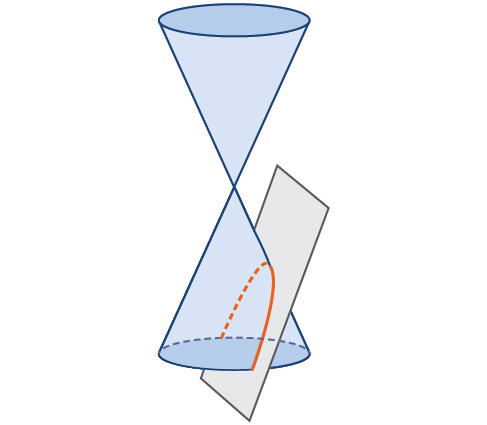
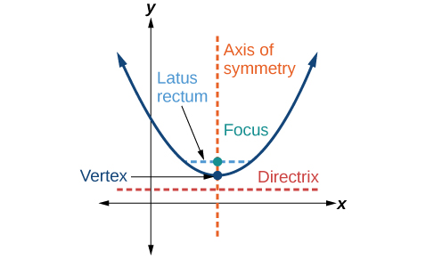
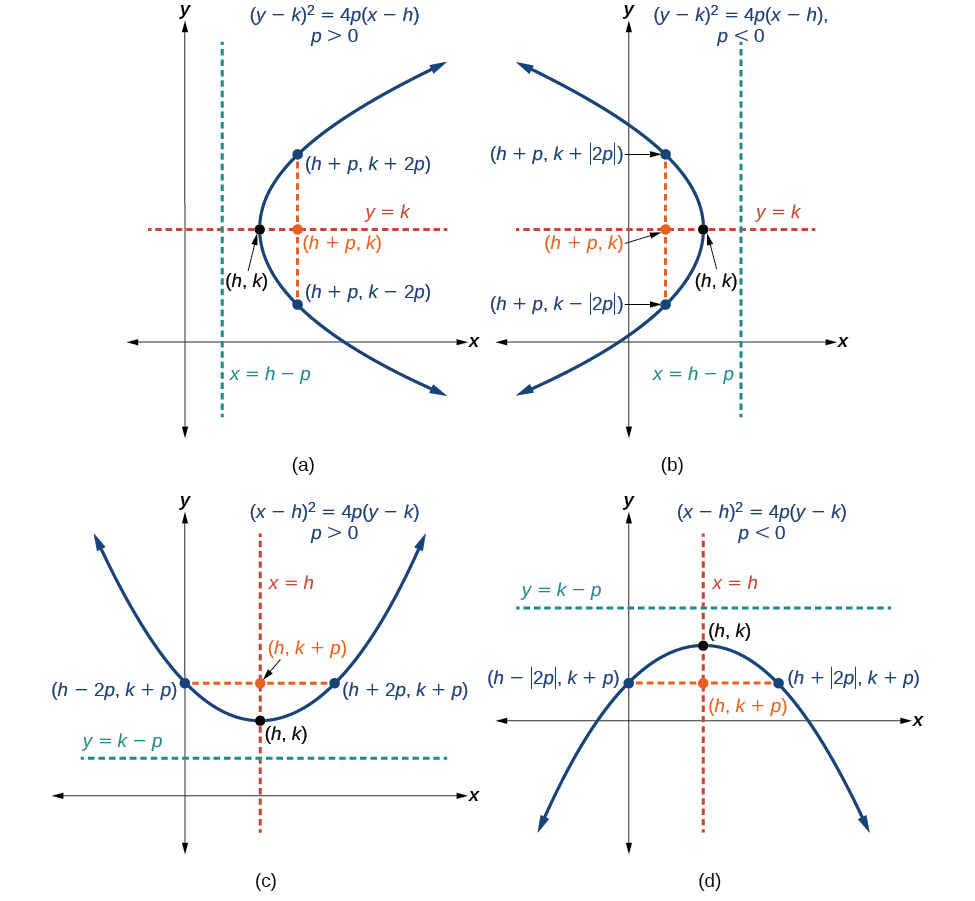
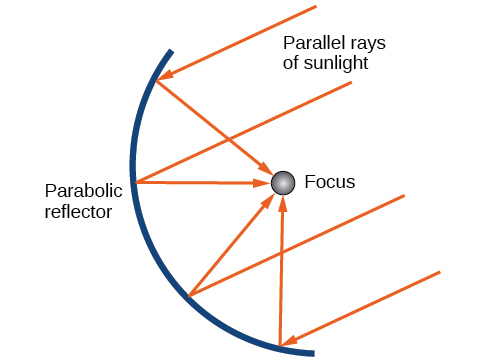
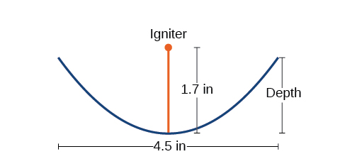

The Parabola
============

  m49440
  
The Parabola
============

  In this section, you will:

Graph parabolas with vertices at the origin.
Write equations of parabolas in standard form.
Graph parabolas with vertices not at the origin.
Solve applied problems involving parabolas.

  a79194a1-878d-4c6d-a978-53670f3e1266

  
Learning Objectives
===================
Graph vertical parabolas. (IA 11.2.1)
Graph horizontal parabolas. (IA 11.2.2)
Objective 1: Graph vertical parabolas. (IA 11.2.1)
==================================================
A **parabola** is all points in a plane that are the same distance from a fixed point and a fixed line. The fixed point is called the **focus**, and the fixed line is called the **directrix** of the parabola.

Previously, we learned to graph vertical parabolas from the general form or the standard form using properties. Those methods will also work here.

Vertical Parabolas

General form

 $$y=a{x}^{2}+bx+c$$

Standard form

 $$y=a{\left(x-h\right)}^{2}+k$$

*Orientation*

 $$a>0$$
up;
 $$a<0$$
down

 $$a>0$$
up;
 $$a<0$$
down

*Axis of symmetry*

 $$x=-\frac{b}{2a}$$

 $$x=h$$

Graph vertical parabolas.
=========================
Determine whether the parabola opens upward or downward.
Find the axis of symmetry.
Find the vertex.
Find the y-intercept (set x=0). Find the point symmetric to the y-intercept across the axis of symmetry.
Find the x-intercepts (set y=0).
Graph the parabola.

Graph
 $$y=\text{\u2212}{x}^{2}+6x-8$$ .

Since
*a*
is
 $$\mathrm{-1},$$
the parabola opens downward.

To find the axis of symmetry, find
 $$x=-\frac{b}{2a}.$$

The axis of symmetry is
 $$x=3.$$

The vertex is on the line
 $$x=3.$$

Let
 $$x=3.$$

The vertex is
 $$\left(3,1\right).$$

The
*y*
-intercept occurs when
 $$x=0.$$

Substitute
 $$x=0.$$

Simplify.

The
*y*
-intercept is
 $$\left(0,\mathrm{-8}\right).$$

The point
 $$\left(0,\mathrm{-8}\right)$$
is three units to the left of the

line of symmetry. The point three units to the

right of the line of symmetry is
 $$\left(6,\mathrm{-8}\right).$$

Point symmetric to the
*y*
-intercept is
 $$\left(6,\mathrm{-8}\right).$$

The
*x*
-intercept occurs when
 $$y=0.$$

Let
 $$y=0.$$

Factor the GCF.

Factor the trinomial.

Solve for
*x*
.

The
*x*
-intercepts are
 $$\left(4,0\right),\left(2,0\right).$$

Graph the parabola.

Practice Makes Perfect
======================
Graph vertical parabolas.

  Graph $$y=2{x}^{2}+4x+5$$ .

  Graph $$y=-{\left(x-3\right)}^{2}+5$$ .

Objective 2: Graph horizontal parabolas. (IA 11.2.2)
====================================================
Our work so far has only dealt with parabolas that open up or down. We are now going to look at horizontal parabolas. These parabolas open either to the left or to the right. If we interchange the x and y in our previous equations for parabolas, we get the equations for the parabolas that open to the left or to the right.

Horizontal Parabolas

General form

 $$x=a{y}^{2}+by+c$$

Standard form

 $$x=a{\left(y-k\right)}^{2}+h$$

*Orientation*

 $$a>0$$
right;
 $$a<0$$
left

 $$a>0$$
right;
 $$a<0$$
left

*Vertex*

Substitute
 $$y=-\frac{b}{2a}$$
and

solve for
*x*
.

 $$\left(h,k\right)$$

*Axis of symmetry*

 $$y=-\frac{b}{2a}$$

 $$y=k$$

Graph horizontal parabolas.
===========================

Determine whether the parabola opens to the left or to the right.
Find the axis of symmetry.
Find the vertex.

Find the
*x*
-intercept. Find the point symmetric to the
*x*
-intercept across the axis of symmetry.

Find the
*y*
-intercepts.

Graph the parabola.

Graph horizontal parabolas.
===========================

Graph
 $$x=2{\left(y-2\right)}^{2}+1$$ .

Identify the constants
*a, h, k*
.

 $$a=2,$$
 $$h=1,$$
 $$k=2$$

Since
 $$a=2,$$
the parabola opens to the right.

The axis of symmetry is
 $$y=k.$$

 $$\phantom{\rule{7.5em}{0ex}}$$
The axis of symmetry is
 $$y=2.$$

The vertex is
 $$\left(h,k\right).$$

 $$\phantom{\rule{7.5em}{0ex}}$$
The vertex is
 $$\left(1,2\right).$$

Find the
*x*
-intercept by substituting
 $$y=0.$$

 $$\begin{array}{ccc}\hfill x& =\hfill & 2{\left(y-2\right)}^{2}+1\hfill \\ \hfill x& =\hfill & 2{\left(0-2\right)}^{2}+1\hfill \\ \hfill x& =\hfill & 9\hfill \end{array}$$

 $$\phantom{\rule{7.5em}{0ex}}$$
The
*x*
-intercept is
 $$\left(9,0\right).$$

Find the point symmetric to
 $$\left(9,0\right)$$
across the

axis of symmetry.

 $$\phantom{\rule{7.5em}{0ex}}\left(9,4\right)$$

Find the
*y*
-intercepts. Let
 $$x=0.$$

 $$\begin{array}{ccc}\hfill x& =\hfill & 2{\left(y-2\right)}^{2}+1\hfill \\ \hfill 0& =\hfill & 2{\left(y-2\right)}^{2}+1\hfill \\ \hfill \mathrm{-1}& =\hfill & 2{\left(y-2\right)}^{2}\hfill \end{array}$$

A square cannot be negative, so there is no real

solution. So there are no
*y*
-intercepts.

Graph the parabola.

Practice Makes Perfect
======================

  Graph $$x=-2{\left(y+2\right)}^{2}+4$$ .

  Graph $$x=-{y}^{2}+2y-3$$ .

\n\n\n\n
  Katherine Johnson is the pioneering NASA mathematician who was integral to the successful and safe flight and return of many human missions as well as satellites. Prior to the work featured in the movie *Hidden Figures*, she had already made major contributions to the space program. She provided trajectory analysis for the Mercury mission, in which Alan Shepard became the first American to reach space, and she and engineer Ted Sopinski authored a monumental paper regarding placing an object in a precise orbital position and having it return safely to Earth. Many of the orbits she determined were made up of parabolas, and her ability to combine different types of math enabled an unprecedented level of precision.  Johnson said, "You tell me when you want it and where you want it to land, and I'll do it backwards and tell you when to take off."

  Johnson's work on parabolic orbits and other complex mathematics resulted in successful orbits, Moon landings, and the development of the Space Shuttle program. Applications of parabolas are also critical to other areas of science. Parabolic mirrors (or reflectors) are able to capture energy and focus it to a single point. The advantages of this property are evidenced by the vast list of parabolic objects we use every day: satellite dishes, suspension bridges, telescopes, microphones, spotlights, and car headlights, to name a few. Parabolic reflectors are also used in alternative energy devices, such as solar cookers and water heaters, because they are inexpensive to manufacture and need little maintenance. In this section we will explore the parabola and its uses, including low-cost, energy-efficient solar designs.

  
Graphing Parabolas with Vertices at the Origin
==============================================
In The Ellipse, we saw that an **ellipse** is formed when a plane cuts through a right circular cone. If the plane is parallel to the edge of the cone, an unbounded curve is formed. This curve is a **parabola**. See .
\n\n\n\n

    Like the ellipse and **hyperbola**, the parabola can also be defined by a set of points in the coordinate plane. A parabola is the set of all points $$\left(x,y\right)$$ in a plane that are the same distance from a fixed line, called the **directrix**, and a fixed point (the **focus**) not on the directrix.
In Quadratic Functions, we learned about a parabola’s vertex and axis of symmetry. Now we extend the discussion to include other key features of the parabola. See . Notice that the axis of symmetry passes through the focus and vertex and is perpendicular to the directrix. The vertex is the midpoint between the directrix and the focus.
The line segment that passes through the focus and is parallel to the directrix is called the **latus rectum**. The endpoints of the latus rectum lie on the curve. By definition, the distance $$d$$ from the focus to any point $$P$$ on the parabola is equal to the distance from $$P$$ to the directrix.
\n\n\n\nTo work with parabolas in the **coordinate plane**, we consider two cases: those with a vertex at the origin and those with a **vertex** at a point other than the origin. We begin with the former.
\n\n\n\n

    Let $$\left(x,y\right)$$ be a point on the parabola with vertex $$\left(0,0\right),$$ focus $$\left(0,p\right),$$ and directrix $$y=\; -p$$
as shown in . The distance $$d$$ from point $$\left(x,y\right)$$ to point $$(x,-p)$$
on the directrix is the difference of the *y*-values: $$d=y+p.$$ The distance from the focus $$(0,p)$$ to the point $$\left(x,y\right)$$ is also equal to $$d$$ and can be expressed using the **distance formula**.

 $$
\begin{array}{l}d=\sqrt{{(x-0)}^{2}+{(y-p)}^{2}}\hfill \\ \phantom{\rule{0.5em}{0ex}}\phantom{\rule{0.5em}{0ex}}\phantom{\rule{0.5em}{0ex}}=\sqrt{{x}^{2}+{(y-p)}^{2}}\hfill \end{array}
$$
Set the two expressions for $$d$$ equal to each other and solve for $$y$$ to derive the equation of the parabola. We do this because the distance from $$\left(x,y\right)$$ to $$\left(0,p\right)$$ equals the distance from $$\left(x,y\right)$$ to $$(x,\; -p).$$

 $$\sqrt{{x}^{2}+{\left(y-p\right)}^{2}}=y+p$$
    
    We then square both sides of the equation, expand the squared terms, and simplify by combining like terms.

     $$\begin{array}{c}{x}^{2}+{(y-p)}^{2}={(y+p)}^{2}\\ {x}^{2}+{y}^{2}-2py+{p}^{2}={y}^{2}+2py+{p}^{2}\\ {x}^{2}-2py=2py\\ \phantom{\rule{0.5em}{0ex}}\text{\ \ \ \ \ \ \ \ \}{x}^{2}=4py\end{array}$$
The equations of parabolas with vertex $$\left(0,0\right)$$ are $${y}^{2}=4px$$ when the *x*-axis is the axis of symmetry and $${x}^{2}=4py$$ when the *y*-axis is the axis of symmetry. These standard forms are given below, along with their general graphs and key features.

      
Standard Forms of Parabolas with Vertex (0, 0)
==============================================

      and  summarize the standard features of parabolas with a vertex at the origin.

          
          
          
          
          
            
              *Axis of Symmetry*
              *Equation*
              *Focus*
              *Directrix*
              *Endpoints of Latus Rectum*
             
            
            
              *x*-axis
               $${y}^{2}=4px$$
              
               $$\left(p,\phantom{\rule{0.5em}{0ex}}\text{}0\right)$$
              
               $$x=-p$$
              
               $$\left(p,\phantom{\rule{0.5em}{0ex}}\text{}\pm 2p\right)$$
              
            
            
              *y*-axis
               $${x}^{2}=4py$$
              
               $$\left(0,\phantom{\rule{0.5em}{0ex}}\text{}p\right)$$
              
               $$y=-p$$
              
               $$\left(\pm 2p,\phantom{\rule{0.5em}{0ex}}\text{}p\right)$$
              
            
          

\n\n\n\nThe key features of a parabola are its vertex, axis of symmetry, focus, directrix, and latus rectum. See . When given a standard equation for a parabola centered at the origin, we can easily identify the key features to graph the parabola.
A line is said to be tangent to a curve if it intersects the curve at exactly one point. If we sketch lines tangent to the parabola at the endpoints of the latus rectum, these lines intersect on the axis of symmetry, as shown in .
\n\n\n\n

    
      How To
      *Given a standard form equation for a parabola centered at (0, 0), sketch the graph.*

       Determine which of the standard forms applies to the given equation: $${y}^{2}=4px\phantom{\rule{0.5em}{0ex}}$$ or $${x}^{2}=4py.$$
       
      Use the standard form identified in Step 1 to determine the axis of symmetry, focus, equation of the directrix, and endpoints of the latus rectum.

      If the equation is in the form $${y}^{2}=4px,$$ then
    the axis of symmetry is the *x*-axis, $$y=0$$
    
        set $$4p$$ equal to the coefficient of *x*in the given equation to solve for $$p.$$ If $$p>0,$$ the parabola opens right. If $$p<0,$$ the parabola opens left.
        	use $$p$$ to find the coordinates of the focus, $$\left(p,0\right)$$
        
        	use $$p$$ to find the equation of the directrix, $$x=-p$$
        
        	use $$p$$ to find the endpoints of the latus rectum, $$\left(p,\pm 2p\right).$$ Alternately, substitute $$x=p$$ into the original equation.
    
If the equation is in the form $${x}^{2}=4py,$$ then
    the axis of symmetry is the *y*-axis, $$x=0$$
    
        set $$4p$$ equal to the coefficient of *y*in the given equation to solve for $$p.$$ If $$p>0,$$ the parabola opens up. If $$p<0,$$ the parabola opens down.
        use $$p$$ to find the coordinates of the focus, $$\left(0,p\right)$$
        
        use $$p$$ to find equation of the directrix, $$y=-p$$
        
        use $$p$$ to find the endpoints of the latus rectum, $$\left(\pm 2p,p\right)$$
        
    

      Plot the focus, directrix, and latus rectum, and draw a smooth curve to form the parabola.
     
    

    
        
Graphing a Parabola with Vertex (0, 0) and the *x*-axis as the Axis of Symmetry
===============================================================================

        Graph $${y}^{2}=24x.$$ Identify and label the **focus**, **directrix**, and endpoints of the **latus rectum**.

    
    
        The standard form that applies to the given equation is $${y}^{2}=4px.$$ Thus, the axis of symmetry is the *x*-axis. It follows that:

         $$24=4p,$$ so $$p=6.$$ Since $$p>0,$$ the parabola opens right
            the coordinates of the focus are $$\left(p,0\right)=\left(6,0\right)$$
            
            the equation of the directrix is $$x=-p=-6$$

            
            the endpoints of the latus rectum have the same *x*-coordinate at the focus. To find the endpoints, substitute $$x=6$$ into the original equation: $$\left(\mathrm{6,}\pm 12\right)$$

Next we plot the focus, directrix, and latus rectum, and draw a smooth curve to form the **parabola**.

\n\n\n\n

      Try It
      Graph $${y}^{2}=\mathrm{-16}x.$$ Identify and label the focus, directrix, and endpoints of the latus rectum.

        Focus: $$\left(-4,0\right);$$ Directrix: $$x=4;$$ Endpoints of the latus rectum: $$\left(-4,\pm 8\right)$$

        
          
        
        
      

    
      
          
Graphing a Parabola with Vertex (0, 0) and the *y*-axis as the Axis of Symmetry
===============================================================================

          Graph $${x}^{2}=\mathrm{-6}y.$$ Identify and label the **focus**, **directrix**, and endpoints of the **latus rectum**.

        
        
          The standard form that applies to the given equation is $${x}^{2}=4py.$$ Thus, the axis of symmetry is the *y*-axis. It follows that:
         $$-6=4p,$$ so $$p=-\frac{3}{2}.$$ Since $$p<0,$$ the parabola opens down.
          the coordinates of the focus are $$\left(0,p\right)=\left(0,-\frac{3}{2}\right)$$
          
          the equation of the directrix is $$y=-p=\frac{3}{2}$$
          
          the endpoints of the latus rectum can be found by substituting $$\text{}y=\frac{3}{2}$$ into the original equation, $$\left(\pm 3,-\frac{3}{2}\right)$$
Next we plot the focus, directrix, and latus rectum, and draw a smooth curve to form the **parabola**.

        \n\n\n\n
      

    
      Try It
      
        Graph $${x}^{2}=8y.$$ Identify and label the focus, directrix, and endpoints of the latus rectum.

        Focus: $$\left(0,2\right);$$ Directrix: $$y=\mathrm{-2};$$ Endpoints of the latus rectum: $$\left(\pm 4,2\right).$$

        
          
        

        
      
    
  
    
Writing Equations of Parabolas in Standard Form
===============================================

    In the previous examples, we used the standard form equation of a parabola to calculate the locations of its key features. We can also use the calculations in reverse to write an equation for a parabola when given its key features.

      How To
      *Given its focus and directrix, write the equation for a parabola in standard form.*

     
      
        Determine whether the axis of symmetry is the *x*- or *y*-axis.
        If the given coordinates of the focus have the form $$\left(p,0\right),$$ then the axis of symmetry is the *x*-axis. Use the standard form $${y}^{2}=4px.$$
        
          If the given coordinates of the focus have the form $$\left(0,p\right),$$ then the axis of symmetry is the *y*-axis. Use the standard form $${x}^{2}=4py.$$
          
       Multiply $$4p.$$
       
      Substitute the value from Step 2 into the equation determined in Step 1.
    

    
      
          
Writing the Equation of a Parabola in Standard Form Given its Focus and Directrix
=================================================================================

          What is the equation for the **parabola** with **focus** $$\left(-\frac{1}{2},0\right)$$ and **directrix** $$x=\frac{1}{2}?$$

        
        
          The focus has the form $$\left(p,0\right),$$ so the equation will have the form $${y}^{2}=4px.$$

        Multiplying $$4p,$$ we have $$4p=4\left(-\frac{1}{2}\right)=\mathrm{-2.}$$
          
          Substituting for $$4p,$$ we have $${y}^{2}=4px=\mathrm{-2}x.$$
Therefore, the equation for the parabola is $${y}^{2}=\mathrm{-2}x.$$

        
      

    
      Try It
      
        What is the equation for the parabola with focus $$\left(0,\frac{7}{2}\right)$$ and directrix $$y=-\frac{7}{2}?$$

        $${x}^{2}=14y.$$

      
    
  

  
Graphing Parabolas with Vertices Not at the Origin
==================================================
Like other graphs we’ve worked with, the graph of a parabola can be translated. If a parabola is translated $$h$$ units horizontally and $$k$$ units vertically, the vertex will be $$\left(h,k\right).$$ This translation results in the standard form of the equation we saw previously with $$x$$ replaced by $$\left(x-h\right)$$ and $$y$$ replaced by $$\left(y-k\right).$$

    To graph parabolas with a vertex $$\left(h,k\right)$$ other than the origin, we use the standard form $${\left(y-k\right)}^{2}=4p\left(x-h\right)$$ for parabolas that have an axis of symmetry parallel to the *x*-axis, and $${\left(x-h\right)}^{2}=4p\left(y-k\right)$$ for parabolas that have an axis of symmetry parallel to the *y*-axis. These standard forms are given below, along with their general graphs and key features.

    

      
Standard Forms of Parabolas with Vertex (*h*, *k*)
==================================================

      and  summarize the standard features of parabolas with a vertex at a point $$\left(h,k\right).$$

          
          
          
          

          
            
              *Axis of Symmetry*
              *Equation*
              *Focus*
              *Directrix*
              *Endpoints of Latus Rectum*
            
 
               $$y=k$$
              
               $${\left(y-k\right)}^{2}=4p\left(x-h\right)$$
              
               $$\left(h+p,\phantom{\rule{0.5em}{0ex}}\text{}k\right)$$
              
               $$x=h-p$$
              
               $$\left(h+p,\phantom{\rule{0.5em}{0ex}}\text{}k\pm 2p\right)$$
              
            
            
               $$x=h$$
              
               $${\left(x-h\right)}^{2}=4p\left(y-k\right)$$
              
               $$\left(h,\phantom{\rule{0.5em}{0ex}}\text{}k+p\right)$$
              
               $$y=k-p$$
              
               $$\left(h\pm 2p,\phantom{\rule{0.5em}{0ex}}\text{}k+p\right)$$
              
            
          

    \n\n\n\n
      How To
      *Given a standard form equation for a parabola centered at (*h*, *k*), sketch the graph.*

        Determine which of the standard forms applies to the given equation: $${\left(y-k\right)}^{2}=4p\left(x-h\right)$$ or $${\left(x-h\right)}^{2}=4p\left(y-k\right).$$
        
      Use the standard form identified in Step 1 to determine the vertex, axis of symmetry, focus, equation of the directrix, and endpoints of the latus rectum.
      If the equation is in the form $${\left(y-k\right)}^{2}=4p\left(x-h\right),$$ then:
      use the given equation to identify $$h$$ and $$k$$ for the vertex, $$\left(h,k\right)$$
        
        use the value of $$k$$ to determine the axis of symmetry, $$y=k$$
        
        set $$4p$$ equal to the coefficient of $$\left(x-h\right)$$ in the given equation to solve for $$p.$$ If $$p>0,$$ the parabola opens right. If $$p<0,$$ the parabola opens left.
        use $$h,k,$$ and $$p$$ to find the coordinates of the focus, $$\left(h+p,\phantom{\rule{0.5em}{0ex}}\text{}k\right)$$
        
        use $$h$$ and $$p$$ to find the equation of the directrix, $$x=h-p$$
        
        use $$h,k,$$ and $$p$$ to find the endpoints of the latus rectum, $$\left(h+p,k\pm 2p\right)$$
        
      
        If the equation is in the form $${\left(x-h\right)}^{2}=4p\left(y-k\right),$$ then:
      use the given equation to identify $$h$$ and $$k$$ for the vertex, $$\left(h,k\right)$$
        
        use the value of $$h$$ to determine the axis of symmetry, $$x=h$$
        
        set $$4p$$ equal to the coefficient of $$\left(y-k\right)$$ in the given equation to solve for $$p.$$ If $$p>0,$$ the parabola opens up. If $$p<0,$$ the parabola opens down.
        use $$h,k,$$ and $$p$$ to find the coordinates of the focus, $$\left(h,\phantom{\rule{0.5em}{0ex}}\text{}k+p\right)$$
        
        use $$k$$ and $$p$$ to find the equation of the directrix, $$y=k-p$$
        
        use $$h,k,$$ and $$p$$ to find the endpoints of the latus rectum, $$\left(h\pm 2p,\phantom{\rule{0.5em}{0ex}}\text{}k+p\right)$$
        
      
      
      Plot the vertex, axis of symmetry, focus, directrix, and latus rectum, and draw a smooth curve to form the parabola.
      
    

    
      
          
Graphing a Parabola with Vertex (*h*, *k*) and Axis of Symmetry Parallel to the *x*-axis
========================================================================================

          Graph $${\left(y-1\right)}^{2}=\mathrm{-16}\left(x+3\right).$$ Identify and label the **vertex**, **axis of symmetry**, **focus**, **directrix**, and endpoints of the **latus rectum**.

        
        
          The standard form that applies to the given equation is $${\left(y-k\right)}^{2}=4p\left(x-h\right).$$ Thus, the axis of symmetry is parallel to the *x*-axis. It follows that:

        the vertex is $$\left(h,k\right)=\left(-3,1\right)$$
          
          the axis of symmetry is $$y=k=1$$
          
           $$\mathrm{-16}=4p,$$ so $$p=\mathrm{-4.}$$ Since $$p<0,$$ the parabola opens left.
          the coordinates of the focus are $$\left(h+p,k\right)=\left(\mathrm{-3}+\left(\mathrm{-4}\right),1\right)=\left(\mathrm{-7},1\right)$$
          
          the equation of the directrix is $$x=h-p=\mathrm{-3}-\left(\mathrm{-4}\right)=1$$
          
          the endpoints of the latus rectum are $$\left(h+p,k\pm 2p\right)=\left(\mathrm{-3}+\left(\mathrm{-4}\right),1\pm 2\left(\mathrm{-4}\right)\right),$$ or $$\left(\mathrm{-7},\mathrm{-7}\right)$$ and $$\left(\mathrm{-7},9\right)$$

Next we plot the vertex, axis of symmetry, focus, directrix, and latus rectum, and draw a smooth curve to form the parabola. See .

        \n\n\n\n
        
      

    Try It
      
        Graph $${\left(y+1\right)}^{2}=4\left(x-8\right).$$ Identify and label the vertex, axis of symmetry, focus, directrix, and endpoints of the latus rectum.

        Vertex: $$\left(8,-1\right);$$ Axis of symmetry: $$y=\mathrm{-1};$$ Focus: $$\left(9,-1\right);$$ Directrix: $$x=7;$$ Endpoints of the latus rectum: $$\left(9,-3\right)$$ and $$\left(9,1\right).$$

        
          
        
      

      
      
          
Graphing a Parabola from an Equation Given in General Form
==========================================================

          Graph $${x}^{2}-8x-28y-208=0.$$ Identify and label the vertex, axis of symmetry, focus, directrix, and endpoints of the latus rectum.

        
        
          Start by writing the equation of the **parabola** in standard form. The standard form that applies to the given equation is $${\left(x-h\right)}^{2}=4p\left(y-k\right).$$ Thus, the axis of symmetry is parallel to the *y*-axis. To express the equation of the parabola in this form, we begin by isolating the terms that contain the variable $$x$$ in order to complete the square.

           $$
\begin{array}{l}{x}^{2}-8x-28y-208=0\hfill \\ \phantom{\rule{0.5em}{0ex}}\text{\ \ \ \ \ \ \ \ \ \ \ \ \ \ \ \ \ \ \ \}{x}^{2}-8x=28y+208\hfill \\ \phantom{\rule{0.5em}{0ex}}\text{\ \ \ \ \ \ \ \ \ \ \}{x}^{2}-8x+16=28y+208+16\hfill \\ \phantom{\rule{0.5em}{0ex}}\text{\ \ \ \ \ \ \ \ \ \ \ \ \ \ \ \ \ \ \}{(x-4)}^{2}=28y+224\hfill \\ \phantom{\rule{0.5em}{0ex}}\text{\ \ \ \ \ \ \ \ \ \ \ \ \ \ \ \ \ \ \}{(x-4)}^{2}=28(y+8)\hfill \\ \phantom{\rule{0.5em}{0ex}}\text{\ \ \ \ \ \ \ \ \ \ \ \ \ \ \ \ \ \ \}{(x-4)}^{2}=4\cdot 7\cdot (y+8)\hfill \end{array}
$$
It follows that:
        the vertex is $$\left(h,k\right)=\left(4,\mathrm{-8}\right)$$
          
          the axis of symmetry is $$x=h=4$$
          
          since $$p=7,p>0$$ and so the parabola opens up
          the coordinates of the focus are $$\left(h,k+p\right)=\left(4,\mathrm{-8}+7\right)=\left(4,\mathrm{-1}\right)$$
          
          the equation of the directrix is $$y=k-p=\mathrm{-8}-7=\mathrm{-15}$$
          
          the endpoints of the latus rectum are $$\left(h\pm 2p,k+p\right)=\left(4\pm 2\left(7\right),\mathrm{-8}+7\right),$$ or $$\left(\mathrm{-10},\mathrm{-1}\right)$$ and $$\left(18,\mathrm{-1}\right)$$

          Next we plot the vertex, axis of symmetry, focus, directrix, and latus rectum, and draw a smooth curve to form the parabola. See .

        \n\n\n\n
        
      

    Try It
      
        Graph $${\left(x+2\right)}^{2}=\mathrm{-20}\left(y-3\right).$$ Identify and label the vertex, axis of symmetry, focus, directrix, and endpoints of the latus rectum.

        Vertex: $$\left(-2,3\right);$$ Axis of symmetry: $$x=\mathrm{-2};$$ Focus: $$\left(-2,-2\right);$$ Directrix: $$y=8;$$ Endpoints of the latus rectum: $$\left(-12,-2\right)$$ and $$\left(8,-2\right).$$

        
          
        
      

    
    
Solving Applied Problems Involving Parabolas
============================================

    As we mentioned at the beginning of the section, parabolas are used to design many objects we use every day, such as telescopes, suspension bridges, microphones, and radar equipment. Parabolic mirrors, such as the one used to light the Olympic torch, have a very unique reflecting property. When rays of light parallel to the parabola’s **axis of symmetry** are directed toward any surface of the mirror, the light is reflected directly to the focus. See . This is why the Olympic torch is ignited when it is held at the focus of the parabolic mirror.

    \n\n\n\n

    Parabolic mirrors have the ability to focus the sun’s energy to a single point, raising the temperature hundreds of degrees in a matter of seconds. Thus, parabolic mirrors are featured in many low-cost, energy efficient solar products, such as solar cookers, solar heaters, and even travel-sized fire starters.

      
        
          
Solving Applied Problems Involving Parabolas
============================================

          A cross-section of a design for a travel-sized solar fire starter is shown in . The sun’s rays reflect off the parabolic mirror toward an object attached to the igniter. Because the igniter is located at the focus of the parabola, the reflected rays cause the object to burn in just seconds.

          ⓐ Find the equation of the parabola that models the fire starter. Assume that the vertex of the parabolic mirror is the origin of the coordinate plane.
          ⓑ Use the equation found in part ⓐ to find the depth of the fire starter.
          \n\n\n\n

        
        

        ⓐ The vertex of the dish is the origin of the coordinate plane, so the parabola will take the standard form $${x}^{2}=4py,$$ where $$p>0.$$ The igniter, which is the focus, is 1.7 inches above the vertex of the dish. Thus we have $$p=\mathrm{1.7.}$$

             $$
\begin{array}{ll}{x}^{2}=4py\hfill & \begin{array}{cccc}& & & \end{array}\text{Standard\ form\ of\ upward-facing\ parabola\ with\ vertex\ (0,0)}\hfill \\ {x}^{2}=4(1.7)y\hfill & \begin{array}{cccc}& & & \end{array}\text{Substitute\ 1}\text{.7\ for\}p.\hfill \\ {x}^{2}=6.8y\hfill & \begin{array}{cccc}& & & \end{array}\text{Multiply}.\hfill \end{array}
$$

ⓑ The dish extends $$\frac{4.5}{2}=2.25$$ inches on either side of the origin. We can substitute 2.25 for $$x$$ in the equation from part (a) to find the depth of the dish.
             $$
\begin{array}{ll}\phantom{\rule{0.5em}{0ex}}\text{\ \ \ \ \ \ \}{x}^{2}=6.8y\hfill & \text{Equation\ found\ in\ part\ (a)}.\hfill \\ {(2.25)}^{2}=6.8y\hfill & \text{Substitute\ 2}\text{.25\ for\}x.\hfill \\ \phantom{\rule{0.5em}{0ex}}\text{\ \ \ \ \ \ \ \ \}y\approx 0.74\ \hfill & \text{Solve\ for\}y.\hfill \end{array}
$$
The dish is about 0.74 inches deep.

      
    

    Try It
      Balcony-sized solar cookers have been designed for families living in India. The top of a dish has a diameter of 1600 mm. The sun’s rays reflect off the parabolic mirror toward the “cooker,” which is placed 320 mm from the base.
ⓐ Find an equation that models a cross-section of the solar cooker. Assume that the vertex of the parabolic mirror is the origin of the coordinate plane, and that the parabola opens to the right (i.e., has the *x*-axis as its axis of symmetry).

ⓑ Use the equation found in part ⓐ to find the depth of the cooker.

        
      ⓐ $${y}^{2}=1280x$$
        
      ⓑ The depth of the cooker is 500 mm
      
      Media

      Access these online resources for additional instruction and practice with parabolas.

      Conic Sections: The Parabola Part 1 of 2
        Conic Sections: The Parabola Part 2 of 2
        Parabola with Vertical Axis
        Parabola with Horizontal Axis
      

  

 
   
Key Equations
=============

   

       
       
         
           Parabola, vertex at origin, axis of symmetry on *x*-axis
            $${y}^{2}=4px$$
           
         

         
           Parabola, vertex at origin, axis of symmetry on *y*-axis
            $${x}^{2}=4py$$
           
         
         
           Parabola, vertex at $$(h,k),$$ axis of symmetry on *x*-axis
            $${\left(y-k\right)}^{2}=4p\left(x-h\right)$$
           
         
         
           Parabola, vertex at $$(h,k),$$ axis of symmetry on *y*-axis
            $${\left(x-h\right)}^{2}=4p\left(y-k\right)$$
           
         
       

  
    
Key Concepts
============

    A parabola is the set of all points $$\left(x,y\right)$$ in a plane that are the same distance from a fixed line, called the directrix, and a fixed point (the focus) not on the directrix.
      The standard form of a parabola with vertex $$\left(0,0\right)$$ and the *x*-axis as its axis of symmetry can be used to graph the parabola. If $$p>0,$$ the parabola opens right. If $$p<0,$$ the parabola opens left. See .
      The standard form of a parabola with vertex $$\left(0,0\right)$$ and the *y*-axis as its axis of symmetry can be used to graph the parabola. If $$p>0,$$ the parabola opens up. If $$p<0,$$ the parabola opens down. See .
      When given the focus and directrix of a parabola, we can write its equation in standard form. See .
      The standard form of a parabola with vertex $$\left(h,k\right)$$ and axis of symmetry parallel to the *x*-axis can be used to graph the parabola. If $$p>0,$$ the parabola opens right. If $$p<0,$$ the parabola opens left. See .
      The standard form of a parabola with vertex $$\left(h,k\right)$$ and axis of symmetry parallel to the *y*-axis can be used to graph the parabola. If $$p>0,$$ the parabola opens up. If $$p<0,$$ the parabola opens down. See .
      Real-world situations can be modeled using the standard equations of parabolas. For instance, given the diameter and focus of a cross-section of a parabolic reflector, we can find an equation that models its sides. See .
    

  
    
Section Exercises
=================

      
Verbal
======

      Define a parabola in terms of its focus and directrix.

      
A parabola is the set of points in the plane that lie equidistant from a fixed point, the focus, and a fixed line, the directrix.

      If the equation of a parabola is written in standard form and $$p$$ is positive and the directrix is a vertical line, then what can we conclude about its graph?

      If the equation of a parabola is written in standard form and $$p$$ is negative and the directrix is a horizontal line, then what can we conclude about its graph?

      
The graph will open down.

      What is the effect on the graph of a parabola if its equation in standard form has increasing values of $$p\text{?}$$

      As the graph of a parabola becomes wider, what will happen to the distance between the focus and directrix?

      
The distance between the focus and directrix will increase.

    
    
      
Algebraic
=========

      For the following exercises, determine whether the given equation is a parabola. If so, rewrite the equation in standard form.
$${y}^{2}=4-{x}^{2}$$

      $$y=4{x}^{2}$$

      
        yes $${x}^{2}=4\left(\frac{1}{16}\right)y$$

      $$3{x}^{2}-6{y}^{2}=12$$

      $${\left(y-3\right)}^{2}=8\left(x-2\right)$$

        
          yes $${\left(y-3\right)}^{2}=4(2)\left(x-2\right)$$

        

      $${y}^{2}+12x-6y-51=0$$

      For the following exercises, rewrite the given equation in standard form, and then determine the vertex $$(V),$$ focus $$(F),$$ and directrix $$\text{}(d)$$ of the parabola.
$$x=8{y}^{2}$$

      
        $${y}^{2}=\frac{1}{8}x,V:(0,0);F:\left(\frac{1}{32},0\right);d:x=-\frac{1}{32}$$

      $$y=\frac{1}{4}{x}^{2}$$

      $$y=\mathrm{-4}{x}^{2}$$

        
          $${x}^{2}=-\frac{1}{4}y,V:\left(0,0\right);F:\left(0,-\frac{1}{16}\right);d:y=\frac{1}{16}$$

        
      $$x=\frac{1}{8}{y}^{2}$$

      $$x=36{y}^{2}$$

        
          $${y}^{2}=\frac{1}{36}x,V:\left(0,0\right);F:\left(\frac{1}{144},0\right);d:x=-\frac{1}{144}$$

        

      $$x=\frac{1}{36}{y}^{2}$$

      $${\left(x-1\right)}^{2}=4\left(y-1\right)$$

        
          $${\left(x-1\right)}^{2}=4\left(y-1\right),V:\left(1,1\right);F:\left(1,2\right);d:y=0$$

        

      $${\left(y-2\right)}^{2}=\frac{4}{5}\left(x+4\right)$$

      $${\left(y-4\right)}^{2}=2\left(x+3\right)$$

        
          $${\left(y-4\right)}^{2}=2\left(x+3\right),V:\left(-3,4\right);F:\left(-\frac{5}{2},4\right);d:x=-\frac{7}{2}$$

        

      $${\left(x+1\right)}^{2}=2\left(y+4\right)$$

      $${\left(x+4\right)}^{2}=24\left(y+1\right)$$

        
          $${\left(x+4\right)}^{2}=24\left(y+1\right),V:\left(-4,-1\right);F:\left(-4,5\right);d:y=\mathrm{-7}$$

        

      $${\left(y+4\right)}^{2}=16\left(x+4\right)$$

      $${y}^{2}+12x-6y+21=0$$

        
          $${\left(y-3\right)}^{2}=\mathrm{-12}\left(x+1\right),V:\left(-1,3\right);F:\left(-4,3\right);d:x=2$$

        

      $${x}^{2}-4x-24y+28=0$$

      $$5{x}^{2}-50x-4y+113=0$$

        
          $${\left(x-5\right)}^{2}=\frac{4}{5}\left(y+3\right),V:\left(5,-3\right);F:\left(5,-\frac{14}{5}\right);d:y=-\frac{16}{5}$$

        

      $${y}^{2}-24x+4y-68=0$$

      $${x}^{2}-4x+2y-6=0$$

        
          $${\left(x-2\right)}^{2}=\mathrm{-2}\left(y-5\right),V:\left(2,5\right);F:\left(2,\frac{9}{2}\right);d:y=\frac{11}{2}$$

        

      $${y}^{2}-6y+12x-3=0$$

      $$3{y}^{2}-4x-6y+23=0$$

        
          $${\left(y-1\right)}^{2}=\frac{4}{3}\left(x-5\right),V:\left(5,1\right);F:\left(\frac{16}{3},1\right);d:x=\frac{14}{3}$$

        

      $${x}^{2}+4x+8y-4=0$$

    
    
      
Graphical
=========

      For the following exercises, graph the parabola, labeling the focus and the directrix.
$$x=\frac{1}{8}{y}^{2}$$

      

        
          
        

      $$y=36{x}^{2}$$

      $$y=\frac{1}{36}{x}^{2}$$

      

        
          
        

      	$$y=\mathrm{-9}{x}^{2}$$

      $${\left(y-2\right)}^{2}=-\frac{4}{3}\left(x+2\right)$$

      

        
          
        

      $$\mathrm{-5}{\left(x+5\right)}^{2}=4\left(y+5\right)$$

      $$\mathrm{-6}{\left(y+5\right)}^{2}=4\left(x-4\right)$$

      

        
          
        

      $${y}^{2}-6y-8x+1=0$$

      $${x}^{2}+8x+4y+20=0$$

      

        
          
        

      $$3{x}^{2}+30x-4y+95=0$$

      $${y}^{2}-8x+10y+9=0$$

      

        
          
        

      $${x}^{2}+4x+2y+2=0$$

      $${y}^{2}+2y-12x+61=0$$

      

        
          
        

      $$-2{x}^{2}+8x-4y-24=0$$

      For the following exercises, find the equation of the parabola given information about its graph.

      Vertex is $$\left(0,0\right);$$ directrix is $$y=4,$$ focus is $$\left(0,\mathrm{-4}\right).$$

      
        $${x}^{2}=\mathrm{-16}y$$

      Vertex is $$\left(0,0\right);$$ directrix is $$x=4,$$ focus is $$\left(\mathrm{-4},0\right).$$

      Vertex is $$\left(2,2\right);$$ directrix is $$x=2-\sqrt{2},$$ focus is $$\left(2+\sqrt{2},2\right).$$

        
          $${\left(y-2\right)}^{2}=4\sqrt{2}\left(x-2\right)$$

        

      Vertex is $$\left(\mathrm{-2},3\right);$$ directrix is $$x=-\frac{7}{2},$$ focus is $$\left(-\frac{1}{2},3\right).$$

      Vertex is $$\left(\sqrt{2},-\sqrt{3}\right);$$ directrix is $$x=2\sqrt{2},$$ focus is $$\left(0,-\sqrt{3}\right).$$

        
          $${\left(y+\sqrt{3}\right)}^{2}=\mathrm{-4}\sqrt{2}\left(x-\sqrt{2}\right)$$

        

      Vertex is $$\left(1,2\right);$$ directrix is $$y=\frac{11}{3},$$ focus is $$\left(1,\frac{1}{3}\right).$$

      For the following exercises, determine the equation for the parabola from its graph.

      	

        
          
        

      
  $${x}^{2}=y$$

      
        
          
        
      
      
        
          
        
      
      
        $${\left(y-2\right)}^{2}=\frac{1}{4}\left(x+2\right)$$

      
        
          
        

      
        
          
        

      
        $${\left(y-\sqrt{3}\right)}^{2}=4\sqrt{5}\left(x+\sqrt{2}\right)$$

    
    
      
Extensions
==========

      For the following exercises, the vertex and endpoints of the latus rectum of a parabola are given. Find the equation.

      $$V\left(0,0\right)$$, Endpoints $$\left(2,1\right)$$, $$\left(\mathrm{-2},1\right)$$

      $$V\left(0,0\right)$$, Endpoints $$\left(\mathrm{-2},4\right)$$, $$\left(\mathrm{-2},\mathrm{-4}\right)$$

      
        $${y}^{2}=\mathrm{-8}x$$

      $$V\left(1,2\right)$$, Endpoints $$\left(\mathrm{-5},5\right)$$, $$\left(7,5\right)$$

      $$V\left(\mathrm{-3},\mathrm{-1}\right)$$, Endpoints $$\left(0,5\right)$$, $$\left(0,\mathrm{-7}\right)$$

        
          $${\left(y+1\right)}^{2}=12\left(x+3\right)$$

        

      $$V\left(4,\mathrm{-3}\right)$$, Endpoints $$\left(5,-\frac{7}{2}\right)$$, $$\left(3,-\frac{7}{2}\right)$$

    
    
      
Real-World Applications
=======================

      The mirror in an automobile headlight has a parabolic cross-section with the light bulb at the focus. On a schematic, the equation of the parabola is given as $${x}^{2}=4y.$$ At what coordinates should you place the light bulb?

      
        $$\left(0,1\right)$$

      If we want to construct the mirror from the previous exercise such that the focus is located at $$\left(0,0.25\right),$$ what should the equation of the parabola be?

      A satellite dish is shaped like a paraboloid of revolution. This means that it can be formed by rotating a parabola around its axis of symmetry. The receiver is to be located at the focus. If the dish is 12 feet across at its opening and 4 feet deep at its center, where should the receiver be placed?

      
At the point 2.25 feet above the vertex.

      Consider the satellite dish from the previous exercise. If the dish is 8 feet across at the opening and 2 feet deep, where should we place the receiver?

      The reflector in a searchlight is shaped like a paraboloid of revolution. A light source is located 1 foot from the base along the axis of symmetry. If the opening of the searchlight is 3 feet across, find the depth.

      
0.5625 feet

      If the reflector in the searchlight from the previous exercise has the light source located 6 inches from the base along the axis of symmetry and the opening is 4 feet, find the depth.

      An arch is in the shape of a parabola. It has a span of 100 feet and a maximum height of 20 feet. Find the equation of the parabola, and determine the height of the arch 40 feet from the center.

      
        $${x}^{2}=\mathrm{-125}\left(y-20\right),$$
          height is 7.2 feet

      If the arch from the previous exercise has a span of 160 feet and a maximum height of 40 feet, find the equation of the parabola, and determine the distance from the center at which the height is 20 feet.

      An object is projected so as to follow a parabolic path given by $$y=-{x}^{2}+96x,$$ where $$x$$ is the horizontal distance traveled in feet and $$y$$ is the height. Determine the maximum height the object reaches.

      
2304 feet

      For the object from the previous exercise, assume the path followed is given by $$y=\mathrm{-0.5}{x}^{2}+80x.$$
        Determine how far along the horizontal the object traveled to reach maximum height.

    
  

  **directrix**a line perpendicular to the axis of symmetry of a parabola; a line such that the ratio of the distance between the points on the conic and the focus to the distance  to the directrix is constant

  **focus (of a parabola)**a fixed point in the interior of a parabola that lies on the axis of symmetry

  **latus rectum**the line segment that passes through the focus of a parabola parallel to the directrix, with endpoints on the parabola

  **parabola**the set of all points $$\left(x,y\right)$$ in a plane that are the same distance from a fixed line, called the directrix, and a fixed point (the focus) not on the directrix
