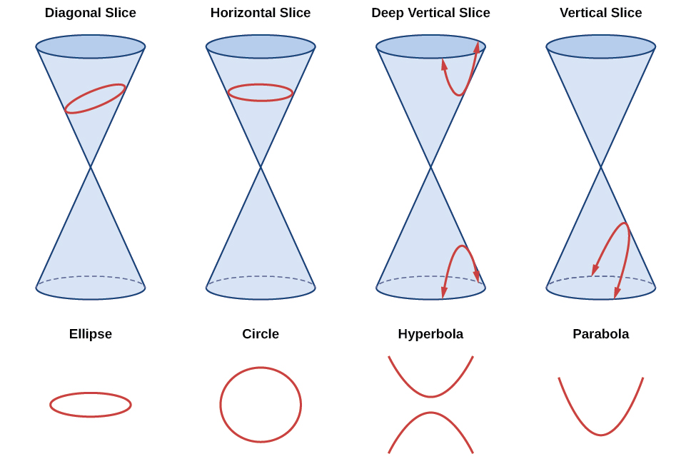
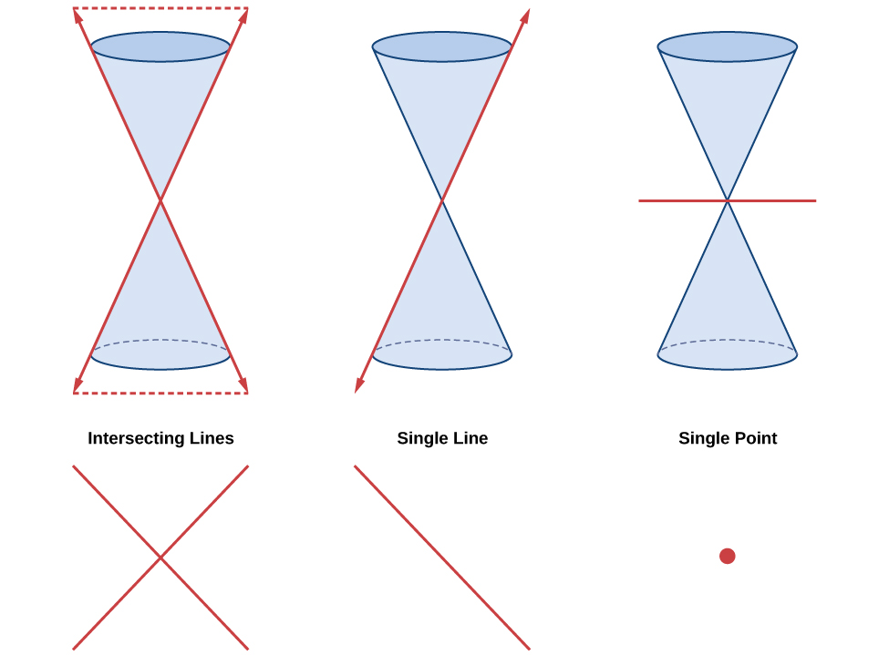
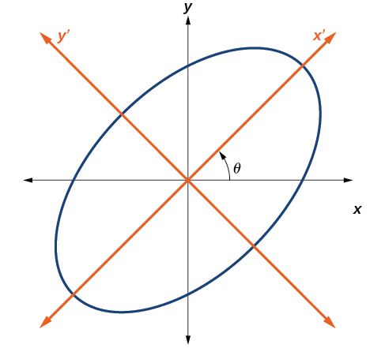
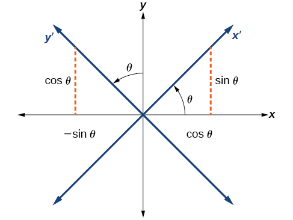
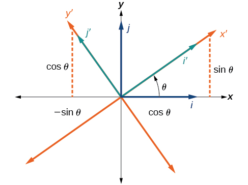

Rotation of Axes
================

  m49441
  
Rotation of Axes
================

  In this section, you will:

Identify nondegenerate conic sections given their general form equations.
Use rotation of axes formulas.
Write equations of rotated conics in standard form.
Identify conics without rotating axes.

  35cc5135-47da-41e2-8041-90f4e34c5210

 
Learning Objectives
===================
Using rotation of axes formulas.
Identify conic sections by their equations. (IA 11.4.3)
Objective 1: Using rotation of axes formulas.
=============================================
If a point
 $$\left(x,y\right)$$
on the Cartesian plane is represented on a new coordinate plane where the axes of rotation are formed by rotating an angle
 $$\theta $$
from the positive
*x*
-axis, then the coordinates of the point with respect to the new axes are
 $$\left({x}^{\prime},{y}^{\prime}\right).$$

The following rotations of axes formulas define the relationship between (*x*,*y*) and (*x*’,*y*’):
$$\left\{\begin{array}{l}x=x\text{'}\text{cos}\theta -y\text{'}\text{sin}\theta \\ y=x\text{'}\text{sin}\theta +y\text{'}\text{cos}\theta \end{array}\right.$$ 

How To
*Given the equation of a conic, find a new representation after rotating through an angle.*

Find
 $$x$$
and
 $$y$$
where  $$\left\{\begin{array}{l}x=x\text{'}\text{cos}\theta -y\text{'}\text{sin}\theta \\ y=x\text{'}\text{sin}\theta +y\text{'}\text{cos}\theta \end{array}\right.$$

Substitute the expression for
 $$x$$
and
 $$y$$
into in the given equation, then simplify.

Write the equations with
 $${x}^{\prime}$$
and
 $${y}^{\prime}$$
in standard form.

Using rotation of axes formulas.
================================

  Find a new representation of the given equation after rotating through the given angle.
$$3{x}^{2}+xy+3{y}^{2}-5=0,\ \theta =45\xba$$

  
    Find x and y using the rotation of axes formulas, substitute *θ*=45º.
     $$\left\{\begin{array}{l}x=x\text{'}\text{cos}\theta -y\text{'}\text{sin}\theta \\ y=x\text{'}\text{sin}\theta +y\text{'}\text{cos}\theta \end{array}\right.$$

  

 $$x=x\text{'}\left(\frac{1}{\sqrt{2}}\right)-y\text{'}\left(\frac{1}{\sqrt{2}}\right)$$$$x=\frac{x\text{'}-y\text{'}}{\sqrt{2}}$$

 $$y=x\text{'}\left(\frac{1}{\sqrt{2}}\right)-y\text{'}\left(\frac{1}{\sqrt{2}}\right)$$$$y=\frac{x\text{'}-y\text{'}}{\sqrt{2}}$$

  

    Substitute the expressions for x and y into the given equation and simplify.
     $$3{x}^{2}+xy+3{y}^{2}-5=0$$ 
  
  
    
     $$3{\left(\frac{x\text{'}-y\text{'}}{\sqrt{2}}\right)}^{2}+\left(\frac{x\text{'}-y\text{'}}{\sqrt{2}}\right)\left(\frac{x\text{'}-y\text{'}}{\sqrt{2}}\right)+3{\left(\frac{x\text{'}-y\text{'}}{\sqrt{2}}\right)}^{2}-5=0$$ 
  
  
    Foil each term.
     $$3\left(\frac{{x\text{'}}^{2}-2x\text{'}y\text{'}+{y\text{'}}^{2}}{2}\right)2+\frac{{x\text{'}}^{2}-{y\text{'}}^{2}}{2}+3\left(\frac{{x\text{'}}^{2}-2x\text{'}y\text{'}+{y\text{'}}^{2}}{2}\right)-5=0$$ 
  
  
    Multiply by 2 to get rid of the fraction.
 $$3({x\text{'}}^{2}-2x\text{'}y\text{'}+{y\text{'}}^{2})2+{x\text{'}}^{2}-{y\text{'}}^{2}+3({x\text{'}}^{2}-2x\text{'}y\text{'}+{y\text{'}}^{2})-10=0$$ 
  
  
    Combine like terms.
     $$3{x\text{'}}^{2}-6x\text{'}y\text{'}+3{y\text{'}}^{2}+{x\text{'}}^{2}-{y\text{'}}^{2}+3{x\text{'}}^{2}+6x\text{'}y\text{'}+3{y\text{'}}^{2}-10=0\phantom{\rule{0ex}{0ex}}7{x\text{'}}^{2}+{5y\text{'}}^{2}-10=0\phantom{\rule{0ex}{0ex}}7{x\text{'}}^{2}+{5y\text{'}}^{2}=10$$ 
  
  
    Write the equations with  x′ and y′ in standard form.
    Set equal to 1.
 $$\frac{7{x\text{'}}^{2}}{10}+\frac{{5y\text{'}}^{2}}{10}=1\phantom{\rule{0ex}{0ex}}\frac{{x\text{'}}^{2}}{{\displaystyle \raisebox{1ex}{$10$}\!\left/ \!\raisebox{-1ex}{$7$}\right.}}+\frac{{y\text{'}}^{2}}{2}=1\phantom{\rule{0ex}{0ex}}$$

  

Practice Makes Perfect
======================
Using rotation of axes formulas:

  Find a new representation of the given equation after rotating through the given angle. Use the steps outlined to assist you in your work.

$$4{x}^{2}\u2013xy+4{y}^{2}-2=0,\theta =45\xba$$

  
    Find x and y using the rotation of axes formulas, substitute *θ*=45º.
  
  
    Substitute the expressions for x and y into the given equation and simplify.
  
  
    Write the equations with  x′ and y′ in standard form.
  

Objective 2: Identify conic sections by their equations. (IA 11.4.3)
====================================================================
We can identify a conic from its equations by looking at the signs and coefficients of the variables that are squared.

Conic

Characteristics of
 $${x}^{2}\text{-}$$
and
 $${y}^{2}\text{-}$$
terms

Example

*Parabola*

Either
 $${x}^{2}$$
OR
 $${y}^{2}.$$
Only one variable is squared.

 $$x=3{y}^{2}-2y+1$$

*Circle*

 $${x}^{2}\text{-}$$
and
 $${y}^{2}\text{-}$$
terms have the same coefficients

 $${x}^{2}+{y}^{2}=49$$

*Ellipse*

 $${x}^{2}\text{-}$$
and
 $${y}^{2}\text{-}$$
terms have the
*same*
sign, different coefficients

 $$4{x}^{2}+25{y}^{2}=100$$

*Hyperbola*

 $${x}^{2}\text{-}$$
and
 $${y}^{2}\text{-}$$
terms have
*different*
signs, different coefficients

 $$25{y}^{2}-4{x}^{2}=100$$

Identify conic sections by their equations.
===========================================

  ⓐ $$x=-{y}^{2}-2y+3$$ 

    ⓑ $$9{y}^{2}-{x}^{2}+18y-4x-4=0$$ 

    ⓒ $$9{x}^{2}+25{y}^{2}=225$$ 

    ⓓ $${x}^{2}+{y}^{2}-4x+10y-7=0$$

  ⓐ $$x=-{y}^{2}-2y+3$$ 
*Parabola*: only one variable is squared.

ⓑ $$9{y}^{2}-{x}^{2}+18y-4x-4=0$$ 
*Hyperbola*: $${x}^{2}$$ and $${y}^{2}$$ have *different* signs and different coefficients.

ⓒ $$9{x}^{2}+25{y}^{2}=225$$ 
*Ellipse*: $${x}^{2}$$ and $${y}^{2}$$ have the *same* signs and different coefficients.

ⓓ $${x}^{2}+{y}^{2}-4x+10y-7=0$$ 
*Circle*: $${x}^{2}$$ and $${y}^{2}$$ have the *same* signs and the *same* signs coefficients.

Practice Makes Perfect
======================
Identify conic sections by their equations.

  $$x=-2{y}^{2}-12y-16$$

  $${x}^{2}+{y}^{2}=9$$

  $$16{x}^{2}-4{y}^{2}+64x-24y-36=0$$

  $$16{x}^{2}+36{y}^{2}=576$$
As we have seen, conic sections are formed when a plane intersects two right circular cones aligned tip to tip and extending infinitely far in opposite directions, which we also call a *cone*. The way in which we slice the cone will determine the type of conic section formed at the intersection. A circle is formed by slicing a cone with a plane perpendicular to the axis of symmetry of the cone. An ellipse is formed by slicing a single cone with a slanted plane not perpendicular to the axis of symmetry. A parabola is formed by slicing the plane through the top or bottom of the double-cone, whereas a hyperbola is formed when the plane slices both the top and bottom of the cone. See .
\n\n\n\nEllipses, circles, hyperbolas, and parabolas are sometimes called the **nondegenerate conic sections**, in contrast to the **degenerate conic sections**, which are shown in . A degenerate conic results when a plane intersects the double cone and passes through the apex. Depending on the angle of the plane, three types of degenerate conic sections are possible: a point, a line, or two intersecting lines.
\n\n\n\n
Identifying Nondegenerate Conics in General Form
================================================
In previous sections of this chapter, we have focused on the standard form equations for nondegenerate conic sections. In this section, we will shift our focus to the general form equation, which can be used for any conic. The general form is set equal to zero, and the terms and coefficients are given in a particular order, as shown below.
 $$A{x}^{2}+Bxy+C{y}^{2}+Dx+Ey+F=0$$
  
  where $$A,B,$$ and $$C$$ are not all zero. We can use the values of the coefficients to identify which type conic is represented by a given equation.
You may notice that the general form equation has an $$xy$$ term that we have not seen in any of the standard form equations. As we will discuss later, the $$xy$$ term rotates the conic whenever $$B$$ is not equal to zero.

    
    
     
      *Conic Sections*
      *Example*
     
    
    
     
      ellipse
       $$4{x}^{2}+9{y}^{2}=1$$
      
     
     
      circle
       $$4{x}^{2}+4{y}^{2}=1$$
      
     
     
      hyperbola
       $$4{x}^{2}-9{y}^{2}=1$$
      
     
     
      parabola
       $$4{x}^{2}=9y\phantom{\rule{0.5em}{0ex}}\text{or\}4{y}^{2}=9x$$
      
     
     
      one line
       $$4x+9y=1$$
      
     
     
      intersecting lines
       $$\left(x-4\right)\left(y+4\right)=0$$
      
     
     
      parallel lines
       $$\left(x-4\right)\left(x-9\right)=0$$
      
     
     
      a point
       $$4{x}^{2}+4{y}^{2}=0$$
      
     
     
      no graph
       $$4{x}^{2}+4{y}^{2}=\phantom{\rule{0.5em}{0ex}}-\phantom{\rule{0.5em}{0ex}}1$$
      
     
    

General Form of Conic Sections
==============================

   A **conic section** has the general form

    $$A{x}^{2}+Bxy+C{y}^{2}+Dx+Ey+F=0$$
   
   where $$A,B,$$ and $$C$$ are not all zero.
summarizes the different conic sections where $$B=0,$$ and $$A$$ and $$C$$ are nonzero real numbers. This indicates that the conic has not been rotated.

     
      
       *ellipse*
        $$A{x}^{2}+C{y}^{2}+Dx+Ey+F=0,\phantom{\rule{0.5em}{0ex}}\text{}A\ne C\phantom{\rule{0.5em}{0ex}}\text{and\}AC>0$$
       
      

      
       *circle*
        $$A{x}^{2}+C{y}^{2}+Dx+Ey+F=0,\phantom{\rule{0.5em}{0ex}}\text{}A=C$$
       
      
      
       *hyperbola*
        $$A{x}^{2}-C{y}^{2}+Dx+Ey+F=0\phantom{\rule{0.5em}{0ex}}\text{or\}-A{x}^{2}+C{y}^{2}+Dx+Ey+F=0,$$ where $$A$$ and $$C$$ are positive
      
      
       *parabola*
        $$A{x}^{2}+Dx+Ey+F=0\phantom{\rule{0.5em}{0ex}}\text{or\}C{y}^{2}+Dx+Ey+F=0$$
       
      
     

How To
   *Given the equation of a conic, identify the type of conic.*

   Rewrite the equation in the general form, $$A{x}^{2}+Bxy+C{y}^{2}+Dx+Ey+F=0.$$
    
    Identify the values of $$A$$ and $$C$$ from the general form.
     If $$A$$ and $$C$$ are nonzero, have the same sign, and are not equal to each other, then the graph may be an ellipse.
      If $$A$$ and $$C$$ are equal and nonzero and have the same sign, then the graph may be a circle.
      If $$A$$ and $$C$$ are nonzero and have opposite signs, then the graph may be a hyperbola.
      If either $$A$$ or $$C$$ is zero, then the graph may be a parabola.If *B* = 0, the conic section will have a vertical and/or horizontal axes. If *B* does not equal 0, as shown below, the conic section is rotated.

Notice the phrase “may be” in the definitions. That is because the equation may not represent a conic section at all, depending on the values of *A*, *B*, *C*, *D*, *E*, and *F*. For example, the degenerate case of a circle or an ellipse is a point:

 $$A{x}^{2}+B{y}^{2}=0\text{,}$$

when *A* and *B* have the same sign.

The degenerate case of a hyperbola is two intersecting straight lines:
 $$A{x}^{2}+B{y}^{2}=0\text{,}$$

when A and B have opposite signs.

On the other hand, the equation,
 $$A{x}^{2}+B{y}^{2}+1=0\text{,}$$

when A and B are positive does not represent a graph at all, since there are no real ordered pairs which satisfy it.

   
     
Identifying a Conic from Its General Form
=========================================

     Identify the graph of each of the following nondegenerate conic sections.

 ⓐ$$4{x}^{2}-9{y}^{2}+36x+36y-125=0$$
      
ⓑ $$9{y}^{2}+16x+36y-10=0$$
      
ⓒ $$3{x}^{2}+3{y}^{2}-2x-6y-4=0$$
      
ⓓ $$-25{x}^{2}-4{y}^{2}+100x+16y+20=0$$
      
     
    

    ⓐ Rewriting the general form, we have

    
   

     $$A=4$$ and $$C=\mathrm{-9},$$ so we observe that $$A$$ and $$C$$ have opposite signs. The graph of this equation is a hyperbola.

ⓑ Rewriting the general form, we have
    
    
   
     $$A=0$$ and $$C=9.$$ We can determine that the equation is a parabola, since $$A$$ is zero.

ⓒ Rewriting the general form, we have 
    
   

     $$A=3$$ and $$C=3.$$ Because $$A=C,$$ the graph of this equation is a circle.

ⓓ Rewriting the general form, we have

    
   

     $$A=\mathrm{-25}$$ and $$C=\mathrm{-4.}$$ Because $$AC>0$$ and $$A\ne C,$$ the graph of this equation is an ellipse.

    
   
   Try It
   
    Identify the graph of each of the following nondegenerate conic sections.

    
     ⓐ $$16{y}^{2}-{x}^{2}+x-4y-9=0$$
     
     ⓑ $$16{x}^{2}+4{y}^{2}+16x+49y-81=0$$
     
    
    
    
   
    ⓐ hyperbola
   ⓑ ellipse 
    
   
  

  
   
Finding a New Representation of the Given Equation after Rotating through a Given Angle
=======================================================================================

   Until now, we have looked at equations of conic sections without an $$xy$$ term, which aligns the graphs with the *x*- and *y*-axes. When we add an $$xy$$ term, we are rotating the conic about the origin. If the *x*-  and *y*-axes are rotated through an angle, say $$\theta ,$$ then every point on the plane may be thought of as having two representations: $$\left(x,y\right)$$ on the Cartesian plane with the original *x*-axis and *y*-axis, and $$\left({x}^{\prime},{y}^{\prime}\right)$$ on the new plane defined by the new, rotated axes, called the *x'*-axis and *y'*-axis. See .
\n\n\n\n

   We will find the relationships between $$x$$ and $$y$$ on the Cartesian plane with $${x}^{\prime}$$ and $${y}^{\prime}$$ on the new rotated plane. See .

   \n\n\n\nThe original coordinate *x*- and *y*-axes have unit vectors $$i$$ and $$j.$$ The rotated coordinate axes have unit vectors $${i}^{\prime}$$ and $${j}^{\prime}.$$ The angle $$\theta $$ is known as the **angle of rotation**. See . We may write the new unit vectors in terms of the original ones.

 $$
\begin{array}{l}{i}^{\prime}=\mathrm{cos}\phantom{\rule{0.5em}{0ex}}\text{}\theta i+\mathrm{sin}\phantom{\rule{0.5em}{0ex}}\text{}\theta j\hfill \\ {j}^{\prime}=-\mathrm{sin}\phantom{\rule{0.5em}{0ex}}\text{}\theta i+\mathrm{cos}\phantom{\rule{0.5em}{0ex}}\text{}\theta j\hfill \end{array}
$$
\n\n\n\n

   Consider a vector*$$u$$*in the new coordinate plane. It may be represented in terms of its coordinate axes.

 $$
\begin{array}{ll}u={x}^{\prime}{i}^{\prime}+{y}^{\prime}{j}^{\prime}\hfill & \hfill \\ u={x}^{\prime}(i\phantom{\rule{0.5em}{0ex}}\text{}\mathrm{cos}\phantom{\rule{0.5em}{0ex}}\text{}\theta +j\phantom{\rule{0.5em}{0ex}}\text{}\mathrm{sin}\phantom{\rule{0.5em}{0ex}}\text{}\theta )+{y}^{\prime}(-i\phantom{\rule{0.5em}{0ex}}\text{}\mathrm{sin}\phantom{\rule{0.5em}{0ex}}\text{}\theta +j\phantom{\rule{0.5em}{0ex}}\text{}\mathrm{cos}\phantom{\rule{0.5em}{0ex}}\text{}\theta )\hfill & \begin{array}{cccc}& & & \end{array}\text{Substitute}.\hfill \\ u=ix\text{'}\phantom{\rule{0.5em}{0ex}}\text{}\mathrm{cos}\phantom{\rule{0.5em}{0ex}}\text{}\theta +jx\text{'}\phantom{\rule{0.5em}{0ex}}\text{}\mathrm{sin}\phantom{\rule{0.5em}{0ex}}\text{}\theta -iy\text{'}\phantom{\rule{0.5em}{0ex}}\text{}\mathrm{sin}\phantom{\rule{0.5em}{0ex}}\text{}\theta +jy\text{'}\phantom{\rule{0.5em}{0ex}}\text{}\mathrm{cos}\phantom{\rule{0.5em}{0ex}}\text{}\theta \hfill & \begin{array}{cccc}& & & \end{array}\text{Distribute}.\hfill \\ u=ix\text{'}\phantom{\rule{0.5em}{0ex}}\text{}\mathrm{cos}\phantom{\rule{0.5em}{0ex}}\text{}\theta -iy\text{'}\phantom{\rule{0.5em}{0ex}}\text{}\mathrm{sin}\phantom{\rule{0.5em}{0ex}}\text{}\theta +jx\text{'}\phantom{\rule{0.5em}{0ex}}\text{}\mathrm{sin}\phantom{\rule{0.5em}{0ex}}\text{}\theta +jy\text{'}\phantom{\rule{0.5em}{0ex}}\text{}\mathrm{cos}\phantom{\rule{0.5em}{0ex}}\text{}\theta \hfill & \begin{array}{cccc}& & & \end{array}\text{Apply\ commutative\ property}.\hfill \\ u=(x\text{'}\phantom{\rule{0.5em}{0ex}}\text{}\mathrm{cos}\phantom{\rule{0.5em}{0ex}}\text{}\theta -y\text{'}\phantom{\rule{0.5em}{0ex}}\text{}\mathrm{sin}\phantom{\rule{0.5em}{0ex}}\text{}\theta )i+(x\text{'}\phantom{\rule{0.5em}{0ex}}\text{}\mathrm{sin}\phantom{\rule{0.5em}{0ex}}\text{}\theta +y\text{'}\phantom{\rule{0.5em}{0ex}}\text{}\mathrm{cos}\phantom{\rule{0.5em}{0ex}}\text{}\theta )j\hfill & \begin{array}{cccc}& & & \end{array}\text{Factor\ by\ grouping}.\hfill \end{array}
$$

Because $$u={x}^{\prime}{i}^{\prime}+{y}^{\prime}{j}^{\prime},$$ we have representations of $$x$$ and $$y$$ in terms of the new coordinate system.

 $$
\begin{array}{c}x={x}^{\prime}\mathrm{cos}\phantom{\rule{0.5em}{0ex}}\text{}\theta -{y}^{\prime}\mathrm{sin}\phantom{\rule{0.5em}{0ex}}\text{}\theta \\ \text{and}\\ y={x}^{\prime}\mathrm{sin}\phantom{\rule{0.5em}{0ex}}\text{}\theta +{y}^{\prime}\mathrm{cos}\phantom{\rule{0.5em}{0ex}}\text{}\theta \end{array}
$$

Equations of Rotation
=====================

    If a point $$\left(x,y\right)$$ on the Cartesian plane is represented on a new coordinate plane where the axes of rotation are formed by rotating an angle $$\theta $$ from the positive *x*-axis, then the coordinates of the point with respect to the new axes are $$\left({x}^{\prime},{y}^{\prime}\right).$$ We can use the following equations of rotation to define the relationship between $$\left(x,y\right)$$ and $$\left({x}^{\prime},{y}^{\prime}\right):$$
 $$
x={x}^{\prime}\mathrm{cos}\phantom{\rule{0.5em}{0ex}}\text{}\theta -{y}^{\prime}\mathrm{sin}\phantom{\rule{0.5em}{0ex}}\text{}\theta
$$
and

     $$
y={x}^{\prime}\mathrm{sin}\phantom{\rule{0.5em}{0ex}}\text{}\theta +{y}^{\prime}\mathrm{cos}\phantom{\rule{0.5em}{0ex}}\text{}\theta
$$

    How To
    *Given the equation of a conic, find a new representation after rotating through an angle.*
Find $$x$$ and $$y$$ where $$x={x}^{\prime}\mathrm{cos}\phantom{\rule{0.5em}{0ex}}\text{}\theta -{y}^{\prime}\mathrm{sin}\phantom{\rule{0.5em}{0ex}}\text{}\theta $$ and $$y={x}^{\prime}\mathrm{sin}\phantom{\rule{0.5em}{0ex}}\text{}\theta +{y}^{\prime}\mathrm{cos}\phantom{\rule{0.5em}{0ex}}\text{}\theta .$$
     
     Substitute the expression for $$x$$ and $$y$$ into in the given equation, then simplify.
     Write the equations with $${x}^{\prime}$$ and $${y}^{\prime}$$ in standard form.
    

   
    
     
      
Finding a New Representation of an Equation after Rotating through a Given Angle
================================================================================

      Find a new representation of the equation $$2{x}^{2}-xy+2{y}^{2}-30=0$$ after rotating through an angle of $$\theta =\mathrm{45\xb0}.$$

     

      Find $$x$$ and $$y,$$ where $$x={x}^{\prime}\mathrm{cos}\phantom{\rule{0.5em}{0ex}}\text{}\theta -{y}^{\prime}\mathrm{sin}\phantom{\rule{0.5em}{0ex}}\text{}\theta $$ and $$y={x}^{\prime}\mathrm{sin}\phantom{\rule{0.5em}{0ex}}\text{}\theta +{y}^{\prime}\mathrm{cos}\phantom{\rule{0.5em}{0ex}}\text{}\theta .$$

    Because $$\theta =\mathrm{45\xb0},$$

 $$
\begin{array}{l}\hfill \\ x={x}^{\prime}\mathrm{cos}\left(\mathrm{45\xb0}\right)-{y}^{\prime}\mathrm{sin}\left(\mathrm{45\xb0}\right)\hfill \\ x={x}^{\prime}\left(\frac{1}{\sqrt{2}}\right)-{y}^{\prime}\left(\frac{1}{\sqrt{2}}\right)\hfill \\ x=\frac{{x}^{\prime}-{y}^{\prime}}{\sqrt{2}}\hfill \end{array}
$$

and

       $$
\begin{array}{l}\\ \begin{array}{l}y={x}^{\prime}\mathrm{sin}(\mathrm{45\xb0})+{y}^{\prime}\mathrm{cos}(\mathrm{45\xb0})\hfill \\ y={x}^{\prime}\left(\frac{1}{\sqrt{2}}\right)+{y}^{\prime}\left(\frac{1}{\sqrt{2}}\right)\hfill \\ y=\frac{{x}^{\prime}+{y}^{\prime}}{\sqrt{2}}\hfill \end{array}\end{array}
$$

Substitute $$x={x}^{\prime}\mathrm{cos}\theta -{y}^{\prime}\mathrm{sin}\theta $$ and $$y={x}^{\prime}\mathrm{sin}\phantom{\rule{0.5em}{0ex}}\text{}\theta +{y}^{\prime}\mathrm{cos}\phantom{\rule{0.5em}{0ex}}\text{}\theta $$ into $$2{x}^{2}-xy+2{y}^{2}-30=0.$$

     $$
2{\left(\frac{{x}^{\prime}-{y}^{\prime}}{\sqrt{2}}\right)}^{2}-\left(\frac{{x}^{\prime}-{y}^{\prime}}{\sqrt{2}}\right)\left(\frac{{x}^{\prime}+{y}^{\prime}}{\sqrt{2}}\right)+2{\left(\frac{{x}^{\prime}+{y}^{\prime}}{\sqrt{2}}\right)}^{2}-30=0
$$
      
     Simplify.

      $$
\begin{array}{ll}\overline{)2}\frac{({x}^{\prime}-{y}^{\prime})({x}^{\prime}-{y}^{\prime})}{\overline{)2}}-\frac{({x}^{\prime}-{y}^{\prime})({x}^{\prime}+{y}^{\prime})}{2}+\overline{)2}\frac{({x}^{\prime}+{y}^{\prime})({x}^{\prime}+{y}^{\prime})}{\overline{)2}}-30=0\hfill & \begin{array}{cccc}& & & \end{array}\text{FOIL\ method}\hfill \\ \phantom{\rule{0.5em}{0ex}}\text{\ \ \ \ \ \ \ \ \ \}{x}^{\prime}{}^{2}{\overline{)-2{x}^{\prime}y}}^{\prime}+{y}^{\prime}{}^{2}-\frac{({x}^{\prime}{}^{2}-{y}^{\prime}{}^{2})}{2}+{x}^{\prime}{}^{2}\overline{)+2{x}^{\prime}{y}^{\prime}}+{y}^{\prime}{}^{2}-30=0\hfill & \begin{array}{cccc}& & & \end{array}\text{Combine\ like\ terms}.\hfill \\ \phantom{\rule{0.5em}{0ex}}\text{\ \ \ \ \ \ \ \ \ \ \ \ \ \ \ \ \ \ \ \ \ \ \ \ \ \ \ \ \ \ \ \ \ \ \ \ \ \ \ \ \ \ \ \ \ \ \ \ \ \ \ \ \ \ \ \ \ \ \ \}2{x}^{\prime}{}^{2}+2{y}^{\prime}{}^{2}-\frac{({x}^{\prime}{}^{2}-{y}^{\prime}{}^{2})}{2}=30\hfill & \begin{array}{cccc}& & & \end{array}\text{Combine\ like\ terms}.\hfill \\ \phantom{\rule{0.5em}{0ex}}\text{\ \ \ \ \ \ \ \ \ \ \ \ \ \ \ \ \ \ \ \ \ \ \ \ \ \ \ \ \ \ \ \ \ \ \ \ \ \ \ \ \ \ \ \ \ \ \ \ \ \ \ \ \ \}2\left(2{x}^{\prime}{}^{2}+2{y}^{\prime}{}^{2}-\frac{({x}^{\prime}{}^{2}-{y}^{\prime}{}^{2})}{2}\right)=2(30)\hfill & \begin{array}{cccc}& & & \end{array}\text{Multiply\ both\ sides\ by\ 2}.\hfill \\ \phantom{\rule{0.5em}{0ex}}\text{\ \ \ \ \ \ \ \ \ \ \ \ \ \ \ \ \ \ \ \ \ \ \ \ \ \ \ \ \ \ \ \ \ \ \ \ \ \ \ \ \ \ \ \ \ \ \ \ \ \ \ \ \ \ \ \ \ \ \ \ \}4{x}^{\prime}{}^{2}+4{y}^{\prime}{}^{2}-({x}^{\prime}{}^{2}-{y}^{\prime}{}^{2})=60\hfill & \begin{array}{cccc}& & & \end{array}\text{Simplify}.\hfill \\ \phantom{\rule{0.5em}{0ex}}\text{\ \ \ \ \ \ \ \ \ \ \ \ \ \ \ \ \ \ \ \ \ \ \ \ \ \ \ \ \ \ \ \ \ \ \ \ \ \ \ \ \ \ \ \ \ \ \ \ \ \ \ \ \ \ \ \ \ \ \ \ \ \ \ \}4{x}^{\prime}{}^{2}+4{y}^{\prime}{}^{2}-{x}^{\prime}{}^{2}+{y}^{\prime}{}^{2}=60\hfill & \begin{array}{cccc}& & & \end{array}\text{Distribute}.\hfill \\ \phantom{\rule{0.5em}{0ex}}\text{\ \ \ \ \ \ \ \ \ \ \ \ \ \ \ \ \ \ \ \ \ \ \ \ \ \ \ \ \ \ \ \ \ \ \ \ \ \ \ \ \ \ \ \ \ \ \ \ \ \ \ \ \ \ \ \ \ \ \ \ \ \ \ \ \ \ \ \ \ \ \ \ \ \ \ \ \ \ \ \ \ \ \}\frac{3{x}^{\prime}{}^{2}}{60}+\frac{5{y}^{\prime}{}^{2}}{60}=\frac{60}{60}\hfill & \begin{array}{cccc}& & & \end{array}\text{Set\ equal\ to\ 1}.\hfill \end{array}
$$

Write the equations with $${x}^{\prime}$$ and $${y}^{\prime}$$ in the standard form.

       $$
\frac{{{x}^{\prime}}^{2}}{20}+\frac{{{y}^{\prime}}^{2}}{12}=1
$$
      

     This equation is an ellipse.  shows the graph.

     \n\n\n\n
     
    
   

  
 
Writing Equations of Rotated Conics in Standard Form
====================================================
Now that we can find the standard form of a conic when we are given an angle of rotation, we will learn how to transform the equation of a conic given in the form $$A{x}^{2}+Bxy+C{y}^{2}+Dx+Ey+F=0$$ into standard form by rotating the axes. To do so, we will rewrite the general form as an equation in the $${x}^{\prime}$$ and $${y}^{\prime}$$ coordinate system without the $${x}^{\prime}{y}^{\prime}$$ term, by rotating the axes by a measure of $$\theta $$ that satisfies

   $$
\mathrm{cot}\left(2\theta \right)=\frac{A-C}{B}
$$
  
  We have learned already that any conic may be represented by the second degree equation

   $$
A{x}^{2}+Bxy+C{y}^{2}+Dx+Ey+F=0
$$
  
  where $$A,B,$$ and $$C$$ are not all zero. However, if $$B\ne 0,$$ then we have an $$xy$$ term that prevents us from rewriting the equation in standard form. To eliminate it, we can rotate the axes by an acute angle $$\theta $$ where $$\mathrm{cot}\left(2\theta \right)=\frac{A-C}{B}.$$

  	If $$\mathrm{cot}(2\theta )>0,$$ then $$2\theta $$ is in the first quadrant, and $$\theta $$ is between $$(\mathrm{0\xb0},\mathrm{45\xb0}).$$
   
   If $$\mathrm{cot}(2\theta )<0,$$ then $$2\theta $$ is in the second quadrant, and $$\theta $$ is between $$(\mathrm{45\xb0},\mathrm{90\xb0}).$$
   
   If $$A=C,$$ then $$\theta =\mathrm{45\xb0}.$$

   How To
   *Given an equation for a conic in the $${x}^{\prime}{y}^{\prime}$$ system, rewrite the equation without the $${x}^{\prime}{y}^{\prime}$$ term in terms of $${x}^{\prime}$$ and $${y}^{\prime},$$ where the $${x}^{\prime}$$ and $${y}^{\prime}$$ axes are rotations of the standard axes by $$\theta $$ degrees.*
Find $$\mathrm{cot}(2\theta ).$$
   
   Find $$\mathrm{sin}\phantom{\rule{0.5em}{0ex}}\text{}\theta $$ and $$\mathrm{cos}\phantom{\rule{0.5em}{0ex}}\text{}\theta .$$
   
   Substitute $$\mathrm{sin}\phantom{\rule{0.5em}{0ex}}\text{}\theta $$ and $$\mathrm{cos}\phantom{\rule{0.5em}{0ex}}\text{}\theta $$ into $$x={x}^{\prime}\mathrm{cos}\phantom{\rule{0.5em}{0ex}}\text{}\theta -{y}^{\prime}\mathrm{sin}\phantom{\rule{0.5em}{0ex}}\text{}\theta $$ and $$y={x}^{\prime}\mathrm{sin}\phantom{\rule{0.5em}{0ex}}\text{}\theta +{y}^{\prime}\mathrm{cos}\phantom{\rule{0.5em}{0ex}}\text{}\theta .$$
   
   Substitute the expression for $$x$$ and $$y$$ into in the given equation, and then simplify.
   Write the equations with $${x}^{\prime}$$ and $${y}^{\prime}$$ in the standard form with respect to the rotated axes.
  

  
   
     
Rewriting an Equation with respect to the *x′* and *y′* axes without the *x′y′* Term
====================================================================================

     Rewrite the equation $$8{x}^{2}-12xy+17{y}^{2}=20$$ in the $${x}^{\prime}{y}^{\prime}$$ system without an $${x}^{\prime}{y}^{\prime}$$ term.

    
     First, we find $$\mathrm{cot}(2\theta ).$$ See .

     $$
\begin{array}{l}8{x}^{2}-12xy+17{y}^{2}=20\Rightarrow A=8,\phantom{\rule{0.5em}{0ex}}B=-12\phantom{\rule{0.5em}{0ex}}\text{and}\phantom{\rule{0.5em}{0ex}}C=17\hfill \\ \phantom{\rule{0.5em}{0ex}}\text{\ \ \ \ \ \ \ \ \ \ \ \ \ \ \ \}\phantom{\rule{0.5em}{0ex}}\phantom{\rule{0.5em}{0ex}}\phantom{\rule{0.5em}{0ex}}\mathrm{cot}(2\theta )=\frac{A-C}{B}=\frac{8-17}{-12}\hfill \\ \phantom{\rule{0.5em}{0ex}}\text{\ \ \ \ \ \ \ \ \ \ \ \ \ \ \ \}\phantom{\rule{0.5em}{0ex}}\phantom{\rule{0.5em}{0ex}}\phantom{\rule{0.5em}{0ex}}\mathrm{cot}(2\theta )=\frac{-9}{-12}=\frac{3}{4}\hfill \end{array}
$$
\n\n\n\n
     $$
\mathrm{cot}\left(2\theta \right)=\frac{3}{4}=\frac{\text{adjacent}}{\text{opposite}}
$$
    
    So the hypotenuse is

     $$
\begin{array}{r}\hfill {3}^{2}+{4}^{2}={h}^{2}\\ \hfill 9+16={h}^{2}\\ \hfill 25={h}^{2}\\ \hfill h=5\phantom{\rule{0.5em}{0ex}}\phantom{\rule{0.5em}{0ex}}\phantom{\rule{0.5em}{0ex}}\end{array}
$$

Next, we find $$\mathrm{sin}\phantom{\rule{0.5em}{0ex}}\text{}\theta $$ and $$\mathrm{cos}\phantom{\rule{0.5em}{0ex}}\text{}\theta .$$
 $$
\begin{array}{l}\begin{array}{l}\hfill \\ \hfill \\ \mathrm{sin}\phantom{\rule{0.5em}{0ex}}\text{}\theta =\sqrt{\frac{1-\mathrm{cos}(2\theta )}{2}}=\sqrt{\frac{1-\frac{3}{5}}{2}}=\sqrt{\frac{\frac{5}{5}-\frac{3}{5}}{2}}=\sqrt{\frac{5-3}{5}\cdot \frac{1}{2}}=\sqrt{\frac{2}{10}}=\sqrt{\frac{1}{5}}\hfill \end{array}\hfill \\ \mathrm{sin}\phantom{\rule{0.5em}{0ex}}\text{}\theta =\frac{1}{\sqrt{5}}\hfill \\ \mathrm{cos}\phantom{\rule{0.5em}{0ex}}\text{}\theta =\sqrt{\frac{1+\mathrm{cos}(2\theta )}{2}}=\sqrt{\frac{1+\frac{3}{5}}{2}}=\sqrt{\frac{\frac{5}{5}+\frac{3}{5}}{2}}=\sqrt{\frac{5+3}{5}\cdot \frac{1}{2}}=\sqrt{\frac{8}{10}}=\sqrt{\frac{4}{5}}\hfill \\ \mathrm{cos}\phantom{\rule{0.5em}{0ex}}\text{}\theta =\frac{2}{\sqrt{5}}\hfill \end{array}
$$

Substitute the values of $$\mathrm{sin}\phantom{\rule{0.5em}{0ex}}\text{}\theta $$ and $$\mathrm{cos}\phantom{\rule{0.5em}{0ex}}\text{}\theta $$ into $$x={x}^{\prime}\mathrm{cos}\phantom{\rule{0.5em}{0ex}}\text{}\theta -{y}^{\prime}\mathrm{sin}\phantom{\rule{0.5em}{0ex}}\text{}\theta $$ and $$y={x}^{\prime}\mathrm{sin}\phantom{\rule{0.5em}{0ex}}\text{}\theta +{y}^{\prime}\mathrm{cos}\phantom{\rule{0.5em}{0ex}}\text{}\theta .$$

 $$
\begin{array}{l}\hfill \\ \begin{array}{l}x={x}^{\prime}\mathrm{cos}\phantom{\rule{0.5em}{0ex}}\text{}\theta -{y}^{\prime}\mathrm{sin}\phantom{\rule{0.5em}{0ex}}\text{}\theta \hfill \\ x={x}^{\prime}\left(\frac{2}{\sqrt{5}}\right)-{y}^{\prime}\left(\frac{1}{\sqrt{5}}\right)\hfill \\ x=\frac{2{x}^{\prime}-{y}^{\prime}}{\sqrt{5}}\hfill \end{array}\hfill \end{array}
$$

and

     $$
\begin{array}{l}\begin{array}{l}\hfill \\ y={x}^{\prime}\mathrm{sin}\phantom{\rule{0.5em}{0ex}}\text{}\theta +{y}^{\prime}\mathrm{cos}\phantom{\rule{0.5em}{0ex}}\text{}\theta \hfill \end{array}\hfill \\ y={x}^{\prime}\left(\frac{1}{\sqrt{5}}\right)+{y}^{\prime}\left(\frac{2}{\sqrt{5}}\right)\hfill \\ y=\frac{{x}^{\prime}+2{y}^{\prime}}{\sqrt{5}}\hfill \end{array}
$$

Substitute the expressions for $$x$$ and $$y$$ into in the given equation, and then simplify.

 $$
\begin{array}{l}\phantom{\rule{0.5em}{0ex}}\text{\ \ \ \ \ \ \ \ \ \ \ \ \ \ \ \ \ \ \ \ \ \ \ \ \ \ \ \ \ \ \ \ \}8{\left(\frac{2{x}^{\prime}-{y}^{\prime}}{\sqrt{5}}\right)}^{2}-12\left(\frac{2{x}^{\prime}-{y}^{\prime}}{\sqrt{5}}\right)\left(\frac{{x}^{\prime}+2{y}^{\prime}}{\sqrt{5}}\right)+17{\left(\frac{{x}^{\prime}+2{y}^{\prime}}{\sqrt{5}}\right)}^{2}=20\phantom{\rule{0.5em}{0ex}}\text{\ \ \}\hfill \\ \phantom{\rule{0.5em}{0ex}}\text{}8\left(\frac{(2{x}^{\prime}-{y}^{\prime})(2{x}^{\prime}-{y}^{\prime})}{5}\right)-12\left(\frac{(2{x}^{\prime}-{y}^{\prime})({x}^{\prime}+2{y}^{\prime})}{5}\right)+17\left(\frac{({x}^{\prime}+2{y}^{\prime})({x}^{\prime}+2{y}^{\prime})}{5}\right)=20\phantom{\rule{0.5em}{0ex}}\text{\ \ \}\hfill \\ \phantom{\rule{0.5em}{0ex}}\text{\ \}8\left(4{x}^{\prime}{}^{2}-4{x}^{\prime}{y}^{\prime}+{y}^{\prime}{}^{2}\right)-12\left(2{x}^{\prime}{}^{2}+3{x}^{\prime}{y}^{\prime}-2{y}^{\prime}{}^{2}\right)+17\left({x}^{\prime}{}^{2}+4{x}^{\prime}{y}^{\prime}+4{y}^{\prime}{}^{2}\right)=100\hfill \\ 32{x}^{\prime}{}^{2}-32{x}^{\prime}{y}^{\prime}+8{y}^{\prime}{}^{2}-24{x}^{\prime}{}^{2}-36{x}^{\prime}{y}^{\prime}+24{y}^{\prime}{}^{2}+17{x}^{\prime}{}^{2}+68{x}^{\prime}{y}^{\prime}+68{y}^{\prime}{}^{2}=100\hfill \\ \phantom{\rule{0.5em}{0ex}}\text{\ \ \ \ \ \ \ \ \ \ \ \ \ \ \ \ \ \ \ \ \ \ \ \ \ \ \ \ \ \ \ \ \ \ \ \ \ \ \ \ \ \ \ \ \ \ \ \ \ \ \ \ \ \ \ \ \ \ \ \ \ \ \ \ \ \ \ \ \ \ \ \ \ \ \ \ \ \ \ \ \ \ \ \ \ \ \ \ \ \ \ \ \ \ \ \ \}25{x}^{\prime}{}^{2}+100{y}^{\prime}{}^{2}=100\phantom{\rule{0.5em}{0ex}}\text\ \hfill \\ \phantom{\rule{0.5em}{0ex}}\text{\ \ \ \ \ \ \ \ \ \ \ \ \ \ \ \ \ \ \ \ \ \ \ \ \ \ \ \ \ \ \ \ \ \ \ \ \ \ \ \ \ \ \ \ \ \ \ \ \ \ \ \ \ \ \ \ \ \ \ \ \ \ \ \ \ \ \ \ \ \ \ \ \ \ \ \ \ \ \ \ \ \ \ \ \ \ \ \ \ \ \ \ \ \}\frac{25}{100}{x}^{\prime}{}^{2}+\frac{100}{100}{y}^{\prime}{}^{2}=\frac{100}{100}\ \hfill \end{array}
$$
Write the equations with $${x}^{\prime}$$ and $${y}^{\prime}$$ in the standard form with respect to the new coordinate system.

     $$
\frac{{{x}^{\prime}}^{2}}{4}+\frac{{{y}^{\prime}}^{2}}{1}=1
$$
    
    shows the graph of the ellipse.

    \n\n\n\n

   

  
   Try It
   
    Rewrite the $$13{x}^{2}-6\sqrt{3}xy+7{y}^{2}=16$$ in the $${x}^{\prime}{y}^{\prime}$$ system without the $${x}^{\prime}{y}^{\prime}$$ term.

    $$\frac{{{x}^{\prime}}^{2}}{4}+\frac{{{y}^{\prime}}^{2}}{1}=1$$

   
  

  
   
    
     
Graphing an Equation That Has No *x′y′* Terms
=============================================

     Graph the following equation relative to the $${x}^{\prime}{y}^{\prime}$$ system:

      $$
{x}^{2}+12xy-4{y}^{2}=30
$$
     
    
    
     First, we find $$\mathrm{cot}\left(2\theta \right).$$

      $${x}^{2}+12xy-4{y}^{2}=20\Rightarrow A=1,\phantom{\rule{0.5em}{0ex}}\text{}B=12,\text{and\}C=\mathrm{-4}$$
     
 $$
\begin{array}{l}\mathrm{cot}(2\theta )=\frac{A-C}{B}\hfill \\ \mathrm{cot}(2\theta )=\frac{1-(\mathrm{-4})}{12}\hfill \\ \mathrm{cot}(2\theta )=\frac{5}{12}\hfill \end{array}
$$

Because $$\mathrm{cot}\left(2\theta \right)=\frac{5}{12},$$ we can draw a reference triangle as in .

\n\n\n\n

      $$
\mathrm{cot}\left(2\theta \right)=\frac{5}{12}=\frac{\text{adjacent}}{\text{opposite}}
$$
     
    Thus, the hypotenuse is

 $$
\begin{array}{r}\hfill {5}^{2}+{12}^{2}={h}^{2}\\ \hfill 25+144={h}^{2}\\ \hfill 169={h}^{2}\\ \hfill h=13\end{array}
$$
Next, we find $$\mathrm{sin}\phantom{\rule{0.5em}{0ex}}\text{}\theta $$ and $$\mathrm{cos}\phantom{\rule{0.5em}{0ex}}\text{}\theta .$$ We will use half-angle identities.

 $$
\begin{array}{l}\begin{array}{l}\hfill \\ \hfill \\ \mathrm{sin}\phantom{\rule{0.5em}{0ex}}\text{}\theta =\sqrt{\frac{1-\mathrm{cos}(2\theta )}{2}}=\sqrt{\frac{1-\frac{5}{13}}{2}}=\sqrt{\frac{\frac{13}{13}-\frac{5}{13}}{2}}=\sqrt{\frac{8}{13}\cdot \frac{1}{2}}=\frac{2}{\sqrt{13}}\hfill \end{array}\hfill \\ \mathrm{cos}\phantom{\rule{0.5em}{0ex}}\text{}\theta =\sqrt{\frac{1+\mathrm{cos}(2\theta )}{2}}=\sqrt{\frac{1+\frac{5}{13}}{2}}=\sqrt{\frac{\frac{13}{13}+\frac{5}{13}}{2}}=\sqrt{\frac{18}{13}\cdot \frac{1}{2}}=\frac{3}{\sqrt{13}}\hfill \end{array}
$$
Now we find $$x$$ and $$y\text{.\hspace{0.17em}}$$

 $$
\begin{array}{l}\hfill \\ x={x}^{\prime}\mathrm{cos}\phantom{\rule{0.5em}{0ex}}\text{}\theta -{y}^{\prime}\mathrm{sin}\phantom{\rule{0.5em}{0ex}}\text{}\theta \hfill \\ x={x}^{\prime}\left(\frac{3}{\sqrt{13}}\right)-{y}^{\prime}\left(\frac{2}{\sqrt{13}}\right)\hfill \\ x=\frac{3{x}^{\prime}-2{y}^{\prime}}{\sqrt{13}}\hfill \end{array}
$$

and

      $$
\begin{array}{l}\hfill \\ y={x}^{\prime}\mathrm{sin}\phantom{\rule{0.5em}{0ex}}\text{}\theta +{y}^{\prime}\mathrm{cos}\phantom{\rule{0.5em}{0ex}}\text{}\theta \hfill \\ y={x}^{\prime}\left(\frac{2}{\sqrt{13}}\right)+{y}^{\prime}\left(\frac{3}{\sqrt{13}}\right)\hfill \\ y=\frac{2{x}^{\prime}+3{y}^{\prime}}{\sqrt{13}}\hfill \end{array}
$$

Now we substitute $$x=\frac{3{x}^{\prime}-2{y}^{\prime}}{\sqrt{13}}$$ and $$y=\frac{2{x}^{\prime}+3{y}^{\prime}}{\sqrt{13}}$$ into $${x}^{2}+12xy-4{y}^{2}=30.$$

     $$
\begin{array}{llll}\phantom{\rule{0.5em}{0ex}}\text{\ \ \ \ \ \ \ \ \ \ \ \ \ \ \ \ \ \ \ \ \ \ \ \ \ \ \ \ \ \ \ \ \ \ \ \ \ \ \}{\left(\frac{3{x}^{\prime}-2{y}^{\prime}}{\sqrt{13}}\right)}^{2}+12\left(\frac{3{x}^{\prime}-2{y}^{\prime}}{\sqrt{13}}\right)\left(\frac{2{x}^{\prime}+3{y}^{\prime}}{\sqrt{13}}\right)-4{\left(\frac{2{x}^{\prime}+3{y}^{\prime}}{\sqrt{13}}\right)}^{2}=30\hfill & \hfill & \hfill & \hfill \\ \phantom{\rule{0.5em}{0ex}}\text{\ \ \ \ \ \ \ \ \ \ \ \ \ \ \ \ \ \ \ \ \ \ \ \ \ \ \ \ \ \ \ \ \}\phantom{\rule{0.5em}{0ex}}\phantom{\rule{0.5em}{0ex}}\left(\frac{1}{13}\right)\left[{(3{x}^{\prime}-2{y}^{\prime})}^{2}+12(3{x}^{\prime}-2{y}^{\prime})(2{x}^{\prime}+3{y}^{\prime})-4{(2{x}^{\prime}+3{y}^{\prime})}^{2}\right]=30\ \hfill & \hfill & \hfill & \text{Factor}.\hfill \\ \left(\frac{1}{13}\right)\left[9{x}^{\prime}{}^{2}-12{x}^{\prime}{y}^{\prime}+4{y}^{\prime}{}^{2}+12\left(6{x}^{\prime}{}^{2}+5{x}^{\prime}{y}^{\prime}-6{y}^{\prime}{}^{2}\right)-4\left(4{x}^{\prime}{}^{2}+12{x}^{\prime}{y}^{\prime}+9{y}^{\prime}{}^{2}\right)\right]=30\hfill & \hfill & \hfill & \text{Multiply}.\hfill \\ \phantom{\rule{0.5em}{0ex}}\text\ \left(\frac{1}{13}\right)\left[9{x}^{\prime}{}^{2}-12{x}^{\prime}{y}^{\prime}+4{y}^{\prime}{}^{2}+72{x}^{\prime}{}^{2}+60{x}^{\prime}{y}^{\prime}-72{y}^{\prime}{}^{2}-16{x}^{\prime}{}^{2}-48{x}^{\prime}{y}^{\prime}-36{y}^{\prime}{}^{2}\right]=30\hfill & \hfill & \hfill & \text{Distribute}.\hfill \\ \phantom{\rule{0.5em}{0ex}}\text{\ \ \ \ \ \ \ \ \ \ \ \ \ \ \ \ \ \ \ \ \ \ \ \ \ \ \ \ \ \ \ \ \ \ \ \ \ \ \ \ \ \ \ \ \ \ \ \ \ \ \ \ \ \ \ \ \ \ \ \ \ \ \ \ \ \ \ \ \ \ \ \ \ \ \ \ \ \ \ \ \ \ \ \ \ \ \ \ \ \ \ \ \ \ \}\phantom{\rule{0.5em}{0ex}}\phantom{\rule{0.5em}{0ex}}\text{}\left(\frac{1}{13}\right)\left[65{x}^{\prime}{}^{2}-104{y}^{\prime}{}^{2}\right]=30\hfill & \hfill & \hfill & \text{Combine\ like\ terms}.\hfill \\ \phantom{\rule{0.5em}{0ex}}\text{\ \ \ \ \ \ \ \ \ \ \ \ \ \ \ \ \ \ \ \ \ \ \ \ \ \ \ \ \ \ \ \ \ \ \ \ \ \ \ \ \ \ \ \ \ \ \ \ \ \ \ \ \ \ \ \ \ \ \ \ \ \ \ \ \ \ \ \ \ \ \ \ \ \ \ \ \ \ \ \ \ \ \ \ \ \ \ \ \ \ \ \ \ \ \ \ \ \ \ \ \ \ \ \ \ \}65{x}^{\prime}{}^{2}-104{y}^{\prime}{}^{2}=390\hfill & \hfill & \hfill & \text{Multiply}.\phantom{\rule{0.5em}{0ex}}\text{\ \ \ \ \ \ \ \ \ \ \ \ \ \ \}\hfill \\ \phantom{\rule{0.5em}{0ex}}\text{\ \ \ \ \ \ \ \ \ \ \ \ \ \ \ \ \ \ \ \ \ \ \ \ \ \ \ \ \ \ \ \ \ \ \ \ \ \ \ \ \ \ \ \ \ \ \ \ \ \ \ \ \ \ \ \ \ \ \ \ \ \ \ \ \ \ \ \ \ \ \ \ \ \ \ \ \ \ \ \ \ \ \ \ \ \ \ \ \ \ \ \ \ \ \ \ \ \ \ \ \ \ \ \ \ \ \ \ \ \ \ \ \}\frac{{x}^{\prime}{}^{2}}{6}-\frac{4{y}^{\prime}{}^{2}}{15}=1\ \hfill & \hfill & \hfill & \text{Divide\ by\ 390}.\hfill \end{array}
$$

shows the graph of the hyperbola $$\frac{{{x}^{\prime}}^{2}}{6}-\frac{4{{y}^{\prime}}^{2}}{15}=1.\phantom{\rule{0.5em}{0ex}}\text{\ \ \ \ \}$$

    \n\n\n\n

    
   
  

 
  
Identifying Conics without Rotating Axes
========================================

  Now we have come full circle. How do we identify the type of conic described by an equation? What happens when the axes are rotated? Recall, the general form of a conic is

   $$
A{x}^{2}+Bxy+C{y}^{2}+Dx+Ey+F=0
$$
  
  If we apply the rotation formulas to this equation we get the form

   $$
{A}^{\prime}{{x}^{\prime}}^{2}+{B}^{\prime}{x}^{\prime}{y}^{\prime}+{C}^{\prime}{{y}^{\prime}}^{2}+{D}^{\prime}{x}^{\prime}+{E}^{\prime}{y}^{\prime}+{F}^{\prime}=0
$$
  
  It may be shown that $${B}^{2}-4AC={{B}^{\prime}}^{2}-4{A}^{\prime}{C}^{\prime}.$$ The expression does not vary after rotation, so we call the expression invariant*.* The discriminant, $${B}^{2}-4AC,$$ is invariant and remains unchanged after rotation. Because the discriminant remains unchanged, observing the discriminant enables us to identify the conic section.

Using the Discriminant to Identify a Conic
==========================================

   If the equation $$A{x}^{2}+Bxy+C{y}^{2}+Dx+Ey+F=0$$ is transformed by rotating axes into the equation $${A}^{\prime}{{x}^{\prime}}^{2}+{B}^{\prime}{x}^{\prime}{y}^{\prime}+{C}^{\prime}{{y}^{\prime}}^{2}+{D}^{\prime}{x}^{\prime}+{E}^{\prime}{y}^{\prime}+{F}^{\prime}=0,$$ then $${B}^{2}-4AC={{B}^{\prime}}^{2}-4{A}^{\prime}{C}^{\prime}.$$
The equation $$A{x}^{2}+Bxy+C{y}^{2}+Dx+Ey+F=0$$ is an ellipse, a parabola, or a hyperbola, or a degenerate case of one of these.

   If the discriminant, $${B}^{2}-4AC,$$ is

   	 $$<0,$$ the conic section is an ellipse
   	  $$=0,$$ the conic section is a parabola
   	  $$>0,$$ the conic section is a hyperbola
   	
    
     
Identifying the Conic without Rotating Axes
===========================================

     Identify the conic for each of the following without rotating axes.

      ⓐ $$5{x}^{2}+2\sqrt{3}xy+2{y}^{2}-5=0$$
      
      ⓑ $$5{x}^{2}+2\sqrt{3}xy+12{y}^{2}-5=0$$
      
     
    
    

    ⓐ Let’s begin by determining $$A,B,$$ and $$C.$$

       $$
\underset{A}{\underbrace{5}}{x}^{2}+\underset{B}{\underbrace{2\sqrt{3}}}xy+\underset{C}{\underbrace{2}}{y}^{2}-5=0
$$

Now, we find the discriminant.

 $$
\begin{array}{l}{B}^{2}-4AC={\left(2\sqrt{3}\right)}^{2}-4(5)(2)\hfill \\ \phantom{\rule{0.5em}{0ex}}\text{\ \ \ \ \ \ \ \ \ \ \ \ \ \ \}=4(3)-40\hfill \\ \phantom{\rule{0.5em}{0ex}}\text{\ \ \ \ \ \ \ \ \ \ \ \ \ \ \}=12-40\hfill \\ \phantom{\rule{0.5em}{0ex}}\text{\ \ \ \ \ \ \ \ \ \ \ \ \ \ \}=-28<0\hfill \end{array}
$$
Therefore, $$5{x}^{2}+2\sqrt{3}xy+2{y}^{2}-5=0$$ represents an ellipse.

     ⓑ Again, let’s begin by determining $$A,B,$$ and $$C.$$
       $$
\underset{A}{\underbrace{5}}{x}^{2}+\underset{B}{\underbrace{2\sqrt{3}}}xy+\underset{C}{\underbrace{12}}{y}^{2}-5=0
$$

Now, we find the discriminant.

 $$
\begin{array}{l}{B}^{2}-4AC={\left(2\sqrt{3}\right)}^{2}-4(5)(12)\hfill \\ \phantom{\rule{0.5em}{0ex}}\text{\ \ \ \ \ \ \ \ \ \ \ \ \ \ \}=4(3)-240\hfill \\ \phantom{\rule{0.5em}{0ex}}\text{\ \ \ \ \ \ \ \ \ \ \ \ \ \ \}=12-240\hfill \\ \phantom{\rule{0.5em}{0ex}}\text{\ \ \ \ \ \ \ \ \ \ \ \ \ \ \}=-228<0\hfill \end{array}
$$
Therefore, $$5{x}^{2}+2\sqrt{3}xy+12{y}^{2}-5=0$$ represents an ellipse.

    
   
  
   Try It
   
    Identify the conic for each of the following without rotating axes.
ⓐ $${x}^{2}-9xy+3{y}^{2}-12=0$$
     
      ⓑ $$10{x}^{2}-9xy+4{y}^{2}-4=0$$
      
    
   ⓐ hyperbola
   ⓑ ellipse
   
   
  

  
   Media
   Access this online resource for additional instruction and practice with conic sections and rotation of axes.

   
    Introduction to Conic Sections
  
  
 

 
  
Key Equations
=============

  

    
    
     
      General Form equation of a conic section
       $$A{x}^{2}+Bxy+C{y}^{2}+Dx+Ey+F=0$$
      
     

     
      Rotation of a conic section
       $$
\begin{array}{l}x={x}^{\prime}\mathrm{cos}\phantom{\rule{0.5em}{0ex}}\text{}\theta -{y}^{\prime}\mathrm{sin}\phantom{\rule{0.5em}{0ex}}\text{}\theta \hfill \\ y={x}^{\prime}\mathrm{sin}\phantom{\rule{0.5em}{0ex}}\text{}\theta +{y}^{\prime}\mathrm{cos}\phantom{\rule{0.5em}{0ex}}\text{}\theta \hfill \end{array}
$$
      
     
     
      Angle of rotation
       $$\theta ,\text{where\}\mathrm{cot}\left(2\theta \right)=\frac{A-C}{B}$$
      
     
    

 
  
Key Concepts
============

  	Four basic shapes can result from the intersection of a plane with a pair of right circular cones connected tail to tail. They include an ellipse, a circle, a hyperbola, and a parabola.
  	 A nondegenerate conic section has the general form $$A{x}^{2}+Bxy+C{y}^{2}+Dx+Ey+F=0$$ where $$A,B$$ and $$C$$ are not all zero. The values of $$A,B,$$ and $$C$$ determine the type of conic. See .
  	 Equations of conic sections with an $$xy$$ term have been rotated about the origin. See .
  	 The general form can be transformed into an equation in the $${x}^{\prime}$$ and $${y}^{\prime}$$ coordinate system without the $${x}^{\prime}{y}^{\prime}$$ term. See  and .
  	 An expression is described as invariant if it remains unchanged after rotating. Because the discriminant is invariant, observing it enables us to identify the conic section. See .
  	

 
  
Section Exercises
=================

Verbal
======
What effect does the $$xy$$ term have on the graph of a conic section?

   
    The $$xy$$ term causes a rotation of the graph to occur.

   If the equation of a conic section is written in the form $$A{x}^{2}+B{y}^{2}+Cx+Dy+E=0$$ and $$AB=0,$$ what can we conclude?

   If the equation of a conic section is written in the form $$A{x}^{2}+Bxy+C{y}^{2}+Dx+Ey+F=0,$$ and $${B}^{2}-4AC>0,$$ what can we conclude?

   
The conic section is a hyperbola.

   Given the equation $$a{x}^{2}+4x+3{y}^{2}-12=0,$$ what can we conclude if $$a>0?$$

   For the equation $$A{x}^{2}+Bxy+C{y}^{2}+Dx+Ey+F=0,$$ the value of $$\theta $$ that satisfies $$\mathrm{cot}\left(2\theta \right)=\frac{A-C}{B}$$ gives us what information?

   
    It gives the angle of rotation of the axes in order to eliminate the $$xy$$ term.

  
Algebraic
=========
For the following exercises, determine which conic section is represented based on the given equation.

   $$9{x}^{2}+4{y}^{2}+72x+36y-500=0$$

   $${x}^{2}-10x+4y-10=0$$

   
    $$AB=0,$$ parabola

   $$2{x}^{2}-2{y}^{2}+4x-6y-2=0$$

   $$4{x}^{2}-{y}^{2}+8x-1=0$$

    
     $$AB=-4<0,$$ hyperbola

   $$4{y}^{2}-5x+9y+1=0$$

   $$2{x}^{2}+3{y}^{2}-8x-12y+2=0$$

    
     $$AB=6>0,$$ ellipse

   $$4{x}^{2}+9xy+4{y}^{2}-36y-125=0$$

   $$3{x}^{2}+6xy+3{y}^{2}-36y-125=0$$

    
     $${B}^{2}-4AC=0,$$ parabola

   $$-3{x}^{2}+3\sqrt{3}xy-4{y}^{2}+9=0$$

   $$2{x}^{2}+4\sqrt{3}xy+6{y}^{2}-6x-3=0$$

    
     $${B}^{2}-4AC=0,$$ parabola

   $$-{x}^{2}+4\sqrt{2}xy+2{y}^{2}-2y+1=0$$

   $$8{x}^{2}+4\sqrt{2}xy+4{y}^{2}-10x+1=0$$

    
     $${B}^{2}-4AC=-96<0,$$ ellipse

   For the following exercises, find a new representation of the given equation after rotating through the given angle.

   $$3{x}^{2}+xy+3{y}^{2}-5=0,\theta =\mathrm{45\xb0}$$

   $$4{x}^{2}-xy+4{y}^{2}-2=0,\theta =\mathrm{45\xb0}$$

   
    $$7{{x}^{\prime}}^{2}+9{{y}^{\prime}}^{2}-4=0$$

   $$2{x}^{2}+8xy-1=0,\theta =\mathrm{30\xb0}$$

   $$-2{x}^{2}+8xy+1=0,\theta =\mathrm{45\xb0}$$

    
     $$3{{x}^{\prime}}^{2}+2{x}^{\prime}{y}^{\prime}-5{{y}^{\prime}}^{2}+1=0$$

   $$4{x}^{2}+\sqrt{2}xy+4{y}^{2}+y+2=0,\theta =\mathrm{45\xb0}$$

   For the following exercises, determine the angle $$\theta $$ that will eliminate the $$xy$$ term and write the corresponding equation without the $$xy$$ term.

   $${x}^{2}+3\sqrt{3}xy+4{y}^{2}+y-2=0$$

   
    $$\theta ={60}^{\circ},11{{x}^{\prime}}^{2}-{{y}^{\prime}}^{2}+\sqrt{3}{x}^{\prime}+{y}^{\prime}-4=0$$

   $$4{x}^{2}+2\sqrt{3}xy+6{y}^{2}+y-2=0$$

   $$9{x}^{2}-3\sqrt{3}xy+6{y}^{2}+4y-3=0$$

    
     $$\theta ={-30}^{\circ},21{{x}^{\prime}}^{2}+9{{y}^{\prime}}^{2}+4{x}^{\prime}-4\sqrt{3}{y}^{\prime}-6=0$$

    
   $$\mathrm{-3}{x}^{2}-\sqrt{3}xy-2{y}^{2}-x=0$$

   $$16{x}^{2}+24xy+9{y}^{2}+6x-6y+2=0$$

    
     $$\theta \approx {36.9}^{\circ},125{{x}^{\prime}}^{2}+6{x}^{\prime}-42{y}^{\prime}+10=0$$

    
   $${x}^{2}+4xy+4{y}^{2}+3x-2=0$$

   $${x}^{2}+4xy+{y}^{2}-2x+1=0$$

    
     $$\theta ={45}^{\circ},3{{x}^{\prime}}^{2}-{{y}^{\prime}}^{2}-\sqrt{2}{x}^{\prime}+\sqrt{2}{y}^{\prime}+1=0$$

    
   $$4{x}^{2}-2\sqrt{3}xy+6{y}^{2}-1=0$$

  
Graphical
=========
For the following exercises, rotate through the given angle based on the given equation. Give the new equation and graph the original and rotated equation.

   $$y=-{x}^{2},\theta =-{45}^{\circ}$$

   
    $$\frac{\sqrt{2}}{2}\left({x}^{\prime}+{y}^{\prime}\right)=\frac{1}{2}{\left({x}^{\prime}-{y}^{\prime}\right)}^{2}$$

     
    

   $$x={y}^{2},\theta ={45}^{\circ}$$

   $$\frac{{x}^{2}}{4}+\frac{{y}^{2}}{1}=1,\theta ={45}^{\circ}$$

   
    $$\frac{{\left({x}^{\prime}-{y}^{\prime}\right)}^{2}}{8}+\frac{{\left({x}^{\prime}+{y}^{\prime}\right)}^{2}}{2}=1$$

    
     
    

   $$\frac{{y}^{2}}{16}+\frac{{x}^{2}}{9}=1,\theta ={45}^{\circ}$$

   $${y}^{2}-{x}^{2}=1,\theta ={45}^{\circ}$$

   
    $$\frac{{\left({x}^{\prime}+{y}^{\prime}\right)}^{2}}{2}-\frac{{\left({x}^{\prime}-{y}^{\prime}\right)}^{2}}{2}=1$$

    
     
    

   $$y=\frac{{x}^{2}}{2},\theta ={30}^{\circ}$$

   $$x={\left(y-1\right)}^{2},\theta ={30}^{\circ}$$

   
    $$\frac{\sqrt{3}}{2}{x}^{\prime}-\frac{1}{2}{y}^{\prime}={\left(\frac{1}{2}{x}^{\prime}+\frac{\sqrt{3}}{2}{y}^{\prime}-1\right)}^{2}$$

    
     
    

   $$\frac{{x}^{2}}{9}+\frac{{y}^{2}}{4}=1,\theta ={30}^{\circ}$$

   For the following exercises, graph the equation relative to the $${x}^{\prime}{y}^{\prime}$$ system in which the equation has no $${x}^{\prime}{y}^{\prime}$$ term.

   $$xy=9$$

   

    
     
    

   $${x}^{2}+10xy+{y}^{2}-6=0$$

   $${x}^{2}-10xy+{y}^{2}-24=0$$

   

    
     
    

   $$4{x}^{2}-3\sqrt{3}xy+{y}^{2}-22=0$$

   $$6{x}^{2}+2\sqrt{3}xy+4{y}^{2}-21=0$$

   

    
     
    

   $$11{x}^{2}+10\sqrt{3}xy+{y}^{2}-64=0$$

   $$21{x}^{2}+2\sqrt{3}xy+19{y}^{2}-18=0$$

   

    
     
    

   $$16{x}^{2}+24xy+9{y}^{2}-130x+90y=0$$

   $$16{x}^{2}+24xy+9{y}^{2}-60x+80y=0$$

   

    
     
    
   
   $$13{x}^{2}-6\sqrt{3}xy+7{y}^{2}-16=0$$

   $$4{x}^{2}-4xy+{y}^{2}-8\sqrt{5}x-16\sqrt{5}y=0$$

   

    
     
    

   For the following exercises, determine the angle of rotation in order to eliminate the $$xy$$ term. Then graph the new set of axes.

   $$6{x}^{2}-5\sqrt{3}xy+{y}^{2}+10x-12y=0$$

   $$6{x}^{2}-5xy+6{y}^{2}+20x-y=0$$

   
    $$\theta ={45}^{\circ}$$

    
     
    

   $$6{x}^{2}-8\sqrt{3}xy+14{y}^{2}+10x-3y=0$$

   $$4{x}^{2}+6\sqrt{3}xy+10{y}^{2}+20x-40y=0$$

   
    $$\theta ={60}^{\circ}$$

    
     
    

   $$8{x}^{2}+3xy+4{y}^{2}+2x-4=0$$

   $$16{x}^{2}+24xy+9{y}^{2}+20x-44y=0$$

   
    $$\theta \approx {36.9}^{\circ}$$

    
     

   

   For the following exercises, determine the value of $$k$$ based on the given equation.

Given $$4{x}^{2}+kxy+16{y}^{2}+8x+24y-48=0,$$ find $$k$$ for the graph to be a parabola.

   Given $$2{x}^{2}+kxy+12{y}^{2}+10x-16y+28=0,$$ find $$k$$ for the graph to be an ellipse.

   
    $$-4\sqrt{6}<k<4\sqrt{6}$$

   Given $$3{x}^{2}+kxy+4{y}^{2}-6x+20y+128=0,$$ find $$k$$ for the graph to be a hyperbola.

   Given $$k{x}^{2}+8xy+8{y}^{2}-12x+16y+18=0,$$ find $$k$$ for the graph to be a parabola.

   
    $$k=2$$

   Given $$6{x}^{2}+12xy+k{y}^{2}+16x+10y+4=0,$$ find $$k$$ for the graph to be an ellipse.

  

 
  **angle of rotation** an acute angle formed by a set of axes rotated from the Cartesian plane where, if $$\mathrm{cot}\left(2\theta \right)>0,$$ then $$\theta $$ is between $$(\mathrm{0\xb0},\mathrm{45\xb0});$$ if $$\mathrm{cot}(2\theta )<0,$$ then $$\theta $$ is between $$(\mathrm{45\xb0},\mathrm{90\xb0});$$ and if $$\mathrm{cot}\left(2\theta \right)=0,$$ then $$\theta =\mathrm{45\xb0}$$
  
  **degenerate conic sections** any of the possible shapes formed when a plane intersects a double cone through the apex. Types of degenerate conic sections include a point, a line, and intersecting lines.
 
  **nondegenerate conic section** a shape formed by the intersection of a plane with a double right cone such that the plane does not pass through the apex; nondegenerate conics include circles, ellipses, hyperbolas, and parabolas
