**Conic Sections in Polar Coordinates**

  m49442
  

**Conic Sections in Polar Coordinates**

  In this section, you will:

Identify a conic in polar form.
Graph the polar equations of conics.
Define conics in terms of a focus and a directrix.

  17672e6c-13e2-4f93-82f9-ec2ce1759a57

  

Most of us are familiar with orbital motion, such as the motion of a planet around the sun or an electron around an atomic nucleus. Within the planetary system, orbits of planets, asteroids, and comets around a larger celestial body are often elliptical. Comets, however, may take on a parabolic or hyperbolic orbit instead. And, in reality, the characteristics of the planets’ orbits may vary over time. Each orbit is tied to the location of the celestial body being orbited and the distance and direction of the planet or other object from that body. As a result, we tend to use polar coordinates to represent these orbits.

  In an elliptical orbit, the **periapsis** is the point at which the two objects are closest, and the **apoapsis** is the point at which they are farthest apart. Generally, the velocity of the orbiting body tends to increase as it approaches the periapsis and decrease as it approaches the apoapsis. Some objects reach an escape velocity, which results in an infinite orbit. These bodies exhibit either a parabolic or a hyperbolic orbit about a body; the orbiting body breaks free of the celestial body’s gravitational pull and fires off into space. Each of these orbits can be modeled by a conic section in the polar coordinate system.

  
# Identifying a Conic in Polar Form
Any conic may be determined by three characteristics: a single **focus**, a fixed line called the **directrix**, and the ratio of the distances of each to a point on the graph. Consider the **parabola** $x=2+{y}^{2}$ shown in .

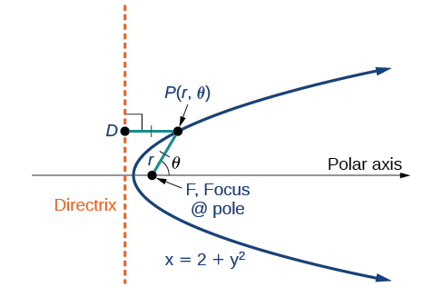

In The Parabola, we learned how a parabola is defined by the focus (a fixed point) and the directrix (a fixed line). In this section, we will learn how to define any conic in the polar coordinate system in terms of a fixed point, the focus $P(r,\theta )$ at the pole, and a line, the directrix, which is perpendicular to the polar axis.
If $F$ is a fixed point, the focus, and $D$ is a fixed line, the directrix, then we can let $e$ be a fixed positive number, called the *eccentricity*, which we can define as the ratio of the distances from a point on the graph to the focus and the point on the graph to the directrix. Then the set of all points $P$ such that $e=\frac{PF}{PD}$ is a conic. In other words, we can define a conic as the set of all points $P$ with the property that the ratio of the distance from $P$ to $F$ to the distance from $P$ to $D$ is equal to the constant $e.$
    
For a conic with eccentricity $e,$
    
if $0\le e<1,$ the conic is an ellipse
  if $e=1,$ the conic is a parabola
  if $e>1,$ the conic is an hyperbola
With this definition, we may now define a conic in terms of the directrix, $x=\pm p,$ the eccentricity $e,$ and the angle $\theta .$ Thus, each conic may be written as a *polar equation*, an equation written in terms of $r$ and $\theta .$
    

>
>
>
>
> **The Polar Equation for a Conic**
>
>
>       For a conic with a focus at the origin, if the directrix is $x=\pm p,$ where $p$ is a positive real number, and the **eccentricity** is a positive real number $e,$ the conic has a **polar equation**
>
>
>  $$
> r=\frac{ep}{1\pm e\phantom{\rule{0.5em}{0ex}}\text{}\mathrm{cos}\phantom{\rule{0.4em}{0ex}}\text{}\theta}
> $$
> For a conic with a focus at the origin, if the directrix is $y=\pm p,$ where $p$ is a positive real number, and the eccentricity is a positive real number $e,$ the conic has a polar equation
>
>
>  $r=\frac{ep}{1\pm e\phantom{\rule{0.5em}{0ex}}\text{}\mathrm{sin}\phantom{\rule{0.4em}{0ex}}\text{}\theta}$

>
>       How To
>       *Given the polar equation for a conic, identify the type of conic, the directrix, and the eccentricity.*
>
>       Multiply the numerator and denominator by the reciprocal of the constant in the denominator to rewrite the equation in standard form.
>         Identify the eccentricity $e$ as the coefficient of the trigonometric function in the denominator.
>         Compare $e$ with 1 to determine the shape of the conic.
>         Determine the directrix as $x=p$ if cosine is in the denominator and $y=p$ if sine is in the denominator. Set $ep$ equal to the numerator in standard form to solve for $x$ or $y.$
>
>

      1. **Identifying a Conic Given the Polar Form**             For each of the following equations, identify the conic with focus at the origin, the **directrix**, and the **eccentricity**.             $r=\frac{6}{3+2\phantom{\rule{0.5em}{0ex}}\text{}\mathrm{sin}\phantom{\rule{0.4em}{0ex}}\text{}\theta}$                           $r=\frac{12}{4+5\phantom{\rule{0.5em}{0ex}}\text{}\mathrm{cos}\phantom{\rule{0.4em}{0ex}}\text{}\theta}$                           $r=\frac{7}{2-2\phantom{\rule{0.5em}{0ex}}\text{}\mathrm{sin}\phantom{\rule{0.4em}{0ex}}\text{}\theta}$

Solution

For each of the three conics, we will rewrite the equation in standard form. Standard form has a 1 as the constant in the denominator. Therefore, in all three parts, the first step will be to multiply the numerator and denominator by the reciprocal of the constant of the original equation, $\frac{1}{c},$ where $c$ is that constant.  

          Multiply the numerator and denominator by $\frac{1}{3}.$

             $$
r=\frac{6}{3+2\mathrm{sin}\phantom{\rule{0.4em}{0ex}}\text{}\theta}\cdot \frac{\left(\frac{1}{3}\right)}{\left(\frac{1}{3}\right)}=\frac{6\left(\frac{1}{3}\right)}{3\left(\frac{1}{3}\right)+2\left(\frac{1}{3}\right)\mathrm{sin}\phantom{\rule{0.4em}{0ex}}\text{}\theta}=\frac{2}{1+\frac{2}{3}\phantom{\rule{0.5em}{0ex}}\text{}\mathrm{sin}\phantom{\rule{0.4em}{0ex}}\text{}\theta}
$$

Because $\mathrm{sin}\phantom{\rule{0.4em}{0ex}}\text{}\theta$ is in the denominator, the directrix is $y=p.$ Comparing to standard form, note that $e=\frac{2}{3}.$ Therefore, from the numerator,

 $$
\begin{array}{l}2=ep  \\ 2=\frac{2}{3}p  \\ \left(\frac{3}{2}\right)2=\left(\frac{3}{2}\right)\frac{2}{3}p  \\ 3=p  \end{array}
$$
Since $e<1,$ the conic is an **ellipse**. The eccentricity is $e=\frac{2}{3}$ and the directrix is $y=3.$
            

          Multiply the numerator and denominator by $\frac{1}{4}.$

             $$
\begin{array}{l}\begin{array}{l}  \\   \\ r=\frac{12}{4+5\phantom{\rule{0.5em}{0ex}}\text{}\mathrm{cos}\phantom{\rule{0.4em}{0ex}}\text{}\theta}\cdot \frac{\left(\frac{1}{4}\right)}{\left(\frac{1}{4}\right)}  \end{array}  \\ r=\frac{12\left(\frac{1}{4}\right)}{4\left(\frac{1}{4}\right)+5\left(\frac{1}{4}\right)\mathrm{cos}\phantom{\rule{0.4em}{0ex}}\text{}\theta}  \\ r=\frac{3}{1+\frac{5}{4}\phantom{\rule{0.5em}{0ex}}\text{}\mathrm{cos}\phantom{\rule{0.4em}{0ex}}\text{}\theta}  \end{array}
$$

Because $\text{cos}\phantom{\rule{0.5em}{0ex}}\theta \$ is in the denominator, the directrix is $x=p.$ Comparing to standard form, $e=\frac{5}{4}.$ Therefore, from the numerator,

 $$
\begin{array}{l}\phantom{\rule{0.5em}{0ex}}\text{\ \ \ \ \}3=ep  \\ \phantom{\rule{0.5em}{0ex}}\text{\ \ \ \ \}3=\frac{5}{4}p  \\ \phantom{\rule{0.5em}{0ex}}\left(\frac{4}{5}\right)3=\left(\frac{4}{5}\right)\frac{5}{4}p  \\ \phantom{\rule{0.5em}{0ex}}\text{\ \}\phantom{\rule{0.5em}{0ex}}\frac{12}{5}=p  \end{array}
$$

Since $e>1,$ the conic is a **hyperbola**. The eccentricity is $e=\frac{5}{4}$ and the directrix is $x=\frac{12}{5}=\mathrm{2.4.}$
            

          Multiply the numerator and denominator by $\frac{1}{2}.$

             $$
\begin{array}{l}  \\   \\ \begin{array}{l}r=\frac{7}{2-2\phantom{\rule{0.5em}{0ex}}\text{}\mathrm{sin}\phantom{\rule{0.4em}{0ex}}\text{}\theta}\cdot \frac{\left(\frac{1}{2}\right)}{\left(\frac{1}{2}\right)}  \\ r=\frac{7\left(\frac{1}{2}\right)}{2\left(\frac{1}{2}\right)-2\left(\frac{1}{2}\right)\phantom{\rule{0.5em}{0ex}}\text{}\mathrm{sin}\phantom{\rule{0.4em}{0ex}}\text{}\theta}  \\ r=\frac{\frac{7}{2}}{1-\mathrm{sin}\phantom{\rule{0.4em}{0ex}}\text{}\theta}  \end{array}  \end{array}
$$

Because sine is in the denominator, the directrix is $y=-p.$ Comparing to standard form, $e=1.$ Therefore, from the numerator,

 $\begin{array}{l}\frac{7}{2}=ep\\ \frac{7}{2}=\left(1\right)p\\ \frac{7}{2}=p\end{array}$
            
            Because $e=1,$ the conic is a **parabola**. The eccentricity is $e=1$ and the directrix is $y=-\frac{7}{2}=\mathrm{-3.5.}$

>
>       Try It
>       2. Identify the conic with focus at the origin, the directrix, and the eccentricity for $r=\frac{2}{3-\mathrm{cos}\phantom{\rule{0.4em}{0ex}}\text{}\theta}.$
>
> 

> 
Solution

>
> ellipse; $e=\frac{1}{3};\phantom{\rule{0.5em}{0ex}}x=-2$
> 

>
>
>

# Graphing the Polar Equations of Conics
When graphing in Cartesian coordinates, each conic section has a unique equation. This is not the case when graphing in polar coordinates. We must use the eccentricity of a conic section to determine which type of curve to graph, and then determine its specific characteristics. The first step is to rewrite the conic in standard form as we have done in the previous example. In other words, we need to rewrite the equation so that the denominator begins with 1. This enables us to determine $e$ and, therefore, the shape of the curve. The next step is to substitute values for $\theta$ and solve for $r$ to plot a few key points. Setting $\theta$ equal to $0,\frac{\pi}{2},\pi ,$ and $\frac{3\pi}{2}$ provides the vertices so we can create a rough sketch of the graph.

      3. **Graphing a Parabola in Polar Form**             Graph $r=\frac{5}{3+3\phantom{\rule{0.5em}{0ex}}\text{}\mathrm{cos}\phantom{\rule{0.4em}{0ex}}\text{}\theta}.$

Solution

First, we rewrite the conic in standard form by multiplying the numerator and denominator by the reciprocal of 3, which is $\frac{1}{3}.$
          

         $$
\begin{array}{l}\begin{array}{l}  \\   \\ r=\frac{5}{3+3\phantom{\rule{0.5em}{0ex}}\text{}\mathrm{cos}\phantom{\rule{0.4em}{0ex}}\text{}\theta}=\frac{5\left(\frac{1}{3}\right)}{3\left(\frac{1}{3}\right)+3\left(\frac{1}{3}\right)\mathrm{cos}\phantom{\rule{0.4em}{0ex}}\text{}\theta}  \end{array}  \\ r=\frac{\frac{5}{3}}{1+\mathrm{cos}\phantom{\rule{0.4em}{0ex}}\text{}\theta}  \end{array}
$$
Because $e=1,$ we will graph a **parabola** with a focus at the origin. The function has a $\ \mathrm{cos}\phantom{\rule{0.4em}{0ex}}\text{}\theta ,$ and there is an addition sign in the denominator, so the directrix is $x=p.$
        

     $$
\begin{array}{l}\frac{5}{3}=ep\\ \frac{5}{3}=(1)p\\ \frac{5}{3}=p\end{array}
$$
        
        The directrix is $x=\frac{5}{3}.$
        

        Plotting a few key points as in  will enable us to see the vertices. See .

        

|  | A | B | C | D |
| :--- | :--- | :--- | :--- | :--- |
| $\theta$ | $0$ | $\frac{\pi}{2}$ | $\pi$ | $\frac{3\pi}{2}$ |
| $r=\frac{5}{3+3\phantom{\rule{0.5em}{0ex}}\text{}\mathrm{cos}\phantom{\rule{0.4em}{0ex}}\text{}\theta}$ | $\frac{5}{6}\approx 0.83$ | $\frac{5}{3}\approx 1.67$ | undefined | $\frac{5}{3}\approx 1.67$ |

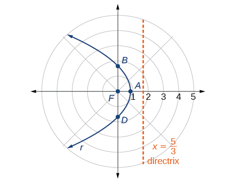

      4. **Graphing a Hyperbola in Polar Form**             Graph $r=\frac{8}{2-3\phantom{\rule{0.5em}{0ex}}\text{}\mathrm{sin}\phantom{\rule{0.4em}{0ex}}\text{}\theta}.$

Solution

First, we rewrite the conic in standard form by multiplying the numerator and denominator by the reciprocal of 2, which is $\frac{1}{2}.$
          

           $$
\begin{array}{l}\begin{array}{l}  \\   \\ r=\frac{8}{2-3\mathrm{sin}\phantom{\rule{0.4em}{0ex}}\text{}\theta}=\frac{8\left(\frac{1}{2}\right)}{2\left(\frac{1}{2}\right)-3\left(\frac{1}{2}\right)\mathrm{sin}\phantom{\rule{0.4em}{0ex}}\text{}\theta}  \end{array}  \\ r=\frac{4}{1-\frac{3}{2}\phantom{\rule{0.5em}{0ex}}\text{}\mathrm{sin}\phantom{\rule{0.4em}{0ex}}\text{}\theta}  \end{array}
$$

        Because $e=\frac{3}{2},e>1,$ so we will graph a **hyperbola** with a focus at the origin. The function has a $\mathrm{sin}\phantom{\rule{0.4em}{0ex}}\text{}\theta$ term and there is a subtraction sign in the denominator, so the directrix is $y=-p.$
          

 $$
\begin{array}{l}4=ep  \\ 4=\left(\frac{3}{2}\right)p  \\ 4\left(\frac{2}{3}\right)=p  \\ \frac{8}{3}=p  \end{array}
$$
The directrix is $y=-\frac{8}{3}.$
          

        Plotting a few key points as in  will enable us to see the vertices. See .

          

|  | A | B | C | D |
| :--- | :--- | :--- | :--- | :--- |
| $\theta$ | $0$ | $\frac{\pi}{2}$ | $\pi$ | $\frac{3\pi}{2}$ |
| $$ r=\frac{8}{2-3\mathrm{sin}\phantom{\rule{0.4em}{0ex}}\theta} $$ | $4$ | $-8$ | $4$ | $\frac{8}{5}=1.6$ |

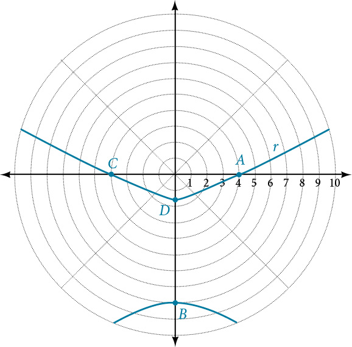

    

      5. **Graphing an Ellipse in Polar Form**             Graph $r=\frac{10}{5-4\phantom{\rule{0.5em}{0ex}}\text{}\mathrm{cos}\phantom{\rule{0.4em}{0ex}}\text{}\theta}.$

Solution

First, we rewrite the conic in standard form by multiplying the numerator and denominator by the reciprocal of 5, which is $\frac{1}{5}.$
          

           $$
\begin{array}{l}  \\ \begin{array}{l}r=\frac{10}{5-4\mathrm{cos}\phantom{\rule{0.4em}{0ex}}\text{}\theta}=\frac{10\left(\frac{1}{5}\right)}{5\left(\frac{1}{5}\right)-4\left(\frac{1}{5}\right)\mathrm{cos}\phantom{\rule{0.4em}{0ex}}\text{}\theta}  \\ r=\frac{2}{1-\frac{4}{5}\phantom{\rule{0.5em}{0ex}}\text{}\mathrm{cos}\phantom{\rule{0.4em}{0ex}}\text{}\theta}  \end{array}  \end{array}
$$

        Because $e=\frac{4}{5},e<1,$ so we will graph an **ellipse** with a **focus** at the origin. The function has a $\text{cos}\phantom{\rule{0.5em}{0ex}}\theta ,$ and there is a subtraction sign in the denominator, so the **directrix** is $x=-p.$
          

     $$
\begin{array}{l}2=ep  \\ 2=\left(\frac{4}{5}\right)p  \\ 2\left(\frac{5}{4}\right)=p  \\ \frac{5}{2}=p  \end{array}
$$
The directrix is $x=-\frac{5}{2}.$
          

        Plotting a few key points as in  will enable us to see the vertices. See .

|  | A | B | C | D |
| :--- | :--- | :--- | :--- | :--- |
| $\theta$ | $0$ | $\frac{\pi}{2}$ | $\pi$ | $\frac{3\pi}{2}$ |
| $r=\frac{10}{5-4\phantom{\rule{0.5em}{0ex}}\text{}\mathrm{cos}\phantom{\rule{0.4em}{0ex}}\text{}\theta}$ | $10$ | $2$ | $\frac{10}{9}\approx 1.1$ | $2$ |

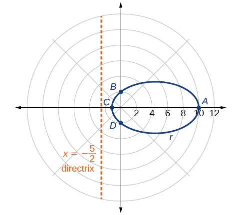

>
>       Try It
>       6. Graph $r=\frac{2}{4-\mathrm{cos}\phantom{\rule{0.4em}{0ex}}\text{}\theta}.$
>
> 

> 
Solution

>
> 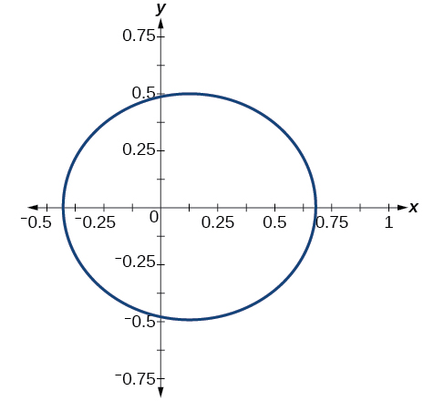
> 

>

  
# Defining Conics in Terms of a Focus and a Directrix
So far we have been using polar equations of conics to describe and graph the curve. Now we will work in reverse; we will use information about the origin, eccentricity, and directrix to determine the polar equation.

>
>       How To
>       *Given the focus, eccentricity, and directrix of a conic, determine the polar equation.*
>
>       Determine whether the directrix is horizontal or vertical. If the directrix is given in terms of $y,$ we use the general polar form in terms of sine. If the directrix is given in terms of $x,$ we use the general polar form in terms of cosine.
>         Determine the sign in the denominator. If $p<0,$ use subtraction. If $p>0,$ use addition.
>       Write the coefficient of the trigonometric function as the given eccentricity.
>         Write the absolute value of $p$ in the numerator, and simplify the equation.

      7. **Finding the Polar Form of a Vertical Conic Given a Focus at the Origin and the Eccentricity and Directrix**             Find the polar form of the **conic** given a **focus** at the origin, $e=3$ and **directrix** $y=-2.$

Solution

The directrix is $y=-p,$ so we know the trigonometric function in the denominator is sine. 
Because $y=\mathrm{-2},\mathrm{\u20132}<0,$ so we know there is a subtraction sign in the denominator. We use the standard form of

 $$
r=\frac{ep}{1-e\phantom{\rule{0.5em}{0ex}}\text{}\mathrm{sin}\phantom{\rule{0.4em}{0ex}}\text{}\theta}
$$

and $e=3$ and $\left|\mathrm{-2}\right|=2=p.$
          

Therefore,

           $\begin{array}{l}  \\ \begin{array}{l}r=\frac{(3)(2)}{1-3\phantom{\rule{0.5em}{0ex}}\text{}\mathrm{sin}\phantom{\rule{0.4em}{0ex}}\text{}\theta}  \\ r=\frac{6}{1-3\phantom{\rule{0.5em}{0ex}}\text{}\mathrm{sin}\phantom{\rule{0.4em}{0ex}}\text{}\theta}  \end{array}  \end{array}$

    

      8. **Finding the Polar Form of a Horizontal Conic Given a Focus at the Origin and the Eccentricity and Directrix**             Find the **polar form of a conic** given a **focus** at the origin, $e=\frac{3}{5},$ and **directrix** $x=4.$

Solution

Because the directrix is $x=p,$ we know the function in the denominator is cosine. Because $x=4,4>0,$ so we know there is an addition sign in the denominator. We use the standard form of 

           $r=\frac{ep}{1+e\phantom{\rule{0.5em}{0ex}}\text{}\mathrm{cos}\phantom{\rule{0.4em}{0ex}}\text{}\theta}$

and $e=\frac{3}{5}$ and $\left|4\right|=4=p.$
          

Therefore,

           $$
\begin{array}{l}\begin{array}{l}  \\   \\ r=\frac{\left(\frac{3}{5}\right)(4)}{1+\frac{3}{5}\phantom{\rule{0.5em}{0ex}}\mathrm{cos}\phantom{\rule{0.4em}{0ex}}\theta}  \end{array}  \\ r=\frac{\frac{12}{5}}{1+\frac{3}{5}\phantom{\rule{0.5em}{0ex}}\mathrm{cos}\phantom{\rule{0.4em}{0ex}}\theta}  \\ r=\frac{\frac{12}{5}}{1\left(\frac{5}{5}\right)+\frac{3}{5}\phantom{\rule{0.5em}{0ex}}\mathrm{cos}\phantom{\rule{0.4em}{0ex}}\theta}  \\ r=\frac{\frac{12}{5}}{\frac{5}{5}+\frac{3}{5}\phantom{\rule{0.5em}{0ex}}\mathrm{cos}\phantom{\rule{0.4em}{0ex}}\theta}  \\ r=\frac{12}{5}\cdot \frac{5}{5+3\phantom{\rule{0.5em}{0ex}}\mathrm{cos}\phantom{\rule{0.4em}{0ex}}\theta}  \\ r=\frac{12}{5+3\phantom{\rule{0.5em}{0ex}}\mathrm{cos}\phantom{\rule{0.4em}{0ex}}\theta}  \end{array}
$$

    

>
>       Try It
>       9. Find the polar form of the conic given a focus at the origin, $e=1,$ and directrix $x=\mathrm{-1.}$
>
> 

> 
Solution

>
> $r=\frac{1}{1-\mathrm{cos}\theta}$
> 

>
>
>

      10. **Converting a Conic in Polar Form to Rectangular Form**             Convert the conic $r=\frac{1}{5-5\mathrm{sin}\phantom{\rule{0.4em}{0ex}}\theta}$ to rectangular form.

Solution

We will rearrange the formula to use the identities $\ r=\sqrt{{x}^{2}+{y}^{2}},x=r\phantom{\rule{0.5em}{0ex}}\mathrm{cos}\phantom{\rule{0.4em}{0ex}}\theta ,\text{and\}y=r\phantom{\rule{0.5em}{0ex}}\mathrm{sin}\phantom{\rule{0.4em}{0ex}}\theta .$
          

 $$
\begin{array}{ll}\phantom{\rule{0.5em}{0ex}}\text{\ \ \ \ \ \ \ \ \ \ \ \ \ \ \ \ \ \ \ \ \ \ \ \ \}r=\frac{1}{5-5\phantom{\rule{0.5em}{0ex}}\mathrm{sin}\phantom{\rule{0.4em}{0ex}}\theta}  &   \\ \ r\cdot (5-5\phantom{\rule{0.5em}{0ex}}\mathrm{sin}\phantom{\rule{0.4em}{0ex}}\theta )=\frac{1}{5-5\phantom{\rule{0.5em}{0ex}}\mathrm{sin}\phantom{\rule{0.4em}{0ex}}\theta}\cdot (5-5\phantom{\rule{0.5em}{0ex}}\mathrm{sin}\phantom{\rule{0.4em}{0ex}}\theta )  & \text{Eliminate\ the\ fraction}.  \\ \phantom{\rule{0.5em}{0ex}}\text{\ \ \ \ \ \}\phantom{\rule{0.5em}{0ex}}5r-5r\phantom{\rule{0.5em}{0ex}}\mathrm{sin}\phantom{\rule{0.4em}{0ex}}\theta =1  & \text{Distribute}.  \\ \phantom{\rule{0.5em}{0ex}}\text{\ \ \ \ \ \ \ \ \ \ \ \ \ \ \ \ \ \ \ \ \ \ \}5r=1+5r\phantom{\rule{0.5em}{0ex}}\mathrm{sin}\phantom{\rule{0.4em}{0ex}}\theta   & \text{Isolate\}5r.  \\ \phantom{\rule{0.5em}{0ex}}\text{\ \ \ \ \ \ \ \ \ \ \ \ \ \ \ \ \ \ \}25{r}^{2}={(1+5r\phantom{\rule{0.5em}{0ex}}\mathrm{sin}\phantom{\rule{0.4em}{0ex}}\theta )}^{2}  & \text{Square\ both\ sides}.  \\ \phantom{\rule{0.5em}{0ex}}\text{\ \ \ \ \ \ \ \}25({x}^{2}+{y}^{2})={(1+5y)}^{2}  & \text{Substitute\}r=\sqrt{{x}^{2}+{y}^{2}}\phantom{\rule{0.5em}{0ex}}\text{and\}y=r\phantom{\rule{0.5em}{0ex}}\mathrm{sin}\phantom{\rule{0.4em}{0ex}}\theta .  \\ \phantom{\rule{0.5em}{0ex}}\text{\ \ \ \ \ \}\phantom{\rule{0.5em}{0ex}}25{x}^{2}+25{y}^{2}=1+10y+25{y}^{2}  & \text{Distribute\ and\ use\ FOIL}.  \\ \phantom{\rule{0.5em}{0ex}}\text{\ \ \ \ \ \ \ \}\phantom{\rule{0.5em}{0ex}}25{x}^{2}-10y=1  & \text{Rearrange\ terms\ and\ set\ equal\ to\ 1}.  \end{array}
$$

    

> Try It
>       11. Convert the conic $r=\frac{2}{1+2\phantom{\rule{0.5em}{0ex}}\text{}\mathrm{cos}\phantom{\rule{0.4em}{0ex}}\text{}\theta}$ to rectangular form.
>
> 

> 
Solution

>
> $4-8x+3{x}^{2}-{y}^{2}=0$
> 

>
>
>

> Media
>       Access these online resources for additional instruction and practice with conics in polar coordinates.
>
> Polar Equations of Conic Sections
> Graphing Polar Equations of Conics - 1
> Graphing Polar Equations of Conics - 2
>
>

  
# Key Concepts
Any conic may be determined by a single focus, the corresponding eccentricity,  and the directrix. We can also define a conic in terms of a fixed point, the focus $P(r,\theta )$ at the pole, and a line, the directrix, which is perpendicular to the polar axis.
      A conic is the set of all points $e=\frac{PF}{PD},$ where eccentricity $e$ is a positive real number. Each conic may be written in terms of its polar equation. See .
      The polar equations of conics can be graphed. See , , and .
      Conics can be defined in terms of a focus, a directrix, and eccentricity. See  and .
      We can use the identities $r=\sqrt{{x}^{2}+{y}^{2}},x=r\phantom{\rule{0.5em}{0ex}}\text{}\mathrm{cos}\phantom{\rule{0.4em}{0ex}}\text{}\theta ,$ and $y=r\phantom{\rule{0.5em}{0ex}}\text{}\mathrm{sin}\phantom{\rule{0.4em}{0ex}}\text{}\theta$ to convert the equation for a conic from polar to rectangular form. See .
    

  
# Section Exercises

## Verbal
1. Explain how eccentricity determines which conic section is given.

Solution

If eccentricity is less than 1, it is an ellipse. If eccentricity is equal to 1, it is a parabola. If eccentricity is greater than 1, it is a hyperbola.

2. If a conic section is written as a polar equation, what must be true of the denominator?

3. If a conic section is written as a polar equation, and the denominator involves $\mathrm{sin}\phantom{\rule{0.4em}{0ex}}\text{}\theta ,$ what conclusion can be drawn about the directrix?

Solution

The directrix will be parallel to the polar axis.

4. If the directrix of a conic section is perpendicular to the polar axis, what do we know about the equation of the graph?

5. What do we know about the focus/foci of a conic section if it is written as a polar equation?

Solution

One of the foci will be located at the origin.

## Algebraic
For the following exercises, identify the conic with a focus at the origin, and then give the directrix and eccentricity.
6. $r=\frac{6}{1-2\phantom{\rule{0.5em}{0ex}}\text{}\mathrm{cos}\phantom{\rule{0.4em}{0ex}}\text{}\theta}$

7. $r=\frac{3}{4-4\phantom{\rule{0.5em}{0ex}}\text{}\mathrm{sin}\phantom{\rule{0.4em}{0ex}}\text{}\theta}$

Solution

Parabola with $e=1$ and directrix $\frac{3}{4}$ units below the pole.

8. $r=\frac{8}{4-3\phantom{\rule{0.5em}{0ex}}\text{}\mathrm{cos}\phantom{\rule{0.4em}{0ex}}\text{}\theta}$

9. $r=\frac{5}{1+2\phantom{\rule{0.5em}{0ex}}\text{}\mathrm{sin}\phantom{\rule{0.4em}{0ex}}\text{}\theta}$

Solution

Hyperbola with $e=2$ and directrix $\frac{5}{2}$ units above the pole.

10. $r=\frac{16}{4+3\phantom{\rule{0.5em}{0ex}}\text{}\mathrm{cos}\phantom{\rule{0.4em}{0ex}}\text{}\theta}$

11. $r=\frac{3}{10+10\phantom{\rule{0.5em}{0ex}}\text{}\mathrm{cos}\phantom{\rule{0.4em}{0ex}}\text{}\theta}$

Solution

Parabola with $e=1$ and directrix $\frac{3}{10}$ units to the right of the pole.

12. $r=\frac{2}{1-\mathrm{cos}\phantom{\rule{0.4em}{0ex}}\text{}\theta}$

13. $r=\frac{4}{7+2\phantom{\rule{0.5em}{0ex}}\text{}\mathrm{cos}\phantom{\rule{0.4em}{0ex}}\text{}\theta}$

Solution

Ellipse with $e=\frac{2}{7}$ and directrix $2$ units to the right of the pole.

14. $r(1-\mathrm{cos}\phantom{\rule{0.4em}{0ex}}\text{}\theta )=3$

15. $r(3+5\mathrm{sin}\phantom{\rule{0.4em}{0ex}}\text{}\theta )=11$

Solution

Hyperbola with $e=\frac{5}{3}$ and directrix $\frac{11}{5}$ units above the pole.

16. $r(4-5\mathrm{sin}\phantom{\rule{0.4em}{0ex}}\text{}\theta )=1$

17. $r(7+8\mathrm{cos}\phantom{\rule{0.4em}{0ex}}\text{}\theta )=7$

Solution

Hyperbola with $e=\frac{8}{7}$ and directrix $\frac{7}{8}$ units to the right of the pole.

For the following exercises, convert the polar equation of a conic section to a rectangular equation.
18. $r=\frac{4}{1+3\phantom{\rule{0.5em}{0ex}}\text{}\mathrm{sin}\phantom{\rule{0.4em}{0ex}}\text{}\theta}$

19. $r=\frac{2}{5-3\phantom{\rule{0.5em}{0ex}}\text{}\mathrm{sin}\phantom{\rule{0.4em}{0ex}}\text{}\theta}$

Solution

$25{x}^{2}+16{y}^{2}-12y-4=0$

20. $r=\frac{8}{3-2\phantom{\rule{0.5em}{0ex}}\text{}\mathrm{cos}\phantom{\rule{0.4em}{0ex}}\text{}\theta}$

21. $r=\frac{3}{2+5\phantom{\rule{0.5em}{0ex}}\text{}\mathrm{cos}\phantom{\rule{0.4em}{0ex}}\text{}\theta}$

Solution

$21{x}^{2}-4{y}^{2}-30x+9=0$

22. $r=\frac{4}{2+2\phantom{\rule{0.5em}{0ex}}\text{}\mathrm{sin}\phantom{\rule{0.4em}{0ex}}\text{}\theta}$

23. $r=\frac{3}{8-8\phantom{\rule{0.5em}{0ex}}\text{}\mathrm{cos}\phantom{\rule{0.4em}{0ex}}\text{}\theta}$

Solution

$64{y}^{2}=48x+9$

24. $r=\frac{2}{6+7\phantom{\rule{0.5em}{0ex}}\text{}\mathrm{cos}\phantom{\rule{0.4em}{0ex}}\text{}\theta}$

25. $r=\frac{5}{5-11\phantom{\rule{0.5em}{0ex}}\text{}\mathrm{sin}\phantom{\rule{0.4em}{0ex}}\text{}\theta}$

Solution

$96{y}^{2}-25{x}^{2}+110y+25=0$

26. $r(5+2\phantom{\rule{0.5em}{0ex}}\text{}\mathrm{cos}\phantom{\rule{0.4em}{0ex}}\text{}\theta )=6$

27. $r(2-\mathrm{cos}\phantom{\rule{0.4em}{0ex}}\text{}\theta )=1$

Solution

$3{x}^{2}+4{y}^{2}-2x-1=0$

28. $r(2.5-2.5\phantom{\rule{0.5em}{0ex}}\text{}\mathrm{sin}\phantom{\rule{0.4em}{0ex}}\text{}\theta )=5$

29. $r=\frac{6\mathrm{sec}\phantom{\rule{0.5em}{0ex}}\text{}\theta}{-2+3\phantom{\rule{0.5em}{0ex}}\text{}\mathrm{sec}\phantom{\rule{0.5em}{0ex}}\text{}\theta}$

Solution

$5{x}^{2}+9{y}^{2}-24x-36=0$

30. $r=\frac{6\mathrm{csc}\phantom{\rule{0.5em}{0ex}}\text{}\theta}{3+2\phantom{\rule{0.5em}{0ex}}\text{}\mathrm{csc}\phantom{\rule{0.5em}{0ex}}\text{}\theta}$

For the following exercises, graph the given conic section. If it is a parabola, label the vertex, focus, and directrix. If it is an ellipse, label the vertices and foci. If it is a hyperbola, label the vertices and foci.
31. $r=\frac{5}{2+\mathrm{cos}\phantom{\rule{0.4em}{0ex}}\text{}\theta}$

Solution

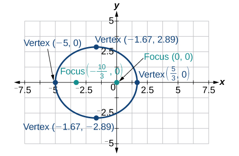

32. $r=\frac{2}{3+3\phantom{\rule{0.5em}{0ex}}\text{}\mathrm{sin}\phantom{\rule{0.4em}{0ex}}\text{}\theta}$

33. $r=\frac{10}{5-4\phantom{\rule{0.5em}{0ex}}\text{}\mathrm{sin}\phantom{\rule{0.4em}{0ex}}\text{}\theta}$

Solution

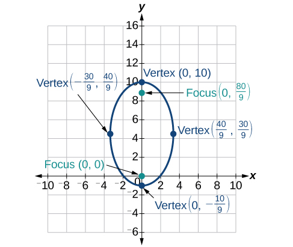

34. $r=\frac{3}{1+2\phantom{\rule{0.5em}{0ex}}\text{}\mathrm{cos}\phantom{\rule{0.4em}{0ex}}\text{}\theta}$

35. $r=\frac{8}{4-5\phantom{\rule{0.5em}{0ex}}\text{}\mathrm{cos}\phantom{\rule{0.4em}{0ex}}\text{}\theta}$

Solution

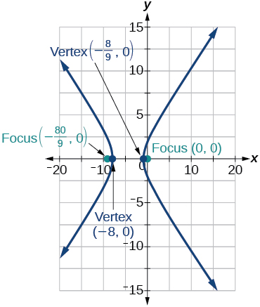

36. $r=\frac{3}{4-4\phantom{\rule{0.5em}{0ex}}\text{}\mathrm{cos}\phantom{\rule{0.4em}{0ex}}\text{}\theta}$

37. $r=\frac{2}{1-\mathrm{sin}\phantom{\rule{0.4em}{0ex}}\text{}\theta}$

Solution

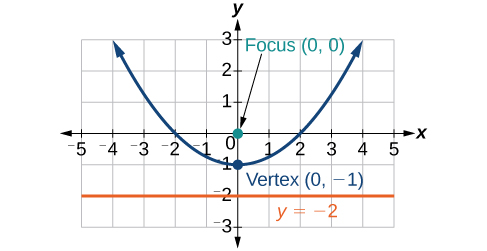

38. $r=\frac{6}{3+2\phantom{\rule{0.5em}{0ex}}\text{}\mathrm{sin}\phantom{\rule{0.4em}{0ex}}\text{}\theta}$

39. $r(1+\mathrm{cos}\phantom{\rule{0.4em}{0ex}}\text{}\theta )=5$

Solution

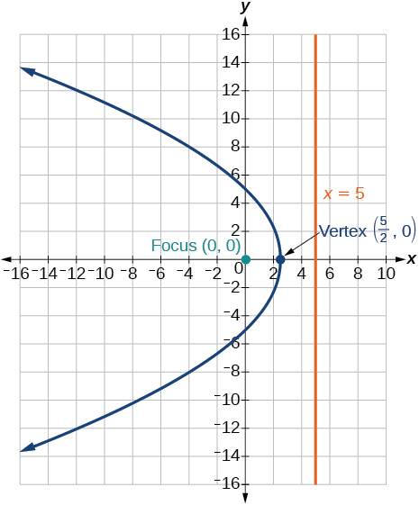

40. $r(3-4\mathrm{sin}\phantom{\rule{0.4em}{0ex}}\text{}\theta )=9$

41. $r(3-2\mathrm{sin}\phantom{\rule{0.4em}{0ex}}\text{}\theta )=6$

Solution

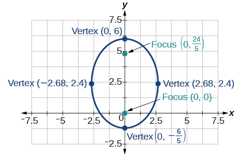

42. $r(6-4\mathrm{cos}\phantom{\rule{0.4em}{0ex}}\text{}\theta )=5$

For the following exercises, find the polar equation of the conic with focus at the origin and the given eccentricity and directrix.
43. Directrix: $x=4;\phantom{\rule{0.5em}{0ex}}e=\frac{1}{5}$

Solution

$r=\frac{4}{5+\mathrm{cos}\theta}$

44. Directrix: $x=-4;\phantom{\rule{0.5em}{0ex}}e=5$

45. Directrix: $y=2;\phantom{\rule{0.5em}{0ex}}e=2$

Solution

$r=\frac{4}{1+2\mathrm{sin}\theta}$

46. Directrix: $y=-2;\phantom{\rule{0.5em}{0ex}}e=\frac{1}{2}$

47. Directrix: $x=1;\phantom{\rule{0.5em}{0ex}}e=1$

Solution

$r=\frac{1}{1+\mathrm{cos}\theta}$

48. Directrix: $x=-1;\phantom{\rule{0.5em}{0ex}}e=1$

49. Directrix: $x=-\frac{1}{4};\phantom{\rule{0.5em}{0ex}}e=\frac{7}{2}$

Solution

$r=\frac{7}{8-28\mathrm{cos}\theta}$

50. Directrix: $y=\frac{2}{5};\phantom{\rule{0.5em}{0ex}}e=\frac{7}{2}$

51. Directrix: $y=4;\phantom{\rule{0.5em}{0ex}}e=\frac{3}{2}$

Solution

$r=\frac{12}{2+3\mathrm{sin}\theta}$

52. Directrix: $x=\mathrm{-2};\phantom{\rule{0.5em}{0ex}}e=\frac{8}{3}$

53. Directrix: $x=\mathrm{-5};\phantom{\rule{0.5em}{0ex}}e=\frac{3}{4}$

Solution

$r=\frac{15}{4-3\mathrm{cos}\theta}$

54. Directrix: $y=2;\phantom{\rule{0.5em}{0ex}}e=2.5$

55. Directrix: $x=\mathrm{-3};\phantom{\rule{0.5em}{0ex}}e=\frac{1}{3}$

Solution

$r=\frac{3}{3-3\mathrm{cos}\theta}$

## Extensions
Recall from Rotation of Axes that equations of conics with an $xy$ term have rotated graphs. For the following exercises, express each equation in polar form with $r$ as a function of $\theta .$
      
56. $xy=2$

57. ${x}^{2}+xy+{y}^{2}=4$

Solution

$r=\pm \frac{2}{\sqrt{1+\mathrm{sin}\theta \mathrm{cos}\theta}}$

58. $2{x}^{2}+4xy+2{y}^{2}=9$

59. $16{x}^{2}+24xy+9{y}^{2}=4$

Solution

$r=\pm \frac{2}{4\mathrm{cos}\theta +3\mathrm{sin}\theta}$

60. $2xy+y=1$

  
# Chapter Review Exercises

## The Ellipse
For the following exercises, write the equation of the ellipse in standard form. Then identify the center, vertices, and foci.
12. $\frac{{x}^{2}}{25}+\frac{{y}^{2}}{64}=1$

Solution

$\frac{{x}^{2}}{{5}^{2}}+\frac{{y}^{2}}{{8}^{2}}=1;$ center: $\left(0,0\right);$ vertices: $\left(5,0\right),\left(\mathrm{-5},0\right),\left(0,8\right),\left(0,-8\right);$ foci: $\left(0,\sqrt{39}\right),\left(0,-\sqrt{39}\right)$

13. $\frac{{(x-2)}^{2}}{100}+\frac{{\left(y+3\right)}^{2}}{36}=1$

14. $9{x}^{2}+{y}^{2}+54x-4y+76=0$

Solution

$\frac{{(x+3)}^{2}}{{1}^{2}}+\frac{{(y-2)}^{2}}{{3}^{2}}=1\phantom{\rule{0.5em}{0ex}}\phantom{\rule{0.5em}{0ex}}(-3,2);\phantom{\rule{0.5em}{0ex}}\phantom{\rule{0.5em}{0ex}}(-2,2),(-4,2),(-3,5),(-3,-1);\phantom{\rule{0.5em}{0ex}}\phantom{\rule{0.5em}{0ex}}\left(-3,2+2\sqrt{2}\right),\left(-3,2-2\sqrt{2}\right)$

15. $9{x}^{2}+36{y}^{2}-36x+72y+36=0$

For the following exercises, graph the ellipse, noting center, vertices, and foci.
16. $\frac{{x}^{2}}{36}+\frac{{y}^{2}}{9}=1$

Solution

center: $\left(0,0\right);$ vertices: $\left(6,0\right),\left(\mathrm{-6},0\right),\left(0,3\right),\left(0,\mathrm{-3}\right);$ foci: $\left(3\sqrt{3},0\right),\left(-3\sqrt{3},0\right)$
      

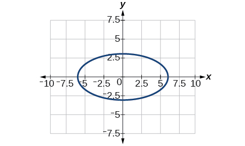

17. $\frac{{(x-4)}^{2}}{25}+\frac{{\left(y+3\right)}^{2}}{49}=1$

18. $4{x}^{2}+{y}^{2}+16x+4y-44=0$

Solution

center: $\left(\mathrm{-2},\mathrm{-2}\right);$ vertices: $\left(2,\mathrm{-2}\right),\left(\mathrm{-6},\mathrm{-2}\right),\left(\mathrm{-2},6\right),\left(\mathrm{-2},\mathrm{-10}\right);$ foci: $\left(\mathrm{-2},\mathrm{-2}+4\sqrt{3},\right),\left(\mathrm{-2},\mathrm{-2}\mathrm{-4}\sqrt{3}\right)$
            

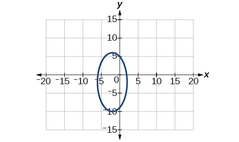

19. $2{x}^{2}+3{y}^{2}-20x+12y+38=0$

For the following exercises, use the given information to find the equation for the ellipse.
20. Center at $\left(0,0\right),$ focus at $\left(3,0\right),$ vertex at $\left(\mathrm{-5},0\right)$

Solution

$\frac{{x}^{2}}{25}+\frac{{y}^{2}}{16}=1$

21. Center at $\left(2,\mathrm{-2}\right),$ vertex at $\left(7,\mathrm{-2}\right),$ focus at $\left(4,\mathrm{-2}\right)$

22. A whispering gallery is to be constructed such that the foci are located 35 feet from the center. If  the length of the gallery is to be 100 feet, what should the height of the ceiling be?

Solution

Approximately 35.71 feet

## The Hyperbola
For the following exercises, write the equation of the hyperbola in standard form. Then give the center, vertices, and foci.
23. $\frac{{x}^{2}}{81}-\frac{{y}^{2}}{9}=1$

24. $\frac{{\left(y+1\right)}^{2}}{16}-\frac{{\left(x-4\right)}^{2}}{36}=1$

Solution

$\frac{{\left(y+1\right)}^{2}}{{4}^{2}}-\frac{{\left(x-4\right)}^{2}}{{6}^{2}}=1;$ center: $\left(4,\mathrm{-1}\right);$ vertices: $\left(4,3\right),\left(4,\mathrm{-5}\right);$ foci: $\left(4,\mathrm{-1}+2\sqrt{13}\right),\left(4,\mathrm{-1}-2\sqrt{13}\right)$

25. $9{y}^{2}-4{x}^{2}+54y-16x+29=0$

26. $3{x}^{2}-{y}^{2}-12x-6y-9=0$

Solution

$\frac{{\left(x-2\right)}^{2}}{{2}^{2}}-\frac{{\left(y+3\right)}^{2}}{{\left(2\sqrt{3}\right)}^{2}}=1;$ center: $\left(2,\mathrm{-3}\right);$ vertices: $\left(4,\mathrm{-3}\right),\left(0,\mathrm{-3}\right);$ foci: $\left(6,\mathrm{-3}\right),\left(\mathrm{-2},\mathrm{-3}\right)$

For the following exercises,  graph the hyperbola, labeling vertices and foci.
27. $\frac{{x}^{2}}{9}-\frac{{y}^{2}}{16}=1$

28. $\frac{{\left(y-1\right)}^{2}}{49}-\frac{{\left(x+1\right)}^{2}}{4}=1$

Solution

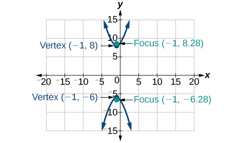

29. ${x}^{2}-4{y}^{2}+6x+32y-91=0$

30. $2{y}^{2}-{x}^{2}-12y-6=0$

Solution

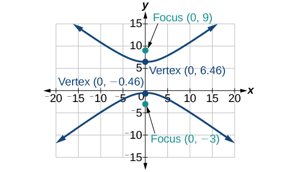

For the following exercises, find the equation of the hyperbola.
31. Center at $\left(0,0\right),$ vertex at $\left(0,4\right),$ focus at $\left(0,\mathrm{-6}\right)$

32. Foci at $\left(3,7\right)$ and $\left(7,7\right),$ vertex at $\left(6,7\right)$

Solution

$\frac{{\left(x-5\right)}^{2}}{1}-\frac{{\left(y-7\right)}^{2}}{3}=1$

## The Parabola
For the following exercises, write the equation of the parabola in standard form. Then give the vertex, focus, and directrix.
33. ${y}^{2}=12x$

34. ${\left(x+2\right)}^{2}=\frac{1}{2}\left(y-1\right)$

Solution

${\left(x+2\right)}^{2}=\frac{1}{2}\left(y-1\right);$ vertex: $\left(\mathrm{-2},1\right);$ focus: $\left(\mathrm{-2},\frac{9}{8}\right);$ directrix: $y=\frac{7}{8}$

35. ${y}^{2}-6y-6x-3=0$

36. ${x}^{2}+10x-y+23=0$

Solution

${\left(x+5\right)}^{2}=\left(y+2\right);$ vertex: $\left(-5,-2\right);$ focus: $\left(-5,-\frac{7}{4}\right);$ directrix: $y=-\frac{9}{4}$

For the following exercises, graph the parabola, labeling vertex, focus, and directrix.
37. ${x}^{2}+4y=0$

38. ${\left(y-1\right)}^{2}=\frac{1}{2}\left(x+3\right)$

Solution

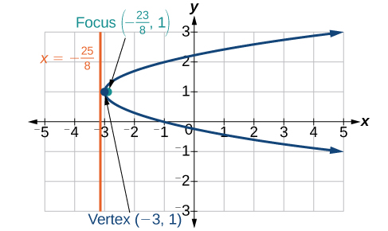

39. ${x}^{2}-8x-10y+46=0$

40. $2{y}^{2}+12y+6x+15=0$

Solution

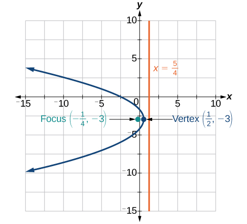

For the following exercises, write the equation of the parabola using the given information.
41. Focus at $\left(\mathrm{-4},0\right);$ directrix is $x=4$

42. Focus at $\left(2,\frac{9}{8}\right);$ directrix is $y=\frac{7}{8}$

Solution

${\left(x-2\right)}^{2}=\left(\frac{1}{2}\right)\left(y-1\right)$

43. A cable TV receiving dish is the shape of a paraboloid of revolution. Find the location of the receiver, which is placed at the focus, if the dish is 5 feet across at its opening and 1.5 feet deep.

## Rotation of Axes
For the following exercises, determine which of the conic sections is represented.
44. $16{x}^{2}+24xy+9{y}^{2}+24x-60y-60=0$

Solution

${B}^{2}-4AC=0,$
          parabola

45. $4{x}^{2}+14xy+5{y}^{2}+18x-6y+30=0$

46. $4{x}^{2}+xy+2{y}^{2}+8x-26y+9=0$

Solution

${B}^{2}-4AC=-31<0,$
          ellipse

For the following exercises, determine the angle $\theta$ that will eliminate the $xy$ term, and write the corresponding equation without the $xy$ term.
47. ${x}^{2}+4xy-2{y}^{2}-6=0$

48. ${x}^{2}-xy+{y}^{2}-6=0$

Solution

$\theta ={45}^{\circ},{{x}^{\prime}}^{2}+3{{y}^{\prime}}^{2}-12=0$

For the following exercises, graph the equation relative to the ${x}^{\prime}{y}^{\prime}$ system in which the equation has no ${x}^{\prime}{y}^{\prime}$ term.
49. $9{x}^{2}-24xy+16{y}^{2}-80x-60y+100=0$

50. ${x}^{2}-xy+{y}^{2}-2=0$

Solution

$\theta ={45}^{\circ}$ 
        

        

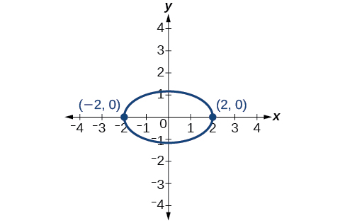

51. $6{x}^{2}+24xy-{y}^{2}-12x+26y+11=0$

## Conic Sections in Polar Coordinates
For the following exercises, given the polar equation of the conic with focus at the origin, identify the eccentricity and directrix.
52. $r=\frac{10}{1-5\phantom{\rule{0.5em}{0ex}}\text{}\mathrm{cos}\phantom{\rule{0.4em}{0ex}}\text{}\theta}$

Solution

Hyperbola with $e=5$ and directrix $2$ units to the left of the pole.

53. $r=\frac{6}{3+2\phantom{\rule{0.5em}{0ex}}\text{}\mathrm{cos}\phantom{\rule{0.4em}{0ex}}\text{}\theta}$

54. $r=\frac{1}{4+3\phantom{\rule{0.5em}{0ex}}\text{}\mathrm{sin}\phantom{\rule{0.4em}{0ex}}\text{}\theta}$

Solution

Ellipse with $e=\frac{3}{4}$ and directrix $\frac{1}{3}$ unit above the pole.

55. $r=\frac{3}{5-5\phantom{\rule{0.5em}{0ex}}\text{}\mathrm{sin}\phantom{\rule{0.4em}{0ex}}\text{}\theta}$

For the following exercises, graph the conic given in polar form. If it is a parabola, label the vertex, focus, and directrix. If it is an ellipse or a hyperbola, label the vertices and foci.
56. $r=\frac{3}{1-\mathrm{sin}\phantom{\rule{0.4em}{0ex}}\text{}\theta}$

Solution

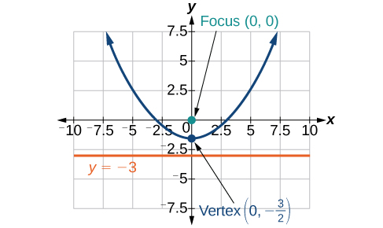

57. $r=\frac{8}{4+3\phantom{\rule{0.5em}{0ex}}\text{}\mathrm{sin}\phantom{\rule{0.4em}{0ex}}\text{}\theta}$

58. $r=\frac{10}{4+5\phantom{\rule{0.5em}{0ex}}\text{}\mathrm{cos}\phantom{\rule{0.4em}{0ex}}\text{}\theta}$

Solution

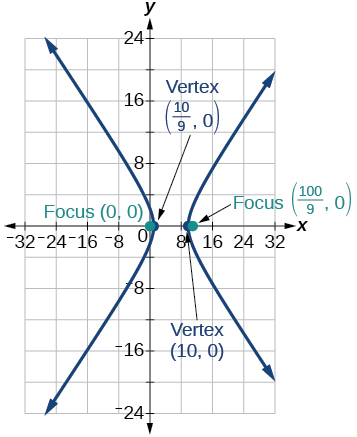

59. $r=\frac{9}{3-6\phantom{\rule{0.5em}{0ex}}\text{}\mathrm{cos}\phantom{\rule{0.4em}{0ex}}\text{}\theta}$

For the following exercises, given information about the graph of a conic with focus at the origin, find the equation in polar form.
60. Directrix is $x=3$ and eccentricity $e=1$

Solution

$r=\frac{3}{1+\mathrm{cos}\phantom{\rule{0.4em}{0ex}}\text{}\ \theta}$

61. Directrix is $y=\mathrm{-2}$ and eccentricity $e=4$

  
# Practice Test
For the following exercises, write the equation in standard form and state the center, vertices, and foci.
62. $\frac{{x}^{2}}{9}+\frac{{y}^{2}}{4}=1$

Solution

$\frac{{x}^{2}}{{3}^{2}}+\frac{{y}^{2}}{{2}^{2}}=1;$ center: $\left(0,0\right);$ vertices: $\left(3,0\right),\left(\mathrm{\u20133},0\right),\left(0,2\right),\left(0,\mathrm{-2}\right);$ foci: $\left(\sqrt{5},0\right),\left(-\sqrt{5},0\right)$

63. $9{y}^{2}+16{x}^{2}-36y+32x-92=0$

For the following exercises, sketch the graph, identifying the center, vertices, and foci.
64. $\frac{{\left(x-3\right)}^{2}}{64}+\frac{{\left(y-2\right)}^{2}}{36}=1$

Solution

center: $\left(3,2\right);$ vertices: $\left(11,2\right),\left(\mathrm{-5},2\right),\left(3,8\right),\left(3,\mathrm{-4}\right);$ foci: $\left(3+2\sqrt{7},2\right),\left(3-2\sqrt{7},2\right)$
            

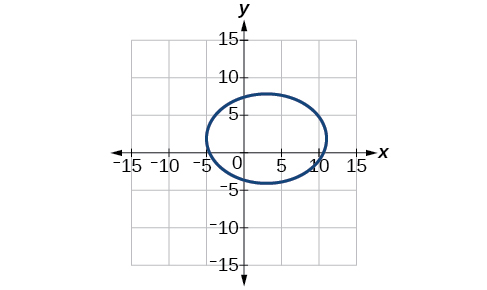

65. $2{x}^{2}+{y}^{2}+8x-6y-7=0$

66. Write the standard form equation of an ellipse with a center at $\left(1,2\right),$ vertex at $\left(7,2\right),$ and focus at $(4,2).$

Solution

$\frac{{\left(x-1\right)}^{2}}{36}+\frac{{\left(y-2\right)}^{2}}{27}=1$

67. A whispering gallery is to be constructed with a length of 150 feet. If the foci are to be located 20 feet away from the wall, how high should the ceiling be?

For the following exercises, write the equation of the hyperbola in standard form, and give the center, vertices, foci, and asymptotes.
68. $\frac{{x}^{2}}{49}-\frac{{y}^{2}}{81}=1$

Solution

$\frac{{x}^{2}}{{7}^{2}}-\frac{{y}^{2}}{{9}^{2}}=1;$ center: $\left(0,0\right);$ vertices $\left(7,0\right),\left(\mathrm{-7},0\right);$ foci: $\left(\sqrt{130},0\right),\left(-\sqrt{130},0\right);$ asymptotes: $y=\pm \frac{9}{7}x$

69. $16{y}^{2}-9{x}^{2}+128y+112=0$

For the following exercises, graph the hyperbola, noting its center, vertices, and foci. State the equations of the asymptotes.
70. $\frac{{\left(x-3\right)}^{2}}{25}-\frac{{\left(y+3\right)}^{2}}{1}=1$

Solution

center: $\left(3,\mathrm{-3}\right);$ vertices: $\left(8,\mathrm{-3}\right),\left(\mathrm{-2},\mathrm{-3}\right);$ foci: $\left(3+\sqrt{26},\mathrm{-3}\right),\left(3-\sqrt{26},\mathrm{-3}\right);$ asymptotes: $y=\pm \frac{1}{5}(x-3)-3$
      

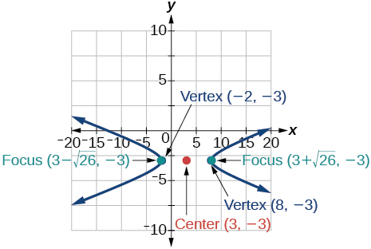

71. ${y}^{2}-{x}^{2}+4y-4x-18=0$

72. Write the standard form equation of a hyperbola with foci at $\left(1,0\right)$ and $\left(1,6\right),$ and a vertex at $\left(1,2\right).$

Solution

$\frac{{\left(y-3\right)}^{2}}{1}-\frac{{\left(x-1\right)}^{2}}{8}=1$

For the following exercises, write the equation of the parabola in standard form, and give the vertex, focus, and equation of the directrix.
73. ${y}^{2}+10x=0$

74. $3{x}^{2}-12x-y+11=0$

Solution

${\left(x-2\right)}^{2}=\frac{1}{3}\left(y+1\right);$ vertex: $\left(2,\mathrm{-1}\right);$ focus: $\left(2,-\frac{11}{12}\right);$ directrix: $y=-\frac{13}{12}$

For the following exercises, graph the parabola, labeling the vertex, focus, and directrix.
75. ${\left(x-1\right)}^{2}=\mathrm{-4}\left(y+3\right)$

76. ${y}^{2}+8x-8y+40=0$

Solution

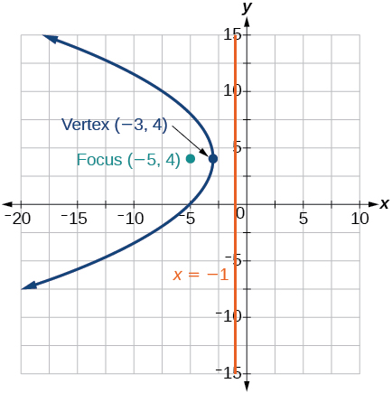

77. Write the equation of a parabola with a focus at $\left(2,3\right)$ and directrix $y=\mathrm{-1.}$

78. A searchlight is shaped like a paraboloid of revolution. If the light source is located 1.5 feet from the base along the axis of symmetry, and the depth of the searchlight is 3 feet, what should the width of the opening be?

Solution

Approximately $8.49$ feet

For the following exercises, determine which conic section is represented by the given equation, and then determine the angle $\theta$ that will eliminate the $xy$ term.
79. $3{x}^{2}-2xy+3{y}^{2}=4$

80. ${x}^{2}+4xy+4{y}^{2}+6x-8y=0$

Solution

parabola; $\theta \approx {63.4}^{\circ}$

For the following exercises, rewrite in the ${x}^{\prime}{y}^{\prime}$ system without the ${x}^{\prime}{y}^{\prime}$ term, and graph the rotated graph.
81. $11{x}^{2}+10\sqrt{3}xy+{y}^{2}=4$

82. $16{x}^{2}+24xy+9{y}^{2}-125x=0$

Solution

${{x}^{\prime}}^{2}-4{x}^{\prime}+3{y}^{\prime}=0$
      

      

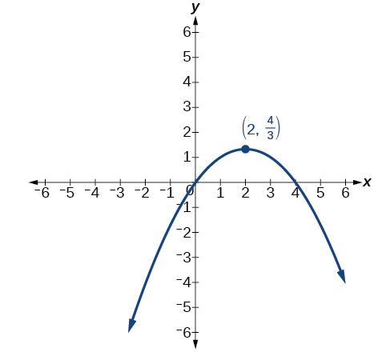

For the following exercises, identify the conic with focus at the origin, and then give the directrix and eccentricity.
83. $r=\frac{3}{2-\mathrm{sin}\phantom{\rule{0.4em}{0ex}}\text{}\theta}$

84. $r=\frac{5}{4+6\phantom{\rule{0.5em}{0ex}}\text{}\mathrm{cos}\phantom{\rule{0.4em}{0ex}}\text{}\theta}$

Solution

Hyperbola with $e=\frac{3}{2},$ and directrix $\frac{5}{6}$ units to the right of the pole.

For the following exercises, graph the given conic section. If it is a parabola, label vertex, focus, and directrix. If it is an ellipse or a hyperbola, label vertices and foci.
85. $r=\frac{12}{4-8\phantom{\rule{0.5em}{0ex}}\text{}\mathrm{sin}\phantom{\rule{0.4em}{0ex}}\text{}\theta}$

86. $r=\frac{2}{4+4\phantom{\rule{0.5em}{0ex}}\text{}\mathrm{sin}\phantom{\rule{0.4em}{0ex}}\text{}\theta}$

Solution

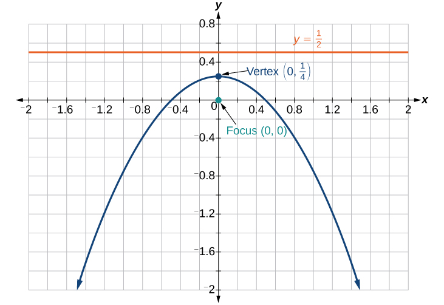

87. Find a polar equation of the conic with focus at the origin, eccentricity of $e=2,$ and directrix: $x=3.$

  
    **eccentricity**
    the ratio of the distances from a point $P$ on the graph to the focus $F$ and to the directrix $D$ represented by $e=\frac{PF}{PD},$ where $e$ is a positive real number
  **polar equation**  an equation of a curve in polar coordinates $r\phantom{\rule{0.5em}{0ex}}$ and $\theta$
