Sequences and Their Notations
=============================

  m49444
  
Sequences and Their Notations
=============================

  In this section, you will:

Write the terms of a sequence defined by an explicit formula.
Write the terms of a sequence defined by a recursive formula.
Use factorial notation.

  f51b97a1-9732-412b-a1bf-237bacd33938

Learning Objectives
===================

Write the first few terms of a sequence (IA 12.1.1)
Find a formula for the general term (nth term) of a sequence (IA 12.1.2)

Objective 1: Write the first few terms of a sequence (IA 12.1.1).
=================================================================
A patient takes a 30 mg antibiotic capsule. At the end of that hour, the amount of antibiotic remaining in her body is only 90% of the amount in the beginning of that hour. The 30mg dose is taken at time t = 1 hour. How much of this dose remains at the end of 1 hour? 2hours? 3 hours? 4 hours?

 
    Time t
    Dose remaining after time t
  

  
    1
    0.90(30)=27mg
  
  
    2
    0.90(27)=24.3mg
  
  
    3
    0.90(24.3)=21.87mg
  
  
    4
    0.90(21.87)=19.68mg
  

This ordered list of numbers 27, 24.3, 21.87, 19.68, … is a **sequence**. Each number in the list is a **term**.
A sequence is a **function** whose domain is the counting numbers. A sequence may have an infinite number of terms or a finite number of terms. Our sequence has three dots (ellipsis) at the end which indicates the list never ends. If the domain is the set of all counting numbers, then the sequence is an **infinite sequence**.
Often when working with sequences we do not want to write out all the terms. We want a more compact way to show how each term is defined. When we worked with functions, we wrote $f\left(x\right)=2x$ and we said the expression 2x was the rule that defined values in the range.
While a sequence is a function, we do not use the usual function notation. Instead of writing the function as $f\left(x\right)=2x$ , we would write it as ${a}_{n}=2n$ . The ${a}_{n}$ is the ***n*th term of the sequence**, the term in the *n*th position where *n* is a value in the domain. The formula for writing the nth term of the sequence is called the **general term** or formula of the sequence.
General sequence terms are denoted as follows: $\begin{array}{cc}{a}_{1}-\mathrm{first}\ \mathrm{term}& \\ {a}_{2}-\mathrm{second}\ \mathrm{term}& \\ {a}_{3}-\mathrm{third}\ \mathrm{term}& \\ .& \\ .& \\ .& \\ {a}_{n}-{n}^{th}\ \mathrm{term}& \\ {a}_{n+1}-(n+1)\ \mathrm{term}& \\ .& \\ .& \\ .& \end{array}$

  Write the first five terms of the sequence whose general term is ${a}_{n}=2n-7$ .

  $\begin{array}{cccccc}n& 1& 2& 3& 4& 5\\ {a}_{n}& {a}_{1}& {a}_{2}& {a}_{3}& {a}_{4}& {a}_{5}\\ 2n-7& 2\left(1\right)-7& 2\left(2\right)-7& 2\left(3\right)-7& 2\left(4\right)-7& 2\left(5\right)-7\\ & -5& -3& -1& 1& 3\end{array}$

Practice Makes Perfect
======================
Write the first few terms of a sequence.
Write the first five terms of the sequence whose general term is
${a}_{n}=4n+2$.

  
    
      $n$
      $1$
      $2$
      $3$
      $4$
      $5$
    
    
      ${a}_{n}$
      ${a}_{1}$
      ${a}_{2}$
      ${a}_{3}$
      ${a}_{4}$
      ${a}_{5}$
    
    
      $4n+2$
      
      
      
      
      
    
    
      
      
      
      
      
      
    
  

  

Write the first five terms of the sequence whose general term is ${a}_{n}={3}^{n}\u20131$.

  
    
      $n$
      $1$
      $2$
      $3$
      $4$
      $5$
    
    
      ${a}_{n}$
      ${a}_{1}$
      ${a}_{2}$
      ${a}_{3}$
      ${a}_{4}$
      ${a}_{5}$
    
    
      ${3}^{n}\u20131$
      
      
      
      
      
    
    
      
      
      
      
      
      
    
  

Objective 2: Find a formula for the general term (nth term) of a sequence (IA 12.1.2)
=====================================================================================
Sometimes we have a few terms of a sequence and it would be helpful to know the *general term or *n*th term*. To find the general term, we *look for patterns in the terms*. Often the patterns involve multiples or powers. We also look for a pattern in the signs of the terms.

Find a formula for the general term (nth term) of a sequence.
=============================================================

  ⓐ Find a general term for the sequence whose first five terms are shown below:4, 8, 12, 16, 20...
ⓑ
Find a general term for the sequence whose first five terms are shown below: $\frac{1}{3},\ \frac{1}{9},\ \frac{1}{27},\ \frac{1}{81},\ \frac{1}{243},\ ...$ 

ⓐ

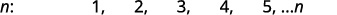

Look for a pattern in the terms

The numbers are all multiples of 4

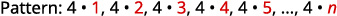

The general term of the sequence:
 ${a}_{n}=4n.$ 

ⓑ

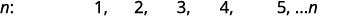

Look for a pattern in the terms.

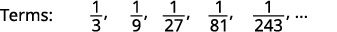

The numerators are all 1 and the denominators are powers of 3

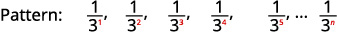

The general term of the sequence:
 ${a}_{n}=\frac{1}{{3}^{n}}$

Practice Makes Perfect
======================
Find a general term for the sequence whose first five terms are shown:8, 16, 24, 32, 40, ...

  
    
    

  
  
    Look for a pattern in the terms
    Terms: ________________
  
  
    The general term of the sequence: ________________

Find a general term for the sequence whose first five terms are shown: $\frac{1}{4},\frac{1}{16},\ \frac{1}{64},\ \frac{1}{256},\ \frac{1}{1024},\ ...$ 

  
    
    

  
  
    Look for a pattern in the terms
    Terms: ________________
  
  
    The general term of the sequence: ________________

A video game company launches an exciting new advertising campaign. They predict the number of online visits to their website, or hits, will double each day. The model they are using shows 2 hits the first day, 4 hits the second day, 8 hits the third day, and so on. See .

 *Day*
1
2
3
4
5
…

 *Hits*
2
4
8
16
32
…

If their model continues, how many hits will there be at the end of the month? To answer this question, we’ll first need to know how to determine a list of numbers written in a specific order. In this section, we will explore these kinds of ordered lists.

Writing the Terms of a Sequence Defined by an Explicit Formula
==============================================================
One way to describe an ordered list of numbers is as a **sequence**. A sequence is a function whose domain is a subset of the counting numbers. The sequence established by the number of hits on the website is

 $$
\{2,4,8,16,32,\dots \}.
$$ The **ellipsis** (…) indicates that the sequence continues indefinitely. Each number in the sequence is called a **term**. The first five terms of this sequence are 2, 4, 8, 16, and 32.

Listing all of the terms for a sequence can be cumbersome. For example, finding the number of hits on the website at the end of the month would require listing out as many as 31 terms. A more efficient way to determine a specific term is by writing a formula to define the sequence.

One type of formula is an **explicit formula**, which defines the terms of a sequence using their position in the sequence. Explicit formulas are helpful if we want to find a specific term of a sequence without finding all of the previous terms. We can use the formula to find the **nth term of the sequence**, where $n$ is any positive number. In our example, each number in the sequence is double the previous number, so we can use powers of 2 to write a formula for the $n\text{th}$ term.

The first term of the sequence is ${2}^{1}=2,$ the second term is ${2}^{2}=4,$ the third term is ${2}^{3}=8,$ and so on. The $n\text{th}$ term of the sequence can be found by raising 2 to the $n\text{th}$ power. An explicit formula for a sequence is named by a lower case letter $a,b,c\mathrm{...}$ with the subscript $n.$ The explicit formula for this sequence is
  $$
{a}_{n}={2}^{n}.
$$ Now that we have a formula for the $n\text{th}$ term of the sequence, we can answer the question posed at the beginning of this section. We were asked to find the number of hits at the end of the month, which we will take to be 31 days. To find the number of hits on the last day of the month, we need to find the 31st term of the sequence. We will substitute 31 for $n$ in the formula.
  $$
\begin{array}{l}{a}_{31}={2}^{31}\hfill \\ \phantom{\rule{0.5em}{0ex}}\text{\ \ \ \ \}=\text{2,147,483,648}\hfill \end{array}
$$ 
If the doubling trend continues, the company will get $\text{2,147,483,648}$ hits on the last day of the month. That is over 2.1 billion hits! The huge number is probably a little unrealistic because it does not take consumer interest and competition into account. It does, however, give the company a starting point from which to consider business decisions.
Another way to represent the sequence is by using a table. The first five terms of the sequence and the $n\text{th}$ term of the sequence are shown in .

*$n$*
1
2
3
4
5
 $n$ 

*$n\text{th}$ term of the sequence, ${a}_{n}$*
2
4
8
16
32
 ${2}^{n}$ 

Graphing provides a visual representation of the sequence as a set of distinct points. We can see from the graph in  that the number of hits is rising at an exponential rate. This particular sequence forms an exponential function.

\n\n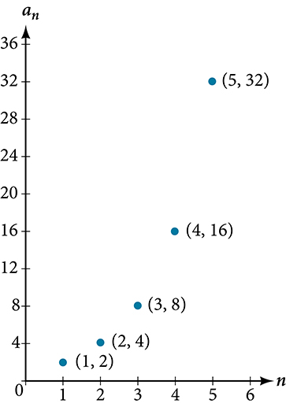\n\n
Lastly, we can write this particular sequence as
 $$
\{2,4,8,16,32,\dots ,{2}^{n},\dots \}.
$$ A sequence that continues indefinitely is called an *infinite sequence*. The domain of an infinite sequence is the set of counting numbers. If we consider only the first 10 terms of the sequence, we could write

     $$
\{2,4,8,16,32,\dots ,{2}^{n},\dots ,1024\}.
$$
This sequence is called a *finite sequence* because it does not continue indefinitely.

Sequence
========

A **sequence** is a function whose domain is the set of positive integers. A **finite sequence** is a sequence whose domain consists of only the first $n$ positive integers. The numbers in a sequence are called *terms*. The variable $a$ with a number subscript is used to represent the terms in a sequence and to indicate the position of the term in the sequence.
 $$
{a}_{1},{a}_{2},{a}_{3},\dots ,{a}_{n},\dots
$$
We call ${a}_{1}$ the first term of the sequence, ${a}_{2}$ the second term of the sequence, ${a}_{3}$ the third term of the sequence, and so on. The term ${a}_{n}$ is called the **nth term of the sequence**, or the general term of the sequence. An **explicit formula** defines the $n\text{th}$ term of a sequence using the position of the term. A sequence that continues indefinitely is an **infinite sequence**.

Q&A
*Does a sequence always have to begin with* ${a}_{1}?$

*No. In certain problems, it may be useful to define the initial term as ${a}_{0}$ instead of ${a}_{1}.$ In these problems, the domain of the function includes 0.*

How To
*Given an explicit formula, write the first* $n$ *terms of a sequence.*

Substitute each value of $n$ into the formula. Begin with $n=1$ to find the first term, ${a}_{1}.$ 
To find the second term, ${a}_{2},$ use $n=2.$ 
Continue in the same manner until you have identified all $n$ terms.

Writing the Terms of a Sequence Defined by an Explicit Formula
==============================================================

Write the first five terms of the sequence defined by the explicit formula ${a}_{n}=-3n+8.$

Substitute $n=1$ into the formula. Repeat with values 2 through 5 for $n.$
  $$
\begin{array}{llllll}n=1\hfill & \hfill & \hfill & \hfill & \hfill & {a}_{1}=-3(1)+8=5\hfill \\ n=2\hfill & \hfill & \hfill & \hfill & \hfill & {a}_{2}=-3(2)+8=2\hfill \\ n=3\hfill & \hfill & \hfill & \hfill & \hfill & {a}_{3}=-3(3)+8=-1\hfill \\ n=4\hfill & \hfill & \hfill & \hfill & \hfill & {a}_{4}=-3(4)+8=-4\hfill \\ n=5\hfill & \hfill & \hfill & \hfill & \hfill & {a}_{5}=-3(5)+8=-7\hfill \end{array}
$$
The first five terms are $\{5,\phantom{\rule{0.5em}{0ex}}2,\phantom{\rule{0.5em}{0ex}}\mathrm{-1},\phantom{\rule{0.5em}{0ex}}\mathrm{-4},\phantom{\rule{0.5em}{0ex}}\mathrm{-7}\}.$

Analysis
========

The sequence values can be listed in a table. A table, such as , is a convenient way to input the function into a graphing utility.

*$n$*
1
2
3
4
5

*${a}_{n}$*
5
2
–1
–4
–7

A graph can be made from this table of values. From the graph in , we can see that this sequence represents a linear function, but notice the graph is not continuous because the domain is over the positive integers only.

\n\n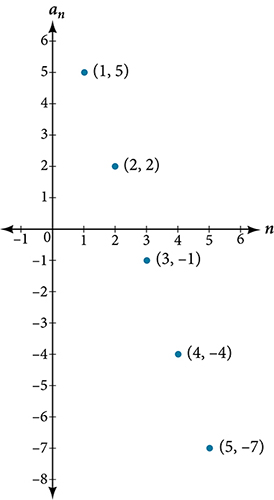\n\n

Try It

Write the first five terms of the sequence defined by the **explicit formula** ${t}_{n}=5n-4.$

The first five terms are $\left\{1,6,\ 11,\ 16,\ 21\right\}.$

Investigating Alternating Sequences
===================================
Sometimes sequences have terms that are alternate. In fact, the terms may actually alternate in sign. The steps to finding terms of the sequence are the same as if the signs did not alternate. However, the resulting terms will not show increase or decrease as $n$ increases. Let’s take a look at the following sequence.
 $$
\{2,\mathrm{-4},6,\mathrm{-8}\}
$$
Notice the first term is greater than the second term, the second term is less than the third term, and the third term is greater than the fourth term. This trend continues forever. Do not rearrange the terms in numerical order to interpret the sequence.

How To
*Given an explicit formula with alternating terms, write the first $n$ terms of a sequence.*

Substitute each value of $n$ into the formula. Begin with $n=1$ to find the first term, ${a}_{1}.$ The sign of the term is given by the ${\left(-1\right)}^{n}$ in the explicit formula.
To find the second term, ${a}_{2},$ use $n=2.$ 
Continue in the same manner until you have identified all $n$ terms.

Writing the Terms of an Alternating Sequence Defined by an Explicit Formula
===========================================================================

Write the first five terms of the sequence.

     $$
{a}_{n}=\frac{{(-1)}^{n}{n}^{2}}{n+1}
$$

Substitute $n=1,$ $n=2,$ and so on in the formula.

     $$
\begin{array}{lll}n=1\hfill & \begin{array}{cc}& \end{array}\hfill & {a}_{1}=\frac{{(-1)}^{1}{1}^{2}}{1+1}=-\frac{1}{2}\hfill \\ n=2\hfill & \begin{array}{cc}& \end{array}\hfill & {a}_{2}=\frac{{(-1)}^{2}{2}^{2}}{2+1}=\frac{4}{3}\hfill \\ n=3\hfill & \begin{array}{cc}& \end{array}\hfill & {a}_{3}=\frac{{(-1)}^{3}{3}^{2}}{3+1}=-\frac{9}{4}\hfill \\ n=4\hfill & \begin{array}{cc}& \end{array}\hfill & {a}_{4}=\frac{{(-1)}^{4}{4}^{2}}{4+1}=\frac{16}{5}\hfill \\ n=5\hfill & \hfill & {a}_{5}=\frac{{(-1)}^{5}{5}^{2}}{5+1}=-\frac{25}{6}\hfill \end{array}
$$
The first five terms are $\left\{-\frac{1}{2},\frac{4}{3},-\frac{9}{4},\frac{16}{5},-\frac{25}{6}\right\}.$

Analysis
========

The graph of this function, shown in , looks different from the ones we have seen previously in this section because the terms of the sequence alternate between positive and negative values.

\n\n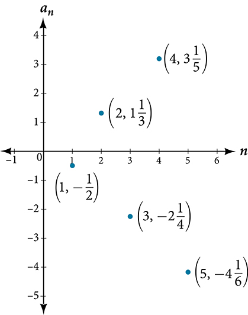\n\n

Q&A
*In , does the (–1) to the power of* $n$ *account for the oscillations of signs?*

*Yes, the power might be* $n,n+1,n-1,$ *and so on, but any odd powers will result in a negative term, and any even power will result in a positive term.*

Try It

    Write the first five terms of the sequence.
 $$
{a}_{n}=\frac{4n}{{(-2)}^{n}}
$$ 

The first five terms are $\left\{-2,\ 2,\ -\frac{3}{2},\ 1,\phantom{\rule{0.5em}{0ex}}\text{}-\frac{5}{8}\right\}.$

Investigating Piecewise Explicit Formulas
=========================================

We’ve learned that sequences are functions whose domain is over the positive integers. This is true for other types of functions, including some **piecewise functions**. Recall that a piecewise function is a function defined by multiple subsections. A different formula might represent each individual subsection.

How To
*Given an explicit formula for a piecewise function, write the first $n$ terms of a sequence*

Identify the formula to which $n=1$ applies. 
To find the first term, ${a}_{1},$ use $n=1$ in the appropriate formula.
Identify the formula to which $n=2$ applies.
To find the second term, ${a}_{2},$ use $n=2$ in the appropriate formula.
Continue in the same manner until you have identified all $n$ terms.

Writing the Terms of a Sequence Defined by a Piecewise Explicit Formula
=======================================================================

    Write the first six terms of the sequence.
 $$
{a}_{n}=\{\begin{array}{ll}{n}^{2}\hfill & \text{if\}n\phantom{\rule{0.5em}{0ex}}\text{is\ not\ divisible\ by\ 3}\hfill \\ \frac{n}{3}\hfill & \text{if\}n\phantom{\rule{0.5em}{0ex}}\text{is\ divisible\ by\ 3}\hfill \end{array}
$$ 

Substitute $n=1,n=2,$ and so on in the appropriate formula. Use ${n}^{2}$ when $n$ is not a multiple of 3. Use $\frac{n}{3}$ when $n$ is a multiple of 3.
 $$
\begin{array}{ll}{a}_{1}={1}^{2}=1\begin{array}{cccc}& & & \end{array}\hfill & \text{1\ is\ not\ a\ multiple\ of\ 3}\text{.\ \ Use\}{n}^{2}.\hfill \\ {a}_{2}={2}^{2}=4\hfill & \text{2\ is\ not\ a\ multiple\ of\ 3}\text{.\ \ Use\}{n}^{2}.\hfill \\ {a}_{3}=\frac{3}{3}=1\hfill & \text{3\ is\ a\ multiple\ of\ 3}\text{.\ \ Use\}\frac{n}{3}.\hfill \\ {a}_{4}={4}^{2}=16\hfill & \text{4\ is\ not\ a\ multiple\ of\ 3}\text{.\ \ Use\}{n}^{2}.\hfill \\ {a}_{5}={5}^{2}=25\hfill & \text{5\ is\ not\ a\ multiple\ of\ 3}\text{.\ \ Use\}{n}^{2}.\hfill \\ {a}_{6}=\frac{6}{3}=2\hfill & \text{6\ is\ a\ multiple\ of\ 3}\text{.\ \ Use\}\frac{n}{3}.\hfill \end{array}
$$
The first six terms are $\left\{1,\phantom{\rule{0.5em}{0ex}}\text{}4,\phantom{\rule{0.5em}{0ex}}\text{}1,\phantom{\rule{0.5em}{0ex}}\text{}16,\phantom{\rule{0.5em}{0ex}}\text{}25,\phantom{\rule{0.5em}{0ex}}\text{}2\right\}.$

Analysis
========

Every third point on the graph shown in  stands out from the two nearby points. This occurs because the sequence was defined by a piecewise function.

\n\n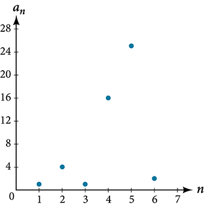\n\n

Try It

    Write the first six terms of the sequence.
 $$
{a}_{n}=\{\begin{array}{ll}2{n}^{3}\hfill & \text{if\}n\phantom{\rule{0.5em}{0ex}}\text{is\ odd}\hfill \\ \frac{5n}{2}\hfill & \text{if\}n\phantom{\rule{0.5em}{0ex}}\text{is\ even}\hfill \end{array}
$$ 

The first six terms are $\left\{2,\phantom{\rule{0.5em}{0ex}}\text{}5,\phantom{\rule{0.5em}{0ex}}\text{}54,\phantom{\rule{0.5em}{0ex}}\text{}10,\phantom{\rule{0.5em}{0ex}}\text{}250,\phantom{\rule{0.5em}{0ex}}\text{}15\right\}.$

Finding an Explicit Formula
===========================

Thus far, we have been given the explicit formula and asked to find a number of terms of the sequence. Sometimes, the explicit formula for the $n\text{th}$ term of a sequence is not given. Instead, we are given several terms from the sequence. When this happens, we can work in reverse to find an explicit formula from the first few terms of a sequence. The key to finding an explicit formula is to look for a pattern in the terms. Keep in mind that the pattern may involve alternating terms, formulas for numerators, formulas for denominators, exponents, or bases.

How To
*Given the first few terms of a sequence, find an explicit formula for the sequence.*

Look for a pattern among the terms.
If the terms are fractions, look for a separate pattern among the numerators and denominators.
Look for a pattern among the signs of the terms.
Write a formula for ${a}_{n}$ in terms of $n.$ Test your formula for $n=1,\phantom{\rule{0.5em}{0ex}}\text{}n=2,$
and
 $n=3.$ 

Writing an Explicit Formula for the *n*th Term of a Sequence
============================================================

Write an explicit formula for the $n\text{th}$ term of each sequence.

ⓐ $\left\{-\frac{2}{11},\frac{3}{13},-\frac{4}{15},\frac{5}{17},-\frac{6}{19},\dots \right\}$ 
ⓑ $\{-\frac{2}{25}\text{,}-\frac{2}{125}\text{,}-\frac{2}{625}\text{,}-\frac{2}{3\text{,}125}\text{,}-\frac{2}{15\text{,}625}\text{,}\dots \}$ 
ⓒ
 $\{{e}^{4}\text{,}{e}^{5}\text{,}{e}^{6}\text{,}{e}^{7}\text{,}{e}^{8}\text{,}\dots \}$

Look for the pattern in each sequence.

ⓐThe terms alternate between positive and negative. We can use ${(-1)}^{n}$ to make the terms alternate. The numerator can be represented by $n+1.$ The denominator can be represented by $2n+9.$
${a}_{n}=\frac{{(-1)}^{n}(n+1)}{2n+9}$

ⓑThe terms are all negative.

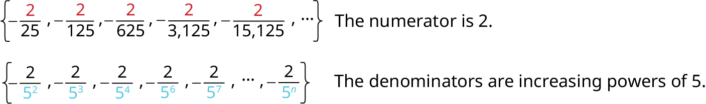

So we know that the fraction is negative, the numerator is 2, and the denominator can be represented by ${5}^{n+1}.$
  $$
{a}_{n}=-\frac{2}{{5}^{n+1}}
$$ 
ⓒThe terms are powers of $e.$ For $n=1,$ the first term is ${e}^{4}$ so the exponent must be $n+3.$

     $$
{a}_{n}={e}^{n+3}
$$ 

Try It

Write an explicit formula for the $n\text{th}$ term of the sequence.
 $$
\text{{9,}\phantom{\rule{0.5em}{0ex}}-\text{81,}\phantom{\rule{0.5em}{0ex}}\text{729,}\phantom{\rule{0.5em}{0ex}}-\text{6,561,}\phantom{\rule{0.5em}{0ex}}\text{59,049,}\phantom{\rule{0.5em}{0ex}}\text{\u2026}}
$$

${a}_{n}={(-1)}^{n+1}{9}^{n}$

Try It

Write an explicit formula for the $n\text{th}$ term of the sequence.
 $$
\left\{-\frac{3}{4},-\frac{9}{8},-\frac{27}{12},-\frac{81}{16},-\frac{243}{20},\mathrm{...}\right\}
$$

${a}_{n}=-\frac{{3}^{n}}{4n}$

Try It

Write an explicit formula for the $n\text{th}$ term of the sequence.
 $$
\left\{\frac{1}{{e}^{2}},\ \frac{1}{e},\ 1,\ e,\ {e}^{2},\mathrm{...}\right\}
$$ 

${a}_{n}={e}^{n-3}$

Writing the Terms of a Sequence Defined by a Recursive Formula
==============================================================

Sequences occur naturally in the growth patterns of nautilus shells, pinecones, tree branches, and many other natural structures. We may see the sequence in the leaf or branch arrangement, the number of petals of a flower, or the pattern of the chambers in a nautilus shell. Their growth follows the Fibonacci sequence, a famous sequence in which each term can be found by adding the preceding two terms. The numbers in the sequence are 1, 1, 2, 3, 5, 8, 13, 21, 34,…. Other examples from the natural world that exhibit the Fibonacci sequence are the Calla Lily, which has just one petal, the Black-Eyed Susan with 13 petals, and different varieties of daisies that may have 21 or 34 petals.

Each term of the Fibonacci sequence depends on the terms that come before it. The Fibonacci sequence cannot easily be written using an explicit formula. Instead, we describe the sequence using a *recursive formula*, a formula that defines the terms of a sequence using previous terms.

A recursive formula always has two parts: the value of an initial term (or terms), and an equation defining ${a}_{n}$ in terms of preceding terms. For example, suppose we know the following:
 $$
\begin{array}{l}{a}_{1}=3\hfill \\ {a}_{n}=2{a}_{n-1}-1\ \text{for}\ n\ge 2\hfill \end{array}
$$
We can find the subsequent terms of the sequence using the first term.
 $$
\begin{array}{l}{a}_{1}=3\\ {a}_{2}=2{a}_{1}-1=2(3)-1=5\\ {a}_{3}=2{a}_{2}-1=2(5)-1=9\\ {a}_{4}=2{a}_{3}-1=2(9)-1=17\end{array}
$$ 
So the first four terms of the sequence are $\left\{3,\phantom{\rule{0.5em}{0ex}}\text{}5,\phantom{\rule{0.5em}{0ex}}\text{}9,\phantom{\rule{0.5em}{0ex}}\text{}17\right\}$ .

    The recursive formula for the Fibonacci sequence states the first two terms and defines each successive term as the sum of the preceding two terms.
 $$
\begin{array}{l}{a}_{1}=1\hfill \\ {a}_{2}=1\hfill \\ {a}_{n}={a}_{n-1}+{a}_{n-2}\ \text{for}\ \ n\ge 3\hfill \end{array}
$$
To find the tenth term of the sequence, for example, we would need to add the eighth and ninth terms. We were told previously that the eighth and ninth terms are 21 and 34, so
 $$
{a}_{10}={a}_{9}+{a}_{8}=34+21=55
$$ 

Recursive Formula
=================

A **recursive formula** is a formula that defines each term of a sequence using preceding term(s). Recursive formulas must always state the initial term, or terms, of the sequence.

Q&A
*Must the first two terms always be given in a recursive formula?*

*No. The Fibonacci sequence defines each term using the two preceding terms, but many recursive formulas define each term using only one preceding term. These sequences need only the first term to be defined.*

How To
*Given a recursive formula with only the first term provided, write the first $n$ terms of a sequence.*

Identify the initial term, ${a}_{1},$ which is given as part of the formula. This is the first term.
To find the second term, ${a}_{2},$ substitute the initial term into the formula for ${a}_{n-1}.$ Solve.
To find the third term, ${a}_{3},$ substitute the second term into the formula. Solve.
Repeat until you have solved for the $n\text{th}$ term.

Writing the Terms of a Sequence Defined by a Recursive Formula
==============================================================

    Write the first five terms of the sequence defined by the recursive formula.
 $$
\begin{array}{l}\begin{array}{l}\\ {a}_{1}=9\end{array}\hfill \\ {a}_{n}=3{a}_{n-1}-20\text{,\ for\}n\ge 2\hfill \end{array}
$$

The first term is given in the formula. For each subsequent term, we replace ${a}_{n-1}$ with the value of the preceding term.
 $$
\begin{array}{ll}n=1\begin{array}{lllll}\hfill & \hfill & \hfill & \hfill & \hfill \end{array}\hfill & {a}_{1}=9\hfill \\ n=2\hfill & {a}_{2}=3{a}_{1}-20=3(9)-20=27-20=7\hfill \\ n=3\hfill & {a}_{3}=3{a}_{2}-20=3(7)-20=21-20=1\hfill \\ n=4\hfill & {a}_{4}=3{a}_{3}-20=3(1)-20=3-20=-17\hfill \\ n=5\hfill & {a}_{5}=3{a}_{4}-20=3(-17)-20=-51-20=-71\hfill \end{array}
$$
The first five terms are $\left\{9,\phantom{\rule{0.5em}{0ex}}\text{}7,\phantom{\rule{0.5em}{0ex}}\text{}1,\phantom{\rule{0.5em}{0ex}}\text{}\u201317,\phantom{\rule{0.5em}{0ex}}\text{}\u201371\right\}.$ See .
\n\n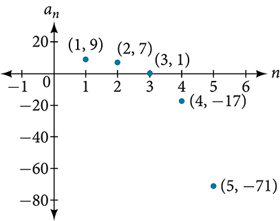\n\n

Try It

Write the first five terms of the sequence defined by the recursive formula.
 $$
\begin{array}{l}{a}_{1}=2\\ {a}_{n}=2{a}_{n-1}+1\text{,\ for\}n\ge 2\end{array}
$$ 

$\left\{2,\ 5,\ 11,\ 23,\ 47\right\}$

How To
*Given a recursive formula with two initial terms, write the first $n$ terms of a sequence.*

Identify the initial term, ${a}_{1},$ which is given as part of the formula.
Identify the second term, ${a}_{2},$ which is given as part of the formula.
To find the third term, substitute the initial term and the second term into the formula. Evaluate.
Repeat until you have evaluated the $n\text{th}$ term.

Writing the Terms of a Sequence Defined by a Recursive Formula
==============================================================

    Write the first six terms of the sequence defined by the recursive formula.
 $$
\begin{array}{l}{a}_{1}=1\\ {a}_{2}=2\\ {a}_{n}=3{a}_{n-1}+4{a}_{n-2}\text{,\ for\}n\ge 3\end{array}
$$ 

The first two terms are given. For each subsequent term, we replace ${a}_{n-1}$ and ${a}_{n-2}$ with the values of the two preceding terms.
 $$
\begin{array}{lllllll}n=3\hfill & \hfill & \hfill & \hfill & \hfill & \hfill & {a}_{3}=3{a}_{2}+4{a}_{1}=3(2)+4(1)=10\hfill \\ n=4\hfill & \hfill & \hfill & \hfill & \hfill & \hfill & {a}_{4}=3{a}_{3}+4{a}_{2}=3(10)+4(2)=38\hfill \\ n=5\hfill & \hfill & \hfill & \hfill & \hfill & \hfill & {a}_{5}=3{a}_{4}+4{a}_{3}=3(38)+4(10)=154\hfill \\ n=6\hfill & \hfill & \hfill & \hfill & \hfill & \hfill & {a}_{6}=3{a}_{5}+4{a}_{4}=3(154)+4(38)=614\hfill \end{array}
$$
The first six terms are $\text{{1,2,10,38,154,614}}\text{.}$ See .
\n\n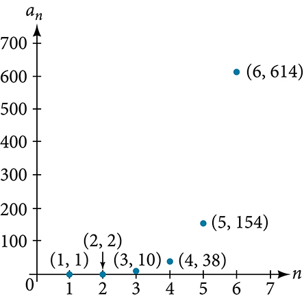\n\n

Try It

Write the first 8 terms of the sequence defined by the recursive formula.
 $$
\begin{array}{l}\begin{array}{l}\\ {a}_{1}=0\end{array}\hfill \\ {a}_{2}=1\hfill \\ {a}_{3}=1\hfill \\ {a}_{n}=\frac{{a}_{n-1}}{{a}_{n-2}}+{a}_{n-3}\text{,\ for\}n\ge 4\hfill \end{array}
$$

$\left\{0,\ 1,\ 1,\ 1,\ 2,\ 3,\ \frac{5}{2},\phantom{\rule{0.5em}{0ex}}\text{}\frac{17}{6}\right\}.$

Using Factorial Notation
========================
The formulas for some sequences include products of consecutive positive integers. *$n$ factorial*, written as $n!,$ is the product of the positive integers from 1 to $n.$ For example,
 $$
\begin{array}{l}4!=4\cdot 3\cdot 2\cdot 1=24\hfill \\ 5!=5\cdot 4\cdot 3\cdot 2\cdot 1=120\hfill \end{array}
$$

An example of formula containing a **factorial** is ${a}_{n}=(n+1)!.$ The sixth term of the sequence can be found by substituting 6 for $n.$
 $$
{a}_{6}=(6+1)!=7!=7\xb76\xb75\xb74\xb73\xb72\xb71=5040
$$ 
The factorial of any whole number $n$ is $n(n-1)!$ We can therefore also think of $5!$ as $5\cdot 4!\text{.}$

n Factorial
===========

***n* factorial** is a mathematical operation that can be defined using a recursive formula. The factorial of $n,$ denoted $n!,$ is defined for a positive integer $n$ as:
 $$
\begin{array}{l}0!=1\\ 1!=1\\ n!=n\left(n-1\right)\left(n-2\right)\cdots \left(2\right)\left(1\right)\text{,\ for\}n\ge 2\end{array}
$$ 
The special case $0!$ is defined as $0!=1.$

Q&A
*Can factorials always be found using a calculator?*

*No. Factorials get large very quickly—faster than even exponential functions! When the output gets too large for the calculator, it will not be able to calculate the factorial.*

Writing the Terms of a Sequence Using Factorials
================================================

Write the first five terms of the sequence defined by the explicit formula ${a}_{n}=\frac{5n}{(n+2)!}.$

Substitute $n=1,n=2,$ and so on in the formula.
 $$
\begin{array}{lllll}n=1\hfill & \hfill & \hfill & \hfill & {a}_{1}=\frac{5(1)}{(1+2)!}=\frac{5}{3!}=\frac{5}{3\xb72\xb71}=\frac{5}{6}\hfill \\ n=2\hfill & \hfill & \hfill & \hfill & {a}_{2}=\frac{5(2)}{(2+2)!}=\frac{10}{4!}=\frac{10}{4\xb73\xb72\xb71}=\frac{5}{12}\hfill \\ n=3\hfill & \hfill & \hfill & \hfill & {a}_{3}=\frac{5(3)}{(3+2)!}=\frac{15}{5!}=\frac{15}{5\xb74\xb73\xb72\xb71}=\frac{1}{8}\hfill \\ n=4\hfill & \hfill & \hfill & \hfill & {a}_{4}=\frac{5(4)}{(4+2)!}=\frac{20}{6!}=\frac{20}{6\xb75\xb74\xb73\xb72\xb71}=\frac{1}{36}\hfill \\ n=5\hfill & \hfill & \hfill & \hfill & {a}_{5}=\frac{5(5)}{(5+2)!}=\frac{25}{7!}=\frac{25}{7\xb76\xb75\xb74\xb73\xb72\xb71}=\frac{5}{1\text{,}008}\hfill \end{array}
$$
The first five terms are $\{\frac{5}{6},\frac{5}{12},\frac{1}{8},\frac{1}{36},\frac{5}{\mathrm{1,008}}\}.$

Analysis
========

shows the graph of the sequence. Notice that, since factorials grow very quickly, the presence of the factorial term in the denominator results in the denominator becoming much larger than the numerator as $n$ increases. This means the quotient gets smaller and, as the plot of the terms shows, the terms are decreasing and nearing zero.
\n\n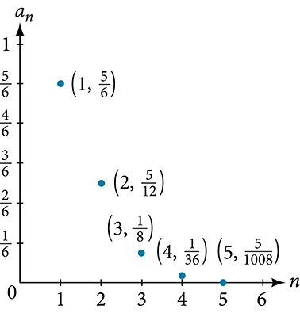\n\n

Try It

Write the first five terms of the sequence defined by the explicit formula ${a}_{n}=\frac{(n+1)!}{2n}.$

The first five terms are $\left\{1,\ \frac{3}{2},\ 4,\phantom{\rule{0.5em}{0ex}}\text{}15,\phantom{\rule{0.5em}{0ex}}\text{}72\right\}.$

Media
Access this online resource for additional instruction and practice with sequences.

Finding Terms in a Sequence

Key Equations
=============

Formula for a factorial
 $\begin{array}{l}0!=1\\ 1!=1\\ n!=n\left(n-1\right)\left(n-2\right)\cdots \left(2\right)\left(1\right)\text{,\ for\}n\ge 2\end{array}$

Key Concepts
============

A sequence is a list of numbers, called terms, written in a specific order.
Explicit formulas define each term of a sequence using the position of the term. See , , and .
An explicit formula for the $n\text{th}$ term of a sequence can be written by analyzing the pattern of several terms. See .
Recursive formulas define each term of a sequence using previous terms.
Recursive formulas must state the initial term, or terms, of a sequence.
A set of terms can be written by using a recursive formula. See  and .
A factorial is a mathematical operation that can be defined recursively.
The factorial of $n$ is the product of all integers from 1 to $n$ See .

Section Exercises
=================

Verbal
======

Discuss the meaning of a sequence. If a finite sequence is defined by a formula, what is its domain? What about an infinite sequence?

A sequence is an ordered list of numbers that can be either finite or infinite in number. When a finite sequence is defined by a formula, its domain is a subset of the non-negative integers. When an infinite sequence is defined by a formula, its domain is all positive or all non-negative integers.

Describe three ways that a sequence can be defined.

Is the ordered set of even numbers an infinite sequence? What about the ordered set of odd numbers? Explain why or why not.

Yes, both sets go on indefinitely, so they are both infinite sequences.

What happens to the terms ${a}_{n}$ of a sequence when there is a negative factor in the formula that is raised to a power that includes $n?$ What is the term used to describe this phenomenon?

What is a factorial, and how is it denoted? Use an example to illustrate how factorial notation can be beneficial.

A factorial is the product of a positive integer and all the positive integers below it. An exclamation point is used to indicate the operation. Answers may vary. An example of the benefit of using factorial notation is when indicating the product  It is much easier to write   than it is to write out $\text{13}\cdot \text{12}\cdot \text{11}\cdot \text{10}\cdot \text{9}\cdot \text{8}\cdot \text{7}\cdot \text{6}\cdot \text{5}\cdot \text{4}\cdot \text{3}\cdot \text{2}\cdot \text{1}\text{.}$

Algebraic
=========
For the following exercises, write the first four terms of the sequence.

${a}_{n}={2}^{n}-2$

${a}_{n}=-\frac{16}{n+1}$

First four terms: $-8,\phantom{\rule{0.5em}{0ex}}\text{}-\frac{16}{3},\phantom{\rule{0.5em}{0ex}}\text{}-4,\phantom{\rule{0.5em}{0ex}}\text{}-\frac{16}{5}$

${a}_{n}=-{\left(-5\right)}^{n-1}$

${a}_{n}=\frac{{2}^{n}}{{n}^{3}}$

First four terms: $2,\phantom{\rule{0.5em}{0ex}}\text{}\frac{1}{2},\phantom{\rule{0.5em}{0ex}}\text{}\frac{8}{27},\phantom{\rule{0.5em}{0ex}}\text{}\frac{1}{4}$ .

${a}_{n}=\frac{2n+1}{{n}^{3}}$

${a}_{n}=1.25\cdot {\left(-4\right)}^{n-1}$

First four terms: $1.25,\phantom{\rule{0.5em}{0ex}}\text{}-5,\phantom{\rule{0.5em}{0ex}}\text{}20,\phantom{\rule{0.5em}{0ex}}\text{}-80$ .

${a}_{n}=-4\cdot {\left(-6\right)}^{n-1}$

${a}_{n}=\frac{{n}^{2}}{2n+1}$

First four terms: $\frac{1}{3},\phantom{\rule{0.5em}{0ex}}\text{}\frac{4}{5},\phantom{\rule{0.5em}{0ex}}\text{}\frac{9}{7},\phantom{\rule{0.5em}{0ex}}\text{}\frac{16}{9}$ .

${a}_{n}={\left(-10\right)}^{n}+1$

${a}_{n}=-\left(\frac{4\cdot {(-5)}^{n-1}}{5}\right)$

First four terms: $-\frac{4}{5},\phantom{\rule{0.5em}{0ex}}\text{}4,\phantom{\rule{0.5em}{0ex}}\text{}-20,\phantom{\rule{0.5em}{0ex}}\text{}100$

For the following exercises, write the first eight terms of the piecewise sequence.

${a}_{n}=\{\begin{array}{ll}{(-2)}^{n}-2\hfill & \text{if\}n\phantom{\rule{0.5em}{0ex}}\text{is\ even}\hfill \\ {(3)}^{n-1}\hfill & \text{if\}n\phantom{\rule{0.5em}{0ex}}\text{is\ odd}\hfill \end{array}$

${a}_{n}=\{\begin{array}{ll}\frac{{n}^{2}}{2n+1}\hfill & \text{if\}n\phantom{\rule{0.5em}{0ex}}\text{}\le \text{5}\hfill \\ {n}^{2}-5\hfill & \text{if\}n\phantom{\rule{0.5em}{0ex}}\text{>5}\hfill \end{array}$

$\frac{1}{3},\phantom{\rule{0.5em}{0ex}}\text{}\frac{4}{5},\phantom{\rule{0.5em}{0ex}}\text{}\frac{9}{7},\phantom{\rule{0.5em}{0ex}}\text{}\frac{16}{9},\phantom{\rule{0.5em}{0ex}}\text{}\frac{25}{11},\phantom{\rule{0.5em}{0ex}}\text{}31,\phantom{\rule{0.5em}{0ex}}\text{}44,\phantom{\rule{0.5em}{0ex}}\text{}59$

${a}_{n}=\{\begin{array}{ll}{(2n+1)}^{2}\hfill & \text{if\}n\phantom{\rule{0.5em}{0ex}}\text{is\ divisible\ by\ 4}\hfill \\ \frac{2}{n}\hfill & \text{if\}n\phantom{\rule{0.5em}{0ex}}\text{is\ not\ divisible\ by\ 4}\hfill \end{array}$

${a}_{n}=\{\begin{array}{ll}-0.6\cdot {5}^{n-1}\hfill & \text{if\}n\phantom{\rule{0.5em}{0ex}}\text{is\ prime\ or\ 1}\hfill \\ 2.5\cdot {(-2)}^{n-1}\hfill & \text{if\}n\phantom{\rule{0.5em}{0ex}}\text{is\ composite}\hfill \end{array}$

$-0.6,-3,-15,-20,-375,-80,-9375,-320$

${a}_{n}=\{\begin{array}{ll}4({n}^{2}-2)\hfill & \text{if\}n\phantom{\rule{0.5em}{0ex}}\text{}\le 3\phantom{\rule{0.5em}{0ex}}\text{or\}n\phantom{\rule{0.5em}{0ex}}\text{>\ 6}\hfill \\ \frac{{n}^{2}-2}{4}\hfill & \text{if\}3<n\le 6\hfill \end{array}$

For the following exercises, write an explicit formula for each sequence.

$4,\ 7,\ 12,\ 19,\ 28,\dots$

${a}_{n}={n}^{2}+3$

$-4,2,-10,14,-34,\dots$

$1,1,\frac{4}{3},2,\frac{16}{5},\dots$

${a}_{n}=\frac{{2}^{n}}{2n}\phantom{\rule{0.5em}{0ex}}\text{or\}\frac{{2}^{n-1}}{n}$

$0,\frac{1-{e}^{1}}{1+{e}^{2}},\frac{1-{e}^{2}}{1+{e}^{3}},\frac{1-{e}^{3}}{1+{e}^{4}},\frac{1-{e}^{4}}{1+{e}^{5}},\dots$

$1,-\frac{1}{2},\frac{1}{4},-\frac{1}{8},\frac{1}{16},\dots$

${a}_{n}={\left(-\frac{1}{2}\right)}^{n-1}$

For the following exercises, write the first five terms of the sequence.

${a}_{1}=9,\phantom{\rule{0.5em}{0ex}}\text{}{a}_{n}={a}_{n-1}+n$

${a}_{1}=3,\phantom{\rule{0.5em}{0ex}}\text{}{a}_{n}=\left(-3\right){a}_{n-1}$

First five terms: $3,\phantom{\rule{0.5em}{0ex}}\text{}-9,\phantom{\rule{0.5em}{0ex}}\text{}27,\phantom{\rule{0.5em}{0ex}}\text{}-81,\phantom{\rule{0.5em}{0ex}}\text{}243$

${a}_{1}=-4,\phantom{\rule{0.5em}{0ex}}\text{}{a}_{n}=\frac{{a}_{n-1}+2n}{{a}_{n-1}-1}$

${a}_{1}=-1,\phantom{\rule{0.5em}{0ex}}\text{}{a}_{n}=\frac{{\left(-3\right)}^{n-1}}{{a}_{n-1}-2}$

First five terms: $-1,\phantom{\rule{0.5em}{0ex}}\text{}1,\phantom{\rule{0.5em}{0ex}}\text{}-9,\phantom{\rule{0.5em}{0ex}}\text{}\frac{27}{11},\phantom{\rule{0.5em}{0ex}}\text{}\frac{891}{5}$

${a}_{1}=-30,\phantom{\rule{0.5em}{0ex}}\text{}{a}_{n}=\left(2+{a}_{n-1}\right){\left(\frac{1}{2}\right)}^{n}$

For the following exercises, write the first eight terms of the sequence.

${a}_{1}=\frac{1}{24},{\phantom{\rule{0.5em}{0ex}}\text{a}}_{2}=1,\phantom{\rule{0.5em}{0ex}}\text{}{a}_{n}=\left(2{a}_{n-2}\right)\left(3{a}_{n-1}\right)$

$\frac{1}{24},\phantom{\rule{0.5em}{0ex}}\text{1,\}\frac{1}{4},\phantom{\rule{0.5em}{0ex}}\text{}\frac{3}{2},\phantom{\rule{0.5em}{0ex}}\text{}\frac{9}{4},\phantom{\rule{0.5em}{0ex}}\text{}\frac{81}{4},\phantom{\rule{0.5em}{0ex}}\text{}\frac{2187}{8},\phantom{\rule{0.5em}{0ex}}\text{}\frac{531,441}{16}$

${a}_{1}=-1,{\phantom{\rule{0.5em}{0ex}}\text{a}}_{2}=5,\phantom{\rule{0.5em}{0ex}}\text{}{a}_{n}={a}_{n-2}\left(3-{a}_{n-1}\right)$

${a}_{1}=2,{\phantom{\rule{0.5em}{0ex}}\text{a}}_{2}=10,\phantom{\rule{0.5em}{0ex}}\text{}{a}_{n}=\frac{2\left({a}_{n-1}+2\right)}{{a}_{n-2}}$

$2,\phantom{\rule{0.5em}{0ex}}\text{}10,\phantom{\rule{0.5em}{0ex}}\text{}12,\phantom{\rule{0.5em}{0ex}}\text{}\frac{14}{5},\phantom{\rule{0.5em}{0ex}}\text{}\frac{4}{5},\phantom{\rule{0.5em}{0ex}}\text{}2,\phantom{\rule{0.5em}{0ex}}\text{}10,\phantom{\rule{0.5em}{0ex}}\text{}12$

For the following exercises, write a recursive formula for each sequence.

$-2.5,-5,-10,-20,-40,\dots$

$-8,-6,-3,1,6,\dots$

${a}_{1}=-8,{a}_{n}={a}_{n-1}+n$

$2,\phantom{\rule{0.5em}{0ex}}\text{}4,\phantom{\rule{0.5em}{0ex}}\text{}12,\phantom{\rule{0.5em}{0ex}}\text{}48,\phantom{\rule{0.5em}{0ex}}\text{}240,\phantom{\rule{0.5em}{0ex}}\text{}\dots$

$35,\phantom{\rule{0.5em}{0ex}}\text{}38,\phantom{\rule{0.5em}{0ex}}\text{}41,\phantom{\rule{0.5em}{0ex}}\text{}44,\phantom{\rule{0.5em}{0ex}}\text{}47,\phantom{\rule{0.5em}{0ex}}\text{}\dots$

${a}_{1}=35,{a}_{n}={a}_{n-1}+3$

$15,3,\frac{3}{5},\frac{3}{25},\frac{3}{125},\cdots$

For the following exercises, evaluate the factorial.

$6!$

$720$

$\left(\frac{12}{6}\right)!$

$\frac{12!}{6!}$

$665,280$

$\frac{100!}{99!}$

For the following exercises, write the first four terms of the sequence.

${a}_{n}=\frac{n!}{{n}^{\text{2}}}$

First four terms: $1,\frac{1}{2},\frac{2}{3},\frac{3}{2}$

${a}_{n}=\frac{3\cdot n!}{4\cdot n!}$

${a}_{n}=\frac{n!}{{n}^{2}-n-1}$

First four terms: $-1,2,\frac{6}{5},\frac{24}{11}$

${a}_{n}=\frac{100\cdot n}{n(n-1)!}$

Graphical
=========

For the following exercises, graph the first five terms of the indicated sequence

${a}_{n}=\frac{{\left(-1\right)}^{n}}{n}+n$

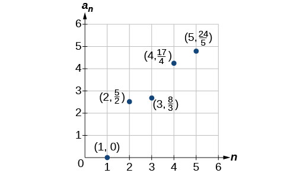

${a}_{n}=\{\begin{array}{ll}\frac{4+n}{2n}\hfill & \text{if\}n\phantom{\rule{0.5em}{0ex}}\text{is\ even}\hfill \\ 3+n\hfill & \text{if\}n\phantom{\rule{0.5em}{0ex}}\text{is\ odd}\hfill \end{array}$

${a}_{1}=2,\phantom{\rule{0.5em}{0ex}}\text{}{a}_{n}={\left(-{a}_{n-1}+1\right)}^{2}$

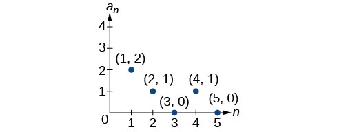

${a}_{1}=1,\phantom{\rule{0.5em}{0ex}}\text{}{a}_{n}={a}_{n-1}+8$

${a}_{n}=\frac{\left(n+1\right)!}{\left(n-1\right)!}$

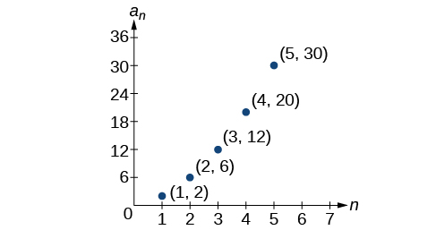

For the following exercises, write an explicit formula for the sequence using the first five points shown on the graph.

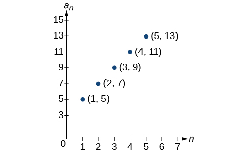

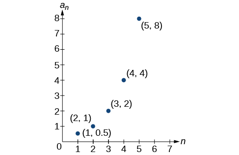

${a}_{n}={2}^{n-2}$

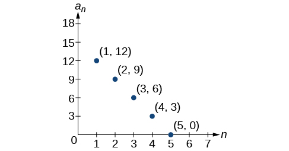

For the following exercises, write a recursive formula for the sequence using the first five points shown on the graph.

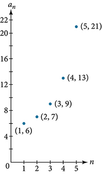

${a}_{1}=6,\phantom{\rule{0.5em}{0ex}}\text{}{a}_{n}=2{a}_{n-1}-5$

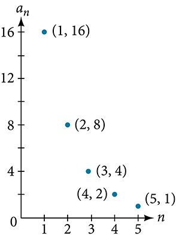

Technology
==========
Follow these steps to evaluate a sequence defined recursively using a graphing calculator:

On the home screen, key in the value for the initial term ${a}_{1}$ and press *[ENTER]*.
Enter the recursive formula by keying in all numerical values given in the formula, along with the key strokes *[2ND] ANS* for the previous term ${a}_{n-1}.$ Press *[ENTER]*.
Continue pressing *[ENTER]* to calculate the values for each successive term.

For the following exercises, use the steps above to find the indicated term or terms for the sequence.

Find the first five terms of the sequence ${a}_{1}=\frac{87}{111}$, ${a}_{n}=\frac{4}{3}{a}_{n-1}+\frac{12}{37}.$ Use the >*Frac* feature to give fractional results.

First five terms: $\frac{29}{37}$,
$\frac{152}{111}$,
$\frac{716}{333}$,
$\frac{3188}{999}$, $\frac{13724}{2997}$

Find the 15th term of the sequence ${a}_{1}=625$, ${a}_{n}=0.8{a}_{n-1}+18.$

Find the first five terms of the sequence ${a}_{1}=2$, ${a}_{n}={2}^{[({a}_{n}-1)-1]}+1.$

First five terms: 2, 3, 5, 17, 65537

Find the first ten terms of the sequence ${a}_{1}=8$, ${a}_{n}=\frac{\left({a}_{n-1}+1\right)!}{{a}_{n-1}!}.$

Find the tenth term of the sequence ${a}_{1}=2$, ${a}_{n}=n{a}_{n-1}$

${a}_{10}=7,257,600$

Follow these steps to evaluate a finite sequence defined by an explicit formula. Using a TI-84, do the following.

In the home screen, press *[2ND] LIST*.
Scroll over to *OPS* and choose *“seq(”* from the dropdown list. Press *[ENTER]*.
In the line headed *“Expr:”* type in the explicit formula, using the $[\text{X,T},\theta ,n]$ button for $n$ 
In the line headed *“Variable:”* type in the variable used on the previous step.
In the line headed *“start:”* key in the value of $n$ that begins the sequence.
In the line headed *“end:”* key in the value of $n$ that ends the sequence.
Press *[ENTER]* 3 times to return to the home screen. You will see the sequence syntax on the screen. Press *[ENTER]* to see the list of terms for the finite sequence defined. Use the right arrow key to scroll through the list of terms.

Using a TI-83, do the following.

In the home screen, press *[2ND] LIST*.
Scroll over to *OPS* and choose *“seq(”* from the dropdown list. Press *[ENTER]*.
Enter the items in the order *“Expr”*, *“Variable”*, *“start”*, *“end”* separated by commas. See the instructions above for the description of each item.
Press *[ENTER]* to see the list of terms for the finite sequence defined. Use the right arrow key to scroll through the list of terms.

For the following exercises, use the steps above to find the indicated terms for the sequence. Round to the nearest thousandth when necessary.

List the first five terms of the sequence ${a}_{n}=-\frac{28}{9}n+\frac{5}{3}.$

List the first six terms of the sequence ${a}_{n}=\frac{{n}^{3}-3.5{n}^{2}+\ 4.1n-1.5}{2.4n}.$

First six terms: 0.042, 0.146, 0.875, 2.385, 4.708

List the first five terms of the sequence ${a}_{n}=\frac{15n\cdot {\left(-2\right)}^{n-1}}{47}$

List the first four terms of the sequence ${a}_{n}={5.7}^{n}+0.275\left(n-1\right)!$

First four terms: 5.975, 2.765, 185.743, 1057.25, 6023.521

List the first six terms of the sequence ${a}_{n}=\frac{n!}{n}.$

Extensions
==========

Consider the sequence defined by ${a}_{n}=-6-8n.$ Is ${a}_{n}=-421$ a term in the sequence?  Verify the result.

If ${a}_{n}=-421$ is a term in the sequence, then solving the equation $-421=-6-8n$ for $n$ will yield a non-negative integer. However, if $-421=-6-8n,$ then $n=51.875$ so ${a}_{n}=-421$ is not a term in the sequence.

What term in the sequence ${a}_{n}=\frac{{n}^{2}+4n+4}{2\left(n+2\right)}$ has the value $41?$ Verify the result.

Find a recursive formula for the sequence 1, 0, −1, −1, 0, 1, 1, 0, −1, −1, 0, 1, 1, .... (*Hint*: find a pattern for ${a}_{n}$ based on the first two terms.)

${a}_{1}=1,{a}_{2}=0,{a}_{n}={a}_{n-1}-{a}_{n-2}$

Calculate the first eight terms of the sequences ${a}_{n}=\frac{\left(n+2\right)!}{\left(n-1\right)!}$ and ${b}_{n}={n}^{3}+3{n}^{2}+2n,$ and then make a conjecture about the relationship between these two sequences.

Prove the conjecture made in the preceding exercise.

$\frac{(n+2)!}{(n-1)!}=\frac{(n+2)\xb7(n+1)\xb7(n)\xb7(n-1)\xb7\mathrm{...}\xb73\xb72\xb71}{(n-1)\xb7\mathrm{...}\xb73\xb72\xb71}=n(n+1)(n+2)={n}^{3}+3{n}^{2}+2n$

**explicit formula**
a formula that defines each term of a sequence in terms of its position in the sequence

**finite sequence**
a function whose domain consists of a finite subset of the positive integers $\{1,2,\dots n\}$ for some positive integer $n$ 

**infinite sequence**
a function whose domain is the set of positive integers

**n factorial**
the product of all the positive integers from 1 to $n$ 

**nth term of a sequence**
a formula for the general term of a sequence

**recursive formula**
a formula that defines each term of a sequence using previous term(s)

**sequence**
a function whose domain is a subset of the positive integers

**term**
a number in a sequence
