**Arithmetic Sequences**

  m49445
  

**Arithmetic Sequences**

  In this section, you will:

Find the common difference for an arithmetic sequence.
Write terms of an arithmetic sequence.
Use a recursive formula for an arithmetic sequence.
Use an explicit formula for an arithmetic sequence.

  35388d0f-fefc-42fc-857a-1c0c8e20d85f

## Learning Objectives
Determine if a sequence is arithmetic (IA 12.2.1) 
Find the general term (nth term) of an arithmetic sequence (IA 12.2.2)

## Objective 1: Determine if a sequence is arithmetic (IA 12.2.1)
An **arithmetic sequence** is a sequence where the difference between consecutive terms is always the same.

The difference between consecutive terms, *d*, and is called the **common difference**, for n greater than or equal to two.
 $d={a}_{n}-{a}_{n-1}$ 

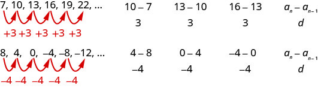

1. Determine if each sequence is arithmetic. If so, indicate the common difference.  ⓐ $5,9,13,17,21,25\text{,}\phantom{\rule{0.2em}{0ex}}\text{\u2026}$   ⓑ $4,9,12,17,20,25\text{,}\phantom{\rule{0.2em}{0ex}}\text{\u2026}$

Solution

To determine if the sequence is arithmetic, we find the difference of the consecutive terms shown.

ⓐ
 $\begin{array}{cccccc}\begin{array}{}\\ \\ \\ \\ \text{Find the difference of}  \\ \text{the consecutive terms.}  \end{array}  & & & & &   \begin{array}{cccccccccc}  5,  & &   \phantom{\rule{1em}{0ex}}9,  & &   \phantom{\rule{1em}{0ex}}13,  & &   \phantom{\rule{1em}{0ex}}17  & &   \phantom{\rule{1em}{0ex}}21,  &   \phantom{\rule{0.6em}{0ex}}25,\dots   \\ \\ \\   9-5  & &   \phantom{\rule{1em}{0ex}}13-9  & &   \phantom{\rule{1em}{0ex}}17-13  & &   \phantom{\rule{1em}{0ex}}21-17  & &   \phantom{\rule{1em}{0ex}}25-21  & & \\   4  & &   \phantom{\rule{1em}{0ex}}4  & &   \phantom{\rule{1em}{0ex}}4  & &   \phantom{\rule{1em}{0ex}}4  & &   \phantom{\rule{1em}{0ex}}4  & & \end{array}  \\ \\ \\ & & & & & \text{The sequence is arithmetic. The common difference is}\phantom{\rule{0.2em}{0ex}}d=4\text{.}  \end{array}$ 

ⓑ
 $\begin{array}{cccccc}\begin{array}{}\\ \\ \\ \\ \text{Find the difference of}  \\ \text{the consecutive terms.}  \end{array}  & & & & &   \begin{array}{cccccccccc}  4,  & &   \phantom{\rule{1em}{0ex}}9,  & &   \phantom{\rule{1em}{0ex}}12,  & &   \phantom{\rule{1em}{0ex}}17  & &   \phantom{\rule{1em}{0ex}}20,  &   \phantom{\rule{0.6em}{0ex}}25,\dots   \\ \\ \\   9-4  & &   \phantom{\rule{1em}{0ex}}12-9  & &   \phantom{\rule{1em}{0ex}}17-12  & &   \phantom{\rule{1em}{0ex}}20-17  & &   \phantom{\rule{1em}{0ex}}25-20  & & \\   2  & &   \phantom{\rule{1em}{0ex}}3  & &   \phantom{\rule{1em}{0ex}}5  & &   \phantom{\rule{1em}{0ex}}3  & &   \phantom{\rule{1em}{0ex}}5  & & \end{array}  \\ \\ \\ & & & & & \begin{array}{c}\text{The sequence is not arithmetic as all the differences between}  \\ \text{the consecutive terms are not the same.}  \\ \text{There is no common difference.}  \end{array}  \end{array}$

### Practice Makes Perfect
Determine if each sequence is arithmetic. If so, indicate the common difference.

2. -4, 4, 2, 10, 8, 16, …       |  |  | | :--- | :--- | | Find the difference of consecutive terms. |  | |  |  |

3. -3, -1, 1, 3, 5, 7, …       |  |  | | :--- | :--- | | Find the difference of consecutive terms. |  | |  |  |

4. Write the first five terms of the sequence where the first term is 5 and the common difference is $d=\mathrm{-6}.$

Solution

We start with the first term and add the common difference. Then we add the common difference to that result to get the next term, and so on.

 $\begin{array}{ccccccccccccccc}  {a}_{1}  & & &   {a}_{2}  & & &   {a}_{3}  & & &   {a}_{4}  & & &   {a}_{5}  & & \\   5  & & &   5+\left(\mathrm{-6}\right)  & & &   \mathrm{-1}+\left(\mathrm{-6}\right)  & & &   \mathrm{-7}+\left(\mathrm{-6}\right)  & & &   \mathrm{-13}+\left(\mathrm{-6}\right)  \\ & & &   -1  & & &   -7  & & &   -13  & & &   -19  \end{array}$ 
The sequence is $5,\mathrm{-1},\mathrm{-7},\mathrm{-13},\mathrm{-19}\text{,}\phantom{\rule{0.2em}{0ex}}\text{\u2026}$

### Practice Makes Perfect
5. Write the first five terms of the sequence where the first term is –4 and the common difference is $d=7.$   $\begin{array}{ccccccccccccccc}  {a}_{1}  & & &   {a}_{2}  & & &   {a}_{3}  & & &   {a}_{4}  & & &   {a}_{5}  & & \\ -4\end{array}$ The sequence is: ________________________________________

## Objective 2: Find the general term (nth term) of an arithmetic sequence (IA 12.2.2)
In the last section, we found a formula for the general term of a sequence, we can also find a formula for the general term of an arithmetic sequence.
Let’s write the first few terms of a sequence where the first term is ${a}_{1}$ and the common difference is *d*. We will then look for a pattern.
As we look for a pattern we see that each term starts with ${a}_{1}$ .

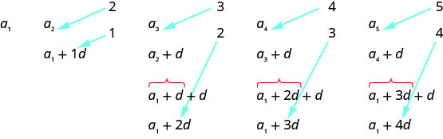

The first term adds 0*d* to the ${a}_{1}$ , the second term adds 1*d*, the third term adds 2*d*, the fourth term adds 3*d*, and the fifth term adds 4*d*. The number of *d*s that were added to ${a}_{1}$ is one less than the number of the term. We then have the formula for the general term of an arithmetic sequence.

>
>
> **General term (nth term) of an arithmetic sequence**
>
> The general term of an arithmetic sequence with first term ${a}_{1}$ and the common difference $d$ is ${a}_{n}={a}_{1}+(n-1)d$

Find the general term (nth term) of an arithmetic sequence.

6. ⓐ Find the twenty-first term of a sequence where the first term is three and the common difference is eight.   ⓑ  Find the eleventh term of a sequence where the third term is 19 and the common difference is five. Give the formula for the general term.

Solution

| ⓐ To find the 21st term, use the formula with ${a}_{1}=3$, $d=8$, and $n=21$ | ${a}_{n}={a}_{1}+(n-1)d$ |
| :--- | :--- |
| Substitute | ${a}_{21}=3+(21-1)\left(8\right)$ |
| Simplify | $\begin{array}{c}{a}_{21}=3+\left(20\right)\left(8\right)\\ {a}_{21}=3+160\\ {a}_{21}=163\end{array}$ |

| ⓑ  Let's first find ${a}_{1}$. Use the formula with ${a}_{3}=19$, $d=5$, and $n=3$. Substitute these values and simplify | $\begin{array}{c}{a}_{n}={a}_{1}+(n-1)d\\ {a}_{3}={a}_{1}+(3-1)\left(5\right)\\ 19={a}_{1}+\left(2\right)\left(5\right)\\ 19={a}_{1}+10\\ {a}_{1=9}\end{array}$ |
| :--- | :--- |
| To find the 11th term, use the formula with ${a}_{3}=9$, $d=5$, and $n=11$  Substitute these values and simplify | $\begin{array}{c}{a}_{n}={a}_{1}+(n-1)d\\ {a}_{11}=9+(11-1)\left(5\right)\\ {a}_{11}=9+\left(10\right)\left(5\right)\\ {a}_{11}=59\\ \phantom{\rule{0ex}{0ex}}\end{array}$ |
| To find the general term, substitute $a=9$ and $d=5$ into the formula. | $\begin{array}{c}{a}_{n}={a}_{1}+(n-1)d\\ {a}_{11}=9+(11-1)\left(5\right)\\ {a}_{11}=9+\left(10\right)\left(5\right)\\ {a}_{11}=59\end{array}$ |

### Practice Makes Perfect

Find the general term (nth term) of an arithmetic sequence.

7. Find the sixteenth term of a sequence where the first term is 11 and the common difference is −6.       |  | ${a}_{n}={a}_{1}+(n\u20131)d$ | | :--- | :--- | |  |  | |  |  |

8. Find the 19th term of a sequence where the 5th term is 1 and the common difference is -4. Give the formula for the general term.       |  |  | | :--- | :--- | |  |  | |  |  |

Companies often make large purchases, such as computers and vehicles, for business use. The book-value of these supplies decreases each year for tax purposes. This decrease in value is called depreciation. One method of calculating depreciation is straight-line depreciation, in which the value of the asset decreases by the same amount each year.

As an example, consider a woman who starts a small contracting business. She purchases a new truck for $25,000. After five years, she estimates that she will be able to sell the truck for $8,000. The loss in value of the truck will therefore be $17,000, which is $3,400 per year for five years. The truck will be worth $21,600 after the first year; $18,200 after two years; $14,800 after three years; $11,400 after four years; and $8,000 at the end of five years. In this section, we will consider specific kinds of sequences that will allow us to calculate depreciation, such as the truck’s value.

# Finding Common Differences
The values of the truck in the example are said to form an *arithmetic sequence* because they change by a constant amount each year. Each term increases or decreases by the same constant value called the *common difference* of the sequence. For this sequence, the common difference is –3,400.

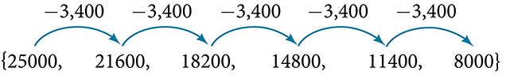

The sequence below is another example of an arithmetic sequence. In this case, the constant difference is 3. You can choose any **term** of the **sequence**, and add 3 to find the subsequent term.

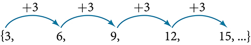

>
>
>
>
> **Arithmetic Sequence**
>
>
> An **arithmetic sequence** is a sequence that has the property that the difference between any two consecutive terms is a constant. This constant is called the **common difference**. If ${a}_{1}$ is the first term of an arithmetic sequence and $d$ is the common difference, the sequence will be:
>   $$
> \left\{{a}_{n}\right\}=\{{a}_{1},{a}_{1}+d,{a}_{1}+2d,{a}_{1}+3d,\mathrm{...}\}
> $$

9. **Finding Common Differences**   Is each sequence arithmetic? If so, find the common difference.   ⓐ  $\{1,2,4,8,16,\mathrm{...}\}$  ⓑ   $\{-3,1,5,9,13,\mathrm{...}\}$

Solution

Subtract each term from the subsequent term to determine whether a common difference exists.

ⓐThe sequence is not arithmetic because there is no common difference.

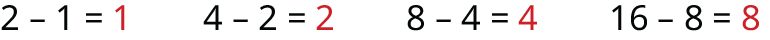

ⓑThe sequence is arithmetic because there is a common difference. The common difference is 4.

>
> Q&A
> *If we are told that a sequence is arithmetic, do we have to subtract every term from the following term to find the common difference?*
>
>
> *No. If we know that the sequence is arithmetic, we can choose any one term in the sequence, and subtract it from the subsequent term to find the common difference.*
>
>

>
> Try It
> 10. Is the given sequence arithmetic? If so, find the common difference.  $$ \{18,\phantom{\rule{0.5em}{0ex}}\text{}16,\phantom{\rule{0.5em}{0ex}}\text{}14,\phantom{\rule{0.5em}{0ex}}\text{}12,\phantom{\rule{0.5em}{0ex}}\text{}10,\dots \} $$
>
> 

> 
Solution

>
> The sequence is arithmetic. The common difference is $\u20132.$
> 

>
>

>
> Try It
> 11. Is the given sequence arithmetic? If so, find the common difference.  $$ \{1,\phantom{\rule{0.5em}{0ex}}\text{}3,\phantom{\rule{0.5em}{0ex}}\text{}6,\phantom{\rule{0.5em}{0ex}}\text{}10,\phantom{\rule{0.5em}{0ex}}\text{}15,\dots \} $$
>
> 

> 
Solution

>
> The sequence is not arithmetic because $3-1\ne 6-3.$
> 

>
>

# Writing Terms of Arithmetic Sequences
Now that we can recognize an arithmetic sequence, we will find the terms if we are given the first term and the common difference. The terms can be found by beginning with the first term and adding the common difference repeatedly. In addition, any term can also be found by plugging in the values of $n$ and $d$ into formula below.
 $$
{a}_{n}={a}_{1}+(n-1)d
$$

>
> *Given the first term and the common difference of an arithmetic sequence, find the first several terms.*
>
> Add the common difference to the first term to find the second term.
> Add the common difference to the second term to find the third term.
> Continue until all of the desired terms are identified.
> Write the terms separated by commas within brackets.
>

12. **Writing Terms of Arithmetic Sequences**   Write the first five terms of the **arithmetic sequence** with ${a}_{1}=17$ and $d=-3$ .

Solution

Adding $-3$ is the same as subtracting 3. Beginning with the first term, subtract 3 from each term to find the next term.
The first five terms are $\{17,\phantom{\rule{0.5em}{0ex}}14,\phantom{\rule{0.5em}{0ex}}11,\phantom{\rule{0.5em}{0ex}}8,\phantom{\rule{0.5em}{0ex}}5\}$

>
> Try It
> 13. List the first five terms of the arithmetic sequence with ${a}_{1}=1$ and $d=5$ .
>
> 

> 
Solution

>
> $\left\{1,\ 6,\ 11,\ 16,\ 21\right\}$
> 

>
>

>
>
> *Given any first term and any other term in an arithmetic sequence, find a given term.*
>
> Substitute the values given for ${a}_{1},{a}_{n},n$ into the formula ${a}_{n}={a}_{1}+(n-1)d$ to solve for $d.$ 
> Find a given term by substituting the appropriate values for ${a}_{1},n,$ and $d$ into the formula ${a}_{n}={a}_{1}+(n-1)d.$ 

14. **Writing Terms of Arithmetic Sequences**   Given ${a}_{1}=8$ and ${a}_{4}=14$ , find ${a}_{5}$ .

Solution

The sequence can be written in terms of the initial term 8 and the common difference $d$ .

     $$
\left\{8,8+d,8+2d,8+3d\right\}
$$ We know the fourth term equals 14; we know the fourth term has the form ${a}_{1}+3d=8+3d$ .
We can find the common difference $d$ .
 $$
\begin{array}{ll}{a}_{n}={a}_{1}+(n-1)d  &   \\ {a}_{4}={a}_{1}+3d  &   \\ {a}_{4}=8+3d  & \text{Write\ the\ fourth\ term\ of\ the\ sequence\ in\ terms\ of}\ {a}_{1}\ \text{and}\ d.  \\ 14=8+3d  & \text{Substitute}\ 14\ \text{for}\ {a}_{4}.  \\ \ \phantom{\rule{0.5em}{0ex}}\phantom{\rule{0.5em}{0ex}}d=2  & \text{Solve\ for\ the\ common\ difference}.  \end{array}
$$
Find the fifth term by adding the common difference to the fourth term.
 $$
{a}_{5}={a}_{4}+2=16
$$

>
> Try It
> 15. Given ${a}_{3}=7$ and ${a}_{5}=17$ , find ${a}_{2}$ .
>
> 

> 
Solution

>
> ${a}_{2}=2$
> 

>
>

# Using Recursive Formulas for Arithmetic Sequences
Some arithmetic sequences are defined in terms of the previous term using a **recursive formula**. The formula provides an algebraic rule for determining the terms of the sequence. A recursive formula allows us to find any term of an arithmetic sequence using a function of the preceding term. Each term is the sum of the previous term and the common difference. For example, if the common difference is 5, then each term is the previous term plus 5. As with any recursive formula, the first term must be given.
 $$
\begin{array}{lllll}{a}_{n}={a}_{n-1}+d  &   &   &   & n\ge 2  \end{array}
$$

>
>
>
>
> **Recursive Formula for an Arithmetic Sequence**
>
>
> The recursive formula for an arithmetic sequence with common difference $d$ is:
>  $$
> \begin{array}{lllll}{a}_{n}={a}_{n-1}+d  &   &   &   & n\ge 2  \end{array}
> $$

>
>
>
> *Given an arithmetic sequence, write its recursive formula.*
>
>
>
> Subtract any term from the subsequent term to find the common difference.
> State the initial term and substitute the common difference into the recursive formula for arithmetic sequences.
>

16. **Writing a Recursive Formula for an Arithmetic Sequence**   Write a **recursive formula** for the     **arithmetic sequence**.  $$ \{-18\text{,\}-7\text{,\}4\text{,\}15\text{,\}26\text{,\ \u2026}\} $$

Solution

The first term is given as $\mathrm{-18}$ . The common difference can be found by subtracting the first term from the second term.
 $$
d=\mathrm{-7}-(\mathrm{-18})=11
$$ Substitute the initial term and the common difference into the recursive formula for arithmetic sequences.
 $$
\begin{array}{l}{a}_{1}=-18  \\ {a}_{n}={a}_{n-1}+11,\phantom{\rule{0.5em}{0ex}}\text{for\}n\ge 2  \end{array}
$$

>
> Q&A
> *Do we have to subtract the first term from the second term to find the common difference?*
>
>
> *No. We can subtract any term in the sequence from the subsequent term. It is, however, most common to subtract the first term from the second term because it is often the easiest method of finding the common difference.*
>
>

>
> Try It
> 17. Write a recursive formula for the arithmetic sequence.   $$ \{25\text{,\}\ 37\text{,\}\ 49\text{,\}\ 61\text{,\}\ \text{\u2026}\} $$
>
> 

> 
Solution

>
> $\begin{array}{l}{a}_{1}=25  \\ {a}_{n}={a}_{n-1}+12,\phantom{\rule{0.5em}{0ex}}\text{for\}n\ge 2  \end{array}$
> 

>
>

# Using Explicit Formulas for Arithmetic Sequences
We can think of an **arithmetic sequence** as a function on the domain of the natural numbers; it is a linear function because it has a constant rate of change. The common difference is the constant rate of change, or the slope of the function. We can construct the linear function if we know the slope and the vertical intercept.

 ${a}_{n}={a}_{1}+d(n-1)$
To find the *y*-intercept of the function, we can subtract the common difference from the first term of the sequence. Consider the following sequence.

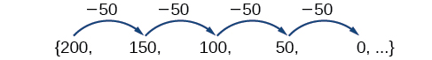

The common difference is $-50$ , so the sequence represents a linear function with a slope of $-50$ . To find the $y$ -intercept, we subtract $-50$ from $200:\phantom{\rule{0.5em}{0ex}}200-(-50)=200+50=250$ . You can also find the $y$ -intercept by graphing the function and determining where a line that connects the points would intersect the vertical axis. The graph is shown in .

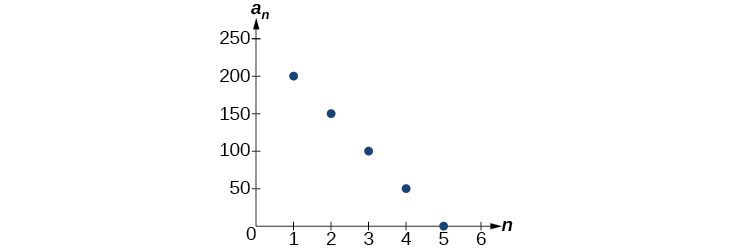

Recall the slope-intercept form of a line is $y=mx+b.$ When dealing with sequences, we use ${a}_{n}$ in place of $y$ and $n$ in place of $x.$ If we know the slope and vertical intercept of the function, we can substitute them for $m$ and $b$ in the slope-intercept form of a line. Substituting $-50$ for the slope and $250$ for the vertical intercept, we get the following equation:
 $$
{a}_{n}=-50n+250
$$ We do not need to find the vertical intercept to write an **explicit formula** for an arithmetic sequence. Another explicit formula for this sequence is ${a}_{n}=200-50(n-1)$ , which simplifies to ${a}_{n}=-50n+250.$

>
>
> **Explicit Formula for an Arithmetic Sequence**
>
>
>
> An explicit formula for the $n\text{th}$ term of an arithmetic sequence is given by
>
>  $$
> {a}_{n}={a}_{1}+d(n-1)
> $$

>
>
>
> *Given the first several terms for an arithmetic sequence, write an explicit formula.*
>
>
> Find the common difference, ${a}_{2}-{a}_{1}.$ 
> Substitute the common difference and the first term into ${a}_{n}={a}_{1}+d(n-1).$ 

18. **Writing the *n*th Term Explicit Formula for an Arithmetic Sequence**   Write an explicit formula for the arithmetic sequence.  $$ \left\{2\text{,\}12\text{,\}22\text{,\}32\text{,\}42\text{,\ \u2026}\right\} $$

Solution

The common difference can be found by subtracting the first term from the second term.
 $$
\begin{array}{ll}d  & ={a}_{2}-{a}_{1}  \\   & =12-2  \\   & =10  \end{array}
$$
    The common difference is 10. Substitute the common difference and the first term of the sequence into the formula and simplify.
 $$
\begin{array}{l}{a}_{n}=2+10(n-1)  \\ {a}_{n}=10n-8  \end{array}
$$

>
> Try It
> 19. Write an explicit formula for the following arithmetic sequence.  $$ \{50,47,44,41,\dots \} $$
>
> 

> 
Solution

>
> ${a}_{n}=53-3n$
> 

>

## Finding the Number of Terms in a Finite Arithmetic Sequence
Explicit formulas can be used to determine the number of terms in a finite arithmetic sequence. We need to find the common difference, and then determine how many times the common difference must be added to the first term to obtain the final term of the sequence.

>
> How To
>
> *Given the first three terms and the last term of a finite arithmetic sequence, find the total number of terms.*
>
>
> Find the common difference $d.$ 
> Substitute the common difference and the first term into ${a}_{n}={a}_{1}+d(n\u20131).$ 
> Substitute the last term for ${a}_{n}$ and solve for $n.$ 

20. **Finding the Number of Terms in a Finite Arithmetic Sequence**   Find the number of terms in the **finite arithmetic sequence**.  $$ \left\{8\text{,\}1\text{,\}\mathrm{\u20136}\text{,\}\mathrm{...}\text{,\}\mathrm{\u201341}\right\} $$

Solution

The common difference can be found by subtracting the first term from the second term.
 $$
1-8=-7
$$ 
The common difference is $-7$ . Substitute the common difference and the initial term of the sequence into the $n\text{th}$ term formula and simplify.

 $$
\begin{array}{l}{a}_{n}={a}_{1}+d(n-1)  \\ {a}_{n}=8+(-7)(n-1)  \\ {a}_{n}=15-7n  \end{array}
$$
Substitute $-41$ for ${a}_{n}$ and solve for $n$ 
 $$
\begin{array}{l}-41=15-7n  \\ \phantom{\rule{0.5em}{0ex}}\phantom{\rule{0.5em}{0ex}}\phantom{\rule{0.5em}{0ex}}\phantom{\rule{0.5em}{0ex}}\phantom{\rule{0.5em}{0ex}}\phantom{\rule{0.5em}{0ex}}\phantom{\rule{0.5em}{0ex}}\phantom{\rule{0.5em}{0ex}}8=n  \end{array}
$$
There are eight terms in the sequence.

>
> Try It
> 21. Find the number of terms in the finite arithmetic sequence.   $$ \left\{6\text{,\}11\text{,\}16\text{,\}\mathrm{...}\text{,\}56\right\} $$
>
> 

> 
Solution

>
> There are 11 terms in the sequence.
> 

>
>

## Solving Application Problems with Arithmetic Sequences
In many application problems, it often makes sense to use an initial term of ${a}_{0}$ instead of ${a}_{1}.$ In these problems, we alter the explicit formula slightly to account for the difference in initial terms. We use the following formula:

 $$
{a}_{n}={a}_{0}+dn
$$

22. **Solving Application Problems with Arithmetic Sequences**   A five-year old child receives an allowance of $1 each week. His parents promise him an annual increase of $2 per week.   ⓐWrite a formula for the child’s weekly allowance in a given year. ⓑWhat will the child’s allowance be when he is 16 years old?

Solution

ⓐ
The situation can be modeled by an arithmetic sequence with an initial term of 1 and a common difference of 2.

Let $A$ be the amount of the allowance and $n$ be the number of years after age 5. Using the altered explicit formula for an arithmetic sequence we get:

 $$
{A}_{n}=1+2n
$$

ⓑ
We can find the number of years since age 5 by subtracting.

    
 $$
16-5=11
$$

We are looking for the child’s allowance after 11 years. Substitute 11 into the formula to find the child’s allowance at age 16.

    
 $$
{A}_{11}=1+2(11)=23
$$

The child’s allowance at age 16 will be $23 per week.

>
> Try It
> 23. A woman decides to go for a 10-minute run every day this week and plans to increase the time of her daily run by 4 minutes each week. Write a formula for the time of her run after n weeks. How long will her daily run be 8 weeks from today?
>
> 

> 
Solution

>
> The formula is ${T}_{n}=10+4n,$ and it will take her 42 minutes.
> 

>
>
>
>

>
> Media
> Access this online resource for additional instruction and practice with arithmetic sequences.
>
>
> Arithmetic Sequences
>

# Key Equations

| recursive formula for nth term of an arithmetic sequence | ${a}_{n}={a}_{n-1}+d,n\ge 2$ |
| :--- | :--- |
| explicit formula for nth term of an arithmetic sequence | $\begin{array}{l}{a}_{n}={a}_{1}+d(n-1)\end{array}$ |

# Key Concepts

An arithmetic sequence is a sequence where the difference between any two consecutive terms is a constant.
The constant between two consecutive terms is called the common difference.
The common difference is the number added to any one term of an arithmetic sequence that generates the subsequent term. See .
The terms of an arithmetic sequence can be found by beginning with the initial term and adding the common difference repeatedly. See  and .
A recursive formula for an arithmetic sequence with common difference $d$ is given by ${a}_{n}={a}_{n-1}+d,n\ge 2.$ See .
As with any recursive formula, the initial term of the sequence must be given.
An explicit formula for an arithmetic sequence with common difference $d$ is given by ${a}_{n}={a}_{1}+d(n-1).$ See .
An explicit formula can be used to find the number of terms in a sequence. See .
In application problems, we sometimes alter the explicit formula slightly to ${a}_{n}={a}_{0}+dn.$ See .

# Section Exercises

## Verbal
1. What is an arithmetic sequence?

Solution

A sequence where each successive term of the sequence increases (or decreases) by a constant value.

2. How is the common difference of an arithmetic sequence found?

3. How do we determine whether a sequence is arithmetic?

Solution

We find whether the difference between all consecutive terms is the same. This is the same as saying that the sequence has a common difference.

4. What are the main differences between using a recursive formula and using an explicit formula to describe an arithmetic sequence?

5. Describe how linear functions and arithmetic sequences are similar. How are they different?

Solution

Both arithmetic sequences and linear functions have a constant rate of change. They are different because their domains are not the same; linear functions are defined for all real numbers, and arithmetic sequences are defined for natural numbers or a subset of the natural numbers.

## Algebraic
For the following exercises, find the common difference for the arithmetic sequence provided.
6. $\{5,11,17,23,29,\mathrm{...}\}$

7. $\left\{0,\frac{1}{2},1,\frac{3}{2},2,\mathrm{...}\right\}$

Solution

The common difference is $\frac{1}{2}$

For the following exercises, determine whether the sequence is arithmetic. If so find the common difference.
8. $\{11.4,9.3,7.2,5.1,3,\mathrm{...}\}$

9. $\{4,16,64,256,1024,\mathrm{...}\}$

Solution

The sequence is not arithmetic because $16-4\ne 64-16.$

For the following exercises, write the first five terms of the arithmetic sequence given the first term and common difference.
10. ${a}_{1}=\mathrm{-25}$ , $d=\mathrm{-9}$

11. ${a}_{1}=0$ , $d=\frac{2}{3}$

Solution

$0,\phantom{\rule{0.5em}{0ex}}\frac{2}{3},\phantom{\rule{0.5em}{0ex}}\frac{4}{3},\phantom{\rule{0.5em}{0ex}}2,\phantom{\rule{0.5em}{0ex}}\frac{8}{3}$

For the following exercises, write the first five terms of the arithmetic series given two terms.
12. ${a}_{1}=17,\phantom{\rule{0.5em}{0ex}}{a}_{7}=-31$

13. ${a}_{13}=-60,\phantom{\rule{0.5em}{0ex}}{a}_{33}=-160$

Solution

$0,-5,-10,-15,-20$

For the following exercises, find the specified term for the arithmetic sequence given the first term and common difference.
14. First term is 3, common difference is 4, find the 5th term.

15. First term is 4, common difference is 5, find the 4th term.

Solution

${a}_{4}=19$

16. First term is 5, common difference is 6, find the 8th term.

17. First term is 6, common difference is 7, find the 6th term.

Solution

${a}_{6}=41$

18. First term is 7, common difference is 8, find the 7th term.

For the following exercises, find the first term given two terms from an arithmetic sequence.
19. Find the first term or ${a}_{1}$ of an arithmetic sequence if ${a}_{6}=12$ and ${a}_{14}=28.$

Solution

${a}_{1}=2$

20. Find the first term or ${a}_{1}$ of an arithmetic sequence if ${a}_{7}=21$ and ${a}_{15}=42.$

21. Find the first term or ${a}_{1}$ of an arithmetic sequence if ${a}_{8}=40$ and ${a}_{23}=115.$

Solution

${a}_{1}=5$

22. Find the first term or ${a}_{1}$ of an arithmetic sequence if ${a}_{9}=54$ and ${a}_{17}=102.$

23. Find the first term or ${a}_{1}$ of an arithmetic sequence if ${a}_{11}=11$ and ${a}_{21}=16.$

Solution

${a}_{1}=6$

For the following exercises, find the specified term given two terms from an arithmetic sequence.
24. ${a}_{1}=33$ and ${a}_{7}=-15.$ Find ${a}_{4}.$

25. ${a}_{3}=-17.1$ and ${a}_{10}=-\mathrm{15.7.}$ Find ${a}_{21}.$

Solution

${a}_{21}=-13.5$

For the following exercises, use the recursive formula to write the first five terms of the arithmetic sequence.
26. ${a}_{1}=39;\phantom{\rule{0.5em}{0ex}}\text{}{a}_{n}={a}_{n-1}-3$

27. ${a}_{1}=-19;\phantom{\rule{0.5em}{0ex}}\text{}{a}_{n}={a}_{n-1}-1.4$

Solution

$-19,-20.4,-21.8,-23.2,-24.6$

For the following exercises, write a recursive formula for each arithmetic sequence.
28. $a=\left\{40,60,80,\mathrm{...}\right\}$

29. $a=\{17,26,35,\mathrm{...}\}$

Solution

$\begin{array}{ll}{a}_{1}=17;\ {a}_{n}={a}_{n-1}+9  & n\ge 2  \end{array}$

30. $a=\{-1,2,5,\mathrm{...}\}$

31. $a=\{12,17,22,\mathrm{...}\}$

Solution

$\begin{array}{ll}{a}_{1}=12;\ {a}_{n}={a}_{n-1}+5  & n\ge 2  \end{array}$

32. $a=\{-15,-7,1,\mathrm{...}\}$

33. $a=\{8.9,10.3,11.7,\mathrm{...}\}$

Solution

$\begin{array}{ll}{a}_{1}=8.9;\ {a}_{n}={a}_{n-1}+1.4  & n\ge 2  \end{array}$

34. $a=\{-0.52,-1.02,-1.52,\mathrm{...}\}$

35. $a=\left\{\frac{1}{5},\frac{9}{20},\frac{7}{10},\mathrm{...}\right\}$

Solution

$\begin{array}{ll}{a}_{1}=\frac{1}{5};\ {a}_{n}={a}_{n-1}+\frac{1}{4}  & n\ge 2  \end{array}$

36. $a=\left\{-\frac{1}{2},-\frac{5}{4},-2,\mathrm{...}\right\}$

37. $a=\left\{\frac{1}{6},-\frac{11}{12},-2,\mathrm{...}\right\}$

Solution

$\begin{array}{ll}{}_{1}=\frac{1}{6};\ {a}_{n}={a}_{n-1}-\frac{13}{12}  & n\ge 2  \end{array}$

For the following exercises, write a recursive formula for the given arithmetic sequence, and then find the specified term.
38. $a=\left\{7\text{,\}4\text{,\}1\text{,\}\mathrm{...}\right\};$ Find the 17th term.

39. $a=\left\{4\text{,\}11\text{,\}18\text{,\}\mathrm{...}\right\};$ Find the 14th term.

Solution

${a}_{1}=4;\phantom{\rule{0.5em}{0ex}}\text{}{a}_{n}={a}_{n-1}+7;\phantom{\rule{0.5em}{0ex}}\text{}{a}_{14}=95$

40. $a=\left\{2\text{,\}6\text{,\}10\text{,\}\mathrm{...}\right\};$ Find the 12th term.

For the following exercises, use the explicit formula to write the first five terms of the arithmetic sequence.
41. ${a}_{n}=24-4n$

Solution

First five terms: $20,16,12,8,4.$

42. ${a}_{n}=\frac{1}{2}n-\frac{1}{2}$

For the following exercises, write an explicit formula for each arithmetic sequence.
43. $a=\{3,5,7,\mathrm{...}\}$

Solution

${a}_{n}=1+2n$

44. $a=\{32,24,16,\mathrm{...}\}$

45. $a=\{-5\text{,\}95\text{,\}195\text{,\}\mathrm{...}\}$

Solution

${a}_{n}=-105+100n$

46. $a=\left\{\mathrm{-17}\text{,\}\mathrm{-217}\text{,\}\mathrm{-417}\text{,}\mathrm{...}\right\}$

47. $a=\left\{1.8\text{,\}3.6\text{,\}5.4\text{,\}\mathrm{...}\right\}$

Solution

${a}_{n}=1.8n$

48. $a=\{\mathrm{-18.1},\mathrm{-16.2},\mathrm{-14.3},\mathrm{...}\}$

49. $a=\{15.8,18.5,21.2,\mathrm{...}\}$

Solution

${a}_{n}=13.1+2.7n$

50. $a=\left\{\frac{1}{3},-\frac{4}{3},\mathrm{-3}\text{,\}\mathrm{...}\right\}$

51. $a=\left\{0,\frac{1}{3},\frac{2}{3},\mathrm{...}\right\}$

Solution

${a}_{n}=\frac{1}{3}n-\frac{1}{3}$

52. $a=\left\{-5,-\frac{10}{3},-\frac{5}{3},\dots \right\}$

For the following exercises, find the number of terms in the given finite arithmetic sequence.
53. $a=\{3\text{,}-4\text{,}-11\text{,\}\mathrm{...}\text{,}-60\}$

Solution

There are 10 terms in the sequence.

54. $a=\{1.2,1.4,1.6,\mathrm{...},3.8\}$

55. $a=\left\{\frac{1}{2},2,\frac{7}{2},\mathrm{...},8\right\}$

Solution

There are 6 terms in the sequence.

## Graphical
For the following exercises, determine whether the graph shown represents an arithmetic sequence.
56. 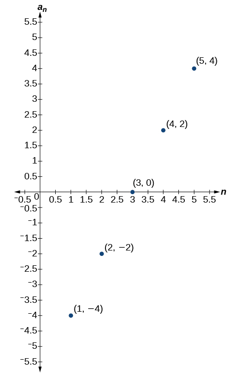

57. 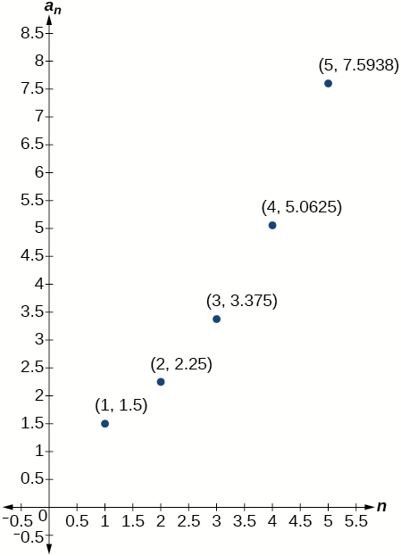

Solution

The graph does not represent an arithmetic sequence.

For the following exercises, use the information provided to graph the first 5 terms of the arithmetic sequence.
58. ${a}_{1}=0,d=4$

59. ${a}_{1}=9;{a}_{n}={a}_{n-1}-10$

Solution

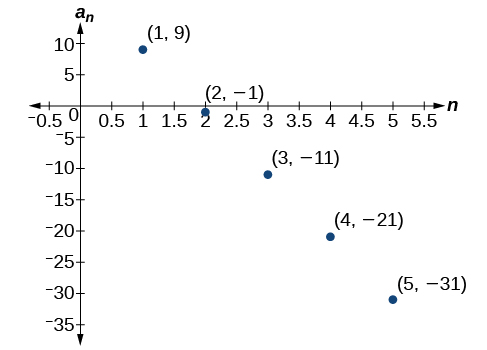

60. ${a}_{n}=-12+5n$

## Technology
For the following exercises, follow the steps to work with the arithmetic sequence ${a}_{n}=3n-2$ using a graphing calculator:

Press *[MODE]*
    
    Select SEQ in the fourth line
    Select DOT in the fifth line
    Press *[ENTER]*
    

Press *[Y=]*
 $n\text{Min}$ is the first counting number for the sequence. Set $n\text{Min}=1$ 
     $u(n)$ is the pattern for the sequence. Set $u(n)=3n-2$

     $u(n\text{Min)}$ is the first number in the sequence. Set $u(n\text{Min)}=1$

    
Press *[2ND]* then *[WINDOW]* to go to *TBLSET*
    
Set $\text{TblStart}=1$ 
    Set $\Delta \text{Tbl}=1$ 
    Set Indpnt: Auto and Depend: Auto
    
Press *[2ND]* then *[GRAPH]* to go to the *TABLE*

61. What are the first seven terms shown in the column with the heading $u(n)\text{?}$

Solution

$1,4,7,10,13,16,19$

62. Use the scroll-down arrow to scroll to $n=50.$ What value is given for $u(n)\text{?}$

63. Press *[WINDOW]*. Set $n\text{Min}=1$, $n\text{Max}=5$, $x\text{Min}=0$, $x\text{Max}=6$, $y\text{Min}=-1$, and   $y\text{Max}=14.$ Then press *[GRAPH]*. Graph the sequence as it appears on the graphing calculator.

Solution

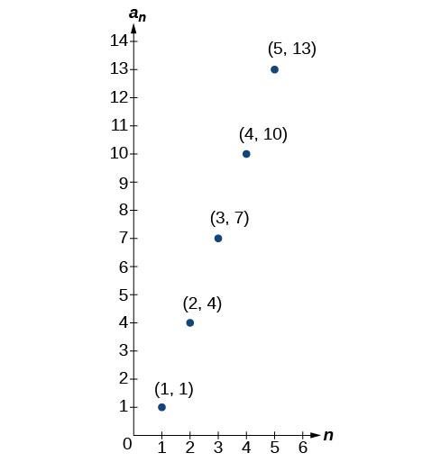

For the following exercises, follow the steps given above to work with the arithmetic sequence ${a}_{n}=\frac{1}{2}n+5$ using a graphing calculator.
64. What are the first seven terms shown in the column with the heading $u(n)$ in the TABLE feature?

65. Graph the sequence as it appears on the graphing calculator. Be sure to adjust the WINDOW settings as needed.

Solution

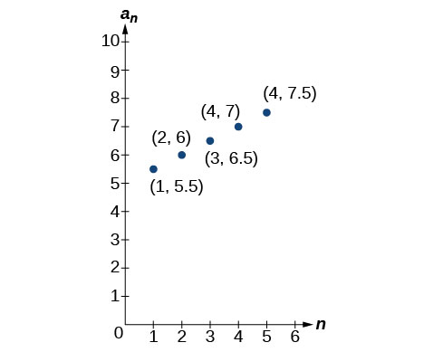

## Extensions
66. Give two examples of arithmetic sequences whose 4th terms are $9.$

67. Give two examples of arithmetic sequences whose 10th terms are $206.$

Solution

Answers will vary. Examples: ${a}_{n}=20.6n$ and ${a}_{n}=2+20.4\mathrm{n.}$

68. Find the 5th term of the arithmetic sequence $\{9b,5b,b,\dots \}.$

69. Find the 11th term of the arithmetic sequence $\{3a-2b,a+2b,-a+6b\dots \}.$

Solution

${a}_{11}=-17a+38b$

70. At which term does the sequence $\{5.4,14.5,23.6,\mathrm{...}\}$ exceed 151?

71. At which term does the sequence $\left\{\frac{17}{3},\frac{31}{6},\frac{14}{3},\mathrm{...}\right\}$ begin to have negative values?

Solution

The sequence begins to have negative values at the 13th term, ${a}_{13}=-\frac{1}{3}$

72. For which terms does the finite arithmetic sequence $\left\{\frac{5}{2},\frac{19}{8},\frac{9}{4},\mathrm{...},\frac{1}{8}\right\}$ have integer values?

73. Write an arithmetic sequence using a recursive formula. Show the first 4 terms, and then find the 31st term.

Solution

Answers will vary. Check to see that the sequence is arithmetic. Example: Recursive formula: ${a}_{1}=3,{a}_{n}={a}_{n-1}-3.$ First 4 terms: $\begin{array}{ll}3,0,-3,-6  & {a}_{31}=-87  \end{array}$

74. Write an arithmetic sequence using an explicit formula. Show the first 4 terms, and then find the 28th term.

**arithmetic sequence**
a sequence in which the difference between any two consecutive terms is a constant

**common difference**
the difference between any two consecutive terms in an arithmetic sequence
