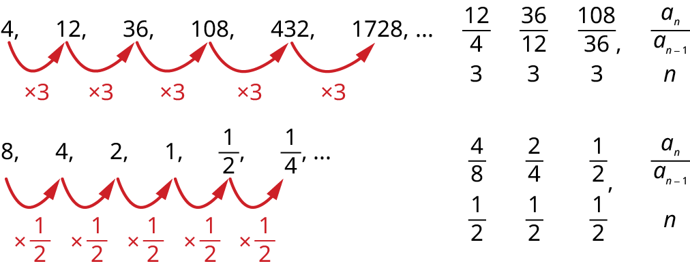
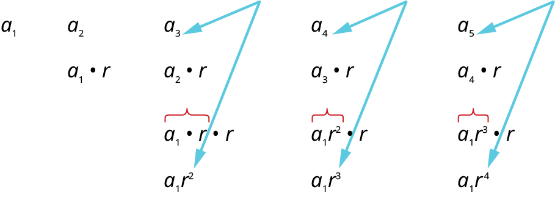
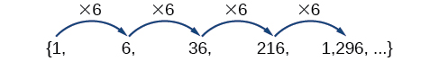
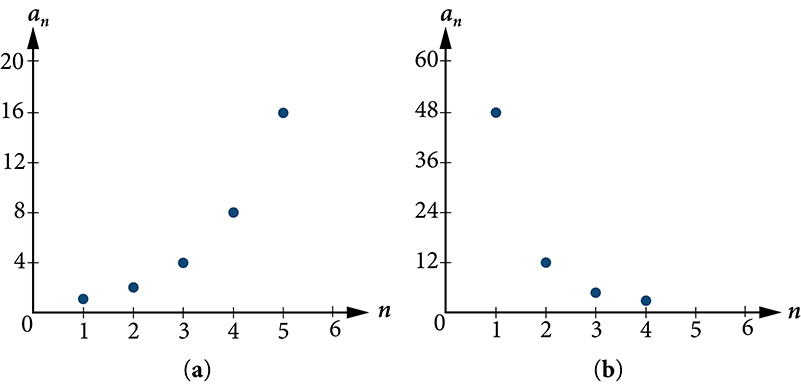
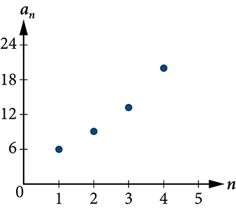
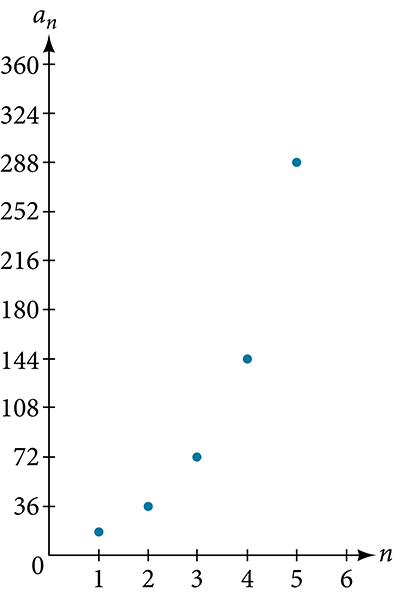
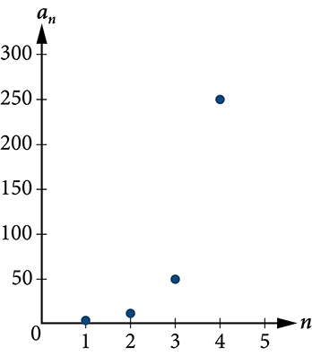
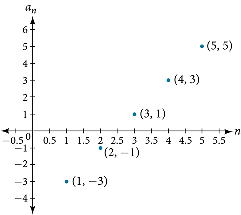
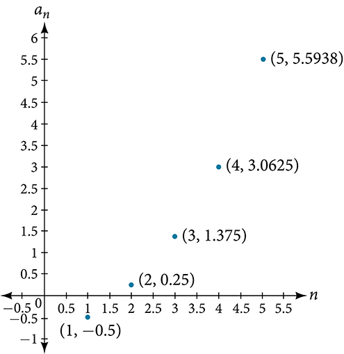
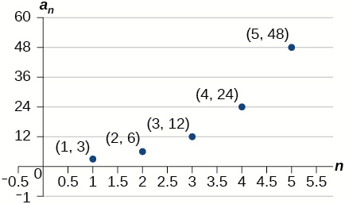

Geometric Sequences
===================

  m49446
  
Geometric Sequences
===================

  In this section, you will:

Find the common ratio for a geometric sequence.
List the terms of a geometric sequence.
Use a recursive formula for a geometric sequence.
Use an explicit formula for a geometric sequence.

  94ee3a01-1ca8-4d05-8e23-a5baba74e1a6

Learning Objectives
===================
Determine if a sequence is geometric (IA 12.3.1).
Find the general term (nth term) of a geometric sequence (IA 12.3.2).
Objective 1: Determine if a sequence is geometric (IA 12.3.1)
=============================================================
A sequence is called a **geometric sequence** if the ratio between consecutive terms is always the same.
The ratio between consecutive terms in a geometric sequence is *r*, the **common ratio**, where *n* is greater than or equal to two.
 $r=\frac{{a}_{n}}{{a}_{n-1}}$ 

Determine if each sequence is geometric. If so, indicate the common ratio.

ⓐ $4,8,16,32,64,128\text{,}\phantom{\rule{0.2em}{0ex}}\text{\u2026}$

ⓑ $\mathrm{-2},6,\mathrm{-12},36,\mathrm{-72},216\text{,}\phantom{\rule{0.2em}{0ex}}\text{\u2026}$

To determine if the sequence is geometric, we find the ratio of the consecutive terms shown.

ⓐ
 $\begin{array}{cccc}\begin{array}{}\\ \\ \\ \\ \text{Find the ratio of}\hfill \\ \text{the consecutive terms.}\hfill \end{array}\hfill & & & \phantom{\rule{7em}{0ex}}\begin{array}{ccccccccccc}\hfill 4,\hfill & & \hfill 8,\hfill & & \hfill 16,\hfill & & \hfill 32,\hfill & & \hfill 64,\hfill & & \hfill 128,\text{\u2026}\hfill \\ \\ \\ \hfill \frac{8}{4}\hfill & & \hfill \frac{16}{8}\hfill & & \hfill \frac{32}{16}\hfill & & \hfill \frac{64}{32}\hfill & & \hfill \frac{128}{64}\hfill & & \\ \hfill 2\hfill & & \hfill 2\hfill & & \hfill 2\hfill & & \hfill 2\hfill & & \hfill 2\hfill & & \end{array}\hfill \\ \\ \\ & & & \phantom{\rule{3em}{0ex}}\text{The sequence is geometric. The common ratio is}\phantom{\rule{0.2em}{0ex}}r=2.\hfill \end{array}$

ⓑ
 $\begin{array}{cccc}\begin{array}{}\\ \\ \\ \\ \text{Find the ratio of}\hfill \\ \text{the consecutive terms.}\hfill \end{array}\hfill & & & \phantom{\rule{7em}{0ex}}\begin{array}{ccccccccccc}\hfill \mathrm{-2},\hfill & & \hfill 6,\hfill & & \hfill \mathrm{-12},\hfill & & \hfill 36,\hfill & & \hfill \mathrm{-72},\hfill & & \hfill 216,\text{\u2026}\hfill \\ \\ \\ \hfill \frac{6}{\mathrm{-2}}\hfill & & \hfill \frac{\mathrm{-12}}{6}\hfill & & \hfill \frac{36}{\mathrm{-12}}\hfill & & \hfill \frac{\mathrm{-72}}{36}\hfill & & \hfill \frac{216}{\mathrm{-72}}\hfill \\ \hfill \mathrm{-3}\hfill & & \hfill \mathrm{-2}\hfill & & \hfill \mathrm{-3}\hfill & & \hfill \mathrm{-2}\hfill & & \hfill \mathrm{-3}\hfill & & \end{array}\hfill \\ \\ \\ & & & \phantom{\rule{3em}{0ex}}\text{The sequence is not geometric. There is no common ratio.}\hfill \end{array}$

Practice Makes Perfect
======================
Determine if each sequence is geometric. If so, indicate the common ratio.

  $\mathrm{-150}$, $\mathrm{-30}$, $\mathrm{-15}$, $\mathrm{-5}$, $\u2013\frac{5}{2}$, …

Find the ratio of consecutive terms.

  8, 4, 2, 1, $\frac{1}{2}$, $\frac{1}{4}$, …

Find the ratio of consecutive terms.

Write the first five terms of the sequence where the first term is 3 and the common ratio is $r=\mathrm{-2}.$

We start with the first term and multiply it by the common ratio. Then we multiply that result by the common ratio to get the next term, and so on.

 $\begin{array}{ccccccccccccc}\hfill {a}_{1}\hfill & & & \hfill {a}_{2}\hfill & & & \hfill {a}_{3}\hfill & & & \hfill {a}_{4}\hfill & & & \hfill {a}_{5}\hfill \\ \hfill 3\hfill & & & \hfill 3\xb7\left(\mathrm{-2}\right)\hfill & & & \hfill \mathrm{-6}\xb7\left(\mathrm{-2}\right)\hfill & & & \hfill 12\xb7\left(\mathrm{-2}\right)\hfill & & & \hfill \mathrm{-24}\xb7\left(\mathrm{-2}\right)\hfill \\ & & & \hfill \mathrm{-6}\hfill & & & \hfill 12\hfill & & & \hfill \mathrm{-24}\hfill & & & \hfill 48\hfill \end{array}$ 
The sequence is $3,\mathrm{-6},12,\mathrm{-24},48\text{,}\phantom{\rule{0.2em}{0ex}}\text{\u2026}$

Practice Makes Perfect
======================
Write the first five terms of the sequence where the first term is 7 and the common ratio is $r=-3$ .

    
    
    
    
    

  
     ${a}_{1}$ 
     ${a}_{2}$ 
     ${a}_{3}$ 
     ${a}_{4}$ 
     ${a}_{5}$ 
  
  
    7
    
    
    
    
  
  
    The sequence is: ________________________________________

  

Objective 2: Find the general term (nth term) of a geometric sequence (IA 12.3.2)
=================================================================================
Let’s find the formula for the general term of a geometric sequence.
Let’s write the first few terms of the sequence where the first term is ${a}_{1}$ and the common ratio is $r$ . We will then look for a pattern.

General term (nth term) of a geometric sequence
===============================================
The general term of a geometric sequence with first term ${a}_{1}$ and the common ratio $r$ is ${a}_{n}={a}_{1}r{}^{n-1}$

Find the general term (nth term) of a geometric sequence.
=========================================================

ⓐ Find the thirteenth term of a sequence where the first term is 81 and the common ratio is r=1/3.
ⓑ Find the ninth term of the sequence 6, 18, 54, 162, 486, 1458, … Then find the general term for the sequence.

ⓐ 
Find the thirteenth term of a sequence where the first term is 81 and the common ratio is r=1/3.

  
    To find the 13th term, use the formula with ${a}_{1}=81,\ r=1/3\ and\ n=13$ 
     ${a}_{n}={a}_{1}{r}^{n-1}$ 
  
  
    Substitute
     ${a}_{13}=81{\left(\frac{1}{3}\right)}^{13-1}$ 
  
  
    Simplify
     $\begin{array}{c}{a}_{13}=81{\left(\frac{1}{3}\right)}^{13-1}\\ {a}_{13}=81{\left(\frac{1}{3}\right)}^{12}\\ {a}_{13}=\frac{1}{729}\end{array}$ 
  

ⓑ 
Find the ninth term of the sequence 6, 18, 54, 162, 486, 1458, … Then find the general term for the sequence.

  
    Let’s first determine ${a}_{1}$ and the common ratio $r$ 
     $\begin{array}{c}\mathrm{The}\ \mathrm{first}\ \mathrm{term}\ \mathrm{is}\ 6,\ \mathrm{so}\ \ {\mathrm{a}}_{1}=6\\ \mathrm{The}\ \mathrm{ratio}\ \mathrm{is}:\ \frac{18}{6}=\frac{54}{18}=\frac{162}{54}=\frac{482}{162}=\frac{1458}{486}=3\end{array}$ 
  
  
    To find the 9th term, use the formula with ${a}_{1}=6,\ r=3$ and n=9.Substitute these values and simplify
     $\begin{array}{c}{a}_{n}={a}_{1}{r}^{n-1}\\ {a}_{9}=6{\left(3\right)}^{9-1}\\ {a}_{9}=6{\left(3\right)}^{8}\\ {a}_{9}=39366\end{array}$ 
  
  
    To find the general term, substitute ${a}_{1}=6$ and $r=3$
into the formula

     $\begin{array}{c}{a}_{n}={a}_{1}{r}^{n-1}\\ {a}_{n}=6{\left(3\right)}^{n-1}\end{array}$ 
  

Practice Makes Perfect
======================
Find the general term (nth term) of a geometric sequence.

  Find the sixteenth term of a sequence where the first term is 11 and the common ratio is −6.

  Find the 10th term of the sequence 9, 18, 36, 72, 144, 288, …. Then give the formula for the general term.

Find the general term (nth term) of a geometric sequence.
A patient takes a 30 mg antibiotic capsule. At the end of any hour, the amount of antibiotic remaining in her body is only 90% of the amount in the beginning of that hour. The table below shows the amount of medicine remaining in the body at the beginning of each hour.

  
    Time *t*
    Dose remaining after time *t*
  
  
    1
    30mg
  
  
    2
    27mg
  
  
    3
    24.3mg
  
  
    4
    21.87mg
  
  
    5
    19.68mg
  

ⓐ Find the ratio of consecutive terms. Is this a geometric sequence?
ⓑ Find a formula for the general term of this sequence.
ⓒ How much of the medicine is left at the beginning of hour 7? Hour 12? Hour 24? 
Many jobs offer an annual cost-of-living increase to keep salaries consistent with inflation. Suppose, for example, a recent college graduate finds a position as a sales manager earning an annual salary of $26,000. He is promised a 2% cost of living increase each year. His annual salary in any given year can be found by multiplying his salary from the previous year by 102%. His salary will be $26,520 after one year; $27,050.40 after two years; $27,591.41 after three years; and so on. When a salary increases by a constant rate each year, the salary grows by a constant factor. In this section, we will review sequences that grow in this way.

Finding Common Ratios
=====================
The yearly salary values described form a *geometric sequence* because they change by a constant factor each year. Each term of a geometric sequence increases or decreases by a constant factor called the *common ratio*. The sequence below is an example of a geometric sequence because each term increases by a constant factor of 6. Multiplying any term of the sequence by the common ratio 6 generates the subsequent term.

Definition of a Geometric Sequence
==================================

A **geometric sequence** is one in which any term divided by the previous term is a constant. This constant is called the **common ratio** of the sequence. The common ratio can be found by dividing any term in the sequence by the previous term. If ${a}_{1}$ is the initial term of a geometric sequence and $r$ is the common ratio, the sequence will be

 $$
\{{a}_{1},\ \phantom{\rule{0.5em}{0ex}}{a}_{1}r,\phantom{\rule{0.5em}{0ex}}{a}_{1}{r}^{2},\phantom{\rule{0.5em}{0ex}}{a}_{1}{r}^{3},\phantom{\rule{0.5em}{0ex}}\mathrm{...}\}.
$$

How To
*Given a set of numbers, determine if they represent a geometric sequence.*

Divide each term by the previous term.
Compare the quotients. If they are the same, a common ratio exists and the sequence is geometric.

Finding Common Ratios
=====================

Is the sequence geometric? If so, find the common ratio.

ⓐ $1\text{,}\phantom{\rule{0.5em}{0ex}}2\text{,}\phantom{\rule{0.5em}{0ex}}4\text{,}\phantom{\rule{0.5em}{0ex}}8\text{,}\phantom{\rule{0.5em}{0ex}}16\text{,}\phantom{\rule{0.5em}{0ex}}\mathrm{...}$

ⓑ $48\text{,}\phantom{\rule{0.5em}{0ex}}12\text{,}\phantom{\rule{0.5em}{0ex}}4\text{,\}2\text{,}\phantom{\rule{0.5em}{0ex}}\mathrm{...}$

Divide each term by the previous term to determine whether a common ratio exists.

ⓐ $\begin{array}{llllllllll}\frac{2}{1}=2\hfill & \hfill & \hfill & \frac{4}{2}=2\hfill & \hfill & \hfill & \frac{8}{4}=2\hfill & \hfill & \hfill & \frac{16}{8}=2\hfill \end{array}$

The sequence is geometric because there is a common ratio. The common ratio is 2.

ⓑ $\begin{array}{lllllll}\frac{12}{48}=\frac{1}{4}\hfill & \hfill & \hfill & \frac{4}{12}=\frac{1}{3}\hfill & \hfill & \hfill & \frac{2}{4}=\frac{1}{2}\hfill \end{array}$

The sequence is not geometric because there is not a common ratio.

Analysis
========

The graph of each sequence is shown in . It seems from the graphs that both (a) and (b) appear have the form of the graph of an exponential function in this viewing window. However, we know that (a) is geometric and so this interpretation holds, but (b) is not.
\n\n\n\n

Q&A
*If you are told that a sequence is geometric, do you have to divide every term by the previous term to find the common ratio?*

*No. If you know that the sequence is geometric, you can choose any one term in the sequence and divide it by the previous term to find the common ratio.*

Try It

Is the sequence geometric? If so, find the common ratio.

 $$
5,10,15,20,\mathrm{...}
$$

The sequence is not geometric because $\frac{10}{5}\ne \frac{15}{10}$ .

Try It

Is the sequence geometric? If so, find the common ratio.

 $$
100,20,4,\frac{4}{5},\mathrm{...}
$$

The sequence is geometric. The common ratio is $\frac{1}{5}$ .

Writing Terms of Geometric Sequences
====================================
Now that we can identify a geometric sequence, we will learn how to find the terms of a geometric sequence if we are given the first term and the common ratio. The terms of a geometric sequence can be found by beginning with the first term and multiplying by the common ratio repeatedly. For instance, if the first term of a geometric sequence is ${a}_{1}=-2$ and the common ratio is $r=\mathrm{4,}$ we can find subsequent terms by multiplying $-2\cdot 4$ to get $-8$ then multiplying the result $-8\cdot 4$ to get $-32$ and so on.

 $$
\begin{array}{l}{a}_{1}=-2\hfill \\ {a}_{2}=(-2\cdot 4)=-8\hfill \\ {a}_{3}=(-8\cdot 4)=-32\hfill \\ {a}_{4}=(-32\cdot 4)=-128\hfill \end{array}
$$

The first four terms are $\left\{\mathrm{\u20132}\text{,\}\mathrm{\u20138}\text{,\}\mathrm{\u201332}\text{,\}\mathrm{\u2013128}\right\}.$

How To
*Given the first term and the common factor, find the first four terms of a geometric sequence.*

Multiply the initial term, ${a}_{1},$ by the common ratio to find the next term, ${a}_{2}.$ 
Repeat the process, using ${a}_{n}={a}_{2}$ to find ${a}_{3}$ and then ${a}_{3}$ to find ${a}_{\mathrm{4,}}$ until all four terms have been identified.
Write the terms separated by commons within brackets.

Writing the Terms of a Geometric Sequence
=========================================

List the first four terms of the geometric sequence with ${a}_{1}=5$ and $r=\mathrm{\u20132.}$

Multiply ${a}_{1}$ by $-2$ to find ${a}_{2}.$ Repeat the process, using ${a}_{2}$ to find ${a}_{3},$
 and so on.

 $$
\begin{array}{l}{a}_{1}=5\hfill \\ {a}_{2}=-2{a}_{1}=-10\hfill \\ {a}_{3}=-2{a}_{2}=20\hfill \\ {a}_{4}=-2{a}_{3}=-40\hfill \end{array}
$$

The first four terms are $\left\{5,\mathrm{\u201310},20,\mathrm{\u201340}\right\}.$

Try It

List the first five terms of the geometric sequence with ${a}_{1}=18$ and $r=\frac{1}{3}.$

$\left\{18,6,2,\frac{2}{3},\frac{2}{9}\right\}$

Using Recursive Formulas for Geometric Sequences
================================================
A **recursive formula** allows us to find any term of a geometric sequence by using the previous term. Each term is the product of the common ratio and the previous term. For example, suppose the common ratio is 9. Then each term is nine times the previous term. As with any recursive formula, the initial term must be given.

Recursive Formula for a Geometric Sequence
==========================================

The recursive formula for a geometric sequence with common ratio $r$ and first term ${a}_{1}$ is

 $$
{a}_{n}=r{a}_{n-1},n\ge 2
$$ 
 

How To
*Given the first several terms of a geometric sequence, write its recursive formula.*

State the initial term.
Find the common ratio by dividing any term by the preceding term.
Substitute the common ratio into the recursive formula for a geometric sequence.

Using Recursive Formulas for Geometric Sequences
================================================

Write a recursive formula for the following geometric sequence.

 $$
\left\{6\text{,\}9\text{,\}13.5\text{,\}20.25\text{,\}\mathrm{...}\right\}
$$

The first term is given as 6. The common ratio can be found by dividing the second term by the first term.

 $$
r=\frac{9}{6}=1.5
$$ 
Substitute the common ratio into the recursive formula for geometric sequences and define ${a}_{1}.$

 $$
\begin{array}{l}{a}_{n}=r{a}_{n-1}\\ {a}_{n}=1.5{a}_{n-1}\phantom{\rule{0.5em}{0ex}}\text{for\}n\ge 2\\ {a}_{1}=6\end{array}
$$ 

Analysis
========

The sequence of data points follows an exponential pattern. The common ratio is also the base of an exponential function as shown in
\n\n\n\n

*Do we have to divide the second term by the first term to find the common ratio?*

*No. We can divide any term in the sequence by the previous term. It is, however, most common to divide the second term by the first term because it is often the easiest method of finding the common ratio.*

Try It

Write a recursive formula for the following geometric sequence.

 $\left\{2\text{,\}\frac{4}{3}\text{,\}\frac{8}{9}\text{,\}\frac{16}{27}\text{,\}\mathrm{...}\right\}$

$\begin{array}{l}{a}_{1}=2\\ {a}_{n}=\frac{2}{3}{a}_{n-1}\phantom{\rule{0.5em}{0ex}}\text{for\}n\ge 2\end{array}$

Using Explicit Formulas for Geometric Sequences
===============================================
Because a geometric sequence is an exponential function whose domain is the set of positive integers, and the common ratio is the base of the function, we can write explicit formulas that allow us to find particular terms.

 $$
{a}_{n}={a}_{1}{r}^{n-1}
$$ Let’s take a look at the sequence $\left\{18\text{,\}36\text{,\}72\text{,\}144\text{,\}288\text{,\}\mathrm{...}\right\}.$ This is a geometric sequence with a common ratio of 2 and an exponential function with a base of 2. An explicit formula for this sequence is
 $$
{a}_{n}=18\xb7{2}^{n-1}
$$ The graph of the sequence is shown in .

\n\n\n\n

Explicit Formula for a Geometric Sequence
=========================================

The $n$ th term of a geometric sequence is given by the **explicit formula**:

 $$
{a}_{n}={a}_{1}{r}^{n-1}
$$ 

Writing Terms of Geometric Sequences Using the Explicit Formula
===============================================================

Given a geometric sequence with ${a}_{1}=3$ and ${a}_{4}=24,$ find ${a}_{2}.$

The sequence can be written in terms of the initial term and the common ratio $r.$

 $$
3,3r,3{r}^{2},3{r}^{3},\mathrm{...}
$$ 
Find the common ratio using the given fourth term.

 $$
\begin{array}{ll}{a}_{n}={a}_{1}{r}^{n-1}\hfill & \hfill \\ {a}_{4}=3{r}^{3}\hfill & \text{Write\ the\ fourth\ term\ of\ sequence\ in\ terms\ of\}{\alpha}_{1}\phantom{\rule{0.5em}{0ex}}\text{and\}r\hfill \\ 24=3{r}^{3}\hfill & \text{Substitute\}24\phantom{\rule{0.5em}{0ex}}\text{for}\phantom{\rule{0.5em}{0ex}}{a}_{4}\hfill \\ \phantom{\rule{0.5em}{0ex}}\phantom{\rule{0.5em}{0ex}}\phantom{\rule{0.5em}{0ex}}8={r}^{3}\hfill & \text{Divide}\hfill \\ \phantom{\rule{0.5em}{0ex}}\phantom{\rule{0.5em}{0ex}}\phantom{\rule{0.5em}{0ex}}r=2\hfill & \text{Solve\ for\ the\ common\ ratio}\hfill \end{array}
$$
Find the second term by multiplying the first term by the common ratio.

 $$
\begin{array}{ll}{a}_{2}\hfill & =2{a}_{1}\hfill \\ \hfill & =2(3)\hfill \\ \hfill & =6\hfill \end{array}
$$ 

Analysis
========

The common ratio is multiplied by the first term once to find the second term, twice to find the third term, three times to find the fourth term, and so on. The tenth term could be found by multiplying the first term by the common ratio nine times or by multiplying by the common ratio raised to the ninth power.

Try It

Given a geometric sequence with ${a}_{2}=4$ and ${a}_{3}=32$ , find ${a}_{6}.$

${a}_{6}=16,384$

Writing an Explicit Formula for the $n$ th Term of a Geometric Sequence
=======================================================================

Write an explicit formula for the $n\text{th}$ term of the following geometric sequence.

 $$
\left\{2\text{,\}10\text{,\}50\text{,\}250\text{,\}\mathrm{...}\right\}
$$

The first term is 2. The common ratio can be found by dividing the second term by the first term.

 $$
\frac{10}{2}=5
$$ 
The common ratio is 5. Substitute the common ratio and the first term of the sequence into the formula.

 $$
\begin{array}{l}{a}_{n}={a}_{1}{r}^{(n-1)}\hfill \\ {a}_{n}=2\cdot {5}^{n-1}\hfill \end{array}
$$
The graph of this sequence in  shows an exponential pattern.

\n\n\n\n

Try It

Write an explicit formula for the following geometric sequence.

 $$
\left\{\mathrm{\u20131}\text{,\}3\text{,\}\mathrm{\u20139}\text{,\}27\text{,\}\mathrm{...}\right\}
$$

${a}_{n}=-{(-3)}^{n-1}$

Solving Application Problems with Geometric Sequences
=====================================================
In real-world scenarios involving geometric sequences, we may need to use an initial term of ${a}_{0}$ instead of ${a}_{1}.$ In these problems, we can alter the explicit formula slightly by using the following formula:
 $$
{a}_{n}={a}_{0}{r}^{n}
$$ 

Solving Application Problems with Geometric Sequences
=====================================================

In 2013, the number of students in a small school is 284. It is estimated that the student population will increase by 4% each year.

ⓐWrite a formula for the student population.
ⓑEstimate the student population in 2020.

ⓐ
The situation can be modeled by a geometric sequence with an initial term of 284. The student population will be 104% of the prior year, so the common ratio is 1.04.

Let $P$ be the student population and $n$ be the number of years after 2013. Using the explicit formula for a geometric sequence we get
 $$
{P}_{n}\ =284\cdot {1.04}^{n}
$$

ⓑ
We can find the number of years since 2013 by subtracting.

 $$
2020-2013=7
$$ 
We are looking for the population after 7 years. We can substitute 7 for $n$ to estimate the population in 2020.

 $$
{P}_{7}=284\cdot {1.04}^{7}\approx 374
$$
The student population will be about 374 in 2020.

Try It

A business starts a new website. Initially the number of hits is 293 due to the curiosity factor. The business estimates the number of hits will increase by 2.6% per week.

ⓐWrite a formula for the number of hits.
ⓑEstimate the number of hits in 5 weeks.

ⓐ ${P}_{n}\ =\ 293\cdot 1.026{a}^{n}$

ⓑThe number of hits will be about 333.

Media
Access these online resources for additional instruction and practice with geometric sequences.

Geometric Sequences
Determine the Type of Sequence
Find the Formula for a Sequence

Key Equations
=============

recursive formula for $nth$ term of a geometric sequence
 ${a}_{n}=r{a}_{n-1},n\ge 2$

explicit formula for $nth$ term of a geometric sequence
 ${a}_{n}={a}_{1}{r}^{n-1}$

Key Concepts
============

A geometric sequence is a sequence in which the ratio between any two consecutive terms is a constant.
The constant ratio between two consecutive terms is called the common ratio.
The common ratio can be found by dividing any term in the sequence by the previous term. See .
The terms of a geometric sequence can be found by beginning with the first term and multiplying by the common ratio repeatedly. See  and .
A recursive formula for a geometric sequence with common ratio $r$ is given by ${a}_{n}=r{a}_{n\u20131}$ for $n\ge 2$ .
As with any recursive formula, the initial term of the sequence must be given. See .
An explicit formula for a geometric sequence with common ratio $r$ is given by ${a}_{n}={a}_{1}{r}^{n\u20131}.$ See .
In application problems, we sometimes alter the explicit formula slightly to ${a}_{n}={a}_{0}{r}^{n}.$ See .

Section Exercises
=================

Verbal
======

What is a geometric sequence?

A sequence in which the ratio between any two consecutive terms is constant.

How is the common ratio of a geometric sequence found?

What is the procedure for determining whether a sequence is geometric?

Divide each term in a sequence by the preceding term. If the resulting quotients are equal, then the sequence is geometric.

What is the difference between an arithmetic sequence and a geometric sequence?

Describe how exponential functions and geometric sequences are similar. How are they different?

Both geometric sequences and exponential functions have a constant ratio. However, their domains are not the same. Exponential functions are defined for all real numbers, and geometric sequences are defined only for positive integers. Another difference is that the base of a geometric sequence (the common ratio) can be negative, but the base of an exponential function must be positive.

Algebraic
=========

For the following exercises, find the common ratio for the geometric sequence.

$1,3,9,27,81,\mathrm{...}$

$-0.125,0.25,-0.5,1,-2,\mathrm{...}$

The common ratio is $-2$

$-2,-\frac{1}{2},-\frac{1}{8},-\frac{1}{32},-\frac{1}{128},\mathrm{...}$

For the following exercises, determine whether the sequence is geometric. If so, find the common ratio.

$-6,-12,-24,-48,-96,\mathrm{...}$

The sequence is geometric. The common ratio is 2.

$5,5.2,5.4,5.6,5.8,\mathrm{...}$

$-1,\frac{1}{2},-\frac{1}{4},\frac{1}{8},-\frac{1}{16},\mathrm{...}$

The sequence is geometric. The common ratio is $-\frac{1}{2}.$

$6,8,11,15,20,\mathrm{...}$

$0.8,4,20,100,500,\mathrm{...}$

The sequence is geometric. The common ratio is $5.$

For the following exercises, write the first five terms of the geometric sequence, given the first term and common ratio.

$\begin{array}{cc}{a}_{1}=8,& r=0.3\end{array}$

$\begin{array}{cc}{a}_{1}=5,& r=\frac{1}{5}\end{array}$

$5,1,\frac{1}{5},\frac{1}{25},\frac{1}{125}$

For the following exercises, write the first five terms of the geometric sequence, given any two terms.

$\begin{array}{cc}{a}_{7}=64,& {a}_{10}\end{array}=512$

$\begin{array}{cc}{a}_{6}=25,& {a}_{8}\end{array}=6.25$

$800,400,200,100,50$

For the following exercises, find the specified term for the geometric sequence, given the first term and common ratio.

The first term is $\mathrm{2,}$ and the common ratio is $3.$ Find the 5th term.

The first term is 16 and the common ratio is $-\frac{1}{3}.$ Find the 4th term.

${a}_{4}=-\frac{16}{27}$

For the following exercises, find the specified term for the geometric sequence, given the first four terms.

${a}_{n}=\left\{-1,2,-4,8,\mathrm{...}\right\}.$ Find ${a}_{12}.$

${a}_{n}=\left\{-2,\frac{2}{3},-\frac{2}{9},\frac{2}{27},\mathrm{...}\right\}.$ Find ${a}_{7}.$

${a}_{7}=-\frac{2}{729}$

For the following exercises, write the first five terms of the geometric sequence.

$\begin{array}{cc}{a}_{1}=-486,& {a}_{n}=-\frac{1}{3}\end{array}{a}_{n-1}$

$\begin{array}{cc}{a}_{1}=7,& {a}_{n}=0.2{a}_{n-1}\end{array}$

$7,1.4,0.28,0.056,0.0112$

For the following exercises, write a recursive formula for each geometric sequence.

${a}_{n}=\left\{-1,5,-25,125,\mathrm{...}\right\}$

${a}_{n}=\left\{-32,-16,-8,-4,\mathrm{...}\right\}$

$\begin{array}{cc}a{}_{1}=-32,& {a}_{n}=\frac{1}{2}{a}_{n-1}\end{array}$

${a}_{n}=\left\{14,56,224,896,\mathrm{...}\right\}$

${a}_{n}=\left\{10,-3,0.9,-0.27,\mathrm{...}\right\}$

$\begin{array}{cc}{a}_{1}=10,& {a}_{n}=-0.3{a}_{n-1}\end{array}$

${a}_{n}=\left\{0.61,1.83,5.49,16.47,\mathrm{...}\right\}$

${a}_{n}=\left\{\frac{3}{5},\frac{1}{10},\frac{1}{60},\frac{1}{360},\mathrm{...}\right\}$

$\begin{array}{cc}{a}_{1}=\frac{3}{5},& {a}_{n}=\frac{1}{6}{a}_{n-1}\end{array}$

${a}_{n}=\left\{-2,\frac{4}{3},-\frac{8}{9},\frac{16}{27},\mathrm{...}\right\}$

${a}_{n}=\left\{\frac{1}{512},-\frac{1}{128},\frac{1}{32},-\frac{1}{8},\mathrm{...}\right\}$

${a}_{1}=\frac{1}{512},{a}_{n}=-4{a}_{n-1}$

For the following exercises, write the first five terms of the geometric sequence.

${a}_{n}=-4\cdot {5}^{n-1}$

${a}_{n}=12\cdot {\left(-\frac{1}{2}\right)}^{n-1}$

$12,-6,3,-\frac{3}{2},\frac{3}{4}$

For the following exercises, write an explicit formula for each geometric sequence.

${a}_{n}=\left\{-2,-4,-8,-16,\mathrm{...}\right\}$

${a}_{n}=\left\{1,3,9,27,\mathrm{...}\right\}$

${a}_{n}={3}^{n-1}$

${a}_{n}=\left\{-4,-12,-36,-108,\mathrm{...}\right\}$

${a}_{n}=\left\{0.8,-4,20,-100,\mathrm{...}\right\}$

${a}_{n}=0.8\cdot {(-5)}^{n-1}$

${a}_{n}=\{-1.25,-5,-20,-80,\mathrm{...}\}$

${a}_{n}=\left\{-1,-\frac{4}{5},-\frac{16}{25},-\frac{64}{125},\mathrm{...}\right\}$

${a}_{n}=-{\left(\frac{4}{5}\right)}^{n-1}$

${a}_{n}=\left\{2,\frac{1}{3},\frac{1}{18},\frac{1}{108},\mathrm{...}\right\}$

${a}_{n}=\left\{3,-1,\frac{1}{3},-\frac{1}{9},\mathrm{...}\right\}$

${a}_{n}=3\cdot {\left(-\frac{1}{3}\right)}^{n-1}$

For the following exercises, find the specified term for the geometric sequence given.

Let ${a}_{1}=4,$ ${a}_{n}=-3{a}_{n-1}.$ Find ${a}_{8}.$

Let ${a}_{n}=-{\left(-\frac{1}{3}\right)}^{n-1}.$ Find ${a}_{12}.$

${a}_{12}=\frac{1}{177,147}$

For the following exercises, find the number of terms in the given finite geometric sequence.

${a}_{n}=\left\{-1,3,-9,\mathrm{...},2187\right\}$

${a}_{n}=\left\{2,1,\frac{1}{2},\mathrm{...},\frac{1}{1024}\right\}$

There are $12$ terms in the sequence.

Graphical
=========
For the following exercises, determine whether the graph shown represents a geometric sequence.

The graph does not represent a geometric sequence.

For the following exercises, use the information provided to graph the first five terms of the geometric sequence.

$\begin{array}{cc}{a}_{1}=1,& r=\frac{1}{2}\end{array}$

$\begin{array}{cc}{a}_{1}=3,& {a}_{n}=2{a}_{n-1}\end{array}$

${a}_{n}=27\cdot {0.3}^{n-1}$

Extensions
==========

Use recursive formulas to give two examples of geometric sequences whose 3rd terms are $200.$

Answers will vary. Examples: ${\begin{array}{cc}{a}_{1}=800,& {a}_{n}=0.5a\end{array}}_{n-1}$ and ${\begin{array}{cc}{a}_{1}=12.5,& {a}_{n}=4a\end{array}}_{n-1}$

Use explicit formulas to give two examples of geometric sequences whose 7th terms are $1024.$

Find the 5th term of the geometric sequence $\{b,4b,16b,\mathrm{...}\}.$

${a}_{5}=256b$

Find the 7th term of the geometric sequence $\{64a(-b),32a(-3b),16a(-9b),\mathrm{...}\}.$

At which term does the sequence $\{10,12,14.4,17.28,\phantom{\rule{0.5em}{0ex}}\text{}\mathrm{...}\}$ exceed $100?$

The sequence exceeds $100$ at the 14th term, ${a}_{14}\approx 107.$

At which term does the sequence $\left\{\frac{1}{2187},\frac{1}{729},\frac{1}{243},\frac{1}{81}\phantom{\rule{0.5em}{0ex}}\text{}\mathrm{...}\right\}$ begin to have integer values?

For which term does the geometric sequence ${a}_{{}_{\mathrm{n}}}=-36{\left(\frac{2}{3}\right)}^{n-1}$ first have a non-integer value?

${a}_{4}=-\frac{32}{3}$ is the first non-integer value

Use the recursive formula to write a geometric sequence whose common ratio is an integer. Show the first four terms, and then find the 10th term.

Use the explicit formula to write a geometric sequence whose common ratio is a decimal number between 0 and 1. Show the first 4 terms, and then find the 8th term.

Answers will vary. Example: Explicit formula with a decimal common ratio: ${a}_{n}=400\cdot {0.5}^{n-1};$ First 4 terms: $\begin{array}{cc}400,200,100,50;& {a}_{8}=3.125\end{array}$

Is it possible for a sequence to be both arithmetic and geometric? If so, give an example.

**common ratio**
the ratio between any two consecutive terms in a geometric sequence

**geometric sequence**
a sequence in which the ratio of a term to a previous term is a constant
