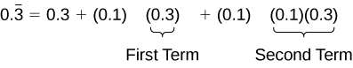
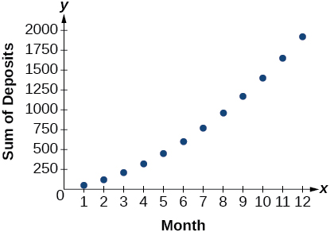

**Series and Their Notations**

  m49447
  

**Series and Their Notations**

  In this section, you will:

Use summation notation.
Use the formula for the sum of the first n terms of an arithmetic series.
Use the formula for the sum of the first n terms of a geometric series.
Use the formula for the sum of an infinite geometric series.
Solve annuity problems.

  06d76408-a317-4dcb-9bcc-26ab2bb71ba6

## Learning Objectives
Use summation notation to write a sum. (IA 12.1.5)
Find the sum of the first n terms of an arithmetic sequence. (IA 12.2.3)

## Objective 1: Use summation notation to write a sum. (IA 12.1.5)
A **series** is the sum of the terms of a sequence. For example,  1 + 6 + 11+ 16 + 21 + 26 + 31 is the sum of the first seven terms arithmetic sequence with general term, ${a}_{n}=5n-4.$ 
We write a series by using the **summation notation**. In order to write that summation, we will need to find the general term of our sequence and the summation will look like:

For the series, 1 + 6 + 11 + 16  + 21 + 26 + 31 + .... the summation notation is $\sum _{n=1}^{7}5n-4$ 

Use summation notation to write the sum.

1. Write the sum using summation notation: $1+\frac{1}{2}+\frac{1}{3}+\frac{1}{4}+\frac{1}{5}$

Solution

|  | $\begin{array}{cccccc}n:& 1,& 2,& 3,& 4,& 5\end{array}$ |
| :--- | :--- |
| Look for a pattern in the terms. | Terms: $\begin{array}{cccccc}& 1,& \frac{1}{2},& \frac{1}{3},& \frac{1}{4},& \frac{1}{5}\end{array}$ |
| The numerators are all one. The denominators are the counting numbers from 1 thru 5. | Pattern: $\begin{array}{cccccc}& 1,& \frac{1}{2},& \frac{1}{3},& \frac{1}{4},& \frac{1}{5}\end{array}$ |
| The general terms is: | $\frac{1}{n}$ |
| The sum in summation notation is: | $\sum _{n=1}^{5}\frac{1}{n}$ |

### Practice Makes Perfect

Use summation notation to write the sum.

2. Write the sum using summation notation: $1+\frac{1}{4}+\frac{1}{9}+\frac{1}{16}+\frac{1}{25}+\frac{1}{36}$

3. Write the sum using summation notation: $\frac{1}{3}+\frac{1}{9}+\frac{1}{27}+\frac{1}{81}+\frac{1}{243}$

## Objective 2: Find the sum of the first n terms of an arithmetic sequence. (IA 12.2.3)

>
>
> **Sum of the First *n* Terms of an Arithmetic Sequence**
>
> The sum, ${S}_{n},$ of the first *n* terms of an arithmetic sequence is
>
>  ${S}_{n}=\frac{n}{2}({a}_{1}+{a}_{n})$ 
> where ${a}_{1}$ is the first term and ${a}_{n}$ is the *n*th term.
>

Find the sum of the first n terms of an arithmetic sequence.

4. ⓐ Find the sum of the first 30 terms of the arithmetic sequence: 7, 10, 13, 13, 19,... ⓑ Find the sum of the first 50 terms of the arithmetic sequence whose general term is ${a}_{n}=2n-5$ . ⓒ Find the sum   $\sum _{i=1}^{30}(6i-4)$

Solution

ⓐ
  To find the sum of the 30 first terms, we use the formula ${S}_{n}=\frac{n}{2}({a}_{1}+{a}_{n})$.

We know that ${a}_{1}=7,\ d=3\ ,\ and\ n=30\$ but we need to find ${a}_{30}$ .

| To find the 30th term, use the formula ${a}_{1}=7,\ d=3\ and\ n=30$ . | ${a}_{n}={a}_{1}+(n-1)d$ |
| :--- | :--- |
| Substitute | ${a}_{30}=7+(30-1)\left(3\right)$ |
| Simplify | $\begin{array}{c}{a}_{30}=7+\left(29\right)\left(8\right)\\ {a}_{30}=7+232\\ {a}_{30}=239\end{array}$ |
| To find ${S}_{30}$ use the formula with ${a}_{1}=7,\ {a}_{30}=239\ and\ n=30.$ | ${S}_{n}=\frac{n}{2}({a}_{1}+{a}_{n})$ |
| Substitute and simplify | $\begin{array}{c}{S}_{30}=\frac{30}{2}(7+239)\\ {S}_{30}=15\left(246\right)\\ {S}_{30}=3690\end{array}$ |

ⓑ
To the sum of the first 50 terms of the arithmetic sequence whose general term is ${a}_{n}=2n-5$ . We need to find ${\mathrm{a}}_{1}\ \mathrm{and}\ {\mathrm{a}}_{50}$ and substitute in the formula.

| Find ${\mathrm{a}}_{1}$ | $\begin{array}{c}{a}_{n}=2n-5\\ {a}_{1}=2\left(1\right)-5\\ {a}_{1}=-3\end{array}$ |
| :--- | :--- |
| Find ${\mathrm{a}}_{50}$ | $\begin{array}{c}{a}_{n}=2n-5\\ {a}_{50}=2\left(50\right)-5\\ {a}_{50}=95\end{array}$ |
| Then find ${\mathrm{S}}_{50}$ , use the formula with ${\mathrm{a}}_{1}=-3,\ {\mathrm{a}}_{50}=95\ \mathrm{and}\ \mathrm{n}=50.$ | ${S}_{n}=\frac{n}{2}({a}_{1}+{a}_{n})$ |
| Substitute and simplify | $\begin{array}{c}{S}_{50}=\frac{50}{2}(-3+95)\\ {S}_{50}=25\left(92\right)\end{array}$ |
|  | ${S}_{50}=2300$ |

ⓒ
 $\sum _{i=1}^{30}(6i-4)$ means find the sum of the first 30 terms of the sequence whose general term is $6i-4$ . We need to find ${\mathrm{a}}_{1}\ \mathrm{and}\ {\mathrm{a}}_{30}$ and substitute in the formula.

| Find ${\mathrm{a}}_{1}$ | $\begin{array}{c}{a}_{i}=6i-4\\ {a}_{1}=6\left(1\right)-4\\ {a}_{1}=2\end{array}$ |
| :--- | :--- |
| Find ${\mathrm{a}}_{30}$ | $\begin{array}{c}{a}_{i}=6i-4\\ {a}_{30}=6\left(30\right)-4\\ {a}_{30}=176\end{array}$ |
| Then find ${S}_{30}$ , use the formula with ${a}_{1}=2,\ {a}_{30}=176\ and\ n=30.$ | ${S}_{n}=\frac{n}{2}({a}_{1}+{a}_{n})$ |
| Substitute and simplify | $\begin{array}{c}{S}_{30}=\frac{30}{2}(2+176)\\ {S}_{30}=15\left(178\right)\\ {S}_{30}=2630\end{array}$ |

### Practice Makes Perfect
5. Find the sum of the first 30 terms of the arithmetic sequence: 16, 10, 4, –2, –8, ………

6. Find the sum of the first 50 terms of the arithmetic sequence whose general term is ${a}_{n}=2n+7$ .

7. Find the sum: $\sum _{i=1}^{30}(7i-5)$

A parent decides to start a college fund for their daughter. They plan to invest $50 in the fund each month. The fund pays 6% annual interest, compounded monthly. How much money will they have saved when their daughter is ready to start college in 6 years? In this section, we will learn how to answer this question. To do so, we need to consider the amount of money invested and the amount of interest earned.

# Using Summation Notation
To find the total amount of money in the college fund and the sum of the amounts deposited, we need to add the amounts deposited each month and the amounts earned monthly. The sum of the terms of a sequence is called a **series**. Consider, for example, the following series.
 $$
3+7+11+15+19+\mathrm{...}
$$ The ***n*th partial sum** of a series is the sum of a finite number of consecutive terms beginning with the first term. The notation ${S}_{n}$ represents the partial sum.
 $$
\begin{array}{l}{S}_{1}=3\\ {S}_{2}=3+7=10\\ {S}_{3}=3+7+11=21\\ {S}_{4}=3+7+11+15=36\end{array}
$$ *Summation notation*is used to represent series. Summation notation is often known as sigma notation because it uses the Greek capital letter **sigma**, $\text{\Sigma},$ to represent the sum. Summation notation includes an explicit formula and specifies the first and last terms in the series. An explicit formula for each term of the series is given to the right of the sigma. A variable called the *index of summation*is written below the sigma. The index of summation is set equal to the *lower limit of summation*, which is the number used to generate the first term in the series. The number above the sigma, called the *upper limit of summation*, is the number used to generate the last term in a series.

If we interpret the given notation, we see that it asks us to find the sum of the terms in the series ${a}_{k}=2k$ for $k=1$ through $k=5.$ We can begin by substituting the terms for $k$ and listing out the terms of this series.
 $$
\begin{array}{l}\begin{array}{l}\\ {a}_{1}=2(1)=2\end{array}  \\ {a}_{2}=2(2)=4  \\ {a}_{3}=2(3)=6  \\ {a}_{4}=2(4)=8  \\ {a}_{5}=2(5)=10  \end{array}
$$
We can find the sum of the series by adding the terms:
 $$
{\displaystyle \sum _{k=1}^{5}2k}=2+4+6+8+10=30
$$ 

>
>
>
>
> **Summation Notation**
>
>
> The sum of the first $n$ terms of a *series*can be expressed in **summation notation** as follows:
>
>  $$
> {\displaystyle \sum _{k=1}^{n}{a}_{k}}
> $$ 
> This notation tells us to find the sum of ${a}_{k}$ from $k=1$ to $k=n.$ 
>  $k$ is called the **index of summation**, 1 is the **lower limit of summation**, and $n$ is the **upper limit of summation**.

>
> Q&A
> *Does the lower limit of summation have to be 1?*
>
> *No. The lower limit of summation can be any number, but 1 is frequently used. We will look at examples with lower limits of summation other than 1.*
>

>
> How To
> *Given summation notation for a series, evaluate the value.*
>
> Identify the lower limit of summation.
> Identify the upper limit of summation.
> Substitute each value of $k$ from the lower limit to the upper limit into the formula.
> Add to find the sum.

8. **Using Summation Notation**   Evaluate ${\displaystyle \sum _{k=3}^{7}{k}^{2}}.$

Solution

According to the notation, the lower limit of summation is 3 and the upper limit is 7. So we need to find the sum of ${k}^{2}$ from $k=3$ to $k=7.$ We find the terms of the series by substituting $k=3\text{,}4\text{,}5\text{,}6\text{,}$ and $7$ into the function ${k}^{2}.$ We add the terms to find the sum.
 $$
\begin{array}{ll}{\displaystyle \sum _{k=3}^{7}{k}^{2}}  & ={3}^{2}+{4}^{2}+{5}^{2}+{6}^{2}+{7}^{2}  \\   & =9+16+25+36+49  \\   & =135  \end{array}
$$

>
> Try It
> 9. Evaluate ${\displaystyle \sum _{k=2}^{5}(3k\u20131)}.$
>
> 

> 
Solution

>
> 38
> 

>
>

# Using the Formula for Arithmetic Series
Just as we studied special types of sequences, we will look at special types of series. Recall that an **arithmetic sequence** is a sequence in which the difference between any two consecutive terms is the **common difference**, $d.$ The sum of the terms of an arithmetic sequence is called an *arithmetic series*. We can write the sum of the first $n$ terms of an arithmetic series as:
 $$
{S}_{n}={a}_{1}+({a}_{1}+d)+({a}_{1}+2d)+\mathrm{...}+({a}_{n}\u2013d)+{a}_{n}.
$$ We can also reverse the order of the terms and write the sum as
 $$
{S}_{n}={a}_{n}+({a}_{n}\u2013d)+({a}_{n}\u20132d)+\mathrm{...}+({a}_{1}+d)+{a}_{1}.
$$ If we add these two expressions for the sum of the first $n$ terms of an arithmetic series, we can derive a formula for the sum of the first $n$ terms of any arithmetic series.
 $$
\frac{\begin{array}{l}\phantom{\rule{0.5em}{0ex}}\phantom{\rule{0.5em}{0ex}}\phantom{\rule{0.5em}{0ex}}\phantom{\rule{0.5em}{0ex}}\phantom{\rule{0.5em}{0ex}}\phantom{\rule{0.5em}{0ex}}{S}_{n}={a}_{1}+({a}_{1}+d)+({a}_{1}+2d)+\mathrm{...}+({a}_{n}\u2013d)+{a}_{n}  \\ +\phantom{\rule{0.5em}{0ex}}\phantom{\rule{0.5em}{0ex}}{S}_{n}={a}_{n}+({a}_{n}\u2013d)+({a}_{n}\u20132d)+\mathrm{...}+({a}_{1}+d)+{a}_{1}  \end{array}}{2{S}_{n}=({a}_{1}+{a}_{n})+({a}_{1}+{a}_{n})+\mathrm{...}+({a}_{1}+{a}_{n})}
$$
Because there are $n$ terms in the series, we can simplify this sum to
 $$
2{S}_{n}=n({a}_{1}+{a}_{n}).
$$ We divide by 2 to find the formula for the sum of the first $n$ terms of an arithmetic series.
 $$
{S}_{n}=\frac{n({a}_{1}+{a}_{n})}{2}
$$ 

>
>
>
>
> **Formula for the Sum of the First *n* Terms of an Arithmetic Series**
>
>
> An **arithmetic series** is the sum of the terms of an arithmetic sequence. The formula for the sum of the first $n$ terms of an arithmetic sequence is
>  $$
> {S}_{n}=\frac{n({a}_{1}+{a}_{n})}{2}
> $$ 

>
> How To
> *Given terms of an arithmetic series, find the sum of the first $n$ terms.*
> Identify ${a}_{1}$ and ${a}_{n}.$ 
> Determine $n.$ 
> Substitute values for ${a}_{1}\text{,\}{a}_{n}\text{,}$ and $n$ into the formula ${S}_{n}=\frac{n({a}_{1}+{a}_{n})}{2}.$ 
> Simplify to find ${S}_{n}.$ 

10. **Finding the First *n* Terms of an Arithmetic Series**   Find the sum of each arithmetic series.   ⓐ $\text{5\ +\ 8\ +\ 11\ +\ 14\ +\ 17\ +\ 20\ +\ 23\ +\ 26\ +\ 29\ +\ 32}$  ⓑ $\text{20\ +\ 15\ +\ 10\ +\u2026+\ \u221250}$  ⓒ ${\displaystyle \sum _{k=1}^{12}3k-8}$

Solution

ⓐ
We are given ${a}_{1}=5$ and ${a}_{n}=32.$ 
Count the number of terms in the sequence to find $n=10.$ 
Substitute values for ${a}_{1},{a}_{n}\text{,}$ and $n$ into the formula and simplify.
 $$
\begin{array}{l}\begin{array}{l}  \\ \ {S}_{n}=\frac{n({a}_{1}+{a}_{n})}{2}  \end{array}  \\ {S}_{10}=\frac{10(5+32)}{2}=185  \end{array}
$$ 
ⓑ
We are given ${a}_{1}=20$ and ${a}_{n}=-50.$

Use the formula for the general term of an arithmetic sequence to find $n.$

 $$
\begin{array}{l}\phantom{\rule{0.5em}{0ex}}\phantom{\rule{0.5em}{0ex}}\phantom{\rule{0.5em}{0ex}}\phantom{\rule{0.5em}{0ex}}{a}_{n}={a}_{1}+(n-1)d  \\ -50=20+(n-1)(-5)  \\ -70=(n-1)(-5)  \\ \phantom{\rule{0.5em}{0ex}}\phantom{\rule{0.5em}{0ex}}\phantom{\rule{0.5em}{0ex}}\phantom{\rule{0.5em}{0ex}}14=n-1  \\ \phantom{\rule{0.5em}{0ex}}\phantom{\rule{0.5em}{0ex}}\phantom{\rule{0.5em}{0ex}}\phantom{\rule{0.5em}{0ex}}15=n  \end{array}
$$
Substitute values for ${a}_{1},{a}_{n}\text{,}\phantom{\rule{0.5em}{0ex}}n$ into the formula and simplify.
 $$
\begin{array}{l}\begin{array}{l}\\ {S}_{n}=\frac{n({a}_{1}+{a}_{n})}{2}\end{array}  \\ {S}_{15}=\frac{15(20-50)}{2}=-225  \end{array}
$$

ⓒ
To find ${a}_{1},$ substitute $k=1$ into the given explicit formula.
 $\begin{array}{l}{a}_{k}=3k-8  \\ \phantom{\rule{0.5em}{0ex}}\text{}{a}_{1}=3(1)-8=-5  \end{array}$

We are given that $n=12.$ To find ${a}_{12},$ substitute $k=12$ into the given explicit formula.
 $$
\begin{array}{l}\phantom{\rule{0.5em}{0ex}}\text{}{a}_{k}=3k-8  \\ {a}_{12}=3(12)-8=28  \end{array}
$$
Substitute values for ${a}_{1},{a}_{n},$ and $n$ into the formula and simplify.
 $$
\begin{array}{l}\phantom{\rule{0.5em}{0ex}}\text{}{S}_{n}=\frac{n({a}_{1}+{a}_{n})}{2}  \\ {S}_{12}=\frac{12(-5+28)}{2}=138  \end{array}
$$

Use the formula to find the sum of each arithmetic series.

>
> Try It
> 11. $\text{1}\text{.4\ +\ 1}\text{.6\ +\ 1}\text{.8\ +\ 2}\text{.0\ +\ 2}\text{.2\ +\ 2}\text{.4\ +\ 2}\text{.6\ +\ 2}\text{.8\ +\ 3}\text{.0\ +\ 3}\text{.2\ +\ 3}\text{.4}$
>
> 

> 
Solution

>
> $\text{26}\text{.4}$
> 

>
>

>
> Try It
> 12. $\text{13\ +\ 21\ +\ 29\ +\}\dots \text{+\ 69}$
>
> 

> 
Solution

>
> $\text{328}$
> 

>
>
>

>
> Try It
> 13. ${\displaystyle \sum _{k=1}^{10}5}-6k$
>
> 

> 
Solution

>
> $\text{\u2212280}$
> 

>
>

14. **Solving Application Problems with Arithmetic Series**   On the Sunday after a minor surgery, a woman is able to walk a half-mile. Each Sunday, she walks an additional quarter-mile. After 8 weeks, what will be the total number of miles she has walked?

Solution

This problem can be modeled by an arithmetic series with ${a}_{1}=\frac{1}{2}$ and $d=\frac{1}{4}.$ We are looking for the total number of miles walked after 8 weeks, so we know that $n=8\text{,}$ and we are looking for ${S}_{8}.$ To find ${a}_{8},$ we can use the explicit formula for an arithmetic sequence. 
 $$
\begin{array}{l}\begin{array}{l}\\ {a}_{n}={a}_{1}+d(n-1)\end{array}  \\ {a}_{8}=\frac{1}{2}+\frac{1}{4}(8-1)=\frac{9}{4}  \end{array}
$$
We can now use the formula for arithmetic series.

 $$
\begin{array}{l}\ {S}_{n}=\frac{n({a}_{1}+{a}_{n})}{2}  \\ \phantom{\rule{0.5em}{0ex}}\text\ {S}_{8}=\frac{8(\frac{1}{2}+\frac{9}{4})}{2}=11  \end{array}
$$
She will have walked a total of 11 miles.

>
> Try It
> 15. A man earns $100 in the first week of June. Each week, he earns $12.50 more than the previous week. After 12 weeks, how much has he earned?
>
> 

> 
Solution

>
> $2,025
> 

>
>

# Using the Formula for Geometric Series
Just as the sum of the terms of an arithmetic sequence is called an arithmetic series, the sum of the terms in a geometric sequence is called a *geometric series*. Recall that a **geometric sequence** is a sequence in which the ratio of any two consecutive terms is the **common ratio**, $r.$ We can write the sum of the first $n$ terms of a geometric series as
 $$
{S}_{n}={a}_{1}+r{a}_{1}+{r}^{2}{a}_{1}+\mathrm{...}+{r}^{n\u20131}{a}_{1}.
$$ Just as with arithmetic series, we can do some algebraic manipulation to derive a formula for the sum of the first $n$ terms of a geometric series. We will begin by multiplying both sides of the equation by $r.$ 
 $$
r{S}_{n}=r{a}_{1}+{r}^{2}{a}_{1}+{r}^{3}{a}_{1}+\mathrm{...}+{r}^{n}{a}_{1}
$$ Next, we subtract this equation from the original equation.
 $$
\begin{array}{l}\\ \frac{\begin{array}{l}\phantom{\rule{0.5em}{0ex}}\text{\ \ \}{S}_{n}={a}_{1}+r{a}_{1}+{r}^{2}{a}_{1}+\mathrm{...}+{r}^{n\u20131}{a}_{1}  \\ -r{S}_{n}=-(r{a}_{1}+{r}^{2}{a}_{1}+{r}^{3}{a}_{1}+\mathrm{...}+{r}^{n}{a}_{1})  \end{array}}{(1-r){S}_{n}={a}_{1}-{r}^{n}{a}_{1}}\end{array}
$$
Notice that when we subtract, all but the first term of the top equation and the last term of the bottom equation cancel out. To obtain a formula for ${S}_{n},$ divide both sides by $(1-r).$ 
 $$
{S}_{n}=\frac{{a}_{1}(1-{r}^{n})}{1-r}\phantom{\rule{0.5em}{0ex}}\text{r}\ne \text{1}
$$ 

>
>
>
>
> **Formula for the Sum of the First *n* Terms of a Geometric Series**
>
>
> A **geometric series** is the sum of the terms in a geometric sequence. The formula for the sum of the first $n$ terms of a geometric sequence is represented as
>
>  $$
> {S}_{n}=\frac{{a}_{1}(1-{r}^{n})}{1-r}\phantom{\rule{0.5em}{0ex}}\text{r}\ne \text{1}
> $$ 

>
> How To
> *Given a geometric series, find the sum of the first *n* terms.*
> Identify ${a}_{1},\phantom{\rule{0.5em}{0ex}}r,\phantom{\rule{0.5em}{0ex}}\text{and}\phantom{\rule{0.5em}{0ex}}n.$
>
> Substitute values for ${a}_{1},\phantom{\rule{0.5em}{0ex}}r,$ and $n$ into the formula ${S}_{n}=\frac{{a}_{1}(1\u2013{r}^{n})}{1\u2013r}.$ 
> Simplify to find ${S}_{n}.$
>

16. **Finding the First *n* Terms of a Geometric Series**   Use the formula to find the indicated partial sum of each geometric series.   ⓐ ${S}_{11}$ for the series $\text{8\ +\ -4\ +\ 2\ +\}\dots$  ⓑ $\underset{k=1}{\overset{6}{{{\displaystyle \sum}}^{\text{}}}}3\cdot {2}^{k}$

Solution

ⓐ
 ${a}_{1}=8,$ and we are given that $n=11.$ 
We can find $r$ by dividing the second term of the series by the first.
 $$
r=\frac{-4}{8}=-\frac{1}{2}
$$ 
Substitute values for ${a}_{1},\ r,\ \text{and}\ n$ into the formula and simplify.
 $$
\begin{array}{l}{S}_{n}=\frac{{a}_{1}\left(1-{r}^{n}\right)}{1-r}  \\ {S}_{11}=\frac{8\left(1-{\left(-\frac{1}{2}\right)}^{11}\right)}{1-\left(-\frac{1}{2}\right)}\approx 5.336  \end{array}
$$

ⓑ
Find ${a}_{1}$ by substituting $k=1$ into the given explicit formula.
 $$
{a}_{1}=3\cdot {2}^{1}=6
$$
We can see from the given explicit formula that $r=2.$ The upper limit of summation is 6, so $n=6.$ 
Substitute values for ${a}_{1},\phantom{\rule{0.5em}{0ex}}r,$ and $n$ into the formula, and simplify.
 $$
\begin{array}{l}{S}_{n}=\frac{{a}_{1}(1-{r}^{n})}{1-r}  \\ {S}_{6}=\frac{6(1-{2}^{6})}{1-2}=378  \end{array}
$$

Use the formula to find the indicated partial sum of each geometric series.

>
> Try It
> 17. ${S}_{20}$ for the series $\text{1,000\ +\ 500\ +\ 250\ +\}\dots$
>
> 

> 
Solution

>
> $\approx 2,000.00$
> 

>
>
>

>
> Try It
> 18. ${\displaystyle \sum _{k=1}^{8}{3}^{k}}$
>
> 

> 
Solution

>
> 9,840
> 

>
>
>

19. **Solving an Application Problem with a Geometric Series**   At a new job, an employee’s starting salary is $26,750. He receives a 1.6% annual raise. Find his total earnings at the end of 5 years.

Solution

The problem can be represented by a geometric series with ${a}_{1}=26,750\text{;}$ $n=5\text{;}$ and $r=\mathrm{1.016.}$ Substitute values for ${a}_{1}\text{,}$ $r\text{,}$ and $n$ into the formula and simplify to find the total amount earned at the end of 5 years.
 $$
\begin{array}{l}{S}_{n}=\frac{{a}_{1}(1-{r}^{n})}{1-r}  \\ {S}_{5}=\frac{26\text{,}750(1-{1.016}^{5})}{1-1.016}\approx 138\text{,}099.03  \end{array}
$$
He will have earned a total of $138,099.03 by the end of 5 years.

>
> Try It
> 20. At a new job, an employee’s starting salary is $32,100. She receives a 2% annual raise. How much will she have earned by the end of 8 years?
>
> 

> 
Solution

>
> $275,513.31
> 

>
>

# Using the Formula for the Sum of an Infinite Geometric Series
Thus far, we have looked only at finite series. Sometimes, however, we are interested in the sum of the terms of an infinite sequence rather than the sum of only the first $n$ terms. An **infinite series** is the sum of the terms of an infinite sequence. An example of an infinite series is $2+4+6+8+\mathrm{...}$ 
This series can also be written in summation notation as ${\displaystyle \sum _{k=1}^{\infty}2k,}$ where the upper limit of summation is infinity. Because the terms are not tending to zero, the sum of the series increases without bound as we add more terms. Therefore, the sum of this infinite series is not defined. When the sum is not a real number, we say the series **diverges**.

## Determining Whether the Sum of an Infinite Geometric Series is Defined
If the terms of an **infinite geometric sequence** approach 0, the sum of an infinite geometric series can be defined.  The terms in this series approach 0:
 $$
1+0.2+0.04+0.008+0.0016+\mathrm{...}
$$ The common ratio $r\phantom{\rule{0.5em}{0ex}}\text{=\ 0}\text{.2}.$
 As $n$ gets very large, the values of ${r}^{n}$ get very small and approach 0.   Each successive term affects the sum less than the preceding term. As each succeeding term gets closer to 0, the sum of the terms approaches a finite value. The terms of any infinite geometric series with $-1<r<1$ approach 0; the sum of a geometric series is defined when $-1<r<1.$ 

>
>
>
>
> **Determining Whether the Sum of an Infinite Geometric Series is Defined**
>
>
> The sum of an infinite series is defined if the series is geometric and $-1<r<1.$ 

>
> How To
> *Given the first several terms of an infinite series, determine if the sum of the series exists.*
>
> Find the ratio of the second term to the first term.
> Find the ratio of the third term to the second term.
> Continue this process to ensure the ratio of a term to the preceding term is constant throughout. If so, the series is geometric.
> If a common ratio, $r,$ was found in step 3, check to see if $-1<r<1$ . If so, the sum is defined. If not, the sum is not defined.

21. **Determining Whether the Sum of an Infinite Series is Defined**   Determine whether the sum of each infinite series is defined.   ⓐ $\text{12\ +\ 8\ +\ 4\ +\}\dots$  ⓑ $\frac{3}{4}+\frac{1}{2}+\frac{1}{3}+\mathrm{...}$  ⓒ ${\displaystyle \sum}_{k=1}^{\infty}27\cdot {(\frac{1}{3})}^{k}$   ⓓ ${\displaystyle \sum _{k=1}^{\infty}5k}$

Solution

ⓐThe ratio of the second term to the first is $\frac{\text{2}}{\text{3}},$
 which is not the same as the ratio of the third term to the second, $\frac{1}{2}.$ The series is not geometric.
ⓑThe ratio of the second term to the first is the same as the ratio of the third term to the second. The series is geometric with a common ratio of $\frac{2}{3}\text{.}$ The sum of the infinite series is defined.
ⓒThe given formula is exponential with a base of $\frac{1}{3}\text{;}$ the series is geometric with a common ratio of $\frac{1}{3}\text{.}$ The sum of the infinite series is defined.
 ⓓThe given formula is not exponential; the series is not geometric because the terms are increasing, and so cannot yield a finite sum.

Determine whether the sum of the infinite series is defined.

>
> Try It
> 22. $\frac{1}{3}+\frac{1}{2}+\frac{3}{4}+\frac{9}{8}+\mathrm{...}$
>
> 

> 
Solution

>
> The sum is not defined.
> 

>
>
>

>
> Try It
> 23. $24+\left(\mathrm{-12}\right)+6+\left(\mathrm{-3}\right)+\mathrm{...}$
>
> 

> 
Solution

>
> The sum of the infinite series is defined.
> 

>
>

>
> Try It
> 24. ${\displaystyle \sum}_{k=1}^{\infty}15\cdot {(\u20130.3)}^{k}$
>
> 

> 
Solution

>
> The sum of the infinite series is defined.
> 

>
>

## Finding Sums of Infinite Series
When the sum of an infinite geometric series exists, we can calculate the sum. The formula for the sum of an infinite series is related to the formula for the sum of the first $n$ terms of a geometric series.
 $$
{S}_{n}=\frac{{a}_{1}(1-{r}^{n})}{1-r}
$$
We will examine an infinite series with $r=\frac{1}{2}.$ What happens to ${r}^{n}$ as $n$ increases?
 $$
\begin{array}{l}{\left(\frac{1}{2}\right)}^{2}=\frac{1}{4}\\ {\left(\frac{1}{2}\right)}^{3}=\frac{1}{8}\\ {\left(\frac{1}{2}\right)}^{4}=\frac{1}{16}\end{array}
$$
The value of ${r}^{n}$ decreases rapidly. What happens for greater values of $n?$ 
 $$
\begin{array}{l}{(\frac{1}{2})}^{10}=\frac{1}{1\text{,}024}  \\ {(\frac{1}{2})}^{20}=\frac{1}{1\text{,}048\text{,}576}  \\ {(\frac{1}{2})}^{30}=\frac{1}{1\text{,}073\text{,}741\text{,}824}  \end{array}
$$
As $n$ gets very large, ${r}^{n}$ gets very small. We say that, as $n$ increases without bound, ${r}^{n}$ approaches 0. As ${r}^{n}$ approaches 0, $1-{r}^{n}$ approaches 1. When this happens, the numerator approaches ${a}_{1}.$ This give us a formula for the sum of an infinite geometric series.

>
>
>
>
> **Formula for the Sum of an Infinite Geometric Series**
>
>
> The formula for the sum of an infinite geometric series with $\mathrm{-1}<r<1$ is
>  $$
> S=\frac{{a}_{1}}{1-r}
> $$ 

>
> How To
> *Given an infinite geometric series, find its sum.*
>
> Identify ${a}_{1}$ and $r.$ 
> Confirm that $\u20131<r<1.$ 
> Substitute values for ${a}_{1}$ and $r$ into the formula, $S=\frac{{a}_{1}}{1-r}.$
>
> Simplify to find $S.$ 

25. **Finding the Sum of an Infinite Geometric Series**   Find the sum, if it exists, for the following:   ⓐ $10+9+8+7+\dots$  ⓑ $248.6+99.44+39.776+\phantom{\rule{0.5em}{0ex}}\text{}\dots$  ⓒ ${\displaystyle \sum}_{k=1}^{\infty}4\text{,}374\cdot {(\u2013\frac{1}{3})}^{k\u20131}$   ⓓ ${\displaystyle \sum}_{k=1}^{\infty}\frac{1}{9}\cdot {(\frac{4}{3})}^{k}$

Solution

ⓐThere is not a constant ratio; the series is not geometric.
ⓑ
There is a constant ratio; the series is geometric. ${a}_{1}=248.6$ and $r=\frac{99.44}{248.6}=0.4,$ so the sum exists. Substitute ${a}_{1}=248.6$ and $r=0.4$ into the formula and simplify to find the sum:
 $$
\begin{array}{l}S=\frac{{a}_{1}}{1-r}  \\ S=\frac{248.6}{1-0.4}=414.\overline{3}  \end{array}
$$

ⓒ
The formula is exponential, so the series is geometric with $r=\u2013\frac{1}{3}.$ Find ${a}_{1}$ by substituting $k=1$ into the given explicit formula:
 $$
{a}_{1}=4\text{,}374\cdot {(\u2013\frac{1}{3})}^{1\u20131}=4\text{,}374
$$
Substitute ${a}_{1}=4\text{,}374$ and $r=-\frac{1}{3}$ into the formula, and simplify to find the sum:
 $$
\begin{array}{l}S=\frac{{a}_{1}}{1-r}  \\ S=\frac{4\text{,}374}{1-(-\frac{1}{3})}=3\text{,}280.5  \end{array}
$$

 ⓓThe formula is exponential, so the series is geometric, but $r>1.$ The sum does not exist.

26. **Finding an Equivalent Fraction for a Repeating Decimal**   Find an equivalent fraction for the repeating decimal $0.\overline{3}$

Solution

We notice the repeating decimal $0.\overline{3}=\mathrm{0.333...}$ so we can rewrite the repeating decimal as a sum of terms.
 $$
0.\overline{3}=0.3+0.03+0.003+\mathrm{...}
$$
Looking for a pattern, we rewrite the sum, noticing that we see the first term multiplied to 0.1 in the second term, and the second term multiplied to 0.1 in the third term.

Notice the pattern; we multiply each consecutive term by a common ratio of 0.1 starting with the first term of 0.3. So, substituting into our formula for an infinite geometric sum, we have

 $$
{S}_{n}=\frac{{a}_{1}}{1-r}=\frac{0.3}{1-0.1}=\frac{0.3}{0.9}=\frac{1}{3}.
$$

Find the sum, if it exists.

>
> Try It
> 27. $2+\frac{2}{3}+\frac{2}{9}+\mathrm{...}$
>
> 

> 
Solution

>
> 3
> 

>
>

>
> Try It
> 28. ${\displaystyle \sum _{k=1}^{\infty}0.76k+1}$
>
> 

> 
Solution

>
> The series is not geometric.
> 

>
>

>
> Try It
> 29. ${\displaystyle \sum _{k=1}^{\infty}{\left(-\frac{3}{8}\right)}^{k}}$
>
> 

> 
Solution

>
> $-\frac{3}{11}$
> 

>
>

# Solving Annuity Problems
At the beginning of the section, we looked at a problem in which a parent invested a set amount of money each month into a college fund for six years. An **annuity** is an investment in which the purchaser makes a sequence of periodic, equal payments. To find the amount of an annuity, we need to find the sum of all the payments and the interest earned. In the example, the parent invests $50 each month. This is the value of the initial deposit. The account paid 6% **annual interest**, compounded monthly. To find the interest rate per payment period, we need to divide the 6% annual percentage interest (APR) rate by 12. So the monthly interest rate is 0.5%. We can multiply the amount in the account each month by 100.5% to find the value of the account after interest has been added.
We can find the value of the annuity right after the last deposit by using a geometric series with ${a}_{1}=50$ and $r=100.5\%=\mathrm{1.005.}$ After the first deposit, the value of the annuity will be $50. Let us see if we can determine the amount in the college fund and the interest earned.
We can find the value of the annuity after $n$ deposits using the formula for the sum of the first $n$ terms of a geometric series. In 6 years, there are 72 months, so $n=72.$ We can substitute ${a}_{1}=50,\ r=1.005,\ \text{and}\ n=72$ into the formula, and simplify to find the value of the annuity after 6 years.
 $$
{S}_{72}=\frac{50(1-{1.005}^{72})}{1-1.005}\approx 4\text{,}320.44
$$
After the last deposit, the parent will have a total of $4,320.44 in the account. Notice, the parent made 72 payments of $50 each for a total of $\text{72(50)\ =\ $3,600}\text{.}$ This means that because of the annuity, the parent earned $720.44 interest in their college fund.

>
> How To
> *Given an initial deposit and an interest rate, find the value of an annuity.*
>
> Determine ${a}_{1}\text{,}$ the value of the initial deposit.
> Determine $n\text{,}$ the number of deposits.
> Determine $r.$
>
> Divide the annual interest rate by the number of times per year that interest is compounded.
> Add 1 to this amount to find $r.$ 
>
> Substitute values for ${a}_{1}\text{,}\phantom{\rule{0.5em}{0ex}}r,\phantom{\rule{0.5em}{0ex}}\text{and}\phantom{\rule{0.5em}{0ex}}n$
> into the formula for the sum of the first $n$ terms of a geometric series, ${S}_{n}=\frac{{a}_{1}(1\u2013{r}^{n})}{1\u2013r}.$ 
> Simplify to find ${S}_{n},$ the value of the annuity after $n$ deposits.

30. **Solving an Annuity Problem**   A deposit of $100 is placed into a college fund at the beginning of every month for 10 years. The fund earns 9% annual interest, compounded monthly, and paid at the end of the month. How much is in the account right after the last deposit?

Solution

The value of the initial deposit is $100, so ${a}_{1}=100.$ A total of 120 monthly deposits are made in the 10 years, so $n=120.$ To find $r,$ divide the annual interest rate by 12 to find the monthly interest rate and add 1 to represent the new monthly deposit.
 $$
r=1+\frac{0.09}{12}=1.0075
$$
Substitute ${a}_{1}=100\text{,}\phantom{\rule{0.5em}{0ex}}r=1.0075\text{,}\phantom{\rule{0.5em}{0ex}}\text{and}\phantom{\rule{0.5em}{0ex}}n=120$ into the formula for the sum of the first $n$ terms of a geometric series, and simplify to find the value of the annuity.
 $$
{S}_{120}=\frac{100(1-{1.0075}^{120})}{1-1.0075}\approx 19\text{,}351.43
$$
So the account has $19,351.43 after the last deposit is made.

>
> Try It
> 31. At the beginning of each month, $200 is deposited into a retirement fund. The fund earns 6% annual interest, compounded monthly, and paid into the account at the end of the month. How much is in the account if deposits are made for 10 years?
>
> 

> 
Solution

>
> $32,775.87
> 

>
>

>
> Media
> Access these online resources for additional instruction and practice with series.
>
>
> Arithmetic Series
> Geometric Series
> Summation Notation
>

# Key Equations

| sum of the first $n$ terms of an arithmetic series | ${S}_{n}=\frac{n({a}_{1}+{a}_{n})}{2}$ |
| :--- | :--- |
| sum of the first $n$ terms of a geometric series | ${S}_{n}=\frac{{a}_{1}(1-{r}^{n})}{1-r},r\ne 1$ |
| sum of an infinite geometric series with $\u20131<r<\phantom{\rule{0.5em}{0ex}}\text{}1$ | ${S}_{n}=\frac{{a}_{1}}{1-r},r\ne 1$ |

# Key Concepts
The sum of the terms in a sequence is called a series.
A common notation for series is called summation notation, which uses the Greek letter sigma to represent the sum. See .
The sum of the terms in an arithmetic sequence is called an arithmetic series.
The sum of the first $n$ terms of an arithmetic series can be found using a formula. See  and .
The sum of the terms in a geometric sequence is called a geometric series.
The sum of the first $n$ terms of a geometric series can be found using a formula. See  and .
The sum of an infinite series exists if the series is geometric with $\mathrm{\u20131}<r<1.$ 
If the sum of an infinite series exists, it can be found using a formula. See , , and .
An annuity is an account into which the investor makes a series of regularly scheduled payments. The value of an annuity can be found using geometric series. See .

# Section Exercises

## Verbal
1. What is an $n\text{th}$ partial sum?

Solution

An $n\text{th}$ partial sum is the sum of the first $n$ terms of a sequence.

2. What is the difference between an arithmetic sequence and an arithmetic series?

3. What is a geometric series?

Solution

A geometric series is the sum of the terms in a geometric sequence.

4. How is finding the sum of an infinite geometric series different from finding the $n\text{th}$ partial sum?

5. What is an annuity?

Solution

An annuity is a series of regular equal payments that earn a constant compounded interest.

## Algebraic
For the following exercises, express each description of a sum using summation notation.
6. The sum of terms ${m}^{2}+3m$ from $m=1$ to $m=5$

7. The sum from  of $n=0$ to $n=4$ of $5n$

Solution

${\displaystyle \sum _{n=0}^{4}5n}$

8. The sum of $6k-5$ from $k=-2$ to $k=1$

9. The sum that results from adding the number 4 five times

Solution

${\displaystyle \sum _{k=1}^{5}4}$

For the following exercises, express each arithmetic sum using summation notation.
10. $5+10+15+20+25+30+35+40+45+50$

11. $10+18+26+\dots +162$

Solution

${\displaystyle \sum _{k=1}^{20}8k+2}$

12. $\frac{1}{2}+1+\frac{3}{2}+2+\dots +4$

For the following exercises, use the formula for the sum of the first $n$ terms of each arithmetic sequence.
13. $\frac{3}{2}+2+\frac{5}{2}+3+\frac{7}{2}$

Solution

${S}_{5}=\frac{5\left(\frac{3}{2}+\frac{7}{2}\right)}{2}$

14. $19+25+31+\dots +73$

15. $3.2+3.4+3.6+\dots +5.6$

Solution

${S}_{13}=\frac{13\left(3.2+5.6\right)}{2}$

For the following exercises, express each geometric sum using summation notation.
16. $1+3+9+27+81+243+729+2187$

17. $8+4+2+\dots +0.125$

Solution

${\displaystyle \sum _{k=1}^{7}8\cdot {0.5}^{k-1}}$

18. $-\frac{1}{6}+\frac{1}{12}-\frac{1}{24}+\dots +\frac{1}{768}$

For the following exercises, use the formula for the sum of the first $n$ terms of each geometric sequence, and then state the indicated sum.
19. $9+3+1+\frac{1}{3}+\frac{1}{9}$

Solution

${S}_{5}=\frac{9\left(1-{\left(\frac{1}{3}\right)}^{5}\right)}{1-\frac{1}{3}}=\frac{121}{9}\approx 13.44$

20. ${\displaystyle \sum _{n=1}^{9}5\cdot {2}^{n-1}}$

21. ${\displaystyle \sum _{a=1}^{11}64\cdot {0.2}^{a-1}}$

Solution

${S}_{11}=\frac{64\left(1-{0.2}^{11}\right)}{1-0.2}=\frac{781,249,984}{9,765,625}\approx 80$

For the following exercises, determine whether the infinite series has a sum. If so, write the formula for the sum. If not, state the reason.
22. $12+18+24+30+\mathrm{...}$

23. $2+1.6+1.28+1.024+\mathrm{...}$

Solution

The series is defined. $S=\frac{2}{1-0.8}$

24. ${\displaystyle \sum _{m=1}^{\infty}{4}^{m-1}}$

25. $\underset{\infty}{\overset{k=1}{{{\displaystyle \sum}}^{\text{}}}}-{\left(-\frac{1}{2}\right)}^{k-1}$

Solution

The series is defined. $S=\frac{-1}{1-\left(-\frac{1}{2}\right)}$

## Graphical
For the following exercises, use the following scenario. Javier makes monthly deposits into a savings account. He opened the account with an initial deposit of $50. Each month thereafter he increased the previous deposit amount by $20.
26. Graph the arithmetic sequence showing one year of Javier’s deposits.

27. Graph the arithmetic series showing the monthly sums of one year of Javier’s deposits.

Solution

For the following exercises, use the geometric series ${{\displaystyle \sum _{k=1}^{\infty}\left(\frac{1}{2}\right)}}^{k}.$ 
28. Graph the first 7 partial sums of the series.

29. What number does ${S}_{n}$ seem to be approaching in the graph? Find the sum to explain why this makes sense.

Solution

Sample answer: The graph of ${S}_{n}$ seems to be approaching 1. This makes sense because ${\displaystyle \sum _{k=1}^{\infty}{\left(\frac{1}{2}\right)}^{k}}$ is a defined infinite geometric series with $S=\frac{\frac{1}{2}}{1\u2013\left(\frac{1}{2}\right)}=1.$

## Numeric
For the following exercises, find the indicated sum.
30. ${\displaystyle \sum _{a=1}^{14}a}$

31. ${\displaystyle \sum _{n=1}^{6}n(n-2)}$

Solution

49

32. ${\displaystyle \sum _{k=1}^{17}{k}^{2}}$

33. ${\displaystyle \sum _{k=1}^{7}{2}^{k}}$

Solution

254

For the following exercises, use the formula for the sum of the first $n$ terms of an arithmetic series to find the sum.
34. $-1.7+-0.4+0.9+2.2+3.5+4.8$

35. $6+\frac{15}{2}+9+\frac{21}{2}+12+\frac{27}{2}+15$

Solution

${S}_{7}=\frac{147}{2}$

36. $-1+3+7+\mathrm{...}+31$

37. ${\displaystyle \sum _{k=1}^{11}\left(\frac{k}{2}-\frac{1}{2}\right)}$

Solution

${S}_{11}=\frac{55}{2}$

For the following exercises, use the formula for the sum of the first $n$ terms of a geometric series to find the partial sum.
38. ${S}_{6}$ for the series $-2-10-50-\mathrm{250...}$

39. ${S}_{7}$ for the series $0.4-2+10-\mathrm{50...}$

Solution

${S}_{7}=5208.4$

40. ${\displaystyle \sum _{k=1}^{9}{2}^{k-1}}$

41. ${\displaystyle \sum _{n=1}^{10}-2\cdot {\left(\frac{1}{2}\right)}^{n-1}}$

Solution

${S}_{10}=-\frac{1023}{256}$

For the following exercises, find the sum of the infinite geometric series.
42. $4+2+1+\frac{1}{2}\mathrm{...}$

43. $-1-\frac{1}{4}-\frac{1}{16}-\frac{1}{64}\mathrm{...}$

Solution

$S=-\frac{4}{3}$

44. $\underset{\infty}{\overset{k=1}{{{\displaystyle \sum}}^{\text{}}}}3\cdot {\left(\frac{1}{4}\right)}^{k-1}$

45. ${\displaystyle \sum _{n=1}^{\infty}4.6\cdot {0.5}^{n-1}}$

Solution

$S=9.2$

For the following exercises, determine the value of the annuity for the indicated monthly deposit amount, the number of deposits, and the interest rate.
46. Deposit amount: $\text{$}50;$ total deposits: $60;$ interest rate: $5\%,$ compounded monthly

47. Deposit amount: $\text{$}150;$ total deposits: $24;$ interest rate: $3\%,$ compounded monthly

Solution

$3,705.42

48. Deposit amount: $\text{$}450;$ total deposits: $60;$ interest rate: $4.5\%,$ compounded quarterly

49. Deposit amount: $\text{$}100;$ total deposits: $120;$ interest rate: $10\%,$ compounded semi-annually

Solution

$695,823.97

## Extensions
50. The sum of terms $50-{k}^{2}$ from $k=x$ through $7$ is $115.$ What is *x*?

51. Write an explicit formula for ${a}_{k}$ such that ${\displaystyle \sum _{k=0}^{6}{a}_{k}=189.}$ Assume this is an arithmetic series.

Solution

${a}_{k}=30-k$

52. Find the smallest value of *n* such that ${\displaystyle \sum _{k=1}^{n}(3k\u20135)>100.}$

53. How many terms must be added before the series $-1-3-5-7\mathrm{....}$ has a sum less than $-75?$

Solution

9 terms

54. Write $0.\overline{65}$ as an infinite geometric series using summation notation. Then use the formula for finding the sum of an infinite geometric series to convert $0.\overline{65}$ to a fraction.

55. The sum of an infinite geometric series is five times the value of the first term. What is the common ratio of the series?

Solution

$r=\frac{4}{5}$

56. To get the best loan rates available, the Coleman family want to save enough money to place 20% down on a $160,000 home. They plan to make monthly deposits of $125 in an investment account that offers 8.5% annual interest compounded semi-annually. Will the Colemans have enough for a 20% down payment after five years of saving? How much money will they have saved?

57. Karl has two years to save $$ 10,000 $$ to buy a used car when he graduates. To the nearest dollar, what would his monthly deposits need to be if he invests in an account offering a 4.2% annual interest rate that compounds monthly?

Solution

$400 per month

## Real-World Applications
58. Keisha devised a week-long study plan to prepare for finals. On the first day, she plans to study for $1$ hour, and each successive day she will increase her study time by $30$ minutes. How many hours will Keisha have studied after one week?

59. A boulder rolled down a mountain, traveling 6 feet in the first second. Each successive second, its distance increased by 8 feet. How far did the boulder travel after 10 seconds?

Solution

420 feet

60. A scientist places 50 cells in a petri dish. Every hour, the population increases by 1.5%. What will the cell count be after 1 day?

61. A pendulum travels a distance of 3 feet on its first swing. On each successive swing, it travels $\frac{3}{4}$ the distance of the previous swing. What is the total distance traveled by the pendulum when it stops swinging?

Solution

12 feet

62. Rachael deposits $1,500 into a retirement fund each year. The fund earns 8.2% annual interest, compounded monthly. If she opened her account when she was 19 years old, how much will she have by the time she is 55? How much of that amount will be interest earned?

**annuity**
an investment in which the purchaser makes a sequence of periodic, equal payments

**arithmetic series**
the sum of the terms in an arithmetic sequence

**diverge**
a series is said to diverge if the sum is not a real number

**geometric series**
the sum of the terms in a geometric sequence

**index of summation**
in summation notation, the variable used in the explicit formula for the terms of a series and written below the sigma with the lower limit of summation

**infinite series**
the sum of the terms in an infinite sequence

**lower limit of summation**
the number used in the explicit formula to find the first term in a series

**nth partial sum**
the sum of the first $n$ terms of a sequence

**series**
the sum of the terms in a sequence

**summation notation**
a notation for series using the Greek letter sigma; it includes an explicit formula and specifies the first and last terms in the series

**upper limit of summation**
the number used in the explicit formula to find the last term in a series
