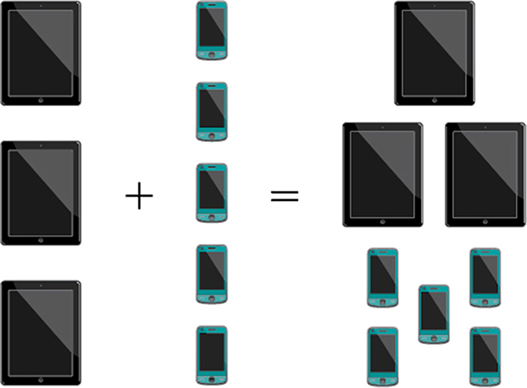
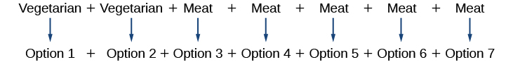
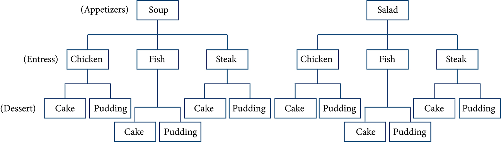
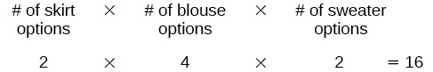

**Counting Principles**

  m49448
  

**Counting Principles**

  In this section, you will:

    Solve counting problems using the Addition Principle.
    Solve counting problems using the Multiplication Principle.
    Solve counting problems using permutations involving n distinct objects.
    Solve counting problems using combinations.
    Find the number of subsets of a given set.
    Solve counting problems using permutations involving n non-distinct objects.
  3183f5f9-230d-4777-b547-67eda9631a22

## Learning Objectives

Solve counting problems using the addition principle.
Solve counting problems using the multiplication principle.

## Objective 1: Solve counting problems using the addition principle.
In probability theory, an **outcome** is a possible result of an experiment or trial.

In probability theory, an **event** is a set of outcomes of an experiment.

**Disjoint events** cannot happen at the same time. In other words, they are **mutually exclusive**.

>
>
> **The Addition Principle**
>
> The **Addition Principle**states that if one event can occur in A ways (A outcomes) and a second event can occur in B ways (B outcomes) and both events cannot occur at the same time (A and B disjoints)
> then there are A + B ways (A+B outcomes) for the first event or the second event to occur.

The *addition principle* applies when we are making *only one selection*.

1. **Solve counting problems using the addition principle.**     ⓐ Seven red and five green marbles are placed in a bag. How many marbles are there to choose from?         ⓑ Let the set A = {−5,−3,−1,2,3,4,5,6}.  How many ways are there to choose a negative or an even number from A?       ⓒ A student is shopping for a new computer. He is deciding among 2 desktop computers and 3 laptop computers. What is the total number of computer options?

Solution

ⓐ
There are 7 ways of picking a red marble and 5 ways of picking a green marble and we cannot pick a red and a green at the same time. Therefore, there are 7+5 = 12 ways of picking a marble.

ⓑ
There are 3 negative numbers in A and 3 even numbers in A and the even numbers are not negative. Therefore, there are 3+3 = 6 ways of choosing a negative or an even number from A.

ⓒ
There are 2 options for a desktop and 3 options for a laptop and the student is shopping for one computer. So, he cannot pick both. Therefore, there are 2+3 = 5 total computer options.

### Practice Makes Perfect

Solve counting problems using the addition principle.

2. Ten red and six green marbles are placed in a bag. How many marbles are there to choose from?

3. Let the set A = {−5,−3,−1,2,3,4,5,6}.  How many ways are there to choose a positive or an odd number from A?

4. A young boy is deciding on a snack for the afternoon. He is deciding among 5 different chips, 3 different fruits and 2 different vegetables. What is the total number of snack options?

## Objective 2: Solve counting problems using the multiplication principle.

>
>
> **The Multiplication Principle**
>
> The **Multiplication Principle** states that if one event can occur in A ways (A outcomes) and a second event can occur in B ways (B outcomes) after the first event has occurred then the two events can occur in $\text{A}\cdot \text{B}$ ways. This is also known as the Fundamental Counting Principle.
>

The *Multiplication Principle* applies when we are making *more than one selection*.

5. Solve counting problems using the multiplication principle.    ⓐ Diane packed 2 skirts, 3 blouses, and 2 sweaters for her business trip. She will need to choose a skirt and a blouse for each outfit and decide whether to wear the sweater. Use the Multiplication Principle to find the total number of possible outfits.  ⓑ A restaurant offers a lunch special that includes an entree, a main dish, and a beverage. There are 3 types of entrees, 4 main dish options, and 5 beverage choices. Find the total number of possible lunch specials.  ⓒ Next semester you are going to take one science class, one math class, one history class and one english class.  According to the schedule you have 4 different science classes, 3 different math classes, 2 different history classes, and 3 different English classes to choose from.  Assuming no scheduling conflicts, how many different four-course selections can you make?  ⓓ How many license plates consisting of 2 letters followed by 4 digits are possible?

Solution

ⓐ There are 2 outcomes for the skirts, 3 outcomes for the blouses and 2 outcomes for the sweaters. The total number of possible outfits is then: $\begin{array}{cccccc}\underset{\u23df}{2}& \xb7& \underset{\u23df}{3}& \xb7& \underset{\u23df}{2}& =12\\ \mathrm{Skirts}& & \mathrm{Blouses}& & \mathrm{Sweaters}& \end{array}$

ⓑ There are 3 outcomes for the entrees, 4 outcomes for the main dish and 5 outcomes for the beverages. The total number of lunch specials is: $\begin{array}{cccccc}\underset{\u23df}{3}& \xb7& \underset{\u23df}{4}& \xb7& \underset{\u23df}{5}& =60\\ \mathrm{Entrees}& & \mathrm{Main\; Dish}& & \mathrm{Beverages}& \end{array}$

ⓒ There are 4 outcomes for the science class, 3 outcomes for the math class, 2 outcomes for the history class, and 3 outcomes for the English class. The total number of 4-course selections is: $\begin{array}{cccccccc}\underset{\u23df}{4}& \xb7& \underset{\u23df}{3}& \xb7& \underset{\u23df}{2}& \xb7& \underset{\u23df}{3}& =72\\ \mathrm{Science}& & \mathrm{Math}& & \mathrm{English}& & \mathrm{History}& \end{array}$

ⓓ There are 26 outcomes for the 1st letter, 26 outcomes for the second letter, 10 outcomes for the first digit, 10 outcomes for the second digit, 10 outcomes for the third digit, and 10 outcomes for the 4th digit. The number of license plates is: $\begin{array}{cccccccccccc}\underset{\u23df}{26}& \xb7& \underset{\u23df}{26}& \xb7& \underset{\u23df}{10}& \xb7& \underset{\u23df}{10}& \xb7& \underset{\u23df}{10}& \xb7& \underset{\u23df}{10}& =6,760,000\\ 1\mathrm{st\; letter}& & 2\mathrm{nd\; letter}& & 1\mathrm{st\; digit}& & 2\mathrm{nd\; digit}& & 3\mathrm{rd\; digit}& & 4\mathrm{th\; digit}& \end{array}$

### Practice Makes Perfect

Solve counting problems using the multiplication principle.

6. How many two-letter strings—the first letter from set A and the second letter from set B can be formed from the sets A = {b, c, d} and B = {a, e, i, o, u}?

7. If you have three types of meat to make a sandwich (turkey, roast beef, and ham), and two types of bread (wheat and rye), how many different sandwiches with one kind of meat can be created?

8. Next semester you are going to take one science class, one math class, one history class and one english class.  According to the schedule you have 4 different science classes, 3 different math classes, 2 different history classes, and 3 different English classes to choose from.  Assuming no scheduling conflicts, how many different four-course selections can you make?

9. In Missouri, license plates have 3 letters and 3 numbers. How many license plates, consisting of 3 letters followed by 3 digits are possible?

A new company sells customizable cases for tablets and smartphones. Each case comes in a variety of colors and can be personalized for an additional fee with images or a monogram. A customer can choose not to personalize or could choose to have one, two, or three images or a monogram. The customer can choose the order of the images and the letters in the monogram. The company is working with an agency to develop a marketing campaign with a focus on the huge number of options they offer. Counting the possibilities is challenging!

We encounter a wide variety of counting problems every day. There is a branch of mathematics devoted to the study of counting problems such as this one. Other applications of counting include secure passwords, horse racing outcomes, and college scheduling choices. We will examine this type of mathematics in this section.

# Using the Addition Principle
The company that sells customizable cases offers cases for tablets and smartphones. There are 3 supported tablet models and 5 supported smartphone models. The *Addition Principle* tells us that we can add the number of tablet options to the number of smartphone options to find the total number of options. By the Addition Principle, there are 8 total options, as we can see in .

>
>
>
>
> **The Addition Principle**
>
>
> According to the **Addition Principle**, if one event can occur in $m$ ways and a second event with no common outcomes can occur in $n$ ways, then the first *or* second event can occur in $m+n$ ways.

10. **Using the Addition Principle**   There are 2 vegetarian entrée options and 5 meat entrée options on a dinner menu. What is the total number of entrée options?

Solution

We can add the number of vegetarian options to the number of meat options to find the total number of entrée options.

There are 7 total options.

>
> Try It
> 11. A student is shopping for a new computer. He is deciding among 3 desktop computers and 4 laptop computers. What is the total number of computer options?
>
> 

> 
Solution

>
> 7
> 

>
>

# Using the Multiplication Principle
The *Multiplication Principle* applies when we are making more than one selection. Suppose we are choosing an appetizer, an entrée, and a dessert. If there are 2 appetizer options, 3 entrée options, and 2 dessert options on a fixed-price dinner menu, there are a total of 12 possible choices of one each as shown in the tree diagram in .

The possible choices are:
soup, chicken, cake
soup, chicken, pudding
soup, fish, cake
soup, fish, pudding
soup, steak, cake
soup, steak, pudding
salad, chicken, cake
salad, chicken, pudding
salad, fish, cake
salad, fish, pudding
salad, steak, cake
salad, steak, pudding
We can also find the total number of possible dinners by multiplying.
We could also conclude that there are 12 possible dinner choices simply by applying the Multiplication Principle.
 $$
\begin{array}{llll}\#\phantom{\rule{0.5em}{0ex}}\text{of\ appetizer\ options\}\times   & \#\phantom{\rule{0.5em}{0ex}}\text{of\ entree\ options\}\times   & \#\phantom{\rule{0.5em}{0ex}}\text{of\ dessert\ options}  &   \\ \phantom{\rule{0.5em}{0ex}}\text{\ \ \ \ \ \ \ \ \ \ \ \ \ \}2\phantom{\rule{0.5em}{0ex}}\text{\ \ \ \ \ \ \ \ \ \ \ \ \ \ \ \ \ \}\times   & \phantom{\rule{0.5em}{0ex}}\text{\ \ \ \ \ \ \ \ \ \ \ \ \}3\phantom{\rule{0.5em}{0ex}}\text{\ \ \ \ \ \ \ \ \ \ \ \ \ \}\times   & \phantom{\rule{0.5em}{0ex}}\text{\ \ \ \ \ \ \ \ \ \ \ \ \ \}2  & =12  \end{array}
$$ 

>
>
>
>
> **The Multiplication Principle**
>
>
> According to the **Multiplication Principle**, if one event can occur in $m$ ways and a second event can occur in $n$ ways after the first event has occurred, then the two events can occur in $m\times n$ ways. This is also known as the **Fundamental Counting Principle**.

12. **Using the Multiplication Principle**   Diane packed 2 skirts, 4 blouses, and a sweater for her business trip. She will need to choose a skirt and a blouse for each outfit and decide whether to wear the sweater. Use the Multiplication Principle to find the total number of possible outfits.

Solution

To find the total number of outfits, find the product of the number of skirt options, the number of blouse options, and the number of sweater options.

There are 16 possible outfits.

>
> Try It
> 13. A restaurant offers a breakfast special that includes a breakfast sandwich, a side dish, and a beverage. There are 3 types of breakfast sandwiches, 4 side dish options, and 5 beverage choices. Find the total number of possible breakfast specials.
>
> 

> 
Solution

>
> There are 60 possible breakfast specials.
> 

>
>

# Finding the Number of Permutations of *n* Distinct Objects
The Multiplication Principle can be used to solve a variety of problem types. One type of problem involves placing objects in order. We arrange letters into words and digits into numbers, line up for photographs, decorate rooms, and more. An ordering of objects is called a **permutation**.

## Finding the Number of Permutations of *n* Distinct Objects Using the Multiplication Principle
To solve permutation problems, it is often helpful to draw line segments for each option. That enables us to determine the number of each option so we can multiply. For instance, suppose we have four paintings, and we want to find the number of ways we can hang three of the paintings in order on the wall. We can draw three lines to represent the three places on the wall.

There are four options for the first place, so we write a 4 on the first line.

After the first place has been filled, there are three options for the second place so we write a 3 on the second line.

After the second place has been filled, there are two options for the third place so we write a 2 on the third line. Finally, we find the product.

There are 24 possible permutations of the paintings.

>
> How To
> *Given* $n$ *distinct options, determine how many permutations there are.*
>
> Determine how many options there are for the first situation.
> Determine how many options are left for the second situation.
> Continue until all of the spots are filled.
> Multiply the numbers together.

14. **Finding the Number of Permutations Using the Multiplication Principle**   At a swimming competition, nine swimmers compete in a race.   ⓐHow many ways can they place first, second, and third? ⓑHow many ways can they place first, second, and third if a swimmer named Ariel wins first place? (Assume there is only one contestant named Ariel.) ⓒHow many ways can all nine swimmers line up for a photo?

Solution

ⓐDraw lines for each place.

There are 9 options for first place. Once someone has won first place, there are 8 remaining options for second place. Once first and second place have been won, there are 7 remaining options for third place.

Multiply to find that there are 504 ways for the swimmers to place.

ⓑDraw lines for describing each place.

We know Ariel must win first place, so there is only 1 option for first place. There are 8 remaining options for second place, and then 7 remaining options for third place.

Multiply to find that there are 56 ways for the swimmers to place if Ariel wins first.

ⓒ
Draw lines for describing each place in the photo.

There are 9 choices for the first spot, then 8 for the second, 7 for the third, 6 for the fourth, and so on until only 1 person remains for the last spot.

There are 362,880 possible permutations for the swimmers to line up.

A family of five is having portraits taken. Use the Multiplication Principle to find the following.

>
> Try It
>
> 15. How many ways can the family line up for the portrait?
>
> 

> 
Solution

>
> 120
> 

>
>

>
> Try It
> 16. How many ways can the photographer line up 3 family members?
>
> 

> 
Solution

>
> 60
> 

>
>

>
> Try It
> 17. How many ways can the family line up for the portrait if the parents are required to stand on each end?
>
> 

> 
Solution

>
> 12
> 

>
>

## Finding the Number of Permutations of *n* Distinct Objects Using a Formula
For some permutation problems, it is inconvenient to use the Multiplication Principle because there are so many numbers to multiply. Fortunately, we can solve these problems using a formula. Before we learn the formula, let’s look at two common notations for permutations. If we have a set of $n$ objects and we want to choose $r$ objects from the set in order, we write $P(n,r).$ Another way to write this is $n{P}_{r},$ a notation commonly seen on computers and calculators. To calculate $P(n,r),$ we begin by finding $n!,$ the number of ways to line up all $n$ objects. We then divide by $\left(n-r\right)!$ to cancel out the $\left(n-r\right)$ items that we do not wish to line up.
Let’s see how this works with a simple example. Imagine a club of six people. They need to elect a president, a vice president, and a treasurer. Six people can be elected president, any one of the five remaining people can be elected vice president, and any of the remaining four people could be elected treasurer. The number of ways this may be done is $6\times 5\times 4=120.$ Using factorials, we get the same result.
 $$
\frac{6!}{3!}=\frac{6\xb75\xb74\xb73!}{3!}=6\xb75\xb74=120
$$ There are 120 ways to select 3 officers in order from a club with 6 members. We refer to this as a permutation of 6 taken 3 at a time. The general formula is as follows.
 $$
P(n,r)=\frac{n!}{(n-r)!}
$$ Note that the formula stills works if we are choosing *all* $n$ objects and placing them in order. In that case we would be dividing by $\left(n-n\right)!$ or $0!,$ which we said earlier is equal to 1. So the number of permutations of $n$ objects taken $n$ at a time is $\frac{n!}{1}$ or just $n!\text{.}$ 

>
>
>
>
> **Formula for Permutations of *n* Distinct Objects**
>
>
>
> Given $n$ distinct objects, the number of ways to select $r$ objects from the set in order is
>
>  $$
> P(n,r)=\frac{n!}{(n-r)!}
> $$ 

>
> How To
> *Given a word problem, evaluate the possible permutations.*
>
>
> Identify $n$ from the given information.
> Identify $r$ from the given information.
> Replace $n$ and $r$ in the formula with the given values.
> Evaluate.
>

18. **Finding the Number of Permutations Using the Formula**   A professor is creating an exam of 9 questions from a test bank of 12 questions. How many ways can she select and arrange the questions?

Solution

Substitute $n=12$ and $r=9$ into the permutation formula and simplify.

 $$
\begin{array}{l}\phantom{\rule{0.5em}{0ex}}\text\ P(n,r)=\frac{n!}{(n-r)!}\phantom{\rule{0.5em}{0ex}}  \\ P(12,9)=\frac{12!}{(12-9)!}=\frac{12!}{3!}=79\text{,}833\text{,}600  \end{array}
$$
There are 79,833,600  possible permutations of exam questions!

>
> Q&A
> *Could we have solved  using the Multiplication Principle?*
>
> *Yes. We could have multiplied* $12\cdot 11\cdot 10\cdot 9\cdot 8\cdot 7\cdot 6\cdot 5\cdot 4$ *to find the same answer*.

A play has a cast of 7 actors preparing to make their curtain call. Use the permutation formula to find the following.

>
> Try It
> 19. How many ways can the 7 actors line up?
>
> 

> 
Solution

>
> $P(7,7)=5,040$
> 

>
>

>
> Try It
> 20. How many ways can 5 of the 7 actors be chosen to line up?
>
> 

> 
Solution

>
> $P(7,5)=2,520$
> 

>
>

# Find the Number of Combinations Using the Formula
So far, we have looked at problems asking us to put objects in order. There are many problems in which we want to select a few objects from a group of objects, but we do not care about the order. When we are selecting objects and the order does not matter, we are dealing with **combinations**. A selection of $r$ objects from a set of $n$ objects where the order does not matter can be written as $C(n,r).$ Just as with permutations, $\text{C}(n,r)$ can also be written as ${\phantom{\rule{0.5em}{0ex}}}_{n}{C}_{r}.$ In this case, the general formula is as follows.
 $$
\text{C}(n,r)=\frac{n!}{r!(n-r)!}
$$ An earlier problem considered choosing 3 of 4 possible paintings to hang on a wall. We found that there were 24 ways to select 3 of the 4 paintings in order. But what if we did not care about the order? We would expect a smaller number because selecting paintings 1, 2, 3 would be the same as selecting paintings 2, 3, 1. To find the number of ways to select 3 of the 4 paintings, disregarding the order of the paintings, divide the number of permutations by the number of ways to order 3 paintings. There are $3!=3\xb72\xb71=6$ ways to order 3 paintings. There are $\frac{24}{6},$ or 4 ways to select 3 of the 4 paintings. This number makes sense because every time we are selecting 3 paintings, we are *not* selecting 1 painting. There are 4 paintings we could choose *not* to select, so there are 4 ways to select 3 of the 4 paintings.

>
>
>
>
> **Formula for Combinations of *n* Distinct Objects**
>
>
> Given $n$ distinct objects, the number of ways to select $r$ objects from the set is
>
>  $$
> \text{C}(n,r)=\frac{n!}{r!(n-r)!}
> $$ 

>
> How To
> *Given a number of options, determine the possible number of combinations.*
>
>
> Identify $n$ from the given information.
> Identify $r$ from the given information.
> Replace $n$ and $r$ in the formula with the given values.
> Evaluate.
>

21. **Finding the Number of Combinations Using the Formula**   A fast food restaurant offers five side dish options. Your meal comes with two side dishes.   ⓐHow many ways can you select your side dishes? ⓑHow many ways can you select 3 side dishes?

Solution

ⓐWe want to choose 2 side dishes from 5 options.
 $$
\text{C}(5,2)=\frac{5!}{2!(5-2)!}=10
$$ 
ⓑWe want to choose 3 side dishes from 5 options.
 $$
\text{C}(5,3)=\frac{5!}{3!(5-3)!}=10
$$

>
> Q&A
> *Is it a coincidence that parts (a) and (b) in  have the same answers?*
>
> *No. When we choose r objects from n objects, we are *not* choosing $(n\u2013r)$ objects. Therefore, $C(n,r)=C(n,n\u2013r).$*
>

>
> Try It
> 22. An ice cream shop offers 10 flavors of ice cream. How many ways are there to choose 3 flavors for a banana split?
>
> 

> 
Solution

>
> $C(10,3)=120$
> 

>
>

# Finding the Number of Subsets of a Set
We have looked only at combination problems in which we chose exactly $r$ objects. In some problems, we want to consider choosing every possible number of objects. Consider, for example, a pizza restaurant that offers 5 toppings. Any number of toppings can be ordered. How many different pizzas are possible?
To answer this question, we need to consider pizzas with any number of toppings. There is $C(5,0)=1$ way to order a pizza with no toppings. There are $C(5,1)=5$ ways to order a pizza with exactly one topping. If we continue this process, we get
 $C(5,0)+C(5,1)+C(5,2)+C(5,3)+C(5,4)+C(5,5)=32$ There are 32 possible pizzas. This result is equal to ${2}^{5}.$ 
We are presented with a sequence of choices. For each of the $n$ objects we have two choices: include it in the subset or not. So for the whole subset we have made $n$ choices, each with two options. So there are a total of $2\xb72\xb72\xb7\dots \xb72$ possible resulting subsets, all the way from the empty subset, which we obtain when we say “no” each time, to the original set itself, which we obtain when we say “yes” each time.

>
>
>
>
> **Formula for the Number of Subsets of a Set**
>
>
> A set containing *n* distinct objects has ${2}^{n}$ subsets.

23. **Finding the Number of Subsets of a Set**   A restaurant offers butter, cheese, chives, and sour cream as toppings for a baked potato. How many different ways are there to order a potato?

Solution

We are looking for the number of subsets of a set with 4 objects. Substitute $n=4$ into the formula.
 $$
\begin{array}{l}{2}^{n}={2}^{4}  \\ \phantom{\rule{0.5em}{0ex}}\text{\ \ \}=16  \end{array}
$$ 
There are 16 possible ways to order a potato.

>
> Try It
> 24. A sundae bar at a wedding has 6 toppings to choose from. Any number of toppings can be chosen. How many different sundaes are possible?
>
> 

> 
Solution

>
> 64 sundaes
> 

>
>

# Finding the Number of Permutations of *n* Non-Distinct Objects
We have studied permutations where all of the objects involved were distinct. What happens if some of the objects are indistinguishable? For example, suppose there is a sheet of 12 stickers. If all of the stickers were distinct, there would be $12!$ ways to order the stickers. However, 4 of the stickers are identical stars, and 3 are identical moons. Because all of the objects are not distinct, many of the $12!$ permutations we counted are duplicates. The general formula for this situation is as follows.
 $$
\frac{n!}{{r}_{1}!{r}_{2}!\dots {r}_{k}!}
$$ In this example, we need to divide by the number of ways to order the 4 stars and the ways to order the 3 moons to find the number of unique permutations of the stickers. There are $4!$ ways to order the stars and $3!$ ways to order the moon.
 $$
\frac{12!}{4!3!}=3\text{,}326\text{,}400
$$
There are 3,326,400 ways to order the sheet of stickers.

>
>
>
>
> **Formula for Finding the Number of Permutations of *n* Non-Distinct Objects**
>
>
> If there are $n$ elements in a set and ${r}_{1}$ are alike, ${r}_{2}$ are alike, ${r}_{3}$ are alike, and so on through ${r}_{k},$ the number of permutations can be found by
>  $$
> \frac{n!}{{r}_{1}!{r}_{2}!\dots {r}_{k}!}
> $$ 

25. **Finding the Number of Permutations of *n* Non-Distinct Objects**   Find the number of rearrangements of the letters in the word DISTINCT.

Solution

There are 8 letters. Both I and T are repeated 2 times. Substitute $n=8,\ {r}_{1}=2,\$ and $\ {r}_{2}=2\$ into the formula.

 $\frac{8!}{2!2!}=10\text{,}080\$
There are 10,080 arrangements.

>
> Try It
> 26. Find the number of rearrangements of the letters in the word CARRIER.
>
> 

> 
Solution

>
> 840
> 

>
>

>
> Media
> Access these online resources for additional instruction and practice with combinations and permutations.
>
>
> Combinations
> Permutations
>

# Key Equations

| number of permutations of $n$ distinct objects taken $r$ at a time | $P(n,r)=\frac{n!}{(n-r)!}$ |
| :--- | :--- |
| number of combinations of $n$ distinct objects taken $r$ at a time | $C(n,r)=\frac{n!}{r!(n-r)!}$ |
| number of permutations of $n$ non-distinct objects | $\frac{n!}{{r}_{1}!{r}_{2}!\dots {r}_{k}!}$ |

# Key Concepts
If one event can occur in $m$ ways and a second event with no common outcomes can occur in $n$ ways, then the first or second event can occur in $m+n$ ways. See .
If one event can occur in $m$ ways and a second event can occur in $n$ ways after the first event has occurred, then the two events can occur in $m\times n$ ways. See .
A permutation is an ordering of $n$ objects.
If we have a set of $n$ objects and we want to choose $r$ objects from the set in order, we write $P(n,r).$ 
Permutation problems can be solved using the Multiplication Principle or the formula for $P(n,r).$ See  and .
A selection of objects where the order does not matter is a combination.
Given $n$ distinct objects, the number of ways to select $r$ objects from the set is $\text{C}(n,r)$ and can be found using a formula. See .
A set containing $n$ distinct objects has ${2}^{n}$ subsets. See .
For counting problems involving non-distinct objects, we need to divide to avoid counting duplicate permutations. See .

# Section Exercises

## Verbal
For the following exercises, assume that there are $n$ ways an event $A$ can happen, $m$ ways an event $B$ can happen, and that $A\phantom{\rule{0.5em}{0ex}}\text{and\}B$ are non-overlapping.
1. Use the Addition Principle of counting to explain how many ways event $A\phantom{\rule{0.5em}{0ex}}\text{or\}B$ can occur.

Solution

There are $m+n$ ways for either event $A$ or event $B$ to occur.

2. Use the Multiplication Principle of counting to explain how many ways event $A\phantom{\rule{0.5em}{0ex}}\text{and\}B$ can occur.

Answer the following questions.
3. When given two separate events, how do we know whether to apply the Addition Principle or the Multiplication Principle when calculating possible outcomes? What conjunctions may help to determine which operations to use?

Solution

The addition principle is applied when determining the total possible of outcomes of either event occurring. The multiplication principle is applied when determining the total possible outcomes of both events occurring. The word “or” usually implies an addition problem. The word “and” usually implies a multiplication problem.

4. Describe how the permutation of $n$ objects differs from the permutation of choosing $r$ objects from a set of $n$ objects. Include how each is calculated.

5. What is the term for the arrangement that selects $r$ objects from a set of $n$ objects when the order of the $r$ objects is not important? What is the formula for calculating the number of possible outcomes for this type of arrangement?

Solution

A combination; $C(n,r)=\frac{n!}{(n-r)!r!}$

## Numeric
For the following exercises, determine whether to use the Addition Principle or the Multiplication Principle. Then perform the calculations.
6. Let the set $A=\{-5,-3,-1,2,3,4,5,6\}.$ How many ways are there to choose a negative or an even number from $\mathrm{A?}$

7. Let the set $B=\{-23,-16,-7,-2,20,36,48,72\}.$ How many ways are there to choose a positive or an odd number from $A?$

Solution

$4+2=6$

8. How many ways are there to pick a red ace or a club from a standard card playing deck?

9. How many ways are there to pick a paint color from 5 shades of green, 4 shades of blue, or 7 shades of yellow?

Solution

$5+4+7=16$

10. How many outcomes are possible from tossing a pair of coins?

11. How many outcomes are possible from tossing a coin and rolling a 6-sided die?

Solution

$2\times 6=12$

12. How many two-letter strings—the first letter from $A$ and the second letter from $B\u2014$ can be formed from the sets $A=\{b,c,d\}$ and $B=\{a,e,i,o,u\}?$

13. How many ways are there to construct a string of 3 digits if numbers can be repeated?

Solution

${10}^{3}=1000$

14. How many ways are there to construct a string of 3 digits if numbers cannot be repeated?

For the following exercises, compute the value of the expression.
15. $P(5,2)$

Solution

$P(5,2)=20$

16. $P(8,4)$

17. $P(3,3)$

Solution

$P(3,3)=6$

18. $P(9,6)$

19. $P(11,5)$

Solution

$P(11,5)=55,440$

20. $C(8,5)$

21. $C(12,4)$

Solution

$C(12,4)=495$

22. $C(26,3)$

23. $C(7,6)$

Solution

$C(7,6)=7$

24. $C(10,3)$

For the following exercises, find the number of subsets in each given set.
25. $\{1,2,3,4,5,6,7,8,9,10\}$

Solution

${2}^{10}=1024$

26. $\{a,b,c,\dots ,z\}$

27. A set containing 5 distinct numbers, 4 distinct letters, and 3 distinct symbols

Solution

${2}^{12}=4096$

28. The set of even numbers from 2 to 28

29. The set of two-digit numbers between 1 and 100 containing the digit 0

Solution

${2}^{9}=512$

For the following exercises, find the distinct number of arrangements.
30. The letters in the word “juggernaut”

31. The letters in the word “academia”

Solution

$\frac{8!}{3!}=6720$

32. The letters in the word  “academia” that begin and end in “a”

33. The symbols in the string #,#,#,@,@,$,$,$,%,%,%,%

Solution

$\frac{12!}{3!2!3!4!}$

34. The symbols in the string #,#,#,@,@,$,$,$,%,%,%,% that begin and end with “%”

## Extensions
35. The set, $S$ consists of $\text{900,000,000}$ whole numbers, each being the same number of digits long. How many digits long is a number from $S?$ (*Hint:* use the fact that a whole number cannot start with the digit 0.)

Solution

9

36. The number of 5-element subsets from a set containing $n$ elements is equal to the number of 6-element subsets from the same set. What is the value of $n?$ (*Hint:* the order in which the elements for the subsets are chosen is not important.)

37. Can $C(n,r)$ ever equal $P(n,r)?$ Explain.

Solution

Yes, for the trivial cases $r=0$ and $r=1.$ If $r=0,$ then $C(n,r)=P(n,r)=1\text{.\hspace{0.17em}}$ If $r=1,$ then $r=1,$ $C(n,r)=P(n,r)=n.$

38. Suppose a set $A$ has 2,048 subsets. How many distinct objects are contained in $A?$

39. How many arrangements can be made from the letters of the word “mountains” if all the vowels must form a string?

Solution

$\frac{6!}{2!}\times 4!=8640$

## Real-World Applications
40. A family consisting of 2 parents and 3 children is to pose for a picture with 2 family members in the front and 3 in the back.   ⓐHow many arrangements are possible with no restrictions? ⓑHow many arrangements are possible if the parents must sit in the front? ⓒHow many arrangements are possible if the parents must be next to each other?

41. A cell phone company offers 6 different voice packages and 8 different data packages. Of those, 3 packages include both voice and data. How many ways are there to choose either voice or data, but not both?

Solution

$6-3+8-3=8$

42. In horse racing, a “trifecta” occurs when a bettor wins by selecting the first three finishers in the exact order (1st place, 2nd place, and 3rd place). How many different trifectas are possible if there are 14 horses in a race?

43. A wholesale T-shirt company offers sizes small, medium, large, and extra-large in organic or non-organic cotton and colors white, black, gray, blue, and red. How many different T-shirts are there to choose from?

Solution

$4\times 2\times 5=40$

44. Hector wants to place billboard advertisements throughout the county for his new business. How many ways can Hector choose 15 neighborhoods to advertise in if there are 30 neighborhoods in the county?

45. An art store has 4 brands of paint pens in 12 different colors and 3 types of ink. How many paint pens are there to choose from?

Solution

$4\times 12\times 3=144$

46. How many ways can a committee of 3 freshmen and 4 juniors be formed from a group of $8$ freshmen and $11$ juniors?

47. How many ways can a baseball coach arrange the order of 9 batters if there are 15 players on the team?

Solution

$P(15,9)=1,816,214,400$

48. A conductor needs 5 cellists and 5 violinists to play at a diplomatic event. To do this, he ranks the orchestra’s 10 cellists and 16 violinists in order of musical proficiency. What is the ratio of the total cellist rankings possible to the total violinist rankings possible?

49. A motorcycle shop has 10 choppers, 6 bobbers, and 5 café racers—different types of vintage motorcycles. How many ways can the shop choose 3 choppers, 5 bobbers, and 2 café racers for a weekend showcase?

Solution

$C(10,3)\times C(6,5)\times C(5,2)=7,200$

50. A skateboard shop stocks 10 types of board decks, 3 types of trucks, and 4 types of wheels. How many different skateboards can be constructed?

51. Just-For-Kicks Sneaker Company offers an online customizing service. How many ways are there to design a custom pair of Just-For-Kicks sneakers if a customer can choose from a basic shoe up to 11 customizable options?

Solution

${2}^{11}=2048$

52. A car wash offers the following optional services to the basic wash: clear coat wax, triple foam polish, undercarriage wash, rust inhibitor, wheel brightener, air freshener, and interior shampoo. How many washes are possible if any number of options can be added to the basic wash?

53. Suni bought 20 plants to arrange along the border of her garden. How many distinct arrangements can she make if the plants are comprised of 6 tulips, 6 roses, and 8 daisies?

Solution

$\frac{20!}{6!6!8!}=116,396,280$

54. How many unique ways can a string of Christmas lights be arranged from 9 red, 10 green, 6 white, and 12 gold color bulbs?

**Addition Principle**
if one event can occur in $m$ ways and a second event with no common outcomes can occur in $n$ ways, then the first or second event can occur in $m+n$ ways

**combination**
a selection of objects in which order does not matter

**Fundamental Counting Principle**
if one event can occur in $m$ ways and a second event can occur in $n$ ways after the first event has occurred, then the two events can occur in $m\times n$ ways; also known as the Multiplication Principle

**Multiplication Principle**
if one event can occur in $m$ ways and a second event can occur in $n$ ways after the first event has occurred, then the two events can occur in $m\times n$ ways; also known as the Fundamental Counting Principle

**permutation**
a selection of objects in which order matters
