Binomial Theorem
================

  m49449
  
Binomial Theorem
================

  In this section, you will:

Apply the Binomial Theorem.

  05ece6ed-b387-41cc-b8bc-742abaaf814f

Learning Objectives
===================

Use Pascal’s Triangle to expand a binomial. (IA 12.4.1)

Objective 1: Use Pascal’s Triangle to expand a binomial. (IA 12.4.1)
====================================================================
Pascal’s triangle helps us find the coefficients of the terms in the expansion of a binomial.
To find the coefficients of the terms, we write our expansion again focusing on the coefficients. We rewrite the coefficients to the right forming an array of coefficients. The array to the right is called **Pascal’s Triangle**.

![A plus b to the power of 0 equals 1. The top level of Pascal’s Triangle is 1. A plus b to the power of 1 equals 1 a plus 1 b. The second level of Pascal’s Triangle is 1, 1. A plus b to the power of 2 equals 1 a to the power of 2 plus 2 a b plus 1 b to the power of 2. The third level of Pascal’s Triangle is 1, 2, 1. A plus b to the power of 3 equals 1 a to the power of 3 plus 3 a to the power of 2 b plus 3 a b to the power of 2 plus 1 b to the power of 3. The fourth level of Pascal’s Triangle is 1,3,3,1. A plus b to the power of 4 equals 1 a to the power of 4 plus 4 a to the power of 3 b plus 6 a to the power of 2 b to the power of 2 plus 4 a b to the power of 3 plus 1 b to the power of 4. The fifth level of Pascal’s Triangle is 1, 4, 6, 4, 1. A plus b to the power of 5 equals 1 a to the power of 5 plus 5 a to the power of 4 b plus 10 a to the power of 3 b to the power of 2 plus 10 a to the power of 2 b to the power of 3. The sixth row of the Pascal’s Triangle is 1, 5, 10, 10, 5, 1.](../../media/9_6_1.jpg)

Notice that in each expansion the powers of *a* in each term decrease from *n* to 0, and the powers of *b* increase from 0 to *n*.
Notice each number in the array is the sum of the two closest numbers in the row above. We can find the next row by starting and ending with one and then adding two adjacent numbers.
To find the coefficients of the expansion of the binomial ${(a+b)}^{n}$ , go to the row that has the value n as a second entry.

  Use Pascal’s Triangle to expand ${(x+y)}^{6}$ .

  
    Go to Pascal’s Triangle and read off the coefficients from the row whose second entry is 6.

    

  
  
    Write the expansion with the coefficients.

    

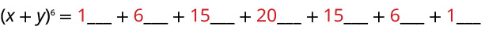

  
  
    
Fill in the variable with the power of x decreasing from 6 to 0, and the power of y increasing from 0 to 6.

    

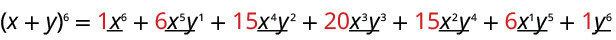

  
  
    Binomial expansion of ${(x+y)}^{6}$ .

    

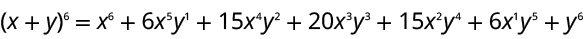

  

  Use Pascal’s Triangle to expand ${(x+3)}^{5}$ .

  
    

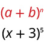

Go to Pascal’s Triangle and read off the coefficients from the row whose second entry is 5.

    

  
  
    Write the expansion with the coefficients.

    

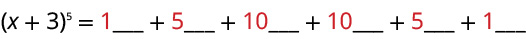

  
  
    
Fill in the variable with the power of x decreasing from 5 to 0, and the power of 3 increasing from 0 to 5.

    

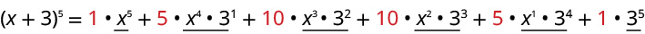

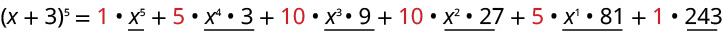

  
  
    Binomial expansion of ${(x+3)}^{5}$ .

    

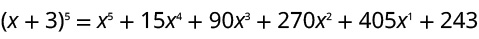

  

  Use Pascal’s Triangle to expand ${(3x-2)}^{4}$ .

  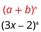

Go to Pascal’s Triangle and read off the coefficients from the row whose second entry is 4.

    

  
  
    Write the expansion with the coefficients.

    

  
  
    Fill in the variable with the power of (3x) decreasing from 4 to 0, and the power of (-2) increasing from 0 to 4.
    

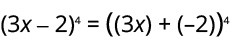

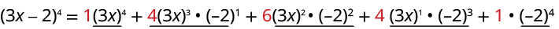

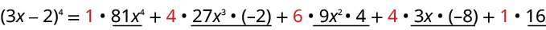

  
  
    Binomial expansion of ${(3x-2)}^{4}$ .

    

Practice Makes Perfect
======================
Use Pascal’s Triangle to expand a binomial.

  Use Pascal’s Triangle to expand ${(a+b)}^{4}$ .

  Use Pascal’s Triangle to expand ${(y+3)}^{5}$ .

  Use Pascal’s Triangle to expand ${(2x-5)}^{3}$ .

A polynomial with two terms is called a binomial. We have already learned to multiply binomials and to raise binomials to powers, but raising a binomial to a high power can be tedious and time-consuming. In this section, we will discuss a shortcut that will allow us to find ${(x+y)}^{n}$ without multiplying the binomial by itself $n$ times.

Identifying Binomial Coefficients
=================================

In Counting Principles, we studied **combinations**. In the shortcut to finding ${(x+y)}^{n},$ we will need to use combinations to find the coefficients that will appear in the expansion of the binomial. In this case, we use the notation $\left(\begin{array}{c}n\\ r\end{array}\right)$ instead of $C(n,r),$ but it can be calculated in the same way. So $$
\left(\begin{array}{c}n\\ r\end{array}\right)=C(n,r)=\frac{n!}{r!(n-r)!}
$$
The combination $\left(\begin{array}{c}n\\ r\end{array}\right)$ is called a *binomial coefficient*. An example of a binomial coefficient is $\left(\begin{array}{c}5\\ 2\end{array}\right)=C(5,2)=10.$

Binomial Coefficients
=====================

If $n$ and $r$ are integers greater than or equal to 0 with $n\ge r,$ then the **binomial coefficient** is
 $$
\left(\begin{array}{c}n\\ r\end{array}\right)=C(n,r)=\frac{n!}{r!(n-r)!}
$$

Q&A
*Is a binomial coefficient always a whole number?*

*Yes. Just as the number of combinations must always be a whole number, a binomial coefficient will always be a whole number.*

Finding Binomial Coefficients
=============================

Find each binomial coefficient.

ⓐ $\left(\begin{array}{c}5\\ 3\end{array}\right)$ 
ⓑ $\left(\begin{array}{c}9\\ 2\end{array}\right)$ 
ⓒ $\left(\begin{array}{c}9\\ 7\end{array}\right)$ 

Use the formula to calculate each binomial coefficient. You can also use the $n{C}_{r}$ function on your calculator.
 $$
\left(\begin{array}{c}n\\ r\end{array}\right)=C(n,r)=\frac{n!}{r!(n-r)!}
$$ 
ⓐ $\left(\begin{array}{c}5\\ 3\end{array}\right)=\frac{5!}{3!(5-3)!}=\frac{5\cdot 4\cdot 3!}{3!2!}=10$

ⓑ $\left(\begin{array}{c}9\\ 2\end{array}\right)=\frac{9!}{2!(9-2)!}=\frac{9\cdot 8\cdot 7!}{2!7!}=36$ 
ⓒ $\left(\begin{array}{c}9\\ 7\end{array}\right)=\frac{9!}{7!(9-7)!}=\frac{9\cdot 8\cdot 7!}{7!2!}=36$ 

Analysis
========

Notice that we obtained the same result for parts (b) and (c). If you look closely at the solution for these two parts, you will see that you end up with the same two factorials in the denominator, but the order is reversed, just as with combinations. $$
\left(\begin{array}{c}n\\ r\end{array}\right)=\left(\begin{array}{c}n\\ n-r\end{array}\right)
$$

Try It
Find each binomial coefficient.

ⓐ $\left(\begin{array}{c}7\\ 3\end{array}\right)$ 
ⓑ $\left(\begin{array}{c}11\\ 4\end{array}\right)$

ⓐ35
ⓑ330

Using the Binomial Theorem
==========================
When we expand ${(x+y)}^{n}$ by multiplying, the result is called a **binomial expansion**, and it includes binomial coefficients. If we wanted to expand ${(x+y)}^{52},$ we might multiply $(x+y)$ by itself fifty-two times. This could take hours! If we examine some simple binomial expansions, we can find patterns that will lead us to a shortcut for finding more complicated binomial expansions.
 $$
\begin{array}{l}{(x+y)}^{2}={x}^{2}+2xy+{y}^{2}\hfill \\ {(x+y)}^{3}={x}^{3}+3{x}^{2}y+3x{y}^{2}+{y}^{3}\hfill \\ {(x+y)}^{4}={x}^{4}+4{x}^{3}y+6{x}^{2}{y}^{2}+4x{y}^{3}+{y}^{4}\hfill \end{array}
$$ First, let’s examine the exponents. With each successive term, the exponent for $x$ decreases and the exponent for $y$ increases. The sum of the two exponents is $n$ for each term.
Next, let’s examine the coefficients. Notice that the coefficients increase and then decrease in a symmetrical pattern. The coefficients follow a pattern:
 $$
\left(\begin{array}{c}n\\ 0\end{array}\right),\left(\begin{array}{c}n\\ 1\end{array}\right),\left(\begin{array}{c}n\\ 2\end{array}\right),\mathrm{...},\left(\begin{array}{c}n\\ n\end{array}\right).
$$ These patterns lead us to the *Binomial Theorem*, which can be used to expand any binomial.
 $$
\begin{array}{ll}{(x+y)}^{n}\hfill & ={\displaystyle \sum _{k=0}^{n}\left(\begin{array}{c}n\\ k\end{array}\right){x}^{n-k}}{y}^{k}\hfill \\ \hfill & ={x}^{n}+\left(\begin{array}{c}n\\ 1\end{array}\right){x}^{n-1}y+\left(\begin{array}{c}n\\ 2\end{array}\right){x}^{n-2}{y}^{2}+\mathrm{...}+\left(\begin{array}{c}n\\ n-1\end{array}\right)x{y}^{n-1}+{y}^{n}\hfill \end{array}
$$ Another way to see the coefficients is to examine the expansion of a binomial in general form, $x+y,$ to successive powers 1, 2, 3, and 4.
 $$
\begin{array}{l}{(x+y)}^{1}=x+y\hfill \\ {(x+y)}^{2}={x}^{2}+2xy+{y}^{2}\hfill \\ {(x+y)}^{3}={x}^{3}+3{x}^{2}y+3x{y}^{2}+{y}^{3}\hfill \\ {(x+y)}^{4}={x}^{4}+4{x}^{3}y+6{x}^{2}{y}^{2}+4x{y}^{3}+{y}^{4}\hfill \end{array}
$$ Can you guess the next expansion for the binomial ${(x+y)}^{5}?$

\n\n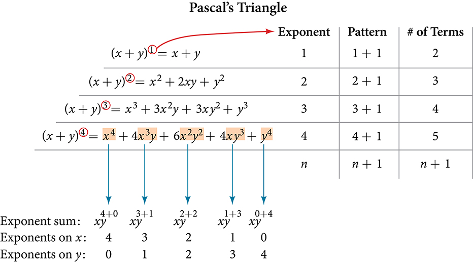\n\nSee , which illustrates the following:
There are $n+1$ terms in the expansion of ${(x+y)}^{n}.$ 
The degree (or sum of the exponents) for each term is $n.$ 
The powers on $x$ begin with $n$ and decrease to 0.
The powers on $y$ begin with 0 and increase to $n.$ 
The coefficients are symmetric.
To determine the expansion on ${(x+y)}^{5},$ we see $n=5,$ thus, there will be 5+1 = 6 terms. Each term has a combined degree of 5. In descending order for powers of $x,$ the pattern is as follows:
Introduce ${x}^{5},$ and then for each successive term reduce the exponent on $x$ by 1 until ${x}^{0}=1$ is reached.
Introduce ${y}^{0}=1,$ and then increase the exponent on $y$ by 1 until ${y}^{5}$ is reached.
 $$
{x}^{5},\phantom{\rule{0.5em}{0ex}}\phantom{\rule{0.5em}{0ex}}{x}^{4}y,\phantom{\rule{0.5em}{0ex}}\phantom{\rule{0.5em}{0ex}}{x}^{3}{y}^{2},\phantom{\rule{0.5em}{0ex}}\phantom{\rule{0.5em}{0ex}}{x}^{2}{y}^{3},\phantom{\rule{0.5em}{0ex}}\phantom{\rule{0.5em}{0ex}}x{y}^{4},\phantom{\rule{0.5em}{0ex}}\phantom{\rule{0.5em}{0ex}}{y}^{5}
$$ 

The next expansion would be
 $$
{(x+y)}^{5}={x}^{5}+5{x}^{4}y+10{x}^{3}{y}^{2}+10{x}^{2}{y}^{3}+5x{y}^{4}+{y}^{5}.
$$ But where do those coefficients come from? The binomial coefficients are symmetric. We can see these coefficients in an array known as **Pascal's Triangle**, shown in . Pascal didn't invent the triangle. The underlying principles had been developed and written about for over 1500 years, first by the Indian mathematician (and poet) Pingala in the second century BCE. Others throughout Asia and Europe worked with the concepts throughout, and the triangle was first published in its graphical form by Omar Khayyam, an Iranian mathematician and astronomer, for whom the triangle is named in Iran. French mathematician Blaise Pascal repopularized it when he republished it and used it to solve a number of probability problems.
\n\n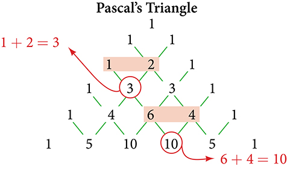\n\n
To generate Pascal’s Triangle, we start by writing a 1. In the row below, row 2, we write two 1’s. In the 3rd row, flank the ends of the rows with 1’s, and add $1+1$ to find the middle number, 2. In the $n\text{th}$ row, flank the ends of the row with 1’s. Each element in the triangle is the sum of the two elements immediately above it.
To see the connection between Pascal’s Triangle and binomial coefficients, let us revisit the expansion of the binomials in general form.

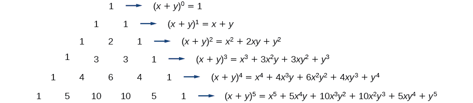

The Binomial Theorem
====================

The **Binomial Theorem** is a formula that can be used to expand any binomial.

 $$
\begin{array}{ll}{(x+y)}^{n}\hfill & ={\displaystyle \sum _{k=0}^{n}\left(\begin{array}{c}n\\ k\end{array}\right){x}^{n-k}{y}^{k}}\hfill \\ \hfill & ={x}^{n}+\left(\begin{array}{c}n\\ 1\end{array}\right){x}^{n-1}y+\left(\begin{array}{c}n\\ 2\end{array}\right){x}^{n-2}{y}^{2}+\mathrm{...}+\left(\begin{array}{c}n\\ n-1\end{array}\right)x{y}^{n-1}+{y}^{n}\hfill \end{array}
$$ 

How To
*Given a binomial, write it in expanded form.*
Determine the value of $n$ according to the exponent.
Evaluate the $k=0$ through $k=n$ using the Binomial Theorem formula.
Simplify.

Expanding a Binomial
====================

Write in expanded form.

ⓐ ${(x+y)}^{5}$ 
ⓑ ${\left(3x-y\right)}^{4}$ 

ⓐSubstitute $n=5$ into the formula. Evaluate the $k=0$ through $k=5$ terms. Simplify.
 $$
\begin{array}{ll}{(x+y)}^{5}\hfill & =\left(\begin{array}{c}5\\ 0\end{array}\right){x}^{5}{y}^{0}+\left(\begin{array}{c}5\\ 1\end{array}\right){x}^{4}{y}^{1}+\left(\begin{array}{c}5\\ 2\end{array}\right){x}^{3}{y}^{2}+\left(\begin{array}{c}5\\ 3\end{array}\right){x}^{2}{y}^{3}+\left(\begin{array}{c}5\\ 4\end{array}\right){x}^{1}{y}^{4}+\left(\begin{array}{c}5\\ 5\end{array}\right){x}^{0}{y}^{5}\hfill \\ {(x+y)}^{5}\hfill & ={x}^{5}+5{x}^{4}y+10{x}^{3}{y}^{2}+10{x}^{2}{y}^{3}+5x{y}^{4}+{y}^{5}\hfill \end{array}
$$ 

ⓑSubstitute $n=4$ into the formula. Evaluate the $k=0$ through $k=4$ terms. Notice that $3x$ is in the place that was occupied by $x$ and that $\u2013y$ is in the place that was occupied by $y.$ So we substitute them. Simplify.
 $$
\begin{array}{ll}{(3x-y)}^{4}\hfill & =\left(\begin{array}{c}4\\ 0\end{array}\right){(3x)}^{4}{(-y)}^{0}+\left(\begin{array}{c}4\\ 1\end{array}\right){(3x)}^{3}{(-y)}^{1}+\left(\begin{array}{c}4\\ 2\end{array}\right){(3x)}^{2}{(-y)}^{2}+\left(\begin{array}{c}4\\ 3\end{array}\right){(3x)}^{1}{(-y)}^{3}+\left(\begin{array}{c}4\\ 4\end{array}\right){(3x)}^{0}{(-y)}^{4}\hfill \\ {(3x-y)}^{4}\hfill & =81{x}^{4}-108{x}^{3}y+54{x}^{2}{y}^{2}-12x{y}^{3}+{y}^{4}\hfill \end{array}
$$

Analysis
========

Notice the alternating signs in part b. This happens because $(-y)$ raised to odd powers is negative, but $(-y)$ raised to even powers is positive. This will occur whenever the binomial contains a subtraction sign.

Try It

Write in expanded form.

ⓐ ${(x-y)}^{5}$

ⓑ ${(2x+5y)}^{3}$

ⓐ ${x}^{5}-5{x}^{4}y+10{x}^{3}{y}^{2}-10{x}^{2}{y}^{3}+5x{y}^{4}-{y}^{5}$

ⓑ $8{x}^{3}+60{x}^{2}y+150x{y}^{2}+125{y}^{3}$

Using the Binomial Theorem to Find a Single Term
================================================
Expanding a binomial with a high exponent such as ${(x+2y)}^{16}$ can be a lengthy process.
Sometimes we are interested only in a certain term of a binomial expansion. We do not need to fully expand a binomial to find a single specific term.
Note the pattern of coefficients in the expansion of ${(x+y)}^{5}.$

 $$
{(x+y)}^{5}={x}^{5}+\left(\begin{array}{c}5\\ 1\end{array}\right){x}^{4}y+\left(\begin{array}{c}5\\ 2\end{array}\right){x}^{3}{y}^{2}+\left(\begin{array}{c}5\\ 3\end{array}\right){x}^{2}{y}^{3}+\left(\begin{array}{c}5\\ 4\end{array}\right)x{y}^{4}+{y}^{5}
$$ The second term is $\left(\begin{array}{c}5\\ 1\end{array}\right){x}^{4}y.$ The third term is $\left(\begin{array}{c}5\\ 2\end{array}\right){x}^{3}{y}^{2}.$ We can generalize this result.
 $$
\left(\begin{array}{c}n\\ r\end{array}\right){x}^{n-r}{y}^{r}
$$ 

The (r+1)th Term of a Binomial Expansion
========================================

The $(r+1)\text{th}$ term of the **binomial expansion** of ${(x+y)}^{n}$ is:
 $$
\left(\begin{array}{c}n\\ r\end{array}\right){x}^{n-r}{y}^{r}
$$ 
 
How To
*Given a binomial, write a specific term without fully expanding.*

Determine the value of $n$ according to the exponent.
Determine $(r+1).$ 
Determine $r.$ 
Replace $r$ in the formula for the $(r+1)\text{th}$ term of the binomial expansion.

Writing a Given Term of a Binomial Expansion
============================================

Find the tenth term of ${(x+2y)}^{16}$ without fully expanding the binomial.

Because we are looking for the tenth term, $r+1=10,$ we will use $r=9$ in our calculations.
 $$
\left(\begin{array}{c}n\\ r\end{array}\right){x}^{n-r}{y}^{r}
$$ 
 $$
\left(\begin{array}{c}16\\ 9\end{array}\right){x}^{16-9}{(2y)}^{9}=5\text{,}857\text{,}280{x}^{7}{y}^{9}
$$

Try It

Find the sixth term of ${(3x-y)}^{9}$ without fully expanding the binomial.

$-10,206{x}^{4}{y}^{5}$

Media
Access these online resources for additional instruction and practice with binomial expansion.

The Binomial Theorem
Binomial Theorem Example

Key Equations
=============

Binomial Theorem
 ${(x+y)}^{n}={\displaystyle \sum _{k-0}^{n}\left(\begin{array}{c}n\\ k\end{array}\right)}{x}^{n-k}{y}^{k}$

 $(r+1)th$ term of a binomial expansion
 $\left(\begin{array}{c}n\\ r\end{array}\right){x}^{n-r}{y}^{r}$

Key Concepts
============

 $\left(\begin{array}{c}n\\ r\end{array}\right)$ is called a binomial coefficient and is equal to $C(n,r).$ See .
The Binomial Theorem allows us to expand binomials without multiplying. See .
We can find a given term of a binomial expansion without fully expanding the binomial. See .

Section Exercises
=================

Verbal
======

What is a binomial coefficient, and how it is calculated?

A binomial coefficient is an alternative way of denoting the combination $C(n,r).$ It is defined as $\left(\begin{array}{c}n\\ r\end{array}\right)=\phantom{\rule{0.5em}{0ex}}C(n,r)\phantom{\rule{0.5em}{0ex}}=\frac{n!}{r!(n-r)!}.$

What role do binomial coefficients play in a binomial expansion? Are they restricted to any type of number?

What is the Binomial Theorem and what is its use?

The Binomial Theorem is defined as ${(x+y)}^{n}={\displaystyle \sum _{k=0}^{n}\left(\begin{array}{c}n\\ k\end{array}\right){x}^{n-k}}{y}^{k}$ and can be used to expand any binomial.

 

When is it an advantage to use the Binomial Theorem? Explain.

Algebraic
=========

For the following exercises, evaluate the binomial coefficient.

$\left(\begin{array}{c}6\\ 2\end{array}\right)$

15

$\left(\begin{array}{c}5\\ 3\end{array}\right)$

$\left(\begin{array}{c}7\\ 4\end{array}\right)$

35

$\left(\begin{array}{c}9\\ 7\end{array}\right)$

$\left(\begin{array}{c}10\\ 9\end{array}\right)$

10

$\left(\begin{array}{c}25\\ 11\end{array}\right)$

$\left(\begin{array}{c}17\\ 6\end{array}\right)$

12,376

$\left(\begin{array}{c}200\\ 199\end{array}\right)$

For the following exercises, use the Binomial Theorem to expand each binomial.

${(4a-b)}^{3}$

$64{a}^{3}-48{a}^{2}b+12a{b}^{2}-{b}^{3}$

${(5a+2)}^{3}$

${(3a+2b)}^{3}$

$27{a}^{3}+54{a}^{2}b+36a{b}^{2}+8{b}^{3}$

${(2x+3y)}^{4}$

${(4x+2y)}^{5}$

$1024{x}^{5}+2560{x}^{4}y+2560{x}^{3}{y}^{2}+1280{x}^{2}{y}^{3}+320x{y}^{4}+32{y}^{5}$

${(3x-2y)}^{4}$

${(4x-3y)}^{5}$

$1024{x}^{5}-3840{x}^{4}y+5760{x}^{3}{y}^{2}-4320{x}^{2}{y}^{3}+1620x{y}^{4}-243{y}^{5}$

${\left(\frac{1}{x}+3y\right)}^{5}$

${({x}^{-1}+2{y}^{-1})}^{4}$

$\frac{1}{{x}^{4}}+\frac{8}{{x}^{3}y}+\frac{24}{{x}^{2}{y}^{2}}+\frac{32}{x{y}^{3}}+\frac{16}{{y}^{4}}$

${(\sqrt{x}-\sqrt{y})}^{5}$

For the following exercises, use the Binomial Theorem to write the first three terms of each binomial.

${(a+b)}^{17}$

${a}^{17}+17{a}^{16}b+136{a}^{15}{b}^{2}$

${(x-1)}^{18}$

${(a-2b)}^{15}$

${a}^{15}-30{a}^{14}b+420{a}^{13}{b}^{2}$

${(x-2y)}^{8}$

${(3a+b)}^{20}$

$3,486,784,401{a}^{20}+23,245,229,340{a}^{19}b+73,609,892,910{a}^{18}{b}^{2}$

${(2a+4b)}^{7}$

${({x}^{3}-\sqrt{y})}^{8}$

${x}^{24}-8{x}^{21}\sqrt{y}+28{x}^{18}y$

For the following exercises, find the indicated term of each binomial without fully expanding the binomial.

The fourth term of ${(2x-3y)}^{4}$

The fourth term of ${(3x-2y)}^{5}$

$-720{x}^{2}{y}^{3}$

The third term of ${(6x-3y)}^{7}$

The eighth term of ${(7+5y)}^{14}$

$220,812,466,875,000{y}^{7}$

The seventh term of ${(a+b)}^{11}$

The fifth term of ${(x-y)}^{7}$

$35{x}^{3}{y}^{4}$

The tenth term of ${(x-1)}^{12}$

The ninth term of ${(a-3{b}^{2})}^{11}$

$1,082,565{a}^{3}{b}^{16}$

The fourth term of $\phantom{\rule{0.5em}{0ex}}{\left({x}^{3}-\frac{1}{2}\right)}^{10}$

The eighth term of $\phantom{\rule{0.5em}{0ex}}{\left(\frac{y}{2}+\frac{2}{x}\right)}^{9}$

$\frac{1152{y}^{2}}{{x}^{7}}$

Graphical
=========

For the following exercises, use the Binomial Theorem to expand the binomial $f(x)={(x+3)}^{4}.$ Then find and graph each indicated sum on one set of axes.

Find and graph ${f}_{1}(x),$ such that ${f}_{1}(x)$ is the first term of the expansion.

Find and graph ${f}_{2}(x),$ such that ${f}_{2}(x)$ is the sum of the first two terms of the expansion.

${f}_{2}(x)={x}^{4}+12{x}^{3}$

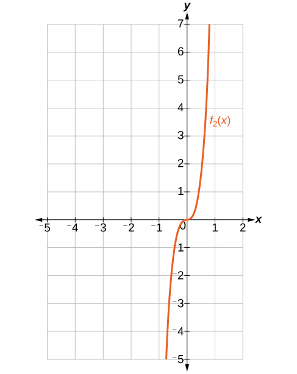

Find and graph ${f}_{3}(x),$ such that ${f}_{3}(x)$ is the sum of the first three terms of the expansion.

Find and graph ${f}_{4}(x),$ such that ${f}_{4}(x)$ is the sum of the first four terms of the expansion.

${f}_{4}(x)={x}^{4}+12{x}^{3}+54{x}^{2}+108x$

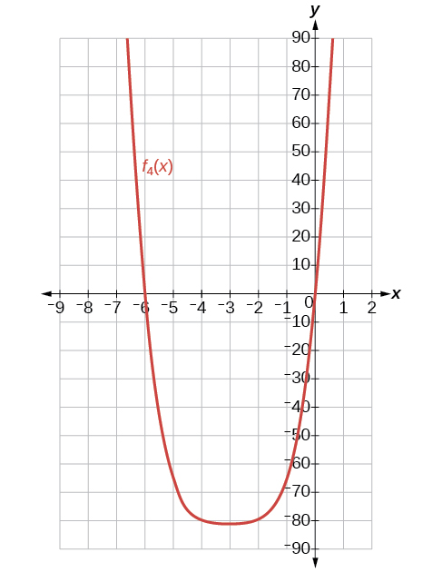

Find and graph ${f}_{5}(x),$ such that ${f}_{5}(x)$ is the sum of the first five terms of the expansion.

Extensions
==========

In the expansion of ${(5x+3y)}^{n},$ each term has the form $\left(\begin{array}{c}n\\ k\end{array}\right){a}^{n\u2013k}{b}^{k}$, where $k$ successively takes on the value $0,1,2,\phantom{\rule{0.3em}{0ex}}\mathrm{...},\phantom{\rule{0.3em}{0ex}}n.$ If $\left(\begin{array}{c}n\\ k\end{array}\right)=\left(\begin{array}{c}7\\ 2\end{array}\right),$ what is the corresponding term?

$590,625{x}^{5}{y}^{2}$

In the expansion of ${\left(a+b\right)}^{n},$ the coefficient of ${a}^{n-k}{b}^{k}$ is the same as the coefficient of which other term?

Consider the expansion of $\phantom{\rule{0.5em}{0ex}}{(x+b)}^{40}.$ What is the exponent of $b$ in the $k\text{th}$ term?

$k-1$

Find $\phantom{\rule{0.5em}{0ex}}\left(\begin{array}{c}n\\ k-1\end{array}\right)+\left(\begin{array}{c}n\\ k\end{array}\right)$ and write the answer as a binomial coefficient in the form $\phantom{\rule{0.5em}{0ex}}\left(\begin{array}{c}n\\ k\end{array}\right).$ Prove it. *Hint:* Use the fact that, for any integer $p,$ such that $p\ge 1,\phantom{\rule{0.5em}{0ex}}p!=p(p-1)!\text{.}$

Which expression cannot be expanded using the Binomial Theorem? Explain.

 $({x}^{2}-2x+1)$

 ${(\sqrt{a}+4\sqrt{a}-5)}^{8}$

 ${({x}^{3}+2{y}^{2}-z)}^{5}$

 ${(3{x}^{2}-\sqrt{2{y}^{3}})}^{12}$

The expression ${({x}^{3}+2{y}^{2}-z)}^{5}$ cannot be expanded using the Binomial Theorem because it cannot be rewritten as a binomial.

**binomial coefficient**
the number of ways to choose*r* objects from *n* objects where order does not matter; equivalent to $C(n,r),$ denoted $\left(\begin{array}{c}n\\ r\end{array}\right)$

**binomial expansion**
the result of expanding ${(x+y)}^{n}$ by multiplying

**Binomial Theorem**
a formula that can be used to expand any binomial
