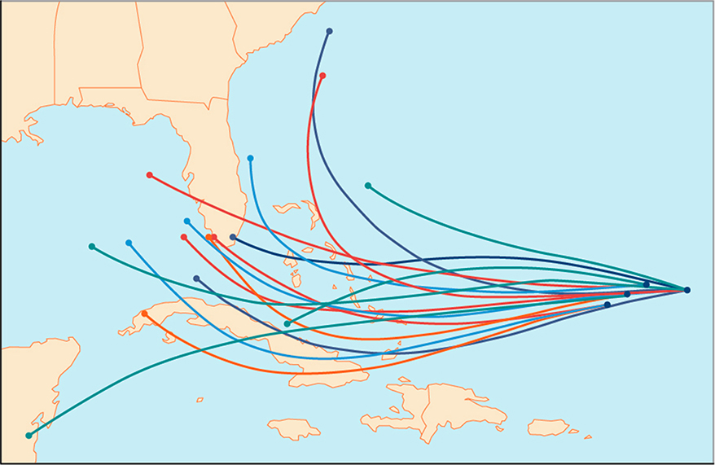

Probability
===========

  m49450
  
Probability
===========

  In this section, you will:

Construct probability models.
Compute probabilities of equally likely outcomes.
Compute probabilities of the union of two events.
Use the complement rule to find probabilities.
Compute probability using counting theory.

  0dfbb287-a541-4944-8ce7-5a848962a2ca

Learning Objectives
===================
Introduction to Sample Spaces and Computing Basic Probabilities.

Objective 1: Introduction to Sample Spaces and Computing Basic Probabilities.
=============================================================================
Many events in life are inherently uncertain: will it snow tomorrow? Am I going to get an ‘A’ in this course? None of these questions can be answered with certainty, however, we might say that some are unlikely, and others are more likely.
The **probability of an event** is a description of how likely it is that an event will happen. A probability is a number between *0* and *1* (that is, between 0% and 100%), where probabilities closer to 100% are very likely to occur, and probabilities closer to 0% are very unlikely to occur. A probability of 0% means the event is impossible, and a probability of 100% means the event will certainly occur.
A **probability model** is a mathematical description of an experiment listing all possible outcomes and their associated probabilities. It is defined by its sample space, events within the sample space, and probabilities associated with each event.
The **sample space S** for a probability model is the set of all possible outcomes. For example, the sample space for rolling a dice is the set 1,2,3,4,5,6.This notation is referred to as **roster notation**.
An event A is a subset of the sample space S. For example, the event “Rolling an even number” is the subset 2,4,6.
To calculate the probability of an event, we divide the number of possible outcomes of the event by the number of possible outcomes of the sample space.
 $$\mathrm{P}(\mathrm{outcome})=\frac{\mathrm{Number}\ \mathrm{of}\ \mathrm{ways}\ \mathrm{that}\ \mathrm{outcome}\ \mathrm{can}\ \mathrm{occur}}{\mathrm{Total}\ \mathrm{number}\ \mathrm{of}\ \mathrm{outcomes}}$$ It is important to note that in order to use this formula, *all outcomes must be equally likely to happen*.
For example, the probability of rolling an even number with a standard dice is:
 $$\mathrm{P}(\mathrm{even\; numbers})=\frac{3\ \mathrm{even}\ \mathrm{numbers}}{6\ \mathrm{total}\ \mathrm{numbers}}=\frac{3}{6}=\frac{1}{2}$$ 
Basic Probability. (Simple intro to sample spaces)
==================================================

  Tossing a coin:

ⓐ Describe in set notation the sample space of tossing a coin.
ⓑ Find the probability of “Coin lands on heads.”

  Rolling a die:

ⓐ Describe in set notation the event “Rolling an odd number.”
ⓑ Find the probability of “Rolling an odd number.”

  Drawing a card:

ⓐ Describe in set notation the event “Drawing an Ace.”
ⓑ Find the probability of “Drawing an Ace.”

Tossing a coin:
ⓐ When you toss a coin, there are two outcomes. The sample space is: Heads, Tails.
ⓑ There is only one outcome for the coin landing on heads, so P(Lands on Heads)=12.

Rolling a die:
	ⓐ When you roll a dice, there are six outcomes. The event "Rolling an odd number" has three outcomes. The event is set notation is: 1,3,5.
	ⓑ P(rolling an odd number)=36=12.

Drawing a card:
ⓐ When you draw a card, there are 52 outcomes. The event "Drawing an Ace" has four outcomes. The event in set notation is:Ace of hearts, Ace of diamonds, Ace of clubs, Ace of spades.
ⓑ P(Drawing an Ace)=452=113.

Practice Makes Perfect
======================

Spinning a dial:

ⓐ

Describe the sample space in set notation.

ⓑ
Find the probability of “Dial stops on a yellow slice.”

ⓒ
Find the probability of “Dial stops on a red slice.”

ⓓ
Find the probability of “Dial stops on a blue slice.”

Draw a diagram showing the sample space of a standard deck of 52 cards. Begin by distinguishing between red and black cards showing the number of each. Next show the suits: diamonds, hearts, clubs and spades.  Below this list the number or face card appearing in each suit. Use your diagram to help you find the following.

ⓐ
Describe in set notation the event “Drawing a king.”

ⓑ
Find the probability of “Drawing a king.”

ⓒ
Describe in set notation the event “Drawing a club.”

ⓓ
Find the probability of “Drawing a club.”

ⓔ
Find the probability of “Drawing a red six.”

ⓕ
Find the probability of “Drawing a black queen.”

\n\n\n\nResidents of the Southeastern United States are all too familiar with charts, known as spaghetti models, such as the one in . They combine a collection of weather data to predict the most likely path of a hurricane. Each colored line represents one possible path. The group of squiggly lines can begin to resemble strands of spaghetti, hence the name. In this section, we will investigate methods for making these types of predictions.

Constructing Probability Models
===============================
Suppose we roll a six-sided number cube. Rolling a number cube is an example of an **experiment**, or an activity with an observable result. The numbers on the cube are possible results, or **outcomes**, of this experiment. The set of all possible outcomes of an experiment is called the **sample space** of the experiment. The sample space for this experiment is $$\left\{1,2,3,4,5,6\right\}.$$ An **event** is any subset of a sample space.
The likelihood of an event is known as **probability**. The probability of an event $$p$$ is a number that always satisfies $$0\le p\le 1,$$ where 0 indicates an impossible event and 1 indicates a certain event. A **probability model** is a mathematical description of an experiment listing all possible outcomes and their associated probabilities. For instance, if there is a 1% chance of winning a raffle and a 99% chance of losing the raffle, a probability model would look much like .

Outcome
Probability

Winning the raffle
1%

Losing the raffle
99%

The sum of the probabilities listed in a probability model must equal 1, or 100%.

How To
*Given a probability event where each event is equally likely, construct a probability model.*

Identify every outcome.
Determine the total number of possible outcomes.
Compare each outcome to the total number of possible outcomes.

Constructing a Probability Model
================================

Construct a probability model for rolling a single, fair die, with the event being the number shown on the die.

Begin by making a list of all possible outcomes for the experiment. The possible outcomes are the numbers that can be rolled: 1, 2, 3, 4, 5, and 6. There are six possible outcomes that make up the sample space.

Assign probabilities to each outcome in the sample space by determining a ratio of the outcome to the number of possible outcomes. There is one of each of the six numbers on the cube, and there is no reason to think that any particular face is more likely to show up than any other one, so the probability of rolling any number is $$\frac{1}{6}.$$

*Outcome*
Roll of 1
Roll of 2
Roll of 3
Roll of 4
Roll of 5
Roll of 6

*Probability*
 $$\frac{1}{6}$$

 $$\frac{1}{6}$$

 $$\frac{1}{6}$$

 $$\frac{1}{6}$$

 $$\frac{1}{6}$$

 $$\frac{1}{6}$$

Q&A
*Do probabilities always have to be expressed as fractions?*

***No. Probabilities can be expressed as fractions, decimals, or percents. Probability must always be a number between 0 and 1, inclusive of 0 and 1.*

Try It
Construct a probability model for tossing a fair coin.

Outcome
Probability

Heads
 $$\frac{1}{2}$$ 

Tails
 $$\frac{1}{2}$$ 

Computing Probabilities of Equally Likely Outcomes
==================================================

Let $$S$$ be a sample space for an experiment. When investigating probability, an event is any subset of $$S.$$ When the outcomes of an experiment are all equally likely, we can find the probability of an event by dividing the number of outcomes in the event by the total number of outcomes in $$S.$$ Suppose a number cube is rolled, and we are interested in finding the probability of the event “rolling a number less than or equal to 4.” There are 4 possible outcomes in the event and 6 possible outcomes in $$S,$$ so the probability of the event is $$\frac{4}{6}=\frac{2}{3}.$$

Computing the Probability of an Event with Equally Likely Outcomes
==================================================================

The probability of an event $$E$$ in an experiment with sample space $$S$$ with equally likely outcomes is given by
 $$
P\left(E\right)=\frac{\text{number\ of\ elements\ in\}E}{\text{number\ of\ elements\ in\}S}=\frac{n\left(E\right)}{n\left(S\right)}
$$
$$E$$ is a subset of $$S,$$ so it is always true that $$0\le P(E)\le 1.$$

Computing the Probability of an Event with Equally Likely Outcomes
==================================================================

A six-sided number cube is rolled. Find the probability of rolling an odd number.

The event “rolling an odd number” contains three outcomes. There are 6 equally likely outcomes in the sample space. Divide to find the probability of the event.

 $$
P(E)=\frac{3}{6}=\frac{1}{2}
$$ 

Try It

A number cube is rolled. Find the probability of rolling a number greater than 2.

$$\frac{2}{3}$$

Computing the Probability of the Union of Two Events
====================================================

We are often interested in finding the probability that one of multiple events occurs. Suppose we are playing a card game, and we will win if the next card drawn is either a heart or a king. We would be interested in finding the probability of the next card being a heart or a king. The **union of two events** $$E\phantom{\rule{0.5em}{0ex}}\text{and\}F,\text{written\}E\cup F,$$ is the event that occurs if either or both events occur.
 $$
P(E\cup F)=P(E)+P(F)-P(E\cap F)
$$ Suppose the spinner in  is spun. We want to find the probability of spinning orange or spinning a $$b.$$
\n\n\n\nThere are a total of 6 sections, and 3 of them are orange. So the probability of spinning orange is $$\frac{3}{6}=\frac{1}{2}.$$ There are a total of 6 sections, and 2 of them have a $$b.$$ So the probability of spinning a $$b$$ is $$\frac{2}{6}=\frac{1}{3}.$$ If we added these two probabilities, we would be counting the sector that is both orange and a $$b$$ twice. To find the probability of spinning an orange or a $$b,$$ we need to subtract the probability that the sector is both orange and has a $$b.$$
 $$
\frac{1}{2}+\frac{1}{3}-\frac{1}{6}=\frac{2}{3}
$$ The probability of spinning orange or a $$b$$ is $$\frac{2}{3}.$$

Probability of the Union of Two Events
======================================

The probability of the union of two events $$E$$ and $$F$$ (written $$E\cup F$$ ) equals the sum of the probability of $$E$$ and the probability of $$F$$ minus the probability of $$E$$ and $$F$$ occurring together $$\text{(}$$ which is called the **intersection** of $$E$$ and $$F$$ and is written as $$E\cap F$$ ).
 $$
P(E\cup F)=P(E)+P(F)-P(E\cap F)
$$ 

Computing the Probability of the Union of Two Events
====================================================

A card is drawn from a standard deck. Find the probability of drawing a heart or a 7.

A standard deck contains an equal number of hearts, diamonds, clubs, and spades. So the probability of drawing a heart is $$\frac{1}{4}.$$ There are four 7s in a standard deck, and there are a total of 52 cards. So the probability of drawing a 7 is $$\frac{1}{13}.$$

The only card in the deck that is both a heart and a 7 is the 7 of hearts, so the probability of drawing both a heart and a 7 is $$\frac{1}{52}.$$ Substitute $$P(H)=\frac{1}{4},\ P(7)=\frac{1}{13},\ \text{and}\ P(H\cap 7)=\frac{1}{52}$$ into the formula.

 $$\begin{array}{l}P(E{{\displaystyle \cup}}^{\text{}}F)=P(E)+P(F)-P(E{{\displaystyle \cap}}^{\text{}}F)\hfill \\ \phantom{\rule{0.5em}{0ex}}\text{\ \ \ \ \ \ \ \ \ \ \ \ \ \}=\frac{1}{4}+\frac{1}{13}-\frac{1}{52}\hfill \\ \phantom{\rule{0.5em}{0ex}}\text{\ \ \ \ \ \ \ \ \ \ \ \ \ \}=\frac{4}{13}\hfill \end{array}$$ 

The probability of drawing a heart or a 7 is $$\frac{4}{13}.$$

Try It

A card is drawn from a standard deck. Find the probability of drawing a red card or an ace.

$$\frac{7}{13}$$

Computing the Probability of Mutually Exclusive Events
======================================================
Suppose the spinner in  is spun again, but this time we are interested in the probability of spinning an orange or a $$d.$$ There are no sectors that are both orange and contain a $$d,$$ so these two events have no outcomes in common. Events are said to be **mutually exclusive events** when they have no outcomes in common. Because there is no overlap, there is nothing to subtract, so the general formula is
 $$
P(E\cup F)=P(E)+P(F)
$$ Notice that with mutually exclusive events, the intersection of $$E$$ and $$F$$ is the empty set. The probability of spinning an orange is $$\frac{3}{6}=\frac{1}{2}$$ and the probability of spinning a $$d$$ is $$\frac{1}{6}.$$ We can find the probability of spinning an orange or a $$d$$ simply by adding the two probabilities.
 $$
\begin{array}{l}P(E{{\displaystyle \cup}}^{\text{}}F)=P(E)+P(F)\hfill \\ \phantom{\rule{0.5em}{0ex}}\text{\ \ \ \ \ \ \ \ \ \ \ \ \ \}=\frac{1}{2}+\frac{1}{6}\hfill \\ \phantom{\rule{0.5em}{0ex}}\text{\ \ \ \ \ \ \ \ \ \ \ \ \ \}=\frac{2}{3}\hfill \end{array}
$$
The probability of spinning an orange or a $$d$$ is $$\frac{2}{3}.$$

Probability of the Union of Mutually Exclusive Events
=====================================================

The probability of the union of two *mutually exclusive* events $$E\phantom{\rule{0.5em}{0ex}}\text{and}\phantom{\rule{0.5em}{0ex}}F$$ is given by
 $$
P(E\cup F)=P(E)+P(F)
$$ 

How To
*Given a set of events, compute the probability of the union of mutually exclusive events.*

Determine the total number of outcomes for the first event.
Find the probability of the first event.
Determine the total number of outcomes for the second event.
Find the probability of the second event.
Add the probabilities.

Computing the Probability of the Union of Mutually Exclusive Events
===================================================================

A card is drawn from a standard deck. Find the probability of drawing a heart or a spade.

The events “drawing a heart” and “drawing a spade” are mutually exclusive because they cannot occur at the same time. The probability of drawing a heart is $$\frac{1}{4},$$ and the probability of drawing a spade is also $$\frac{1}{4},$$ so the probability of drawing a heart or a spade is

 $$
\frac{1}{4}+\frac{1}{4}=\frac{1}{2}
$$ 

Try It

A card is drawn from a standard deck. Find the probability of drawing an ace or a king.

$$\frac{2}{13}$$

Using the Complement Rule to Compute Probabilities
==================================================

We have discussed how to calculate the probability that an event will happen. Sometimes, we are interested in finding the probability that an event will *not* happen. The *complement of an event* $$E,$$ denoted $${E}^{\prime},$$ is the set of outcomes in the sample space that are not in $$E.$$ For example, suppose we are interested in the probability that a horse will lose a race. If event $$W$$ is the horse winning the race, then the complement of event $$W$$ is the horse losing the race.
To find the probability that the horse loses the race, we need to use the fact that the sum of all probabilities in a probability model must be 1.

 $$
P({E}^{\prime})=1-P(E)
$$ The probability of the horse winning added to the probability of the horse losing must be equal to 1. Therefore, if the probability of the horse winning the race is $$\frac{1}{9},$$ the probability of the horse losing the race is simply

 $$
1-\frac{1}{9}=\frac{8}{9}
$$ 

The Complement Rule
===================

The probability that the **complement of an event** will occur is given by

 $$
P({E}^{\prime})=1-P(E)
$$ 

Using the Complement Rule to Calculate Probabilities
====================================================

Two six-sided number cubes are rolled.

ⓐFind the probability that the sum of the numbers rolled is less than or equal to 3.
ⓑFind the probability that the sum of the numbers rolled is greater than 3.

The first step is to identify the sample space, which consists of all the possible outcomes. There are two number cubes, and each number cube has six possible outcomes. Using the Multiplication Principle, we find that there are $$6\times 6,$$ or $$\phantom{\rule{0.5em}{0ex}}\text{36\}$$ total possible outcomes. So, for example, 1-1 represents a 1 rolled on each number cube.

 $$\text{1-1}$$

 $$\text{1-2}$$ 
 $$\text{1-3}$$ 
 $$\text{1-4}$$ 
 $$\text{1-5}$$ 
 $$\text{1-6}$$ 

 $$\text{2-1}$$ 
 $$\text{2-2}$$ 
 $$\text{2-3}$$ 
 $$\text{}$$ $$\text{2-4}$$ 
 $$\text{2-5}$$ 
 $$\text{2-6}$$ 

 $$\text{3-1}$$ 
 $$\text{3-2}$$ 
 $$\text{3-3}$$ 
 $$\text{3-4}$$ 
 $$\text{3-5}$$ 
 $$\text{3-6}$$ 

 $$\text{4-1}$$ 
 $$\text{4-2}$$ 
 $$\text{4-3}$$ 
 $$\text{4-4}$$ 
 $$\text{4-5}$$ 
 $$\text{4-6}$$ 

 $$\text{5-1}$$ 
 $$\text{5-2}$$ 
 $$\text{5-3}$$ 
 $$\text{5-4}$$ 
 $$\text{5-5}$$ 
 $$\text{5-6}$$ 

 $$\text{6-1}$$ 
 $$\text{6-2}$$ 
 $$\text{6-3}$$ 
 $$\text{6-4}$$ 
 $$\text{6-5}$$ 
 $$\text{6-6}$$ 

ⓐWe need to count the number of ways to roll a sum of 3 or less. These would include the following outcomes: 1-1, 1-2, and 2-1. So there are only three ways to roll a sum of 3 or less. The probability is $$\frac{3}{36}=\frac{1}{12}$$ 

ⓑRather than listing all the possibilities, we can use the Complement Rule. Because we have already found the probability of the complement of this event, we can simply subtract that probability from 1 to find the probability that the sum of the numbers rolled is greater than 3.
 $$
\begin{array}{l}P({E}^{\prime})=1-P(E)\hfill \\ \phantom{\rule{0.5em}{0ex}}\text{\ \ \ \ \ \ \ \}=1-\frac{1}{12}\hfill \\ \phantom{\rule{0.5em}{0ex}}\text{\ \ \ \ \ \ \ \}=\frac{11}{12}\hfill \end{array}
$$

Try It

Two number cubes are rolled. Use the Complement Rule to find the probability that the sum is less than 10.

$$\frac{5}{6}$$

Computing Probability Using Counting Theory
===========================================

Many interesting probability problems involve counting principles, permutations, and combinations. In these problems, we will use permutations and combinations to find the number of elements in events and sample spaces. These problems can be complicated, but they can be made easier by breaking them down into smaller counting problems.

Assume, for example, that a store has 8 cellular phones and that 3 of those are defective. We might want to find the probability that a couple purchasing 2 phones receives 2 phones that are not defective. To solve this problem, we need to calculate all of the ways to select 2 phones that are not defective as well as all of the ways to select 2 phones. There are 5 phones that are not defective, so there are $$C(5,2)$$ ways to select 2 phones that are not defective. There are 8 phones, so there are $$C(8,2)$$ ways to select 2 phones. The probability of selecting 2 phones that are not defective is:

 $$
\begin{array}{l}\frac{\text{ways\ to\ select\ 2\ phones\ that\ are\ not\ defective}}{\text{ways\ to\ select\ 2\ phones}}=\frac{C(5,2)}{C(8,2)}\hfill \\ \phantom{\rule{16.5em}{0ex}}=\frac{10}{28}\hfill \\ \phantom{\rule{16.5em}{0ex}}=\frac{5}{14}\hfill \end{array}
$$

Computing Probability Using Counting Theory
===========================================

A child randomly selects 5 toys from a bin containing 3 bunnies, 5 dogs, and 6 bears.

ⓐFind the probability that only bears are chosen.
ⓑFind the probability that 2 bears and 3 dogs are chosen.
ⓒFind the probability that at least 2 dogs are chosen.

ⓐWe need to count the number of ways to choose only bears and the total number of possible ways to select 5 toys. There are 6 bears, so there are $$C(6,5)$$ ways to choose 5 bears. There are 14 toys, so there are $$C(14,5)$$ ways to choose any 5 toys.
 $$
\frac{C(6\text{,}5)}{C(14\text{,}5)}=\frac{6}{2\text{,}002}=\frac{3}{1\text{,}001}
$$

ⓑWe need to count the number of ways to choose 2 bears and 3 dogs and the total number of possible ways to select 5 toys. There are 6 bears, so there are $$C(6,2)$$ ways to choose 2 bears. There are 5 dogs, so there are $$C(5,3)$$ ways to choose 3 dogs. Since we are choosing both bears and dogs at the same time, we will use the Multiplication Principle. There are $$C(6,2)\cdot C(5,3)$$ ways to choose 2 bears and 3 dogs. We can use this result to find the probability.
 $$
\frac{C(6\text{,}2)C(5\text{,}3)}{C(14\text{,}5)}=\frac{15\cdot 10}{2\text{,}002}=\frac{75}{1\text{,}001}
$$

ⓒIt is often easiest to solve “at least” problems using the Complement Rule. We will begin by finding the probability that fewer than 2 dogs are chosen. If less than 2 dogs are chosen, then either no dogs could be chosen, or 1 dog could be chosen.

When no dogs are chosen, all 5 toys come from the 9 toys that are not dogs. There are $$C(9,5)$$ ways to choose toys from the 9 toys that are not dogs. Since there are 14 toys, there are $$C(14,5)$$ ways to choose the 5 toys from all of the toys.

 $$
\frac{C(9\text{,}5)}{C(14\text{,}5)}=\frac{63}{1\text{,}001}
$$

If there is 1 dog chosen, then 4 toys must come from the 9 toys that are not dogs, and 1 must come from the 5 dogs. Since we are choosing both dogs and other toys at the same time, we will use the Multiplication Principle. There are $$C(5,1)\cdot C(9,4)$$ ways to choose 1 dog and 1 other toy.
 $$
\frac{C(5\text{,}1)C(9\text{,}4)}{C(14\text{,}5)}=\frac{5\cdot 126}{2\text{,}002}=\frac{315}{1\text{,}001}
$$
Because these events would not occur together and are therefore mutually exclusive, we add the probabilities to find the probability that fewer than 2 dogs are chosen.

 $$
\frac{63}{1\text{,}001}+\frac{315}{1\text{,}001}=\frac{378}{1\text{,}001}
$$
We then subtract that probability from 1 to find the probability that at least 2 dogs are chosen.

 $$
1-\frac{378}{1\text{,}001}=\frac{623}{1\text{,}001}
$$

Try It

A child randomly selects 3 gumballs from a container holding 4 purple gumballs, 8 yellow gumballs, and 2 green gumballs.

ⓐFind the probability that all 3 gumballs selected are purple.
ⓑFind the probability that no yellow gumballs are selected.
ⓒFind the probability that at least 1 yellow gumball is selected.

$$\begin{array}{lll}\text{a}\text{.\}\frac{1}{91};\hfill & \text{b}\text{.\}\frac{\text{5}}{\text{91}};\hfill & \text{c}\text{.\}\frac{86}{91}\hfill \end{array}$$

Media
Access these online resources for additional instruction and practice with probability.

Introduction to Probability
Determining Probability

Key Equations
=============

probability of an event with equally likely outcomes
 $$P(E)=\frac{n(E)}{n(S)}$$

probability of the union of two events
 $$P(E\cup F)=P(E)+P(F)-P(E\cap F)$$

probability of the union of mutually exclusive events
 $$P(E\cup F)=P(E)+P(F)$$

probability of the complement of an event
 $$P(E\text{'})=1-P(E)$$

Key Concepts
============

Probability is always a number between 0 and 1, where 0 means an event is impossible and 1 means an event is certain.
The probabilities in a probability model must sum to 1. See .
When the outcomes of an experiment are all equally likely, we can find the probability of an event by dividing the number of outcomes in the event by the total number of outcomes in the sample space for the experiment. See .
To find the probability of the union of two events, we add the probabilities of the two events and subtract the probability that both events occur simultaneously. See .
To find the probability of the union of two mutually exclusive events, we add the probabilities of each of the events. See .
The probability of the complement of an event is the difference between 1 and the probability that the event occurs. See .
In some probability problems, we need to use permutations and combinations to find the number of elements in events and sample spaces. See .

Section Exercises
=================

Verbal
======

What term is used to express the likelihood of an event occurring? Are there restrictions on its values? If so, what are they? If not, explain.

probability; The probability of an event is restricted to values between $$0$$ and $$1,$$ inclusive of $$0$$ and $$1.$$

What is a sample space?

What is an experiment?

An experiment is an activity with an observable result.

What is the difference between events and outcomes? Give an example of both using the sample space of tossing a coin 50 times.

The *union of two sets* is defined as a set of elements that are present in at least one of the sets. How is this similar to the definition used for the *union of two events* from a probability model? How is it different?

The probability of the *union of two events* occurring is a number that describes the likelihood that at least one of the events from a probability model occurs. In both a union of sets $$A\phantom{\rule{0.5em}{0ex}}\text{}\ \text{and\}B$$ and a union of events $$A\ \text{and}\ B,$$ the union includes either $$A\ \text{or}\ B$$ or both. The difference is that a union of sets results in another set, while the union of events is a probability, so it is always a numerical value between $$0$$ and $$1.$$

Numeric
=======
For the following exercises, use the spinner shown in  to find the probabilities indicated.

\n\n\n\n

Landing on red

Landing on a vowel

$$\frac{1}{2}.$$

Not landing on blue

Landing on purple or a vowel

$$\frac{5}{8}.$$

Landing on blue or a vowel

Landing on green or blue

$$\frac{1}{2}.$$

Landing on yellow or a consonant

Not landing on yellow or a consonant

$$\frac{3}{8}.$$

For the following exercises, two coins are tossed.

What is the sample space?

Find the probability of tossing two heads.

$$\frac{1}{4}.$$

Find the probability of tossing exactly one tail.

Find the probability of tossing at least one tail.

$$\frac{3}{4}.$$

For the following exercises, four coins are tossed.

What is the sample space?

Find the probability of tossing exactly two heads.

$$\frac{3}{8}.$$

Find the probability of tossing exactly three heads.

Find the probability of tossing four heads or four tails.

$$\frac{1}{8}.$$

Find the probability of tossing all tails.

Find the probability of tossing not all tails.

$$\frac{15}{16}.$$

Find the probability of tossing exactly two heads or at least two tails.

Find the probability of tossing either two heads or three heads.

$$\frac{5}{8}.$$

For the following exercises, one card is drawn from a standard deck of $$52$$ cards. Find the probability of drawing the following:

A club

A two

$$\frac{1}{13}.$$

Six  or seven

Red six

$$\frac{1}{26}.$$

An ace or a diamond

A non-ace

$$\frac{12}{13}.$$

A heart or a non-jack

For the following exercises, two dice are rolled, and the results are summed.

Construct a table showing the sample space of outcomes and sums.

1
2
3
4
5
6

*1*
(1,1)2
(1,2)3
(1,3)4
(1,4)5
(1,5)6
(1,6)7

*2*
(2,1)3
(2,2)4
(2,3)5
(2,4)6
(2,5)7
(2,6)8

*3*
(3,1)4
(3,2)5
(3,3)6
(3,4)7
(3,5)8
(3,6)9

*4*
(4,1)5
(4,2)6
(4,3)7
(4,4)8
(4,5)9
(4,6)10

*5*
(5,1)6
(5,2)7
(5,3)8
(5,4)9
(5,5)10
(5,6)11

*6*
(6,1)7
(6,2)8
(6,3)9
(6,4)10
(6,5)11
(6,6)12

Find the probability of rolling a sum of $$3.$$

Find the probability of rolling at least one four or a sum of $$8.$$

$$\frac{5}{12}.$$

Find the probability of rolling an odd sum less than $$9.$$

Find the probability of rolling a sum greater than or equal to $$15.$$

$$0.$$

Find the probability of rolling a sum less than $$15.$$

Find the probability of rolling a sum less than $$6$$ or greater than $$9.$$

$$\frac{4}{9}.$$

Find the probability of rolling a sum between $$6$$ and $$9\text{,}$$ inclusive.

Find the probability of rolling a sum of $$5$$ or $$6.$$

$$\frac{1}{4}.$$

Find the probability of rolling any sum other than $$5$$ or $$6.$$

For the following exercises, a coin is tossed, and a card is pulled from a standard deck. Find the probability of the following:

A head on the coin or a club

$$\frac{5}{8}$$

A tail on the coin or red ace

A head on the coin or a face card

$$\frac{8}{13}$$

No aces

For the following exercises, use this scenario: a bag of M&Ms contains $$12$$ blue, $$6$$ brown, $$10$$ orange, $$8$$ yellow, $$8$$ red, and $$4$$ green M&Ms. Reaching into the bag, a person grabs 5 M&Ms.

What is the probability of getting all blue M&Ms?

$$\frac{C(12,5)}{C(48,5)}=\frac{1}{2162}$$

What is the probability of getting $$4$$ blue M&Ms?

What is the probability of getting $$3$$ blue M&Ms?

$$\frac{C(12,3)C(36,2)}{C(48,5)}=\frac{175}{2162}$$

What is the probability of getting no brown M&Ms?

Extensions
==========

Use the following scenario for the exercises that follow: In the game of Keno, a player starts by selecting $$20$$ numbers from the numbers $$1$$ to $$80.$$ After the player makes his selections, $$20$$ winning numbers are randomly selected from numbers $$1$$ to $$80.$$ A win occurs if the player has correctly selected $$3,4,$$ or $$5$$ of the $$20$$ winning numbers. (Round all answers to the nearest hundredth of a percent.)

What is the percent chance that a player selects exactly 3 winning numbers?

$$\frac{C(20,3)C(60,17)}{C(80,20)}\approx 12.49\%$$

What is the percent chance that a player selects exactly 4 winning numbers?

What is the percent chance that a player selects all 5 winning numbers?

$$\frac{C(20,5)C(60,15)}{C(80,20)}\approx 23.33\%$$

What is the percent chance of winning?

How much less is a player’s chance of selecting 3 winning numbers than the chance of selecting either 4 or 5 winning numbers?

$$20.50+23.33-12.49=31.34\%$$

Real-World Applications
=======================

Use this data for the exercises that follow: In 2013, there were roughly 317 million citizens in the United States, and about 40 million were elderly (aged 65 and over).United States Census Bureau. http://www.census.gov

If you meet a U.S. citizen, what is the percent chance that the person is elderly? (Round to the nearest tenth of a percent.)

If you meet five U.S. citizens, what is the percent chance that exactly one is elderly? (Round to the nearest tenth of a percent.)

$$\frac{C(40000000,1)C(277000000,4)}{C(317000000,5)}=36.78\%$$

If you meet five U.S. citizens, what is the percent chance that three are elderly? (Round to the nearest tenth of a percent.)

If you meet five U.S. citizens, what is the percent chance that four are elderly? (Round to the nearest thousandth of a percent.)

$$\frac{C(40000000,4)C(277000000,1)}{C(317000000,5)}=0.11\%$$

It is predicted that by 2030, one in five U.S. citizens will be elderly. How much greater will the chances of meeting an elderly person be at that time? What policy changes do you foresee if these statistics hold true?

Chapter Review Exercises
========================

Sequences and Their Notation
============================

Write the first four terms of the sequence defined by the recursive formula $${a}_{1}=2,\phantom{\rule{0.5em}{0ex}}{a}_{n}={a}_{n-1}+n.$$

$$2,4,7,11$$

Evaluate $$\frac{6!}{(5-3)!3!}.$$

Write the first four terms of the sequence defined by the explicit formula $${a}_{n}={10}^{n}+3.$$

$$13,103,1003,10003$$

Write the first four terms of the sequence defined by the explicit formula $${a}_{n}=\frac{n!}{n(n+1)}.$$

Arithmetic Sequences
====================

Is the sequence $$\frac{4}{7},\frac{47}{21},\frac{82}{21},\frac{39}{7},\phantom{\rule{0.3em}{0ex}}\mathrm{...}$$ arithmetic? If so, find the common difference.

The sequence is arithmetic. The common difference is $$d=\frac{5}{3}.$$

Is the sequence $$2,4,8,16,\phantom{\rule{0.5em}{0ex}}\mathrm{...}$$ arithmetic? If so, find the common difference.

An arithmetic sequence has the first term $${a}_{1}=18$$ and common difference $$d=-8.$$ What are the first five terms?

$$18,10,2,-6,-14$$

An arithmetic sequence has terms $${a}_{3}=11.7$$
and $${a}_{8}=-\mathrm{14.6.}$$
What is the first term?

Write a recursive formula for the arithmetic sequence $$-20\text{,}-10,0\text{,}10\text{,\u2026}$$

$${a}_{1}=-20,\phantom{\rule{0.5em}{0ex}}\text{}{a}_{n}={a}_{n-1}+10$$

Write a recursive formula for the arithmetic sequence $$0,\phantom{\rule{0.5em}{0ex}}\text{}-\frac{1}{2},\phantom{\rule{0.5em}{0ex}}\text{}-1,\phantom{\rule{0.5em}{0ex}}\text{}-\frac{3}{2},\dots ,$$
and then find the 31st term.

Write an explicit formula for the arithmetic sequence $$\frac{7}{8},\phantom{\rule{0.5em}{0ex}}\text{}\frac{29}{24},\phantom{\rule{0.5em}{0ex}}\text{}\frac{37}{24},\phantom{\rule{0.5em}{0ex}}\text{}\frac{15}{8},\dots $$

$${a}_{n}=\frac{1}{3}n+\frac{13}{24}$$

How many terms are in the finite arithmetic sequence $$12,20,28,\dots ,172?$$

Geometric Sequences
===================

Find the common ratio for the geometric sequence $$2.5,\phantom{\rule{0.5em}{0ex}}\text{}5,\phantom{\rule{0.5em}{0ex}}\text{}10,\phantom{\rule{0.5em}{0ex}}\text{}20,\dots $$

$$r=2$$

Is the sequence 4, 16, 28, 40 … geometric? If so find the common ratio. If not, explain why.

A geometric sequence has terms $${a}_{7}=16\text{,}384$$ and $${a}_{9}=262\text{,}144$$. What are the first five terms?

4, 16, 64, 256, 1024

A geometric sequence has the first term $${a}_{1}\text{=}-3$$ and common ratio $$r=\frac{1}{2}.$$ What is the 8th term?

What are the first five terms of the geometric sequence $${a}_{1}=3,\phantom{\rule{0.5em}{0ex}}\text{}{a}_{n}=4\cdot {a}_{n-1}?$$

$$3,\phantom{\rule{0.5em}{0ex}}\text{}12,\phantom{\rule{0.5em}{0ex}}\text{}48,\phantom{\rule{0.5em}{0ex}}\text{}192,\phantom{\rule{0.5em}{0ex}}\text{}768$$

Write a recursive formula for the geometric sequence $$1,\phantom{\rule{0.5em}{0ex}}\text{}\frac{1}{3},\phantom{\rule{0.5em}{0ex}}\text{}\frac{1}{9},\phantom{\rule{0.5em}{0ex}}\text{}\frac{1}{27},\dots $$

Write an explicit formula for the geometric sequence $$-\frac{1}{5},\phantom{\rule{0.5em}{0ex}}\text{}-\frac{1}{15},\phantom{\rule{0.5em}{0ex}}\text{}-\frac{1}{45},\phantom{\rule{0.5em}{0ex}}\text{}-\frac{1}{135},\dots $$

$${a}_{n}=-\frac{1}{5}\cdot {\left(\frac{1}{3}\right)}^{n-1}$$

How many terms are in the finite geometric sequence $$-5,\ -\frac{5}{3},\ -\frac{5}{9},\dots ,\ -\frac{5}{59\text{,}049}?$$

Series and Their Notation
=========================

Use summation notation to write the sum of terms $$\frac{1}{2}m+5$$
from $$m=0$$
to $$m=5.$$

$${\displaystyle \sum _{m=0}^{5}\left(\frac{1}{2}m+5\right).}$$

Use summation notation to write the sum that results from adding the number $$13$$
twenty times.

Use the formula for the sum of the first $$n$$
terms of an arithmetic series to find the sum of the first eleven terms of the arithmetic series 2.5, 4, 5.5, … .

$${S}_{11}=110$$

A ladder has $$15$$
tapered rungs, the lengths of which increase by a common difference. The first rung is 5 inches long, and the last rung is 20 inches long. What is the sum of the lengths of the rungs?

Use the formula for the sum of the first *n* terms of a geometric series to find $${S}_{9}$$
for the series $$12,\phantom{\rule{0.4em}{0ex}}\text{}6,\phantom{\rule{0.4em}{0ex}}\text{}3,\phantom{\rule{0.4em}{0ex}}\text{}\frac{3}{2},\dots $$

$${S}_{9}\approx 23.95$$

The fees for the first three years of a hunting club membership are given in . If fees continue to rise at the same rate, how much will the total cost be for the first ten years of membership?

Year
Membership Fees

1
$1500

2
$1950

3
$2535

Find the sum of the infinite geometric series $${\displaystyle \sum}_{k=1}^{\infty}45\cdot {(-\frac{1}{3})}^{k-1}.$$

$$S=\frac{135}{4}$$

A ball has a bounce-back ratio of $$\frac{3}{5}$$
the height of the previous bounce. Write a series representing the total distance traveled by the ball, assuming it was initially dropped from a height of 5 feet. What is the total distance? (*Hint*: the total distance the ball travels on each bounce is the sum of the heights of the rise and the fall.)

Alejandro deposits $80 of his monthly earnings into an annuity that earns 6.25%  annual interest, compounded monthly. How much money will he have saved after 5 years?

$5,617.61

The twins Hoa and Binh both opened retirement accounts on their 21st birthday. Hoa deposits $4,800.00 each year, earning 5.5%  annual interest, compounded monthly. Binh deposits $3,600.00  each year, earning 8.5%  annual interest, compounded monthly. Which twin will earn the most interest by the time they are $$55$$
years old? How much more?

Counting Principles
===================

How many ways are there to choose a number from the set $$\{-10\text{,}-6\text{,}4\text{,}10\text{,}12\text{,}18\text{,}24\text{,}32\}$$ that is divisible by either $$4$$
or $$6?$$

6

In a group of $$20$$
musicians, $$12$$
play piano, $$7$$
play trumpet, and $$2$$
play both piano and trumpet. How many musicians play either piano or trumpet?

How many ways are there to construct a 4-digit code if numbers can be repeated?

$${10}^{4}=10\text{,}000$$

A palette of water color paints has 3 shades of green, 3 shades of blue, 2 shades of red, 2 shades of yellow, and 1 shade of black. How many ways are there to choose one shade of each color?

Calculate $$P\left(18,4\right).$$

$$P(18,4)=73\text{,}440$$

In a group of $$5$$
first-year, $$10$$
second-year, $$3$$
third-year, and $$2$$
fourth-year students, how many ways can a president, vice president, and treasurer be elected?

Calculate $$C\left(15,6\right).$$

$$C\left(15,6\right)=5005$$

A coffee shop has 7 Guatemalan roasts, 4 Cuban roasts, and 10 Costa Rican roasts. How many ways can the shop choose 2 Guatemalan, 2 Cuban, and 3 Costa Rican roasts for a coffee tasting event?

How many subsets does the set $$\left\{1,\phantom{\rule{0.5em}{0ex}}\text{}3,\phantom{\rule{0.5em}{0ex}}\text{}5,\phantom{\rule{0.5em}{0ex}}\text{}\dots ,\phantom{\rule{0.5em}{0ex}}\text{}99\right\}$$
have?

$${2}^{50}=1.13\times {10}^{15}$$

A day spa charges a basic day rate that includes use of a sauna, pool, and showers. For an extra charge, guests can choose from the following additional services: massage, body scrub, manicure, pedicure, facial, and straight-razor shave. How many ways are there to order additional services at the day spa?

How many distinct ways can the word DEADWOOD be arranged?

$$\frac{8!}{3!2!}=3360$$

How many distinct rearrangements of the letters of the word DEADWOOD are there if the arrangement must begin and end with the letter D?

Binomial Theorem
================

Evaluate the binomial coefficient $$\left(\begin{array}{c}23\\ 8\end{array}\right).$$

$$490\text{,}314$$

Use the Binomial Theorem to expand $${\left(3x+\frac{1}{2}y\right)}^{6}.$$

Use the Binomial Theorem to write the first three terms of $${\left(2a+b\right)}^{17}.$$

$$131\text{,}072{a}^{17}\text{+}1\text{,}114\text{,}112{a}^{16}b\text{+}4\text{,}456\text{,}448{a}^{15}{b}^{2}$$

Find the fourth term of $${\left(3{a}^{2}-2b\right)}^{11}$$
 without fully expanding the binomial.

Probability
===========
For the following exercises, assume two die are rolled.

Construct a table showing the sample space.

 
1
2
3
4
5
6

1
1,1
1,2
1,3
1,4
1,5
1,6

2
2,1
2,2
2,3
2,4
2,5
2,6

3
3,1
3,2
3,3
3,4
3,5
3,6

4
4,1
4,2
4,3
4,4
4,5
4,6

5
5,1
5,2
5,3
5,4
5,5
5,6

6
6,1
6,2
6,3
6,4
6,5
6,6

What is the probability that a roll includes a $$2?$$

What is the probability of rolling a pair?

$$\frac{1}{6}$$

What is the probability that a roll includes a 2 or results in a pair?

What is the probability that a roll doesn’t include a 2 or result in a pair?

$$\frac{5}{9}$$

What is the probability of rolling a 5 or a 6?

What is the probability that a roll includes neither a 5 nor a 6?

$$\frac{4}{9}$$

For the following exercises, use the following data: An elementary school survey found that 350 of the 500 students preferred soda to milk. Suppose 8 children from the school are attending a birthday party. (Show calculations and round to the nearest tenth of a percent.)

What is the percent chance that all the children attending the party prefer soda?

What is the percent chance that at least one of the children attending the party prefers milk?

$$1-\frac{C\left(350,8\right)}{C\left(500,8\right)}\approx 94.4\%$$

What is the percent chance that exactly 3 of the children attending the party prefer soda?

What is the percent chance that exactly 3 of the children attending the party prefer milk?

$$\frac{C\left(150,3\right)C\left(350,5\right)}{C\left(500,8\right)}\approx 25.6\%$$

Practice Test
=============

Write the first four terms of the sequence defined by the recursive formula $$a=\u201314,{a}_{n}=\frac{2+{a}_{n\u20131}}{2}.$$

$$-14,-6,-2,0$$

Write the first four terms of the sequence defined by the explicit formula $${a}_{n}=\frac{{n}^{2}\u2013n\u20131}{n!}.$$

Is the sequence $$0.3,\phantom{\rule{0.4em}{0ex}}\text{}1.2,\phantom{\rule{0.4em}{0ex}}\text{}2.1,\phantom{\rule{0.4em}{0ex}}\text{}3,\dots $$
 arithmetic?  If so find the common difference.

The sequence is arithmetic. The common difference is $$d=\mathrm{0.9.}$$

An arithmetic sequence has the first term $${a}_{1}=-4$$
 and common difference $$d=\u2013\frac{4}{3}.$$
 What is the 6th term?

Write a recursive formula for the arithmetic sequence $$-2,\phantom{\rule{0.4em}{0ex}}\text{}-\frac{7}{2},\phantom{\rule{0.4em}{0ex}}\text{}-5,\phantom{\rule{0.4em}{0ex}}\text{}-\frac{13}{2},\dots $$ and then find the 22nd term.

$${a}_{1}=-2,\phantom{\rule{0.4em}{0ex}}\text{}{a}_{n}={a}_{n-1}-\frac{3}{2};\phantom{\rule{0.4em}{0ex}}\text{}{a}_{22}=-\frac{67}{2}$$

Write an explicit formula for the arithmetic sequence $$15.6,\phantom{\rule{0.4em}{0ex}}\text{}15,\phantom{\rule{0.4em}{0ex}}\text{}14.4,\phantom{\rule{0.4em}{0ex}}\text{}13.8,\dots $$ and then find the 32nd term.

Is the sequence $$-2\text{,}-1\text{,}-\frac{1}{2}\text{,}-\frac{1}{4}\text{,}\dots $$ geometric? If so find the common ratio. If not, explain why.

The sequence is geometric. The common ratio is $$r=\frac{1}{2}.$$

What is the 11th term of the geometric sequence $$-1.5,-3,-6,-12,\dots ?$$

Write a recursive formula for the geometric sequence $$1,\phantom{\rule{0.4em}{0ex}}\text{}-\frac{1}{2},\phantom{\rule{0.4em}{0ex}}\text{}\frac{1}{4},\phantom{\rule{0.4em}{0ex}}\text{}-\frac{1}{8},\dots $$

$${a}_{1}=1,\phantom{\rule{0.4em}{0ex}}\text{}{a}_{n}=-\frac{1}{2}\cdot {a}_{n}{}_{-1}$$

Write an explicit formula for the geometric sequence $$4,\phantom{\rule{0.4em}{0ex}}\text{}-\frac{4}{3},\phantom{\rule{0.4em}{0ex}}\text{}\frac{4}{9},\phantom{\rule{0.4em}{0ex}}\text{}-\frac{4}{27},\dots $$

Use summation notation to write the sum of terms $$3{k}^{2}-\frac{5}{6}k$$ from $$k=-3$$ to $$k=15.$$

$${\displaystyle \sum _{k=-3}^{15}\left(3{k}^{2}-\frac{5}{6}k\right)}$$

A community baseball stadium has 10 seats in the first row, 13 seats in the second row, 16 seats in the third row, and so on. There are 56 rows in all. What is the seating capacity of the stadium?

Use the formula for the sum of the first $$n$$
 terms of a geometric series to find $${\displaystyle \sum _{k=1}^{7}-0.2\cdot {\left(-5\right)}^{k-1}.}$$

$${S}_{7}=-2604.2$$

Find the sum of the infinite geometric series $${\displaystyle \sum _{k=1}^{\infty}\frac{1}{3}\cdot {\left(-\frac{1}{5}\right)}^{k-1}}.$$

Ramla deposits $3,600  into a retirement fund each year. The fund earns 7.5%  annual interest, compounded monthly. If she opened her account when she was 20 years old, how much will she have by the time she’s 55? How much of that amount was interest earned?

Total in account: $$\text{\$}634,261.20;$$
 Interest earned: $$\text{\$}508,261.20$$

In a competition of 50 professional ballroom dancers, 22 compete in the fox-trot competition, 18 compete in the tango competition, and 6 compete in both the fox-trot and tango competitions. How many dancers compete in the fox-trot or tango competitions?

A buyer of a new sedan can custom order the car by choosing from 5 different exterior colors, 3 different interior colors, 2 sound systems, 3 motor designs, and either manual or automatic transmission. How many choices does the buyer have?

$$5\times 3\times 2\times 3\times 2=180$$

To allocate annual bonuses, a manager must choose his top four employees and rank them first to fourth. In how many ways can he create the “Top-Four” list out of the 32 employees?

A music group needs to choose 3 songs to play at the annual Battle of the Bands. How many ways can they choose their set if have 15 songs to pick from?

$$C\left(15,3\right)=455$$

A self-serve frozen yogurt shop has 8 candy toppings and 4 fruit toppings to choose from. How many ways are there to top a frozen yogurt?

How many distinct ways can the word EVANESCENCE be arranged if the anagram must end with the letter E?

$$\frac{10!}{2!3!2!}=151\text{,}200$$

Use the Binomial Theorem to expand $${\left(\frac{3}{2}x-\frac{1}{2}y\right)}^{5}.$$

Find the seventh term of $${\left({x}^{2}-\frac{1}{2}\right)}^{13}$$
 without fully expanding the binomial.

$$\frac{429{x}^{14}}{16}$$

For the following exercises, use the spinner in .

\n\n\n\n

Construct a probability model showing each possible outcome and its associated probability. (Use the first letter for colors.)

What is the probability of landing on an odd number?

$$\frac{4}{7}$$

What is the probability of landing on blue?

What is the probability of landing on blue or an odd number?

$$\frac{5}{7}$$

What is the probability of landing on anything other than blue or an odd number?

A bowl of candy holds 16 peppermint, 14 butterscotch, and 10 strawberry flavored candies. Suppose a person grabs a handful of 7 candies. What is the percent chance that exactly 3 are butterscotch? (Show calculations and round to the nearest tenth of a percent.)

$$\frac{C\left(14,3\right)C\left(26,4\right)}{C\left(40,7\right)}\approx 29.2\%$$

**complement of an event**
the set of outcomes in the sample space that are not in the event $$E$$ 

**event**
any subset of a sample space

**experiment**
an activity with an observable result

**mutually exclusive events**
events that have no outcomes in common

**outcomes**
the possible results of an experiment

**probability**
a number from 0 to 1 indicating the likelihood of an event

**probability model**
a mathematical description of an experiment listing all possible outcomes and their associated probabilities

**sample space**
the set of all possible outcomes of an experiment

**union of two events**
the event that occurs if either or both events occur
