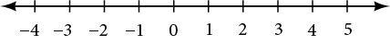
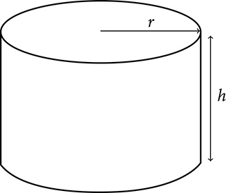
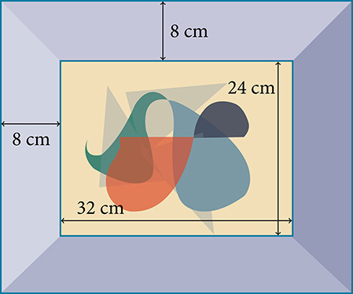

**Real Numbers: Algebra Essentials**

  m51239
  

**Real Numbers: Algebra Essentials**

  In this section, you will:

Classify a real number as a natural, whole, integer, rational, or irrational number.
Perform calculations using order of operations.
Use the following properties of real numbers: commutative, associative, distributive, inverse, and identity.
Evaluate algebraic expressions.
Simplify algebraic expressions.

  d0a86917-6447-4b49-bed1-efb5c352cc77

  
## Learning Objectives
Identify the study skills leading to success in a college level mathematics course.
Reflect on your past math experiences and create a plan for improvement.

## Objective 1: Identify the study skills leading to success in a college level mathematics course.
Welcome to your algebra course! This course will be challenging so now is the time to set up a plan for success. In this first chapter we will focus on important strategies for success including: math study skills, time management, note taking skills, smart test taking strategies, and the idea of a growth mindset. Each of these ideas will help you to be successful in your college level math course whether you are enrolled in a face-to-face traditional section or an online section virtual section.

Complete the following survey by checking a column for each behavior based on the frequency that you engage in the behavior during your last academic term.

| Behavior or belief: | Always | Sometimes | Never |
| :--- | :--- | :--- | :--- |
| 1. Arrive or log in early to class each session. |  |  |  |
| 2. Stay engaged for the entire class session or online meeting. |  |  |  |
| 3. Contact a fellow student and my instructor if I must miss class for notes or important announcements. |  |  |  |
| 4. Read through my class notes before beginning my homework. |  |  |  |
| 5. Connect with a study partner either virtually or in class. |  |  |  |
| 6. Keep my phone put away during classes to avoid distractions. |  |  |  |
| 7. Spend time on homework each day. |  |  |  |
| 8. Begin to review for exams a week prior to exam. |  |  |  |
| 9. Create a practice test and take it before an exam. |  |  |  |
| 10. Find my instructor’s office hours and stop in either face-to-face or virtually for help. |  |  |  |
| 11. Locate the math tutoring resources (on campus or virtually) for students and make note of available hours. |  |  |  |
| 12. Visit math tutoring services for assistance on a regular basis (virtual or face-to-face). |  |  |  |
| 13. Spend at least two hours studying outside of class for each hour in class (virtual or face-to-face). |  |  |  |
| 14. Check my progress in my math course through my college’s learning management system. |  |  |  |
| 15. Scan through my entire test before beginning and start off working on a problem I am confident in solving. |  |  |  |
| 16. Gain access to my math courseware by the end of first week of classes. |  |  |  |
| 17. Send an email to my instructor when I need assistance. |  |  |  |
| 18. Create a schedule for each week including time in class, at work and study time. |  |  |  |
| 19. Read through my textbook on the section we are covering before I come to class or begin virtual sessions. |  |  |  |
| 20. Feel confident when I start a math exam. |  |  |  |
| 21. Keep a separate notebook for each class I am taking. Divide math notebooks or binders into separate sections for homework, PowerPoint slides, and notes. |  |  |  |
| 22. Talk honestly about classes with a friend or family member on a regular basis. |  |  |  |
| 23. Add test dates to a calendar at the beginning of the semester. |  |  |  |
| 24. Take notes each math class session. |  |  |  |
| 25. Ask my instructor questions in class (face-to-face or virtual) if I don’t understand. |  |  |  |
| 26. Complete nightly homework assignments. |  |  |  |
| 27. Engage in class discussions.(virtual or face-to-face) |  |  |  |
| 28. Recopy my class notes more neatly after class. |  |  |  |
| 29. Have a quiet, organized place to study. |  |  |  |
| 30. Avoid calls or texts from friends when I’m studying. |  |  |  |
| 31. Set study goals for myself each week. |  |  |  |
| 32. Think about my academic major and future occupation. |  |  |  |
| 33. Take responsibility for my study plan. |  |  |  |
| 34. Try different approaches to solve when I get stuck on a problem. |  |  |  |
| 35. Believe that I can be successful in any college math course. |  |  |  |
| 36. Search for instructional videos online when I get really stuck on a section or an exercise. |  |  |  |
| 37. Create flashcards to help in memorizing important formulas and strategies. |  |  |  |
| *Total number in each column:* |  |  |  |
| *Scoring:* | *Always: 4 points each* | *Sometimes: 2 points each* | *Never: 0 points each* |
| *Total Points:* |  |  | *0* |

### Practice Makes Perfect
Identify the study skills leading to success in a college level mathematics course.
1. Each of the behaviors or attitudes listed in the table above are associated with success in college mathematics. This means that students who use these strategies or are open to these beliefs are successful learners. Share your total score with your study group in class and be supportive of your fellow students!

2. Based on this survey create a list of the top 5 strategies that you currently utilize, and feel are most helpful to you.

3. Based on this survey create a list of the *top 5 strategies that interest you*, and that you feel could be most helpful to you this term. Plan on implementing these strategies.

## Objective 2: Reflect on your past math experiences and create a plan for improvement.

It’s important to take the opportunity to reflect on your past experiences in math classes as you begin a new term. We can learn a lot from these reflections and thus work toward developing a strategy for improvement.
In the table below list *5 challenges* you had in past math courses and list a possible solution that you could try this semester.

| Challenge | Possible solution |
| :--- | :--- |
| 1. |  |
| 2. |  |
| 3. |  |
| 4. |  |
| 5. |  |

Write your math autobiography. Tell your math story by describing your past experiences as a learner of mathematics. Share how your attitudes have changed about math over the years if they have. Perhaps include what you love, hate, dread, appreciate, fear, look forward to, or find beauty in. This will help your teacher to better understand you and your current feelings about the discipline.

Share your autobiographies with your study group members. This helps to create a community in the classroom when common themes emerge.
It is often said that mathematics is the language of science. If this is true, then an essential part of the language of mathematics is numbers. The earliest use of numbers occurred 100 centuries ago in the Middle East to count, or enumerate items. Farmers, cattle herders, and traders used tokens, stones, or markers to signify a single quantity—a sheaf of grain, a head of livestock, or a fixed length of cloth, for example. Doing so made commerce possible, leading to improved communications and the spread of civilization.
Three to four thousand years ago, Egyptians introduced fractions. They first used them to show reciprocals. Later, they used them to represent the amount when a quantity was divided into equal parts.

  But what if there were no cattle to trade or an entire crop of grain was lost in a flood? How could someone indicate the existence of nothing? From earliest times, people had thought of a “base state” while counting and used various symbols to represent this null condition. However, it was not until about the fifth century CE in India that zero was added to the number system and used as a numeral in calculations.

  Clearly, there was also a need for numbers to represent loss or debt. In India, in the seventh century CE, negative numbers were used as solutions to mathematical equations and commercial debts. The opposites of the counting numbers expanded the number system even further.

  Because of the evolution of the number system, we can now perform complex calculations using these and other categories of real numbers. In this section, we will explore sets of numbers, calculations with different kinds of numbers, and the use of numbers in expressions.

  
# Classifying a Real Number
The numbers we use for counting, or enumerating items, are the **natural numbers**: 1, 2, 3, 4, 5, and so on. We describe them in set notation as $\left\{1,2,3,\mathrm{...}\right\}$ where the ellipsis (…) indicates that the numbers continue to infinity. The natural numbers are, of course, also called the *counting numbers*. Any time we enumerate the members of a team, count the coins in a collection, or tally the trees in a grove, we are using the set of natural numbers. The set of **whole numbers** is the set of natural numbers plus zero: $\left\{0,1,2,3,\mathrm{...}\right\}.$
  
The set of **integers** adds the opposites of the natural numbers to the set of whole numbers: $\left\{\mathrm{...},\mathrm{-3},\mathrm{-2},\mathrm{-1},0,1,2,3,\mathrm{...}\right\}.$ It is useful to note that the set of integers is made up of three distinct subsets: negative integers, zero, and positive integers. In this sense, the positive integers are just the natural numbers. Another way to think about it is that the natural numbers are a subset of the integers.
 $$
\begin{array}{lllll}\stackrel{\text{negative\ integers}}{\stackrel{}{\dots ,\mathrm{-3},\mathrm{-2},\mathrm{-1},}}  &   & \stackrel{\text{zero}}{\stackrel{}{0,}}  &   & \stackrel{\text{positive\ integers}}{\stackrel{}{1,2,3,\cdots}}  \end{array}
$$ The set of **rational numbers** is written as $\left\{\frac{m}{n}\phantom{\rule{0.5em}{0ex}}|m\phantom{\rule{0.5em}{0ex}}\text{and\}n\phantom{\rule{0.5em}{0ex}}\text{are\ integers\ and\}n\ne 0\right\}.$ Notice from the definition that rational numbers are fractions (or quotients) containing integers in both the numerator and the denominator, and the denominator is never 0. We can also see that every natural number, whole number, and integer is a rational number with a denominator of 1.
Because they are fractions, any rational number can also be expressed as a terminating or repeating decimal. Any rational number can be represented as either:

  ⓐa terminating decimal: $\frac{15}{8}=1.875,$ or
  ⓑa repeating decimal: $\frac{4}{11}=0.36363636\dots =0.\overline{36}$
  
  We use a line drawn over the repeating block of numbers instead of writing the group multiple times.

  4. **Writing Integers as Rational Numbers**     Write each of the following as a rational number.       ⓐ7   ⓑ0   ⓒ–8

Solution

Write a fraction with the integer in the numerator and 1 in the denominator.

  
  ⓐ $7=\frac{7}{1}$
  
  ⓑ $0=\frac{0}{1}$
  
  ⓒ $\mathrm{-8}=-\frac{8}{1}$

>
>   Try It
>   5. Write each of the following as a rational number.       ⓐ11   ⓑ3   ⓒ–4
>
> 

> 
Solution

>
> ⓐ $\frac{11}{1}$
>
>   ⓑ $\frac{3}{1}$
>
>   ⓒ $-\frac{4}{1}$
> 

>
>
>

  6. **Identifying Rational Numbers**     Write each of the following rational numbers as either a terminating or repeating decimal.       ⓐ $-\frac{5}{7}$      ⓑ $\frac{15}{5}$      ⓒ $\frac{13}{25}$

Solution

Write each fraction as a decimal by dividing the numerator by the denominator.

  
    ⓐ $-\frac{5}{7}=\mathrm{-0.}\stackrel{\text{\u2014\u2014\u2014}}{714285},$ a repeating decimal
  ⓑ $\frac{15}{5}=3$ (or 3.0), a terminating decimal
  ⓒ $\frac{13}{25}=0.52,$
   a terminating decimal

>
>   Try It
>   7. Write each of the following rational numbers as either a terminating or repeating decimal.       ⓐ $\frac{68}{17}$      ⓑ $\frac{8}{13}$      ⓒ $-\frac{17}{20}$
>
> 

> 
Solution

>
> ⓐ4 (or 4.0), terminating;
>   ⓑ $0.\overline{615384},$ repeating;
>   ⓒ–0.85, terminating
> 

>
>
>

## Irrational Numbers
At some point in the ancient past, someone discovered that not all numbers are rational numbers. A builder, for instance, may have found that the diagonal of a square with unit sides was not 2 or even $\frac{3}{2},$ but was something else. Or a garment maker might have observed that the ratio of the circumference to the diameter of a roll of cloth was a little bit more than 3, but still not a rational number. Such numbers are said to be *irrational* because they cannot be written as fractions. These numbers make up the set of **irrational numbers**. Irrational numbers cannot be expressed as a fraction of two integers. It is impossible to describe this set of numbers by a single rule except to say that a number is irrational if it is not rational. So we write this as shown.
 $\left\{h|h\phantom{\rule{0.5em}{0ex}}\text{is\ not\ a\ rational\ number}\right\}$
  

  8. **Differentiating Rational and Irrational Numbers**     Determine whether each of the following numbers is rational or irrational. If it is rational, determine whether it is a terminating or repeating decimal.         ⓐ $\sqrt{25}$      ⓑ $\frac{33}{9}$      ⓒ $\sqrt{11}$      ⓓ $\frac{17}{34}$      ⓔ $0.3033033303333\dots$

Solution

ⓐ $\sqrt{25}:$ This can be simplified as $\sqrt{25}=5.$ Therefore, $\sqrt{25}$ is rational.
  ⓑ
 $\frac{33}{9}:$ Because it is a fraction of integers, $\frac{33}{9}$ is a rational number. Next, simplify and divide.
   $\frac{33}{9}=\frac{\stackrel{11}{\overline{)33}}}{\underset{3}{\overline{)9}}}=\frac{11}{3}=3.\overline{6}$
  So, $\frac{33}{9}$ is rational and a repeating decimal.
 
  ⓒ $\sqrt{11}:\sqrt{11}$ is irrational because 11 is not a perfect square and $\sqrt{11}$ cannot be expressed as a fraction.
  ⓓ $\frac{17}{34}:$ Because it is a fraction of integers, $\frac{17}{34}$ is a rational number. Simplify and divide.
   $\frac{17}{34}=\frac{\stackrel{1}{\overline{)17}}}{\underset{2}{\overline{)34}}}=\frac{1}{2}=0.5$
  So, $\frac{17}{34}$ is rational and a terminating decimal.
 
  ⓔ $0.3033033303333\dots$ is not a terminating decimal. Also note that there is no repeating pattern because the group of 3s increases each time. Therefore it is neither a terminating nor a repeating decimal and, hence, not a rational number. It is an irrational number.

  

>
>   Try It
>   9. Determine whether each of the following numbers is rational or irrational. If it is rational, determine whether it is a terminating or repeating decimal.       ⓐ $\frac{7}{77}$      ⓑ $\sqrt{81}$      ⓒ $4.27027002700027\dots$      ⓓ $\frac{91}{13}$      ⓔ $\sqrt{39}$
>
> 

> 
Solution

>
> ⓐrational and repeating;
>   ⓑrational and terminating;
>   ⓒirrational;
>   ⓓrational and terminating;
>   ⓔirrational
> 

>
>
>

## Real Numbers
Given any number *n*, we know that *n* is either rational or irrational. It cannot be both. The sets of rational and irrational numbers together make up the set of **real numbers**. As we saw with integers, the real numbers can be divided into three subsets: negative real numbers, zero, and positive real numbers. Negative and positive real numbers include fractions, decimals, and irrational numbers according to their algebraic sign (+ or –). Zero is considered neither positive nor negative.
The real numbers can be visualized on a horizontal number line with an arbitrary point chosen as 0, with negative numbers to the left of 0 and positive numbers to the right of 0. A fixed unit distance is then used to mark off each integer (or other basic value) on either side of 0. Any real number corresponds to a unique position on the number line.The converse is also true: Each location on the number line corresponds to exactly one real number. This is known as a one-to-one correspondence. We refer to this as the **real number line** as shown in *.*

  10. **Classifying Real Numbers**     Classify each number as either positive or negative and as either rational or irrational. Does the number lie to the left or the right of 0 on the number line?         ⓐ $-\frac{10}{3}$      ⓑ $\sqrt{5}$      ⓒ $-\sqrt{289}$      ⓓ $\mathrm{-6}\pi$      ⓔ $0.615384615384\dots$

Solution

ⓐ $-\frac{10}{3}$ is negative and rational. It lies to the left of 0 on the number line.
  ⓑ $\sqrt{5}$ is positive and irrational. It lies to the right of 0.
  ⓒ $-\sqrt{289}=-\sqrt{{17}^{2}}=\mathrm{-17}$ is negative and rational. It lies to the left of 0.
  ⓓ $\mathrm{-6}\pi$ is negative and irrational. It lies to the left of 0.
  ⓔ $0.615384615384\dots$ is a repeating decimal so it is rational and positive. It lies to the right of 0.

  

>
>   Try It
>   11. Classify each number as either positive or negative and as either rational or irrational. Does the number lie to the left or the right of 0 on the number line?       ⓐ $\sqrt{73}$      ⓑ $\mathrm{-11.411411411}\dots$      ⓒ $\frac{47}{19}$      ⓓ $-\frac{\sqrt{5}}{2}$      ⓔ $6.210735$
>
> 

> 
Solution

>
> ⓐpositive, irrational; right
>   ⓑnegative, rational; left
>   ⓒpositive, rational; right
>   ⓓnegative, irrational; left
>   ⓔpositive, rational; right
> 

>
>
>

## Sets of Numbers as Subsets
Beginning with the natural numbers, we have expanded each set to form a larger set, meaning that there is a subset relationship between the sets of numbers we have encountered so far. These relationships become more obvious when seen as a diagram, such as .

>
>
>
>
> **Sets of Numbers**
>
>
>   The set of **natural numbers** includes the numbers used for counting: $\left\{1,2,3,\mathrm{...}\right\}.$
>
>
>   The set of **whole numbers** is the set of natural numbers plus zero: $\left\{0,1,2,3,\mathrm{...}\right\}.$
>
>
>   The set of **integers** adds the negative natural numbers to the set of whole numbers: $\left\{\mathrm{...},\mathrm{-3},\mathrm{-2},\mathrm{-1},0,1,2,3,\mathrm{...}\right\}.$
>
>
>   The set of **rational numbers** includes fractions written as $\left\{\frac{m}{n}\phantom{\rule{0.5em}{0ex}}|m\phantom{\rule{0.5em}{0ex}}\text{and\}n\phantom{\rule{0.5em}{0ex}}\text{are\ integers\ and\}n\ne 0\right\}.$
>
>
>   The set of **irrational numbers** is the set of numbers that are not rational, are nonrepeating, and are nonterminating: $\left\{h|h\phantom{\rule{0.5em}{0ex}}\text{is\ not\ a\ rational\ number}\right\}.$
>
>
>

  12. **Differentiating the Sets of Numbers**     Classify each number as being a natural number (*N*), whole number (*W*), integer (*I*), rational number (*Q*), and/or irrational number (*Q′*).    ⓐ $\sqrt{36}$      ⓑ $\frac{8}{3}$      ⓒ $\sqrt{73}$      ⓓ $\mathrm{-6}$      ⓔ $3.2121121112\dots$

Solution

|  | *N* | *W* | *I* | *Q* | *Q′* |
| :--- | :--- | :--- | :--- | :--- | :--- |
| a. $\sqrt{36}=6$ | X | X | X | X |  |
| b. $\frac{8}{3}=2.\overline{6}$ |  |  |  | X |  |
| c. $\sqrt{73}$ |  |  |  |  | X |
| d. –6 |  |  | X | X |  |
| e. 3.2121121112... |  |  |  |  | X |

  

>
>   Try It
>   13. Classify each number as being a natural number (*N*), whole number (*W*), integer (*I*), rational number (*Q*), and/or irrational number (*Q′*).       ⓐ $-\frac{35}{7}$      ⓑ $0$      ⓒ $\sqrt{169}$      ⓓ $\sqrt{24}$      ⓔ $4.763763763\dots$
>
> 

> 
Solution

>
> |  | *N* | *W* | *I* | *Q* | *Q'* |
> | :--- | :--- | :--- | :--- | :--- | :--- |
> | a. $-\frac{35}{7}$ |  |  | X | X |  |
> | b. 0 |  | X | X | X |  |
> | c. $\sqrt{169}$ | X | X | X | X |  |
> | d. $\sqrt{24}$ |  |  |  |  | X |
> | e. 4.763763763... |  |  |  | X |  |
> 

>
>
>

  
# Performing Calculations Using the Order of Operations
When we multiply a number by itself, we square it or raise it to a power of 2. For example, ${4}^{2}=4\cdot 4=16.$ We can raise any number to any power. In general, the **exponential notation** ${a}^{n}$ means that the number or variable $a$ is used as a factor $n$ times.
 $$
\begin{array}{l}{a}^{n}  \end{array}=\stackrel{n\phantom{\rule{0.5em}{0ex}}\text{factors}}{\stackrel{}{a\cdot a\cdot a\cdot \dots \cdot a}}
$$
  In this notation, ${a}^{n}$ is read as the *n*th power of $a,$or $a$ to the $n$ where $a$ is called the **base** and $n$ is called the **exponent***.* A term in exponential notation may be part of a mathematical expression, which is a combination of numbers and operators, i.e., + addition, – subtraction, × multiplication, ÷ division. For example, $24+6\cdot \frac{2}{3}-{4}^{2}$ is a mathematical expression.
To evaluate a mathematical expression, we perform the various operations. However, we do not perform them in any random order. We use the **order of operations**. This is a sequence of rules for evaluating such expressions.
Recall that in mathematics we use parentheses ( ), brackets [ ], and braces { } to group numbers and expressions so that anything appearing within the symbols is treated as a unit. Additionally, fraction bars, radicals, and absolute value bars are treated as grouping symbols. When evaluating a mathematical expression, begin by simplifying expressions within grouping symbols.
The next step is to address any exponents or radicals. Afterward, perform multiplication and division from left to right and finally addition and subtraction from left to right.
Let’s take a look at the expression provided.
 $24+6\cdot \frac{2}{3}-{4}^{2}$
  There are no grouping symbols, so we move on to exponents or radicals. The number 4 is raised to a power of 2, so simplify ${4}^{2}$ as 16.
 $\begin{array}{l}  \\ \begin{array}{l}24+6\cdot \frac{2}{3}-{4}^{2}  \\ 24+6\cdot \frac{2}{3}-16  \end{array}  \end{array}$
  Next, perform multiplication or division, left to right.
 $\begin{array}{l}  \\ \begin{array}{l}24+6\cdot \frac{2}{3}-16  \\ 24+4-16  \end{array}  \end{array}$
  Lastly, perform addition or subtraction, left to right.
 $$
\begin{array}{l}  \\ 24+4-16  \\ \phantom{\rule{0.5em}{0ex}}28-16  \\ \phantom{\rule{0.5em}{0ex}}12  \end{array}
$$
  Therefore, $24+6\cdot \frac{2}{3}-{4}^{2}=12.$
  
For some complicated expressions, several passes through the order of operations will be needed. For instance, there may be a radical expression inside parentheses that must be simplified before the parentheses are evaluated. Following the order of operations ensures that anyone simplifying the same mathematical expression will get the same result.

>
>
>
>
> **Order of Operations**
>
>
>   Operations in mathematical expressions must be evaluated in a systematic order, which can be simplified using the acronym *PEMDAS*:
>
>
>   *P*(arentheses)*E*(xponents)*M*(ultiplication) and *D*(ivision)*A*(ddition) and *S*(ubtraction)
>
>
>

>
>   How To
>   *Given a mathematical expression, simplify it using the order of operations.*
>
>
>
>   Simplify any expressions within grouping symbols.
>   Simplify any expressions containing exponents or radicals.
>   Perform any multiplication and division in order, from left to right.
>   Perform any addition and subtraction in order, from left to right.
>
>

  14. **Using the Order of Operations**     Use the order of operations to evaluate each of the following expressions.       ⓐ ${\left(3\cdot 2\right)}^{2}-4\left(6+2\right)$      ⓑ $\frac{{5}^{2}-4}{7}-\sqrt{11-2}$      ⓒ $6-\left|5-8\right|+3\left(4-1\right)$      ⓓ $\frac{14-3\cdot 2}{2\cdot 5-{3}^{2}}$      ⓔ $7\left(5\cdot 3\right)-2\left[\left(6-3\right)-{4}^{2}\right]+1$

Solution

ⓐ
  
 $\begin{array}{cccc}  {(3\cdot 2)}^{2}-4(6+2)& =& {(6)}^{2}-4(8)  & \phantom{\rule{2em}{0ex}}\text{Simplify\ parentheses.}  \\ & =& 36-4(8)  & \phantom{\rule{2em}{0ex}}\text{Simplify\ exponent.}  \\ & =& 36-32  & \phantom{\rule{2em}{0ex}}\text{Simplify\ multiplication.}  \\ & =& 4  & \phantom{\rule{2em}{0ex}}\text{Simplify\ subtraction.}  \end{array}$

  
  ⓑ
   $\begin{array}{cccc}  \frac{{5}^{2}-4}{7}-\sqrt{11-2}& =& \frac{{5}^{2}-4}{7}-\sqrt{9}  & \phantom{\rule{3.5em}{0ex}}\text{Simplify\ grouping\ symbols\ (radical).}  \\ & =& \frac{{5}^{2}-4}{7}-3  & \phantom{\rule{3.5em}{0ex}}\text{Simplify\ radical.}  \\ & =& \frac{25-4}{7}-3  & \phantom{\rule{3.5em}{0ex}}\text{Simplify\ exponent.}  \\ & =& \frac{21}{7}-3  & \phantom{\rule{3.5em}{0ex}}\text{Simplify\ subtraction\ in\ numerator.}  \\ & =& 3-3  & \phantom{\rule{3.5em}{0ex}}\text{Simplify\ division.}  \\ & =& 0  & \phantom{\rule{3.5em}{0ex}}\text{Simplify\ subtraction.}  \end{array}$

  Note that in the first step, the radical is treated as a grouping symbol, like parentheses. Also, in the third step, the fraction bar is considered a grouping symbol so the numerator is considered to be grouped.

  ⓒ
   $\begin{array}{cccc}  6-|5-8|+3|4-1|& =& 6-\left|\mathrm{-3}\right|+3(3)  & \phantom{\rule{2em}{0ex}}\text{Simplify\ inside\ grouping\ symbols.}  \\ & =& 6-(3)+3(3)  & \phantom{\rule{2em}{0ex}}\text{Simplify\ absolute\ value.}  \\ & =& 6-3+9  & \phantom{\rule{2em}{0ex}}\text{Simplify\ multiplication.}  \\ & =& 12  & \phantom{\rule{2em}{0ex}}\text{Simplify\ addition.}  \end{array}$

  
  ⓓ
   $\begin{array}{cccc}  \frac{14-3\cdot 2}{2\cdot 5-{3}^{2}}& =& \frac{14-3\cdot 2}{2\cdot 5-9}  & \phantom{\rule{9em}{0ex}}\text{Simplify\ exponent.}  \\ & =& \frac{14-6}{10-9}  & \phantom{\rule{9em}{0ex}}\text{Simplify\ products.}  \\ & =& \frac{8}{1}  & \phantom{\rule{9em}{0ex}}\text{Simplify\ differences.}  \\ & =& 8  & \phantom{\rule{9em}{0ex}}\text{Simplify\ quotient.}  \end{array}$

  In this example, the fraction bar separates the numerator and denominator, which we simplify separately until the last step.

  ⓔ
  
 $\begin{array}{cccc}  7\left(5\cdot 3\right)-2\left[\left(6-3\right)-{4}^{2}\right]+1& =& 7\left(15\right)-2\left[\left(3\right)-{4}^{2}\right]+1  & \phantom{\rule{2em}{0ex}}\text{Simplify\ inside\ parentheses.}  \\ & =& 7\left(15\right)-2\left(3-16\right)+1  & \phantom{\rule{2em}{0ex}}\text{Simplify\ exponent.}  \\ & =& 7\left(15\right)-2\left(\mathrm{-13}\right)+1  & \phantom{\rule{2em}{0ex}}\text{Subtract.}  \\ & =& 105+26+1  & \phantom{\rule{2em}{0ex}}\text{Multiply.}  \\ & =& 132  & \phantom{\rule{2em}{0ex}}\text{Add.}  \end{array}$

  

>
>   Try It
>   15. Use the order of operations to evaluate each of the following expressions.       ⓐ  $\sqrt{{5}^{2}-{4}^{2}}+7{\left(5-4\right)}^{2}$      ⓑ  $1+\frac{7\cdot 5-8\cdot 4}{9-6}$      ⓒ  $|1.8-4.3|+0.4\sqrt{15+10}$      ⓓ  $\frac{1}{2}\left[5\cdot {3}^{2}-{7}^{2}\right]+\frac{1}{3}\cdot {9}^{2}$      ⓔ  $\left[{\left(3-8\right)}^{2}-4\right]-\left(3-8\right)$
>
> 

> 
Solution

>
> ⓐ10
>   ⓑ2
>   ⓒ4.5
>   ⓓ25
>   ⓔ26
> 

>
>
>

  
# Using Properties of Real Numbers
For some activities we perform, the order of certain operations does not matter, but the order of other operations does. For example, it does not make a difference if we put on the right shoe before the left or vice-versa. However, it does matter whether we put on shoes or socks first. The same thing is true for operations in mathematics.

### Commutative Properties
The **commutative property of addition** states that numbers may be added in any order without affecting the sum.
 $a+b=b+a$
  We can better see this relationship when using real numbers.
 $$
\begin{array}{lllll}\left(\mathrm{-2}\right)+7=5  &   & \text{and}  &   & 7+\left(\mathrm{-2}\right)=5  \end{array}
$$
  Similarly, the **commutative property of multiplication** states that numbers may be multiplied in any order without affecting the product.
 $a\cdot b=b\cdot a$
  Again, consider an example with real numbers.
 $\begin{array}{ccccc}\left(\mathrm{-11}\right)\cdot \left(\mathrm{-4}\right)=44& & \text{and}& & \left(\mathrm{-4}\right)\cdot \left(\mathrm{-11}\right)=44\end{array}$
  It is important to note that neither subtraction nor division is commutative. For example, $17-5$ is not the same as $5-17.$ Similarly, $20\xf75\ne 5\xf720.$
  

### Associative Properties
The **associative property of multiplication** tells us that it does not matter how we group numbers when multiplying. We can move the grouping symbols to make the calculation easier, and the product remains the same.
 $$
a\left(bc\right)=\left(ab\right)c
$$
  Consider this example.
 $$
\begin{array}{ccccc}\left(3\cdot 4\right)\cdot 5=60& & \text{and}& & 3\cdot \left(4\cdot 5\right)=60\end{array}
$$
  The **associative property of addition** tells us that numbers may be grouped differently without affecting the sum.
 $$
a+\left(b+c\right)=\left(a+b\right)+c
$$
  This property can be especially helpful when dealing with negative integers. Consider this example.
 $$
\begin{array}{ccccc}\left[15+\left(\mathrm{-9}\right)\right]+23=29& & \text{and}& & 15+\left[\left(\mathrm{-9}\right)+23\right]=29\end{array}
$$
  Are subtraction and division associative? Review these examples.

 $\begin{array}{cccccc}  8-(3-15)& \stackrel{?}{=}& (8-3)-15  &   \phantom{\rule{2em}{0ex}}64\xf7(8\xf74)& \stackrel{?}{=}& (64\xf78)\xf74  \\   8-(-12)& =& 5-15  &   \phantom{\rule{2em}{0ex}}\phantom{\rule{0.5em}{0ex}}\text{}64\xf72& \stackrel{?}{=}& \phantom{\rule{0.5em}{0ex}}\text{}8\xf74  \\   20& \ne & -10  &   \phantom{\rule{2em}{0ex}}\phantom{\rule{0.5em}{0ex}}\text{}32& \ne & 2  \end{array}$
  As we can see, neither subtraction nor division is associative.

### Distributive Property
The **distributive property** states that the product of a factor times a sum is the sum of the factor times each term in the sum.
 $a\cdot \left(b+c\right)=a\cdot b+a\cdot c$
  This property combines both addition and multiplication (and is the only property to do so). Let us consider an example.

Note that 4 is outside the grouping symbols, so we distribute the 4 by multiplying it by 12, multiplying it by –7, and adding the products.
To be more precise when describing this property, we say that multiplication distributes over addition. The reverse is not true, as we can see in this example.

  
 $\begin{array}{ccc}  6+(3\cdot 5)& \stackrel{?}{=}& (6+3)\cdot (6+5)  \\   6+(15)& \stackrel{?}{=}& (9)\cdot (11)  \\   21& \ne & \phantom{\rule{0.5em}{0ex}}\text{}99  \end{array}$

  A special case of the distributive property occurs when a sum of terms is subtracted.
 $$
a-b=a+\left(-b\right)
$$
  For example, consider the difference $12-\left(5+3\right).$ We can rewrite the difference of the two terms 12 and $\left(5+3\right)$ by turning the subtraction expression into addition of the opposite. So instead of subtracting $\left(5+3\right),$ we add the opposite.
 $12+\left(\mathrm{-1}\right)\cdot \left(5+3\right)$
  Now, distribute $\mathrm{-1}$ and simplify the result.

 $$
\begin{array}{ccc}  12-(5+3)& =  & 12+(\mathrm{-1})\cdot (5+3)  \\ & =  & 12+[(\mathrm{-1})\cdot 5+(\mathrm{-1})\cdot 3]  \\ & =  & 12+(\mathrm{-8})  \\ & =  & 4  \end{array}
$$

  This seems like a lot of trouble for a simple sum, but it illustrates a powerful result that will be useful once we introduce algebraic terms. To subtract a sum of terms, change the sign of each term and add the results. With this in mind, we can rewrite the last example.

 $$
\begin{array}{ccc}  12-(5+3)& =& 12+(\mathrm{-5}-3)\\ & =& 12+(\mathrm{-8})  \\ & =& 4  \end{array}
$$

  
### Identity Properties
The **identity property of addition** states that there is a unique number, called the additive identity (0) that, when added to a number, results in the original number.
 $a+0=a$
  The **identity property of multiplication** states that there is a unique number, called the multiplicative identity (1) that, when multiplied by a number, results in the original number.
 $a\cdot 1=a$
  For example, we have $\left(\mathrm{-6}\right)+0=\mathrm{-6}$ and $23\cdot 1=23.$ There are no exceptions for these properties; they work for every real number, including 0 and 1.

### Inverse Properties
The **inverse property of addition** states that, for every real number *a*, there is a unique number, called the additive inverse (or opposite), denoted by (−*a*), that, when added to the original number, results in the additive identity, 0.
 $a+\left(-a\right)=0$
  For example, if $a=\mathrm{-8},$ the additive inverse is 8, since $\left(\mathrm{-8}\right)+8=0.$
  
The **inverse property of multiplication** holds for all real numbers except 0 because the reciprocal of 0 is not defined. The property states that, for every real number *a*, there is a unique number, called the multiplicative inverse (or reciprocal), denoted $\frac{1}{a},$ that, when multiplied by the original number, results in the multiplicative identity, 1.
 $a\cdot \frac{1}{a}=1$
  For example, if $a=-\frac{2}{3},$ the reciprocal, denoted $\frac{1}{a},$ is $-\frac{3}{2}$
  because
 $a\cdot \frac{1}{a}=\left(-\frac{2}{3}\right)\cdot \left(-\frac{3}{2}\right)=1$
  

>
>
> **Properties of Real Numbers**
>
>
>
>   The following properties hold for real numbers *a*, *b*, and *c*.
>
>
>
> |  | Addition | Multiplication |
> | :--- | :--- | :--- |
> | *Commutative Property* | $a+b=b+a$ | $a\cdot b=b\cdot a$ |
> | *Associative Property* | $a+\left(b+c\right)=\left(a+b\right)+c$ | $a\left(bc\right)=\left(ab\right)c$ |
> | *Distributive Property* | $a\cdot \left(b+c\right)=a\cdot b+a\cdot c$ |
> | *Identity Property* | There exists a unique real number called the additive identity, 0, such that, for any real number *a*    $a+0=a$ | There exists a unique real number called the multiplicative identity, 1, such that, for any real number *a*    $$ a\cdot 1=a $$ |
> | *Inverse Property* | Every real number a has an additive inverse, or opposite, denoted *–a*, such that    $$ a+\left(-a\right)=0 $$ | Every nonzero real number *a* has a multiplicative inverse, or reciprocal, denoted ${\scriptscriptstyle \frac{1}{a}},$ such that    $a\cdot \left(\frac{1}{a}\right)=1$ |
>

16. **Using Properties of Real Numbers**     Use the properties of real numbers to rewrite and simplify each expression. State which properties apply.       ⓐ  $3\cdot 6+3\cdot 4$    ⓑ  $\left(5+8\right)+\left(\mathrm{-8}\right)$      ⓒ  $6-\left(15+9\right)$      ⓓ  $\frac{4}{7}\cdot \left(\frac{2}{3}\cdot \frac{7}{4}\right)$    ⓔ  $100\cdot \left[0.75+\left(\mathrm{-2.38}\right)\right]$

Solution

ⓐ
  
 $\begin{array}{cccc}  3\cdot 6+3\cdot 4& =& 3\cdot (6+4)  & \phantom{\rule{7em}{0ex}}\text{Distributive\ property.}  \\ & =& 3\cdot 10  & \phantom{\rule{7em}{0ex}}\text{Simplify.}  \\ & =& 30  & \phantom{\rule{7em}{0ex}}\text{Simplify.}  \end{array}$
  
  ⓑ
  
 $\begin{array}{cccc}  (5+8)+(\mathrm{-8})& =& 5+[8+(\mathrm{-8})]  & \phantom{\rule{3em}{0ex}}\text{Associative\ property\ of\ addition.}\\ & =& 5+0  & \phantom{\rule{3em}{0ex}}\text{Inverse\ property\ of\ addition.}  \\ & =& 5  & \phantom{\rule{3em}{0ex}}\text{Identity\ property\ of\ addition.}  \end{array}$

  
  ⓒ
  
 $\begin{array}{cccc}  6-(15+9)  & =& 6+[(\mathrm{-15})+(\mathrm{-9})]  & \phantom{\rule{2em}{0ex}}\text{Distributive\ property.}  \\ & =& 6+(\mathrm{-24})  & \phantom{\rule{2em}{0ex}}\text{Simplify.}  \\ & =& \mathrm{-18}  & \phantom{\rule{2em}{0ex}}\text{Simplify.}  \end{array}$

  
  ⓓ
  
 $\begin{array}{cccc}  \frac{4}{7}\cdot \left(\frac{2}{3}\cdot \frac{7}{4}\right)& =& \frac{4}{7}\cdot \left(\frac{7}{4}\cdot \frac{2}{3}\right)  & \phantom{\rule{6em}{0ex}}\text{Commutative\ property\ of\ multiplication.}  \\ & =& \left(\frac{4}{7}\cdot \frac{7}{4}\right)\cdot \frac{2}{3}  & \phantom{\rule{6em}{0ex}}\text{Associative\ property\ of\ multiplication.}  \\ & =& 1\cdot \frac{2}{3}  & \phantom{\rule{6em}{0ex}}\text{Inverse\ property\ of\ multiplication.}  \\ & =& \frac{2}{3}  & \phantom{\rule{6em}{0ex}}\text{Identity\ property\ of\ multiplication.}  \end{array}$
  
  ⓔ
  
 $\begin{array}{cccc}  100\cdot [0.75+(-2.38)]& =& 100\cdot 0.75+100\cdot (\mathrm{-2.38})  & \phantom{\rule{2em}{0ex}}\text{Distributive\ property.}\\ & =& 75+(\mathrm{-238})  & \phantom{\rule{2em}{0ex}}\text{Simplify.}  \\ & =& \mathrm{-163}  & \phantom{\rule{2em}{0ex}}\text{Simplify.}  \end{array}$

  

> Try It
>   17. Use the properties of real numbers to rewrite and simplify each expression. State which properties apply.       ⓐ  $\left(-\frac{23}{5}\right)\cdot \left[11\cdot \left(-\frac{5}{23}\right)\right]$    ⓑ  $5\cdot \left(6.2+0.4\right)$    ⓒ  $18-\left(7\mathrm{-15}\right)$    ⓓ  $\frac{17}{18}+\left[\frac{4}{9}+\left(-\frac{17}{18}\right)\right]$    ⓔ   $6\cdot \left(\mathrm{-3}\right)+6\cdot 3$
>
> 

> 
Solution

>
> ⓐ11, commutative property of multiplication, associative property of multiplication, inverse property of multiplication, identity property of multiplication;
>   ⓑ33, distributive property;
>   ⓒ26, distributive property;
>   ⓓ
>  $\frac{4}{9},$ commutative property of addition, associative property of addition, inverse property of addition, identity property of addition;
>   ⓔ0, distributive property, inverse property of addition
> 

>
>
>

## Evaluating Algebraic Expressions
So far, the mathematical expressions we have seen have involved real numbers only. In mathematics, we may see expressions such as $x+5,\frac{4}{3}\pi {r}^{3},$ or $\sqrt{2{m}^{3}{n}^{2}}.$ In the expression $x+5,$ 5 is called a **constant** because it does not vary and *x* is called a **variable** because it does. (In naming the variable, ignore any exponents or radicals containing the variable.) An **algebraic expression** is a collection of constants and variables joined together by the algebraic operations of addition, subtraction, multiplication, and division.
We have already seen some real number examples of exponential notation, a shorthand method of writing products of the same factor. When variables are used, the constants and variables are treated the same way.

  
 $$
\begin{array}{cccccc}  {(\mathrm{-3})}^{5}& =& (\mathrm{-3})\cdot (\mathrm{-3})\cdot (\mathrm{-3})\cdot (\mathrm{-3})\cdot (\mathrm{-3})  &   {x}^{5}& =& x\cdot x\cdot x\cdot x\cdot x  \\   {(2\cdot 7)}^{3}& =& (2\cdot 7)\cdot (2\cdot 7)\cdot (2\cdot 7)  &   \phantom{\rule{0.5em}{0ex}}\text{}{(yz)}^{3}& =& (yz)\cdot (yz)\cdot (yz)  \end{array}
$$

  In each case, the exponent tells us how many factors of the base to use, whether the base consists of constants or variables.
Any variable in an algebraic expression may take on or be assigned different values. When that happens, the value of the algebraic expression changes. To evaluate an algebraic expression means to determine the value of the expression for a given value of each variable in the expression. Replace each variable in the expression with the given value, then simplify the resulting expression using the order of operations. If the algebraic expression contains more than one variable, replace each variable with its assigned value and simplify the expression as before.

18. **Describing Algebraic Expressions**     List the constants and variables for each algebraic expression.       ⓐ   *x* + 5   ⓑ  $\frac{4}{3}\pi {r}^{3}$    ⓒ  $\sqrt{2{m}^{3}{n}^{2}}$

Solution

|  | Constants | Variables |
| :--- | :--- | :--- |
| a. *x* + 5 | 5 | *x* |
| b. $\frac{4}{3}\pi {r}^{3}$ | $\frac{4}{3},\pi$ | $r$ |
| c. $\sqrt{2{m}^{3}{n}^{2}}$ | 2 | $m,n$ |

> Try It
>   19. List the constants and variables for each algebraic expression.       ⓐ $2\pi r\left(r+h\right)$    ⓑ2(*L* + *W*)   ⓒ $4{y}^{3}+y$
>
> 

> 
Solution

>
> |  | Constants | Variables |
> | :--- | :--- | :--- |
> | a. $2\pi r\left(r+h\right)$ | $2,\pi$ | $r,h$ |
> | b. 2(L + W) | 2 | L, W |
> | c. $4{y}^{3}+y$ | 4 | $y$ |
> 

>
>
>

20. **Evaluating an Algebraic Expression at Different Values**     Evaluate the expression $2x-7$ for each value for *x.*    ⓐ $x=0$    ⓑ  $x=1$    ⓒ  $x=\frac{1}{2}$    ⓓ  $x=\mathrm{-4}$

Solution

ⓐ
  Substitute 0 for $x.$

  
  
 $$
\begin{array}{ccc}  2x-7& =& 2(0)-7\\ & =& 0-7  \\ & =& \mathrm{-7}  \end{array}
$$

  
  ⓑSubstitute 1 for $x.$

  
  
 $$
\begin{array}{ccc}2x-7& =& 2(1)-7  \\ & =& 2-7  \\ & =& \mathrm{-5}  \end{array}
$$

  
  ⓒ
  Substitute $\frac{1}{2}$ for $x.$

  
  
 $$
\begin{array}{ccc}  2x-7& =& 2\left(\frac{1}{2}\right)-7  \\ & =& 1-7  \\ & =& \mathrm{-6}  \end{array}
$$

  
  ⓓSubstitute $\mathrm{-4}$ for $x.$

  
  
 $\begin{array}{ccc}  2x-7& =& 2(-4)-7\\ & =& -8-7  \\ & =& \mathrm{-15}  \end{array}$

  

> Try It
>   21. Evaluate the expression $11-3y$ for each value for *y.*     ⓐ  $y=2$    ⓑ  $y=0$    ⓒ  $y=\frac{2}{3}$    ⓓ  $y=\mathrm{-5}$
>
> 

> 
Solution

>
> ⓐ5;
>   ⓑ11;
>   ⓒ9;
>   ⓓ26
> 

>
>
>

22. **Evaluating Algebraic Expressions**     Evaluate each expression for the given values.       ⓐ $x+5$ for $x=\mathrm{-5}$    ⓑ $\frac{t}{2t\mathrm{-1}}$ for $t=10$    ⓒ  $\frac{4}{3}\pi {r}^{3}$ for $r=5$    ⓓ   $a+ab+b$ for $a=11,b=\mathrm{-8}$      ⓔ  $\sqrt{2{m}^{3}{n}^{2}}$ for $m=2,n=3$

Solution

ⓐ
  Substitute $\mathrm{-5}$ for $x.$

  
  
 $$
\begin{array}{ccc}  x+5& =& (\mathrm{-5})+5  \\ & =& 0  \end{array}
$$

  
  ⓑ
  Substitute 10 for $t.$
  
  
 $$
\begin{array}{ccc}  \frac{t}{2t-1}& =& \frac{(10)}{2(10)-1}  \\ & =& \frac{10}{20-1}  \\ & =& \frac{10}{19}  \end{array}
$$

  
  ⓒ
  Substitute 5 for $r.$
  
  
 $\begin{array}{ccc}  \frac{4}{3}\pi {r}^{3}& =& \frac{4}{3}\pi {(5)}^{3}\\ & =& \frac{4}{3}\pi (125)  \\ & =& \frac{500}{3}\pi   \end{array}$

  
  
  ⓓ
  Substitute 11 for $a$ and –8 for $b.$
  
  
 $$
\begin{array}{ccc}  a+ab+b& =& (11)+(11)(\mathrm{-8})+(\mathrm{-8})\\ & =& 11-88-8  \\ & =& \mathrm{-85}  \end{array}
$$

  
  ⓔ
  Substitute 2 for $m$ and 3 for $n.$
  
  
 $$
\begin{array}{ccc}  \sqrt{2{m}^{3}{n}^{2}}& =& \sqrt{2{(2)}^{3}{(3)}^{2}}  \\ & =& \sqrt{2(8)(9)}  \\ & =& \sqrt{144}  \\ & =& 12  \end{array}
$$

  

> Try It
>   23. Evaluate each expression for the given values.       ⓐ  $\frac{y+3}{y-3}$ for $y=5$    ⓑ  $7-2t$ for $t=\mathrm{-2}$    ⓒ  $\frac{1}{3}\pi {r}^{2}$ for $r=11$    ⓓ  ${\left({p}^{2}q\right)}^{3}$ for $p=\mathrm{-2},q=3$     ⓔ  $4\left(m-n\right)-5\left(n-m\right)$ for $m=\frac{2}{3},n=\frac{1}{3}$
>
> 

> 
Solution

>
> ⓐ4;
>   ⓑ11;
>   ⓒ
>  $\frac{121}{3}\pi$ ;
>   ⓓ1728;
>   ⓔ3
> 

>
>
>

## Formulas
An **equation** is a mathematical statement indicating that two expressions are equal. The expressions can be numerical or algebraic. The equation is not inherently true or false, but only a proposition. The values that make the equation true, the solutions, are found using the properties of real numbers and other results. For example, the equation $2x+1=7$ has the solution of 3 *[MathML processed to empty TeX. Original from lib: '$$']* because when we substitute 3 for $x$ in the equation, we obtain the true statement $2\left(3\right)+1=7.$
  
A **formula** is an equation expressing a relationship between constant and variable quantities. Very often, the equation is a means of finding the value of one quantity (often a single variable) in terms of another or other quantities. One of the most common examples is the formula for finding the area $A$ of a circle in terms of the radius $r$ of the circle: $A=\pi {r}^{2}.$ For any value of $r,$ the area $A$ can be found by evaluating the expression $\pi {r}^{2}.$
  

24. **Using a Formula**     A right circular cylinder with radius $r$ and height $h$ has the surface area $S$ (in square units) given by the formula $S=2\pi r\left(r+h\right).$ See . Find the surface area of a cylinder with radius 6 in. and height 9 in. Leave the answer in terms of $\pi .$          

Solution

Evaluate the expression $2\pi r\left(r+h\right)$ for $r=6$ and $h=9.$
  

  
  
 $$
\begin{array}{ccc}  S& =& 2\pi r(r+h)  \\ & =& 2\pi (6)[(6)+(9)]  \\ & =& 2\pi (6)(15)  \\ & =& 180\pi   \end{array}
$$

  The surface area is $180\pi$ square inches.

  

> Try It
>   25. A photograph with length *L* and width *W* is placed in a mat of width 8 centimeters (cm). The area of the mat (in square centimeters, or cm2) is found to be $A=\left(L+16\right)\left(W+16\right)-L\cdot W.$ See . Find the area of a mat for a photograph with length 32 cm and width 24 cm.       
>
> 

> 
Solution

>
> 1,152 cm2
> 

>
>
>

## Simplifying Algebraic Expressions
Sometimes we can simplify an algebraic expression to make it easier to evaluate or to use in some other way. To do so, we use the properties of real numbers. We can use the same properties in formulas because they contain algebraic expressions.

26. **Simplifying Algebraic Expressions**     Simplify each algebraic expression.       ⓐ $3x-2y+x-3y-7$      ⓑ  $2r-5\left(3-r\right)+4$      ⓒ  $\left(4t-\frac{5}{4}s\right)-\left(\frac{2}{3}t+2s\right)$      ⓓ  $2mn-5m+3mn+n$

Solution

ⓐ
  
 $\begin{array}{cccc}  3x-2y+x-3y-7& =& 3x+x-2y-3y-7  & \phantom{\rule{6.5em}{0ex}}\text{Commutative\ property\ of\ addition.}  \\ & =& 4x-5y-7  & \phantom{\rule{6.5em}{0ex}}\text{Simplify.}  \end{array}$

  

  ⓑ
  
 $\begin{array}{cccc}  2r-5(3-r)+4& =& 2r-15+5r+4  & \phantom{\rule{10em}{0ex}}\text{Distributive\ property.}  \\ & =& 2r+5r-15+4  & \phantom{\rule{10em}{0ex}}\text{Commutative\ property\ of\ addition.}  \\ & =& 7r-11  & \phantom{\rule{10em}{0ex}}\text{Simplify.}  \end{array}$

  
  ⓒ
  
 $\begin{array}{cccc}  \left(4t-\frac{5}{4}s\right)-\left(\frac{2}{3}t+2s\right)& =& 4t-\frac{5}{4}s-\frac{2}{3}t-2s  & \phantom{\rule{4em}{0ex}}\text{Distributive\ property.}  \\ & =& 4t-\frac{2}{3}t-\frac{5}{4}s-2s  & \phantom{\rule{4em}{0ex}}\text{Commutative\ property\ of\ addition.}  \\ & =& \frac{10}{3}t-\frac{13}{4}s  & \phantom{\rule{4em}{0ex}}\text{Simplify.}  \end{array}$

  
  ⓓ
  
 $\begin{array}{cccc}2mn-5m+3mn+n& =& 2mn+3mn-5m+n& \phantom{\rule{5em}{0ex}}\text{Commutative\ property\ of\ addition.}  \\ & =& \phantom{\rule{0.5em}{0ex}}\text{}5mn-5m+n  & \phantom{\rule{5em}{0ex}}\text{Simplify.}  \end{array}$

  

> Try It
>   27. Simplify each algebraic expression.       ⓐ  $\frac{2}{3}y-2\left(\frac{4}{3}y+z\right)$    ⓑ  $\frac{5}{t}-2-\frac{3}{t}+1$    ⓒ   $4p\left(q-1\right)+q\left(1-p\right)$      ⓓ   $9r-\left(s+2r\right)+\left(6-s\right)$
>
> 

> 
Solution

>
> ⓐ
>  $\mathrm{-2}y\mathrm{-2}z\phantom{\rule{0.5em}{0ex}}\text{or\}\mathrm{-2}\left(y+z\right);$ 
>   ⓑ
>  $\frac{2}{t}\mathrm{-1};$ 
>   ⓒ
>  $3pq\mathrm{-4}p+q;$ 
>   ⓓ
>  $7r\mathrm{-2}s+6$
> 

>
>
>

28. **Simplifying a Formula**     A rectangle with length $L$ and width $W$ has a perimeter $P$ given by $P=L+W+L+W.$ Simplify this expression.

Solution

$$
\begin{array}{cccc}  P& =& L+W+L+W  & \\   P& =& L+L+W+W  & \phantom{\rule{2em}{0ex}}\text{Commutative\ property\ of\ addition}  \\ P& =& 2L+2W  & \phantom{\rule{2em}{0ex}}\text{Simplify}  \\   P& =& 2\left(L+W\right)  & \phantom{\rule{2em}{0ex}}\text{Distributive\ property}  \end{array}
$$

  

>
>   Try It
>   29. If the amount $P$ is deposited into an account paying simple interest $r$ for time $t,$ the total value of the deposit $A$ is given by $A=P+Prt.$ Simplify the expression. (This formula will be explored in more detail later in the course.)
>
> 

> 
Solution

>
> $A=P\left(1+rt\right)$
> 

>
>
>

>
>   Media
>   Access these online resources for additional instruction and practice with real numbers.
>
>   Simplify an Expression.
>   Evaluate an Expression 1.
>   Evaluate an Expression 2.
>

  
# Key Concepts

  Rational numbers may be written as fractions or terminating or repeating decimals. See  and .
  Determine whether a number is rational or irrational by writing it as a decimal. See .
  The rational numbers and irrational numbers make up the set of real numbers. See . A number can be classified as natural, whole, integer, rational, or irrational. See .
  The order of operations is used to evaluate expressions. See .
  The real numbers under the operations of addition and multiplication obey basic rules, known as the properties of real numbers. These are the commutative properties, the associative properties, the distributive property, the identity properties, and the inverse properties. See .
  Algebraic expressions are composed of constants and variables that are combined using addition, subtraction, multiplication, and division. See . They take on a numerical value when evaluated by replacing variables with constants. See , , and 
  Formulas are equations in which one quantity is represented in terms of other quantities. They may be simplified or evaluated as any mathematical expression. See  and .
  
  
# Section Exercises

## Verbal
1. Is $\sqrt{2}$ an example of a rational terminating, rational repeating, or irrational number? Tell why it fits that category.

Solution

irrational number. The square root of two does not terminate, and it does not repeat a pattern. It cannot be written as a quotient of two integers, so it is irrational.

2. What is the order of operations? What acronym is used to describe the order of operations, and what does it stand for?

3. What do the Associative Properties allow us to do when following the order of operations? Explain your answer.

Solution

The Associative Properties state that the sum or product of multiple numbers can be grouped differently without affecting the result. This is because the same operation is performed (either addition or subtraction), so the terms can be re-ordered.

## Numeric
For the following exercises, simplify the given expression.
4. $10+2\phantom{\rule{0.5em}{0ex}}\times \phantom{\rule{0.5em}{0ex}}\left(5-3\right)$

5. $6\xf72-\left(81\xf7{3}^{2}\right)$

Solution

$\mathrm{-6}$

6. $18+{\left(6-8\right)}^{3}$

7. $\mathrm{-2}\phantom{\rule{0.5em}{0ex}}\times \phantom{\rule{0.5em}{0ex}}{\left[16\xf7{\left(8-4\right)}^{2}\right]}^{2}$

Solution

$\mathrm{-2}$

8. $4-6+2\phantom{\rule{0.5em}{0ex}}\times \phantom{\rule{0.5em}{0ex}}7$

9. $3\left(5-8\right)$

Solution

$\mathrm{-9}$

10. $4+6-10\xf72$

11. $12\xf7\left(36\xf79\right)+6$

Solution

9

12. ${\left(4+5\right)}^{2}\xf73$

13. $3-12\phantom{\rule{0.5em}{0ex}}\times \phantom{\rule{0.5em}{0ex}}2+19$

Solution

-2

14. $2+8\phantom{\rule{0.5em}{0ex}}\times \phantom{\rule{0.5em}{0ex}}7\xf74$

15. $5+\left(6+4\right)-11$

Solution

4

16. $9-18\xf7{3}^{2}$

17. $14\phantom{\rule{0.5em}{0ex}}\times \phantom{\rule{0.5em}{0ex}}3\xf77-6$

Solution

0

18. $9-\left(3+11\right)\phantom{\rule{0.5em}{0ex}}\times \phantom{\rule{0.5em}{0ex}}2$

19. $6+2\phantom{\rule{0.5em}{0ex}}\times \phantom{\rule{0.5em}{0ex}}2-1$

Solution

9

20. $64\xf7\left(8+4\phantom{\rule{0.5em}{0ex}}\times \phantom{\rule{0.5em}{0ex}}2\right)$

21. $9+4\left({2}^{2}\right)$

Solution

25

22. ${\left(12\xf73\phantom{\rule{0.5em}{0ex}}\times \phantom{\rule{0.5em}{0ex}}3\right)}^{2}$

23. $25\xf7{5}^{2}-7$

Solution

$\mathrm{-6}$

24. $\left(15-7\right)\phantom{\rule{0.5em}{0ex}}\times \phantom{\rule{0.5em}{0ex}}\left(3-7\right)$

25. $2\phantom{\rule{0.5em}{0ex}}\times \phantom{\rule{0.5em}{0ex}}4-9\left(\mathrm{-1}\right)$

Solution

17

26. ${4}^{2}-25\phantom{\rule{0.5em}{0ex}}\times \phantom{\rule{0.5em}{0ex}}\frac{1}{5}$

27. $12\left(3-1\right)\xf76$

Solution

4

## Algebraic
For the following exercises, evaluate the expression using the given value of the variable.
28. $8\left(x+3\right)\u201364$ for $x=2$

29. $4y+8\u20132y$ for $y=3$

Solution

$14$

30. $\left(11a+3\right)-18a+4$ for $a=\mathrm{\u20132}$

31. $4z-2z\left(1+4\right)\u201336$    for $z=5$

Solution

$\mathrm{-66}$

32. $4y{\left(7-2\right)}^{2}+200$ for $y=\mathrm{\u20132}$

33. $-{\left(2x\right)}^{2}+1+3$    for $x=2$

Solution

$\mathrm{\u201312}$

34. $8\left(2+4\right)-15b+b$    for $b=\mathrm{\u20133}$

35. $2\left(11c-4\right)\u201336$    for $c=0$

Solution

$\mathrm{\u201344}$

36. $4\left(3-1\right)x\u20134$ for $x=10$

37. $\frac{1}{4}\left(8w-{4}^{2}\right)$ for $w=1$

Solution

$\mathrm{\u20132}$

For the following exercises, simplify the expression.
38. $4x+x\left(13-7\right)$

39. $2y-{\left(4\right)}^{2}y-11$

Solution

$\mathrm{-14}y-11$

40. $\frac{a}{{2}^{3}}\left(64\right)-12a\xf76$

41. $8b-4b\left(3\right)+1$

Solution

$\mathrm{-4}b+1$

42. $5l\xf73l\phantom{\rule{0.5em}{0ex}}\times \phantom{\rule{0.5em}{0ex}}\left(9-6\right)$

43. $7z-3+z\phantom{\rule{0.5em}{0ex}}\times \phantom{\rule{0.5em}{0ex}}{6}^{2}$

Solution

$43z-3$

44. $4\phantom{\rule{0.5em}{0ex}}\times \phantom{\rule{0.5em}{0ex}}3+18x\xf79-12$

45. $9\left(y+8\right)-27$

Solution

$9y+45$

46. $\left(\frac{9}{6}t-4\right)2$

47. $6+12b-3\phantom{\rule{0.5em}{0ex}}\times \phantom{\rule{0.5em}{0ex}}6b$

Solution

$\mathrm{-6}b+6$

48. $18y-2\left(1+7y\right)$

49. ${\left(\frac{4}{9}\right)}^{2}\phantom{\rule{0.5em}{0ex}}\times \phantom{\rule{0.5em}{0ex}}27x$

Solution

$\frac{16x}{3}$

50. $8\left(3-m\right)+1\left(-8\right)$

51. $9x+4x\left(2+3\right)-4\left(2x+3x\right)$

Solution

$9x$

52. ${5}^{2}-4\left(3x\right)$

## Real-World Applications
For the following exercises, consider this scenario: Fred earns $40 at the community garden. He spends $10 on a streaming subscription, puts half of what is left in a savings account, and gets another $5 for walking his neighbor’s dog.
53. Write the expression that represents the number of dollars Fred keeps (and does not put in his savings account). Remember the order of operations.

Solution

$\frac{1}{2}\left(40-10\right)+5$

54. How much money does Fred keep?

For the following exercises, solve the given problem.
55. According to the U.S. Mint, the diameter of a quarter is 0.955 inches. The circumference of the quarter would be the diameter multiplied by $\pi .$ Is the circumference of a quarter a whole number, a rational number, or an irrational number?

Solution

irrational number

56. Jessica and her roommate, Adriana, have decided to share a change jar for joint expenses. Jessica put her loose change in the jar first, and then Adriana put her change in the jar. We know that it does not matter in which order the change was added to the jar. What property of addition describes this fact?

For the following exercises, consider this scenario: There is a mound of $g$ pounds of gravel in a quarry. Throughout the day, 400 pounds of gravel is added to the mound. Two orders of 600 pounds are sold and the gravel is removed from the mound. At the end of the day, the mound has 1,200 pounds of gravel.
57. Write the equation that describes the situation.

Solution

$g+400-2\left(600\right)=1200$

58. Solve for *g*.

For the following exercise, solve the given problem.
59. Ramon runs the marketing department at their company. Their department gets a budget every year, and every year, they must spend the entire budget without going over. If they spend less than the budget, then the department gets a smaller budget the following year. At the beginning of this year, Ramon got $2.5 million for the annual marketing budget. They must spend the budget such that $\mathrm{2,500,000}-x=0.$ What property of addition tells us what the value of *x* must be?

Solution

inverse property of addition

## Technology
For the following exercises, use a graphing calculator to solve for *x*. Round the answers to the nearest hundredth.
60. $0.5{\left(12.3\right)}^{2}-48x=\frac{3}{5}$

61. ${\left(0.25-0.75\right)}^{2}x-7.2=9.9$

Solution

68.4

## Extensions
62. If a whole number is not a natural number, what must the number be?

63. Determine whether the statement is true or false: The multiplicative inverse of a rational number is also rational.

Solution

true

64. Determine whether the statement is true or false: The product of a rational and irrational number is always irrational.

65. Determine whether the simplified expression is rational or irrational: $\sqrt{\mathrm{-18}-4\left(5\right)\left(\mathrm{-1}\right)}.$

Solution

irrational

66. Determine whether the simplified expression is rational or irrational: $\sqrt{\mathrm{-16}+4\left(5\right)+5}.$

67. The division of two natural numbers will always result in what type of number?

Solution

rational

68. What property of real numbers would simplify the following expression: $4+7(x-1)?$

**algebraic expression**	constants and variables combined using addition, subtraction, multiplication, and division
**associative property of addition**	 the sum of three numbers may be grouped differently without affecting the result; in symbols, $a+\left(b+c\right)=\left(a+b\right)+c$

**associative property of multiplication** 	the product of three numbers may be grouped differently without affecting the result; in symbols, $a\cdot \left(b\cdot c\right)=\left(a\cdot b\right)\cdot c$

**base** in exponential notation, the expression that is being multiplied 
**commutative property of addition**	two numbers may be added in either order without affecting the result; in symbols, $a+b=b+a$

**commutative property of multiplication**	two numbers may be multiplied in any order without affecting the result; in symbols, $a\cdot b=b\cdot a$

**constant**	a quantity that does not change value
**distributive property**	the product of a factor times a sum is the sum of the factor times each term in the sum; in symbols, $a\cdot \left(b+c\right)=a\cdot b+a\cdot c$

**equation**	a mathematical statement indicating that two expressions are equal
**exponent**	in exponential notation, the raised number or variable that indicates how many times the base is being multiplied
**exponential notation**	a shorthand method of writing products of the same factor
**formula**	an equation expressing a relationship between constant and variable quantities
**identity property of addition**	there is a unique number, called the additive identity, 0, which, when added to a number, results in the original number; in symbols, $a+0=a$

**identity property of multiplication** 	there is a unique number, called the multiplicative identity, 1, which, when multiplied by a number, results in the original number; in symbols, $a\cdot 1=a$

**integers**	the set consisting of the natural numbers, their opposites, and 0: $\left\{\dots ,\mathrm{-3},\mathrm{-2},\mathrm{-1},0,1,2,3,\dots \right\}$

**inverse property of addition**		for every real number $a,$ there is a unique number, called the additive inverse (or opposite), denoted $-a,$ which, when added to the original number, results in the additive identity, 0; in symbols, $a+\left(-a\right)=0$

**inverse property of multiplication** 	for every non-zero real number $a,$ there is a unique number, called the multiplicative inverse (or reciprocal), denoted $\frac{1}{a},$ which, when multiplied by the original number, results in the multiplicative identity, 1; in symbols, $a\cdot \frac{1}{a}=1$

**irrational numbers**	the set of all numbers that are not rational; they cannot be written as either a terminating or repeating decimal; they cannot be expressed as a fraction of two integers
**natural numbers**	the set of counting numbers: $\left\{1,2,3,\dots \right\}$

**order of operations**	a set of rules governing how mathematical expressions are to be evaluated, assigning priorities to operations
**rational numbers**	the set of all numbers of the form $\frac{m}{n},$ where $m$ and $n$ are integers and $n\ne 0.$ Any rational number may be written as a fraction or a terminating or repeating decimal.
**real number line**	a horizontal line used to represent the real numbers. An arbitrary fixed point is chosen to represent 0; positive numbers lie to the right of 0 and negative numbers to the left.
**real numbers**	the sets of rational numbers and irrational numbers taken together
**variable**	a quantity that may change value
**whole numbers**	the set consisting of 0 plus the natural numbers: $\left\{0,1,2,3,\dots \right\}$
