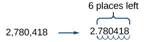
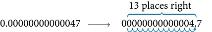

Exponents and Scientific Notation
=================================

  m51241
  
Exponents and Scientific Notation
=================================

  In this section, you will:

Use the product rule of exponents.
Use the quotient rule of exponents.
Use the power rule of exponents.
Use the zero exponent rule of exponents.
Use the negative rule of exponents.
Find the power of a product and a quotient.
Simplify exponential expressions.
Use scientific notation.

  065c3182-adac-48fc-a3ab-03d487982dd5

  
Learning Objective:
===================
Plan your weekly academic schedule for the term.

Objective 1: Plan your weekly academic schedule for the term.
=============================================================

Most college instructors advocate studying at least 2 hours for each hour in class. With this recommendation in mind, complete the following table showing credit hours enrolled in, the study time required, and total time to be devoted to college work. Assume 2 hours of study time for each hour in class to complete this table, and after your first exam you can fine tune this estimate based on your performance.

  
    Credit hours (hours in class)
    Study time outside of class
    Total time spent in class and studying
  

  
    9
    (2,2)
    (2,3)
  
  
    12
    (3,2)
    (3,3)
  
  
    15
    (3,2)
    (3,3)
  
  
    18
    (4,2)
    (4,3)
  
  
    21
    (5,2)
    (5,3)
  

Consider spending at least 2 hours of your study time each week at your campus (or virtual) math tutoring center or with a study group, the time will be well spent!

Another way to optimize your class and study time is to have a plan for efficiency, meaning make every minute count. Below is a list of good practices, check off those you feel you could utilize this term.

  
    Best practices:
    Will consider:
    Not for me:
  

  
    *1. Attend each class session.*
It will take much more time to teach yourself the content.

    
    
  
  
    *2. Ask your instructor.*
If you are unsure of a concept being taught in class, ask for clarification right away. Your instructor is an expert in their field and can provide the most efficient path to understanding.

    
    
    
    *3. Be prepared for each class.*
Having completed prior assignments can go a long way in math understanding since mastery of most learning objectives depends on knowledge of prior concepts. 
Also, reading through a section prior to class will help to make concepts much clearer.

    
    
    
    *4. Stay organized.*
Keeping your math materials in a 3-ring binder organized by lecture notes, class handouts, PowerPoint slides, and homework problems will save you time in finding materials when you need them. Having two spiral notebooks dedicated to math works well too, use one for class notes and one for homework assignments.

    
    
    
    *5. Find a study partner.*
Making a connection either in class or virtually with a fellow student can save time in that now there are two sources for gathering important information. If you have to miss class or an online session for an important appointment, your study partner can provide you class notes, share in-class handouts, or relay announcements for your instructor.
Study partner’s name: 
Study partner’s number: 
Study partner’s email address:

    
    
    
    *6. Begin exam review time by reworking each of the examples your instructor worked in class.*
Your instructor will emphasize the same topics in both lecture and on exams based on student learning objectives required by your college or university or even the state where the course is offered. Follow their lead in assigning importance to an objective and master these topics first.

    
    
  

Creating your Semester Calendar- complete the following weekly schedule being sure to labeltime in classes
study time for classes
time at work.Optional: also include if you want a more comprehensive view of your time commitments
time spent exercising
time with family and friends.

Term: ________________________________
Name: ________________________________________
Date: ________________________________________

Monday
Tuesday
Wednesday
Thursday
Friday
Saturday
Sunday

6:30-7:00am

7:00-7:30am

7:30-8am

8-8:30am

8:30-9am

9-9:30am

9:30-10am

10-10:30am

10:30-11am

11-11:30am

11:30-12pm

12-12:30pm

12:30-1pm

1-1:30pm

1:30-2pm

2-2:30pm

2:30-3pm

3-3:30pm

3:30-4pm

4-4:30pm

4:30-5pm

5-5:30pm

5:30-6pm

6-6:30pm

6:30-7pm

7-7:30pm

7:30-8pm

8-8:30pm

8:30-9pm

9-9:30pm

9:30-10pm

10-10:30pm

10:30-11pm

11-11:30pm

Mathematicians, scientists, and economists commonly encounter very large and very small numbers. But it may not be obvious how common such figures are in everyday life. For instance, a pixel is the smallest unit of light that can be perceived and recorded by a digital camera. A particular camera might record an image that is 2,048 pixels by 1,536 pixels, which is a very high resolution picture. It can also perceive a color depth (gradations in colors) of up to 48 bits per pixel, and can shoot the equivalent of 24 frames per second. The maximum possible number of bits of information used to film a one-hour (3,600-second) digital film is then an extremely large number.

  Using a calculator, we enter $\mathrm{2,048}\times \mathrm{1,536}\times 48\times 24\times \mathrm{3,600}$ and press ENTER. The calculator displays 1.304596316E13. What does this mean? The “E13” portion of the result represents the exponent 13 of ten, so there are a maximum of approximately $1.3\times {10}^{13}$ bits of data in that one-hour film. In this section, we review rules of exponents first and then apply them to calculations involving very large or small numbers.

    
Using the Product Rule of Exponents
===================================

    Consider the product ${x}^{3}\cdot {x}^{4}.$ Both terms have the same base, *x*, but they are raised to different exponents. Expand each expression, and then rewrite the resulting expression.

    
 $$
\begin{array}{ccc}\hfill {x}^{3}\cdot {x}^{4}& =& \stackrel{3\phantom{\rule{0.5em}{0ex}}\text{factors}}{\stackrel{}{x\cdot x\cdot x}}\cdot \stackrel{4\phantom{\rule{0.5em}{0ex}}\text{factors}}{\stackrel{}{x\cdot x\cdot x\cdot x}}\hfill \\ & =& \stackrel{7\phantom{\rule{0.5em}{0ex}}\text{factors}}{\stackrel{}{x\cdot x\cdot x\cdot x\cdot x\cdot x\cdot x}}\hfill \\ & =& {x}^{7}\hfill \end{array}
$$

The result is that ${x}^{3}\cdot {x}^{4}={x}^{3+4}={x}^{7}.$

    Notice that the exponent of the product is the sum of the exponents of the terms. In other words, when multiplying exponential expressions with the same base, we write the result with the common base and add the exponents. This is the *product rule of exponents.*

     ${a}^{m}\cdot {a}^{n}={a}^{m+n}$
    
    Now consider an example with real numbers.

     ${2}^{3}\cdot {2}^{4}={2}^{3+4}={2}^{7}$
    
    We can always check that this is true by simplifying each exponential expression. We find that ${2}^{3}$ is 8, ${2}^{4}$ is 16, and ${2}^{7}$ is 128. The product $8\cdot 16$ equals 128, so the relationship is true. We can use the product rule of exponents to simplify expressions that are a product of two numbers or expressions with the same base but different exponents.

    
The Product Rule of Exponents
=============================
For any real number $a$ and natural numbers $m$ and $n,$ the product rule of exponents states that

       ${a}^{m}\cdot {a}^{n}={a}^{m+n}$
      
      
      
        
          
Using the Product Rule
======================

          Write each of the following products with a single base. Do not simplify further.

          
            ⓐ ${t}^{5}\cdot {t}^{3}$
            
            ⓑ ${\left(\mathrm{-3}\right)}^{5}\cdot \left(\mathrm{-3}\right)$
            
            ⓒ
 ${x}^{2}\cdot {x}^{5}\cdot {x}^{3}$
            
          
        
        
        Use the product rule to simplify each expression.

        
          ⓐ
 ${t}^{5}\cdot {t}^{3}={t}^{5+3}={t}^{8}$
          
          ⓑ
 ${\left(\mathrm{-3}\right)}^{5}\cdot \left(\mathrm{-3}\right)={\left(\mathrm{-3}\right)}^{5}\cdot {\left(\mathrm{-3}\right)}^{1}={\left(\mathrm{-3}\right)}^{5+1}={\left(\mathrm{-3}\right)}^{6}$
          
          ⓒ
 ${x}^{2}\cdot {x}^{5}\cdot {x}^{3}$
          
        
        At first, it may appear that we cannot simplify a product of three factors. However, using the associative property of multiplication, begin by simplifying the first two.

           ${x}^{2}\cdot {x}^{5}\cdot {x}^{3}=\left({x}^{2}\cdot {x}^{5}\right)\cdot {x}^{3}=\left({x}^{2+5}\right)\cdot {x}^{3}={x}^{7}\cdot {x}^{3}={x}^{7+3}={x}^{10}$
          
        Notice we get the same result by adding the three exponents in one step.

           ${x}^{2}\cdot {x}^{5}\cdot {x}^{3}={x}^{2+5+3}={x}^{10}$
          
        
        
        

    
      Try It
      
        Write each of the following products with a single base. Do not simplify further.

        
          ⓐ ${k}^{6}\cdot {k}^{9}$
          
          ⓑ ${\left(\frac{2}{y}\right)}^{4}\cdot \left(\frac{2}{y}\right)$
          
          ⓒ ${t}^{3}\cdot {t}^{6}\cdot {t}^{5}$
          
        
        
        
          
            ⓐ ${k}^{15}$
            
            ⓑ ${\left(\frac{2}{y}\right)}^{5}$
            
            ⓒ
 ${t}^{14}$
            
          
        
      
    

  
  
    
Using the Quotient Rule of Exponents
====================================

    The *quotient rule of exponents* allows us to simplify an expression that divides two numbers with the same base but different exponents. In a similar way to the product rule, we can simplify an expression such as $\frac{{y}^{m}}{{y}^{n}},$ where $m>n.$ Consider the example $\frac{{y}^{9}}{{y}^{5}}.$ Perform the division by canceling common factors.

    
 $\begin{array}{ccc}\hfill \frac{{y}^{9}}{{y}^{5}}& =& \frac{y\cdot y\cdot y\cdot y\cdot y\cdot y\cdot y\cdot y\cdot y}{y\cdot y\cdot y\cdot y\cdot y}\hfill \\ & =& \frac{\overline{)y}\cdot \overline{)y}\cdot \overline{)y}\cdot \overline{)y}\cdot \overline{)y}\cdot y\cdot y\cdot y\cdot y}{\overline{)y}\cdot \overline{)y}\cdot \overline{)y}\cdot \overline{)y}\cdot \overline{)y}}\hfill \\ & =& \frac{y\cdot y\cdot y\cdot y}{1}\hfill \\ & =& {y}^{4}\hfill \end{array}$

Notice that the exponent of the quotient is the difference between the exponents of the divisor and dividend.

     $\frac{{a}^{m}}{{a}^{n}}={a}^{m-n}$
    
    In other words, when dividing exponential expressions with the same base, we write the result with the common base and subtract the exponents.

     $\frac{{y}^{9}}{{y}^{5}}={y}^{9-5}={y}^{4}$
For the time being, we must be aware of the condition $m>n.$ Otherwise, the difference $m-n$ could be zero or negative. Those possibilities will be explored shortly. Also, instead of qualifying variables as nonzero each time, we will simplify matters and assume from here on that all variables represent nonzero real numbers.

    
The Quotient Rule of Exponents
==============================
For any real number $a$ and natural numbers $m$ and $n,$ such that $m>n,$ the quotient rule of exponents states that

      $\frac{{a}^{m}}{{a}^{n}}={a}^{m-n}$
      

      
      
        
          
Using the Quotient Rule
=======================

          Write each of the following products with a single base. Do not simplify further.

          
            ⓐ $\frac{{\left(\mathrm{-2}\right)}^{14}}{{\left(\mathrm{-2}\right)}^{9}}$
            
            ⓑ $\frac{{t}^{23}}{{t}^{15}}$
            
            ⓒ
 $\frac{{\left(z\sqrt{2}\right)}^{5}}{z\sqrt{2}}$
            
          
        
        

        Use the quotient rule to simplify each expression.

        
ⓐ $\frac{{\left(\mathrm{-2}\right)}^{14}}{{\left(\mathrm{-2}\right)}^{9}}={\left(\mathrm{-2}\right)}^{14-9}={\left(\mathrm{-2}\right)}^{5}$

          ⓑ
 $\frac{{t}^{23}}{{t}^{15}}={t}^{23-15}={t}^{8}$
          
          ⓒ
 $\frac{{\left(z\sqrt{2}\right)}^{5}}{z\sqrt{2}}={\left(z\sqrt{2}\right)}^{5-1}={\left(z\sqrt{2}\right)}^{4}$ 
        
        
        

    
      Try It
      
        Write each of the following products with a single base. Do not simplify further.

        

          ⓐ $\frac{{s}^{75}}{{s}^{68}}$
          
          ⓑ $\frac{{\left(\mathrm{-3}\right)}^{6}}{\mathrm{-3}}$
          
          ⓒ $\frac{{\left(e{f}^{2}\right)}^{5}}{{\left(e{f}^{2}\right)}^{3}}$
          
        
        
        
          

            ⓐ
 ${s}^{7}$
            
            ⓑ
 ${\left(\mathrm{-3}\right)}^{5}$
            
            ⓒ
 ${\left(e{f}^{2}\right)}^{2}$
            
          
        
     
     
     
  
    
Using the Power Rule of Exponents
=================================

    Suppose an exponential expression is raised to some power. Can we simplify the result? Yes. To do this, we use the *power rule of exponents*. Consider the expression ${\left({x}^{2}\right)}^{3}.$ The expression inside the parentheses is multiplied twice because it has an exponent of 2. Then the result is multiplied three times because the entire expression has an exponent of 3.

    

 $$
\begin{array}{ccc}\hfill {\left({x}^{2}\right)}^{3}& =& \stackrel{3\phantom{\rule{0.5em}{0ex}}\text{factors}}{\stackrel{}{\left({x}^{2}\right)\cdot \left({x}^{2}\right)\cdot \left({x}^{2}\right)}}\hfill \\ & =& \hfill \stackrel{3\phantom{\rule{0.5em}{0ex}}\text{factors}}{\stackrel{}{\left(\stackrel{2\phantom{\rule{0.5em}{0ex}}\text{factors}}{\overbrace{x\cdot x}}\right)\cdot \left(\stackrel{2\phantom{\rule{0.5em}{0ex}}\text{factors}}{\overbrace{x\cdot x}}\right)\cdot \left(\stackrel{2\phantom{\rule{0.5em}{0ex}}\text{factors}}{\overbrace{x\cdot x}}\right)}}\\ & =& x\cdot x\cdot x\cdot x\cdot x\cdot x\hfill \\ & =& {x}^{6}\hfill \end{array}
$$

The exponent of the answer is the product of the exponents: ${\left({x}^{2}\right)}^{3}={x}^{2\cdot 3}={x}^{6}.$ In other words, when raising an exponential expression to a power, we write the result with the common base and the product of the exponents.

     ${\left({a}^{m}\right)}^{n}={a}^{m\cdot n}$
    

    Be careful to distinguish between uses of the product rule and the power rule. When using the product rule, different terms with the same bases are raised to exponents. In this case, you add the exponents. When using the power rule, a term in exponential notation is raised to a power. In this case, you multiply the exponents.

    
 $$
\begin{array}{cccccccccc}& & \text{Product\ Rule}\hfill & & & & & \phantom{\rule{0.5em}{0ex}}\text{Power\ Rule}\hfill & & \\ \hfill {5}^{3}\cdot {5}^{4}& =& {5}^{3+4}\hfill & =& {5}^{7}\hfill & \phantom{\rule{1em}{0ex}}\text{but}\phantom{\rule{1em}{0ex}}& \hfill \phantom{\rule{0.5em}{0ex}}\text{}{({5}^{3})}^{4}& =& {5}^{3\cdot 4}\hfill & =& {5}^{12}\hfill \\ \hfill {x}^{5}\cdot {x}^{2}& =& {x}^{5+2}\hfill & =& {x}^{7}\hfill & \phantom{\rule{1em}{0ex}}\text{but}\phantom{\rule{1em}{0ex}}& \hfill {({x}^{5})}^{2}& =& {x}^{5\cdot 2}\hfill & =\hfill & {x}^{10}\hfill \\ \hfill {(3a)}^{7}\cdot {(3a)}^{10}& =& {(3a)}^{7+10}\hfill & =& {(3a)}^{17}\hfill & \phantom{\rule{1em}{0ex}}\text{but}\phantom{\rule{1em}{0ex}}& \hfill {({(3a)}^{7})}^{10}& =& {(3a)}^{7\cdot 10}\hfill & =& {(3a)}^{70}\hfill \end{array}
$$

The Power Rule of Exponents
===========================
For any real number $a$ and positive integers $m$ and $n,$ the power rule of exponents states that

      ${\left({a}^{m}\right)}^{n}={a}^{m\cdot n}$
      
    
      
        
          
Using the Power Rule
====================

          Write each of the following products with a single base. Do not simplify further.

          
            ⓐ ${\left({x}^{2}\right)}^{7}$
            
            ⓑ
 ${\left({\left(2t\right)}^{5}\right)}^{3}$
            
            ⓒ
 ${\left({\left(\mathrm{-3}\right)}^{5}\right)}^{11}$
            
          
        
        

        Use the power rule to simplify each expression.

        

          ⓐ
 ${\left({x}^{2}\right)}^{7}={x}^{2\cdot 7}={x}^{14}$
          
          ⓑ
 ${\left({\left(2t\right)}^{5}\right)}^{3}={\left(2t\right)}^{5\cdot 3}={\left(2t\right)}^{15}$
          
          ⓒ
 ${\left({\left(\mathrm{-3}\right)}^{5}\right)}^{11}={\left(\mathrm{-3}\right)}^{5\cdot 11}={\left(\mathrm{-3}\right)}^{55}$
          
        
        
        
        

    
      Try It
      
        Write each of the following products with a single base. Do not simplify further.

        
          ⓐ ${\left({\left(3y\right)}^{8}\right)}^{3}$
          
          ⓑ ${\left({t}^{5}\right)}^{7}$
          
          ⓒ ${\left({\left(-g\right)}^{4}\right)}^{4}$
          
        
        
        
        
          ⓐ ${\left(3y\right)}^{24}$
          
          ⓑ ${t}^{35}$
          
          ⓒ ${\left(-g\right)}^{16}$
          
        
        
      
    

  

  
Using the Zero Exponent Rule of Exponents
=========================================
Return to the quotient rule. We made the condition that $m>n$ so that the difference $m-n$ would never be zero or negative. What would happen if $m=n?$ In this case, we would use the *zero exponent rule of exponents* to simplify the expression to 1. To see how this is done, let us begin with an example.

     $\frac{{t}^{8}}{{t}^{8}}=\frac{\overline{){t}^{8}}}{\overline{){t}^{8}}}=1$
    
    If we were to simplify the original expression using the quotient rule, we would have

     $\frac{{t}^{8}}{{t}^{8}}={t}^{8-8}={t}^{0}$
If we equate the two answers, the result is ${t}^{0}=1.$ This is true for any nonzero real number, or any variable representing a real number.

     ${a}^{0}=1$
    
    The sole exception is the expression ${0}^{0}.$ This appears later in more advanced courses, but for now, we will consider the value to be undefined.

    
The Zero Exponent Rule of Exponents
===================================
For any nonzero real number $a,$ the zero exponent rule of exponents states that

      ${a}^{0}=1$
      
      
          
Using the Zero Exponent Rule
============================

          Simplify each expression using the zero exponent rule of exponents.

          
            ⓐ $\frac{{c}^{3}}{{c}^{3}}$
            
            ⓑ $\frac{\mathrm{-3}{x}^{5}}{{x}^{5}}$
            
            ⓒ $\frac{{\left({j}^{2}k\right)}^{4}}{\left({j}^{2}k\right)\cdot {\left({j}^{2}k\right)}^{3}}$
            
            ⓓ $\frac{5{\left(r{s}^{2}\right)}^{2}}{{\left(r{s}^{2}\right)}^{2}}$
            
          
        
        
        Use the zero exponent and other rules to simplify each expression.

ⓐ 
 $\begin{array}{ccc}\hfill \frac{{c}^{3}}{{c}^{3}}& =& {c}^{3-3}\hfill \\ & =& {c}^{0}\hfill \\ & =& 1\hfill \end{array}$
ⓑ 
 $\begin{array}{ccc}\hfill \frac{\mathrm{-3}{x}^{5}}{{x}^{5}}& =& \mathrm{-3}\cdot \frac{{x}^{5}}{{x}^{5}}\hfill \\ & =& \mathrm{-3}\cdot {x}^{5-5}\hfill \\ & =& \mathrm{-3}\cdot {x}^{0}\hfill \\ & =& \mathrm{-3}\cdot 1\hfill \\ & =& \mathrm{-3}\hfill \end{array}$
ⓒ 
 $\begin{array}{cccc}\hfill \frac{{\left({j}^{2}k\right)}^{4}}{\left({j}^{2}k\right)\cdot {\left({j}^{2}k\right)}^{3}}& =& \frac{{\left({j}^{2}k\right)}^{4}}{{\left({j}^{2}k\right)}^{1+3}}\hfill & \phantom{\rule{3em}{0ex}}\text{Use\ the\ product\ rule\ in\ the\ denominator}.\hfill \\ & =& \frac{{\left({j}^{2}k\right)}^{4}}{{\left({j}^{2}k\right)}^{4}}\hfill & \phantom{\rule{3em}{0ex}}\text{Simplify}.\hfill \\ & =& {\left({j}^{2}k\right)}^{4-4}\hfill & \phantom{\rule{3em}{0ex}}\text{Use\ the\ quotient\ rule}.\hfill \\ & =& {\left({j}^{2}k\right)}^{0}\hfill & \phantom{\rule{3em}{0ex}}\text{Simplify}.\hfill \\ & =& 1\hfill & \end{array}$
ⓓ 
 $\begin{array}{cccc}\hfill \frac{5{\left(r{s}^{2}\right)}^{2}}{{\left(r{s}^{2}\right)}^{2}}& =& 5{\left(r{s}^{2}\right)}^{2-2}\hfill & \phantom{\rule{5em}{0ex}}\text{Use\ the\ quotient\ rule}.\hfill \\ & =& 5{\left(r{s}^{2}\right)}^{0}\hfill & \phantom{\rule{5em}{0ex}}\text{Simplify}.\hfill \\ & =& 5\cdot 1\hfill & \phantom{\rule{5em}{0ex}}\text{Use\ the\ zero\ exponent\ rule}.\hfill \\ & =& 5\hfill & \phantom{\rule{5em}{0ex}}\text{Simplify}.\hfill \end{array}$

          
      Try It
      
        Simplify each expression using the zero exponent rule of exponents.

        
          ⓐ
 $\frac{{t}^{7}}{{t}^{7}}$
          
          ⓑ
 $\frac{{\left(d{e}^{2}\right)}^{11}}{2{\left(d{e}^{2}\right)}^{11}}$
          
          ⓒ
 $\frac{{w}^{4}\cdot {w}^{2}}{{w}^{6}}$
          
          ⓓ
 $\frac{{t}^{3}\cdot {t}^{4}}{{t}^{2}\cdot {t}^{5}}$
          
        
        
        
          

            ⓐ $1$
            
            ⓑ $\frac{1}{2}$
            
            ⓒ $1$ 
            ⓓ $1$
            
          
         
      
    

  
    
Using the Negative Rule of Exponents
====================================

    Another useful result occurs if we relax the condition that $m>n$ in the quotient rule even further. For example, can we simplify $\frac{{h}^{3}}{{h}^{5}}?$ When $m<n$ —that is, where the difference $m-n$ is negative—we can use the *negative rule of exponents* to simplify the expression to its reciprocal.

    Divide one exponential expression by another with a larger exponent. Use our example, $\frac{{h}^{3}}{{h}^{5}}.$

    
 $\begin{array}{ccc}\hfill \frac{{h}^{3}}{{h}^{5}}& =& \frac{h\cdot h\cdot h}{h\cdot h\cdot h\cdot h\cdot h}\hfill \\ & =& \frac{\overline{)h}\cdot \overline{)h}\cdot \overline{)h}}{\overline{)h}\cdot \overline{)h}\cdot \overline{)h}\cdot h\cdot h}\hfill \\ & =& \frac{1}{h\cdot h}\hfill \\ & =& \frac{1}{{h}^{2}}\hfill \end{array}$

If we were to simplify the original expression using the quotient rule, we would have

    
 $\begin{array}{ccc}\frac{{h}^{3}}{{h}^{5}}& =& {h}^{3-5}\\ & =& \phantom{\rule{0.5em}{0ex}}\text{}{h}^{\mathrm{-2}}\end{array}$

Putting the answers together, we have ${h}^{\mathrm{-2}}=\frac{1}{{h}^{2}}.$ This is true for any nonzero real number, or any variable representing a nonzero real number.

    A factor with a negative exponent becomes the same factor with a positive exponent if it is moved across the fraction bar—from numerator to denominator or vice versa.

     $\begin{array}{ccc}{a}^{-n}=\frac{1}{{a}^{n}}& \text{and}& {a}^{n}=\frac{1}{{a}^{-n}}\end{array}$
    
    We have shown that the exponential expression ${a}^{n}$ is defined when $n$ is a natural number, 0, or the negative of a natural number. That means that ${a}^{n}$ is defined for any integer $n.$ Also, the product and quotient rules and all of the rules we will look at soon hold for any integer $n.$

    

      
The Negative Rule of Exponents
==============================

      For any nonzero real number $a$ and natural number $n,$ the negative rule of exponents states that

       ${a}^{-n}=\frac{1}{{a}^{n}}$
      

      

    
      
        
          
Using the Negative Exponent Rule
================================

          Write each of the following quotients with a single base. Do not simplify further. Write answers with positive exponents.

          
            ⓐ $\frac{{\theta}^{3}}{{\theta}^{10}}$
            
            ⓑ $\frac{{z}^{2}\cdot z}{{z}^{4}}$
            
            ⓒ $\frac{{\left(\mathrm{-5}{t}^{3}\right)}^{4}}{{\left(\mathrm{-5}{t}^{3}\right)}^{8}}$
            
          
        
        
       
ⓐ $\frac{{\theta}^{3}}{{\theta}^{10}}={\theta}^{3-10}={\theta}^{\mathrm{-7}}=\frac{1}{{\theta}^{7}}$
         
         ⓑ $\frac{{z}^{2}\cdot z}{{z}^{4}}=\frac{{z}^{2+1}}{{z}^{4}}=\frac{{z}^{3}}{{z}^{4}}={z}^{3-4}={z}^{\mathrm{-1}}=\frac{1}{z}$
         
         ⓒ $\frac{{\left(\mathrm{-5}{t}^{3}\right)}^{4}}{{\left(\mathrm{-5}{t}^{3}\right)}^{8}}={\left(\mathrm{-5}{t}^{3}\right)}^{4-8}={\left(\mathrm{-5}{t}^{3}\right)}^{\mathrm{-4}}=\frac{1}{{\left(\mathrm{-5}{t}^{3}\right)}^{4}}$
         
       
      
    

        
          Try It
          
            Write each of the following quotients with a single base. Do not simplify further. Write answers with positive exponents.

            
              ⓐ $\frac{{\left(\mathrm{-3}t\right)}^{2}}{{\left(\mathrm{-3}t\right)}^{8}}$
              
              ⓑ $\frac{{f}^{47}}{{f}^{49}\cdot f}$
              
              ⓒ $\frac{2{k}^{4}}{5{k}^{7}}$
              
            
            
            
              
                ⓐ $\frac{1}{{\left(\mathrm{-3}t\right)}^{6}}$
                
                ⓑ $\frac{1}{{f}^{3}}$
                
                ⓒ $\frac{2}{5{k}^{3}}$
                
              
            
          
                  

        
          
            
              
Using the Product and Quotient Rules
====================================

        Write each of the following products with a single base. Do not simplify further. Write answers with positive exponents.

              
                ⓐ ${b}^{2}\cdot {b}^{\mathrm{-8}}$
                
                ⓑ ${\left(-x\right)}^{5}\cdot {\left(-x\right)}^{\mathrm{-5}}$
                
                ⓒ $\frac{\mathrm{-7}z}{{\left(\mathrm{-7}z\right)}^{5}}$
                
              
       
        
          
ⓐ ${b}^{2}\cdot {b}^{\mathrm{-8}}={b}^{2-8}={b}^{\mathrm{-6}}=\frac{1}{{b}^{6}}$
            
            ⓑ ${\left(-x\right)}^{5}\cdot {\left(-x\right)}^{\mathrm{-5}}={\left(-x\right)}^{5-5}={\left(-x\right)}^{0}=1$
            
            ⓒ $\frac{\mathrm{-7}z}{{\left(\mathrm{-7}z\right)}^{5}}=\frac{{\left(\mathrm{-7}z\right)}^{1}}{{\left(\mathrm{-7}z\right)}^{5}}={\left(\mathrm{-7}z\right)}^{1-5}={\left(\mathrm{-7}z\right)}^{\mathrm{-4}}=\frac{1}{{\left(\mathrm{-7}z\right)}^{4}}$
            
          
               
     

    
      Try It
      
        Write each of the following products with a single base. Do not simplify further. Write answers with positive exponents.

        
          ⓐ ${t}^{\mathrm{-11}}\cdot {t}^{6}$
          
          ⓑ $\frac{{25}^{12}}{{25}^{13}}$
          
        
        
        
          
            ⓐ ${t}^{\mathrm{-5}}=\frac{1}{{t}^{5}}$
            
            ⓑ $\frac{1}{25}$
            
          
        
      
      

  

  
    
Finding the Power of a Product
==============================

    To simplify the power of a product of two exponential expressions, we can use the *power of a product rule of exponents,* which breaks up the power of a product of factors into the product of the powers of the factors. For instance, consider ${\left(pq\right)}^{3}.$ We begin by using the associative and commutative properties of multiplication to regroup the factors.

    
 $$
\begin{array}{ccc}\hfill {(pq)}^{3}& =& \stackrel{3\phantom{\rule{0.5em}{0ex}}\text{factors}}{\stackrel{}{(pq)\cdot (pq)\cdot (pq)}}\hfill \\ & =& p\cdot q\cdot p\cdot q\cdot p\cdot q\hfill \\ & =& \stackrel{3\phantom{\rule{0.5em}{0ex}}\text{factors}}{\stackrel{}{p\cdot p\cdot p}}\cdot \stackrel{3\phantom{\rule{0.5em}{0ex}}\text{factors}}{\stackrel{}{q\cdot q\cdot q}}\hfill \\ & =& {p}^{3}\cdot {q}^{3}\hfill \end{array}
$$
In other words, ${\left(pq\right)}^{3}={p}^{3}\cdot {q}^{3}.$

    

      
The Power of a Product Rule of Exponents
========================================

      For any real numbers $a$ and $b$ and any integer $n,$ the power of a product rule of exponents states that

 ${\left(ab\right)}^{n}={a}^{n}{b}^{n}$
       
     

    
      
        
          
Using the Power of a Product Rule
=================================

          Simplify each of the following products as much as possible using the power of a product rule. Write answers with positive exponents.

          
            ⓐ ${\left(a{b}^{2}\right)}^{3}$
            
            ⓑ ${\left(2t\right)}^{15}$
            
            ⓒ ${\left(\mathrm{-2}{w}^{3}\right)}^{3}$
            
             ⓓ $\frac{1}{{\left(\mathrm{-7}z\right)}^{4}}$
            
            ⓔ ${\left({e}^{\mathrm{-2}}{f}^{2}\right)}^{7}$
            
          
        
        
          Use the product and quotient rules and the new definitions to simplify each expression.

        
ⓐ
 ${\left(a{b}^{2}\right)}^{3}={\left(a\right)}^{3}\cdot {\left({b}^{2}\right)}^{3}={a}^{1\cdot 3}\cdot {b}^{2\cdot 3}={a}^{3}{b}^{6}$
          
          ⓑ ${\left(2t\right)}^{15}={\left(2\right)}^{15}\cdot {\left(t\right)}^{15}={2}^{15}{t}^{15}=32,768{t}^{15}$
          
          ⓒ ${\left(\mathrm{-2}{w}^{3}\right)}^{3}={\left(\mathrm{-2}\right)}^{3}\cdot {\left({w}^{3}\right)}^{3}=\mathrm{-8}\cdot {w}^{3\cdot 3}=\mathrm{-8}{w}^{9}$
           
           ⓓ $\frac{1}{{\left(\mathrm{-7}z\right)}^{4}}=\frac{1}{{\left(\mathrm{-7}\right)}^{4}\cdot {\left(z\right)}^{4}}=\frac{1}{2,401{z}^{4}}$
          
          ⓔ ${\left({e}^{\mathrm{-2}}{f}^{2}\right)}^{7}={\left({e}^{\mathrm{-2}}\right)}^{7}\cdot {\left({f}^{2}\right)}^{7}={e}^{\mathrm{-2}\cdot 7}\cdot {f}^{2\cdot 7}={e}^{\mathrm{-14}}{f}^{14}=\frac{{f}^{14}}{{e}^{14}}$
          
        

        
        

    
      Try It
      
        Simplify each of the following products as much as possible using the power of a product rule. Write answers with positive exponents.

          
ⓐ ${\left({g}^{2}{h}^{3}\right)}^{5}$
            
            ⓑ ${\left(5t\right)}^{3}$
            
            ⓒ ${\left(\mathrm{-3}{y}^{5}\right)}^{3}$
            
             ⓓ $\frac{1}{{\left({a}^{6}{b}^{7}\right)}^{3}}$
            
            ⓔ ${\left({r}^{3}{s}^{\mathrm{-2}}\right)}^{4}$
            
          
        
          
            ⓐ ${g}^{10}{h}^{15}$
            
            ⓑ $125{t}^{3}$
            
            ⓒ $\mathrm{-27}{y}^{15}$
            
             ⓓ $\frac{1}{{a}^{18}{b}^{21}}$
            
            ⓔ $\frac{{r}^{12}}{{s}^{8}}$
            
          
        
      
    

  

  
    
Finding the Power of a Quotient
===============================

    To simplify the power of a quotient of two expressions, we can use the *power of a quotient rule,* which states that the power of a quotient of factors is the quotient of the powers of the factors. For example, let’s look at the following example.
 ${\left({e}^{\mathrm{-2}}{f}^{2}\right)}^{7}=\frac{{f}^{14}}{{e}^{14}}$
    
    Let’s rewrite the original problem differently and look at the result.

    
 $$
\begin{array}{ccc}\hfill {\left({e}^{\mathrm{-2}}{f}^{2}\right)}^{7}& =& {\left(\frac{{f}^{2}}{{e}^{2}}\right)}^{7}\hfill \\ & =& \frac{{f}^{14}}{{e}^{14}}\hfill \end{array}
$$

It appears from the last two steps that we can use the power of a product rule as a power of a quotient rule.

    
 $$
\begin{array}{ccc}\hfill {\left({e}^{-2}{f}^{2}\right)}^{7}& =& {\left(\frac{{f}^{2}}{{e}^{2}}\right)}^{7}\hfill \\ & =& \frac{{({f}^{2})}^{7}}{{({e}^{2})}^{7}}\hfill \\ & =& \frac{{f}^{2\cdot 7}}{{e}^{2\cdot 7}}\hfill \\ & =& \frac{{f}^{14}}{{e}^{14}}\hfill \end{array}
$$

      
The Power of a Quotient Rule of Exponents
=========================================

      For any real numbers $a$ and $b$ and any integer $n,$ the power of a quotient rule of exponents states that

       ${\left(\frac{a}{b}\right)}^{n}=\frac{{a}^{n}}{{b}^{n}}$
      
      

    
      
        
          
Using the Power of a Quotient Rule
==================================

          Simplify each of the following quotients as much as possible using the power of a quotient rule. Write answers with positive exponents.

          
            ⓐ ${\left(\frac{4}{{z}^{11}}\right)}^{3}$
            
            ⓑ ${\left(\frac{p}{{q}^{3}}\right)}^{6}$
            
            ⓒ ${\left(\frac{\mathrm{-1}}{{t}^{2}}\right)}^{27}$
            
             ⓓ ${\left({j}^{3}{k}^{\mathrm{-2}}\right)}^{4}$
            
            ⓔ ${\left({m}^{\mathrm{-2}}{n}^{\mathrm{-2}}\right)}^{3}$
            
          
        
        
        
ⓐ ${\left(\frac{4}{{z}^{11}}\right)}^{3}=\frac{{\left(4\right)}^{3}}{{\left({z}^{11}\right)}^{3}}=\frac{64}{{z}^{11\cdot 3}}=\frac{64}{{z}^{33}}$
          
          ⓑ ${\left(\frac{p}{{q}^{3}}\right)}^{6}=\frac{{\left(p\right)}^{6}}{{\left({q}^{3}\right)}^{6}}=\frac{{p}^{1\cdot 6}}{{q}^{3\cdot 6}}=\frac{{p}^{6}}{{q}^{18}}$
          
          ⓒ ${\left(\frac{\mathrm{-1}}{{t}^{2}}\right)}^{27}=\frac{{\left(\mathrm{-1}\right)}^{27}}{{\left({t}^{2}\right)}^{27}}=\frac{\mathrm{-1}}{{t}^{2\cdot 27}}=\frac{\mathrm{-1}}{{t}^{54}}=-\frac{1}{{t}^{54}}$
          
           ⓓ ${\left({j}^{3}{k}^{\mathrm{-2}}\right)}^{4}={\left(\frac{{j}^{3}}{{k}^{2}}\right)}^{4}=\frac{{\left({j}^{3}\right)}^{4}}{{\left({k}^{2}\right)}^{4}}=\frac{{j}^{3\cdot 4}}{{k}^{2\cdot 4}}=\frac{{j}^{12}}{{k}^{8}}$
          
          ⓔ ${\left({m}^{\mathrm{-2}}{n}^{\mathrm{-2}}\right)}^{3}={\left(\frac{1}{{m}^{2}{n}^{2}}\right)}^{3}=\frac{{\left(1\right)}^{3}}{{\left({m}^{2}{n}^{2}\right)}^{3}}=\frac{1}{{\left({m}^{2}\right)}^{3}{\left({n}^{2}\right)}^{3}}=\frac{1}{{m}^{2\cdot 3}\cdot {n}^{2\cdot 3}}=\frac{1}{{m}^{6}{n}^{6}}$
          
        
          
        

    
      Try It
      
        Simplify each of the following quotients as much as possible using the power of a quotient rule. Write answers with positive exponents.

        
ⓐ ${\left(\frac{{b}^{5}}{c}\right)}^{3}$
          
          ⓑ ${\left(\frac{5}{{u}^{8}}\right)}^{4}$
          
          ⓒ ${\left(\frac{\mathrm{-1}}{{w}^{3}}\right)}^{35}$
          
           ⓓ ${\left({p}^{\mathrm{-4}}{q}^{3}\right)}^{8}$
          
          ⓔ ${\left({c}^{\mathrm{-5}}{d}^{\mathrm{-3}}\right)}^{4}$
          
        

        
          
            ⓐ $\frac{{b}^{15}}{{c}^{3}}$
            
            ⓑ $\frac{625}{{u}^{32}}$
            
            ⓒ $\frac{\mathrm{-1}}{{w}^{105}}$
            
             ⓓ $\frac{{q}^{24}}{{p}^{32}}$
            
            ⓔ $\frac{1}{{c}^{20}{d}^{12}}$
            
          
        
      

    

  

  
    
Simplifying Exponential Expressions
===================================

    Recall that to simplify an expression means to rewrite it by combining terms or exponents; in other words, to write the expression more simply with fewer terms. The rules for exponents may be combined to simplify expressions.

      
        
          
Simplifying Exponential Expressions
===================================

          Simplify each expression and write the answer with positive exponents only.

          
            ⓐ ${\left(6{m}^{2}{n}^{\mathrm{-1}}\right)}^{3}$
            
            ⓑ ${17}^{5}\cdot {17}^{\mathrm{-4}}\cdot {17}^{\mathrm{-3}}$
            
            ⓒ ${\left(\frac{{u}^{\mathrm{-1}}v}{{v}^{\mathrm{-1}}}\right)}^{2}$
            
             ⓓ $\left(\mathrm{-2}{a}^{3}{b}^{\mathrm{-1}}\right)\left(5{a}^{\mathrm{-2}}{b}^{2}\right)$
            
            ⓔ ${\left({x}^{2}\sqrt{2}\right)}^{4}{\left({x}^{2}\sqrt{2}\right)}^{\mathrm{-4}}$
            
            ⓕ $\frac{{\left(3{w}^{2}\right)}^{5}}{{\left(6{w}^{\mathrm{-2}}\right)}^{2}}$
            
          
        
        
          
ⓐ $\begin{array}{cccc}\hfill {\left(6{m}^{2}{n}^{\mathrm{-1}}\right)}^{3}& =& {(6)}^{3}{\left({m}^{2}\right)}^{3}{\left({n}^{\mathrm{-1}}\right)}^{3}\hfill & \phantom{\rule{9em}{0ex}}\text{The\ power\ of\ a\ product\ rule}\hfill \\ & =& {6}^{3}{m}^{2\cdot 3}{n}^{\mathrm{-1}\cdot 3}\hfill & \phantom{\rule{9em}{0ex}}\text{The\ power\ rule}\hfill \\ & =& \phantom{\rule{0.5em}{0ex}}\text{}216{m}^{6}{n}^{\mathrm{-3}}\hfill & \phantom{\rule{9em}{0ex}}\text{Simplify}.\hfill \\ & =& \frac{216{m}^{6}}{{n}^{3}}\hfill & \phantom{\rule{9em}{0ex}}\text{The\ negative\ exponent\ rule}\hfill \end{array}$

ⓑ $\begin{array}{cccc}\hfill {17}^{5}\cdot {17}^{\mathrm{-4}}\cdot {17}^{\mathrm{-3}}& =& {17}^{5-4-3}\hfill & \phantom{\rule{9em}{0ex}}\text{The\ product\ rule}\hfill \\ & =& {17}^{\mathrm{-2}}\hfill & \phantom{\rule{9em}{0ex}}\text{Simplify}.\hfill \\ & =& \frac{1}{{17}^{2}}\phantom{\rule{0.5em}{0ex}}\text{or\}\frac{1}{289}\hfill & \phantom{\rule{9em}{0ex}}\text{The\ negative\ exponent\ rule}\hfill \end{array}$

ⓒ $\begin{array}{cccc}\hfill {\left(\frac{{u}^{\mathrm{-1}}v}{{v}^{\mathrm{-1}}}\right)}^{2}& =& \frac{{({u}^{\mathrm{-1}}v)}^{2}}{{({v}^{\mathrm{-1}})}^{2}}\hfill & \phantom{\rule{12em}{0ex}}\text{The\ power\ of\ a\ quotient\ rule}\hfill \\ & =& \frac{{u}^{\mathrm{-2}}{v}^{2}}{{v}^{\mathrm{-2}}}\hfill & \phantom{\rule{12em}{0ex}}\text{The\ power\ of\ a\ product\ rule}\hfill \\ & =& {u}^{\mathrm{-2}}{v}^{2-(\mathrm{-2})}& \phantom{\rule{12em}{0ex}}\text{The\ quotient\ rule}\hfill \\ & =& {u}^{\mathrm{-2}}{v}^{4}\hfill & \phantom{\rule{12em}{0ex}}\text{Simplify}.\hfill \\ & =& \frac{{v}^{4}}{{u}^{2}}\hfill & \phantom{\rule{12em}{0ex}}\text{The\ negative\ exponent\ rule}\hfill \end{array}$

 ⓓ $\begin{array}{cccc}\hfill \left(\mathrm{-2}{a}^{3}{b}^{-1}\right)\left(5{a}^{\mathrm{-2}}{b}^{2}\right)& =& \mathrm{-2}\cdot 5\cdot {a}^{3}\cdot {a}^{\mathrm{-2}}\cdot {b}^{\mathrm{-1}}\cdot {b}^{2}\hfill & \phantom{\rule{3em}{0ex}}\text{Commutative\ and\ associative\ laws\ of\ multiplication}\hfill \\ & =& \mathrm{-10}\cdot {a}^{3-2}\cdot {b}^{\mathrm{-1}+2}\hfill & \phantom{\rule{3em}{0ex}}\text{The\ product\ rule}\hfill \\ & =& \mathrm{-10}ab\hfill & \phantom{\rule{3em}{0ex}}\text{Simplify}.\hfill \end{array}$

ⓔ $\begin{array}{cccc}\hfill {\left({x}^{2}\sqrt{2}\right)}^{4}{\left({x}^{2}\sqrt{2}\right)}^{\mathrm{-4}}& =& {\left({x}^{2}\sqrt{2}\right)}^{4-4}\hfill & \phantom{\rule{8em}{0ex}}\text{The\ product\ rule}\hfill \\ & =& \phantom{\rule{0.5em}{0ex}}\text{}{\left({x}^{2}\sqrt{2}\right)}^{0}\hfill & \phantom{\rule{8em}{0ex}}\text{Simplify}.\hfill \\ & =& 1\hfill & \phantom{\rule{8em}{0ex}}\text{The\ zero\ exponent\ rule}\hfill \end{array}$

ⓕ $\begin{array}{cccc}\hfill \frac{{(3{w}^{2})}^{5}}{{(6{w}^{\mathrm{-2}})}^{2}}& =& \frac{{(3)}^{5}\cdot {({w}^{2})}^{5}}{{(6)}^{2}\cdot {({w}^{\mathrm{-2}})}^{2}}\hfill & \phantom{\rule{13.5em}{0ex}}\text{The\ power\ of\ a\ product\ rule}\hfill \\ & =& \frac{{3}^{5}{w}^{2\cdot 5}}{{6}^{2}{w}^{\mathrm{-2}\cdot 2}}\hfill & \phantom{\rule{13.5em}{0ex}}\text{The\ power\ rule}\hfill \\ & =& \frac{243{w}^{10}}{36{w}^{\mathrm{-4}}}\hfill & \phantom{\rule{13.5em}{0ex}}\text{Simplify}.\hfill \\ & =& \frac{27{w}^{10-(\mathrm{-4})}}{4}\hfill & \phantom{\rule{13.5em}{0ex}}\text{The\ quotient\ rule\ and\ reduce\ fraction}\hfill \\ & =& \frac{27{w}^{14}}{4}\hfill & \phantom{\rule{13.5em}{0ex}}\text{Simplify}.\hfill \end{array}$

      
        

    
      Try It
      
        Simplify each expression and write the answer with positive exponents only.

        
ⓐ ${\left(2u{v}^{-2}\right)}^{\mathrm{-3}}$
          
          ⓑ ${x}^{8}\cdot {x}^{\mathrm{-12}}\cdot x$
          
          ⓒ ${\left(\frac{{e}^{2}{f}^{-3}}{{f}^{\mathrm{-1}}}\right)}^{2}$
          
           ⓓ $\left(9{r}^{\mathrm{-5}}{s}^{3}\right)\left(3{r}^{6}{s}^{\mathrm{-4}}\right)$
          
          ⓔ ${\left(\frac{4}{9}t{w}^{\mathrm{-2}}\right)}^{\mathrm{-3}}{\left(\frac{4}{9}t{w}^{\mathrm{-2}}\right)}^{3}$
          
          ⓕ $\frac{{\left(2{h}^{2}k\right)}^{4}}{{\left(7{h}^{\mathrm{-1}}{k}^{2}\right)}^{2}}$
          
        
        
          
            ⓐ $\frac{{v}^{6}}{8{u}^{3}}$
            
            ⓑ $\frac{1}{{x}^{3}}$
            
            ⓒ $\frac{{e}^{4}}{{f}^{4}}$
            
             ⓓ $\frac{27r}{s}$
            
            ⓔ $1$
            
            ⓕ $\frac{16{h}^{10}}{49}$
            
          
        
      
     

  

Using Scientific Notation
=========================

  Recall at the beginning of the section that we found the number $1.3\times {10}^{13}$ when describing bits of information in digital images. Other extreme numbers include the width of a human hair, which is about 0.00005 m, and the radius of an electron, which is about 0.00000000000047 m. How can we effectively work, read, compare, and calculate with numbers such as these?
A shorthand method of writing very small and very large numbers is called **scientific notation**, in which we express numbers in terms of exponents of 10. To write a number in scientific notation, move the decimal point to the right of the first digit in the number. Write the digits as a decimal number between 1 and 10. Count the number of places *n* that you moved the decimal point. Multiply the decimal number by 10 raised to a power of *n*. If you moved the decimal left as in a very large number, $n$ is positive. If you moved the decimal right as in a very small number, $n$ is negative.

For example, consider the number 2,780,418. Move the decimal left until it is to the right of the first nonzero digit, which is 2.

  

We obtain 2.780418 by moving the decimal point 6 places to the left. Therefore, the exponent of 10 is 6, and it is positive because we moved the decimal point to the left. This is what we should expect for a large number.

   $2.780418\times {10}^{6}$
Working with small numbers is similar. Take, for example, the radius of an electron, 0.00000000000047 m. Perform the same series of steps as above, except move the decimal point to the right.

  

Be careful not to include the leading 0 in your count. We move the decimal point 13 places to the right, so the exponent of 10 is 13. The exponent is negative because we moved the decimal point to the right. This is what we should expect for a small number.

   $4.7\times {10}^{\mathrm{-13}}$ 

Scientific Notation
===================

  A number is written in **scientific notation** if it is written in the form $a\times {10}^{n},$ where $1\le \left|a\right|<10$ and $n$ is an integer.

Converting Standard Notation to Scientific Notation
===================================================

Write each number in scientific notation.

ⓐDistance to Andromeda Galaxy from Earth:	24,000,000,000,000,000,000,000 m

ⓑDiameter of Andromeda Galaxy:	1,300,000,000,000,000,000,000 m

ⓒNumber of stars in Andromeda Galaxy:	1,000,000,000,000

ⓓDiameter of electron:	0.00000000000094 m

ⓔProbability of being struck by lightning in any single year:	0.00000143

ⓐ $\begin{array}{l}\mathrm{24,000,000,000,000,000,000,000}\phantom{\rule{0.5em}{0ex}}\text{m}\hfill \\ \underset{\leftarrow 22\phantom{\rule{0.5em}{0ex}}\text{places}}{\underset{}{\mathrm{24,000,000,000,000,000,000,000}\phantom{\rule{0.5em}{0ex}}\text{m}}}\hfill \\ 2.4\times {10}^{22}\phantom{\rule{0.5em}{0ex}}\text{m}\hfill \end{array}$

  ⓑ $\begin{array}{l}\mathrm{1,300,000,000,000,000,000,000}\phantom{\rule{0.5em}{0ex}}\text{m}\hfill \\ \underset{\leftarrow 21\phantom{\rule{0.5em}{0ex}}\text{places}}{\underset{}{\mathrm{1,300,000,000,000,000,000,000}\phantom{\rule{0.5em}{0ex}}\text{m}}}\hfill \\ 1.3\times {10}^{21}\phantom{\rule{0.5em}{0ex}}\text{m}\hfill \end{array}$

  ⓒ $\begin{array}{l}\mathrm{1,000,000,000,000}\hfill \\ \underset{\leftarrow 12\phantom{\rule{0.5em}{0ex}}\text{places}}{\underset{}{\mathrm{1,000,000,000,000}}}\hfill \\ 1\times {10}^{12}\hfill \end{array}$

  ⓓ $\begin{array}{l}0.00000000000094\phantom{\rule{0.5em}{0ex}}\text{m}\hfill \\ \underset{\to 13\phantom{\rule{0.5em}{0ex}}\text{places}}{\underset{}{0.00000000000094\phantom{\rule{0.5em}{0ex}}\text{m}}}\hfill \\ 9.4\times {10}^{\mathrm{-13}}\phantom{\rule{0.5em}{0ex}}\text{m}\hfill \end{array}$

  ⓔ $\begin{array}{l}0.00000143\hfill \\ \underset{\to 6\phantom{\rule{0.5em}{0ex}}\text{places}}{\underset{}{0.00000143}}\hfill \\ 1.43\times {10}^{\mathrm{-6}}\hfill \end{array}$

Analysis
========

Observe that, if the given number is greater than 1, as in examples a–c, the exponent of 10 is positive; and if the number is less than 1, as in examples d–e, the exponent is negative.

Try It
  

Write each number in scientific notation.

ⓐU.S. national debt per taxpayer (April 2014): $152,000
ⓑWorld population (April 2014): 7,158,000,000
ⓒWorld gross national income (April 2014): $85,500,000,000,000
ⓓTime for light to travel 1 m: 0.00000000334 s
ⓔProbability of winning lottery (match 6 of 49 possible numbers): 0.0000000715

 
   
     ⓐ $\$1.52\times {10}^{5}$
     
     ⓑ $7.158\times {10}^{9}$
     
     ⓒ $\$8.55\times {10}^{13}$
     
     ⓓ $3.34\times {10}^{\mathrm{-9}}$
     
     ⓔ $7.15\times {10}^{\mathrm{-8}}$
     
   
 

Converting from Scientific to Standard Notation
===============================================

  To convert a number in **scientific notation** to standard notation, simply reverse the process. Move the decimal $n$ places to the right if $n$ is positive or $n$ places to the left if $n$ is negative and add zeros as needed. Remember, if $n$ is positive, the absolute value of the number is greater than 1, and if $n$ is negative, the absolute value of the number is less than one.

Converting Scientific Notation to Standard Notation
===================================================

Convert each number in scientific notation to standard notation.

ⓐ $3.547\times {10}^{14}$
  
  ⓑ $\mathrm{-2}\times {10}^{6}$
  
  ⓒ $7.91\times {10}^{\mathrm{-7}}$
  
  ⓓ $\mathrm{-8.05}\times {10}^{\mathrm{-12}}$
  
  

ⓐ $\begin{array}{l}3.547\times {10}^{14}\hfill \\ \underset{\to 14\phantom{\rule{0.5em}{0ex}}\text{places}}{\underset{}{3.54700000000000}}\hfill \\ \mathrm{354,700,000,000,000}\hfill \end{array}$
  
  ⓑ $\begin{array}{l}\mathrm{-2}\times {10}^{6}\hfill \\ \underset{\to 6\phantom{\rule{0.5em}{0ex}}\text{places}}{\underset{}{\mathrm{-2.000000}}}\hfill \\ \mathrm{-2,000,000}\hfill \end{array}$
  
  ⓒ $\begin{array}{l}7.91\times {10}^{\mathrm{-7}}\hfill \\ \underset{\leftarrow 7\phantom{\rule{0.5em}{0ex}}\text{places}}{\underset{}{0000007.91}}\hfill \\ 0.000000791\hfill \end{array}$
  
  ⓓ $\begin{array}{l}\mathrm{-8.05}\times {10}^{\mathrm{-12}}\hfill \\ \underset{\leftarrow 12\phantom{\rule{0.5em}{0ex}}\text{places}}{\underset{}{\mathrm{-000000000008.05}}}\hfill \\ \mathrm{-0.00000000000805}\hfill \end{array}$
  
Try It

Convert each number in scientific notation to standard notation.

  
ⓐ $7.03\times {10}^{5}$
    
    ⓑ $\mathrm{-8.16}\times {10}^{11}$
    
    ⓒ $\mathrm{-3.9}\times {10}^{\mathrm{-13}}$
    
    ⓓ $8\times {10}^{\mathrm{-6}}$
     

  
ⓐ $703,000$
    
    ⓑ $\mathrm{-816},000,000,000$
    
    ⓒ $\mathrm{-0.000}\phantom{\rule{0.5em}{0ex}}000\phantom{\rule{0.5em}{0ex}}000\phantom{\rule{0.5em}{0ex}}000\phantom{\rule{0.5em}{0ex}}39$
    
    ⓓ $0.000008$
    
  

Using Scientific Notation in Applications
=========================================

  Scientific notation, used with the rules of exponents, makes calculating with large or small numbers much easier than doing so using standard notation. For example, suppose we are asked to calculate the number of atoms in 1 L of water. Each water molecule contains 3 atoms (2 hydrogen and 1 oxygen). The average drop of water contains around $1.32\times {10}^{21}$ molecules of water and 1 L of water holds about $1.22\times {10}^{4}$ average drops. Therefore, there are approximately $3\cdot \left(1.32\times {10}^{21}\right)\cdot \left(1.22\times {10}^{4}\right)\approx 4.83\times {10}^{25}$ atoms in 1 L of water. We simply multiply the decimal terms and add the exponents. Imagine having to perform the calculation without using scientific notation!
When performing calculations with scientific notation, be sure to write the answer in proper scientific notation. For example, consider the product $\left(7\times {10}^{4}\right)\cdot \left(5\times {10}^{6}\right)=35\times {10}^{10}.$ The answer is not in proper scientific notation because 35 is greater than 10. Consider 35 as $3.5\times 10.$ That adds a ten to the exponent of the answer.
 $\left(35\right)\times {10}^{10}=\left(3.5\times 10\right)\times {10}^{10}=3.5\times \left(10\times {10}^{10}\right)=3.5\times {10}^{11}$

Using Scientific Notation
=========================

Perform the operations and write the answer in scientific notation.

ⓐ $\left(8.14\times {10}^{\mathrm{-7}}\right)\left(6.5\times {10}^{10}\right)$
  
  ⓑ $\left(4\times {10}^{5}\right)\xf7\left(\mathrm{-1.52}\times {10}^{9}\right)$
  
  ⓒ $\left(2.7\times {10}^{5}\right)\left(6.04\times {10}^{13}\right)$
  
  ⓓ $\left(1.2\times {10}^{8}\right)\xf7\left(9.6\times {10}^{5}\right)$
  
  ⓔ $\left(3.33\times {10}^{4}\right)\left(\mathrm{-1.05}\times {10}^{7}\right)\left(5.62\times {10}^{5}\right)$
  

  
ⓐ
 $\begin{array}{cccc}\hfill \left(8.14\times {10}^{\mathrm{-7}}\right)\left(6.5\times {10}^{10}\right)& =& (8.14\times 6.5)\left({10}^{\mathrm{-7}}\times {10}^{10}\right)\hfill & \begin{array}{l}\phantom{\rule{3em}{0ex}}\text{Commutative\ and\ associative}\hfill \\ \phantom{\rule{3em}{0ex}}\text{properties\ of\ multiplication}\hfill \end{array}\hfill \\ & =& (52.91)\left({10}^{3}\right)\hfill & \phantom{\rule{3em}{0ex}}\text{Product\ rule\ of\ exponents}\hfill \\ & =& 5.291\times {10}^{4}\hfill & \phantom{\rule{3em}{0ex}}\text{Scientific\ notation}\hfill \end{array}$

ⓑ
 $\begin{array}{cccc}\hfill \left(4\times {10}^{5}\right)\xf7\left(\mathrm{-1.52}\times {10}^{9}\right)& =& \left(\frac{4}{\mathrm{-1.52}}\right)\left(\frac{{10}^{5}}{{10}^{9}}\right)\hfill & \begin{array}{l}\phantom{\rule{8em}{0ex}}\text{Commutative\ and\ associative}\hfill \\ \phantom{\rule{8em}{0ex}}\text{properties\ of\ multiplication}\hfill \end{array}\hfill \\ & \approx & (\mathrm{-2.63})\left({10}^{\mathrm{-4}}\right)\hfill & \phantom{\rule{8em}{0ex}}\text{Quotient\ rule\ of\ exponents}\hfill \\ & =& \mathrm{-2.63}\times {10}^{\mathrm{-4}}\hfill & \phantom{\rule{8em}{0ex}}\text{Scientific\ notation}\hfill \end{array}$

ⓒ $\begin{array}{cccc}\hfill \left(2.7\times {10}^{5}\right)\left(6.04\times {10}^{13}\right)& =& (2.7\times 6.04)\left({10}^{5}\times {10}^{13}\right)\hfill & \begin{array}{l}\phantom{\rule{4em}{0ex}}\text{Commutative\ and\ associative}\hfill \\ \phantom{\rule{4em}{0ex}}\text{properties\ of\ multiplication}\hfill \end{array}\hfill \\ & =& (16.308)\left({10}^{18}\right)\hfill & \phantom{\rule{4em}{0ex}}\text{Product\ rule\ of\ exponents}\hfill \\ & =& 1.6308\times {10}^{19}\hfill & \phantom{\rule{4em}{0ex}}\text{Scientific\ notation}\hfill \end{array}$

ⓓ
 $\begin{array}{cccc}\hfill \left(1.2\times {10}^{8}\right)\xf7\left(9.6\times {10}^{5}\right)& =& \left(\frac{1.2}{9.6}\right)\left(\frac{{10}^{8}}{{10}^{5}}\right)\hfill & \begin{array}{l}\phantom{\rule{9em}{0ex}}\text{Commutative\ and\ associative}\hfill \\ \phantom{\rule{9em}{0ex}}\text{properties\ of\ multiplication}\hfill \end{array}\hfill \\ & =& (0.125)\left({10}^{3}\right)\hfill & \phantom{\rule{9em}{0ex}}\text{Quotient\ rule\ of\ exponents}\hfill \\ & =& 1.25\times {10}^{2}\hfill & \phantom{\rule{9em}{0ex}}\text{Scientific\ notation}\hfill \end{array}$

ⓔ $\begin{array}{ccc}\hfill \left(3.33\times {10}^{4}\right)\left(\mathrm{-1.05}\times {10}^{7}\right)\left(5.62\times {10}^{5}\right)& =& [3.33\times (\mathrm{-1.05})\times 5.62]\left({10}^{4}\times {10}^{7}\times {10}^{5}\right)\hfill \\ & \approx & (\mathrm{-19.65})\left({10}^{16}\right)\hfill \\ & =& \mathrm{-1.965}\times {10}^{17}\hfill \end{array}$

Try It
  

Perform the operations and write the answer in scientific notation.

ⓐ $\left(\mathrm{-7.5}\times {10}^{8}\right)\left(1.13\times {10}^{\mathrm{-2}}\right)$
  
  ⓑ $\left(1.24\times {10}^{11}\right)\xf7\left(1.55\times {10}^{18}\right)$
  
  ⓒ $\left(3.72\times {10}^{9}\right)\left(8\times {10}^{3}\right)$
  
  ⓓ $\left(9.933\times {10}^{23}\right)\xf7\left(-2.31\times {10}^{17}\right)$
  
  ⓔ $\left(\mathrm{-6.04}\times {10}^{9}\right)\left(7.3\times {10}^{2}\right)\left(\mathrm{-2.81}\times {10}^{2}\right)$
  

  
ⓐ $-8.475\times {10}^{6}$
    
    ⓑ $8\times {10}^{-8}$
    
    ⓒ $2.976\times {10}^{13}$
    
    ⓓ $-4.3\times {10}^{6}$
    
    ⓔ $\approx 1.24\times {10}^{15}$
    
  

Applying Scientific Notation to Solve Problems
==============================================

In April 2014, the population of the United States was about 308,000,000 people. The national debt was about $17,547,000,000,000. Write each number in scientific notation, rounding figures to two decimal places, and find the amount of the debt per U.S. citizen. Write the answer in both scientific and standard notations.

  The population was $\mathrm{308,000,000}=3.08\times {10}^{8}.$
The national debt was $\text{\$}\mathrm{17,547,000,000,000}\approx \text{\$}1.75\times {10}^{13}.$
To find the amount of debt per citizen, divide the national debt by the number of citizens.

  
 $$
\begin{array}{ccc}\hfill (1.75\times {10}^{13})\xf7(3.08\times {10}^{8})& =& \left(\frac{1.75}{3.08}\right)\cdot \left(\frac{{10}^{13}}{{10}^{8}}\right)\hfill \\ & \approx & 0.57\times {10}^{5}\hfill \\ & =& 5.7\times {10}^{4}\hfill \end{array}
$$

The debt per citizen at the time was about $\text{\$}5.7\times {10}^{4},$ or $57,000.

  
    Try It
    

  An average human body contains around 30,000,000,000,000 red blood cells. Each cell measures approximately 0.000008 m long. Write each number in scientific notation and find the total length if the cells were laid end-to-end. Write the answer in both scientific and standard notations.

      Number of cells: $3\times {10}^{13};$ length of a cell: $8\times {10}^{\mathrm{-6}}$ m; total length: $2.4\times {10}^{8}$ m or $240,000,000$ m.

  
  

Media
Access these online resources for additional instruction and practice with exponents and scientific notation.

Exponential Notation
  Properties of Exponents
  Zero Exponent
  Simplify Exponent Expressions
  Quotient Rule for Exponents
  Scientific Notation
  Converting to Decimal Notation

  
Key Equations
=============

  
      
      
      
        
          *Rules of Exponents*
            For nonzero real numbers $a$ and $b$ and integers $m$ and $n$
          

        
        
          Product rule
           ${a}^{m}\cdot {a}^{n}={a}^{m+n}$
          
        
        
          Quotient rule
           $\frac{{a}^{m}}{{a}^{n}}={a}^{m-n}$
          
        
        
          Power rule
           ${\left({a}^{m}\right)}^{n}={a}^{m\cdot n}$
          
        
        
          Zero exponent rule
           ${a}^{0}=1$
          
        
        
          Negative rule
           ${a}^{-n}=\frac{1}{{a}^{n}}$
          
        
        
          Power of a product rule
           ${\left(a\cdot b\right)}^{n}={a}^{n}\cdot {b}^{n}$
          
        
        
          Power of a quotient rule
           ${\left(\frac{a}{b}\right)}^{n}=\frac{{a}^{n}}{{b}^{n}}$
          
        
      
    
  

  
Key Concepts
============

Products of exponential expressions with the same base can be simplified by adding exponents. See .
Quotients of exponential expressions with the same base can be simplified by subtracting exponents. See .
Powers of exponential expressions with the same base can be simplified by multiplying exponents. See .
An expression with exponent zero is defined as 1. See .
An expression with a negative exponent is defined as a reciprocal. See  and .
The power of a product of factors is the same as the product of the powers of the same factors. See .
The power of a quotient of factors is the same as the quotient of the powers of the same factors. See .
The rules for exponential expressions can be combined to simplify more complicated expressions. See .
Scientific notation uses powers of 10 to simplify very large or very small numbers. See  and .
Scientific notation may be used to simplify calculations with very large or very small numbers. See  and .

  
Section Exercises
=================

Verbal
======

  Is ${2}^{3}$ the same as ${3}^{2}?$ Explain.

  No, the two expressions are not the same. An exponent tells how many times you multiply the base. So ${2}^{3}$ is the same as $2\times 2\times 2,$ which is 8. ${3}^{2}$ is the same as $3\times 3,$ which is 9.

  When can you add two exponents?

What is the purpose of scientific notation?

It is a method of writing very small and very large numbers.

Explain what a negative exponent does.

Numeric
=======
For the following exercises, simplify the given expression. Write answers with positive exponents.

  ${9}^{2}$

81

  ${15}^{\mathrm{-2}}$

  ${3}^{2}\times {3}^{3}$

    243

  ${4}^{4}\xf74$

  ${\left({2}^{2}\right)}^{\mathrm{-2}}$

    $\frac{1}{16}$

  ${(5-8)}^{0}$

  ${11}^{3}\xf7{11}^{4}$

    $\frac{1}{11}$

  ${6}^{5}\times {6}^{\mathrm{-7}}$

  ${\left({8}^{0}\right)}^{2}$

    1

  ${5}^{\mathrm{-2}}\xf7{5}^{2}$

For the following exercises, write each expression with a single base. Do not simplify further. Write answers with positive exponents.

  ${4}^{2}\times {4}^{3}\xf7{4}^{\mathrm{-4}}$

    ${4}^{9}$

  $\frac{{6}^{12}}{{6}^{9}}$

  ${\left({12}^{3}\times 12\right)}^{10}$

    ${12}^{40}$

  ${10}^{6}\xf7{\left({10}^{10}\right)}^{\mathrm{-2}}$

  ${7}^{\mathrm{-6}}\times {7}^{\mathrm{-3}}$

    $\frac{1}{{7}^{9}}$

  ${\left({3}^{3}\xf7{3}^{4}\right)}^{5}$

For the following exercises, express the decimal in scientific notation.

0.0000314

  $3.14\times {10}^{-5}$

148,000,000

For the following exercises, convert each number in scientific notation to standard notation.

  $1.6\times {10}^{10}$

16,000,000,000

  $9.8\times {10}^{\mathrm{-9}}$

Algebraic
=========

For the following exercises, simplify the given expression. Write answers with positive exponents.

  $\frac{{a}^{3}{a}^{2}}{a}$

    ${a}^{4}$

  $\frac{m{n}^{2}}{{m}^{\mathrm{-2}}}$

  ${\left({b}^{3}{c}^{4}\right)}^{2}$

    ${b}^{6}{c}^{8}$

  ${\left(\frac{{x}^{\mathrm{-3}}}{{y}^{2}}\right)}^{\mathrm{-5}}$

  $a{b}^{2}\xf7{d}^{\mathrm{-3}}$

    $a{b}^{2}{d}^{3}$

  ${\left({w}^{0}{x}^{5}\right)}^{\mathrm{-1}}$

  $\frac{{m}^{4}}{{n}^{0}}$

    ${m}^{4}$

  ${y}^{\mathrm{-4}}{\left({y}^{2}\right)}^{2}$

  $\frac{{p}^{\mathrm{-4}}{q}^{2}}{{p}^{2}{q}^{\mathrm{-3}}}$

    $\frac{{q}^{5}}{{p}^{6}}$

  ${(l\times w)}^{2}$

  ${\left({y}^{7}\right)}^{3}\xf7{x}^{14}$

    $\frac{{y}^{21}}{{x}^{14}}$

  ${\left(\frac{a}{{2}^{3}}\right)}^{2}$

  $(25m)\xf7({5}^{0}m)$

    $25$

  $\frac{{\left(16\sqrt{x}\right)}^{2}}{{y}^{\mathrm{-1}}}$

  $\frac{{2}^{3}}{{\left(3a\right)}^{\mathrm{-2}}}$

    $72{a}^{2}$

  ${\left(m{a}^{6}\right)}^{2}\frac{1}{{m}^{3}{a}^{2}}$

  ${\left({b}^{\mathrm{-3}}c\right)}^{3}$

    $\frac{{c}^{3}}{{b}^{9}}$

  ${\left({x}^{2}{y}^{13}\xf7{y}^{0}\right)}^{2}$

  ${\left(9{z}^{3}\right)}^{\mathrm{-2}}y$

    $\frac{y}{81{z}^{6}}$

Real-World Applications
=======================

To reach escape velocity, a rocket must travel at the rate of $2.2\times {10}^{6}$ ft/min. Rewrite the rate in standard notation.

A dime is the thinnest coin in U.S. currency. A dime’s thickness measures $1.35\times {10}^{\mathrm{-3}}$ m. Rewrite the number in standard notation.

0.00135 m

The average distance between Earth and the Sun is 92,960,000 mi. Rewrite the distance using scientific notation.

A terabyte is made of approximately 1,099,500,000,000 bytes. Rewrite in scientific notation.

$1.0995\times {10}^{12}$

The Gross Domestic Product (GDP) for the United States in the first quarter of 2014 was $\text{\$}1.71496\times {10}^{13}.$ Rewrite the GDP in standard notation.

One picometer is approximately $3.397\times {10}^{\mathrm{-11}}$ in. Rewrite this length using standard notation.

0.00000000003397 in.

The value of the services sector of the U.S. economy in the first quarter of 2012 was $10,633.6 billion. Rewrite this amount in scientific notation.

Technology
==========
For the following exercises, use a graphing calculator to simplify. Round the answers to the nearest hundredth.

${\left(\frac{{12}^{3}{m}^{33}}{{4}^{\mathrm{-3}}}\right)}^{2}$

12,230,590,464 ${m}^{66}$

${17}^{3}\xf7{15}^{2}{x}^{3}$

Extensions
==========

For the following exercises, simplify the given expression. Write answers with positive exponents.

${\left(\frac{{3}^{2}}{{a}^{3}}\right)}^{\mathrm{-2}}{\left(\frac{{a}^{4}}{{2}^{2}}\right)}^{2}$

$\frac{{a}^{14}}{1296}$

${\left({6}^{2}\mathrm{-24}\right)}^{2}\xf7{\left(\frac{x}{y}\right)}^{\mathrm{-5}}$

$\frac{{m}^{2}{n}^{3}}{{a}^{2}{c}^{\mathrm{-3}}}\cdot \frac{{a}^{\mathrm{-7}}{n}^{\mathrm{-2}}}{{m}^{2}{c}^{4}}$

$\frac{n}{{a}^{9}c}$

${\left(\frac{{x}^{6}{y}^{3}}{{x}^{3}{y}^{\mathrm{-3}}}\cdot \frac{{y}^{\mathrm{-7}}}{{x}^{\mathrm{-3}}}\right)}^{10}$

${\left(\frac{{\left(a{b}^{2}c\right)}^{\mathrm{-3}}}{{b}^{\mathrm{-3}}}\right)}^{2}$

$\frac{1}{{a}^{6}{b}^{6}{c}^{6}}$

Avogadro’s constant is used to calculate the number of particles in a mole. A mole is a basic unit in chemistry to measure the amount of a substance. The constant is $6.0221413\times {10}^{23}.$ Write Avogadro’s constant in standard notation.

Planck’s constant is an important unit of measure in quantum physics. It describes the relationship between energy and frequency. The constant is written as $6.62606957\times {10}^{\mathrm{-34}}.$ Write Planck’s constant in standard notation.

0.000000000000000000000000000000000662606957

**scientific notation**	a shorthand notation for writing very large or very small numbers in the form $a\times {10}^{n}$ where $1\le \left|a\right|<10$ and $n$ is an integer
