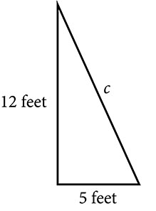

**Radicals and Rational Exponents**

  m51242
  

**Radicals and Rational Exponents**

  In this section, you will:

Evaluate square roots.
Use the product rule to simplify square roots.
Use the quotient rule to simplify square roots.
Add and subtract square roots.
Rationalize denominators.
Use rational roots.

  1834bc64-7094-4df1-a530-b3166a295697

## Learning Objective:
Investigate the discipline called learning science and the idea of a knowledge space.

## Objective 1: Investigate the discipline called learning science and the idea of a knowledge space.
The brain is a complex organ. It is the control center for our bodies, while the mind is where thinking and learning take place. In an attempt to understand the processes that occur in learning, researchers study a collection of disciplines called **learning sciences**. This interdisciplinary field includes study of psychological, sociological, anthropological, and computational approaches to learning.

In this skill sheet we will investigate the mathematics of mastery and knowledge spaces. A **knowledge space** includes the possible states of knowledge of a human learner. The theory of knowledge space was introduced in 1985 by mathematical psychologists Jean-Paul Doignon and Jean-Claude Falmagne and has since been studied by many researchers.
Doignon, J.-P.; Falmagne, J.-Cl. (1985), "Spaces for the assessment of knowledge", International Journal of Man-Machine Studies.

### Practice Makes Perfect
*Investigation*:  There are 32 student-learning outcomes (SLO’s) in a typical College Algebra course. These are topics a student needs to master to show proficiency in College Algebra. Let’s begin by looking at just a few of these skills.  Let’s assign the variables, A, B, C, and D to the following topics. We will name the set containing each of these 4 topics, Q.

A = Graph the basic functions listed in the library of functions.
B = Find the domain of a function defined by an equation.
C = Create a new function through composition of functions.
D = Find linear functions that model data sets.
Using roster notation Q = {A, B, C, D}. 
1. List each of the possible **subsets** of the 4 topics listed above using roster notation. Remember a subset is a collection of topics in which each topic listed is an element of the set Q we defined above. By including a topic, we are indicating that the student has mastered the topic.

2. Verify in your work above you have listed all 16 subsets to set Q. Remember that a subset may contain all of the topics listed in Q.

3. What formula could you use to help you determine the number of possible subsets? Remember that each topic could be mastered or not by a student. Show below that your formula would be equal to 16 for a list of 4 topics.

4. Now use the formula you found in #3 to find the number of subsets possible if we include all 32 student-learning outcomes.      Hint: In evaluating exponential terms, the function values increase very rapidly. To display very large (or very small) values, a calculator will use scientific notation. For example: 2.56 E6 is telling you to move the decimal point 6 places to the right and to insert zeros where you have missing values.   For example: 2.56 E6 = 2,560,000 or 2 million, five hundred, sixty thousand.

5. The subsets you created in #1 are referred to as knowledge spaces in the field of learning science. In this context mastery of one concept may depend on your mastery of another.     *List one skill* in mathematics that would help to master each of the following SLO’s:  A = Graph the basic functions listed in the library of functions. B = Find the domain of a function defined by an equation. C = Create a new function through composition of functions. D = Find linear functions that model data sets.

6. Mastery of what are called **linchpin topics** will make it easier to learn other topics. For example, the ability to solve linear equations with variables on both sides can “unlock” a whole set of new skills for a student to master.    List 3 other **linchpin topics** that would help you to master this math course. Discuss these with others in your class. Did they identify the same topics?

7. A corequisite course in mathematics is designed to provide support to a student by reviewing linchpin topics right when and where students need the help. Review of these important foundational ideas allow the learner to move on and master the student learning objectives for the course.     Brainstorm ideas with your classmates about ways this corequisite support course could help you in your learning.

A hardware store sells 16-ft ladders and 24-ft ladders. A window is located 12 feet above the ground. A ladder needs to be purchased that will reach the window from a point on the ground 5 feet from the building. To find out the length of ladder needed, we can draw a right triangle as shown in , and use the Pythagorean Theorem.

 $$
\begin{array}{ccc}  {a}^{2}+{b}^{2}& =& {c}^{2}  \\   {5}^{2}+{12}^{2}& =& {c}^{2}  \\   169& =& {c}^{2}  \end{array}
$$

Now, we need to find out the length that, when squared, is 169, to determine which ladder to choose. In other words, we need to find a square root. In this section, we will investigate methods of finding solutions to problems such as this one.

# Evaluating Square Roots
When the square root of a number is squared, the result is the original number. Since  ${4}^{2}=16,$ the square root of  $16$ 
 is  $4.$ 
 The square root function is the inverse of the squaring function just as subtraction is the inverse of addition. To undo squaring, we take the square root.
In general terms, if  $a$ 
 is a positive real number, then the square root of  $a$ 
 is a number that, when multiplied by itself, gives  $a.$ 
 The square root could be positive or negative because multiplying two negative numbers gives a positive number. The **principal square root** is the nonnegative number that when multiplied by itself equals  $a.$ 
 The square root obtained using a calculator is the principal square root.
The principal square root of  $a$ 
 is written as  $\sqrt{a}.$ 
 The symbol is called a **radical**, the term under the symbol is called the **radicand**, and the entire expression is called a **radical expression**.

>
>
>
>
> **Principal Square Root**
>
>
> The **principal square root** of  $a$ 
>  is the nonnegative number that, when multiplied by itself, equals  $a.$ 
>  It is written as a **radical expression***,* with a symbol called a **radical** over the term called the **radicand**:  $\sqrt{a}.$
>
>

>
> Q&A
> *Does*  $\sqrt{25}=\pm 5?$
>
>
> *No. Although both*  ${5}^{2}$ 
>  *and*  ${(\mathrm{-5})}^{2}$ 
>  *are*  $25,$ *the radical symbol implies only a nonnegative root, the principal square root. The principal square root of 25 is*  $\sqrt{25}=5.$
>
>

8. **Evaluating Square Roots**   Evaluate each expression.  ⓐ $\sqrt{100}$  ⓑ $\sqrt{\sqrt{16}}$  ⓒ $\sqrt{25+144}$   ⓓ $\sqrt{49}-\sqrt{81}$

Solution

ⓐ $\sqrt{100}=10$ because ${10}^{2}=100$

ⓑ $\sqrt{\sqrt{16}}=\sqrt{4}=2$ because ${4}^{2}=16$ and ${2}^{2}=4$

ⓒ $\sqrt{25+144}=\sqrt{169}=13$ because ${13}^{2}=169$

ⓓ $\sqrt{49}-\sqrt{81}=7-9=\mathrm{-2}$ because ${7}^{2}=49$ and ${9}^{2}=81$

>
> Q&A
> *For  $\sqrt{25+144},$ can we find the square roots before adding?*
>
> *No.*  $\sqrt{25}+\sqrt{144}=5+12=17.$ 
>  *This is not equivalent to*  $\sqrt{25+144}=13.$ 
>  *The order of operations requires us to add the terms in the radicand before finding the square root.*
>

>
> Try It
> 9. Evaluate each expression.   ⓐ $\sqrt{225}$  ⓑ $\sqrt{\sqrt{81}}$  ⓒ $\sqrt{25-9}$  ⓓ $\sqrt{36}+\sqrt{121}$
>
> 

> 
Solution

>
> ⓐ $15$
>
> ⓑ $3$
>
> ⓒ $4$
>
> ⓓ $17$
> 

>

# Using the Product Rule to Simplify Square Roots
To simplify a square root, we rewrite it such that there are no perfect squares in the radicand. There are several properties of square roots that allow us to simplify complicated radical expressions. The first rule we will look at is the *product rule for simplifying square roots,* which allows us to separate the square root of a product of two numbers into the product of two separate rational expressions. For instance, we can rewrite  $\sqrt{15}$ 
 as  $\sqrt{3}\cdot \sqrt{5}.$ 
 We can also use the product rule to express the product of multiple radical expressions as a single radical expression.

>
>
> **The Product Rule for Simplifying Square Roots**
>
>
>
> If  $a$ 
>  and  $b$ 
>  are nonnegative, the square root of the product  $ab$ 
>  is equal to the product of the square roots of  $a$ 
>  and  $b.\phantom{\rule{0.5em}{0ex}}$
>
>
>  $\sqrt{ab}=\sqrt{a}\cdot \sqrt{b}$
>

>
> How To
> *Given a square root radical expression, use the product rule to simplify it.*
>
>
> Factor any perfect squares from the radicand.
> Write the radical expression as a product of radical expressions.
> Simplify.
>

10. **Using the Product Rule to Simplify Square Roots**   Simplify the radical expression.   ⓐ $\sqrt{300}$  ⓑ $\sqrt{162{a}^{5}{b}^{4}}$

Solution

ⓐ $\begin{array}{cc}\sqrt{100\cdot 3}  & \phantom{\rule{4.5em}{0ex}}\text{Factor\ perfect\ square\ from\ radicand}.  \\ \sqrt{100}\cdot \sqrt{3}  & \phantom{\rule{4.5em}{0ex}}\text{Write\ radical\ expression\ as\ product\ of\ radical\ expressions}.  \\ 10\sqrt{3}  & \phantom{\rule{4.5em}{0ex}}\text{Simplify}.  \end{array}$

ⓑ $\begin{array}{cc}\sqrt{81{a}^{4}{b}^{4}\cdot 2a}  & \phantom{\rule{2em}{0ex}}\text{Factor\ perfect\ square\ from\ radicand}.  \\ \sqrt{81{a}^{4}{b}^{4}}\cdot \sqrt{2a}  & \phantom{\rule{2em}{0ex}}\text{Write\ radical\ expression\ as\ product\ of\ radical\ expressions}.  \\ 9{a}^{2}{b}^{2}\sqrt{2a}  & \phantom{\rule{2em}{0ex}}\text{Simplify}.  \end{array}$

>
> Try It
> 11. Simplify  $\sqrt{50{x}^{2}{y}^{3}z}.$
>
> 

> 
Solution

>
> $5\left|x\right|\left|y\right|\sqrt{2yz}.$ 
>  Notice the absolute value signs around *x* and *y*? That’s because their value must be positive!
> 

>
>
>

>
> How To
> *Given the product of multiple radical expressions, use the product rule to combine them into one radical expression.*
>
>
> Express the product of multiple radical expressions as a single radical expression.
> Simplify.
>

12. **Using the Product Rule to Simplify the Product of Multiple Square Roots**   Simplify the radical expression. $\sqrt{12}\cdot \sqrt{3}$

Solution

$\begin{array}{cc}\sqrt{12\cdot 3}  & \phantom{\rule{2em}{0ex}}\text{Express\ the\ product\ as\ a\ single\ radical\ expression}.  \\ \sqrt{36}  & \phantom{\rule{2em}{0ex}}\text{Simplify}.  \\ 6  & \end{array}$

>
> Try It
> 13. Simplify  $\sqrt{50x}\cdot \sqrt{2x}$   assuming  $x>0.$
>
> 

> 
Solution

>
> $10\left|x\right|$
> 

>
>

# Using the Quotient Rule to Simplify Square Roots
Just as we can rewrite the square root of a product as a product of square roots, so too can we rewrite the square root of a quotient as a quotient of square roots, using the *quotient rule for simplifying square roots.* It can be helpful to separate the numerator and denominator of a fraction under a radical so that we can take their square roots separately. We can rewrite  $\sqrt{\frac{5}{2}}$ 
 as  $\frac{\sqrt{5}}{\sqrt{2}}.$

>
>
>
>
> **The Quotient Rule for Simplifying Square Roots**
>
>
> The square root of the quotient  $\frac{a}{b}$ 
>  is equal to the quotient of the square roots of  $a$ 
>  and  $b,$ where  $b\ne 0.$
>
>
>  $\sqrt{\frac{a}{b}}=\frac{\sqrt{a}}{\sqrt{b}}$
>

>
> How To
> *Given a radical expression, use the quotient rule to simplify it.*
>
>
> Write the radical expression as the quotient of two radical expressions.
> Simplify the numerator and denominator.
>

14. **Using the Quotient Rule to Simplify Square Roots**   Simplify the radical expression.   $\sqrt{\frac{5}{36}}$

Solution

$\begin{array}{cc}\frac{\sqrt{5}}{\sqrt{36}}  & \phantom{\rule{2em}{0ex}}\text{Write\ as\ quotient\ of\ two\ radical\ expressions}.  \\ \frac{\sqrt{5}}{6}  & \phantom{\rule{2em}{0ex}}\text{Simplify\ denominator}.  \end{array}$

>
> Try It
> 15. Simplify  $\sqrt{\frac{2{x}^{2}}{9{y}^{4}}}.$
>
> 

> 
Solution

>
> $\frac{x\sqrt{2}}{3{y}^{2}}.$ 
>  We do not need the absolute value signs for  ${y}^{2}$ 
>  because that term will always be nonnegative.
> 

>
>

16. **Using the Quotient Rule to Simplify an Expression with Two Square Roots**   Simplify the radical expression.   $\frac{\sqrt{234{x}^{11}y}}{\sqrt{26{x}^{7}y}}$

Solution

$\begin{array}{cc}\sqrt{\frac{234{x}^{11}y}{26{x}^{7}y}}  & \phantom{\rule{2em}{0ex}}\text{Combine\ numerator\ and\ denominator\ into\ one\ radical\ expression}.  \\ \sqrt{9{x}^{4}}  & \phantom{\rule{2em}{0ex}}\text{Simplify\ fraction}.  \\ 3{x}^{2}\phantom{\rule{0.5em}{0ex}}\text\   & \phantom{\rule{2em}{0ex}}\text{Simplify\ square\ root}.  \end{array}$

>
> Try It
> 17. Simplify  $\frac{\sqrt{9{a}^{5}{b}^{14}}}{\sqrt{3{a}^{4}{b}^{5}}}.$
>
> 

> 
Solution

>
> ${b}^{4}\sqrt{3ab}$
> 

>
>

# Adding and Subtracting Square Roots
We can add or subtract radical expressions only when they have the same radicand and when they have the same radical type such as square roots. For example, the sum of  $\sqrt{2}$ 
 and  $3\sqrt{2}$ 
 is  $4\sqrt{2}.$ 
 However, it is often possible to simplify radical expressions, and that may change the radicand. The radical expression  $\sqrt{18}$ 
 can be written with a  $2$ 
 in the radicand, as  $3\sqrt{2},$ so  $\sqrt{2}+\sqrt{18}=\sqrt{2}+3\sqrt{2}=4\sqrt{2}.$

>
> How To
> *Given a radical expression requiring addition or subtraction of square roots, simplify.*
>
>
> Simplify each radical expression.
> Add or subtract expressions with equal radicands.
>

18. **Adding Square Roots**   Add  $5\sqrt{12}+2\sqrt{3}.$

Solution

We can rewrite  $5\sqrt{12}$ 
 as  $5\sqrt{4\xb73}.$ 
 According the product rule, this becomes  $5\sqrt{4}\sqrt{3}.$ 
 The square root of  $\sqrt{4}$ 
 is 2, so the expression becomes  $5\left(2\right)\sqrt{3},$ which is  $10\sqrt{3}.$ 
 Now the terms have the same radicand so we can add.
 $10\sqrt{3}+2\sqrt{3}=12\sqrt{3}$

>
> Try It
> 19. Add  $\sqrt{5}+6\sqrt{20}.$
>
> 

> 
Solution

>
> $13\sqrt{5}$
> 

>
>

20. **Subtracting Square Roots**   Subtract  $20\sqrt{72{a}^{3}{b}^{4}c}\phantom{\rule{0.5em}{0ex}}-14\sqrt{8{a}^{3}{b}^{4}c}.$

Solution

Factor 9 out of the first term so that both terms have equal radicands.

 $\begin{array}{ccccc}  20\sqrt{72{a}^{3}{b}^{4}c}& =& 20\sqrt{9\cdot 8{a}^{3}{b}^{4}c}  & =& 20\sqrt{9}\sqrt{8{a}^{3}{b}^{4}c}  \\ & =& 20(3)\sqrt{8{a}^{3}{b}^{4}c}  & =& 60\sqrt{8{a}^{3}{b}^{4}c}  \end{array}$

So

 
    $\begin{array}{c}20\sqrt{72{a}^{3}{b}^{4}c}-14\sqrt{8{a}^{3}{b}^{4}c}  \\ =60\sqrt{8{a}^{3}{b}^{4}c}-14\sqrt{8{a}^{3}{b}^{4}c}  \\ =46\sqrt{8{a}^{3}{b}^{4}c}  \end{array}$

>
> Try It
> 21. Subtract  $3\sqrt{80x}\phantom{\rule{0.5em}{0ex}}-4\sqrt{45x}.$
>
> 

> 
Solution

>
> $0$
> 

>
>

# Rationalizing Denominators
When an expression involving square root radicals is written in simplest form, it will not contain a radical in the denominator. We can remove radicals from the denominators of fractions using a process called *rationalizing the denominator*.
We know that multiplying by 1 does not change the value of an expression. We use this property of multiplication to change expressions that contain radicals in the denominator. To remove radicals from the denominators of fractions, multiply by the form of 1 that will eliminate the radical.
For a denominator containing a single term, multiply by the radical in the denominator over itself. In other words, if the denominator is  $b\sqrt{c},$ multiply by  $\frac{\sqrt{c}}{\sqrt{c}}.$

For a denominator containing the sum or difference of a rational and an irrational term, multiply the numerator and denominator by the conjugate of the denominator, which is found by changing the sign of the radical portion of the denominator. If the denominator is  $a+b\sqrt{c},$ then the conjugate is  $a-b\sqrt{c}.$

>
> How To
> *Given an expression with a single square root radical term in the denominator, rationalize the denominator.*
>
>
> Multiply the numerator and denominator by the radical in the denominator.
> Simplify.
>

22. **Rationalizing a Denominator Containing a Single Term**   Write  $\frac{2\sqrt{3}}{3\sqrt{10}}$   in simplest form.

Solution

The radical in the denominator is  $\sqrt{10}.$ 
 So multiply the fraction by  $\frac{\sqrt{10}}{\sqrt{10}}.$ 
 Then simplify.

 $$
\begin{array}{l}\frac{2\sqrt{3}}{3\sqrt{10}}\cdot \frac{\sqrt{10}}{\sqrt{10}}\phantom{\rule{0.5em}{0ex}}\text{\ \ \}\\ \frac{2\sqrt{30}}{30}\phantom{\rule{0.5em}{0ex}}\text{\ \ \ \ \ \ \ \ \ \}\\ \frac{\sqrt{30}}{15}\end{array}
$$

>
> Try It
>
> 23. Write  $\frac{12\sqrt{3}}{\sqrt{2}}$   in simplest form.
>
> 

> 
Solution

>
> $6\sqrt{6}$
> 

>
>
>

>
> How To
> *Given an expression with a radical term and a constant in the denominator, rationalize the denominator.*
>
>
>
> Find the conjugate of the denominator.
> Multiply the numerator and denominator by the conjugate.
> Use the distributive property.
> Simplify.
>

24. **Rationalizing a Denominator Containing Two Terms**   Write  $\frac{4}{1+\sqrt{5}}$   in simplest form.

Solution

Begin by finding the conjugate of the denominator by writing the denominator and changing the sign. So the conjugate of  $1+\sqrt{5}$ 
 is  $1-\sqrt{5}.$ 
 Then multiply the fraction by  $\frac{1-\sqrt{5}}{1-\sqrt{5}}.$

 $$
\begin{array}{cc}\frac{4}{1+\sqrt{5}}\cdot \frac{1-\sqrt{5}}{1-\sqrt{5}}  & \\ \frac{4-4\sqrt{5}}{-4}  & \phantom{\rule{2em}{0ex}}\text{Use\ the\ distributive\ property}.  \\ \sqrt{5}-1  & \phantom{\rule{2em}{0ex}}\text{Simplify}.  \end{array}
$$

>
> Try It
> 25. Write  $\frac{7}{2+\sqrt{3}}$   in simplest form.
>
> 

> 
Solution

>
> $14\mathrm{-7}\sqrt{3}$
> 

>
>

# Using Rational Roots
Although square roots are the most common rational roots, we can also find cube roots, 4th roots, 5th roots, and more. Just as the square root function is the inverse of the squaring function, these roots are the inverse of their respective power functions. These functions can be useful when we need to determine the number that, when raised to a certain power, gives a certain number.

## Understanding *n*th Roots
Suppose we know that  ${a}^{3}=8.$ 
 We want to find what number raised to the 3rd power is equal to 8. Since  ${2}^{3}=8,$ we say that 2 is the cube root of 8.
The *n*th root of  $a$ 
 is a number that, when raised to the *n*th power, gives  $a.$ 
 For example,  $\mathrm{-3}$ 
 is the 5th root of  $\mathrm{-243}$ 
 because  ${(\mathrm{-3})}^{5}=\mathrm{-243.}$ 
 If  $a$ 
 is a real number with at least one *n*th root, then the **principal *n*th root** of  $a$ 
 is the number with the same sign as  $a$ 
 that, when raised to the *n*th power, equals  $a.$

The principal *n*th root of  $a$ 
 is written as  $\sqrt[n]{a},$ where  $n$ 
 is a positive integer greater than or equal to 2. In the radical expression,  $n$ 
 is called the **index** of the radical.

>
>
> **Principal $n$ th Root**
>
>
>
> If  $a$ 
>  is a real number with at least one *n*th root, then the **principal *n*th root** of  $a,$ written as  $\sqrt[n]{a},$ is the number with the same sign as  $a$ 
>  that, when raised to the *n*th power, equals  $a.$ 
>  The **index** of the radical is  $n.$
>
>

26. **Simplifying *n*th Roots**   Simplify each of the following:    ⓐ $\sqrt[5]{\mathrm{-32}}$  ⓑ $\sqrt[4]{4}\cdot \sqrt[4]{1,024}$  ⓒ $-\sqrt[3]{\frac{8{x}^{6}}{125}}$  ⓓ $8\sqrt[4]{3}-\sqrt[4]{48}$

Solution

ⓐ $\sqrt[5]{\mathrm{-32}}=\mathrm{-2}\phantom{\rule{0.5em}{0ex}}$ because $\phantom{\rule{0.5em}{0ex}}{(\mathrm{-2})}^{5}=\mathrm{-32}$

ⓑFirst, express the product as a single radical expression. $\phantom{\rule{0.5em}{0ex}}\sqrt[4]{\mathrm{4,096}}=8\phantom{\rule{0.5em}{0ex}}$ because $\phantom{\rule{0.5em}{0ex}}{8}^{4}=\mathrm{4,096}$

ⓒ $\begin{array}{cc}\frac{-\sqrt[3]{8{x}^{6}}}{\sqrt[3]{125}}  & \phantom{\rule{3em}{0ex}}\text{Write\ as\ quotient\ of\ two\ radical\ expressions}.  \\ \frac{-2{x}^{2}}{5}  & \phantom{\rule{3em}{0ex}}\text{Simplify}.  \end{array}$

ⓓ $\begin{array}{cc}8\sqrt[4]{3}-2\sqrt[4]{3}  & \phantom{\rule{2em}{0ex}}\text{Simplify\ to\ get\ equal\ radicands}.  \\ 6\sqrt[4]{3}\   & \phantom{\rule{2em}{0ex}}\text{Add}.  \end{array}$

>
> Try It
> 27. Simplify.   ⓐ $\sqrt[3]{\mathrm{-216}}$  ⓑ $\frac{3\sqrt[4]{80}}{\sqrt[4]{5}}$  ⓒ $6\sqrt[3]{9,000}+7\sqrt[3]{576}$
>
> 

> 
Solution

>
> ⓐ $\mathrm{-6}$
>
> ⓑ $6$
>
> ⓒ $88\sqrt[3]{9}$
> 

>
>

## Using Rational Exponents
**Radical expressions** can also be written without using the radical symbol. We can use rational (fractional) exponents. The index must be a positive integer. If the index  $n$ 
 is even, then  $a$ 
 cannot be negative.
 $$
{a}^{\frac{1}{n}}=\sqrt[n]{a}
$$
We can also have rational exponents with numerators other than 1. In these cases, the exponent must be a fraction in lowest terms. We raise the base to a power and take an *n*th root. The numerator tells us the power and the denominator tells us the root.
 ${a}^{\frac{m}{n}}={\left(\sqrt[n]{a}\right)}^{m}=\sqrt[n]{{a}^{m}}$
All of the properties of exponents that we learned for integer exponents also hold for rational exponents.

>
>
>
>
> **Rational Exponents**
>
>
> Rational exponents are another way to express principal *n*th roots. The general form for converting between a radical expression with a radical symbol and one with a rational exponent is
>
>  ${a}^{\frac{m}{n}}={\left(\sqrt[n]{a}\right)}^{m}=\sqrt[n]{{a}^{m}}$
>

> How To
> *Given an expression with a rational exponent, write the expression as a radical.*
>
>
> Determine the power by looking at the numerator of the exponent.
> Determine the root by looking at the denominator of the exponent.
> Using the base as the radicand, raise the radicand to the power and use the root as the index.
>

28. **Writing Rational Exponents as Radicals**   Write  ${343}^{\frac{2}{3}}$   as a radical. Simplify.

Solution

The 2 tells us the power and the 3 tells us the root.

 ${343}^{\frac{2}{3}}={\left(\sqrt[3]{343}\right)}^{2}=\sqrt[3]{{343}^{2}}$

We know that  $\sqrt[3]{343}=7$ 
 because  ${7}^{3}=343.$ 
 Because the cube root is easy to find, it is easiest to find the cube root before squaring for this problem. In general, it is easier to find the root first and then raise it to a power.

 $$
{343}^{\frac{2}{3}}={\left(\sqrt[3]{343}\right)}^{2}={7}^{2}=49
$$

>
> Try It
> 29. Write  ${9}^{\frac{5}{2}}$   as a radical. Simplify.
>
> 

> 
Solution

>
> ${\left(\sqrt{9}\right)}^{5}={3}^{5}=243$
> 

>
>

30. **Writing Radicals as Rational Exponents**   Write  $\frac{4}{\sqrt[7]{{a}^{2}}}$   using a rational exponent.

Solution

The power is 2 and the root is 7, so the rational exponent will be  $\frac{2}{7}.$ 
 We get  $\frac{4}{{a}^{\frac{2}{7}}}.$ 
 Using properties of exponents, we get  $\frac{4}{\sqrt[7]{{a}^{2}}}=4{a}^{\frac{\mathrm{-2}}{7}}.$

>
> Try It
> 31. Write  $x\sqrt{{(5y)}^{9}}$   using a rational exponent.
>
> 

> 
Solution

>
> $x{(5y)}^{\frac{9}{2}}$
> 

>
>

32. **Simplifying Rational Exponents**   Simplify:     ⓐ $5\left(2{x}^{\frac{3}{4}}\right)\left(3{x}^{\frac{1}{5}}\right)$  ⓑ ${\left(\frac{16}{9}\right)}^{-\frac{1}{2}}$

Solution

ⓐ $\begin{array}{cc}30{x}^{\frac{3}{4}}{x}^{\frac{1}{5}}  & \phantom{\rule{2.5em}{0ex}}\text{Multiply\ the\ coefficients}.  \\ 30{x}^{\frac{3}{4}+\frac{1}{5}}  & \phantom{\rule{2.5em}{0ex}}\text{Use\ properties\ of\ exponents}.  \\ 30{x}^{\frac{19}{20}}  & \phantom{\rule{2.5em}{0ex}}\text{Simplify}.  \end{array}$

ⓑ $\begin{array}{cc}{\left(\frac{9}{16}\right)}^{\frac{1}{2}}  & \phantom{\rule{2em}{0ex}}\text{\hspace{1em}\hspace{1em}}\text{Use\ definition\ of\ negative\ exponents}.  \\ \sqrt{\frac{9}{16}}  & \phantom{\rule{2em}{0ex}}\text{\hspace{1em}\hspace{1em}}\text{Rewrite\ as\ a\ radical}.  \\ \frac{\sqrt{9}}{\sqrt{16}}  & \phantom{\rule{2em}{0ex}}\text{\hspace{1em}\hspace{1em}}\text{Use\ the\ quotient\ rule}.  \\ \frac{3}{4}  & \phantom{\rule{2em}{0ex}}\text{\hspace{1em}\hspace{1em}}\text{Simplify}.  \end{array}$

>
> Try It
> 33. Simplify  ${\left(8x\right)}^{\frac{1}{3}}\left(14{x}^{\frac{6}{5}}\right).$
>
> 

> 
Solution

>
> $28{x}^{\frac{23}{15}}$
> 

>
>

>
> Media
> Access these online resources for additional instruction and practice with radicals and rational exponents.
>
> Radicals
> Rational Exponents
> Simplify Radicals
> Rationalize Denominator

# Key Concepts

The principal square root of a number  $a$ 
 is the nonnegative number that when multiplied by itself equals  $a.$ 
 See .
If  $a$ 
 and  $b$ 
 are nonnegative, the square root of the product  $ab$ 
 is equal to the product of the square roots of  $a$ 
 and  $b$ 
 See  and .
If  $a$ 
 and  $b$ 
 are nonnegative, the square root of the quotient  $\frac{a}{b}$ 
 is equal to the quotient of the square roots of  $a$ 
 and  $b$ 
 See  and .
We can add and subtract radical expressions if they have the same radicand and the same index. See  and .
Radical expressions written in simplest form do not contain a radical in the denominator. To eliminate the square root radical from the denominator, multiply both the numerator and the denominator by the conjugate of the denominator. See  and .
The principal *n*th root of  $a$ 
 is the number with the same sign as  $a$ 
 that when raised to the *n*th power equals  $a.$ 
 These roots have the same properties as square roots.**** See .
Radicals can be rewritten as rational exponents and rational exponents can be rewritten as radicals. See  and .
The properties of exponents apply to rational exponents. See .

# Section Exercises

## Verbal
1. What does it mean when a radical does not have an index? Is the expression equal to the radicand? Explain.

Solution

When there is no index, it is assumed to be 2 or the square root. The expression would only be equal to the radicand if the index were 1.

2. Where would radicals come in the order of operations? Explain why.

3. Every number will have two square roots. What is the principal square root?

Solution

The principal square root is the nonnegative root of the number.

4. Can a radical with a negative radicand have a real square root? Why or why not?

## Numeric
For the following exercises, simplify each expression.
5. $\sqrt{256}$

Solution

16

6. $\sqrt{\sqrt{256}}$

7. $\sqrt{4\left(9+16\right)}$

Solution

10

8. $\sqrt{289}-\sqrt{121}$

9. $\sqrt{196}$

Solution

14

10. $\sqrt{1}$

11. $\sqrt{98}$

Solution

$7\sqrt{2}$

12. $\sqrt{\frac{27}{64}}$

13. $\sqrt{\frac{81}{5}}$

Solution

$\frac{9\sqrt{5}}{5}$

14. $\sqrt{800}$

15. $\sqrt{169}+\sqrt{144}$

Solution

25

16. $\sqrt{\frac{8}{50}}$

17. $\frac{18}{\sqrt{162}}$

Solution

$\sqrt{2}$

18. $\sqrt{192}$

19. $14\sqrt{6}-6\sqrt{24}$

Solution

$2\sqrt{6}$

20. $15\sqrt{5}+7\sqrt{45}$

21. $\sqrt{150}$

Solution

$5\sqrt{6}$

22. $\sqrt{\frac{96}{100}}$

23. $\left(\sqrt{42}\right)\left(\sqrt{30}\right)$

Solution

$6\sqrt{35}$

24. $12\sqrt{3}-4\sqrt{75}$

25. $\sqrt{\frac{4}{225}}$

Solution

$\frac{2}{15}$

26. $\sqrt{\frac{405}{324}}$

27. $\sqrt{\frac{360}{361}}$

Solution

$\frac{6\sqrt{10}}{19}$

28. $\frac{5}{1+\sqrt{3}}$

29. $\frac{8}{1-\sqrt{17}}$

Solution

$-\frac{1+\sqrt{17}}{2}$

30. $\sqrt[4]{16}$

31. $\sqrt[3]{128}+3\sqrt[3]{2}$

Solution

$7\sqrt[3]{2}$

32. $\sqrt[5]{\frac{\mathrm{-32}}{243}}$

33. $\frac{15\sqrt[4]{125}}{\sqrt[4]{5}}$

Solution

$15\sqrt{5}$

34. $3\sqrt[3]{\mathrm{-432}}+\sqrt[3]{16}$

## Algebraic
For the following exercises, simplify each expression.
35. $\sqrt{400{x}^{4}}$

Solution

$20{x}^{2}$

36. $\sqrt{4{y}^{2}}$

37. $\sqrt{49p}$

Solution

$7\sqrt{p}$

38. ${\left(144{p}^{2}{q}^{6}\right)}^{\frac{1}{2}}$

39. ${m}^{\frac{5}{2}}\sqrt{289}$

Solution

$17{m}^{2}\sqrt{m}$

40. $9\sqrt{3{m}^{2}}+\sqrt{27}$

41. $3\sqrt{a{b}^{2}}-b\sqrt{a}$

Solution

$2b\sqrt{a}$

42. $\frac{4\sqrt{2n}}{\sqrt{16{n}^{4}}}$

43. $\sqrt{\frac{225{x}^{3}}{49x}}$

Solution

$\frac{15x}{7}$

44. $3\sqrt{44z}+\sqrt{99z}$

45. $\sqrt{50{y}^{8}}$

Solution

$5{y}^{4}\sqrt{2}$

46. $\sqrt{490b{c}^{2}}$

47. $\sqrt{\frac{32}{14d}}$

Solution

$\frac{4\sqrt{7d}}{7d}$

48. ${q}^{\frac{3}{2}}\sqrt{63p}$

49. $\frac{\sqrt{8}}{1-\sqrt{3x}}$

Solution

$\frac{2\sqrt{2}+2\sqrt{6x}}{1\mathrm{-3}x}$

50. $\sqrt{\frac{20}{121{d}^{4}}}$

51. ${w}^{\frac{3}{2}}\sqrt{32}-{w}^{\frac{3}{2}}\sqrt{50}$

Solution

$-w\sqrt{2w}$

52. $\sqrt{108{x}^{4}}+\sqrt{27{x}^{4}}$

53. $\frac{\sqrt{12x}}{2+2\sqrt{3}}$

Solution

$\frac{3\sqrt{x}-\sqrt{3x}}{2}$

54. $\sqrt{147{k}^{3}}$

55. $\sqrt{125{n}^{10}}$

Solution

$5{n}^{5}\sqrt{5}$

56. $\sqrt{\frac{42q}{36{q}^{3}}}$

57. $\sqrt{\frac{81m}{361{m}^{2}}}$

Solution

$\frac{9\sqrt{m}}{19m}$

58. $\sqrt{72c}-2\sqrt{2c}$

59. $\sqrt{\frac{144}{324{d}^{2}}}$

Solution

$\frac{2}{3d}$

60. $\sqrt[3]{24{x}^{6}}+\sqrt[3]{81{x}^{6}}$

61. $\sqrt[4]{\frac{162{x}^{6}}{16{x}^{4}}}$

Solution

$\frac{3\sqrt[4]{2{x}^{2}}}{2}$

62. $\sqrt[3]{64y}$

63. $\sqrt[3]{128{z}^{3}}-\sqrt[3]{\mathrm{-16}{z}^{3}}$

Solution

$6z\sqrt[3]{2}$

64. $\sqrt[5]{\mathrm{1,024}{c}^{10}}$

## Real-World Applications
65. A guy wire for a suspension bridge runs from the ground diagonally to the top of the closest pylon to make a triangle. We can use the Pythagorean Theorem to find the length of guy wire needed. The square of the distance between the wire on the ground and the pylon on the ground is 90,000 feet. The square of the height of the pylon is 160,000 feet. So the length of the guy wire can be found by evaluating  $\sqrt{\mathrm{90,000}+\mathrm{160,000}}.$   What is the length of the guy wire?

Solution

500 feet

66. A car accelerates at a rate of  $6-\frac{\sqrt{4}}{\sqrt{t}}{\phantom{\rule{0.5em}{0ex}}\text{m/s}}^{2}$   where *t* is the time in seconds after the car moves from rest. Simplify the expression.

## Extensions
For the following exercises, simplify each expression.
67. $\frac{\sqrt{8}-\sqrt{16}}{4-\sqrt{2}}-{2}^{\frac{1}{2}}$

Solution

$\frac{\mathrm{-5}\sqrt{2}\mathrm{-6}}{7}$

68. $\frac{{4}^{\frac{3}{2}}-{16}^{\frac{3}{2}}}{{8}^{\frac{1}{3}}}$

69. $\frac{\sqrt{m{n}^{3}}}{{a}^{2}\sqrt{{c}^{\mathrm{-3}}}}\cdot \frac{{a}^{\mathrm{-7}}{n}^{\mathrm{-2}}}{\sqrt{{m}^{2}{c}^{4}}}$

Solution

$\frac{\sqrt{mnc}}{{a}^{9}cmn}$

70. $\frac{a}{a-\sqrt{c}}$

71. $\frac{x\sqrt{64y}+4\sqrt{y}}{\sqrt{128y}}$

Solution

$\frac{2x+1}{2\sqrt{2}}$

72. $\left(\frac{\sqrt{250{x}^{2}}}{\sqrt{100{b}^{3}}}\right)\left(\frac{7\sqrt{b}}{\sqrt{125x}}\right)$

73. $\sqrt{\frac{\sqrt[3]{64}+\sqrt[4]{256}}{\sqrt{64}+\sqrt{256}}}$

Solution

$\frac{\sqrt{3}}{3}$

**index**the number above the radical sign indicating the *n*th root
**principal *n*th root** the number with the same sign as  $a$ 
 that when raised to the *n*th power equals  $a$

**principal square root**the nonnegative square root of a number  $a$ 
 that, when multiplied by itself, equals  $a$

**radical**the symbol used to indicate a root
**radical expression**an expression containing a radical symbol
**radicand**the number under the radical symbol
