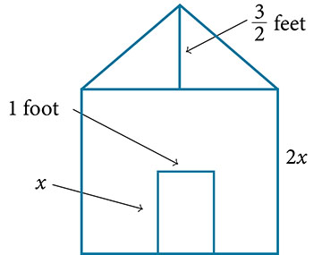

**Polynomials**

  m51246
  

**Polynomials**

  In this section, you will:

Identify the degree and leading coefficient of polynomials.
Add and subtract polynomials.
Multiply polynomials.
Use FOIL to multiply binomials.
Perform operations with polynomials of several variables.

  f7978ad8-ed27-4fe4-8a19-26a031ba97ad

## Learning Objectives

Distinguish between a fixed and a growth mindset, and how these ideas may help in learning.

## Objective 1: Distinguish between a fixed and a growth mindset, and how these ideas may help in learning.
Stanford University psychologist and researcher, Carol Dweck, PH.D., published a book in 2006 called *"Mindset, The New Psychology of Success"*, which changed how many people think about their talents and abilities. Based on decades of research Dr. Dweck outlined two mindsets and their influence on our learning.

Dr. Dweck’s research found that people who believe that their abilities could change through learning and practice (**growth mindset**) more readily accepted learning challenges and persisted through these challenges.
While individuals who believe that knowledge and abilities come from natural talent and cannot be changed (**fixed mindset**) more often become discouraged by failure and do not persist. 
Her research shows that if we believe we can learn and master something new, this belief greatly improves our ability to learn.

Read through the following illustration based on Dr. Dweck’s work.

It’s important to note that we as individuals do not have a strict fixed or growth mindset at all times. We can lean one way or another in certain situations or when working in different disciplines or areas. For example, a person who often plays video games may feel they can learn any new game that is released and be confident in these abilities, but at the same time avoid sports and are fixed on the idea that they will never excel at physical activities.

In terms of learning new skills in mathematics, which mindset, growth or fixed, best describes your beliefs as of today? Explain.

Identify each of the following statements as coming from a student with a fixed mindset or with a growth mindset.

| Statement | Fixed or Growth Mindset? |
| :--- | :--- |
| a. I’ve never been good at math, so I’ll be happy just getting a D in this course. |  |
| b. I hear that this instructor is really great, I’m excited to start this new term. |  |
| c. I need to try harder in this class and put in more study time. I have the rest of the term to improve my performance. |  |
| d. I hate math. |  |
| e. This activity is dumb, I don’t think it will help me. |  |
| f. That exam was tough, but I’m going to rework it during my study time and get these concepts down before my final. |  |
| g. I’m up for the challenge of this course. |  |
| h. Some people are just better in math than me. |  |
| i. Intelligence is something you have to work for. |  |
| j. I find it best to erase every mistake I make in my homework and try to forget about it. |  |
| k. I try to learn from my mistakes and make note of them. |  |
| l. I’m not going to raise my hand to answer this question in class. I’ll just be wrong. |  |

Mindsets can be changed. As Dr. Dweck would say “You have a choice. Mindsets are just beliefs. They are powerful beliefs, but they are something in your mind and you can change your mind.” 
Think about what you would like to achieve in your classes this term and how a growth mindset can help you reach these goals. Write three goals for yourself below.

Maahi is building a little free library (a small house-shaped book repository), whose front is in the shape of a square topped with a triangle. There will be a rectangular door through which people can take and donate books. Maahi wants to find the area of the front of the library so that they can purchase the correct amount of paint. Using the measurements of the front of the house, shown in , we can create an expression that combines several variable terms, allowing us to solve this problem and others like it.

First find the area of the square in square feet.

 $$
\begin{array}{ccc}  A& =& {s}^{2}  \\ & =& {(2x)}^{2}  \\ & =& 4{x}^{2}  \end{array}
$$

Then find the area of the triangle in square feet.

 $\begin{array}{ccc}  A& =& \frac{1}{2}bh  \\ & =& \phantom{\rule{0.5em}{0ex}}\frac{1}{2}(2x)\left(\frac{3}{2}\right)  \\ & =& \phantom{\rule{0.5em}{0ex}}\frac{3}{2}x  \end{array}$

Next find the area of the rectangular door in square feet.

 $$
\begin{array}{ccc}  A& =& lw  \\ & =& x\cdot 1  \\   & =& x  \end{array}
$$

The area of the front of the library can be found by adding the areas of the square and the triangle, and then subtracting the area of the rectangle. When we do this, we get $4{x}^{2}+\frac{3}{2}x-x\phantom{\rule{0.5em}{0ex}}{\text{ft}}^{2},$ or $4{x}^{2}+\frac{1}{2}x$ ft2.
In this section, we will examine expressions such as this one, which combine several variable terms.

# Identifying the Degree and Leading Coefficient of Polynomials
The formula just found is an example of a **polynomial**, which is a sum of or difference of terms, each consisting of a variable raised to a nonnegative integer power. A number multiplied by a variable raised to an exponent, such as $384\pi ,$ is known as a **coefficient**. Coefficients can be positive, negative, or zero, and can be whole numbers, decimals, or fractions. Each product ${a}_{i}{x}^{i},$ such as $384\pi w,$ is a **term of a polynomial**. If a term does not contain a variable, it is called a *constant*.
A polynomial containing only one term, such as $5{x}^{4},$ is called a **monomial**. A polynomial containing two terms, such as $2x-9,$ is called a **binomial**. A polynomial containing three terms, such as $\mathrm{-3}{x}^{2}+8x-7,$ is called a **trinomial**.
We can find the **degree** of a polynomial by identifying the highest power of the variable that occurs in the polynomial. The term with the highest degree is called the **leading term** because it is usually written first. The coefficient of the leading term is called the **leading coefficient**. When a polynomial is written so that the powers are descending, we say that it is in standard form.

>
>
>
>
> **Polynomials**
>
>
> A **polynomial** is an expression that can be written in the form
>
>  $$
> {a}_{n}{x}^{n}+\mathrm{...}+{a}_{2}{x}^{2}+{a}_{1}x+{a}_{0}
> $$
>
> Each real number *ai*is called a **coefficient**. The number ${a}_{0}$ that is not multiplied by a variable is called a *constant*. Each product ${a}_{i}{x}^{i}$ is a **term of a polynomial**. The highest power of the variable that occurs in the polynomial is called the **degree** of a polynomial. The **leading term** is the term with the highest power, and its coefficient is called the **leading coefficient**.
>

>
> How To
> *Given a polynomial expression, identify the degree and leading coefficient*.
>
>
> Find the highest power of *x* to determine the degree.
> Identify the term containing the highest power of *x* to find the leading term.
> Identify the coefficient of the leading term.
>

1. **Identifying the Degree and Leading Coefficient of a Polynomial**   For the following polynomials, identify the degree, the leading term, and the leading coefficient.     ⓐ $3+2{x}^{2}-4{x}^{3}$  ⓑ $5{t}^{5}-2{t}^{3}+7t$  ⓒ $6p-{p}^{3}-2$

Solution

ⓐThe highest power of *x* is 3, so the degree is 3. The leading term is the term containing that degree, $\mathrm{-4}{x}^{3}.$ The leading coefficient is the coefficient of that term, $\mathrm{-4.}$

ⓑThe highest power of *t* is $5,$ so the degree is $5.$ The leading term is the term containing that degree, $5{t}^{5}.$ The leading coefficient is the coefficient of that term, $5.$

ⓒThe highest power of *p* is $3,$ so the degree is $3.$ The leading term is the term containing that degree, $-{p}^{3},$ The leading coefficient is the coefficient of that term, $\mathrm{-1.}$

>
> Try It
> 2. Identify the degree, leading term, and leading coefficient of the polynomial $4{x}^{2}-{x}^{6}+2x-6.$
>
> 

> 
Solution

>
> The degree is 6, the leading term is $-{x}^{6},$ and the leading coefficient is $\mathrm{-1.}$
> 

>
>

# Adding and Subtracting Polynomials
We can add and subtract polynomials by combining like terms, which are terms that contain the same variables raised to the same exponents. For example, $5{x}^{2}$ and $\mathrm{-2}{x}^{2}$ are like terms, and can be added to get $3{x}^{2},$ but $3x$ and $3{x}^{2}$ are not like terms, and therefore cannot be added.

>
> How To
> *Given multiple polynomials, add or subtract them to simplify the expressions.*
>
>
> Combine like terms.
> Simplify and write in standard form.
>

3. **Adding Polynomials**   Find the sum.    $\left(12{x}^{2}+9x-21\right)+\left(4{x}^{3}+8{x}^{2}-5x+20\right)$

Solution

$$
\begin{array}{cc}4{x}^{3}+\left(12{x}^{2}+8{x}^{2}\right)+(9x-5x)+(\mathrm{-21}+20)\   & \phantom{\rule{2em}{0ex}}\text{\hspace{1em}\hspace{1em}}\text{Combine\ like\ terms}.  \\ 4{x}^{3}+20{x}^{2}+4x-1  & \phantom{\rule{2em}{0ex}}\text{\hspace{1em}\hspace{1em}}\text{Simplify}.  \end{array}
$$

>
> Try It
> 4. Find the sum.    $\left(2{x}^{3}+5{x}^{2}-x+1\right)+\left(2{x}^{2}-3x-4\right)$
>
> 

> 
Solution

>
> $2{x}^{3}+7{x}^{2}\mathrm{-4}x\mathrm{-3}$
> 

>
>

5. **Subtracting Polynomials**   Find the difference.    $\left(7{x}^{4}-{x}^{2}+6x+1\right)-\left(5{x}^{3}-2{x}^{2}+3x+2\right)$

Solution

$$
\begin{array}{cc}7{x}^{4}-{x}^{2}+6x+1-5{x}^{3}+2{x}^{2}-3x-2  & \phantom{\rule{1em}{0ex}}\text{Distribute negative sign.}  \\ 7{x}^{4}-5{x}^{3}+{x}^{2}+6x-3x+1-2  & \phantom{\rule{1em}{0ex}}\text{Group like terms.}  \\ 7{x}^{4}-5{x}^{3}+{x}^{2}+3x-1  & \phantom{\rule{1em}{0ex}}\text{Combine/simplify.}  \end{array}
$$

>
> Try It
>  6. Find the difference.    $\left(\mathrm{-7}{x}^{3}-7{x}^{2}+6x-2\right)-\left(4{x}^{3}-6{x}^{2}-x+7\right)$
>
> 

> 
Solution

>
> $\mathrm{-11}{x}^{3}-{x}^{2}+7x\mathrm{-9}$
> 

>
>

# Multiplying Polynomials
Multiplying polynomials is a bit more challenging than adding and subtracting polynomials. We must use the distributive property to multiply each term in the first polynomial by each term in the second polynomial. We then combine like terms. We can also use a shortcut called the **FOIL** method when multiplying binomials. Certain special products follow patterns that we can memorize and use instead of multiplying the polynomials by hand each time. We will look at a variety of ways to multiply polynomials.

## Multiplying Polynomials Using the Distributive Property
To multiply a number by a polynomial, we use the distributive property. The number must be distributed to each term of the polynomial. We can distribute the $2$ in $2(x+7)$ to obtain the equivalent expression $2x+14.$ When multiplying polynomials, the distributive property allows us to multiply each term of the first polynomial by each term of the second. We then add the products together and combine like terms to simplify.

>
> How To
> *Given the multiplication of two polynomials, use the distributive property to simplify the expression.*
>
>
> Multiply each term of the first polynomial by each term of the second.
> Combine like terms.
> Simplify.
>

7. **Multiplying Polynomials Using the Distributive Property**   Find the product.   $\left(2x+1\right)\left(3{x}^{2}-x+4\right)$

Solution

$$
\begin{array}{cc}2x\left(3{x}^{2}-x+4\right)+1\left(3{x}^{2}-x+4\right)\   & \phantom{\rule{2em}{0ex}}\text{\hspace{1em}\hspace{1em}}\text{Use\ the\ distributive\ property}.  \\ \left(6{x}^{3}-2{x}^{2}+8x\right)+\left(3{x}^{2}-x+4\right)  & \phantom{\rule{2em}{0ex}}\text{\hspace{1em}\hspace{1em}}\text{Multiply}.  \\ 6{x}^{3}+\left(\mathrm{-2}{x}^{2}+3{x}^{2}\right)+(8x-x)+4  & \phantom{\rule{2em}{0ex}}\text{\hspace{1em}\hspace{1em}}\text{Combine\ like\ terms}.  \\ 6{x}^{3}+{x}^{2}+7x+4\   & \phantom{\rule{2em}{0ex}}\text{\hspace{1em}\hspace{1em}}\text{Simplify}.  \end{array}
$$

>
> Try It
> 8. Find the product.    $(3x+2)\left({x}^{3}-4{x}^{2}+7\right)$
>
> 

> 
Solution

>
> $3{x}^{4}\mathrm{-10}{x}^{3}\mathrm{-8}{x}^{2}+21x+14$
> 

>
>

## Using FOIL to Multiply Binomials
A shortcut called FOIL is sometimes used to find the product of two binomials. It is called FOIL because we multiply the *f*irst terms, the *o*uter terms, the *i*nner terms, and then the *l*ast terms of each binomial.

The FOIL method arises out of the distributive property. We are simply multiplying each term of the first binomial by each term of the second binomial, and then combining like terms.

>
> How To
> *Given two binomials, use FOIL to simplify the expression.*
>
>
> Multiply the first terms of each binomial.
> Multiply the outer terms of the binomials.
> Multiply the inner terms of the binomials.
> Multiply the last terms of each binomial.
> Add the products.
> Combine like terms and simplify.
>

9. **Using FOIL to Multiply Binomials**   Use FOIL to find the product.   $(2x-18)(3x+3)$

Solution

Find the product of the first terms.

Find the product of the outer terms.

Find the product of the inner terms.

Find the product of the last terms.

 $\begin{array}{cc}6{x}^{2}+6x-54x-54  & \phantom{\rule{2em}{0ex}}\text{Add\ the\ products}.  \\ 6{x}^{2}+(6x-54x)-54  & \phantom{\rule{2em}{0ex}}\text{Combine\ like\ terms}.  \\ 6{x}^{2}-48x-54  & \phantom{\rule{2em}{0ex}}\text{Simplify}.  \end{array}$

>
> Try It
> 10. Use FOIL to find the product.   $(x+7)(3x-5)$
>
> 

> 
Solution

>
> $3{x}^{2}+16x\mathrm{-35}$
> 

>
>

## Perfect Square Trinomials
Certain binomial products have special forms. When a binomial is squared, the result is called a **perfect square trinomial**. We can find the square by multiplying the binomial by itself. However, there is a special form that each of these perfect square trinomials takes, and memorizing the form makes squaring binomials much easier and faster. Let’s look at a few perfect square trinomials to familiarize ourselves with the form.
 $$
\begin{array}{ccc}  \phantom{\rule{0.5em}{0ex}}\text{}{(x+5)}^{2}& =& {x}^{2}+10x+25  \\   {(x-3)}^{2}& =& \phantom{\rule{0.5em}{0ex}}{x}^{2}-6x+9  \\   {(4x-1)}^{2}& =& 16{x}^{2}-8x+1  \end{array}
$$

Notice that the first term of each trinomial is the square of the first term of the binomial and, similarly, the last term of each trinomial is the square of the last term of the binomial. The middle term is double the product of the two terms. Lastly, we see that the first sign of the trinomial is the same as the sign of the binomial.

>
>
>
>
> **Perfect Square Trinomials**
>
>
> When a binomial is squared, the result is the first term squared added to double the product of both terms and the last term squared.
>
>  ${(x+a)}^{2}=(x+a)(x+a)={x}^{2}+2ax+{a}^{2}$
>

>
> How To
> *Given a binomial, square it using the formula for perfect square trinomials.*
>
>
> Square the first term of the binomial.
> Square the last term of the binomial.
> For the middle term of the trinomial, double the product of the two terms.
> Add and simplify.
>

11. **Expanding Perfect Squares**   Expand ${(3x-8)}^{2}.$

Solution

Begin by squaring the first term and the last term. For the middle term of the trinomial, double the product of the two terms.

 ${(3x)}^{2}-2(3x)(8)+{(\mathrm{-8})}^{2}$
Simplify. $9{x}^{2}-48x+64.$

>
> Try It
> 12. Expand ${(4x-1)}^{2}.$
>
> 

> 
Solution

>
> $16{x}^{2}\mathrm{-8}x+1$
> 

>
>

## Difference of Squares
Another special product is called the **difference of squares**, which occurs when we multiply a binomial by another binomial with the same terms but the opposite sign. Let’s see what happens when we multiply $(x+1)(x-1)$ using the FOIL method.
 $$
\begin{array}{ccc}  (x+1)(x-1)& =& {x}^{2}-x+x-1  \\ & =& {x}^{2}-1  \end{array}
$$

The middle term drops out, resulting in a difference of squares. Just as we did with the perfect squares, let’s look at a few examples.
 $$
\begin{array}{ccc}  (x+5)(x-5)& =& {x}^{2}-25  \\   (x+11)(x-11)& =& {x}^{2}-121  \\   (2x+3)(2x-3)& =& 4{x}^{2}-9  \end{array}
$$

Because the sign changes in the second binomial, the outer and inner terms cancel each other out, and we are left only with the square of the first term minus the square of the last term.

>
> Q&A
> *Is there a special form for the sum of squares?*
>
> *No. The difference of squares occurs because the opposite signs of the binomials cause the middle terms to disappear. There are no two binomials that multiply to equal a sum of squares.*
>

>
>
>
>
> **Difference of Squares**
>
>
> When a binomial is multiplied by a binomial with the same terms separated by the opposite sign, the result is the square of the first term minus the square of the last term.
>
>  $(a+b)(a-b)={a}^{2}-{b}^{2}$
>

>
> How To
> *Given a binomial multiplied by a binomial with the same terms but the opposite sign, find the difference of squares.*
>
>
> Square the first term of the binomials.
> Square the last term of the binomials.
> Subtract the square of the last term from the square of the first term.
>

13. **Multiplying Binomials Resulting in a Difference of Squares**   Multiply $(9x+4)(9x-4).$

Solution

Square the first term to get ${(9x)}^{2}=81{x}^{2}.$ Square the last term to get ${4}^{2}=16.$ Subtract the square of the last term from the square of the first term to find the product of $81{x}^{2}-16.$

>
> Try It
> 14. Multiply $(2x+7)(2x-7).$
>
> 

> 
Solution

>
> $4{x}^{2}\mathrm{-49}$
> 

>
>

# Performing Operations with Polynomials of Several Variables
We have looked at polynomials containing only one variable. However, a polynomial can contain several variables. All of the same rules apply when working with polynomials containing several variables. Consider an example:
 $$
\begin{array}{cc}(a+2b)(4a-b-c)  &   \\ a(4a-b-c)+2b(4a-b-c)  & \phantom{\rule{2em}{0ex}}\text{Use\ the\ distributive\ property}.  \\ 4{a}^{2}-ab-ac+8ab-2{b}^{2}-2bc  & \phantom{\rule{2em}{0ex}}\text{Multiply}.  \\ 4{a}^{2}+(-ab+8ab)-ac-2{b}^{2}-2bc  & \phantom{\rule{2em}{0ex}}\text{Combine\ like\ terms}.  \\ 4{a}^{2}+7ab-ac-2bc-2{b}^{2}  & \phantom{\rule{2em}{0ex}}\text{Simplify}.  \end{array}
$$

15. **Multiplying Polynomials Containing Several Variables**   Multiply $(x+4)(3x-2y+5).$

Solution

Follow the same steps that we used to multiply polynomials containing only one variable.

 $$
\begin{array}{cc}x(3x-2y+5)+4(3x-2y+5)\   & \phantom{\rule{2em}{0ex}}\text{Use\ the\ distributive\ property}.  \\ 3{x}^{2}-2xy+5x+12x-8y+20  & \phantom{\rule{2em}{0ex}}\text{Multiply}.  \\ 3{x}^{2}-2xy+(5x+12x)-8y+20  & \phantom{\rule{2em}{0ex}}\text{Combine\ like\ terms}.  \\ 3{x}^{2}-2xy+17x-8y+20\   & \phantom{\rule{2em}{0ex}}\text{Simplify}.  \end{array}
$$

>
> Try It
> 16. Multiply $(3x-1)(2x+7y-9).$
>
> 

> 
Solution

>
> $6{x}^{2}+21xy\mathrm{-29}x\mathrm{-7}y+9$
> 

>
>

>
> Media
> Access these online resources for additional instruction and practice with polynomials.
>
> Adding and Subtracting Polynomials
> Multiplying Polynomials
> Special Products of Polynomials

# Key Equations

| perfect square trinomial | ${(x+a)}^{2}=(x+a)(x+a)={x}^{2}+2ax+{a}^{2}$ |
| :--- | :--- |
| difference of squares | $(a+b)(a-b)={a}^{2}-{b}^{2}$ |

# Key Concepts

A polynomial is a sum of terms each consisting of a variable raised to a non-negative integer power. The degree is the highest power of the variable that occurs in the polynomial. The leading term is the term containing the highest degree, and the leading coefficient is the coefficient of that term. See .
We can add and subtract polynomials by combining like terms. See  and .
To multiply polynomials, use the distributive property to multiply each term in the first polynomial by each term in the second. Then add the products. See .
FOIL (First, Outer, Inner, Last) is a shortcut that can be used to multiply binomials. See .
Perfect square trinomials and difference of squares are special products. See  and .
 Follow the same rules to work with polynomials containing several variables. See .

# Section Exercises

## Verbal
1. Evaluate the following statement: The degree of a polynomial in standard form is the exponent of the leading term. Explain why the statement is true or false.

Solution

The statement is true. In standard form, the polynomial with the highest value exponent is placed first and is the leading term. The degree of a polynomial is the value of the highest exponent, which in standard form is also the exponent of the leading term.

2. Many times, multiplying two binomials with two variables results in a trinomial. This is not the case when there is a difference of two squares. Explain why the product in this case is also a binomial.

3. You can multiply polynomials with any number of terms and any number of variables using four basic steps over and over until you reach the expanded polynomial. What are the four steps?

Solution

Use the distributive property, multiply, combine like terms, and simplify.

4. State whether the following statement is true and explain why or why not: A trinomial is always a higher degree than a monomial.

## Algebraic
For the following exercises, identify the degree of the polynomial.
5. $7x-2{x}^{2}+13$

Solution

2

6. $14{m}^{3}+{m}^{2}-16m+8$

7. $\mathrm{-625}{a}^{8}+16{b}^{4}$

Solution

8

8. $200p-30{p}^{2}m+40{m}^{3}$

9. ${x}^{2}+4x+4$

Solution

2

10. $6{y}^{4}-{y}^{5}+3y-4$

For the following exercises, find the sum or difference.
11. $\left(12{x}^{2}+3x\right)-\left(8{x}^{2}\mathrm{-19}\right)$

Solution

$4{x}^{2}+3x+19$

12. $\left(4{z}^{3}+8{z}^{2}-z\right)+\left(\mathrm{-2}{z}^{2}+z+6\right)$

13. $\left(6{w}^{2}+24w+24\right)-\left(3w{}^{2}-6w+3\right)$

Solution

$3{w}^{2}+30w+21$

14. $\left(7{a}^{3}+6{a}^{2}-4a-13\right)+\left(-3{a}^{3}-4{a}^{2}+6a+17\right)$

15. $\left(11{b}^{4}-6{b}^{3}+18{b}^{2}-4b+8\right)-\left(3{b}^{3}+6{b}^{2}+3b\right)$

Solution

$11{b}^{4}\mathrm{-9}{b}^{3}+12{b}^{2}\mathrm{-7}b+8$

16. $\left(49{p}^{2}-25\right)+\left(16{p}^{4}-32{p}^{2}+16\right)$

For the following exercises, find the product.
17. $(4x+2)(6x-4)$

Solution

$24{x}^{2}\mathrm{-4}x\mathrm{-8}$

18. $\left(14{c}^{2}+4c\right)\left(2{c}^{2}-3c\right)$

19. $\left(6{b}^{2}-6\right)\left(4{b}^{2}-4\right)$

Solution

$24{b}^{4}\mathrm{-48}{b}^{2}+24$

20. $(3d-5)(2d+9)$

21. $(9v-11)(11v-9)$

Solution

$99{v}^{2}\mathrm{-202}v+99$

22. $\left(4{t}^{2}+7t\right)\left(\mathrm{-3}{t}^{2}+4\right)$

23. $(8n-4)\left({n}^{2}+9\right)$

Solution

$8{n}^{3}\mathrm{-4}{n}^{2}+72n\mathrm{-36}$

For the following exercises, expand the binomial.
24. ${\left(4x+5\right)}^{2}$

25. ${(3y-7)}^{2}$

Solution

$9{y}^{2}\mathrm{-42}y+49$

26. ${(12-4x)}^{2}$

27. ${\left(4p+9\right)}^{2}$

Solution

$16{p}^{2}+72p+81$

28. ${(2m-3)}^{2}$

29. ${(3y-6)}^{2}$

Solution

$9{y}^{2}\mathrm{-36}y+36$

30. ${\left(9b+1\right)}^{2}$

For the following exercises, multiply the binomials.
31. $(4c+1)(4c-1)$

Solution

$16{c}^{2}\mathrm{-1}$

32. $(9a-4)(9a+4)$

33. $(15n-6)(15n+6)$

Solution

$225{n}^{2}\mathrm{-36}$

34. $(25b+2)(25b-2)$

35. $(4+4m)(4-4m)$

Solution

$\mathrm{-16}{m}^{2}+16$

36. $(14p+7)(14p-7)$

37. $(11q-10)(11q+10)$

Solution

$121{q}^{2}\mathrm{-100}$

For the following exercises, multiply the polynomials.
38. $\left(2{x}^{2}+2x+1\right)(4x-1)$

39. $\left(4{t}^{2}+t-7\right)\left(4{t}^{2}-1\right)$

Solution

$16{t}^{4}+4{t}^{3}\mathrm{-32}{t}^{2}-t+7$

40. $(x-1)\left({x}^{2}-2x+1\right)$

41. $(y-2)\left({y}^{2}-4y-9\right)$

Solution

${y}^{3}\mathrm{-6}{y}^{2}-y+18$

42. $(6k-5)\left(6{k}^{2}+5k-1\right)$

43. $\left(3{p}^{2}+2p-10\right)(p-1)$

Solution

$3{p}^{3}-{p}^{2}\mathrm{-12}p+10$

44. $(4m-13)\left(2{m}^{2}-7m+9\right)$

45. $\left(a+b\right)\left(a-b\right)$

Solution

${a}^{2}-{b}^{2}$

46. $(4x-6y)(6x-4y)$

47. ${(4t-5u)}^{2}$

Solution

$16{t}^{2}\mathrm{-40}tu+25{u}^{2}$

48. $(9m+4n-1)(2m+8)$

49. $\left(4t-x\right)\left(t-x+1\right)$

Solution

$4{t}^{2}+{x}^{2}+4t\mathrm{-5}tx-x$

50. $({b}^{2}-1)\left({a}^{2}+2ab+{b}^{2}\right)$

51. $\left(4r-d\right)\left(6r+7d\right)$

Solution

$24{r}^{2}+22rd\mathrm{-7}{d}^{2}$

52. $\left(x+y\right)\left({x}^{2}-xy+{y}^{2}\right)$

## Real-World Applications
53. A developer wants to purchase a plot of land to build a house. The area of the plot can be described by the following expression: $(4x+1)(8x-3)$ where *x* is measured in meters. Multiply the binomials to find the area of the plot in standard form.

Solution

$32{x}^{2}\mathrm{-4}x\mathrm{-3}$ m2

54. A prospective buyer wants to know how much grain a specific silo can hold. The area of the floor of the silo is ${\left(2x+9\right)}^{2}.$ The height of the silo is $10x+10,$ where *x* is measured in feet. Expand the square and multiply by the height to find the expression that shows how much grain the silo can hold.

## Extensions
For the following exercises, perform the given operations.
55. ${(4t-7)}^{2}(2t+1)-\left(4{t}^{2}+2t+11\right)$

Solution

$32{t}^{3}-100{t}^{2}+40t+38$

56. $(3b+6)(3b-6)(9{b}^{2}-36)$

57. $({a}^{2}+4ac+4{c}^{2})({a}^{2}-4{c}^{2})$

Solution

${a}^{4}+4{a}^{3}c\mathrm{-16}a{c}^{3}\mathrm{-16}{c}^{4}$

**binomial**a polynomial containing two terms
**coefficient**any real number ${a}_{i}$ in a polynomial in the form ${a}_{n}{x}^{n}+\mathrm{...}+{a}_{2}{x}^{2}+{a}_{1}x+{a}_{0}$

**degree**the highest power of the variable that occurs in a polynomial
**difference of squares**the binomial that results when a binomial is multiplied by a binomial with the same terms, but the opposite sign
**leading coefficient**the coefficient of the leading term
**leading term**	the term containing the highest degree
**monomial**a polynomial containing one term
**perfect square trinomial**	the trinomial that results when a binomial is squared
**polynomial**a sum of terms each consisting of a variable raised to a nonnegative integer power
**term of a polynomial**any ${a}_{i}{x}^{i}$ of a polynomial in the form ${a}_{n}{x}^{n}+\mathrm{...}+{a}_{2}{x}^{2}+{a}_{1}x+{a}_{0}$

**trinomial**	a polynomial containing three terms
