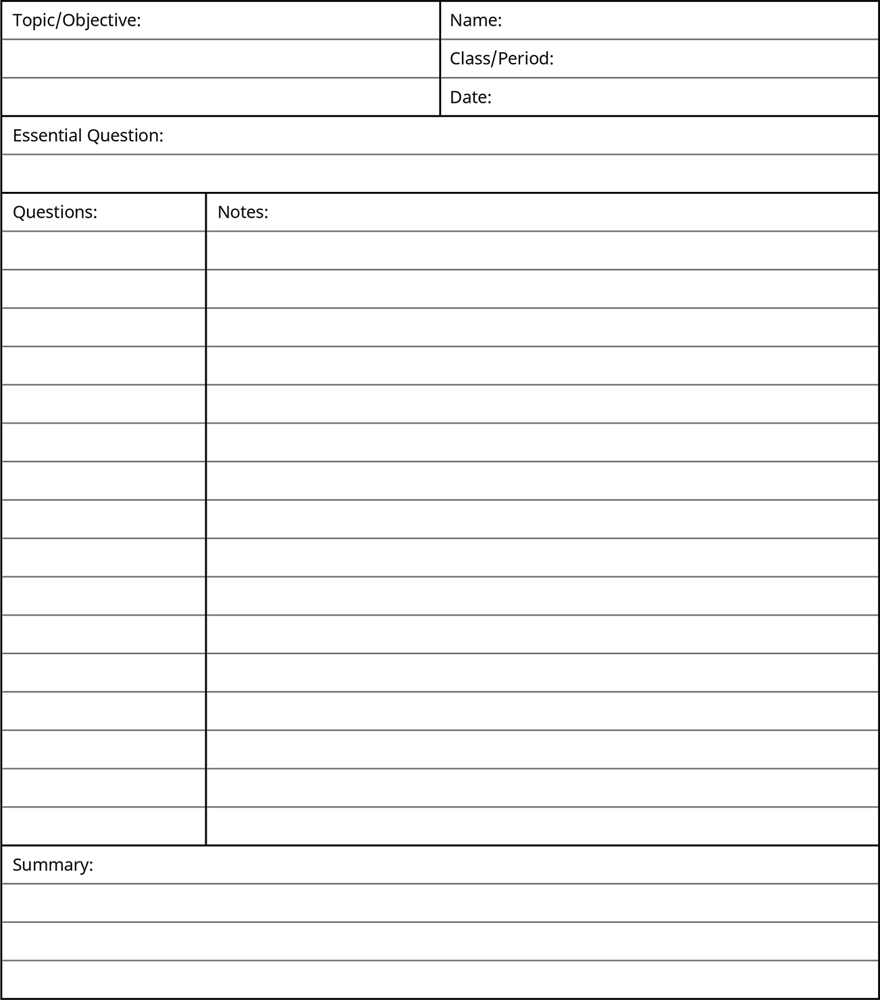
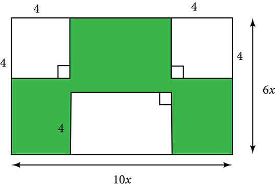
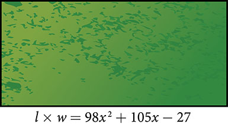
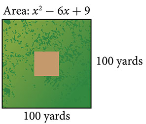

**Factoring Polynomials**

  m51247
  

**Factoring Polynomials**

  In this section, you will:

Factor the greatest common factor of a polynomial.
Factor a trinomial.
Factor by grouping.
Factor a perfect square trinomial.
Factor a difference of squares.
Factor the sum and difference of cubes.
Factor expressions using fractional or negative exponents.

  49cf2d69-1d37-49aa-9e61-16da4c52ce37

## Learning Objectives:

Master a proven technique for note taking: The Cornell Method.
Use the Cornell Process to study from your notes.

## Objective 1: Master a proven technique for note taking: The Cornell Method.
The **Cornell Method** for taking notes was created by an education professor at Cornell University, Dr. Walter Pauk. The Cornell Method consists of two strategies, a format for notetaking and then the process of using your notes to study. The format for note taking involves separating out the pages of your notebook into three or four separate regions. This method can help summarize information from a lecture, a video, or a reading from your text. You don’t need to purchase Cornell paper, just divide your sheets into regions like the illustration below. Write on just one side of the paper so that you can later fold back the left column and quiz yourself using practice test questions.

The top portion is called the **heading**. This is where you write your name, the class, the date, the section of the text and a main topic objective for the day.

The **right section** is where you will take **notes during class**. Try to summarize main ideas here without copying word for word everything your teacher is saying. Use bullet points or numbers to prioritize important ideas. Include here the definitions your teacher presents, and the examples worked in class. It is useful if you can group the content here by learning objectives.
The **left column** about 2 inches wide is used to write questions about the main concepts that were covered in class. For example, write sample **test questions** over the concepts discussed in class in this column. This is also where you should write **cues** about the importance of the information including vocabulary terms, diagrams, formulas or the methods being used to solve. If you like to sketch this is a place to add **illustrations** for key ideas or **icons** so you can quickly identify certain components.

The **summary** will be written in the lower section about 2 inches from the bottom. You will complete this after class **summarizing the important concepts** you were taught in a short compact way. Think of this summary as what you might describe to a friend who happened to miss class that day. **Reflect** on the important ideas here. Add illustrations or a **mind map** to your summary if this helps. You will use this section to find information later when studying.

### Practice Makes Perfect
1. The following book section includes a variety of methods for factoring polynomials. Read the section carefully and complete Cornell notes for the *process of factoring*. This work will help you throughout the semester because the ability to factor polynomials is one of those linchpin topics that will continue to emerge throughout the term. Remember to write practice factoring examples in the left question or cues column.      Need some inspiration? Search for videos on Cornell note taking on the web. There are some interesting videos of students showing off their beautiful notes that have been enhanced with highlighters and sketches. Many of the students talk about the difference this technique has made in their learning and attribute their success to this Cornell format. Another topic to search is sketchnoting, which helps to visually enhance your Cornell notes and truly tell a story.

## Objective 2: Use the Cornell Process to study from your notes.
*The Cornell Way*. Using your Cornell notes to study is referred to as the Cornell Way. 
The process includes Cornell note taking (presented in Objective 1), note making, note interacting, and note reflecting. 
After taking notes in class, follow up with these study methods.

*Note making*: This is where you will fill in any gaps left in your Cornell notes meaning add in any missed details. Fill in your question column with sample test questions, any formulas used, and highlight, circle or star important any important ideas. Complete your summary row with a few sentences summarizing the important ideas. This should be completed right after class or within the next day. Be creative and add some color, make these notes into something you enjoy working with.

*Note interacting*: This is the ongoing process of studying from your notes. Fold your left question column back and ask yourself the practice test questions. Include note interactions in the review for your exams. These note interactions can be as short as 5 minutes in length but need to happen regularly and at least daily for the week before exams.

*Note reflecting*: This is where you assess how helpful your notes were. Do this right after you get back your graded exam. Did the regular note interactions help you to perform better on the exam? Were there problems similar to those you predicted on the exam? Enhance your notes with any important ideas you had initially left out. Then use what you learn from this assessment to improve your note taking in the future.

### Practice Makes Perfect
2. Complete the Cornell Process by revisiting your factoring of polynomials summary notes. For now, follow the Note Making, and Note Interacting steps outlined above. Keep these Cornell notes in your divided binder for the course so you can easily refer back when you encounter an exercise requiring factoring throughout the term.

3. Share these completed Cornell notes with your classmates. Fill in any gaps in your work. Work on each other’s practice problems.

Imagine that we are trying to find the area of a lawn so that we can determine how much grass seed to purchase. The lawn is the green portion in .

The area of the entire region can be found using the formula for the area of a rectangle.

 $$
\begin{array}{ccc}  A& =& lw  \\ & =& 10x\cdot 6x  \\ & =& 60{x}^{2}{\phantom{\rule{0.5em}{0ex}}\text{units}}^{2}  \end{array}
$$

The areas of the portions that do not require grass seed need to be subtracted from the area of the entire region. The two square regions each have an area of $A={s}^{2}={4}^{2}=16$ units2. The other rectangular region has one side of length $10x-8$ and one side of length $4,$ giving an area of $A=lw=4(10x-8)=40x-32$ units2. So the region that must be subtracted has an area of $2(16)+40x-32=40x$ units2.
The area of the region that requires grass seed is found by subtracting $60{x}^{2}-40x$ units2. This area can also be expressed in factored form as $20x(3x-2)$ units2. We can confirm that this is an equivalent expression by multiplying.
Many polynomial expressions can be written in simpler forms by factoring. In this section, we will look at a variety of methods that can be used to factor polynomial expressions.

# Factoring the Greatest Common Factor of a Polynomial
When we study fractions, we learn that the **greatest common factor** (GCF) of two numbers is the largest number that divides evenly into both numbers. For instance, $4$ is the GCF of $16$ and $20$ because it is the largest number that divides evenly into both $16$ and $20$ The GCF of polynomials works the same way: $4x$ is the GCF of $16x$ and $20{x}^{2}$ because it is the largest polynomial that divides evenly into both $16x$ and $20{x}^{2}.$

When factoring a polynomial expression, our first step should be to check for a GCF. Look for the GCF of the coefficients, and then look for the GCF of the variables.

>
>
>
>
> **Greatest Common Factor**
>
>
> The **greatest common factor** (GCF) of polynomials is the largest polynomial that divides evenly into the polynomials.
>

>
> How To
> *Given a polynomial expression, factor out the greatest common factor.*
>
>
> Identify the GCF of the coefficients.
> Identify the GCF of the variables.
> Combine to find the GCF of the expression.
> Determine what the GCF needs to be multiplied by to obtain each term in the expression.
> Write the factored expression as the product of the GCF and the sum of the terms we need to multiply by.
>

4. **Factoring the Greatest Common Factor**   Factor $6{x}^{3}{y}^{3}+45{x}^{2}{y}^{2}+21xy.$

Solution

First, find the GCF of the expression. The GCF of 6, 45, and 21 is 3. The GCF of ${x}^{3},{x}^{2}$ , and $x$ is $x$ . (Note that the GCF of a set of expressions in the form ${x}^{n}$ will always be the exponent of lowest degree.) And the GCF of ${y}^{3},{y}^{2}$ , and $y$ is $y$ . Combine these to find the GCF of the polynomial, $3xy$ .

Next, determine what the GCF needs to be multiplied by to obtain each term of the polynomial. We find that $3xy\left(2{x}^{2}{y}^{2}\right)=6{x}^{3}{y}^{3},3xy(15xy)=45{x}^{2}{y}^{2}$ , and $3xy(7)=21xy.$

Finally, write the factored expression as the product of the GCF and the sum of the terms we needed to multiply by.

 $(3xy)(2{x}^{2}{y}^{2}+15xy+7)$

>
> Try It
>  5. Factor $x({b}^{2}-a)+6({b}^{2}-a)$ by pulling out the GCF.
>
> 

> 
Solution

>
> $({b}^{2}-a)(x+6)$
> 

>
>
>

# Factoring a Trinomial with Leading Coefficient 1
Although we should always begin by looking for a GCF, pulling out the GCF is not the only way that polynomial expressions can be factored. The polynomial ${x}^{2}+5x+6$ has a GCF of 1, but it can be written as the product of the factors $(x+2)$ and $(x+3).$

Trinomials of the form ${x}^{2}+bx+c$ can be factored by finding two numbers with a product of $c$ and a sum of $b.$ The trinomial ${x}^{2}+10x+16,$ for example, can be factored using the numbers $2$ and $8$ because the product of those numbers is $16$ and their sum is $10.$ The trinomial can be rewritten as the product of $(x+2)$ and $(x+8).$

>
>
>
>
> **Factoring a Trinomial with Leading Coefficient 1**
>
>
> A trinomial of the form ${x}^{2}+bx+c$ can be written in factored form as $(x+p)(x+q)$ where $pq=c$ and $p+q=b.$
>
>

>
> Q&A
> *Can every trinomial be factored as a product of binomials?*
>
> *No. Some polynomials cannot be factored. These polynomials are said to be prime.*
>

>
> How To
> *Given a trinomial in the form ${x}^{2}+bx+c,$ factor it.*
>
>
> List factors of $c.$
>
> Find $p$ and $q,$ a pair of factors of $c$ with a sum of $b.$
>
> Write the factored expression $(x+p)(x+q).$
>
>

6. **Factoring a Trinomial with Leading Coefficient 1**   Factor ${x}^{2}+2x-15.$

Solution

We have a trinomial with leading coefficient $1,b=2,$ and $c=\mathrm{-15.}$ We need to find two numbers with a product of $\mathrm{-15}$ and a sum of $2.$ In the table below, we list factors until we find a pair with the desired sum.

| Factors of $\mathrm{-15}$ | Sum of Factors |
| :--- | :--- |
| $1,\mathrm{-15}$ | $\mathrm{-14}$ |
| $\mathrm{-1},15$ | 14 |
| $3,\mathrm{-5}$ | $\mathrm{-2}$ |
| $\mathrm{-3},5$ | 2 |

Now that we have identified $p$ and $q$ as $\mathrm{-3}$ and $5,$ write the factored form as $(x-3)(x+5).$

>
> Q&A
> *Does the order of the factors matter?*
>
> *No. Multiplication is commutative, so the order of the factors does not matter.*
>

>
> Try It
> 7. Factor ${x}^{2}-7x+6.$
>
> 

> 
Solution

>
> $(x\mathrm{-6})(x\mathrm{-1})$
> 

>
>

# Factoring by Grouping
Trinomials with leading coefficients other than 1 are slightly more complicated to factor. For these trinomials, we can **factor by grouping** by dividing the *x* term into the sum of two terms, factoring each portion of the expression separately, and then factoring out the GCF of the entire expression. The trinomial $2{x}^{2}+5x+3$ can be rewritten as $(2x+3)(x+1)$ using this process. We begin by rewriting the original expression as $2{x}^{2}+2x+3x+3$ and then factor each portion of the expression to obtain $2x(x+1)+3(x+1).$ We then pull out the GCF of $(x+1)$ to find the factored expression.

>
>
>
>
> **Factor by Grouping**
>
>
> To factor a trinomial in the form $a{x}^{2}+bx+c$ by grouping, we find two numbers with a product of $ac$ and a sum of $b.$ We use these numbers to divide the $x$ term into the sum of two terms and factor each portion of the expression separately, then factor out the GCF of the entire expression.
>

> How To
> *Given a trinomial in the form $a{x}^{2}+bx+c,$ factor by grouping.*
>
> List factors of $ac.$
>
> Find $p$ and $q,$ a pair of factors of $ac$ with a sum of $b.$
>
> Rewrite the original expression as $a{x}^{2}+px+qx+c.$
>
> Pull out the GCF of $a{x}^{2}+px.$
>
> Pull out the GCF of $qx+c.$
>
> Factor out the GCF of the expression.
>

8. **Factoring a Trinomial by Grouping**   Factor $5{x}^{2}+7x-6$ by grouping.

Solution

We have a trinomial with $a=5,b=7,$ and $c=\mathrm{-6.}$ First, determine $ac=\mathrm{-30.}$ We need to find two numbers with a product of $\mathrm{-30}$ and a sum of $7.$ In the table below, we list factors until we find a pair with the desired sum.

| Factors of $\mathrm{-30}$ | Sum of Factors |
| :--- | :--- |
| $1,\mathrm{-30}$ | $\mathrm{-29}$ |
| $\mathrm{-1},30$ | 29 |
| $2,\mathrm{-15}$ | $\mathrm{-13}$ |
| $\mathrm{-2},15$ | 13 |
| $3,\mathrm{-10}$ | $\mathrm{-7}$ |
| $\mathrm{-3},10$ | 7 |

So $p=\mathrm{-3}$ and $q=10.$

 $$
\begin{array}{cc}5{x}^{2}-3x+10x-6\   & \phantom{\rule{2em}{0ex}}\text{Rewrite\ the\ original\ expression\ as\}a{x}^{2}+px+qx+c.  \\ x(5x-3)+2(5x-3)  & \phantom{\rule{2em}{0ex}}\text{Factor\ out\ the\ GCF\ of\ each\ part}.  \\ (5x-3)(x+2)  & \phantom{\rule{2em}{0ex}}\text{Factor\ out\ the\ GCF}\text{}\phantom{\rule{0.5em}{0ex}}\text{of\ the\ expression}.  \end{array}
$$

>
> 9. Factor                        ⓐ  $2{x}^{2}+9x+9$                           ⓑ $6{x}^{2}+x-1$
>
> 

> 
Solution

>
> ⓐ $(2x+3)(x+3)$
>
>
>           ⓑ $\left(3x\mathrm{-1}\right)\left(2x+1\right)$
> 

>
>

# Factoring a Perfect Square Trinomial
A perfect square trinomial is a trinomial that can be written as the square of a binomial. Recall that when a binomial is squared, the result is the square of the first term added to twice the product of the two terms and the square of the last term.
 $$
\begin{array}{ccc}  {a}^{2}+2ab+{b}^{2}& =& {(a+b)}^{2}  \\ & \text{and}& \\   {a}^{2}-2ab+{b}^{2}& =& {(a-b)}^{2}  \end{array}
$$

We can use this equation to factor any perfect square trinomial.

>
>
>
>
> **Perfect Square Trinomials**
>
>
> A perfect square trinomial can be written as the square of a binomial:
>
>
>  ${a}^{2}+2ab+{b}^{2}={(a+b)}^{2}$
>

>
> How To
> *Given a perfect square trinomial, factor it into the square of a binomial.*
>
>
> Confirm that the first and last term are perfect squares.
> Confirm that the middle term is twice the product of $ab.$
>
> Write the factored form as ${(a+b)}^{2}.$
>
>

10. **Factoring a Perfect Square Trinomial**   Factor $25{x}^{2}+20x+4.$

Solution

Notice that $25{x}^{2}$ and $4$ are perfect squares because $25{x}^{2}={(5x)}^{2}$ and $4={2}^{2}.$ Then check to see if the middle term is twice the product of $5x$ and $2.$ The middle term is, indeed, twice the product: $2(5x)(2)=20x.$ Therefore, the trinomial is a perfect square trinomial and can be written as ${(5x+2)}^{2}.$

>
> Try It
> 11. Factor $49{x}^{2}-14x+1.$
>
> 

> 
Solution

>
> ${(7x\mathrm{-1})}^{2}$
> 

>
>

# Factoring a Difference of Squares
A difference of squares is a perfect square subtracted from a perfect square. Recall that a difference of squares can be rewritten as factors containing the same terms but opposite signs because the middle terms cancel each other out when the two factors are multiplied.
 $$
{a}^{2}-{b}^{2}=(a+b)(a-b)
$$
We can use this equation to factor any differences of squares.

>
>
>
>
> **Differences of Squares**
>
>
> A difference of squares can be rewritten as two factors containing the same terms but opposite signs.
>
>  $$
> {a}^{2}-{b}^{2}=(a+b)(a-b)
> $$
>

>
> How To
> *Given a difference of squares, factor it into binomials.*
>
> Confirm that the first and last term are perfect squares.
> Write the factored form as $(a+b)(a-b).$
>

12. **Factoring a Difference of Squares**   Factor $9{x}^{2}-25.$

Solution

Notice that $9{x}^{2}$ and $25$ are perfect squares because $9{x}^{2}={(3x)}^{2}$ and $25={5}^{2}.$ The polynomial represents a difference of squares and can be rewritten as $(3x+5)(3x-5).$

>
> Try It
> 13. Factor $81{y}^{2}-100.$
>
> 

> 
Solution

>
> $(9y+10)(9y-10)$
> 

>
>

>
> Q&A
> *Is there a formula to factor the sum of squares?*
>
> *No. A sum of squares cannot be factored.*
>

# Factoring the Sum and Difference of Cubes
Now, we will look at two new special products: the sum and difference of cubes. Although the sum of squares cannot be factored, the sum of cubes can be factored into a binomial and a trinomial.
 $$
{a}^{3}+{b}^{3}=(a+b)\left({a}^{2}-ab+{b}^{2}\right)
$$
Similarly, the difference of cubes can be factored into a binomial and a trinomial, but with different signs.
 $$
{a}^{3}-{b}^{3}=(a-b)\left({a}^{2}+ab+{b}^{2}\right)
$$

We can use the acronym SOAP to remember the signs when factoring the sum or difference of cubes. The first letter of each word relates to the signs: *S*ame *O*pposite *A*lways *P*ositive. For example, consider the following example.
 $$
{x}^{3}-{2}^{3}=(x-2)\left({x}^{2}+2x+4\right)
$$

The sign of the first 2 is the *same* as the sign between ${x}^{3}-{2}^{3}.$ The sign of the $2x$ term is *opposite* the sign between ${x}^{3}-{2}^{3}.$ And the sign of the last term, 4, is *always positive*.

>
>
>
>
> **Sum and Difference of Cubes**
>
>
> We can factor the sum of two cubes as
>
>  $$
> {a}^{3}+{b}^{3}=(a+b)\left({a}^{2}-ab+{b}^{2}\right)
> $$
> We can factor the difference of two cubes as
>
>  $$
> {a}^{3}-{b}^{3}=(a-b)\left({a}^{2}+ab+{b}^{2}\right)
> $$

>
> How To
> *Given a sum of cubes or difference of cubes, factor it.*
>
> Confirm that the first and last term are cubes, ${a}^{3}+{b}^{3}$ or ${a}^{3}-{b}^{3}.$
>
> For a sum of cubes, write the factored form as $(a+b)({a}^{2}-ab+{b}^{2}).$ For a difference of cubes, write the factored form as $(a-b)({a}^{2}+ab+{b}^{2}).$
>

14. **Factoring a Sum of Cubes**   Factor ${x}^{3}+512.$

Solution

Notice that ${x}^{3}$ and $512$ are cubes because ${8}^{3}=512.$ Rewrite the sum of cubes as $(x+8)({x}^{2}-8x+64).$

>
> Try It
> 15. Factor the sum of cubes: $216{a}^{3}+{b}^{3}.$
>
> 

> 
Solution

>
> $(6a+b)(36{a}^{2}\mathrm{-6}ab+{b}^{2})$
> 

>
>

16. **Factoring a Difference of Cubes**   Factor $8{x}^{3}-125.$

Solution

Notice that $8{x}^{3}$ and $125$ are cubes because $8{x}^{3}={(2x)}^{3}$ and $125={5}^{3}.$ Write the difference of cubes as $(2x-5)(4{x}^{2}+10x+25).$

>
> Try It
> 17. Factor the difference of cubes: $\mathrm{1,000}{x}^{3}-1.$
>
> 

> 
Solution

>
> $(10x-1)\left(100{x}^{2}+10x+1\right)$
> 

>
>

# Factoring Expressions with Fractional or Negative Exponents
Expressions with fractional or negative exponents can be factored by pulling out a GCF. Look for the variable or exponent that is common to each term of the expression and pull out that variable or exponent raised to the lowest power. These expressions follow the same factoring rules as those with integer exponents. For instance, $2{x}^{\frac{1}{4}}+5{x}^{\frac{3}{4}}$ can be factored by pulling out ${x}^{\frac{1}{4}}$ and being rewritten as ${x}^{\frac{1}{4}}(2+5{x}^{\frac{1}{2}}).$

18. **Factoring an Expression with Fractional or Negative Exponents**   Factor $3x{(x+2)}^{\frac{\mathrm{-1}}{3}}+4{(x+2)}^{\frac{2}{3}}.$

Solution

Factor out the term with the lowest value of the exponent. In this case, that would be ${\left(x+2\right)}^{-\frac{1}{3}}.$

 $$
\begin{array}{cc}{(x+2)}^{-\frac{1}{3}}(3x+4(x+2))  & \phantom{\rule{2em}{0ex}}\text{Factor\ out\ the\ GCF}.  \\ {(x+2)}^{-\frac{1}{3}}(3x+4x+8)  & \phantom{\rule{2em}{0ex}}\text{Simplify}.  \\ {(x+2)}^{-\frac{1}{3}}(7x+8)  & \end{array}
$$

>
> Try It
> 19. Factor $2{(5a-1)}^{\frac{3}{4}}+7a{(5a-1)}^{-\frac{1}{4}}.$
>
> 

> 
Solution

>
> ${(5a\mathrm{-1})}^{-\frac{1}{4}}(17a\mathrm{-2})$
> 

>
>

>
> Media
> Access these online resources for additional instruction and practice with factoring polynomials.
>
> Identify GCF
> Factor Trinomials when a Equals 1
> Factor Trinomials when a is not equal to 1
> Factor Sum or Difference of Cubes

# Key Equations

| difference of squares | ${a}^{2}-{b}^{2}=(a+b)(a-b)$ |
| :--- | :--- |
| perfect square trinomial | ${a}^{2}+2ab+{b}^{2}={(a+b)}^{2}$ |
| sum of cubes | ${a}^{3}+{b}^{3}=(a+b)({a}^{2}-ab+{b}^{2})$ |
| difference of cubes | ${a}^{3}-{b}^{3}=(a-b)({a}^{2}+ab+{b}^{2})$ |

The greatest common factor, or GCF, can be factored out of a polynomial. Checking for a GCF should be the first step in any factoring problem. See .
Trinomials with leading coefficient 1 can be factored by finding numbers that have a product of the third term and a sum of the second term. See .
Trinomials can be factored using a process called factoring by grouping. See .
Perfect square trinomials and the difference of squares are special products and can be factored using equations. See  and .
The sum of cubes and the difference of cubes can be factored using equations. See  and .
Polynomials containing fractional and negative exponents can be factored by pulling out a GCF. See .

# Section Exercises

## Verbal
1. If the terms of a polynomial do not have a GCF, does that mean it is not factorable? Explain.

Solution

The terms of a polynomial do not have to have a common factor for the entire polynomial to be factorable. For example, $4{x}^{2}$ and $\mathrm{-9}{y}^{2}$ don’t have a common factor, but the whole polynomial is still factorable: $4{x}^{2}\mathrm{-9}{y}^{2}=\left(2x+3y\right)\left(2x\mathrm{-3}y\right).$

2. A polynomial is factorable, but it is not a perfect square trinomial or a difference of two squares. Can you factor the polynomial without finding the GCF?

3. How do you factor by grouping?

Solution

Divide the $x$ term into the sum of two terms, factor each portion of the expression separately, and then factor out the GCF of the entire expression.

## Algebraic
For the following exercises, find the greatest common factor.
4. $14x+4xy-18x{y}^{2}$

5. $49m{b}^{2}-35{m}^{2}ba+77m{a}^{2}$

Solution

$7m$

6. $30{x}^{3}y-45{x}^{2}{y}^{2}+135x{y}^{3}$

7. $200{p}^{3}{m}^{3}-30{p}^{2}{m}^{3}+40{m}^{3}$

Solution

$10{m}^{3}$

8. $36{j}^{4}{k}^{2}-18{j}^{3}{k}^{3}+54{j}^{2}{k}^{4}$

9. $6{y}^{4}-2{y}^{3}+3{y}^{2}-y$

Solution

$y$

For the following exercises, factor by grouping.
10. $6{x}^{2}+5x-4$

11. $2{a}^{2}+9a-18$

Solution

$\left(2a\mathrm{-3}\right)\left(a+6\right)$

12. $6{c}^{2}+41c+63$

13. $6{n}^{2}-19n-11$

Solution

$\left(3n\mathrm{-11}\right)\left(2n+1\right)$

14. $20{w}^{2}-47w+24$

15. $2{p}^{2}-5p-7$

Solution

$\left(p+1\right)\left(2p\mathrm{-7}\right)$

For the following exercises, factor the polynomial.
16. $7{x}^{2}+48x-7$

17. $10{h}^{2}-9h-9$

Solution

$\left(5h+3\right)\left(2h\mathrm{-3}\right)$

18. $2{b}^{2}-25b-247$

19. $9{d}^{2}\mathrm{-73}d+8$

Solution

$\left(9d\mathrm{-1}\right)\left(d\mathrm{-8}\right)$

20. $90{v}^{2}\mathrm{-181}v+90$

21. $12{t}^{2}+t-13$

Solution

$\left(12t+13\right)\left(t\mathrm{-1}\right)$

22. $2{n}^{2}-n-15$

23. $16{x}^{2}-100$

Solution

$(4x+10)(4x-10)$

24. $25{y}^{2}-196$

25. $121{p}^{2}-169$

Solution

$(11p+13)(11p-13)$

26. $4{m}^{2}-9$

27. $361{d}^{2}-81$

Solution

$(19d+9)(19d-9)$

28. $324{x}^{2}-121$

29. $144{b}^{2}-25{c}^{2}$

Solution

$(12b+5c)(12b-5c)$

30. $16{a}^{2}-8a+1$

31. $49{n}^{2}+168n+144$

Solution

${\left(7n+12\right)}^{2}$

32. $121{x}^{2}-88x+16$

33. $225{y}^{2}+120y+16$

Solution

${\left(15y+4\right)}^{2}$

34. ${m}^{2}-20m+100$

35. $25{p}^{2}-120p+144$

Solution

${(5p-12)}^{2}$

36. $36{q}^{2}+60q+25$

For the following exercises, factor the polynomials.
37. ${x}^{3}+216$

Solution

$(x+6)({x}^{2}-6x+36)$

38. $27{y}^{3}-8$

39. $125{a}^{3}+343$

Solution

$(5a+7)(25{a}^{2}-35a+49)$

40. ${b}^{3}-8{d}^{3}$

41. $64{x}^{3}\mathrm{-125}$

Solution

$(4x-5)(16{x}^{2}+20x+25)$

42. $729{q}^{3}+1331$

43. $125{r}^{3}+\mathrm{1,728}{s}^{3}$

Solution

$(5r+12s)(25{r}^{2}-60rs+144{s}^{2})$

44. $4x{\left(x-1\right)}^{-\frac{2}{3}}+3{\left(x-1\right)}^{\frac{1}{3}}$

45. $3c{\left(2c+3\right)}^{-\frac{1}{4}}-5{\left(2c+3\right)}^{\frac{3}{4}}$

Solution

${\left(2c+3\right)}^{-\frac{1}{4}}\left(\mathrm{-7}c-15\right)$

46. $3t{\left(10t+3\right)}^{\frac{1}{3}}+7{\left(10t+3\right)}^{\frac{4}{3}}$

47. $14x{\left(x+2\right)}^{-\frac{2}{5}}+5{\left(x+2\right)}^{\frac{3}{5}}$

Solution

${\left(x+2\right)}^{-\frac{2}{5}}\left(19x+10\right)$

48. $9y{(3y-13)}^{\frac{1}{5}}-2{(3y-13)}^{\frac{6}{5}}$

49. $5z{(2z-9)}^{-\frac{3}{2}}+11{(2z-9)}^{-\frac{1}{2}}$

Solution

${\left(2z-9\right)}^{-\frac{3}{2}}\left(27z-99\right)$

50. $6d{\left(2d+3\right)}^{-\frac{1}{6}}+5{\left(2d+3\right)}^{\frac{5}{6}}$

## Real-World Applications
For the following exercises, consider this scenario:
Charlotte has appointed a chairperson to lead a city beautification project. The first act is to install statues and fountains in one of the city’s parks. The park is a rectangle with an area of $98{x}^{2}+105x-27$ m2, as shown in the figure below. The length and width of the park are perfect factors of the area.

51. Factor by grouping to find the length and width of the park.

Solution

$\left(14x\mathrm{-3}\right)\left(7x+9\right)$

52. A statue is to be placed in the center of the park. The area of the base of the statue is $4{x}^{2}+12x+9\text\ {\text{m}}^{2}.$ Factor the area to find the lengths of the sides of the statue.

53. At the northwest corner of the park, the city is going to install a fountain. The area of the base of the fountain is $9{x}^{2}-25\text\ {\text{m}}^{2}.$ Factor the area to find the lengths of the sides of the fountain.

Solution

$\left(3x+5\right)\left(3x\mathrm{-5}\right)$

For the following exercise, consider the following scenario:
A school is installing a flagpole in the central plaza. The plaza is a square with side length 100 yd. as shown in the figure below.  The flagpole will take up a square plot with area ${x}^{2}-6x+9$ yd2.

54. Find the length of the base of the flagpole by factoring.

## Extensions
For the following exercises, factor the polynomials completely.
55. $16{x}^{4}-200{x}^{2}+625$

Solution

${(2x+5)}^{2}{(2x-5)}^{2}$

56. $81{y}^{4}-256$

57. $16{z}^{4}-\mathrm{2,401}{a}^{4}$

Solution

$(4{z}^{2}+49{a}^{2})(2z+7a)(2z-7a)$

58. $5x{\left(3x+2\right)}^{-\frac{2}{4}}+{\left(12x+8\right)}^{\frac{3}{2}}$

59. ${(32{x}^{3}+48{x}^{2}-162x-243)}^{\mathrm{-1}}$

Solution

$\frac{1}{\left(4x+9\right)\left(4x\mathrm{-9}\right)\left(2x+3\right)}$

**factor by grouping**a method for factoring a trinomial in the form $a{x}^{2}+bx+c$ by dividing the *x* term into the sum of two terms, factoring each portion of the expression separately, and then factoring out the GCF of the entire expression 
**greatest common factor**the largest polynomial that divides evenly into each polynomial
