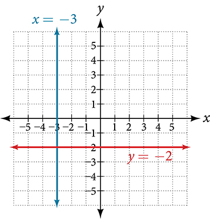

**Linear Equations in One Variable**

  m51253
  

**Linear Equations in One Variable**

  In this section, you will:

Solve equations in one variable algebraically.
Solve a rational equation.
Find a linear equation.
Given the equations of two lines, determine whether their graphs are parallel or perpendicular.
Write the equation of a line parallel or perpendicular to a given line.

  eb6fde5e-763a-412f-8aa4-866649f706d5

## Learning Objectives
Simplify expressions using order of operations (IA 1.1.3)
Solve linear equations using a general strategy (IA 2.1.1)

## Objective 1: Simplify expressions using order of operations (IA 1.1.3)

>
>
> **Use the order of operations**
>
>
> Parentheses and Other Grouping Symbols
>
> Simplify all expressions inside the parentheses or other grouping symbols, working on the innermost parentheses first.
>
> Exponents
>
> Simplify all expressions with exponents.
>
> Multiplication and Division
>
> Perform all multiplication and division in order from left to right. These operations have equal priority.
>
> Addition and Subtraction
>
> Perform all addition and subtraction in order from left to right. These operations have equal priority.
>
>

1. Simplify: $5+{2}^{3}+3\left[6-3\left(4-2\right)\right].$

Solution

|  |  |
| :--- | :--- |
| Are there any parentheses (or othergrouping symbols)? Yes. |  |
| Focus on the parentheses that are inside thebrackets. Subtract. |  |
| Continue inside the brackets and multiply. |  |
| Continue inside the brackets and subtract. |  |
| The expression inside the brackets requiresno further simplification. |  |
| Are there any exponents? Yes. Simplify exponents. |  |
| Is there any multiplication or division? Yes. |  |
| Multiply. |  |
| Is there any addition of subtraction? Yes. |  |
| Add. |  |
| Add. |  |

### Practice Makes Perfect
2. $3(1+9\bullet 6)-{4}^{2}$

3. ${2}^{3}-12\xf7(9-5)$

4. $33\xf73+4(7-2)$

5. $10+3[6-2(4-2\left)\right]-{2}^{4}$

Evaluate the following expressions being sure to follow the order of operations:
6. When $x=3$ ,            ⓐ ${x}^{5}$                       ⓑ ${5}^{x}$                       ⓒ $3{x}^{2}-4x-8$

7. When $x=3,y=-2$   $6{x}^{2}+3xy-9{y}^{2}$

8. When $x=-8,y=3$   $(x+y{)}^{2}$

Simplify by combining like terms:
9. $10a+7+5a-2+7a-4$

10. $5b+9b+10(2b+3b)+5$

## Objective 2: Solve linear equations using a general strategy (IA 2.1.1)

>
>
> **Solve linear equations using a general strategy**
>
> Simplify each side of the equation as much as possible.
> Use the Distributive Property to remove any parentheses.
> Combine like terms.
> Collect all the variable terms on one side of the equation.
> Use the Addition or Subtraction Property of Equality.
> Collect all the constant terms on the other side of the equation.
> Use the Addition or Subtraction Property of Equality.
> Make the coefficient of the variable term equal to 1.
> Use the Multiplication or Division Property of Equality.
> State the solution to the equation.
> Check the solution.
> Substitute the solution into the original equation to make sure the result is a true statement.

Solve linear equations using a general strategy.
11. $2(w+5)+1=10+4w+2$

Solution

| Use distributive property to remove parentheses: | $2w+10+1=10+4w+2$ |
| :--- | :--- |
| Combine like terms on each side: | $2w+11=12+4w$ |
| Subtract $2w$ from each side to bring variables to one side: | $2w-2w+11=12+4w-2w$ |
| Combine like terms: | $11=12+2w$ |
| Subtract 12 from each side to bring constants to one side: | $11-12=12-12+2w$ |
| Combine like terms: | $-1=2w$ |
| Divide each side by 2 to isolate the variable terms: | $\frac{-1}{2}=\frac{2w}{2}$ |
| Simplify: | $\frac{-1}{2}=w$ or $w=-\frac{1}{2}$ |
| To check your solution, replace $w$ with $-\frac{1}{2}$ in the original equation and simplify: | $2(w+5)+1=10+4w+2$ |
|  | $2(-\frac{1}{2}+5)+1=10+4(-\frac{1}{2})+2$ |
|  | $2\left(\frac{9}{2}\right)+1=10+(-2)+2$   $9+1=8+2$ |
| The solution checks, we reached a true statement. | $10=10$ |

### Practice Makes Perfect
Solve each linear equation using the general strategy. 
12. $15(y-9)=-60$

13. $-2(11-7x)+54=4$

14. $3(4n-1)-2=8n+3$

15. $12+2(5-3y)=-9(y-1)-2$

16. $\frac{1}{4}(20x+12)=x+7$

17. $22(3m-4)=8(2m+9)$

18. $\frac{3x+4}{2}+1=\frac{5x+10}{8}$

19. $0.05n+0.10(n+8)=2.15$

Caroline is a full-time college student planning a spring break vacation. To earn enough money for the trip, she has taken a part-time job at the local bank that pays $15.00/hr, and she opened a savings account with an initial deposit of $400 on January 15. She arranged for direct deposit of her payroll checks. If spring break begins March 20 and the trip will cost approximately $2,500, how many hours will she have to work to earn enough to pay for her vacation? If she can only work 4 hours per day, how many days per week will she have to work? How many weeks will it take? In this section, we will investigate problems like this and others, which generate graphs like the line in .

# Solving Linear Equations in One Variable
A **linear equation** is an equation of a straight line, written in one variable. The only power of the variable is 1. Linear equations in one variable may take the form $ax+b=0$ and are solved using basic algebraic operations.
We begin by classifying linear equations in one variable as one of three types: identity, conditional, or inconsistent. An **identity equation** is true for all values of the variable. Here is an example of an identity equation.
 $3x=2x+x$ The **solution set** consists of all values that make the equation true. For this equation, the solution set is all real numbers because any real number substituted for $x$ will make the equation true.
A **conditional equation** is true for only some values of the variable. For example, if we are to solve the equation $5x+2=3x-6,$ we have the following:

 $$
\begin{array}{ccc}  5x+2& =& 3x-6  \\   2x& =& \mathrm{-8}  \\   x& =& \mathrm{-4}  \end{array}
$$
The solution set consists of one number: $\left\{-4\right\}.$ It is the only solution and, therefore, we have solved a conditional equation.
An **inconsistent equation** results in a false statement. For example, if we are to solve $5x-15=5\left(x-4\right),$ we have the following:

 $$
\begin{array}{cccc}  5x-15& =& 5x-20  & \\   5x-15-5x& =& 5x-20-5x  & \phantom{\rule{2em}{0ex}}\text{Subtract\}5x\phantom{\rule{0.5em}{0ex}}\text{from\ both\ sides}.  \\   \mathrm{-15}& \ne & \mathrm{-20}  & \phantom{\rule{2em}{0ex}}\text{False\ statement}  \end{array}
$$
Indeed, $\mathrm{-15}\ne \phantom{\rule{0.5em}{0ex}}\mathrm{-20.}$ There is no solution because this is an inconsistent equation.
Solving linear equations in one variable involves the fundamental properties of equality and basic algebraic operations. A brief review of those operations follows.

>
>
>
>
> **Linear Equation in One Variable**
>
>
> A linear equation in one variable can be written in the form
>
>  $ax+b=0$ 
> where *a* and *b*are real numbers, $a\ne 0.$ 
>

>
> How To
> *Given a linear equation in one variable, use algebra to solve it.*
>
> The following steps are used to manipulate an equation and isolate the unknown variable, so that the last line reads $x=\_\_\_\_\_\_\_\_\_,$ if *x*is the unknown. There is no set order, as the steps used depend on what is given:
>
> We may add, subtract, multiply, or divide an equation by a number or an expression as long as we do the same thing to both sides of the equal sign. Note that we cannot divide by zero.
> Apply the distributive property as needed: $a\left(b+c\right)=ab+ac.$ 
> Isolate the variable on one side of the equation.
> When the variable is multiplied by a coefficient in the final stage, multiply both sides of the equation by the reciprocal of the coefficient.
>

20. **Solving an Equation in One Variable**   Solve the following equation: $2x+7=19.$

Solution

This equation can be written in the form $ax+b=0$ by subtracting $19$ from both sides. However, we may proceed to solve the equation in its original form by performing algebraic operations.

 $$
\begin{array}{cccc}  2x+7& =& 19  & \\   2x& =& 12  & \phantom{\rule{2em}{0ex}}\text{Subtract\ 7\ from\ both\ sides}\text{.}  \\   x& =& 6  & \phantom{\rule{2em}{0ex}}\text{Multiply\ both\ sides\ by\}\frac{1}{2}\phantom{\rule{0.5em}{0ex}}\text{or\ divide\ by\ 2}\text{.}  \end{array}
$$
The solution is 6.

>
> Try It
> 21. Solve the linear equation in one variable: $2x+1=\mathrm{-9.}$
>
> 

> 
Solution

>
> $x=\mathrm{-5}$
> 

>
>

22. **Solving an Equation Algebraically When the Variable Appears on Both Sides**   Solve the following equation: $4\left(x\mathrm{-3}\right)+12=15\mathrm{-5}\left(x+6\right).$

Solution

Apply standard algebraic properties.

 $$
\begin{array}{cccc}  4(x-3)+12& =& 15-5(x+6)  & \\ 4x-12+12  & =& 15-5x-30  & \phantom{\rule{2em}{0ex}}\text{Apply\ the\ distributive\ property}\text{.}  \\   4x& =& \mathrm{-15}-5x  & \phantom{\rule{2em}{0ex}}\text{Combine\ like\ terms}.  \\   9x& =& \mathrm{-15}  & \phantom{\rule{2em}{0ex}}\text{Place\}x\text{-terms\ on\ one\ side\ and\ simplify}.  \\   x& =& -\frac{15}{9}  & \phantom{\rule{2em}{0ex}}\text{Multiply\ both\ sides\ by\}\frac{1}{9}\text{,\ the\ reciprocal\ of\ 9}.  \\   x& =& -\frac{5}{3}  & \end{array}
$$

>
> Try It
>
> 23. Solve the equation in one variable: $\mathrm{-2}\left(3x-1\right)+x=14-x.$
>
> 

> 
Solution

>
> $x=\mathrm{-3}$
> 

>
>

# Solving a Rational Equation
In this section, we look at rational equations that, after some manipulation, result in a linear equation. If an equation contains at least one rational expression, it is a considered a *rational equation*.
Recall that a **rational number** is the ratio of two numbers, such as $\frac{2}{3}$ or $\frac{7}{2}.$ A **rational expression** is the ratio, or quotient, of two polynomials. Here are three examples.
 $$
\frac{x+1}{{x}^{2}-4},\phantom{\rule{0.5em}{0ex}}\frac{1}{x-3},\phantom{\rule{0.5em}{0ex}}\text{or}\phantom{\rule{0.5em}{0ex}}\frac{4}{{x}^{2}+x-2}
$$
Rational equations have a variable in the denominator in at least one of the terms.
Our goal is to perform algebraic operations so that the variables appear in the numerator. In fact, we will eliminate all denominators by multiplying both sides of the equation by the **least common denominator** (LCD).
Finding the LCD is identifying an expression that contains the highest power of all of the factors in all of the denominators. We do this because when the equation is multiplied by the LCD, the common factors in the LCD and in each denominator will equal one and will cancel out.

24. **Solving a Rational Equation**   Solve the rational equation: $\frac{7}{2x}-\frac{5}{3x}=\frac{22}{3}.$

Solution

We have three denominators; $2x,3x,$ and 3. The LCD must contain $2x,3x,$ and 3. An LCD of $6x$ contains all three denominators. In other words, each denominator can be divided evenly into the LCD. Next, multiply both sides of the equation by the LCD $6x.$ 

 $$
\begin{array}{cccc}  (6x)\left(\frac{7}{2x}-\frac{5}{3x}\right)& =& \left(\frac{22}{3}\right)(6x)  & \\   (6x)\left(\frac{7}{2x}\right)-(6x)\left(\frac{5}{3x}\right)& =& \left(\frac{22}{3}\right)(6x)  & \phantom{\rule{2em}{0ex}}\text{Use\ the\ distributive\ property}.  \\   (\overline{)6x})\left(\frac{7}{\overline{)2x}}\right)-(\overline{)6x})\left(\frac{5}{\overline{)3x}}\right)& =& \left(\frac{22}{\overline{)3}}\right)(\overline{)6}x)  & \phantom{\rule{2em}{0ex}}\text{Cancel\ out\ the\ common\ factors}.  \\   3(7)-2(5)& =& 22(2x)  & \phantom{\rule{2em}{0ex}}\text{Multiply\ remaining\ factors\ by\ each\ numerator}.  \\   21-10& =& 44x  & \\   11& =& 44x  & \\   \frac{11}{44}& =& x  & \\   \frac{1}{4}& =& x  & \end{array}
$$

A common mistake made when solving rational equations involves finding the LCD when one of the denominators is a binomial—two terms added or subtracted—such as $\left(x+1\right).$ Always consider a binomial as an individual factor—the terms cannot be separated. For example, suppose a problem has three terms and the denominators are $x,$ $x-1,$ and $3x-3.$ First, factor all denominators. We then have $x,$ $(x-1),$ and $3(x-1)$ as the denominators. (Note the parentheses placed around the second denominator.) Only the last two denominators have a common factor of $(x-1).$ The $x$ in the first denominator is separate from the $x$ in the $(x-1)$ denominators. An effective way to remember this is to write factored and binomial denominators in parentheses, and consider each parentheses as a separate unit or a separate factor. The LCD in this instance is found by multiplying together the $x,$ one factor of $\left(x-1\right),$ and the 3. Thus, the LCD is the following:
 $$
x\left(x-1\right)3=3x\left(x-1\right)
$$
So, both sides of the equation would be multiplied by $3x\left(x-1\right).$ Leave the LCD in factored form, as this makes it easier to see how each denominator in the problem cancels out.
Another example is a problem with two denominators, such as $x$ and ${x}^{2}+2x.$ Once the second denominator is factored as ${x}^{2}+2x=x\left(x+2\right),$ there is a common factor of *x* in both denominators and the LCD is $x\left(x+2\right).$ 
Sometimes we have a rational equation in the form of a proportion; that is, when one fraction equals another fraction and there are no other terms in the equation.
 $$
\frac{a}{b}=\frac{c}{d}
$$
We can use another method of solving the equation without finding the LCD: cross-multiplication. We multiply terms by crossing over the equal sign.

Multiply $a\left(d\right)$ and $b\left(c\right),$ which results in $ad=bc.$ 
Any solution that makes a denominator in the original expression equal zero must be excluded from the possibilities.

>
>
>
>
> **Rational Equations**
>
>
> A **rational equation** contains at least one rational expression where the variable appears in at least one of the denominators.
>

>
> How To
> *Given a rational equation, solve it.*
>
>
> Factor all denominators in the equation.
> Find and exclude values that set each denominator equal to zero.
> Find the LCD.
> Multiply the whole equation by the LCD. If the LCD is correct, there will be no denominators left.
> Solve the remaining equation.
> Make sure to check solutions back in the original equations to avoid a solution producing zero in a denominator.

25. **Solving a Rational Equation without Factoring**   Solve the following rational equation:   $$ \frac{2}{x}-\frac{3}{2}=\frac{7}{2x} $$

Solution

We have three denominators: $x,$ $2,$ and $2x.$ No factoring is required. The product of the first two denominators is equal to the third denominator, so, the LCD is $2x.$ Only one value is excluded from a solution set, 0. *[MathML processed to empty TeX. Original from lib: '$$']* Next, multiply the whole equation (both sides of the equal sign) by $2x.$ 

 $$
\begin{array}{cccc}  2x\left(\frac{2}{x}-\frac{3}{2}\right)& =& \left(\frac{7}{2x}\right)2x& \\   2\overline{)x}\left(\frac{2}{\overline{)x}}\right)-\overline{)2}x\left(\frac{3}{\overline{)2}}\right)& =& \left(\frac{7}{\overline{)2x}}\right)\overline{)2x}  & \phantom{\rule{2em}{0ex}}\text{Distribute\}2x\text{.}  \\   2(2)-3x& =& 7  & \phantom{\rule{2em}{0ex}}\text{Denominators\ cancel\ out}.  \\   4-3x& =& 7  & \\   \mathrm{-3}x& =& 3  & \\   x& =& \mathrm{-1}  & \\ & & \text{or}\phantom{\rule{0.3em}{0ex}}\left\{\mathrm{-1}\right\}  & \end{array}
$$

The proposed solution is −1, *[MathML processed to empty TeX. Original from lib: '$$']* which is not an excluded value, so the solution set contains one number, $\mathrm{-1},$ or $\left\{\mathrm{-1}\right\}$ written in set notation.

>
> Try It
> 26. Solve the rational equation: $\frac{2}{3x}=\frac{1}{4}-\frac{1}{6x}.$
>
> 

> 
Solution

>
> $x=\frac{10}{3}$
> 

>
>

27. **Solving a Rational Equation by Factoring the Denominator**   Solve the following rational equation: $\frac{1}{x}=\frac{1}{10}-\frac{3}{4x}.$

Solution

First find the common denominator. The three denominators in factored form are $x,10=2\cdot 5,$ and $4x=2\cdot 2\cdot x.$ The smallest expression that is divisible by each one of the denominators is $20x.$ Only $x=0$ is an excluded value. Multiply the whole equation by $20x.$ 

 $$
\begin{array}{ccc}  20x\left(\frac{1}{x}\right)& =& \left(\frac{1}{10}-\frac{3}{4x}\right)20x  \\   20& =& 2x-15  \\   35& =& 2x  \\   \frac{35}{2}& =& x  \end{array}
$$
The solution is $\frac{35}{2}.$

>
>       Try It
> 28. Solve the rational equation: $-\frac{5}{2x}+\frac{3}{4x}=-\frac{7}{4}.$
>
> 

> 
Solution

>
> $x=1$
> 

>
>

29. **Solving Rational Equations with a Binomial in the Denominator**   Solve the following rational equations and state the excluded values:   ⓐ $\frac{3}{x-6}=\frac{5}{x}$  ⓑ $\frac{x}{x-3}=\frac{5}{x-3}-\frac{1}{2}$  ⓒ $\frac{x}{x-2}=\frac{5}{x-2}-\frac{1}{2}$

Solution

ⓐThe denominators $x$ and $x-6$ have nothing in common. Therefore, the LCD is the product $x\left(x-6\right).$ However, for this problem, we can cross-multiply.

 $$
\begin{array}{cccc}  \frac{3}{x-6}& =& \frac{5}{x}  & \\   3x& =& 5(x-6)  & \phantom{\rule{2em}{0ex}}\text{Distribute}\text{.}  \\   3x& =& 5x-30  & \\   \mathrm{-2}x& =& \mathrm{-30}  & \\   x& =& 15  & \end{array}
$$
The solution is 15. *[MathML processed to empty TeX. Original from lib: '$$']* The excluded values are $6$ and $0.$ 

ⓑ
The LCD is $2\left(x-3\right).$ Multiply both sides of the equation by $2\left(x-3\right).$ 

 $$
\begin{array}{ccc}  2(x-3)\left(\frac{x}{x-3}\right)& =& \left(\frac{5}{x-3}-\frac{1}{2}\right)2(x-3)  \\   \frac{2\overline{)(x-3)}x}{\overline{)x-3}}& =& \frac{2\overline{)(x-3)}5}{\overline{)x-3}}-\frac{\overline{)2}(x-3)}{\overline{)2}}  \\   2x& =& 10-(x-3)  \\   2x& =& 10-x+3  \\   2x& =& 13-x  \\   3x& =& 13  \\   x& =& \frac{13}{3}  \end{array}
$$
The solution is $\frac{13}{3}.$ The excluded value is $3.$ 

 ⓒThe least common denominator is $2\left(x-2\right).$ Multiply both sides of the equation by $2\left(x-2\right).$ 

 $$
\begin{array}{ccc}  2(x-2)\left(\frac{x}{x-2}\right)& =& \left(\frac{5}{x-2}-\frac{1}{2}\right)2(x-2)  \\   2x& =& 10-(x-2)  \\   2x& =& 12-x  \\   3x& =& 12  \\   x& =& 4  \end{array}
$$
The solution is 4. The excluded value is $2.$

>
> Try It
> 30. Solve $\frac{-3}{2x+1}=\frac{4}{3x+1}.$ State the excluded values.
>
> 

> 
Solution

>
> $x=-\frac{7}{17}.$ Excluded values are $x=-\frac{1}{2}$ and $x=-\frac{1}{3}.$
> 

>
>

31. **Solving a Rational Equation with Factored Denominators and Stating Excluded Values**   Solve the rational equation after factoring the denominators: $\frac{2}{x+1}-\frac{1}{x-1}=\frac{2x}{{x}^{2}-1}.$ State the excluded values.

Solution

We must factor the denominator ${x}^{2}\mathrm{-1.}$ We recognize this as the difference of squares, and factor it as $\left(x-1\right)\left(x+1\right).$ Thus, the LCD that contains each denominator is $\left(x-1\right)\left(x+1\right).$ Multiply the whole equation by the LCD, cancel out the denominators, and solve the remaining equation.

 $$
\begin{array}{ccc}  (x-1)(x+1)\left(\frac{2}{x+1}-\frac{1}{x-1}\right)& =& \left(\frac{2x}{(x-1)(x+1)}\right)(x-1)(x+1)  \\   2(x-1)-1(x+1)& =& 2x  \\   2x-2-x-1& =& 2x\phantom{\rule{2em}{0ex}}\text{Distribute\ the\ negative\ sign}.  \\   \mathrm{-3}-x& =& 0  \\   \mathrm{-3}& =& x  \end{array}
$$ The solution is $\mathrm{-3.}$ The excluded values are $1$ and $\mathrm{-1.}$

>
> Try It
> 32. Solve the rational equation: $\frac{2}{x-2}+\frac{1}{x+1}=\frac{1}{{x}^{2}-x-2}.$
>
> 

> 
Solution

>
> $x=\frac{1}{3}$
> 

>
>

# Finding a Linear Equation
Perhaps the most familiar form of a linear equation is the slope-intercept form, written as $y=mx+b,$ where $m=\text{slope}$ and $b=y\text{-intercept}\text{.}$ Let us begin with the slope.

## The Slope of a Line
The **slope** of a line refers to the ratio of the vertical change in *y* over the horizontal change in *x* between any two points on a line. It indicates the direction in which a line slants as well as its steepness. Slope is sometimes described as rise over run.
 $$
m=\frac{{y}_{2}-{y}_{1}}{{x}_{2}-{x}_{1}}
$$
If the slope is positive, the line slants upward to the right. If the slope is negative, the line slants downward to the right. As the absolute value of the slope increases, the line becomes steeper. Some examples are shown in . The lines indicate the following slopes: $m=\mathrm{-3},$ $m=2,$ and $m=\frac{1}{3}.$ 

>
>
>
>
> **The Slope of a Line**
>
>
> The slope of a line, *m*, represents the change in *y* over the change in *x.* Given two points, $\left({x}_{1},{y}_{1}\right)$ and $\left({x}_{2},{y}_{2}\right),$ the following formula determines the slope of a line containing these points:
>
>  $$
> m=\frac{{y}_{2}-{y}_{1}}{{x}_{2}-{x}_{1}}
> $$ 

33. **Finding the Slope of a Line Given Two Points**   Find the slope of a line that passes through the points $\left(2,\mathrm{-1}\right)$ and $\left(\mathrm{-5},3\right).$

Solution

We substitute the *y-*values and the *x-*values into the formula.

 $$
\begin{array}{ccc}  m& =& \frac{3-(\mathrm{-1})}{\mathrm{-5}-2}  \\ & =& \frac{4}{\mathrm{-7}}  \\ & =& -\frac{4}{7}  \end{array}
$$
The slope is $-\frac{4}{7}.$

>
> Try It
> 34. Find the slope of the line that passes through the points $\left(\mathrm{-2},6\right)$ and $\left(1,4\right).$
>
> 

> 
Solution

>
> $m=-\frac{2}{3}$
> 

>
>

35. **Identifying the Slope and *y-*intercept of a Line Given an Equation**   Identify the slope and *y-*intercept, given the equation $y=-\frac{3}{4}x-4.$

Solution

As the line is in $y=mx+b$ form, the given line has a slope of $m=-\frac{3}{4}.$ The *y-*intercept is $b=\mathrm{-4.}$

## The Point-Slope Formula
Given the slope and one point on a line, we can find the equation of the line using the point-slope formula.
 $$
y-{y}_{1}=m\left(x-{x}_{1}\right)
$$ This is an important formula, as it will be used in other areas of college algebra and often in calculus to find the equation of a tangent line. We need only one point and the slope of the line to use the formula. After substituting the slope and the coordinates of one point into the formula, we simplify it and write it in slope-intercept form.

>
>
>
>
> **The Point-Slope Formula**
>
>
> Given one point and the slope, the point-slope formula will lead to the equation of a line:
>
>  $$
> y-{y}_{1}=m\left(x-{x}_{1}\right)
> $$ 

36. **Finding the Equation of a Line Given the Slope and One Point**   Write the equation of the line with slope $m=\mathrm{-3}$ and passing through the point $\left(4,8\right).$ Write the final equation in slope-intercept form.

Solution

Using the point-slope formula, substitute $\mathrm{-3}$ for *m*and the point $\left(4,8\right)$ for $\left({x}_{1},{y}_{1}\right).$ 

 $$
\begin{array}{ccc}  y-{y}_{1}& =& m(x-{x}_{1})  \\   y-8& =& \mathrm{-3}(x-4)  \\   y-8& =& \mathrm{-3}x+12  \\   y& =& \mathrm{-3}x+20  \end{array}
$$

>
> Try It
> 37. Given $m=4,$ find the equation of the line in slope-intercept form passing through the point $\left(2,5\right).$
>
> 

> 
Solution

>
> $y=4x\mathrm{-3}$
> 

>
>

38. **Finding the Equation of a Line Passing Through Two Given Points**   Find the equation of the line passing through the points $\left(3,4\right)$ and $\left(0,\mathrm{-3}\right).$ Write the final equation in slope-intercept form.

Solution

First, we calculate the slope using the slope formula and two points.

 $$
\begin{array}{ccc}  m& =& \frac{\mathrm{-3}-4}{0-3}  \\ & =& \frac{-7}{-3}  \\ & =& \frac{7}{3}  \end{array}
$$
Next, we use the point-slope formula with the slope of $\frac{7}{3},$ and either point. Let’s pick the point $\left(3,4\right)$ for $\left({x}_{1},{y}_{1}\right).$ 

 $$
\begin{array}{ccc}  y-4& =& \frac{7}{3}(x-3)  \\   y-4& =& \frac{7}{3}x-7\phantom{\rule{2em}{0ex}}\text{Distribute\ the\}\frac{7}{3}.  \\   y& =& \frac{7}{3}x-3  \end{array}
$$

In slope-intercept form, the equation is written as $y=\frac{7}{3}x-3.$

## Standard Form of a Line
Another way that we can represent the equation of a line is in **standard form**. Standard form is given as
 $$
Ax+By=C
$$ where $A,$ $B,$ and $C$ are integers. The *x-*and *y-*terms are on one side of the equal sign and the constant term is on the other side.

39. **Finding the Equation of a Line and Writing It in Standard Form**   Find the equation of the line with $m=\mathrm{-6}$ and passing through the point $\left(\frac{1}{4},\mathrm{-2}\right).$ Write the equation in standard form.

Solution

We begin using the point-slope formula.

 $$
\begin{array}{ccc}  y-(\mathrm{-2})& =& \mathrm{-6}\left(x-\frac{1}{4}\right)  \\   y+2& =& \mathrm{-6}x+\frac{3}{2}  \end{array}
$$
From here, we multiply through by 2, as no fractions are permitted in standard form, and then move both variables to the left aside of the equal sign and move the constants to the right.

 $$
\begin{array}{ccc}  2(y+2)& =& \left(\mathrm{-6}x+\frac{3}{2}\right)2  \\   2y+4& =& \mathrm{-12}x+3  \\   12x+2y& =& \mathrm{-1}  \end{array}
$$ 

This equation is now written in standard form.

>
> Try It
> 40. Find the equation of the line in standard form with slope $m=-\frac{1}{3}$ and passing through the point $\left(1,\frac{1}{3}\right).$
>
> 

> 
Solution

>
> $x+3y=2$
> 

>
>

## Vertical and Horizontal Lines
The equations of vertical and horizontal lines do not require any of the preceding formulas, although we can use the formulas to prove that the equations are correct. The equation of a **vertical line** is given as
 $$
x=c
$$ where *c*is a constant. The slope of a vertical line is undefined, and regardless of the *y-*value of any point on the line, the *x-*coordinate of the point will be *c*.
Suppose that we want to find the equation of a line containing the following points: $\left(\mathrm{-3},\mathrm{-5}\right),\left(\mathrm{-3},1\right),\left(\mathrm{-3},3\right),$ and $\left(\mathrm{-3},5\right).$ First, we will find the slope.
 $$
m=\frac{5-3}{-3-\left(\mathrm{-3}\right)}=\frac{2}{0}
$$ Zero in the denominator means that the slope is undefined and, therefore, we cannot use the point-slope formula. However, we can plot the points. Notice that all of the *x-*coordinates are the same and we find a vertical line through $x=\mathrm{-3.}$ See *.*
The equation of a **horizontal line** is given as
 $$
y=c
$$
where *c*is a constant. The slope of a horizontal line is zero, and for any *x-*value of a point on the line, the *y-*coordinate will be *c*.
Suppose we want to find the equation of a line that contains the following set of points: $\left(\mathrm{-2},\mathrm{-2}\right),\left(0,\mathrm{-2}\right),\left(3,\mathrm{-2}\right),$ and $\left(5,\mathrm{-2}\right).$ We can use the point-slope formula. First, we find the slope using any two points on the line.

 $$
\begin{array}{ccc}  m& =& \frac{\mathrm{-2}-(\mathrm{-2})}{0-(\mathrm{-2})}  \\ & =& \frac{0}{2}  \\ & =& 0  \end{array}
$$
Use any point for $\left({x}_{1},{y}_{1}\right)$ in the formula, or use the *y*-intercept. 

 $$
\begin{array}{ccc}  y-(\mathrm{-2})& =& 0(x-3)  \\   y+2& =& 0  \\   y& =& \mathrm{-2}  \end{array}
$$
The graph is a horizontal line through $y=\mathrm{-2.}$ Notice that all of the *y-*coordinates are the same. See .

41. **Finding the Equation of a Line Passing Through the Given Points**   Find the equation of the line passing through the given points: $\left(1,\mathrm{-3}\right)$ and $\left(1,4\right).$

Solution

The *x-*coordinate of both points is 1. Therefore, we have a vertical line, $x=1.$

>
> Try It
>
> 42. Find the equation of the line passing through $\left(\mathrm{-5},2\right)$ and $\left(2,2\right).$
>
> 

> 
Solution

>
> Horizontal line: $y=2$
> 

>
>

# Determining Whether Graphs of Lines are Parallel or Perpendicular
Parallel lines have the same slope and different *y-*intercepts. Lines that are **parallel** to each other will never intersect. For example,  shows the graphs of various lines with the same slope, $m=2.$ 

All of the lines shown in the graph are parallel because they have the same slope and different *y-*intercepts.
Lines that are **perpendicular** intersect to form a $\mathrm{90\xb0}$ -angle. The slope of one line is the negative **reciprocal** of the other. We can show that two lines are perpendicular if the product of the two slopes is $\mathrm{-1}:{m}_{1}\cdot {m}_{2}=\mathrm{-1.}$ For example,  shows the graph of two perpendicular lines. One line has a slope of 3; the other line has a slope of $-\frac{1}{3}.$ 

 $$
\begin{array}{ccc}  {m}_{1}\cdot {m}_{2}& =& \mathrm{-1}  \\   3\cdot \left(-\frac{1}{3}\right)& =& \mathrm{-1}  \end{array}
$$

43. **Graphing Two Equations, and Determining Whether the Lines are Parallel, Perpendicular, or Neither**   Graph the equations of the given lines, and state whether they are parallel, perpendicular, or neither: $3y=-4x+3$ and $3x-4y=8.$

Solution

The first thing we want to do is rewrite the equations so that both equations are in slope-intercept form.

First equation:

 $$
\begin{array}{ccc}  3y& =& \mathrm{-4}x+3  \\   y& =& -\frac{4}{3}x+1  \end{array}
$$ 

Second equation:

 $$
\begin{array}{ccc}  3x-4y& =& 8  \\   \mathrm{-4}y& =& \mathrm{-3}x+8  \\   y& =& \frac{3}{4}x-2  \end{array}
$$ See the graph of both lines in 

From the graph, we can see that the lines appear perpendicular, but we must compare the slopes.

 $$
\begin{array}{ccc}  {m}_{1}& =& -\frac{4}{3}  \\   {m}_{2}& =& \frac{3}{4}  \\   {m}_{1}\cdot {m}_{2}& =& \left(-\frac{4}{3}\right)\left(\frac{3}{4}\right)=\mathrm{-1}  \end{array}
$$
The slopes are negative reciprocals of each other, confirming that the lines are perpendicular.

>
> Try It
> 44. Graph the two lines and determine whether they are parallel, perpendicular, or neither: $2y-x=10$ and $2y=x+4.$
>
> 

> 
Solution

>
> Parallel lines: equations are written in slope-intercept form.
>
>
>
> 
> 

>

# Writing the Equations of Lines Parallel or Perpendicular to a Given Line
As we have learned, determining whether two lines are parallel or perpendicular is a matter of finding the slopes. To write the equation of a line parallel or perpendicular to another line, we follow the same principles as we do for finding the equation of any line. After finding the slope, use the **point-slope formula** to write the equation of the new line.

>
> How To
> *Given an equation for a line, write the equation of a line parallel or perpendicular to it.*
>
>
> Find the slope of the given line. The easiest way to do this is to write the equation in slope-intercept form.
> Use the slope and the given point with the point-slope formula.
> Simplify the line to slope-intercept form and compare the equation to the given line.
>

45. **Writing the Equation of a Line Parallel to a Given Line Passing Through a Given Point**   Write the equation of line parallel to a $5x+3y=1$ and passing through the point $\left(3,5\right).$

Solution

First, we will write the equation in slope-intercept form to find the slope.

 $$
\begin{array}{ccc}  5x+3y& =& 1  \\   3y& =& \mathrm{\u20135}x+1  \\   y& =& -\frac{5}{3}x+\frac{1}{3}  \end{array}
$$
The slope is $m=-\frac{5}{3}.$ The *y-*intercept is $\frac{1}{3},$ but that really does not enter into our problem, as the only thing we need for two lines to be parallel is the same slope. The one exception is that if the *y-*intercepts are the same, then the two lines are the same line. The next step is to use this slope and the given point with the point-slope formula.

 $$
\begin{array}{ccc}  y-5& =& -\frac{5}{3}(x-3)  \\   y-5& =& -\frac{5}{3}x+5  \\   y& =& -\frac{5}{3}x+10  \end{array}
$$
The equation of the line is $y=-\frac{5}{3}x+10.$ See *.*

>
> Try It
> 46. Find the equation of the line parallel to $5x=7+y$ and passing through the point $\left(\mathrm{-1},\mathrm{-2}\right).$
>
> 

> 
Solution

>
> $y=5x+3$
> 

>
>

47. **Finding the Equation of a Line Perpendicular to a Given Line Passing Through a Given Point**   Find the equation of the line perpendicular to $5x-3y+4=0$ and passing through the point  $(-4,1).$

Solution

The first step is to write the equation in slope-intercept form.

 $$
\begin{array}{ccc}  5x-3y+4& =& 0  \\   \mathrm{-3}y& =& \mathrm{-5}x-4  \\   y& =& \frac{5}{3}x+\frac{4}{3}  \end{array}
$$

We see that the slope is $m=\frac{5}{3}.$ This means that the slope of the line perpendicular to the given line is the negative reciprocal, or $-\frac{3}{5}.$ Next, we use the point-slope formula with this new slope and the given point.

 $$
\begin{array}{ccc}  y-1& =& -\frac{3}{5}\left(x-\left(\mathrm{-4}\right)\right)  \\   y-1& =& -\frac{3}{5}x-\frac{12}{5}  \\   y& =& -\frac{3}{5}x-\frac{12}{5}+\frac{5}{5}  \\   y& =& -\frac{3}{5}x-\frac{7}{5}  \end{array}
$$

>
> Media
> Access these online resources for additional instruction and practice with linear equations.
>
> Solving rational equations
> Equation of a line given two points
> Finding the equation of a line perpendicular to another line through a given point
> Finding the equation of a line parallel to another line through a given point

# Key Concepts
We can solve linear equations in one variable in the form $ax+b=0$ using standard algebraic properties. See  and *.*
A rational expression is a quotient of two polynomials. We use the LCD to clear the fractions from an equation. See  and *.*
All solutions to a rational equation should be verified within the original equation to avoid an undefined term, or zero in the denominator. See  and  and .
Given two points, we can find the slope of a line using the slope formula. See .
We can identify the slope and *y*-intercept of an equation in slope-intercept form. See *.*
We can find the equation of a line given the slope and a point. See *.*
We can also find the equation of a line given two points. Find the slope and use the point-slope formula. See .
The standard form of a line has no fractions. See .
Horizontal lines have a slope of zero and are defined as $y=c,$ where *c*is a constant.
Vertical lines have an undefined slope (zero in the denominator), and are defined as $x=c,$ where *c*is a constant. See *.*
Parallel lines have the same slope and different *y-*intercepts. See  and .
Perpendicular lines have slopes that are negative reciprocals of each other unless one is horizontal and the other is vertical. See .

# Section Exercises

## Verbal
1. What does it mean when we say that two lines are parallel?

Solution

It means they have the same slope.

2. What is the relationship between the slopes of perpendicular lines (assuming neither is horizontal nor vertical)?

3. How do we recognize when an equation, for example $y=4x+3,$ will be a straight line (linear) when graphed?

Solution

The exponent of the $x$ variable is 1. It is called a first-degree equation.

4. What does it mean when we say that a linear equation is inconsistent?

5. When solving the following equation:   $\frac{2}{x-5}=\frac{4}{x+1}$   explain why we must exclude $x=5$ and $x=\mathrm{-1}$ as possible solutions from the solution set.

Solution

If we insert either value into the equation, they make an expression in the equation undefined (zero in the denominator).

## Algebraic
For the following exercises, solve the equation for $x.$ 
6. $7x+2=3x-9$

7. $4x-3=5$

Solution

$x=2$

8. $3(x+2)-12=5(x+1)$

9. $12-5(x+3)=2x-5$

Solution

$x=\frac{2}{7}$

10. $\frac{1}{2}-\frac{1}{3}x=\frac{4}{3}$

11. $\frac{x}{3}-\frac{3}{4}=\frac{2x+3}{12}$

Solution

$x=6$

12. $\frac{2}{3}x+\frac{1}{2}=\frac{31}{6}$

13. $3(2x-1)+x=5x+3$

Solution

$x=3$

14. $\frac{2x}{3}-\frac{3}{4}=\frac{x}{6}+\frac{21}{4}$

15. $\frac{x+2}{4}-\frac{x-1}{3}=2$

Solution

$x=\mathrm{-14}$

For the following exercises, solve each rational equation for $x.$ State all *x*-values that are excluded from the solution set.
16. $\frac{3}{x}-\frac{1}{3}=\frac{1}{6}$

17. $2-\frac{3}{x+4}=\frac{x+2}{x+4}$

Solution

$x\ne \mathrm{-4};$ $x=\mathrm{-3}$

18. $\frac{3}{x-2}=\frac{1}{x-1}+\frac{7}{(x-1)(x-2)}$

19. $\frac{3x}{x-1}+2=\frac{3}{x-1}$

Solution

$x\ne 1;$ when we solve this we get $x=1,$ which is excluded, therefore NO solution

20. $\frac{5}{x+1}+\frac{1}{x-3}=\frac{-6}{{x}^{2}-2x-3}$

21. $\frac{1}{x}=\frac{1}{5}+\frac{3}{2x}$

Solution

$x\ne 0;$ $x=-\frac{5}{2}$

For the following exercises, find the equation of the line using the point-slope formula.
Write all the final equations using the slope-intercept form.
22. $\left(0,3\right)$ with a slope of $\frac{2}{3}$

23. $\left(1,2\right)$ with a slope of $-\frac{4}{5}$

Solution

$y=-\frac{4}{5}x+\frac{14}{5}$

24. *x*-intercept is 1, and $\left(\mathrm{-2},6\right)$

25. *y*-intercept is 2, and $\left(4,\mathrm{-1}\right)$

Solution

$y=-\frac{3}{4}x+2$

26. $(\mathrm{-3},10)$ and $(5,\mathrm{-6})$

27. $\left(1,3\right)\phantom{\rule{0.5em}{0ex}}\text{\ and\ \}\left(5,5\right)$

Solution

$y=\frac{1}{2}x+\frac{5}{2}$

28. parallel to $y=2x+5$ and passes through the point $\left(4,3\right)$

29. perpendicular to $\text{3}y=x-4$ and passes through the point $\left(\mathrm{-2},1\right)$ .

Solution

$y=\mathrm{-3}x-5$

For the following exercises, find the equation of the line using the given information.
30. $\left(-2,0\right)$ and $\left(\mathrm{-2},5\right)$

31. $\left(1,7\right)$ and $\left(3,7\right)$

Solution

$y=7$

32. The slope is undefined and it passes through the point $\left(2,3\right).$

33. The slope equals zero and it passes through the point $\left(1,\mathrm{-4}\right).$

Solution

$y=\mathrm{-4}$

34. The slope is $\frac{3}{4}$ and it passes through the point $(1,4)$.

35. $(\mathrm{\u20131},3)$ and $(4,\mathrm{\u20135})$

Solution

$8x+5y=7$

## Graphical
For the following exercises, graph the pair of equations on the same axes, and state whether they are parallel, perpendicular, or neither.
36. $\begin{array}{l}y=2x+7  \\ y=-\frac{1}{2}x-4  \end{array}$

37. $\begin{array}{l}3x-2y=5  \\ 6y-9x=6  \end{array}$

Solution

Parallel

38. $\begin{array}{l}y=\frac{3x+1}{4}  \\ y=3x+2  \end{array}$

39. $\begin{array}{l}x=4\\ y=\mathrm{-3}\end{array}$

Solution

Perpendicular

## Numeric
For the following exercises, find the slope of the line that passes through the given points.
40. $\left(5,4\right)$ and $\left(7,9\right)$

41. $\left(\mathrm{-3},2\right)$ and $\left(4,\mathrm{-7}\right)$

Solution

$m=-\frac{9}{7}$

42. $\left(\mathrm{-5},4\right)$ and $\left(2,4\right)$

43. $\left(\mathrm{-1},\mathrm{-2}\right)$ and $\left(3,4\right)$

Solution

$m=\frac{3}{2}$

44. $\left(3,\mathrm{-2}\right)$ and $\left(3,\mathrm{-2}\right)$

For the following exercises, find the slope of the lines that pass through each pair of points and determine whether the lines are parallel or perpendicular.
45. $\begin{array}{l}\left(\mathrm{-1},3\right)\phantom{\rule{0.5em}{0ex}}\text{\ and\ \}\left(5,1\right)\\ \left(\mathrm{-2},3\right)\phantom{\rule{0.5em}{0ex}}\text{\ and\ \}\left(0,9\right)\end{array}$

Solution

${m}_{1}=-\frac{1}{3},\text{\hspace{1em}}{m}_{2}=3;\text{\hspace{1em}}\text{Perpendicular}\text{.}$

46. $\begin{array}{l}\left(2,5\right)\phantom{\rule{0.5em}{0ex}}\text{\ and\ \}\left(5,9\right)\\ \left(\mathrm{-1},\mathrm{-1}\right)\phantom{\rule{0.5em}{0ex}}\text{\ and\ \}\left(2,3\right)\end{array}$

## Technology
For the following exercises, express the equations in slope intercept form (rounding each number to the thousandths place). Enter this into a graphing calculator as Y1, then adjust the ymin and ymax values for your window to include where the *y*-intercept occurs. State your ymin and ymax values.
47. $0.537x-2.19y=100$

Solution

$y=0.245x-\mathrm{45.662.}$ Answers may vary. ${y}_{\text{min}}=\mathrm{-50},\phantom{\rule{0.5em}{0ex}}\text{}{y}_{\text{max}}=\mathrm{-40}$

48. $\mathrm{4,500}x-200y=\mathrm{9,528}$

49. $\frac{200-30y}{x}=70$

Solution

$y=-2.333x+\mathrm{6.667.}$ Answers may vary. ${y}_{\mathrm{min}}=\mathrm{-10},\ {y}_{\mathrm{max}}=10$

## Extensions
50. Starting with the point-slope formula $y-{y}_{1}=m(x-{x}_{1}),$ solve this expression for $x$ in terms of ${x}_{1},y,{y}_{1},$ and $m$.

51. Starting with the standard form of an equation $Ax+By=C$ solve this expression for $y$ in terms of $A,B,C$ and $x$. Then put the expression in slope-intercept form.

Solution

$y=-\frac{A}{B}x+\frac{C}{B}$

52. Use the above derived formula to put the following standard equation in slope intercept form: $7x-5y=25.$

53. Given that the following coordinates are the vertices of a rectangle, prove that this truly is a rectangle by showing the slopes of the sides that meet are perpendicular.  $(\u20131,1),(2,0),(3,3)$ and $(0,4)$

Solution

$\begin{array}{l}\text{The\ slope\ for\}(\mathrm{-1},1)\phantom{\rule{0.5em}{0ex}}\text{to\}(0,4)\phantom{\rule{0.5em}{0ex}}\text{is\}3.\\ \text{The\ slope\ for\}(\mathrm{-1},1)\phantom{\rule{0.5em}{0ex}}\text{to\}(2,0)\phantom{\rule{0.5em}{0ex}}\text{is\}\frac{-1}{3}.\\ \text{The\ slope\ for\}(2,0)\phantom{\rule{0.5em}{0ex}}\text{to\}(3,3)\phantom{\rule{0.5em}{0ex}}\text{is\}3.\\ \text{The\ slope\ for\}(0,4)\phantom{\rule{0.5em}{0ex}}\text{to\}(3,3)\phantom{\rule{0.5em}{0ex}}\text{is\}\frac{-1}{3}.\end{array}$ 

Yes they are perpendicular.

54. Find the slopes of the diagonals in the previous exercise. Are they perpendicular?

## Real-World Applications
55. The slope for a wheelchair ramp for a home has to be $\frac{1}{12}.$ If the vertical distance from the ground to the door bottom is 2.5 ft, find the distance the ramp has to extend from the home in order to comply with the needed slope.    

Solution

30 ft

56. If the profit equation for a small business selling $x$ number of item one and $y$ number of item two is $p=3x+4y,$ find the $y$ value when $p=\text{$}453\phantom{\rule{0.5em}{0ex}}\text{and\ \}x=75.$

For the following exercises, use this scenario: The cost of renting a car is $45/wk plus $0.25/mi traveled during that week. An equation to represent the cost would be $y=45+.25x,$ where $x$ is the number of miles traveled.
57. What is your cost if you travel 50 mi?

Solution

$57.50

58. If your cost were $\text{$}63.75,$ how many miles were you charged for traveling?

59. Suppose you have a maximum of $100 to spend for the car rental. What would be the maximum number of miles you could travel?

Solution

220 mi

**conditional equation**an equation that is true for some values of the variable
**identity equation** an equation that is true for all values of the variable
**inconsistent equation**an equation producing a false result
**linear equation**an algebraic equation in which each term is either a constant or the product of a constant and the first power of a variable
**solution set**the set of all solutions to an equation
**slope**the change in *y-*values over the change in *x-*values
**rational equation**an equation consisting of a fraction of polynomials
