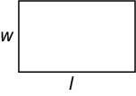
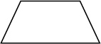
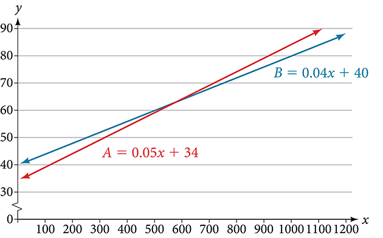
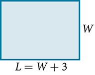

**Models and Applications**

  m51254
  

**Models and Applications**

  In this section, you will:

Set up a linear equation to solve a real-world application.
Use a formula to solve a real-world application.

  c49b7453-abd1-49ed-bc12-baac08df9ebc

## Learning Objectives
Solve a formula for a specified variable (IA 2.3.1)
Use a problem-solving strategy for word problems (IA 2.2.1)
## Objective 1: Solve a formula for a specified variable (IA 2.3.1)

>
>
> **Solving a Formula for a Specified Variable.**
>
> Refer to the appropriate formula and identify the variable you are solving for. Treat the other variable terms as if they were numbers.
> Bring all terms containing the specified variable to one side using the addition/subtraction property of equality. 
> Isolate the variable you are solving for using the multiplication/division property of equality.

**Solve a Formula for a Specific Variable**

1. The formula for the perimeter of a rectangle is found using the formula: $P=2l+2w$ .   Solve this formula in terms of *l*.   

Solution

| $P=2l+2w$ | Since we are solving for *l* we isolate the *l* term |
| :--- | :--- |
| $P-2w=2l+2w-2w$ | Subtract 2*w* from both sides. |
| $P-2w=2l$ | Combine like terms |
| $\frac{P-2w}{2}=\frac{2l}{2}$ | Divide by 2 to isolate *l*. |
| $\frac{P-2w}{2}=l$ | Simplify |

### Practice Makes Perfect
Solve each formula for the specific variable.
2. Solve for $b$   $P=a+b+c$

3. Solve for $s$   $P=4s$

4. Solve for $r$   $C=2\pi r$

5. Solve for $b$   $A=\frac{1}{2}bh$

6. Solve for $W$   $P=2L+2W$

7. Solve for $m$   $y=mx+b$

8. Solve for $h$   $A=2\pi h+2\pi {r}^{2}$

9. Solve for $r$   $A=\pi {r}^{2}$

10. Solve for $s$   $V=\frac{1}{3}{s}^{2}h$

11. Solve for $L$   $A=2LW+2HW+2LH$

## Objective 2: Use a problem-solving strategy for word problems (IA 2.2.1)

>
>
> **Use a Problem-Solving Strategy for word problems.**
>
>
> *Read* the problem. Make sure all the words and ideas are understood.
> *Identify* what you are looking for.
> *Name* what you are looking for. Choose a variable to represent that quantity.
> *Translate* into an equation. It may be helpful to restate the problem in one sentence with all the important information. Then, translate the English sentence into an algebra equation.
> *Solve* the equation using proper algebra techniques.
> *Check* the answer in the problem to make sure it makes sense.
> *Answer* the question with a complete sentence.

12. **Use a Problem-Solving Strategy for word problems.**          Hang borrowed $7,500 from her parents to pay her tuition. In five years, she paid them $1,500 interest in addition to the $7,500 she borrowed. What was the rate of simple interest?

Solution

| Write down the given information: | I = $1500 |
| :--- | :--- |
|  | P = $7500 |
|  | *r* = ? |
|  | t = 5 years |
| Identify the unknown: let interest rate be represented by *r* |  |
| Write a formula: | $I=Prt$ |
| Substitute in the given information: | $1500=\left(7500\right)r\left(5\right)$ |
| Solve for *r* | $1500=\mathrm{37,500}r$ |
|  | $\frac{1500}{\mathrm{37,500}}=r$ |
|  | $0.04=r$ |
|  | $4\%=r$ |

### Practice Makes Perfect
Use a Problem-Solving Strategy for word problems.
13. The formula for area of a trapezoid is $A=\frac{1}{2}(B+b)h$ where B is the length of the base, b is the length of the other base and h is the height of the trapezoid.         If $B=10\text{cm}$ , $b=8\text{cm}$ and $A=45{\text{cm}}^{2}$ , find the height of the trapezoid.

14. A married couple together earns $110,000 a year. The wife earns $16,000 less than twice what her husband earns. What does the husband earn?

15. The label on Audrey’s yogurt said that one serving provided 12 grams of protein, which is 24% of the recommended daily amount. What is the total recommended daily amount of protein?

16. Recently, the California governor proposed raising community college fees from $36 a unit to $46 a unit. Find the percent change. (Round to the nearest tenth of a percent.)

17. Sean’s new car loan statement said he would pay $4,866.25 in interest from a simple interest rate of 8.5% over five years. How much did he borrow to buy his new car?

18. At the campus coffee cart, a medium coffee costs $1.65. MaryAnne brings $2.00 with her when she buys a cup of coffee and leaves the change as a tip. What percent tip does she leave?

Neka is hoping to get an A in his college algebra class. He has scores of 75, 82, 95, 91, and 94 on his first five tests. Only the final exam remains, and the maximum number of points that can be earned is 100. Is it possible for Neka to end the course with an A? A simple linear equation will give Neka his answer.

Many real-world applications can be modeled by linear equations. For example, a cell phone package may include a monthly service fee plus a charge per minute of talk-time; it costs a widget manufacturer a certain amount to produce *x*widgets per month plus monthly operating charges; a car rental company charges a daily fee plus an amount per mile driven. These are examples of applications we come across every day that are modeled by linear equations. In this section, we will set up and use linear equations to solve such problems.

# Setting up a Linear Equation to Solve a Real-World Application
To set up or model a linear equation to fit a real-world application, we must first determine the known quantities and define the unknown quantity as a variable. Then, we begin to interpret the words as mathematical expressions using mathematical symbols. Let us use the car rental example above. In this case, a known cost, such as $0.10/mi, is multiplied by an unknown quantity, the number of miles driven. Therefore, we can write $0.10x.$ This expression represents a variable cost because it changes according to the number of miles driven.
If a quantity is independent of a variable, we usually just add or subtract it, according to the problem. As these amounts do not change, we call them fixed costs. Consider a car rental agency that charges $0.10/mi plus a daily fee of $50. We can use these quantities to model an equation that can be used to find the daily car rental cost $C.$ 
 $$
C=0.10x+50
$$
When dealing with real-world applications, there are certain expressions that we can translate directly into math.  lists some common verbal expressions and their equivalent mathematical expressions.

| Verbal | Translation to Math Operations |
| :--- | :--- |
| One number exceeds another by *a* | $x,\phantom{\rule{0.5em}{0ex}}x+a$ |
| Twice a number | $2x$ |
| One number is *a*more than another number | $x,\phantom{\rule{0.5em}{0ex}}x+a$ |
| One number is *a*less than twice another number | $x,\phantom{\rule{0.5em}{0ex}}2x-a$ |
| The product of a number and *a*, decreased by *b* | $ax-b$ |
| The quotient of a number and the number plus *a*is three times the number | $\frac{x}{x+a}=3x$ |
| The product of three times a number and the number decreased by *b*is *c* | $3x\left(x-b\right)=c$ |

>
> How To
> *Given a real-world problem, model a linear equation to fit it.*
>
>
> Identify known quantities.
> Assign a variable to represent the unknown quantity.
> If there is more than one unknown quantity, find a way to write the second unknown in terms of the first.
> Write an equation interpreting the words as mathematical operations.
> Solve the equation. Be sure the solution can be explained in words, including the units of measure.
>

19. **Modeling a Linear Equation to Solve an Unknown Number Problem**   Find a linear equation to solve for the following unknown quantities: One number exceeds another number by $17$ and their sum is $31.$ Find the two numbers.

Solution

Let $x$ equal the first number. Then, as the second number exceeds the first by 17, we can write the second number as $x+17.$ The sum of the two numbers is 31. We usually interpret the word *is* as an equal sign.

 $$
\begin{array}{ccc}  x+(x+17)& =& 31  \\   2x+17& =& 31\phantom{\rule{2em}{0ex}}\text{Simplify\ and\ solve}\text{.}  \\   2x& =& 14  \\   x& =& 7  \\   x+17& =& 7+17  \\ & =& 24  \end{array}
$$ 
The two numbers are $7$ and $24.$

>
> Try It
> 20. Find a linear equation to solve for the following unknown quantities: One number is three more than twice another number. If the sum of the two numbers is $36,$ find the numbers.
>
> 

> 
Solution

>
> 11 and 25
> 

>
>

21. **Setting Up a Linear Equation to Solve a Real-World Application**   There are two cell phone companies that offer different packages. Company A charges a monthly service fee of $34 plus $.05/min talk-time. Company B charges a monthly service fee of $40 plus $.04/min talk-time.   ⓐWrite a linear equation that models the packages offered by both companies. ⓑ If the average number of minutes used each month is 1,160, which company offers the better plan? ⓒIf the average number of minutes used each month is 420, which company offers the better plan? ⓓHow many minutes of talk-time would yield equal monthly statements from both companies?

Solution

ⓐThe model for Company *A* can be written as $A=0.05x+34.$ This includes the variable cost of $0.05x$ plus the monthly service charge of $34. Company *B*’s package charges a higher monthly fee of $40, but a lower variable cost of $0.04x.$ Company *B*’s model can be written as $B=0.04x+\text{$}40.$ 
ⓑIf the average number of minutes used each month is 1,160, we have the following:

 $$
\begin{array}{ccc}  \text{Company\}A& =& 0.05(1,160)+34  \\ & =& 58+34  \\ & =& 92  \\   \text{Company\}B& =& 0.04(1,160)+40  \\ & =& 46.4+40  \\   & =& 86.4  \end{array}
$$ So, Company *B* offers the lower monthly cost of $86.40 as compared with the $92 monthly cost offered by Company *A* when the average number of minutes used each month is 1,160.

ⓒIf the average number of minutes used each month is 420, we have the following:

 $$
\begin{array}{ccc}  \text{Company\}A& =& 0.05(420)+34  \\ & =& 21+34  \\ & =& 55  \\   \text{Company\}B& =& 0.04(420)+40  \\ & =& 16.8+40  \\ & =& 56.8  \end{array}
$$
If the average number of minutes used each month is 420, then Company *A*offers a lower monthly cost of $55 compared to Company *B*’s monthly cost of $56.80.

 ⓓTo answer the question of how many talk-time minutes would yield the same bill from both companies, we should think about the problem in terms of $\left(x,y\right)$ coordinates: At what point are both the *x-*value and the *y-*value equal? We can find this point by setting the equations equal to each other and solving for *x.*

 $$
\begin{array}{ccc}  0.05x+34& =& 0.04x+40  \\   0.01x& =& 6  \\   x& =& 600  \end{array}
$$
Check the *x-*value in each equation.

 $$
\begin{array}{ccc}  0.05(600)+34& =& 64  \\   0.04(600)+40& =& 64  \end{array}
$$ 
Therefore, a monthly average of 600 talk-time minutes renders the plans equal. See 

>
> Try It
> 22. Find a linear equation to model this real-world application: It costs ABC electronics company $2.50 per unit to produce a part used in a popular brand of desktop computers. The company has monthly operating expenses of $350 for utilities and $3,300 for salaries. What are the company’s monthly expenses?
>
> 

> 
Solution

>
> $C=2.5x+3,650$
> 

>
>

# Using a Formula to Solve a Real-World Application
Many applications are solved using known formulas. The problem is stated, a formula is identified, the known quantities are substituted into the formula, the equation is solved for the unknown, and the problem’s question is answered. Typically, these problems involve two equations representing two trips, two investments, two areas, and so on. Examples of formulas include the **area** of a rectangular region, $A=LW;$ the **perimeter** of a rectangle, $P=2L+2W;$ and the **volume** of a rectangular solid, $V=LWH.$ When there are two unknowns, we find a way to write one in terms of the other because we can solve for only one variable at a time.

23. **Solving an Application Using a Formula**   It takes Andrew 30 min to drive to work in the morning. He drives home using the same route, but it takes 10 min longer, and he averages 10 mi/h less than in the morning. How far does Andrew drive to work?

Solution

This is a distance problem, so we can use the formula $d=rt,$ where distance equals rate multiplied by time. Note that when rate is given in mi/h, time must be expressed in hours. Consistent units of measurement are key to obtaining a correct solution.

First, we identify the known and unknown quantities. Andrew’s morning drive to work takes 30 min, or $\frac{1}{2}$ h at rate $r.$ His drive home takes 40 min, or $\frac{2}{3}$ h, and his speed averages 10 mi/h less than the morning drive. Both trips cover distance $d.$ A table, such as , is often helpful for keeping track of information in these types of problems.

|  | $d$ | $r$ | $t$ |
| :--- | :--- | :--- | :--- |
| *To Work* | $d$ | $r$ | $\frac{1}{2}$ |
| *To Home* | $d$ | $r-10$ | $\frac{2}{3}$ |

Write two equations, one for each trip.

 $$
\begin{array}{cccc}  d& =& r\left(\frac{1}{2}\right)  & \phantom{\rule{2em}{0ex}}\text{To\ work}  \\   d& =& (r-10)\left(\frac{2}{3}\right)  & \phantom{\rule{2em}{0ex}}\text{To\ home}  \end{array}
$$
As both equations equal the same distance, we set them equal to each other and solve for *r*.

 $$
\begin{array}{ccc}  r\left(\frac{1}{2}\right)& =& (r-10)\left(\frac{2}{3}\right)  \\   \frac{1}{2}r& =& \frac{2}{3}r-\frac{20}{3}  \\   \frac{1}{2}r-\frac{2}{3}r& =& -\frac{20}{3}  \\   -\frac{1}{6}r& =& -\frac{20}{3}  \\   r& =& -\frac{20}{3}(\mathrm{-6})  \\   r& =& 40  \end{array}
$$
We have solved for the rate of speed to work, 40 mph. Substituting 40 into the rate on the return trip yields 30 mi/h. Now we can answer the question. Substitute the rate back into either equation and solve for *d.*

 $$
\begin{array}{ccc}  d& =& 40\left(\frac{1}{2}\right)  \\ & =& 20  \end{array}
$$
The distance between home and work is 20 mi.

>
> Try It
> 24. On Saturday morning, it took Jennifer 3.6 h to drive to her mother’s house for the weekend. On Sunday evening, due to heavy traffic, it took Jennifer 4 h to return home. Her speed was 5 mi/h slower on Sunday than on Saturday. What was her speed on Sunday?
>
> 

> 
Solution

>
> 45 mi/h
> 

>
>

25. **Solving a Perimeter Problem**   The perimeter of a rectangular outdoor patio is $54$ ft. The length is $3$ ft greater than the width. What are the dimensions of the patio?

Solution

The perimeter formula is standard: $P=2L+2W.$ We have two unknown quantities, length and width. However, we can write the length in terms of the width as $L=W+3.$ Substitute the perimeter value and the expression for length into the formula. It is often helpful to make a sketch and label the sides as in .

Now we can solve for the width and then calculate the length.

 $$
\begin{array}{ccc}  P& =& 2L+2W  \\   54& =& 2(W+3)+2W  \\   54& =& 2W+6+2W  \\   54& =& 4W+6  \\   48& =& 4W  \\   12& =& W  \\   (12+3)& =& L  \\   15& =& L  \end{array}
$$

The dimensions are $L=15$ ft and $W=12$ ft.

>
> Try It
> 26. Find the dimensions of a rectangle given that the perimeter is $110$ cm and the length is 1 cm more than twice the width.
>
> 

> 
Solution

>
> $L=37$ cm, $W=18$ cm
> 

>
>

27. **Solving an Area Problem**   The perimeter of a tablet of graph paper is 48 in. The length is $6$ in. more than the width. Find the area of the graph paper.

Solution

The standard formula for area is $A=LW;$ however, we will solve the problem using the perimeter formula. The reason we use the perimeter formula is because we know enough information about the perimeter that the formula will allow us to solve for one of the unknowns. As both perimeter and area use length and width as dimensions, they are often used together to solve a problem such as this one.

We know that the length is 6 in. more than the width, so we can write length as $L=W+6.$ Substitute the value of the perimeter and the expression for length into the perimeter formula and find the length.

 $$
\begin{array}{ccc}  P& =& 2L+2W  \\   48& =& 2(W+6)+2W  \\   48& =& 2W+12+2W  \\   48& =& 4W+12  \\   36& =& 4W  \\   9& =& W  \\   (9+6)& =& L  \\   15& =& L  \end{array}
$$

Now, we find the area given the dimensions of $L=15$ in. and $W=9$ in.

 $$
\begin{array}{ccc}  A& =& LW  \\   A& =& 15(9)  \\ & =&   135\phantom{\rule{0.5em}{0ex}}\text{in}{\text{.}}^{2}\end{array}
$$
The area is $135$ in.2.

>
> Try It
> 28. A game room has a perimeter of 70 ft. The length is five more than twice the width. How many ft2 of new carpeting should be ordered?
>
> 

> 
Solution

>
> 250 ft2
> 

>
>

29. **Solving a Volume Problem**   Find the dimensions of a shipping box given that the length is twice the width, the height is $8$ inches, and the volume is 1,600 in.3.

Solution

The formula for the volume of a box is given as $V=LWH,$ the product of length, width, and height. We are given that $L=2W,$ and $H=8.$ The volume is $\mathrm{1,600}$ cubic inches.

 $$
\begin{array}{ccc}  V& =& LWH  \\   1,600& =& (2W)W(8)  \\   1,600& =& 16{W}^{2}  \\   100& =& {W}^{2}  \\   10& =& W  \end{array}
$$
The dimensions are $L=20$ in., $W=10$ in., and $H=8$ in.

>
> Media
>
> Access these online resources for additional instruction and practice with models and applications of linear equations.
>
> Problem solving using linear equations
> Problem solving using equations
> Finding the dimensions of area given the perimeter
> Find the distance between the cities using the distance = rate * time formula
> Linear equation application (Write a cost equation)

# Key Concepts

A linear equation can be used to solve for an unknown in a number problem. See *.*
Applications can be written as mathematical problems by identifying known quantities and assigning a variable to unknown quantities. See .
There are many known formulas that can be used to solve applications. Distance problems, for example, are solved using the $d=rt$ formula. See .
Many geometry problems are solved using the perimeter formula $P=2L+2W,$ the area formula $A=LW,$ or the volume formula $V=LWH.$ See *,*, and .

# Section Exercises

## Verbal
1. To set up a model linear equation to fit real-world applications, what should always be the first step?

Solution

Answers may vary. Possible answers: We should define in words what our variable is representing. We should declare the variable. A heading.

2. Use your own words to describe this equation where *n* is a number:  $5(n+3)=2n$

3. If the total amount of money you had to invest was $2,000 and you deposit $x$ amount in one investment, how can you represent the remaining amount?

Solution

$2,000-x$

4. If a carpenter sawed a 10-ft board into two sections and one section was $n$ ft long, how long would the other section be in terms of $n$ ?

5. If Bill was traveling $v$ mi/h, how would you represent Daemon’s speed if he was traveling 10 mi/h faster?

Solution

$v+10$

## Real-World Applications
For the following exercises, use the information to find a linear algebraic equation model to use to answer the question being asked.
6. Mark and Don are planning to sell each of their marble collections at a garage sale. If Don has 1 more than 3 times the number of marbles Mark has, how many does each boy have to sell if the total number of marbles is 113?

7. Beth and Ann are joking that their combined ages equal Sam’s age. If Beth is twice Ann’s age and Sam is 69 yr old, what are Beth and Ann’s ages?

Solution

Ann: $23;$ Beth: $46$

8. Ruden originally filled out 8 more applications than Hanh. Then each boy filled out 3 additional applications, bringing the total to 28. How many applications did each boy originally fill out?

For the following exercises, use this scenario: Two different telephone carriers offer the following plans that a person is considering. Company A has a monthly fee of $20 and charges of $.05/min for calls. Company B has a monthly fee of $5 and charges $.10/min for calls.
9. Find the model of the total cost of Company A’s plan, using $m$ for the minutes.

Solution

$20+0.05m$

10. Find the model of the total cost of Company B’s plan, using $m$ for the minutes.

11. Find out how many minutes of calling would make the two plans equal.

Solution

300 min

12. If the person makes a monthly average of 200 min of calls, which plan should for the person choose?

For the following exercises, use this scenario: A wireless carrier offers the following plans that a person is considering. The Family Plan: $90 monthly fee, unlimited talk and text on up to 8 lines, and data charges of $40 for each device for up to 2 GB of data per device. The Mobile Share Plan: $120 monthly fee for up to 10 devices, unlimited talk and text for all the lines, and data charges of $35 for each device up to a shared total of 10 GB of data. Use $P$ for the number of devices that need data plans as part of their cost.
13. Find the model of the total cost of the Family Plan.

Solution

$90+40P$

14. Find the model of the total cost of the Mobile Share Plan.

15. Assuming they stay under their data limit, find the number of devices that would make the two plans equal in cost.

Solution

6 devices

16. If a family has 3 smart phones, which plan should they choose?

For exercises 17 and 18, use this scenario: A retired woman has $50,000 to invest but needs to make $6,000 a year from the interest to meet certain living expenses. One bond investment pays 15% annual interest. The rest of it she wants to put in a CD that pays 7%.
17. If we let $x$ be the amount the woman invests in the 15% bond, how much will she be able to invest in the CD?

Solution

$50,000-x$

18. Set up and solve the equation for how much the woman should invest in each option to sustain a $6,000 annual return.

19. Two planes fly in opposite directions. One travels 450 mi/h and the other 550 mi/h. How long will it take before they are 4,000 mi apart?

Solution

4 h

20. Ben starts walking along a path at 4 mi/h. One and a half hours after Ben leaves, his sister Amanda begins jogging along the same path at 6 mi/h. How long will it be before Amanda catches up to Ben?

21. Fiora starts riding her bike at 20 mi/h. After a while, she slows down to 12 mi/h, and maintains that speed for the rest of the trip. The whole trip of 70 mi takes her 4.5 h. For what distance did she travel at 20 mi/h?

Solution

She traveled for 2 h at 20 mi/h, or 40 miles.

22. A chemistry teacher needs to mix a 30% salt solution with a 70% salt solution to make 20 qt of a 40% salt solution. How many quarts of each solution should the teacher mix to get the desired result?

23. Raúl has $20,000 to invest. His intent is to earn 11% interest on his investment. He can invest part of his money at 8% interest and part at 12% interest. How much does Raúl need to invest in each option to make get a total 11% return on his $20,000?

Solution

$5,000 at 8% and $15,000 at 12%

For the following exercises, use this scenario: A truck rental agency offers two kinds of plans. Plan A charges $75/wk plus $.10/mi driven. Plan B charges $100/wk plus $.05/mi driven.
24. Write the model equation for the cost of renting a truck with plan A.

25. Write the model equation for the cost of renting a truck with plan B.

Solution

$B=100+.05x$

26. Find the number of miles that would generate the same cost for both plans.

27. If Tim knows he has to travel 300 mi, which plan should he choose?

Solution

Plan A

For the following exercises, use the formula given to solve for the required value.
28. $A=P(1+rt)$ is used to find the principal amount *P* deposited, earning *r*% interest, for *t* years. Use this to find what principal amount *P* David invested at a 3% rate for 20 yr if $A=\text{$}\mathrm{8,000.}$

29. The formula $F=\frac{m{v}^{2}}{R}$ relates force $\left(F\right)$, velocity $\left(v\right)$, mass , and resistance $\left(m\right)$. Find $R$ when $m=45,$ $v=7,$ and $F=245.$

Solution

$R=9$

30. $F=ma$ indicates that force (*F*) equals mass (*m*) times acceleration (*a*).  Find the acceleration of a mass of 50 kg if a force of 12 N is exerted on it.

31. $Sum=\frac{1}{1-r}$ is the formula for an infinite series sum. If the sum is 5, find $r.$

Solution

$r=\frac{4}{5}$ or 0.8

For the following exercises, solve for the given variable in the formula. After obtaining a new version of the formula, you will use it to solve a question.
32. Solve for *W*: $P=2L+2W$

33. Use the formula from the previous question to find the width, $W,$ of a rectangle whose length is 15 and whose perimeter is 58.

Solution

$W=\frac{P-2L}{2}=\frac{58-2(15)}{2}=14$

34. Solve for $f:\frac{1}{p}+\frac{1}{q}=\frac{1}{f}$

35. Use the formula from the previous question to find $f$ when $p=8\text{and\}q=13.$

Solution

$f=\frac{pq}{p+q}=\frac{8(13)}{8+13}=\frac{104}{21}$

36. Solve for $m$ in the slope-intercept formula: $y=mx+b$

37. Use the formula from the previous question to find $m$ when the coordinates of the point are $\left(4,7\right)$ and $b=12.$

Solution

$m=\frac{-5}{4}$

38. The area of a trapezoid is given by $A=\frac{1}{2}h\left({b}_{1}+{b}_{2}\right).$ Use the formula to find the area of a trapezoid with $h=6,\phantom{\rule{0.5em}{0ex}}\text{}{b}_{1}=14,\phantom{\rule{0.5em}{0ex}}\text{and\}{b}_{2}=8.$

39. Solve for *h:* $A=\frac{1}{2}h\left({b}_{1}+{b}_{2}\right)$

Solution

$h=\frac{2A}{{b}_{1}+{b}_{2}}$

40. Use the formula from the previous question to find the height of a trapezoid with $A=150,\text{}{b}_{1}=19$, and ${b}_{2}=11.$

41. Find the dimensions of an American football field. The length is 200 ft more than the width, and the perimeter is 1,040 ft. Find the length and width. Use the perimeter formula $P=2L+2W.$

Solution

length = 360 ft; width = 160 ft

42. Distance equals rate times time, $d=rt.$ Find the distance Tom travels if he is moving at a rate of 55 mi/h for 3.5 h.

43. Using the formula in the previous exercise, find the distance that Susan travels if she is moving at a rate of 60 mi/h for 6.75 h.

Solution

405 mi

44. What is the total distance that two people travel in 3 h if one of them is riding a bike at 15 mi/h and the other is walking at 3 mi/h?

45. If the area model for a triangle is $A=\frac{1}{2}bh,$ find the area of a triangle with a height of 16 in. and a base of 11 in.

Solution

$A=88\phantom{\rule{0.5em}{0ex}}\text{in}{.}^{2}$

46. Solve for *h:* $A=\frac{1}{2}bh$

47. Use the formula from the previous question to find the height to the nearest tenth of a triangle with a base of 15 and an area of 215.

Solution

28.7

48. The volume formula for a cylinder is $V=\pi {r}^{2}h.$ Using the symbol $\pi$ in your answer, find the volume of a cylinder with a radius, $r,$ of 4 cm and a height of 14 cm.

49. Solve for *h:* $V=\pi {r}^{2}h$

Solution

$h=\frac{V}{\pi {r}^{2}}$

50. Use the formula from the previous question to find the height of a cylinder with a radius of 8 and a volume of $16\pi$

51. Solve for *r:* $V=\pi {r}^{2}h$

Solution

$r=\sqrt{\frac{V}{\pi h}}$

52. Use the formula from the previous question to find the radius of a cylinder with a height of 36 and a volume of $324\pi .$

53. The formula for the circumference of a circle is $\phantom{\rule{0.5em}{0ex}}C=2\pi r.$ Find the circumference of a circle with a diameter of 12 in. (diameter = 2*r*). Use the symbol $\pi$ in your final answer.

Solution

$C=12\pi$

54. Solve the formula from the previous question for $\pi .$ Notice why $\pi$ is sometimes defined as the ratio of the circumference to its diameter.

**area**in square units, the area formula used in this section is used to find the area of any two-dimensional rectangular region: $A=LW$ 
**perimeter**in linear units, the perimeter formula is used to find the linear measurement, or outside length and width, around a two-dimensional regular object; for a rectangle: $P=2L+2W$ 
**volume**in cubic units, the volume measurement includes length, width, and depth: $V=LWH$
