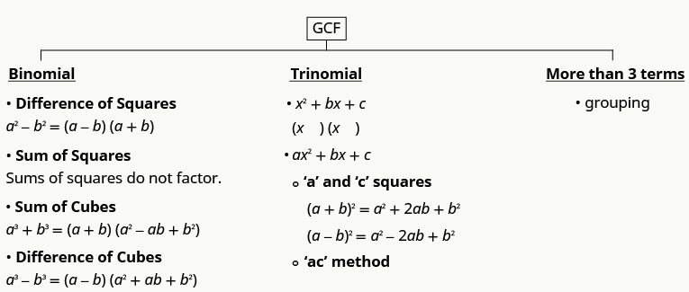
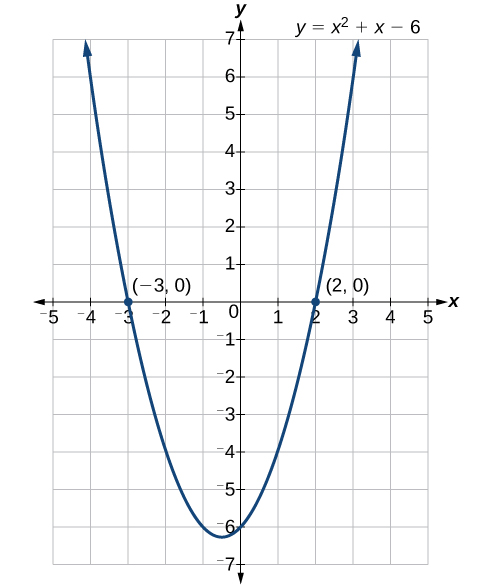
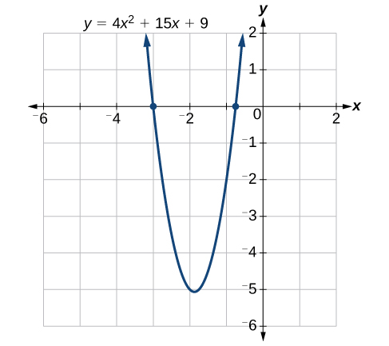
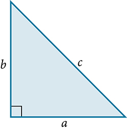
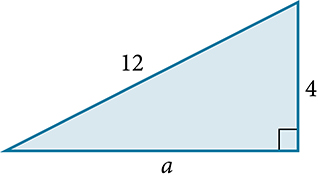
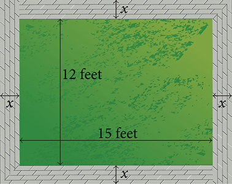

Quadratic Equations
===================

  m51256
  
Quadratic Equations
===================

  In this section, you will:

Solve quadratic equations by factoring.
Solve quadratic equations by the square root property.
Solve quadratic equations by completing the square.
Solve quadratic equations by using the quadratic formula.

  00138001-23fe-4ec9-b2c6-000f3f28ee23

Learning Objectives
===================
Recognize and use the appropriate method to factor a polynomial completely (IA 6.4.1)

Objective 1: Recognize and use the appropriate method to factor a polynomial completely  (IA 6.4.1)
===================================================================================================
The following chart summarizes the factoring methods and outlines a strategy you should use when factoring polynomials.

\n\n\n\nIs there a factor common to all terms? Factor it out.
Consider the number of terms in the original polynomial.

Two Terms? We refer to this as a binomial.
==========================================
If it is a sum of squared terms, this does not factor further. We refer to this as prime.
If it is a difference of perfect square terms, factor using the difference of two squares form.
If it is a sum of perfect cubed terms, factor using the sum of two cubes form.
If it is a difference of perfect cubed terms, factor using the difference of two cubes form.

Three terms? We refer to this as a trinomial.
=============================================
If the coefficient of ${x}^{2}$ is $1$ , ${x}^{2}+bx+c$ , try to find two factors of $c$ that add to $b$ . If you find these, the trinomial is factorable.
If the coefficient of ${x}^{2}$ is not $1$ , $a{x}^{2}+bx+c$ , try to find two factors of $ac$ that add to $b$ . If you find these, the trinomial is factorable. You can factor using trial and error or the $ac$ method from here.
If you notice that $a{x}^{2}$ and $c$ are perfect squares, you are working with a perfect square trinomial which can be factored as the square of a binomial.
Four terms?
===========
Try to factor by grouping two terms, or three terms and finding factors common to those terms.

Check your work. Is the polynomial factored completely? Do the factors multiply to give you the original polynomial?
Recognize and use the appropriate method to factor a polynomial completely.

    
          ⓐ $5{x}^{3}-15{x}^{2}-50x$
     
     
          ⓑ $4{x}^{2}+20xy+25{y}^{2}$
     
     
          ⓒ $9{x}^{2}-16$
     
     
          ⓓ $8{x}^{3}+27{y}^{3}$
     
     
          ⓔ $16{x}^{2}+24xy-4x-6y$
     

 
 ⓐ
  $5{x}^{3}-15{x}^{2}-50x$ 

 
 First let's factor out the common factor of $5x$ .
  $5x({x}^{2}-3x-10)$ 
 
 
 Consider the resulting trinomial with a leading coefficient of $1$ . Are there two factors of $-10$ that add to $-3$ ? Yes, $-5$ and $2$ , multiply to $-10$ and add to $-3$ . Use these factors.	
  $5x(x-5)(x+2)$ 
 

 
 ⓑ
  $4{x}^{2}+20xy+25{y}^{2}$ 
 
 
 There are no factors common to all three terms in the trinomial. Notice that the first term, $4{x}^{2}$ is a perfect square $(2x{)}^{2}$ and last term, $25{y}^{2}$ , is a perfect square $(5y{)}^{2}$ , so this may be a perfect square trinomial. 
  $(a+b{)}^{2}={a}^{2}+2ab+{b}^{2}$ 
 
 
 Check the middle term to see if it is equivalent to $2ab$ , or $2(2x)(5y)=20xy$ , and it is.
  $ad(2x+5y)(2x+5y)=(2x+5y{)}^{2}$ 
 

 
 ⓒ
  $9{x}^{2}-16$ 
 
 
 There are no factors common to both terms in the binomial. Notice that the first term, $9{x}^{2}$ is a perfect square $(3x{)}^{2}$ and last term, $16$ , is a perfect square ${4}^{2}$ , so this form is a difference of two squares.

  ${a}^{2}-{b}^{2}=(a-b)(a+b)$ 
 
 
 
  $9{x}^{2}-16=(3x-4)(3x+4)$ 
 

 
 ⓓ
  $8{x}^{3}+27{y}^{3}$ 
 
 
 There are no factors common to both terms in the binomial. Notice that the first term, $8{x}^{3}$ is a perfect cube $(2x{)}^{3}$ and last term, $27{y}^{3}$ , so this form is a sum of two cubes.
  ${a}^{3}+{b}^{3}=(a+b)({a}^{2}-ab+{b}^{2})$ 
 
 
 
  ${(2x)}^{3}+{(3y)}^{3}=(2x+3y)(4{x}^{2}-6xy+9{y}^{2})$ 
 

 
 ⓔ
  $16{x}^{2}+24xy-4x-6y\$ 
 
 
 First, let’s factor out the common factor of $2$ .
  $2(8{x}^{2}+12xy-2x-3y)$ 
 
 
 The first two terms in the parentheses have a 4x in common, let’s factor that out. Since the second two terms have nothing in common, but are both negative, we’ll factor out a negative $1$ . 
  $2[4x(2x+3y)-1(2x+3y)]$ 
 
 
 Inside the parentheses, the four terms have become two terms with a common factor of $(2x+3y)$ Factor this from the two terms
  $2[(2x+3y)(4x-1)]$ 
 

Practice Makes Perfect
======================
Recognize and use the appropriate method to factor a polynomial completely.
===========================================================================
Factor each of the following polynomials completely, if a polynomial does not factor label it as prime.

  ${x}^{2}+10x+24$

  ${y}^{2}-20y+36$

  $2{x}^{2}+16x+30$

  $9{x}^{2}+42x+49$

  $25{n}^{2}-90n+81$

  $10{x}^{3}y+65{x}^{2}y-35xy$

  $121{q}^{2}-100$

  $50{m}^{2}+72$

  $125{z}^{3}+27$

  $12ab-6a+10b-5$

  $18{x}^{2}-12xy+2{y}^{2}-98$

  ${(3x-5)}^{2}-7(3x-5)+12$

\n\n\n\n
The computer monitor on the left in  is a 23.6-inch model and the one on the right is a 27-inch model. Proportionally, the monitors appear very similar. If there is a limited amount of space and we desire the largest monitor possible, how do we decide which one to choose? In this section, we will learn how to solve problems such as this using four different methods.

Solving Quadratic Equations by Factoring
========================================

An equation containing a second-degree polynomial is called a **quadratic equation**. For example, equations such as $2{x}^{2}+3x-1=0$ and ${x}^{2}-4=0$ are quadratic equations. They are used in countless ways in the fields of engineering, architecture, finance, biological science, and, of course, mathematics.
Often the easiest method of solving a quadratic equation is **factoring**. Factoring means finding expressions that can be multiplied together to give the expression on one side of the equation.

If a quadratic equation can be factored, it is written as a product of linear terms. Solving by factoring depends on the zero-product property, which states that if $a\cdot b=0,$ then $a=0$ or $b=0,$ where *a*and *b*are real numbers or algebraic expressions. In other words, if the product of two numbers or two expressions equals zero, then one of the numbers or one of the expressions must equal zero because zero multiplied by anything equals zero.

Multiplying the factors expands the equation to a string of terms separated by plus or minus signs. So, in that sense, the operation of multiplication undoes the operation of factoring. For example, expand the factored expression $\left(x-2\right)\left(x+3\right)$ by multiplying the two factors together.

 $$
\begin{array}{ccc}\hfill \left(x-2\right)\left(x+3\right)& =& {x}^{2}+3x-2x-6\hfill \\ & =& {x}^{2}+x-6\hfill \end{array}
$$ The product is a quadratic expression. Set equal to zero, ${x}^{2}+x-6=0$ is a quadratic equation. If we were to factor the equation, we would get back the factors we multiplied.

The process of factoring a quadratic equation depends on the leading coefficient, whether it is 1 or another integer. We will look at both situations; but first, we want to confirm that the equation is written in standard form, $a{x}^{2}+bx+c=0,$ where *a*, *b*, and *c* are real numbers, and $a\ne 0.$ The equation ${x}^{2}+x-6=0$ is in standard form.
We can use the zero-product property to solve quadratic equations in which we first have to factor out the **greatest common factor** (GCF), and for equations that have special factoring formulas as well, such as the difference of squares, both of which we will see later in this section.

The Zero-Product Property and Quadratic Equations
=================================================

The **zero-product property** states

 $$
\text{If\}a\cdot b=0,\phantom{\rule{0.5em}{0ex}}\text{then\}a=0\phantom{\rule{0.5em}{0ex}}\text{or\}b=0,
$$ 
where *a*and *b*are real numbers or algebraic expressions.

A **quadratic equation** is an equation containing a second-degree polynomial; for example

 $a{x}^{2}+bx+c=0$ 
where *a*, *b*, and *c* are real numbers, and if $a\ne 0,$ it is in standard form.

Solving Quadratics with a Leading Coefficient of 1
==================================================

In the quadratic equation ${x}^{2}+x-6=0,$ the leading coefficient, or the coefficient of ${x}^{2},$ is 1. We have one method of factoring quadratic equations in this form.

How To
*Given a quadratic equation with the leading coefficient of 1, factor it.*

Find two numbers whose product equals *c* and whose sum equals *b*.
Use those numbers to write two factors of the form $\left(x+k\right)\phantom{\rule{0.5em}{0ex}}\text{or\}\left(x-k\right),$ where *k*is one of the numbers found in step 1. Use the numbers exactly as they are. In other words, if the two numbers are 1 and $\mathrm{-2},$ the factors are $\left(x+1\right)\left(x-2\right).$ 
Solve using the zero-product property by setting each factor equal to zero and solving for the variable.

Factoring and Solving a Quadratic with Leading Coefficient of 1
===============================================================

Factor and solve the equation: ${x}^{2}+x-6=0.$

To factor ${x}^{2}+x-6=0,$ we look for two numbers whose product equals $\mathrm{-6}$ and whose sum equals 1. Begin by looking at the possible factors of $\mathrm{-6.}$

 $$
\begin{array}{c}1\cdot (\mathrm{-6})\\ (\mathrm{-6})\cdot 1\\ 2\cdot (\mathrm{-3})\\ 3\cdot (\mathrm{-2})\end{array}
$$ The last pair, $3\cdot \left(\mathrm{-2}\right)$ sums to 1, so these are the numbers. Note that only one pair of numbers will work. Then, write the factors.

 $$
\left(x-2\right)\left(x+3\right)=0
$$

To solve this equation, we use the zero-product property. Set each factor equal to zero and solve.

 $$
\begin{array}{ccc}\hfill \left(x-2\right)\left(x+3\right)& =& 0\hfill \\ \hfill \left(x-2\right)& =& 0\hfill \\ \hfill x& =& 2\hfill \\ \hfill \left(x+3\right)& =& 0\hfill \\ \hfill x& =& \mathrm{-3}\hfill \end{array}
$$

The two solutions are $2$ and $\mathrm{-3.}$ We can see how the solutions relate to the graph in . The solutions are the *x-*intercepts of $y={x}^{2}+x-6=0.$
\n\n\n\n

Try It
Factor and solve the quadratic equation: ${x}^{2}-5x-6=0.$

$\left(x-6\right)\left(x+1\right)=0;x=6,x=-1$

Solve the Quadratic Equation by Factoring
=========================================

Solve the quadratic equation by factoring: ${x}^{2}+8x+15=0.$

Find two numbers whose product equals $15$ and whose sum equals $8.$ List the factors of $15.$

 $$
\begin{array}{c}1\cdot 15\hfill \\ 3\cdot 5\hfill \\ (\mathrm{-1})\cdot (\mathrm{-15})\hfill \\ (\mathrm{-3})\cdot (\mathrm{-5})\hfill \end{array}
$$
The numbers that add to 8 are 3 and 5. Then, write the factors, set each factor equal to zero, and solve.

 $$
\begin{array}{ccc}\hfill \left(x+3\right)\left(x+5\right)& =& 0\hfill \\ \hfill \left(x+3\right)& =& 0\hfill \\ \hfill x& =& \mathrm{-3}\hfill \\ \hfill \left(x+5\right)& =& 0\hfill \\ \hfill x& =& \mathrm{-5}\hfill \end{array}
$$
The solutions are $\mathrm{-3}$ and $\mathrm{-5.}$

Try It
Solve the quadratic equation by factoring: ${x}^{2}-4x-21=0.$

$\left(x\mathrm{-7}\right)\left(x+3\right)=0,$ $x=7,$ $x=\mathrm{-3.}$

 

Using the Zero-Product Property to Solve a Quadratic Equation Written as the Difference of Squares
==================================================================================================

Solve the difference of squares equation using the zero-product property: ${x}^{2}-9=0.$

Recognizing that the equation represents the difference of squares, we can write the two factors by taking the square root of each term, using a minus sign as the operator in one factor and a plus sign as the operator in the other. Solve using the zero-factor property.

 $$
\begin{array}{ccc}\hfill {x}^{2}-9& =& 0\hfill \\ \hfill \left(x-3\right)\left(x+3\right)& =& 0\hfill \\ \hfill \left(x-3\right)& =& 0\hfill \\ \hfill x& =& 3\hfill \\ \hfill \left(x+3\right)& =& 0\hfill \\ \hfill x& =& \mathrm{-3}\hfill \end{array}
$$
The solutions are $3$ and $\mathrm{-3.}$

Try It
Solve by factoring: ${x}^{2}-25=0.$

$\left(x+5\right)\left(x\mathrm{-5}\right)=0,$ $x=\mathrm{-5},$ $x=5.$

Solving a Quadratic Equation by Factoring when the Leading Coefficient is not 1
===============================================================================
When the leading coefficient is not 1, we factor a quadratic equation using the method called grouping, which requires four terms. With the equation in standard form, let’s review the grouping procedures:

With the quadratic in standard form, $a{x}^{2}+bx+c=0,$ multiply $a\cdot c.$ 
Find two numbers whose product equals $ac$ and whose sum equals $b.$ 
Rewrite the equation replacing the $bx$ term with two terms using the numbers found in step 2 as coefficients of *x.*
Factor the first two terms and then factor the last two terms. The expressions in parentheses must be exactly the same to use grouping.
Factor out the expression in parentheses.
Set the expressions equal to zero and solve for the variable.

Solving a Quadratic Equation Using Grouping
===========================================

Use grouping to factor and solve the quadratic equation: $4{x}^{2}+15x+9=0.$

First, multiply $ac:4\left(9\right)=36.$ Then list the factors of $36.$

 $$
\begin{array}{l}1\cdot 36\hfill \\ 2\cdot 18\hfill \\ 3\cdot 12\hfill \\ 4\cdot 9\hfill \\ 6\cdot 6\hfill \end{array}
$$ 
The only pair of factors that sums to $15$ is $3+12.$ Rewrite the equation replacing the *b*term, $15x,$ with two terms using 3 and 12 as coefficients of *x*. Factor the first two terms, and then factor the last two terms.

 $$
\begin{array}{ccc}\hfill 4{x}^{2}+3x+12x+9& =& 0\hfill \\ \hfill x(4x+3)+3(4x+3)& =& 0\hfill \\ \hfill (4x+3)(x+3)& =& 0\hfill \end{array}
$$

Solve using the zero-product property.

 $$
\begin{array}{ccc}\hfill (4x+3)(x+3)& =& 0\hfill \\ \hfill (4x+3)& =& 0\hfill \\ \hfill x& =& -\frac{3}{4}\hfill \\ \hfill (x+3)& =& 0\hfill \\ \hfill x& =& -3\hfill \end{array}
$$
The solutions are $-\frac{3}{4},$  and $\mathrm{-3.}$ See .
\n\n\n\n

Try It
Solve using factoring by grouping: $12{x}^{2}+11x+2=0.$

$\left(3x+2\right)\left(4x+1\right)=0,$ $x=-\frac{2}{3},$ $x=-\frac{1}{4}$

Solving a Polynomial of Higher Degree by Factoring
==================================================

Solve the equation by factoring: $\mathrm{-3}{x}^{3}-5{x}^{2}-2x=0.$

This equation does not look like a quadratic, as the highest power is 3, not 2. Recall that the first thing we want to do when solving any equation is to factor out the GCF, if one exists. And it does here. We can factor out $-x$ from all of the terms and then proceed with grouping.

 $$
\begin{array}{ccc}\hfill \mathrm{-3}{x}^{3}-5{x}^{2}-2x& =& 0\hfill \\ \hfill -x(3{x}^{2}+5x+2)& =& 0\hfill \end{array}
$$
Use grouping on the expression in parentheses.

 $$
\begin{array}{ccc}\hfill -x(3{x}^{2}+3x+2x+2)& =& 0\hfill \\ \hfill -x[3x(x+1)+2(x+1)]& =& 0\hfill \\ \hfill -x(3x+2)(x+1)& =& 0\hfill \end{array}
$$
Now, we use the zero-product property. Notice that we have three factors.

 $$
\begin{array}{ccc}\hfill -x& =& 0\hfill \\ \hfill x& =& 0\hfill \\ \hfill 3x+2& =& 0\hfill \\ \hfill x& =& -\frac{2}{3}\hfill \\ \hfill x+1& =& 0\hfill \\ \hfill x& =& \mathrm{-1}\hfill \end{array}
$$

The solutions are $0,$ $-\frac{2}{3},$ and $\mathrm{-1.}$

Try It
Solve by factoring: ${x}^{3}+11{x}^{2}+10x=0.$

$x=0,x=\mathrm{-10},x=\mathrm{-1}$

Using the Square Root Property
==============================

When there is no linear term in the equation, another method of solving a quadratic equation is by using the **square root property**, in which we isolate the ${x}^{2}$ term and take the square root of the number on the other side of the equals sign. Keep in mind that sometimes we may have to manipulate the equation to isolate the ${x}^{2}$ term so that the square root property can be used.

The Square Root Property
========================

With the ${x}^{2}$ term isolated, the square root property states that:

 $$
\text{if}\phantom{\rule{0.5em}{0ex}}{x}^{2}=k,\text{then}\phantom{\rule{0.5em}{0ex}}x=\pm \sqrt{k}
$$

where *k*is a nonzero real number.

How To
*Given a quadratic equation with an ${x}^{2}$ term but no $x$ term, use the square root property to solve it.*

Isolate the ${x}^{2}$ term on one side of the equal sign.
Take the square root of both sides of the equation, putting a $\pm$ sign before the expression on the side opposite the squared term.
Simplify the numbers on the side with the $\pm$ sign.

Solving a Simple Quadratic Equation Using the Square Root Property
==================================================================

Solve the quadratic using the square root property: ${x}^{2}=8.$

Take the square root of both sides, and then simplify the radical. Remember to use a $\pm$ sign before the radical symbol.

 $$
\begin{array}{ccc}\hfill {x}^{2}& =& 8\hfill \\ \hfill x& =& \pm \sqrt{8}\hfill \\ & =& \pm 2\sqrt{2}\hfill \end{array}
$$

The solutions are $2\sqrt{2},$ $\mathrm{-2}\sqrt{2}.$

Solving a Quadratic Equation Using the Square Root Property
===========================================================

Solve the quadratic equation: $4{x}^{2}+1=\text{7.}$

First, isolate the ${x}^{2}$ term. Then take the square root of both sides.

 $$
\begin{array}{ccc}\hfill 4{x}^{2}+1& =& 7\hfill \\ \hfill 4{x}^{2}& =& 6\hfill \\ \hfill {x}^{2}& =& \frac{6}{4}\hfill \\ \hfill x& =& \pm \frac{\sqrt{6}}{2}\hfill \end{array}
$$

The solutions are $\frac{\sqrt{6}}{2},$ and $-\frac{\sqrt{6}}{2}.$

Try It
Solve the quadratic equation using the square root property: $3{\left(x-4\right)}^{2}=15.$

$x=4\pm \sqrt{5}$

Completing the Square
=====================

Not all quadratic equations can be factored or can be solved in their original form using the square root property. In these cases, we may use a method for solving a **quadratic equation** known as **completing the square**. Using this method, we add or subtract terms to both sides of the equation until we have a perfect square trinomial on one side of the equal sign. We then apply the square root property. To complete the square, the leading coefficient, *a*, must equal 1. If it does not, then divide the entire equation by *a*. Then, we can use the following procedures to solve a quadratic equation by completing the square.

We will use the example ${x}^{2}+4x+1=0$ to illustrate each step.

Given a quadratic equation that cannot be factored, and with $a=1,$ first add or subtract the constant term to the right side of the equal sign.

 $$
{x}^{2}+4x=\mathrm{-1}
$$ 
Multiply the *b*term by $\frac{1}{2}$ and square it.

 $$
\begin{array}{ccc}\hfill \frac{1}{2}(4)& =& 2\hfill \\ \hfill {2}^{2}& =& 4\hfill \end{array}
$$

Add ${\left(\frac{1}{2}b\right)}^{2}$ to both sides of the equal sign and simplify the right side. We have

 $$
\begin{array}{ccc}\hfill {x}^{2}+4x+4& =& -1+4\hfill \\ \hfill {x}^{2}+4x+4& =& 3\hfill \end{array}
$$

The left side of the equation can now be factored as a perfect square.

 $$
\begin{array}{ccc}\hfill {x}^{2}+4x+4& =& 3\hfill \\ \hfill {(x+2)}^{2}& =& 3\hfill \end{array}
$$

Use the square root property and solve.

 $$
\begin{array}{ccc}\hfill \sqrt{{(x+2)}^{2}}& =& \pm \sqrt{3}\hfill \\ \hfill x+2& =& \pm \sqrt{3}\hfill \\ \hfill x& =& \mathrm{-2}\pm \sqrt{3}\hfill \end{array}
$$ 
The solutions are $\mathrm{-2}+\sqrt{3},$  and $\mathrm{-2}-\sqrt{3}.$

Solving a Quadratic by Completing the Square
============================================

Solve the quadratic equation by completing the square: ${x}^{2}-3x-5=0.$

First, move the constant term to the right side of the equal sign.

 ${x}^{2}-3x=5$
Then, take $\frac{1}{2}$ of the *b*term and square it.

 $$
\begin{array}{ccc}\hfill \frac{1}{2}(\mathrm{-3})& =& -\frac{3}{2}\hfill \\ \hfill {\left(-\frac{3}{2}\right)}^{2}& =& \frac{9}{4}\hfill \end{array}
$$
Add the result to both sides of the equal sign.

 $$
\begin{array}{ccc}\hfill {x}^{2}-3x+{\left(-\frac{3}{2}\right)}^{2}& =& 5+{\left(-\frac{3}{2}\right)}^{2}\hfill \\ \hfill {x}^{2}-3x+\frac{9}{4}& =& 5+\frac{9}{4}\hfill \end{array}
$$
Factor the left side as a perfect square and simplify the right side.

 $$
{\left(x-\frac{3}{2}\right)}^{2}=\frac{29}{4}
$$ 
Use the square root property and solve.

 $$
\begin{array}{ccc}\hfill \sqrt{{\left(x-\frac{3}{2}\right)}^{2}}& =& \pm \sqrt{\frac{29}{4}}\hfill \\ \hfill \left(x-\frac{3}{2}\right)& =& \pm \frac{\sqrt{29}}{2}\hfill \\ \hfill x& =& \frac{3}{2}\pm \frac{\sqrt{29}}{2}\hfill \end{array}
$$

The solutions are $\frac{3+\sqrt{29}}{2}$

  and $\frac{3-\sqrt{29}}{2}$ .

Try It
Solve by completing the square: ${x}^{2}-6x=13.$

$x=3\pm \sqrt{22}$

Using the Quadratic Formula
===========================

The fourth method of solving a **quadratic equation** is by using the **quadratic formula**, a formula that will solve all quadratic equations. Although the quadratic formula works on any quadratic equation in standard form, it is easy to make errors in substituting the values into the formula. Pay close attention when substituting, and use parentheses when inserting a negative number.
We can derive the quadratic formula by **completing the square**. We will assume that the leading coefficient is positive; if it is negative, we can multiply the equation by $\mathrm{-1}$ and obtain a positive *a*. Given $a{x}^{2}+bx+c=0,$ $a\ne 0,$ we will complete the square as follows:

First, move the constant term to the right side of the equal sign:

 $$
a{x}^{2}+bx=-c
$$ 
As we want the leading coefficient to equal 1, divide through by *a*:

 $$
{x}^{2}+\frac{b}{a}x=-\frac{c}{a}
$$ 
Then, find $\frac{1}{2}$ of the middle term, and add ${\left(\frac{1}{2}\frac{b}{a}\right)}^{2}=\frac{{b}^{2}}{4{a}^{2}}$ to both sides of the equal sign:

 $$
{x}^{2}+\frac{b}{a}x+\frac{{b}^{2}}{4{a}^{2}}=\frac{{b}^{2}}{4{a}^{2}}-\frac{c}{a}
$$ 
Next, write the left side as a perfect square. Find the common denominator of the right side and write it as a single fraction:

 $$
{\left(x+\frac{b}{2a}\right)}^{2}=\frac{{b}^{2}-4ac}{4{a}^{2}}
$$ 
Now, use the square root property, which gives

 $$
\begin{array}{ccc}\hfill x+\frac{b}{2a}& =& \pm \sqrt{\frac{{b}^{2}-4ac}{4{a}^{2}}}\hfill \\ \hfill x+\frac{b}{2a}& =& \frac{\pm \sqrt{{b}^{2}-4ac}}{2a}\hfill \end{array}
$$

Finally, add $-\frac{b}{2a}$ to both sides of the equation and combine the terms on the right side. Thus,

 $$
x=\frac{-b\pm \sqrt{{b}^{2}-4ac}}{2a}
$$ 

The Quadratic Formula
=====================

  Written in standard form, $a{x}^{2}+bx+c=0,$ any quadratic equation can be solved using the **quadratic formula**:

 $$
x=\frac{-b\pm \sqrt{{b}^{2}-4ac}}{2a}
$$ 
where *a*, *b*, and *c* are real numbers and $a\ne 0.$

How To
*Given a quadratic equation, solve it using the quadratic formula*

Make sure the equation is in standard form: $a{x}^{2}+bx+c=0.$ 
Make note of the values of the coefficients and constant term, $a,b,$ and $c.$ 
Carefully substitute the values noted in step 2 into the equation. To avoid needless errors, use parentheses around each number input into the formula.
Calculate and solve.

Solve the Quadratic Equation Using the Quadratic Formula
========================================================

Solve the quadratic equation: ${x}^{2}+5x+1=0.$

Identify the coefficients: $a=1,b=5,c=1.$ Then use the quadratic formula.

 $$
\begin{array}{ccc}\hfill x& =& \hfill \frac{-(5)\pm \sqrt{{(5)}^{2}-4(1)(1)}}{2(1)}\\ & =& \frac{-5\pm \sqrt{25-4}}{2}\hfill \\ & =& \frac{-5\pm \sqrt{21}}{2}\hfill \end{array}
$$

 

Solving a Quadratic Equation with the Quadratic Formula
=======================================================

Use the quadratic formula to solve ${x}^{2}+x+2=0.$

First, we identify the coefficients: $a=1,b=1,$ and $c=2.$
Substitute these values into the quadratic formula.

 $$
\begin{array}{ccc}\hfill x& =& \frac{-b\pm \sqrt{{b}^{2}-4ac}}{2a}\hfill \\ & =& \frac{-(1)\pm \sqrt{{(1)}^{2}-(4)\cdot (1)\cdot (2)}}{2\cdot 1}\hfill \\ & =& \frac{-1\pm \sqrt{1-8}}{2}\hfill \\ & =& \frac{-1\pm \sqrt{-7}}{2}\hfill \\ & =& \frac{-1\pm i\sqrt{7}}{2}\hfill \end{array}
$$
The solutions to the equation are $\frac{-1+i\sqrt{7}}{2}$ and $\frac{-1-i\sqrt{7}}{2}$

Try It
Solve the quadratic equation using the quadratic formula: $9{x}^{2}+3x-2=0.$

$x=-\frac{2}{3},$ $x=\frac{1}{3}$

The Discriminant
================

The **quadratic formula** not only generates the solutions to a quadratic equation, it tells us about the nature of the solutions when we consider the **discriminant**, or the expression under the radical, ${b}^{2}-4ac.$ The discriminant tells us whether the solutions are real numbers or complex numbers, and how many solutions of each type to expect.  relates the value of the discriminant to the solutions of a quadratic equation.

Value of Discriminant
Results

 ${b}^{2}-4ac=0$ 
One rational solution (double solution)

 ${b}^{2}-4ac>0,$ perfect square
Two rational solutions

 ${b}^{2}-4ac>0,$ not a perfect square
Two irrational solutions

 ${b}^{2}-4ac<0$ 
Two complex solutions

The Discriminant
================

For $a{x}^{2}+bx+c=0$ , where $a$ , $b$ , and $c$ are real numbers, the **discriminant** is the expression under the radical in the quadratic formula: ${b}^{2}-4ac.$ It tells us whether the solutions are real numbers or complex numbers and how many solutions of each type to expect.

Using the Discriminant to Find the Nature of the Solutions to a Quadratic Equation
==================================================================================

Use the discriminant to find the nature of the solutions to the following quadratic equations:

ⓐ ${x}^{2}+4x+4=0$ 
ⓑ $8{x}^{2}+14x+3=0$ 
ⓒ $3{x}^{2}-5x-2=0$ 
 ⓓ $3{x}^{2}-10x+15=0$ 

Calculate the discriminant ${b}^{2}-4ac$ for each equation and state the expected type of solutions.

ⓐ${x}^{2}+4x+4=0$

${b}^{2}-4ac={\left(4\right)}^{2}-4\left(1\right)\left(4\right)=0.$ There will be one rational double solution.

ⓑ$8{x}^{2}+14x+3=0$

${b}^{2}-4ac={\left(14\right)}^{2}-4\left(8\right)\left(3\right)=100.$ As $100$ is a perfect square, there will be two rational solutions.

ⓒ$3{x}^{2}-5x-2=0$
${b}^{2}-4ac={\left(\mathrm{-5}\right)}^{2}-4\left(3\right)\left(\mathrm{-2}\right)=49.$ As $49$ is a perfect square, there will be two rational solutions.

ⓓ$3{x}^{2}\mathrm{-10}x+15=0$

${b}^{2}-4ac={\left(\mathrm{-10}\right)}^{2}-4\left(3\right)\left(15\right)=\mathrm{-80.}$ There will be two complex solutions.

Using the Pythagorean Theorem
=============================
One of the most famous formulas in mathematics is the **Pythagorean Theorem**. It is based on a right triangle, and states the relationship among the lengths of the sides as ${a}^{2}+{b}^{2}={c}^{2},$ where $a$ and $b$ refer to the legs of a right triangle adjacent to the $\mathrm{90\xb0}$ angle, and $c$ refers to the hypotenuse. It has immeasurable uses in architecture, engineering, the sciences, geometry, trigonometry, and algebra, and in everyday applications.
We use the Pythagorean Theorem to solve for the length of one side of a triangle when we have the lengths of the other two. Because each of the terms is squared in the theorem, when we are solving for a side of a triangle, we have a quadratic equation. We can use the methods for solving quadratic equations that we learned in this section to solve for the missing side.

The Pythagorean Theorem is given as

 $$
{a}^{2}+{b}^{2}={c}^{2}
$$ 
where $a$ and $b$ refer to the legs of a right triangle adjacent to the ${90}^{\circ}$ angle, and $c$ refers to the hypotenuse, as shown in .

\n\n\n\n

Finding the Length of the Missing Side of a Right Triangle
==========================================================

Find the length of the missing side of the right triangle in .

\n\n\n\n

As we have measurements for side *b* and the hypotenuse, the missing side is *a.*

 $$
\begin{array}{ccc}\hfill {a}^{2}+{b}^{2}& =& {c}^{2}\hfill \\ {a}^{2}+{(4)}^{2}\hfill & =& {(12)}^{2}\hfill \\ \hfill {a}^{2}+16& =& 144\hfill \\ \hfill {a}^{2}& =& 128\hfill \\ \hfill a& =& \sqrt{128}\hfill \\ & =& 8\sqrt{2}\hfill \end{array}
$$

Try It
Use the Pythagorean Theorem to solve the right triangle problem: Leg *a*measures 4 units, leg *b*measures 3 units. Find the length of the hypotenuse.

$5$ units

Media
Access these online resources for additional instruction and practice with quadratic equations.

Solving Quadratic Equations by Factoring
The Zero-Product Property
Completing the Square
Quadratic Formula with Two Rational Solutions
Length of a leg of a right triangle

  
Key Equations
=============

quadratic formula
 $x=\frac{-b\pm \sqrt{{b}^{2}-4ac}}{2a}$ 

  Distance
  $d=\sqrt{{\left({x}_{2}-{x}_{1}\right)}^{2}+{\left({y}_{2}-{y}_{1}\right)}^{2}}$

  Slope of a line
  $m=\frac{{y}_{2}-{y}_{1}}{{x}_{2}-{x}_{1}}$

  Point-Slope equation of a line
  $y-{y}_{1}=m\left(x-{x}_{1}\right)$

  Adding Complex Numbers
  $(a+bi)+(c+di)=(a+c)+(b+d)i$

  Subtracting Complex Numbers
  $(a+bi)-(c+di)=(a-c)+(b-d)i$

  Square Root Property
  $\text{\ If\}{x}^{2}=k\text{\ then\}x=\pm \sqrt{k}$

  Quadratic Formula
  $\text{\ If\}a{x}^{2}+bx+c=0\text{\ then\}x=\frac{-b\pm \sqrt{{b}^{2}-4ac}}{2a}$

  Rational Exponents
  ${a}^{\frac{m}{n}}={\left({a}^{\frac{1}{n}}\right)}^{m}={\left({a}^{m}\right)}^{\frac{1}{m}}=\sqrt[n]{{a}^{m}}=(\sqrt[n]{a}{)}^{m}$

  Absolute Value
  $\text{\ If\}x\ge 0,\left|x\right|=x\text{; If\}x<0,\left|x\right|=-x$

  Addition Property of Inequalities
  $\text{\ If\}a<b\text{\ then\}a+c<b+c$

  Multiplication Property of Inequalities
  $\begin{array}{c}\text{If\}a<b\ \text{and\}c>0\text{,}\ \text{then\}ac<bc\\ \text{If\}a<b\ \text{and\}c<0\text{,}\ \text{then\}ac>bc\end{array}$

Key Concepts
============

Many quadratic equations can be solved by factoring when the equation has a leading coefficient of 1 or if the equation is a difference of squares. The zero-product property is then used to find solutions. See , , and .
Many quadratic equations with a leading coefficient other than 1 can be solved by factoring using the grouping method. See  and .
Another method for solving quadratics is the square root property. The variable is squared. We isolate the squared term and take the square root of both sides of the equation. The solution will yield a positive and negative solution. See  and .
Completing the square is a method of solving quadratic equations when the equation cannot be factored. See .
A highly dependable method for solving quadratic equations is the quadratic formula, based on the coefficients and the constant term in the equation. See  and .
The discriminant is used to indicate the nature of the roots that the quadratic equation will yield: real or complex, rational or irrational, and how many of each. See .
The Pythagorean Theorem, among the most famous theorems in history, is used to solve right-triangle problems and has applications in numerous fields. Solving for the length of one side of a right triangle requires solving a quadratic equation. See .

Section Exercises
=================

Verbal
======

How do we recognize when an equation is quadratic?

It is a second-degree equation (the highest variable exponent is 2).

When we solve a quadratic equation, how many solutions should we always start out seeking? Explain why when solving a quadratic equation in the form $a{x}^{2}+bx+c=0$ we may graph the equation $y=a{x}^{2}+bx+c$ and have no zeroes (*x*-intercepts).

When we solve a quadratic equation by factoring, why do we move all terms to one side, having zero on the other side?

We want to take advantage of the zero property of multiplication in the fact that if $a\cdot b=0$ then it must follow that each factor separately offers a solution to the product being zero: $a=0\phantom{\rule{0.5em}{0ex}}\text{}or\phantom{\rule{0.5em}{0ex}}\text{b}=0.$

In the quadratic formula, what is the name of the expression under the radical sign ${b}^{2}-4ac,$ and how does it determine the number of and nature of our solutions?

Describe two scenarios where using the square root property to solve a quadratic equation would be the most efficient method.

One, when no linear term is present (no *x* term), such as ${x}^{2}=16.$ Two, when the equation is already in the form ${(ax+b)}^{2}=d.$

Algebraic
=========

For the following exercises, solve the quadratic equation by factoring.

${x}^{2}+4x-21=0$

${x}^{2}-9x+18=0$

$x=6,$ $x=3$

$2{x}^{2}+9x-5=0$

$6{x}^{2}+17x+5=0$

$x=\frac{-5}{2},$ $x=\frac{-1}{3}$

$4{x}^{2}-12x+8=0$

$3{x}^{2}-75=0$

$x=5,$ $x=\mathrm{-5}$

$8{x}^{2}+6x-9=0$

$4{x}^{2}=9$

$x=\frac{-3}{2},$ $x=\frac{3}{2}$

$2{x}^{2}+14x=36$

$5{x}^{2}=5x+30$

$x=\mathrm{-2},3$

$4{x}^{2}=5x$

$7{x}^{2}+3x=0$

$x=0,$ $x=\frac{-3}{7}$

$\frac{x}{3}-\frac{9}{x}=2$

For the following exercises, solve the quadratic equation by using the square root property.

${x}^{2}=36$

$x=\mathrm{-6},$ $x=6$

${x}^{2}=49$

${\left(x-1\right)}^{2}=25$

$x=6,$ $x=\mathrm{-4}$

${\left(x-3\right)}^{2}=7$

${\left(2x+1\right)}^{2}=9$

$x=1,$ $x=\mathrm{-2}$

${\left(x-5\right)}^{2}=4$

For the following exercises, solve the quadratic equation by completing the square. Show each step.

${x}^{2}-9x-22=0$

$x=\mathrm{-2},$ $x=11$

$2{x}^{2}-8x-5=0$

${x}^{2}-6x=13$

$x=3\pm \sqrt{22}$

${x}^{2}+\frac{2}{3}x-\frac{1}{3}=0$

$2+z=6{z}^{2}$

$z=\frac{2}{3},$ $z=-\frac{1}{2}$

$6{p}^{2}+7p-20=0$

$2{x}^{2}-3x-1=0$

$x=\frac{3\pm \sqrt{17}}{4}$

For the following exercises, determine the discriminant, and then state how many solutions there are and the nature of the solutions. Do not solve.

$2{x}^{2}-6x+7=0$

${x}^{2}+4x+7=0$

Not real

$3{x}^{2}+5x-8=0$

$9{x}^{2}-30x+25=0$

One rational

$2{x}^{2}-3x-7=0$

$6{x}^{2}-x-2=0$

Two real; rational

For the following exercises, solve the quadratic equation by using the quadratic formula. If the solutions are not real, state *No Real Solution*.

$2{x}^{2}+5x+3=0$

${x}^{2}+x=4$

$x=\frac{-1\pm \sqrt{17}}{2}$

$2{x}^{2}-8x-5=0$

$3{x}^{2}-5x+1=0$

$x=\frac{5\pm \sqrt{13}}{6}$

${x}^{2}+4x+2=0$

$4+\frac{1}{x}-\frac{1}{{x}^{2}}=0$

$x=\frac{-1\pm \sqrt{17}}{8}$

Technology
==========

For the following exercises, enter the expressions into your graphing utility and find the zeroes to the equation (the *x*-intercepts) by using *2nd CALC 2:zero*. Recall finding zeroes will ask left bound (move your cursor to the left of the zero,enter), then right bound (move your cursor to the right of the zero,enter), then guess (move your cursor between the bounds near the zero, enter). Round your answers to the nearest thousandth.
${\text{Y}}_{1}=4{x}^{2}+3x-2$

${\text{Y}}_{1}=\mathrm{-3}{x}^{2}+8x-1$

$x\approx 0.131$ and $x\approx 2.535$

${\text{Y}}_{1}=0.5{x}^{2}+x-7$

To solve the quadratic equation ${x}^{2}+5x-7=4,$ we can graph these two equations
$\begin{array}{l}\hfill \\ \begin{array}{l}{\text{Y}}_{1}={x}^{2}+5x-7\hfill \\ {\text{Y}}_{2}=4\hfill \end{array}\hfill \end{array}$
and find the points of intersection. Recall 2nd CALC 5:intersection. Do this and find the solutions to the nearest tenth.

$x\approx -6.7$ and $x\approx 1.7$

To solve the quadratic equation $0.3{x}^{2}+2x-4=2,$ we can graph these two equations
$\begin{array}{l}\hfill \\ \begin{array}{l}{\text{Y}}_{1}=0.3{x}^{2}+2x-4\hfill \\ {\text{Y}}_{2}=2\hfill \end{array}\hfill \end{array}$
and find the points of intersection. Recall 2nd CALC 5:intersection. Do this and find the solutions to the nearest tenth.

Extensions
==========

Beginning with the general form of a quadratic equation, $a{x}^{2}+bx+c=0,$ solve for *x* by using the completing the square method, thus deriving the quadratic formula.

$\begin{array}{ccc}\hfill a{x}^{2}+bx+c& =& 0\hfill \\ \hfill {x}^{2}+\frac{b}{a}x& =& \frac{-c}{a}\hfill \\ \hfill {x}^{2}+\frac{b}{a}x+\frac{{b}^{2}}{4{a}^{2}}& =& \frac{-c}{a}+\frac{b}{4{a}^{2}}\hfill \\ \hfill {\left(x+\frac{b}{2a}\right)}^{2}& =& \frac{{b}^{2}-4ac}{4{a}^{2}}\hfill \\ \hfill x+\frac{b}{2a}& =& \pm \sqrt{\frac{{b}^{2}-4ac}{4{a}^{2}}}\hfill \\ \hfill x& =& \frac{-b\pm \sqrt{{b}^{2}-4ac}}{2a}\hfill \end{array}$

Show that the sum of the two solutions to the quadratic equation is $-\frac{b}{a}$ .

A person has a garden that has a length 10 feet longer than the width. Set up a quadratic equation to find the dimensions of the garden if its area is 119 ft.2. Solve the quadratic equation to find the length and width.

$x(x+10)=119;$ 7 ft. and 17 ft.

Abercrombie and Fitch stock had a price given as $P=0.2{t}^{2}-5.6t+50.2,$ where $t$ is the time in months from 1999 to 2001. ( $t=1$ is January 1999). Find the two months in which the price of the stock was $30.

Suppose that an equation is given $p=\mathrm{-2}{x}^{2}+280x-1000,$ where $x$ represents the number of items sold at an auction and $p$ is the profit made by the business that ran the auction. How many items sold would make this profit a maximum? Solve this by graphing the expression in your graphing utility and finding the maximum using 2nd CALC maximum. To obtain a good window for the curve, set $x$ [0,200] and $y$ [0,10000].

maximum at $x=70$

Real-World Applications
=======================

A formula for the normal systolic blood pressure for a man age $A,$ measured in mmHg, is given as $P=0.006{A}^{2}-0.02A+120.$ Find the age to the nearest year of a man whose normal blood pressure measures 125 mmHg.

The cost function for a certain company is $C=60x+300$ and the revenue is given by $R=100x-0.5{x}^{2}.$ Recall that profit is revenue minus cost. Set up a quadratic equation and find two values of *x* (production level) that will create a profit of $300.

The quadratic equation would be $(100x\mathrm{-0.5}{x}^{2})-(60x+300)=300.$ The two values of $x$ are 20 and 60.

A falling object travels a distance given by the formula $d=5t+16{t}^{2}$ ft, where $t$ is measured in seconds. How long will it take for the object to travel 74 ft?

A vacant lot is being converted into a community garden. The garden and the walkway around its perimeter have an area of 378 ft2. Find the width of the walkway if the garden is 12 ft. wide by 15 ft. long.

 
3 feet

An epidemiological study of the spread of a certain influenza strain that hit a small school population found that the total number of students, $P$, who contracted the flu $t$ days after it broke out is given by the model $P=-{t}^{2}+13t+130,$ where $1\le t\le 6.$ Find the day that 160 students had the flu. Recall that the restriction on $t$ is at most 6.

**completing the square** a process for solving quadratic equations in which terms are added to or subtracted from both sides of the equation in order to make one side a perfect square
**discriminant**the expression under the radical in the quadratic formula that indicates the nature of the solutions, real or complex, rational or irrational, single or double roots.
**Pythagorean Theorem**a theorem that states the relationship among the lengths of the sides of a right triangle, used to solve right triangle problems
**quadratic equation**an equation containing a second-degree polynomial; can be solved using multiple methods
**quadratic formula**a formula that will solve all quadratic equations
**square root property**one of the methods used to solve a quadratic equation, in which the ${x}^{2}$ term is isolated so that the square root of both sides of the equation can be taken to solve for *x*
**zero-product property**the property that formally states that multiplication by zero is zero, so that each factor of a quadratic equation can be set equal to zero to solve equations
