**Linear Inequalities and Absolute Value Inequalities**

 
  m51259
  

**Linear Inequalities and Absolute Value Inequalities**

  In this section, you will:

Use interval notation
Use properties of inequalities.
Solve inequalities in one variable algebraically.
Solve absolute value inequalities.

  b888ed1c-c7d6-4bc4-a647-2fb628a05ad5

  

It is not easy to make the honor roll at most top universities. Suppose students were required to carry a course load of at least 12 credit hours and maintain a grade point average of 3.5 or above. How could these honor roll requirements be expressed mathematically? In this section, we will explore various ways to express different sets of numbers, inequalities, and absolute value inequalities.

# Using Interval Notation
Indicating the solution to an inequality such as $x\ge 4$ can be achieved in several ways.
We can use a number line as shown in *.* The blue ray begins at $x=4$ and, as indicated by the arrowhead, continues to infinity, which illustrates that the solution set includes all real numbers greater than or equal to 4.

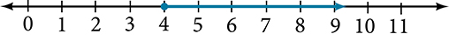

We can use **set-builder notation**: $\left\{x|x\ge 4\right\},$ which translates to “all real numbers *x*such that *x*is greater than or equal to 4.” Notice that braces are used to indicate a set.
The third method is **interval notation**, in which solution sets are indicated with parentheses or brackets. The solutions to $x\ge 4$ are represented as $\left[4,\infty \right).$ This is perhaps the most useful method, as it applies to concepts studied later in this course and to other higher-level math courses.
The main concept to remember is that parentheses represent solutions greater or less than the number, and brackets represent solutions that are greater than or equal to or less than or equal to the number. Use parentheses to represent infinity or negative infinity, since positive and negative infinity are not numbers in the usual sense of the word and, therefore, cannot be “equaled.” A few examples of an **interval**, or a set of numbers in which a solution falls, are $\left[\mathrm{-2},6\right),$ or all numbers between $\mathrm{-2}$ and $6,$ including $\mathrm{-2},$ but not including $6;$ $\left(-1,0\right),$ all real numbers between, but not including $\mathrm{-1}$ and $0;$ and $\left(-\infty ,1\right],$ all real numbers less than and including $1.$  outlines the possibilities.

| Set Indicated | Set-Builder Notation | Interval Notation |
| :--- | :--- | :--- |
| All real numbers between *a*and *b*, but not including *a*or *b* | $\left\{x|a<x<b\right\}$ | $\left(a,b\right)$ |
| All real numbers greater than *a*, but not including *a* | $\left\{x|x>a\right\}$ | $\left(a,\infty \right)$ |
| All real numbers less than *b*, but not including *b* | $\left\{x|x<b\right\}$ | $\left(-\infty ,b\right)$ |
| All real numbers greater than *a*, including *a* | $\left\{x|x\ge a\right\}$ | $\left[a,\infty \right)$ |
| All real numbers less than *b*, including *b* | $\left\{x|x\le b\right\}$ | $\left(-\infty ,b\right]$ |
| All real numbers between *a*and*b*, including *a* | $\left\{x|a\le x<b\right\}$ | $\left[a,b\right)$ |
| All real numbers between *a* and *b*, including *b* | $\left\{x|a<x\le b\right\}$ | $\left(a,b\right]$ |
| All real numbers between *a*and *b*, including *a*and *b* | $\left\{x|a\le x\le b\right\}$ | $\left[a,b\right]$ |
| All real numbers less than *a* or greater than *b* | $\left\{x|x<a\phantom{\rule{0.5em}{0ex}}\text{or}\phantom{\rule{0.5em}{0ex}}x>b\right\}$ | $\left(-\infty ,a\right)\cup \left(b,\infty \right)$ |
| All real numbers | $\left\{x|x\phantom{\rule{0.8}{0ex}}\text{is all real numbers}\right\}$ | $\left(-\infty ,\infty \right)$ |

  1. **Using Interval Notation to Express All Real Numbers Greater Than or Equal to *a***     Use interval notation to indicate all real numbers greater than or equal to $\mathrm{-2.}$

Solution

Use a bracket on the left of $\mathrm{-2}$ and parentheses after infinity: $\left[\mathrm{-2},\infty \right).$ The bracket indicates that $\mathrm{-2}$ is included in the set with all real numbers greater than $\mathrm{-2}$ to infinity.

  

>
>   Try It
>   2. Use interval notation to indicate all real numbers between and including $\mathrm{-3}$ and $5.$
>
> 

> 
Solution

>
> $\left[\mathrm{-3},5\right]$
> 

>
>
>

  3. **Using Interval Notation to Express All Real Numbers Less Than or Equal to *a*or Greater Than or Equal to *b***     Write the interval expressing all real numbers less than or equal to $\mathrm{-1}$ or greater than or equal to $1.$

Solution

We have to write two intervals for this example. The first interval must indicate all real numbers less than or equal to 1. So, this interval begins at $-\infty$ and ends at $\mathrm{-1},$ which is written as $\left(-\infty ,\mathrm{-1}\right].$ 

  The second interval must show all real numbers greater than or equal to $1,$ which is written as $\left[1,\infty \right).$ However, we want to combine these two sets. We accomplish this by inserting the union symbol, $\cup ,$ between the two intervals.
$$
\left(-\infty ,\mathrm{-1}\right]\cup \left[1,\infty \right)
$$

  

>
>   Try It
>   4. Express all real numbers less than $\mathrm{-2}$ or greater than or equal to 3 in interval notation.
>
> 

> 
Solution

>
> $\left(-\infty ,\mathrm{-2}\right)\cup \left[3,\infty \right)$
> 

>
>
>

  
# Using the Properties of Inequalities
When we work with inequalities, we can usually treat them similarly to but not exactly as we treat equalities. We can use the **addition property** and the **multiplication property** to help us solve them. The one exception is when we multiply or divide by a negative number; doing so reverses the inequality symbol.

>
>   A General Note
>
>
> **Properties of Inequalities**
>
>
>   $$
> \begin{array}{ll}Addition\phantom{\rule{0.8}{0ex}}\text{}Property  & \phantom{\rule{2em}{0ex}}\text{If}\phantom{\rule{0.8}{0ex}}a<b,\phantom{\rule{0.8}{0ex}}\text{then}\phantom{\rule{0.8}{0ex}}a+c<b+c.  \\   &   \\ Multiplication\phantom{\rule{0.8}{0ex}}\text{}Property  & \phantom{\rule{2em}{0ex}}\text{If}\phantom{\rule{0.8}{0ex}}a<b\phantom{\rule{0.5em}{0ex}}\text{and}\phantom{\rule{0.5em}{0ex}}c>0,\phantom{\rule{0.8}{0ex}}\text{then}\phantom{\rule{0.8}{0ex}}ac<bc.  \\   & \phantom{\rule{2em}{0ex}}\text{If}\phantom{\rule{0.8}{0ex}}a<b\phantom{\rule{0.5em}{0ex}}\text{and}\phantom{\rule{0.5em}{0ex}}c<0,\phantom{\rule{0.8}{0ex}}\text{then}\phantom{\rule{0.8}{0ex}}ac>bc.  \end{array}
> $$
>   These properties also apply to $a\le b,$ $a>b,$ and $a\ge b.$ 
>
>

5. **Demonstrating the Addition Property**     Illustrate the addition property for inequalities by solving each of the following:    ⓐ $x-15<4$    ⓑ  $6\ge x-1$    ⓒ  $x+7>9$

Solution

The addition property for inequalities states that if an inequality exists, adding or subtracting the same number on both sides does not change the inequality.

  
ⓐ $\begin{array}{ll}\phantom{\rule{2em}{0ex}}x-15<4  &   \\ x-15+15<4+15  & \phantom{\rule{2em}{0ex}}\text{Add 15 to both sides}.  \\ \phantom{\rule{4em}{0ex}}x<19  &   \end{array}$ 
  ⓑ $\begin{array}{ll}\phantom{\rule{2em}{0ex}}6\ge x-1  &   \\ 6+1\ge x-1+1  & \phantom{\rule{4em}{0ex}}\text{Add 1 to both sides}.  \\ \phantom{\rule{2em}{0ex}}7\ge x  &   \end{array}$ 
  ⓒ $\begin{array}{ll}\phantom{\rule{2em}{0ex}}x+7>9  &   \\ x+7-7>9-7  & \phantom{\rule{4em}{0ex}}\text{Subtract 7 from both sides}.  \\ \phantom{\rule{3em}{0ex}}x>2  &   \end{array}$

>
>   Try It
>   6. Solve: $3x\mathrm{-2}<1.$
>
> 

> 
Solution

>
> $x<1$
> 

>
>
>

7. **Demonstrating the Multiplication Property**     Illustrate the multiplication property for inequalities by solving each of the following:    ⓐ $3x<6$    ⓑ $\mathrm{-2}x-1\ge 5$    ⓒ $5-x>10$

Solution

ⓐ $\begin{array}{l}\phantom{\rule{1.5em}{0ex}}3x<6  \\ \frac{1}{3}(3x)<(6)\frac{1}{3}  \\ \phantom{\rule{2em}{0ex}}x<2  \end{array}$ 
  ⓑ $\begin{array}{ll}\phantom{\rule{1em}{0ex}}-2x-1\ge 5  &   \\ \phantom{\rule{3em}{0ex}}-2x\ge 6  &   \\ \left(-\frac{1}{2}\right)(-2x)\ge (6)\left(-\frac{1}{2}\right)  & \phantom{\rule{2em}{0ex}}\text{Multiply by}-\frac{1}{2}.  \\ \phantom{\rule{4em}{0ex}}x\le -3  & \phantom{\rule{2em}{0ex}}\text{Reverse the inequality}.  \end{array}$ 
  ⓒ $\begin{array}{ll}\phantom{\rule{2.5em}{0ex}}5-x>10  &   \\ \phantom{\rule{3.5em}{0ex}}-x>5  &   \\ (-1)(-x)>(5)(-1)  & \phantom{\rule{2em}{0ex}}\text{Multiply by}-1.  \\ \phantom{\rule{4.5em}{0ex}}x<-5  & \phantom{\rule{2em}{0ex}}\text{Reverse the inequality}.  \end{array}$

  

>
>   Try It
>   8. Solve: $4x+7\ge 2x-3.$
>
> 

> 
Solution

>
> $x\ge \mathrm{-5}$
> 

>
>
>

  
# Solving Inequalities in One Variable Algebraically
As the examples have shown, we can perform the same operations on both sides of an inequality, just as we do with equations; we combine like terms and perform operations. To solve, we isolate the variable.

  9. **Solving an Inequality Algebraically**     Solve the inequality: $13-7x\ge 10x-4.$

Solution

Solving this inequality is similar to solving an equation up until the last step.

  $$
\begin{array}{ll}\phantom{\rule{.5em}{0ex}}13-7x\ge 10x-4  &   \\ 13-17x\ge \mathrm{-4}  & \phantom{\rule{2em}{0ex}}\text{Move variable terms to one side of the inequality}.  \\ \phantom{\rule{1.8em}{0ex}}\mathrm{-17}x\ge \mathrm{-17}  & \phantom{\rule{2em}{0ex}}\text{Isolate the variable term}.  \\ \phantom{\rule{3.1em}{0ex}}x\le 1  & \phantom{\rule{2em}{0ex}}\text{Dividing both sides by}\mathrm{-17}\phantom{\rule{0.8}{0ex}}\text{reverses the inequality}.  \end{array}
$$
  The solution set is given by the interval $\left(-\infty ,1\right],$ or all real numbers less than and including 1.

  

>
>   Try It
>   10. Solve the inequality and write the answer using interval notation: $-x+4<\frac{1}{2}x+1.$
>
> 

> 
Solution

>
> $\left(2,\infty \right)$
> 

>
>
>

  11. **Solving an Inequality with Fractions**     Solve the following inequality and write the answer in interval notation: $-\frac{3}{4}x\ge -\frac{5}{8}+\frac{2}{3}x.$

Solution

We begin solving in the same way we do when solving an equation.

  $$
\begin{array}{ll}\phantom{\rule{2.8em}{0ex}}-\frac{3}{4}x\ge -\frac{5}{8}+\frac{2}{3}x  &   \\ \phantom{\rule{.9em}{0ex}}-\frac{3}{4}x-\frac{2}{3}x\ge -\frac{5}{8}  & \phantom{\rule{2em}{0ex}}\text{Put variable terms on one side}.  \\ -\frac{9}{12}x-\frac{8}{12}x\ge -\frac{5}{8}  & \phantom{\rule{2em}{0ex}}\text{Write fractions with common denominator}.  \\ \phantom{\rule{2.5em}{0ex}}-\frac{17}{12}x\ge -\frac{5}{8}  &   \\ \phantom{\rule{4.2em}{0ex}}x\le -\frac{5}{8}\left(-\frac{12}{17}\right)  & \phantom{\rule{2em}{0ex}}\text{Multiplying by a negative number reverses the inequality}.  \\ \phantom{\rule{4.2em}{0ex}}x\le \frac{15}{34}  &   \end{array}
$$
  The solution set is the interval $\left(-\infty ,\frac{15}{34}\right].$

  

>
>   Try It
>   12. Solve the inequality and write the answer in interval notation: $-\frac{5}{6}x\le \frac{3}{4}+\frac{8}{3}x.$
>
> 

> 
Solution

>
> $\left[-\frac{3}{14},\infty \right)$
> 

>
>
>

  
# Understanding Compound Inequalities
A **compound inequality** includes two inequalities in one statement. A statement such as $4<x\le 6$ means $4<x$ and $x\le 6.$ There are two ways to solve compound inequalities: separating them into two separate inequalities or leaving the compound inequality intact and performing operations on all three parts at the same time. We will illustrate both methods.

  13. **Solving a Compound Inequality**     Solve the compound inequality: $3\le 2x+2<6.$

Solution

The first method is to write two separate inequalities: $3\le 2x+2$ and $2x+2<6.$ We solve them independently.

  $$
\begin{array}{lll}3\le 2x+2  & \phantom{\rule{2em}{0ex}}\text{and}\phantom{\rule{2em}{0ex}}  & 2x+2<6  \\ 1\le 2x  &   & \phantom{\rule{2em}{0ex}}2x<4  \\ \frac{1}{2}\le x  &   & \phantom{\rule{2em}{0ex}}x<2  \end{array}
$$
  Then, we can rewrite the solution as a compound inequality, the same way the problem began.

  $$
\frac{1}{2}\le x<2
$$ 
  In interval notation, the solution is written as $\left[\frac{1}{2},2\right).$ 

  The second method is to leave the compound inequality intact, and perform solving procedures on the three parts at the same time.

  $$
\begin{array}{ll}3\le 2x+2<6  &   \\ 1\le 2x<4  & \phantom{\rule{2em}{0ex}}\text{Isolate the variable term, and subtract 2 from all three parts}.  \\ \frac{1}{2}\le x<2  & \phantom{\rule{2em}{0ex}}\text{Divide through all three parts by 2}.  \end{array}
$$
  We get the same solution: $\left[\frac{1}{2},2\right).$

  

>
>   Try It
>   14. Solve the compound inequality: $4<2x-8\le 10.$
>
> 

> 
Solution

>
> $6<x\le 9\text{}\phantom{\rule{0.5em}{0ex}}\phantom{\rule{0.5em}{0ex}}\text{or}\phantom{\rule{0.5em}{0ex}}\phantom{\rule{0.5em}{0ex}}\left(6,9\right]$
> 

>
>
>

  15. **Solving a Compound Inequality with the Variable in All Three Parts**     Solve the compound inequality with variables in all three parts: $3+x>7x-2>5x-10.$

Solution

Let's try the first method. Write two inequalities*:*
$$
\begin{array}{lll}3+x>7x-2  & \phantom{\rule{2em}{0ex}}\text{and}\phantom{\rule{2em}{0ex}}  & 7x-2>5x-10  \\ \phantom{\rule{1.2em}{0ex}}3>6x-2  &   & 2x-2>\mathrm{-10}  \\ \phantom{\rule{1.2em}{0ex}}5>6x  &   & \phantom{\rule{1.8em}{0ex}}2x>\mathrm{-8}  \\ \phantom{\rule{1.2em}{0ex}}\frac{5}{6}>x  &   & \phantom{\rule{2.5em}{0ex}}x>\mathrm{-4}  \\ \phantom{\rule{1.3em}{0ex}}x<\frac{5}{6}  &   & \phantom{\rule{1.5em}{0ex}}\mathrm{-4}<x  \end{array}
$$ The solution set is $\mathrm{-4}<x<\frac{5}{6}$ or in interval notation $\left(\mathrm{-4},\frac{5}{6}\right).$ Notice that when we write the solution in interval notation, the smaller number comes first. We read intervals from left to right, as they appear on a number line. See *.*

  

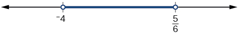

  

>
>   Try It
>   16. Solve the compound inequality: $3y<4-5y<5+3y.$
>
> 

> 
Solution

>
> $\left(-\frac{1}{8},\frac{1}{2}\right)$
> 

>
>
>

  
# Solving Absolute Value Inequalities
As we know, the absolute value of a quantity is a positive number or zero. From the origin, a point located at $\left(-x,0\right)$ has an absolute value of $x,$ as it is *x*units away. Consider absolute value as the distance from one point to another point. Regardless of direction, positive or negative, the distance between the two points is represented as a positive number or zero.
An **absolute value inequality** is an equation of the form
$$
\left|A\right|<B,\phantom{\rule{0.5em}{0ex}}\left|A\right|\le B,\phantom{\rule{0.5em}{0ex}}\phantom{\rule{0.5em}{0ex}}\left|A\right|>B,\phantom{\rule{0.5em}{0ex}}\text{or}\phantom{\rule{0.5em}{0ex}}\phantom{\rule{0.5em}{0ex}}\left|A\right|\ge B,
$$ Where *A*, and sometimes *B*, represents an algebraic expression dependent on a variable *x.*Solving the inequality means finding the set of all $x$ *-*values that satisfy the problem. Usually this set will be an interval or the union of two intervals and will include a range of values.
There are two basic approaches to solving absolute value inequalities: graphical and algebraic. The advantage of the graphical approach is we can read the solution by interpreting the graphs of two equations. The advantage of the algebraic approach is that solutions are exact, as precise solutions are sometimes difficult to read from a graph.
Suppose we want to know all possible returns on an investment if we could earn some amount of money within $200 of $600. We can solve algebraically for the set of *x-*values such that the distance between $x$ and 600 is less than or equal to 200. We represent the distance between $x$ and 600 as $\left|x-600\right|,$ and therefore, $\left|x-600\right|\le 200$ or
$$
\begin{array}{c}\mathrm{-200}\le x-600\le 200\\ \mathrm{-200}+600\le x-600+600\le 200+600\\ 400\le x\le 800\end{array}
$$
  This means our returns would be between $400 and $800.
To solve absolute value inequalities, just as with absolute value equations, we write two inequalities and then solve them independently.

>
>   A General Note
>
>
> **Absolute Value Inequalities**
>
>
>   For an algebraic expression *X,* and $k>0,$ an **absolute value inequality** is an inequality of the form
>
>   $$
> \begin{array}{l}\left|X\right|<k\phantom{\rule{0.8}{0ex}}\text{is equivalent to\}-k<X<k  \\ \left|X\right|>k\phantom{\rule{0.8}{0ex}}\text{is equivalent to\}X<-k\phantom{\rule{0.8}{0ex}}\text{or\}X>k  \end{array}
> $$
>   These statements also apply to $\left|X\right|\le k$ and $\left|X\right|\ge k.$ 

  17. **Determining a Number within a Prescribed Distance**     Describe all values $x$ within a distance of 4 from the number 5.

Solution

We want the distance between $x$ and 5 to be less than or equal to 4. We can draw a number line, such as in *,* to represent the condition to be satisfied.

  

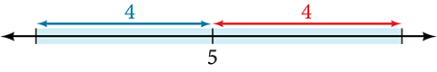

  The distance from $x$ to 5 can be represented using an absolute value symbol, $\left|x-5\right|.$ Write the values of $x$ that satisfy the condition as an absolute value inequality.
$\left|x-5\right|\le 4$ 
  We need to write two inequalities as there are always two solutions to an absolute value equation.

  $\begin{array}{lll}x-5\le 4  & \phantom{\rule{2em}{0ex}}\text{and}\phantom{\rule{2em}{0ex}}  & x-5\ge -4  \\ \phantom{\rule{1.8em}{0ex}}x\le 9  &   & \phantom{\rule{1.8em}{0ex}}x\ge 1  \end{array}$
  If the solution set is $x\le 9$ and $x\ge 1,$ then the solution set is an interval including all real numbers between and including 1 and 9.

  So $\left|x-5\right|\le 4$ is equivalent to $\left[1,9\right]$ in interval notation.

  

>
>   Try It
>   18. Describe all *x-*values within a distance of 3 from the number 2.
>
> 

> 
Solution

>
> $\left|x\mathrm{-2}\right|\le 3$
> 

>
>
>

  19. **Solving an Absolute Value Inequality**     Solve $|x-1|\le 3$ .

Solution

$\begin{array}{l}|x-1|\le 3  \\   \\ \mathrm{-3}\le x-1\le 3  \\   \\ \mathrm{-2}\le x\le 4  \\   \\ [\mathrm{-2},4]  \end{array}$

  

  20. **Using a Graphical Approach to Solve Absolute Value Inequalities**     Given the equation $y=-\frac{1}{2}|4x-5|+3,$ determine the *x*-values for which the *y*-values are negative.

Solution

We are trying to determine where $y<0,$ which is when $-\frac{1}{2}|4x-5|+3<0.$ We begin by isolating the absolute value.
$$
\begin{array}{ll}-\frac{1}{2}|4x-5|<-3  & \phantom{\rule{2em}{0ex}}\text{Multiply both sides by \u20132, and reverse the inequality}.  \\ \phantom{\rule{1.5em}{0ex}}|4x-5|>6  &   \end{array}
$$
  Next, we solve for the equality $|4x-5|=6.$ 
$$
\begin{array}{lll}4x-5=6  &   & 4x-5=-6  \\ \phantom{\rule{1.9em}{0ex}}4x=11  & \phantom{\rule{2em}{0ex}}\text{or}\phantom{\rule{2em}{0ex}}  & \phantom{\rule{1.9em}{0ex}}4x=-1  \\ \phantom{\rule{2em}{0ex}}x=\frac{11}{4}  &   & \phantom{\rule{2em}{0ex}}x=-\frac{1}{4}  \end{array}
$$
  Now, we can examine the graph to observe where the *y-*values are negative. We observe where the branches are below the *x-*axis. Notice that it is not important exactly what the graph looks like, as long as we know that it crosses the horizontal axis at $x=-\frac{1}{4}$ and $x=\frac{11}{4},$ and that the graph opens downward. See *.*

  

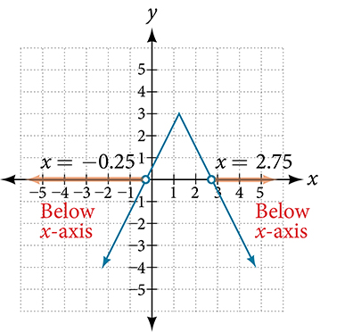

  

>
>   Try It
>
>   21. Solve $-2\left|k-4\right|\le -6.$
>
> 

> 
Solution

>
> $k\le 1$ or $k\ge 7;$ in interval notation, this would be $(-\infty ,1]\cup [7,\infty ).$ 
>
>
>
> 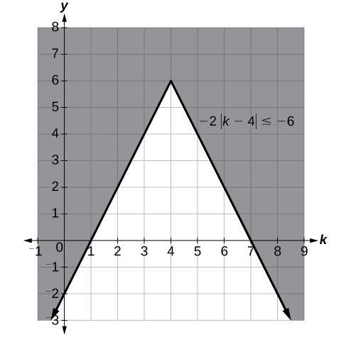
> 

>
>
>

>
>   Media
>   Access these online resources for additional instruction and practice with linear inequalities and absolute value inequalities.
>
>   Interval notation
>   How to solve linear inequalities
>   How to solve an inequality
>   Absolute value equations
>   Compound inequalities
>   Absolute value inequalities
>

  
# Key Concepts

  Interval notation is a method to indicate the solution set to an inequality. Highly applicable in calculus, it is a system of parentheses and brackets that indicate what numbers are included in a set and whether the endpoints are included as well. See  and *.*
  Solving inequalities is similar to solving equations. The same algebraic rules apply, except for one: multiplying or dividing by a negative number reverses the inequality. See *,* , , and *.*
  Compound inequalities often have three parts and can be rewritten as two independent inequalities. Solutions are given by boundary values, which are indicated as a beginning boundary or an ending boundary in the solutions to the two inequalities. See  and .
  Absolute value inequalities will produce two solution sets due to the nature of absolute value. We solve by writing two equations: one equal to a positive value and one equal to a negative value. See  and *.*
  Absolute value inequalities can also be solved by graphing. At least we can check the algebraic solutions by graphing, as we cannot depend on a visual for a precise solution. See .
  
  
# Section Exercises

## Verbal
1. When solving an inequality, explain what happened from Step 1 to Step 2:     $\begin{array}{ll}\text{Step 1}  & \phantom{\rule{2em}{0ex}}-2x>6  \\ \text{Step 2}  & \phantom{\rule{3em}{0ex}}x<-3  \end{array}$

Solution

When we divide both sides by a negative it changes the sign of both sides so the sense of the inequality sign changes.

2. When solving an inequality, we arrive at:     $\begin{array}{l}x+2<x+3  \\ \phantom{\rule{1.2em}{0ex}}2<3  \end{array}$    Explain what our solution set is.

3. When writing our solution in interval notation, how do we represent all the real numbers?

Solution

$\left(-\infty ,\infty \right)$

4. When solving an inequality, we arrive at:     $\begin{array}{l}x+2>x+3  \\ \phantom{\rule{1.2em}{0ex}}2>3  \end{array}$    Explain what our solution set is.

5. Describe how to graph $y=\left|x-3\right|$

Solution

We start by finding the *x*-intercept, or where the function = 0. Once we have that point, which is $(3,0),$ we graph to the right the straight line graph $y=x\mathrm{-3},$ and then when we draw it to the left we plot positive *y* values, taking the absolute value of them.

## Algebraic
For the following exercises, solve the inequality. Write your final answer in interval notation.
6. $4x-7\le 9$

7. $3x+2\ge 7x-1$

Solution

$\left(-\infty ,\frac{3}{4}\right]$

8. $\mathrm{-2}x+3>x-5$

9. $4(x+3)\ge 2x-1$

Solution

$\left[-\frac{13}{2},\infty \right)$

10. $-\frac{1}{2}x\le -\frac{5}{4}+\frac{2}{5}x$

11. $\mathrm{-5}(x-1)+3>3x-4-4x$

Solution

$\left(-\infty ,3\right)$

12. $\mathrm{-3}(2x+1)>\mathrm{-2}(x+4)$

13. $\frac{x+3}{8}-\frac{x+5}{5}\ge \frac{3}{10}$

Solution

$\left(-\infty ,-\frac{37}{3}\right]$

14. $\frac{x-1}{3}+\frac{x+2}{5}\le \frac{3}{5}$

For the following exercises, solve the inequality involving absolute value. Write your final answer in interval notation.
15. $\left|x+9\right|\ge \mathrm{-6}$

Solution

All real numbers $\left(-\infty ,\infty \right)$

16. $\left|2x+3\right|<7$

17. $|3x-1|>11$

Solution

$\left(-\infty ,-\frac{10}{3}\right)\cup \left(4,\infty \right)$

18. $\left|2x+1\right|+1\le 6$

19. $\left|x-2\right|+4\ge 10$

Solution

$\left(-\infty ,\mathrm{-4}\right]\cup \left[8,+\infty \right)$

20. $\left|\mathrm{-2}x+7\right|\le 13$

21. $|x-7|<\mathrm{-4}$

Solution

No solution

22. $|x-20|>\mathrm{-1}$

23. $\left|\frac{x-3}{4}\right|<2$

Solution

$\left(\mathrm{-5},11\right)$

For the following exercises, describe all the *x*-values within or including a distance of the given values.
24. Distance of 5 units from the number 7

25. Distance of 3 units from the number 9

Solution

$\left[6,12\right]$

26. Distance of 10 units from the number 4

27. Distance of 11 units from the number 1

Solution

$\left[\mathrm{-10},12\right]$

For the following exercises, solve the compound inequality. Express your answer using inequality signs, and then write your answer using interval notation.
28. $\mathrm{-4}<3x+2\le 18$

29. $3x+1>2x-5>x-7$

Solution

$\begin{array}{ll}x>-6\phantom{\rule{0.5em}{0ex}}\text{and}\phantom{\rule{0.5em}{0ex}}x>-2  & \phantom{\rule{2em}{0ex}}\text{Take the intersection of two sets}.  \\ x>-2,\text{\hspace{1em}}(-2,+\infty )  &   \end{array}$

30. $3y<5-2y<7+y$

31. $2x-5<\mathrm{-11}\phantom{\rule{0.8}{0ex}}\text{or}\phantom{\rule{0.8}{0ex}}5x+1\ge 6$

Solution

$\begin{array}{ll}x<-3\text{\hspace{1em}}\mathrm{or}\text{\hspace{1em}}x\ge 1  & \phantom{\rule{2em}{0ex}}\text{Take the union of the two sets}.  \\ (-\infty ,-3){{{\displaystyle \cup}}^{\text{}}}^{\text{}}[1,\infty )  &   \end{array}$

32. $x+7<x+2$

## Graphical
For the following exercises, graph the function. Observe the points of intersection and shade the *x*-axis representing the solution set to the inequality. Show your graph and write your final answer in interval notation.
33. $|x-1|>2$

Solution

$\left(-\infty ,\mathrm{-1}\right)\cup \left(3,\infty \right)$ 

  

34. $\left|x+3\right|\ge 5$

35. $\left|x+7\right|\le 4$

Solution

$\left[\mathrm{-11},\mathrm{-3}\right]$ 

  
  

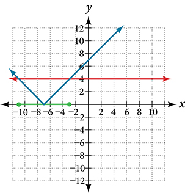

36. $\left|x-2\right|<7$

37. $\left|x-2\right|<0$

Solution

It is never less than zero. No solution.

  
  

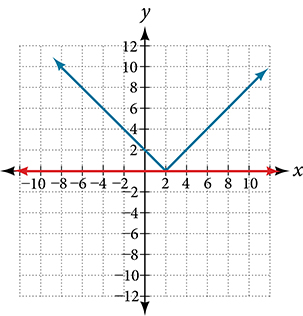

For the following exercises, graph both straight lines (left-hand side being y1 and right-hand side being y2) on the same axes. Find the point of intersection and solve the inequality by observing where it is true comparing the *y*-values of the lines.
38. $x+3<3x-4$

39. $x-2>2x+1$

Solution

Where the blue line is above the orange line; point of intersection is $x=-3.$ 

   $\left(-\infty ,\mathrm{-3}\right)$ 

  
  

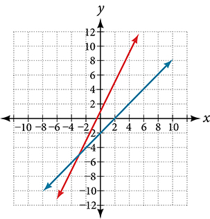

40. $x+1>x+4$

41. $\frac{1}{2}x+1>\frac{1}{2}x-5$

Solution

Where the blue line is above the orange line; always. All real numbers.

   $(-\infty ,-\infty )$
  

  
  

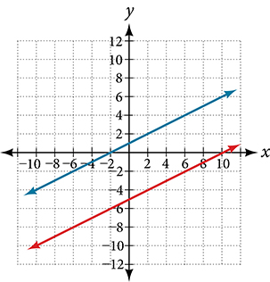

42. $4x+1<\frac{1}{2}x+3$

## Numeric
For the following exercises, write the set in interval notation.
43. $\{x|\mathrm{-1}<x<3\}$

Solution

$\left(\mathrm{-1},3\right)$

44. $\{x|x\ge 7\}$

45. $\{x|x<4\}$

Solution

$\left(-\infty ,4\right)$

46. $\{\phantom{\rule{0.5em}{0ex}}x|\phantom{\rule{0.5em}{0ex}}x\phantom{\rule{0.8}{0ex}}\text{is all real numbers}\}$

For the following exercises, write the interval in set-builder notation.
47. $\left(-\infty ,6\right)$

Solution

$\{x|x<6\}$

48. $\left(4,\infty \right)$

49. $[\mathrm{-3},5)$

Solution

$\{x|\mathrm{-3}\le x<5\}$

50. $[\mathrm{-4},1]\cup [9,\infty )$

For the following exercises, write the set of numbers represented on the number line in interval notation.
51. 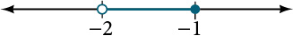

Solution

$\left(\mathrm{-2},1\right]$

52. 

53. 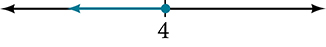

Solution

$\left(-\infty ,4\right]$

## Technology
For the following exercises, input the left-hand side of the inequality as a Y1 graph in your graphing utility. Enter y2 = the right-hand side. Entering the absolute value of an expression is found in the MATH menu, Num, 1:abs(. Find the points of intersection, recall (2nd CALC 5:intersection, 1st curve, enter, 2nd curve, enter, guess, enter). Copy a sketch of the graph and shade the *x*-axis for your solution set to the inequality. Write final answers in interval notation.
54. $\left|x+2\right|-5<2$

55. $\frac{-1}{2}\left|x+2\right|<4$

Solution

Where the blue is below the orange; always. All real numbers. $(-\infty ,+\infty ).$ 

  
  

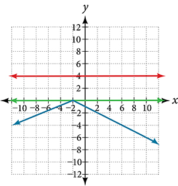

56. $\left|4x+1\right|-3>2$

57. $\left|x-4\right|<3$

Solution

Where the blue is below the orange; $\left(1,7\right).$ 

  
  

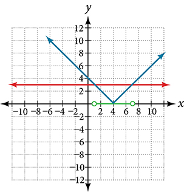

58. $\left|x+2\right|\ge 5$

## Extensions
59. Solve $\left|3x+1\right|=\left|2x+3\right|$

Solution

$x=2,\frac{-4}{5}$

60. Solve ${x}^{2}-x>12$

61. $\frac{x-5}{x+7}\le 0,$ $x\ne \mathrm{-7}$

Solution

$\left(\mathrm{-7},5\right]$

62. $p=-{x}^{2}+130x-3000$ is a profit formula for a small business. Find the set of *x*-values that will keep this profit positive.

## Real-World Applications
63. In chemistry the volume for a certain gas is given by $V=20T,$ where *V* is measured in cc and *T* is temperature in ºC. If the temperature varies between 80ºC and 120ºC, find the set of volume values.

Solution

$\begin{array}{l}80\le T\le 120\\ 1,600\le 20T\le 2,400\end{array}$ 

   $\left[1,600,2,400\right]$

64. A basic cellular package costs $20/mo. for 60 min of calling, with an additional charge of $.30/min beyond that time.. The cost formula would be $$ \phantom{\rule{0.5em}{0ex}}C=20+.30(x-60). $$ If you have to keep your bill no greater than $50, what is the maximum calling minutes you can use?

  
# Chapter Review Exercises

## The Rectangular Coordinate Systems and Graphs
For the following exercises, find the *x*-intercept and the *y*-intercept without graphing.
22. $4x-3y=12$

Solution

*x*-intercept: $\left(3,0\right);$ *y*-intercept: $\left(0,\mathrm{-4}\right)$

23. $2y-4=3x$

For the following exercises, solve for *y* in terms of *x*, putting the equation in slope–intercept form.
24. $5x=3y-12$

Solution

$y=\frac{5}{3}x+4$

25. $2x-5y=7$

For the following exercises, find the distance between the two points.
26. $\left(\mathrm{-2},5\right)\left(4,\mathrm{-1}\right)$

Solution

$\sqrt{72}=6\sqrt{2}$

27. $\left(\mathrm{-12},\mathrm{-3}\right)\left(\mathrm{-1},5\right)$

28. Find the distance between the two points $(\mathrm{-71,432})$ and $\text{(511,218)}$ using your calculator, and round your answer to the nearest thousandth.

Solution

$620.097$

For the following exercises, find the coordinates of the midpoint of the line segment that joins the two given points.
29. $\left(\mathrm{-1},5\right)$ and $\left(4,6\right)$

30. $\left(\mathrm{-13},5\right)$ and $\left(17,18\right)$

Solution

midpoint is $\left(2,\frac{23}{2}\right)$

For the following exercises, construct a table and graph the equation by plotting at least three points.
31. $y=\frac{1}{2}x+4$

32. $4x-3y=6$

Solution

| *x* | *y* |
| :--- | :--- |
| 0 | −2 |
| 3 | 2 |
| 6 | 6 |

  
  

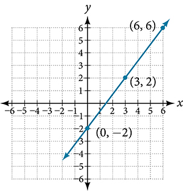

## Linear Equations in One Variable
For the following exercises, solve for $x.$ 
33. $5x+2=7x-8$

34. $3(x+2)-10=x+4$

Solution

$x=4$

35. $7x-3=5$

36. $12-5(x+1)=2x-5$

Solution

$x=\frac{12}{7}$

37. $\frac{2x}{3}-\frac{3}{4}=\frac{x}{6}+\frac{21}{4}$

For the following exercises, solve for $x.$ State all *x*-values that are excluded from the solution set.
38. $\frac{x}{{x}^{2}-9}+\frac{4}{x+3}=\frac{3}{{x}^{2}-9}$ $x\ne 3,\mathrm{-3}$

Solution

No solution

39. $\frac{1}{2}+\frac{2}{x}=\frac{3}{4}$

For the following exercises, find the equation of the line using the point-slope formula.
40. Passes through these two points: $\left(\mathrm{-2},1\right)\text{,}\left(4,2\right).$

Solution

$y=\frac{1}{6}x+\frac{4}{3}$

41. Passes through the point $\left(-3,4\right)$ and has a slope of $-\frac{1}{3}.$

42. Passes through the point $\left(-3,4\right)$ and is parallel to the graph $y=\frac{2}{3}x+5.$

Solution

$y=\frac{2}{3}x+6$

43. Passes through these two points: $\left(5,1\right)\text{,}\left(5,7\right).$

## Models and Applications
For the following exercises, write and solve an equation to answer each question.
44. The number of male fish in the tank is five more than three times the number of females. If the total number of fish is 73, how many of each sex are in the tank?

Solution

females 17, males 56

45. A landscaper has 72 ft. of fencing to put around a rectangular garden. If the length is 3 times the width, find the dimensions of the garden.

46. A truck rental is $25 plus $.30/mi. Find out how many miles Ken traveled if his bill was $50.20.

Solution

84 mi

## Complex Numbers
For the following exercises, use the quadratic equation to solve.
47. ${x}^{2}-5x+9=0$

48. $2{x}^{2}+3x+7=0$

Solution

$x=-\frac{3}{4}\pm \frac{i\sqrt{47}}{4}$

For the following exercises, name the horizontal component and the vertical component.
49. $4-3i$

50. $\mathrm{-2}-i$

Solution

horizontal component $\mathrm{-2};$ vertical component $\mathrm{-1}$

For the following exercises, perform the operations indicated.
51. $\left(9-i\right)-\left(4-7i\right)$

52. $\left(2+3i\right)-\left(-5-8i\right)$

Solution

$7+11i$

53. $2\sqrt{-75}+3\sqrt{25}$

54. $\sqrt{-16}+4\sqrt{-9}$

Solution

$16i$

55. $-6i(i-5)$

56. ${(3-5i)}^{2}$

Solution

$\mathrm{-16}-30i$

57. $\sqrt{-4}\xb7\sqrt{-12}$

58. $\sqrt{-2}\left(\sqrt{-8}-\sqrt{5}\right)$

Solution

$\mathrm{-4}-i\sqrt{10}$

59. $\frac{2}{5-3i}$

60. $\frac{3+7i}{i}$

Solution

$x=7-3i$

## Quadratic Equations
For the following exercises, solve the quadratic equation by factoring.
61. $2{x}^{2}-7x-4=0$

62. $3{x}^{2}+18x+15=0$

Solution

$x=\mathrm{-1},\mathrm{-5}$

63. $25{x}^{2}-9=0$

64. $7{x}^{2}-9x=0$

Solution

$x=0,\frac{9}{7}$

For the following exercises, solve the quadratic equation by using the square-root property.
65. ${x}^{2}=49$

66. ${\left(x-4\right)}^{2}=36$

Solution

$x=10,\mathrm{-2}$

For the following exercises, solve the quadratic equation by completing the square.
67. ${x}^{2}+8x-5=0$

68. $4{x}^{2}+2x-1=0$

Solution

$x=\frac{-1\pm \sqrt{5}}{4}$

For the following exercises, solve the quadratic equation by using the quadratic formula. If the solutions are not real, state *No real solution*.
69. $2{x}^{2}-5x+1=0$

70. $15{x}^{2}-x-2=0$

Solution

$x=\frac{2}{5},\frac{-1}{3}$

For the following exercises, solve the quadratic equation by the method of your choice.
71. ${(x-2)}^{2}=16$

72. ${x}^{2}=10x+3$

Solution

$x=5\pm 2\sqrt{7}$

## Other Types of Equations
For the following exercises, solve the equations.
73. ${x}^{\frac{3}{2}}=27$

74. ${x}^{\frac{1}{2}}-4{x}^{\frac{1}{4}}=0$

Solution

$x=0,256$

75. $4{x}^{3}+8{x}^{2}-9x-18=0$

76. $3{x}^{5}-6{x}^{3}=0$

Solution

$x=0,\pm \sqrt{2}$

77. $\sqrt{x+9}=x-3$

78. $\sqrt{3x+7}+\sqrt{x+2}=1$

Solution

$x=\mathrm{-2}$

79. $\left|3x-7\right|=5$

80. $\left|2x+3\right|-5=9$

Solution

$x=\frac{11}{2},\frac{\mathrm{-17}}{2}$

## Linear Inequalities and Absolute Value Inequalities
For the following exercises, solve the inequality. Write your final answer in interval notation.
81. $5x-8\le 12$

82. $-2x+5>x-7$

Solution

$\left(-\infty ,4\right)$

83. $\frac{x-1}{3}+\frac{x+2}{5}\le \frac{3}{5}$

84. $\left|3x+2\right|+1\le 9$

Solution

$\left[\frac{-10}{3},2\right]$

85. $\left|5x-1\right|>14$

86. $\left|x-3\right|<\mathrm{-4}$

Solution

No solution

For the following exercises, solve the compound inequality. Write your answer in interval notation.
87. $\mathrm{-4}<3x+2\le 18$

88. $3y<1-2y<5+y$

Solution

$\left(-\frac{4}{3},\frac{1}{5}\right)$

For the following exercises, graph as described.
89. Graph the absolute value function and graph the constant function. Observe the points of intersection and shade the *x*-axis representing the solution set to the inequality. Show your graph and write your final answer in interval notation.      $\left|x+3\right|\ge 5$

90. Graph both straight lines (left-hand side being y1 and right-hand side being y2) on the same axes. Find the point of intersection and solve the inequality by observing where it is true comparing the *y*-values of the lines. See the interval where the inequality is true.     $x+3<3x-4$

Solution

Where the blue is below the orange line; point of intersection is $x=\mathrm{3.5.}$ 

   $\left(3.5,\infty \right)$ 

  
  

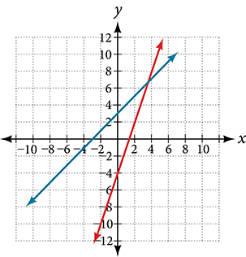

  
# Chapter Practice Test
91. Graph the following: $2y=3x+4.$

Solution

$y=\frac{3}{2}x+2$ 

  

| *x* | *y* |
| :--- | :--- |
| 0 | 2 |
| 2 | 5 |
| 4 | 8 |

  
  

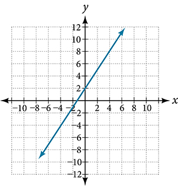

92. Find the *x-* and *y*-intercepts for the following: $2x-5y=6$

93. Find the *x-* and *y*-intercepts of this equation, and sketch the graph of the line using just the intercepts plotted.     $3x-4y=12$

Solution

$\left(0,\mathrm{-3}\right)$ $\left(4,0\right)$ 

  
  

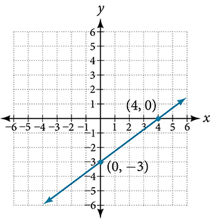

94. Find the exact distance between $\left(5,\mathrm{-3}\right)$ and $\left(-2,8\right).$ Find the coordinates of the midpoint of the line segment joining the two points.

95. Write the interval notation for the set of numbers represented by $\left\{x|x\le 9\right\}.$

Solution

$\left(-\infty ,9\right]$

96. Solve for *x*: $5x+8=3x-10.$

97. Solve for $x$: $3\left(2x-5\right)-3\left(x-7\right)=2x-9.$

Solution

$x=\mathrm{-15}$

98. Solve for *x*: $\frac{x}{2}+1=\frac{4}{x}$

99. Solve for *x*: $\frac{5}{x+4}=4+\frac{3}{x-2}.$

Solution

$x\ne \mathrm{-4},2;$ $x=\frac{-5}{2},1$

100. The perimeter of a triangle is 30 in. The longest side is 2 less than 3 times the shortest side and the other side is 2 more than twice the shortest side. Find the length of each side.

101. Solve for *x*. Write the answer in simplest radical form.     $\frac{{x}^{2}}{3}-x=-\frac{1}{2}$

Solution

$x=\frac{3\pm \sqrt{3}}{2}$

102. Solve: $3x-8\le 4.$

103. Solve: $\left|2x+3\right|<5.$

Solution

$\left(\mathrm{-4},1\right)$

104. Solve: $\left|3x-2\right|\ge 4.$

For the following exercises, find the equation of the line with the given information.
105. Passes through the points $\left(-4,2\right)$ and $\left(5,\mathrm{-3}\right).$

Solution

$y=\frac{\mathrm{-5}}{9}x-\frac{2}{9}$

106. Has an undefined slope and passes through the point $\left(4,3\right).$

107. Passes through the point $\left(2,1\right)$ and is perpendicular to $y=-\frac{2}{5}x+3.$

Solution

$y=\frac{5}{2}x-4$

108. Add these complex numbers: $(3-2i)+(4-i).$

109. Simplify: $\sqrt{\mathrm{-4}}+3\sqrt{\mathrm{-16}}.$

Solution

$14i$

110. Multiply: $5i\left(5-3i\right).$

111. Divide: $\frac{4-i}{2+3i}.$

Solution

$\frac{5}{13}-\frac{14}{13}i$

112. Solve this quadratic equation and write the two complex roots in $a+bi$ form: ${x}^{2}-4x+7=0.$

113. Solve: ${\left(3x-1\right)}^{2}-1=24.$

Solution

$x=2,\frac{-4}{3}$

114. Solve: ${x}^{2}-6x=13.$

115. Solve: $4{x}^{2}-4x-1=0$

Solution

$x=\frac{1}{2}\pm \frac{\sqrt{2}}{2}$

116. Solve: $\sqrt{x-7}=x-7$

117. Solve: $2+\sqrt{12-2x}=x$

Solution

$4$

118. Solve: ${\left(x-1\right)}^{\frac{2}{3}}=9$

For the following exercises, find the real solutions of each equation by factoring.
119. $2{x}^{3}-{x}^{2}-8x+4=0$

Solution

$x=\frac{1}{2},2,\mathrm{-2}$

120. ${\left(x+5\right)}^{2}-3\left(x+5\right)-4=0$

  
  
  **compound inequality**a problem or a statement that includes two inequalities
  **interval** an interval describes a set of numbers within which a solution falls
  **interval notation**a mathematical statement that describes a solution set and uses parentheses or brackets to indicate where an interval begins and ends
  **linear inequality** similar to a linear equation except that the solutions will include sets of numbers
