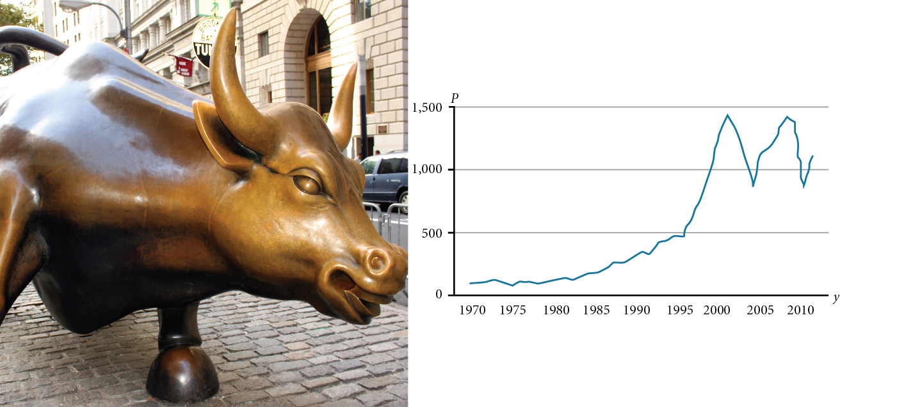

**Introduction to Functions**

  m51260
  

**Introduction to Functions**

  
  a7beff97-9a51-4130-9764-ee4b9fc1e973

    

Toward the end of the twentieth century, the values of stocks of Internet and technology companies rose dramatically. As a result, the Standard and Poor’s stock market average rose as well. The graph above tracks the value of that initial investment of just under $100 over the 40 years. It shows that an investment that was worth less than $500 until about 1995 skyrocketed up to about $1100 by the beginning of 2000. That five-year period became known as the “dot-com bubble” because so many Internet startups were formed. As bubbles tend to do, though, the dot-com bubble eventually burst. Many companies grew too fast and then suddenly went out of business. The result caused the sharp decline represented on the graph beginning at the end of 2000.
Notice, as we consider this example, that there is a definite relationship between the year and stock market average. For any year we choose, we can determine the corresponding value of the stock market average. In this chapter, we will explore these kinds of relationships and their properties.
