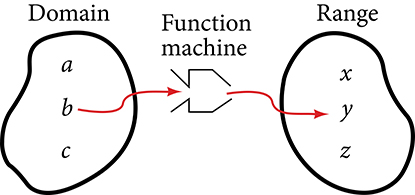
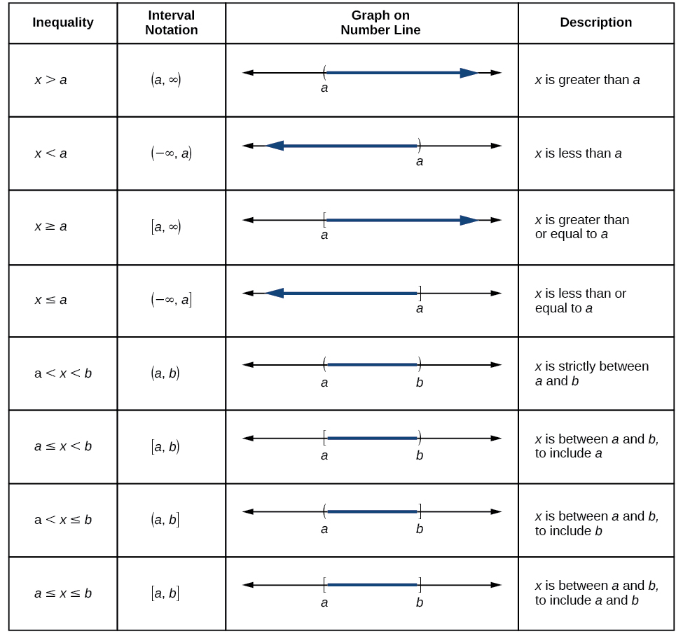

Domain and Range
================

  m51262
  
Domain and Range
================

  In this section, you will:

Find the domain of a function defined by an equation.
Graph piecewise-defined functions.

  562c3737-a93d-458c-98c0-a04f442f13bd

Learning Objectives
===================
Find the domain and range of a function (IA 3.5.1)
A **relation** is any set of ordered pairs, (*x*,*y*). A special type of relation, called a function, is studied extensively in mathematics. A **function** is a relation that assigns to each element in its domain exactly one element in the range. For each ordered pair in the relation, each *x*-value is matched with only one *y*-value.
When studying functions, it’s important to be able to identify potential input values, called the **domain**, and potential output values, called the **range**.
Find the domain of the following function: {(2, 10),(3, 10),(4, 20),(5, 30),(6, 40)}.

First identify the input values. The input value is the first coordinate in an ordered pair. There are no restrictions, as the ordered pairs are simply listed. The domain is the set of the first coordinates of the ordered pairs.

D: {2,3,4,5,6}

Notice here we are using set notation to represent this collection of input values.

A graph of a function can always help in identifying domain and range. When **graphing** basic functions, we can scan the *x*-axis just as we read in English from left to right to help determine the domain. We will scan the *y*-axis from bottom to top to help determine the range. So, in finding both domain and range, we scan axes from smallest to largest to see which values are defined. Typically, we will use **interval notation**, where you show the endpoints of defined sets using parentheses (endpoint not included) or brackets (endpoint is included) to express both the domain, D, and range, R, of a relation or function.

Find the domain and range from graphs
=====================================
Find the domain and range of the function f whose graph is shown below.

Scanning the x-axis from left to right helps us to see the graph is defined for x-values between –3 to 1, so the domain of f   is (−3,1]. (Note that open points translate to use of parentheses in interval notation, while included points translate to use of brackets in interval notation.)

Scanning the y-values from the bottom to top of the graph helps us to see the graph is defined for y-values between 0 to –4, so the range is [−4,0].

When working with functions expressed as an equation, the following steps can help to identify the domain.

Given a function written in equation form, find the domain.
===========================================================
Identify the input values.
Identify any restrictions on the input and exclude those values from the domain.
Write the domain in interval notation form, if possible.
Find the domain and range from equations
========================================

Find the domain of the function $f\left(x\right)={x}^{2}-3$

The input value, shown by the variable *x* in the equation, is squared and then the result is lowered by three. Any real number may be squared and then be lowered by three, so there are no restrictions on the domain of this function. The domain is the set of real numbers.

In interval notation form, the domain of *f* is (−∞,∞).

Activity: Restrictions on the domain of functions
=================================================
Without a calculator, complete the following:
$\frac{6}{0}=$ _____; $\frac{0}{0}=$ _____; $\frac{0}{6}=$ _____; $\sqrt{4}=$ _____; $\sqrt{\mathrm{\u20134}}=$ _____; $\sqrt[3]{8}=$ _____; $\sqrt[3]{\mathrm{\u20138}}=$ _____
Clearly describe the two “trouble spots” which prevent expressions from representing real numbers:
________________________________________________________________________________
________________________________________________________________________________Keeping these trouble spots in mind, algebraically determine the domain of each function.  Write each answer in interval notation below the function.  Remember, looking at the graph of the function can always help in finding domain and range.

  
     $f\left(x\right)=\frac{x-5}{x+3}$ 
     $g\left(x\right)=5\sqrt{x+7}$ 
     $h\left(x\right)=-3\sqrt{5x-17}$ 
     $f\left(x\right)=\frac{{x}^{2}-9}{{x}^{2}+7x+10}$ 
  
  
    D:________;
    D:________;
    D:________;
    D:________;
  

Practice Makes Perfect
======================
Find the domain and range of a function.

  For the relation {(1,3),(2,6),(3,9),(4,12),(5,15)}:

ⓐ Find the domain of the function, express using set notation.

          ⓑ Find the range of the function, express using set notation.

  Use the graph of the function to find its domain and range. Write the domain and range in interval notation.

![This figure has a curved line segment graphed on the x y-coordinate plane. The x-axis runs from negative 4 to 5. The y-axis runs from negative 6 to 4. The curved line segment goes through the points (negative 2, 1), (0, 3), and (4, negative 5). The interval [negative 2, 4] is marked on the horizontal axis. The interval [negative 5, 3] is marked on the vertical axis.](../../media/CNX_IntAlg_Figure_03_06_023_img_new-43f3.jpg)

D: _________  R: _________

  Graph the following function below. Use this graph to help determine the domain and range and express using interval notation. $f\left(x\right)=-4x-3$

D: ________  R: _________

  Use the graph of the function to find its domain and range. Write the domain and range in interval notation.

D: ________  R: _________

  Graph the following function. Use this graph to help determine the domain and range and express using interval notation. $f\left(x\right)=-2\left|x\right|+3$

D: ________  R: _________

  Graph the following function. Use this graph to help determine the domain and range and express using interval notation. $f\left(x\right)=\sqrt{x-3}$
D: _________  R: __________

  Graph the following function. Use this graph to help determine the domain and range and express using interval notation. $f\left(x\right)=\sqrt[3]{x+4}$
D: _________  R: __________

  Graph the following function. Use this graph to help determine the domain and range and express using interval notation. $f\left(x\right)=\frac{(x-3)}{(2x+1)}$
D: _________  R: __________

Horror and thriller movies are both popular and, very often, extremely profitable. When big-budget actors, shooting locations, and special effects are included, however, studios count on even more viewership to be successful. Consider five major thriller/horror entries from the early 2000s—*I am Legend*, *Hannibal*, *The Ring*, *The Grudge*, and *The Conjuring*.  shows the amount, in dollars, each of those movies grossed when they were released as well as the ticket sales for horror movies in general by year. Notice that we can use the data to create a function of the amount each movie earned or the total ticket sales for all horror movies by year. In creating various functions using the data, we can identify different independent and dependent variables, and we can analyze the data and the functions to determine the **domain** and range. In this section, we will investigate methods for determining the domain and range of functions such as these.
\n\n\n\n

Finding the Domain of a Function Defined by an Equation
=======================================================

In Functions and Function Notation, we were introduced to the concepts of **domain and range**. In this section, we will practice determining domains and ranges for specific functions. Keep in mind that, in determining domains and ranges, we need to consider what is physically possible or meaningful in real-world examples, such as tickets sales and year in the horror movie example above. We also need to consider what is mathematically permitted. For example, we cannot include any input value that leads us to take an even root of a negative number if the domain and range consist of real numbers. Or in a function expressed as a formula, we cannot include any input value in the domain that would lead us to divide by 0.
We can visualize the domain as a “holding area” that contains “raw materials” for a “function machine” and the range as another “holding area” for the machine’s products. See .
\n\n\n\n

We can write the **domain and range** in **interval notation**, which uses values within brackets to describe a set of numbers. In interval notation, we use a square bracket [ when the set includes the endpoint and a parenthesis ( to indicate that the endpoint is either not included or the interval is unbounded. For example, if a person has $100 to spend, they would need to express the interval that is more than 0 and less than or equal to 100 and write $\left(0,\phantom{\rule{0.5em}{0ex}}\text{}100\right].$ We will discuss interval notation in greater detail later.
Let’s turn our attention to finding the domain of a function whose equation is provided.  Oftentimes, finding the domain of such functions involves remembering three different forms.  First, if the function has no denominator or an odd root, consider whether the domain could be all real numbers.  Second, if there is a denominator in the function’s equation, exclude values in the domain that force the denominator to be zero.  Third, if there is an even root, consider excluding values that would make the radicand negative.

Before we begin, let us review the conventions of interval notation:

The smallest number from the interval is written first.
The largest number in the interval is written second, following a comma.
Parentheses, ( or ), are used to signify that an endpoint value is not included, called exclusive.
Brackets, [ or ], are used to indicate that an endpoint value is included, called inclusive.
See  for a summary of interval notation.
\n\n\n\n

Finding the Domain of a Function as a Set of Ordered Pairs
==========================================================

Find the **domain** of the following function: $\left\{\left(2,\phantom{\rule{0.5em}{0ex}}\text{}10\right),\left(3,\phantom{\rule{0.5em}{0ex}}\text{}10\right),\left(4,\phantom{\rule{0.5em}{0ex}}\text{}20\right),\left(5,\phantom{\rule{0.5em}{0ex}}\text{}30\right),\left(6,\phantom{\rule{0.5em}{0ex}}\text{}40\right)\right\}$ .

First identify the input values. The input value is the first coordinate in an **ordered pair**. There are no restrictions, as the ordered pairs are simply listed. The domain is the set of the first coordinates of the ordered pairs.

 $$
\{2,3,4,5,6\}
$$

Try It
Find the domain of the function:

$\left\{(\mathrm{-5},4),(0,0),(5,\mathrm{-4}),(10,\mathrm{-8}),(15,\mathrm{-12})\right\}$

$\{-5,\phantom{\rule{0.5em}{0ex}}0,\phantom{\rule{0.5em}{0ex}}5,\phantom{\rule{0.5em}{0ex}}10,\phantom{\rule{0.5em}{0ex}}15\}$

How To
*Given a function written in equation form, find the domain.*

Identify the input values.
Identify any restrictions on the input and exclude those values from the domain.
Write the domain in interval form, if possible.

Finding the Domain of a Function
================================

Find the domain of the function $f(x)={x}^{2}-1.$

The input value, shown by the variable $x$ in the equation, is squared and then the result is lowered by one. Any real number may be squared and then be lowered by one, so there are no restrictions on the domain of this function. The domain is the set of real numbers.
In interval form, the domain of $f$ is $\left(-\infty ,\infty \right).$

Try It
Find the domain of the function: $f(x)=5-x+{x}^{3}.$

$\left(-\infty ,\infty \right)$

How To
*Given a function written in an equation form that includes a fraction, find the domain.*

Identify the input values.
Identify any restrictions on the input. If there is a denominator in the function’s formula, set the denominator equal to zero and solve for $x$ . If the function’s formula contains an even root, set the radicand greater than or equal to 0, and then solve.
Write the domain in interval form, making sure to exclude any restricted values from the domain.

Finding the Domain of a Function Involving a Denominator
========================================================

Find the **domain** of the function $f(x)=\frac{x+1}{2-x}.$

When there is a denominator, we want to include only values of the input that do not force the denominator to be zero. So, we will set the denominator equal to 0 and solve for $x.$

 $$
\begin{array}{ccc}\hfill 2-x& =& 0\hfill \\ \hfill -x& =& \mathrm{-2}\hfill \\ \hfill x& =& 2\hfill \end{array}
$$

Now, we will exclude 2 from the domain. The answers are all real numbers where $x<2$ or $x>2$ as shown in . We can use a symbol known as the union, $\cup ,$ to combine the two sets. In interval notation, we write the solution: $\left(\mathrm{-\infty},2\right)\cup \left(2,\infty \right).$
\n\n\n\n

Try It
Find the domain of the function: $f(x)=\frac{1+4x}{2x-1}.$

$\left(-\infty ,\frac{1}{2}\right)\cup \left(\frac{1}{2},\infty \right)$

How To
*Given a function written in equation form including an even root, find the domain.*

Identify the input values.
Since there is an even root, exclude any real numbers that result in a negative number in the radicand. Set the radicand greater than or equal to zero and solve for $x.$

The solution(s) are the domain of the function. If possible, write the answer in interval form.

Finding the Domain of a Function with an Even Root
==================================================

Find the **domain** of the function $f(x)=\sqrt{7-x}.$

When there is an even root in the formula, we exclude any real numbers that result in a negative number in the radicand.

Set the radicand greater than or equal to zero and solve for $x.$

 $$
\begin{array}{ccc}\hfill 7-x& \ge & 0\hfill \\ \hfill -x& \ge & \mathrm{-7}\hfill \\ \hfill x& \le & 7\hfill \end{array}
$$

Now, we will exclude any number greater than 7 from the domain. The answers are all real numbers less than or equal to $7,$ or $(-\infty ,7].$

Try It
Find the domain of the function $f(x)=\sqrt{5+2x}.$

$\left[-\frac{5}{2},\infty \right)$

Q&A

*Can there be functions in which the domain and range do not intersect at all?*

*Yes. For example, the function $f(x)=-\frac{1}{\sqrt{x}}$ has the set of all positive real numbers as its domain but the set of all negative real numbers as its range. As a more extreme example, a function’s inputs and outputs can be completely different categories (for example, names of weekdays as inputs and numbers as outputs, as on an attendance chart), in such cases the domain and range have no elements in common.*

Using Notations to Specify Domain and Range
===========================================

In the previous examples, we used inequalities and lists to describe the domain of functions. We can also use inequalities, or other statements that might define sets of values or data, to describe the behavior of the variable in **set-builder notation**. For example, $\left\{x|10\le x<30\right\}$ describes the behavior of $x$ in set-builder notation. The braces $\left\{\right\}$ are read as “the set of,” and the vertical bar | is read as “such that,” so we would read $\left\{x|10\le x<30\right\}$ as “the set of *x*-values such that 10 is less than or equal to $x,$ and $x$ is less than 30.”

compares inequality notation,  set-builder notation, and interval notation.

\n\n\n\n

To combine two intervals using inequality notation or set-builder notation, we use the word “or.” As we saw in earlier examples, we use the union symbol, $\cup ,$ to combine two unconnected intervals. For example, the union of the sets $\{2,3,5\}$
and $\{4,6\}$
is the set $\{2,3,4,5,6\}.$ It is the set of all elements that belong to one *or* the other (or both) of the original two sets. For sets with a finite number of elements like these, the elements do not have to be listed in ascending order of numerical value. If the original two sets have some elements in common, those elements should be listed only once in the union set. For sets of real numbers on intervals, another example of a union is

 $$
\left\{x|\phantom{\rule{0.5em}{0ex}}\text\ \left|x\right|\ge 3\right\}=\left(-\infty ,-3\right]\cup \left[3,\infty \right)
$$

Set-Builder Notation and Interval Notation
==========================================

*Set-builder notation*is a method of specifying a set of elements that satisfy a certain condition. It takes the form $\left\{x\right|\phantom{\rule{0.5em}{0ex}}\text{statement\ about\}x\}$ which is read as, “the set of all $x$ such that the statement about $x$ is true.” For example,

 $$
\left\{x|4<x\le 12\right\}
$$
*Interval notation* is a way of describing sets that include all real numbers between a lower limit that may or may not be included and an upper limit that may or may not be included. The endpoint values are listed between brackets or parentheses. A square bracket indicates inclusion in the set, and a parenthesis indicates exclusion from the set. For example,

 $$
\left(4,12\right]
$$

How To
*Given a line graph, describe the set of values using interval notation.*
Identify the intervals to be included in the set by determining where the heavy line overlays the real line.
At the left end of each interval, use [ with each end value to be included in the set (solid dot) or ( for each excluded end value (open dot).
At the right end of each interval, use ] with each end value to be included in the set (filled dot) or ) for each excluded end value (open dot).
Use the union symbol $\cup$ to combine all intervals into one set.

Describing Sets on the Real-Number Line
=======================================

Describe the intervals of values shown in  using inequality notation, set-builder notation, and interval notation.
\n\n\n\n

To describe the values, $x,$ included in the intervals shown, we would say, “ $x$ is a real number greater than or equal to 1 and less than or equal to 3, or a real number greater than 5.”

*Inequality*
 $1\le x\le 3\phantom{\rule{0.5em}{0ex}}\text{or}\phantom{\rule{0.5em}{0ex}}x>5$

*Set-builder notation*
 $\left\{x|1\le x\le 3\phantom{\rule{0.5em}{0ex}}\text{or}\phantom{\rule{0.5em}{0ex}}x>5\right\}$

*Interval notation*
 $[1,3]\cup (5,\infty )$

Remember that, when writing or reading interval notation, using a square bracket means the boundary is included in the set. Using a parenthesis means the boundary is not included in the set.

Try It

Given , specify the graphed set in

ⓐ words
ⓑ set-builder notation
ⓒ interval notation

\n\n\n\n

ⓐ values that are less than or equal to –2, or values that are greater than or equal to –1 and less than 3
ⓑ $\left\{x|x\le -2\phantom{\rule{0.5em}{0ex}}\text{or}\phantom{\rule{0.5em}{0ex}}-1\le x<3\right\}$

ⓒ $(-\infty ,-2]\cup [-1,3)$

Finding Domain and Range from Graphs
====================================

Another way to identify the domain and range of functions is by using graphs. Because the domain refers to the set of possible input values, the domain of a graph consists of all the input values shown on the *x*-axis. The range is the set of possible output values, which are shown on the *y*-axis. Keep in mind that if the graph continues beyond the portion of the graph we can see, the domain and range may be greater than the visible values. See .
\n\n\n\n

We can observe that the graph extends horizontally from $\mathrm{-5}$ to the right without bound, so the domain is $\left[\mathrm{-5},\infty \right).$ The vertical extent of the graph is all range values $5$ and below, so the range is $\left(\mathrm{-\infty},5\right].$ Note that the domain and range are always written from smaller to larger values, or from left to right for domain, and from the bottom of the graph to the top of the graph for range.

Finding Domain and Range from a Graph
=====================================

Find the domain and range of the function $f$
whose graph is shown in .

\n\n\n\n

We can observe that the horizontal extent of the graph is –3 to 1, so the domain of $f$
is $\left(-3,1\right].$

The vertical extent of the graph is 0 to –4, so the range is $[-4,0].$ See .

\n\n\n\n

Finding Domain and Range from a Graph of Oil Production
=======================================================

Find the domain and range of the function $f$ whose graph is shown in .
\n\n\n\n

The input quantity along the horizontal axis is “years,” which we represent with the variable $t$ for time. The output quantity is “thousands of barrels of oil per day,” which we represent with the variable $b$ for barrels. The graph may continue to the left and right beyond what is viewed, but based on the portion of the graph that is visible, we can determine the domain as $1973\le t\le 2008$ and the range as approximately $180\le b\le 2010.$

In interval notation, the domain is [1973, 2008], and the range is about [180, 2010]. For the domain and the range, we approximate the smallest and largest values since they do not fall exactly on the grid lines.

Try It
Given , identify the domain and range using interval notation.

\n\n\n\n

domain =[1950,2002] range = [47,000,000,89,000,000]

Q&A
*Can a function’s domain and range be the same?*

*Yes. For example, the domain and range of the cube root function are both the set of all real numbers.*

Finding Domains and Ranges of the Toolkit Functions
===================================================
We will now return to our set of toolkit functions to determine the domain and range of each.

\n\n![For the **constant function** $f(x)=c,$ the domain consists of all real numbers; there are no restrictions on the input. The only output value is the constant $c,$ so the range is the set $\left\{c ight\}$ that contains this single element. In interval notation, this is written as $[c,c],$ the interval that both begins and ends with $c.$](../../media/CNX_Precalc_Figure_01_02_011-e84a.jpg)\n\n\n\n\n\n\n\n\n\n\n\n\n\n\n\n\n\n\n\n\n\n\n\n\n\n\n\n![For the *square root function* $f(x)=\sqrt[]{x},$ we cannot take the square root of a negative real number, so the domain must be 0 or greater. The range also excludes negative numbers because the square root of a positive number $x$ is defined to be positive, even though the square of the negative number $-\sqrt{x}$ also gives us $x.$](../../media/CNX_Precalc_Figure_01_02_018-fd8d.jpg)\n\n\n\n![For the *cube root function* $f(x)=\sqrt[3]{x},$ the domain and range include all real numbers. Note that there is no problem taking a cube root, or any odd-integer root, of a negative number, and the resulting output is negative (it is an odd function).](../../media/CNX_Precalc_Figure_01_02_019-683a.jpg)\n\n
How To
*Given the formula for a function, determine the domain and range.*

Exclude from the domain any input values that result in division by zero.
Exclude from the domain any input values that have nonreal (or undefined) number outputs.
Use the valid input values to determine the range of the output values.
Look at the function graph and table values to confirm the actual function behavior.

Finding the Domain and Range Using Toolkit Functions
====================================================

Find the domain and range of $f(x)=2{x}^{3}-x.$

There are no restrictions on the domain, as any real number may be cubed and then subtracted from the result.

The domain is $\left(-\infty ,\infty \right)$ and the range is also $\left(-\infty ,\infty \right).$

Finding the Domain and Range
============================

Find the domain and range of $f(x)=\frac{2}{x+1}.$

We cannot evaluate the function at $\mathrm{-1}$ because division by zero is undefined. The domain is $\left(-\infty ,\mathrm{-1}\right)\cup \left(\mathrm{-1},\infty \right).$ Because the function is never zero, we exclude 0 from the range. The range is $\left(-\infty ,0\right)\cup \left(0,\infty \right).$

Finding the Domain and Range
============================

Find the domain and range of $f(x)=2\sqrt{x+4}.$

We cannot take the square root of a negative number, so the value inside the radical must be nonnegative.

 $x+4\ge 0\phantom{\rule{0.5em}{0ex}}\text{when\}x\ge -4$ 
The domain of $f\left(x\right)$ is $[-4,\infty ).$

We then find the range. We know that $f\left(-4\right)=0,$ and the function value increases as $x$ increases without any upper limit. We conclude that the range of $f$ is $[0,\infty ).$

Analysis
========

represents the function $f.$

\n\n\n\n

Try It

Find the domain and range of $f\left(x\right)=-\sqrt{2-x}.$

domain: $(-\infty ,2];$ range: $(-\infty ,0]$

Graphing Piecewise-Defined Functions
====================================

Sometimes, we come across a function that requires more than one formula in order to obtain the given output. For example, in the toolkit functions, we introduced the absolute value function $f(x)=\left|x\right|.$ With a domain of all real numbers and a range of values greater than or equal to 0, **absolute value** can be defined as the **magnitude**, or **modulus**, of a real number value regardless of sign. It is the distance from 0 on the number line. All of these definitions require the output to be greater than or equal to 0.
If we input 0, or a positive value, the output is the same as the input.

 $$
f(x)=x\phantom{\rule{0.5em}{0ex}}\text{if}\phantom{\rule{0.5em}{0ex}}x\ge 0
$$

If we input a negative value, the output is the opposite of the input.

 $$
f(x)=-x\phantom{\rule{0.5em}{0ex}}\text{if}\phantom{\rule{0.5em}{0ex}}x<0
$$

Because this requires two different processes or pieces, the absolute value function is an example of a piecewise function. A **piecewise function** is a function in which more than one formula is used to define the output over different pieces of the domain.
We use piecewise functions to describe situations in which a rule or relationship changes as the input value crosses certain “boundaries.” For example, we often encounter situations in business for which the cost per piece of a certain item is discounted once the number ordered exceeds a certain value. Tax brackets are another real-world example of piecewise functions. For example, consider a simple tax system in which incomes up to $10,000 are taxed at 10%, and any additional income is taxed at 20%. The tax on a total income $S$ would be $0.1S$ if $S\le \text{\$}10\text{,}000$ and $\text{\$}1000+0.2(S-\text{\$}10\text{,}000)$ if $S>\text{\$}10\text{,}000.$

Piecewise Function
==================

A *piecewise function* is a function in which more than one formula is used to define the output. Each formula has its own domain, and the domain of the function is the union of all these smaller domains. We notate this idea like this:

 $$
f(x)=\{\begin{array}{l}\text{formula\ 1\ \ \ \ \ if\}x\phantom{\rule{0.5em}{0ex}}\text{is\ in\ domain\ 1}\\ \text{formula\ 2\ \ \ \ \ if\}x\phantom{\rule{0.5em}{0ex}}\text{is\ in\ domain\ 2}\\ \text{formula\ 3\ \ \ \ \ if\}x\phantom{\rule{0.5em}{0ex}}\text{is\ in\ domain\ 3}\end{array}
$$

In piecewise notation, the absolute value function is

 $$
\left|x\right|=\{\begin{array}{l}x\phantom{\rule{0.5em}{0ex}}\text{\ \ \ if\ \}x\ge 0\\ -x\phantom{\rule{0.5em}{0ex}}\text{\ if\ \}x<0\end{array}
$$

How To
*Given a piecewise function, write the formula and identify the domain for each interval.*

Identify the intervals for which different rules apply.
Determine formulas that describe how to calculate an output from an input in each interval.
Use braces and if-statements to write the function.

Writing a Piecewise Function
============================

A museum charges $5 per person for a guided tour with a group of 1 to 9 people or a fixed $50 fee for a group of 10 or more people. Write a **function** relating the number of people, $n,$ to the cost, $C.$

Two different formulas will be needed. For *n*-values under 10, $C=5n.$ For values of $n$ that are 10 or greater, $C=50.$

 $$
C(n)=\{\begin{array}{ccc}5n& \text{if}& 0<n<10\\ 50& \text{if}& n\ge 10\end{array}
$$

Analysis
========

The function is represented in . The graph is a diagonal line from $n=0$ to $n=10$ and a constant after that. In this example, the two formulas agree at the meeting point where $n=10,$ but not all piecewise functions have this property.
\n\n\n\n

Working with a Piecewise Function
=================================

A cell phone company uses the function below to determine the cost, $C,$ in dollars for $g$ gigabytes of data transfer.

 $$
C(g)=\{\begin{array}{ccc}25& \text{if}& 0<g<2\\ 25+10(g-2)& \text{if}& g\ge 2\end{array}
$$

Find the cost of using 1.5 gigabytes of data and the cost of using 4 gigabytes of data.

To find the cost of using 1.5 gigabytes of data, $C(1.5),$ we first look to see which part of the domain our input falls in. Because 1.5 is less than 2, we use the first formula.

 $$
C(1.5)=\text{\$}25
$$ 
To find the cost of using 4 gigabytes of data, $C(4),$ we see that our input of 4 is greater than 2, so we use the second formula.

 $$
C(4)=25+10(4-2)=\text{\$}45
$$ 

Analysis
========

The function is represented in . We can see where the function changes from a constant to a shifted and stretched identity at $g=2.$ We plot the graphs for the different formulas on a common set of axes, making sure each formula is applied on its proper domain.
\n\n\n\n

How To
*Given a piecewise function, sketch a graph.*

Indicate on the *x*-axis the boundaries defined by the intervals on each piece of the domain.
For each piece of the domain, graph on that interval using the corresponding equation pertaining to that piece.  Do not graph two functions over one interval because it would violate the criteria of a function.

Graphing a Piecewise Function
=============================

Sketch a graph of the function.

 $$
f(x)=\{\begin{array}{ccc}{x}^{2}& \text{if}& x\le 1\\ 3& \text{if}& 1<x\le 2\\ x& \text{if}& x>2\end{array}
$$

Each of the component functions is from our library of toolkit functions, so we know their shapes. We can imagine graphing each function and then limiting the graph to the indicated domain. At the endpoints of the domain, we draw open circles to indicate where the endpoint is not included because of a less-than or greater-than inequality; we draw a closed circle where the endpoint is included because of a less-than-or-equal-to or greater-than-or-equal-to inequality.
shows the three components of the piecewise function graphed on separate coordinate systems.

\n\n\n\n

Now that we have sketched each piece individually, we combine them in the same coordinate plane. See .

\n\n\n\n

Analysis
========

Note that the graph does pass the vertical line test even at $x=1$ and $x=2$ because the points $\left(1,3\right)$ and $\left(2,2\right)$ are not part of the graph of the function, though $\left(1,1\right)$
 and $\left(2,\phantom{\rule{0.5em}{0ex}}3\right)$ are.

Try It
Graph the following piecewise function.

 $$
f(x)=\{\begin{array}{ccc}{x}^{3}& \text{if}& x<-1\\ -2& \text{if}& -1<x<4\\ \sqrt{x}& \text{if}& x>4\end{array}
$$

Q&A

*Can more than one formula from a piecewise function be applied to a value in the domain?*

*No. Each value corresponds to one equation in a piecewise formula.*

Media
Access these online resources for additional instruction and practice with domain and range.

Domain and Range of Square Root Functions
Determining Domain and Range
Find Domain and Range Given the Graph
Find Domain and Range Given a Table
Find Domain and Range Given Points on a Coordinate Plane

Key Concepts
============

The domain of a function includes all real input values that would not cause us to attempt an undefined mathematical operation, such as dividing by zero or taking the square root of a negative number.
The domain of a function can be determined by listing the input values of a set of ordered pairs. See .
The domain of a function can also be determined by identifying the input values of a function written as an equation. See , , and .
Interval values represented on a number line can be described using inequality notation, set-builder notation, and interval notation. See .
For many functions, the domain and range can be determined from a graph. See  and .
An understanding of toolkit functions can be used to find the domain and range of related functions. See , , and .
A piecewise function is described by more than one formula. See  and .
A piecewise function can be graphed using each algebraic formula on its assigned subdomain. See .

Section Exercises
=================

Verbal
======

Why does the domain differ for different functions?

The domain of a function depends upon what values of the independent variable make the function undefined or imaginary.

How do we determine the domain of a function defined by an equation?

Explain why the domain of $f(x)=\sqrt[3]{x}$ is different from the domain of $f(x)=\sqrt[]{x}.$

There is no restriction on $x$ for $f(x)=\sqrt[3]{x}$ because you can take the cube root of any real number. So the domain is all real numbers, $(-\infty ,\infty ).$ When dealing with the set of real numbers, you cannot take the square root of negative numbers. So $x$ -values are restricted for $f(x)=\sqrt[]{x}$ to nonnegative numbers and the domain is $[0,\infty ).$

When describing sets of numbers using interval notation, when do you use a parenthesis and when do you use a bracket?

How do you graph a piecewise function?

Graph each formula of the piecewise function over its corresponding domain. Use the same scale for the $x$ -axis and $y$ -axis for each graph. Indicate inclusive endpoints with a solid circle and exclusive endpoints with an open circle. Use an arrow to indicate $-\infty$ or $\text{}\infty .$ Combine the graphs to find the graph of the piecewise function.

Algebraic
=========

For the following exercises, find the domain of each function using interval notation.

$f(x)=-2x(x-1)(x-2)$

$f(x)=5-2{x}^{2}$

$(-\infty ,\infty )$

$f\left(x\right)=3\sqrt{x-2}$

$f\left(x\right)=3-\sqrt{6-2x}$

$(-\infty ,3]$

$f(x)=\sqrt{4-3x}$

$f(x)=\sqrt[]{{x}^{2}+4}$

$(-\infty ,\infty )$

$f(x)=\sqrt[3]{1-2x}$

$f(x)=\sqrt[3]{x-1}$

$(-\infty ,\infty )$

$f(x)=\frac{9}{x-6}$

$f\left(x\right)=\frac{3x+1}{4x+2}$

$(-\infty ,-\frac{1}{2})\cup (-\frac{1}{2},\infty )$

$f\left(x\right)=\frac{\sqrt{x+4}}{x-4}$

$f(x)=\frac{x-3}{{x}^{2}+9x-22}$

$(-\infty ,-11)\cup (-11,2)\cup (2,\infty )$

$f(x)=\frac{1}{{x}^{2}-x-6}$

$f(x)=\frac{2{x}^{3}-250}{{x}^{2}-2x-15}$

$(-\infty ,-3)\cup (-3,5)\cup (5,\infty )$

$f(x)=\frac{5}{\sqrt{x-3}}$

$f(x)=\frac{2x+1}{\sqrt{5-x}}$

$(-\infty ,5)$

$f(x)=\frac{\sqrt{x-4}}{\sqrt{x-6}}$

$f(x)=\frac{\sqrt{x-6}}{\sqrt{x-4}}$

$[6,\infty )$

$f(x)=\frac{x}{x}$

$f(x)=\frac{{x}^{2}-9x}{{x}^{2}-81}$

$\left(-\infty ,-9\right)\cup \left(-9,9\right)\cup \left(9,\infty \right)$

Find the domain of the function $f(x)=\sqrt{2{x}^{3}-50x}$ by:

ⓐusing algebra.
ⓑgraphing the function in the radicand and determining intervals on the *x*-axis for which the radicand is nonnegative.

Graphical
=========

For the following exercises, write the domain and range of each function using interval notation.

![Graph of a function from (2, 8].](../../media/CNX_Precalc_Figure_01_02_202-3c6b.jpg)

domain: $(2,8],$ range $[6,8)$

![Graph of a function from [-4, 4].](../../media/CNX_Precalc_Figure_01_02_204-f441.jpg)

domain: $[-4,\phantom{\rule{0.5em}{0ex}}\text{4],}$ range: $[0,\phantom{\rule{0.5em}{0ex}}\text{2]}$

![Graph of a function from [2, 6].](../../media/CNX_Precalc_Figure_01_02_205-63a9.jpg)

domain: $[-5,\phantom{\rule{0.5em}{0ex}}\text{}3),$ range: $\left[0,2\right]$

![Graph of a function from (-infinity, 2].](../../media/CNX_Precalc_Figure_01_02_208-4559.jpg)

domain: $(-\infty ,1],$ range: $[0,\infty )$

![Graph of a function from [-6, -1/6]U[1/6, 6]/.](../../media/CNX_Precalc_Figure_01_02_210-3ca2.jpg)

domain: $\left[-6,-\frac{1}{6}\right]\cup \left[\frac{1}{6},6\right];$ range: $\left[-6,-\frac{1}{6}\right]\cup \left[\frac{1}{6},6\right]$

domain: $[-3,\phantom{\rule{0.5em}{0ex}}\text{}\infty );$ range: $[0,\infty )$

For the following exercises, sketch a graph of the piecewise function. Write the domain in interval notation.

$f(x)=\{\begin{array}{lll}x+1\hfill & \text{if}\hfill & x<-2\hfill \\ -2x-3\hfill & \text{if}\hfill & x\ge -2\hfill \end{array}$

$f(x)=\{\begin{array}{lll}2x-1\hfill & \text{if}\hfill & x<1\hfill \\ 1+x\hfill & \text{if}\hfill & x\ge 1\hfill \end{array}$

domain: $(-\infty ,\infty )$

$f(x)=\{\begin{array}{c}x+1\phantom{\rule{0.5em}{0ex}}\phantom{\rule{0.5em}{0ex}}\text{if}\phantom{\rule{0.5em}{0ex}}\phantom{\rule{0.5em}{0ex}}x<0\\ x-1\phantom{\rule{0.5em}{0ex}}\phantom{\rule{0.5em}{0ex}}\text{if}\phantom{\rule{0.5em}{0ex}}\phantom{\rule{0.5em}{0ex}}\phantom{\rule{0.5em}{0ex}}x>0\end{array}$

$f\left(x\right)=\{\begin{array}{ccc}3& \text{if}& x<0\\ \sqrt{x}& \text{if}& x\ge 0\end{array}$

domain: $(-\infty ,\infty )$

$$
f(x)=\{\begin{array}{c}{x}^{2}\phantom{\rule{0.5em}{0ex}}\text{\ \ \ \ \ if\}x<0\\ 1-x\phantom{\rule{0.5em}{0ex}}\text{\ if\}x>0\end{array}
$$

$f(x)=\{\begin{array}{r}\hfill \begin{array}{r}\hfill {x}^{2}\\ \hfill x+2\end{array}\end{array}\phantom{\rule{0.5em}{0ex}}\phantom{\rule{0.5em}{0ex}}\begin{array}{l}\text{if}\phantom{\rule{0.5em}{0ex}}\phantom{\rule{0.5em}{0ex}}\phantom{\rule{0.5em}{0ex}}\phantom{\rule{0.5em}{0ex}}\phantom{\rule{0.5em}{0ex}}x<0\hfill \\ \text{if}\phantom{\rule{0.5em}{0ex}}\phantom{\rule{0.5em}{0ex}}\phantom{\rule{0.5em}{0ex}}\phantom{\rule{0.5em}{0ex}}\phantom{\rule{0.5em}{0ex}}x\ge 0\hfill \end{array}$

domain: $(-\infty ,\infty )$

$f\left(x\right)=\{\begin{array}{ccc}x+1& \text{if}& x<1\\ {x}^{3}& \text{if}& x\ge 1\end{array}$

$f(x)=\{\begin{array}{c}\left|x\right|\\ 1\end{array}\begin{array}{l}\phantom{\rule{0.5em}{0ex}}\phantom{\rule{0.5em}{0ex}}\phantom{\rule{0.5em}{0ex}}\text{if}\phantom{\rule{0.5em}{0ex}}\phantom{\rule{0.5em}{0ex}}\phantom{\rule{0.5em}{0ex}}x<2\hfill \\ \phantom{\rule{0.5em}{0ex}}\phantom{\rule{0.5em}{0ex}}\phantom{\rule{0.5em}{0ex}}\text{if}\phantom{\rule{0.5em}{0ex}}\phantom{\rule{0.5em}{0ex}}\phantom{\rule{0.5em}{0ex}}x\ge 2\hfill \end{array}$

domain: $(-\infty ,\infty )$

Numeric
=======

For the following exercises, given each function $f,$ evaluate $f(\mathrm{-3}),\phantom{\rule{0.5em}{0ex}}f(\mathrm{-2}),\phantom{\rule{0.5em}{0ex}}f(\mathrm{-1}),$ and $f(0).$

$f(x)=\{\begin{array}{lll}x+1\hfill & \text{if}\hfill & x<-2\hfill \\ -2x-3\hfill & \text{if}\hfill & x\ge -2\hfill \end{array}$

$f(x)=\{\begin{array}{cc}1& \text{if\}x\le -3\\ 0& \text{if\}x>-3\end{array}$

$\begin{array}{cccc}f(-3)=1;& f(-2)=0;& f(-1)=0;& f(0)=0\end{array}$

$f(x)=\{\begin{array}{cc}-2{x}^{2}+3& \text{if\}x\le -1\\ 5x-7& \text{if\}x>-1\end{array}$

For the following exercises, given each function $f,$ evaluate $f(\mathrm{-1}),\phantom{\rule{0.5em}{0ex}}f(0),\phantom{\rule{0.5em}{0ex}}f(2),$ and $f(4).$

$f(x)=\{\begin{array}{lll}7x+3\hfill & \text{if}\hfill & x<0\hfill \\ 7x+6\hfill & \text{if}\hfill & x\ge 0\hfill \end{array}$

$\begin{array}{cccc}f(-1)=-4;& f(0)=6;& f(2)=20;& f(4)=34\end{array}$

$f\left(x\right)=\{\begin{array}{ccc}{x}^{2}-2& \text{if}& x<2\\ 4+\left|x-5\right|& \text{if}& x\ge 2\end{array}$

$f\left(x\right)=\{\begin{array}{ccc}5x& \text{if}& x<0\\ 3& \text{if}& 0\le x\le 3\\ {x}^{2}& \text{if}& x>3\end{array}$

$\begin{array}{cccc}f(-1)=-5;& f(0)=3;& f(2)=3;& f(4)=16\end{array}$

For the following exercises, write the domain for the piecewise function in interval notation.

$f(x)=\{\begin{array}{c}x+1\phantom{\rule{0.5em}{0ex}}\text{if}\phantom{\rule{0.5em}{0ex}}x<-2\\ -2x-3\phantom{\rule{0.5em}{0ex}}\text{if}\phantom{\rule{0.5em}{0ex}}x\ge -2\end{array}$

$f(x)=\{\begin{array}{c}{x}^{2}-2\phantom{\rule{0.5em}{0ex}}\text{if}\phantom{\rule{0.5em}{0ex}}x<1\\ -{x}^{2}+2\phantom{\rule{0.5em}{0ex}}\text{if}\phantom{\rule{0.5em}{0ex}}x>1\end{array}$

domain: $(-\infty ,1)\cup (1,\infty )$

$f(x)=\{\begin{array}{c}2x-3\\ -3{x}^{2}\end{array}\phantom{\rule{0.5em}{0ex}}\begin{array}{c}\text{if}\phantom{\rule{0.5em}{0ex}}x<0\\ \text{if}\phantom{\rule{0.5em}{0ex}}x\ge 2\end{array}$

Technology
==========

Graph $y=\frac{1}{{x}^{2}}$ on the viewing window $[\mathrm{-0.5},\mathrm{-0.1}]$ and $[0.1,0.5].$ Determine the corresponding range for the viewing window. Show the graphs.

![Graph of the equation from [-0.5, -0.1].](../../media/CNX_Precalc_Figure_01_02_221.png)

window: $[-0.5,-0.1];$ range: $[4,\phantom{\rule{0.5em}{0ex}}\text{}100]$

![Graph of the equation from [0.1, 0.5].](../../media/CNX_Precalc_Figure_01_02_222-a7f2.jpg)

window: $[0.1,\phantom{\rule{0.5em}{0ex}}\text{}0.5];$ range: $[4,\phantom{\rule{0.5em}{0ex}}\text{}100]$

Graph $y=\frac{1}{x}$ on the viewing window $[\mathrm{-0.5},\mathrm{-0.1}]$ and $[0.1,\phantom{\rule{0.5em}{0ex}}\text{}0.5].$ Determine the corresponding range for the viewing window. Show the graphs.

Extension
=========

Suppose the range of a function $f$ is $[\mathrm{-5},\phantom{\rule{0.5em}{0ex}}\text{}8].$ What is the range of $|f(x)|?$

$[0,\phantom{\rule{0.5em}{0ex}}\text{}8]$

Create a function in which the range is all nonnegative real numbers.

Create a function in which the domain is $x>2.$

Many answers. One function is $f(x)=\frac{1}{\sqrt{x-2}}.$

Real-World Applications
=======================

The height $h$ of a projectile is a function of the time $t$ it is in the air. The height in feet for $t$ seconds is given by the function $h(t)=\mathrm{-16}{t}^{2}+96t.$
What is the domain of the function? What does the domain mean in the context of the problem?

The cost in dollars of making $x$ items is given by the function $C(x)=10x+500.$

  ⓐThe fixed cost is determined when zero items are produced. Find the fixed cost for this item.
ⓑWhat is the cost of making 25 items?
ⓒSuppose the maximum cost allowed is $1500. What are the domain and range of the cost function, $C(x)?$

ⓐ
The fixed cost is $500.

ⓑ
The cost of making 25 items is $750.

ⓒ
The domain is [0, 100] and the range is [500, 1500].

**interval notation**
a method of describing a set that includes all numbers between a lower limit and an upper limit; the lower and upper values are listed between brackets or parentheses, a square bracket indicating inclusion in the set, and a parenthesis indicating exclusion

**piecewise function**
a function in which more than one formula is used to define the output

**set-builder notation**
a method of describing a set by a rule that all of its members obey; it takes the form $\left\{x\right|\phantom{\rule{0.5em}{0ex}}\text{statement\ about\}x\}$
