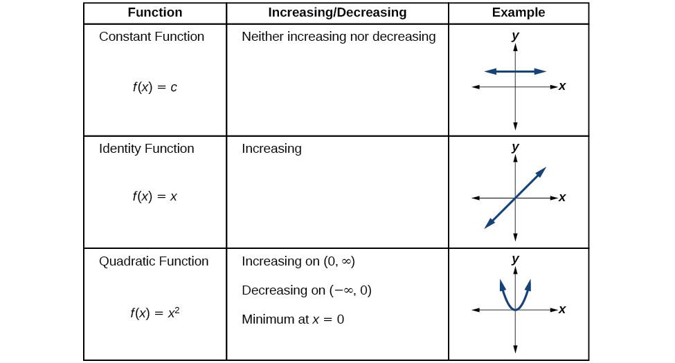

Rates of Change and Behavior of Graphs
======================================

  m51263
  
Rates of Change and Behavior of Graphs
======================================

  In this section, you will:

Find the average rate of change of a function.
Use a graph to determine where a function is increasing, decreasing, or constant.
Use a graph to locate local maxima and local minima.
Use a graph to locate the absolute maximum and absolute minimum.

  f37919d7-b496-4e36-8196-431ae4733a64

   
Learning Objectives
===================
Find the slope of a line (IA 3.2.1)

Objective 1: Find the slope of a line (IA 3.2.1)
================================================
In our work with functions we will make observations about when the function increases or decreases and how quickly this change takes place. The **average rate of change** is a measure of change of a function and tells us how an output quantity, or y value, changes relative to an input quantity, or x value. Finding the average rate of change between two points is equivalent to finding the **slope** of the line segment connecting these two data points.
$\text{average rate of change}=\frac{\text{change in output}}{\text{change in input}}=\frac{\Delta y}{\Delta x}=\frac{{y}_{2}-{y}_{1}}{{x}_{2}-{x}_{1}}=\frac{f\left({x}_{2}\right)-f\left({x}_{1}\right)}{{x}_{2}-{x}_{1}}=\frac{\text{rise}}{\text{run}}$
When interpreting an average rate of change it will be important to consider the units of measurement. Make sure to always attach these units to both the numerator and denominator when they are provided to you.

Quick Guide to the Slopes of Lines
==================================

Find the slope of the line shown.

Locate two points on the graph whose coordinates are integers.

$(0,5)=({x}_{1},{y}_{1})$

 $\left(3,3\right)=({x}_{2},{y}_{2})$

It may help to visualize this change as $m=\frac{\text{rise}}{\text{run}}$ .

Count the rise between the points: down 2 units. Then count the run, or horizontal change: to the right 3 units. Note, since the line goes down, the slope is negative.
Use the slope formula: $m=\frac{\text{rise}}{\text{run}}=\frac{({y}_{2}-{y}_{1})}{({x}_{2}-{x}_{1})}=\frac{3-5}{3-0}\frac{-2}{3}$

Activity: Finding slopes of lines.
==================================

ⓐ Which pair of lines appear parallel?  ________ and ________.
          Find their slopes: ________;  _________

          ⓑ Which pair of lines appear perpendicular?  ________ and ________.
Find their slopes: ________;  _________

          ⓒ Complete the following:
Two lines are parallel if their slopes are _________.
Two lines are perpendicular if their slopes are _________.

Practice Makes Perfect
======================
Find the slope of a line and the average rate of change.

  Complete this table’s y-values, and then graph the line. $y=\frac{2}{3}x+1$

 $x$ 
 $y$

-6

-3

0

3

6

What is the slope of this line? ________   What is the y-intercept of this line?  ( ________ , ________ )

  The following table shows the number of Associates degrees awarded (in thousands) in the US for several years.

  
    Year
    Number of Associate’s Degrees Earned (in thousands)

  

  
    2000
    569
  
  
    2001
    579
  
  
    2005
    668
  
  
    2010
    719
  
  
    2014
    1,003
  

Source: U.S. National Center for Education Statistics.
Find the following average rates of change, being careful to attach units to your answers.

          ⓐ Between 2005 and 2000. Average rate of change= $\frac{f\left({x}_{2}\right)-f\left({x}_{1}\right)}{{x}_{2}-{x}_{1}}$

           ⓑ Between 2001 and 2010. Average rate of change= $\frac{f\left({x}_{2}\right)-f\left({x}_{1}\right)}{{x}_{2}-{x}_{1}}$

          ⓒ Between 2014 and 2010. Average rate of change= $\frac{f\left({x}_{2}\right)-f\left({x}_{1}\right)}{{x}_{2}-{x}_{1}}$

     ⓐ  Complete the following table of values for $f\left(x\right)={x}^{2}+2x-8$ 

    x
    f(x)

  
    –2
    
  
  
    2
    
  
  
    4

     ⓑ Use the table above to find the average rate of change between *x*=–2 and *x*=2.

     ⓒ Use the table above to find the average rate of change between *x*=2 and *x*=4

     ⓓ Sketch the graph of *f*(*x*) below and graph the lines with slopes equal to the average rates of change found in parts ⓑ and ⓒ.

  ⓐ  Complete the following table of values for $g\left(x\right)=\frac{1}{x+3}$ 

    x
    g(x)

  
    –1
    
  
  
    0
    
  
  
    2
    
  

     
     
          ⓑ Use the table above to find the average rate of change between *x*=–1 and *x*=0.
     
     
          ⓒ Use the table above to find the average rate of change between *x*=–1 and *x*=2.
     
     
          ⓓ Sketch the graph of *g*(*x*) below and graph the lines with slopes equal to the average rates of change found in parts ⓑ and ⓒ.

 Gasoline costs have experienced some wild fluctuations over the last several decades. http://www.eia.gov/totalenergy/data/annual/showtext.cfm?t=ptb0524. Accessed 3/5/2014. lists the average cost, in dollars, of a gallon of gasoline for the years 2005–2012. The cost of gasoline can be considered as a function of year.

   
   
   
   
   
   
   
   
   
    
     *$y$*
     
     2005
     2006
     2007
     2008
     2009
     2010
     2011
     2012
    

    
     *$C\left(y\right)$*
     
     2.31
     2.62
     2.84
     3.30
     2.41
     2.84
     3.58
     3.68
    
   

If we were interested only in how the gasoline prices changed between 2005 and 2012, we could compute that the cost per gallon had increased from $2.31 to $3.68, an increase of $1.37. While this is interesting, it might be more useful to look at how much the price changed *per year*. In this section, we will investigate changes such as these.

 
  
Finding the Average Rate of Change of a Function
================================================

  The price change per year is a **rate of change** because it describes how an output quantity changes relative to the change in the input quantity. We can see that the price of gasoline in  did not change by the same amount each year, so the rate of change was not constant. If we use only the beginning and ending data, we would be finding the **average rate of change** over the specified period of time. To find the average rate of change, we divide the change in the output value by the change in the input value.

   $$
\begin{array}{ccc}\hfill \text{Average\ rate\ of\ change}& =& \frac{\text{Change\ in\ output}}{\text{Change\ in\ input}}\hfill \\ & =& \frac{\Delta y}{\Delta x}\hfill \\ & =& \frac{{y}_{2}-{y}_{1}}{{x}_{2}-{x}_{1}}\hfill \\ & =& \frac{f\left({x}_{2}\right)-f\left({x}_{1}\right)}{{x}_{2}-{x}_{1}}\hfill \end{array}
$$

The Greek letter $\text{\Delta}$ (delta) signifies the change in a quantity; we read the ratio as “delta-*y* over delta-*x*” or “the change in $y$ divided by the change in $x.$” Occasionally we write $\text{\Delta}f$ instead of $\text{\Delta}y,$ which still represents the change in the function’s output value resulting from a change to its input value. It does not mean we are changing the function into some other function.
In our example, the gasoline price increased by $1.37 from 2005 to 2012. Over 7 years, the average rate of change was

 $$
\frac{\text{\Delta}y}{\text{\Delta}x}=\frac{\text{\$}1.37}{\text{7\ years}}\approx 0.196\phantom{\rule{0.5em}{0ex}}\text{dollars\ per\ year}
$$
On average, the price of gas increased by about 19.6¢ each year.

  Other examples of rates of change include:

  
  A population of rats increasing by 40 rats per week
  A car traveling 68 miles per hour (distance traveled changes by 68 miles each hour as time passes)
  A car driving 27 miles per gallon (distance traveled changes by 27 miles for each gallon)
  The current through an electrical circuit increasing by 0.125 amperes for every volt of increased voltage
  The amount of money in a college account decreasing by $4,000 per quarter
  

  

   
Rate of Change
==============

   A rate of change describes how an output quantity changes relative to the change in the input quantity. The units on a rate of change are “output units per input units.”

   The average rate of change between two input values is the total change of the function values (output values) divided by the change in the input values.

    $\frac{\Delta y}{\Delta x}=\frac{f\left({x}_{2}\right)-f\left({x}_{1}\right)}{{x}_{2}-{x}_{1}}$

  
   How To
   *Given the value of a function at different points, calculate the average rate of change of a function for the interval between two values ${x}_{1}$ and ${x}_{2}.$*

   Calculate the difference ${y}_{2}-{y}_{1}=\text{\Delta}y.$

    
    Calculate the difference ${x}_{2}-{x}_{1}=\text{\Delta}x.$
    
    Find the ratio $\frac{\text{\Delta}y}{\text{\Delta}x}.$ 
   

  
   
    
     
Computing an Average Rate of Change
===================================

     Using the data in , find the average rate of change of the price of gasoline between 2007 and 2009.

    
    
     In 2007, the price of gasoline was $2.84. In 2009, the cost was $2.41. The average rate of change is

      $$
\begin{array}{ccc}\hfill \frac{\Delta y}{\Delta x}& =& \frac{{y}_{2}-{y}_{1}}{{x}_{2}-{x}_{1}}\hfill \\ & =& \frac{\$2.41-\$2.84}{2009-2007}\hfill \\ & =& \frac{-\$0.43}{2\phantom{\rule{0.5em}{0ex}}\text{years}}\hfill \\ & =& -\$0.22\phantom{\rule{0.5em}{0ex}}\text{per\ year}\hfill \end{array}
$$

    
     
Analysis
========

     Note that a decrease is expressed by a negative change or “negative increase.” A rate of change is negative when the output decreases as the input increases or when the output increases as the input decreases.

     
   
  

  
   Try It
   
    Using the data in , find the average rate of change between 2005 and 2010.

    $\frac{\$2.84-\$2.31}{5\phantom{\rule{0.5em}{0ex}}\text{years}}=\frac{\$0.53}{5\phantom{\rule{0.5em}{0ex}}\text{years}}=\$0.106$ per year.

   
  

  
   
    
     
Computing Average Rate of Change from a Graph
=============================================

     Given the function $g\left(t\right)$ shown in , find the average rate of change on the interval $\left[-1,2\right].$

     \n\n\n\n

    
    
     At $t=-1,$  shows $g\left(\mathrm{-1}\right)=4.$ At $t=2,$ the graph shows $g\left(2\right)=1.$
\n\n\n\n

     The horizontal change $\text{\Delta}t=3$ is shown by the red arrow, and the vertical change $\text{\Delta}g(t)=-3$ is shown by the turquoise arrow. The average rate of change is shown by the slope of the orange line segment. The output changes by –3 while the input changes by 3, giving an average rate of change of
 $$
\frac{1-4}{2-\left(-1\right)}=\frac{-3}{3}=\mathrm{-1}
$$
     
    
     
Analysis
========

     Note that the order we choose is very important. If, for example, we use $\frac{{y}_{2}-{y}_{1}}{{x}_{1}-{x}_{2}},$ we will not get the correct answer. Decide which point will be 1 and which point will be 2, and keep the coordinates fixed as $\left({x}_{1},{y}_{1}\right)$
and $\left({x}_{2},{y}_{2}\right).$

   
  

  
   
    
     
Computing Average Rate of Change from a Table
=============================================

     After picking up a friend who lives 10 miles away and leaving on a trip, Anna records her distance from home over time. The values are shown in . Find her average speed over the first 6 hours.

       
       
       
       
       
       
       
       
       
        
         **t* (hours)*
         0
         1
         2
         3
         4
         5
         6
         7
        

        
         **D*(*t*) (miles)*
         10
         55
         90
         153
         214
         240
         292
         300
        
       

    
     Here, the average speed is the average rate of change. She traveled 282 miles in 6 hours.
 $$
\begin{array}{ccc}\hfill \frac{292-10}{6-0}& =& \frac{282}{6}\hfill \\ & =& 47\hfill \end{array}
$$

The average speed is 47 miles per hour.

    
    
     
Analysis
========

     Because the speed is not constant, the average speed depends on the interval chosen. For the interval [2,3], the average speed is 63 miles per hour.

   
  

  
   
    
     
Computing Average Rate of Change for a Function Expressed as a Formula
======================================================================

     Compute the average rate of change of $f\left(x\right)={x}^{2}-\frac{1}{x}$ on the interval $\text{[2,}\phantom{\rule{0.5em}{0ex}}\text{4].}$

    
     We can start by computing the function values at each **endpoint** of the interval.

     $$
\begin{array}{cccccc}\hfill f(2)& =& {2}^{2}-\frac{1}{2}\hfill & \hfill \phantom{\rule{2em}{0ex}}f(4)& =& {4}^{2}-\frac{1}{4}\hfill \\ & =& 4-\frac{1}{2}\hfill & & =& 16-\frac{1}{4}\hfill \\ & =& \frac{7}{2}\hfill & & =& \frac{63}{4}\hfill \end{array}
$$

Now we compute the average rate of change.

     $$
\begin{array}{ccc}\hfill \text{Average\ rate\ of\ change}& =& \frac{f(4)-f(2)}{4-2}\hfill \\ & =& \frac{\frac{63}{4}-\frac{7}{2}}{4-2}\hfill \\ & =& \frac{\frac{49}{4}}{2}\hfill \\ & =& \frac{49}{8}\hfill \end{array}
$$

   
  

  
   Try It
   
    Find the average rate of change of $f\left(x\right)=x-2\sqrt{x}$ on the interval $[1,\phantom{\rule{0.5em}{0ex}}9].$

    $\frac{1}{2}$

   
  

  
   
    
     
Finding the Average Rate of Change of a Force
=============================================

     The **electrostatic force** $F,$ measured in newtons, between two charged particles can be related to the distance between the particles $d,$ in centimeters, by the formula $F\left(d\right)=\frac{2}{{d}^{2}}.$ Find the average rate of change of force if the distance between the particles is increased from 2 cm to 6 cm.

    
     We are computing the average rate of change of $F\left(d\right)=\frac{2}{{d}^{2}}$ on the interval $[2,6].$

      $$
\begin{array}{cccc}\hfill \text{Average\ rate\ of\ change}& =& \phantom{\rule{0.5em}{0ex}}\text{}\frac{F(6)-F(2)}{6-2}\hfill & \\ & =& \frac{\frac{2}{{6}^{2}}-\frac{2}{{2}^{2}}}{6-2}\hfill & \text{Simplify}.\hfill \\ & =\hfill & \frac{\frac{2}{36}-\frac{2}{4}}{4}\hfill & \\ & =& \frac{-\frac{16}{36}}{4}\hfill & \text{Combine\ numerator\ terms}.\hfill \\ & =& -\frac{1}{9}\hfill & \text{Simplify}\hfill \end{array}
$$

The average rate of change is $-\frac{1}{9}$ newton per centimeter.

   
  

  
   
    
     
Finding an Average Rate of Change as an Expression
==================================================

     Find the average rate of change of $g\left(t\right)={t}^{2}+3t+1$ on the interval $[0,\phantom{\rule{0.5em}{0ex}}a].$ The answer will be an expression involving $a$ in simplest form.

    
     We use the average rate of change formula.

 $$
\begin{array}{cccc}\hfill \text{Average\ rate\ of\ change}& =& \frac{g(a)-g(0)}{a-0}\hfill & \text{Evaluate}.\hfill \\ & =& \frac{({a}^{2}+3a+1)-({0}^{2}+3(0)+1)}{a-0}\hfill & \text{Simplify}.\hfill \\ & =& \frac{{a}^{2}+3a+1-1}{a}\hfill & \text{Simplify\ and\ factor}.\hfill \\ & =& \frac{a(a+3)}{a}\hfill & \text{Divide\ by\ the\ common\ factor\}a.\hfill \\ & =& a+3\hfill & \end{array}
$$

This result tells us the average rate of change in terms of $a$ between $t=0$ and any other point $t=a.$ For example, on the interval $[0,5],$ the average rate of change would be $5+3=8.$

    
   
  

  
   Try It
   Find the average rate of change of $f(x)={x}^{2}+2x-8$ on the interval $[5,a]$ in simplest forms in terms of $a.$

    $a+7$

   
 

 
Using a Graph to Determine Where a Function is Increasing, Decreasing, or Constant
==================================================================================
As part of exploring how functions change, we can identify intervals over which the function is changing in specific ways. We say that a function is increasing on an interval if the function values increase as the input values increase within that interval. Similarly, a function is decreasing on an interval if the function values decrease as the input values increase over that interval. The average rate of change of an increasing function is positive, and the average rate of change of a decreasing function is negative.  shows examples of increasing and decreasing intervals on a function.
\n\n\n\nWhile some functions are increasing (or decreasing) over their entire domain, many others are not. A value of the input where a function changes from increasing to decreasing (as we go from left to right, that is, as the input variable increases) is the location of a  **local maximum**. The function value at that point is the local maximum. If a function has more than one, we say it has local maxima. Similarly, a value of the input where a function changes from decreasing to increasing as the input variable increases is the location of a **local minimum**. The function value at that point is the local minimum. The plural form is “local minima.” Together, local maxima and minima are called **local extrema**, or local extreme values, of the function. (The singular form is “extremum.”) Often, the term *local* is replaced by the term *relative*. In this text, we will use the term *local*.

  Clearly, a function is neither increasing nor decreasing on an interval where it is constant. A function is also neither increasing nor decreasing at extrema. Note that we have to speak of *local* extrema, because any given local extremum as defined here is not necessarily the highest maximum or lowest minimum in the function’s entire domain.

  For the function whose graph is shown in , the local maximum is 16, and it occurs at $x=\mathrm{-2.}$ The local minimum is $\mathrm{-16}$ and it occurs at $x=2.$
\n\n\n\nTo locate the local maxima and minima from a graph, we need to observe the graph to determine where the graph attains its highest and lowest points, respectively, within an open interval. Like the summit of a roller coaster, the graph of a function is higher at a local maximum than at nearby points on both sides. The graph will also be lower at a local minimum than at neighboring points.  illustrates these ideas for a local maximum.
\n\n\n\n

  These observations lead us to a formal definition of local extrema.

   
Local Minima and Local Maxima
=============================

   A function $f$ is an **increasing function** on an open interval if $f\left(b\right)>f\left(a\right)$ for any two input values $a$ and $b$ in the given interval where $b>a.$
A function $f$ is a **decreasing function** on an open interval if $f\left(b\right)<f\left(a\right)$ for any two input values $a$ and $b$ in the given interval where $b>a.$

   A function $f$ has a local maximum at $x=b$ if there exists an interval $(a,c)$ with $a<b<c$ such that, for any $x$ in the interval $\left(a,c\right),$ $f\left(x\right)\le f\left(b\right).$ Likewise, $f$ has a local minimum at $x=b$ if there exists an interval $(a,c)$ with $a<b<c$ such that, for any $x$ in the interval $\left(a,c\right),$ $f\left(x\right)\ge f\left(b\right).$

  
   
    
     
Finding Increasing and Decreasing Intervals on a Graph
======================================================

     Given the function $p\left(t\right)$ in , identify the intervals on which the function appears to be increasing.

     \n\n\n\n

    
    
     We see that the function is not constant on any interval. The function is increasing where it slants upward as we move to the right and decreasing where it slants downward as we move to the right. The function appears to be increasing from $t=1$ to $t=3$ and from $t=4$ on.
In **interval notation**, we would say the function appears to be increasing on the interval (1,3) and the interval $(4,\infty ).$

    
     
Analysis
========

     Notice in this example that we used open intervals (intervals that do not include the endpoints), because the function is neither increasing nor decreasing at $t=1$ , $t=3$ , and $t=4$ . These points are the local extrema (two minima and a maximum).

   
  

  
     
Finding Local Extrema from a Graph
==================================

     Graph the function $f\left(x\right)=\frac{2}{x}+\frac{x}{3}.$ Then use the graph to estimate the local extrema of the function and to determine the intervals on which the function is increasing.

    
    
     Using technology, we find that the graph of the function looks like that in . It appears there is a low point, or local minimum, between $x=2$ and $x=3,$ and a mirror-image high point, or local maximum, somewhere between $x=\mathrm{-3}$ and $x=\mathrm{-2.}$

\n\n\n\n
    
    
     
Analysis
========

     Most graphing calculators and graphing utilities can estimate the location of maxima and minima.  provides screen images from two different technologies, showing the estimate for the local maximum and minimum.

\n\n\n\nBased on these estimates, the function is increasing on the interval $(-\infty \text{,}-\text{2}\text{.449)}$
and $(2.449\text{,}\infty ).$ Notice that, while we expect the extrema to be symmetric, the two different technologies agree only up to four decimals due to the differing approximation algorithms used by each. (The exact location of the extrema is at $\pm \sqrt{6},$ but determining this requires calculus.)

   
   Try It
   Graph the function $f\left(x\right)={x}^{3}-6{x}^{2}-15x+20$ to estimate the local extrema of the function. Use these to determine the intervals on which the function is increasing and decreasing.

    The local maximum appears to occur at $(-1,28),$ and the local minimum occurs at $(5,-80).$ The function is increasing on $(-\infty ,-1)\cup (5,\infty )$ and decreasing on $(-1,5).$

    

    

  
   
    
     
Finding Local Maxima and Minima from a Graph
============================================

     For the function $f$ whose graph is shown in , find all local maxima and minima.
\n\n\n\n
    
    
     Observe the graph of $f.$ The graph attains a local maximum at $x=1$ because it is the highest point in an open interval around $x=1.$ The local maximum is the $y$ -coordinate at $x=1,$ which is $2.$
The graph attains a local minimum at $\text{}x=\mathrm{-1}$ because it is the lowest point in an open interval around $x=\mathrm{-1.}$ The local minimum is the *y*-coordinate at $x=\mathrm{-1},$ which is $\mathrm{-2.}$

   
  
   
  
Analyzing the Toolkit Functions for Increasing or Decreasing Intervals
======================================================================

  We will now return to our toolkit functions and discuss their graphical behavior in , , and .

  \n\n\n\n
  \n\n\n\n
  \n\n\n\n
 

 
  
Use A Graph to Locate the Absolute Maximum and Absolute Minimum
===============================================================

  There is a difference between locating the highest and lowest points on a graph in a region around an open interval (locally) and locating the highest and lowest points on the graph for the entire domain. The $y\text{-}$ coordinates (output) at the highest and lowest points are called the *absolute maximum*and*absolute minimum*, respectively.
To locate absolute maxima and minima from a graph, we need to observe the graph to determine where the graph attains it highest and lowest points on the domain of the function. See .

  \n\n\n\nNot every function has an absolute maximum or minimum value. The toolkit function $f\left(x\right)={x}^{3}$ is one such function.

  

   
Absolute Maxima and Minima
==========================

   The **absolute maximum** of $f$ at $x=c$ is $f\left(c\right)$ where $f\left(c\right)\ge f\left(x\right)$ for all $x$ in the domain of $f.$

   The **absolute minimum** of $f$ at $x=d$ is $f\left(d\right)$ where $f\left(d\right)\le f\left(x\right)$ for all $x$ in the domain of $f.$

  

  
   
    
     
Finding Absolute Maxima and Minima from a Graph
===============================================

     For the function $f$ shown in , find all absolute maxima and minima.
\n\n\n\n

    
    
     Observe the graph of $f.$ The graph attains an absolute maximum in two locations, $x=\mathrm{-2}$ and $x=2,$ because at these locations, the graph attains its highest point on the domain of the function. The absolute maximum is the *y*-coordinate at $x=\mathrm{-2}$ and $x=2,$ which is $16.$
The graph attains an absolute minimum at $x=3,$ because it is the lowest point on the domain of the function’s graph. The absolute minimum is the *y*-coordinate at $x=3,$ which is $\mathrm{-10.}$

   
  

  
   Media
   Access this online resource for additional instruction and practice with rates of change.

   Average Rate of Change
   

 

 
Key Equations
=============

Average rate of change
 $\frac{\Delta y}{\Delta x}=\frac{f\left({x}_{2}\right)-f\left({x}_{1}\right)}{{x}_{2}-{x}_{1}}$

  
Key Concepts
============

  
   A rate of change relates a change in an output quantity to a change in an input quantity. The average rate of change is determined using only the beginning and ending data. See .
   Identifying points that mark the interval on a graph can be used to find the average rate of change. See .
   Comparing pairs of input and output values in a table can also be used to find the average rate of change. See .
   An average rate of change can also be computed by determining the function values at the endpoints of an interval described by a formula. See  and .
   The average rate of change can sometimes be determined as an expression. See .
   A function is increasing where its rate of change is positive and decreasing where its rate of change is negative. See .
  A local maximum is where a function changes from increasing to decreasing and has an output value larger (more positive or less negative) than output values at neighboring input values.
  A local minimum is where the function changes from decreasing to increasing (as the input increases) and has an output value smaller (more negative or less positive) than output values at neighboring input values.
  Minima and maxima are also called extrema.
   We can find local extrema from a graph. See  and .
   The highest and lowest points on a graph indicate the maxima and minima. See .
  
 

 
Section Exercises
=================

   
Verbal
======

   
    
     Can the average rate of change of a function be constant?

    
   
    Yes, the average rate of change of all linear functions is constant.

   
   
   
    
     If a function $f$ is increasing on $(a,b)$ and decreasing on $(b,c),$ then what can be said about the local extremum of $f$ on $(a,c)?$

    
   
   
    
     How are the absolute maximum and minimum similar to and different from the local extrema?

    
   
    The absolute maximum and minimum relate to the entire graph, whereas the local extrema relate only to a specific region around an open interval.

   
   
   
    
     How does the graph of the absolute value function compare to the graph of the quadratic function, $y={x}^{2},$ in terms of increasing and decreasing intervals?

    
   
  

  
   
Algebraic
=========

   For the following exercises, find the average rate of change of each function on the interval specified for real numbers $b$ or $h$ in simplest form.

    
     $f\left(x\right)=4{x}^{2}-7$ on $[1,\phantom{\rule{0.5em}{0ex}}\text{}b]$

    
   
    $4\left(b+1\right)$

   
   
   
    
     $g\left(x\right)=2{x}^{2}-9$ on $\left[4,\phantom{\rule{0.5em}{0ex}}\text{}b\right]$

    
   
   
    
     $p\left(x\right)=3x+4$ on $[2,\phantom{\rule{0.5em}{0ex}}\text{}2+h]$

    
    
     3

    
   
   
    
     $k\left(x\right)=4x-2$ on $[3,\phantom{\rule{0.5em}{0ex}}\text{}3+h]$

    
   
   
    
     $f\left(x\right)=2{x}^{2}+1$ on $[x,x+h]$

    
    
     $4x+2h$

    
   
   
    
     $g\left(x\right)=3{x}^{2}-2$ on $[x,x+h]$

    
   
   
    
     $a\left(t\right)=\frac{1}{t+4}$ on $[9,9+h]$

    
    
     $\frac{-1}{13\left(13+h\right)}$

    
   
   
    
     $b\left(x\right)=\frac{1}{x+3}$ on $[1,1+h]$

    
   
   
    
     $j\left(x\right)=3{x}^{3}$ on $[1,1+h]$

    
    
     $3{h}^{2}+9h+9$

    
   
   
    
     $r\left(t\right)=4{t}^{3}$ on $[2,2+h]$

    
   

   
    
     Find $\frac{f\left(x+h\right)-f\left(x\right)}{h}$ given $f\left(x\right)=2{x}^{2}-3x$ on $[x,x+h]$

    
   
    $4x+2h-3$

   
   
  

  
Graphical
=========
For the following exercises, consider the graph of $f$ shown in .

   \n\n\n\n

   
    
     Estimate the average rate of change from $x=1$ to $x=4.$

    
   
  
   
    Estimate the average rate of change from $x=2$ to $x=5.$

   
   
    $\frac{4}{3}$

   
  

   For the following exercises, use the graph of each function to estimate the intervals on which the function is increasing or decreasing.

 
   

 

      

    
   
    increasing on $\left(-\infty ,-2.5\right)\cup \left(1,\infty \right),$ decreasing on $(-2.5,\phantom{\rule{0.5em}{0ex}}\text{}1)$

   
   

      

    
   

     

   
   
    increasing on $\left(-\infty ,1\right)\cup \left(3,4\right),$ decreasing on $\left(1,3\right)\cup \left(4,\infty \right)$

   
  For the following exercises, consider the graph shown in .

   \n\n\n\n

   
    
     Estimate the intervals where the function is increasing or decreasing.

    
   

  
   
    Estimate the point(s) at which the graph of $f$ has a local maximum or a local minimum.

   
   
    local maximum: $(-3,\phantom{\rule{0.5em}{0ex}}\text{}60),$ local minimum: $(3,\phantom{\rule{0.5em}{0ex}}\text{}-60)$
 
  

   For the following exercises, consider the graph in .

   \n\n\n\n

   
    
     If the complete graph of the function is shown, estimate the intervals where the function is increasing or decreasing.

    
   
   
    
     If the complete graph of the function is shown, estimate the absolute maximum and absolute minimum.

    
   
    absolute maximum at approximately $(7,\phantom{\rule{0.5em}{0ex}}\text{}150),$ absolute minimum at approximately $(\mathrm{-7.5},\phantom{\rule{0.5em}{0ex}}\text{}\mathrm{-220})$

   
  
Numeric
=======
gives the annual sales (in millions of dollars) of a product from 1998 to 2006. What was the average rate of change of annual sales (a) between 2001 and 2002, and (b) between 2001 and 2004?

   

*Year*
*Sales (millions of dollars)*

1998201

1999219

2000233

2001243

2002249

2003251

2004249

2005243

2006233

   
gives the population of a town (in thousands) from 2000 to 2008. What was the average rate of change of population (a) between 2002 and 2004, and (b) between 2002 and 2006?

  
    *Year*
    *Population(thousands)*
  

  
    200087
  
  
    200184
  
  
    200283
  
  
    200380
  
  
    200477
  
  
    200576
  
  
    200678
  
  
    200781
  
  
    200885
  

   
          
          ⓐ –3000
     
     
     ⓑ –1250
 
   
   For the following exercises, find the average rate of change of each function on the interval specified.

   
    
     $f\left(x\right)={x}^{2}$ on $[1,\phantom{\rule{0.5em}{0ex}}\text{}5]$

    
   
   
    
     $h\left(x\right)=5-2{x}^{2}$ on $[\mathrm{-2},\text{4}]$

   
    -4

   
   
   
    
     $q\left(x\right)={x}^{3}$ on $[\mathrm{-4},\text{2}]$

   
   
    
     $g\left(x\right)=3{x}^{3}-1$ on $[\mathrm{-3},\text{3}]$

   
    27

   
   
   
    
     $y=\frac{1}{x}$ on $[1,\phantom{\rule{0.5em}{0ex}}\text{3}]$

    
   
  
   
    $p\left(t\right)=\frac{\left({t}^{2}-4\right)\left(t+1\right)}{{t}^{2}+3}$ on $[\mathrm{-3},\text{1}]$

   
    –0.167

   
  
  
   
    $k\left(t\right)=6{t}^{2}+\frac{4}{{t}^{3}}$ on $[\mathrm{-1},3]$

  
  
Technology
==========
For the following exercises, use a graphing utility to estimate the local extrema of each function and to estimate the intervals on which the function is increasing and decreasing.

   
    
     $f\left(x\right)={x}^{4}-4{x}^{3}+5$

    
   
    Local minimum at $(3,-22),$ decreasing on $(-\infty ,\phantom{\rule{0.5em}{0ex}}\text{}3),$ increasing on $(3,\phantom{\rule{0.5em}{0ex}}\text{}\infty )$

   
   
   
    
     $h\left(x\right)={x}^{5}+5{x}^{4}+10{x}^{3}+10{x}^{2}-1$

    
   

   
    
     $g\left(t\right)=t\sqrt{t+3}$

    
   
    Local minimum at $(-2,-2),$ decreasing on $(-3,-2),$ increasing on $(-2,\phantom{\rule{0.5em}{0ex}}\text{}\infty )$

   
   
    
     $k\left(t\right)=3{t}^{\frac{2}{3}}-t$

   

   
    
     $m\left(x\right)={x}^{4}+2{x}^{3}-12{x}^{2}-10x+4$

    
   
    Local maximum at $(-0.39,\phantom{\rule{0.5em}{0ex}}5.98),$ local minima at $(-3.15,-47.62)$ and $(2.04,-32.04),$ decreasing on $(-\infty ,-3.15)\cup (-0.39,\phantom{\rule{0.5em}{0ex}}2.04),$ increasing on $(-3.15,\phantom{\rule{0.5em}{0ex}}-0.39)\cup (2.04,\phantom{\rule{0.5em}{0ex}}\infty )$

   
   

   
    
     $n\left(x\right)={x}^{4}-8{x}^{3}+18{x}^{2}-6x+2$

    
   
  
Extension
=========
The graph of the function $f$ is shown in .
\n\n\n\nBased on the calculator screen shot, the point $(1.333,\phantom{\rule{0.5em}{0ex}}\text{}5.185)$
     is which of the following?

    ⓐa relative (local) maximum of the function
   ⓑthe vertex of the function
   ⓒthe absolute maximum of the function
    ⓓa zero of the function
   
   
    A

   

   
    
     Let $f(x)=\frac{1}{x}.$ Find a number $c$ such that the average rate of change of the function $f$ on the interval $(1,c)$ is $-\frac{1}{4}.$

   

 
  
   Let $f\left(x\right)=\frac{1}{x}$ . Find the number $b$ such that the average rate of change of $f$ on the interval $(2,b)$ is $-\frac{1}{10}.$

  
   
    $b=5$

   
 
  
Real-World Applications
=======================

    
     At the start of a trip, the odometer on a car read 21,395. At the end of the trip, 13.5 hours later, the odometer read 22,125. Assume the scale on the odometer is in miles. What is the average speed the car traveled during this trip?

    
   

   
    
     A driver of a car stopped at a gas station to fill up their gas tank. They looked at their watch, and the time read exactly 3:40 p.m. At this time, they started pumping gas into the tank. At exactly 3:44, the tank was full and the driver noticed that they had pumped 10.7 gallons. What is the average rate of flow of the gasoline into the gas tank?

   
    2.7 gallons per minute

   
   

   
    
     Near the surface of the moon, the distance that an object falls is a function of time. It is given by $d\left(t\right)=2.6667{t}^{2},$ where $t$ is in seconds and $d\left(t\right)$ is in feet. If an object is dropped from a certain height, find the average velocity of the object from $t=1$ to $t=2.$

    
   

   The graph in  illustrates the decay of a radioactive substance over $t$ days.

\n\n\n\n
Use the graph to estimate the average decay rate from $t=5$ to $t=15.$

   
    approximately –0.6 milligrams per day

   
   
 
 
  **absolute maximum**
  the greatest value of a function over an interval

  
   **absolute minimum**
   the lowest value of a function over an interval
  

  
   **average rate of change**
   the difference in the output values of a function found for two values of the input divided by the difference between the inputs
  

  
   **decreasing function**
   a function is decreasing in some open interval if $f\left(b\right)<f\left(a\right)$ for any two input values $a$ and $b$ in the given interval where $b>a$
   
  

  
   **increasing function**
   a function is increasing in some open interval if $f\left(b\right)>f\left(a\right)$ for any two input values $a$ and $b$ in the given interval where $b>a$
   
  

  
   **local extrema**
   collectively, all of a function's local maxima and minima

  
   **local maximum**
   a value of the input where a function changes from increasing to decreasing as the input value increases.
  

  
   **local minimum**
   a value of the input where a function changes from decreasing to increasing as the input value increases.

   **rate of change**
   the change of an output quantity relative to the change of the input quantity
