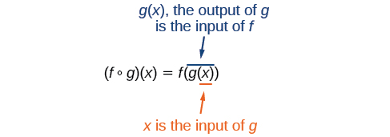
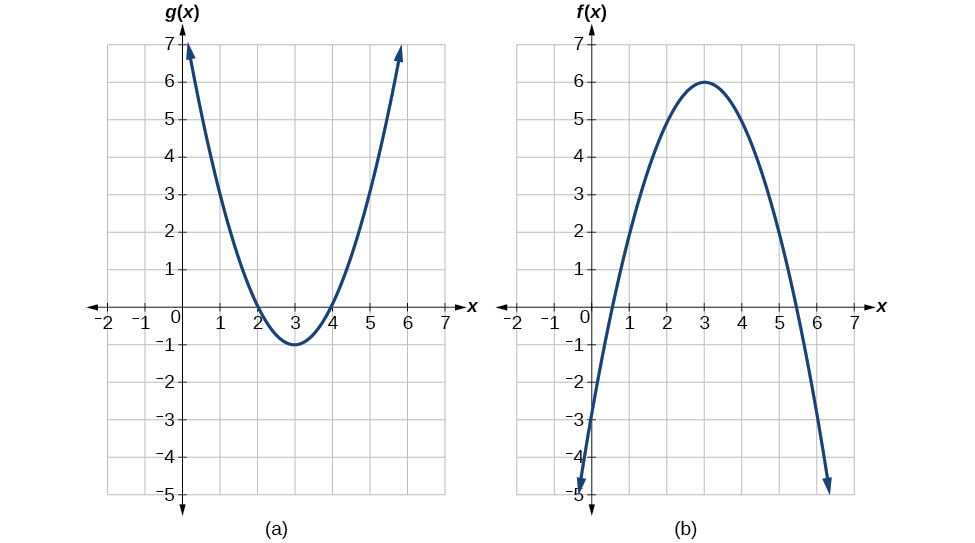
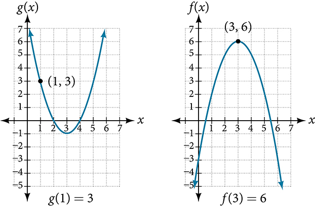
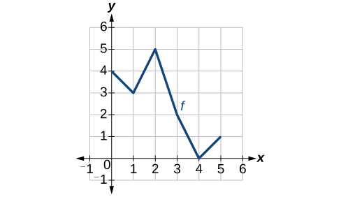
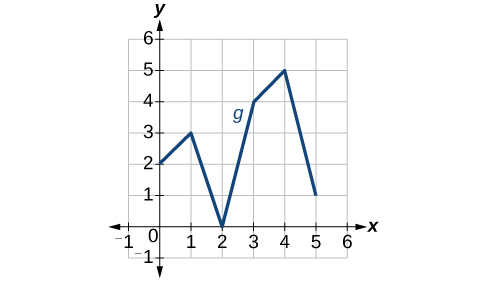
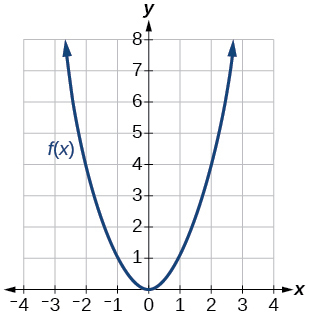
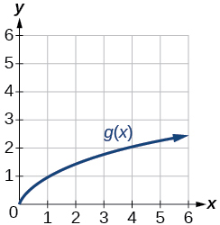
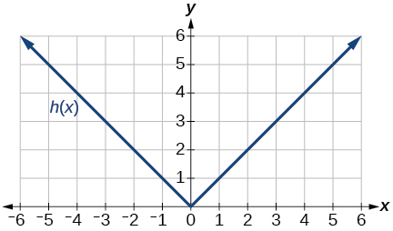

**Composition of Functions**

  m51265
  

**Composition of Functions**

  In this section, you will:

Combine functions using algebraic operations.
Create a new function by composition of functions.
Evaluate composite functions.
Find the domain of a composite function.
Decompose a composite function into its component functions.

  8a4fc477-43da-4fc4-9ff0-19a7fae5a19d

## Learning Objectives
Find the value of a function (IA 3.5.3), (CA 3.1.2)
## Objective 1: Find the value of a function (IA 3.5.3), (CA 3.1.2)
A **function** is a relation that assigns to each element in its domain exactly one element in the range. For each ordered pair in the relation, each $x$ -value is matched with only one $y$ -value.
The notation $y=f\left(x\right)$  defines a function named $f$ .  This is read as “ $y$  is a function of $x$ .” The letter $x$  represents the input value, or independent variable. The letter $y$, or $f\left(x\right)$ , represents the output value, or dependent variable.

>
>
> **Function Notation**
>
>
> For the function
>  $y=f(x)$
>
>
>
>
>  $f$ is the name of the function. 
>  $x$ is the input value, the collection of possible input values make up the domain.
>  $f\left(x\right)$ is the output value, the collection of possible output values make up the range.
>
>
>
> We read
>  $f(x)$
> as
> *f*
> of
> *x*
> or the value of
> *f*
> at
> *x*
> .
>
>

**Evaluating and Solving a Function Represented in Table Form**

1. ⓐ Evaluate $g(3)$                       ⓑ Solve $g(n)=6$          | $n$ | 1 | 2 | 3 | 4 | 5 | | :--- | :--- | :--- | :--- | :--- | :--- | | $g(n)$ | 8 | 6 | 7 | 6 | 8 |

Solution

ⓐ Evaluating *g*(3) means determining the output value of the function *g* for the input value of *n*=3. The table output value corresponding to *n*=3 is 7, so *g*(3)=7.
     
     
          ⓑ Solving *g*(*n*)=6 means identifying the input values, *n*, that produce an output value of 6. The table shows two values where *g*(*n*) = 6 at *x*=2 and 4.

### Practice Makes Perfect

Find the value of a function.

2. Given the function $k(t)=2t-1$:                      ⓐ Evaluate $k(2)$                       ⓑ Solve $k(t)=7$

3. Given the function $f(x)=\sqrt{x+2}$ :                     ⓐ Evaluate $f(7)$                       ⓑ Solve $f(x)=4$

4. For the function $f(x)=2{x}^{2}+3x+1$ , find               ⓐ $f(3)$                       ⓑ $f(\mathrm{\u20132})$                       ⓒ $f(t)$                       ⓓ The value(s) of *x* that make $f(x)=1$

5. Use the table below to help answer the following:       | *x* | 1 | 2 | 3 | 4 | 5 | | :--- | :--- | :--- | :--- | :--- | :--- | | $g(x)$ | 5 | 12 | 21 | 32 | 45 |                     ⓐ Evaluate $g(4)$                       ⓑ Solve $g(x)=32$

A **composite** function is a two-step function and can have numerical or variable inputs.

 $x\to \overline{)g}\to g\left(x\right)\to \overline{)f}\to f\left(g\right(x\left)\right)$ 
$(f\circ g)\left(x\right)=f\left(g\right(x\left)\right)\$ is read as “*f* of *g* of *x*”
To evaluate a composite function, we always start evaluating the inner function and then evaluate the outer function in terms of the inner function.
Let’s use a table to help us organize our work in evaluating a two-step (composition) function in terms of some numerical inputs.
First evaluate *g* in terms of *x*, the *f* in terms of *g*(*x*).
Given that: $g\left(x\right)=3x-1$ , and $f\left(x\right)={x}^{2}+1$ , complete the table below. Remember the output of *g*(*x*) becomes the input of *f*(*x*)!

| *x* | $g\left(x\right)=3x-1$ | $f\left(g\right(x\left)\right)={\left(g\right(x\left)\right)}^{2}+1$ |
| :--- | :--- | :--- |
| –1 |  |  |
| –3 |  |  |
| 0 |  |  |
| 4 |  |  |
| 10 |  |  |

### Practice Makes Perfect
6. Use the table below showing values of $f(x)$ and $g(x)$ to find each of the following. Remember when working with composition functions we always evaluate the inner function first.       | $x$ | –3 | –2 | –1 | 0 | 1 | 2 | 3 | | :--- | :--- | :--- | :--- | :--- | :--- | :--- | :--- | | $f(x)$ | 11 | 9 | 7 | 5 | 3 | 1 | –1 | | $g(x)$ | –8 | –3 | 0 | 1 | 0 | –3 | –8 |               ⓐ $f(1)=$                       ⓑ $g(f(1))=$                       ⓒ $g(0)=$                       ⓓ $f(g(0))=$                       ⓔ $f(g(2))=$                       ⓕ $f(f(3))=$

Suppose we want to calculate how much it costs to heat a house on a particular day of the year. The cost to heat a house will depend on the average daily temperature, and in turn, the average daily temperature depends on the particular day of the year. Notice how we have just defined two relationships: The cost depends on the temperature, and the temperature depends on the day.

Using descriptive variables, we can notate these two functions. The function $C\left(T\right)$ gives the cost $C$ of heating a house for a given average daily temperature in $T$ degrees Celsius. The function $T\left(d\right)$ gives the average daily temperature on day $d$ of the year. For any given day, $\text{Cost}=C\left(T\left(d\right)\right)$ means that the cost depends on the temperature, which in turns depends on the day of the year. Thus, we can evaluate the cost function at the temperature $T\left(d\right).$ For example, we could evaluate $T\left(5\right)$ to determine the average daily temperature on the 5th day of the year. Then, we could evaluate the **cost function** at that temperature. We would write $C\left(T\left(5\right)\right).$

By combining these two relationships into one function, we have performed function composition, which is the focus of this section.

# Combining Functions Using Algebraic Operations
Function composition is only one way to combine existing functions. Another way is to carry out the usual algebraic operations on functions, such as addition, subtraction, multiplication and division. We do this by performing the operations with the function outputs, defining the result as the output of our new function.
Suppose we need to add two columns of numbers that represent a husband and wife’s separate annual incomes over a period of years, with the result being their total household income. We want to do this for every year, adding only that year’s incomes and then collecting all the data in a new column. If $w(y)$ is the wife’s income and $h(y)$ is the husband’s income in year $y,$ and we want $T$ to represent the total income, then we can define a new function.
 $$
T\left(y\right)=h\left(y\right)+w\left(y\right)
$$
If this holds true for every year, then we can focus on the relation between the functions without reference to a year and write

 $$
T=h+w
$$
Just as for this sum of two functions, we can define difference, product, and ratio functions for any pair of functions that have the same kinds of inputs (not necessarily numbers) and also the same kinds of outputs (which do have to be numbers so that the usual operations of algebra can apply to them, and which also must have the same units or no units when we add and subtract). In this way, we can think of adding, subtracting, multiplying, and dividing functions.
For two functions $f\left(x\right)$ and $g\left(x\right)$ with real number outputs, we define new functions $f+g,\phantom{\rule{0.5em}{0ex}}f-g,\phantom{\rule{0.5em}{0ex}}fg,$ and $\frac{f}{g}$ by the relations

 $$
\begin{array}{cccc}  (f+g)(x)& =& f(x)+g(x)  & \\   (f-g)(x)& =& f(x)-g(x)  & \\   \ (fg)(x)& =& f(x)g(x)  & \\   \left(\frac{f}{g}\right)(x)& =& \frac{f(x)}{g(x)}  & \text{where}\phantom{\rule{0.5em}{0ex}}g(x)\phantom{\rule{0.5em}{0ex}}\ne \phantom{\rule{0.5em}{0ex}}0  \end{array}
$$

7. **Performing Algebraic Operations on Functions**   Find and simplify the functions $\left(g-f\right)\left(x\right)$ and $\left(\frac{g}{f}\right)\left(x\right),$ given $f\left(x\right)=x-1$ and $g\left(x\right)={x}^{2}-1.$ Are they the same function?

Solution

Begin by writing the general form, and then substitute the given functions.

  $$
\begin{array}{cccc}  (g-f)(x)& =& g(x)-f(x)  & \\   (g-f)(x)& =& {x}^{2}-1-(x-1)  & \\   (g-f)(x)& =& {x}^{2}-x  & \\   (g-f)(x)& =& x(x-1)  & \\ & & & \\ & & & \\   \left(\frac{g}{f}\right)(x)& =& \frac{g(x)}{f(x)}  & \\   \left(\frac{g}{f}\right)(x)& =& \frac{{x}^{2}-1}{x-1}  & \\   \left(\frac{g}{f}\right)(x)& =& \frac{(x+1)(x-1)}{x-1}  & \text{where}x\ne 1  \\   \left(\frac{g}{f}\right)(x)& =& x+1  & \end{array}
$$

No, the functions are not the same.

Note: For $\left(\frac{g}{f}\right)\left(x\right),$ the condition $x\ne 1$ is necessary because when $x=1,$ the denominator is equal to 0, which makes the function undefined.

>
> Try It
> 8. Find and simplify the functions $\left(fg\right)\left(x\right)$ and $\left(f-g\right)\left(x\right).$    $$ f\left(x\right)=x-1\phantom{\rule{0.5em}{0ex}}\text{\ \ \ and\ \ \ \}g\left(x\right)={x}^{2}-1 $$  Are they the same function?
>
> 

> 
Solution

>
> $\begin{array}{l}\left(fg\right)\left(x\right)=f\left(x\right)g\left(x\right)=\left(x-1\right)\left({x}^{2}-1\right)={x}^{3}-{x}^{2}-x+1\\ \left(f-g\right)\left(x\right)=f\left(x\right)-g\left(x\right)=\left(x-1\right)-\left({x}^{2}-1\right)=x-{x}^{2}\end{array}$
>
>
> No, the functions are not the same.
> 

>
>

# Create a Function by Composition of Functions
Performing algebraic operations on functions combines them into a new function, but we can also create functions by composing functions. When we wanted to compute a heating cost from a day of the year, we created a new function that takes a day as input and yields a cost as output. The process of **combining functions** so that the output of one function becomes the input of another is known as a **composition of functions***.* The resulting function is known as a *composite function*. We represent this combination by the following notation:
 $$
\left(f\circ g\right)\left(x\right)=f\left(g\left(x\right)\right)
$$
We read the left-hand side as $\u201cf$ composed with $g$ at $x,\u201d$ and the right-hand side as $\u201cf$ of $g$ of $x.\u201d$ The two sides of the equation have the same mathematical meaning and are equal. The open circle symbol $\circ$ is called the composition operator. We use this operator mainly when we wish to emphasize the relationship between the functions themselves without referring to any particular input value. Composition is a binary operation that takes two functions and forms a new function, much as addition or multiplication takes two numbers and gives a new number. However, it is important not to confuse function composition with multiplication because, as we learned above, in most cases $f(g(x))\ne f(x)g(x).$

It is also important to understand the order of operations in evaluating a composite function. We follow the usual convention with parentheses by starting with the innermost parentheses first, and then working to the outside. In the equation above, the function $g$ takes the input $x$ first and yields an output $g\left(x\right).$ Then the function $f$ takes $g\left(x\right)$ as an input and yields an output $f\left(g\left(x\right)\right).$

In general, $f\circ g$ and $g\circ f$ are different functions. In other words, in many cases $f\left(g\left(x\right)\right)\ne g\left(f\left(x\right)\right)$ for all $x.$ We will also see that sometimes two functions can be composed only in one specific order.
For example, if $f\left(x\right)={x}^{2}$ and $g\left(x\right)=x+2,$ then

 $$
\begin{array}{ccc}  f(g(x))& =& f(x+2)  \\ & =& {(x+2)}^{2}  \\ & =& {x}^{2}+4x+4  \end{array}
$$

but
 $$
\begin{array}{ccc}  g(f(x))& =& g\left({x}^{2}\right)  \\ & =& {x}^{2}+2  \end{array}
$$

These expressions are not equal for all values of $x,$ so the two functions are not equal. It is irrelevant that the expressions happen to be equal for the single input value $x=-\frac{1}{2}.$

Note that the range of the inside function (the first function to be evaluated) needs to be within the domain of the outside function. Less formally, the composition has to make sense in terms of inputs and outputs.

>
>
>
>
> **Composition of Functions**
>
>
> When the output of one function is used as the input of another, we call the entire operation a composition of functions. For any input $x$ and functions $f$ and $g,$ this action defines a **composite function**, which we write as $f\circ g$ such that
>
>  $\left(f\circ g\right)\left(x\right)=f\left(g\left(x\right)\right)$
>
> The domain of the composite function $f\circ g$ is all $x$ such that $x$ is in the domain of $g$ and $g\left(x\right)$ is in the domain of $f.$
>
>
> It is important to realize that the product of functions $fg$ is not the same as the function composition $f\left(g\left(x\right)\right),$ because, in general, $f\left(x\right)g\left(x\right)\ne f\left(g\left(x\right)\right).$
>
>

9. **Determining whether Composition of Functions is Commutative**   Using the functions provided, find $f\left(g\left(x\right)\right)$ and $g\left(f\left(x\right)\right).$ Determine whether the composition of the functions is **commutative**.   $$ f(x)=2x+1\phantom{\rule{0.5em}{0ex}}\phantom{\rule{0.5em}{0ex}}\phantom{\rule{0.5em}{0ex}}\phantom{\rule{0.5em}{0ex}}\phantom{\rule{0.5em}{0ex}}\phantom{\rule{0.5em}{0ex}}\phantom{\rule{0.5em}{0ex}}\phantom{\rule{0.5em}{0ex}}\phantom{\rule{0.5em}{0ex}}\phantom{\rule{0.5em}{0ex}}\phantom{\rule{0.5em}{0ex}}\phantom{\rule{0.5em}{0ex}}\phantom{\rule{0.5em}{0ex}}g(x)=3-x $$

Solution

Let’s begin by substituting $g\left(x\right)$ into $f\left(x\right).$

  $$
\begin{array}{ccc}  f(g(x))& =& 2(3-x)+1  \\ & =& 6-2x+1  \\ & =& 7-2x  \end{array}
$$

Now we can substitute $f\left(x\right)$ into $g\left(x\right).$

  $$
\begin{array}{ccc}  g(f(x))& =& 3-(2x+1)  \\ & =& 3-2x-1  \\ & =& \mathrm{-2}x+2  \end{array}
$$

We find that $g(f(x))\ne f(g(x)),$ so the operation of function composition is not commutative.

10. **Interpreting Composite Functions**   The function $c(s)$ gives the number of calories burned completing $s$ sit-ups, and $s(t)$ gives the number of sit-ups a person can complete in $t$ minutes. Interpret $c(s(3)).$

Solution

The inside expression in the composition is $s(3).$ Because the input to the *s*-function is time, $t=3$ represents 3 minutes, and $s(3)$ is the number of sit-ups completed in 3 minutes. 
Using $s(3)$ as the input to the function $c(s)$ gives us the number of calories burned during the number of sit-ups that can be completed in 3 minutes, or simply the number of calories burned in 3 minutes (by doing sit-ups).

11. **Investigating the Order of Function Composition**   Suppose $f(x)$ gives miles that can be driven in $x$ hours and $g(y)$ gives the gallons of gas used in driving $y$ miles. Which of these expressions is meaningful: $f\left(g(y)\right)$ or $g\left(f(x)\right)?$

Solution

The function $y=f\left(x\right)$ is a function whose output is the number of miles driven corresponding to the number of hours driven. 

 $$
\text{number\ of\ miles\}=f\phantom{\rule{0.5em}{0ex}}(\text{number\ of\ hours})
$$
The function $g\left(y\right)$ is a function whose output is the number of gallons used corresponding to the number of miles driven. This means:

 $$
\text{number\ of\ gallons\}=g\phantom{\rule{0.5em}{0ex}}(\text{number\ of\ miles})
$$
The expression $g(y)$ takes miles as the input and a number of gallons as the output. The function $f(x)$ requires a number of hours as the input. Trying to input a number of gallons does not make sense. The expression $f\left(g(y)\right)$ is meaningless.

The expression $f(x)$ takes hours as input and a number of miles driven as the output. The function $g(y)$ requires a number of miles as the input. Using $f(x)$ (miles driven) as an input value for $g(y),$ where gallons of gas depends on miles driven, does make sense. The expression $g\left(f(x)\right)$ makes sense, and will yield the number of gallons of gas used, $g,$ driving a certain number of miles, $f(x),$ in $x$ hours.

> Q&A
> Are there any situations where $f(g(y))$ and $g(f(x))$ would both be meaningful or useful expressions?
>
>
> *Yes. For many pure mathematical functions, both compositions make sense, even though they usually produce different new functions. In real-world problems, functions whose inputs and outputs have the same units also may give compositions that are meaningful in either order.*
>

>
> Try It
> 12. The gravitational force on a planet a distance *r* from the sun is given by the function $G(r).$ The acceleration of a planet subjected to any force $F$ is given by the function $a(F).$ Form a meaningful composition of these two functions, and explain what it means.
>
> 

> 
Solution

>
> A gravitational force is still a force, so $a\left(G(r)\right)$ makes sense as the acceleration of a planet at a distance *r* from the Sun (due to gravity), but $G\left(a(F)\right)$ does not make sense.
> 

>
>

# Evaluating Composite Functions
Once we compose a new function from two existing functions, we need to be able to evaluate it for any input in its domain. We will do this with specific numerical inputs for functions expressed as tables, graphs, and formulas and with variables as inputs to functions expressed as formulas. In each case, we evaluate the inner function using the starting input and then use the inner function’s output as the input for the outer function.

## Evaluating Composite Functions Using Tables
When working with functions given as tables, we read input and output values from the table entries and always work from the inside to the outside. We evaluate the inside function first and then use the output of the inside function as the input to the outside function.

13. **Using a Table to Evaluate a Composite Function**   Using , evaluate $f(g(3))$ and $g(f(3)).$    | $x$ | $f(x)$ | $g(x)$ | | :--- | :--- | :--- | | 1 | 6 | 3 | | 2 | 8 | 5 | | 3 | 3 | 2 | | 4 | 1 | 7 |

Solution

To evaluate $f(g(3)),$ we start from the inside with the input value 3. We then evaluate the inside expression $g(3)$ using the table that defines the function $g:$ $g(3)=2.$ We can then use that result as the input to the function $f,$ so $g(3)$ is replaced by 2 and we get $f(2).$ Then, using the table that defines the function $f,$ we find that $f(2)=8.$

  $$
\begin{array}{ccc}  g(3)& =& 2  \\   f(g(3))& =& f(2)=8  \end{array}
$$
 To evaluate $g(f(3)),$ we first evaluate the inside expression $f(3)$ using the first table: $f(3)=3.$ Then, using the table for $g\text{,\hspace{0.17em}}$ we can evaluate

 $$
g(f(3))=g(3)=2
$$

 shows the composite functions $f\circ g$ and $g\circ f$ as tables.

| $x$ | $g\left(x\right)$ | $f\left(g\left(x\right)\right)$ | $f\left(x\right)$ | $g\left(f\left(x\right)\right)$ |
| :--- | :--- | :--- | :--- | :--- |
| 3 | 2 | 8 | 3 | 2 |

>
> Try It
> 14. Using , evaluate $f(g(1))$ and $g(f(4)).$
>
> 

> 
Solution

>
> $f(g(1))=f(3)=3$ and $g(f(4))=g(1)=3$
> 

>
>

## Evaluating Composite Functions Using Graphs
When we are given individual functions as graphs, the procedure for evaluating composite functions is similar to the process we use for evaluating tables. We read the input and output values, but this time, from the $x\text{-}$ and $y\text{-}$ axes of the graphs.

>
> How To
> *Given a composite function and graphs of its individual functions, evaluate it using the information provided by the graphs.*
>
> Locate the given input to the inner function on the $x\text{-}$ axis of its graph.
> Read off the output of the inner function from the $y\text{-}$ axis of its graph.
> Locate the inner function output on the $x\text{-}$ axis of the graph of the outer function.
> Read the output of the outer function from the $y\text{-}$ axis of its graph. This is the output of the composite function.

15. **Using a Graph to Evaluate a Composite Function**   Using , evaluate $f(g(1)).$    

Solution

To evaluate $f(g(1)),$ we start with the inside evaluation. See .

We evaluate $g(1)$ using the graph of $g(x),$ finding the input of 1 on the $x\text{-}$ axis and finding the output value of the graph at that input. Here, $g(1)=3.$ We use this value as the input to the function $f.$

 $$
f(g(1))=f(3)
$$

We can then evaluate the composite function by looking to the graph of $f(x),$ finding the input of 3 on the $x\text{-}$ axis and reading the output value of the graph at this input. Here, $f(3)=6,$ so $f(g(1))=6.$

>
> Try It
> 16. Using , evaluate $g(f(2)).$
>
> 

> 
Solution

>
> $g(f(2))=g(5)=3$
> 

>
>

## Evaluating Composite Functions Using Formulas
When evaluating a composite function where we have either created or been given formulas, the rule of working from the inside out remains the same. The input value to the outer function will be the output of the inner function, which may be a numerical value, a variable name, or a more complicated expression.
While we can compose the functions for each individual input value, it is sometimes helpful to find a single formula that will calculate the result of a composition $f\left(g\left(x\right)\right).$ To do this, we will extend our idea of function evaluation. Recall that, when we evaluate a function like $f(t)={t}^{2}-t,$ we substitute the value inside the parentheses into the formula wherever we see the input variable.

>
> How To
> *Given a formula for a composite function, evaluate the function.*
>
>
> Evaluate the inside function using the input value or variable provided.
> Use the resulting output as the input to the outside function.
>

17. **Evaluating a Composition of Functions Expressed as Formulas with a Numerical Input**   Given $f(t)={t}^{2}-t$ and $h(x)=3x+2,$ evaluate $f(h(1)).$

Solution

Because the inside expression is $h(1),$ we start by evaluating $h(x)$ at 1.

  $$
\begin{array}{ccc}  h(1)& =& 3(1)+2  \\   h(1)& =& 5  \end{array}
$$

Then $f(h(1))=f(5),$ so we evaluate $f(t)$ at an input of 5.

  $$
\begin{array}{ccc}  f(h(1))& =& f(5)  \\   f(h(1))& =& {5}^{2}-5  \\   f(h(1))& =& 20  \end{array}
$$

>
> Try It
> 18. Given $f(t)={t}^{2}-t$ and $h(x)=3x+2,$ evaluate   ⓐ $h(f(2))$  ⓑ $h(f(-2))$
>
> 

> 
Solution

>
> ⓐ 8 ⓑ 20
> 

>
>

# Finding the Domain of a Composite Function
As we discussed previously, the **domain of a composite function** such as $f\circ g$ is dependent on the domain of $g$ and the domain of $f.$ It is important to know when we can apply a composite function and when we cannot, that is, to know the domain of a function such as $f\circ g.$ Let us assume we know the domains of the functions $f$ and $g$ separately. If we write the composite function for an input $x$ as $f\left(g\left(x\right)\right),$ we can see right away that $x$ must be a member of the domain of $g$ in order for the expression to be meaningful, because otherwise we cannot complete the inner function evaluation. However, we also see that $g\left(x\right)$ must be a member of the domain of $f,$ otherwise the second function evaluation in $f\left(g\left(x\right)\right)$ cannot be completed, and the expression is still undefined. Thus the domain of $f\circ g$ consists of only those inputs in the domain of $g$ that produce outputs from $g$ belonging to the domain of $f.$ Note that the domain of $f$ composed with $g$ is the set of all $x$ such that $x$ is in the domain of $g$ and $g\left(x\right)$ is in the domain of $f.$

>
>
>
>
> **Domain of a Composite Function**
>
>
> The domain of a composite function $f\left(g\left(x\right)\right)$ is the set of those inputs $x$ in the domain of $g$ for which $g\left(x\right)$ is in the domain of $f.$
>
>

>
> How To
> *Given a function composition $f(g(x)),$ determine its domain.*
> Find the domain of $g.$ 
> Find the domain of $f.$
>
> Find those inputs $x$ in the domain of $g$ for which $g\left(x\right)$ is in the domain of $f.$ That is, exclude those inputs $x$ from the domain of $g$ for which $g\left(x\right)$ is not in the domain of $f.$ The resulting set is the domain of $f\circ g.$
>

19. **Finding the Domain of a Composite Function**   Find the domain of   $$ \left(f\circ g\right)(x)\phantom{\rule{0.5em}{0ex}}\text{where}\phantom{\rule{0.5em}{0ex}}\phantom{\rule{0.5em}{0ex}}\phantom{\rule{0.5em}{0ex}}\phantom{\rule{0.5em}{0ex}}\phantom{\rule{0.5em}{0ex}}\phantom{\rule{0.5em}{0ex}}f(x)=\frac{5}{x-1}\phantom{\rule{0.5em}{0ex}}\text{and}\phantom{\rule{0.5em}{0ex}}\phantom{\rule{0.5em}{0ex}}g(x)=\frac{4}{3x-2} $$

Solution

The domain of $g\left(x\right)$ consists of all real numbers except $x=\frac{2}{3},$ since that input value would cause us to divide by 0. Likewise, the domain of $f$ consists of all real numbers except 1. So we need to exclude from the domain of $g\left(x\right)$ that value of $x$ for which $g\left(x\right)=1.$

  $$
\begin{array}{ccc}  \frac{4}{3x-2}& =& 1  \\   4& =& 3x-2  \\   6& =& 3x  \\   x& =& 2  \end{array}
$$

So the domain of $f\circ g$ is the set of all real numbers except $\frac{2}{3}$ and $2.$ This means that

 $$
x\ne \frac{2}{3}\phantom{\rule{0.5em}{0ex}}\text{or}\phantom{\rule{0.5em}{0ex}}x\ne 2
$$
We can write this in interval notation as

 $$
\left(-\infty ,\frac{2}{3}\right)\cup \left(\frac{2}{3},2\right)\cup \left(2,\infty \right)
$$

20. **Finding the Domain of a Composite Function Involving Radicals**   Find the domain of   $$ \left(f\circ g\right)(x)\phantom{\rule{0.5em}{0ex}}\text{\ where}\phantom{\rule{0.5em}{0ex}}\phantom{\rule{0.5em}{0ex}}\phantom{\rule{0.5em}{0ex}}\phantom{\rule{0.5em}{0ex}}\phantom{\rule{0.5em}{0ex}}\phantom{\rule{0.5em}{0ex}}f(x)=\sqrt{x+2}\phantom{\rule{0.5em}{0ex}}\text{\ and\ \}\phantom{\rule{0.5em}{0ex}}g(x)=\sqrt{3-x} $$

Solution

Because we cannot take the square root of a negative number, the domain of $g$ is $\left(-\infty ,3\right].$ Now we check the domain of the composite function

 $$
(f\circ g)(x)=\sqrt{\sqrt{3-x}+2}
$$
For $(f\circ g)(x)=\sqrt{\sqrt{3-x}+2},\sqrt{3-x}+2\ge 0,$
since the radicand of a square root must be positive. Since square roots are positive, $\text{}\sqrt{3-x}\ge 0,\text{}$ or, $3-x\ge 0,\text{}$ which gives a domain of $(-\infty ,3]$ .

>
> Try It
> 21. Find the domain of   $$ \left(f\circ g\right)(x)\phantom{\rule{0.5em}{0ex}}\text{\ where}\phantom{\rule{0.5em}{0ex}}\phantom{\rule{0.5em}{0ex}}\phantom{\rule{0.5em}{0ex}}\phantom{\rule{0.5em}{0ex}}\phantom{\rule{0.5em}{0ex}}\phantom{\rule{0.5em}{0ex}}f(x)=\frac{1}{x-2}\phantom{\rule{0.5em}{0ex}}\text{\ and\ \}\phantom{\rule{0.5em}{0ex}}g(x)=\sqrt{x+4} $$
>
> 

> 
Solution

>
> $\left[-4,0\right)\cup \left(0,\infty \right)$
> 

>
>

# Decomposing a Composite Function into its Component Functions
In some cases, it is necessary to decompose a complicated function. In other words, we can write it as a composition of two simpler functions. There may be more than one way to **decompose a composite function**, so we may choose the decomposition that appears to be most expedient.

22. **Decomposing a Function**   Write $f(x)=\sqrt{5-{x}^{2}}$ as the composition of two functions.

Solution

We are looking for two functions, $g$ and $h,$ so $f(x)=g(h(x)).$ To do this, we look for a function inside a function in the formula for $f(x).$ As one possibility, we might notice that the expression $5-{x}^{2}$ is the inside of the square root. We could then decompose the function as

 $$
h(x)=5-{x}^{2}\phantom{\rule{0.5em}{0ex}}\text{and\}g(x)=\sqrt{x}
$$
We can check our answer by recomposing the functions.

 $$
g(h(x))=g\left(5-{x}^{2}\right)=\sqrt{5-{x}^{2}}
$$

>
> Try It
> 23. Write $f(x)=\frac{4}{3-\sqrt{4+{x}^{2}}}$ as the composition of two functions.
>
> 

> 
Solution

>
> Possible answer:
>  $\begin{array}{l}g\left(x\right)=\sqrt{4+{x}^{2}}\\ h\left(x\right)=\frac{4}{3-x}\\ f=h\circ g\end{array}$
> 

>
>

>
> Media
> Access these online resources for additional instruction and practice with composite functions.
>
>
> Composite Functions
> Composite Function Notation Application
> Composite Functions Using Graphs
> Decompose Functions
> Composite Function Values
>

# Key Equation

| Composite function | $\left(f\circ g\right)\left(x\right)=f\left(g\left(x\right)\right)$ |
| :--- | :--- |

# Key Concepts
We can perform algebraic operations on functions. See .
When functions are composed, the output of the first (inner) function becomes the input of the second (outer) function.
The function produced by composing two functions is a composite function. See  and .
The order of function composition must be considered when interpreting the meaning of composite functions. See .
A composite function can be evaluated by evaluating the inner function using the given input value and then evaluating the outer function taking as its input the output of the inner function.
A composite function can be evaluated from a table. See .
A composite function can be evaluated from a graph. See .
A composite function can be evaluated from a formula. See .
The domain of a composite function consists of those inputs in the domain of the inner function that correspond to outputs of the inner function that are in the domain of the outer function. See  and .
Just as functions can be combined to form a composite function, composite functions can be decomposed into simpler functions.
Functions can often be decomposed in more than one way. See .

# Section Exercises

## Verbal
1. How does one find the domain of the quotient of two functions, $\frac{f}{g}?$

Solution

Find the numbers that make the function in the denominator $g$ equal to zero, and check for any other domain restrictions on $f$ and $g,$ such as an even-indexed root or zeros in the denominator.

2. What is the composition of two functions, $f\circ g?$

3. If the order is reversed when composing two functions, can the result ever be the same as the answer in the original order of the composition? If yes, give an example. If no, explain why not.

Solution

Yes. Sample answer: Let $f(x)=x+1\phantom{\rule{0.5em}{0ex}}\text{and\}g(x)=x-1.$ Then $f(g(x))=f(x-1)=(x-1)+1=x$ and $g(f(x))=g(x+1)=(x+1)-1=x.$ So $f\circ g=g\circ f.$

4. How do you find the domain for the composition of two functions, $f\circ g?$

## Algebraic
For the following exercises, determine the domain for each function in interval notation.
5. Given $f(x)={x}^{2}+2x$ and $\ g(x)=6-{x}^{2},$ find $f+g,\phantom{\rule{0.5em}{0ex}}f-g,\phantom{\rule{0.5em}{0ex}}fg,$ and $\text{}\phantom{\rule{0.5em}{0ex}}\frac{f}{g}.$

Solution

$(f+g)\left(x\right)=2x+6,$ domain: $(-\infty ,\infty )$ 

 $(f-g)\left(x\right)=2{x}^{2}+2x-6,$ domain: $(-\infty ,\infty )$

 $(fg)\left(x\right)=-{x}^{4}-2{x}^{3}+6{x}^{2}+12x,$ domain: $(-\infty ,\infty )$

 $\left(\frac{f}{g}\right)\left(x\right)=\frac{{x}^{2}+2x}{6-{x}^{2}},$ domain: $(-\infty ,-\sqrt{6})\cup (-\sqrt{6},\sqrt{6})\cup (\sqrt{6},\infty )$

6. Given $f(x)=-3{x}^{2}+x$ and $\text{}g(x)=5,$ find $f+g,\phantom{\rule{0.5em}{0ex}}f-g,\phantom{\rule{0.5em}{0ex}}fg,$ and $\text{}\phantom{\rule{0.5em}{0ex}}\frac{f}{g}.$

7. Given $f(x)=2{x}^{2}+4x$ and $\text{}g(x)=\frac{1}{2x},$ find $f+g,\phantom{\rule{0.5em}{0ex}}f-g,\phantom{\rule{0.5em}{0ex}}fg,$ and $\text{}\frac{f}{g}.$

Solution

$(f+g)\left(x\right)=\frac{4{x}^{3}+8{x}^{2}+1}{2x},$ domain: $(-\infty ,0)\cup (0,\infty )$ 

 $(f-g)\left(x\right)=\frac{4{x}^{3}+8{x}^{2}-1}{2x},$ domain: $(-\infty ,0)\cup (0,\infty )$

 $(fg)\left(x\right)=x+2,$ domain: $(-\infty ,0)\cup (0,\infty )$

 $\left(\frac{f}{g}\right)\left(x\right)=4{x}^{3}+8{x}^{2},$ domain: $(-\infty ,0)\cup (0,\infty )$

8. Given $f(x)=\frac{1}{x-4}$ and $g(x)=\frac{1}{6-x},$ find $f+g,\phantom{\rule{0.5em}{0ex}}f-g,\phantom{\rule{0.5em}{0ex}}fg,$ and $\text{}\frac{f}{g}.$

9. Given $f(x)=3{x}^{2}$ and $g(x)=\sqrt{x-5},$ find $f+g,\phantom{\rule{0.5em}{0ex}}f-g,\phantom{\rule{0.5em}{0ex}}fg,$ and $\text{}\frac{f}{g}.$

Solution

$(f+g)(x)=3{x}^{2}+\sqrt{x-5},$ domain: $[5,\infty )$

 $(f-g)(x)=3{x}^{2}-\sqrt{x-5},$ domain: $[5,\infty )$

 $(fg)(x)=3{x}^{2}\sqrt{x-5},$ domain: $[5,\infty )$

 $\left(\frac{f}{g}\right)(x)=\frac{3{x}^{2}}{\sqrt{x-5}},$ domain: $(5,\infty )$

10. Given $f(x)=\sqrt{x}$ and $g(x)=|x-3|,$ find $\frac{g}{f}.$

11. For the following exercise, find the indicated function given $f(x)=2{x}^{2}+1$ and $g(x)=3x-5.$   ⓐ $f(g(2))$  ⓑ $f(g(x))$  ⓒ $g(f(x))$   ⓓ $\left(g\circ g\right)\left(x\right)$  ⓔ $\left(f\circ f\right)\left(-2\right)$

Solution

ⓐ 3
       ⓑ $f\left(g\left(x\right)\right)=2{\left(3x-5\right)}^{2}+1$ ⓒ $f\left(g\left(x\right)\right)=6{x}^{2}-2$ⓓ$\left(g\circ g\right)(x)=3(3x-5)-5=9x-20$ⓔ $\left(f\circ f\right)\left(-2\right)=163$

For the following exercises, use each pair of functions to find $f\left(g\left(x\right)\right)$ and $g\left(f\left(x\right)\right).$ Simplify your answers.
12. $f(x)={x}^{2}+1,\phantom{\rule{0.5em}{0ex}}g(x)=\sqrt{x+2}$

13. $f(x)=\sqrt{x}+2,\phantom{\rule{0.5em}{0ex}}g(x)={x}^{2}+3$

Solution

$f(g(x))=\sqrt{{x}^{2}+3}+2,\phantom{\rule{0.5em}{0ex}}g(f(x))=x+4\sqrt{x}+7$

14. $f(x)=\left|x\right|,\phantom{\rule{0.5em}{0ex}}g(x)=5x+1$

15. $f(x)=\sqrt[3]{x},\phantom{\rule{0.5em}{0ex}}g(x)=\frac{x+1}{{x}^{3}}$

Solution

$f(g(x))=\sqrt[3]{\frac{x+1}{{x}^{3}}}=\frac{\sqrt[3]{x+1}}{x},\phantom{\rule{0.5em}{0ex}}g(f(x))=\frac{\sqrt[3]{x}+1}{x}$

16. $f(x)=\frac{1}{x-6},\phantom{\rule{0.5em}{0ex}}g(x)=\frac{7}{x}+6$

17. $f(x)=\frac{1}{x-4},\phantom{\rule{0.5em}{0ex}}g(x)=\frac{2}{x}+4$

Solution

$\left(f\circ g\right)(x)=\frac{1}{\frac{2}{x}+4-4}=\frac{x}{2},\phantom{\rule{0.5em}{0ex}}\text{}\left(g\circ f\right)(x)=2x-4$

For the following exercises, use each set of functions to find $f\left(g\left(h(x)\right)\right).$ Simplify your answers.
18. $f(x)={x}^{4}+6,$ $g(x)=x-6,$ and $h(x)=\sqrt{x}$

19. $f(x)={x}^{2}+1,$ $g(x)=\frac{1}{x},$ and $h(x)=x+3$

Solution

$f(g(h(x)))={\left(\frac{1}{x+3}\right)}^{2}+1$

20. Given $f(x)=\frac{1}{x}$ and $g(x)=x-3,$ find the following:   ⓐ $(f\circ g)(x)$  ⓑthe domain of $(f\circ g)(x)$ in interval notation ⓒ $(g\circ f)(x)$   ⓓthe domain of $(g\circ f)(x)$  ⓔ $\left(\frac{f}{g}\right)(x)$

21. Given $f(x)=\sqrt{2-4x}$ and $g(x)=-\frac{3}{x},$ find the following:  ⓐ $(g\circ f)(x)$  ⓑ the domain of $(g\circ f)(x)$ in interval notation

Solution

ⓐ $(g\circ f)(x)=-\frac{3}{\sqrt{2-4x}}$ⓑ$\left(-\infty ,\frac{1}{2}\right)$

22. Given the functions $f(x)=\frac{1-x}{x}\phantom{\rule{0.5em}{0ex}}\text{and}\phantom{\rule{0.5em}{0ex}}g(x)=\frac{1}{1+{x}^{2}},$ find the following: ⓐ $(g\circ f)(x)$  ⓑ $(g\circ f)(\text{2})$

23. Given functions $p(x)=\frac{1}{\sqrt{x}}$ and $m(x)={x}^{2}-4,$ state the domain of each of the following functions using interval notation:  ⓐ $\frac{p(x)}{m(x)}$  ⓑ $p(m(x))$  ⓒ $m(p(x))$

Solution

ⓐ $(0,2)\cup (2,\infty );$ ⓑ$(-\infty ,-2)\cup (2,\infty );$ ⓒ $(0,\infty )$

24. Given functions $q(x)=\frac{1}{\sqrt{x}}$ and $h(x)={x}^{2}-9,$ state the domain of each of the following functions using interval notation.  ⓐ $\frac{q(x)}{h(x)}$  ⓑ $q\left(h(x)\right)$  ⓒ $h\left(q(x)\right)$

25. For $f(x)=\frac{1}{x}$ and $g(x)=\sqrt{x-1},$ write the domain of $(f\circ g)(x)$ in interval notation.

Solution

$(1,\infty )$

For the following exercises, find functions $f(x)$ and $g(x)$ so the given function can be expressed as $h(x)=f\left(g(x)\right).$

26. $h(x)={(x+2)}^{2}$

27. $h(x)={(x-5)}^{3}$

Solution

sample: $\begin{array}{l}f(x)={x}^{3}\\ g(x)=x-5\end{array}$

28. $h(x)=\frac{3}{x-5}$

29. $h(x)=\frac{4}{{(x+2)}^{2}}$

Solution

sample: $\begin{array}{l}f(x)=\frac{4}{x}  \\ g(x)={(x+2)}^{2}  \end{array}$

30. $h(x)=4+\sqrt[3]{x}$

31. $h(x)=\sqrt[3]{\frac{1}{2x-3}}$

Solution

sample: $\begin{array}{l}f(x)=\sqrt[3]{x}\\ g(x)=\frac{1}{2x-3}\end{array}$

32. $h(x)=\frac{1}{{(3{x}^{2}-4)}^{-3}}$

33. $h(x)=\sqrt[4]{\frac{3x-2}{x+5}}$

Solution

sample: $\begin{array}{l}f(x)=\sqrt[4]{x}\\ g(x)=\frac{3x-2}{x+5}\end{array}$

34. $h(x)={\left(\frac{8+{x}^{3}}{8-{x}^{3}}\right)}^{4}$

35. $h(x)=\sqrt{2x+6}$

Solution

sample: $\begin{array}{l}\phantom{\rule{0.5em}{0ex}}f(x)=\sqrt{x}\phantom{\rule{0.5em}{0ex}}\\ \phantom{\rule{0.5em}{0ex}}g(x)=2x+6\end{array}$

36. $h(x)={(5x-1)}^{3}$

37. $h(x)=\sqrt[3]{x-1}$

Solution

sample: $\begin{array}{l}\phantom{\rule{0.5em}{0ex}}f(x)=\sqrt[3]{x}\\ \phantom{\rule{0.5em}{0ex}}g(x)=(x-1)\end{array}$

38. $h(x)=\left|{x}^{2}+7\right|$

39. $h(x)=\frac{1}{{(x-2)}^{3}}$

Solution

sample: $\begin{array}{l}\phantom{\rule{0.5em}{0ex}}f(x)={x}^{3}\\ \phantom{\rule{0.5em}{0ex}}g(x)=\frac{1}{x-2}\end{array}$

40. $h(x)={\left(\frac{1}{2x-3}\right)}^{2}$

41. $h(x)=\sqrt{\frac{2x-1}{3x+4}}$

Solution

sample: $\begin{array}{l}\phantom{\rule{0.5em}{0ex}}f(x)=\sqrt{x}\\ \phantom{\rule{0.5em}{0ex}}g(x)=\frac{2x-1}{3x+4}\end{array}$

## Graphical
For the following exercises, use the graphs of $f,$ shown in , and $g,$ shown in , to evaluate the expressions.

42. $f\left(g(3)\right)$

43. $f\left(g(1)\right)$

Solution

2

44. $g\left(f(1)\right)$

45. $g\left(f(0)\right)$

Solution

5

46. $f\left(f(5)\right)$

47. $f\left(f(4)\right)$

Solution

4

48. $g\left(g(2)\right)$

49. $g\left(g(0)\right)$

Solution

0

For the following exercises, use graphs of $f(x),$ shown in , $g(x),$ shown in , and $h(x),$ shown in , to evaluate the expressions.

50. $g\left(f\left(1\right)\right)$

51. $g\left(f\left(2\right)\right)$

Solution

2

52. $f\left(g\left(4\right)\right)$

53. $f\left(g\left(1\right)\right)$

Solution

1

54. $f\left(h\left(2\right)\right)$

55. $h\left(f\left(2\right)\right)$

Solution

4

56. $f\left(g\left(h\left(4\right)\right)\right)$

57. $f\left(g\left(f\left(-2\right)\right)\right)$

Solution

4

## Numeric
For the following exercises, use the function values for $f\phantom{\rule{0.5em}{0ex}}\text{and\}g$ shown in  to evaluate each expression.

| *$x$* | *$f(x)$* | *$g(x)$* |
| :--- | :--- | :--- |
| 0 | 7 | 9 |
| 1 | 6 | 5 |
| 2 | 5 | 6 |
| 3 | 8 | 2 |
| 4 | 4 | 1 |
| 5 | 0 | 8 |
| 6 | 2 | 7 |
| 7 | 1 | 3 |
| 8 | 9 | 4 |
| 9 | 3 | 0 |

58. $f\left(g\left(8\right)\right)$

59. $f\left(g\left(5\right)\right)$

Solution

9

60. $g\left(f\left(5\right)\right)$

61. $g\left(f\left(3\right)\right)$

Solution

4

62. $f\left(f\left(4\right)\right)$

63. $f\left(f\left(1\right)\right)$

Solution

2

64. $g\left(g\left(2\right)\right)$

65. $g\left(g\left(6\right)\right)$

Solution

3

For the following exercises, use the function values for $f\phantom{\rule{0.5em}{0ex}}\text{and\}g$ shown in  to evaluate the expressions.

| *$x$* | *$f(x)$* | *$g(x)$* |
| :--- | :--- | :--- |
| $\mathrm{-3}$ | 11 | $\mathrm{-8}$ |
| $\mathrm{-2}$ | 9 | $\mathrm{-3}$ |
| $\mathrm{-1}$ | 7 | 0 |
| 0 | 5 | 1 |
| 1 | 3 | 0 |
| 2 | 1 | $\mathrm{-3}$ |
| 3 | $\mathrm{-1}$ | $\mathrm{-8}$ |

66. $(f\circ g)(1)$

67. $(f\circ g)(2)$

Solution

11

68. $(g\circ f)(2)$

69. $(g\circ f)(3)$

Solution

0

70. $(g\circ g)(1)$

71. $(f\circ f)(3)$

Solution

7

For the following exercises, use each pair of functions to find $f\left(g\left(0\right)\right)$ and $g\left(f(0)\right).$

72. $f(x)=4x+8,\phantom{\rule{0.5em}{0ex}}g(x)=7-{x}^{2}$

73. $f(x)=5x+7,\phantom{\rule{0.5em}{0ex}}g(x)=4-2{x}^{2}$

Solution

$f(g(0))=27,\phantom{\rule{0.5em}{0ex}}g\left(f(0)\right)=-94$

74. $f(x)=\sqrt{x+4},\phantom{\rule{0.5em}{0ex}}g(x)=12-{x}^{3}$

75. $f(x)=\frac{1}{x+2},\phantom{\rule{0.5em}{0ex}}g(x)=4x+3$

Solution

$f(g(0))=\frac{1}{5},\phantom{\rule{0.5em}{0ex}}g(f(0))=5$

For the following exercises, use the functions $f(x)=2{x}^{2}+1$ and $g(x)=3x+5$
to evaluate or find the composite function as indicated.
76. $f\left(g(2)\right)$

77. $f\left(g(x)\right)$

Solution

$18{x}^{2}+60x+51$

78. $g\left(f(-3)\right)$

79. $(g\circ g)(x)$

Solution

$g\circ g(x)=9x+20$

## Extensions
For the following exercises, use $f(x)={x}^{3}+1$ and $g(x)=\sqrt[3]{x-1}.$

80. Find $(f\circ g)(x)$ and $(g\circ f)(x).$ Compare the two answers.

81. Find $(f\circ g)(2)$ and $(g\circ f)(2).$

Solution

2

82. What is the domain of $(g\circ f)(x)?$

83. What is the domain of $(f\circ g)(x)?$

Solution

$(-\infty ,\infty )$

84. Let $f(x)=\frac{1}{x}.$      ⓐFind $(f\circ f)(x).$  ⓑIs $(f\circ f)(x)$ for any function $f$ the same result as the answer to part (a) for any function? Explain.

For the following exercises, let $F(x)={(x+1)}^{5},$ $f(x)={x}^{5},$ and $g(x)=x+1.$

85. True or False: $(g\circ f)(x)=F(x).$

Solution

False

86. True or False: $(f\circ g)(x)=F(x).$

For the following exercises, find the composition when $f(x)={x}^{2}+2$ for all $x\ge 0$ and $g(x)=\sqrt{x-2}.$

87. $(f\circ g)(6);\phantom{\rule{0.5em}{0ex}}(g\circ f)(6)$

Solution

$(f\circ g)(6)=6$ ; $(g\circ f)(6)=6$

88. $(g\circ f)(a);\phantom{\rule{0.5em}{0ex}}(f\circ g)(a)$

89. $(f\circ g)(11);\phantom{\rule{0.5em}{0ex}}(g\circ f)(11)$

Solution

$(f\circ g)(11)=11\phantom{\rule{0.5em}{0ex}},\phantom{\rule{0.5em}{0ex}}(g\circ f)(11)=11$

## Real-World Applications
90. The function $D(p)$ gives the number of items that will be demanded when the price is $p.$ The production cost $C(x)$ is the cost of producing $x$ items. To determine the cost of production when the price is $6, you would do which of the following?  ⓐEvaluate $D\left(C(6)\right).$  ⓑEvaluate $C\left(D(6)\right).$  ⓒSolve $D\left(C(x)\right)=6.$   ⓓSolve $C\left(D(p)\right)=6.$

91. The function $A(d)$ gives the pain level on a scale of 0 to 10 experienced by a patient with $d$ milligrams of a pain-reducing drug in her system. The milligrams of the drug in the patient’s system after $t$ minutes is modeled by $m(t).$ Which of the following would you do in order to determine when the patient will be at a pain level of 4?  ⓐEvaluate $A\left(m(4)\right).$  ⓑEvaluate $m\left(A(4)\right).$  ⓒSolve $A\left(m(t)\right)=4.$   ⓓSolve $m\left(A(d)\right)=4.$

Solution

c

92. A store offers customers a 30% discount on the price $x$ of selected items. Then, the store takes off an additional 15% at the cash register. Write a price function $P(x)$ that computes the final price of the item in terms of the original price $x.$ (Hint: Use function composition to find your answer.)

93. A rain drop hitting a lake makes a circular ripple. If the radius, in inches, grows as a function of time in minutes according to $r(t)=25\sqrt{t+2},$ find the area of the ripple as a function of time. Find the area of the ripple at $t=2.$

Solution

$A(t)=\pi {\left(25\sqrt{t+2}\right)}^{2}$ and $A(2)=\pi {\left(25\sqrt{4}\right)}^{2}=2500\pi$ square inches

94. A forest fire leaves behind an area of grass burned in an expanding circular pattern. If the radius of the circle of burning grass is increasing with time according to the formula $r(t)=2t+1,$ express the area burned as a function of time, $t$ (minutes).

95. Use the function you found in the previous exercise to find the total area burned after 5 minutes.

Solution

$A(5)=\pi {\left(2(5)+1\right)}^{2}=121\pi$ square units

96. The radius $r,$ in inches, of a spherical balloon is related to the volume, $V,$ by $r(V)=\sqrt[3]{\frac{3V}{4\pi}}.$ Air is pumped into the balloon, so the volume after $t$ seconds is given by $V(t)=10+20t.$    ⓐFind the composite function $r\left(V(t)\right).$  ⓑFind the *exact* time when the radius reaches 10 inches.

97. The number of bacteria in a refrigerated food product is given by $N(T)=23{T}^{2}-56T+1,$ $3<T<33,$ where $T$ is the temperature of the food. When the food is removed from the refrigerator, the temperature is given by $T(t)=5t+1.5,$ where $t$ is the time in hours.  ⓐFind the composite function $N\left(T(t)\right).$  ⓑFind the time (round to two decimal places) when the bacteria count reaches 6752.

Solution

ⓐ $N(T(t))=23{(5t+1.5)}^{2}-56(5t+1.5)+1$
     
     
     ⓑ 3.38 hours

**composite function**
the new function formed by function composition, when the output of one function is used as the input of another
