**Transformation of Functions**

  m51266
  

**Transformation of Functions**

  In this section, you will:

Graph functions using vertical and horizontal shifts.
Graph functions using reflections about the x-axis and the y-axis.
Determine whether a function is even, odd, or neither from its graph.
Graph functions using compressions and stretches.
Combine transformations.

  5f6ff02a-1000-410d-b034-af26fbd86d0b

## Learning Objectives
Identify graphs of basic functions, (IA 3.6.2)
Graph quadratic functions using transformations, (IA 9.7.4)
## Objective 1: Identify graphs of basic functions, (IA 3.6.2)
Basic functions have unique shapes, characteristics, and algebraic equations. It will be helpful to recognize and identify these basic or “toolkit functions” in our work in algebra, precalculus and calculus. Remember functions can be represented in many ways including by name, equation, graph, and basic tables of values.

### Practice Makes Perfect
Use a graphing program to help complete the following.  Then, choose three values of x to evaluate for each.  Add the x and y to the table for each exercise.  
1. | Name | Equation | Graph | | :--- | :--- | :--- | | Constant | *y*=*c*, where *c* is a constant | 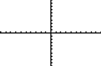 |     Choose 3 values of x to evaluate for each.        | *x* | *y* | | :--- | :--- | |  |  | |  |  | |  |  |

2. | Name | Equation | Graph | | :--- | :--- | :--- | | Identity | *y*=*x* |  |   Choose 3 values of x to evaluate for each.        | *x* | *y* | | :--- | :--- | |  |  | |  |  | |  |  |

3. | Name | Equation | Graph | | :--- | :--- | :--- | | Absolute Value | *y*=|*x*| |  |   Choose 3 values of x to evaluate for each.        | *x* | *y* | | :--- | :--- | |  |  | |  |  | |  |  |

4. | Name | Equation | Graph | | :--- | :--- | :--- | | Quadratic | *y*=*x*2 |  |   Choose 3 values of x to evaluate for each.        | *x* | *y* | | :--- | :--- | |  |  | |  |  | |  |  |

5. | Name | Equation | Graph | | :--- | :--- | :--- | | Cubic | *y*=*x*3 |  |   Choose 3 values of x to evaluate for each.        | *x* | *y* | | :--- | :--- | |  |  | |  |  | |  |  |

6. | Name | Equation | Graph | | :--- | :--- | :--- | | Reciprocal | $y=\frac{1}{x}$ |  |   Choose 3 values of x to evaluate for each.        | *x* | *y* | | :--- | :--- | |  |  | |  |  | |  |  |

7. | Name | Equation | Graph | | :--- | :--- | :--- | | Square Root | $y=\sqrt{x}$ |  |   Choose 3 values of x to evaluate for each.        | *x* | *y* | | :--- | :--- | |  |  | |  |  | |  |  |

8. | Name | Equation | Graph | | :--- | :--- | :--- | | Cube Root | $y=\sqrt[3]{x}$ |  |   Choose 3 values of x to evaluate for each.        | *x* | *y* | | :--- | :--- | |  |  | |  |  | |  |  |

9. | Name | Equation | Graph | | :--- | :--- | :--- | | Exponential | $y={e}^{x}$ |  |   Choose 3 values of x to evaluate for each.        | *x* | *y* | | :--- | :--- | |  |  | |  |  | |  |  |

## Objective 2:  Graph quadratic functions using transformations (IA 9.7.4)

When we modify basic functions by adding, subtracting, or multiplying constants to the equation, very systematic changes take place. We call these **transformations** of basic functions. Here we will investigate the effects of vertical shifts, horizontal shifts, vertical stretches or compressions, and reflections on quadratic functions. We could use any basic function to illustrate transformations, but quadratics work nicely because we can easily keep track of a point called the vertex.

### Practice Makes Perfect
The graphs of quadratic functions are called parabolas. Use a graphing program to graph each of the following quadratic functions. For each graph find the vertex (the minimum or maximum value) of the parabola and list its coordinates. Most importantly use the patterns observed to answer each of the given questions.
10. In general, what effect does adding or subtracting a constant have on the graph of $f\left(x\right)={x}^{2}$ ?      |     $f\left(x\right)={x}^{2}$  vertex: ________ |     $f\left(x\right)={x}^{2}+2$  vertex: ________ |     $f\left(x\right)={x}^{2}\u20134$  vertex: ________ | | :--- | :--- | :--- |

11. In general, what effect does adding or subtracting a value to x before it is squared have on the graph of $f\left(x\right)={x}^{2}$ ?    |     $f\left(x\right)={(x-2)}^{2}$  vertex: ________ |     $f\left(x\right)={(x-4)}^{2}$  vertex: ________ |     $f\left(x\right)={(x+3)}^{2}$  vertex: ________ | | :--- | :--- | :--- |

12. In general, what effect does multiplying by a constant have on the graph of $f\left(x\right)={x}^{2}$ ?    |     $f\left(x\right)=2{x}^{2}$  vertex: ________ |     $f\left(x\right)=5{x}^{2}$  vertex: ________ |     $f\left(x\right)=\frac{1}{10}{x}^{2}$  vertex: ________ | | :--- | :--- | :--- |

13. In general, what effect does multiplying by a negative constant have on the graph of $f\left(x\right)={x}^{2}$ ?    |     $f\left(x\right)=\u2013{x}^{2}$  vertex: ________ |     $f\left(x\right)=\u20133{x}^{2}$  vertex: ________ |     $y={(x\u20132)}^{2}$  vertex: ________ | | :--- | :--- | :--- |

14. |     $f\left(x\right)={(x+3)}^{2}+2$  vertex: ________ |     $f\left(x\right)={(x+3)}^{2}\u20132$  vertex: ________ |     $f\left(x\right)={(x\u20133)}^{2}+2$  vertex: ________ |     $f\left(x\right)={(x\u20133)}^{2}\u20132$  vertex: ________ | | :--- | :--- | :--- | :--- |

15. Answer each of the following based on the changes you saw in the graphs above.                 ⓐ Based on your observations from the previous graphs, what are the coordinates of the vertex of the parabola $f\left(x\right)={(x+200)}^{2}-67$ ? Do not attempt to graph!                        ⓑ Based on your observations from the previous graphs, what are the coordinates of the vertex of the parabola $f\left(x\right)=12{(x+6)}^{2}+111$ ? Do not attempt to graph!

16. Fill in the blanks:                ⓐ If *c* > 0, the graph of $y=f\left(x\right)+c$ is obtained by shifting the graph of $y=f\left(x\right)$ to the ________ a distance of *c* units. The graph of $y=f\left(x\right)\u2013c$ is obtained by shifting the graph of $y=f\left(x\right)$ to the ________ a distance of *c* units.                        ⓑ If *c* > 0, the graph of $y=f\left(x\right)\u2013c$ is obtained by shifting the graph of $y=f\left(x\right)$ to the ________ a distance of *c* units. The graph of $y=f\left(x\right)+c$ is obtained by shifting the graph of $y=f\left(x\right)$ to the ________ a distance of *c* units.

17. Apply what you have learned in this skill sheet regarding transformations. Write the equation of a quadratic function that has been transformed in the each of the ways described in parts ⓐ and ⓑ below. Write equations in *f*(*x*) =   form. After writing an equation check your answer using a graphing program and graph below. Be sure to label the vertex as an ordered pair. Does your graph match the description?                       ⓐ Flipped upside down and shifted to the right 3 units and down 2 units. *f*(*x*) =                                 ⓑ Stretched vertically by a factor of 4 and shifted left 6 units and up 5 units. *f*(*x*) =    

18. Remember the basic transformations investigated in this activity apply to all basic functions. Apply what you have learned in this lab about transformations. Write the equation of a function that has been transformed in the following ways. Write equations in *f*(*x*) =   form. After writing an equation check your answer using a graphing program and graph below. Be sure to label a point on the graph. Does your graph match the description?                       ⓐ Begin with a basic square root function. Reflect the graph over the x-axis and shift it to the right 2 units and down 1 unit. *f*(*x*) =                                 ⓑ Begin with an absolute value function. Stretch the graph vertically by a factor of 3 and shift it left 4 units and up 5 units. *f*(*x*) =    

We all know that a flat mirror enables us to see an accurate image of ourselves and whatever is behind us. When we tilt the mirror, the images we see may shift horizontally or vertically. But what happens when we bend a flexible mirror? Like a carnival funhouse mirror, it presents us with a distorted image of ourselves, stretched or compressed horizontally or vertically. In a similar way, we can distort or transform mathematical functions to better adapt them to describing objects or processes in the real world. In this section, we will take a look at several kinds of transformations.

# Graphing Functions Using Vertical and Horizontal Shifts
Often when given a problem, we try to model the scenario using mathematics in the form of words, tables, graphs, and equations. One method we can employ is to adapt the basic graphs of the toolkit functions to build new models for a given scenario. There are systematic ways to alter functions to construct appropriate models for the problems we are trying to solve.

## Identifying Vertical Shifts
One simple kind of **transformation** involves shifting the entire graph of a function up, down, right, or left. The simplest shift is a *vertical shift*, moving the graph up or down, because this transformation involves adding a positive or negative constant to the function. In other words, we add the same constant to the output value of the function regardless of the input. For a function $g(x)=f(x)+k,$ the function $f\left(x\right)$ is shifted vertically $k$ units. See  for an example.

![Vertical shift by $k=1$ of the cube root function $f(x)=\sqrt[3]{x}.$](../../media/CNX_Precalc_Figure_01_05_001.jpg)

To help you visualize the concept of a vertical shift, consider that $y=f\left(x\right).$ Therefore, $f\left(x\right)+k$ is equivalent to $y+k.$ Every unit of $y$ is replaced by $y+k,$ so the *y*-value increases or decreases depending on the value of $k.$ The result is a shift upward or downward.

>
>
>
>
> **Vertical Shift**
>
>
> Given a function $f\left(x\right),$ a new function $g(x)=f(x)+k,$ where $k$ is a constant, is a **vertical shift** of the function $f\left(x\right).$ All the output values change by $k$ units. If $k$ is positive, the graph will shift up. If $k$ is negative, the graph will shift down.

19. **Adding a Constant to a Function**    To regulate temperature in a green building, airflow vents near the roof open and close throughout the day.  shows the area of open vents $V$ (in square feet) throughout the day in hours after midnight, $t.$ During the summer, the facilities manager decides to try to better regulate temperature by increasing the amount of open vents by 20 square feet throughout the day and night. Sketch a graph of this new function.     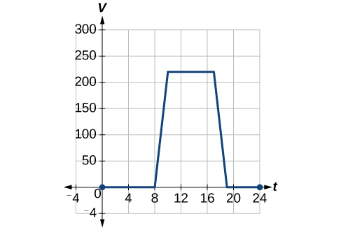

Solution

We can sketch a graph of this new function by adding 20 to each of the output values of the original function. This will have the effect of shifting the graph vertically up, as shown in .

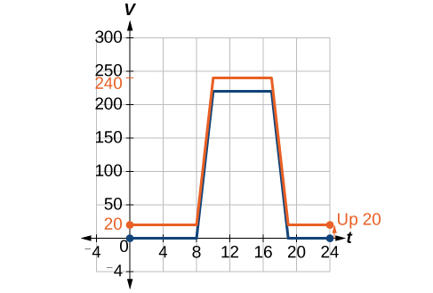

 Notice that in , for each input value, the output value has increased by 20, so if we call the new function $S\left(t\right),$ we could write

 $$
S(t)=V(t)+20
$$ This notation tells us that, for any value of $t,S(t)$ can be found by evaluating the function $V$ at the same input and then adding 20 to the result. This defines $S$ as a transformation of the function $V,$ in this case a vertical shift up 20 units. Notice that, with a vertical shift, the input values stay the same and only the output values change. See .

| *$t$* | 0 | 8 | 10 | 17 | 19 | 24 |
| :--- | :--- | :--- | :--- | :--- | :--- | :--- |
| *$V(t)$* | 0 | 0 | 220 | 220 | 0 | 0 |
| *$S\left(t\right)$* | 20 | 20 | 240 | 240 | 20 | 20 |

>
> How To
> *Given a tabular function, create a new row to represent a vertical shift.*
>
>
> Identify the output row or column.
> Determine the **magnitude** of the shift.
> Add the shift to the value in each output cell. Add a positive value for up or a negative value for down.
>

20. **Shifting a Tabular Function Vertically**   A function $f\left(x\right)$ is given in . Create a table for the function $g(x)=f(x)-3.$    | *$x$* | 2 | 4 | 6 | 8 | | :--- | :--- | :--- | :--- | :--- | | *$f(x)$* | 1 | 3 | 7 | 11 |

Solution

The formula $g(x)=f(x)-3$ tells us that we can find the output values of $g$ by subtracting 3 from the output values of $f.$ For example:

  $$
\begin{array}{cccc}  f(2)& =& 1  & \text{Given}  \\   g(x)& =& f(x)-3  & \text{Given\ transformation}  \\   g(2)& =& f(2)-3  & \\ & =& 1-3  & \\ & =& -2  & \end{array}
$$

Subtracting 3 from each $f\left(x\right)$ value, we can complete a table of values for $g\left(x\right)$ as shown in .

| *$x$* | 2 | 4 | 6 | 8 |
| :--- | :--- | :--- | :--- | :--- |
| *$f(x)$* | 1 | 3 | 7 | 11 |
| *$g(x)$* | −2 | 0 | 4 | 8 |

>
> Try It
> 21. The function $h(t)=-4.9{t}^{2}+30t$ gives the height $h$ of a ball (in meters) thrown upward from the ground after $t$ seconds. Suppose the ball was instead thrown from the top of a 10-m building. Relate this new height function $b(t)$ to $h(t),$ and then find a formula for $b(t).$
>
> 

> 
Solution

>
> $$
> b(t)=h(t)+10=-4.9{t}^{2}+30t+10
> $$
> 

>
>

## Identifying Horizontal Shifts
We just saw that the vertical shift is a change to the output, or outside, of the function. We will now look at how changes to input, on the inside of the function, change its graph and meaning. A shift to the input results in a movement of the graph of the function left or right in what is known as a *horizontal shift*, shown in .

![Horizontal shift of the function $f(x)=\sqrt[3]{x}.$ Note that $(x+1)$ means $h=\mathrm{\u20131}$, which shifts the graph to the left, that is, towards *negative* values of $x.$](../../media/CNX_Precalc_Figure_01_05_004.jpg)

For example, if $f(x)={x}^{2},$ then $g(x)={(x-2)}^{2}$ is a new function. Each input is reduced by 2 prior to squaring the function. The result is that the graph is shifted 2 units to the right, because we would need to increase the prior input by 2 units to yield the same output value as given in $f.$ 

>
>
>
>
> **Horizontal Shift**
>
>
> Given a function $f,$ a new function $g\left(x\right)=f\left(x-h\right),$ where $h$ is a constant, is a **horizontal shift** of the function $f.$ If $h$ is positive, the graph will shift right. If $h$ is negative, the graph will shift left.

22. **Adding a Constant to an Input**    Returning to our building airflow example from , suppose that in autumn the facilities manager decides that the original venting plan starts too late, and wants to begin the entire venting program 2 hours earlier. Sketch a graph of the new function.

Solution

We can set $V\left(t\right)$ to be the original program and $F\left(t\right)$ to be the revised program.

  $$
\begin{array}{ccc}  V(t)& =& \text{the\ original\ venting\ plan}  \\   F(t)& =& \text{starting\ 2\ hrs\ sooner}  \end{array}
$$

In the new graph, at each time, the airflow is the same as the original function $V$ was 2 hours later. For example, in the original function $V,$ the airflow starts to change at 8 a.m., whereas for the function $F,$ the airflow starts to change at 6 a.m. The comparable function values are $V(8)=F(6).$ See . Notice also that the vents first opened to $220{\phantom{\rule{0.5em}{0ex}}\text{ft}}^{2}$ at 10 a.m. under the original plan, while under the new plan the vents reach $220{\phantom{\rule{0.5em}{0ex}}\text{ft}}^{\text{2}}$ at 8 a.m., so $V(10)=F(8).$ 
In both cases, we see that, because $F\left(t\right)$ starts 2 hours sooner, $h=-2.$ That means that the same output values are reached when $F(t)=V(t-\left(-2\right))=V\left(t+2\right).$ 

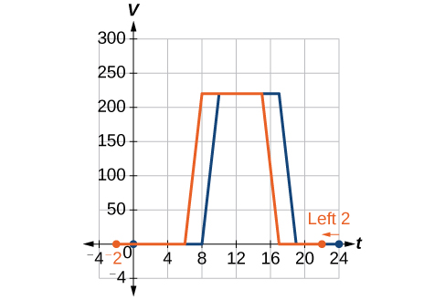

>
> How To
> *Given a tabular function, create a new row to represent a horizontal shift.*
>
>
> Identify the input row or column.
> Determine the magnitude of the shift.
> Add the shift to the value in each input cell.
>

23. **Shifting a Tabular Function Horizontally**    A function $f(x)$ is given in . Create a table for the function $g(x)=f(x-3).$    | *$x$* | 2 | 4 | 6 | 8 | | :--- | :--- | :--- | :--- | :--- | | *$f(x)$* | 1 | 3 | 7 | 11 |

Solution

The formula $g(x)=f(x-3)$ tells us that the output values of $g$ are the same as the output value of $f$ when the input value is 3 less than the original value. For example, we know that $f(2)=1.$ To get the same output from the function $g,$ we will need an input value that is 3 *larger*. We input a value that is 3 larger for $g(x)$ because the function takes 3 away before evaluating the function $f.$
 

  $$
\begin{array}{ccc}  g(5)& =& f(5-3)  \\ & =& f(2)  \\ & =& 1  \end{array}
$$

We continue with the other values to create .

 

| *$x$* | 5 | 7 | 9 | 11 |
| :--- | :--- | :--- | :--- | :--- |
| *$x-3$* | 2 | 4 | 6 | 8 |
| *$f(x\u20133)$* | 1 | 3 | 7 | 11 |
| *$g(x)$* | 1 | 3 | 7 | 11 |

The result is that the function $g(x)$ has been shifted to the right by 3. Notice the output values for $g(x)$ remain the same as the output values for $f(x),$ but the corresponding input values, $x,$ have shifted to the right by 3. Specifically, 2 shifted to 5, 4 shifted to 7, 6 shifted to 9, and 8 shifted to 11.

24. **Identifying a Horizontal Shift of a Toolkit Function**     represents a transformation of the toolkit function $f(x)={x}^{2}.$ Relate this new function $g(x)$ to $f(x),$ and then find a formula for $g(x).$      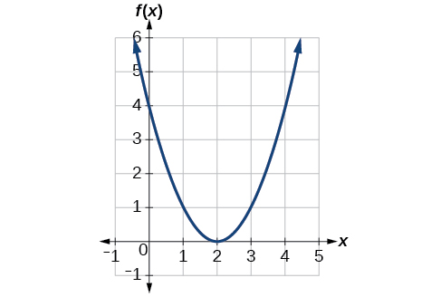

Solution

Notice that the graph is identical in shape to the $f(x)={x}^{2}$ function, but the *x-*values are shifted to the right 2 units. The vertex used to be at (0,0), but now the vertex is at (2,0). The graph is the basic quadratic function shifted 2 units to the right, so

 $$
g(x)=f(x-2)
$$
Notice how we must input the value $x=2$ to get the output value $y=0;$ the*x*-values must be 2 units larger because of the shift to the right by 2 units. We can then use the definition of the $f(x)$ function to write a formula for $g(x)$ by evaluating $f(x-2).$

  $$
\begin{array}{ccc}  f(x)& =& {x}^{2}  \\   g(x)& =& f(x-2)  \\   g(x)& =& f(x-2)={(x-2)}^{2}  \end{array}
$$

25. **Interpreting Horizontal versus Vertical Shifts**    The function $G(m)$ gives the number of gallons of gas required to drive $m$ miles. Interpret $G(m)+10$ and $G(m+10).$

Solution

$G(m)+10$ can be interpreted as adding 10 to the output, gallons. This is the gas required to drive $m$ miles, plus another 10 gallons of gas. The graph would indicate a vertical shift.

  $G(m+10)$ can be interpreted as adding 10 to the input, miles. So this is the number of gallons of gas required to drive 10 miles more than $m$ miles. The graph would indicate a horizontal shift.

> Try It
> 26. Given the function $f(x)=\sqrt{x},$ graph the original function $f(x)$ and the transformation $g(x)=f(x+2)$ on the same axes. Is this a horizontal or a vertical shift? Which way is the graph shifted and by how many units?
>
> 

> 
Solution

>
> The graphs of $f(x)$ and $g(x)$ are shown below. The transformation is a horizontal shift. The function is shifted to the left by 2 units.
>
>
>
>
>
> 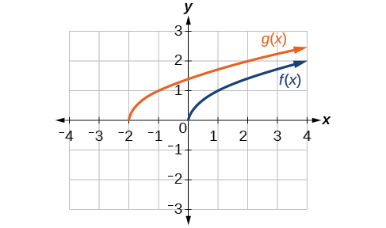
> 

>
>

## Combining Vertical and Horizontal Shifts
Now that we have two transformations, we can combine them. Vertical shifts are outside changes that affect the output (*y*-) values and shift the function up or down. Horizontal shifts are inside changes that affect the input (*x*-) values and shift the function left or right. Combining the two types of shifts will cause the graph of a function to shift up or down *and* left or right.

>
>  How To
>  *Given a function and both a vertical and a horizontal shift, sketch the graph.*
>
>
> Identify the vertical and horizontal shifts from the formula.
> The vertical shift results from a constant added to the output. Move the graph up for a positive constant and down for a negative constant.
> The horizontal shift results from a constant added to the input. Move the graph left for a positive constant and right for a negative constant.
> Apply the shifts to the graph in either order.
>

27. **Graphing Combined Vertical and Horizontal Shifts**    Given $f(x)=\left|x\right|,$ sketch a graph of $h(x)=f(x+1)-3.$

Solution

The function $f$ is our toolkit absolute value function. We know that this graph has a V shape, with the point at the origin. The graph of $h$ has transformed $f$ in two ways: $f(x+1)$ is a change on the inside of the function, giving a horizontal shift left by 1, and the subtraction by 3 in $f(x+1)-3$ is a change to the outside of the function, giving a vertical shift down by 3. The transformation of the graph is illustrated in .

 Let us follow one point of the graph of $f(x)=\left|x\right|.$ 

The point $(0,0)$ is transformed first by shifting left 1 unit: $(0,0)\to (\mathrm{-1},0)$ 
The point $(\mathrm{-1},0)$ is transformed next by shifting down 3 units: $(\mathrm{-1},0)\to (\mathrm{-1},\mathrm{-3})$ 

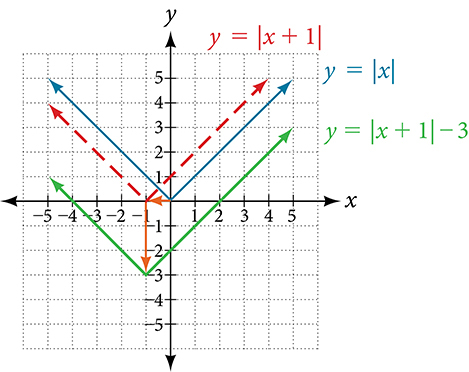

   shows the graph of $h.$
 

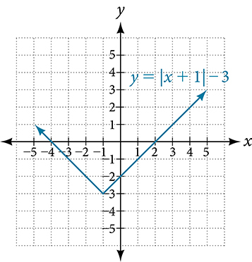

>
> Try It
>  28. Given $f(x)=\left|x\right|,$ sketch a graph of $h(x)=f(x-2)+4.$
>
> 

> 
Solution

>
> 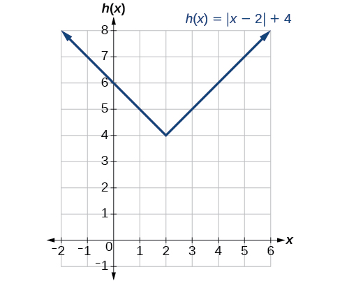
> 

>

29. **Identifying Combined Vertical and Horizontal Shifts**    Write a formula for the graph shown in , which is a transformation of the toolkit square root function.     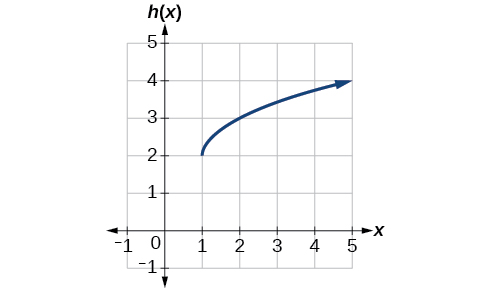

Solution

The graph of the toolkit function starts at the origin, so this graph has been shifted 1 to the right and up 2. In function notation, we could write that as 

  $$
h(x)=f(x-1)+2
$$
Using the formula for the square root function, we can write

 $$
h(x)=\sqrt{x-1}+2
$$

>
> Try It
> 30. Write a formula for a transformation of the toolkit reciprocal function $f\left(x\right)=\frac{1}{x}$ that shifts the function’s graph one unit to the right and one unit up.
>
> 

> 
Solution

>
> $g\left(x\right)=\frac{1}{x-1}+1$
> 

>
>

 
# Graphing Functions Using Reflections about the Axes
Another transformation that can be applied to a function is a reflection over the *x*- or *y*-axis. A *vertical reflection* reflects a graph vertically across the *x*-axis, while a *horizontal reflection* reflects a graph horizontally across the *y*-axis. The reflections are shown in .

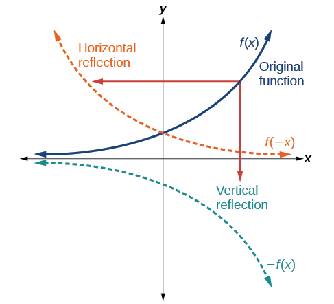

Notice that the vertical reflection produces a new graph that is a mirror image of the base or original graph about the *x*-axis. The horizontal reflection produces a new graph that is a mirror image of the base or original graph about the *y*-axis.

>
>
>
>
> **Reflections**
>
>
>    Given a function $f(x),$ a new function $g(x)=-f(x)$ is a **vertical reflection** of the function $f(x),$ sometimes called a reflection about (or over, or through) the *x*-axis.
> Given a function $f(x),$ a new function $g(x)=f(-x)$ is a **horizontal reflection** of the function $f(x),$ sometimes called a reflection about the *y*-axis.

>
>    How To
>    *Given a function, reflect the graph both vertically and horizontally.*
>
>    Multiply all outputs by –1 for a vertical reflection. The new graph is a reflection of the original graph about the *x*-axis.
>    Multiply all inputs by –1 for a horizontal reflection. The new graph is a reflection of the original graph about the *y*-axis.
>

31. **Reflecting a Graph Horizontally and Vertically**        Reflect the graph of $s(t)=\sqrt{t}$ (a) vertically and (b) horizontally.

Solution

ⓐReflecting the graph vertically means that each output value will be reflected over the horizontal *t-*axis as shown in .

    

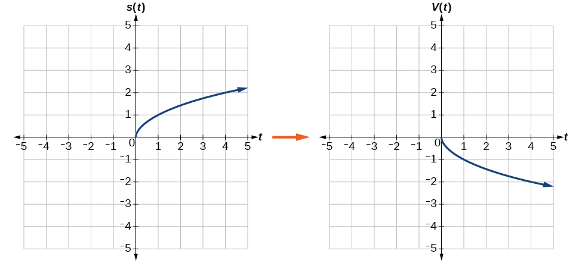

    Because each output value is the opposite of the original output value, we can write

       $$
V(t)=-s(t)\phantom{\rule{0.5em}{0ex}}\text{or\}V(t)=-\sqrt{t}
$$
     Notice that this is an outside change, or vertical shift, that affects the output $s(t)$ values, so the negative sign belongs outside of the function.

    
    ⓑ
     Reflecting horizontally means that each input value will be reflected over the vertical axis as shown in .

    

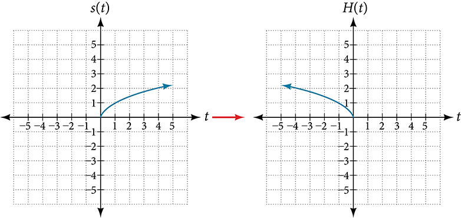

    Because each input value is the opposite of the original input value, we can write

      $$
H(t)=s(-t)\phantom{\rule{0.5em}{0ex}}\text{or\}H(t)=\sqrt{-t}
$$
     Notice that this is an inside change or horizontal change that affects the input values, so the negative sign is on the inside of the function.

Note that these transformations can affect the domain and range of the functions. While the original square root function has domain $[0,\infty )$ and range $[0,\infty ),$ the vertical reflection gives the $V(t)$ function the range $\left(-\infty ,\phantom{\rule{0.5em}{0ex}}0\right]$ and the horizontal reflection gives the $H(t)$ function the domain $\left(-\infty ,\phantom{\rule{0.5em}{0ex}}0\right].$

  

>
>    Try It
>    32. Reflect the graph of $f(x)=|x-1|$ (a) vertically and (b) horizontally.
>
> 

> 
Solution

>
> ⓐ
>
>
>
> 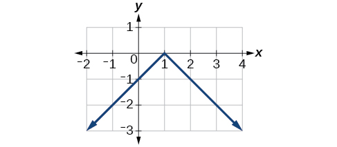
>
>
>
>
>   ⓑ
>
>
> 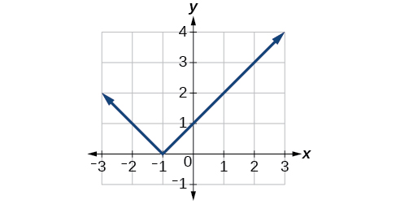
> 

>
>
>

   33. **Reflecting a Tabular Function Horizontally and Vertically**        A function $f(x)$ is given as . Create a table for the functions below.       ⓐ $g(x)=-f(x)$              ⓑ $h(x)=f(\mathrm{-}x)$               | *$x$* | 2 | 4 | 6 | 8 | | :--- | :--- | :--- | :--- | :--- | | *$f(x)$* | 1 | 3 | 7 | 11 |

Solution

ⓐ	For $g(x),$ the negative sign outside the function indicates a vertical reflection, so the *x*-values stay the same and each output value will be the opposite of the original output value. See .

| *$x$* | 2 | 4 | 6 | 8 |
| :--- | :--- | :--- | :--- | :--- |
| *$g(x)$* | –1 | –3 | –7 | –11 |

     ⓑFor $h(x),$ the negative sign inside the function indicates a horizontal reflection, so each input value will be the opposite of the original input value and the $h(x)$ values stay the same as the $f(x)$ values. See .

| *$x$* | −2 | −4 | −6 | −8 |
| :--- | :--- | :--- | :--- | :--- |
| *$h(x)$* | 1 | 3 | 7 | 11 |

  

>
>    Try It
>   34. A function $f(x)$ is given as . Create a table for the functions below.     ⓐ $g(x)=-f(x)$        ⓑ $h(x)=f(-x)$         | *$x$* | −2 | 0 | 2 | 4 | | :--- | :--- | :--- | :--- | :--- | | *$f(x)$* | 5 | 10 | 15 | 20 |
>
> 

> 
Solution

>
> ⓐ $g(x)=-f(x)$
>
>
>
>
> | $x$ | -2 | 0 | 2 | 4 |
> | :--- | :--- | :--- | :--- | :--- |
> | $g(x)$ | $-5$ | $-10$ | $-15$ | $-20$ |
>
>
>
>   ⓑ
>     $h(x)=f(\text{\u2212}x)$
>
>
>
> | $x$ | -2 | 0 | 2 | 4 |
> | :--- | :--- | :--- | :--- | :--- |
> | $h(x)$ | 15 | 10 | 5 | unknown |
> 

>

35. **Applying a Learning Model Equation**        A common model for learning has an equation similar to $k(t)=-{2}^{-t}+1,$ where $k$ is the percentage of mastery that can be achieved after $t$ practice sessions. This is a transformation of the function $f(t)={2}^{t}$ shown in . Sketch a graph of $k(t).$         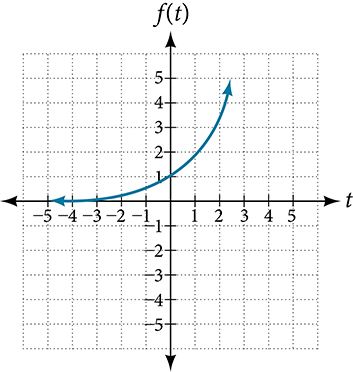

Solution

This equation combines three transformations into one equation. 

    A horizontal reflection: $f(\text{\u2212}t)={2}^{-t}$
     
     A vertical reflection: $-f(\text{\u2212}t)=-{2}^{-t}$
     
     A vertical shift: $-f(\text{\u2212}t)+1=-{2}^{-t}+1$
     
    We can sketch a graph by applying these transformations one at a time to the original function. Let us follow two points through each of the three transformations. We will choose the points (0, 1) and (1, 2).
First, we apply a horizontal reflection: (0, 1) (–1, 2).
     Then, we apply a vertical reflection: (0, -1) (-1, –2)
    Finally, we apply a vertical shift: (0, 0) (-1, -1)).
    This means that the original  points, (0,1) and (1,2) become (0,0) and (-1,-1) after we apply the transformations.
In , the first graph results from a horizontal reflection. The second results from a vertical reflection. The third results from a vertical shift up 1 unit.

    

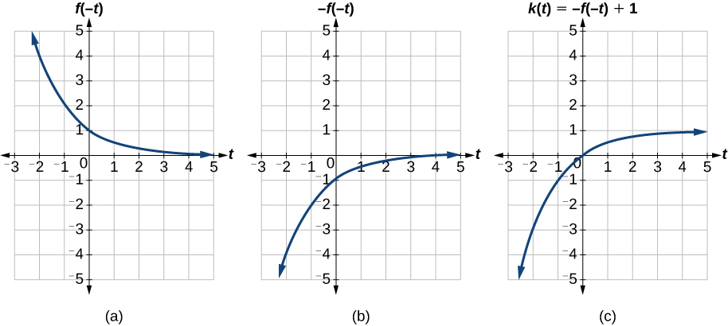

  

>
>    Try It
>    36. Given the toolkit function $f(x)={x}^{2},$ graph $g(x)=-f(x)$ and $h(x)=f(-x).$ Take note of any surprising behavior for these functions.
>
> 

> 
Solution

>
> 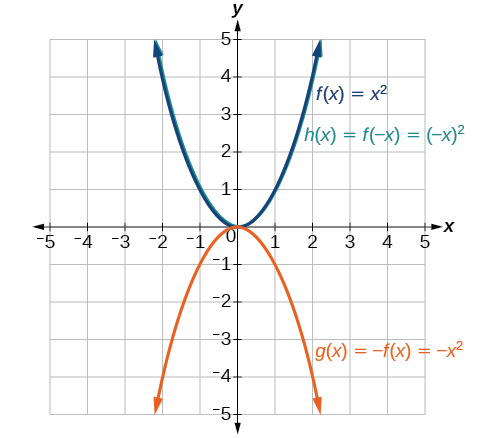
>
>
>      Notice: $g(x)=f(-x)$ looks the same as $f(x)$ .
> 

>

 
# Determining Even and Odd Functions
Some functions exhibit symmetry so that reflections result in the original graph. For example, horizontally reflecting the toolkit functions $f(x)={x}^{2}$ or $f(x)=\left|x\right|$ will result in the original graph. We say that these types of graphs are symmetric about the *y*-axis. A function whose graph is symmetric about the *y*-axis is called an *even function.*
If the graphs of $f(x)={x}^{3}$ or $f(x)=\frac{1}{x}$ were reflected over *both* axes, the result would be the original graph, as shown in .

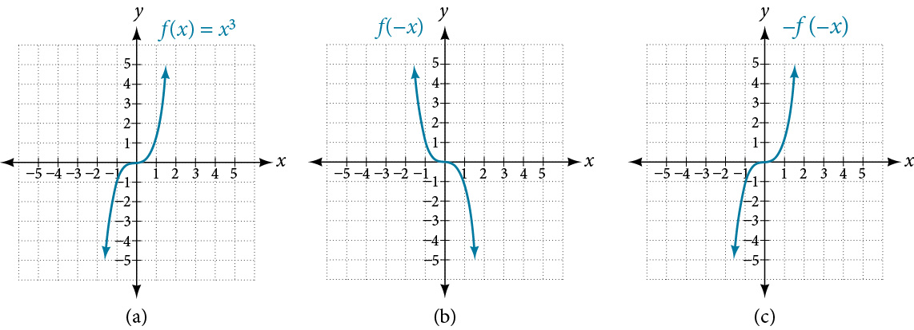

We say that these graphs are symmetric about the origin. A function with a graph that is symmetric about the origin is called an *odd function*.
Note: A function can be neither even nor odd if it does not exhibit either symmetry. For example, $f(x)={2}^{x}$ is neither even nor odd. Also, the only function that is both even and odd is the constant function $f(x)=0.$
  

>
>
>
>
> **Even and Odd Functions**
>
>
>    A function is called an **even function** if for every input $x$
>
>
>     $$
> f(x)=f(-x)
> $$
>
> The graph of an even function is symmetric about the $y\text{-}$ axis.
>
> A function is called an **odd function** if for every input $x$
>
>
>     $$
> f(x)=-f(-x)
> $$
>    The graph of an odd function is symmetric about the origin.
>
>

>
>    How To
>    *Given the formula for a function, determine if the function is even, odd, or neither.*
>
>    Determine whether the function satisfies $f(x)=f(-x).$ If it does, it is even.
>     Determine whether the function satisfies $f(x)=-f(-x).$ If it does, it is odd.
>    If the function does not satisfy either rule, it is neither even nor odd.
>

37. **Determining whether a Function Is Even, Odd, or Neither**        Is the function $f(x)={x}^{3}+2x$ even, odd, or neither?

Solution

Without looking at a graph, we can determine whether the function is even or odd by finding formulas for the reflections and determining if they return us to the original function. Let’s begin with the rule for even functions.

      $$
f(-x)={(-x)}^{3}+2(-x)=-{x}^{3}-2x
$$
     
    This does not return us to the original function, so this function is not even. We can now test the rule for odd functions.

      $$
-f(-x)=-\left(-{x}^{3}-2x\right)={x}^{3}+2x
$$
     
     Because $-f(-x)=f(x),$ this is an odd function.

  

>
>    Try It
>    38. Is the function $f(s)={s}^{4}+3{s}^{2}+7$ even, odd, or neither?
>
> 

> 
Solution

>
> even
> 

>
>
>

# Graphing Functions Using Stretches and Compressions
Adding a constant to the inputs or outputs of a function changed the position of a graph with respect to the axes, but it did not affect the shape of a graph. We now explore the effects of multiplying the inputs or outputs by some quantity.
We can transform the inside (input values) of a function or we can transform the outside (output values) of a function. Each change has a specific effect that can be seen graphically.

## Vertical Stretches and Compressions
When we multiply a function by a positive constant, we get a function whose graph is stretched or compressed vertically in relation to the graph of the original function. If the constant is greater than 1, we get a *vertical stretch*; if the constant is between 0 and 1, we get a*vertical compression*.  shows a function multiplied by constant factors 2 and 0.5 and the resulting vertical stretch and compression.

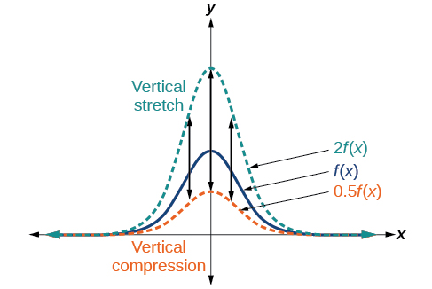

>
>
>
>
> **Vertical Stretches and Compressions**
>
>
>  Given a function $f(x),$ a new function $g(x)=af(x),$ where $a$ is a constant, is a **vertical stretch** or **vertical compression** of the function $f(x).$
>
>
>
>  If $a>1,$ then the graph will be stretched.
>  If $0<a<1,$ then the graph will be compressed.
>  If $a<0,$ then there will be combination of a vertical stretch or compression with a vertical reflection.
>

>
>  How To
>
>   *Given a function, graph its vertical stretch.*
>
>
> Identify the value of $a.$
>
>  Multiply all range values by $a.$ 
>
> If $a>1,$ the graph is stretched by a factor of $a.$ 
>
>  If $0<a<1,$ the graph is compressed by a factor of $a.$ 
>
>  If $a<0,$ the graph is either stretched or compressed and also reflected about the *x*-axis.
>

39. **Graphing a Vertical Stretch**    A function $P\left(t\right)$ models the population of fruit flies. The graph is shown in .     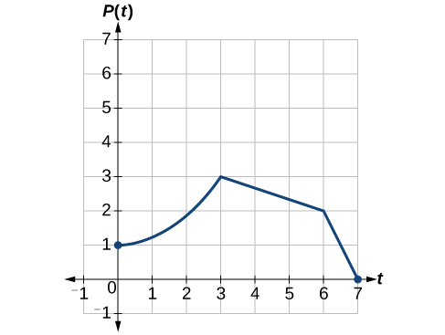     A scientist is comparing this population to another population, $Q,$ whose growth follows the same pattern, but is twice as large. Sketch a graph of this population.

Solution

Because the population is always twice as large, the new population’s output values are always twice the original function’s output values. Graphically, this is shown in .

 If we choose four reference points, (0, 1), (3, 3), (6, 2) and (7, 0) we will multiply all of the outputs by 2.
The following shows where the new points for the new graph will be located.

  $$
\begin{array}{l}\left(0,\phantom{\rule{0.5em}{0ex}}\text{}1\right)\to \left(0,\phantom{\rule{0.5em}{0ex}}\text{}2\right)  \\ \left(3,\phantom{\rule{0.5em}{0ex}}\text{}3\right)\to \left(3,\phantom{\rule{0.5em}{0ex}}\text{}6\right)  \\ \left(6,\phantom{\rule{0.5em}{0ex}}\text{}2\right)\to \left(6,\phantom{\rule{0.5em}{0ex}}\text{}4\right)  \\ \left(7,\phantom{\rule{0.5em}{0ex}}\text{}0\right)\to \left(7,\phantom{\rule{0.5em}{0ex}}\text{}0\right)  \end{array}
$$
 

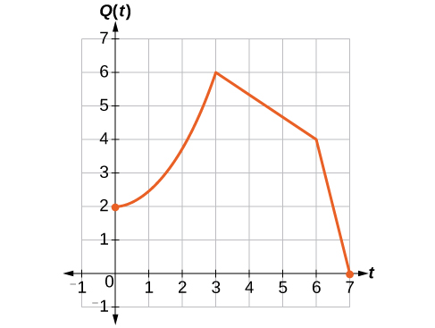

Symbolically, the relationship is written as

  $$
Q(t)=2P(t)
$$
 This means that for any input $t,$ the value of the function $Q$ is twice the value of the function $P.$ Notice that the effect on the graph is a vertical stretching of the graph, where every point doubles its distance from the horizontal axis. The input values, $t,$ stay the same while the output values are twice as large as before.

>
> How To
>  *Given a tabular function and assuming that the transformation is a vertical stretch or compression, create a table for a vertical compression.*
>
> Determine the value of $a.$
>
>  Multiply all of the output values by $a.$
>

40. **Finding a Vertical Compression of a Tabular Function**    A function $f$ is given as . Create a table for the function $g(x)=\frac{1}{2}f(x).$       | *$x$* | 2 | 4 | 6 | 8 | | :--- | :--- | :--- | :--- | :--- | | *$f(x)$* | 1 | 3 | 7 | 11 |

Solution

The formula $g(x)=\frac{1}{2}f(x)$ tells us that the output values of $g$ are half of the output values of $f$ with the same inputs. For example, we know that $f(4)=3.$ Then 

  $$
g(4)=\frac{1}{2}f(4)=\frac{1}{2}(3)=\frac{3}{2}
$$
 We do the same for the other values to produce .

 

| *$x$* | $2$ | $4$ | $6$ | $8$ |
| :--- | :--- | :--- | :--- | :--- |
| *$g(x)$* | $\frac{1}{2}$ | $\frac{3}{2}$ | $\frac{7}{2}$ | $\frac{11}{2}$ |

>
>  Try It
>  41. A function $f$ is given as . Create a table for the function $g(x)=\frac{3}{4}f(x).$     | $x$ | 2 | 4 | 6 | 8 | | :--- | :--- | :--- | :--- | :--- | | $f(x)$ | 12 | 16 | 20 | 0 |
>
> 

> 
Solution

>
> | $x$ | 2 | 4 | 6 | 8 |
> | :--- | :--- | :--- | :--- | :--- |
> | $g(x)$ | 9 | 12 | 15 | 0 |
> 

>
>

42. **Recognizing a Vertical Stretch**    The graph in  is a transformation of the toolkit function $f(x)={x}^{3}.$ Relate this new function $g(x)$ to $f(x),$ and then find a formula for $g(x).$       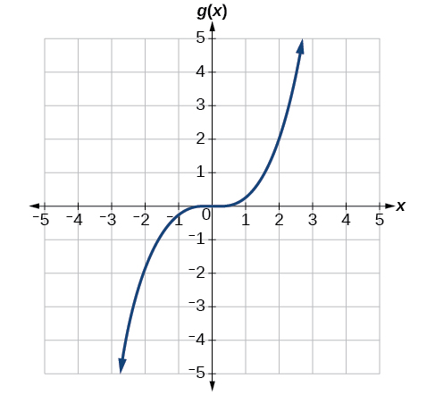

Solution

When trying to determine a vertical stretch or shift, it is helpful to look for a point on the graph that is relatively clear. In this graph, it appears that $g(2)=2.$ With the basic cubic function at the same input, $f(2)={2}^{3}=8.$ Based on that, it appears that the outputs of $g$ are $\frac{1}{4}$ the outputs of the function $f$ because $g(2)=\frac{1}{4}f(2).$ From this we can fairly safely conclude that $g(x)=\frac{1}{4}f(x).$

We can write a formula for $g$ by using the definition of the function $f.$
 

  $$
g(x)=\frac{1}{4}f(x)=\frac{1}{4}{x}^{3}
$$

>
>  Try It
>  43. Write the formula for the function that we get when we stretch the identity toolkit function by a factor of 3, and then shift it down by 2 units.
>
> 

> 
Solution

>
> $g(x)=3x-2$
> 

>
>

## Horizontal Stretches and Compressions
Now we consider changes to the inside of a function. When we multiply a function’s input by a positive constant, we get a function whose graph is stretched or compressed horizontally in relation to the graph of the original function. If the constant is between 0 and 1, we get a *horizontal stretch*; if the constant is greater than 1, we get a *horizontal compression* of the function.

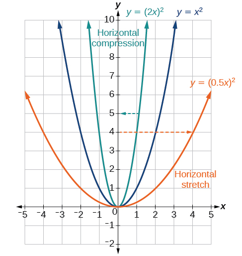

Given a function $y=f(x),$ the form $y=f(bx)$ results in a horizontal stretch or compression. Consider the function $y={x}^{2}.$ Observe . The graph of $y={\left(0.5x\right)}^{2}$ is a horizontal stretch of the graph of the function $y={x}^{2}$ by a factor of 2. The graph of $y={\left(2x\right)}^{2}$ is a horizontal compression of the graph of the function $y={x}^{2}$ by a factor of $\frac{1}{2}$.

>
>
>
>
> **Horizontal Stretches and Compressions**
>
>
>  Given a function $f(x),$ a new function $g(x)=f(bx),$ where $b$ is a constant, is a **horizontal stretch** or **horizontal compression** of the function $f(x).$
>
> If $b>1,$ then the graph will be compressed by $b.$
>
> If $0<b<1,$ then the graph will be stretched by $\frac{1}{b}.$
>
> If $b<0,$ then there will be combination of a horizontal stretch or compression with a horizontal reflection.
>
>
>
>
>
>

>
> How To
> *Given a description of a function, sketch a horizontal compression or stretch.*
>
> Write a formula to represent the function.
>  Set $g(x)=f(bx)$ where $b>1$ for a compression or $0<b<1$
>   for a stretch.

44. **Graphing a Horizontal Compression**    Suppose a scientist is comparing a population of fruit flies to a population that progresses through its lifespan twice as fast as the original population. In other words, this new population, $R,$ will progress in 1 hour the same amount as the original population does in 2 hours, and in 2 hours, it will progress as much as the original population does in 4 hours. Sketch a graph of this population.

Solution

Symbolically, we could write

  $$
\begin{array}{ccc}  R(1)& =& P(2),  \\   R(2)& =& P(4),\phantom{\rule{0.5em}{0ex}}\text{and\ in\ general,}  \\   R(t)& =& P(2t).  \end{array}
$$

See  for a graphical comparison of the original population and the compressed population.

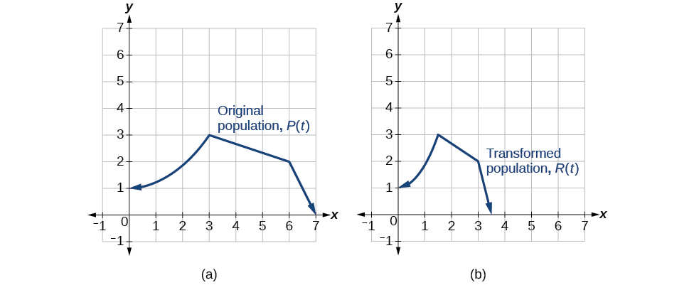

45. **Finding a Horizontal Stretch for a Tabular Function**    A function $f(x)$ is given as . Create a table for the function $g(x)=f\left(\frac{1}{2}x\right).$     | *$x$* | 2 | 4 | 6 | 8 | | :--- | :--- | :--- | :--- | :--- | | *$f(x)$* | 1 | 3 | 7 | 11 |

Solution

The formula $g(x)=f\left(\frac{1}{2}x\right)$ tells us that the output values for $g$ are the same as the output values for the function $f$ at an input half the size. Notice that we do not have enough information to determine $g(2)$ because $g(2)=f\left(\frac{1}{2}\cdot 2\right)=f(1),$ and we do not have a value for $f(1)$ in our table. Our input values to $g$ will need to be twice as large to get inputs for $f$ that we can evaluate. For example, we can determine $g(4)\text{.}$ 

 $$
g(4)=f\left(\frac{1}{2}\cdot 4\right)=f(2)=1
$$
 We do the same for the other values to produce .

 

| *$x$* | 4 | 8 | 12 | 16 |
| :--- | :--- | :--- | :--- | :--- |
| *$g(x)$* | 1 | 3 | 7 | 11 |

 shows the graphs of both of these sets of points.

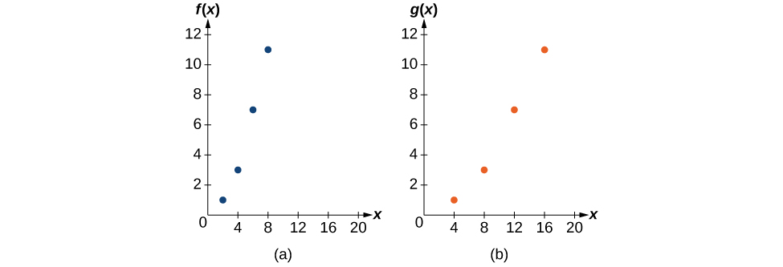

46. **Recognizing a Horizontal Compression on a Graph**    Relate the function $g(x)$ to $f(x)$ in .      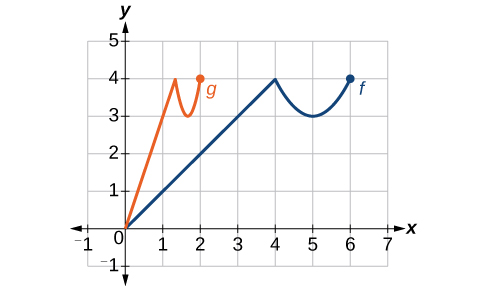

Solution

The graph of $g(x)$ looks like the graph of $f(x)$ horizontally compressed. Because $f(x)$ ends at $(6,4)$ and $g(x)$ ends at $(2,4),$ we can see that the $x\text{-}$ values have been compressed by $\frac{1}{3},$ because $6\left(\frac{1}{3}\right)=2.$ We might also notice that $g(2)=f\left(6\right)$ and $g(1)=f\left(3\right).$ Either way, we can describe this relationship as $g(x)=f\left(3x\right).$ This is a horizontal compression by $\frac{1}{3}.$

>
> Try It
> 47. Write a formula for the toolkit square root function horizontally stretched by a factor of 3.
>
> 

> 
Solution

>
> $g(x)=f\left(\frac{1}{3}x\right)$ so using the square root function we get $g(x)=\sqrt{\frac{1}{3}x}$
> 

>
>

 
# Performing a Sequence of Transformations
When combining transformations, it is very important to consider the order of the transformations. For example, vertically shifting by 3 and then vertically stretching by 2 does not create the same graph as vertically stretching by 2 and then vertically shifting by 3, because when we shift first, both the original function and the shift get stretched, while only the original function gets stretched when we stretch first.
When we see an expression such as $2f(x)+3,$ which transformation should we start with? The answer here follows nicely from the order of operations. Given the output value of $f(x),$ we first multiply by 2, causing the vertical stretch, and then add 3, causing the vertical shift. In other words, multiplication before addition.
Horizontal transformations are a little trickier to think about. When we write $g(x)=f(2x+3),$ for example, we have to think about how the inputs to the function $g$ relate to the inputs to the function $f.$ Suppose we know $f(7)=12.$ What input to $g$ would produce that output? In other words, what value of $x$ will allow $g(x)=f(2x+3)=12?$ We would need $2x+3=7.$ To solve for $x,$ we would first subtract 3, resulting in a horizontal shift, and then divide by 2, causing a horizontal compression.
This format ends up being very difficult to work with, because it is usually much easier to horizontally stretch a graph before shifting. We can work around this by factoring inside the function.
 $$
f(bx+p)=f\left(b\left(x+\frac{p}{b}\right)\right)
$$
  Let’s work through an example.
 $$
f\left(x\right)={\left(2x+4\right)}^{2}
$$
  We can factor out a 2.
 $$
f\left(x\right)={\left(2\left(x+2\right)\right)}^{2}
$$
  Now we can more clearly observe a horizontal shift to the left 2 units and a horizontal compression. Factoring in this way allows us to horizontally stretch first and then shift horizontally.

>
>
>
>
> **Combining Transformations**
>
>
>
>    When combining vertical transformations written in the form $af(x)+k,$ first vertically stretch by $a$ and then vertically shift by $k.$
>
>
>    When combining horizontal transformations written in the form $f(bx-h),$ first horizontally shift by $h$ and then horizontally stretch by $1b.$
>
> When combining horizontal transformations written in the form $f(b(x-h)),$ first horizontally stretch by $\frac{1}{b}$ and then horizontally shift by $h.$
>
> Horizontal and vertical transformations are independent. It does not matter whether horizontal or vertical transformations are performed first.
>
>

   48. **Finding a Triple Transformation of a Tabular Function**        Given  for the function $f(x),$ create a table of values for the function $g(x)=2f(3x)+1.$         | *$x$* | 6 | 12 | 18 | 24 | | :--- | :--- | :--- | :--- | :--- | | *$f(x)$* | 10 | 14 | 15 | 17 |

Solution

There are three steps to this transformation, and we will work from the inside out. Starting with the horizontal transformations, $f(3x)$ is a horizontal compression by $\frac{1}{3},$ which means we multiply each $x\text{-}$ value by $\frac{1}{3}.$ See .

| *$x$* | 2 | 4 | 6 | 8 |
| :--- | :--- | :--- | :--- | :--- |
| *$f(3x)$* | 10 | 14 | 15 | 17 |

Looking now to the vertical transformations, we start with the vertical stretch, which will multiply the output values by 2. We apply this to the previous transformation. See .

| *$x$* | 2 | 4 | 6 | 8 |
| :--- | :--- | :--- | :--- | :--- |
| *$2f(3x)$* | 20 | 28 | 30 | 34 |

Finally, we can apply the vertical shift, which will add 1 to all the output values. See .

| *$x$* | 2 | 4 | 6 | 8 |
| :--- | :--- | :--- | :--- | :--- |
| *$g(x)=2f(3x)+1$* | 21 | 29 | 31 | 35 |

  

   49. **Finding a Triple Transformation of a Graph**        Use the graph of $f\left(x\right)$ in  to sketch a graph of $k(x)=f\left(\frac{1}{2}x+1\right)-3.$                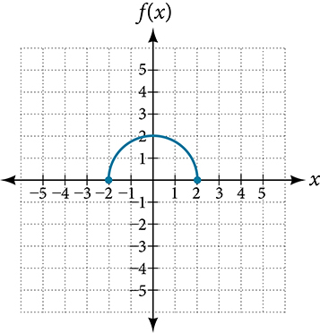

Solution

To simplify, let’s start by factoring out the inside of the function.

      $$
f\left(\frac{1}{2}x+1\right)-3=f\left(\frac{1}{2}(x+2)\right)-3
$$
     
     By factoring the inside, we can first horizontally stretch by 2, as indicated by the $\frac{1}{2}$ on the inside of the function. Remember that twice the size of 0 is still 0, so the point (0,2) remains at (0,2) while the point (2,0) will stretch to (4,0). See .

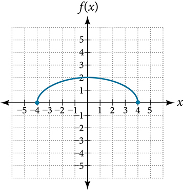

     Next, we horizontally shift left by 2 units, as indicated by $x+2.$ See .

    

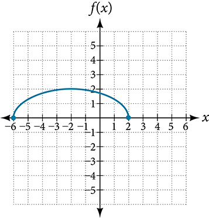

     Last, we vertically shift down by 3 to complete our sketch, as indicated by the $-3$ on the outside of the function. See .

    

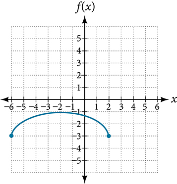

  

>
>    Media
>    Access this online resource for additional instruction and practice with transformation of functions.
>
>    Function Transformations
>

  
# Key Equations

| Vertical shift | $g(x)=f(x)+k$ (up for $k>0$ ) |
| :--- | :--- |
| Horizontal shift | $g(x)=f(x-h)$ (right for $h>0$ ) |
| Vertical reflection | $g(x)=-f(x)$ |
| Horizontal reflection | $g(x)=f(-x)$ |
| Vertical stretch | $g(x)=af(x)$ ( $a>0$             ) |
| Vertical compression | $g(x)=af(x)$ $(0<a<1)$ |
| Horizontal stretch | $g(x)=f(bx)$ $(0<b<1)$ |
| Horizontal compression. | $g(x)=f(bx)$ ( $b>1$ ) |

# Key Concepts
A function can be shifted vertically by adding a constant to the output. See  and .
    A function can be shifted horizontally by adding a constant to the input. See , , and .
    Relating the shift to the context of a problem makes it possible to compare and interpret vertical and horizontal shifts. See .
    Vertical and horizontal shifts are often combined. See  and .
   A vertical reflection reflects a graph about the $x\text{-}$ axis. A graph can be reflected vertically by multiplying the output by –1.
   A horizontal reflection reflects a graph about the $y\text{-}$ axis. A graph can be reflected horizontally by multiplying the input by –1.
    A graph can be reflected both vertically and horizontally. The order in which the reflections are applied does not affect the final graph. See .
    A function presented in tabular form can also be reflected by multiplying the values in the input and output rows or columns accordingly. See .
A function presented as an equation can be reflected by applying transformations one at a time. See .
   Even functions are symmetric about the $y\text{-}$ axis, whereas odd functions are symmetric about the origin.
    Even functions satisfy the condition $f(x)=f(-x).$
 
    Odd functions satisfy the condition $f(x)=-f(-x).$
    
    A function can be odd, even, or neither. See .
    A function can be compressed or stretched vertically by multiplying the output by a constant. See , , and .
    A function can be compressed or stretched horizontally by multiplying the input by a constant. See , , and .
    The order in which different transformations are applied does affect the final function. Both vertical and horizontal transformations must be applied in the order given. However, a vertical transformation may be combined with a horizontal transformation in any order. See  and .
   

# Section Exercises

## Verbal
1. When examining the formula of a function that is the result of multiple transformations, how can you tell a horizontal shift from a vertical shift?

Solution

A horizontal shift results when a constant is added to or subtracted from the input. A vertical shifts results when a constant is added to or subtracted from the output.

2. When examining the formula of a function that is the result of multiple transformations, how can you tell a horizontal stretch from a vertical stretch?

3. When examining the formula of a function that is the result of multiple transformations, how can you tell a horizontal compression from a vertical compression?

Solution

A horizontal compression results when a constant greater than 1 is multiplied by the input. A vertical compression results when a constant between 0 and 1 is multiplied by the output.

4. When examining the formula of a function that is the result of multiple transformations, how can you tell a reflection with respect to the *x*-axis from a reflection with respect to the *y*-axis?

5. How can you determine whether a function is odd or even from the formula of the function?

Solution

For a function $f,$ substitute $(-x)$ for $(x)$ in $f(x).$ Simplify. If the resulting function is the same as the original function, $f(-x)=f(x),$ then the function is even. If the resulting function is the opposite of the original function, $f(-x)=-f(x),$ then the original function is odd. If the function is not the same or the opposite, then the function is neither odd nor even.

## Algebraic
For the following exercises, write a formula for the function obtained when the graph is shifted as described.
6. $f(x)=\sqrt{x}$ is shifted up 1 unit and to the left 2 units.

7. $f(x)=\left|x\right|$ is shifted down 3 units and to the right 1 unit.

Solution

$g(x)=|x-1|-3$

8. $f(x)=\frac{1}{x}$ is shifted down 4 units and to the right 3 units.

9. $f(x)=\frac{1}{{x}^{2}}$ is shifted up 2 units and to the left 4 units.

Solution

$g(x)=\frac{1}{{(x+4)}^{2}}+2$

For the following exercises, describe how the graph of the function is a transformation of the graph of the original function $f.$
 
10. $y=f(x-49)$

11. $y=f(x+43)$

Solution

The graph of $f(x+43)$ is a horizontal shift to the left 43 units of the graph of $f.$

12. $y=f(x+3)$

13. $y=f(x-4)$

Solution

The graph of $f(x-4)$ is a horizontal shift to the right 4 units of the graph of $f.$

14. $y=f(x)+5$

15. $y=f(x)+8$

Solution

The graph of $f(x)+8$ is a vertical shift up 8 units of the graph of $f.$

16. $y=f(x)-2$

17. $y=f(x)-7$

Solution

The graph of $f(x)-7$ is a vertical shift down 7 units of the graph of $f.$

18. $y=f(x-2)+3$

19. $y=f(x+4)-1$

Solution

The graph of $f(x+4)-1$ is a horizontal shift to the left 4 units and a vertical shift down 1 unit of the graph of $f.$

For the following exercises, determine the interval(s) on which the function is increasing and decreasing.
20. $f(x)=4{(x+1)}^{2}-5$

21. $g(x)=5{(x+3)}^{2}-2$

Solution

decreasing on $(-\infty ,-3)$ and increasing on $(-3,\infty )$

22. $a(x)=\sqrt{-x+4}$

23. $k(x)=-3\sqrt{x}-1$

Solution

decreasing on $(0,\phantom{\rule{0.5em}{0ex}}\infty )$

## Graphical
For the following exercises, use the graph of $f(x)={2}^{x}$ shown in  to sketch a graph of each transformation of $f(x).$
 

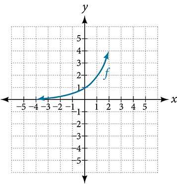

24. $g(x)={2}^{x}+1$

25. $h(x)={2}^{x}-3$

Solution

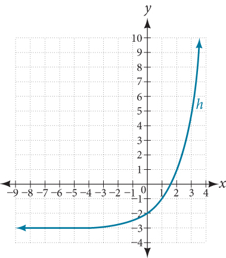

26. $w(x)={2}^{x-1}$

For the following exercises, sketch a graph of the function as a transformation of the graph of one of the toolkit functions.
27. $f(t)={(t+1)}^{2}-3$

Solution

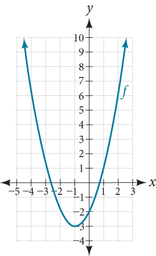

28. $h(x)=|x-1|+4$

29. $k(x)={(x-2)}^{3}-1$

Solution

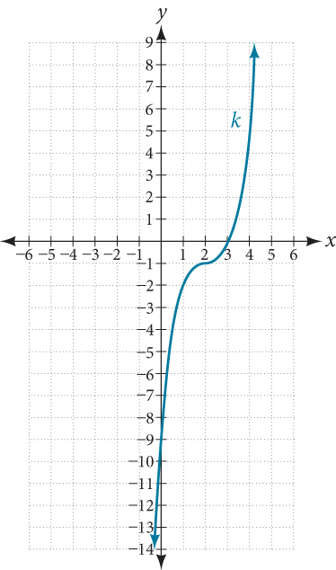

30. $m(t)=3+\sqrt{t+2}$

## Numeric
31. Tabular representations for the functions $f,\phantom{\rule{0.5em}{0ex}}g,$ and $h$ are given below. Write $g(x)$ and $h(x)$ as transformations of $f(x).$         | *$x$* | −2 | −1 | 0 | 1 | 2 | | :--- | :--- | :--- | :--- | :--- | :--- | | *$f(x)$* | −2 | −1 | −3 | 1 | 2 |      | *$x$* | −1 | 0 | 1 | 2 | 3 | | :--- | :--- | :--- | :--- | :--- | :--- | | *$g(x)$* | −2 | −1 | −3 | 1 | 2 |      | *$x$* | −2 | −1 | 0 | 1 | 2 | | :--- | :--- | :--- | :--- | :--- | :--- | | *$h(x)$* | −1 | 0 | −2 | 2 | 3 |

Solution

$g(x)=f(x-1),\phantom{\rule{0.5em}{0ex}}h(x)=f(x)+1$

32. Tabular representations for the functions $f,\phantom{\rule{0.5em}{0ex}}g,$ and $h$ are given below. Write $g(x)$ and $h(x)$ as transformations of $f(x).$         | *$x$* | −2 | −1 | 0 | 1 | 2 | | :--- | :--- | :--- | :--- | :--- | :--- | | *$f(x)$* | −1 | −3 | 4 | 2 | 1 |      | *$x$* | −3 | −2 | −1 | 0 | 1 | | :--- | :--- | :--- | :--- | :--- | :--- | | *$g(x)$* | −1 | −3 | 4 | 2 | 1 |      | *$x$* | −2 | −1 | 0 | 1 | 2 | | :--- | :--- | :--- | :--- | :--- | :--- | | *$h(x)$* | −2 | −4 | 3 | 1 | 0 |

For the following exercises, write an equation for each graphed function by using transformations of the graphs of one of the toolkit functions.
33. 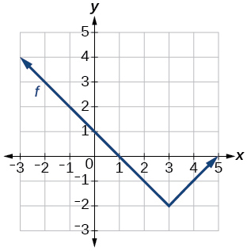

Solution

$f(x)=|x-3|-2$

34. 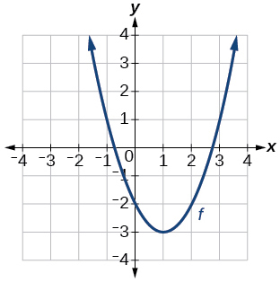

35. 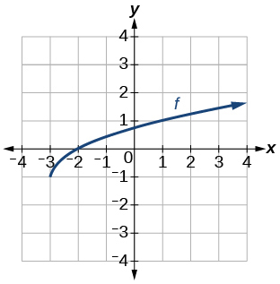

Solution

$f(x)=\sqrt{x+3}-1$

36. 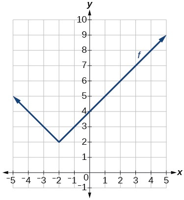

37. 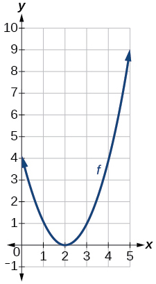

Solution

$f(x)={(x-2)}^{2}$

38. 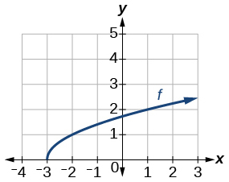

39. 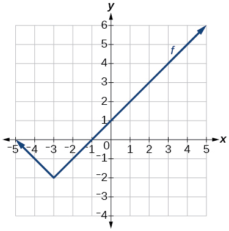

Solution

$f(x)=|x+3|-2$

40. 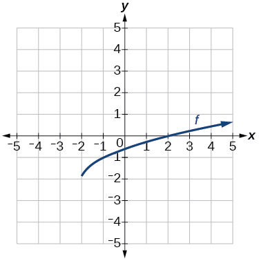

For the following exercises, use the graphs of transformations of the square root function to find a formula for each of the functions.
41. 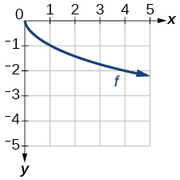

Solution

$f(x)=-\sqrt{x}$

42. 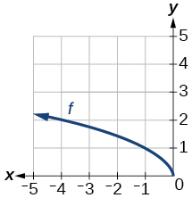

For the following exercises, use the graphs of the transformed toolkit functions to write a formula for each of the resulting functions.
43. 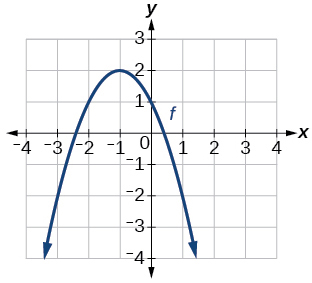

Solution

$f(x)=-{(x+1)}^{2}+2$

44. 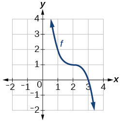

45. 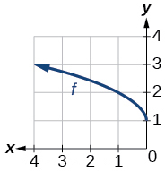

Solution

$f(x)=\sqrt{-x}+1$

46. 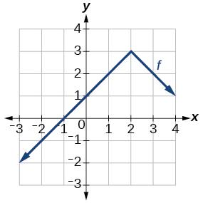

For the following exercises, determine whether the function is odd, even, or neither.
47. $f(x)=3{x}^{4}$

Solution

even

48. $g(x)=\sqrt{x}$

49. $h(x)=\frac{1}{x}+3x$

Solution

odd

50. $f(x)={(x-2)}^{2}$

51. $g(x)=2{x}^{4}$

Solution

even

52. $h(x)=2x-{x}^{3}$

For the following exercises, describe how the graph of each function is a transformation of the graph of the original function $f.$
 
53. $g(x)=-f(x)$

Solution

The graph of $g$ is a vertical reflection (across the $x$ -axis) of the graph of $f.$

54. $g(x)=f(-x)$

55. $g(x)=4f(x)$

Solution

The graph of $g$ is a vertical stretch by a factor of 4 of the graph of $f.$

56. $g(x)=6f(x)$

57. $g(x)=f(5x)$

Solution

The graph of $g$ is a horizontal compression by a factor of $\frac{1}{5}$ of the graph of $f.$

58. $g(x)=f(2x)$

59. $g(x)=f\left(\frac{1}{3}x\right)$

Solution

The graph of $g$ is a horizontal stretch by a factor of 3 of the graph of $f.$

60. $g(x)=f\left(\frac{1}{5}x\right)$

61. $g(x)=3f\left(-x\right)$

Solution

The graph of $g$ is a horizontal reflection across the $y$ -axis and a vertical stretch by a factor of 3 of the graph of $f.$

62. $g(x)=-f(3x)$

For the following exercises, write a formula for the function $g$ that results when the graph of a given toolkit function is transformed as described.
63. The graph of $f(x)=\left|x\right|$ is reflected over the $y$ *-*axis and horizontally compressed by a factor of $\frac{1}{4}$    .

Solution

$g(x)=|-4x|$

64. The graph of $f(x)=\sqrt{x}$ is reflected over the $x$ -axis and horizontally stretched by a factor of 2.

65. The graph of $f(x)=\frac{1}{{x}^{2}}$ is vertically compressed by a factor of $\frac{1}{3},$ then shifted to the left 2 units and down 3 units.

Solution

$g(x)=\frac{1}{3{(x+2)}^{2}}-3$

66. The graph of $f(x)=\frac{1}{x}$ is vertically stretched by a factor of 8, then shifted to the right 4 units and up 2 units.

67. The graph of $f(x)={x}^{2}$ is vertically compressed by a factor of $\frac{1}{2},$ then shifted to the right 5 units and up 1 unit.

Solution

$g(x)=\frac{1}{2}{(x-5)}^{2}+1$

68. The graph of $f(x)={x}^{2}$ is horizontally stretched by a factor of 3, then shifted to the left 4 units and down 3 units.

For the following exercises, describe how the formula is a transformation of a toolkit function. Then sketch a graph of the transformation.
69. $g(x)=4{(x+1)}^{2}-5$

Solution

The graph of the function $f(x)={x}^{2}$ is shifted to the left 1 unit, stretched vertically by a factor of 4, and shifted down 5 units.

 

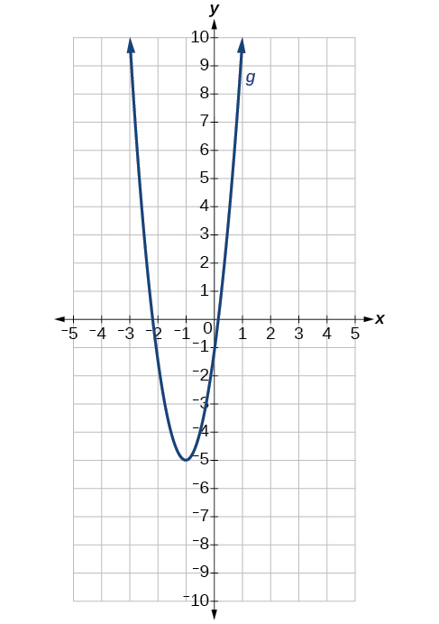

70. $g(x)=5{(x+3)}^{2}-2$

71. $h(x)=-2|x-4|+3$

Solution

The graph of $f(x)=\left|x\right|$ is stretched vertically by a factor of 2, shifted horizontally 4 units to the right, reflected across the horizontal axis, and then shifted vertically 3 units up.

 

72. $k(x)=-3\sqrt{x}-1$

73. $m(x)=\frac{1}{2}{x}^{3}$

Solution

The graph of the function $f(x)={x}^{3}$ is compressed vertically by a factor of $\frac{1}{2}.$
  

 

74. $n(x)=\frac{1}{3}|x-2|$

75. $p\left(x\right)={\left(\frac{1}{3}x\right)}^{3}-3$

Solution

The graph of the function is stretched horizontally by a factor of 3 and then shifted vertically downward by 3 units.

 

76. $q\left(x\right)={\left(\frac{1}{4}x\right)}^{3}+1$

77. $a(x)=\sqrt{-x+4}$

Solution

The graph of $f(x)=\sqrt{x}$ is shifted right 4 units and then reflected across the vertical line $x=4.$
 

 

For the following exercises, use the graph in  to sketch the given transformations.

78. $g(x)=f(x)-2$

79. $g(x)=-f(x)$

Solution

80. $g(x)=f(x+1)$

81. $g(x)=f(x-2)$

Solution

 
  
   **even function**
   a function whose graph is unchanged by horizontal reflection, $f(x)=f(-x),$ and is symmetric about the $y\text{-}$ axis
  
  
   **horizontal compression**
  a transformation that compresses a function’s graph horizontally, by multiplying the input by a constant $b>1$
  
  
  
   **horizontal reflection**
   a transformation that reflects a function’s graph across the *y*-axis by multiplying the input by $\mathrm{-1}$ 
  

  
   **horizontal shift**
   a transformation that shifts a function’s graph left or right by adding a positive or negative constant to the input
  
  
   **horizontal stretch**
   a transformation that stretches a function’s graph horizontally by multiplying the input by a constant $0<b<1$
   
  
  
   **odd function**
   a function whose graph is unchanged by combined horizontal and vertical reflection, $f(x)=-f(-x),$ and is symmetric about the origin
  
  
   **vertical compression**
   a function transformation that compresses the function’s graph vertically by multiplying the output by a constant $0<a<1$
   
  
  
   **vertical reflection** a transformation that reflects a function’s graph across the *x*-axis by multiplying the output by $\mathrm{-1}$ 
  
  
   **vertical shift**
   a transformation that shifts a function’s graph up or down by adding a positive or negative constant to the output
  
  
   **vertical stretch**
   a transformation that stretches a function’s graph vertically by multiplying the output by a constant $a>1$
