**Absolute Value Functions**

  m51267
  

**Absolute Value Functions**

  In this section, you will:

Graph an absolute value function.
Solve an absolute value equation.

  2e387575-c04f-40e1-8895-195affae8fdb

## Learning Objectives
Solve absolute value equations (IA 2.7.1)
Identify graphs of absolute value functions (IA 3.6.2)

## Objective 1: Solve absolute value equations (IA 2.7.1)
Recall that in its basic form, 𝑓(𝑥)=|𝑥|, the absolute value function is one of our toolkit functions. The absolute value function is often thought of as providing the distance the number is from zero on a number line. Numerically, for whatever the input value is, the output is the magnitude of this value.

The absolute value function can be defined as a piecewise function
 $f\left(x\right)=\left|x\right|=-x$ , when $x<0$ or $x$ , when $x\ge 0$ 

**Solve absolute value equations**

1. ⓐ Solve for x:  |x|=5

Solution

Since the absolute value of a number is its distance from 0 on the number line. Notice that both 5 and –5 are 5 units from 0 on the number line.
  

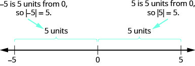

If |x|=5
x=5, or x=–5

2. ⓑ Solve for x:  |2x–5|=3

Solution

In this case the number represented by 2x–5 is 3 units from zero on the number line.
So 2x–5  could either equal 3 or –3.
  

 $2x-5=3\phantom{\rule{0ex}{0ex}}2x=8\phantom{\rule{0ex}{0ex}}x=4\phantom{\rule{0ex}{0ex}}$ 

 $2x-5=-3\phantom{\rule{0ex}{0ex}}2x=2\phantom{\rule{0ex}{0ex}}x=1\phantom{\rule{0ex}{0ex}}$

### Practice Makes Perfect

Solve absolute value equations.

3. Solve for *x*:  $\left|x\right|=0$

4. Solve for *x*:  $\left|x\right|=2$

5. Solve for *x*:  $|x\u20132|=6$

6. Solve for *x*: $|2x+1|=7$

7. Solve for *t*:  $|3t\u20131|=\mathrm{\u20132}$

8. Solve for *z*:  $|2z\u20133|\u20134=1$

9. Solve for *x*:  $\u20132|x\u20133|+8=\mathrm{\u20134}$

## Objective 2: Identify and graph absolute value functions (IA 3.6.2)

Absolute value functions have a “V” shaped graph. If scanning this function from left to right the corner is the point where the graph changes direction.

 $f\left(x\right)=\left|x\right|=-x$ , when $x<0$ or $x$ , when $x\ge 0$ 

### Practice Makes Perfect
Identify and graph absolute value functions. Graph each of the following functions. Label at least one point on your graph.
10. $y=\left|x\right|\u20132$       

11. $y=\left|2x\right|+3$       

12. $y=|x\u20134|+3$     

13. $y=\u2013|x+6|\u20134$     

14. $y=\u2013|x\u20132|$     

15. $y=3|x+1|+4$    

16. Find the domain and range of the following absolute value function.    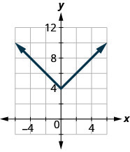

 

Until the 1920s, the so-called spiral nebulae were believed to be clouds of dust and gas in our own galaxy, some tens of thousands of light years away. Then, astronomer Edwin Hubble proved that these objects are galaxies in their own right, at distances of millions of light years. Today, astronomers can detect galaxies that are billions of light years away. Distances in the universe can be measured in all directions. As such, it is useful to consider distance as an absolute value function. In this section, we will continue our investigation of **absolute value functions**.
 

# Understanding Absolute Value
Recall that in its basic form $f(x)=\left|x\right|,$ the absolute value function is one of our toolkit functions. The **absolute value** function is commonly thought of as providing the distance the number is from zero on a number line. Algebraically, for whatever the input value is, the output is the value without regard to sign. Knowing this, we can use absolute value functions to solve some kinds of real-world problems.

>
>
>
>
> **Absolute Value Function**
>
>
> The absolute value function can be defined as a piecewise function
>
>  $$
> f(x)=\left|x\right|=\{\begin{array}{ccc}x& \text{if}& x\ge 0\\ -x& \text{if}& x<0\end{array}
> $$
>
>

   17. **Using Absolute Value to Determine Resistance**        Electrical parts, such as resistors and capacitors, come with specified values of their operating parameters: resistance, capacitance, etc. However, due to imprecision in manufacturing, the actual values of these parameters vary somewhat from piece to piece, even when they are supposed to be the same. The best that manufacturers can do is to try to guarantee that the variations will stay within a specified range, often $\text{\xb11\%,}\phantom{\rule{0.5em}{0ex}}\pm \text{5\%,}$ or $\pm \text{10\%}\text{.}$             Suppose we have a resistor rated at 680 ohms, $\pm 5\%.$ Use the absolute value function to express the range of possible values of the actual resistance.

Solution

We can find that 5% of 680 ohms is 34 ohms. The absolute value of the difference between the actual and nominal resistance should not exceed the stated variability, so, with the resistance $R$ in ohms,
 $$
|R-680|\le 34
$$

>
>    Try It
>    18. Students who score within 20 points of 80 will pass a test. Write this as a distance from 80 using absolute value notation.
>
> 

> 
Solution

>
> using the variable $p$ for passing, $\left|p-80\right|\le 20$
> 

>
>
>

 
# Graphing an Absolute Value Function
The most significant feature of the absolute value graph is the corner point at which the graph changes direction. This point is shown at the **origin** in .

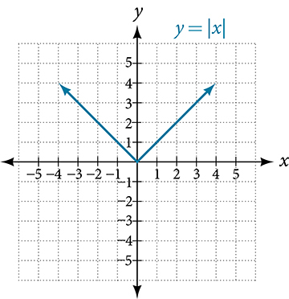

 shows the graph of $y=2\left|x\u20133\right|+4.$ The graph of $y=\left|x\right|$ has been shifted right 3 units, vertically stretched by a factor of 2, and shifted up 4 units. This means that the corner point is located at $\left(3,4\right)$ for this transformed function.

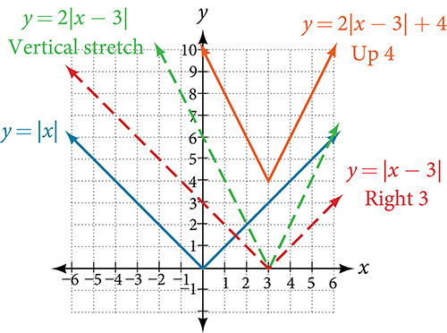

   19. **Writing an Equation for an Absolute Value Function Given a Graph**        Write an equation for the function graphed in .          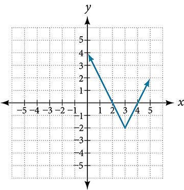

Solution

The basic absolute value function changes direction at the origin, so this graph has been shifted to the right 3 units and down 2 units from the basic toolkit function. See .

    

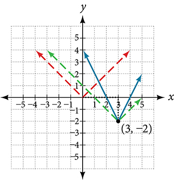

     We also notice that the graph appears vertically stretched, because the width of the final graph on a horizontal line is not equal to 2 times the vertical distance from the corner to this line, as it would be for an unstretched absolute value function. Instead, the width is equal to 1 times the vertical distance as shown in .

    

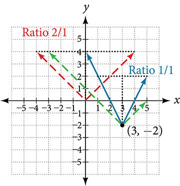

    From this information we can write the equation

      $$
\begin{array}{cccc}  f(x)& =& 2|x-3|-2,  & \phantom{\rule{1em}{0ex}}\text{treating\ the\ stretch\ as\}a\phantom{\rule{0.5em}{0ex}}\text{vertical\ stretch,or}  \\   f(x)& =& |2(x-3)|-2,  & \phantom{\rule{1em}{0ex}}\text{treating\ the\ stretch\ as\}a\phantom{\rule{0.5em}{0ex}}\text{horizontal\ compression}.  \end{array}
$$

>
> Q&A
>   *If we couldn’t observe the stretch of the function from the graphs, could we algebraically determine it?*
> *Yes. If we are unable to determine the stretch based on the width of the graph, we can solve for the stretch factor by putting in a known pair of values for $x$ and $f(x).$*
>
>    $$
> f(x)=a|x-3|-2
> $$
> *Now substituting in the point*(1, 2)
>
>    $$
> \begin{array}{ccc}  2& =& a|1-3|-2  \\   4& =& 2a  \\   a& =& 2  \end{array}
> $$
>

>
>    Try It
>    20. Write the equation for the absolute value function that is horizontally shifted left 2 units, is vertically reflected, and vertically shifted up 3 units.
>
> 

> 
Solution

>
> $f(x)=-\left|x+2\right|+3$
> 

>
>
>

>
> Q&A
>   *Do the graphs of absolute value functions always intersect the vertical axis? The horizontal axis?*
>
>    *Yes, they always intersect the vertical axis. The graph of an absolute value function will intersect the vertical axis when the input is zero.*
>
>    *No, they do not always intersect the horizontal axis. The graph may or may not intersect the horizontal axis, depending on how the graph has been shifted and reflected. It is possible for the absolute value function to intersect the horizontal axis at zero, one, or two points (see ).*
>

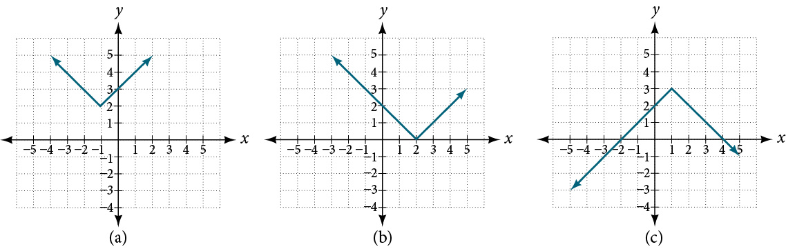

# Solving an Absolute Value Equation
In Other Type of Equations, we touched on the concepts of absolute value equations. Now that we understand a little more about their graphs, we can take another look at these types of equations. Now that we can graph an absolute value function, we will learn how to solve an absolute value equation. To solve an equation such as $8=\left|2x-6\right|,$ we notice that the absolute value will be equal to 8 if the quantity inside the absolute value is 8 or -8. This leads to two different equations we can solve independently.
 $$
\begin{array}{ccccccc}  2x-6& =& 8  & \phantom{\rule{1em}{0ex}}\text{or}\phantom{\rule{1em}{0ex}}&   2x-6& =& \mathrm{-8}  \\   2x& =& 14  & &   2x& =& \mathrm{-2}  \\   x& =& 7  & &   x& =& \mathrm{-1}  \end{array}
$$

Knowing how to solve problems involving **absolute value functions** is useful. For example, we may need to identify numbers or points on a line that are at a specified distance from a given reference point.
An absolute value equation is an equation in which the unknown variable appears in absolute value bars. For example,
 $$
\begin{array}{l}\left|x\right|=4,  \\ |2x-1|=3,\text{or}  \\ |5x+2|-4=9  \end{array}
$$

>
>
>
>
> **Solutions to Absolute Value Equations**
>
>
>    For real numbers $A$ and $B$ , an equation of the form $\left|A\right|=B,$ with $B\ge 0,$ will have solutions when $A=B$ or $A=-B.$ If $B<0,$ the equation $\left|A\right|=B$ has no solution.

>
>    How To
>    *Given the formula for an absolute value function, find the horizontal intercepts of its graph*.
>
>    Isolate the absolute value term.
>     Use $\left|A\right|=B$ to write $A=B$ or $\mathrm{-A}=B,$ assuming $B>0.$
>
>     Solve for $x.$
>
>

21. **Finding the Zeros of an Absolute Value Function**        For the function $f(x)=|4x+1|-7,$ find the values of $x$ such that $f(x)=0.$

Solution

$$
\begin{array}{cccccccc}  0& =& |4x+1|-7  & & & & & \text{Substitute\ 0\ for\}f(x).  \\   7& =& |4x+1|  & & & & & \text{Isolate\ the\ absolute\ value\ on\ one\ side\ of\ the\ equation}.  \\ & & & & & & & \\ & & & & & & & \\ & & & & & & & \\   7& =& 4x+1  & \text{or}&   \phantom{\rule{2em}{0ex}}\mathrm{-7}& =& 4x+1  & \text{Break\ into\ two\ separate\ equations\ and\ solve}.  \\   6& =& 4x  & &   \mathrm{-8}& =& 4x  & \\ & & & & & & & \\   x& =& \frac{6}{4}=1.5  & &   x& =& \frac{-8}{4}=-2  & \end{array}
$$

The function outputs 0 when $x=\frac{3}{2}$ or $x=-2.$ See .
      

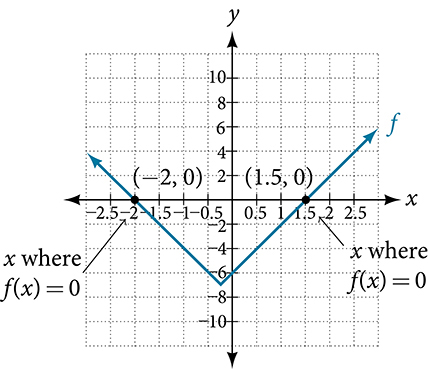

  

>
>    Try It
>    22. For the function $f(x)=\left|2x-1\right|-3,$ find the values of $x$ such that $f(x)=0.$
>
> 

> 
Solution

>
> $x=-1$ or $x=2$
> 

>
>
>

>
>    Q&A
>    *Should we always expect two answers when solving $\left|A\right|=B?$*
> *No. We may find one, two, or even no answers. For example, there is no solution to*
>
>  $2+\left|3x-5\right|=1.$
>
>

>
>    Media
>    Access these online resources for additional instruction and practice with absolute value.
>
>   Graphing Absolute Value Functions
>    Graphing Absolute Value Functions 2
>
>

# Key Concepts
Applied problems, such as ranges of possible values, can also be solved using the absolute value function. See .
   The graph of the absolute value function resembles a letter V. It has a corner point at which the graph changes direction. See .
  In an absolute value equation, an unknown variable is the input of an absolute value function.
   If the absolute value of an expression is set equal to a positive number, expect two solutions for the unknown variable. See .

  

 
# Section Exercises

## Verbal
1. How do you solve an absolute value equation?

Solution

Isolate the absolute value term so that the equation is of the form $\left|A\right|=B.$ Form one equation by setting the expression inside the absolute value symbol, $A,$ equal to the expression on the other side of the equation, $B.$ Form a second equation by setting $A$ equal to the opposite of the expression on the other side of the equation, $-B.$ Solve each equation for the variable.

2. How can you tell whether an absolute value function has two *x*-intercepts without graphing the function?

3. When solving an absolute value function, the isolated absolute value term is equal to a negative number. What does that tell you about the graph of the absolute value function?

Solution

The graph of the absolute value function does not cross the $x$ -axis, so the graph is either completely above or completely below the $x$ -axis.

4. How can you use the graph of an absolute value function to determine the *x*-values for which the function values are negative?

## Algebraic
5. Describe all numbers $x$ that are at a distance of 4 from the number 8. Express this set of numbers using absolute value notation.

Solution

The distance from x to 8 can be represented using
the absolute value statement: ∣ x − 8 ∣ = 4.

6. Describe all numbers $x$ that are at a distance of $\frac{1}{2}$ from the number −4. Express this set of numbers using absolute value notation.

7. Describe the situation in which the distance that point $x$ is from 10 is at least 15 units. Express this set of numbers using absolute value notation.

Solution

∣ x − 10 ∣ ≥ 15

8. Find all function values $f(x)$ such that the distance from $f(x)$ to the value 8 is less than 0.03 units. Express this set of numbers using absolute value notation.

For the following exercises, find the *x*- and *y*-intercepts of the graphs of each function.
9. $f(x)=4\left|x-3\right|+4$

Solution

There are no x-intercepts.

10. $f(x)=-3\left|x-2\right|-1$

11. $f(x)=-2\left|x+1\right|+6$

Solution

(−4, 0) and (2, 0)

12. $f(x)=-5|x+2|+15$

13. $f(x)=2|x-1|-6$

Solution

$(0,-4),(4,0),(-2,0)$

14. $f(x)=|-2x+1|-13$

15. $f(x)=-|x-9|+16$

Solution

$(0,7),(25,0),(-7,0)$

## Graphical
For the following exercises, graph the absolute value function. Plot at least five points by hand for each graph.
16. $y=|x-1|$

17. $y=|x+1|$

Solution

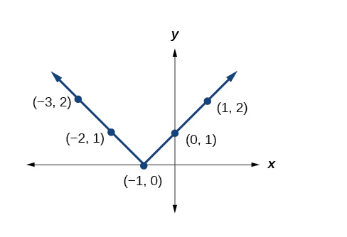

18. $y=\left|x\right|+1$

For the following exercises, graph the given functions by hand.
19. $y=\left|x\right|-2$

Solution

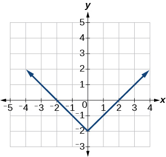

20. $y=-\left|x\right|$

21. $y=-\left|x\right|-2$

Solution

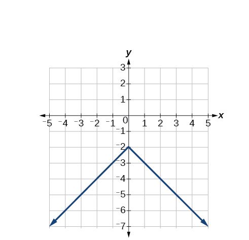

22. $y=-\left|x-3\right|-2$

23. $f(x)=-|x-1|-2$

Solution

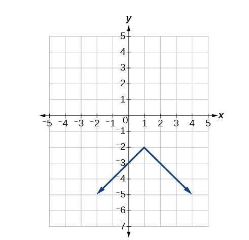

24. $f(x)=-|x+3|+4$

25. $f(x)=2|x+3|+1$

Solution

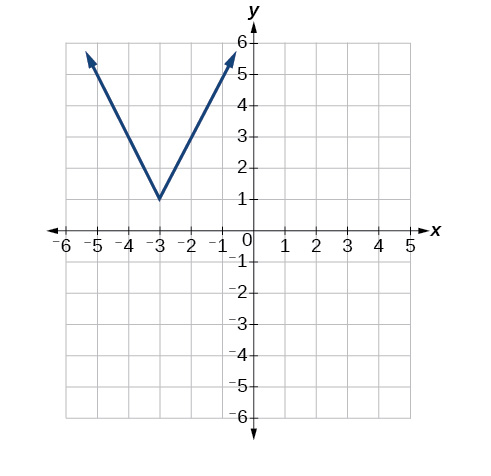

26. $f(x)=3\left|x-2\right|+3$

27. $f(x)=\left|2x-4\right|-3$

Solution

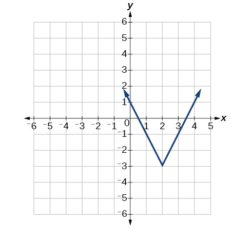

28. $f\left(x\right)=\left|3x+9\right|+2$

29. $f(x)=-\left|x-1\right|-3$

Solution

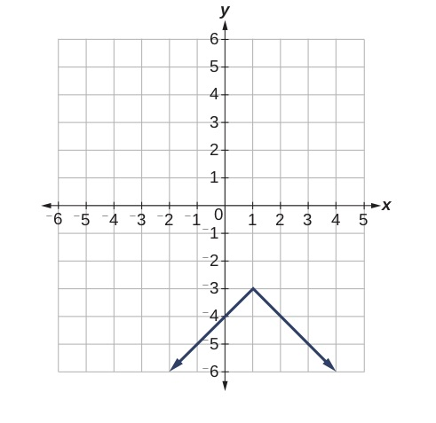

30. $f(x)=-\left|x+4\right|-3$

31. $f(x)=\frac{1}{2}\left|x+4\right|-3$

Solution

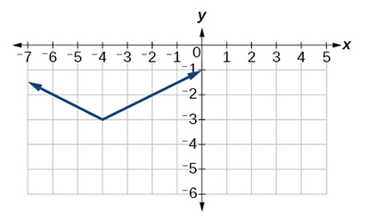

## Technology
32. Use a graphing utility to graph $f(x)=10|x-2|$ on the viewing window $\left[0,4\right].$ Identify the corresponding range. Show the graph.

33. Use a graphing utility to graph $f(x)=-100\left|x\right|+100$ on the viewing window $\left[-5,5\right].$ Identify the corresponding range. Show the graph.

Solution

range: $[\u2013400,100]$

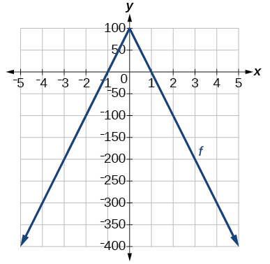

For the following exercises, graph each function using a graphing utility. Specify the viewing window.
34. $f(x)=-0.1\left|0.1(0.2-x)\right|+0.3$

35. $f(x)=4\times {10}^{9}\left|x-(5\times {10}^{9})\right|+2\times {10}^{9}$

Solution

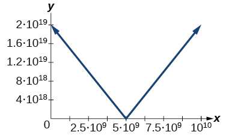

## Extensions
For the following exercises, solve the inequality.
36. If possible, find all values of $a$ such that there are no $x\text{-}$ intercepts for $f(x)=2\left|x+1\right|+a.$

37. If possible, find all values of $a$ such that there are no $y$ -intercepts for $f(x)=2\left|x+1\right|+a.$

Solution

There is no solution for $a$ that will keep the function from having a $y$ -intercept. The absolute value function always crosses the $y$ -intercept when $x=0.$

## Real-World Applications
38. Cities A and B are on the same east-west line. Assume that city A is located at the origin. If the distance from city A to city B is at least 100 miles and $x$ represents the distance from city B to city A, express this using absolute value notation.

39. The true proportion $p$ of people who give a favorable rating to Congress is 8% with a margin of error of 1.5%. Describe this statement using an absolute value equation.

Solution

$\left|p-0.08\right|\le 0.015$

40. Students who score within 18 points of the number 82 will pass a particular test. Write this statement using absolute value notation and use the variable $x$ for the score.

41. A machinist must produce a bearing that is within 0.01 inches of the correct diameter of 5.0 inches. Using $x$ as the diameter of the bearing, write this statement using absolute value notation.

Solution

$\left|x-5.0\right|\le 0.01$

42. The tolerance for a ball bearing is 0.01. If the true diameter of the bearing is to be 2.0 inches and the measured value of the diameter is $x$ inches, express the tolerance using absolute value notation.
