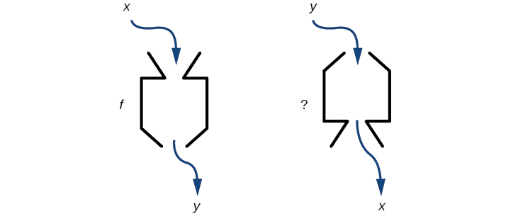
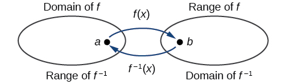
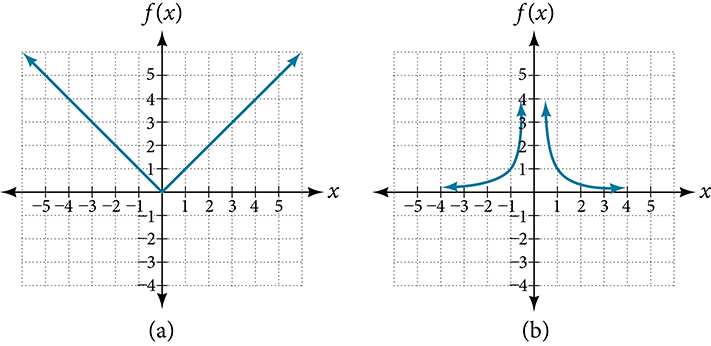
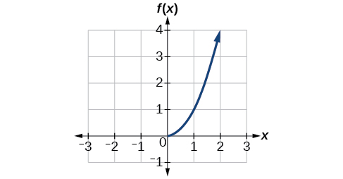
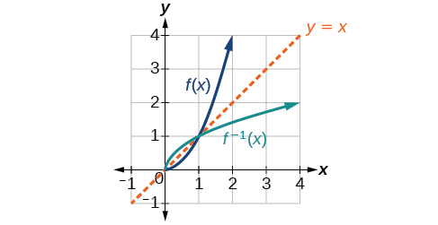
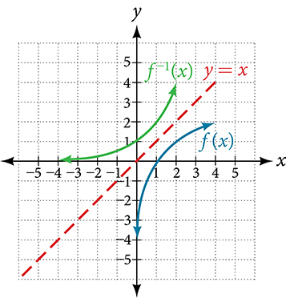

Inverse Functions
=================

  m51268
  
Inverse Functions
=================

  In this section, you will:

Verify inverse functions.
Determine the domain and range of an inverse function, and restrict the domain of a function to make it one-to-one.
Find or evaluate the inverse of a function.
Use the graph of a one-to-one function to graph its inverse function on the same axes.

  f592aad0-19d8-42d6-94b9-086bdd84c2b5

  
   
Learning Objectives
===================
Find and evaluate composite functions (IA 10.1.1).
Determine whether a function is one-to-one (IA 10.1.2).

Objective 1: Find and evaluate composite functions (IA 10.1.1).
===============================================================
A **composite** function is a two-step function and can have numerical or variable inputs.

$$\left(fog\right)\left(x\right)=f\left(g\left(x\right)\right)$$ is read as “f of g of x”.
To evaluate a composite function, we always start by evaluating the inner function and then evaluate the outer function in terms of the inner function.

Find and evaluate composite functions.
======================================

  For functions $$f\left(x\right)=2x-7$$ , $$g\left(x\right)=\frac{x+7}{2}$$ , find:

          ⓐ $$g\left(5\right)$$
     
     
          ⓑ $$f\left(g\left(5\right)\right)$$
     
     
          ⓒ $$f\left(g\left(x\right)\right)$$
     

          ⓐ To find $$g\left(5\right)$$ , we evaluate $$g\left(x\right)$$ when $$x$$ is 5.
    
 $$g\left(x\right)=\frac{x+7}{2}$$ 
 $$g\left(5\right)=\frac{5+7}{2}=\frac{12}{2}=6$$ 
     
          ⓑTo find $$f\left(g\left(5\right)\right)$$ , we start evaluating the inner function $$g$$ in terms of 5 (see part a) and then evaluate the outer function $$f$$ in terms of this value.
 $$f\left(g\left(5\right)\right)=f\left(6\right)=2\left(6\right)-7=12-7=5$$
     
     
          ⓒIn parts a and b we had numerical outputs because our inputs were numbers. When we find $$f\left(g\left(x\right)\right)$$ this will be a function written in terms of the variable x.
 $$f\left(g\left(x\right)\right)=f\left(\frac{x+7}{2}\right)=2\left(\frac{x+7}{2}\right)-7=x+7-7=x$$ 
This is interesting, notice that the functions $$f\left(x\right)$$ and $$g\left(x\right)$$ have a special relationship in that one undoes the other. We call functions like this, **inverses** of one another. For any one-to-one function $$f\left(x\right)$$ , the inverse is a function $${f}^{\mathrm{\u20131}}\left(x\right)$$ such that $${f}^{\mathrm{\u20131}}\left(f\right(x\left)\right)=x$$ .

     

Practice Makes Perfect
======================
Find and evaluate composite functions.

For each of the following function pairs find:

  $$f\left(x\right)=\sqrt[3]{x-2}$$ , $$g\left(x\right)={x}^{3}+2$$

ⓐ $$f\left(g\left(x\right)\right)$$

ⓑ $$g\left(f\left(x\right)\right)$$

ⓒ Graph the functions f(x) and g(x) on the same coordinate system below

ⓓ What do you notice about the relationship between the graphs of f(x) and g(x)?

  $$f\left(x\right)=\frac{1}{(x+3)}$$ ,

 $$g\left(x\right)=\frac{1}{x}-3$$

ⓐ $$f\left(g\left(x\right)\right)$$

ⓑ $$g\left(f\left(x\right)\right)$$

ⓒ Graph the functions f(x) and g(x) on the same coordinate system below

ⓓ What do you notice about the relationship between the graphs of f(x) and g(x)?

Objective 2: Determine whether a function is one-to-one (IA 10.1.2).
====================================================================
In creating a process called a function, f(x), it is often useful to undo this process, or create an inverse to the function, f-1(x). When finding the inverse, we restrict our work to one-to-one functions, this means that the inverse we find should also be one-to-one. Remember that the horizontal line test is a great way to check to see if a graph represents a one-to-one function.
For any one-to-one function f(x), the inverse is a function f-1(x) such that $${f}^{-1}\left(f\right(x\left)\right)=x$$ and $$f\left({f}^{-1}\right(x\left)\right)=x$$ .
The following key terms will be important to our understanding of functions and their inverses.
**Function**: a relation in which each input value yields a unique output value.
**Vertical line test**: a method of testing whether a graph represents a function by determining whether a vertical line intersects the graph no more than once.
**One-to-one function**: a function for which each value of the output is associated with a unique input value.
**Horizontal line test**: a method of testing whether a function is one-to-one by determining whether any horizontal line intersects the graph more than once.

Determine whether a function is one-to-one.
===========================================

Determine
ⓐ
whether each graph is the graph of a function and, if so,
ⓑ
whether it is one-to-one.

ⓐ Since any vertical line intersects the graph in at most one point, the graph is the graph of a function. Since any horizontal line intersects the graph in at most one point, the graph is the graph of a one-to-one function.

ⓑ Since any vertical line intersects the graph in at most one point, the graph is the graph of a function. However, a horizontal line shown on the graph may intersect it in two points. This graph does not represent a one-to-one function.

Practice Makes Perfect
======================
Determine whether each graph is the graph of a function and, if so, whether it is one-to-one.

A reversible heat pump is a climate-control system that is an air conditioner and a heater in a single device. Operated in one direction, it pumps heat out of a house to provide cooling. Operating in reverse, it pumps heat into the building from the outside, even in cool weather, to provide heating. As a heater, a heat pump is several times more efficient than conventional electrical resistance heating.

  If some physical machines can run in two directions, we might ask whether some of the function “machines” we have been studying can also run backwards.  provides a visual representation of this question. In this section, we will consider the reverse nature of functions.

  \n\n\n\n

  
  
Verifying That Two Functions Are Inverse Functions
==================================================

  Betty is traveling to Milan for a fashion show and wants to know what the temperature will be. She is not familiar with the **Celsius** scale. To get an idea of how temperature measurements are related, Betty wants to convert 75 degrees **Fahrenheit** to degrees Celsius using the formula

   $$
C=\frac{5}{9}(F-32)
$$
  
  and substitutes 75 for $$F$$ to calculate

   $$
\frac{5}{9}(75-32)\approx 24\text{\xb0C}
$$
  Knowing that a comfortable 75 degrees Fahrenheit is about 24 degrees Celsius, Betty gets the week’s weather forecast from  for Milan, and wants to convert all of the temperatures to degrees Fahrenheit.

  \n\n\n\n

  At first, Betty considers using the formula she has already found to complete the conversions. After all, she knows her algebra, and can easily solve the equation for $$F$$ after substituting a value for $$C.$$ For example, to convert 26 degrees Celsius, she could write

    $$
\begin{array}{ccc}\hfill 26& =& \frac{5}{9}(F-32)\hfill \\ \hfill 26\cdot \frac{9}{5}& =& F-32\hfill \\ \hfill F& =& 26\cdot \frac{9}{5}+32\approx 79\hfill \end{array}
$$

  After considering this option for a moment, however, she realizes that solving the equation for each of the temperatures will be awfully tedious. She realizes that since evaluation is easier than solving, it would be much more convenient to have a different formula, one that takes the Celsius temperature and outputs the Fahrenheit temperature.

  The formula for which Betty is searching corresponds to the idea of an *inverse function*, which is a function for which the input of the original function becomes the output of the inverse function and the output of the original function becomes the input of the inverse function.

  Given a function $$f(x),$$ we represent its inverse as $${f}^{-1}(x),$$ read as $$\u201cf$$ inverse of $$x.\text{\u201d}$$ The raised $$\mathrm{-1}$$ is part of the notation. It is not an exponent; it does not imply a power of $$\mathrm{-1}$$ . In other words, $${f}^{-1}(x)$$ does *not* mean $$\frac{1}{f(x)}$$ because $$\frac{1}{f(x)}$$ is the reciprocal of $$f$$ and not the inverse.
The “exponent-like” notation comes from an analogy between function composition and multiplication: just as $${a}^{-1}a=1$$ (1 is the identity element for multiplication) for any nonzero number $$a,$$ so $${f}^{-1}\circ f$$ equals the identity function, that is,

   $$
\left({f}^{-1}\circ f\right)(x)={f}^{-1}\left(f(x)\right)={f}^{-1}\left(y\right)=x
$$
  This holds for all $$x$$ in the domain of $$f.$$ Informally, this means that inverse functions “undo” each other. However, just as zero does not have a **reciprocal**, some functions do not have inverses.
Given a function $$f(x),$$ we can verify whether some other function $$g(x)$$ is the inverse of $$f(x)$$ by checking if both $$g(f(x))=x$$ and $$f(g(x))=x$$ are true.

  For example, $$y=4x$$ and $$y=\frac{1}{4}x$$ are inverse functions.

   $$
\left({f}^{-1}\circ f\right)(x)={f}^{-1}\left(4x\right)=\frac{1}{4}\left(4x\right)=x
$$
  
  and

   $$
\left({f}^{}\circ {f}^{-1}\right)(x)=f\left(\frac{1}{4}x\right)=4\left(\frac{1}{4}x\right)=x
$$
  
  A few coordinate pairs from the graph of the function $$y=4x$$ are (−2, −8), (0, 0), and (2, 8). A few coordinate pairs from the graph of the function $$y=\frac{1}{4}x$$ are (−8, −2), (0, 0), and (8, 2). If we interchange the input and output of each coordinate pair of a function, the interchanged coordinate pairs would appear on the graph of the inverse function.

  

  
Inverse Function
================

  For any **one-to-one function** $$f(x)=y,$$ a function $${f}^{-1}\left(x\right)$$ is an **inverse function** of $$f$$ if $${f}^{-1}(y)=x.$$ This can also be written as $${f}^{-1}(f(x))=x$$ for all $$x$$ in the domain of $$f.$$ It also follows that $$f({f}^{-1}(x))=x$$ for all $$x$$ in the domain of $${f}^{-1}$$ if $${f}^{-1}$$ is the inverse of $$f.$$

  The notation $${f}^{-1}$$ is read $$\text{\u201c}f$$ inverse.” Like any other function, we can use any variable name as the input for $${f}^{-1},$$ so we will often write $${f}^{-1}(x),$$ which we read as $$\u201cf$$ inverse of $$x.\u201d$$
  Keep in mind that

   $$
{f}^{-1}(x)\ne \frac{1}{f(x)}
$$
  
  and not all functions have inverses.

  

  
  
  
  
Identifying an Inverse Function for a Given Input-Output Pair
=============================================================

  If for a particular one-to-one function $$f(2)=4$$ and $$f(5)=12,$$ what are the corresponding input and output values for the inverse function?

  
  
  The inverse function reverses the input and output quantities, so if

    $$
\begin{array}{ccc}\hfill f(2)& =& 4,\phantom{\rule{0.5em}{0ex}}\text{then\}{f}^{\mathrm{-1}}(4)=2;\hfill \\ \hfill f(5)& =& 12,{\phantom{\rule{0.5em}{0ex}}\text{then\ f}}^{\mathrm{-1}}(12)=5.\hfill \end{array}
$$

  Alternatively, if we want to name the inverse function $$g,$$ then $$g(4)=2$$ and $$g(12)=5.$$

  
  
Analysis
========

  Notice that if we show the coordinate pairs in a table form, the input and output are clearly reversed. See .

  
  
  
  
  
   $$\left(x,f(x)\right)$$
  
   $$\left(x,g(x)\right)$$
  
  
  
  
  
   $$\left(2,4\right)$$
  
   $$\left(4,2\right)$$
  
  
  
   $$\left(5,12\right)$$
  
   $$\left(12,5\right)$$
  
  
  

  
  
  
  

  
  Try It
  
  Given that $${h}^{-1}(6)=2,$$ what are the corresponding input and output values of the original function $$h?$$

  
  $$h(2)=6$$

  
  

  
  How To
  *Given two functions $$f(x)$$ and $$g(x),$$ test whether the functions are inverses of each other.*

  Determine whether $$f(g(x))=x$$ or $$g(f(x))=x.$$
  
  If either statement is true, then both are true, and $$g={f}^{-1}$$ and $$f={g}^{-1}.$$ If either statement is false, then both are false, and $$g\ne {f}^{-1}$$ and $$f\ne {g}^{-1}.$$
  
  

  
  
  
  
Testing Inverse Relationships Algebraically
===========================================

  If $$f\left(x\right)=\frac{1}{x+2}$$ and $$g\left(x\right)=\frac{1}{x}-2,$$ is $$g={f}^{-1}?$$

  
  

    $$
\begin{array}{ccc}\hfill g(f(x))& =& \frac{1}{\left(\frac{1}{x+2}\right)}-2\hfill \\ & =& x+2-2\hfill \\ & =& x\hfill \end{array}
$$

  

  We must also verify the other formula.

    $$
\begin{array}{ccc}\hfill f(g(x))& =& \frac{1}{\frac{1}{x}-2+2}\hfill \\ & =& \frac{1}{\frac{1}{x}}\hfill \\ & =& x\hfill \end{array}
$$

  
  so

   $$
g={f}^{-1}\phantom{\rule{0.5em}{0ex}}\text{and\}f={g}^{-1}
$$
  

  
  
Analysis
========

  Notice the inverse operations are in reverse order of the operations from the original function.

  
  
  

  
  Try It
  
  If $$f\left(x\right)={x}^{3}-4$$ and $$g\left(x\right)=\sqrt[\phantom{\rule{0.5em}{0ex}}3]{x+4},$$ is $$g={f}^{-1}?$$

  Yes

  
  

  
  
  
  
Determining Inverse Relationships for Power Functions
=====================================================

  If $$f(x)={x}^{3}$$ (the cube function) and $$g(x)=\frac{1}{3}x,$$ is $$g={f}^{-1}?$$

  
  

   $$
f\left(g\left(x\right)\right)=\frac{{x}^{3}}{27}\ne x
$$
  

  No, the functions are not inverses.

  
  
  
Analysis
========

  The correct inverse to the cube is, of course, the cube root $$\sqrt[3]{x}={x}^{\frac{1}{3}},$$ that is, the one-third is an exponent, not a multiplier.

  
  

  
  Try It
  
  If $$f\left(x\right)={\left(x-1\right)}^{3}\phantom{\rule{0.5em}{0ex}}\text{and}\phantom{\rule{0.5em}{0ex}}g\left(x\right)=\sqrt[3]{x}+1,$$ is $$g={f}^{-1}?$$

  Yes

  
  
  

  
  
Finding Domain and Range of Inverse Functions
=============================================
The outputs of the function $$f$$ are the inputs to $${f}^{-1},$$ so the range of $$f$$ is also the domain of $${f}^{-1}.$$ Likewise, because the inputs to $$f$$ are the outputs of $${f}^{-1},$$ the domain of $$f$$ is the range of $${f}^{-1}.$$ We can visualize the situation as in .

  \n\n\n\n

  When a function has no inverse function, it is possible to create a new function where that new function on a limited domain does have an inverse function. For example, the inverse of $$f(x)=\sqrt{x}$$ is $${f}^{-1}(x)={x}^{2},$$ because a square “undoes” a square root; but the square is only the inverse of the square root on the domain $$\left[0,\infty \right),$$ since that is the range of $$f(x)=\sqrt{x}.$$
We can look at this problem from the other side, starting with the square (toolkit quadratic) function $$f(x)={x}^{2}.$$ If we want to construct an inverse to this function, we run into a problem, because for every given output of the quadratic function, there are two corresponding inputs (except when the input is 0). For example, the output 9 from the quadratic function corresponds to the inputs 3 and –3. But an output from a function is an input to its inverse; if this inverse input corresponds to more than one inverse output (input of the original function), then the “inverse” is not a function at all! To put it differently, the quadratic function is not a one-to-one function; it fails the horizontal line test, so it does not have an inverse function. In order for a function to have an inverse, it must be a one-to-one function.

  In many cases, if a function is not one-to-one, we can still restrict the function to a part of its domain on which it is one-to-one. For example, we can make a restricted version of the square function $$f(x)={x}^{2}$$ with its domain limited to $$\left[0,\infty \right),$$ which is a one-to-one function (it passes the horizontal line test) and which has an inverse (the square-root function).
If $$f(x)={\left(x-1\right)}^{2}$$ on $$\left[1,\infty \right),$$ then the inverse function is $${f}^{-1}(x)=\sqrt{x}+1.$$

  
  The domain of $$f$$ = range of $${f}^{-1}$$ = $$\left[1,\infty \right).$$
  
  The domain of $${f}^{-1}$$ = range of $$f$$ = $$\left[0,\infty \right).$$
  
  

  
  Q&A
  *Is it possible for a function to have more than one inverse?*
*No. If two supposedly different functions, say, $$g$$ and $$h,$$ both meet the definition of being inverses of another function $$f,$$ then you can prove that $$g=h.$$ We have just seen that some functions only have inverses if we restrict the domain of the original function. In these cases, there may be more than one way to restrict the domain, leading to different inverses. However, on any one domain, the original function still has only one unique inverse.*

  
  

  
Domain and Range of Inverse Functions
=====================================

  The range of a function $$f(x)$$ is the domain of the inverse function $${f}^{-1}(x).$$

  The domain of $$f(x)$$ is the range of $${f}^{-1}(x).$$

  

  
  How To
  *Given a function, find the domain and range of its inverse.*

  
  If the function is one-to-one, write the range of the original function as the domain of the inverse, and write the domain of the original function as the range of the inverse.
  If the domain of the original function needs to be restricted to make it one-to-one, then this restricted domain becomes the range of the inverse function.
  
  

  
  
Finding the Inverses of Toolkit Functions
=========================================

  Identify which of the toolkit functions besides the quadratic function are not one-to-one, and find a restricted domain on which each function is one-to-one, if any. The toolkit functions are reviewed in . We restrict the domain in such a fashion that the function assumes all *y*-values exactly once.

  
  
  
  
  
  
  
      
          Constant
          Identity
          Quadratic
          Cubic
          Reciprocal
      
  
  
      
           $$f(x)=c$$ 
           $$f(x)=x$$ 
           $$f(x)={x}^{2}$$ 
           $$f(x)={x}^{3}$$ 
           $$f(x)=\frac{1}{x}$$ 
      
      
          *Reciprocal squared*
          *Cube root*
          *Square root*
          *Absolute value*
          
      
      

           $$f(x)=\frac{1}{{x}^{2}}$$ 
           $$f(x)=\sqrt[3]{x}$$ 
           $$f(x)=\sqrt{x}$$ 
           $$f(x)=\left|x\right|$$ 
          
      
  

  
  
  
  The constant function is not one-to-one, and there is no domain (except a single point) on which it could be one-to-one, so the constant function has no inverse.
The absolute value function can be restricted to the domain $$\left[0,\infty \right),$$ where it is equal to the identity function.
The reciprocal-squared function can be restricted to the domain $$\left(0,\infty \right).$$

  
  
  
Analysis
========

  We can see that these functions (if unrestricted) are not one-to-one by looking at their graphs, shown in . They both would fail the horizontal line test. However, if a function is restricted to a certain domain so that it passes the horizontal line test, then in that restricted domain, it can have an inverse.
\n\n\n\n
  
  
  Try It
  
  The domain of function $$f$$ is $$(1,\infty )$$ and the range of function $$f$$ is $$(\mathrm{-\infty},\mathrm{-2}).$$ Find the domain and range of the inverse function.

  
  The domain of function $${f}^{-1}$$ is $$(-\infty \text{,}-2)$$ and the range of function $${f}^{-1}$$ is $$(1,\infty ).$$

  
  
  

  
  
Finding and Evaluating Inverse Functions
========================================

  Once we have a one-to-one function, we can evaluate its inverse at specific inverse function inputs or construct a complete representation of the inverse function in many cases.

  
  
Inverting Tabular Functions
===========================

  Suppose we want to find the inverse of a function represented in table form. Remember that the domain of a function is the range of the inverse and the range of the function is the domain of the inverse. So we need to interchange the domain and range.

  Each row (or column) of inputs becomes the row (or column) of outputs for the inverse function. Similarly, each row (or column) of outputs becomes the row (or column) of inputs for the inverse function.

  
  
  
Interpreting the Inverse of a Tabular Function
==============================================

  A function $$f(t)$$ is given in , showing distance in miles that a car has traveled in $$t$$ minutes. Find and interpret $${f}^{-1}(70).$$

  
  
  
  
  
  
  
  *$$t\phantom{\rule{0.5em}{0ex}}\text{(minutes)}$$*
  
  30
  50
  70
  90
  

  
  *$$f\left(t\right)\phantom{\rule{0.5em}{0ex}}\text{(miles)}$$*
  
  20
  40
  60
  70
  
  

  
  

  
  The inverse function takes an output of $$f$$ and returns an input for $$f.$$ So in the expression $${f}^{-1}(70),$$ 70 is an output value of the original function, representing 70 miles. The inverse will return the corresponding input of the original function $$f,$$ 90 minutes, so $${f}^{-1}(70)=90.$$ The interpretation of this is that, to drive 70 miles, it took 90 minutes.

  Alternatively, recall that the definition of the inverse was that if $$f(a)=b,$$ then $${f}^{-1}(b)=a.$$ By this definition, if we are given $${f}^{-1}(70)=a,$$ then we are looking for a value $$a$$ so that $$f(a)=70.$$ In this case, we are looking for a $$t$$ so that $$f(t)=70,$$ which is when $$t=90.$$

  
  
  

  
  Try It
  
  Using , find and interpret ⓐ $$\text{}f(60),$$ and ⓑ $$\text{}{f}^{-1}(60).$$

  
  
  
  
  
  
  
  
  *$$t\phantom{\rule{0.5em}{0ex}}\text{(minutes)}$$*
  

  30
  50
  60
  70
  90
  

  
  *$$f\left(t\right)\phantom{\rule{0.5em}{0ex}}\text{(miles)}$$*
  
  20
  40
  50
  60
  70
  
  

  
  
  

  
  ⓐ $$f(60)=50.$$ In 60 minutes, 50 miles are traveled.
  ⓑ $${f}^{-1}(60)=70.$$ To travel 60 miles, it will take 70 minutes.
  

  
  
  
  

  
  
Evaluating the Inverse of a Function, Given a Graph of the Original Function
============================================================================

  We saw in Functions and Function Notation that the domain of a function can be read by observing the horizontal extent of its graph. We find the domain of the inverse function by observing the *vertical* extent of the graph of the original function, because this corresponds to the horizontal extent of the inverse function. Similarly, we find the range of the inverse function by observing the *horizontal* extent of the graph of the original function, as this is the vertical extent of the inverse function. If we want to evaluate an inverse function, we find its input within its domain, which is all or part of the vertical axis of the original function’s graph.

  How To
  *Given the graph of a function, evaluate its inverse at specific points.*

  Find the desired input on the *y*-axis of the given graph.
  Read the inverse function’s output from the *x*-axis of the given graph.
  

  
  
  
  
Evaluating a Function and Its Inverse from a Graph at Specific Points
=====================================================================

  A function $$g(x)$$ is given in . Find $$g(3)$$ and $${g}^{-1}(3).$$
\n\n\n\n

  
  
  To evaluate $$g(3),$$ we find 3 on the *x*-axis and find the corresponding output value on the *y*-axis. The point $$\left(3,1\right)$$ tells us that $$g(3)=1.$$
To evaluate $${g}^{-1}(3),$$ recall that by definition $${g}^{-1}(3)$$ means the value of *x* for which $$g(x)=3.$$ By looking for the output value 3 on the vertical axis, we find the point $$\left(5,3\right)$$ on the graph, which means $$g(5)=3,$$ so by definition, $${g}^{-1}(3)=5.$$ See .
\n\n\n\n
  
  
  

  
  Try It
  
  Using the graph in , ⓐ find $${g}^{-1}(1),$$ and ⓑ estimate $${g}^{-1}(4).$$

  ⓐ 3 ⓑ 5.6
  
  

  
  
  
Finding Inverses of Functions Represented by Formulas
=====================================================

  Sometimes we will need to know an inverse function for all elements of its domain, not just a few. If the original function is given as a formula—for example, $$y$$ as a function of $$x\text{\u2014}$$ we can often find the inverse function by solving to obtain $$x$$ as a function of $$y.$$

  How To
  *Given a function represented by a formula, find the inverse.*

  Make sure $$f$$ is a one-to-one function.
  Solve for $$x.$$
  
  Interchange $$x$$ and $$y.$$
  
  Replace $$y$$ with $${f}^{-1}(x)$$. (Variables may be different in different cases, but the principle is the same.)
  

  
  
  
  
Inverting the Fahrenheit-to-Celsius Function
============================================

  Find a formula for the inverse function that gives Fahrenheit temperature as a function of Celsius temperature.

   $$C=\frac{5}{9}(F-32)$$
  
  
  
    $$
\begin{array}{ccc}\hfill C& =& \frac{5}{9}(F-32)\hfill \\ \hfill C\cdot \frac{9}{5}& =& F-32\hfill \\ \hfill F& =& \frac{9}{5}C+32\hfill \end{array}
$$
  

  By solving in general, we have uncovered the inverse function. If

   $$
C=h(F)=\frac{5}{9}(F-32),
$$
  
  then

   $$
F={h}^{-1}(C)=\frac{9}{5}C+32
$$
  In this case, we introduced a function $$h$$ to represent the conversion because the input and output variables are descriptive, and writing $${C}^{-1}$$ could get confusing.

  
  
  

  
  Try It
  
  Solve for $$x$$ in terms of $$y$$ given $$y=\frac{1}{3}(x-5)\mathrm{.}$$

  $$x=3y+5$$

  
  

  
  
  
  
Solving to Find an Inverse Function
===================================

  Find the inverse of the function $$f\left(x\right)=\frac{2}{x-3}+4.$$

  
  

    $$
\begin{array}{cccc}\hfill y& =& \frac{2}{x-3}+4\hfill & \phantom{\rule{2em}{0ex}}\text{Set\ up\ an\ equation}.\hfill \\ \hfill y-4& =& \frac{2}{x-3}\hfill & \phantom{\rule{2em}{0ex}}\text{Subtract\ 4\ from\ both\ sides}.\hfill \\ \hfill x-3& =& \frac{2}{y-4}\hfill & \phantom{\rule{2em}{0ex}}\text{Multiply\ both\ sides\ by\}x-3\phantom{\rule{0.5em}{0ex}}\text{and\ divide\ by\}y-4.\hfill \\ \hfill x& =& \frac{2}{y-4}+3\hfill & \phantom{\rule{2em}{0ex}}\text{Add\ 3\ to\ both\ sides}.\hfill \end{array}
$$

  So $${f}^{-1}\left(y\right)=\frac{2}{y-4}+3$$ or $${f}^{-1}\left(x\right)=\frac{2}{x-4}+3.$$

  
  
  
Analysis
========

  The domain and range of $$f$$ exclude the values 3 and 4, respectively. $$f$$ and $${f}^{-1}$$ are equal at two points but are not the same function, as we can see by creating .

  
  
  
  
  
  
  
  *$$x$$*
  
  1
  2
  5
   $${f}^{-1}(y)$$
  
  

  
  *$$f(x)$$*
  
  3
  2
  5
   $$y$$
  
  
  

  
  
  
  

  
  
  
  
Solving to Find an Inverse with Radicals
========================================

  Find the inverse of the function $$f(x)=2+\sqrt{x-4}.$$

  
  

    $$
\begin{array}{ccc}\hfill y& =& 2+\sqrt{x-4}\hfill \\ \hfill {(y-2)}^{2}& =& x-4\hfill \\ \hfill x& =& {(y-2)}^{2}+4\hfill \end{array}
$$

  

  So $${f}^{-1}\left(x\right)={\left(x-2\right)}^{2}+4.$$

  The domain of $$f$$ is $$[4,\infty ).$$ Notice that the range of $$f$$ is $$[2,\infty ),$$ so this means that the domain of the inverse function $${f}^{-1}$$ is also $$[2,\infty ).$$

  
  
  
Analysis
========

  The formula we found for $${f}^{-1}\left(x\right)$$ looks like it would be valid for all real $$x.$$ However, $${f}^{-1}$$ itself must have an inverse (namely, $$f$$ ) so we have to restrict the domain of $${f}^{-1}$$ to $$[2,\infty )$$ in order to make $${f}^{-1}$$ a one-to-one function. This domain of $${f}^{-1}$$ is exactly the range of $$f.$$

  
  
  

  
  Try It
  
  What is the inverse of the function $$f(x)=2-\sqrt{x}?$$ State the domains of both the function and the inverse function.

  $${f}^{-1}(x)={\left(2-x\right)}^{2};$$ 
$$\text{domain}\phantom{\rule{0.3em}{0ex}}\text{of}\phantom{\rule{0.3em}{0ex}}f:\phantom{\rule{0.5em}{0ex}}\phantom{\rule{0.5em}{0ex}}\left[0,\infty \right);$$
$$\text{domain}\phantom{\rule{0.3em}{0ex}}\text{of}\phantom{\rule{0.3em}{0ex}}{f}^{-1}:\phantom{\rule{0.5em}{0ex}}\left(-\infty ,2\right]$$

  
  
  
  
  

  
Finding Inverse Functions and Their Graphs
==========================================
Now that we can find the inverse of a function, we will explore the graphs of functions and their inverses. Let us return to the quadratic function $$f(x)={x}^{2}$$ restricted to the domain $$[0,\infty )\text{,}$$ on which this function is one-to-one, and graph it as in .
\n\n\n\n**Restricting the domain** to $$[0,\infty )$$ makes the function one-to-one (it will obviously pass the horizontal line test), so it has an inverse on this restricted domain.
We already know that the inverse of the toolkit quadratic function is the square root function, that is, $${f}^{-1}(x)=\sqrt{x}.$$ What happens if we graph both $$f$$ and $${f}^{-1}$$ on the same set of axes, using the $$x\text{-}$$ axis for the input to both $$f\phantom{\rule{0.5em}{0ex}}\text{and\ \}{f}^{-1}?$$
We notice a distinct relationship: The graph of $${f}^{-1}(x)$$ is the graph of $$f(x)$$ reflected about the diagonal line $$y=x,$$ which we will call the identity line, shown in .

  \n\n\n\n

  This relationship will be observed for all one-to-one functions, because it is a result of the function and its inverse swapping inputs and outputs. This is equivalent to interchanging the roles of the vertical and horizontal axes.

  
  
  
Finding the Inverse of a Function Using Reflection about the Identity Line
==========================================================================

  Given the graph of $$f(x)$$ in , sketch a graph of $${f}^{-1}(x).$$

  \n\n\n\n

  
  
  This is a one-to-one function, so we will be able to sketch an inverse. Note that the graph shown has an apparent domain of $$\left(0,\infty \right)$$ and range of $$\left(-\infty ,\infty \right),$$ so the inverse will have a domain of $$\left(-\infty ,\infty \right)$$ and range of $$\left(0,\infty \right).$$

  If we reflect this graph over the line $$y=x,$$ the point $$\left(1,0\right)$$ reflects to $$\left(0,1\right)$$ and the point $$\left(4,2\right)$$ reflects to $$\left(2,4\right).$$ Sketching the inverse on the same axes as the original graph gives .

  \n\n\n\n
  
  
  

  
  Try It
  Draw graphs of the functions $$f$$ and $$\text{}{f}^{-1}$$ from .

  

  
  
  

  
  

  
  Q&A
  *Is there any function that is equal to its own inverse?*
*Yes. If $$f={f}^{-1},$$ then $$f\left(f\left(x\right)\right)=x,$$ and we can think of several functions that have this property. The identity function does, and so does the reciprocal function, because*

   $$
\frac{1}{\frac{1}{x}}=x
$$
  *Any function $$f\left(x\right)=c-x,$$ where $$c$$ is a constant, is also equal to its own inverse.*

  
  Media
  Access these online resources for additional instruction and practice with inverse functions.

  Inverse Functions

  One-to-one Functions

  Inverse Function Values Using Graph

  Restricting the Domain and Finding the Inverse
  
  
Key Concepts
============

  If $$g(x)$$ is the inverse of $$f(x),$$ then $$g(f(x))=f(g(x))=x.$$ See , , and .
  Only some of the toolkit functions have an inverse. See .
  For a function to have an inverse, it must be one-to-one (pass the horizontal line test).
  A function that is not one-to-one over its entire domain may be one-to-one on part of its domain.
  For a tabular function, exchange the input and output rows to obtain the inverse. See .
  The inverse of a function can be determined at specific points on its graph. See .
  To find the inverse of a formula, solve the equation $$y=f(x)$$ for $$x$$ as a function of $$y.$$ Then exchange the labels $$x$$ and $$y.$$ See , , and .
  The graph of an inverse function is the reflection of the graph of the original function across the line $$y=x.$$ See .
  

  
  
Section Exercises
=================

  
  
Verbal
======

  
  
  Describe why the horizontal line test is an effective way to determine whether a function is one-to-one?

  
  Each output of a function must have exactly one output for the function to be one-to-one. If any horizontal line crosses the graph of a function more than once, that means that $$y$$ -values repeat and the function is not one-to-one. If no horizontal line crosses the graph of the function more than once, then no $$y$$ -values repeat and the function is one-to-one.

  
  
  
  
  Why do we restrict the domain of the function $$f(x)={x}^{2}$$ to find the function’s inverse?

  
  
  
  
  Can a function be its own inverse? Explain.

  
  
  Yes. For example, $$f(x)=\frac{1}{x}$$ is its own inverse.

  
  
  
  
  Are one-to-one functions either always increasing or always decreasing? Why or why not?

  
  
  
  
  How do you find the inverse of a function algebraically?

  
  
  Given a function $$y=f(x),$$ solve for $$x$$ in terms of $$y.$$ Interchange the $$x$$ and $$y.$$ Solve the new equation for $$y.$$ The expression for $$y$$ is the inverse, $$y={f}^{-1}(x).$$

  
  
  

  
Algebraic
=========

  
  Show that the function $$f(x)=a-x$$ is its own inverse for all real numbers $$a.$$

  
  
  For the following exercises, find $${f}^{-1}(x)$$ for each function.

  
  
  $$f(x)=x+3$$

  
  
  $${f}^{-1}(x)=x-3$$

  
  
  
  
  $$f(x)=x+5$$

  
  

  
  
  $$f(x)=2-x$$

  
  
  $${f}^{-1}(x)=2-x$$

  
  
  
  
  $$f(x)=3-x$$

  
  

  
  
  $$f(x)=\frac{x}{x+2}$$

  
  
  $${f}^{-1}(x)=\frac{-2x}{x-1}$$

  
  
  
  
  $$f(x)=\frac{2x+3}{5x+4}$$

  
  

  For the following exercises, find a domain on which each function $$f$$ is one-to-one and non-decreasing. Write the domain in interval notation. Then find the inverse of $$f$$ restricted to that domain.

  
  
  $$f(x)={(x+7)}^{2}$$

  
  
  domain of $$f(x):\phantom{\rule{0.5em}{0ex}}[-7,\infty );\phantom{\rule{0.5em}{0ex}}{f}^{-1}(x)=\sqrt{x}-7$$

  
  

  
  
  $$f(x)={(x-6)}^{2}$$

  
  

  
  
  $$f(x)={x}^{2}-5$$

  
  
  domain of $$f(x):\phantom{\rule{0.5em}{0ex}}[0,\infty );\phantom{\rule{0.5em}{0ex}}{f}^{-1}(x)=\sqrt{x+5}$$

  
  

  
  
  Given $$f\left(x\right)=\frac{x}{2+x}$$ and $$g(x)=\frac{2x}{1-x}:$$

  ⓐFind $$f(g(x))$$ and $$g(f(x)).$$
  
  ⓑWhat does the answer tell us about the relationship between $$f(x)$$ and $$g(x)?$$
  
  
  
  
  ⓐ$$f(g(x))=x$$ and $$g(f(x))=x.$$
  ⓑThis tells us that $$f$$ and $$g$$ are inverse functions
  
  

  For the following exercises, use function composition to verify that $$f(x)$$ and $$g(x)$$ are inverse functions.

  
  
  $$f(x)=\sqrt[3]{x-1}$$ and $$g(x)={x}^{3}+1$$

  
  
  $$\ f(g(x))=x,\phantom{\rule{0.5em}{0ex}}g(f(x))=x$$

  
  

  
  
  $$f(x)=-3x+5$$ and $$g(x)=\frac{x-5}{-3}$$

  
  
  
Graphical
=========
For the following exercises, use a graphing utility to determine whether each function is one-to-one.

  
  
  $$f(x)=\sqrt{x}$$

  

  
  one-to-one

  
  
  
  
  $$f(x)=\sqrt[3]{3x+1}$$

  
  

  
  
  $$f(x)=\mathrm{-5}x+1$$

  

  
  one-to-one

  
  
  
  
  $$f(x)={x}^{3}-27$$

  
  

  For the following exercises, determine whether the graph represents a one-to-one function.

  
  
  
  
  
  
  not one-to-one

  
  

  
  
  

  
  For the following exercises, use the graph of $$f$$ shown in .

  \n\n\n\n

  
  
  Find $$f\left(0\right).$$

  
  
  $$3$$

  
  

  
  
  Solve $$f(x)=0.$$

  
  
  
  
  Find $${f}^{-1}\left(0\right).$$

  
  
  $$2$$

  
  
  
  
  Solve $${f}^{-1}\left(x\right)=0.$$

  
  

  For the following exercises, use the graph of the one-to-one function shown in .
\n\n\n\n

  
  Sketch the graph of $${f}^{-1}.$$

  
  
  
  
  
  
  
  
  Find $$f(6)\phantom{\rule{0.5em}{0ex}}\text{and\}{f}^{-1}(2).$$

  
  
  
  
  If the complete graph of $$f$$ is shown, find the domain of $$f.$$

  
  
  $$\left[2,10\right]$$

  
  
  
  
  If the complete graph of $$f$$ is shown, find the range of $$f.$$

  
  
  
Numeric
=======
For the following exercises, evaluate or solve, assuming that the function $$f$$ is one-to-one.

  
  
  If $$f(6)=7,$$ find $${f}^{-1}(7).$$

  
  $$6$$

  
  
  
  If $$f(3)=2,$$ find $${f}^{-1}(2).$$

  
  
  
  
  If $${f}^{-1}\left(-4\right)=-8,$$ find $$f(-8).$$

  
  
  $$-4$$

  
  
  
  
  If $${f}^{-1}\left(-2\right)=-1,$$ find $$f(-1).$$

  
  
  For the following exercises, use the values listed in  to evaluate or solve.

  
    *$$x$$*
    0
    1
    2
    3
    4
    5
    6
    7
    8
    9
  
  
      *$$f(x)$$*
  
    8
    0
    7
    4
    2
    6
    5
    3
    9
    1
  

  
  Find $$f\left(1\right).$$

  
  
  $$0$$

  
  

  
  
  Solve $$f(x)=3.$$

  
  

  
  
  Find $${f}^{-1}\left(0\right).$$

  
  
  $$1$$

  
  
  
  
  Solve $${f}^{-1}\left(x\right)=7.$$

  
  

  
  
  Use the tabular representation of $$f$$ in  to create a table for $${f}^{-1}\left(x\right).$$

  
  
  
  
  
  
  
  
  *$$x$$*
  
  3
  6
  9
  13
  14
  

  
  *$$f(x)$$*
  
  1
  4
  7
  12
  16
  
  

  
  

  
  

  
  
  
  
  
  
  
  
  
   $$x$$
  
  1
  4
  7
  12
  16
  

  
   $${f}^{-1}(x)$$
  
  3
  6
  9
  13
  14
  
  
  
  
  
  
  
  
Technology
==========

  For the following exercises, find the inverse function. Then, graph the function and its inverse.

  
  
  $$f(x)=\frac{3}{x-2}$$

  
  
  
  $$f(x)={x}^{3}-1$$

  
  
  $${f}^{-1}(x)={(1+x)}^{1/3}$$

  
  
  
  
  
  
  Find the inverse function of $$f(x)=\frac{1}{x-1}.$$ Use a graphing utility to find its domain and range. Write the domain and range in interval notation.

  
  
  
  
  
Real-World Applications
=======================

  
  To convert from $$x$$ degrees Celsius to $$y$$ degrees Fahrenheit, we use the formula $$f(x)=\frac{9}{5}x+32.$$ Find the inverse function, if it exists, and explain its meaning.

  
  
  $${f}^{-1}(x)=\frac{5}{9}\left(x-32\right).$$ Given the Fahrenheit temperature, $$x,$$ this formula allows you to calculate the Celsius temperature.

  
  

  
  
  The circumference $$C$$ of a circle is a function of its radius given by $$C(r)=2\pi r.$$ Express the radius of a circle as a function of its circumference. Call this function $$r(C).$$ Find $$r(36\pi )$$ and interpret its meaning.

  
  

  
  A car travels at a constant speed of 50 miles per hour. The distance the car travels in miles is a function of time, $$t,$$ in hours given by $$d(t)=50t.$$ Find the inverse function by expressing the time of travel in terms of the distance traveled. Call this function $$t(d).$$ Find $$t(180)$$ and interpret its meaning.

  
  $$t(d)=\frac{d}{50},$$ $$t(180)=\frac{180}{50}.$$ The time for the car to travel 180 miles is 3.6 hours.

  
  
  
  
  
  
Chapter Review Exercises
========================

  
Functions and Function Notation
===============================
For the following exercises, determine whether the relation is a function.

  
  
  $$\left\{(a,b),(c,d),(e,d)\right\}$$

  
  
  function

  
  
  
  
  $$\left\{(5,2),(6,1),(6,2),(4,8)\right\}$$

  
  
  
  
  $${y}^{2}+4=x,$$ for $$x$$ the independent variable and $$y$$ the dependent variable

  
  
  not a function

  
  
  
  Is the graph in  a function?
\n\n\n\n
  
  
  For the following exercises, evaluate $$\phantom{\rule{0.5em}{0ex}}\phantom{\rule{0.5em}{0ex}}f(-3);\phantom{\rule{0.5em}{0ex}}\phantom{\rule{0.5em}{0ex}}f(2);\phantom{\rule{0.5em}{0ex}}\phantom{\rule{0.5em}{0ex}}\phantom{\rule{0.5em}{0ex}}f(-a);\phantom{\rule{0.5em}{0ex}}\phantom{\rule{0.5em}{0ex}}\phantom{\rule{0.5em}{0ex}}-f(a);\phantom{\rule{0.5em}{0ex}}\phantom{\rule{0.5em}{0ex}}\phantom{\rule{0.5em}{0ex}}f(a+h).$$

  
  $$f(x)=-2{x}^{2}+3x$$

  
  
  $$f(-3)=-27;$$ $$f(2)=-2;$$ $$f(-a)=-2{a}^{2}-3a;$$  $$-f(a)=2{a}^{2}-3a;$$ $$f(a+h)=-2{a}^{2}+3a-4ah+3h-2{h}^{2}$$

  
  
  
  $$f(x)=2\left|3x-1\right|$$

  
  
  For the following exercises, determine whether the functions are one-to-one.

  
  
  $$f(x)=-3x+5$$

  
  
  one-to-one

  
  
  
  
  $$f(x)=\left|x-3\right|$$

  
  
  For the following exercises, use the vertical line test to determine if the relation whose graph is provided is a function.

  

  
  
  

  
  
  function

  
  
  

  
  
  

  
  
  

  
  
  

  
  
  function

  
  

  For the following exercises, graph the functions.

  
  
  $$f(x)=\left|x+1\right|$$

  
  
  
  $$f(x)={x}^{2}-2$$

  
  

  
  
  

  
  For the following exercises, use  to approximate the values.

  \n\n\n\n

  
  
  $$f(2)$$

  
  
  
  
  $$f(\mathrm{-2})$$

  
  $$2$$

  
  
  
  
  If $$f(x)=\mathrm{-2},$$ then solve for $$x.$$

  
  
  
  If $$f(x)=1,$$ then solve for $$x.$$

  
  
  $$x=-1.8$$ or $$\text{or\}x=1.8$$

  

  For the following exercises, use the function $$h(t)=-16{t}^{2}+80t$$ to find the values in simplest form.

  
  $$\frac{h(2)-h(1)}{2-1}$$

  
  

  
  
  $$\frac{h(a)-h(1)}{a-1}$$

  
  
  $$\frac{-64+80a-16{a}^{2}}{-1+a}=-16a+64$$

  
  
  
  
Domain and Range
================
For the following exercises, find the domain of each function, expressing answers using interval notation.

  
  
  $$f(x)=\frac{2}{3x+2}$$

  
  
  
  
  $$f(x)=\frac{x-3}{{x}^{2}-4x-12}$$

  
  
  $$\left(-\infty ,-2\right)\cup \left(-2,6\right)\cup \left(6,\infty \right)$$

  
  
  
  
  $$f(x)=\frac{\sqrt{x-6}}{\sqrt{x-4}}$$

  
  
  
  Graph this piecewise function: $$f(x)=\{\begin{array}{l}x+1\phantom{\rule{0.5em}{0ex}}\text{\ \ \ \ \ \ \}x<-2\\ -2x-3\phantom{\rule{0.5em}{0ex}}\text{\ \}x\ge -2\end{array}$$

  
  

  
  
  

  
  
  
  
  
Rates of Change and Behavior of Graphs
======================================
For the following exercises, find the average rate of change of the functions from $$x=1\phantom{\rule{0.5em}{0ex}}\text{to\}x=2.$$

  
  
  $$f(x)=4x-3$$

  
  

  
  
  $$f(x)=10{x}^{2}+x$$

  
  
  $$31$$

  
  
  
  
  $$f(x)=-\frac{2}{{x}^{2}}$$

  
  

  For the following exercises, use the graphs to determine the intervals on which the functions are increasing, decreasing, or constant.

  

  
  
  

  

  increasing $$\left(2,\infty \right);$$
  decreasing $$(-\infty ,2)$$

  
  
  

  
  

  
  
  

  
  
  increasing $$\left(-3,1\right);$$ constant $$(-\infty ,-3)\cup \left(1,\infty \right)$$

  
  
  
  Find the local minimum of the function graphed in .

  
  
  
  Find the local extrema for the function graphed in .

  
  local minimum $$\left(-2,-3\right);$$ local maximum $$\left(1,3\right)$$

  
  
  
  
  For the graph in , the domain of the function is $$\left[-3,3\right].$$ The range is $$\left[-10,10\right].$$ Find the absolute minimum of the function on this interval.

  
  
  Find the absolute maximum of the function graphed in .

  \n\n\n\n

  
  
  $$\left(-1.8,10\right)$$

  
  
  
  
Composition of Functions
========================
For the following exercises, find $$(f\circ g)(x)$$ and $$(g\circ f)(x)$$ for each pair of functions.

  
  $$f(x)=4-x,\phantom{\rule{0.5em}{0ex}}g(x)=-4x$$

  
  
  
  
  $$f(x)=3x+2,\phantom{\rule{0.5em}{0ex}}g(x)=5-6x$$

  
  
  $$\left(f\circ g\right)(x)=17-18x;\phantom{\rule{0.5em}{0ex}}\left(g\circ f\right)(x)=-7-18x$$

  
  
  
  
  $$f(x)={x}^{2}+2x,\phantom{\rule{0.5em}{0ex}}g(x)=5x+1$$

  
  
  
  
  $$f(x)=\sqrt{x+2},\phantom{\rule{0.5em}{0ex}}\text{}g(x)=\frac{1}{x}$$

  
  
  $$\left(f\circ g\right)(x)=\sqrt{\frac{1}{x}+2};\phantom{\rule{0.5em}{0ex}}\left(g\circ f\right)(x)=\frac{1}{\sqrt{x+2}}$$

  
  
  
  
  $$f(x)=\frac{x+3}{2},\phantom{\rule{0.5em}{0ex}}\text{}g(x)=\sqrt{1-x}$$

  
  

  For the following exercises, find $$\left(f\circ g\right)$$ and the domain for $$\left(f\circ g\right)(x)$$ for each pair of functions.

  
  
  $$f(x)=\frac{x+1}{x+4},\phantom{\rule{0.5em}{0ex}}\text{}g(x)=\frac{1}{x}$$

  
  
  $$(f\circ g)(x)=\frac{1+x}{1+4x},\ x\ne 0,\ x\ne -\frac{1}{4}$$

  
  
  
  $$f(x)=\frac{1}{x+3},\phantom{\rule{0.5em}{0ex}}\text{}g(x)=\frac{1}{x-9}$$

  
  

  
  
  $$f(x)=\frac{1}{x},\phantom{\rule{0.5em}{0ex}}\text{}g(x)=\sqrt{x}$$

  
  
  $$\left(f\circ g\right)(x)=\frac{1}{\sqrt{x}},\phantom{\rule{0.5em}{0ex}}x>0$$

  
  
  
  
  $$f(x)=\frac{1}{{x}^{2}-1},\phantom{\rule{0.5em}{0ex}}\text{}g(x)=\sqrt{x+1}$$

  
  

  For the following exercises, express each function $$H$$ as a composition of two functions $$f$$ and $$g$$ where $$H(x)=(f\circ g)(x).$$

  
  
  $$H(x)=\sqrt{\frac{2x-1}{3x+4}}$$

  
  
  sample: $$g(x)=\frac{2x-1}{3x+4};\phantom{\rule{0.5em}{0ex}}f(x)=\sqrt{x}$$

  
  
  
  
  $$H(x)=\frac{1}{{(3{x}^{2}-4)}^{-3}}$$

  
  
  
  
Transformation of Functions
===========================
For the following exercises, sketch a graph of the given function.

  
  $$f(x)={(x-3)}^{2}$$

  
  

  
  
  
  
  
  
  $$f(x)={(x+4)}^{3}$$

  
  
  
  $$f(x)=\sqrt{x}+5$$

  
  
  
  
  
  
  
  
  $$f(x)=-{x}^{3}$$

  
  
  
  $$f(x)=\sqrt[3]{-x}$$

  
  

  
  
  
  
  
  
  $$f(x)=5\sqrt{-x}-4$$

  
  
  
  $$f(x)=4\left[\left|x-2\right|-6\right]$$

  
  
  
  
  
  
  
  
  $$f(x)=-{(x+2)}^{2}-1$$

  
  

  For the following exercises, sketch the graph of the function $$g$$ if the graph of the function $$f$$ is shown in .

  \n\n\n\n

  
  $$g(x)=f(x-1)$$

  
  
  
  
  
  
  
  $$g(x)=3f(x)$$

  
  

  For the following exercises, write the equation for the standard function represented by each of the graphs below.

  
  
  
  

  

  
  $$f(x)=\left|x-3\right|$$

  
  

  
  
  

  
  For the following exercises, determine whether each function below is even, odd, or neither.

  
  
  $$f(x)=3{x}^{4}$$

  
  
  even

  
  

  
  
  $$g(x)=\sqrt{x}$$

  
  

  
  
  $$h(x)=\frac{1}{x}+3x$$

  
  
  odd

  
  

  For the following exercises, analyze the graph and determine whether the graphed function is even, odd, or neither.

  
  
  
  
  
  

  
  
  

  
  
  even

  
  

  
  
  

  
  
  
Absolute Value Functions
========================
For the following exercises, write an equation for the transformation of $$f(x)=\left|x\right|.$$

  

  
  
  

  
  
  $$f(x)=\frac{1}{2}\left|x+2\right|+1$$

  
  

  
  
  

  
  

  
  
  

  
  
  $$f(x)=-3\left|x-3\right|+3$$

  
  For the following exercises, graph the absolute value function.

  
  $$f(x)=\left|x-5\right|$$

  
  

  
  $$f(x)=-\left|x-3\right|$$

  
  

  
  
  

  
  
  
  $$f(x)=\left|2x-4\right|$$

  
  

  
Inverse Functions
=================
For the following exercises, find $$\text{}{f}^{-1}(x)$$ for each function.

  
  $$f(x)=9+10x$$

  $${f}^{-1}(x)=\frac{x-9}{10}$$

  
    $$f(x)=\frac{x}{x+2}$$

  

  
  For the following exercise, find a domain on which the function $$\text{}f$$ is one-to-one and non-decreasing. Write the domain in interval notation. Then find the inverse of $$\text{}f$$ restricted to that domain.

    $$f(x)={x}^{2}+1$$

  
  
    $${f}^{-1}(x)=\sqrt{x-1}$$

  
  
    Given $$f\left(x\right)={x}^{3}-5$$ and $$g(x)=\sqrt[3]{x+5}:$$

  
  ⓐFind $$\ f(g(x))$$ and $$g(f(x)).$$
  
  ⓑWhat does the answer tell us about the relationship between $$f(x)$$ and $$g(x)?$$
  
  
  
  For the following exercises, use a graphing utility to determine whether each function is one-to-one.

    $$f(x)=\frac{1}{x}$$

  
  
    The function is one-to-one.

  
  
  
  
  
    $$f(x)=-3{x}^{2}+x$$

  
  
    If $$f\left(5\right)=2,$$ find $${f}^{-1}(2).$$

  
  
    $$5$$

  
  
    If $$f\left(1\right)=4,$$ find $${f}^{-1}(4).$$

Practice Test
=============
For the following exercises, determine whether each of the following relations is a function.

  
  
  $$y=2x+8$$

  
  
  The relation is a function.

  
  

  
  
  $$\left\{(2,1),(3,2),(-1,1),(0,-2)\right\}$$

  
  

  For the following exercises, evaluate the function $$f(x)=-3{x}^{2}+2x$$
  at the given input.

  
  
  $$f(\mathrm{-2})$$

  
  −16

  

  
  
  $$f(a)$$

  
  
  
  
  Show that the function $$f(x)=-2{(x-1)}^{2}+3$$ is not one-to-one.

  
  The graph is a parabola and the graph fails the horizontal line test.

  
  

  
  
  Write the domain of the function $$f(x)=\sqrt{3-x}$$ in interval notation.

  

  
  
  Given $$f(x)=2{x}^{2}-5x,$$ find $$f(a+1)-f(1)$$ in simplest form.

  
  $$2{a}^{2}-a$$

  
  
  
  Graph the function $$f(x)=\{\begin{array}{cc}x+1\phantom{\rule{0.5em}{0ex}}\text{\ \ if}& -2<x<3\\ \phantom{\rule{0.5em}{0ex}}\text{\ \}-x\phantom{\rule{0.5em}{0ex}}\text{\ \ \ if\ \}& x\ge 3\end{array}$$

  

  
  
  Find the average rate of change of the function $$f(x)=3-2{x}^{2}+x$$ by finding $$\frac{f(b)-f(a)}{b-a}$$ in simplest form.

  
  $$-2(a+b)+1$$

  
  For the following exercises, use the functions $$f(x)=3-2{x}^{2}+x\phantom{\rule{0.5em}{0ex}}\text{and\}g(x)=\sqrt{x}$$ to find the composite functions.

  
  
  $$\left(g\circ f\right)(x)$$

  
  
  
  
  $$\left(g\circ f\right)(1)$$

  
  
  $$\sqrt{2}$$

  
  
  
  
  Express $$H(x)=\sqrt[3]{5{x}^{2}-3x}$$ as a composition of two functions, $$f$$ and $$g,$$ where $$\left(f\circ g\right)(x)=H(x).$$

  
  

  For the following exercises, graph the functions by translating, stretching, and/or compressing a toolkit function.

  
  $$f(x)=\sqrt{x+6}-1$$

  
  
  
  
  
  
  
  
  $$f(x)=\frac{1}{x+2}-1$$

  
  

  For the following exercises, determine whether the functions are even, odd, or neither.

  
  
  $$f(x)=-\frac{5}{{x}^{2}}+9{x}^{6}$$

  
  
  $$\text{even}$$

  
  
  
  
  $$f(x)=-\frac{5}{{x}^{3}}+9{x}^{5}$$

  
  
  
  
  $$f(x)=\frac{1}{x}$$

  
  
  $$\text{odd}$$

  
  
  
  
  Graph the absolute value function $$f(x)=-2\left|x-1\right|+3.$$

  
  For the following exercises, find the inverse of the function.

  
  
  $$f(x)=3x-5$$

  
  
  $${f}^{-1}(x)=\frac{x+5}{3}$$

  
  

  
  
  $$f(x)=\frac{4}{x+7}$$

  
  

  For the following exercises, use the graph of $$g$$ shown in .
\n\n\n\n

  
  
  On what intervals is the function increasing?

  
  
  $$(-\infty ,-1.1)\phantom{\rule{0.5em}{0ex}}\text{and\}(1.1,\infty )$$

  
  
  
  On what intervals is the function decreasing?

  
  
  
  
  Approximate the local minimum of the function. Express the answer as an ordered pair. The ordered pair should include both the $$x$$ value as well as the $$g\left(x\right)$$ value.

  
  
  $$\left(1.1,-0.9\right)$$

  
  
  
  
  Approximate the local maximum of the function. Express the answer as an ordered pair. The ordered pair should include both the $$x$$ value as well as the $$g\left(x\right)$$ value.

  
  

  For the following exercises, use the graph of the piecewise function shown in .
\n\n\n\n

  
  
  Find $$f(2).$$

  
  
  $$f(2)=2$$

  
  

  
  
  Find $$f(\mathrm{-2}).$$

  

  
  
  Write an equation for the piecewise function.

  
  
  $$f(x)=\{\begin{array}{c}\left|x\right|\phantom{\rule{0.5em}{0ex}}\phantom{\rule{0.5em}{0ex}}\phantom{\rule{0.5em}{0ex}}\text{if}\phantom{\rule{0.5em}{0ex}}\phantom{\rule{0.5em}{0ex}}x\le 2\\ 3\phantom{\rule{0.5em}{0ex}}\phantom{\rule{0.5em}{0ex}}\phantom{\rule{0.5em}{0ex}}\phantom{\rule{0.5em}{0ex}}\phantom{\rule{0.5em}{0ex}}\text{if}\phantom{\rule{0.5em}{0ex}}\phantom{\rule{0.5em}{0ex}}x>2\end{array}$$

  
  

  For the following exercises, use the values listed in .

  

  
    $$x$$
    0
    1
    2
    3
    4
    5
    6
    7
    8
  
  
    $$F(x)$$
    1
    3
    5
    7
    9
    11
    13
    15
    17
  

  
  Find $$f(6).$$

  
  
  
  
  Solve the equation $$f(x)=5.$$

  
  
  $$x=2$$

  
  
  
  
  Is the graph increasing or decreasing on its domain?

  
  
  
  
  Is the function represented by the graph one-to-one?

  
  
  yes

  
  
  
  
  Find $${f}^{-1}(15).$$

  
  
  
  
  Given $$f(x)=-2x+11,$$ find $${f}^{-1}(x).$$

  
  
  $${f}^{-1}(x)=-\frac{x-11}{2}$$

  
  

**inverse function**
for any one-to-one function $$f(x),$$ the inverse is a function $${f}^{-1}(x)$$ such that $${f}^{-1}\left(f\left(x\right)\right)=x$$ for all $$x$$ in the domain of $$f;$$ this also implies that $$f\left({f}^{-1}\left(x\right)\right)=x$$ for all $$x$$ in the domain of $${f}^{-1}$$
