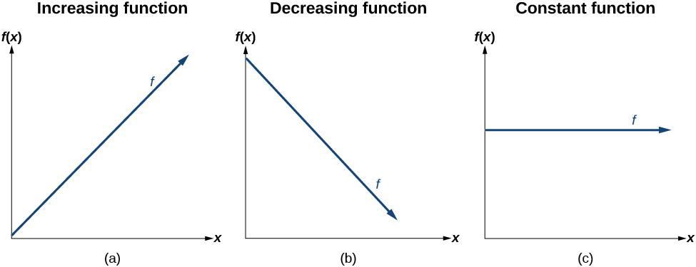
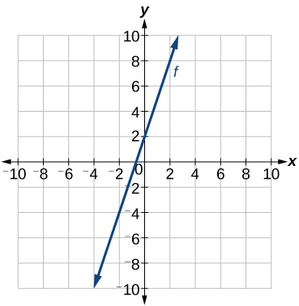

**Linear Functions**

  m51270
  

**Linear Functions**

  In this section, you will:

Represent a linear function.
Determine whether a linear function is increasing, decreasing, or constant.
Interpret slope as a rate of change.
Write and interpret an equation for a linear function.
Graph linear functions.
Determine whether lines are parallel or perpendicular.
Write the equation of a line parallel or perpendicular to a given line.
  f48a9644-4329-4387-9b38-4ac039f12570

  
## Learning Objectives
Find the slope of a line (IA 3.2.1)
Find an equation of the line given two points (IA 3.3.3)

## Objective 1: Find the slope of a line. (IA 3.2.1)
**Linear functions** are a specific type of **function** that can be used to model many real-world applications, such as the growth of a plant, earned salary, the distance a train travels over time, or the costs to start a new business. In this section, we will explore linear functions, their graphs, and how to find them using data points.

### Linear Function
A linear function is a function whose graph is a line. Linear functions can be written in the **slope-intercept** form of a line
 $f(x)=mx+b$ 
where $b$ is the initial or starting value of the function (when input, $x=0$), and $m$ is the constant rate of change, or slope of the function. The $y$ -intercept is at ( $0,b$ ).
 $m=\text{slope}=\ \frac{\text{change in output}}{\text{change in input}}=\frac{\u2206y}{\u2206x}=\frac{{y}_{2}-{y}_{1}}{{x}_{2}-{x}_{1}}=\frac{f({x}_{2})-f({x}_{1})}{{x}_{2}-{x}_{1}}=\frac{\text{rise}}{\text{run}}$ 
When interpreting slope, it will be important to consider the units of measurement. Make sure to always attach these units to both the numerator and denominator when they are provided to you. 

>
>
> **Quick Guide to Slopes of Lines**
>
>
>
> 
>

1. Find the slope of the line shown.    

Solution

Locate two points on the graph whose coordinates are integers. Label the coordinates of these points.
 $(0,\ 1)\ \ =({x}_{1},{y}_{1})$ 

 $(5,\ -2)\ =({x}_{2},{y}_{2})\phantom{\rule{0ex}{0ex}}$ 
It may help to visualize this change as $m=\frac{rise}{run}$ Count the rise between the points. Since the line goes down, the slope is negative. Then count the run, or horizontal change. Using the slope formula: $m=\frac{rise}{run}=\frac{{y}_{2}-{y}_{1}}{{x}_{2}-{x}_{1}}=\frac{-2-1}{5-0}=\frac{-3}{5}$

### Practice Makes Perfect
Find the slope of the line.

2. Find the slope of the line below:       

3. Find the slope of the following line: $y=3$

4. Find the slope of the following line: $x=-2$

5. Find the slope of the following line: $y=-5x-6$

6. Find the slope of the following line: $2x-4y=5$

7. Use the slope formula to find the slope of the line between the following pair of points. $(-2,4),(3,-1)$

8. Use the slope formula to find the slope of the linear function satisfying the condition below. $f\left(-2\right)=-1,f\left(6\right)=5$

## Objective 2: Find an equation of the line given two points. (IA 3.3.3)

### Find an Equation of the Line Given Two Points
When data is collected, a linear model can be created from two data points. In the next example we’ll see how to find an equation of a line when two points are given by following the steps below.

> Find the slope using the given points.
> Choose one point and label its coordinates $({x}_{1},{y}_{1})$ .
> Plug $m,\ {x}_{1}$ and ${y}_{1}$ into point-slope form, $y-{y}_{1}=m(x-{x}_{1})$ .
> Write the equation in slope-intercept form, $y=mx+b$ .

  Find an equation of the line given two points.

9. Find the equation of a line containing the points (−4, −3) and (1, −5)

Solution

Find the slope of the line using the given points. 
 $m=\frac{-5-(-3)}{1-(-4)}=\frac{-5+3}{1+4}=\frac{-2}{5}$ 
Choose one point and label these coordinates $(-4,-3)=\ {x}_{1},{y}_{1}$

Plug $m,{x}_{2}$ and ${y}_{2}$ into point-slope for, $y-{y}_{1}=m(x-{x}_{1})$ . $y-(-3)=\frac{-2}{5}(x-(-4\left)\right)$  $y+3=\frac{-2}{5}(x+4)$ 
Write the equation in slope-intercept form, $y=mx+b$ .
 $y+3=\frac{-2}{5}x-\frac{8}{5}$ 
 $y=\frac{-2}{5}x-\frac{8}{5}-3$ 
 $y=\frac{-2}{5}x-\frac{8}{5}-\frac{15}{5}$  $y=\frac{-2}{5}x-\frac{23}{5}$

### Practice Makes Perfect
Find an equation of the line given two points.
10. Find the equation of a line containing the given points. Write the equation in slope-intercept form. $(4,3)$ and $(8,1)$

11. Find the equation of a line containing the given points. Write the equation in slope-intercept form.  $(-5,-3)$ and $(4,-6)$

12. Find the equation of a line containing the given points. Write the equation in slope-intercept form.  $f\left(-2\right)=8,f\left(4\right)=6$

13. Derek notices the amount he receives in tips each night is a linear function of the number of tables he waits on. On Friday evening he waits on 22 tables and receives $87 in tips, and on Tuesday evening he waits on 18 tables and receives $73 in tips.            ⓐ Record the information given above as two data points.                       ⓑ Find the slope of this linear function in terms of $\frac{$}{table}$ .                       ⓒ Write a linear function S(t) that will let him estimate the amount in $ in tips he will receive as a function of tables, t, waited on.

14. Complete the following:       | *Verbal Description* | *Formula* | | :--- | :--- | | Slope between two points |  | | Point-slope form of a line |  | | Slope-intercept form of a line |  |

Just as with the growth of a bamboo plant, there are many situations that involve constant change over time. Consider, for example, the first commercial maglev train in the world, the Shanghai MagLev Train (). It carries passengers comfortably for a 30-kilometer trip from the airport to the subway station in only eight minuteshttp://www.chinahighlights.com/shanghai/transportation/maglev-train.htm. 

  Suppose a maglev train travels a long distance, and maintains a constant speed of 83 meters per second for a period of time once it is 250 meters from the station. How can we analyze the train’s distance from the station as a function of time? In this section, we will investigate a kind of function that is useful for this purpose, and use it to investigate real-world situations such as the train’s distance from the station at a given point in time.

  
# Representing Linear Functions
The function describing the train’s motion is a **linear function**, which is defined as a function with a constant rate of change. This is a polynomial of degree 1. There are several ways to represent a linear function, including word form, function notation, tabular form, and graphical form. We will describe the train’s motion as a function using each method.

## Representing a Linear Function in Word Form
Let’s begin by describing the linear function in words. For the train problem we just considered, the following word sentence may be used to describe the function relationship.

        *The train’s distance from the station is a function of the time during which the train moves at a constant speed plus its original distance from the station when it began moving at constant speed.*
      The speed is the rate of change. Recall that a rate of change is a measure of how quickly the dependent variable changes with respect to the independent variable. The rate of change for this example is constant, which means that it is the same for each input value. As the time (input) increases by 1 second, the corresponding distance (output) increases by 83 meters. The train began moving at this constant speed at a distance of 250 meters from the station.

## Representing a Linear Function in Function Notation
Another approach to representing linear functions is by using function notation. One example of function notation is an equation written in the **slope-intercept form** of a line, where $x$ is the input value, $m$ is the rate of change, and $b$ is the initial value of the dependent variable.

 $\begin{array}{cc}\text{Equation\ form}\phantom{\rule{2em}{0ex}}  & y=mx+b  \\ \text{Function\ notation}\phantom{\rule{2em}{0ex}}  & f(x)=mx+b  \end{array}$
In the example of the train, we might use the notation $D(t)$ where the total distance $D$ is a function of the time $t.$ The rate, $m,$ is 83 meters per second. The initial value of the dependent variable $b$ is the original distance from the station, 250 meters. We can write a generalized equation to represent the motion of the train.
 $D(t)=83t+250$
      
## Representing a Linear Function in Tabular Form
A third method of representing a linear function is through the use of a table. The relationship between the distance from the station and the time is represented in . From the table, we can see that the distance changes by 83 meters for every 1 second increase in time.

>
>         Q&A
>         *Can the input in the previous example be any real number?*
>
>         *No. The input represents time so while nonnegative rational and irrational numbers are possible, negative real numbers are not possible for this example. The input consists of non-negative real numbers.*
>
>

## Representing a Linear Function in Graphical Form
Another way to represent linear functions is visually, using a graph. We can use the function relationship from above, $D(t)=83t+250,$ to draw a graph as represented in . Notice the graph is a line*.* When we plot a linear function, the graph is always a line.
The rate of change, which is constant, determines the slant, or **slope** of the line. The point at which the input value is zero is the vertical intercept, or ***y*-intercept**, of the line. We can see from the graph that the *y*-intercept in the train example we just saw is $(0,250)$ and represents the distance of the train from the station when it began moving at a constant speed.

Notice that the graph of the train example is restricted, but this is not always the case. Consider the graph of the line $f(x)=2x+1.$
Ask yourself what numbers can be input to the function. In other words, what is the domain of the function? The domain is comprised of all real numbers because any number may be doubled, and then have one added to the product.

>
>
> **Linear Function**
>
>
>
>         A **linear function** is a function whose graph is a line. Linear functions can be written in the **slope-intercept form** of a line
>
>          $f(x)=mx+b$ 
>         where $b$ is the initial or starting value of the function (when input, $x=0$ ), and $m$ is the constant rate of change, or slope of the function. The *y*-intercept is at $(0,b).$
>
>
>

        15. **Using a Linear Function to Find the Pressure on a Diver**               The pressure, $P,$ in pounds per square inch (PSI) on the diver in  depends upon her depth below the water surface, $d,$ in feet. This relationship may be modeled by the equation, $P(d)=0.434d+\mathrm{14.696.}$ Restate this function in words.   

Solution

To restate the function in words, we need to describe each part of the equation. The pressure as a function of depth equals four hundred thirty-four thousandths times depth plus fourteen and six hundred ninety-six thousandths.

      

# Determining Whether a Linear Function Is Increasing, Decreasing, or Constant
The linear functions we used in the two previous examples increased over time, but not every linear function does. A linear function may be increasing, decreasing, or constant. For an **increasing function**, as with the train example, the output values increase as the input values increase. The graph of an increasing function has a positive slope. A line with a positive slope slants upward from left to right as in *(a)*. For a **decreasing function**, the slope is negative. The output values decrease as the input values increase. A line with a negative slope slants downward from left to right as in *(b)*. If the function is constant, the output values are the same for all input values so the slope is zero. A line with a slope of zero is horizontal as in *(c)*.

>
>
> **Increasing and Decreasing Functions**
>
>
>
> The slope determines if the function is an **increasing linear function**, a **decreasing linear function**, or a constant function.
>
>
>  $f(x)=mx+b$ is an increasing function if $m>0.$ 
>  $f(x)=mx+b$ is a decreasing function if $m<0.$
>
>  $f(x)=mx+b$ is a constant function if $m=0.$

16. **Deciding Whether a Function Is Increasing, Decreasing, or Constant**   Studies from the early 2010s indicated that teens sent about 60 texts a day, while more recent data indicates much higher messaging rates among all users, particularly considering the various apps with which people can communicate.http://www.cbsnews.com/8301-501465_162-57400228-501465/teens-are-sending-60-texts-a-day-study-says/. For each of the following scenarios, find the linear function that describes the relationship between the input value and the output value. Then, determine whether the graph of the function is increasing, decreasing, or constant.   ⓐThe total number of texts a teen sends is considered a function of time in days. The input is the number of days, and output is the total number of texts sent. ⓑA person has a limit of 500 texts per month in their data plan. The input is the number of days, and output is the total number of texts remaining for the month. ⓒA person has an unlimited number of texts in their data plan for a cost of $50 per month. The input is the number of days, and output is the total cost of texting each month.

Solution

Analyze each function.

ⓐThe function can be represented as $f(x)=60x$ where $x$ is the number of days. The slope, 60, is positive so the function is increasing. This makes sense because the total number of texts increases with each day.
ⓑThe function can be represented as $f(x)=500-60x$ where $x$ is the number of days. In this case, the slope is negative so the function is decreasing. This makes sense because the number of texts remaining decreases each day and this function represents the number of texts remaining in the data plan after $x$ days.
ⓒThe cost function can be represented as $f(x)=50$ because the number of days does not affect the total cost. The slope is 0 so the function is constant.

# Interpreting Slope as a Rate of Change
In the examples we have seen so far, the slope was provided to us. However, we often need to calculate the slope given input and output values. Recall that given two values for the input, ${x}_{1}$ and ${x}_{2},$ and two corresponding values for the output, ${y}_{1}$ and ${y}_{2}$ —which can be represented by a set of points, $\left({x}_{1}\text{,\}{y}_{1}\right)$ and $\left({x}_{2}\text{,\}{y}_{2}\right)$ —we can calculate the slope $m.$

 $m=\frac{\text{change\ in\ output\ (rise)}}{\text{change\ in\ input\ (run)}}=\frac{\Delta y}{\Delta x}=\frac{{y}_{2}-{y}_{1}}{{x}_{2}-{x}_{1}}$ Note that in function notation we can obtain two corresponding values for the output ${y}_{1}$ and ${y}_{2}$ for the function $f,$ ${y}_{1}=f\left({x}_{1}\right)$ and ${y}_{2}=f\left({x}_{2}\right),$ so we could equivalently write
 $m=\frac{f\left({x}_{2}\right)\u2013f\left({x}_{1}\right)}{{x}_{2}\u2013{x}_{1}}$  indicates how the slope of the line between the points, $\left({x}_{1},{y}_{1}\right)$ and $\left({x}_{2},{y}_{2}\right),$ is calculated. Recall that the slope measures steepness, or slant. The greater the absolute value of the slope, the steeper the slant is.

>
> Q&A
> *Are the units for slope always* $\frac{\text{units\ for\ the\ output}}{\text{units\ for\ the\ input}}\phantom{\rule{0.5em}{0ex}}\text{?}$ 
> *Yes. Think of the units as the change of output value for each unit of change in input value. An example of slope could be miles per hour or dollars per day. Notice the units appear as a ratio of units for the output per units for the input.*
>

>
>
>
>
> **Calculate Slope**
>
>
> The slope, or rate of change, of a function $m$ can be calculated according to the following:
>
>  $m=\frac{\text{change\ in\ output\ (rise)}}{\text{change\ in\ input\ (run)}}=\frac{\Delta y}{\Delta x}=\frac{{y}_{2}-{y}_{1}}{{x}_{2}-{x}_{1}}$ 
> where ${x}_{1}$ and ${x}_{2}$ are input values, ${y}_{1}$ and ${y}_{2}$ are output values.
>

>
> How To
> *Given two points from a linear function, calculate and interpret the slope.*	
>
>
> Determine the units for output and input values.
> Calculate the change of output values and change of input values.
> Interpret the slope as the change in output values per unit of the input value.
>

17. **Finding the Slope of a Linear Function**   If $f(x)$ is a linear function, and $(3,\mathrm{-2})$ and $(8,1)$ are points on the line, find the slope. Is this function increasing or decreasing?

Solution

The coordinate pairs are $(3,\mathrm{-2})$ and $(8,1).$ To find the rate of change, we divide the change in output by the change in input.
 $m=\frac{\text{change\ in\ output}}{\text{change\ in\ input}}=\frac{1-(\mathrm{-2})}{8-3}=\frac{3}{5}$
We could also write the slope as $m=\mathrm{0.6.}$ The function is increasing because $m>0.$

>
> Try It
> 18. If $f(x)$ is a linear function, and $(2,3)$ and $(0,4)$ are points on the line, find the slope. Is this function increasing or decreasing?
>
> 

> 
Solution

>
> $m=\frac{4-3}{0-2}=\frac{1}{-2}=-\frac{1}{2};$ decreasing because $m<0.$
> 

>
>

19. **Finding the Population Change from a Linear Function**   The population of a city increased from 23,400 to 27,800 between 2008 and 2012. Find the change of population per year if we assume the change was constant from 2008 to 2012.

Solution

The rate of change relates the change in population to the change in time. The population increased by $27,800-23,400=4400$ people over the four-year time interval. To find the rate of change, divide the change in the number of people by the number of years.

 $\frac{\text{4,400\ people}}{\text{4\ years}}=\text{1,100\}\frac{\text{people}}{\text{year}}$
So the population increased by 1,100 people per year.

>
> Try It
> 20. The population of a small town increased from 1,442 to 1,868 between 2009 and 2012. Find the change of population per year if we assume the change was constant from 2009 to 2012.
>
> 

> 
Solution

>
> $m=\frac{1,868-1,442}{2,012-2,009}=\frac{426}{3}=\text{142 people per year}$
> 

>
>

# Writing and Interpreting an Equation for a Linear Function
Recall from Equations and Inequalities that we wrote equations in both the **slope-intercept form** and the **point-slope form**. Now we can choose which method to use to write equations for linear functions based on the information we are given. That information may be provided in the form of a graph, a point and a slope, two points, and so on. Look at the graph of the function $f$ in .

We are not given the slope of the line, but we can choose any two points on the line to find the slope. Let’s choose $(0,7)$ and $(4,4).$

 $\begin{array}{ccc}  m& =& \frac{{y}_{2}-{y}_{1}}{{x}_{2}-{x}_{1}}  \\ & =& \frac{4-7}{4-0}  \\ & =& -\frac{3}{4}  \end{array}$
Now we can substitute the slope and the coordinates of one of the points into the point-slope form.
 $\begin{array}{ccc}  y-{y}_{1}& =& m(x-{x}_{1})  \\   \phantom{\rule{0.5em}{0ex}}\text{}y-4& =& -\frac{3}{4}(x-4)  \end{array}$
If we want to rewrite the equation in the slope-intercept form, we would find
 $\begin{array}{ccc}  y-4& =& -\frac{3}{4}(x-4)  \\   y-4& =& -\frac{3}{4}x+3  \\   y& =& -\frac{3}{4}x+7  \end{array}$
If we want to find the slope-intercept form without first writing the point-slope form, we could have recognized that the line crosses the *y*-axis when the output value is 7. Therefore, $b=7.$ We now have the initial value $b$ and the slope $m$ so we can substitute $m$ and $b$ into the slope-intercept form of a line.

So the function is $f(x)=-\frac{3}{4}x+7,$ and the linear equation would be $y=-\frac{3}{4}x+7.$ 

>
> How To
> *Given the graph of a linear function, write an equation to represent the function.*
>
>
> Identify two points on the line.
> Use the two points to calculate the slope.
> Determine where the line crosses the *y*-axis to identify the *y*-intercept by visual inspection.
> Substitute the slope and *y*-intercept into the slope-intercept form of a line equation.

21. **Writing an Equation for a Linear Function**   Write an equation for a linear function given a graph of $f$ shown in .    

Solution

Identify two points on the line, such as $(0,2)$ and $(\mathrm{-2},\mathrm{-4}).$ Use the points to calculate the slope.
 $\begin{array}{ccc}  m& =& \frac{{y}_{2}-{y}_{1}}{{x}_{2}-{x}_{1}}  \\ & =& \frac{\mathrm{-4}-2}{\mathrm{-2}-0}  \\ & =& \frac{\mathrm{-6}}{\mathrm{-2}}  \\ & =& 3  \end{array}$
Substitute the slope and the coordinates of one of the points into the point-slope form.

 $\begin{array}{ccc}  y-{y}_{1}& =& m(x-{x}_{1})  \\   y-(\mathrm{-4})& =& 3(x-(\mathrm{-2}))  \\   y+4& =& 3(x+2)  \end{array}$
We can use algebra to rewrite the equation in the slope-intercept form.

 $\begin{array}{ccc}  y+4& =& 3(x+2)  \\   y+4& =& 3x+6  \\   y& =& 3x+2  \end{array}$

22. **Writing an Equation for a Linear Cost Function**   Suppose Ben starts a company in which he incurs a fixed cost of $1,250 per month for the overhead, which includes his office rent. His production costs are $37.50 per item. Write a linear function $C$ where $C\left(x\right)$ is the cost for $x$ items produced in a given month.

Solution

The fixed cost is present every month, $1,250. The costs that can vary include the cost to produce each item, which is $37.50. The variable cost, called the marginal cost, is represented by $\mathrm{37.5.}$ The cost Ben incurs is the sum of these two costs, represented by $C\left(x\right)=1250+37.5x.$

23. **Writing an Equation for a Linear Function Given Two Points**   If $f$ is a linear function, with $f(3)=\mathrm{-2},$ and $f(8)=1,$ find an equation for the function in slope-intercept form.

Solution

We can write the given points using coordinates.

 $\begin{array}{ccc}  f(3)& =& -2\to (3,\mathrm{-2})  \\   f(8)& =& 1\to (8,1)  \end{array}$
We can then use the points to calculate the slope.

 $\begin{array}{ccc}  m& =& \frac{{y}_{2}-{y}_{1}}{{x}_{2}-{x}_{1}}  \\ & =& \frac{1-(\mathrm{-2})}{8-3}  \\ & =& \frac{3}{5}  \end{array}$
Substitute the slope and the coordinates of one of the points into the point-slope form.

 $\begin{array}{ccc}  y-{y}_{1}& =& m\left(x-{x}_{1}\right)  \\   y-(\mathrm{-2})& =& \frac{3}{5}(x-3)  \end{array}$

We can use algebra to rewrite the equation in the slope-intercept form.

 $\begin{array}{ccc}  y+2& =& \frac{3}{5}(x-3)  \\   y+2& =& \frac{3}{5}x-\frac{9}{5}  \\   y& =& \frac{3}{5}x-\frac{19}{5}  \end{array}$

>
> Try It
> 24. If $f(x)$ is a linear function, with $f(2)=\mathrm{\u201311},$ and $f(4)=\mathrm{-25},$ write an equation for the function in slope-intercept form.
>
> 

> 
Solution

>
> $y=-7x+3$
> 

>
>

# Modeling Real-World Problems with Linear Functions
In the real world, problems are not always explicitly stated in terms of a function or represented with a graph. Fortunately, we can analyze the problem by first representing it as a linear function and then interpreting the components of the function. As long as we know, or can figure out, the initial value and the rate of change of a linear function, we can solve many different kinds of real-world problems.

>
> How To
> *Given a linear function $f$ and the initial value and rate of change, evaluate $f\left(c\right).$*
>
>
> Determine the initial value and the rate of change (slope).
> Substitute the values into $f(x)=mx+b.$
>
> Evaluate the function at $x=c.$
>
>

25. **Using a Linear Function to Determine the Number of Songs in a Music Collection**   Marcus currently has 200 songs in his music collection. Every month, he adds 15 new songs. Write a formula for the number of songs, $N,$ in his collection as a function of time, $t,$ the number of months. How many songs will he own at the end of one year?

Solution

The initial value for this function is 200 because he currently owns 200 songs, so $N(0)=200,$ which means that $b=200.$ 
The number of songs increases by 15 songs per month, so the rate of change is 15 songs per month. Therefore we know that $m=15.$ We can substitute the initial value and the rate of change into the slope-intercept form of a line.

We can write the formula $N(t)=15t+200.$

With this formula, we can then predict how many songs Marcus will have at the end of one year (12 months). In other words, we can evaluate the function at $t=12.$ 

 $\begin{array}{ccc}N(12)& =& 15(12)+200  \\ & =& 180+200  \\ & =& 380  \end{array}$
Marcus will have 380 songs in 12 months.

26. **Using a Linear Function to Calculate Salary Based on Commission**   Working as an insurance salesperson, Ilya earns a base salary plus a commission on each new policy. Therefore, Ilya’s weekly income $I,$ depends on the number of new policies, $n,$ he sells during the week. Last week he sold 3 new policies, and earned $760 for the week. The week before, he sold 5 new policies and earned $920. Find an equation for $I(n),$ and interpret the meaning of the components of the equation.

Solution

The given information gives us two input-output pairs: $(3,760)$ and $(5,\text{92}0).$ We start by finding the rate of change.
 $\begin{array}{ccc}  m& =& \frac{920-760}{5-3}  \\ & =& \frac{$160}{2\ \text{policies}}  \\ & =& \text{$}80\phantom{\rule{0.5em}{0ex}}\text{per}\phantom{\rule{0.5em}{0ex}}\text{policy}  \end{array}$
Keeping track of units can help us interpret this quantity. Income increased by $160 when the number of policies increased by 2, so the rate of change is $80 per policy. Therefore, Ilya earns a commission of $80 for each policy sold during the week.

We can then solve for the initial value.

 $\begin{array}{cccc}  I(n)& =& 80n+b  & \\   760& =& 80(3)+b  & \phantom{\rule{1em}{0ex}}\text{\hspace{1em}}\text{when}\phantom{\rule{0.5em}{0ex}}n=3,I(3)=760  \\   760& -& 80(3)=b  & \\   520& =& b  & \end{array}$

The value of $b$ is the starting value for the function and represents Ilya’s income when $n=0,$ or when no new policies are sold. We can interpret this as Ilya’s base salary for the week, which does not depend upon the number of policies sold.

We can now write the final equation.

 $I(n)=80n+520$

Our final interpretation is that Ilya’s base salary is $520 per week and he earns an additional $80 commission for each policy sold.

27. **Using Tabular Form to Write an Equation for a Linear Function**     relates the number of rats in a population to time, in weeks. Use the table to write a linear equation.    | *number of weeks, *w** | 0 | 2 | 4 | 6 | | :--- | :--- | :--- | :--- | :--- | | *number of rats, *P(w)** | 1000 | 1080 | 1160 | 1240 |

Solution

We can see from the table that the initial value for the number of rats is 1000, so $b=1000.$ 

Rather than solving for $m,$ we can tell from looking at the table that the population increases by 80 for every 2 weeks that pass. This means that the rate of change is 80 rats per 2 weeks, which can be simplified to 40 rats per week.
 $P(w)=40w+1000$

If we did not notice the rate of change from the table we could still solve for the slope using any two points from the table. For example, using $(2,1080)$ and $(6,1240)$

 $\begin{array}{ccc}  m& =& \frac{1240-1080}{6-2}  \\ & =& \frac{160}{4}  \\ & =& 40  \end{array}$

>
> Q&A
> *Is the initial value always provided in a table of values like ?*
> *No. Sometimes the initial value is provided in a table of values, but sometimes it is not. If you see an input of 0, then the initial value would be the corresponding output. If the initial value is not provided because there is no value of input on the table equal to 0, find the slope, substitute one coordinate pair and the slope into $f(x)=mx+b,$ and solve for $b.$*
>

>
> Try It
> 28. A new plant food was introduced to a young tree to test its effect on the height of the tree.  shows the height of the tree, in feet, $x$ months since the measurements began. Write a linear function, $H(x),$ where $x$ is the number of months since the start of the experiment.   | **x** | 0 | 2 | 4 | 8 | 12 | | :--- | :--- | :--- | :--- | :--- | :--- | | **H*(*x*)* | 12.5 | 13.5 | 14.5 | 16.5 | 18.5 |
>
> 

> 
Solution

>
> $H\left(x\right)=0.5x+12.5$
> 

>

# Graphing Linear Functions
Now that we’ve seen and interpreted graphs of linear functions, let’s take a look at how to create the graphs. There are three basic methods of graphing linear functions. The first is by plotting points and then drawing a line through the points. The second is by using the *y-*intercept and slope. And the third method is by using transformations of the identity function $f(x)=x.$

## Graphing a Function by Plotting Points
To find points of a function, we can choose input values, evaluate the function at these input values, and calculate output values. The input values and corresponding output values form coordinate pairs. We then plot the coordinate pairs on a grid. In general, we should evaluate the function at a minimum of two inputs in order to find at least two points on the graph. For example, given the function, $f(x)=2x,$ we might use the input values 1 and 2. Evaluating the function for an input value of 1 yields an output value of 2, which is represented by the point $(1,2).$ Evaluating the function for an input value of 2 yields an output value of 4, which is represented by the point $(2,4).$ Choosing three points is often advisable because if all three points do not fall on the same line, we know we made an error.

>
> How To
> *Given a linear function, graph by plotting points.*
>
>
> Choose a minimum of two input values.
> Evaluate the function at each input value.
> Use the resulting output values to identify coordinate pairs.
> Plot the coordinate pairs on a grid.
> Draw a line through the points.
>

29. **Graphing by Plotting Points**   Graph $f(x)=-\frac{2}{3}x+5$ by plotting points.

Solution

Begin by choosing input values. This function includes a fraction with a denominator of 3, so let’s choose multiples of 3 as input values. We will choose 0, 3, and 6.

Evaluate the function at each input value, and use the output value to identify coordinate pairs.

 $\begin{array}{cc}  x=0& \phantom{\rule{2em}{0ex}}f(0)=-\frac{2}{3}(0)+5=5\Rightarrow (0,5)  \\   x=3& \phantom{\rule{2em}{0ex}}f(3)=-\frac{2}{3}(3)+5=3\Rightarrow (3,3)  \\   x=6& \phantom{\rule{2em}{0ex}}f(6)=-\frac{2}{3}(6)+5=1\Rightarrow (6,1)  \end{array}$
Plot the coordinate pairs and draw a line through the points.  represents the graph of the function $f(x)=-\frac{2}{3}x+5.$

>
> Try It
> 30. Graph $f(x)=-\frac{3}{4}x+6$ by plotting points.
>
> 

> 
Solution

>
> 
> 

>

## Graphing a Function Using *y-*intercept and Slope
Another way to graph linear functions is by using specific characteristics of the function rather than plotting points. The first characteristic is its *y-*intercept, which is the point at which the input value is zero. To find the *y-*intercept, we can set $x=0$ in the equation.
The other characteristic of the linear function is its slope*.*
Let’s consider the following function.
 $f(x)=\frac{1}{2}x+1$
The slope is $\frac{1}{2}.$ Because the slope is positive, we know the graph will slant upward from left to right. The *y-*intercept is the point on the graph when $x=0.$ The graph crosses the *y*-axis at $(0,1).$ Now we know the slope and the *y*-intercept. We can begin graphing by plotting the point $(0,1).$ We know that the slope is the change in the *y*-coordinate over the change in the *x*-coordinate. This is commonly referred to as rise over run, $m=\frac{\text{rise}}{\text{run}}.$ From our example, we have $m=\frac{1}{2},$ which means that the rise is 1 and the run is 2. So starting from our *y*-intercept $(0,1),$ we can rise 1 and then run 2, or run 2 and then rise 1. We repeat until we have a few points, and then we draw a line through the points as shown in .

>
>
> **Graphical Interpretation of a Linear Function**
>
>
>
> In the equation $f(x)=mx+b$
>
>
>  $b$ is the *y*-intercept of the graph and indicates the point $(0,b)$ at which the graph crosses the *y*-axis.
>  $m$ is the slope of the line and indicates the vertical displacement (rise) and horizontal displacement (run) between each successive pair of points. Recall the formula for the slope:
>  $m=\frac{\text{change\ in\ output\ (rise)}}{\text{change\ in\ input\ (run)}}=\frac{\Delta y}{\Delta x}=\frac{{y}_{2}-{y}_{1}}{{x}_{2}-{x}_{1}}$
>

>
> Q&A
> *Do all linear functions have *y*-intercepts?*
>
> *Yes. All linear functions cross the y-axis and therefore have y-intercepts.*(Note: *A vertical line is parallel to the y-axis does not have a y-intercept, but it is not a function*.)

>
> How To
> *Given the equation for a linear function, graph the function using the *y*-intercept and slope.*
>
> Evaluate the function at an input value of zero to find the *y-*intercept.
> Identify the slope as the rate of change of the input value.
> Plot the point represented by the *y-*intercept.
> Use $\frac{\text{rise}}{\text{run}}$ to determine at least two more points on the line.
> Sketch the line that passes through the points.

31. **Graphing by Using the *y-*intercept and Slope**   Graph $f(x)=-\frac{2}{3}x+5$ using the *y-*intercept and slope.

Solution

Evaluate the function at $x=0$ to find the *y-*intercept. The output value when $x=0$ is 5, so the graph will cross the *y*-axis at $(0,5).$

According to the equation for the function, the slope of the line is $-\frac{2}{3}.$ This tells us that for each vertical decrease in the “rise” of $\u20132$ units, the “run” increases by 3 units in the horizontal direction. We can now graph the function by first plotting the *y*-intercept on the graph in . From the initial value $(0,5)$ we move down 2 units and to the right 3 units. We can extend the line to the left and right by repeating, and then drawing a line through the points.

>
> Try It
> 32. Find a point on the graph we drew in  that has a negative *x*-value.
>
> 

> 
Solution

>
> Possible answers include $(-3,7),$
>  $(-6,9),$ or $(-9,11).$
> 

>
>
>

## Graphing a Function Using Transformations
Another option for graphing is to use a **transformation** of the identity function $f(x)=x.$ A function may be transformed by a shift up, down, left, or right. A function may also be transformed using a reflection, stretch, or compression.

### Vertical Stretch or Compression
In the equation $f(x)=mx,$ the $m$ is acting as the **vertical stretch** or **compression** of the identity function. When $m$ is negative, there is also a vertical reflection of the graph.  Notice in  that multiplying the equation of $f(x)=x$ by $m$ stretches the graph of $f$ by a factor of $m$ units if $m>\text{1}$ and compresses the graph of $f$ by a factor of $m$ units if $0<m<1.$ This means the larger the absolute value of $m,$ the steeper the slope.

### Vertical Shift
In $f(x)=mx+b,$ the $b$ acts as the **vertical shift**, moving the graph up and down without affecting the slope of the line. Notice in  that adding a value of $b$ to the equation of $f\left(x\right)=x$ shifts the graph of $f$ a total of $b$ units up if $b$ is positive and $\left|b\right|$ units down if $b$ is negative.

Using vertical stretches or compressions along with vertical shifts is another way to look at identifying different types of linear functions. Although this may not be the easiest way to graph this type of function, it is still important to practice each method.

>
> How To
> *Given the equation of a linear function, use transformations to graph the linear function in the form $f\left(x\right)=mx+b.$*
>
>
> Graph $f\left(x\right)=x.$
>
> Vertically stretch or compress the graph by a factor $m.$
>
> Shift the graph up or down $b$ units.
>

33. **Graphing by Using Transformations**   Graph $f(x)=\frac{1}{2}x-3$ using transformations.

Solution

The equation for the function shows that $m=\frac{1}{2}$ so the identity function is vertically compressed by $\frac{1}{2}.$ The equation for the function also shows that $b=-3$ so the identity function is vertically shifted down 3 units. First, graph the identity function, and show the vertical compression as in .

Then show the vertical shift as in .

>
> Try It
> 34. Graph $f(x)=4+2x$ using transformations.
>
> 

> 
Solution

>
> 
> 

>

>
> Q&A
> *In , could we have sketched the graph by reversing the order of the transformations?*
>
> *No. The order of the transformations follows the order of operations. When the function is evaluated at a given input, the corresponding output is calculated by following the order of operations. This is why we performed the compression first. For example, following the order: Let the input be 2.*
>
>  $\begin{array}{ccc}  f(2)& =& \frac{1}{2}(2)-3  \\ & =& 1-3  \\ & =& \mathrm{-2}  \end{array}$

# Writing the Equation for a Function from the Graph of a Line
Earlier, we wrote the equation for a linear function from a graph. Now we can extend what we know about graphing linear functions to analyze graphs a little more closely. Begin by taking a look at . We can see right away that the graph crosses the *y*-axis at the point $(0,\text{4})$ so this is the *y*-intercept.

Then we can calculate the slope by finding the rise and run. We can choose any two points, but let’s look at the point $(\u20132,0).$ To get from this point to the *y-*intercept, we must move up 4 units (rise) and to the right 2 units (run). So the slope must be
 $m=\frac{\text{rise}}{\text{run}}=\frac{4}{2}=2$
Substituting the slope and *y-*intercept into the slope-intercept form of a line gives
 $y=2x+4$

>
> How To
> *Given a graph of linear function, find the equation to describe the function.*
>
>
> Identify the *y-*intercept of an equation.
> Choose two points to determine the slope.
> Substitute the *y-*intercept and slope into the slope-intercept form of a line.
>

35. **Matching Linear Functions to Their Graphs**   Match each equation of the linear functions with one of the lines in .   ⓐ $f\left(x\right)=2x+3$  ⓑ $g\left(x\right)=2x-3$  ⓒ $h\left(x\right)=-2x+3$  ⓓ $j\left(x\right)=\frac{1}{2}x+3$      

Solution

Analyze the information for each function.

  ⓐThis function has a slope of 2 and a *y*-intercept of 3. It must pass through the point (0, 3) and slant upward from left to right. We can use two points to find the slope, or we can compare it with the other functions listed. Function $g$ has the same slope, but a different *y-*intercept. Lines I and III have the same slant because they have the same slope. Line III does not pass through $(0,\text{3})$ so $f$ must be represented by line I.
ⓑThis function also has a slope of 2, but a *y*-intercept of $\mathrm{-3.}$ It must pass through the point $\left(0,\mathrm{-3}\right)$ and slant upward from left to right. It must be represented by line III.
ⓒThis function has a slope of –2 and a *y-*intercept of 3. This is the only function listed with a negative slope, so it must be represented by line IV because it slants downward from left to right.
 ⓓThis function has a slope of $\frac{1}{2}$ and a *y-*intercept of 3. It must pass through the point (0, 3) and slant upward from left to right. Lines I and II pass through $(0,\text{3}),$ but the slope of $j$ is less than the slope of $f$ so the line for $j$ must be flatter. This function is represented by Line II.
Now we can re-label the lines as in .

## Finding the *x*-intercept of a Line
So far we have been finding the *y-*intercepts of a function: the point at which the graph of the function crosses the *y*-axis. Recall that a function may also have an ***x*-intercept**, which is the *x*-coordinate of the point where the graph of the function crosses the *x*-axis. In other words, it is the input value when the output value is zero.
To find the *x*-intercept, set a function $f(x)$ equal to zero and solve for the value of $x.$ For example, consider the function shown.
 $f(x)=3x-6$
Set the function equal to 0 and solve for $x.$ 
 $\begin{array}{ccc}  0& =& 3x-6  \\   6& =& 3x  \\   2& =& x  \\   x& =& 2  \end{array}$
The graph of the function crosses the *x*-axis at the point $(2,\text{0}).$

> Q&A
> *Do all linear functions have *x*-intercepts?*
>
> *No. However, linear functions of the form $y=c,$ where $c$ is a nonzero real number are the only examples of linear functions with no x-intercept. For example, $y=5$ is a horizontal line 5 units above the x-axis. This function has no x-intercepts, as shown in *.**
>
>
>
> 
>

>
>
>
>
> ***x*-intercept**
>
>
> The *x*-intercept of the function is value of $x$ when $f(x)=0.$ It can be solved by the equation $0=mx+b.$
>
>

36. **Finding an *x*-intercept**   Find the *x*-intercept of $f(x)=\frac{1}{2}x-3.$

Solution

Set the function equal to zero to solve for $x.$

 $\begin{array}{ccc}  0& =& \frac{1}{2}x-3  \\   3& =& \frac{1}{2}x  \\   6& =& x  \\   x& =& 6  \end{array}$
The graph crosses the *x*-axis at the point $(6,\text{0}).$

>
> Try It
> 37. Find the *x*-intercept of $f(x)=\frac{1}{4}x-4.$
>
> 

> 
Solution

>
> $\left(16,\phantom{\rule{0.5em}{0ex}}\text{0}\right)$
> 

>
>

## Describing Horizontal and Vertical Lines
There are two special cases of lines on a graph—horizontal and vertical lines. A **horizontal line** indicates a constant output, or *y*-value. In , we see that the output has a value of 2 for every input value. The change in outputs between any two points, therefore, is 0. In the slope formula, the numerator is 0, so the slope is 0. If we use $m=0$ in the equation $f(x)=mx+b,$ the equation simplifies to $f(x)=b.$ In other words, the value of the function is a constant. This graph represents the function $f(x)=2.$

A **vertical line** indicates a constant input, or *x*-value. We can see that the input value for every point on the line is 2, but the output value varies. Because this input value is mapped to more than one output value, a vertical line does not represent a function. Notice that between any two points, the change in the input values is zero. In the slope formula, the denominator will be zero, so the slope of a vertical line is undefined.

A vertical line, such as the one in *,* has an *x*-intercept, but no *y-*intercept unless it’s the line $x=0.$ This graph represents the line $x=2.$

>
>
>
>
> **Horizontal and Vertical Lines**
>
>
> Lines can be horizontal or vertical.
>
> A **horizontal line** is a line defined by an equation in the form $f(x)=b.$
>
>
> A **vertical line** is a line defined by an equation in the form $x=a.$
>
>

38. **Writing the Equation of a Horizontal Line**   Write the equation of the line graphed in .    

Solution

For any *x*-value, the *y*-value is $-4,$ so the equation is $y=-4.$

39. **Writing the Equation of a Vertical Line**   Write the equation of the line graphed in .    

Solution

The constant *x*-value is $7,$ so the equation is $x=7.$

# Determining Whether Lines are Parallel or Perpendicular
The two lines in  are **parallel lines**: they will never intersect. They have exactly the same steepness, which means their slopes are identical. The only difference between the two lines is the *y*-intercept. If we shifted one line vertically toward the other, they would become coincident.

We can determine from their equations whether two lines are parallel by comparing their slopes. If the slopes are the same and the *y*-intercepts are different, the lines are parallel. If the slopes are different, the lines are not parallel.
 $\begin{array}{cc}\begin{array}{l}f(x)=-2x+6  \\ f(x)=-2x-4  \end{array}\}\phantom{\rule{0.5em}{0ex}}\text{parallel}\phantom{\rule{2em}{0ex}}& \begin{array}{l}f(x)=3x+2  \\ f(x)=2x+2  \end{array}\}\phantom{\rule{0.5em}{0ex}}\text{not\ parallel}\end{array}$
Unlike parallel lines, **perpendicular lines** do intersect. Their intersection forms a right, or 90-degree, angle. The two lines in  are perpendicular.

Perpendicular lines do not have the same slope. The slopes of perpendicular lines are different from one another in a specific way. The slope of one line is the negative reciprocal of the slope of the other line. The product of a number and its reciprocal is $1.$ So, if ${m}_{1}\phantom{\rule{0.5em}{0ex}}\text{and\}{m}_{2}$ are negative reciprocals of one another, they can be multiplied together to yield $\mathrm{\u20131.}$

 ${m}_{1}{m}_{2}=\mathrm{-1}$ To find the reciprocal of a number, divide 1 by the number. So the reciprocal of 8 is $\frac{1}{8},$ and the reciprocal of $\frac{1}{8}$ is 8. To find the negative reciprocal, first find the reciprocal and then change the sign.
As with parallel lines, we can determine whether two lines are perpendicular by comparing their slopes, assuming that the lines are neither horizontal nor vertical. The slope of each line below is the negative reciprocal of the other so the lines are perpendicular.
 $\begin{array}{cccc}  f(x)& =& \frac{1}{4}x+2  & \phantom{\rule{2em}{0ex}}\text{negative\ reciprocal\ of}\phantom{\rule{0.5em}{0ex}}\frac{1}{4}\phantom{\rule{0.5em}{0ex}}\text{is\}\mathrm{-4}  \\   f(x)& =& \mathrm{-4}x+3  & \phantom{\rule{2em}{0ex}}\text{negative\ reciprocal\ of}\phantom{\rule{0.5em}{0ex}}\mathrm{-4}\phantom{\rule{0.5em}{0ex}}\text{is\}\frac{1}{4}  \end{array}$

The product of the slopes is –1.
 $-4\left(\frac{1}{4}\right)=-1$

>
>
> **Parallel and Perpendicular Lines**
>
>
>
> Two lines are **parallel lines** if they do not intersect. The slopes of the lines are the same.
>
>  $f(x)={m}_{1}x+{b}_{1}\phantom{\rule{0.5em}{0ex}}\text{and}\phantom{\rule{0.5em}{0ex}}g(x)={m}_{2}x+{b}_{2}\phantom{\rule{0.5em}{0ex}}\text{are\ parallel\ if\ and\ only\ if\}{m}_{1}={m}_{2}$
>
>
> If and only if ${b}_{1}={b}_{2}$ and ${m}_{1}={m}_{2},$ we say the lines coincide. Coincident lines are the same line.
>
> Two lines are **perpendicular lines** if they intersect to form a right angle.
>
>  $f(x)={m}_{1}x+{b}_{1}\phantom{\rule{0.5em}{0ex}}\text{and}\phantom{\rule{0.5em}{0ex}}g(x)={m}_{2}x+{b}_{2}\phantom{\rule{0.5em}{0ex}}\text{are\ perpendicular\ if\ and\ only\ if}$
>
>  ${m}_{1}{m}_{2}=-1,\text{so}\phantom{\rule{0.5em}{0ex}}{m}_{2}=-\frac{1}{{m}_{1}}$ 
>

40. **Identifying Parallel and Perpendicular Lines**   Given the functions below, identify the functions whose graphs are a pair of parallel lines and a pair of perpendicular lines.   $\begin{array}{cccccc}  f(x)& =& 2x+3  &   \phantom{\rule{2em}{0ex}}h(x)& =& -2x+2  \\   g(x)& =& \frac{1}{2}x-4  &   \phantom{\rule{2em}{0ex}}j(x)& =& 2x-6  \end{array}$

Solution

Parallel lines have the same slope. Because the functions $f(x)=2x+3$ and $j(x)=2x-6$ each have a slope of 2, they represent parallel lines. Perpendicular lines have negative reciprocal slopes. Because −2 and $\frac{1}{2}$ are negative reciprocals, the functions $g(x)=\frac{1}{2}x-4$ and $h(x)=\mathrm{-2}x+2$ represent perpendicular lines.

 
# Writing the Equation of a Line Parallel or Perpendicular to a Given Line
If we know the equation of a line, we can use what we know about slope to write the equation of a line that is either parallel or perpendicular to the given line.

## Writing Equations of Parallel Lines
Suppose for example, we are given the equation shown.
 $f(x)=3x+1$
 We know that the slope of the line formed by the function is 3. We also know that the *y-*intercept is $(0,1).$ Any other line with a slope of 3 will be parallel to $f(x).$ So the lines formed by all of the following functions will be parallel to $f(x).$
 
 $\begin{array}{ccc}  g(x)& =& 3x+6  \\   h(x)& =& 3x+1  \\   p(x)& =& 3x+\frac{2}{3}  \end{array}$
Suppose then we want to write the equation of a line that is parallel to $f$ and passes through the point $(1,\text{7}).$ This type of problem is often described as a point-slope problem because we have a point and a slope. In our example, we know that the slope is 3. We need to determine which value of $b$ will give the correct line. We can begin with the point-slope form of an equation for a line, and then rewrite it in the slope-intercept form.
 $\begin{array}{ccc}  y-{y}_{1}& =& m(x-{x}_{1})  \\   y-7& =& 3(x-1)  \\   y-7& =& 3x-3  \\   y& =& 3x+4  \end{array}$
So $g(x)=3x+4$ is parallel to $f\left(x\right)=3x+1$ and passes through the point $(1,\text{7}).$

 

> How To
> *Given the equation of a function and a point through which its graph passes, write the equation of a line parallel to the given line that passes through the given point.*
>
>
> Find the slope of the function.
> Substitute the given values into either the general point-slope equation or the slope-intercept equation for a line.
> Simplify.
>

41. **Finding a Line Parallel to a Given Line**   Find a line parallel to the graph of $f(x)=3x+6$ that passes through the point $(3,\text{0}).$

Solution

The slope of the given line is 3. If we choose the slope-intercept form, we can substitute $m=3,x=3,$ and $f(x)=0$ into the slope-intercept form to find the *y-*intercept.
 $\begin{array}{ccc}  g(x)& =& 3x+b  \\   0& =& 3(3)+b  \\   b& =& \mathrm{\u20139}  \end{array}$
The line parallel to $f(x)$ that passes through $(3,\text{0})$ is $g(x)=3x-9.$

## Writing Equations of Perpendicular Lines
We can use a very similar process to write the equation for a line perpendicular to a given line. Instead of using the same slope, however, we use the negative reciprocal of the given slope. Suppose we are given the function shown.
 $f\left(x\right)=2x+4$
The slope of the line is 2, and its negative reciprocal is $-\frac{1}{2}.$ Any function with a slope of $-\frac{1}{2}$ will be perpendicular to $f(x).$ So the lines formed by all of the following functions will be perpendicular to $f(x).$

 $\begin{array}{ccc}  g(x)& =& -\frac{1}{2}x+4  \\   h(x)& =& -\frac{1}{2}x+2  \\   p(x)& =& -\frac{1}{2}x-\frac{1}{2}  \end{array}$
As before, we can narrow down our choices for a particular perpendicular line if we know that it passes through a given point. Suppose then we want to write the equation of a line that is perpendicular to $f(x)$ and passes through the point $(4,\text{0}).$ We already know that the slope is $-\frac{1}{2}.$ Now we can use the point to find the *y*-intercept by substituting the given values into the slope-intercept form of a line and solving for $b.$

 $\begin{array}{ccc}  g(x)& =& mx+b  \\   0& =& -\frac{1}{2}(4)+b  \\   0& =& \mathrm{-2}+b  \\   2& =& b  \\   b& =& 2  \end{array}$
The equation for the function with a slope of $-\frac{1}{2}$ and a *y-*intercept of 2 is
 $g(x)=-\frac{1}{2}x+2$
So $g(x)=-\frac{1}{2}x+2$ is perpendicular to $f\left(x\right)=2x+4$ and passes through the point $(4,\text{0}).$ Be aware that perpendicular lines may not look obviously perpendicular on a graphing calculator unless we use the square zoom feature.

>
> Q&A
> *A horizontal line has a slope of zero and a vertical line has an undefined slope. These two lines are perpendicular, but the product of their slopes is not –1. Doesn’t this fact contradict the definition of perpendicular lines?*
>
> *No. For two perpendicular linear functions, the product of their slopes is –1. However, a vertical line is not a function so the definition is not contradicted.*
>

>
> How To
> *Given the equation of a function and a point through which its graph passes, write the equation of a line perpendicular to the given line.*
>
> Find the slope of the function.
> Determine the negative reciprocal of the slope.
> Substitute the new slope and the values for $x$ and $y$ from the coordinate pair provided into $g\left(x\right)=mx+b.$ 
> Solve for $b.$
>
> Write the equation of the line.

42. **Finding the Equation of a Perpendicular Line**   Find the equation of a line perpendicular to $f(x)=3x+3$ that passes through the point $(3,\text{0}).$

Solution

The original line has slope $m=3,$ so the slope of the perpendicular line will be its negative reciprocal, or $-\frac{1}{3}.$ Using this slope and the given point, we can find the equation of the line.

 $\begin{array}{ccc}  g(x)& =& \u2013\frac{1}{3}x+b  \\   0& =& \u2013\frac{1}{3}(3)+b  \\   1& =& b  \\   b& =& 1  \end{array}$
The line perpendicular to $f(x)$ that passes through $(3,\text{0})$ is $g(x)=-\frac{1}{3}x+1.$

>
> Try It
> 43. Given the function $h(x)=2x-4,$ write an equation for the line passing through $\left(0,0\right)$ that is     ⓐparallel to $h(x)$  ⓑperpendicular to $h(x)$
>
> 

> 
Solution

>
> ⓐ $f(x)=2x;$
>
>           ⓑ $g(x)=-\frac{1}{2}x$
> 

>
>

> How To
> *Given two points on a line and a third point, write the equation of the perpendicular line that passes through the point.*
>
>
> Determine the slope of the line passing through the points.
> Find the negative reciprocal of the slope.
> Use the slope-intercept form or point-slope form to write the equation by substituting the known values.
> Simplify.
>
>

44. **Finding the Equation of a Line Perpendicular to a Given Line Passing through a Point**   A line passes through the points $(\mathrm{-2},\text{6})$ and $(4,5).$ Find the equation of a perpendicular line that passes through the point $(4,5).$

Solution

From the two points of the given line, we can calculate the slope of that line.

 $\begin{array}{ccc}  {m}_{1}& =& \frac{5-6}{4-(\mathrm{-2})}  \\ & =& \frac{-1}{6}  \\ & =& -\frac{1}{6}  \end{array}$
Find the negative reciprocal of the slope.

 $\begin{array}{ccc}  {m}_{2}& =& \frac{-1}{-\frac{1}{6}}  \\ & =& \mathrm{-1}\left(-\frac{6}{1}\right)  \\ & =& 6  \end{array}$
We can then solve for the *y-*intercept of the line passing through the point $(4,5).$

 $\begin{array}{ccc}  g(x)& =& 6x+b  \\   5& =& 6(4)+b  \\   5& =& 24+b  \\   \mathrm{-19}& =& b  \\   b& =& \mathrm{-19}  \end{array}$
The equation for the line that is perpendicular to the line passing through the two given points and also passes through point $(4,5)$ is
 $y=6x-19$

>
> Try It
> 45. A line passes through the points, $(\mathrm{-2},\text{\u221215})$ and $(2,\mathrm{-3}).$ Find the equation of a perpendicular line that passes through the point, $(6,4).$
>
> 

> 
Solution

>
> $y=\u2013\frac{1}{3}x+6$
> 

>
>

>
> Media
> Access this online resource for additional instruction and practice with linear functions.
>
>
>  Linear Functions
>  Finding Input of Function from the Output and Graph
> Graphing Functions using Tables
>

# Key Concepts
Linear functions can be represented in words, function notation, tabular form, and graphical form. See .
An increasing linear function results in a graph that slants upward from left to right and has a positive slope. A decreasing linear function results in a graph that slants downward from left to right and has a negative slope. A constant linear function results in a graph that is a horizontal line. See .
Slope is a rate of change. The slope of a linear function can be calculated by dividing the difference between *y*-values by the difference in corresponding *x*-values of any two points on the line. See  and .
An equation for a linear function can be written from a graph. See .
The equation for a linear function can be written if the slope $m$ and initial value $b$ are known. See  and .
A linear function can be used to solve real-world problems given information in different forms. See *,**,*and .
Linear functions can be graphed by plotting points or by using the *y*-intercept and slope. See  and .
Graphs of linear functions may be transformed by using shifts up, down, left, or right, as well as through stretches, compressions, and reflections. See .
The equation for a linear function can be written by interpreting the graph. See .
The *x*-intercept is the point at which the graph of a linear function crosses the *x*-axis. See .
Horizontal lines are written in the form, $f(x)=b.$ See .
Vertical lines are written in the form, $x=b.$ See .
Parallel lines have the same slope. Perpendicular lines have negative reciprocal slopes, assuming neither is vertical. See .
A line parallel to another line, passing through a given point, may be found by substituting the slope value of the line and the *x*- and *y*-values of the given point into the equation, $f(x)=mx+b,$ and using the $b$ that results. Similarly, the point-slope form of an equation can also be used. See *.*
A line perpendicular to another line, passing through a given point, may be found in the same manner, with the exception of using the negative reciprocal slope. See  and .

# Section Exercises

## Verbal
1. Terry is skiing down a steep hill. Terry's elevation, $E(t),$ in feet after $t$ seconds is given by $E(t)=3000-70t.$ Write a complete sentence describing Terry’s starting elevation and how it is changing over time.

Solution

Terry starts at an elevation of 3000 feet and descends 70 feet per second.

2. Jessica is walking home from a friend’s house. After 2 minutes she is 1.4 miles from home. Twelve minutes after leaving, she is 0.9 miles from home. What is her rate in miles per hour?

3. A boat is 100 miles away from the marina, sailing directly toward it at 10 miles per hour. Write an equation for the distance of the boat from the marina after *t* hours.

Solution

$d\left(t\right)=100-10t$

4. If the graphs of two linear functions are perpendicular, describe the relationship between the slopes and the *y*-intercepts.

5. If a horizontal line has the equation $f\left(x\right)=a$ and a vertical line has the equation $x=a,$ what is the point of intersection? Explain why what you found is the point of intersection.

Solution

The point of intersection is $\left(a,\phantom{\rule{0.5em}{0ex}}\text{}a\right).$ This is because for the horizontal line, all of the $y$ coordinates are $a$ and for the vertical line, all of the $x$ coordinates are $a.$ The point of intersection is on both lines and therefore will have these two characteristics.

## Algebraic
For the following exercises, determine whether the equation of the curve can be written as a linear function.
6. $y=\frac{1}{4}x+6$

7. $y=3x-5$

Solution

Yes

8. $y=3{x}^{2}-2$

9. $3x+5y=15$

Solution

Yes

10. $3{x}^{2}+5y=15$

11. $3x+5{y}^{2}=15$

Solution

No

12. $-2{x}^{2}+3{y}^{2}=6$

13. $-\frac{x-3}{5}=2y$

Solution

Yes

For the following exercises, determine whether each function is increasing or decreasing.
14. $f\left(x\right)=4x+3$

15. $g\left(x\right)=5x+6$

Solution

Increasing

16. $a\left(x\right)=5-2x$

17. $b\left(x\right)=8-3x$

Solution

Decreasing

18. $h\left(x\right)=\mathrm{-2}x+4$

19. $k\left(x\right)=\mathrm{-4}x+1$

Solution

Decreasing

20. $j\left(x\right)=\frac{1}{2}x-3$

21. $p\left(x\right)=\frac{1}{4}x-5$

Solution

Increasing

22. $n\left(x\right)=-\frac{1}{3}x-2$

23. $m\left(x\right)=-\frac{3}{8}x+3$

Solution

Decreasing

For the following exercises, find the slope of the line that passes through the two given points.
24. $(2,4)$ and $(4,\text{10})$

25. $(1,\text{5})$ and $(4,\text{11})$

Solution

2

26. $(\mathrm{\u20131},\text{4})$ and $(5,\text{2})$

27. $(8,\mathrm{\u20132})$ and $(4,6)$

Solution

–2

28. $(6,11)$ and $(\mathrm{\u20134},\text{3})$

For the following exercises, given each set of information, find a linear equation satisfying the conditions, if possible.
29. $f(-5)=\mathrm{-4},$ and $f(5)=2$

Solution

$y=\frac{3}{5}x-1$

30. $f(\mathrm{-1})=4,$ and $f(5)=1$

31. Passes through $(2,4)$ and $(4,10)$

Solution

$y=3x-2$

32. Passes through $(1,5)$ and $(4,11)$

33. Passes through $(\mathrm{-1},\text{4})$ and $(5,2)$

Solution

$y=-\frac{1}{3}x+\frac{11}{3}$

34. Passes through $(\mathrm{-2},\text{8})$ and $(4,\text{6})$

35. *x* intercept at $(\mathrm{-2},0)$ and *y* intercept at $(0,\mathrm{-3})$

Solution

$y=-1.5x-3$

36. *x* intercept at $(\mathrm{-5},\text{0})$ and *y* intercept at $(0,4)$

For the following exercises, determine whether the lines given by the equations below are parallel, perpendicular, or neither.
37. $\begin{array}{l}4x-7y=10  \\ 7x+4y=1  \end{array}$

Solution

perpendicular

38. $\begin{array}{c}3y+x=12\\ -y=8x+1\end{array}$

39. $\begin{array}{c}3y+4x=12\\ -6y=8x+1\end{array}$

Solution

parallel

40. $\begin{array}{l}6x-9y=10  \\ 3x+2y=1  \end{array}$

For the following exercises, find the *x*- and *y-*intercepts of each equation.
41. $f\left(x\right)=-x+2$

Solution

$\begin{array}{l}f(0)=-(0)+2\\ f(0)=2\\ y-\mathrm{int}:(0,2)\\ 0=-x+2\\ x-\mathrm{int}:(2,0)\end{array}$

42. $g\left(x\right)=2x+4$

43. $h\left(x\right)=3x-5$

Solution

$\begin{array}{l}h(0)=3(0)-5\\ h(0)=-5\\ y-\mathrm{int}:(0,-5)\\ 0=3x-5\\ x-\mathrm{int}:\left(\frac{5}{3},0\right)\end{array}$

44. $k\left(x\right)=\mathrm{-5}x+1$

45. $-2x+5y=20$

Solution

$\begin{array}{l}-2x+5y=20\\ -2(0)+5y=20\\ 5y=20\\ y=4\\ y-\mathrm{int}:(0,4)\\ -2x+5(0)=20\\ x=-10\\ x-\mathrm{int}:(-10,0)\end{array}$

46. $7x+2y=56$

For the following exercises, use the descriptions of each pair of lines given below to find the slopes of Line 1 and Line 2. Is each pair of lines parallel, perpendicular, or neither?
47. Line 1: Passes through $(0,6)$ and $(3,\mathrm{-24})$  Line 2: Passes through $(\mathrm{-1},19)$ and $(8,\mathrm{-71})$

Solution

Line 1: *m* = –10   Line 2: *m* = –10 Parallel

48. Line 1: Passes through $(\mathrm{-8},\mathrm{-55})$ and $(10,89)$  Line 2: Passes through $(9,-44)$ and $(4,-14)$

49. Line 1: Passes through $(2,3)$ and $(4,\mathrm{-1})$  Line 2: Passes through $(6,3)$ and $(8,5)$

Solution

Line 1: *m* = –2   Line 2: *m* = 1 Neither

50. Line 1: Passes through $(1,7)$ and $(5,5)$  Line 2: Passes through $(\mathrm{-1},\mathrm{-3})$ and $(1,1)$

51. Line 1: Passes through $(2,5)$ and $(5,-1)$   Line 2: Passes through $(\mathrm{-3},7)$ and $(3,\mathrm{-5})$

Solution

$\text{Line\ 1}:\ m=\u20132\ \ \ \text{Line\ 2}:\ m=\u20132\ \ \ \text{Parallel}$

For the following exercises, write an equation for the line described.
52. Write an equation for a line parallel to $f\left(x\right)=-5x-3$ and passing through the point $(2,\text{\u2013}12).$

53. Write an equation for a line parallel to $g(x)=3x-1$ and passing through the point $(4,9).$

Solution

$y=3x-3$

54. Write an equation for a line perpendicular to $h(t)=\mathrm{-2}t+4$ and passing through the point $(\mathrm{-4},\mathrm{\u20131}).$

55. Write an equation for a line perpendicular to $p(t)=3t+4$ and passing through the point $(3,1).$

Solution

$y=-\frac{1}{3}t+2$

## Graphical
For the following exercises, find the slope of the line graphed.
56. 

57. 

Solution

0

For the following exercises, write an equation for the line graphed.
58. 

59. 

Solution

$y=-\frac{5}{4}x+5$

60. 

61. 

Solution

$y=3x-1$

62. 

63. 

Solution

$y=-2.5$

For the following exercises, match the given linear equation with its graph in .

64. $f\left(x\right)=-x-1$

65. $f\left(x\right)=\mathrm{-3}x-1$

Solution

F

66. $f\left(x\right)=-\frac{1}{2}x-1$

67. $f\left(x\right)=2$

Solution

C

68. $f\left(x\right)=2+x$

69. $f\left(x\right)=3x+2$

Solution

A

For the following exercises, sketch a line with the given features.
70. An *x*-intercept of $(\mathrm{\u20134},\text{0})$ and *y*-intercept of $(0,\text{\u20132})$

71. An *x*-intercept $(\mathrm{\u20132},\text{0})$ and *y*-intercept of $(0,\text{4})$

Solution

72. A *y*-intercept of $(0,\text{7})$ and slope $-\frac{3}{2}$

73. A *y*-intercept of $(0,\text{3})$ and slope $\frac{2}{5}$

Solution

74. Passing through the points $(\mathrm{\u20136},\text{\u20132})$ and $(6,\text{\u20136})$

75. Passing through the points $(\mathrm{\u20133},\text{\u20134})$ and $(3,\text{0})$

Solution

For the following exercises, sketch the graph of each equation.
76. $f\left(x\right)=\mathrm{-2}x-1$

77. $f\left(x\right)=\mathrm{-3}x+2$

Solution

78. $f\left(x\right)=\frac{1}{3}x+2$

79. $f\left(x\right)=\frac{2}{3}x-3$

Solution

80. $f\left(t\right)=3+2t$

81. $p\left(t\right)=\mathrm{-2}+3t$

Solution

82. $x=3$

83. $x=\mathrm{-2}$

Solution

84. $r\left(x\right)=4$

For the following exercises, write the equation of the line shown in the graph.
85. 

Solution

$y=\text{3}$

86. 

87. 

Solution

$x=-3$

88. 

## Numeric
For the following exercises, which of the tables could represent a linear function? For each that could be linear, find a linear equation that models the data.
89. | $x$ | 0 | 5 | 10 | 15 | | :--- | :--- | :--- | :--- | :--- | | $g\left(x\right)$ | 5 | –10 | –25 | –40 |

Solution

Linear, $g(x)=-3x+5$

90. | $x$ | 0 | 5 | 10 | 15 | | :--- | :--- | :--- | :--- | :--- | | $h\left(x\right)$ | 5 | 30 | 105 | 230 |

91. | $x$ | 0 | 5 | 10 | 15 | | :--- | :--- | :--- | :--- | :--- | | $f\left(x\right)$ | –5 | 20 | 45 | 70 |

Solution

Linear, $f(x)=5x-5$

92. | $x$ | 5 | 10 | 20 | 25 | | :--- | :--- | :--- | :--- | :--- | | $k\left(x\right)$ | 13 | 28 | 58 | 73 |

93. | $x$ | 0 | 2 | 4 | 6 | | :--- | :--- | :--- | :--- | :--- | | $g\left(x\right)$ | 6 | –19 | –44 | –69 |

Solution

Linear, $g(x)=-\frac{25}{2}x+6$

94. | $x$ | 2 | 4 | 8 | 10 | | :--- | :--- | :--- | :--- | :--- | | $h\left(x\right)$ | 13 | 23 | 43 | 53 |

95. | $x$ | 2 | 4 | 6 | 8 | | :--- | :--- | :--- | :--- | :--- | | $f\left(x\right)$ | –4 | 16 | 36 | 56 |

Solution

Linear, $f(x)=10x-24$

96. | $x$ | 0 | 2 | 6 | 8 | | :--- | :--- | :--- | :--- | :--- | | $k\left(x\right)$ | 6 | 31 | 106 | 231 |

## Technology
For the following exercises, use a calculator or graphing technology to complete the task.
97. If $f$ is a linear function, $f(0.1)=11.5$ , and $f(0.4)=\mathrm{\u20135.9}$ , find an equation for the function.

Solution

$f(x)=-58x+17.3$

98. Graph the function $f$ on a domain of $[\mathrm{\u201310},10]:f(x)=0.02x-\mathrm{0.01.}$ Enter the function in a graphing utility. For the viewing window, set the minimum value of $x$ to be $\mathrm{-10}$ and the maximum value of $x$ to be $10$ .

99. Graph the function $f$ on a domain of $[\mathrm{\u201310},10]:fx)=2,500x+4,000$

Solution

100. shows the input, $w,$ and output, $k,$ for a linear function $k.$    ⓐFill in the missing values of the table.   ⓑWrite the linear function   $k,$ round to 3 decimal places.    | **w** | –10 | 5.5 | 67.5 | *b* | | :--- | :--- | :--- | :--- | :--- | | **k** | 30 | –26 | *a* | –44 |

101. shows the input, $p,$ and output, $q,$ for a linear function $q.$    ⓐFill in the missing values of the table.   ⓑWrite the linear function   $k.$     | **p** | 0.5 | 0.8 | 12 | *b* | | :--- | :--- | :--- | :--- | :--- | | **q** | 400 | 700 | *a* | 1,000,000 |

Solution

ⓐ $a=\mathrm{11,900}\text{,}b=1000.1$ 
ⓑ $q\left(p\right)=1000p\u2013100$

102. Graph the linear function $f$ on a domain of $\left[-10,10\right]$ for the function whose slope is $\frac{1}{8}$ and *y*-intercept is $\frac{31}{16}.$ Label the points for the input values of $\mathrm{-10}$ and $10.$

103. Graph the linear function $f$ on a domain of $\left[-0.1,0.1\right]$ for the function whose slope is 75 and *y*-intercept is $\mathrm{-22.5.}$ Label the points for the input values of $\mathrm{-0.1}$ and $\mathrm{0.1.}$

Solution

104. Graph the linear function $f$ where $f\left(x\right)=ax+b$ on the same set of axes on a domain of $\left[-4,4\right]$ for the following values of $a$ and $b.$   ⓐ $a=2;b=3$  ⓑ $a=2;b=4$  ⓒ $a=2;b=\mathrm{\u20134}$   ⓓ $a=2;b=\mathrm{\u20135}$

## Extensions
105. Find the value of $x$ if a linear function goes through the following points and has the following slope: $(x,2),(\mathrm{-4},6),\phantom{\rule{0.5em}{0ex}}m=3$

Solution

$y=-\frac{16}{3}$

106. Find the value of*y*if a linear function goes through the following points and has the following slope: $(10,y),(25,100),\phantom{\rule{0.5em}{0ex}}m=\mathrm{-5}$

107. Find the equation of the line that passes through the following points:   $\left(a,\phantom{\rule{0.5em}{0ex}}\text{}b\right)$ and $\left(a,\phantom{\rule{0.5em}{0ex}}\text{}b+1\right)$

Solution

$x=a$

108. Find the equation of the line that passes through the following points:   $(2a,b)$ and $(a,b+1)$

109. Find the equation of the line that passes through the following points:   $(a,0)$ and $(c,d)$

Solution

$y=\frac{d}{c\u2013a}x\u2013\frac{ad}{c\u2013a}$

110. Find the equation of the line parallel to the line $g\left(x\right)=\mathrm{-0.}\text{01}x\text{+2}\text{.01}$ through the point $(1,\text{2}).$

111. Find the equation of the line perpendicular to the line $g\left(x\right)=\mathrm{-0.}\text{01}x\text{+2}\text{.01}$ through the point $(1,\text{2}).$

Solution

$y=100x\u201398$

For the following exercises, use the functions $f\left(x\right)=\mathrm{-0.}\text{1}x\text{+200\ and\}g\left(x\right)=20x+\mathrm{0.1.}$ 
112. Find the point of intersection of the lines $f$ and $g.$

113. Where is $f\left(x\right)$ greater than $g\left(x\right)?$ Where is $g\left(x\right)$ greater than $f\left(x\right)?$

Solution

$x<\frac{1999}{201}\text{,}x>\frac{1999}{201}$

## Real-World Applications
114. At noon, a barista notices that they have $20 in their tip jar. If the barista makes an average of $0.50 from each customer, how much will they have in the tip jar if they serve $n$ more customers during the shift?

115. A gym membership with two personal training sessions costs $125, while gym membership with five personal training sessions costs $260. What is cost per session?

Solution

$45 per training session.

116. A clothing business finds there is a linear relationship between the number of shirts, $n,$ it can sell and the price, $p,$ it can charge per shirt. In particular, historical data shows that 1,000 shirts can be sold at a price of $$ 30, $$ while 3,000 shirts can be sold at a price of $22. Find a linear equation in the form $p(n)=mn+b$ that gives the price $p$ they can charge for $n$ shirts.

117. A phone company charges for service according to the formula: $C(n)=24+0.1n,$ where $n$ is the number of minutes talked, and $C(n)$ is the monthly charge, in dollars. Find and interpret the rate of change and initial value.

Solution

The rate of change is 0.1. For every additional minute talked, the monthly charge increases by $0.1 or 10 cents. The initial value is 24. When there are no minutes talked, initially the charge is $24.

118. A farmer finds there is a linear relationship between the number of bean stalks, $n,$ she plants and the yield, $y,$ each plant produces. When she plants 30 stalks, each plant yields 30 oz of beans. When she plants 34 stalks, each plant produces 28 oz of beans. Find a linear relationships in the form $y=mn+b$ that gives the yield when $n$ stalks are planted.

119. A city’s population in the year 1960 was 287,500. In 1989 the population was 275,900. Compute the rate of growth of the population and make a statement about the population rate of change in people per year.

Solution

The slope is –400. this means for every year between 1960 and 1989, the population dropped by 400 per year in the city.

120. A town’s population has been growing linearly. In 2003, the population was 45,000, and the population has been growing by 1,700 people each year. Write an equation, $P(t),$ for the population $t$ years after 2003.

121. Suppose that average annual income (in dollars) for the years 1990 through 1999 is given by the linear function: $I(x)=1054x+\mathrm{23,286}$, where $x$ is the number of years after 1990. Which of the following interprets the slope in the context of the problem?   ⓐAs of 1990, average annual income was $23,286. ⓑIn the ten-year period from 1990–1999, average annual income increased by a total of $1,054. ⓒEach year in the decade of the 1990s, average annual income increased by $1,054.  ⓓAverage annual income rose to a level of $23,286 by the end of 1999.

Solution

C

122. When temperature is 0 degrees Celsius, the Fahrenheit temperature is 32. When the Celsius temperature is 100, the corresponding Fahrenheit temperature is 212. Express the Fahrenheit temperature as a linear function of $C,$ the Celsius temperature, $F\left(C\right).$      ⓐFind the rate of change of Fahrenheit temperature for each unit change temperature of Celsius. ⓑFind and interpret $F(28).$  ⓒFind and interpret $F(\mathrm{\u201340}).$

**decreasing linear function** a function with a negative slope: If $f(x)=mx+b,\ \text{then}\ m<0$ 
**horizontal line** a line defined by $f(x)=b,$ where $b$ is a real number. The slope of a horizontal line is 0.
**increasing linear function** a function with a positive slope: If $f(x)=mx+b,\ \text{then}\ m>0.$ 
**linear function** a function with a constant rate of change that is a polynomial of degree 1, and whose graph is a straight line
**parallel lines** two or more lines with the same slope
**perpendicular lines** two lines that intersect at right angles and have slopes that are negative reciprocals of each other
**point-slope form** the equation for a line that represents a linear function of the form $y-{y}_{1}=m\left(x-{x}_{1}\right)$ 
**slope** the ratio of the change in output values to the change in input values; a measure of the steepness of a line
**slope-intercept form** the equation for a line that represents a linear function in the form $f(x)=mx+b$ 
**vertical line** a line defined by $x=a,$ where $a$ is a real number. The slope of a vertical line is undefined.
