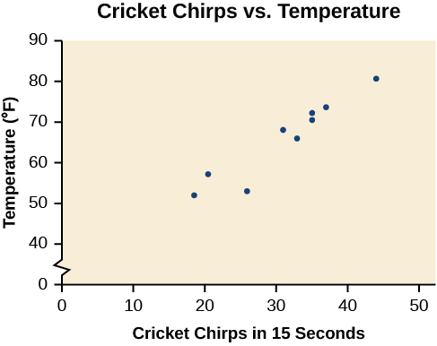

**Fitting Linear Models to Data**

  m51272
  

**Fitting Linear Models to Data**

  In this section, you will:

Draw and interpret scatter diagrams.
Use a graphing utility to find the line of best fit.
Distinguish between linear and nonlinear relations.
Fit a regression line to a set of data and use the linear model to make predictions.

  e9d5f844-6760-4f85-8f79-67292a6703dc

  
## Learning Objectives
Plot points in a rectangular coordinate system (IA 3.1.1).
Find an equation of the line given two points (IA 3.3.3).
## Objectives: Plot points in a rectangular coordinate system (IA 3.1.1) and find an equation of the line given two points. (IA 3.3.3)
In this section we will be plotting collections of data points and looking for patterns in these data sets. A **scatterplot** is a collection of points plotted on the same coordinate system. When trying to fit a function to a data set it is important to note if there is a pattern to the data set and whether that pattern is **linear** or nonlinear. If the dependent variable increases as the independent variable increases, we call this a **positive association**. If the dependent variable decreases as the independent variable increases, we call this a **negative association**.

>
> Plot points in a rectangular coordinate system, then find a line through two of the data points.
> 1. A precalculus instructor is looking at a random sample of students to see if there is a relationship between the number of hours spent working in a homework platform for a given chapter, and the score for the chapter exam.    | Hours spent doing homework, x | 10 | 8 | 0 | 13 | 21 | 11 | 5 | 9 | 18 | | :--- | :--- | :--- | :--- | :--- | :--- | :--- | :--- | :--- | :--- | | Exam score, y | 72 | 68 | 38 | 80 | 93 | 76 | 62 | 71 | 85 |   ⓐ Plot each of the data points on a coordinate system below. You may either plot the points by hand or using a graphing utility. Be sure to label your x and y axes.           ⓑ Observe any patterns in the data points. Do you think the association between the variables is positive or negative? Is the pattern linear or nonlinear?             ⓒ What would you suggest to a friend enrolled in this course based on the data set you graphed?                        ⓓ Choose two points that seem to represent the general pattern in the data set. Write these points as ordered pairs below.  $(\phantom{\rule{1.5em}{0ex}},\phantom{\rule{1.5em}{0ex}})$   $(\phantom{\rule{1.5em}{0ex}},\phantom{\rule{1.5em}{0ex}})$                        ⓔ Find the slope of a line passing through these two points. Interpret its value in terms of the variables being measured.  $m=\frac{{y}_{2}-{y}_{1}}{{x}_{2}-{x}_{1}}=$            ⓕUse point-slope form or slope intercept form to write the equation of the line passing through these data points.   $y\u2013{y}_{1}=m(x\u2013{x}_{1})$ or $y=mx+b$  ⓖ Write this equation in slope-intercept form.  $y=mx+b$        ⓗ Rewrite this equation using function notation.  $f\left(x\right)=$        ⓘ This equation is a linear model. Sketch the line on the graph created in part a.        ⓙ Use this mathematical linear model to predict the exam score for a student who spent 15 hours working on this chapter in their homework system. Show your work below.
>

### Practice Makes Perfect
2. The data below shows the relationship between the mass of an automobile (measured in kg) and the fuel efficiency of the car (measured in miles per gallon) for 7 automobiles.     | Mass (kg), x | 1305 | 1150 | 1925 | 1628 | 1506 | 1452 | 1835 | | :--- | :--- | :--- | :--- | :--- | :--- | :--- | :--- | | Fuel Efficiency (MPG), y | 27 | 28 | 15 | 24 | 23 | 25 | 19 |   ⓐ Draw a scatter plot (by hand or using a graphing utility) for the data provided being sure to label your axes.     ⓑ Does the data appear to be linearly related? Is the association between the variables positive or negative?             ⓒ Choose two points that seem to represent the general pattern in the data set. Write these points as ordered pairs below. $(\phantom{\rule{1.5em}{0ex}},\phantom{\rule{1.5em}{0ex}})$   $(\phantom{\rule{1.5em}{0ex}},\phantom{\rule{1.5em}{0ex}})$                        ⓓ Write the equation of the line passing through the points you listed in part c. in slope intercept form. Show your work below.                        ⓔ Use the linear function you found in part d. to predict the fuel efficiency of an Audi A5 Quattro whose mass is 1610 kg.

3. The data set below shows the relationship between the number of hours worked and the tips received by Nyla, a server at Pi Pizzeria.    | Hours worked in a week, x | 10 | 15 | 20 | 25 | 30 | 35 | 40 | | :--- | :--- | :--- | :--- | :--- | :--- | :--- | :--- | | Tips received, y | $66 | $100 | $118 | $160 | $190 | $235 | $272 |   ⓐ Draw a scatter plot (by hand or using a graphing utility) for the data provided being sure to label your axes.     ⓑ Does the data appear to be linearly related? Is the association between the variables positive or negative?             ⓒ Choose two points that seem to represent the general pattern in the data set. Write these points as ordered pairs below. $(\phantom{\rule{1.5em}{0ex}},\phantom{\rule{1.5em}{0ex}})$   $(\phantom{\rule{1.5em}{0ex}},\phantom{\rule{1.5em}{0ex}})$                        ⓓ Write the equation of the line passing through the points you listed in part c. in slope intercept form. Show your work below.                        ⓔ Based on the linear function you found in part d, how much could Nyla expect to make in tips if they work 38 hours in a given week?

A professor is attempting to identify trends among final exam scores. His class has a mixture of students, so he wonders if there is any relationship between age and final exam scores. One way for him to analyze the scores is by creating a diagram that relates the age of each student to the exam score received. In this section, we will examine one such diagram known as a scatter plot.

  
# Drawing and Interpreting Scatter Plots
A **scatter plot** is a graph of plotted points that may show a relationship between two sets of data. If the relationship is from a **linear model**, or a model that is nearly linear, the professor can draw conclusions using his knowledge of linear functions.  shows a sample scatter plot.

Notice this scatter plot does *not* indicate a **linear relationship**. The points do not appear to follow a trend. In other words, there does not appear to be a relationship between the age of the student and the score on the final exam.

  4. **Using a Scatter Plot to Investigate Cricket Chirps**     The table below shows the number of cricket chirps in 15 seconds, for several different air temperatures, in degrees FahrenheitSelected data from http://classic.globe.gov/fsl/scientistsblog/2007/10/. Retrieved Aug 3, 2010. Plot this data, and determine whether the data appears to be linearly related.       | *Chirps* | 44 | 35 | 20.4 | 33 | 31 | 35 | 18.5 | 37 | 26 | | :--- | :--- | :--- | :--- | :--- | :--- | :--- | :--- | :--- | :--- | | *Temperature* | 80.5 | 70.5 | 57 | 66 | 68 | 72 | 52 | 73.5 | 53 |

Solution

Plotting this data, as depicted in  suggests that there may be a trend. We can see from the trend in the data that the number of chirps increases as the temperature increases. The trend appears to be roughly linear, though certainly not perfectly so.

  

  

  
# Finding the Line of Best Fit
Once we recognize a need for a linear function to model that data, the natural follow-up question is “what is that linear function?” One way to approximate our linear function is to sketch the line that seems to best fit the data. Then we can extend the line until we can verify the *y*-intercept. We can approximate the slope of the line by extending it until we can estimate the $\frac{\text{rise}}{\text{run}}.$ 

  5. **Finding a Line of Best Fit**     Find a linear function that fits the data in  by “eyeballing” a line that seems to fit.

Solution

On a graph, we could try sketching a line. Using the starting and ending points of our hand drawn line, points (0, 30) and (50, 90), this graph has a slope of

   $$
\begin{array}{ccc}  m& =& \frac{60}{50}  \\   & =& 1.2  \end{array}
$$
  and a *y*-intercept at 30. This gives an equation of

   $$
T(c)=1.2c+30
$$
  where $c$ is the number of chirps in 15 seconds, and $T\left(c\right)$ is the temperature in degrees Fahrenheit. The resulting equation is represented in .

  

  

## Recognizing Interpolation or Extrapolation
While the data for most examples does not fall perfectly on the line, the equation is our best guess as to how the relationship will behave outside of the values for which we have data. We use a process known as *interpolation*when we predict a value inside the domain and range of the data. The process of *extrapolation*is used when we predict a value outside the domain and range of the data.
 compares the two processes for the cricket-chirp data addressed in . We can see that interpolation would occur if we used our model to predict temperature when the values for chirps are between 18.5 and 44. Extrapolation would occur if we used our model to predict temperature when the values for chirps are less than 18.5 or greater than 44.
There is a difference between making predictions inside the domain and range of values for which we have data and outside that domain and range. Predicting a value outside of the domain and range has its limitations. When our model no longer applies after a certain point, it is sometimes called **model breakdown**. For example, predicting a cost function for a period of two years may involve examining the data where the input is the time in years and the output is the cost. But if we try to extrapolate a cost when $x=50,$ that is in 50 years, the model would not apply because we could not account for factors fifty years in the future.

>
>
> **Interpolation and Extrapolation**
>
>
>
>   Different methods of making predictions are used to analyze data.
>
> The method of **interpolation** involves predicting a value inside the domain and/or range of the data.
>   The method of **extrapolation** involves predicting a value outside the domain and/or range of the data.
>   Model breakdown occurs at the point when the model no longer applies.
>

  6. **Understanding Interpolation and Extrapolation**     Use the cricket data from  to answer the following questions:       ⓐWould predicting the temperature when crickets are chirping 30 times in 15 seconds be interpolation or extrapolation? Make the prediction, and discuss whether it is reasonable.   ⓑWould predicting the number of chirps crickets will make at 40 degrees be interpolation or extrapolation? Make the prediction, and discuss whether it is reasonable.

Solution

ⓐThe number of chirps in the data provided varied from 18.5 to 44. A prediction at 30 chirps per 15 seconds is inside the domain of our data, so would be interpolation. Using our model:$\begin{array}{ccc}  \text{T (30)}& =& \text{30 + 1.2(30)}  \\ & =& \text{66\ degrees}  \end{array}$
  Based on the data we have, this value seems reasonable.

  ⓑThe temperature values varied from 52 to 80.5. Predicting the number of chirps at 40 degrees is extrapolation because 40 is outside the range of our data. Using our model:$$
\begin{array}{l}40=30+1.2c  \\ 10=1.2c  \\ \phantom{\rule{0.5em}{0ex}}\text\ c\approx 8.33  \end{array}
$$
  

  
  We can compare the regions of interpolation and extrapolation using .

  

  

>
>   Try It
>   7. According to the data from , what temperature can we predict it is if we counted 20 chirps in 15 seconds?
>
> 

> 
Solution

>
> $54\xb0\text{F}$
> 

>
>
>

## Finding the Line of Best Fit Using a Graphing Utility
While eyeballing a line works reasonably well, there are statistical techniques for fitting a line to data that minimize the differences between the line and data valuesTechnically, the method minimizes the sum of the squared differences in the vertical direction between the line and the data values.. One such technique is called **least squares regression** and can be computed by many graphing calculators, spreadsheet software, statistical software, and many web-based calculatorsFor example, http://www.shodor.org/unchem/math/lls/leastsq.html. Least squares regression is one means to determine the line that best fits the data, and here we will refer to this method as linear regression.

>
>   How To
>   *Given data of input and corresponding outputs from a linear function, find the best fit line using linear regression.*
>
>
>   Enter the input in List 1 (L1).
>   Enter the output in List 2 (L2).
>   On a graphing utility, select Linear Regression (LinReg).
>

  8. **Finding a Least Squares Regression Line**     Find the least squares **regression line** using the cricket-chirp data in .

Solution

Enter the input (chirps) in List 1 (L1).
  Enter the output (temperature) in List 2 (L2). See .

| *L1* | 44 | 35 | 20.4 | 33 | 31 | 35 | 18.5 | 37 | 26 |
| :--- | :--- | :--- | :--- | :--- | :--- | :--- | :--- | :--- | :--- |
| *L2* | 80.5 | 70.5 | 57 | 66 | 68 | 72 | 52 | 73.5 | 53 |

  On a graphing utility, select Linear Regression (LinReg). Using the cricket chirp data from earlier, with technology we obtain the equation:
  
  $T(c)=30.281+1.143c$

  

>
>   Q&A
>   *Will there ever be a case where two different lines will serve as the best fit for the data?*
>
>   *No. There is only one best fit line.*
>
>

  
# Distinguishing Between Linear and Nonlinear Models
As we saw above with the cricket-chirp model, some data exhibit strong linear trends, but other data, like the final exam scores plotted by age, are clearly nonlinear. Most calculators and computer software can also provide us with the **correlation coefficient**, which is a measure of how closely the line fits the data. Many graphing calculators require the user to turn a "diagnostic on" selection to find the correlation coefficient, which mathematicians label as $r$ The correlation coefficient provides an easy way to get an idea of how close to a line the data falls.
We should compute the correlation coefficient only for data that follows a linear pattern or to determine the degree to which a data set is linear. If the data exhibits a nonlinear pattern, the correlation coefficient for a linear regression is meaningless. To get a sense for the relationship between the value of $r$ and the graph of the data,  shows some large data sets with their correlation coefficients. Remember, for all plots, the horizontal axis shows the input and the vertical axis shows the output.

>
>
>
>
> **Correlation Coefficient**
>
>
>   The *correlation coefficient* is a value, $r,$ between –1 and 1.
>
>
>    $r>0$ suggests a positive (increasing) relationship
>    $r<0$ suggests a negative (decreasing) relationship
>   The closer the value is to 0, the more scattered the data.
>   The closer the value is to 1 or –1, the less scattered the data is.
>

  9. **Finding a Correlation Coefficient**     Calculate the correlation coefficient for cricket-chirp data in .

Solution

Because the data appear to follow a linear pattern, we can use technology to calculate $r$ Enter the inputs and corresponding outputs and select the Linear Regression. The calculator will also provide you with the correlation coefficient, $r=\mathrm{0.9509.}$ This value is very close to 1, which suggests a strong increasing linear relationship.

  Note: For some calculators, the Diagnostics must be turned "on" in order to get the correlation coefficient when linear regression is performed: [2nd]>[0]>[alpha][x–1], then scroll to *DIAGNOSTICSON*.

  

# Fitting a Regression Line to a Set of Data
Once we determine that a set of data is linear using the correlation coefficient, we can use the regression line to make predictions. As we learned above, a regression line is a line that is closest to the data in the scatter plot, which means that only one such line is a best fit for the data.

  10. **Using a Regression Line to Make Predictions**     Gasoline consumption in the United States has been steadily increasing. Consumption data from 1994 to 2004 is shown in .http://www.bts.gov/publications/national_transportation_statistics/2005/html/table_04_10.html Determine whether the trend is linear, and if so, find a model for the data. Use the model to predict the consumption in 2008.       | *Year* | '94 | '95 | '96 | '97 | '98 | '99 | '00 | '01 | '02 | '03 | '04 | | :--- | :--- | :--- | :--- | :--- | :--- | :--- | :--- | :--- | :--- | :--- | :--- | | *Consumption (billions of gallons)* | 113 | 116 | 118 | 119 | 123 | 125 | 126 | 128 | 131 | 133 | 136 |  The scatter plot of the data, including the least squares regression line, is shown in .      

Solution

We can introduce a new input variable, $t,$ representing years since 1994.
The least squares regression equation is:

  $C(t)=113.318+2.209t$ 
  Using technology, the correlation coefficient was calculated to be 0.9965, suggesting a very strong increasing linear trend.

  Using this to predict consumption in 2008 $(t=14),$ 

  $$
\begin{array}{l}C(14)=113.318+2.209(14)  \\ \phantom{\rule{0.5em}{0ex}}\text{\ \ \ \ \ \ \ \}=144.244  \end{array}
$$
  The model predicts 144.244 billion gallons of gasoline consumption in 2008.

>
>   Try It
>   11. Use the model we created using technology in  to predict the gas consumption in 2011. Is this an interpolation or an extrapolation?
>
> 

> 
Solution

>
> 150.871 billion gallons; extrapolation
> 

>
>
>

>
>   Media
>   Access these online resources for additional instruction and practice with fitting linear models to data.
>
>
>   Introduction to Regression Analysis
>   Linear Regression
>
>

  
# Key Concepts
Scatter plots show the relationship between two sets of data. See .
  Scatter plots may represent linear or non-linear models.
  The line of best fit may be estimated or calculated, using a calculator or statistical software. See .
  Interpolation can be used to predict values inside the domain and range of the data, whereas extrapolation can be used to predict values outside the domain and range of the data. See .
  The correlation coefficient, $r,$ indicates the degree of linear relationship between data. See .
  A regression line best fits the data. See .
  The least squares regression line is found by minimizing the squares of the distances of points from a line passing through the data and may be used to make predictions regarding either of the variables. See .
  
  
# Section Exercises

## Verbal
1. Describe what it means if there is a model breakdown when using a linear model.

Solution

When our model no longer applies, after some value in the domain, the model itself doesn’t hold.

2. What is interpolation when using a linear model?

3. What is extrapolation when using a linear model?

Solution

We predict a value outside the domain and range of the data.

4. Explain the difference between a positive and a negative correlation coefficient.

5. Explain how to interpret the absolute value of a correlation coefficient.

Solution

The closer the number is to 1, the less scattered the data, the closer the number is to 0, the more scattered the data.

## Algebraic
6. A regression was run to determine whether there is a relationship between hours of TV watched per day $(x)$ and number of sit-ups a person can do $(y).$ The results of the regression are given below. Use this to predict the number of sit-ups a person who watches 11 hours of TV can do.    $$ \begin{array}{l}y=ax+b  \\ a=\mathrm{-1.341}  \\ b=32.234  \\ \phantom{\rule{0.5em}{0ex}}\text{}r=\mathrm{-0.896}  \end{array} $$

7. A regression was run to determine whether there is a relationship between the diameter of a tree ( $x$ , in inches) and the tree’s age ( $y$ , in years). The results of the regression are given below. Use this to predict the age of a tree with diameter 10 inches.    $$ \begin{array}{l}y=ax+b  \\ a=6.301  \\ b=\mathrm{-1.044}  \\ \phantom{\rule{0.5em}{0ex}}\text{}r=0.970  \end{array} $$

Solution

61.966 years

For the following exercises, draw a scatter plot for the data provided. Does the data appear to be linearly related?
8. | 0 | 2 | 4 | 6 | 8 | 10 | | :--- | :--- | :--- | :--- | :--- | :--- | | –22 | –19 | –15 | –11 | –6 | –2 |

9. | 1 | 2 | 3 | 4 | 5 | 6 | | :--- | :--- | :--- | :--- | :--- | :--- | | 46 | 50 | 59 | 75 | 100 | 136 |

Solution

  No.

10. | 100 | 250 | 300 | 450 | 600 | 750 | | :--- | :--- | :--- | :--- | :--- | :--- | | 12 | 12.6 | 13.1 | 14 | 14.5 | 15.2 |

11. | 1 | 3 | 5 | 7 | 9 | 11 | | :--- | :--- | :--- | :--- | :--- | :--- | | 1 | 9 | 28 | 65 | 125 | 216 |

Solution

  No.

12. For the following data, draw a scatter plot. If we wanted to know when the population would reach 15,000, would the answer involve interpolation or extrapolation? Eyeball the line, and estimate the answer.      | *Year* | *Population* | | :--- | :--- | | 1990 | 11,500 | | 1995 | 12,100 | | 2000 | 12,700 | | 2005 | 13,000 | | 2010 | 13,750 |

13. For the following data, draw a scatter plot. If we wanted to know when the temperature would reach 28°F, would the answer involve interpolation or extrapolation? Eyeball the line and estimate the answer.       | *Temperature,°F* | 16 | 18 | 20 | 25 | 30 | | :--- | :--- | :--- | :--- | :--- | :--- | | *Time, seconds* | 46 | 50 | 54 | 55 | 62 |

Solution

  Interpolation. About $60\xb0F.$

## Graphical
For the following exercises, match each scatterplot with one of the four specified correlations in  and *.*

14. $r=0.\text{95}$

15. $r=\mathrm{-0.}\text{89}$

Solution

$\text{This\ value\ of\ r\ indicates\ a\ strong\ negative\ correlation\ or\ slope,\ so\ C}$

16. $r=\mathrm{-0.26}$

17. $r=\mathrm{-0.39}$

Solution

$\text{This\ value\ of\ r\ indicates\ a\ weak\ negative\ correlation,\ so\ B}$

For the following exercises, draw a best-fit line for the plotted data.
18. 

19. 

Solution

20. 

21. 

Solution

## Numeric
22. The U.S. Census tracks the percentage of persons 25 years or older who are college graduates. That data for several years is given in .Based on data from http://www.census.gov/hhes/socdemo/education/data/cps/historical/index.html. Accessed 5/1/2014. Determine whether the trend appears linear. If so, and assuming the trend continues, in what year will the percentage exceed 35%?      | *Year* | *Percent Graduates* | | :--- | :--- | | 1990 | 21.3 | | 1992 | 21.4 | | 1994 | 22.2 | | 1996 | 23.6 | | 1998 | 24.4 | | 2000 | 25.6 | | 2002 | 26.7 | | 2004 | 27.7 | | 2006 | 28 | | 2008 | 29.4 |

23. The U.S. import of wine (in hectoliters) for several years is given in . Determine whether the trend appears linear. If so, and assuming the trend continues, in what year will imports exceed 12,000 hectoliters?      | *Year* | *Imports* | | :--- | :--- | | 1992 | 2665 | | 1994 | 2688 | | 1996 | 3565 | | 1998 | 4129 | | 2000 | 4584 | | 2002 | 5655 | | 2004 | 6549 | | 2006 | 7950 | | 2008 | 8487 | | 2009 | 9462 |

Solution

Yes, trend appears linear because $r=0.\text{985}$ and will exceed 12,000 near midyear, 2016, 24.6 years since 1992.

24. shows the year and the number of people unemployed in a particular city for several years. Determine whether the trend appears linear. If so, and assuming the trend continues, in what year will the number of unemployed reach 5?      | *Year* | *Number Unemployed* | | :--- | :--- | | 1990 | 750 | | 1992 | 670 | | 1994 | 650 | | 1996 | 605 | | 1998 | 550 | | 2000 | 510 | | 2002 | 460 | | 2004 | 420 | | 2006 | 380 | | 2008 | 320 |

## Technology
For the following exercises, use each set of data to calculate the regression line using a calculator or other technology tool, and determine the correlation coefficient to 3 decimal places of accuracy.
25. | *$x$* | 8 | 15 | 26 | 31 | 56 | | :--- | :--- | :--- | :--- | :--- | :--- | | *$y$* | 23 | 41 | 53 | 72 | 103 |

Solution

$y=\text{1}.\text{64}0x+\text{13}.\text{8}00,$ $r=0.\text{987}$

26. | *$x$* | 5 | 7 | 10 | 12 | 15 | | :--- | :--- | :--- | :--- | :--- | :--- | | *$y$* | 4 | 12 | 17 | 22 | 24 |

27. | *$x$* | *$y$* | *$x$* | *$y$* | | :--- | :--- | :--- | :--- | | 3 | 21.9 | 10 | 18.54 | | 4 | 22.22 | 11 | 15.76 | | 5 | 22.74 | 12 | 13.68 | | 6 | 22.26 | 13 | 14.1 | | 7 | 20.78 | 14 | 14.02 | | 8 | 17.6 | 15 | 11.94 | | 9 | 16.52 | 16 | 12.76 |

Solution

$y=-0.962x+26.86,\ \ \ r=-0.965$

28. | *$x$* | *$y$* | | :--- | :--- | | 4 | 44.8 | | 5 | 43.1 | | 6 | 38.8 | | 7 | 39 | | 8 | 38 | | 9 | 32.7 | | 10 | 30.1 | | 11 | 29.3 | | 12 | 27 | | 13 | 25.8 |

29. | *$x$* | 21 | 25 | 30 | 31 | 40 | 50 | | :--- | :--- | :--- | :--- | :--- | :--- | :--- | | *$y$* | 17 | 11 | 2 | –1 | –18 | –40 |

Solution

$y=-\text{1}.\text{981}x+\text{6}0.\text{197;}$ $r=-0.\text{998}$

30. | *$x$* | *$y$* | | :--- | :--- | | 100 | 2000 | | 80 | 1798 | | 60 | 1589 | | 55 | 1580 | | 40 | 1390 | | 20 | 1202 |

31. | $x$ | 900 | 988 | 1000 | 1010 | 1200 | 1205 | | :--- | :--- | :--- | :--- | :--- | :--- | :--- | | $y$ | 70 | 80 | 82 | 84 | 105 | 108 |

Solution

$y=0.\text{121}x-38.841,r=0.998$

## Extensions
32. Graph $f(x)=0.5x+10.$ Pick a set of five ordered pairs using inputs $x=\mathrm{-2},\text{1},\text{5},\text{6},9$ and use linear regression to verify that the function is a good fit for the data.

33. Graph $f(x)=-2x-10.$ Pick a set of five ordered pairs using inputs $x=\mathrm{-2},\text{1},\text{5},\text{6},9$ and use linear regression to verify the function.

Solution

$(\mathrm{-2},\mathrm{-6}),(1,\text{\u221212}),(5,\mathrm{-20}),(6,\text{\u221222}),(9,\text{\u221228});$ Yes, the function is a good fit.

For the following exercises, consider this scenario: The profit of a company decreased steadily over a ten-year span. The following ordered pairs shows dollars and the number of units sold in hundreds and the profit in thousands of dollars over the ten-year span, (number of units sold, profit) for specific recorded years:
$$
(46,\mathrm{1,600}),(48,\mathrm{1,550}),(50,\mathrm{1,505}),(52,\mathrm{1,540}),(54,\mathrm{1,495}).
$$

34. Use linear regression to determine a function $P$ where the profit in thousands of dollars depends on the number of units sold in hundreds.

35. Find to the nearest tenth and interpret the *x*-intercept.

Solution

$(\text{189}.8,0)$ If 18,980 units are sold, the company will have a profit of zero dollars.

36. Find to the nearest tenth and interpret the *y*-intercept.

## Real-World Applications
For the following exercises, consider this scenario: The population of a city increased steadily over a ten-year span. The following ordered pairs shows the population and the year over the ten-year span, (population, year) for specific recorded years:
 $(\text{25}00,2000),(\text{265}0,2001),(3000,2003),(\text{35}00,2006),(\text{42}00,2010)$
  
37. Use linear regression to determine a function $y,$ where the year depends on the population. Round to three decimal places of accuracy.

Solution

$y=0.00587x+\text{1985}.4\text{1}$

38. Predict when the population will hit 8,000.

For the following exercises, consider this scenario: The profit of a company increased steadily over a ten-year span. The following ordered pairs show the number of units sold in hundreds and the profit in thousands of dollars over the ten year span, (number of units sold, profit) for specific recorded years:
 $(\text{46},\text{25}0),(\text{48},\text{3}05),(50,\text{35}0),(\text{52},\text{39}0),(\text{54},\text{41}0).$
  
39. Use linear regression to determine a function *y*, where the profit in thousands of dollars depends on the number of units sold in hundreds.

Solution

$y=\text{2}0.\text{25}x-\text{671}.\text{5}$

40. Predict when the profit will exceed one million dollars.

For the following exercises, consider this scenario: The profit of a company decreased steadily over a ten-year span. The following ordered pairs show dollars and the number of units sold in hundreds and the profit in thousands of dollars over the ten-year span (number of units sold, profit) for specific recorded years:
 $(\text{46},\text{25}0),(\text{48},\text{225}),(50,\text{2}05),(\text{52},\text{18}0),(\text{54},\text{165}).$
  
41. Use linear regression to determine a function *y*, where the profit in thousands of dollars depends on the number of units sold in hundreds.

Solution

$y=-\text{1}0.\text{75}x+\text{742}.\text{5}0$

42. Predict when the profit will dip below the $25,000 threshold.

      
# Chapter Review Exercises

## Linear Functions
12. Determine whether the algebraic equation is linear. $2x+3y=7$

Solution

Yes

13. Determine whether the algebraic equation is linear. $6{x}^{2}-y=5$

14. Determine whether the function is increasing or decreasing.     $f\left(x\right)=7x-2$

Solution

Increasing

15. Determine whether the function is increasing or decreasing.     $g\left(x\right)=-x+2$

16. Given each set of information, find a linear equation that satisfies the given conditions, if possible.    Passes through $\left(\text{7},\text{5}\right)$ and $\left(\text{3},\text{17}\right)$

Solution

$y=-\text{3}x+\text{26}$

17. Given each set of information, find a linear equation that satisfies the given conditions, if possible.    *x*-intercept at $\left(\text{6},0\right)$ and *y*-intercept at $\left(0,\text{1}0\right)$

18. Find the slope of the line shown in the graph.      

Solution

3

19. Find the slope of the line graphed.      

20. Write an equation in slope-intercept form for the line shown.      

Solution

$y=\text{2}x-\text{2}$

21. Does the following table represent a linear function? If so, find the linear equation that models the data.       | **x** | –4 | 0 | 2 | 10 | | :--- | :--- | :--- | :--- | :--- | | **g(x)** | 18 | –2 | –12 | –52 |

22. Does the following table represent a linear function? If so, find the linear equation that models the data.   | **x** | 6 | 8 | 12 | 26 | | :--- | :--- | :--- | :--- | :--- | | **g(x)** | –8 | –12 | –18 | –46 |

Solution

Not linear.

23. On June 1st, a company has $4,000,000 profit. If the company then loses 150,000 dollars per day thereafter in the month of June, what is the company’s profit *nth*day after June 1st?

For the following exercises, determine whether the lines given by the equations below are parallel, perpendicular, or neither parallel nor perpendicular:
24. $\begin{array}{c}2x-6y=12\\ -x+3y=1\end{array}$

Solution

parallel

25. $\begin{array}{c}y=\frac{1}{3}x-2\\ 3x+y=-9\end{array}$

For the following exercises, find the *x*- and *y*- intercepts of the given equation
26. $7x+9y=-63$

Solution

$(\mathrm{\u20139},0);(0,\mathrm{\u20137})$

27. $f(x)=2x-1$

For the following exercises, use the descriptions of the pairs of lines to find the slopes of Line 1 and Line 2. Is each pair of lines parallel, perpendicular, or neither?
28. Line 1: Passes through $(5,11)$ and $(10,1)$    Line 2: Passes through $(\mathrm{-1},3)$ and $(\mathrm{-5},11)$

Solution

Line 1: $m=-2;$ Line 2: $m=-2;$ Parallel

29. Line 1: Passes through $(8,\mathrm{-10})$ and $(0,\mathrm{-26})$    Line 2: Passes through $(2,5)$ and $(4,4)$

30. Write an equation for a line perpendicular to $f(x)=5x-1$ and passing through the point (5, 20).

Solution

$y=-0.2x+21$

31. Find the equation of a line with a *y*- intercept of $\left(0,2\right)$ and slope $-\frac{1}{2}.$

32. Sketch a graph of the linear function $f(t)=2t-5.$

Solution

33. Find the point of intersection for the 2 linear functions: $\begin{array}{c}x=y+6\\ 2x-y=13\end{array}.$

34. A car rental company offers two plans for renting a car.    Plan A: 25 dollars per day and 10 cents per mile    Plan B: 50 dollars per day with free unlimited mileage    How many miles would you need to drive for plan B to save you money?

Solution

More than 250

## Modeling with Linear Functions
35. Find the area of a triangle bounded by the *y* axis, the line $f\left(x\right)=10-2x,$ and the line perpendicular to $f$ that passes through the origin.

36. A town’s population increases at a constant rate. In 2010 the population was 55,000. By 2012 the population had increased to 76,000. If this trend continues, predict the population in 2016.

Solution

118,000

37. The number of people afflicted with the common cold in the winter months dropped steadily by 50 each year since 2004 until 2010. In 2004, 875 people were inflicted.    Find the linear function that models the number of people afflicted with the common cold *C* as a function of the year, $t.$ When will no one be afflicted?

For the following exercises, use the graph in  showing the profit, $y,$ in thousands of dollars, of a company in a given year, $x,$ where $x$ represents years since 1980.

38. Find the linear function *y*, where *y* depends on $x,$ the number of years since 1980.

Solution

$y=-\text{3}00x+\text{11},\text{5}00$

39. Find and interpret the *y*-intercept.

For the following exercise, consider this scenario: In 2004, a school population was 1,700. By 2012 the population had grown to 2,500.
40. Assume the population is changing linearly.       ⓐHow much did the population grow between the year 2004 and 2012?   ⓑWhat is the average population growth per year?   ⓒFind an equation for the population, *P*, of the school *t* years after 2004.

Solution

ⓐ 800
     
     
          ⓑ 100 students per year
     
     
     ⓒ$P\left(t\right)=\text{1}00t+\text{17}00$

For the following exercises, consider this scenario: In 2000, the moose population in a park was measured to be 6,500. By 2010, the population was measured to be 12,500. Assume the population continues to change linearly.
41. Find a formula for the moose population, $P$.

42. What does your model predict the moose population to be in 2020?

Solution

18,500

For the following exercises, consider this scenario: The median home values in subdivisions Pima Central and East Valley (adjusted for inflation) are shown in . Assume that the house values are changing linearly.

| Year | Pima Central | East Valley |
| :--- | :--- | :--- |
| 1970 | 32,000 | 120,250 |
| 2010 | 85,000 | 150,000 |

43. In which subdivision have home values increased at a higher rate?

44. If these trends were to continue, what would be the median home value in Pima Central in 2015?

Solution

$91,625

## Fitting Linear Models to Data
45. Draw a scatter plot for the data in . Then determine whether the data appears to be linearly related.      | 0 | -105 | | :--- | :--- | | 2 | -50 | | 4 | 1 | | 6 | 55 | | 8 | 105 | | 10 | 160 |

46. Draw a scatter plot for the data in . If we wanted to know when the population would reach 15,000, would the answer involve interpolation or extrapolation?       | *Year* | *Population* | | :--- | :--- | | 1990 | 5,600 | | 1995 | 5,950 | | 2000 | 6,300 | | 2005 | 6,600 | | 2010 | 6,900 |

Solution

Extrapolation

  
  

47. Eight students were asked to estimate their score on a 10-point quiz. Their estimated and actual scores are given in . Plot the points, then sketch a line that fits the data.      | *Predicted* | *Actual* | | :--- | :--- | | 6 | 6 | | 7 | 7 | | 7 | 8 | | 8 | 8 | | 7 | 9 | | 9 | 10 | | 10 | 10 | | 10 | 9 |

48. Draw a best-fit line for the plotted data.       

Solution

For the following exercises, consider the data in , which shows the percent of unemployed in a city of people 25 years or older who are college graduates is given below, by year. 

| *Year* | 2000 | 2002 | 2005 | 2007 | 2010 |
| :--- | :--- | :--- | :--- | :--- | :--- |
| *Percent Graduates* | 6.5 | 7.0 | 7.4 | 8.2 | 9.0 |

49. Determine whether the trend appears to be linear. If so, and assuming the trend continues, find a linear regression model to predict the percent of unemployed in a given year to three decimal places.

50. In what year will the percentage exceed 12%?

Solution

2023

51. Based on the set of data given in , calculate the regression line using a calculator or other technology tool, and determine the correlation coefficient to three decimal places.      | $x$ | 17 | 20 | 23 | 26 | 29 | | :--- | :--- | :--- | :--- | :--- | :--- | | $y$ | 15 | 25 | 31 | 37 | 40 |

52. Based on the set of data given in , calculate the regression line using a calculator or other technology tool, and determine the correlation coefficient to three decimal places.      | $x$ | 10 | 12 | 15 | 18 | 20 | | :--- | :--- | :--- | :--- | :--- | :--- | | $y$ | 36 | 34 | 30 | 28 | 22 |

Solution

$y=-1.294x+49.412;\ r=-0.974$

For the following exercises, consider this scenario: The population of a city increased steadily over a ten-year span. The following ordered pairs show the population and the year over the ten-year span (population, year) for specific recorded years:
 $(\text{3,6}00,2000);(\text{4,}000,2001);(\text{4,7}00,2003);(\text{6,}000,2006)$
  
53. Use linear regression to determine a function $y,$ where the year depends on the population, to three decimal places of accuracy.

54. Predict when the population will hit 12,000.

Solution

2027

55. What is the correlation coefficient for this model to three decimal places of accuracy?

56. According to the model, what is the population in 2014?

Solution

7,660

      
# Chapter Practice Test
57. Determine whether the following algebraic equation can be written as a linear function. $2x+3y=7$

Solution

Yes

58. Determine whether the following function is increasing or decreasing. $f\left(x\right)=-2x+5$

59. Determine whether the following function is increasing or decreasing. $f\left(x\right)=7x+9$

Solution

Increasing

60. Find a linear equation that passes through (5, 1) and (3, –9), if possible.

61. Find a linear equation, that has an *x* intercept at (–4, 0) and a *y*-intercept at (0, –6), if possible.

Solution

y = −1.5x − 6

62. Find the slope of the line in .      

63. Write an equation for line in .      

Solution

y = −2x − 1

64. Does  represent a linear function? If so, find a linear equation that models the data.      | $x$ | –6 | 0 | 2 | 4 | | :--- | :--- | :--- | :--- | :--- | | $g\left(x\right)$ | 14 | 32 | 38 | 44 |

65. Does  represent a linear function? If so, find a linear equation that models the data.      | **x** | 1 | 3 | 7 | 11 | | :--- | :--- | :--- | :--- | :--- | | **g*(*x*)* | 4 | 9 | 19 | 12 |

Solution

No

66. At 6 am, an online company has sold 120 items that day. If the company sells an average of 30 items per hour for the remainder of the day, write an expression to represent the number of items that were sold $n$ after 6 am.

For the following exercises, determine whether the lines given by the equations below are parallel, perpendicular, or neither parallel nor perpendicular.
67. $\begin{array}{c}y=\frac{3}{4}x-9\\ -4x-3y=8\end{array}$

Solution

Perpendicular

68. $\begin{array}{c}-2x+y=3\\ 3x+\frac{3}{2}y=5\end{array}$

69. Find the *x*- and *y*-intercepts of the equation $2x+7y=-14.$

Solution

(−7, 0); (0, −2)

70. Given below are descriptions of two lines. Find the slopes of Line 1 and Line 2. Is the pair of lines parallel, perpendicular, or neither?    Line 1: Passes through $(\mathrm{-2},\mathrm{-6})$ and $(3,14)$    Line 2: Passes through $(2,6)$ and $(4,14)$

71. Write an equation for a line perpendicular to $f(x)=4x+3$ and passing through the point $(8,10).$

Solution

y = −0.25x + 12

72. Sketch a line with a *y*-intercept of $\left(0,\text{5}\right)$ and slope $-\frac{5}{2}.$

73. Graph of the linear function $f(x)=-x+6.$

Solution

  
  Slope = −1 and
  y-intercept = 6

74. For the two linear functions, find the point of intersection: $\begin{array}{c}x=y+2\\ 2x-3y=-1\end{array}.$

75. A car rental company offers two plans for renting a car.    Plan A: $25 per day and $0.10 per mile    Plan B: $40 per day with free unlimited mileage    How many miles would you need to drive for plan B to save you money?

Solution

150

76. Find the area of a triangle bounded by the *y* axis, the line $f\left(x\right)=12-4x,$ and the line perpendicular to $f$ that passes through the origin.

77. A town’s population increases at a constant rate. In 2010 the population was 65,000. By 2012 the population had increased to 90,000. Assuming this trend continues, predict the population in 2018.

Solution

165,000

78. The number of people afflicted with the common cold in the winter months dropped steadily by 25 each year since 2002 until 2012. In 2002, 8,040 people were inflicted. Find the linear function that models the number of people afflicted with the common cold $C$ as a function of the year, $t.$ When will less than 6,000 people be afflicted?

For the following exercises, use the graph in , showing the profit, $y,$ in thousands of dollars, of a company in a given year, $x,$ where $x$ represents years since 1980.

  
79. Find the linear function $y,$ where $y$ depends on $x,$ the number of years since 1980.

Solution

y = 875x + 10,625

80. Find and interpret the *y*-intercept.

81. In 2004, a school population was 1250. By 2012 the population had dropped to 875. Assume the population is changing linearly.       ⓐHow much did the population drop between the year 2004 and 2012?   ⓑWhat is the average population decline per year?   ⓒFind an equation for the population, *P*, of the school *t* years after 2004.

Solution

ⓐ375 
  ⓑdropped an average of 46.875, or about 47 people per year
  ⓒy = −46.875t + 1250

82. Draw a scatter plot for the data provided in . Then determine whether the data appears to be linearly related.      | 0 | 2 | 4 | 6 | 8 | 10 | | :--- | :--- | :--- | :--- | :--- | :--- | | –450 | –200 | 10 | 265 | 500 | 755 |

83. Draw a best-fit line for the plotted data.       

Solution

For the following exercises, use , which shows the percent of unemployed persons 25 years or older who are college graduates in a particular city, by year.

| *Year* | 2000 | 2002 | 2005 | 2007 | 2010 |
| :--- | :--- | :--- | :--- | :--- | :--- |
| *Percent Graduates* | 8.5 | 8.0 | 7.2 | 6.7 | 6.4 |

84. Determine whether the trend appears linear. If so, and assuming the trend continues, find a linear regression model to predict the percent of unemployed in a given year to three decimal places.

85. In what year will the percentage drop below 4%?

Solution

In early 2018

86. Based on the set of data given in , calculate the regression line using a calculator or other technology tool, and determine the correlation coefficient. Round to three decimal places of accuracy.      | **x** | 16 | 18 | 20 | 24 | 26 | | :--- | :--- | :--- | :--- | :--- | :--- | | **y** | 106 | 110 | 115 | 120 | 125 |

For the following exercises, consider this scenario: The population of a city increased steadily over a ten-year span. The following ordered pairs shows the population (in hundreds) and the year over the ten-year span, (population, year) for specific recorded years:
 $(4,500,2000);(4,700,2001);(5,200,2003);(5,800,2006)$
  
87. Use linear regression to determine a function *y*, where the year depends on the population. Round to three decimal places of accuracy.

Solution

y = 0.00455x + 1979.5

88. Predict when the population will hit 20,000.

89. What is the correlation coefficient for this model?

Solution

r = 0.999

**correlation coefficient**a value, $r,$ between –1 and 1 that indicates the degree of linear correlation of variables, or how closely a regression line fits a data set.
**extrapolation**predicting a value outside the domain and range of the data
**interpolation**predicting a value inside the domain and range of the data
**least squares regression**a statistical technique for fitting a line to data in a way that minimizes the differences between the line and data values
**model breakdown**when a model no longer applies after a certain point
