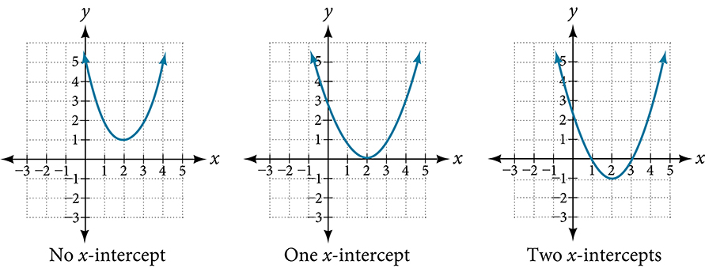

Quadratic Functions
===================

  m51274
  
Quadratic Functions
===================

  In this section, you will:

Recognize characteristics of parabolas.
Understand how the graph of a parabola is related to its quadratic function.
Determine a quadratic function’s minimum or maximum value.
Solve problems involving a quadratic function’s minimum or maximum value.

  f929bd85-ed50-4a67-a528-40008aa14d0c

Learning Objectives
===================
Graph quadratic functions using properties. (IA 9.6.4)

Objective 1: Graph quadratic functions using properties. (IA 9.6.4)
===================================================================
A **quadratic function** is a function that can be written in the **general form** $f\left(x\right)=a{x}^{2}+bx+c$, where *a, b*, and *c* are real numbers and a≠0. The graph of **quadratic function** is called a **parabola**. Parabolas are **symmetric** around a line (also called an axis) and have the highest (maximum) or the lowest (minimum) point that is called a **vertex**.

Making a Table
==============
We can graph quadratic function $f(x)={x}^{2}$ by making a table and plotting points.
\n\n\n\n
Practice Makes Perfect
======================
Graph quadratic function by making a table and plotting points.

  Graph $f\left(x\right)={x}^{2}-1$

ⓐ Choose integer values for $x$, substitute them into the equation and simplify to find $f(x)$ . Record the values of the ordered pairs in the chart.

ⓑ Plot the points, and then connect them with a smooth curve. The result will be the graph of the function.

  
    *x*
    *f(x)*

ⓒ In what direction does it open?
\n\n\n\n

ⓓ Find the vertex.

ⓔ Find the axis of symmetry.

  Graph $f\left(x\right)=-{x}^{2}+2$

ⓐ Choose integer values for $x$, substitute them into the equation and simplify to find $f\left(x\right)$ . Record the values of the ordered pairs in the chart.

  
    *x*
    *f(x)*

ⓑ Plot the points, and then connect them with a smooth curve. The result will be the graph of the function.
\n\n\n\n

ⓒ In what direction does it open?

ⓓ Find the vertex.

ⓔ Find the axis of symmetry.

  Fill in the blanks based on your observations in parts ⓐ and ⓑ.

ⓐ *Parabola opens _______ if* *a* < 0.
ⓑ *Parabola opens _______ if* *a* > 0.

Graphing of quadratic functions is much easier when we know the vertex and the axis of symmetry. The *vertex* of the graph of the quadratic function  in the form $f(x)=a{x}^{2}+bx+c\ \mathrm{is}\ (\frac{-b}{2a},\ f(\frac{-b}{2a}\left)\right)$ .
The line or axis of symmetry of the parabola is the vertical line $x=\frac{-b}{2a}$ .

Find the vertex and the axis of symmetry of the graph.
======================================================

  $f\left(x\right)=2{x}^{2}-4x-3$

  Notice that $a=\ 2\ \ \ \ \ \ \ b=-4\ \ \ \ \ \ \ c=\ -3\ \$

First, find the x-coordinate of the vertex by evaluating $-\frac{b}{2a}:\ -\frac{b}{2a}=-\frac{-4}{2\left(2\right)}=1$

Now we can find the y-coordinate by evaluating $f(-\frac{b}{2a})=f\left(1\right)=2{\left(1\right)}^{2}-4\left(1\right)-3=-5$
The vertex is at the point (1, -5) and the axis of symmetry is $x=1$

*Using a vertex to graph a quadratic function in the form* $f\left(x\right)=a{x}^{2}+bx+c$
Determine if parabola opens up or down
Find the vertex and axis of symmetry
Pick two x-values right next to the vertex and find corresponding y-values
Plot the vertex and the two points you found
Plot two symmetrical points using the axis of symmetry
Draw a smooth curve through the points

Practice Makes Perfect
======================
Graphing quadratic functions using a vertex.

  Graph $f(x)=-2{x}^{2}+8x+6$

ⓐ Determine the direction of opening.
\n\n\n\n

ⓑ Find and plot the vertex.

ⓒ Find the axis of symmetry.

ⓓ Find and plot 2 more points and symmetrical points.

  
    *x*
    *f(x)*

ⓔ Does it have a maximum or a minimum? Find this point.

ⓕ Find domain and range.

  Graph $f(x)={(x+1)}^{2}-3$

ⓐ Complete the following table and plot the points.

  
    *x*
    *f(x)*
  
  
    
    
  
  
    
    
  
  
    
    
  
  
    
    
  

\n\n\n\n

ⓑ Find the vertex of the graph.
(___, ___)

ⓒ Is there a connection between the equation of the function and coordinates of the vertex? Explain.

ⓓ We call this form of quadratic function a *vertex, or standard form*. Why do you think it is called vertex form?

\n\n\n\n

Curved antennas, such as the ones shown in , are commonly used to focus microwaves and radio waves to transmit television and telephone signals, as well as satellite and spacecraft communication. The cross-section of the antenna is in the shape of a parabola, which can be described by a quadratic function.

In this section, we will investigate quadratic functions, which frequently model problems involving area and projectile motion. Working with quadratic functions can be less complex than working with higher degree functions, so they provide a good opportunity for a detailed study of function behavior.

Recognizing Characteristics of Parabolas
========================================
The graph of a quadratic function is a U-shaped curve called a **parabola**. One important feature of the graph is that it has an extreme point, called the **vertex**. If the parabola opens up, the vertex represents the lowest point on the graph, or the **minimum value** of the quadratic function. If the parabola opens down, the vertex represents the highest point on the graph, or the **maximum value**. In either case, the vertex is a turning point on the graph. The graph is also symmetric with a vertical line drawn through the vertex, called the **axis of symmetry**. These features are illustrated in .

\n\n\n\n

The *y*-intercept is the point at which the parabola crosses the *y*-axis. The *x*-intercepts are the points at which the parabola crosses the *x*-axis. If they exist, the *x*-intercepts represent the **zeros***,*or **roots**, of the quadratic function, the values of $x$ at which $y=0.$

Identifying the Characteristics of a Parabola
=============================================

Determine the vertex, axis of symmetry, zeros, and $y\text{-}$ intercept of the parabola shown in .

\n\n\n\n

The vertex is the turning point of the graph. We can see that the vertex is at $\left(3,1\right).$ Because this parabola opens upward, the axis of symmetry is the vertical line that intersects the parabola at the vertex. So the axis of symmetry is $x=3.$ This parabola does not cross the $x\text{-}$ axis, so it has no zeros. It crosses the $y\text{-}$ axis at $\left(0,7\right)$ so this is the *y*-intercept.

Understanding How the Graphs of Parabolas are Related to Their Quadratic Functions
==================================================================================
The **general form** *of a quadratic function*presents the function in the form
 $$
f(x)=a{x}^{2}+bx+c
$$ 
where $a,b,$ and $c$ are real numbers and $a\ne 0.$ If $a>0,$ the parabola opens upward. If $a<0,$ the parabola opens downward. We can use the general form of a parabola to find the equation for the axis of symmetry.

The axis of symmetry is defined by $x=-\frac{b}{2a}.$ If we use the quadratic formula, $x=\frac{-b\pm \sqrt{{b}^{2}-4ac}}{2a},$ to solve $a{x}^{2}+bx+c=0$ for the $x\text{-}$ intercepts, or zeros, we find the value of $x$ halfway between them is always $x=-\frac{b}{2a},$ the equation for the axis of symmetry.

represents the graph of the quadratic function written in general form as $y={x}^{2}+4x+3.$ In this form, $a=1,b=4,$ and $c=3.$ Because $a>0,$ the parabola opens upward. The axis of symmetry is $x=-\frac{4}{2\left(1\right)}=\mathrm{-2.}$ This also makes sense because we can see from the graph that the vertical line $x=\mathrm{-2}$ divides the graph in half. The vertex always occurs along the axis of symmetry.  For a parabola that opens upward, the vertex occurs at the lowest point on the graph, in this instance, $(\mathrm{-2},\mathrm{-1}).$ The $x\text{-}$ intercepts, those points where the parabola crosses the $x\text{-}$ axis, occur at $(\mathrm{-3},0)$ and $(\mathrm{-1},0).$
\n\n\n\n

The *standard form of a quadratic function* presents the function in the form

 $$
f(x)=a{(x-h)}^{2}+k
$$ 
where $\left(h,\phantom{\rule{0.5em}{0ex}}\text{}k\right)$ is the vertex. Because the vertex appears in the standard form of the quadratic function, this form is also known as the **vertex form of a quadratic function**.

As with the general form, if $a>0,$ the parabola opens upward and the vertex is a minimum. If $a<0,$ the parabola opens downward, and the vertex is a maximum.  represents the graph of the quadratic function written in standard form as $y=\mathrm{-3}{\left(x+2\right)}^{2}+4.$ Since $x\u2013h=x+2$ in this example, $h=\mathrm{\u20132.}$ In this form, $a=\mathrm{-3},h=\mathrm{-2},$ and $k=4.$ Because $a<0,$ the parabola opens downward. The vertex is at $\left(-2,\phantom{\rule{0.5em}{0ex}}\text{4}\right).$
\n\n\n\n

The standard form is useful for determining how the graph is transformed from the graph of $y={x}^{2}.$  is the graph of this basic function.

\n\n\n\n

If $k>0,$ the graph shifts upward, whereas if $k<0,$ the graph shifts downward. In , $k>0,$ so the graph is shifted 4 units upward. If $h>0,$ the graph shifts toward the right and if $h<0,$ the graph shifts to the left. In , $h<0,$ so the graph is shifted 2 units to the left. The magnitude of $a$ indicates the stretch of the graph. If $\left|a\right|>1,$ the point associated with a particular $x\text{-}$ value shifts farther from the *x-*axis, so the graph appears to become narrower, and there is a vertical stretch. But if $\left|a\right|<1,$ the point associated with a particular $x\text{-}$ value shifts closer to the *x-*axis, so the graph appears to become wider, but in fact there is a vertical compression. In , $\left|a\right|>1,$ so the graph becomes narrower.
The standard form and the general form are equivalent methods of describing the same function. We can see this by expanding out the general form and setting it equal to the standard form.

 $$
\begin{array}{ccc}\hfill a{(x-h)}^{2}+k& =& a{x}^{2}+bx+c\hfill \\ \hfill a{x}^{2}-2ahx+(a{h}^{2}+k)& =& a{x}^{2}+bx+c\hfill \end{array}
$$

For the linear terms to be equal, the coefficients must be equal.

 $$
\mathrm{\u20132}ah=b,\phantom{\rule{0.5em}{0ex}}\text{so\}h=-\frac{b}{2a}
$$ This is the **axis of symmetry** we defined earlier. Setting the constant terms equal:

 $$
\begin{array}{ccc}\hfill a{h}^{2}+k& =& c\hfill \\ \hfill k& =& c-a{h}^{2}\hfill \\ & =& c-a-{\left(\frac{b}{2a}\right)}^{2}\hfill \\ & =& c-\frac{{b}^{2}}{4a}\hfill \end{array}
$$

In practice, though, it is usually easier to remember that *k* is the output value of the function when the input is $h,$ so $f(h)=k.$

Forms of Quadratic Functions
============================

A quadratic function is a polynomial function of degree two. The graph of a **quadratic function** is a parabola.
The **general form of a quadratic function** is $f(x)=a{x}^{2}+bx+c$ where $a,b,$ and $c$ are real numbers and $a\ne 0.$
The **standard form of a quadratic function** is $f(x)=a{(x-h)}^{2}+k$ where $a\ne 0.$
The vertex $(h,k)$ is located at
 $$
h=\u2013\frac{b}{2a},\phantom{\rule{0.5em}{0ex}}\text{}k=f(h)=f\left(\frac{-b}{2a}\right)
$$ 

How to
*Given a graph of a quadratic function, write the equation of the function in general form.*

Identify the horizontal shift of the parabola; this value is $h.$ Identify the vertical shift of the parabola; this value is $k.$ 
Substitute the values of the horizontal and vertical shift for $h$ and $k.$ in the function $f(x)=a{(x\u2013h)}^{2}+k.$ 
Substitute the values of any point, other than the vertex, on the graph of the parabola for $x$ and $f(x).$ 
Solve for the stretch factor, $\left|a\right|.$ 
Expand and simplify to write in general form.

Writing the Equation of a Quadratic Function from the Graph
===========================================================

Write an equation for the quadratic function $g$ in  as a transformation of $f(x)={x}^{2},$ and then expand the formula, and simplify terms to write the equation in general form.
\n\n\n\n

We can see the graph of *g*is the graph of $f(x)={x}^{2}$ shifted to the left 2 and down 3, giving a formula in the form $g(x)=a{(x-(\mathrm{-2}))}^{2}-3=a{(x+2)}^{2}\u20133.$
Substituting the coordinates of a point on the curve, such as $(0,\mathrm{-1}),$ we can solve for the stretch factor.

 $$
\begin{array}{ccc}\hfill -1& =& a{\left(0+2\right)}^{2}-3\hfill \\ \hfill 2& =& 4a\hfill \\ \hfill a& =& \frac{1}{2}\hfill \end{array}
$$

In standard form, the algebraic model for this graph is $(g)x=\frac{1}{2}{(x+2)}^{2}\u20133.$

To write this in general polynomial form, we can expand the formula and simplify terms.

 $$
\begin{array}{ccc}\hfill g(x)& =& \frac{1}{2}{(x+2)}^{2}-3\hfill \\ & =& \frac{1}{2}(x+2)(x+2)-3\hfill \\ & =& \frac{1}{2}({x}^{2}+4x+4)-3\hfill \\ & =& \frac{1}{2}{x}^{2}+2x+2-3\hfill \\ & =& \frac{1}{2}{x}^{2}+2x-1\hfill \end{array}
$$

Notice that the horizontal and vertical shifts of the basic graph of the quadratic function determine the location of the vertex of the parabola; the vertex is unaffected by stretches and compressions.

Analysis
========

We can check our work using the table feature on a graphing utility. First enter $\text{Y1}=\frac{1}{2}{(x+2)}^{2}-3.$ Next, select $\text{TBLSET,}$ then use $\text{TblStart}=\u20136$ and $\Delta \text{Tbl\ =\ 2,}$ and select $\text{TABLE}\text{.}$ See .

*$x$*
–6
–4
–2
0
2

*$y$*
5
–1
–3
–1
5

The ordered pairs in the table correspond to points on the graph.

Try It

A coordinate grid has been superimposed over the quadratic path of a basketball in . Assume that the point (–4, 7) is the highest point of the basketball’s trajectory. Find an equation for the path of the ball. Does the shooter make the basket?

\n\n\n\n

The path passes through the origin and has vertex at $\left(-4,\phantom{\rule{0.5em}{0ex}}\text{}7\right),$ so $h(x)=\u2013\frac{7}{16}{(x+4)}^{2}+7.$ To make the shot, $h\left(-7.5\right)$ would need to be about 4 but $h(\u20137.5)\approx 1.64;$ he doesn’t make it.

How To
*Given a quadratic function in general form, find the vertex of the parabola.*

Identify $a,\ b,\ \text{and}\ c.$ 
Find $h,$ the *x*-coordinate of the vertex, by substituting $a$ and $b$ into $h=\u2013\frac{b}{2a}.$ 
Find $k,$ the *y*-coordinate of the vertex, by evaluating $k=f\left(h\right)=f\left(-\frac{b}{2a}\right).$ 

Finding the Vertex of a Quadratic Function
==========================================

Find the vertex of the quadratic function $f(x)=2{x}^{2}\u20136x+7.$ Rewrite the quadratic in standard form (vertex form).

$\begin{array}{c}\text{The horizontal coordinate of the vertex will be at}\hfill \\ & \hfill h& =& -\frac{b}{2a}\hfill \\ & & =& -\frac{\mathrm{-6}}{2(2)}\hfill \\ & & =& \frac{6}{4}\hfill \\ & & =& \frac{3}{2}\hfill \\ \text{The vertical coordinate of the vertex will be at}\hfill \\ & \hfill k& =& f(h)\hfill \\ & & =& f\left(\frac{3}{2}\right)\hfill \\ & & =& 2{\left(\frac{3}{2}\right)}^{2}-6\left(\frac{3}{2}\right)+7\hfill \\ & & =& \frac{5}{2}\hfill \end{array}$
Rewriting into standard form, the stretch factor will be the same as the $a$ in the original quadratic. First, find the horizontal coordinate of the vertex. Then find the vertical coordinate of the vertex. Substitute the values into standard form, using the " $a$ " from the general form.

 $$
\begin{array}{ccc}\hfill f(x)& =& a{x}^{2}+bx+c\hfill \\ \hfill f(x)& =& 2{x}^{2}-6x+7\hfill \end{array}
$$

The standard form of a quadratic function prior to writing the function then becomes the following:
 $$
f\left(x\right)=2{\left(x\u2013\frac{3}{2}\right)}^{2}+\frac{5}{2}
$$ 

Analysis
========

One reason we may want to identify the vertex of the parabola is that this point will inform us where the maximum or minimum value of the output occurs, $k,$ and where it occurs, $x.$

Try It

Given the equation $g(x)=13+{x}^{2}-6x,$ write the equation in general form and then in standard form.

$g(x)={x}^{2}-6x+13$ in general form; $g(x)={(x-3)}^{2}+4$ in standard form

Finding the Domain and Range of a Quadratic Function
====================================================

Any number can be the input value of a quadratic function. Therefore, the domain of any quadratic function is all real numbers. Because parabolas have a maximum or a minimum point, the range is restricted. Since the vertex of a parabola will be either a maximum or a minimum, the range will consist of all *y*-values greater than or equal to the *y*-coordinate at the turning point or less than or equal to the *y*-coordinate at the turning point, depending on whether the parabola opens up or down.

Domain and Range of a Quadratic Function
========================================

The domain of any **quadratic function** is all real numbers unless the context of the function presents some restrictions.
The range of a quadratic function written in general form $f(x)=a{x}^{2}+bx+c$ with a positive $a$ value is $f(x)\ge f\left(-\frac{b}{2a}\right),$ or $\left[f\left(-\frac{b}{2a}\right),\infty \right);$ the range of a quadratic function written in general form with a negative $a$ value is $f(x)\le f\left(-\frac{b}{2a}\right),$ or $\left(-\infty ,f\left(-\frac{b}{2a}\right)\right].$

The range of a quadratic function written in standard form $f(x)=a{(x-h)}^{2}+k$ with a positive $a$ value is $f(x)\ge k;$ the range of a quadratic function written in standard form with a negative $a$ value is $f(x)\le k.$

How To
*Given a quadratic function, find the domain and range.*

Identify the domain of any quadratic function as all real numbers.
Determine whether $a$ is positive or negative. If $a$ is positive, the parabola has a minimum. If $a$ is negative, the parabola has a maximum.
Determine the maximum or minimum value of the parabola, $k.$ 
If the parabola has a minimum, the range is given by $f(x)\ge k,$ or $\left[k,\infty \right).$ If the parabola has a maximum, the range is given by $f(x)\le k,$ or $\left(-\infty ,k\right].$ 

Finding the Domain and Range of a Quadratic Function
====================================================

Find the domain and range of $f(x)=-5{x}^{2}+9x-1.$

As with any quadratic function, the domain is all real numbers.

Because $a$ is negative, the parabola opens downward and has a maximum value. We need to determine the maximum value. We can begin by finding the $x\text{-}$ value of the vertex.

 $$
\begin{array}{ccc}\hfill h& =& -\frac{b}{2a}\hfill \\ \hfill & =& -\frac{9}{2(\mathrm{-5})}\hfill \\ \hfill & =& \frac{9}{10}\hfill \end{array}
$$

The maximum value is given by $f(h).$

 $$
\begin{array}{ccc}\hfill f\left(\frac{9}{10}\right)& =& -5{\left(\frac{9}{10}\right)}^{2}+9\left(\frac{9}{10}\right)-1\hfill \\ & =& \frac{61}{20}\hfill \end{array}
$$
The range is $f(x)\le \frac{61}{20},$ or $\left(-\infty ,\frac{61}{20}\right].$

Try It

Find the domain and range of $f(x)=2{\left(x-\frac{4}{7}\right)}^{2}+\frac{8}{11}.$

The domain is all real numbers. The range is $f(x)\ge \frac{8}{11},$ or $\left[\frac{8}{11},\infty \right).$

Determining the Maximum and Minimum Values of Quadratic Functions
=================================================================
The output of the quadratic function at the vertex is the maximum or minimum value of the function, depending on the orientation of the **parabola**. We can see the maximum and minimum values in .
\n\n\n\n

There are many real-world scenarios that involve finding the maximum or minimum value of a quadratic function, such as applications involving area and revenue.

Finding the Maximum Value of a Quadratic Function
=================================================

A backyard farmer wants to enclose a rectangular space for a new garden within her fenced backyard. She has purchased 80 feet of wire fencing to enclose three sides, and she will use a section of the backyard fence as the fourth side.

ⓐFind a formula for the area enclosed by the fence if the sides of fencing perpendicular to the existing fence have length $L.$ 
ⓑWhat dimensions should she make her garden to maximize the enclosed area?

Let’s use a diagram such as  to record the given information. It is also helpful to introduce a temporary variable, $W,$ to represent the width of the garden and the length of the fence section parallel to the backyard fence.

\n\n\n\n

ⓐWe know we have only 80 feet of fence available, and $L+W+L=80,$ or more simply, $2L+W=80.$ This allows us to represent the width, $W,$ in terms of $L.$
 $$
W=80-2L
$$ 
Now we are ready to write an equation for the area the fence encloses. We know the area of a rectangle is length multiplied by width, so

 $$
\begin{array}{ccc}\hfill A& =& LW=L(80-2L)\hfill \\ \hfill A(L)& =& 80L-2{L}^{2}\hfill \end{array}
$$ This formula represents the area of the fence in terms of the variable length $L.$ The function, written in general form, is

 $$
A(L)=\mathrm{-2}{L}^{2}+80L.
$$ 
ⓑThe quadratic has a negative leading coefficient, so the graph will open downward, and the vertex will be the maximum value for the area. In finding the vertex, we must be careful because the equation is not written in standard polynomial form with decreasing powers. This is why we rewrote the function in general form above. Since $a$ is the coefficient of the squared term, $a=\mathrm{-2},b=80,$ and $c=0.$ 
To find the vertex:

 $$
\begin{array}{ccccccc}\hfill h& =& -\frac{b}{2a}\hfill & & \hfill \phantom{\rule{1em}{0ex}}k& =& A(20)\hfill \\ & =& -\frac{80}{2(\mathrm{-2})}\hfill & \phantom{\rule{1em}{0ex}}\text{and}& & =& 80(20)-2{(20)}^{2}\hfill \\ & =& 20\hfill & & & =& 800\hfill \end{array}
$$

The maximum value of the function is an area of 800 square feet, which occurs when $L=20$ feet. When the shorter sides are 20 feet, there is 40 feet of fencing left for the longer side. To maximize the area, she should enclose the garden so the two shorter sides have length 20 feet and the longer side parallel to the existing fence has length 40 feet.

Analysis
========

This problem also could be solved by graphing the quadratic function. We can see where the maximum area occurs on a graph of the quadratic function in .

\n\n\n\n

How To
*Given an application involving revenue, use a quadratic equation to find the maximum.*

Write a quadratic equation for a revenue function.
Find the vertex of the quadratic equation.
Determine the *y*-value of the vertex.

Finding Maximum Revenue
=======================

The unit price of an item affects its supply and demand. That is, if the unit price goes up, the demand for the item will usually decrease. For example, a local newspaper currently has 84,000 subscribers at a quarterly charge of $30. Market research has suggested that if the owners raise the price to $32, they would lose 5,000 subscribers. Assuming that subscriptions are linearly related to the price, what price should the newspaper charge for a quarterly subscription to maximize their revenue?

Revenue is the amount of money a company brings in. In this case, the revenue can be found by multiplying the price per subscription times the number of subscribers, or quantity. We can introduce variables, $p$ for price per subscription and $Q$ for quantity, giving us the equation $\text{Revenue}=pQ.$

Because the number of subscribers changes with the price, we need to find a relationship between the variables. We know that currently $p=30$ and $Q=\mathrm{84,000.}$ We also know that if the price rises to $32, the newspaper would lose 5,000 subscribers, giving a second pair of values, $p=32$ and $Q=\mathrm{79,000.}$ From this we can find a linear equation relating the two quantities. The slope will be

 $$
\begin{array}{ccc}\hfill m& =& \frac{\mathrm{79,000}-\mathrm{84,000}}{32-30}\hfill \\ & =& \frac{\mathrm{-5,000}}{2}\hfill \\ & =& \mathrm{-2,500}\hfill \end{array}
$$

This tells us the paper will lose 2,500 subscribers for each dollar they raise the price. We can then solve for the *y*-intercept.

 $$
\begin{array}{cccc}\hfill Q& =& \mathrm{-2500}p+b\hfill & \phantom{\rule{2em}{0ex}}\text{Substitute in the point}\phantom{\rule{.3em}{0ex}}Q=\mathrm{84,000}\phantom{\rule{0.5em}{0ex}}\text{and\}p=30\hfill \\ \hfill \mathrm{84,000}& =& \mathrm{-2500}(30)+b\hfill & \phantom{\rule{2em}{0ex}}\text{Solve for}\phantom{\rule{.3em}{0ex}}b\hfill \\ \hfill b& =& \mathrm{159,000}\hfill & \end{array}
$$
This gives us the linear equation $Q=\mathrm{-2,500}p+\mathrm{159,000}$ relating cost and subscribers. We now return to our revenue equation.
 $$
\begin{array}{ccc}\hfill \mathrm{Revenue}& =& pQ\hfill \\ \hfill \mathrm{Revenue}& =& p(\mathrm{-2,500}p+\mathrm{159,000})\hfill \\ \hfill \mathrm{Revenue}& =& \mathrm{-2,500}{p}^{2}+\mathrm{159,000}p\hfill \end{array}
$$ We now have a quadratic function for revenue as a function of the subscription charge. To find the price that will maximize revenue for the newspaper, we can find the vertex.

 $$
\begin{array}{ccc}\hfill h& =& -\frac{\mathrm{159,000}}{2(\mathrm{-2,500})}\hfill \\ & =& 31.8\hfill \end{array}
$$
The model tells us that the maximum revenue will occur if the newspaper charges $31.80 for a subscription. To find what the maximum revenue is, we evaluate the revenue function.

 $$
\begin{array}{ccc}\hfill \text{maximum revenue}& =& \mathrm{-2,500}{(31.8)}^{2}+\mathrm{159,000}(31.8)\hfill \\ & =& \mathrm{2,528,100}\hfill \end{array}
$$

Analysis
========

This could also be solved by graphing the quadratic as in . We can see the maximum revenue on a graph of the quadratic function.

\n\n\n\n

Finding the *x*- and *y*-Intercepts of a Quadratic Function
===========================================================
Much as we did in the application problems above, we also need to find intercepts of quadratic equations for graphing parabolas. Recall that we find the $y\text{-}$ intercept of a quadratic by evaluating the function at an input of zero, and we find the $x\text{-}$ intercepts at locations where the output is zero. Notice in  that the number of $x\text{-}$ intercepts can vary depending upon the location of the graph.
\n\n\n\n
How To
*Given a quadratic function $f\left(x\right),$ find the $y\text{-}$ and *x*-intercepts.*
Evaluate $f\left(0\right)$ to find the *y*-intercept.
Solve the quadratic equation $f\left(x\right)=0$ to find the *x*-intercepts.

Finding the *y*- and *x*-Intercepts of a Parabola
=================================================

Find the *y*- and *x*-intercepts of the quadratic $f(x)=3{x}^{2}+5x-2.$

We find the *y*-intercept by evaluating $f\left(0\right).$

 $$
\begin{array}{ccc}\hfill f(0)& =& 3{(0)}^{2}+5(0)-2\hfill \\ & =& \mathrm{-2}\hfill \end{array}
$$

So the *y*-intercept is at $\left(0,\mathrm{-2}\right).$

For the *x*-intercepts, we find all solutions of $f\left(x\right)=0.$

 $0=3{x}^{2}+5x-2$ 
In this case, the quadratic can be factored easily, providing the simplest method for solution.

 $$
0=(3x-1)(x+2)
$$ 
So the *x*-intercepts are at $\left(\frac{1}{3},0\right)$ and $\left(-2,0\right).$

Analysis
========

By graphing the function, we can confirm that the graph crosses the *y*-axis at $(0,\mathrm{-2}).$ We can also confirm that the graph crosses the *x*-axis at $\left(\frac{1}{3},0\right)$ and $(\mathrm{-2},0).$ See
\n\n\n\n

Rewriting Quadratics in Standard Form
=====================================

In , the quadratic was easily solved by factoring. However, there are many quadratics that cannot be factored. We can solve these quadratics by first rewriting them in standard form.

How To
*Given a quadratic function, find the $x\text{-}$ intercepts by rewriting in standard form*.

Substitute $a$ and $b$ into $h=-\frac{b}{2a}.$ 
Substitute $x=h$ into the general form of the quadratic function to find $k.$ 
Rewrite the quadratic in standard form using $h$ and $k.$ 
Solve for when the output of the function will be zero to find the $x\text{-}$ intercepts.

Finding the *x*-Intercepts of a Parabola
========================================

Find the $x\text{-}$ intercepts of the quadratic function $f(x)=2{x}^{2}+4x-4.$

We begin by solving for when the output will be zero.

 $0=2{x}^{2}+4x-4$ 
Because the quadratic is not easily factorable in this case, we solve for the intercepts by first rewriting the quadratic in standard form.

 $$
f\left(x\right)=a{\left(x-h\right)}^{2}+k
$$ 
We know that $a=2.$ Then we solve for $h$ and $k.$

 $$
\begin{array}{cccccc}\hfill h& =& -\frac{b}{2a}\hfill & \hfill \phantom{\rule{2em}{0ex}}k& =& f(\mathrm{-1})\hfill \\ & =& -\frac{4}{2(2)}\hfill & & =& 2{(\mathrm{-1})}^{2}+4(\mathrm{-1})-4\hfill \\ & =& \mathrm{-1}\hfill & & =& \mathrm{-6}\hfill \end{array}
$$
So now we can rewrite in standard form.

 $$
f(x)=2{(x+1)}^{2}-6
$$ 
We can now solve for when the output will be zero.

 $$
\begin{array}{l}0=2{(x+1)}^{2}-6\hfill \\ 6=2{(x+1)}^{2}\hfill \\ 3={(x+1)}^{2}\hfill \\ x+1=\pm \sqrt{3}\hfill \\ x=-1\pm \sqrt{3}\hfill \end{array}
$$ 
The graph has *x*-intercepts at $(\mathrm{-1}-\sqrt{3},0)$ and $(\mathrm{-1}+\sqrt{3},0).$
We can check our work by graphing the given function on a graphing utility and observing the $x\text{-}$ intercepts. See .

\n\n\n\n

Analysis
========

We could have achieved the same results using the quadratic formula. Identify $a=2,b=4$ and $c=\mathrm{-4.}$

 $$
\begin{array}{ccc}\hfill x& =& \frac{-b\pm \sqrt{{b}^{2}-4ac}}{2a}\hfill \\ & =& \frac{\mathrm{-4}\pm \sqrt{{4}^{2}-4(2)(\mathrm{-4})}}{2(2)}\hfill \\ & =& \frac{\mathrm{-4}\pm \sqrt{48}}{4}\hfill \\ & =& \frac{\mathrm{-4}\pm \sqrt{3(16)}}{4}\hfill \\ & =& \mathrm{-1}\pm \sqrt{3}\hfill \end{array}
$$ So the *x*-intercepts occur at $\left(-1-\sqrt{3},0\right)$ and $\left(-1+\sqrt{3},0\right).$

Try It
In a Try It, we found the standard and general form for the function $g(x)=13+{x}^{2}-6x.$ Now find the *y*- and *x*-intercepts (if any).

*y*-intercept at (0, 13), No $x\text{-}$ intercepts

Applying the Vertex and *x*-Intercepts of a Parabola
====================================================

A ball is thrown upward from the top of a 40 foot high building at a speed of 80 feet per second. The ball’s height above ground can be modeled by the equation $H(t)=-16{t}^{2}+80t+40.$

ⓐWhen does the ball reach the maximum height?
ⓑWhat is the maximum height of the ball?
ⓒWhen does the ball hit the ground?

  ⓐThe ball reaches the maximum height at the vertex of the parabola.

 $$
\begin{array}{ccc}\hfill h& =& -\frac{80}{2(\mathrm{-16})}\hfill \\ & =& \frac{80}{32}\hfill \\ & =& \frac{5}{2}\hfill \\ & =& 2.5\hfill \end{array}
$$
The ball reaches a maximum height after 2.5 seconds.

ⓑTo find the maximum height, find the $y\text{-}$ coordinate of the vertex of the parabola.

 $$
\begin{array}{ccc}\hfill k& =& H\left(-\frac{b}{2a}\right)\hfill \\ & =& H\left(2.5\right)\hfill \\ & =& \mathrm{-16}{\left(2.5\right)}^{2}+80\left(2.5\right)+40\hfill \\ & =& 140\hfill \end{array}
$$ 
The ball reaches a maximum height of 140 feet.

ⓒTo find when the ball hits the ground, we need to determine when the height is zero, $H\left(t\right)=0.$
We use the quadratic formula.

 $$
\begin{array}{ccc}\hfill t& =& \frac{\mathrm{-80}\pm \sqrt{{80}^{2}-4(\mathrm{-16})(40)}}{2(\mathrm{-16})}\hfill \\ & =& \frac{\mathrm{-80}\pm \sqrt{8960}}{\mathrm{-32}}\hfill \end{array}
$$
Because the square root does not simplify nicely, we can use a calculator to approximate the values of the solutions.
 $\begin{array}{l}\hfill \\ \hfill \\ \begin{array}{lll}t=\frac{-80-\sqrt{8960}}{-32}\approx 5.458\hfill & \text{or}\hfill & t=\frac{-80+\sqrt{8960}}{-32}\approx -0.458\hfill \end{array}\hfill \end{array}$
The second answer is outside the reasonable domain of our model, so we conclude the ball will hit the ground after about 5.458 seconds. See .

\n\n\n\n
Note that the graph does not represent the physical path of the ball upward and downward. Keep the quantities on each axis in mind while interpreting the graph.

Try It

A rock is thrown upward from the top of a 112-foot high cliff overlooking the ocean at a speed of 96 feet per second. The rock’s height above ocean can be modeled by the equation $H(t)=\mathrm{-16}{t}^{2}+96t+112.$

ⓐWhen does the rock reach the maximum height?
ⓑWhat is the maximum height of the rock?
ⓒWhen does the rock hit the ocean?

ⓐ3 seconds
ⓑ256 feet
ⓒ7 seconds

Media
Access these online resources for additional instruction and practice with quadratic equations.

Graphing Quadratic Functions in General Form
Graphing Quadratic Functions in Standard Form
Quadratic Function Review
Characteristics of a Quadratic Function

Key Equations
=============

general form of a quadratic function
 $f(x)=a{x}^{2}+bx+c$ 

standard form of a quadratic function
 $f(x)=a{(x-h)}^{2}+k$ 

Key Concepts
============

A polynomial function of degree two is called a quadratic function.
The graph of a quadratic function is a parabola. A parabola is a U-shaped curve that can open either up or down.
The axis of symmetry is the vertical line passing through the vertex. The zeros, or $x\text{-}$ intercepts, are the points at which the parabola crosses the $x\text{-}$ axis. The $y\text{-}$ intercept is the point at which the parabola crosses the $y\text{-}$ axis. See , , and .
Quadratic functions are often written in general form. Standard or vertex form is useful to easily identify the vertex of a parabola. Either form can be written from a graph. See .
The vertex can be found from an equation representing a quadratic function. See *.*
The domain of a quadratic function is all real numbers. The range varies with the function. See .
A quadratic function’s minimum or maximum value is given by the $y\text{-}$ value of the vertex.
The minimum or maximum value of a quadratic function can be used to determine the range of the function and to solve many kinds of real-world problems, including problems involving area and revenue. See  and .
The vertex and the intercepts can be identified and interpreted to solve real-world problems. See .

Section Exercises
=================

Verbal
======

Explain the advantage of writing a quadratic function in standard form.

When written in that form, the vertex can be easily identified.

How can the vertex of a parabola be used in solving real-world problems?
 Explain why the condition of $a\ne 0$ is imposed in the definition of the quadratic function.

If $a=0$ then the function becomes a linear function.

What is another name for the standard form of a quadratic function?

What two algebraic methods can be used to find the horizontal intercepts of a quadratic function?

If possible, we can use factoring. Otherwise, we can use the quadratic formula.

Algebraic
=========

For the following exercises, rewrite the quadratic functions in standard form and give the vertex.

$f\left(x\right)={x}^{2}-12x+32$

$g\left(x\right)={x}^{2}+2x-3$

$g(x)={(x+1)}^{2}-4,$ Vertex $\left(-1,-4\right)$

$f(x)={x}^{2}-x$

$f(x)={x}^{2}+5x-2$

$f(x)={\left(x+\frac{5}{2}\right)}^{2}-\frac{33}{4},$ Vertex $\left(-\frac{5}{2},-\frac{33}{4}\right)$

$h\left(x\right)=2{x}^{2}+8x-10$

$k\left(x\right)=3{x}^{2}-6x-9$

$f(x)=3{(x-1)}^{2}-12,$ Vertex $(1,-12)$

$f(x)=2{x}^{2}-6x$

$f(x)=3{x}^{2}-5x-1$

$f(x)=3{\left(x-\frac{5}{6}\right)}^{2}-\frac{37}{12},$ Vertex $\left(\frac{5}{6},-\frac{37}{12}\right)$

For the following exercises, determine whether there is a minimum or maximum value to each quadratic function. Find the value and the axis of symmetry.

$y\left(x\right)=2{x}^{2}+10x+12$

$f\left(x\right)=2{x}^{2}-10x+4$

Minimum is $-\frac{17}{2}$ and occurs at $\frac{5}{2}.$ Axis of symmetry is $x=\frac{5}{2}.$

$f(x)=-{x}^{2}+4x+3$

$f(x)=4{x}^{2}+x-1$

Minimum is $-\frac{17}{16}$ and occurs at $-\frac{1}{8}.$ Axis of symmetry is $x=-\frac{1}{8}.$

$h\left(t\right)=\mathrm{-4}{t}^{2}+6t-1$

$f(x)=\frac{1}{2}{x}^{2}+3x+1$

Minimum is $-\frac{7}{2}$ and occurs at $\mathrm{-3.}$ Axis of symmetry is $x=\mathrm{-3.}$

$f(x)=-\frac{1}{3}{x}^{2}-2x+3$

For the following exercises, determine the domain and range of the quadratic function.

$f(x)={(x-3)}^{2}+2$

Domain is $\left(-\infty ,\infty \right).$ Range is $[2,\infty ).$

$f(x)=\mathrm{-2}{(x+3)}^{2}-6$

$f(x)={x}^{2}+6x+4$

Domain is $\left(-\infty ,\infty \right).$ Range is $[\mathrm{-5},\infty ).$

$f(x)=2{x}^{2}-4x+2$

$k\left(x\right)=3{x}^{2}-6x-9$

Domain is $\left(-\infty ,\infty \right).$ Range is $[\mathrm{-12},\infty ).$

For the following exercises, use the vertex $(h,k)$ and a point on the graph $(x,y)$ to find the general form of the equation of the quadratic function.
$(h,k)=(2,0),(x,y)=(4,4)$

$(h,k)=(\mathrm{-2},\mathrm{-1}),(x,y)=(\mathrm{-4},3)$

$f(x)={x}^{2}+4x+3$

$(h,k)=(0,1),(x,y)=(2,5)$

$(h,k)=(2,3),(x,y)=(5,12)$

$f(x)={x}^{2}-4x+7$

$(h,k)=(-5,3),(x,y)=(2,9)$

$(h,k)=(3,2),(x,y)=(10,1)$

$f(x)=-\frac{1}{49}{x}^{2}+\frac{6}{49}x+\frac{89}{49}$

$(h,k)=(0,1),(x,y)=(1,0)$

$(h,k)=(1,0),(x,y)=(0,1)$

$f(x)={x}^{2}-2x+1$

Graphical
=========

For the following exercises, sketch a graph of the quadratic function and give the vertex, axis of symmetry, and intercepts.

$f(x)={x}^{2}-2x$

$f(x)={x}^{2}-6x-1$

Vertex: (3, −10), axis of
symmetry: x = 3, intercepts:
 $(3+\sqrt{10},0)$ and $(3-\sqrt{10},0)$

$f(x)={x}^{2}-5x-6$

$f(x)={x}^{2}-7x+3$

  Vertex:
$(\frac{7}{2},-\frac{37}{4})$, axis of symmetry:
$x=\frac{7}{2}$, *y*-intercept:
$(0,3)$, *x*-intercepts:
$(\frac{7+\sqrt{37}}{2},0),(\frac{7-\sqrt{37}}{2},0)$

  

$f(x)=\mathrm{-2}{x}^{2}+5x-8$

$f(x)=4{x}^{2}-12x-3$

  Vertex:
    $(\frac{3}{2},-12)$, axis of symmetry:
    $x=\frac{3}{2}$, intercept:
    $(\frac{3+2\sqrt{3}}{2},0)$
   and
    $(\frac{3-2\sqrt{3}}{2},0)$
   

  

For the following exercises, write the equation for the graphed quadratic function.

$f(x)={x}^{2}+2x+3$

$f(x)=-3{x}^{2}-6x-1$

$f(x)=-\frac{1}{4}{x}^{2}-x+2$

Numeric
=======

For the following exercises, use the table of values that represent points on the graph of a quadratic function. By determining the vertex and axis of symmetry, find the general form of the equation of the quadratic function.

*$x$*
–2
–1
0
1
2

*$y$*
5
2
1
2
5

*$x$*
–2
–1
0
1
2

*$y$*
1
0
1
4
9

$f(x)={x}^{2}+2x+1$

*$x$*
–2
–1
0
1
2

*$y$*
–2
1
2
1 
–2

*$x$*
–2
–1
0
1
2

*$y$*

–8
–3
0
1
0

$f(x)=-{x}^{2}+2x$

*$x$*
–2
–1
0
1
2

*$y$*
8
2
0
2
8

$f(x)=2{x}^{2}$

Technology
==========
For the following exercises, use a calculator to find the answer.

Graph on the same set of axes the functions
 $f(x)={x}^{2}$,
 $f(x)=2{x}^{2}$, and
 $f(x)=\frac{1}{3}{x}^{2}$.
What appears to be the effect of changing the coefficient?

Graph on the same set of axes $f(x)={x}^{2},f(x)={x}^{2}+2$ and $f(x)={x}^{2},f(x)={x}^{2}+5$ and $f(x)={x}^{2}-3.$ What appears to be the effect of adding a constant?

Graph on the same set of axes $f(x)={x}^{2},f(x)={(x-2)}^{2},f{(x-3)}^{2}$, and $f(x)={(x+4)}^{2}.$
What appears to be the effect of adding or subtracting those numbers?

The graph is shifted to the right or left (a horizontal shift).

The path of an object projected at a 45 degree angle with initial velocity of 80 feet per second is given by the function $h(x)=\frac{-32}{{(80)}^{2}}{x}^{2}+x$ where $x$ is the horizontal distance traveled and $h\left(x\right)$ is the height in feet. Use the TRACE feature of your calculator to determine the height of the object when it has traveled 100 feet away horizontally.

A suspension bridge can be modeled by the quadratic function $h(x)=.0001{x}^{2}$ with $\mathrm{-2000}\le x\le 2000$ where $\left|x\right|$ is the number of feet from the center and $h\left(x\right)$ is height in feet. Use the TRACE feature of your calculator to estimate how far from the center does the bridge have a height of 100 feet.

The suspension bridge has 1,000 feet distance from the center.

Extensions
==========
For the following exercises, use the vertex of the graph of the quadratic function and the direction the graph opens to find the domain and range of the function.

Vertex $(1,\mathrm{-2}),$ opens up.

Vertex $\left(\mathrm{-1},2\right)$ opens down.

Domain is $(-\infty ,\infty ).$ Range is $(-\infty ,2].$
Vertex $(\mathrm{-5},11),$ opens down.

Vertex $(\mathrm{-100},100),$ opens up.

Domain:
 $(-\infty ,\infty )$
; range:
 $[100,\infty )$

For the following exercises, write the equation of the quadratic function that contains the given point and has the same shape as the given function.

Contains $(1,1)$ and has shape of $f(x)=2{x}^{2}.$ Vertex is on the $y\text{-}$ axis.

Contains $(\mathrm{-1},4)$ and has the shape of $f(x)=2{x}^{2}.$ Vertex is on the $y\text{-}$ axis.

$f(x)=2{x}^{2}+2$

Contains $(2,3)$ and has the shape of $f(x)=3{x}^{2}.$ Vertex is on the $y\text{-}$ axis.

Contains $(1,\mathrm{-3})$ and has the shape of $f(x)=-{x}^{2}.$ Vertex is on the $y\text{-}$ axis.

$f(x)=-{x}^{2}-2$

Contains $(4,3)$ and has the shape of $f(x)=5{x}^{2}.$ Vertex is on the $y\text{-}$ axis.

Contains $(1,\mathrm{-6})$ has the shape of $f(x)=3{x}^{2}.$ Vertex has x-coordinate of $\mathrm{-1.}$

$f(x)=3{x}^{2}+6x-15$

Real-World Applications
=======================
Find the dimensions of the rectangular dog park producing the greatest enclosed area given 200 feet of fencing.

Find the dimensions of the rectangular dog park split into 2 pens of the same size producing the greatest possible enclosed area given 300 feet of fencing.

75 feet by 50 feet

Find the dimensions of the rectangular dog park producing the greatest enclosed area split into 3 sections of the same size given 500 feet of fencing.

Among all of the pairs of numbers whose sum is 6, find the pair with the largest product. What is the product?

3 and 3; product is 9

Among all of the pairs of numbers whose difference is 12, find the pair with the smallest product.  What is the product?

Suppose that the price per unit in dollars of a cell phone production is modeled by $p=\text{\$}45-0.0125x,$ where $x$ is in thousands of phones produced, and the revenue represented by thousands of dollars is $R=x\cdot p.$ Find the production level that will maximize revenue.

The revenue
reaches the maximum value when 1800 thousand phones are produced.

A rocket is launched in the air. Its height, in meters above sea level, as a function of time, in seconds, is given by $h\left(t\right)=\mathrm{-4.9}{t}^{2}+229t+234.$ Find the maximum height the rocket attains.

A ball is thrown in the air from the top of a building.  Its height, in meters above ground, as a function of time, in seconds, is given by $h\left(t\right)=-4.9{t}^{2}+24t+8.$ How long does it take to reach maximum height?

2.449 seconds

A soccer stadium holds 62,000 spectators. With a ticket price of $11, the average attendance has been 26,000. When the price dropped to $9, the average attendance rose to 31,000. Assuming that attendance is linearly related to ticket price, what ticket price would maximize revenue?

A farmer finds that if she plants 75 trees per acre, each tree will yield 20 bushels of fruit. She estimates that for each additional tree planted per acre, the yield of each tree will decrease by 3 bushels. How many trees should she plant per acre to maximize her harvest?

41 trees per acre

**axis of symmetry**
a vertical line drawn through the vertex of a parabola, that opens up or down, around which the parabola is symmetric; it is defined by $x=-\frac{b}{2a}.$ 

**general form of a quadratic function**
the function that describes a parabola, written in the form $f(x)=a{x}^{2}+bx+c$, where $a,b,$ and $c$ are real numbers and $a\ne 0.$ 

**roots**
in a given function, the values of $x$ at which $y=0$, also called zeros

**standard form of a quadratic function**
the function that describes a parabola, written in the form $f(x)=a{(x-h)}^{2}+k$, where $\left(h,\phantom{\rule{0.5em}{0ex}}\text{}k\right)$ is the vertex

**vertex**
the point at which a parabola changes direction, corresponding to the minimum or maximum value of the quadratic function

**vertex form of a quadratic function**
another name for the standard form of a quadratic function

**zeros**
in a given function, the values of $x$ at which $y=0$, also called roots
