**Power Functions and Polynomial Functions**

  m51275
  

**Power Functions and Polynomial Functions**

  In this section, you will:

Identify power functions.
Identify end behavior of power functions.
Identify polynomial functions.
Identify the degree and leading coefficient of polynomial functions.

  e017cb02-d494-4d95-8d09-966d0968a606

  
## Learning Objectives

Determine the degree of polynomials (IA 5.1.1).

Simplify expressions using properties of exponents (IA 5.2.1).

## Objective 1: Simplify expressions using the properties of exponents (IA 5.2.1).
An **exponential expression** is an expression that has exponents (or powers). 

>
>
> **Properties of Exponents**
>
>
>
> | Name of the Property | Property | Meaning |
> | :--- | :--- | :--- |
> | Product Property | ${x}^{m}\xb7{x}^{n}={x}^{m+n}$ | Keep the base, add the exponents |
> | Power Property | ${\left({x}^{n}\right)}^{m}={x}^{n\xb7m}$ | Keep the base, multiply the exponents |
> | Quotient Property | $\frac{{x}^{m}}{{x}^{n}}={x}^{m-n}$ | Keep the base, subtract the exponents (top minus bottom). |
> | Power Property for products and quotients | $\begin{array}{ccc}{\left(xy\right)}^{m}={x}^{m}{y}^{m}& & (\frac{x}{y}\end{array}{)}^{m}=\frac{{x}^{m}}{{y}^{m}}$ | Raise each base to the power. |
> | Zero Exponent | ${x}^{0}=1$ | Any non-zero number or variable raised to the power 0 is equal to 1. |
> | Negative exponent | $\begin{array}{ccc}{x}^{-n}=\frac{1}{{x}^{n}}& & \frac{1}{{x}^{-n}}={x}^{n}\end{array}$ | Move the base from numerator to denominator or vice versa to make an exponent positive. |
>
>

1. Use the property of exponents to simplify each of the following:     ${\left(3{x}^{2}y\right)}^{4}$

Solution

| Use the product to a power to break the exponent into a product of three exponents | ${3}^{4}{\left({x}^{2}\right)}^{4}{y}^{4}$ |
| :--- | :--- |
| Simplify ${\left({x}^{2}\right)}^{4}$ by applying the power property | ${3}^{4}{x}^{8}{y}^{4}$ |
| Simplify | $81{x}^{8}{y}^{4}$ |

### Practice Makes Perfect
2. Use properties of exponents to simplify.      ${\left(\frac{3x{y}^{2}}{{x}^{2}{y}^{-3}}\right)}^{4}$

## Objective 2: Determine the degree of polynomials (IA 5.1.1).
A **term** can be a number like -2, a variable like x, or a product of numbers and  variables like $7{x}^{3}$ .

A **polynomial** is an expression with more than one term with no variables in the denominator and no negative exponents. Any exponent on the variables must be whole numbers.
For example $2x+1,\ 4{x}^{2}-5x+3$ are polynomials.
There are three particular types of polynomials:
A **monomial** is a one term polynomial like $7{x}^{3}$ or 2.
A **binomial** is a two term polynomial like $7{x}^{3}+2$ .
A **trinomial** is a three term polynomial like $4{x}^{2}-5x+3$ .
The **degree** of a polynomial in one variable is the highest exponent that appears on the variable in the polynomial. For example, the polynomial $5{x}^{2}+7x-4$ has only one variable, $x$ . The highest exponent on $x$ is 2.

**Determine the degree of polynomials.**

3. If the expression is a polynomial, identify it as a monomial, binomial, trinomial, or other polynomial, and then find the degree of each polynomial. If it is not a polynomial, state this and give a reason why.

Solution

$f\left(x\right)={x}^{2}$ 
 $f\left(x\right)=5{x}^{4}$ 
 $f\left(x\right)={x}^{2/3}$ 
 $f\left(x\right)=3x$ 
 $f\left(x\right)=-5{x}^{-2}$

| *Expression* | *How many variables* | *Classification* |
| :--- | :--- | :--- |
| *Polynomial? If not, why?* | *If it is a polynomial, how many terms are there? Classify as a monomial, binomial or trinomial.* | *Degree of polynomial?* |
| $5{x}^{2}-2x+7$ | 1 | yes | 3, trinomial | 2 |
| $y-2.5$ | 1 | yes | 2, binomial | 1 |
| $-5{x}^{2}y$ | 2 | yes | 1, monomial | 3 |
| $4{x}^{2}-\frac{2}{{x}^{3}}$ | 1 | No, there is a variable in the denominator |  |  |
| ${b}^{3}+\frac{1}{3}{b}^{2}-\frac{1}{2}b+12$ | 1 | yes | 4, polynomial or quadrinomial | 3 |
| ${x}^{-2}-3xy-10{y}^{2}$ | 1 | No, there is a negative exponent on x |  |  |

### Power Functions
A **power function** is a function with a single term that is the product of a real number, a **coefficient**, and a variable raised to a fixed real number.

A power function is a function that can be represented in the form $f\left(x\right)=k{x}^{p}$ where k  and p  are real numbers, and k  is known as the coefficient.

4. ⓐ $f\left(x\right)={x}^{2}$  ⓑ $f\left(x\right)=5{x}^{4}$  ⓒ $f\left(x\right)={x}^{2/3}$  ⓓ $f\left(x\right)=3x$  ⓔ $f\left(x\right)=-5{x}^{-2}$

Solution

ⓐ $f\left(x\right)={x}^{2}$ is a power function
ⓑ $f\left(x\right)=5{x}^{4}$ is a power function
ⓒ $f\left(x\right)={x}^{2/3}$ is a power function
ⓓ $f\left(x\right)=3x$ is not a power function because we do not have a variable raised to a fixed real number
ⓔ $f\left(x\right)=-5{x}^{-2}$ is a power function

### Practice Makes Perfect

Determine whether each polynomial is a monomial, binomial, trinomial, or other polynomial, then find the degree of each polynomial.

5. | *Expression* | *How many variables* | *Classification* | | :--- | :--- | :--- | | *Polynomial? If not, why?* | *If it is a polynomial, how many terms are there? Classify as a monomial, binomial or trinomial.* | *Degree of polynomial?* | | $5{x}^{4}-2$ |  |  |  |  | | $2{x}^{3}-6{x}^{2}+1$ |  |  |  |  | | $-2{x}^{2/3}-5x$ |  |  |  |  | | $\frac{1}{2}{x}^{3}$ |  |  |  |  | | $-3{x}^{6}-5{x}^{4}+4{x}^{3}$ |  |  |  |  | | $3{x}^{-3}+2$ |  |  |  |  |

Determine whether the following functions are power functions. If they are not, state it and the reason why.

6. $f\left(x\right)={x}^{3}$

7. $f\left(x\right)=2{x}^{7}$

8. $f\left(x\right)={4}^{x}$

9. $f\left(x\right)=7{x}^{-3}$

10. $f\left(x\right)=-5{x}^{3/2}$

### Graph of Power Functions and End Behavior

| Graphs of even power functions | Graphs of odd power functions |
| :--- | :--- |
|     Graphs of $f\left(x\right)={x}^{2},\ f\left(x\right)={x}^{4},\ f\left(x\right)={x}^{6}$ | 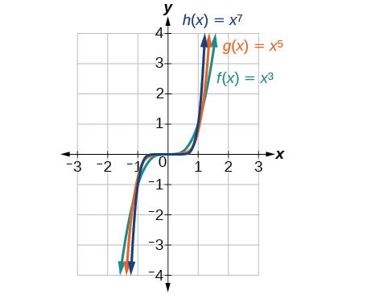    Graphs of $f\left(x\right)={x}^{3},\ f\left(x\right)={x}^{5},\ f\left(x\right)={x}^{7}$ |

ⓐ What are the similarities in the graphs of even power functions?
ⓑ What are the similarities in the graphs of the odd power functions?
ⓒ What are the differences between the graphs of the even power functions and the odd power functions?

Suppose a certain species of bird thrives on a small island. Its population over the last few years is shown in .

  

| *Year* | $$ 2009 $$ | $$ 2010 $$ | $$ 2011 $$ | $$ 2012 $$ | $$ 2013 $$ |
| :--- | :--- | :--- | :--- | :--- | :--- |
| *Bird Population* | $$ 800 $$ | $$ 897 $$ | $$ 992 $$ | $$ 1,083 $$ | $$ 1,169 $$ |

The population can be estimated using the function $P(t)=-0.3{t}^{3}+97t+800,$ where $P(t)$ represents the bird population on the island $t$ years after 2009. We can use this model to estimate the maximum bird population and when it will occur. We can also use this model to predict when the bird population will disappear from the island. In this section, we will examine functions that we can use to estimate and predict these types of changes.

# Identifying Power Functions
Before we can understand the bird problem, it will be helpful to understand a different type of function. A *power function*is a function with a single term that is the product of a real number, a *coefficient,* and a variable raised to a fixed real number.
    As an example, consider functions for area or volume. The function for the **area of a circle** with radius $r$
      is
    
 $$
A(r)=\pi {r}^{2}
$$
        and the function for the **volume of a sphere** with radius $r$
      is 
 $$
V(r)=\frac{4}{3}\pi {r}^{3}
$$

    Both of these are examples of power functions because they consist of a coefficient, $\pi$ or $\frac{4}{3}\pi ,$ multiplied by a variable $r$ raised to a power.

>
>
> **Power Function**
>
>
> A **power function** is a function that can be represented in the form
>
>        $$
> f(x)=k{x}^{p}
> $$
> where $k$
> and $p$ are real numbers, and $k$
> is known as the **coefficient**.
>
>

> Q&A
>       *Is $f(x)={2}^{x}$ a power function?*
> *No. A power function contains a variable base raised to a fixed power. This function has a constant base raised to a variable power. This is called an exponential function, not a power function.*
>
>

      11. **Identifying Power Functions**             Which of the following functions are power functions?             $$ \begin{array}{cccc}  f(x)& =& 1  & \phantom{\rule{2em}{0ex}}\text{Constant\ function}  \\   f(x)& =& x  & \phantom{\rule{2em}{0ex}}\text{Identity\ function}  \\   f(x)& =& {x}^{2}  & \phantom{\rule{2em}{0ex}}\text{Quadratic\ function}  \\   f(x)& =& {x}^{3}  & \phantom{\rule{2em}{0ex}}\text{Cubic\ function}  \\   f(x)& =& \frac{1}{x}  & \phantom{\rule{2em}{0ex}}\text{Reciprocal\ function}  \\   f(x)& =& \frac{1}{{x}^{2}}  & \phantom{\rule{2em}{0ex}}\text{Reciprocal\ squared\ function}  \\   f(x)& =& \sqrt{x}  & \phantom{\rule{2em}{0ex}}\text{Square\ root\ function}  \\   f(x)& =& \sqrt[3]{x}  & \phantom{\rule{2em}{0ex}}\text{Cube\ root\ function}  \end{array} $$

Solution

All of the listed functions are power functions.

        The constant and identity functions are power functions because they can be written as $f(x)={x}^{0}$ and $f(x)={x}^{1}$ respectively.
The quadratic and cubic functions are power functions with whole number powers $f(x)={x}^{2}$ and $f(x)={x}^{3}.$ 
The **reciprocal** and reciprocal squared functions are power functions with negative whole number powers because they can be written as $f(x)={x}^{-1}$ and $f(x)={x}^{-2}.$ 
The square and **cube root** functions are power functions with fractional powers because they can be written as $f(x)={x}^{\frac{1}{2}}$ or $f(x)={x}^{\frac{1}{3}}.$

    

>
>       Try It
>       12. Which functions are power functions?   $\begin{array}{ccc}  f(x)& =& 2x\cdot 4{x}^{3}  \\   g(x)& =& -{x}^{5}+5{x}^{3}  \\   h(x)& =& \frac{2{x}^{5}-1}{3{x}^{2}+4}  \end{array}$
>
> 

> 
Solution

>
> $f(x)$
> is a power function because it can be written as $f(x)=8{x}^{5}.$
> The other functions are not power functions.
> 

>
>
>

  
# Identifying End Behavior of Power Functions
 shows the graphs of $f(x)={x}^{2},\phantom{\rule{0.5em}{0ex}}g(x)={x}^{4}$ and $h(x)={x}^{6},$ which are all power functions with even, positive integer powers. Notice that these graphs have similar shapes, very much like that of the quadratic function in the toolkit. However, as the power increases, the graphs flatten somewhat near the origin and become steeper away from the origin.

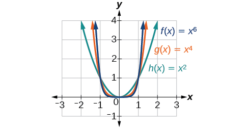

To describe the behavior as numbers become larger and larger, we use the idea of infinity. We use the symbol $\infty$ for positive infinity and $\mathrm{-\infty}$ for negative infinity. When we say that “ $x$ approaches infinity,” which can be symbolically written as $x\to \infty ,$ we are describing a behavior; we are saying that $x$ is increasing without bound.
With the positive even-power function, as the input increases or decreases without bound, the output values become very large, positive numbers. Equivalently, we could describe this behavior by saying that as $x$ approaches positive or negative infinity, the $f\left(x\right)$ values increase without bound. In symbolic form, we could write 
 $$
\text{as\}x\to \pm \infty ,\ f(x)\to \infty
$$  shows the graphs of $f(x)={x}^{3},\phantom{\rule{0.5em}{0ex}}g(x)={x}^{5},$ and $h(x)={x}^{7},$ which are all power functions with odd, whole-number powers. Notice that these graphs look similar to the cubic function in the toolkit. Again, as the power increases, the graphs flatten near the origin and become steeper away from the origin.

These examples illustrate that functions of the form $f\left(x\right)={x}^{n}$ reveal symmetry of one kind or another. First, in  we see that even functions of the form $f\left(x\right)={x}^{n}\text{,\}n$ even, are symmetric about the $y\text{-}$ axis. In  we see that odd functions of the form $f\left(x\right)={x}^{n}\text{,\}n$  odd, are symmetric about the origin.
For these odd power functions, as $x$
approaches negative infinity, $f\left(x\right)$
decreases without bound. As $x$
approaches positive infinity, $f\left(x\right)$
increases without bound. In symbolic form we write
 $$
\begin{array}{l}\text{as}\ x\to -\infty ,\ f(x)\to -\infty \ \\ \text{as}\ x\to \infty ,\ f(x)\to \infty \end{array}
$$
The behavior of the graph of a function as the input values get very small ( $x\to -\infty$ ) and get very large ( $x\to \infty$ ) is referred to as the **end behavior** of the function. We can use words or symbols to describe end behavior.
 shows the end behavior of power functions in the form $f(x)=k{x}^{n}$ where $n$ is a non-negative integer depending on the power and the constant.

> How To
> *Given a power function $f(x)=k{x}^{n}$ where* $n$ *is a positive integer, identify the end behavior.*
> Determine whether the power is even or odd.
> Determine whether the constant is positive or negative.
> Use  to identify the end behavior.

13. **Identifying the End Behavior of a Power Function**   Describe the end behavior of the graph of $f(x)={x}^{8}.$

Solution

The coefficient is 1 (positive) and the exponent of the power function is 8 (an even number). As $x$ approaches infinity, the output (value of $f(x)$ ) increases without bound. We write as $x\to \infty ,f(x)\to \infty .$ As $x$ approaches negative infinity, the output increases without bound. In symbolic form, as $x\to -\infty ,\ f(x)\to \infty .$ We can graphically represent the function as shown in .

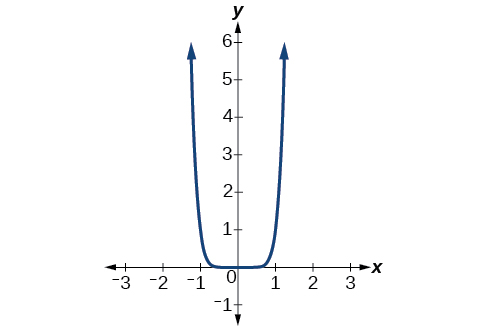

14. **Identifying the End Behavior of a Power Function.**   Describe the end behavior of the graph of $f(x)=-{x}^{9}.$

Solution

The exponent of the power function is 9 (an odd number). Because the coefficient is $\mathrm{\u20131}$ (negative), the graph is the reflection about the $x\text{-}$ axis of the graph of $f(x)={x}^{9}.$  shows that as $x$ approaches infinity, the output decreases without bound. As $x$ approaches negative infinity, the output increases without bound. In symbolic form, we would write

 $$
\begin{array}{l}\text{as}\ x\to -\infty ,\ f(x)\to \infty \ \\ \text{as}\ x\to \infty ,\ f(x)\to -\infty \end{array}
$$

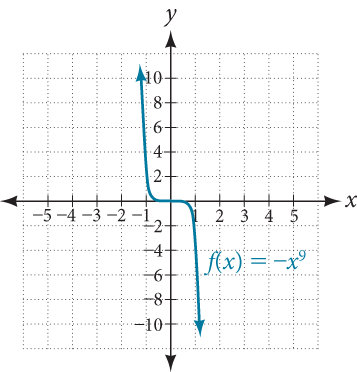

>
> Try It
> 15. Describe in words and symbols the end behavior of $f(x)=-5{x}^{4}.$
>
> 

> 
Solution

>
> As $x$ approaches positive or negative infinity, $f\left(x\right)$ decreases without bound: as $x\to \pm \infty ,\ f(x)\to -\infty$ because of the negative coefficient.
> 

>
>

# Identifying Polynomial Functions
An oil pipeline bursts in the Gulf of Mexico, causing an oil slick in a roughly circular shape. The slick is currently 24 miles in radius, but that radius is increasing by 8 miles each week. We want to write a formula for the area covered by the oil slick by combining two functions. The radius $r$
of the spill depends on the number of weeks $w$
that have passed. This relationship is linear.
 $$
r(w)=24+8w
$$
We can combine this with the formula for the area $A$
of a circle.
 $$
A(r)=\pi {r}^{2}
$$
Composing these functions gives a formula for the area in terms of weeks.

 $$
\begin{array}{ccc}  A(w)& =& A(r(w))  \\ & =& A(24+8w)  \\ & =& \pi {(24+8w)}^{2}  \end{array}
$$
Multiplying gives the formula.
 $$
A(w)=576\pi +384\pi w+64\pi {w}^{2}
$$
This formula is an example of a *polynomial function*. A polynomial function consists of either zero or the sum of a finite number of non-zero terms, each of which is a product of a number, called the coefficient of the term, and a variable raised to a non-negative integer power.

>
>
> **Polynomial Functions**
>
>
>
> Let $n$
> be a non-negative integer. A **polynomial function** is a function that can be written in the form
>
>  $$
> f(x)={a}_{n}{x}^{n}+\mathrm{...}+{a}_{2}{x}^{2}+{a}_{1}x+{a}_{0}
> $$
> This is called the general form of a polynomial function. Each ${a}_{i}$
> is a coefficient and can be any real number, but
>  ${a}_{n}\phantom{\rule{0.5em}{0ex}}\ne \phantom{\rule{0.5em}{0ex}}0$. Each expression ${a}_{i}{x}^{i}$
> is a **term of a polynomial function**.

16. **Identifying Polynomial Functions**   Which of the following are polynomial functions?    $$ \begin{array}{ccc}  f(x)& =& 2{x}^{3}\cdot 3x+4  \\   g(x)& =& -x({x}^{2}-4)  \\   h(x)& =& 5\sqrt{x+2}  \end{array} $$

Solution

The first two functions are examples of polynomial functions because they can be written in the form $f(x)={a}_{n}{x}^{n}+\mathrm{...}+{a}_{2}{x}^{2}+{a}_{1}x+{a}_{0},$
where the powers are non-negative integers and the coefficients are real numbers.

 $f(x)$
can be written as $f(x)=6{x}^{4}+4.$

 $g(x)$
can be written as $g(x)=-{x}^{3}+4x.$ 
 $h(x)$
cannot be written in this form and is therefore not a polynomial function.

# Identifying the Degree and Leading Coefficient of a Polynomial Function
Because of the form of a polynomial function, we can see an infinite variety in the number of terms and the power of the variable. Although the order of the terms in the polynomial function is not important for performing operations, we typically arrange the terms in descending order of power, or in general form. The **degree** of the polynomial is the highest power of the variable that occurs in the polynomial; it is the power of the first variable if the function is in general form. The **leading term** is the term containing the highest power of the variable, or the term with the highest degree. The **leading coefficient** is the coefficient of the leading term.

>
>
> **Terminology of Polynomial Functions**
>
>
>
> We often rearrange polynomials so that the powers are descending.
>
>
>
>
> 
>
>
>
> When a polynomial is written in this way, we say that it is in general form.
>

>
> How To
> *Given a polynomial function, identify the degree and leading coefficient.*
>
>
> Find the highest power of $x$
> to determine the degree of the function.
> Identify the term containing the highest power of $x$
> to find the leading term.
> Identify the coefficient of the leading term.
>

17. **Identifying the Degree and Leading Coefficient of a Polynomial Function**   Identify the degree, leading term, and leading coefficient of the following polynomial functions.    $$ \begin{array}{ccc}  f(x)& =& 3+2{x}^{2}-4{x}^{3}  \\   g(t)& =& 5{t}^{5}-2{t}^{3}+7t  \\ h(p)  & =& 6p-{p}^{3}-2  \end{array} $$

Solution

For the function $f\left(x\right),$ the highest power of $x$ is 3, so the degree is 3. The leading term is the term containing that degree, $\mathrm{-4}{x}^{3}.$ The leading coefficient is the coefficient of that term, $\mathrm{-4.}$ 
For the function $g\left(t\right),$ the highest power of $t$ is $5,$ so the degree is $5.$ The leading term is the term containing that degree, $5{t}^{5}.$ The leading coefficient is the coefficient of that term, $5.$ 
For the function $h\left(p\right),$ the highest power of $p$ is $3,$ so the degree is $3.$ The leading term is the term containing that degree, $-{p}^{3}.$ The leading coefficient is the coefficient of that term, $\mathrm{-1.}$

>
> Q&A
> 18. Identify the degree, leading term, and leading coefficient of the polynomial $f(x)=4{x}^{2}-{x}^{6}+2x-6.$
>
> 

> 
Solution

>
> The degree is 6. The leading term is $-{x}^{6}.$ The leading coefficient is $-1.$
> 

>
>

## Identifying End Behavior of Polynomial Functions
Knowing the degree of a polynomial function is useful in helping us predict its end behavior. To determine its end behavior, look at the leading term of the polynomial function. Because the power of the leading term is the highest, that term will grow significantly faster than the other terms as $x$
gets very large or very small, so its behavior will dominate the graph. For any polynomial, the end behavior of the polynomial will match the end behavior of the power function consisting of the leading term. See .

| Polynomial Function | Leading Term | Graph of Polynomial Function |
| :--- | :--- | :--- |
| $f(x)=5{x}^{4}+2{x}^{3}-x-4$ | $5{x}^{4}$ | 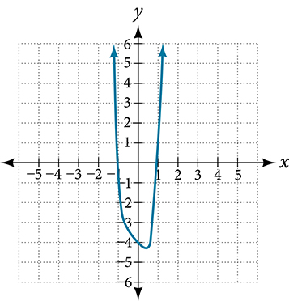 |
| $f(x)=-2{x}^{6}-{x}^{5}+3{x}^{4}+{x}^{3}$ | $-2{x}^{6}$ | 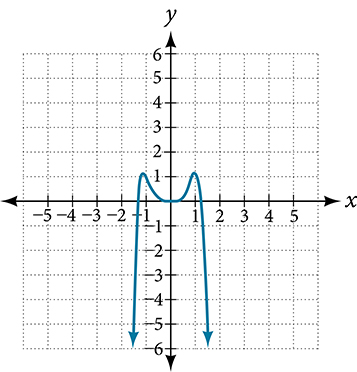 |
| $f(x)=3{x}^{5}-4{x}^{4}+2{x}^{2}+1$ | $3{x}^{5}$ | 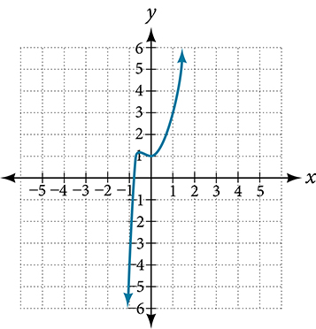 |
| $f(x)=-6{x}^{3}+7{x}^{2}+3x+1$ | $-6{x}^{3}$ | 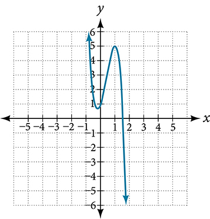 |

19. **Identifying End Behavior and Degree of a Polynomial Function**   Describe the end behavior and determine a possible degree of the polynomial function in .     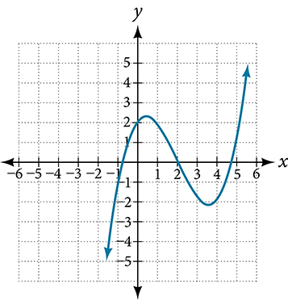

Solution

As the input values $x$
get very large, the output values $f(x)$ increase without bound. As the input values $x$
get very small, the output values $f(x)$ decrease without bound. We can describe the end behavior symbolically by writing 

 $$
\begin{array}{l}\text{as}\ x\to -\infty ,\ f(x)\to -\infty \ \\ \text{as}\ x\to \infty ,\ f(x)\to \infty \end{array}
$$
In words, we could say that as $x$ values approach infinity, the function values approach infinity, and as $x$ values approach negative infinity, the function values approach negative infinity.
We can tell this graph has the shape of an odd degree power function that has not been reflected, so the degree of the polynomial creating this graph must be odd and the leading coefficient must be positive.

>
> Try It
> 20. Describe the end behavior, and determine a possible degree of the polynomial function in .    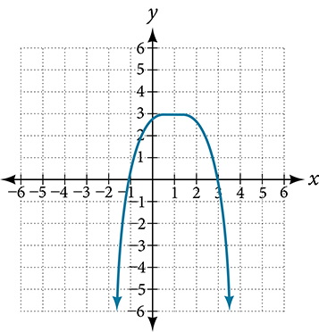
>
> 

> 
Solution

>
> As $x\to \infty ,\ f(x)\to -\infty ;\ as\ x\to -\infty ,\ f(x)\to -\infty .$ It has the shape of an even degree power function with a negative coefficient.
> 

>

21. **Identifying End Behavior and Degree of a Polynomial Function**   Given the function $f(x)=-3{x}^{2}(x-1)(x+4),$ express the function as a polynomial in general form, and determine the leading term, degree, and end behavior of the function.

Solution

Obtain the general form by expanding the given expression for $f\left(x\right).$

 $$
\begin{array}{ccc}  f(x)& =& \mathrm{-3}{x}^{2}(x-1)(x+4)  \\ & =& \mathrm{-3}{x}^{2}\left({x}^{2}+3x-4\right)  \\ & =& \mathrm{-3}{x}^{4}-9{x}^{3}+12{x}^{2}  \end{array}
$$ The general form is $f\left(x\right)=\mathrm{-3}{x}^{4}-9{x}^{3}+12{x}^{2}.$
The leading term is $\mathrm{-3}{x}^{4};$
therefore, the degree of the polynomial is 4. The degree is even (4) and the leading coefficient is negative (–3), so the end behavior is
 $$
\begin{array}{l}\text{as}\ x\to -\infty ,\ f(x)\to -\infty \ \\ \text{as}\ x\to \infty ,\ f(x)\to -\infty \end{array}
$$

>
> Try It
> 22. Given the function $f(x)=0.2(x-2)(x+1)(x-5),$ express the function as a polynomial in general form and determine the leading term, degree, and end behavior of the function.
>
> 

> 
Solution

>
> The leading term is $0.2{x}^{3},$ so it is a degree 3 polynomial. As $x$ approaches positive infinity, $f\left(x\right)$ increases without bound; as $x$ approaches negative infinity, $f\left(x\right)$ decreases without bound.
> 

>
>

## Identifying Local Behavior of Polynomial Functions
In addition to the end behavior of polynomial functions, we are also interested in what happens in the “middle” of the function. In particular, we are interested in locations where graph behavior changes. A *turning point*is a point at which the function values change from increasing to decreasing or decreasing to increasing.
We are also interested in the intercepts. As with all functions, the *y-*intercept is the point at which the graph intersects the vertical axis. The point corresponds to the coordinate pair in which the input value is zero. Because a polynomial is a function, only one output value corresponds to each input value so there can be only one *y-*intercept $(0,{a}_{0}).$ The *x-*intercepts occur at the input values that correspond to an output value of zero. It is possible to have more than one *x-*intercept. See *.*

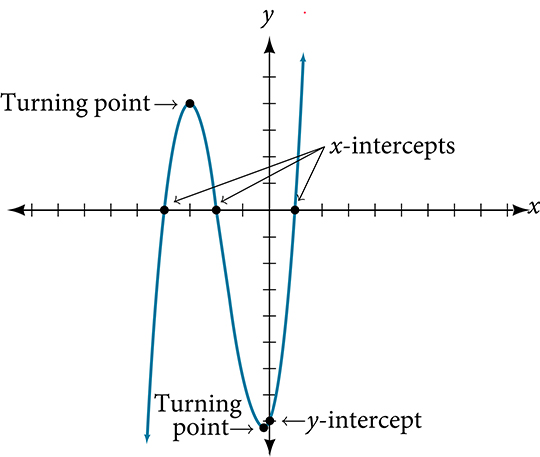

>
>
>
>
> **Intercepts and Turning Points of Polynomial Functions**
>
>
> A **turning point** of a graph is a point at which the graph changes direction from increasing to decreasing or decreasing to increasing. The *y-*intercept is the point at which the function has an input value of zero. The *x*-intercepts are the points at which the output value is zero.

>
> How To
> *Given a polynomial function, determine the intercepts.*
>
> Determine the *y-*intercept by setting $x=0$ and finding the corresponding output value.
> Determine the *x*-intercepts by solving for the input values that yield an output value of zero.

23. **Determining the Intercepts of a Polynomial Function**   Given the polynomial function $f(x)=(x-2)(x+1)(x-4),$ written in factored form for your convenience, determine the *y*- and *x*-intercepts.

Solution

The *y-*intercept occurs when the input is zero so substitute 0 for $x.$

 $$
\begin{array}{ccc}  f(0)& =& f\left(0\right)=(0-2)(0+1)(0-4)  \\ & =& (-2)\left(1\right)(-4)  \\ & =& 8  \end{array}
$$

The *y-*intercept is (0, 8).

The *x*-intercepts occur when the output is zero.

 $$
0=(x-2)(x+1)(x-4)
$$

 $$
\begin{array}{ccccccccccc}  x-2& =& 0  & \phantom{\rule{2em}{0ex}}\text{or}\phantom{\rule{2em}{0ex}}&   x+1& =& 0  & \phantom{\rule{2em}{0ex}}\text{or}\phantom{\rule{2em}{0ex}}&   x-4& =& 0  \\   x& =& 2  & \phantom{\rule{2em}{0ex}}\text{or}\phantom{\rule{2em}{0ex}}&   x& =& \mathrm{-1}  & \phantom{\rule{2em}{0ex}}\text{or}\phantom{\rule{2em}{0ex}}&   x& =& 4  \end{array}
$$
The *x*-intercepts are $(2,0),(\u20131,0),$ and $(4,0).$

We can see these intercepts on the graph of the function shown in .

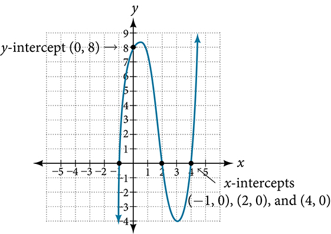

24. **Determining the Intercepts of a Polynomial Function with Factoring**   Given the polynomial function $f(x)={x}^{4}-4{x}^{2}-45,$ determine the *y*- and *x*-intercepts.

Solution

The *y-*intercept occurs when the input is zero.

 $$
\begin{array}{ccc}  f(0)& =& {(0)}^{4}-4{(0)}^{2}-45  \\ & =& \mathrm{-45}  \end{array}
$$
The *y-*intercept is $(0,\mathrm{-45}).$ 
The *x*-intercepts occur when the output is zero. To determine when the output is zero, we will need to factor the polynomial.

 $$
\begin{array}{ccc}  f(x)& =& {x}^{4}-4{x}^{2}-45  \\ & =& \left({x}^{2}-9\right)\left({x}^{2}+5\right)  \\ & =& (x-3)(x+3)\left({x}^{2}+5\right)  \end{array}
$$ 
 $$
\phantom{\rule{2em}{0ex}}0=(x-3)(x+3)\left({x}^{2}+5\right)
$$ 
 $$
\begin{array}{ccccccccc}  x-3& =& 0  & \phantom{\rule{2em}{0ex}}\text{or}\phantom{\rule{2em}{0ex}}&   x+3& =& 0  & \phantom{\rule{2em}{0ex}}\text{or}\phantom{\rule{2em}{0ex}}& {x}^{2}+5=0\\   x& =& 3  & \phantom{\rule{2em}{0ex}}\text{or}\phantom{\rule{2em}{0ex}}&   x& =& -3  & \phantom{\rule{2em}{0ex}}\text{or}\phantom{\rule{2em}{0ex}}& (\text{no\ real\ solution)}\end{array}
$$
The *x*-intercepts are $(3,0)$ and $(\mathrm{\u20133},0).$ 
We can see these intercepts on the graph of the function shown in . We can see that the function is even because $f\left(x\right)=f\left(-x\right).$ 

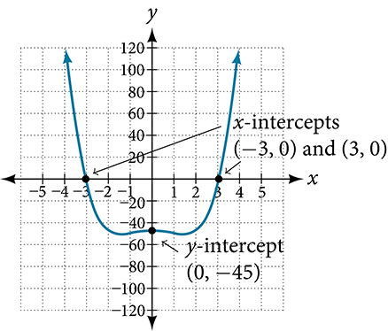

>
> Try It
> 25. Given the polynomial function $f(x)=2{x}^{3}-6{x}^{2}-20x,$ determine the *y*- and *x*-intercepts.
>
> 

> 
Solution

>
> *y*-intercept $(0,0);$ *x*-intercepts $(0,0),(\u20132,0),$ and $(5,0)$
> 

>
>

## Comparing Smooth and Continuous Graphs
The degree of a polynomial function helps us to determine the number of *x*-intercepts and the number of turning points. A polynomial function of $n\text{th}$ degree is the product of $n$ factors, so it will have at most $n$ roots or zeros, or *x*-intercepts. The graph of the polynomial function of degree $n$ must have at most $n\u20131$ turning points. This means the graph has at most one fewer turning point than the degree of the polynomial or one fewer than the number of factors.
A **continuous function** has no breaks in its graph: the graph can be drawn without lifting the pen from the paper. A **smooth curve** is a graph that has no sharp corners. The turning points of a smooth graph must always occur at rounded curves. The graphs of polynomial functions are both continuous and smooth.

>
>
>
>
> **Intercepts and Turning Points of Polynomials**
>
>
> A polynomial of degree $n$ will have, at most, $n$ *x*-intercepts and $n-1$ turning points.

26. **Determining the Number of Intercepts and Turning Points of a Polynomial**   Without graphing the function, determine the local behavior of the function by finding the maximum number of *x*-intercepts and turning points for $f(x)=-3{x}^{10}+4{x}^{7}-{x}^{4}+2{x}^{3}.$

Solution

The polynomial has a degree of $10,$ so there are at most 10 *x*-intercepts and at most 9 turning points.

>
> Try It
> 27. Without graphing the function, determine the maximum number of *x*-intercepts and turning points for $f(x)=108-13{x}^{9}-8{x}^{4}+14{x}^{12}+2{x}^{3}.$
>
> 

> 
Solution

>
> There are at most 12 $x\text{-}$ intercepts and at most 11 turning points.
> 

>
>

28. **Drawing Conclusions about a Polynomial Function from the Graph**   What can we conclude about the polynomial represented by the graph shown in  based on its intercepts and turning points?     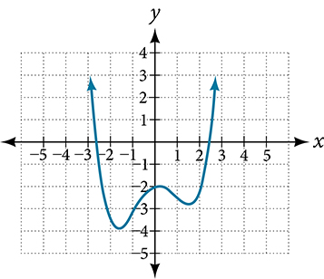

Solution

The end behavior of the graph tells us this is the graph of an even-degree polynomial. See .

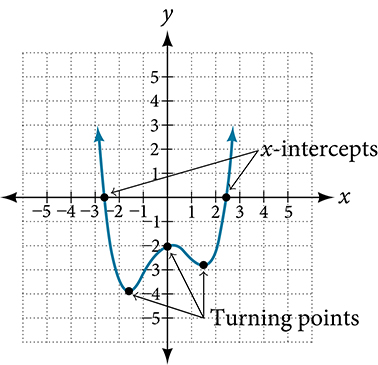

The graph has 2 *x*-intercepts, suggesting a degree of 2 or greater, and 3 turning points, suggesting a degree of 4 or greater. Based on this, it would be reasonable to conclude that the degree is even and at least 4.

>
> Try It
> 29. What can we conclude about the polynomial represented by the graph shown in  based on its intercepts and turning points?    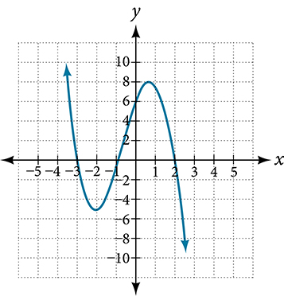
>
> 

> 
Solution

>
> The end behavior indicates an odd-degree polynomial function; there are 3 $x\text{-}$ intercepts and 2 turning points, so the degree is odd and at least 3. Because of the end behavior, we know that the lead coefficient must be negative.
> 

>
>

30. **Drawing Conclusions about a Polynomial Function from the Factors**   Given the function $f(x)=-4x\left(x+3\right)\left(x-4\right),$ determine the local behavior.

Solution

The *y*-intercept is found by evaluating $f(0).$

 $$
\begin{array}{ccc}  f(0)& =& -4(0)(0+3)(0-4\\ & =& 0  \end{array}
$$ The *y*-intercept is $(0,0).$ 
The *x*-intercepts are found by determining the zeros of the function.

 $$
0=\mathrm{-4}x(x+3)(x-4)
$$

 $$
\begin{array}{ccccccccccc}  x& =& 0  & \phantom{\rule{2em}{0ex}}\text{or}\phantom{\rule{2em}{0ex}}&   x+3& =& 0  & \phantom{\rule{2em}{0ex}}\text{or}\phantom{\rule{2em}{0ex}}&   x-4& =& 0  \\ x& =& 0& \phantom{\rule{2em}{0ex}}\text{or}\phantom{\rule{2em}{0ex}}& x& =& -3& \phantom{\rule{2em}{0ex}}\text{or}\phantom{\rule{2em}{0ex}}& x& =& 4\end{array}
$$
The *x*-intercepts are $(0,0),(\mathrm{\u20133},0),$ and $(4,0).$ 
The degree is 3 so the graph has at most 2 turning points.

>
> Try It
> 31. Given the function $f(x)=0.2(x-2)(x+1)(x-5),$ determine the local behavior.
>
> 

> 
Solution

>
> The $x\text{-}$ intercepts are $(2,0),(-1,0),$ and $(5,0),$ the *y-*intercept is $(0,\text{2}),$ and the graph has at most 2 turning points.
> 

>
>

>
> Media
> Access these online resources for additional instruction and practice with power and polynomial functions.
>
> Find Key Information about a Given Polynomial Function
>
> End Behavior of a Polynomial Function
>
> Turning Points and $x\text{-}$ intercepts of Polynomial Functions
>
> Least Possible Degree of a Polynomial Function
>
>

# Key Equations

| general form of a polynomial function | $f(x)={a}_{n}{x}^{n}+\mathrm{...}+{a}_{2}{x}^{2}+{a}_{1}x+{a}_{0}$ |
| :--- | :--- |

# Key Concepts

A power function is a variable base raised to a number power. See .
The behavior of a graph as the input decreases beyond bound and increases beyond bound is called the end behavior.
The end behavior depends on whether the power is even or odd. See  and .
A polynomial function is the sum of terms, each of which consists of a transformed power function with positive whole number power. See .
The degree of a polynomial function is the highest power of the variable that occurs in a polynomial. The term containing the highest power of the variable is called the leading term. The coefficient of the leading term is called the leading coefficient. See .
The end behavior of a polynomial function is the same as the end behavior of the power function represented by the leading term of the function. See  and .
A polynomial of degree $n$
will have at most $n$
*x-*intercepts and at most $n-1$
turning points. See , , , , and .

# Section Exercises

## Verbal
1. Explain the difference between the coefficient of a power function and its degree.

Solution

The coefficient of the power function is the real number that is multiplied by the variable raised to a power. The degree is the highest power appearing in the function.

2. If a polynomial function is in factored form, what would be a good first step in order to determine the degree of the function?

3. In general, explain the end behavior of a power function with odd degree if the leading coefficient is positive.

Solution

As $x$
decreases without bound, so does $f\left(x\right).$
As $x$
increases without bound, so does $f\left(x\right).$

4. What is the relationship between the degree of a polynomial function and the maximum number of turning points in its graph?

5. What can we conclude if, in general, the graph of a polynomial function exhibits the following end behavior? As $x\to -\infty ,\phantom{\rule{0.5em}{0ex}}f(x)\to -\infty$ and as $x\to \infty ,\phantom{\rule{0.5em}{0ex}}f(x)\to -\infty .$

Solution

The polynomial function is of even degree and leading coefficient is negative.

## Algebraic
For the following exercises, identify the function as a power function, a polynomial function, or neither.
6. $f(x)={x}^{5}$

7. $f(x)={\left({x}^{2}\right)}^{3}$

Solution

Power function

8. $f(x)=x-{x}^{4}$

9. $f(x)=\frac{{x}^{2}}{{x}^{2}-1}$

Solution

Neither

10. $f(x)=2x\left(x+2\right){\left(x-1\right)}^{2}$

11. $f(x)={3}^{x+1}$

Solution

Neither

For the following exercises, find the degree and leading coefficient for the given polynomial.
12. $-3x{}^{4}$

13. $7-2{x}^{2}$

Solution

Degree = 2, Coefficient = –2

14. $-2{x}^{2}-3{x}^{5}+x-6\$

15. $x\left(4-{x}^{2}\right)(2x+1)$

Solution

Degree =4, Coefficient = –2

16. ${x}^{2}{\left(2x-3\right)}^{2}$

For the following exercises, determine the end behavior of the functions.
17. $f\left(x\right)={x}^{4}$

Solution

As $x\to \infty$, $f(x)\to \infty ,\phantom{\rule{0.5em}{0ex}}\text{as}\phantom{\rule{0.5em}{0ex}}x\to -\infty ,\phantom{\rule{0.5em}{0ex}}f(x)\to \infty$

18. $f\left(x\right)={x}^{3}$

19. $f\left(x\right)=-{x}^{4}$

Solution

As $x\to -\infty$, $f(x)\to -\infty ,\phantom{\rule{0.5em}{0ex}}\text{as}\phantom{\rule{0.5em}{0ex}}x\to \infty ,\phantom{\rule{0.5em}{0ex}}f(x)\to -\infty$

20. $f\left(x\right)=-{x}^{9}$

21. $f(x)=-2{x}^{4}-3{x}^{2}+x-1\$

Solution

As $x\to -\infty$, $f(x)\to -\infty ,\phantom{\rule{0.5em}{0ex}}\text{as}\phantom{\rule{0.5em}{0ex}}x\to \infty ,\phantom{\rule{0.5em}{0ex}}f(x)\to -\infty$

22. $f(x)=3{x}^{2}+x-2$

23. $f(x)={x}^{2}\left(2{x}^{3}-x+1\right)$

Solution

As $x\to \infty$, $f(x)\to \infty ,\phantom{\rule{0.5em}{0ex}}\text{as}\phantom{\rule{0.5em}{0ex}}x\to -\infty ,\phantom{\rule{0.5em}{0ex}}f(x)\to -\infty$

24. $f(x)={(2-x)}^{7}$

For the following exercises, find the intercepts of the functions.
25. $f\left(t\right)=2\left(t-1\right)\left(t+2\right)(t-3)$

Solution

*y*-intercept is $(0,12),$ *t*-intercepts are $(1,0);(\u20132,0);\text{and\}(3,0).$

26. $g\left(n\right)=\mathrm{-2}\left(3n-1\right)(2n+1)$

27. $f(x)={x}^{4}-16$

Solution

*y*-intercept is $(0,-16).$ *x*-intercepts are $(2,0)$ and $(-2,0).$

28. $f(x)={x}^{3}+27$

29. $f(x)=x\left({x}^{2}-2x-8\right)$

Solution

*y*-intercept is $(0,0).$ *x*-intercepts are $(0,0),(4,0),$ and $\left(-2,\ 0\right).$

30. $f(x)=(x+3)\left(4{x}^{2}-1\right)$

## Graphical
For the following exercises, determine the least possible degree of the polynomial function shown.
31. 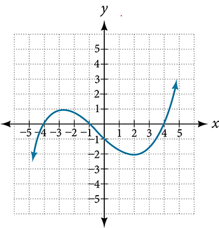

Solution

3

32. 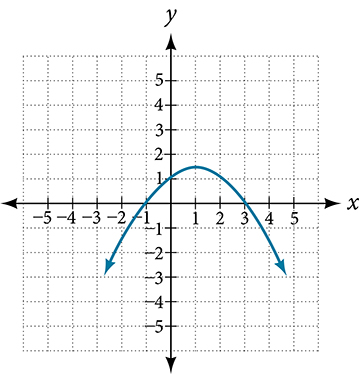

33. 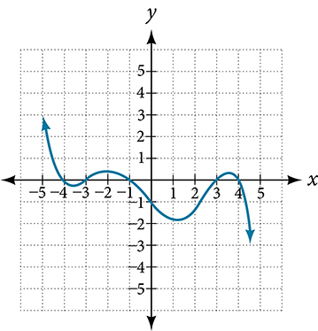

Solution

5

34. 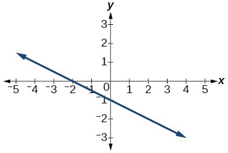

35. 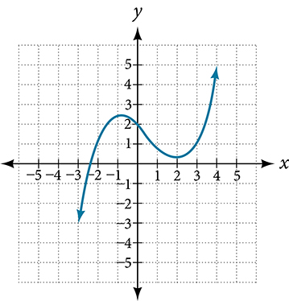

Solution

3

36. 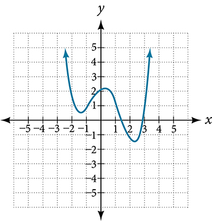

37. 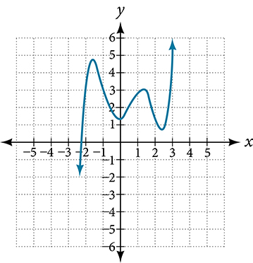

Solution

5

38. 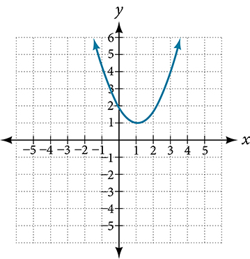

For the following exercises, determine whether the graph of the function provided is a graph of a polynomial function. If so, determine the number of turning points and the least possible degree for the function.
39. 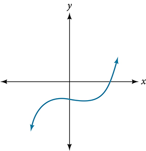

Solution

Yes. Number of turning points is 2. Least possible degree is 3.

40. 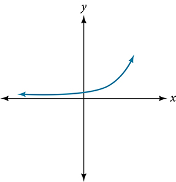

41. 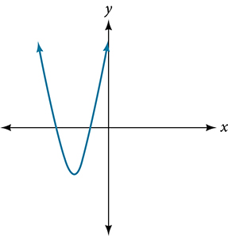

Solution

Yes. Number of turning points is 1. Least possible degree is 2.

42. 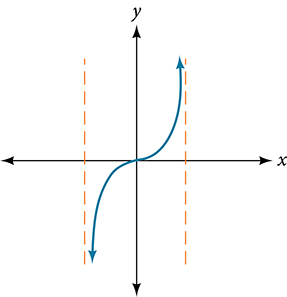

43. 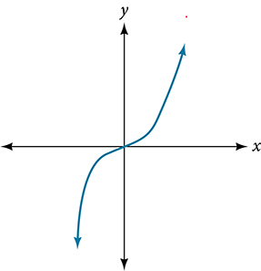

Solution

Yes. Number of turning points is 0. Least possible degree is 1.

44. 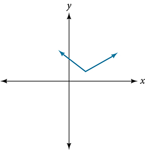

45. 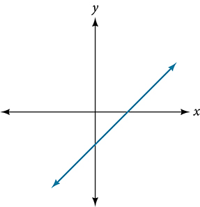

Solution

Yes. Number of turning points is 0. Least possible degree is 1.

## Numeric
For the following exercises, make a table to confirm the end behavior of the function.
46. $f(x)=-{x}^{3}$

47. $f(x)={x}^{4}-5{x}^{2}$

Solution

| $x$ | $f\left(x\right)$ |
| :--- | :--- |
| 10 | 9,500 |
| 100 | 99,950,000 |
| –10 | 9,500 |
| –100 | 99,950,000 |

As $x\to -\infty$, $f(x)\to \infty ,\phantom{\rule{0.5em}{0ex}}\text{as}\phantom{\rule{0.5em}{0ex}}x\to \infty ,\phantom{\rule{0.5em}{0ex}}f(x)\to \infty$

48. $f(x)={x}^{2}{\left(1-x\right)}^{2}$

49. $f(x)=(x-1)(x-2)(3-x)$

Solution

| $x$ | $f\left(x\right)$ |
| :--- | :--- |
| 10 | –504 |
| 100 | –941,094 |
| –10 | 1,716 |
| –100 | 1,061,106 |

As $x\to -\infty$, $f(x)\to \infty ,\phantom{\rule{0.5em}{0ex}}\text{as}\phantom{\rule{0.5em}{0ex}}x\to \infty ,\phantom{\rule{0.5em}{0ex}}f(x)\to -\infty$

50. $f(x)=\frac{{x}^{5}}{10}-{x}^{4}$

## Technology
For the following exercises, graph the polynomial functions using a calculator. Based on the graph, determine the intercepts and the end behavior.
51. $f(x)={x}^{3}(x-2)$

Solution

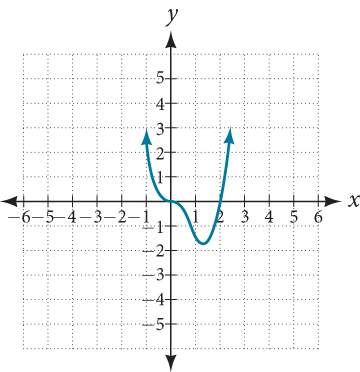

The $y\text{-}$ intercept is $\left(0,\ 0\right).$
The $x\text{-}$ intercepts are $\left(0,\ 0\right),\phantom{\rule{0.5em}{0ex}}\text{}\left(2,\ 0\right).$
As $x\to -\infty$, $f(x)\to \infty ,\phantom{\rule{0.5em}{0ex}}\text{as}\phantom{\rule{0.5em}{0ex}}x\to \infty ,\phantom{\rule{0.5em}{0ex}}f(x)\to \infty$

52. $f(x)=x(x-3)(x+3)$

53. $f(x)=x(14-2x)(10-2x)$

Solution

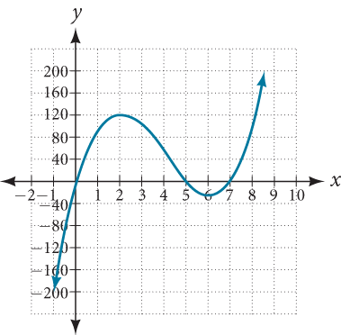

The $y\text{-}$ intercept is $\left(0,0\right)$
. The $x\text{-}$ intercepts are $\left(0,\ 0\right),\phantom{\rule{0.5em}{0ex}}\text{}\left(5,\ 0\right),\phantom{\rule{0.5em}{0ex}}\text{}\left(7,\ 0\right).$
As $x\to -\infty$, $f(x)\to -\infty ,\phantom{\rule{0.5em}{0ex}}\text{as}\phantom{\rule{0.5em}{0ex}}x\to \infty ,\phantom{\rule{0.5em}{0ex}}f(x)\to \infty$

54. $f(x)=x(14-2x){(10-2x)}^{2}$

55. $f(x)={x}^{3}-16x$

Solution

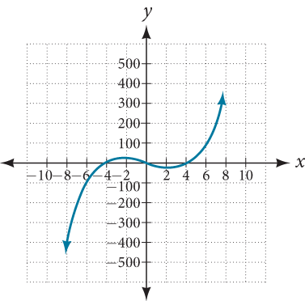

The $y\text{-}$ intercept is $\left(0,\ 0\right).$ The $x\text{-}$ intercept is $\left(-4,\ 0\right),\phantom{\rule{0.5em}{0ex}}\text{}\left(0,\ 0\right),\phantom{\rule{0.5em}{0ex}}\text{}\left(4,\ 0\right).$
 $As\phantom{\rule{0.5em}{0ex}}x\to -\infty$, $f(x)\to -\infty ,\phantom{\rule{0.5em}{0ex}}\text{as}\phantom{\rule{0.5em}{0ex}}x\to \infty ,\phantom{\rule{0.5em}{0ex}}f(x)\to \infty$

56. $f(x)={x}^{3}-27$

57. $f(x)={x}^{4}-81$

Solution

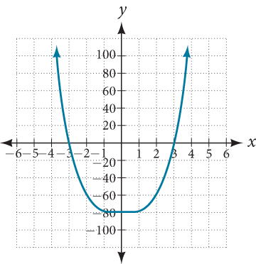

The $y\text{-}$ intercept is $\left(0,\ -81\right).$
The $x\text{-}$ intercept are $\left(3,\ 0\right),\phantom{\rule{0.5em}{0ex}}\text{}\left(-3,\ 0\right).$
As $x\to -\infty$, $f(x)\to \infty ,\phantom{\rule{0.5em}{0ex}}\text{as}\phantom{\rule{0.5em}{0ex}}x\to \infty ,\phantom{\rule{0.5em}{0ex}}f(x)\to \infty$

58. $f(x)=-{x}^{3}+{x}^{2}+2x$

59. $f(x)={x}^{3}-2{x}^{2}-15x$

Solution

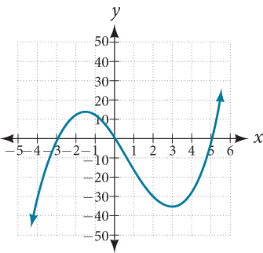

The $y\text{-}$ intercept is $\left(0,\ 0\right).$ The $x\text{-}$ intercepts are $\left(-3,\ 0\right),\phantom{\rule{0.5em}{0ex}}\text{}\left(0,\ 0\right),\phantom{\rule{0.5em}{0ex}}\text{}\left(5,\ 0\right).$
As $x\to -\infty$, $f(x)\to -\infty ,\phantom{\rule{0.5em}{0ex}}\text{as}\phantom{\rule{0.5em}{0ex}}x\to \infty ,\phantom{\rule{0.5em}{0ex}}f(x)\to \infty$

60. $f(x)={x}^{3}-0.01x$

## Extensions
For the following exercises, use the information about the graph of a polynomial function to determine the function. Assume the leading coefficient is 1 or –1. There may be more than one correct answer.
61. The $y-$ intercept is $(0,-4).$ The $x-$ intercepts are $(-2,0)$, $(2,0).$ Degree is 2. End behavior: as $x\to -\infty$, $f(x)\to \infty$; as $x\to \infty$, $f(x)\to \infty .$

Solution

$f(x)={x}^{2}-4$

62. The $y-$ intercept is $(0,9).$ The $x\text{-}$ intercepts are $(-3,0)$, $(3,0).$ Degree is 2. End behavior: as $x\to -\infty$, $\phantom{\rule{0.5em}{0ex}}f(x)\to -\infty$, as $x\to \infty$, $f(x)\to -\infty .$

63. The $y-$ intercept is $(0,0).$ The $x-$ intercepts are $(0,0)$, $(2,0).$ Degree is 3. End behavior: as $x\to -\infty$, $\phantom{\rule{0.5em}{0ex}}f(x)\to -\infty$, as $x\to \infty$, $f(x)\to \infty .$

Solution

$f(x)={x}^{3}-4{x}^{2}+4x$

64. The $y-$ intercept is $(0,1).$ The $x-$ intercept is $(1,0).$ Degree is 3. End behavior: as $x\to -\infty$, $\phantom{\rule{0.5em}{0ex}}f(x)\to \infty$, as $x\to \infty$, $f(x)\to -\infty .$

65. The $y-$ intercept is $(0,1).$ There is no $x-$ intercept. Degree is 4. End behavior: as $x\to -\infty$, $\phantom{\rule{0.5em}{0ex}}f(x)\to \infty$, as $x\to \infty$, $f(x)\to \infty .$

Solution

$f(x)={x}^{4}+1$

## Real-World Applications
For the following exercises, use the written statements to construct a polynomial function that represents the required information.
66. An oil slick is expanding as a circle. The radius of the circle is increasing at the rate of 20 meters per day. Express the area of the circle as a function of $d,$ the number of days elapsed.

67. A cube has an edge of 3 feet. The edge is increasing at the rate of 2 feet per minute. Express the volume of the cube as a function of $m,$ the number of minutes elapsed.

Solution

$V(m)=8{m}^{3}+36{m}^{2}+54m+27$

68. A rectangle has a length of 10 inches and a width of 6 inches. If the length is increased by $x$ inches and the width increased by twice that amount, express the area of the rectangle as a function of $x.$

69. An open box is to be constructed by cutting out square corners of $x-$ inch sides from a piece of cardboard 8 inches by 8 inches and then folding up the sides. Express the volume of the box as a function of $x.$

Solution

$V(x)=4{x}^{3}-32{x}^{2}+64x$

70. A rectangle is twice as long as it is wide. Squares of side 2 feet are cut out from each corner. Then the sides are folded up to make an open box. Express the volume of the box as a function of the width ( $x$ ).

**coefficient** a nonzero real number multiplied by a variable raised to an exponent
**continuous function**a function whose graph can be drawn without lifting the pen from the paper because there are no breaks in the graph
**degree**the highest power of the variable that occurs in a polynomial

**end behavior**the behavior of the graph of a function as the input decreases without bound and increases without bound
**leading coefficient**the coefficient of the leading term
**leading term**the term containing the highest power of the variable
**polynomial function**a function that consists of either zero or the sum of a finite number of non-zero terms, each of which is a product of a number, called the coefficient of the term, and a variable raised to a non-negative integer power.
**power function**a function that can be represented in the form $f(x)=k{x}^{p}$ where $k$ is a constant, the base is a variable, and the exponent, $p$ , is a constant
**smooth curve**a graph with no sharp corners
**term of a polynomial function**any ${a}_{i}{x}^{i}$ of a polynomial function in the form $f(x)={a}_{n}{x}^{n}+\mathrm{...}+{a}_{2}{x}^{2}+{a}_{1}x+{a}_{0}$

**turning point**the location at which the graph of a function changes direction
