**Graphs of Polynomial Functions**

  m51276
  

**Graphs of Polynomial Functions**

  In this section, you will:

Recognize characteristics of graphs of polynomial functions.
Use factoring to find zeros of polynomial functions.
Identify zeros and their multiplicities.
Determine end behavior.
Understand the relationship between degree and turning points.
Graph polynomial functions.
Use the Intermediate Value Theorem.

  644f6a93-7429-4768-8752-eccf5fb8e0bb

  
## Learning Objectives
Recognize and use the appropriate method to factor a polynomial completely (IA 6.4.1)
Solve a quadratic equation by factoring (IA 6.5.2)

## Objective 1: Recognize and use the appropriate method to factor a polynomial completely (IA 6.4.1).
The following outline provides a good strategy for factoring polynomials.

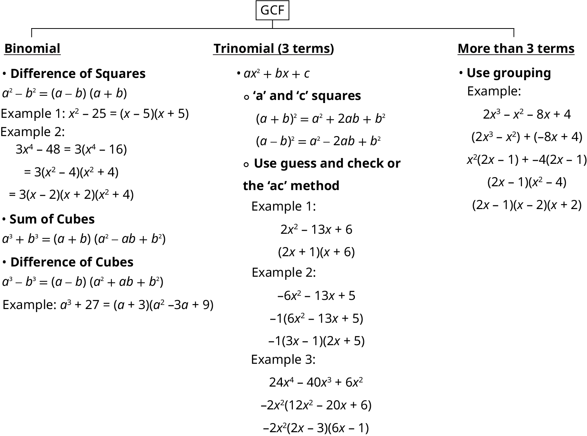

### Practice Makes Perfect
Recognize and use the appropriate method to factor a polynomial completely.

1. $24{x}^{2}-46x+10$

2. ${t}^{7}-{t}^{3}$

3. ${y}^{3}+5{y}^{2}-4y-20$

4. $12{m}^{2}+20m+3$

5. $3{r}^{3}-3$

6. $3{m}^{2}-9mn-30{n}^{2}$

7. ${x}^{3}-{x}^{2}-30x$

## Objective 2: Solve a quadratic equation by factoring (IA 6.5.2)
If $ab=0$ , where $a$ and $b$ represent real numbers. What can you say about $a$ and $b$ ?

The **Zero Product Property** states that if $ab=0$ , then $a=0$ ,  or $b=0$ , or both.

We can use this property to solve equations.

>
>
> **How To Use the Zero Product Property**
>
>
> Set each factor equal to zero.
> Solve the linear equations.
> Check.
>

8. **Solve a quadratic equation by factoring**      Solve $(4x-1)(x+6)=0$

Solution

$\begin{array}{ccc}4x-1& or& x+6=0\\ 4x=1& & x=-6\\ x=\frac{1}{4}& & \end{array}$

### Practice Makes Perfect

Solve

9. $(x-5)(2x+3)=0$

10. $x(2x-5)=0$

11. **Solve a quadratic equation by factoring**       ${x}^{2}-2x=63$

Solution

How is this problem different from practice problems 8 and 9 above? What should be our first step?

| Write the equation in standard form so that one side of the equation is 0. | ${x}^{2}-2x-63=0$ |
| :--- | :--- |
| Factor the quadratic expression completely. | $(x-9)(x+7)=0$ |
| Set each factor containing a variable equal to 0. | $\begin{array}{ccc}x-9=0& & x+7=0\end{array}$ |
| Solve the resulting equations. | $\begin{array}{ccc}x=9& & x=-7\end{array}$ |
| Check each solution in the original equation. | $\begin{array}{ccc}{9}^{2}-2\left(9\right)=63& & {(-7)}^{2}-2(-7)=63\end{array}$ |

### Practice Makes Perfect

Solve a quadratic equation by factoring.

Use the zero factor property to solve each of the following exercises.

12. $4{x}^{2}-25=0$

13. $6{x}^{2}=12x$

14. $2{x}^{2}-2=-3x$

15. $(2x+3)(x+1)=15$

16. $5f(5f-16)=-15$

The revenue in millions of dollars for a fictional cable company from 2006 through 2013 is shown in *.*

| *Year* | 2006 | 2007 | 2008 | 2009 | 2010 | 2011 | 2012 | 2013 |
| :--- | :--- | :--- | :--- | :--- | :--- | :--- | :--- | :--- |
| *Revenues* | 52.4 | 52.8 | 51.2 | 49.5 | 48.6 | 48.6 | 48.7 | 47.1 |

The revenue can be modeled by the polynomial function

   $$
R(t)=-0.037{t}^{4}+1.414{t}^{3}-19.777{t}^{2}+118.696t-205.332
$$
  where $R$ represents the revenue in millions of dollars and $t$ represents the year, with $t=6$ corresponding to 2006. Over which intervals is the revenue for the company increasing? Over which intervals is the revenue for the company decreasing? These questions, along with many others, can be answered by examining the graph of the polynomial function. We have already explored the local behavior of quadratics, a special case of polynomials. In this section we will explore the local behavior of polynomials in general.

# Recognizing Characteristics of Graphs of Polynomial Functions
Polynomial functions of degree 2 or more have graphs that do not have sharp corners; recall that these types of graphs are called smooth curves. Polynomial functions also display graphs that have no breaks. Curves with no breaks are called continuous.  shows a graph that represents a **polynomial function** and a graph that represents a function that is not a polynomial.

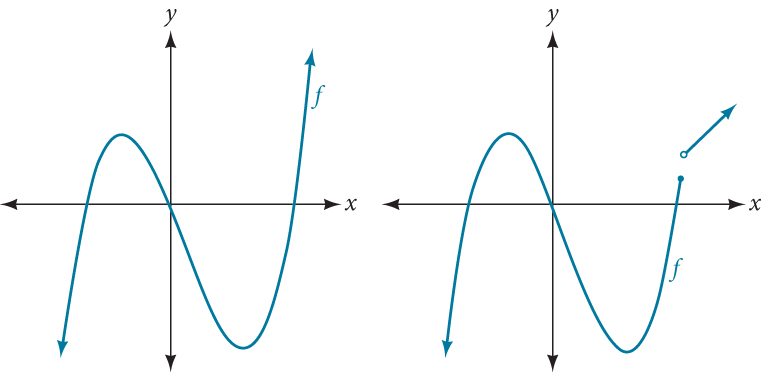

      17. **Recognizing Polynomial Functions**             Which of the graphs in  represents a polynomial function?              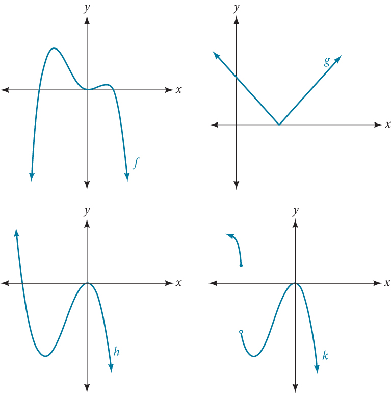

Solution

The graphs of $f$ and $h$ are graphs of polynomial functions. They are smooth and **continuous**.
The graphs of $g$ and $k$ are graphs of functions that are not polynomials. The graph of function $g$ has a sharp corner. The graph of function $k$ is not continuous.

    

>
>       Q&A
>       *Do all polynomial functions have as their domain all real numbers?*
> *Yes. Any real number is a valid input for a polynomial function.*
>
>

# Using Factoring to Find Zeros of Polynomial Functions
Recall that if $f$ is a polynomial function, the values of $x$ for which $f\left(x\right)=0$ are called **zeros** of $f.$ If the equation of the polynomial function can be factored, we can set each factor equal to zero and solve for the zeros*.*
We can use this method to find $x\text{-}$ intercepts because at the $x\text{-}$ intercepts we find the input values when the output value is zero. For general polynomials, this can be a challenging prospect. While quadratics can be solved using the relatively simple quadratic formula, the corresponding formulas for cubic and fourth-degree polynomials are not simple enough to remember, and formulas do not exist for general higher-degree polynomials. Consequently, we will limit ourselves to three cases:

      The polynomial can be factored using known methods: greatest common factor and trinomial factoring.
      The polynomial is given in factored form.
      Technology is used to determine the intercepts.
    

>
>       How To
>       *Given a polynomial function $f,$ find the *x*-intercepts by factoring.*
>
>         Set $f\left(x\right)=0.$
>
>         If the polynomial function is not given in factored form:
>         Factor out any common monomial factors.
>         Factor any factorable binomials or trinomials.
>
>         Set each factor equal to zero and solve to find the $x\text{-}$ intercepts.
>
>

18. **Finding the *x*-Intercepts of a Polynomial Function by Factoring**             Find the *x*-intercepts of $f(x)={x}^{6}-3{x}^{4}+2{x}^{2}.$

Solution

We can attempt to factor this polynomial to find solutions for $f\left(x\right)=0.$ 
          

 $$
\begin{array}{cccc}  {x}^{6}-3{x}^{4}+2{x}^{2}& =& 0  & \phantom{\rule{2em}{0ex}}\begin{array}{c}\text{Factor\ out\ the\ greatest}  \\ \text{common\ factor}\text{.}  \end{array}  \\   {x}^{2}({x}^{4}-3{x}^{2}+2)& =& 0  & \phantom{\rule{2em}{0ex}}\text{Factor\ the\ trinomial}\text{.}  \\   {x}^{2}({x}^{2}-1)({x}^{2}-2)& =& 0  & \phantom{\rule{2em}{0ex}}\text{Set\ each\ factor\ equal\ to\ zero}\text{.}\end{array}
$$ 
 $$
\begin{array}{ccccccccccc}& & & &   ({x}^{2}-1)& =& 0  & &   ({x}^{2}-2)& =& 0  \\   {x}^{2}& =& 0  & \phantom{\rule{2em}{0ex}}\text{or}&   {x}^{2}& =& 1  & \phantom{\rule{2em}{0ex}}\text{or}&   {x}^{2}& =& 2  \\   x& =& 0  & &   x& =& \mathrm{\pm 1}  & &   x& =& \pm \sqrt{2}  \end{array}
$$
This gives us five *x*-intercepts: $(0,0),(1,0),(\mathrm{-1},0),(\sqrt{2},0),$ and $(-\sqrt{2},0).$ See . We can see that this is an even function because it is symmetric about the *y*-axis.

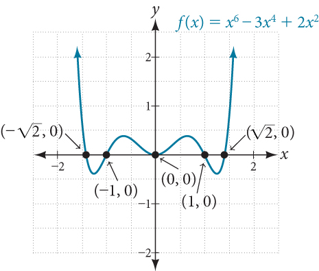

      19. **Finding the *x*-Intercepts of a Polynomial Function by Factoring**             Find the *x*-intercepts of $f(x)={x}^{3}-5{x}^{2}-x+5.$

Solution

Find solutions for $f(x)=0$
            by factoring.

 $$
\begin{array}{cccc}  {x}^{3}-5{x}^{2}-x+5& =& 0  & \phantom{\rule{2em}{0ex}}\text{Factor\ by\ grouping}\text{.}  \\   {x}^{2}(x-5)-(x-5)& =& 0  & \phantom{\rule{2em}{0ex}}\text{Factor\ out\ the\ common\ factor}\text{.}  \\   ({x}^{2}-1)(x-5)& =& 0  & \phantom{\rule{2em}{0ex}}\text{Factor\ the\ difference\ of\ squares}\text{.}  \\   (x+1)(x-1)(x-5)& =& 0  & \phantom{\rule{2em}{0ex}}\text{Set\ each\ factor\ equal\ to\ zero}\text{.}  \end{array}
$$

 $$
\begin{array}{ccccccccccc}  x+1& =& 0  & \phantom{\rule{2em}{0ex}}\text{or}\phantom{\rule{2em}{0ex}}&   x-1& =& 0  & \phantom{\rule{2em}{0ex}}\text{or}\phantom{\rule{2em}{0ex}}&   x-5& =& 0  \\   x& =& \mathrm{-1}  & &   x& =& 1  & &   x& =& 5  \end{array}
$$ There are three *x*-intercepts: $(\mathrm{-1},0),(1,0),$ and $\left(5,0\right).$ See .

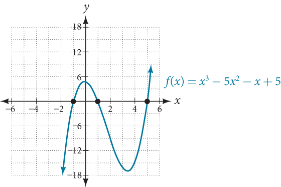

      20. **Finding the *y*- and *x*-Intercepts of a Polynomial in Factored Form**             Find the *y*- and *x*-intercepts of $g(x)={(x-2)}^{2}(2x+3).$

Solution

The *y*-intercept can be found by evaluating $g\left(0\right).$ 

 $$
\begin{array}{ccc}  g(0)& =& {(0-2)}^{2}(2(0)+3)  \\ & =& 12  \end{array}
$$ 
So the *y*-intercept is $(0,12).$ 

The *x*-intercepts can be found by solving $g\left(x\right)=0.$ 

 $$
{(x-2)}^{2}(2x+3)=0
$$ 

 $$
\begin{array}{ccccccc}  {(x-2)}^{2}& =& 0  & &   (2x+3)& =& 0  \\   x-2& =& 0  & \phantom{\rule{2em}{0ex}}\text{or}\phantom{\rule{2em}{0ex}}&   x& =& -\frac{3}{2}  \\   x& =& 2  & & & & \end{array}
$$
So the *x*-intercepts are $(2,0)$ and $\left(-\frac{3}{2},0\right).$

21. **Finding the *x*-Intercepts of a Polynomial Function Using a Graph**             Find the *x*-intercepts of $h(x)={x}^{3}+4{x}^{2}+x-6.$

Solution

This polynomial is not in factored form, has no common factors, and does not appear to be factorable using techniques previously discussed. Fortunately, we can use technology to find the intercepts. Keep in mind that some values make graphing difficult by hand. In these cases, we can take advantage of graphing utilities.

Looking at the graph of this function, as shown in , it appears that there are *x*-intercepts at $x=\mathrm{-3},\mathrm{-2},$ and $1.$    

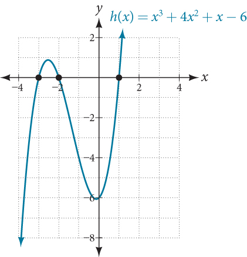

        We can check whether these are correct by substituting these values for $x$ and verifying that

 $$
h(-3)=h(-2)=h(1)=0
$$ Since $h(x)={x}^{3}+4{x}^{2}+x-6,$ we have:

 $$
\begin{array}{ccc}  h(\mathrm{-3})& =& {(\mathrm{-3})}^{3}+4{(\mathrm{-3})}^{2}+(\mathrm{-3})-6=\mathrm{-27}+36-3-6=0  \\   h(\mathrm{-2})& =& {(\mathrm{-2})}^{3}+4{(\mathrm{-2})}^{2}+(\mathrm{-2})-6=\mathrm{-8}+16-2-6=0  \\   h(1)& =& {(1)}^{3}+4{(1)}^{2}+(1)-6=1+4+1-6=0  \end{array}
$$
Each *x*-intercept corresponds to a zero of the polynomial function and each zero yields a factor, so we can now write the polynomial in factored form.

 $$
\begin{array}{ccc}  h(x)& =& {x}^{3}+4{x}^{2}+x-6  \\ & =& (x+3)(x+2)(x-1)  \end{array}
$$

>
>       Try It
>       22. Find the *y*- and *x*-intercepts of the function $f(x)={x}^{4}-19{x}^{2}+30x.$
>
> 

> 
Solution

>
> *y*-intercept $(0,0);$ *x*-intercepts $(0,0),(\u20135,0),(2,0),$ and $(3,0)$
> 

>
>
>

  
# Identifying Zeros and Their Multiplicities
Graphs behave differently at various *x*-intercepts. Sometimes, the graph will cross over the horizontal axis at an intercept. Other times, the graph will touch the horizontal axis and "bounce" off.

Suppose, for example, we graph the function shown.
 $$
f(x)=(x+3){(x-2)}^{2}{(x+1)}^{3}
$$
    Notice in  that the behavior of the function at each of the *x*-intercepts is different.

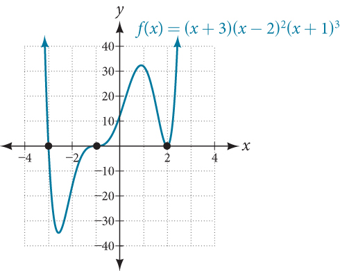

The *x*-intercept $x=\mathrm{-3}$
      is the solution of equation $(x+3)=0.$ The graph passes directly through the *x*-intercept at $x=\mathrm{-3.}$ The factor is linear (has a degree of 1), so the behavior near the intercept is like that of a line—it passes directly through the intercept. We call this a single zero because the zero corresponds to a single factor of the function.
The *x*-intercept $x=2$ is the repeated solution of equation ${(x-2)}^{2}=0.$ The graph touches the axis at the intercept and changes direction. The factor is quadratic (degree 2), so the behavior near the intercept is like that of a quadratic—it bounces off of the horizontal axis at the intercept.
 $$
{(x-2)}^{2}=(x-2)(x-2)
$$
    The factor is repeated, that is, the factor $\left(x-2\right)$ appears twice. The number of times a given factor appears in the factored form of the equation of a polynomial is called the **multiplicity**. The zero associated with this factor, $x=2,$ has multiplicity 2 because the factor $\left(x-2\right)$ occurs twice.
The *x*-intercept $x=-1$ is the repeated solution of factor ${(x+1)}^{3}=0.$ The graph passes through the axis at the intercept, but flattens out a bit first. This factor is cubic (degree 3), so the behavior near the intercept is like that of a cubic—with the same S-shape near the intercept as the toolkit function $f\left(x\right)={x}^{3}.$ We call this a triple zero, or a zero with multiplicity 3.
For **zeros** with even multiplicities, the graphs *touch* or are tangent to the *x*-axis. For zeros with odd multiplicities, the graphs *cross* or intersect the *x*-axis. See  for examples of graphs of polynomial functions with multiplicity 1, 2, and 3.

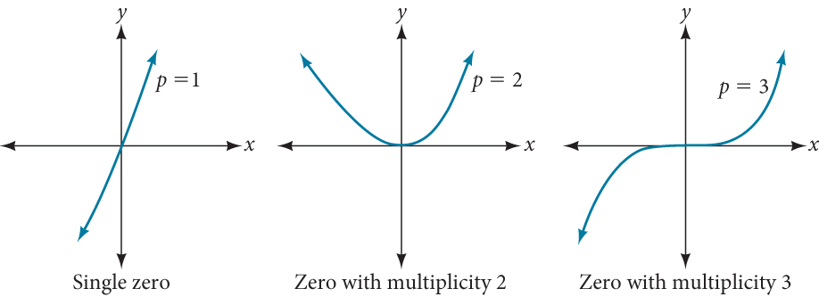

For higher even powers, such as 4, 6, and 8, the graph will still touch and bounce off of the horizontal axis but, for each increasing even power, the graph will appear flatter as it approaches and leaves the *x*-axis.
For higher odd powers, such as 5, 7, and 9, the graph will still cross through the horizontal axis, but for each increasing odd power, the graph will appear flatter as it approaches and leaves the *x*-axis.

>
>
> **Graphical Behavior of Polynomials at *x*-Intercepts**
>
>
>
>       If a polynomial contains a factor of the form ${(x-h)}^{p},$ the behavior near the $x\text{-}$ intercept $h$ is determined by the power $p.$ We say that $x=h$ is a zero of **multiplicity** $p.$  
> The graph of a polynomial function will touch the *x*-axis at zeros with even multiplicities. The graph will cross the *x*-axis at zeros with odd multiplicities.
> The sum of the multiplicities is the degree of the polynomial function.
>
>

>
>       How To
>       *Given a graph of a polynomial function of degree* $n,$ *identify the zeros and their multiplicities.*
> If the graph crosses the *x*-axis and appears almost linear at the intercept, it is a single zero.
>       If the graph touches the *x*-axis and bounces off of the axis, it is a zero with even multiplicity.
>       If the graph crosses the *x*-axis at a zero, it is a zero with odd multiplicity.
>         The sum of the multiplicities is $\le n.$
>
>

      23. **Identifying Zeros and Their Multiplicities**             Use the graph of the function of degree 6 in  to identify the zeros of the function and their possible multiplicities.               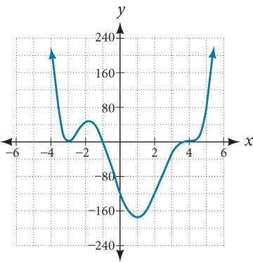

Solution

The polynomial function is of degree 6. The sum of the multiplicities must be 6.
          
Starting from the left, the first zero occurs at $x=\mathrm{-3.}$ The graph touches the *x*-axis, so the multiplicity of the zero must be even. The zero of $\mathrm{-3}$ most likely has multiplicity $2.$ 
The next zero occurs at $x=\mathrm{-1.}$ The graph looks almost linear at this point. This is a single zero of multiplicity 1.
The last zero occurs at $x=4.$ The graph crosses the*x*-axis, so the multiplicity of the zero must be odd. We know that the multiplicity is likely 3 and that the sum of the multiplicities is 6.

>
>       Try It
>       24. Use the graph of the function of degree 9 in  to identify the zeros of the function and their multiplicities.   
>
> 

> 
Solution

>
> The graph has a zero of –5 with multiplicity 3, a zero of -1 with multiplicity 2, and a zero of 3 with multiplicity 4.
> 

>

# Determining End Behavior
As we have already learned, the behavior of a graph of a **polynomial function** of the form
 $$
f(x)={a}_{n}{x}^{n}+{a}_{n-1}{x}^{n-1}+\mathrm{...}+{a}_{1}x+{a}_{0}
$$ will either ultimately rise or fall as $x$
      increases without bound and will either rise or fall as $x$
      decreases without bound. This is because for very large inputs, say 100 or 1,000, the leading term dominates the size of the output. The same is true for very small inputs, say –100 or –1,000.
Recall that we call this behavior the *end behavior* of a function. As we pointed out when discussing quadratic equations, when the leading term of a polynomial function, ${a}_{n}{x}^{n},$ is an even power function, as $x$ increases or decreases without bound, $f(x)$ increases without bound. When the leading term is an odd power function, as $x$ decreases without bound, $f(x)$ also decreases without bound; as $x$ increases without bound, $f(x)$ also increases without bound. If the leading term is negative, it will change the direction of the end behavior.  summarizes all four cases.

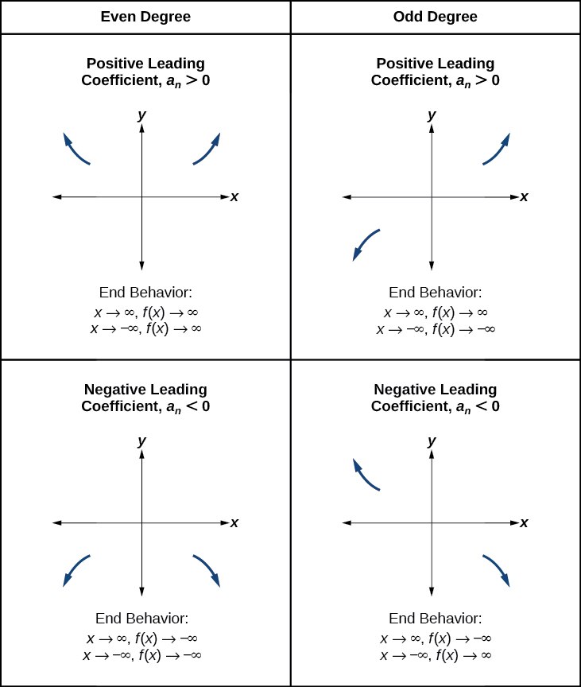

# Understanding the Relationship between Degree and Turning Points
In addition to the end behavior, recall that we can analyze a polynomial function’s local behavior. It may have a turning point where the graph changes from increasing to decreasing (rising to falling) or decreasing to increasing (falling to rising). Look at the graph of the polynomial function $f(x)={x}^{4}-{x}^{3}-4{x}^{2}+4x$ in . The graph has three turning points.

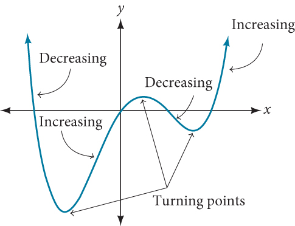

This function $f$
is a 4th degree polynomial function and has 3 turning points. The maximum number of turning points of a polynomial function is always one less than the degree of the function.

>
>
> **Interpreting Turning Points**
>
>
>
>       A **turning point** is a point of the graph where the graph changes from increasing to decreasing (rising to falling) or decreasing to increasing (falling to rising).
> A polynomial of degree $n$ will have at most $n-1$ turning points.

      25. **Finding the Maximum Number of Turning Points Using the Degree of a Polynomial Function**             Find the maximum number of turning points of each polynomial function.             ⓐ  $f(x)=-{x}^{3}+4{x}^{5}-3{x}^{2}+1$            ⓑ $f(x)=-{\left(x-1\right)}^{2}\left(1+2{x}^{2}\right)$

Solution

ⓐFirst, rewrite the polynomial function in descending order: $f(x)=4{x}^{5}-{x}^{3}-3{x}^{2}+1$ 

Identify the degree of the polynomial function. This polynomial function is of degree 5.

        The maximum number of turning points is $5-1=4.$

        
          ⓑ

        First, identify the leading term of the polynomial function if the function were expanded.

          

        Then, identify the degree of the polynomial function. This polynomial function is of degree 4.

        The maximum number of turning points is $4-1=3.$

  
# Graphing Polynomial Functions
We can use what we have learned about multiplicities, end behavior, and turning points to sketch graphs of polynomial functions. Let us put this all together and look at the steps required to graph polynomial functions.

>
>       How To
>       *Given a polynomial function, sketch the graph.*
>
>
>
>         Find the intercepts.
>       Check for symmetry. If the function is an even function, its graph is symmetrical about the $y\text{-}$ axis, that is, $f\left(-x\right)=f\left(x\right).$
> If a function is an odd function, its graph is symmetrical about the origin, that is, $f\left(-x\right)=-f\left(x\right).$
>
>       Use the multiplicities of the zeros to determine the behavior of the polynomial at the $x\text{-}$ intercepts.
>       Determine the end behavior by examining the leading term.
>       Use the end behavior and the behavior at the intercepts to sketch a graph.
>       Ensure that the number of turning points does not exceed one less than the degree of the polynomial.
>       Optionally, use technology to check the graph.
>
>

      26. **Sketching the Graph of a Polynomial Function**             Sketch a graph of $f(x)=\mathrm{-2}{(x+3)}^{2}(x-5).$

Solution

This graph has two *x*-intercepts. At $x=\mathrm{-3},$ the factor is squared, indicating a multiplicity of 2. The graph will bounce at this *x*-intercept. At $x=5,$ the function has a multiplicity of one, indicating the graph will cross through the axis at this intercept.

The *y*-intercept is found by evaluating $f(0).$

 $$
\begin{array}{ccc}  f(0)& =& \mathrm{-2}{(0+3)}^{2}(0-5)  \\ & =& \mathrm{-2}\cdot 9\cdot (\mathrm{-5})  \\ & =& 90  \end{array}
$$
The *y*-intercept is $(0,90).$ 
Additionally, we can see the leading term, if this polynomial were multiplied out, would be $-2{x}^{3},$
so the end behavior is that of a vertically reflected cubic, with the outputs decreasing as the inputs approach infinity, and the outputs increasing as the inputs approach negative infinity. See .

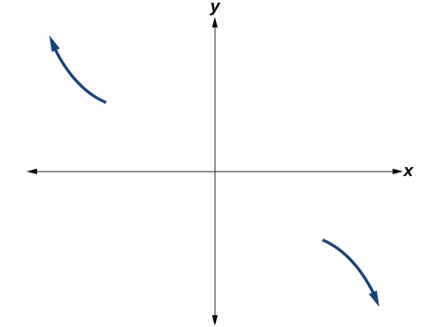

        To sketch this, we consider that:

        As $x\to -\infty$ the function $f(x)\to \infty ,$ so we know the graph starts in the second quadrant and is decreasing toward the $x\text{-}$ axis.

        Since $f\left(-x\right)=\mathrm{-2}{\left(-x+3\right)}^{2}\left(-x\u20135\right)$
is not equal to $f\left(x\right),$ the graph does not display symmetry.
        At $\left(-3,0\right),$ the graph bounces off of the *x*-axis, so the function must start increasing.At $\left(0,90\right),$ the graph crosses the *y*-axis at the *y*-intercept. See .

        

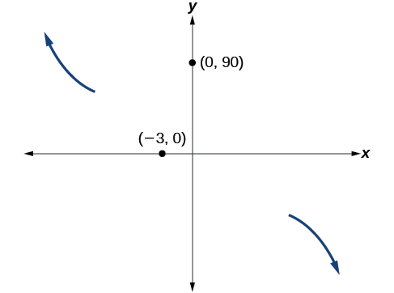

        Somewhere after this point, the graph must turn back down or start decreasing toward the horizontal axis because the graph passes through the next intercept at $\left(5,0\right).$ See .

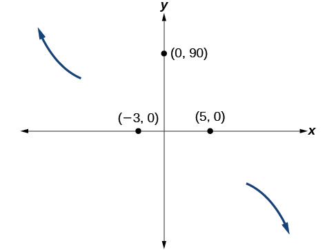

        As $x\to \infty$ the function $f(x)\to \mathrm{-\infty},$ so we know the graph continues to decrease, and we can stop drawing the graph in the fourth quadrant.
Using technology, we can create the graph for the polynomial function, shown in , and verify that the resulting graph looks like our sketch in .

        

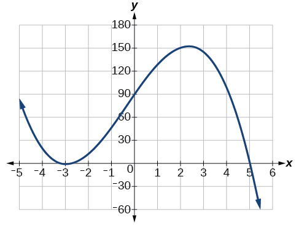

>
>       Try It
>       27. Sketch a graph of $f(x)=\frac{1}{4}x{(x-1)}^{4}{(x+3)}^{3}.$
>
> 

> 
Solution

>
> 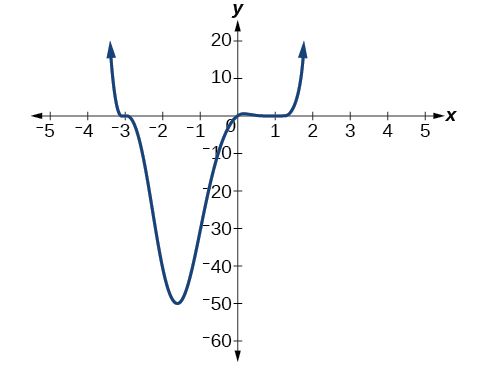
> 

>

  
# Using the Intermediate Value Theorem
In some situations, we may know two points on a graph but not the zeros. If those two points are on opposite sides of the *x*-axis, we can confirm that there is a zero between them. Consider a polynomial function $f$ whose graph is smooth and continuous. The **Intermediate Value Theorem** states that for two numbers $a$ and $b$ in the domain of $f,$ if $a<b$ and $f\left(a\right)\ne f\left(b\right),$ then the function $f$ takes on every value between $f\left(a\right)$ and $f\left(b\right).$ (While the theorem is intuitive, the proof is actually quite complicated and requires higher mathematics.) We can apply this theorem to a special case that is useful in graphing polynomial functions. If a point on the graph of a continuous function $f$ at $x=a$ lies above the $x\text{-}$ axis and another point at $x=b$ lies below the $x\text{-}$ axis, there must exist a third point between $x=a$ and $x=b$ where the graph crosses the $x\text{-}$ axis. Call this point $\left(c,\phantom{\rule{0.5em}{0ex}}\text{}f\left(c\right)\right).$ This means that we are assured there is a solution $c$ where $f\left(c\right)=0.$ 
In other words, the Intermediate Value Theorem tells us that when a polynomial function changes from a negative value to a positive value, the function must cross the $x\text{-}$ axis.  shows that there is a zero between $a$
and $b.$

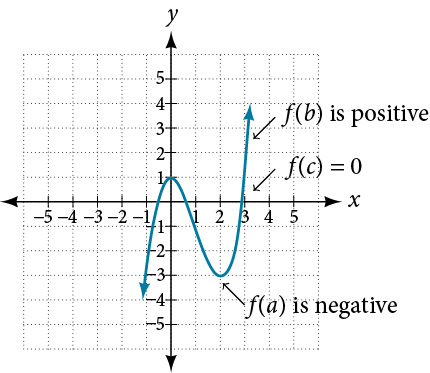

>
>
>
>
> **Intermediate Value Theorem**
>
>
> Let $f$
> be a polynomial function. The **Intermediate Value Theorem** states that if $f\left(a\right)$
> and $f\left(b\right)$
> have opposite signs, then there exists at least one value $c$
> between $a$
> and $b$
> for which $f\left(c\right)=0.$
>
>

28. **Using the Intermediate Value Theorem**   Show that the function $f(x)={x}^{3}-5{x}^{2}+3x+6$ has at least two real zeros between $x=1$ and $x=4.$

Solution

As a start, evaluate $f(x)$
at the integer values $x=1,2,3,$ and $4.$ See .

| *$x$* | 1 | 2 | 3 | 4 |
| :--- | :--- | :--- | :--- | :--- |
| *$f(x)$* | 5 | 0 | –3 | 2 |

We see that one zero occurs at $x=2.$ Also, since $f(3)$ is negative and $f(4)$ is positive, by the Intermediate Value Theorem, there must be at least one real zero between 3 and 4.
We have shown that there are at least two real zeros between $x=1$
and $x=4.$

>
> Try It
> 29. Show that the function $f(x)=7{x}^{5}-9{x}^{4}-{x}^{2}$ has at least one real zero between $x=1$ and $x=2.$
>
> 

> 
Solution

>
> Because $f$ is a polynomial function and since $f(1)$ is negative and $f(2)$ is positive, there is at least one real zero between $x=1$ and $x=2.$
> 

>

## Writing Formulas for Polynomial Functions
Now that we know how to find zeros of polynomial functions, we can use them to write formulas based on graphs. Because a **polynomial function** written in factored form will have an *x*-intercept where each factor is equal to zero, we can form a function that will pass through a set of *x*-intercepts by introducing a corresponding set of factors.

>
>
>
>
> **Factored Form of Polynomials**
>
>
> If a polynomial of degree $p$
> that can be factored into strictly linear factors has horizontal intercepts at $x={x}_{1},{x}_{2},\dots ,{x}_{n},$
> then the polynomial can be written in the factored form: $f(x)=a{(x-{x}_{1})}^{{p}_{1}}{(x-{x}_{2})}^{{p}_{2}}\cdots {(x-{x}_{n})}^{{p}_{n}}$
> where the powers ${p}_{i}$
> on each factor can be determined by the behavior of the graph at the corresponding intercept, and the stretch factor $a$
> can be determined given a value of the function other than the *x*-intercept.

>
> How To
> *Given a graph of a polynomial function, write a formula for the function.*
>
>   Identify the *x*-intercepts of the graph to find the factors of the polynomial.
> Examine the behavior of the graph at the *x*-intercepts to determine the multiplicity of each factor.
> Find the polynomial of least degree containing all the factors found in the previous step.
> Use any other point on the graph (the *y*-intercept may be easiest) to determine the stretch factor.
>

30. **Writing a Formula for a Polynomial Function from the Graph**     Write a formula for the polynomial function shown in .    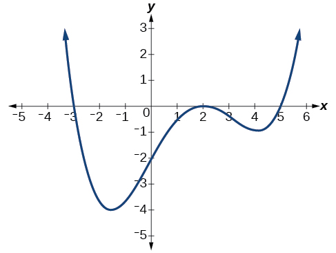

Solution

This graph has three *x*-intercepts: $x=\mathrm{-3},2,$ and $5.$ The *y*-intercept is located at $(0,-2).$ At $x=\mathrm{-3}$ and $x=5,$
the graph passes through the axis linearly, suggesting the corresponding factors of the polynomial will be linear. At $x=2,$ the graph bounces at the intercept, suggesting the corresponding factor of the polynomial will be second degree (quadratic). Together, this gives us
 $$
f(x)=a(x+3){(x-2)}^{2}(x-5)
$$ 
To determine the stretch factor, we utilize another point on the graph. We will use the $y\text{-}$ intercept $(0,\u20132),$ to solve for $a.$

 $$
\begin{array}{ccc}  f(0)& =& a(0+3){(0-2)}^{2}(0-5)  \\   \mathrm{-2}& =& a(0+3){(0-2)}^{2}(0-5)  \\   \mathrm{-2}& =& -60a  \\   a& =& \frac{1}{30}  \end{array}
$$
The graphed polynomial appears to represent the function $f(x)=\frac{1}{30}(x+3){(x-2)}^{2}(x-5).$

>
> Try It
> 31. Given the graph shown in , write a formula for the function shown.    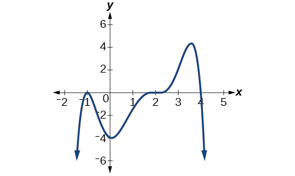
>
> 

> 
Solution

>
> $f(x)=-\frac{1}{8}{(x-2)}^{3}{(x+1)}^{2}(x-4)$
> 

>
>

## Using Local and Global Extrema
With quadratics, we were able to algebraically find the maximum or minimum value of the function by finding the vertex. For general polynomials, finding these turning points is not possible without more advanced techniques from calculus. Even then, finding where extrema occur can still be algebraically challenging. For now, we will estimate the locations of turning points using technology to generate a graph.
Each turning point represents a local minimum or maximum. Sometimes, a turning point is the highest or lowest point on the entire graph. In these cases, we say that the turning point is a **global maximum** or a **global minimum**. These are also referred to as the absolute maximum and absolute minimum values of the function.

>
>
>
>
> **Local and Global Extrema**
>
>
> A **local maximum** or **local minimum** at $x=a$ (sometimes called the relative maximum or minimum, respectively) is the output at the highest or lowest point on the graph in an open interval around $x=a.$ If a function has a local maximum at $a,$ then $f(a)\ge f(x)$ for all $x$ in an open interval around $x=a.$ If a function has a local minimum at $a,$ then $f(a)\le f(x)$ for all $x$ in an open interval around $x=a.$ 
> A **global maximum** or **global minimum** is the output at the highest or lowest point of the function. If a function has a global maximum at $a,$ then $f(a)\ge f(x)$ for all $x.$ If a function has a global minimum at $a,$ then $f(a)\le f(x)$ for all $x.$ 
> We can see the difference between local and global extrema in .
>
>
> 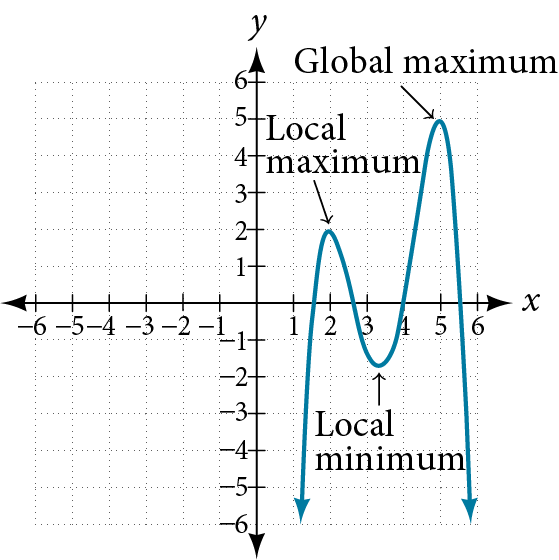
>

> Q&A
> *Do all polynomial functions have a global minimum or maximum?*
> *No. Only polynomial functions of even degree have a global minimum or maximum. For example, $f\left(x\right)=x$ has neither a global maximum nor a global minimum.*
>

32. **Using Local Extrema to Solve Applications**   An open-top box is to be constructed by cutting out squares from each corner of a 14 cm by 20 cm sheet of plastic and then folding up the sides. Find the size of squares that should be cut out to maximize the volume enclosed by the box.

Solution

We will start this problem by drawing a picture like that in , labeling the width of the cut-out squares with a variable, $w.$
 

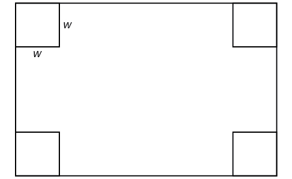

Notice that after a square is cut out from each end, it leaves a $\left(14-2w\right)$ cm by $\left(20-2w\right)$ cm rectangle for the base of the box, and the box will be $w$ cm tall. This gives the volume

 $$
\begin{array}{ccc}  V(w)& =& (20-2w)(14-2w)w  \\ & =& 280w-68{w}^{2}+4{w}^{3}  \end{array}
$$
Notice, since the factors are $w,$ $20\u20132w$ and $14\u20132w,$ the three zeros are 10, 7, and 0, respectively. Because a height of 0 cm is not reasonable, we consider the only the zeros 10 and 7.  The shortest side is 14 and we are cutting off two squares, so values $w$ may take on are greater than zero or less than 7. This means we will restrict the domain of this function to $0<w<7.$ Using technology to sketch the graph of $V\left(w\right)$ on this reasonable domain, we get a graph like that in . We can use this graph to estimate the maximum value for the volume, restricted to values for $w$ that are reasonable for this problem—values from 0 to 7.

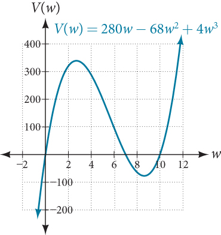

  From this graph, we turn our focus to only the portion on the reasonable domain, $\left[0,\phantom{\rule{0.5em}{0ex}}\text{}7\right].$ We can estimate the maximum value to be around 340 cubic cm, which occurs when the squares are about 2.75 cm on each side. To improve this estimate, we could use advanced features of our technology, if available, or simply change our window to zoom in on our graph to produce .

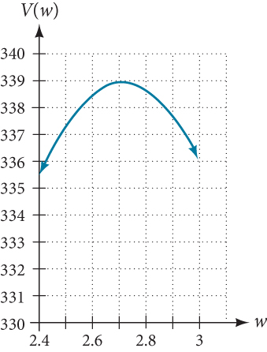

From this zoomed-in view, we can refine our estimate for the maximum volume to about 339 cubic cm, when the squares measure approximately 2.7 cm on each side.

>
> Try It
> 33. Use technology to find the maximum and minimum values on the interval $[\mathrm{-1},4]$ of the function $f(x)=-0.2{(x-2)}^{3}{(x+1)}^{2}(x-4).$
>
> 

> 
Solution

>
> The minimum occurs at approximately the point $(0,-6.5),$ and the maximum occurs at approximately the point $(3.5,7).$
> 

>
>

>
> Media
> Access the following online resource for additional instruction and practice with graphing polynomial functions.
>
>
>
>    Intermediate Value Theorem
>

# Key Concepts

    Polynomial functions of degree 2 or more are smooth, continuous functions. See .

    To find the zeros of a polynomial function, if it can be factored, factor the function and set each factor equal to zero. See *,**,*and .
    Another way to find the $x\text{-}$ intercepts of a polynomial function is to graph the function and identify the points at which the graph crosses the $x\text{-}$ axis. See *.*
    The multiplicity of a zero determines how the graph behaves at the $x\text{-}$ intercepts. See *.*
The graph of a polynomial will cross the horizontal axis at a zero with odd multiplicity.
The graph of a polynomial will touch the horizontal axis at a zero with even multiplicity.
The end behavior of a polynomial function depends on the leading term.
The graph of a polynomial function changes direction at its turning points.
    A polynomial function of degree $n$
has at most $n-1$
turning points. See *.*
    To graph polynomial functions, find the zeros and their multiplicities, determine the end behavior, and ensure that the final graph has at most $n-1$
turning points. See  and *.*
    Graphing a polynomial function helps to estimate local and global extremas. See *.*
    The Intermediate Value Theorem tells us that if $f(a)\ \text{and}\ f(b)$
have opposite signs, then there exists at least one value $c$
between $a$
and $b$
for which $f\left(c\right)=0.$
See *.*

# Section Exercises

## Verbal
1. What is the difference between an $x\text{-}$ intercept and a zero of a polynomial function $f?$

Solution

The $x\text{-}$ intercept is where the graph of the function crosses the $x\text{-}$ axis, and the zero of the function is the input value for which $f(x)=0.$

2. If a polynomial function of degree $n$ has $n$ distinct zeros, what do you know about the graph of the function?

3. Explain how the Intermediate Value Theorem can assist us in finding a zero of a function.

Solution

If we evaluate the function at $a$
and at $b$
and the sign of the function value changes, then we know a zero exists between $a$
and $b.$

4. Explain how the factored form of the polynomial helps us in graphing it.

5. If the graph of a polynomial just touches the *x*-axis and then changes direction, what can we conclude about the factored form of the polynomial?

Solution

There will be a factor raised to an even power.

## Algebraic
For the following exercises, find the $x\text{-}$ or *t*-intercepts of the polynomial functions.
6. $C\left(t\right)=2\left(t-4\right)\left(t+1\right)(t-6)$

7. $C\left(t\right)=3\left(t+2\right)\left(t-3\right)(t+5)$

Solution

$(-2,0),(3,0),(-5,0)$

8. $C\left(t\right)=4t{\left(t-2\right)}^{2}(t+1)$

9. $C\left(t\right)=2t\left(t-3\right){\left(t+1\right)}^{2}$

Solution

$(3,0),(-1,0),(0,0)$

10. $C\left(t\right)=2{t}^{4}-8{t}^{3}+6{t}^{2}$

11. $C\left(t\right)=4{t}^{4}+12{t}^{3}-40{t}^{2}$

Solution

$\left(0,0\right),\phantom{\rule{0.5em}{0ex}}\text{}\left(-5,0\right),\phantom{\rule{0.5em}{0ex}}\text{}\left(2,0\right)$

12. $f(x)={x}^{4}-{x}^{2}$

13. $f(x)={x}^{3}+{x}^{2}-20x$

Solution

$\left(0,0\right),\phantom{\rule{0.5em}{0ex}}\text{}\left(-5,0\right),\phantom{\rule{0.5em}{0ex}}\text{}\left(4,0\right)$

14. $f(x)={x}^{3}+6{x}^{2}-7x$

15. $f(x)={x}^{3}+{x}^{2}-4x-4$

Solution

$\left(2,0\right),\phantom{\rule{0.5em}{0ex}}\text{}\left(-2,0\right),\phantom{\rule{0.5em}{0ex}}\text{}\left(-1,0\right)$

16. $f(x)={x}^{3}+2{x}^{2}-9x-18$

17. $f(x)=2{x}^{3}-{x}^{2}-8x+4$

Solution

$(-2,0),\phantom{\rule{0.5em}{0ex}}(2,0),\phantom{\rule{0.5em}{0ex}}\left(\frac{1}{2},0\right)$

18. $f(x)={x}^{6}-7{x}^{3}-8$

19. $f(x)=2{x}^{4}+6{x}^{2}-8$

Solution

$\left(1,0\right),\phantom{\rule{0.5em}{0ex}}\text{}\left(-1,0\right)$

20. $f(x)={x}^{3}-3{x}^{2}-x+3$

21. $f(x)={x}^{6}-2{x}^{4}-3{x}^{2}$

Solution

$(0,0),\phantom{\rule{0.5em}{0ex}}(\sqrt{3},0),\phantom{\rule{0.5em}{0ex}}(-\sqrt{3},0)$

22. $f(x)={x}^{6}-3{x}^{4}-4{x}^{2}$

23. $f(x)={x}^{5}-5{x}^{3}+4x$

Solution

$\left(0,0\right),\phantom{\rule{0.5em}{0ex}}\text{}\left(1,0\right)\text{,\}\left(-1,0\right),\phantom{\rule{0.5em}{0ex}}\text{}\left(2,0\right),\phantom{\rule{0.5em}{0ex}}\text{}\left(-2,0\right)$

For the following exercises, use the Intermediate Value Theorem to confirm that the given polynomial has at least one zero within the given interval.
24. $f(x)={x}^{3}-9x,$ between $x=\mathrm{-4}$ and $x=\mathrm{-2.}$

25. $f(x)={x}^{3}-9x,$ between $x=2$ and $x=4.$

Solution

$f\left(2\right)=\u201310$
and $f\left(4\right)=28.$
Sign change confirms.

26. $f(x)={x}^{5}-2x,$ between $x=1$ and $x=2.$

27. $f(x)=-{x}^{4}+4,$ between $x=1$ and $x=3$ .

Solution

$f\left(1\right)=3$
and $f\left(3\right)=\u201377.$
Sign change confirms.

28. $f(x)=\mathrm{-2}{x}^{3}-x,$ between $x=\mathrm{\u20131}$ and $x=1.$

29. $f(x)={x}^{3}-100x+2,$ between $x=0.01$ and $x=0.1$

Solution

$f\left(0.01\right)=1.000001$
and $f\left(0.1\right)=\u2013\mathrm{7.999.}$
Sign change confirms.

For the following exercises, find the zeros and give the multiplicity of each.
30. $f(x)={\left(x+2\right)}^{3}{\left(x-3\right)}^{2}$

31. $f(x)={x}^{2}{\left(2x+3\right)}^{5}{\left(x-4\right)}^{2}$

Solution

0 with multiplicity 2, $-\frac{3}{2}$
with multiplicity 5, 4 with multiplicity 2

32. $f(x)={x}^{3}{\left(x-1\right)}^{3}\left(x+2\right)$

33. $f(x)={x}^{2}\left({x}^{2}+4x+4\right)$

Solution

0 with multiplicity 2, –2 with multiplicity 2

34. $f(x)={\left(2x+1\right)}^{3}\left(9{x}^{2}-6x+1\right)$

35. $f(x)={\left(3x+2\right)}^{5}\left({x}^{2}-10x+25\right)$

Solution

$-\frac{2}{3}$ with multiplicity 5, 5 with multiplicity 2

36. $f(x)=x\left(4{x}^{2}-12x+9\right)\left({x}^{2}+8x+16\right)$

37. $f(x)={x}^{6}-{x}^{5}-2{x}^{4}$

Solution

0 with multiplicity 4, 2 with multiplicity 1, −1 with multiplicity 1

38. $f(x)=3{x}^{4}+6{x}^{3}+3{x}^{2}$

39. $f(x)=4{x}^{5}-12{x}^{4}+9{x}^{3}$

Solution

$\frac{3}{2}$
with multiplicity 2, 0 with multiplicity 3

40. $f(x)=2{x}^{4}\left({x}^{3}-4{x}^{2}+4x\right)$

41. $f(x)=4{x}^{4}\left(9{x}^{4}-12{x}^{3}+4{x}^{2}\right)$

Solution

$\text{0}\phantom{\rule{0.5em}{0ex}}\text{with}\phantom{\rule{0.5em}{0ex}}\text{multiplicity}\phantom{\rule{0.5em}{0ex}}6\text{,}\phantom{\rule{0.5em}{0ex}}\frac{2}{3}\phantom{\rule{0.5em}{0ex}}\text{with}\phantom{\rule{0.5em}{0ex}}\text{multiplicity}\phantom{\rule{0.5em}{0ex}}2$

## Graphical
For the following exercises, graph the polynomial functions. Note $x\text{-}$ and $y\text{-}$ intercepts, multiplicity, and end behavior.
42. $f\left(x\right)={\left(x+3\right)}^{2}(x-2)$

43. $g\left(x\right)=\left(x+4\right){\left(x-1\right)}^{2}$

Solution

*x*-intercepts, $\left(\mathrm{1,\; 0}\right)$
with multiplicity 2, $\left(\u20134,\ 0\right)$
with multiplicity 1, $y\text{-}$ intercept $(0,\ 4).$
 As $\phantom{\rule{0.2em}{0ex}}x\to -\infty ,\phantom{\rule{0.2em}{0ex}}f(x)\to -\infty ,\phantom{\rule{0.5em}{0ex}}\text{as}\phantom{\rule{0.2em}{0ex}}x\to \infty ,\phantom{\rule{0.2em}{0ex}}f(x)\to \infty .$

  

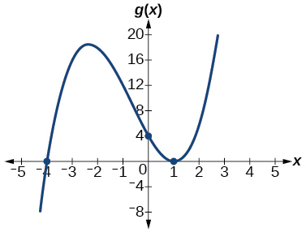

44. $h\left(x\right)={\left(x-1\right)}^{3}{\left(x+3\right)}^{2}$

45. $k\left(x\right)={\left(x-3\right)}^{3}{\left(x-2\right)}^{2}$

Solution

*x*-intercepts $(3,0)$ with multiplicity 3, $(2,0)$ with multiplicity 2, $y\text{-}$ intercept $(0,\u2013108).$ As $x\to -\infty ,\phantom{\rule{0.2em}{0ex}}f(x)\to -\infty ,\phantom{\rule{0.2em}{0ex}}\text{as}\phantom{\rule{0.2em}{0ex}}x\to \infty ,\phantom{\rule{0.2em}{0ex}}f(x)\to \infty .$

  

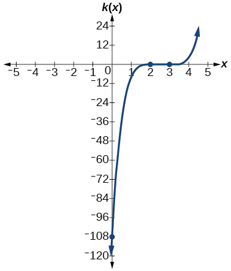

46. $m\left(x\right)=-2x\left(x-1\right)(x+3)$

47. $n\left(x\right)=-3x\left(x+2\right)(x-4)$

Solution

*x*-intercepts $\left(0,\ 0\right),\phantom{\rule{0.5em}{0ex}}\text{}\left(\u20132,\ 0\right),\phantom{\rule{0.5em}{0ex}}\text{}\left(4,0\right)$
with multiplicity 1, $y\text{-}$ intercept $(0,\ 0).$ As
 $x\to -\infty ,\phantom{\rule{0.2em}{0ex}}f(x)\to \infty ,\phantom{\rule{0.2em}{0ex}}\text{as}\phantom{\rule{0.2em}{0ex}}x\to \infty ,\phantom{\rule{0.2em}{0ex}}f(x)\to -\infty .$

  

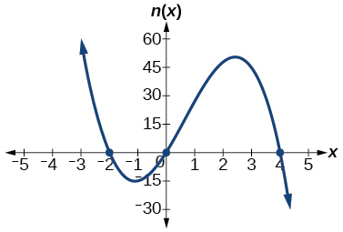

For the following exercises, use the graphs to write the formula for a polynomial function of least degree.
48. 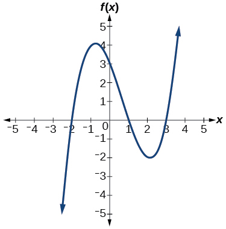

49. 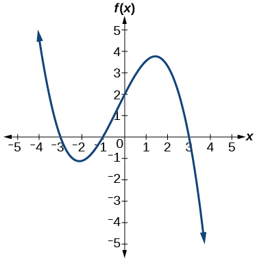

Solution

$f(x)=-\frac{2}{9}(x-3)(x+1)(x+3)$

50. 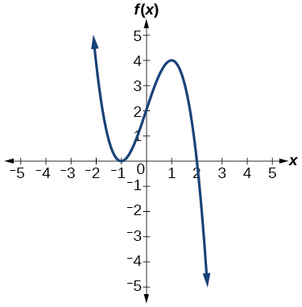

51. 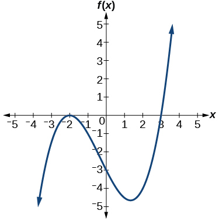

Solution

$f(x)=\frac{1}{4}{(x+2)}^{2}(x-3)$

52. 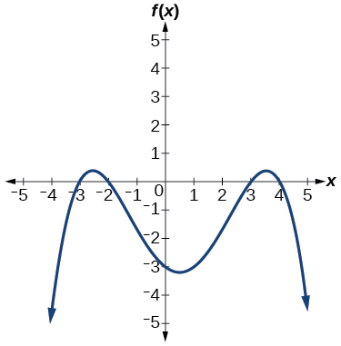

For the following exercises, use the graph to identify zeros and multiplicity.
53. 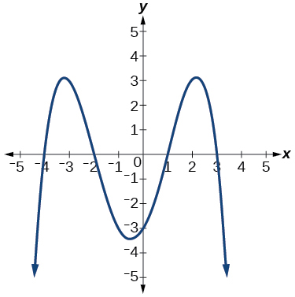

Solution

–4, –2, 1, 3 with multiplicity 1

54. 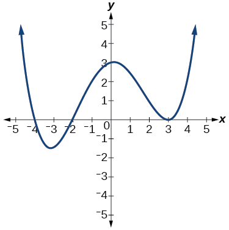

55. 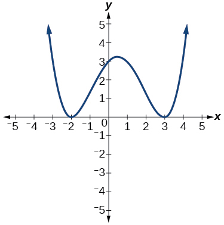

Solution

–2, 3 each with multiplicity 2

56. 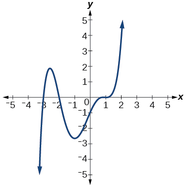

For the following exercises, use the given information about the polynomial graph to write the equation.
57. Degree 3. Zeros at $x=\mathrm{\u20132,}$  $x=\mathrm{1,}$ and $x=3.$ *y*-intercept at $(0,\mathrm{\u20134}).$

Solution

$f(x)=-\frac{2}{3}(x+2)(x-1)(x-3)$

58. Degree 3.  Zeros at $x=\text{\u20135,}$  $x=\mathrm{\u20132},$ and $x=1.$ *y*-intercept at $(0,6)$

59. Degree 5.  Roots of multiplicity 2 at $x=3$ and $x=1$ , and a root of multiplicity 1 at $x=\mathrm{\u20133.}$ *y*-intercept at $(0,9)$

Solution

$f(x)=\frac{1}{3}{(x-3)}^{2}{(x-1)}^{2}(x+3)$

60. Degree 4.  Root of multiplicity 2 at $x=\mathrm{4,}$ and a roots of multiplicity 1 at $x=1$ and $x=\mathrm{\u20132.}$ *y*-intercept at $(0,\text{\u2013}3).$

61. Degree 5.  Double zero at $x=1,$ and triple zero at $x=3.$ Passes through the point $(2,15).$

Solution

$f(x)=\mathrm{-15}{(x-1)}^{2}{(x-3)}^{3}$

62. Degree 3. Zeros at $x=4,$ $x=3,$ and $x=2.$ *y*-intercept at $\left(0,\mathrm{-24}\right).$

63. Degree 3. Zeros at $x=\mathrm{-3},$  $x=\mathrm{-2}$ and $x=1.$ *y*-intercept at $(0,12).$

Solution

$f(x)=-2\left(x+3\right)\left(x+2\right)\left(x-1\right)$

64. Degree 5. Roots of multiplicity 2 at $x=\mathrm{-3}$ and $x=2$ and a root of multiplicity 1 at $x=\mathrm{-2.}$   *y*-intercept at $\left(0,\ 4\right).$

65. Degree 4. Roots of multiplicity 2 at $x=\frac{1}{2}$ and roots of multiplicity 1 at $x=6$ and $x=\mathrm{-2.}$   *y*-intercept at $\left(\mathrm{0,}18\right).$

Solution

$f(x)=-\frac{3}{2}{\left(2x-1\right)}^{2}\left(x-6\right)\left(x+2\right)$

66. Double zero at $x=\mathrm{-3}$ and triple zero at $x=0.$ Passes through the point $(1,32).$

## Technology
For the following exercises, use a calculator to approximate local minima and maxima or the global minimum and maximum.
67. $f(x)={x}^{3}-x-1$

Solution

local max $\left(\u2013\text{.58,\ \u2013}.62\right),$
local min $\left(\text{.58,\ \u20131}\text{.38}\right)$

68. $f(x)=2{x}^{3}-3x-1$

69. $f(x)={x}^{4}+x$

Solution

global min $\left(\u2013\text{.63,\ \u2013}\text{.47}\right)$

70. $f(x)=-{x}^{4}+3x-2$

71. $f(x)={x}^{4}-{x}^{3}+1$

Solution

global min $\text{(}\text{.75,\}\text{.89)}$

## Extensions
For the following exercises, use the graphs to write a polynomial function of least degree.
72. 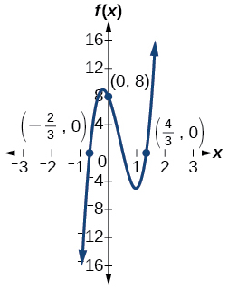

73. 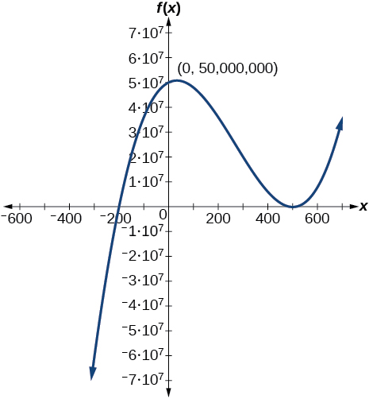

Solution

$f(x)={(x-500)}^{2}(x+200)$

74. 

## Real-World Applications
For the following exercises, write the polynomial function that models the given situation.
75. A rectangle has a length of 10 units and a width of 8 units. Squares of $x$ by $x$ units are cut out of each corner, and then the sides are folded up to create an open box. Express the volume of the box as a polynomial function in terms of $x.$

Solution

$f(x)=4{x}^{3}-36{x}^{2}+80x$

76. Consider the same rectangle of the preceding problem. Squares of $2x$ by $2x$ units are cut out of each corner. Express the volume of the box as a polynomial in terms of $x.$

77. A square has sides of 12 units. Squares $x\text{}+1$ by $x\text{}+1$ units are cut out of each corner, and then the sides are folded up to create an open box. Express the volume of the box as a function in terms of $x.$

Solution

$f(x)=4{x}^{3}-36{x}^{2}+60x+100$

78. A cylinder has a radius of $x+2$ units and a height of 3 units greater. Express the volume of the cylinder as a polynomial function.

79. A right circular cone has a radius of $3x+6$ and a height 3 units less. Express the volume of the cone as a polynomial function. The volume of a cone is $V=\frac{1}{3}\pi {r}^{2}h$ for radius $r$ and height $h.$

Solution

$f(x)=9\pi ({x}^{3}+5{x}^{2}+8x+4)$

    **global maximum**   highest turning point on a graph; $f(a)$
where $f(a)\ge f(x)$
for all $x.$ 

    **global minimum**   lowest turning point on a graph; $f(a)$
where $f(a)\le f(x)$
for all $x.$ 
**Intermediate Value Theorem** for two numbers $a$
and $b$
in the domain of $f,$
if $a<b$
and $f\left(a\right)\ne f\left(b\right),$
then the function $f$
takes on every value between $f\left(a\right)$
and $f\left(b\right)$ ; specifically, when a polynomial function changes from a negative value to a positive value, the function must cross the $x\text{-}$ axis
    **multiplicity**  the number of times a given factor appears in the factored form of the equation of a polynomial; if a polynomial contains a factor of the form ${(x-h)}^{p}$ , $x=h$ is a zero of multiplicity $p.$
