**Dividing Polynomials**

  m51277
  

**Dividing Polynomials**

  In this section, you will:

Use long division to divide polynomials.
Use synthetic division to divide polynomials.

  11f2bd05-8eff-4fb8-9e06-02a657fbb031

  
## Learning Objectives

Dividing polynomials using long division (IA 5.4.3)
Dividing polynomials using synthetic division (IA 5.4.4)

## Objective 1: Dividing polynomials using long division (IA 5.4.3)
To divide a polynomial by a binomial, we follow a procedure very similar to long division of numbers. So, let’s look carefully at the steps we take when we divide a 3-digit number, 875, by a 2-digit number, 25.

1. **Long division of numbers**    ![This figure shows the long division of 875 divided by 25. 875 is labeled dividend and 25 is labeled divisor. The result of 35 is labeled quotient. The 3 in 35 is determined from the number of times we can divide 25 into 87. Multiplying 25 and 3 results in 75. 75 is subtracted from 87 to get 12. The 5 from 875 is dropped down to make 12 into 125. The 5 in 35 is determined from the number of times was can divide 25 into 125. Since 25 goes into 125 evenly there is no remainder. The result of subtracting 125 from 125 is 0 which is labeled remainder.](../../media/CNX_IntAlg_Figure_05_04_001_img_new.jpg)   When we divided 875 by 25, we had no remainder. But sometimes division of numbers does leave a remainder.

### Practice Makes Perfect
Vocabulary of the example. 
Fill in the blanks.
2. When dividing 69 by 4,  the *dividend* is_________,  the *divisor* is________,     the *quotient* is________,  and the *remainder* is________. We check division by multiplying the quotient by the divisor and adding the remainder.

3. **Dividing of polynomials has very similar steps to the numerical example above.**   Find the quotient: $\left({x}^{2}+9x+20\right)\xf7\left(x+5\right).$

Solution

|  | 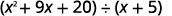 |
| :--- | :--- |
| Write it as a long division problem.Be sure the dividend is written in descending order of powers, with no missing terms. |  |
| Divide ${x}^{2}$ by $x.$ It may help to ask yourself, “What do I needto multiply $x$ by to get ${x}^{2}$ ?” |  |
| Put the answer, $x,$ in the quotient over the $x$ term.Multiply $x$ times $x+5.$ Line up the like terms under the dividend. | 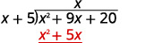 |
| Subtract ${x}^{2}+5x$ from ${x}^{2}+9x.$ You may find it easier to change the signs and then add.Then bring down the last term, 20. | 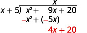 |
| Divide $4x$ by $x.$ It may help to ask yourself, “What do Ineed to multiply $x$ by to get $4x$ ?”Put the answer, $4$ , in the quotient over the constant term. | 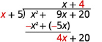 |
| Multiply 4 times $x+5.$ | 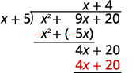 |
| Subtract $4x+20$ from $4x+20.$ | 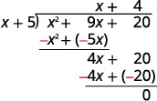 |
| Check:Multiply the quotient by the divisor. $\phantom{\rule{1em}{0ex}}\left(x+4\right)\left(x+5\right)$ You should get the dividend. $\phantom{\rule{4em}{0ex}}{x}^{2}+9x+20\u2713$ |  |

### Practice Makes Perfect
4. Divide using long division of polynomials: $({x}^{2}+10x+21)\xf7(x+3)$

Sometimes division of polynomials, just like division of numbers, leaves a remainder. We write the *remainder* as a fraction with the divisor as the denominator.

Also, if you look back at the dividends in previous examples, you will notice that the terms were written in *descending order of degrees*, and there were *no missing degrees*.

5. **Dividing polynomials using long division.**       $(5x+{x}^{4}-{x}^{2}-6)\xf7(x+2)$

Solution

Notice, this polynomial is not in descending order and it is missing ${x}^{3}$ term. We need to write it in the correct order and add $0{x}^{3}$ as a placeholder.
  

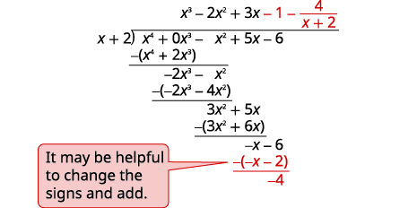

To check, multiply divisor by the quotient and add remainder $(x+2)({x}^{3}-2{x}^{2}+3x-1)-4$ 

The result should be ${x}^{4}-{x}^{2}+5x-6$

### Practice Makes Perfect

Dividing polynomials using long division.

6. $(7x+{x}^{4}-7{x}^{2}+6)\xf7(x+3)$

7. $({x}^{3}-8)\xf7(x-2)$

## Objective 2: Dividing polynomials using synthetic division (IA 5.4.4)
As you probably noticed, long division can be tedious. Synthetic division uses the patterns from long division as a basis to make a process much simpler by leaving the variable terms out. The same example in synthetic division format is shown next.

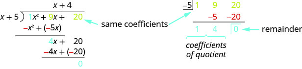

Synthetic division only works when the divisor is of the form (x−c).

8. Use synthetic division to find the quotient and remainder when ${x}^{4}-16{x}^{2}+3x+12$ is divided by x+4. Note that the divisor is in the form x-(-4), so use c as the divisor.

Solution

The polynomial ${x}^{4}-16{x}^{2}+3x+12$ has its term in order with descending degree but we notice there is no x3term. We will add a 0 as a placeholder for the ${x}^{3}$ term.
  

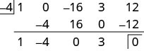

We divided a 4th degree polynomial by a 1st degree polynomial so the quotient will be a 3rd degree polynomial. Reading from the third row, the quotient has the coefficients 1,−4,0, and 3, which is ${x}^{3}-4{x}^{2}+0x+3\$ . The remainder is 0.

### Practice Makes Perfect

Dividing polynomials using synthetic division.

9. Let $f\left(x\right)={x}^{4}-5{x}^{2}+4x+12$     ⓐ Find $f\left(2\right)$  ⓑ Divide $f\left(x\right)$ by $(x-2)$ . What is the quotient? What is the remainder?

10. Let $f\left(x\right)={x}^{3}+2{x}^{2}-5x-6$     ⓐ Find $f\left(\mathrm{-3}\right)$  ⓑ Divide $f\left(x\right)$ by $(x+3)$ . What is the quotient? What is the remainder? What is the connection between $f\left(c\right)$ and the remainder when $f\left(x\right)$ is divided by $(x-c)$ ? Summarize your findings.

The exterior of the Lincoln Memorial in Washington, D.C., is a large rectangular solid with length 61.5 meters (m), width 40 m, and height 30 m.National Park Service. "Lincoln Memorial Building Statistics." http://www.nps.gov/linc/historyculture/lincoln-memorial-building-statistics.htm. Accessed 4/3/2014 We can easily find the volume using elementary geometry.

 $$
\begin{array}{ccc}  V& =& l\cdot w\cdot h  \\ & =& 61.5\cdot 40\cdot 30  \\ & =& \mathrm{73,800}  \end{array}
$$
So the volume is 73,800 cubic meters $\left(\text{m}\xb3\right).$
   Suppose we knew the volume, length, and width. We could divide to find the height.

 $$
\begin{array}{ccc}  h& =& \frac{V}{l\cdot w}  \\ & =& \frac{\mathrm{73,800}}{61.5\cdot 40}  \\ & =& 30  \end{array}
$$
As we can confirm from the dimensions above, the height is 30 m. We can use similar methods to find any of the missing dimensions. We can also use the same method if any, or all, of the measurements contain variable expressions. For example, suppose the volume of a rectangular solid is given by the polynomial $3{x}^{4}-3{x}^{3}-33{x}^{2}+54x.$
   The length of the solid is given by $3x;$
   the width is given by $x-2.$    To find the height of the solid, we can use polynomial division, which is the focus of this section.

# Using Long Division to Divide Polynomials
We are familiar with the **long division** algorithm for ordinary arithmetic. We begin by dividing into the digits of the dividend that have the greatest place value. We divide, multiply, subtract, include the digit in the next place value position, and repeat. For example, let’s divide 178 by 3 using long division.

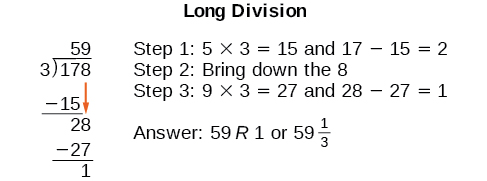

Another way to look at the solution is as a sum of parts. This should look familiar, since it is the same method used to check division in elementary arithmetic.

 $$
\begin{array}{ccc}  \text{dividend}& =& (\text{divisor}\cdot \text{quotient)\ +\ remainder}  \\   178& =& (3\cdot 59)+1  \\ & =& 177+1  \\ & =& 178  \end{array}
$$
We call this the *Division Algorithm*and will discuss it more formally after looking at an example.
Division of polynomials that contain more than one term has similarities to long division of whole numbers. We can write a polynomial dividend as the product of the divisor and the quotient added to the remainder. The terms of the polynomial division correspond to the digits (and place values) of the whole number division. This method allows us to divide two polynomials. For example, if we were to divide $2{x}^{3}-3{x}^{2}+4x+5$     by $x+2$     using the long division algorithm, it would look like this:

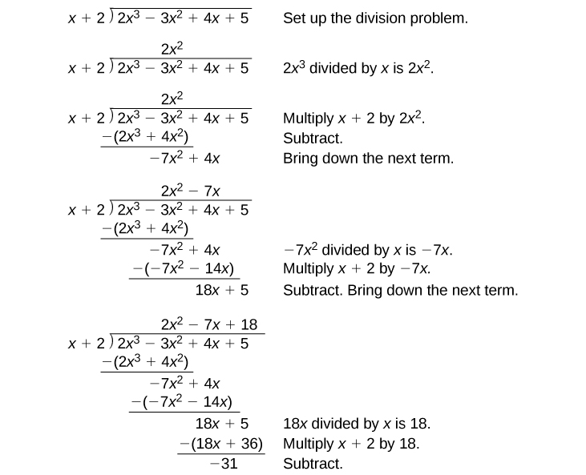

We have found
 $$
\frac{2{x}^{3}-3{x}^{2}+4x+5}{x+2}=2{x}^{2}-7x+18-\frac{31}{x+2}
$$
   or
$2{x}^{3}-3{x}^{2}+4x+5=(x+2)(2{x}^{2}-7x+18)-31$
We can identify the **dividend**, the **divisor**, the **quotient**, and the **remainder**.

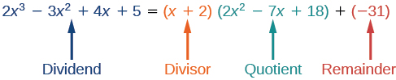

Writing the result in this manner illustrates the Division Algorithm.

>
>
> **The Division Algorithm**
>
>
>
>     The **Division Algorithm** states that, given a polynomial dividend $f(x)$      and a non-zero polynomial divisor $d(x)$
>      where the degree of $d(x)$
>      is less than or equal to the degree of $f(x)$ , there exist unique polynomials $q(x)$
>      and $r(x)$
>      such that
>
>
>      $f(x)=d(x)q(x)+r(x)$
>
>      $q(x)$      is the quotient and $r(x)$
>      is the remainder. The remainder is either equal to zero or has degree strictly less than $d(x).$
>
>
>     If $r(x)=0,$      then $d(x)$
>      divides evenly into $f(x).$
>      This means that, in this case, both $d(x)$
>      and $q(x)$
>      are factors of $f(x).$
>
>
>

> How To
>     *Given a polynomial and a binomial, use long division to divide the polynomial by the binomial.*
>
>
>
>
> Set up the division problem.
>      Determine the first term of the quotient by dividing the leading term of the dividend by the leading term of the divisor.
>      Multiply the answer by the divisor and write it below the like terms of the dividend.
>      Subtract the bottom **binomial** from the top binomial.
>      Bring down the next term of the dividend.
>      Repeat steps 2–5 until reaching the last term of the dividend.
>      If the remainder is non-zero, express as a fraction using the divisor as the denominator.
>

11. **Using Long Division to Divide a Second-Degree Polynomial**         Divide $5{x}^{2}+3x-2$        by $x+1.$

Solution

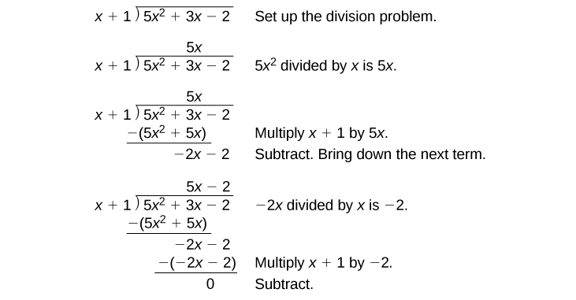

The quotient is $5x-2.$
      The remainder is 0. We write the result as

 $\frac{5{x}^{2}+3x-2}{x+1}=5x-2$

     or

 $5{x}^{2}+3x-2=\left(x+1\right)\left(5x-2\right)$

    12. **Using Long Division to Divide a Third-Degree Polynomial**         Divide $6{x}^{3}+11{x}^{2}-31x+15$ by $3x-2.$

Solution

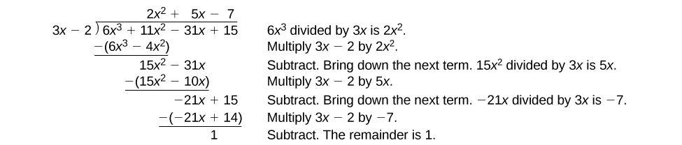

There is a remainder of 1. We can express the result as:

 $$
\frac{6{x}^{3}+11{x}^{2}-31x+15}{3x-2}=2{x}^{2}+5x-7+\frac{1}{3x-2}
$$

>
>     Try It
>     13. Divide $16{x}^{3}-12{x}^{2}+20x-3$ by $4x+5.$
>
> 

> 
Solution

>
> $4{x}^{2}-8x+15-\frac{78}{4x+5}$
> 

>
>
>

# Using Synthetic Division to Divide Polynomials
As we’ve seen, long division of polynomials can involve many steps and be quite cumbersome. *Synthetic division* is a shorthand method of dividing polynomials for the special case of dividing by a linear factor whose leading coefficient is 1.
To illustrate the process, recall the example at the beginning of the section.
Divide $2{x}^{3}-3{x}^{2}+4x+5$
by $x+2$
using the long division algorithm.
The final form of the process looked like this:

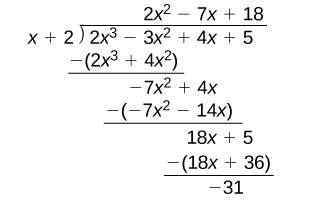

There is a lot of repetition in the table. If we don’t write the variables but, instead, line up their coefficients in columns under the division sign and also eliminate the partial products, we already have a simpler version of the entire problem.

Synthetic division carries this simplification even a few more steps. Collapse the table by moving each of the rows up to fill any vacant spots. Also, instead of dividing by 2, as we would in division of whole numbers, then multiplying and subtracting the middle product, we change the sign of the “divisor” to –2, multiply and add. The process starts by bringing down the leading coefficient.

We then multiply it by the “divisor” and add, repeating this process column by column, until there are no entries left. The bottom row represents the coefficients of the quotient; the last entry of the bottom row is the remainder. In this case, the quotient is $2{x}^{2}\u20137x+18$ and the remainder is $\mathrm{\u201331.}$
The process will be made more clear in .

>
>
>
>
> **Synthetic Division**
>
>
>      Synthetic division is a shortcut that can be used when the divisor is a binomial in the form $x-k$ where $k$ is a real number.
>
> In **synthetic division**, only the coefficients are used in the division process.

>
>      How To
>      *Given two polynomials, use synthetic division to divide.*
>
>
>
>       Write $k$
> for the divisor.
>      Write the coefficients of the dividend.
>      Bring the lead coefficient down.
>      Multiply the lead coefficient by $k.$
> Write the product in the next column.
>      Add the terms of the second column.
>      Multiply the result by $k.$
> Write the product in the next column.
>      Repeat steps 5 and 6 for the remaining columns.
>      Use the bottom numbers to write the quotient. The number in the last column is the remainder. The next number from the right has degree 0, the next number has degree 1, and so on.
>
>

     14. **Using Synthetic Division to Divide a Second-Degree Polynomial**          Use synthetic division to divide $5{x}^{2}-3x-36$ by $x-3.$

Solution

Begin by setting up the synthetic division. Write $k$
and the coefficients.

       

      Bring down the lead coefficient. Multiply the lead coefficient by $k.$

       

      Continue by adding the numbers in the second column. Multiply the resulting number by $k.$
Write the result in the next column. Then add the numbers in the third column.

       

      The result is $5x+12.$
The remainder is 0. So $x-3$
is a factor of the original polynomial.

15. **Using Synthetic Division to Divide a Third-Degree Polynomial**          Use synthetic division to divide $4{x}^{3}+10{x}^{2}-6x-20$ by $x+2.$

Solution

The binomial divisor is $x+2$
so $k=\mathrm{-2.}$
Add each column, multiply the result by –2, and repeat until the last column is reached.

      The result is $4{x}^{2}+2x-10.$
The remainder is 0. Thus, $x+2$
is a factor of $4{x}^{3}+10{x}^{2}-6x-20.$

     16. **Using Synthetic Division to Divide a Fourth-Degree Polynomial**          Use synthetic division to divide $-9{x}^{4}+10{x}^{3}+7{x}^{2}-6$ by $x-1.$

Solution

Notice there is no *x*-term. We will use a zero as the coefficient for that term.

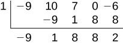

The result is $-9{x}^{3}+{x}^{2}+8x+8+\frac{2}{x-1}.$

>
>      Try It
>      17. Use synthetic division to divide $3{x}^{4}+18{x}^{3}-3x+40$ by $x+7.$
>
> 

> 
Solution

>
> $3{x}^{3}-3{x}^{2}+21x-150+\frac{1,090}{x+7}$
> 

>
>
>

# Using Polynomial Division to Solve Application Problems
Polynomial division can be used to solve a variety of application problems involving expressions for area and volume. We looked at an application at the beginning of this section. Now we will solve that problem in the following example.

18. **Using Polynomial Division in an Application Problem**         The volume of a rectangular solid is given by the polynomial $3{x}^{4}-3{x}^{3}-33{x}^{2}+54x.$ The length of the solid is given by $3x$ and the width is given by $x-2.$ Find the height, $h,$ of the solid.

Solution

There are a few ways to approach this problem. We need to divide the expression for the volume of the solid by the expressions for the length and width. Let us create a sketch as in .

     

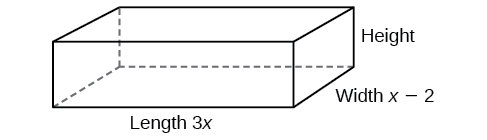

     We can now write an equation by substituting the known values into the formula for the volume of a rectangular solid.

 $$
\begin{array}{ccc}  V& =& l\cdot w\cdot h  \\   3{x}^{4}-3{x}^{3}-33{x}^{2}+54x& =& 3x\cdot (x-2)\cdot h  \end{array}
$$ 
To solve for $h,$ first divide both sides by $3x.$

 $$
\begin{array}{ccc}  \frac{3x\cdot (x-2)\cdot h}{3x}& =& \frac{3{x}^{4}-3{x}^{3}-33{x}^{2}+54x}{3x}  \\   (x-2)h& =& {x}^{3}-{x}^{2}-11x+18  \end{array}
$$ 

Now solve for $h$
using synthetic division.

 $$
h=\frac{{x}^{3}-{x}^{2}-11x+18}{x-2}
$$

The quotient is ${x}^{2}+x-9$
and the remainder is 0. The height of the solid is ${x}^{2}+x-9.$

>
>     Try It
>     19. The area of a rectangle is given by $3{x}^{3}+14{x}^{2}-23x+6.$ The width of the rectangle is given by $x+6.$ Find an expression for the length of the rectangle.
>
> 

> 
Solution

>
> $3{x}^{2}-4x+1$
> 

>
>
>

>
>     Media
>     Access these online resources for additional instruction and practice with polynomial division.
>
> Dividing a Trinomial by a Binomial Using Long Division
>     Dividing a Polynomial by a Binomial Using Long Division 
>
>     Ex 2: Dividing a Polynomial by a Binomial Using Synthetic Division
>
>     Ex 4: Dividing a Polynomial by a Binomial Using Synthetic Division

# Key Equations

| Division Algorithm | $f(x)=d(x)q(x)+r(x)\phantom{\rule{0.5em}{0ex}}\text{where\}q(x)\ne 0$ |
| :--- | :--- |

# Key Concepts
Polynomial long division can be used to divide a polynomial by any polynomial with equal or lower degree. See  and *.*
    The Division Algorithm tells us that a polynomial dividend can be written as the product of the divisor and the quotient added to the remainder.
    Synthetic division is a shortcut that can be used to divide a polynomial by a binomial in the form $x-k.$
See *,**,*and *.*
    Polynomial division can be used to solve application problems, including area and volume. See *.*
    

  
# Section Exercises

## Verbal
1. If division of a polynomial by a binomial results in a remainder of zero, what can be conclude?

Solution

The binomial is a factor of the polynomial.

2. If a polynomial of degree $n$ is divided by a binomial of degree 1, what is the degree of the quotient?

## Algebraic
For the following exercises, use long division to divide. Specify the quotient and the remainder.
3. $\left({x}^{2}+5x-1\right)\xf7\left(x-1\right)$

Solution

$x+6+\frac{5}{x-1}\text{,}\phantom{\rule{0.5em}{0ex}}\text{quotient:}\phantom{\rule{0.5em}{0ex}}x+6\text{,}\phantom{\rule{0.5em}{0ex}}\text{remainder:}\phantom{\rule{0.5em}{0ex}}\text{5}$

4. $\left(2{x}^{2}-9x-5\right)\xf7\left(x-5\right)$

5. $\left(3{x}^{2}+23x+14\right)\xf7\left(x+7\right)$

Solution

$3x+2\text{,}\phantom{\rule{0.5em}{0ex}}\text{quotient:\}3x+2\text{,}\phantom{\rule{0.5em}{0ex}}\text{remainder:\ 0}$

6. $\left(4{x}^{2}-10x+6\right)\xf7\left(4x+2\right)$

7. $\left(6{x}^{2}-25x-25\right)\xf7\left(6x+5\right)$

Solution

$x-5\text{,}\phantom{\rule{0.5em}{0ex}}\text{quotient:}\phantom{\rule{0.5em}{0ex}}x-5\text{,}\phantom{\rule{0.5em}{0ex}}\text{remainder:}\phantom{\rule{0.5em}{0ex}}\text{0}$

8. $\left(-{x}^{2}-1\right)\xf7\left(x+1\right)$

9. $\left(2{x}^{2}-3x+2\right)\xf7\left(x+2\right)$

Solution

$2x-7+\frac{16}{x+2}\text{,}\phantom{\rule{0.5em}{0ex}}\text{quotient:}\text{}\phantom{\rule{0.5em}{0ex}}2x-7\text{,}\phantom{\rule{0.5em}{0ex}}\text{remainder:}\phantom{\rule{0.5em}{0ex}}\text{16}$

10. $\left({x}^{3}-126\right)\xf7\left(x-5\right)$

11. $\left(3{x}^{2}-5x+4\right)\xf7\left(3x+1\right)$

Solution

$x-2+\frac{6}{3x+1}\text{,}\phantom{\rule{0.5em}{0ex}}\text{quotient:}\phantom{\rule{0.5em}{0ex}}x-2\text{,}\phantom{\rule{0.5em}{0ex}}\text{remainder:}\phantom{\rule{0.5em}{0ex}}\text{6}$

12. $\left({x}^{3}-3{x}^{2}+5x-6\right)\xf7\left(x-2\right)$

13. $\left(2{x}^{3}+3{x}^{2}-4x+15\right)\xf7\left(x+3\right)$

Solution

$2{x}^{2}-3x+5\text{,}\phantom{\rule{0.5em}{0ex}}\text{quotient:}\phantom{\rule{0.5em}{0ex}}2{x}^{2}-3x+5\text{,}\phantom{\rule{0.5em}{0ex}}\text{remainder:}\phantom{\rule{0.5em}{0ex}}\text{0}$

For the following exercises, use synthetic division to find the quotient. Ensure the equation is in the form required by synthetic division. (Hint: divide the dividend and divisor by the coefficient of the linear term in the divisor.)
14. $\left(3{x}^{3}-2{x}^{2}+x-4\right)\xf7\left(x+3\right)$

15. $\left(2{x}^{3}-6{x}^{2}-7x+6\right)\xf7(x-4)$

Solution

$2{x}^{2}+2x+1+\frac{10}{x-4}$

16. $\left(6{x}^{3}-10{x}^{2}-7x-15\right)\xf7(x+1)$

17. $\left(4{x}^{3}-12{x}^{2}-5x-1\right)\xf7(2x+1)$

Solution

$2{x}^{2}-7x+1-\frac{2}{2x+1}$

18. $\left(9{x}^{3}-9{x}^{2}+18x+5\right)\xf7(3x-1)$

19. $\left(3{x}^{3}-2{x}^{2}+x-4\right)\xf7\left(x+3\right)$

Solution

$3{x}^{2}-11x+34-\frac{106}{x+3}$

20. $\left(-6{x}^{3}+{x}^{2}-4\right)\xf7\left(2x-3\right)$

21. $\left(2{x}^{3}+7{x}^{2}-13x-3\right)\xf7\left(2x-3\right)$

Solution

${x}^{2}+5x+1$

22. $\left(3{x}^{3}-5{x}^{2}+2x+3\right)\xf7(x+2)$

23. $\left(4{x}^{3}-5{x}^{2}+13\right)\xf7(x+4)$

Solution

$4{x}^{2}-21x+84-\frac{323}{x+4}$

24. $\left({x}^{3}-3x+2\right)\xf7\left(x+2\right)$

25. $\left({x}^{3}-21{x}^{2}+147x-343\right)\xf7\left(x-7\right)$

Solution

${x}^{2}-14x+49$

26. $\left({x}^{3}-15{x}^{2}+75x-125\right)\xf7\left(x-5\right)$

27. $\left(9{x}^{3}-x+2\right)\xf7\left(3x-1\right)$

Solution

$3{x}^{2}+x+\frac{2}{3x-1}$

28. $\left(6{x}^{3}-{x}^{2}+5x+2\right)\xf7\left(3x+1\right)$

29. $\left({x}^{4}+{x}^{3}-3{x}^{2}-2x+1\right)\xf7\left(x+1\right)$

Solution

${x}^{3}-3x+1$

30. $\left({x}^{4}-3{x}^{2}+1\right)\xf7\left(x-1\right)$

31. $\left({x}^{4}+2{x}^{3}-3{x}^{2}+2x+6\right)\xf7\left(x+3\right)$

Solution

${x}^{3}-{x}^{2}+2$

32. $\left({x}^{4}-10{x}^{3}+37{x}^{2}-60x+36\right)\xf7\left(x-2\right)$

33. $\left({x}^{4}-8{x}^{3}+24{x}^{2}-32x+16\right)\xf7\left(x-2\right)$

Solution

${x}^{3}-6{x}^{2}+12x-8$

34. $\left({x}^{4}+5{x}^{3}-3{x}^{2}-13x+10\right)\xf7\left(x+5\right)$

35. $\left({x}^{4}-12{x}^{3}+54{x}^{2}-108x+81\right)\xf7\left(x-3\right)$

Solution

${x}^{3}-9{x}^{2}+27x-27$

36. $\left(4{x}^{4}-2{x}^{3}-4x+2\right)\xf7\left(2x-1\right)$

37. $\left(4{x}^{4}+2{x}^{3}-4{x}^{2}+2x+2\right)\xf7\left(2x+1\right)$

Solution

$2{x}^{3}-2x+2$

For the following exercises, use synthetic division to determine whether the first expression is a factor of the second. If it is, indicate the factorization.
38. $x-2,\phantom{\rule{0.5em}{0ex}}4{x}^{3}-3{x}^{2}-8x+4$

39. $x-2,\phantom{\rule{0.5em}{0ex}}3{x}^{4}-6{x}^{3}-5x+10$

Solution

Yes $\left(x-2\right)(3{x}^{3}-5)$

40. $x+3,\phantom{\rule{0.5em}{0ex}}-4{x}^{3}+5{x}^{2}+8$

41. $x-2,\phantom{\rule{0.5em}{0ex}}4{x}^{4}-15{x}^{2}-4$

Solution

Yes $\left(x-2\right)(4{x}^{3}+8{x}^{2}+x+2)$

42. $x-\frac{1}{2},\phantom{\rule{0.5em}{0ex}}2{x}^{4}-{x}^{3}+2x-1$

43. $x+\frac{1}{3},\phantom{\rule{0.5em}{0ex}}3{x}^{4}+{x}^{3}-3x+1$

Solution

No

## Graphical
For the following exercises, use the graph of the third-degree polynomial and one factor to write the factored form of the polynomial suggested by the graph. The leading coefficient is one.
44. Factor is ${x}^{2}-x+3$     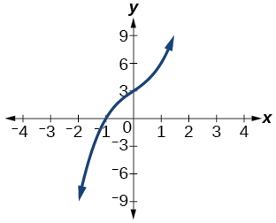

45. Factor is $({x}^{2}+2x+4)$     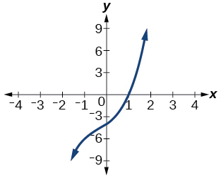

Solution

$(x-1)({x}^{2}+2x+4)$

46. Factor is ${x}^{2}+2x+5$     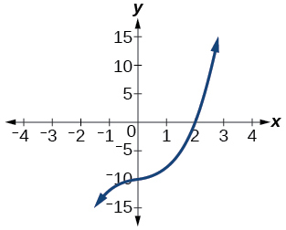

47. Factor is ${x}^{2}+x+1$     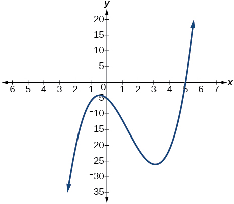

Solution

$(x-5)({x}^{2}+x+1)$

48. Factor is ${x}^{2}+2x+2$     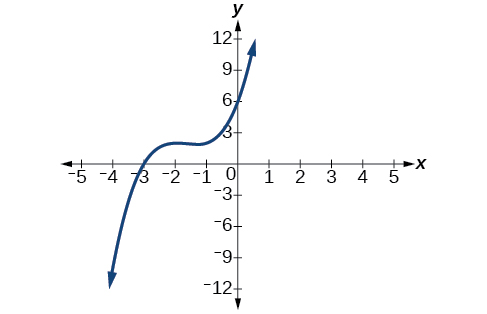

For the following exercises, use synthetic division to find the quotient and remainder.
49. $\frac{4{x}^{3}-33}{x-2}$

Solution

$\text{Quotient:}\phantom{\rule{0.5em}{0ex}}4{x}^{2}+8x+16\text{,}\phantom{\rule{0.5em}{0ex}}\text{remainder:}\phantom{\rule{0.5em}{0ex}}-1$

50. $\frac{2{x}^{3}+25}{x+3}$

51. $\frac{3{x}^{3}+2x-5}{x-1}$

Solution

$\text{Quotient:}\phantom{\rule{0.5em}{0ex}}3{x}^{2}+3x+5\text{,}\phantom{\rule{0.5em}{0ex}}\text{remainder:}\phantom{\rule{0.5em}{0ex}}0$

52. $\frac{-4{x}^{3}-{x}^{2}-12}{x+4}$

53. $\frac{{x}^{4}-22}{x+2}$

Solution

$\text{Quotient:}\phantom{\rule{0.5em}{0ex}}{x}^{3}-2{x}^{2}+4x-8\text{,}\phantom{\rule{0.5em}{0ex}}\text{remainder:}\phantom{\rule{0.5em}{0ex}}-6$

## Technology
For the following exercises, use a calculator with CAS to answer the questions.
54. Consider $\frac{{x}^{k}-1}{x-1}$ with $k=1,\ 2,\ 3.$ What do you expect the result to be if $k=4?$

55. Consider $\frac{{x}^{k}+1}{x+1}$ for $k=1,\ 3,\ 5.$ What do you expect the result to be if $k=7?$

Solution

${x}^{6}-{x}^{5}+{x}^{4}-{x}^{3}+{x}^{2}-x+1$

56. Consider $\frac{{x}^{4}-{k}^{4}}{x-k}$ for $k=1,\ 2,\ 3.$ What do you expect the result to be if $k=4?$

57. Consider $\frac{{x}^{k}}{x+1}$ with $k=1,\ 2,\ 3.$ What do you expect the result to be if $k=4?$

Solution

${x}^{3}-{x}^{2}+x-1+\frac{1}{x+1}$

58. Consider $\frac{{x}^{k}}{x-1}$ with $k=1,\ 2,\ 3.$ What do you expect the result to be if $k=4?$

## Extensions
For the following exercises, use synthetic division to determine the quotient involving a complex number.
59. $\frac{x+1}{x-i}$

Solution

$1+\frac{1+i}{x-i}$

60. $\frac{{x}^{2}+1}{x-i}$

61. $\frac{x+1}{x+i}$

Solution

$1+\frac{1-i}{x+i}$

62. $\frac{{x}^{2}+1}{x+i}$

63. $\frac{{x}^{3}+1}{x-i}$

Solution

${x}^{2}+ix-1+\frac{1-i}{x-i}$

## Real-World Applications
For the following exercises, use the given length and area of a rectangle to express the width algebraically.
64. Length is $x+5,$ area is $2{x}^{2}+9x-5.$

65. Length is $2x\text{}+\text{}5,$ area is $4{x}^{3}+10{x}^{2}+6x+15$

Solution

$2{x}^{2}+3$

66. Length is $3x\u20134,$ area is $6{x}^{4}-8{x}^{3}+9{x}^{2}-9x-4$

For the following exercises, use the given volume of a box and its length and width to express the height of the box algebraically.
67. Volume is $12{x}^{3}+20{x}^{2}-21x-36,$ length is $2x+3,$ width is $3x-4.$

Solution

$2x+3$

68. Volume is $18{x}^{3}-21{x}^{2}-40x+48,$ length is $3x\u20134,$ width is $3x\u20134.$

69. Volume is $10{x}^{3}+27{x}^{2}+2x-24,$ length is $5x\u20134,$ width is $2x+3.$

Solution

$x+2$

70. Volume is $10{x}^{3}+30{x}^{2}-8x-24,$ length is $2,$ width is $x+3.$

For the following exercises, use the given volume and radius of a cylinder to express the height of the cylinder algebraically.
71. Volume is $\pi (25{x}^{3}-65{x}^{2}-29x-3),$ radius is $5x+1.$

Solution

$x-3$

72. Volume is $\pi (4{x}^{3}+12{x}^{2}-15x-50),$ radius is $2x+5.$

73. Volume is $\pi (3{x}^{4}+24{x}^{3}+46{x}^{2}-16x-32),$ radius is $x+4.$

Solution

$3{x}^{2}-2$

 

 
  **Division Algorithm**
  given a polynomial dividend $f(x)$
and a non-zero polynomial divisor $d(x)$
where the degree of $d(x)$
is less than or equal to the degree of $f(x)$ , there exist unique polynomials $q(x)$
and $r(x)$
such that $f(x)=d(x)q(x)+r(x)$
where $q(x)$
is the quotient and $r(x)$
is the remainder. The remainder is either equal to zero or has degree strictly less than $d(x).$

 
  **synthetic division**
  a shortcut method that can be used to divide a polynomial by a binomial of  the form $x-k$
