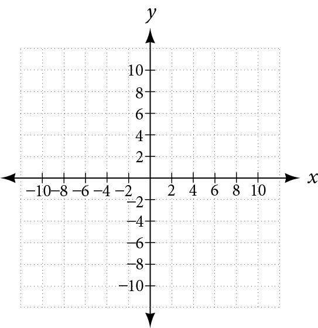

**Zeros of Polynomial Functions**

  m51278
  

**Zeros of Polynomial Functions**

  In this section, you will:

Evaluate a polynomial using the Remainder Theorem.
Use the Factor Theorem to solve a polynomial equation.
Use the Rational Zero Theorem to find rational zeros.
Find zeros of a polynomial function.
Use the Linear Factorization Theorem to find polynomials with given zeros.
Use Descartes’ Rule of Signs.
Solve real-world applications of polynomial equations

  1bb57d2c-789f-4252-bfe4-edc0873f1e29

 
## Learning Objectives
Solve quadratic and higher order equations by factoring (IA 6.5.2)

## Objective 1: Solve quadratic and higher order equations by factoring (IA 6.5.2)
In Section 5.3 we have reviewed how to solve quadratic equations by factoring. Now we will discuss how to use factoring to solve *polynomial equations*.
A **polynomial equation** is an equation that contains a polynomial expression. The **degree of the polynomial equation** is the highest power on any one term of the polynomial.

>
>
> **Vocabulary of Polynomial Functions**
>
>
> Fill in the blanks for the polynomial: ${x}^{3}-{x}^{2}-4x+4$
>
> The **leading coefficient** is ________ and  the **degree** of this polynomial is _________.

1. Solve: $9{m}^{3}+100m=60{m}^{2}.$

Solution

$\begin{array}{cccccc}& & & & & \phantom{\rule{3.7em}{0ex}}9{m}^{3}+100m=60{m}^{2}  \\ \text{Bring all the terms to one side so that the other side is zero.}  & & & & & \phantom{\rule{0.38em}{0ex}}9{m}^{3}-60{m}^{2}+100m=0  \\ \text{Factor the greatest common factor first.}  & & & & & \phantom{\rule{0.35em}{0ex}}m\left(9{m}^{2}-60m+100\right)=0  \\ \text{Factor the trinomial.}  & & & & & m(3m-10)(3m-10)=0  \\ \begin{array}{c}\text{Use the Zero Product Property to set each factor to 0.}  \\ \text{Solve each equation.}  \end{array}  & & & & & \phantom{\rule{0.38em}{0ex}}\begin{array}{ccccccccccccc}m=0  & & & &   3m-10& =  & 0  & & & & 3m-10  & =  & 0  \\ m=0  & & & &   m& =  & \frac{10}{3}  & & & &   m& =  & \frac{10}{3}  \end{array}  \\ \text{Check your answers.}  & & & & & \text{The check is left to you.}  \end{array}$

### Practice Makes Perfect

Solve quadratic and higher order equations by factoring.

2. $8{x}^{3}=24{x}^{2}-18x$

3. $16{x}^{2}=32{x}^{3}+2x$

Solve quadratic and higher order equations by factoring. 
4. ${x}^{3}-{x}^{2}-4x+4=0$

Solution

$\begin{array}{cc}\text{Factor by grouping.}  & {x}^{2}(x-1)-4(x-1)=0  \\ \text{Factor out the common factor.}  & (x-1)({x}^{2}-4)  \\ \text{Factor}\phantom{\rule{0.2em}{0ex}}({x}^{2}-4)\phantom{\rule{0.2em}{0ex}}\text{using difference of squares}  & (x-1)(x-2)(x+2)  \\ \text{By the zero-product property}  & x=1,x=2,x=-2  \end{array}$

> Check the work in the above example using a graph.
>
> 5. Graph $f(x)={x}^{3}-{x}^{2}-4x+4$ below.     
>
> 6. What are the x-intercepts of this function?
>
> 7. What is the connection between these x-intercepts and the solutions of the equation in part b?
>
> 8. The x-intercepts are called solutions or **Zeros of the Function**. Explain why.
>

### Practice Makes Perfect
Solve quadratic and higher order equations by factoring. 
9. ⓐ Solve ${x}^{3}+2{x}^{2}=6x\$ . ⓑ Use your graphing calculator to graph $f(x)={x}^{3}+{x}^{2}-6x$ below.      ⓒ What are the x-intercepts of this function? ⓓ What is the connection between these x-intercepts and the solutions of the equation in part a?

10. $f(x)=3{x}^{3}+9{x}^{2}-12x$   ⓐ Use factoring to find the zeros of the function. These are the x-intercepts of f(x). Plot these points by hand on the graph below.      ⓑ What is the end behavior of this polynomial function? ⓒ Using the x-intercepts and the end behavior, sketch the graph of this function.

11. Find the zeros of the function algebraically. Check by graphing a function on a graphing calculator.     ⓐ $f\left(x\right)=2{x}^{3}-{x}^{2}+8x-4$  ⓑ $f\left(x\right)=3{x}^{3}-12x$  ⓒ $f\left(x\right)=3{x}^{3}+5{x}^{2}-2x$

A new bakery offers decorated, multi-tiered cakes for display and cutting at Quinceañera and wedding celebrations, as well as sheet cakes to serve most of the guests. The bakery wants the volume of a small sheet cake to be 351 cubic inches. The cake is in the shape of a rectangular solid. They want the length of the cake to be four inches longer than the width of the cake and the height of the cake to be one-third of the width. What should the dimensions of the cake pan be?
This problem can be solved by writing a cubic function and solving a cubic equation for the volume of the cake. In this section, we will discuss a variety of tools for writing polynomial functions and solving polynomial equations.

# Evaluating a Polynomial Using the Remainder Theorem
In the last section, we learned how to divide polynomials. We can now use polynomial division to evaluate polynomials using the **Remainder Theorem**. If the polynomial is divided by $x\u2013k,$ the remainder may be found quickly by evaluating the polynomial function at $k,$ that is, $f\left(k\right)$ Let’s walk through the proof of the theorem.
Recall that the **Division Algorithm** states that, given a polynomial dividend $f(x)$ and a non-zero polynomial divisor $d(x)$, there exist unique polynomials $q(x)$ and $r(x)$ such that
 $$
f(x)=d(x)q(x)+r(x)
$$
  and either $r(x)=0$ or the degree of $r(x)$ is less than the degree of $d(x)$. In practice divisors, $d(x)$ will have degrees less than or equal to the degree of $f(x)$. If the divisor, $d(x),$ is $x-k,$ this takes the form
 $$
f(x)=(x-k)q(x)+r
$$
  Since the divisor $x-k$ is linear, the remainder will be a constant, $r.$ And, if we evaluate this for $x=k,$ we have

 $$
\begin{array}{ccc}  f(k)& =& (k-k)q(k)+r  \\ & =& 0\cdot q(k)+r  \\ & =& r  \end{array}
$$
In other words, $f(k)$ is the remainder obtained by dividing $f(x)$ by $x-k.$
  

>
>
>
>
> **The Remainder Theorem**
>
>
>    If a polynomial $f(x)$ is divided by $x-k,$ then the remainder is the value $f(k).$
>

>
>    How To
>    *Given a polynomial function $f,$ evaluate $f\left(x\right)$ at $x=k$ using the Remainder Theorem.*
>
>    Use synthetic division to divide the polynomial by $x-k.$
>
>    The remainder is the value $f(k).$
>
>
>

   12. **Using the Remainder Theorem to Evaluate a Polynomial**        Use the Remainder Theorem to evaluate $f(x)=6{x}^{4}-{x}^{3}-15{x}^{2}+2x-7$       at $x=2.$

Solution

To find the remainder using the Remainder Theorem, use synthetic division to divide the polynomial by $x-2.$
     

The remainder is 25. Therefore, $f(2)=25.$

>
>    Try It
>    13. Use the Remainder Theorem to evaluate $f(x)=2{x}^{5}-3{x}^{4}-9{x}^{3}+8{x}^{2}+2$      at $x=-3.$
>
> 

> 
Solution

>
> $f(-3)=-412$
> 

>
>
>

 
# Using the Factor Theorem to Solve a Polynomial Equation
The *Factor Theorem*is another theorem that helps us analyze polynomial equations. It tells us how the zeros of a polynomial are related to the factors. Recall that the Division Algorithm.
 $$
f(x)=(x-k)q(x)+r
$$
  If $k$
   is a zero, then the remainder $r$
   is $f(k)=0$
   and $f(x)=(x-k)q(x)+0$
   or $f(x)=(x-k)q(x).$
  
Notice, written in this form, $x-k$ is a factor of $f(x).$ We can conclude if $k$
   is a zero of $f(x),$ then $x-k$ is a factor of $f(x).$
  
Similarly, if $x-k$
   is a factor of $f(x),$
   then the remainder of the Division Algorithm $f(x)=(x-k)q(x)+r$
   is 0. This tells us that $k$
   is a zero.
This pair of implications is the Factor Theorem. As we will soon see, a polynomial of degree $n$
   in the complex number system will have $n$
   zeros. We can use the Factor Theorem to completely factor a polynomial into the product of $n$
   factors. Once the polynomial has been completely factored, we can easily determine the zeros of the polynomial.

>
>
>
>
> **The Factor Theorem**
>
>
>    According to the **Factor Theorem**, $k$
>     is a zero of $f(x)$
>     if and only if $(x-k)$
>     is a factor of $f(x).$
>
>
>

>
>    How To
>    *Given a factor and a third-degree polynomial, use the Factor Theorem to factor the polynomial.*
>
>
>   Use synthetic division to divide the polynomial by $(x-k).$
>
>    Confirm that the remainder is 0.
>    Write the polynomial as the product of $(x-k)$ and the quadratic quotient.
>    If possible, factor the quadratic.
>    Write the polynomial as the product of factors.
>

   14. **Using the Factor Theorem to Find the Zeros of a Polynomial Expression**        Show that $(x+2)$       is a factor of ${x}^{3}-6{x}^{2}-x+30.$ Find the remaining factors. Use the factors to determine the zeros of the **polynomial**.

Solution

We can use synthetic division to show that $(x+2)$ is a factor of the polynomial.

The remainder is zero, so $(x+2)$ is a factor of the polynomial. We can use the Division Algorithm to write the polynomial as the product of the divisor and the quotient:

 $$
(x+2)({x}^{2}-8x+15)
$$
We can factor the quadratic factor to write the polynomial as

 $$
(x+2)(x-3)(x-5)
$$

     By the Factor Theorem, the zeros of ${x}^{3}-6{x}^{2}-x+30$ are –2, 3, and 5.

>
>    Try It
>    15. Use the Factor Theorem to find the zeros of $f(x)={x}^{3}+4{x}^{2}-4x-16$      given that $(x-2)$      is a factor of the polynomial.
>
> 

> 
Solution

>
> The zeros are 2, –2, and –4.
> 

>
>
>

 
# Using the Rational Zero Theorem to Find Rational Zeros
Another use for the Remainder Theorem is to test whether a rational number is a zero for a given polynomial. But first we need a pool of rational numbers to test. The **Rational Zero Theorem** helps us to narrow down the number of possible rational zeros using the ratio of the factors of the constant term and factors of the leading **coefficient** of the polynomial
Consider a quadratic function with two zeros, $x=\frac{2}{5}$
   and $x=\frac{3}{4}\phantom{\rule{0.2em}{0ex}}.$
   By the Factor Theorem, these zeros have factors associated with them. Let us set each factor equal to 0, and then construct the original quadratic function absent its stretching factor.

Notice that two of the factors of the constant term, 6, are the two numerators from the original rational roots: 2 and 3. Similarly, two of the factors from the leading coefficient, 20, are the two denominators from the original rational roots: 5 and 4.
We can infer that the numerators of the rational roots will always be factors of the constant term and the denominators will be factors of the leading coefficient. This is the essence of the Rational Zero Theorem; it is a means to give us a pool of possible rational zeros.

>
>
>
>
> **The Rational Zero Theorem**
>
>
>    The **Rational Zero Theorem** states that, if the polynomial $f(x)={a}_{n}{x}^{n}+{a}_{n-1}{x}^{n-1}+\mathrm{...}+{a}_{1}x+{a}_{0}$ has integer coefficients ${a}_{n}\ne 0$, then every rational zero of $f(x)$
>     has the form $\frac{p}{q}$ where $p$ is a factor of the constant term ${a}_{0}$ and $q$ is a factor of the leading coefficient ${a}_{n}.$
>
> When the leading coefficient is 1, the possible rational zeros are the factors of the constant term.
>
>

> How To
>    *Given a polynomial function $f(x),$ use the Rational Zero Theorem to find rational zeros.*
> Determine all factors of the constant term and all factors of the leading coefficient.
>     Determine all possible values of $\frac{p}{q},$ where $p$ is a factor of the constant term and $q$ is a factor of the leading coefficient. Be sure to include both positive and negative candidates.
>     Determine which possible zeros are actual zeros by evaluating each case of $f({\scriptscriptstyle \frac{p}{q}}).$
>
>

   16. **Listing All Possible Rational Zeros**        List all possible rational zeros of $f(x)=2{x}^{4}-5{x}^{3}+{x}^{2}-4.$

Solution

The only possible rational zeros of $f(x)$
      are the quotients of the factors of the last term, –4, and the factors of the leading coefficient, 2. 

     The constant term is –4; the factors of –4 are $p=\mathrm{\pm 1},\mathrm{\pm 2},\mathrm{\pm 4.}$
     

     The leading coefficient is 2; the factors of 2 are $q=\mathrm{\pm 1},\mathrm{\pm 2.}$
     

    If any of the four real zeros are rational zeros, then they will be of one of the following factors of –4 divided by one of the factors of 2.

 $$
\begin{array}{ccc}\frac{p}{q}=\pm \phantom{\rule{0.5em}{0ex}}\frac{1}{1},\phantom{\rule{0.5em}{0ex}}\pm \phantom{\rule{0.5em}{0ex}}\frac{1}{2}\phantom{\rule{0.5em}{0ex}}\text{\ \ \}& \frac{p}{q}=\pm \phantom{\rule{0.5em}{0ex}}\frac{2}{1},\pm \phantom{\rule{0.5em}{0ex}}\frac{2}{2}\phantom{\rule{0.5em}{0ex}}\text{\ \ \}& \frac{p}{q}=\phantom{\rule{0.5em}{0ex}}\pm \phantom{\rule{0.5em}{0ex}}\frac{4}{1},\pm \phantom{\rule{0.5em}{0ex}}\frac{4}{2}\end{array}
$$

Note that $\frac{2}{2}=1$
      and $\frac{4}{2}=2,$ which have already been listed. So we can shorten our list.

 $$
\frac{p}{q}=\frac{\text{Factors\ of\ the\ last}}{\text{Factors\ of\ the\ first}}=\mathrm{\pm 1},\mathrm{\pm 2},\mathrm{\pm 4},\pm \frac{1}{2}
$$

   17. **Using the Rational Zero Theorem to Find Rational Zeros**        Use the Rational Zero Theorem to find the rational zeros of $f(x)=2{x}^{3}+{x}^{2}-4x+1.$

Solution

The Rational Zero Theorem tells us that if $\frac{p}{q}$ is a zero of $f(x),$
      then $p$ is a factor of 1 and $q$ is a factor of 2. 

 $$
\begin{array}{ccc}  \frac{p}{q}& =& \frac{\text{factor\ of\ constant\ term}}{\text{factor\ of\ leading\ coefficient}}  \\ & =& \frac{\text{factor\ of\ 1}}{\text{factor\ of\ 2}}  \end{array}
$$

The factors of 1 are $\mathrm{\pm 1}$ and the factors of 2 are $\mathrm{\pm 1}$ and $\mathrm{\pm 2.}$ The possible values for $\frac{p}{q}$ are $\mathrm{\pm 1}$ and $\pm \frac{1}{2}.$ These are the possible rational zeros for the function. We can determine which of the possible zeros are actual zeros by substituting these values for $x$ in $f(x).$
     

 $$
\begin{array}{ccc}  f(\mathrm{-1})& =& 2{(\mathrm{-1})}^{3}+{(\mathrm{-1})}^{2}-4(\mathrm{-1})+1=4  \\   f(1)& =& 2{(1)}^{3}+{(1)}^{2}-4(1)+1=0  \\ f\left(-\frac{1}{2}\right)  & =& 2{\left(-\frac{1}{2}\right)}^{3}+{\left(-\frac{1}{2}\right)}^{2}-4\left(-\frac{1}{2}\right)+1=3  \\   f\left(\frac{1}{2}\right)& =& 2{\left(\frac{1}{2}\right)}^{3}+{\left(\frac{1}{2}\right)}^{2}-4\left(\frac{1}{2}\right)+1=-\frac{1}{2}  \end{array}
$$
Of those, $\mathrm{-1,}-\frac{1}{2},\phantom{\rule{0.5em}{0ex}}\text{and\}\frac{1}{2}$ are not zeros of $f(x).$ 1 is the only rational zero of $f(x).$

>
>    Try It
>    18. Use the Rational Zero Theorem to find the rational zeros of $f(x)={x}^{3}-5{x}^{2}+2x+1.$
>
> 

> 
Solution

>
> There are no rational zeros.
> 

>
>
>

# Finding the Zeros of Polynomial Functions
The Rational Zero Theorem helps us to narrow down the list of possible rational zeros for a polynomial function. Once we have done this, we can use **synthetic division** repeatedly to determine all of the **zeros** of a polynomial function.

>
>    How To
>    *Given a polynomial function $f,$ use synthetic division to find its zeros.*
>
>     Use the Rational Zero Theorem to list all possible rational zeros of the function.
>    Use synthetic division to evaluate a given possible zero by synthetically dividing the candidate into the polynomial. If the remainder is 0, the candidate is a zero. If the remainder is not zero, discard the candidate.
>    Repeat step two using the quotient found with synthetic division. If possible, continue until the quotient is a quadratic.
>    Find the zeros of the quadratic function. Two possible methods for solving quadratics are factoring and using the quadratic formula.
>
>

   19. **Finding the Zeros of a Polynomial Function with Repeated Real Zeros**        Find the zeros of $f(x)=4{x}^{3}-3x-1.$

Solution

The Rational Zero Theorem tells us that if $\frac{p}{q}$ is a zero of $f(x),$ then $p$
      is a factor of –1 and $q$ is a factor of 4. 

 $$
\begin{array}{ccc}  \frac{p}{q}& =& \frac{\text{factor\ of\ constant\ term}}{\text{factor\ of\ leading\ coefficient}}  \\ & =& \frac{\text{factor\ of\ \u20131}}{\text{factor\ of\ 4}}  \end{array}
$$ The factors of $\mathrm{\u20131}$
      are $\mathrm{\pm 1}$
      and the factors of $4$
      are $\mathrm{\pm 1},\mathrm{\pm 2},$ and $\mathrm{\pm 4.}$ The possible values for $\frac{p}{q}$ are $\mathrm{\pm 1},\phantom{\rule{0.5em}{0ex}}\pm \frac{1}{2},$ and $\pm \frac{1}{4}.$
      These are the possible rational zeros for the function. We will use synthetic division to evaluate each possible zero until we find one that gives a remainder of 0. Let’s begin with 1.

Dividing by $(x-1)$
      gives a remainder of 0, so 1 is a zero of the function. The polynomial can be written as

 $$
(x-1)(4{x}^{2}+4x+1)
$$
The quadratic is a perfect square. $f(x)$
      can be written as

 $$
(x-1){(2x+1)}^{2}
$$
We already know that 1 is a zero. The other zero will have a multiplicity of 2 because the factor is squared. To find the other zero, we can set the factor equal to 0.

 $$
\begin{array}{ccc}  2x+1& =& 0  \\   x& =& -\frac{1}{2}  \end{array}
$$

The zeros of the function are 1 and $-\frac{1}{2}$ with multiplicity 2.

 
# Using the Fundamental Theorem of Algebra
Now that we can find rational zeros for a polynomial function, we will look at a theorem that discusses the number of complex zeros of a polynomial function. The *Fundamental Theorem of Algebra*tells us that every polynomial function has at least one complex zero. This theorem forms the foundation for solving polynomial equations.
Suppose $f$ is a polynomial function of degree four, and $f(x)=0.$ The Fundamental Theorem of Algebra states that there is at least one complex solution, call it ${c}_{1}.$ By the Factor Theorem, we can write $f(x)$ as a product of $x-{c}_{\text{1}}$ and a polynomial quotient. Since $x-{c}_{\text{1}}$ is linear, the polynomial quotient will be of degree three. Now we apply the Fundamental Theorem of Algebra to the third-degree polynomial quotient. It will have at least one complex zero, call it ${c}_{\text{2}}.$ So we can write the polynomial quotient as a product of $x-{c}_{\text{2}}$ and a new polynomial quotient of degree two. Continue to apply the Fundamental Theorem of Algebra until all of the zeros are found. There will be four of them and each one will yield a factor of $f(x).$
  

>
>
> **The Fundamental Theorem of Algebra**
>
>
>    The **Fundamental Theorem of Algebra** states that, if $f(x)$ is a polynomial of degree *n > 0*, then $f(x)$ has at least one complex zero.
> We can use this theorem to argue that, if $f(x)$ is a polynomial of degree $n>0,$ and $a$
>     is a non-zero real number, then $f(x)$ has exactly $n$
>     linear factors
>  $$
> f(x)=a(x-{c}_{1})(x-{c}_{2})\mathrm{...}(x-{c}_{n})
> $$
>    where ${c}_{1},{c}_{2},\mathrm{...},{c}_{n}$ are complex numbers. Therefore, $f(x)$ has $n$ roots if we allow for multiplicities.

>
>    Q&A
>    *Does every polynomial have at least one imaginary zero?*
> *No. Real numbers are a subset of complex numbers, but not the other way around. A complex number is not necessarily imaginary. Real numbers are also complex numbers.*

   20. **Finding the Zeros of a Polynomial Function with Complex Zeros**        Find the zeros of $f(x)=3{x}^{3}+9{x}^{2}+x+3.$

Solution

The Rational Zero Theorem tells us that if $\frac{p}{q}$ is a zero of $f(x),$ then $p$ is a factor of 3 and $q$ is a factor of 3. 

 $$
\begin{array}{ccc}  \frac{p}{q}& =& \frac{\text{factor\ of\ constant\ term}}{\text{factor\ of\ leading\ coefficient}}  \\ & =& \frac{\text{factor\ of\ 3}}{\text{factor\ of\ 3}}  \end{array}
$$

The factors of 3 are $\mathrm{\pm 1}$ and $\mathrm{\pm 3.}$ The possible values for $\frac{p}{q},$ and therefore the possible rational zeros for the function, are $\mathrm{\pm 3},\text{\xb11,\ and\}\pm \frac{1}{3}.$ We will use synthetic division to evaluate each possible zero until we find one that gives a remainder of 0. Let’s begin with –3.

Dividing by $(x+3)$ gives a remainder of 0, so –3 is a zero of the function. The polynomial can be written as
 $$
(x+3)(3{x}^{2}+1)
$$
We can then set the quadratic equal to 0 and solve to find the other zeros of the function.

 $$
\begin{array}{ccc}  3{x}^{2}+1& =& 0  \\   {x}^{2}& =& -\frac{1}{3}  \\   x& =& \pm \sqrt{-\frac{1}{3}}=\pm \frac{i\sqrt{3}}{3}  \end{array}
$$
The zeros of $f(x)$
      are –3 and $\pm \frac{i\sqrt{3}}{3}.$

>
>    Try It
>    21. Find the zeros of $f(x)=2{x}^{3}+5{x}^{2}-11x+4.$
>
> 

> 
Solution

>
> The zeros are $\text{\u20134,\}\frac{1}{2},\phantom{\rule{0.5em}{0ex}}\text{and\ 1}\text{.}$
> 

>
>
>

 
# Using the Linear Factorization Theorem to Find Polynomials with Given Zeros
A vital implication of the **Fundamental Theorem of Algebra**, as we stated above, is that a polynomial function of degree $n$
   will have $n$ zeros in the set of complex numbers, if we allow for multiplicities. This means that we can factor the polynomial function into $n$ factors. The **Linear Factorization Theorem** tells us that a polynomial function will have the same number of factors as its degree, and that each factor will be in the form $(x-c),$ where $c$ is a complex number.
Let $f$
   be a polynomial function with real coefficients, and suppose $a+bi\text{,\}b\ne 0,$
   is a zero of $f(x).$
   Then, by the Factor Theorem, $x-(a+bi)$
   is a factor of $f(x).$
   For $f$
   to have real coefficients, $x-(a-bi)$
   must also be a factor of $f(x).$
   This is true because any factor other than $x-(a-bi),$
   when multiplied by $x-(a+bi),$
   will leave imaginary components in the product. Only multiplication with conjugate pairs will eliminate the imaginary parts and result in real coefficients. In other words, if a polynomial function $f$
   with real coefficients has a complex zero $a+bi,$
   then the complex conjugate $a-bi$
   must also be a zero of $f(x).$ This is called the **Complex Conjugate Theorem**.

>
>    A Genereal Note
>
>
> **Complex Conjugate Theorem**
>
>
>    According to the **Linear Factorization Theorem***,* a polynomial function will have the same number of factors as its degree, and each factor will be in the form $(x-c)$ , where $c$
>     is a complex number.
>
>    If the polynomial function $f$
>     has real coefficients and a complex zero in the form $a+bi,$
>     then the complex conjugate of the zero, $a-bi,$
>     is also a zero.
>
>

>
>    How To
>    *Given the zeros of a polynomial function $f$ and a point (*c*, *f*(*c*)) on the graph of $f,$ use the Linear Factorization Theorem to find the polynomial function.*
> Use the zeros to construct the linear factors of the polynomial.
>    Multiply the linear factors to expand the polynomial.
>     Substitute $\left(c,f\left(c\right)\right)$ into the function to determine the leading coefficient.
>    Simplify.
>

   22. **Using the Linear Factorization Theorem to Find a Polynomial with Given Zeros**        Find a fourth degree polynomial with real coefficients that has zeros of –3, 2, $i,$ such that $f(\mathrm{-2})=100.$

Solution

Because $x=i$
      is a zero, by the Complex Conjugate Theorem $x=\u2013i$
      is also a zero. The polynomial must have factors of $(x+3),\phantom{\rule{0.5em}{0ex}}(x-2),\phantom{\rule{0.5em}{0ex}}(x-i),$ and $(x+i).$ Since we are looking for a degree 4 polynomial, and now have four zeros, we have all four factors. Let’s begin by multiplying these factors.

 $$
\begin{array}{ccc}  f(x)& =& a(x+3)(x-2)(x-i)(x+i)  \\   f(x)& =& a({x}^{2}+x-6)({x}^{2}+1)  \\   f(x)& =& a({x}^{4}+{x}^{3}-5{x}^{2}+x-6)  \end{array}
$$ We need to find *a* to ensure $f(\u20132)=100.$ Substitute $x=\u20132\$ and $f(2)=100$
      into $f(x).$
     

 $$
\begin{array}{ccc}  100& =& a({(\mathrm{-2})}^{4}+{(\mathrm{-2})}^{3}-5{(\mathrm{-2})}^{2}+(\mathrm{-2})-6)  \\   100& =& a(\mathrm{-20})  \\   \mathrm{-5}& =& a  \end{array}
$$ 
So the polynomial function is

 $$
f(x)=\mathrm{-5}({x}^{4}+{x}^{3}-5{x}^{2}+x-6)
$$
or

 $$
f(x)=-5{x}^{4}-5{x}^{3}+25{x}^{2}-5x+30
$$

>
>    Q&A
>    *If $2+3i$
>     were given as a zero of a polynomial with real coefficients, would $2-3i$
>     also need to be a zero?*
> *Yes. When any complex number with an imaginary component is given as a zero of a polynomial with real coefficients, the conjugate must also be a zero of the polynomial.*
>
>

>
>    Try It
>    23. Find a third degree polynomial with real coefficients that has zeros of 5 and $-2i$ such that $f(1)=10.$
>
> 

> 
Solution

>
> $f(x)=-\frac{1}{2}{x}^{3}+\frac{5}{2}{x}^{2}-2x+10$
> 

>
>
>

 
# Using Descartes’ Rule of Signs
There is a straightforward way to determine the possible numbers of positive and negative real zeros for any polynomial function. If the polynomial is written in descending order,*Descartes’ Rule of Signs* tells us of a relationship between the number of sign changes in $f(x)$ and the number of positive real zeros. For example, the polynomial function below has one sign change.

This tells us that the function must have 1 positive real zero.
There is a similar relationship between the number of sign changes in $f(-x)$ and the number of negative real zeros.

In this case, $f(-x)$ has 3 sign changes. This tells us that $f(x)$ could have 3 or 1 negative real zeros.

>
>
>
>
> **Descartes’ Rule of Signs**
>
>
>    According to **Descartes’ Rule of Signs**, if we let $f(x)={a}_{n}{x}^{n}+{a}_{n-1}{x}^{n-1}+\mathrm{...}+{a}_{1}x+{a}_{0}$
>     be a polynomial function with real coefficients:
>
>    The number of positive real zeros is either equal to the number of sign changes of $f(x)$ or is less than the number of sign changes by an even integer.
>     The number of negative real zeros is either equal to the number of sign changes of $f(-x)$ or is less than the number of sign changes by an even integer.
>

24. **Using Descartes’ Rule of Signs**        Use Descartes’ Rule of Signs to determine the possible numbers of positive and negative real zeros for $f(x)=-{x}^{4}-3{x}^{3}+6{x}^{2}-4x-12.$

Solution

Begin by determining the number of sign changes.

     

    There are two sign changes, so there are either 2 or 0 positive real roots. Next, we examine $f(-x)$ to determine the number of negative real roots.

 $$
\begin{array}{ccc}  f(-x)& =& -{(-x)}^{4}-3{(-x)}^{3}+6{(-x)}^{2}-4(-x)-12  \\   f(-x)& =& -{x}^{4}+3{x}^{3}+6{x}^{2}+4x-12  \end{array}
$$

     

    Again, there are two sign changes, so there are either 2 or 0 negative real roots.

    There are four possibilities, as we can see in .

| Positive Real
         Zeros | Negative Real
         Zeros | Complex
         Zeros | Total
         Zeros |
| :--- | :--- | :--- | :--- |
| 2 | 2 | 0 | 4 |
| 2 | 0 | 2 | 4 |
| 0 | 2 | 2 | 4 |
| 0 | 0 | 4 | 4 |

>
>    Try It
>    25. Use Descartes’ Rule of Signs to determine the maximum possible numbers of positive and negative real zeros for $f(x)=2{x}^{4}-10{x}^{3}+11{x}^{2}-15x+12.$      Use a graph to verify the numbers of positive and negative real zeros for the function.
>
> 

> 
Solution

>
> There must be 4, 2, or 0 positive real roots and 0 negative real roots. The graph shows that there are 2 positive real zeros and 0 negative real zeros.
> 

>
>
>

# Solving Real-World Applications
We have now introduced a variety of tools for solving polynomial equations. Let’s use these tools to solve the bakery problem from the beginning of the section.

   26. **Solving Polynomial Equations**        A new bakery offers decorated, multi-tiered cakes for display and cutting at Quinceañera and wedding celebrations, as well as sheet cakes to serve most of the guests. The bakery wants the volume of a small sheet cake to be 351 cubic inches. The cake is in the shape of a rectangular solid. They want the length of the cake to be four inches longer than the width of the cake and the height of the cake to be one-third of the width. What should the dimensions of the cake pan be?

Solution

Begin by writing an equation for the volume of the cake. The volume of a rectangular solid is given by $V=lwh.$ We were given that the length must be four inches longer than the width, so we can express the length of the cake as $l=w+4.$ We were given that the height of the cake is one-third of the width, so we can express the height of the cake as $h=\frac{1}{3}w.$ Let’s write the volume of the cake in terms of width of the cake.

 $$
\begin{array}{ccc}  V& =& (w+4)(w)\left(\frac{1}{3}w\right)  \\   V& =& \frac{1}{3}{w}^{3}+\frac{4}{3}{w}^{2}  \end{array}
$$

    Substitute the given volume into this equation.

 $$
\begin{array}{cccc}  351& =& \frac{1}{3}{w}^{3}+\frac{4}{3}{w}^{2}  & \phantom{\rule{2em}{0ex}}\text{Substitute\ 351\ for\}V.  \\   1053& =& {w}^{3}+4{w}^{2}  & \phantom{\rule{2em}{0ex}}\text{Multiply\ both\ sides\ by\ 3}.  \\   0& =& {w}^{3}+4{w}^{2}-1053  & \phantom{\rule{2em}{0ex}}\text{Subtract\ 1053\ from\ both\ sides}.  \end{array}
$$
Descartes' rule of signs tells us there is one positive solution. The Rational Zero Theorem tells us that the possible rational zeros are $\pm 1,\phantom{\rule{0.5em}{0ex}}\pm 3,\phantom{\rule{0.5em}{0ex}}\pm 9,\phantom{\rule{0.5em}{0ex}}\pm 13,\phantom{\rule{0.5em}{0ex}}\pm 27,\phantom{\rule{0.5em}{0ex}}\pm 39,\phantom{\rule{0.5em}{0ex}}\pm 81,\phantom{\rule{0.5em}{0ex}}\pm 117,\phantom{\rule{0.5em}{0ex}}\pm 351,$
      and $\pm 1053.$
      We can use synthetic division to test these possible zeros. Only positive numbers make sense as dimensions for a cake, so we need not test any negative values. Let’s begin by testing values that make the most sense as dimensions for a small sheet cake. Use synthetic division to check $x=1.$ 

Since 1 is not a solution, we will check $x=3.$
     

Since 3 is not a solution either, we will test $x=9.$
     

Synthetic division gives a remainder of 0, so 9 is a solution to the equation. We can use the relationships between the width and the other dimensions to determine the length and height of the sheet cake pan.

 $l=w+4=9+4=13\phantom{\rule{0.5em}{0ex}}\text{and\}h=\frac{1}{3}w=\frac{1}{3}(9)=3$ 
The sheet cake pan should have dimensions 13 inches by 9 inches by 3 inches.

>
>    Try It
>    27. A shipping container in the shape of a rectangular solid must have a volume of 84 cubic meters. The client tells the manufacturer that, because of the contents, the length of the container must be one meter longer than the width, and the height must be one meter greater than twice the width. What should the dimensions of the container be?
>
> 

> 
Solution

>
> 3 meters by 4 meters by 7 meters
> 

>
>
>

>
>    Media
>    Access these online resources for additional instruction and practice with zeros of polynomial functions.
>
>
>     Real Zeros, Factors, and Graphs of Polynomial Functions
>    Complex Factorization Theorem
>    Find the Zeros of a Polynomial Function
>    Find the Zeros of a Polynomial Function 2
>    Find the Zeros of a Polynomial Function 3
>
>

 
# Key Concepts
To find $f(k),$ determine the remainder of the polynomial $f(x)$ when it is divided by $x-k.$ This is known as the Remainder Theorem. See .
    According to the Factor Theorem, $k$ is a zero of $f(x)$
     if and only if $(x-k)$
     is a factor of $f(x).$ See .
    According to the Rational Zero Theorem, each rational zero of a polynomial function with integer coefficients will be equal to a factor of the constant term divided by a factor of the leading coefficient. See  and .
   When the leading coefficient is 1, the possible rational zeros are the factors of the constant term.
    Synthetic division can be used to find the zeros of a polynomial function. See .
    According to the Fundamental Theorem, every polynomial function has at least one complex zero. See .
   Every polynomial function with degree greater than 0 has at least one complex zero.
    Allowing for multiplicities, a polynomial function will have the same number of factors as its degree. Each factor will be in the form $(x-c),$ where $c$
     is a complex number. See .
   The number of positive real zeros of a polynomial function is either the number of sign changes of the function or less than the number of sign changes by an even integer.
    The number of negative real zeros of a polynomial function is either the number of sign changes of $f(-x)$
     or less than the number of sign changes by an even integer. See .
    Polynomial equations model many real-world scenarios. Solving the equations is easiest done by synthetic division. See .
   

 
# Section Exercises

## Verbal
1. Describe a use for the Remainder Theorem.

Solution

The theorem can be used to evaluate a polynomial.

2. Explain why the Rational Zero Theorem does not guarantee finding zeros of a polynomial function.

3. What is the difference between rational and real zeros?

Solution

Rational zeros can be expressed as fractions whereas real zeros include irrational numbers.

4. If Descartes’ Rule of Signs reveals a no change of signs or one sign of changes, what specific conclusion can be drawn?

5. If synthetic division reveals a zero, why should we try that value again as a possible solution?

Solution

Polynomial functions can have repeated zeros, so the fact that number is a zero doesn’t preclude it being a zero again.

## Algebraic
For the following exercises, use the Remainder Theorem to find the remainder.
6. $\left({x}^{4}-9{x}^{2}+14\right)\xf7\left(x-2\right)$

7. $\left(3{x}^{3}-2{x}^{2}+x-4\right)\xf7\left(x+3\right)$

Solution

$-106$

8. $\left({x}^{4}+5{x}^{3}-4x-17\right)\xf7\left(x+1\right)$

9. $\left(-3{x}^{2}+6x+24\right)\xf7\left(x-4\right)$

Solution

$0$

10. $\left(5{x}^{5}-4{x}^{4}+3{x}^{3}-2{x}^{2}+x-1\right)\xf7\left(x+6\right)$

11. $\left({x}^{4}-1\right)\xf7\left(x-4\right)$

Solution

$255$

12. $\left(3{x}^{3}+4{x}^{2}-8x+2\right)\xf7\left(x-3\right)$

13. $\left(4{x}^{3}+5{x}^{2}-2x+7\right)\xf7\left(x+2\right)$

Solution

$-1$

For the following exercises, use the given factor and the Factor Theorem to find all real zeros for the given polynomial function.
14. $f(x)=2{x}^{3}-9{x}^{2}+13x-6;\phantom{\rule{0.5em}{0ex}}\text{}x-1$

15. $f(x)=2{x}^{3}+{x}^{2}-5x+2;\phantom{\rule{0.5em}{0ex}}\text{}x+2$

Solution

$-2,\ 1,\ \frac{1}{2}$

16. $f(x)=3{x}^{3}+{x}^{2}-20x+12;\phantom{\rule{0.5em}{0ex}}\text{}x+3$

17. $f(x)=2{x}^{3}+3{x}^{2}+x+6;\phantom{\rule{0.5em}{0ex}}x+2$

Solution

$-2$

18. $f(x)=-5{x}^{3}+16{x}^{2}-9;\phantom{\rule{0.5em}{0ex}}x-3$

19. ${x}^{3}+3{x}^{2}+4x+12;\phantom{\rule{0.5em}{0ex}}x+3$

Solution

$-3$

20. $4{x}^{3}-7x+3;\phantom{\rule{0.5em}{0ex}}x-1$

21. $2{x}^{3}+5{x}^{2}-12x-30,\text{}\phantom{\rule{0.5em}{0ex}}2x+5$

Solution

$-\frac{5}{2},\ \sqrt{6},\ -\sqrt{6}$

For the following exercises, use the Rational Zero Theorem to find the real solution(s) to each equation.
22. ${x}^{3}-3{x}^{2}-10x+24=0$

23. $2{x}^{3}+7{x}^{2}-10x-24=0$

Solution

$2,\ -4,\ -\frac{3}{2}$

24. ${x}^{3}+2{x}^{2}-9x-18=0$

25. ${x}^{3}+5{x}^{2}-16x-80=0$

Solution

$4,\ -4,\ -5$

26. ${x}^{3}-3{x}^{2}-25x+75=0$

27. $2{x}^{3}-3{x}^{2}-32x-15=0$

Solution

$5,\ -3,\ -\frac{1}{2}$

28. $2{x}^{3}+{x}^{2}-7x-6=0$

29. $2{x}^{3}-3{x}^{2}-x+1=0$

Solution

$\frac{1}{2},\ \frac{1+\sqrt{5}}{2},\ \frac{1-\sqrt{5}}{2}$

30. $3{x}^{3}-{x}^{2}-11x-6=0$

31. $2{x}^{3}-5{x}^{2}+9x-9=0$

Solution

$\frac{3}{2}$

32. $2{x}^{3}-3{x}^{2}+4x+3=0$

33. ${x}^{4}-2{x}^{3}-7{x}^{2}+8x+12=0$

Solution

$2,\ 3,\ -1,\ -2$

34. ${x}^{4}+2{x}^{3}-9{x}^{2}-2x+8=0$

35. $4{x}^{4}+4{x}^{3}-25{x}^{2}-x+6=0$

Solution

$\frac{1}{2},\ -\frac{1}{2},\ 2,\ -3$

36. $2{x}^{4}-3{x}^{3}-15{x}^{2}+32x-12=0$

37. ${x}^{4}+2{x}^{3}-4{x}^{2}-10x-5=0$

Solution

$-1,\ -1,\ \sqrt{5},\ -\sqrt{5}$

38. $4{x}^{3}-3x+1=0$

39. $8{x}^{{}^{4}}+26{x}^{3}+39{x}^{2}+26x+6$

Solution

$-\frac{3}{4},\ -\frac{1}{2}$

For the following exercises, find all complex solutions (real and non-real).
40. ${x}^{3}+{x}^{2}+x+1=0$

41. ${x}^{3}-8{x}^{2}+25x-26=0$

Solution

$2,\ 3+2i,\ 3-2i$

42. ${x}^{3}+13{x}^{2}+57x+85=0$

43. $3{x}^{3}-4{x}^{2}+11x+10=0$

Solution

$-\frac{2}{3},\ 1+2i,\ 1-2i$

44. ${x}^{4}+2{x}^{3}+22{x}^{2}+50x-75=0$

45. $2{x}^{3}-3{x}^{2}+32x+17=0$

Solution

$-\frac{1}{2},\ 1+4i,\ 1-4i$

## Graphical
For the following exercises, use Descartes’ Rule to determine the possible number of positive and negative solutions. Confirm with the given graph.
46. $f(x)={x}^{3}-1$

47. $f(x)={x}^{4}-{x}^{2}-1$

Solution

1 positive, 1 negative

   

48. $f(x)={x}^{3}-2{x}^{2}-5x+6$

49. $f(x)={x}^{3}-2{x}^{2}+x-1$

Solution

3 or 1 positive, 0 negative

   

50. $f(x)={x}^{4}+2{x}^{3}-12{x}^{2}+14x-5$

51. $f(x)=2{x}^{3}+37{x}^{2}+200x+300$

Solution

0 positive, 3 or 1 negative

  

52. $f(x)={x}^{3}-2{x}^{2}-16x+32$

53. $f(x)=2{x}^{4}-5{x}^{3}-5{x}^{2}+5x+3$

Solution

2 or 0 positive, 2 or 0 negative

   

54. $f(x)=2{x}^{4}-5{x}^{3}-14{x}^{2}+20x+8$

55. $f(x)=10{x}^{4}-21{x}^{2}+11$

Solution

2 or 0 positive, 2 or 0 negative

   

## Numeric
For the following exercises, list all possible rational zeros for the functions.
56. $f(x)={x}^{4}+3{x}^{3}-4x+4$

57. $f(x)=2{x}^{{}^{3}}+3{x}^{2}-8x+5$

Solution

$\pm 5,\ \pm 1,\ \pm \frac{5}{2},\ \pm \frac{1}{2}$

58. $f(x)=3{x}^{{}^{3}}+5{x}^{2}-5x+4$

59. $f(x)=6{x}^{4}-10{x}^{2}+13x+1$

Solution

$\pm 1,\ \pm \frac{1}{2},\ \pm \frac{1}{3},\ \pm \frac{1}{6}$

60. $f(x)=4{x}^{5}-10{x}^{4}+8{x}^{3}+{x}^{2}-8$

## Technology
For the following exercises, use your calculator to graph the polynomial function. Based on the graph, find the rational zeros. All real solutions are rational.
61. $f(x)=6{x}^{3}-7{x}^{2}+1$

Solution

$1,\ \frac{1}{2},\ -\frac{1}{3}$

62. $f(x)=4{x}^{3}-4{x}^{2}-13x-5$

63. $f(x)=8{x}^{3}-6{x}^{2}-23x+6$

Solution

$2,\ \frac{1}{4},\ -\frac{3}{2}$

64. $f(x)=12{x}^{4}+55{x}^{3}+12{x}^{2}-117x+54$

65. $f(x)=16{x}^{4}-24{x}^{3}+{x}^{2}-15x+25$

Solution

$\frac{5}{4}$

## Extensions
For the following exercises, construct a polynomial function of least degree possible using the given information.
66. Real roots: –1, 1, 3 and $\left(2,f\left(2\right)\right)=\left(2,4\right)$

67. Real roots: –1, 1 (with multiplicity 2 and 1) and $\left(2,f\left(2\right)\right)=\left(2,4\right)$

Solution

$f(x)=\frac{4}{9}\left({x}^{3}+{x}^{2}-x-1\right)$

68. Real roots: –2, $\frac{1}{2}$     (with multiplicity 2) and $\left(-3,f\left(-3\right)\right)=\left(-3,5\right)$

69. Real roots: $-\frac{1}{2}$ , 0, $\frac{1}{2}$     and $\left(-2,f\left(-2\right)\right)=\left(-2,6\right)$

Solution

$f(x)=-\frac{1}{5}\left(4{x}^{3}-x\right)$

70. Real roots: –4, –1, 1, 4 and $\left(-2,f\left(-2\right)\right)=\left(-2,10\right)$

## Real-World Applications
For the following exercises, find the dimensions of the box described.
71. The length is twice as long as the width. The height is 2 inches greater than the width. The volume is 192 cubic inches.

Solution

8 by 4 by 6 inches

72. The length, width, and height are consecutive whole numbers. The volume is 120 cubic inches.

73. The length is one inch more than the width, which is one inch more than the height. The volume is 86.625 cubic inches.

Solution

5.5 by 4.5 by 3.5 inches

74. The length is three times the height and the height is one inch less than the width. The volume is 108 cubic inches.

75. The length is 3 inches more than the width. The width is 2 inches more than the height. The volume is 120 cubic inches.

Solution

8 by 5 by 3 inches

For the following exercises, find the dimensions of the right circular cylinder described.
76. The radius is 3 inches more than the height. The volume is $16\pi$ cubic meters.

77. The height is one less than one half the radius. The volume is $72\pi$ cubic meters.

Solution

Radius = 6 meters, Height = 2 meters

78. The radius and height differ by one meter. The radius is larger and the volume is $48\pi$ cubic meters.

79. The radius and height differ by two meters. The height is greater and the volume is $28.125\pi$     cubic meters.

Solution

Radius = 2.5 meters, Height = 4.5 meters

80. The radius is $\frac{1}{3}$ meter greater than the height. The volume is $\frac{98}{9}\pi$     cubic meters.

 **Descartes’ Rule of Signs**
 a rule that determines the maximum possible numbers of positive and negative real zeros based on the number of sign changes of $f(x)$ and $f(-x)$
 

 
  **Factor Theorem**
   $k$ is a zero of polynomial function $f(x)$ if and only if $(x-k)$
   is a factor of $f(x)$ 
 
 
  **Fundamental Theorem of Algebra**
  a polynomial function with degree greater than 0 has at least one complex zero
 
 
  **Linear Factorization Theorem**
  allowing for multiplicities, a polynomial function will have the same number of factors as its degree, and each factor will be in the form $(x-c)$ , where $c$ is a complex number
 
 
  **Rational Zero Theorem**
  the possible rational zeros of a polynomial function have the form $\frac{p}{q}$ where $p$ is a factor of the constant term and $q$ is a factor of the leading coefficient.
 
  **Remainder Theorem**
  if a polynomial $f(x)$ is divided by $x-k$ , then the remainder is equal to the value $f(k)$
