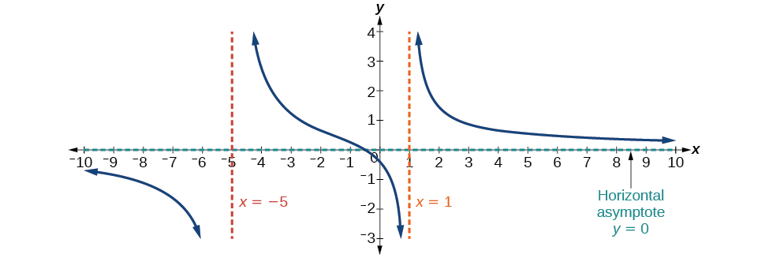
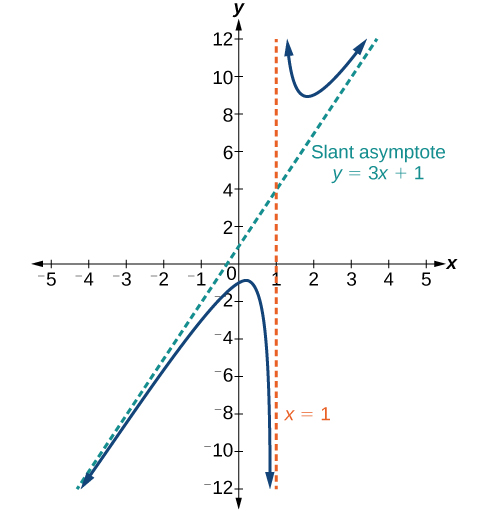
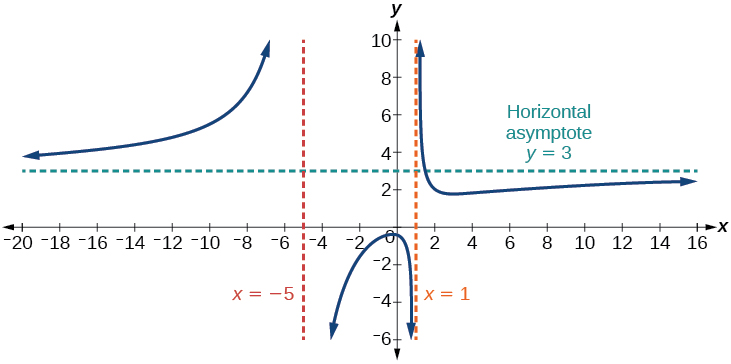

Rational Functions
==================

  m51279
  
Rational Functions
==================

  In this section, you will:

Use arrow notation.
Solve applied problems involving rational functions.
Find the domains of rational functions.
Identify vertical asymptotes.
Identify horizontal asymptotes.
Graph rational functions.

  28d4cfda-bec3-48cf-9695-2cc71939e22a

Learning Objectives
===================
Determine the values for which a rational expression is undefined (IA 7.1.1)
Find x- and y-intercepts (IA 3.1.4)

Objective 1: Determine the values for which a rational expression is undefined (IA 7.1.1)
=========================================================================================

Rational Expression
===================
A rational expression is an expression of the form $$\frac{p}{q},$$ where *p* and *q* are polynomials and $$q\ne 0.$$

Here are some examples of rational expressions:
 $$\begin{array}{cccccccccc}\hfill -\frac{24}{56}\hfill & & & \hfill \phantom{\rule{3em}{0ex}}\frac{5x}{12y}\hfill & & & \hfill \phantom{\rule{3em}{0ex}}\frac{4x+1}{{x}^{2}-9}\hfill & & & \hfill \phantom{\rule{3em}{0ex}}\frac{4{x}^{2}+3x-1}{2x-8}\hfill \end{array}$$ 
Practice Makes Perfect
======================
Evaluate the following expression for the given values $$\frac{5x-10}{x+3}$$

  $$x=3$$

  $$x=2$$

  $$x=-3$$

  Why do we have a problem with evaluating this expression for $$x=\mathrm{-3}$$ but not for $$x=2$$ ?

We say that this rational expression is undefined because its denominator equals 0.
*Determine the values for which a rational expression is undefined.*
Set the denominator equal to zero.
Solve the equation.

  Determine the value for which the rational expression $$\frac{x+3}{2{x}^{2}+9x-5}$$ is undefined

  
    Set the denominator equal to zero
     $$2{x}^{2}+9x-5=0$$ 
  
  
    Solve the equation
    We will solve this quadratic equation by factoring
 $$(2x-1)(x+5)=0$$ 
 $$\begin{array}{ccc}2x-1=0& & x+5=0\\ 2x=1& & x=\mathrm{-5}\\ x=\frac{1}{2}& & \end{array}$$ 
  
  
    Answer:
     Rational expression is undefined when $$x=\frac{1}{2}$$ and $$x=\mathrm{\u20135}$$ 
  

Practice Makes Perfect
======================
Determine the value for which each rational expression is undefined.

  $$\frac{3{y}^{2}}{5x}$$

  $$\frac{3x+5}{2x-3}$$

  $$\frac{m-5}{{m}^{2}+m-6}$$

  $$\frac{2a}{{a}^{2}-9}$$

  Determine the value for which the function $$f(x)=\frac{3}{x-2}$$ is undefined.
 What is the connection between the value you found and the graph of this function?

Because function is not defined at $$x=2$$ , we say that the Domain of this function is $$\left(-\infty ,\ 2\right)\left(2,\ \infty \right)$$

*The domain of a rational function includes all real numbers except those that cause the denominator to equal zero.*

  Determine the domain of the function and express using interval notation.

ⓐ $$f\left(x\right)=\frac{x}{3x-1}$$ 
ⓑ $$f\left(x\right)=\frac{3}{{x}^{2}-5x+6}$$ 

Objective 2: Find $$x$$ - and $$y$$ -intercepts (IA 3.1.4)
==========================================================

Vocabulary
==========

The **$$x$$-intercept** is a point where the graph intersects the ________ axis. The $$y$$-coordinate at this point is always ________.
The **$$y$$-intercept** is a point where the graph intersects the ________ axis. The $$x$$-coordinate at this point is always ________.

*Find the x-intercept and y-intercept of a line.*
Example: $$3x-4y=9$$
Find the $$x$$ -intercept and $$y$$ -intercept of a line.

  
    To find the *$$x$$ -intercept*, replace $$y$$ with zero and find $$x$$ 
    *$$x$$ -int:* $$3x-4(0)=9$$ , $$3x=9$$ , $$x=3$$ 
    *(3, 0)*
  
  
    To find the *$$y$$ -intercept*, replace $$x$$ with zero and find $$y$$ 
    *$$y$$ -int:* $$3(0)\u20134y=9$$ , $$\mathrm{\u20134}y=9$$ , $$y=\frac{\mathrm{\u20139}}{4}$$ 
    *(0, $$\frac{\mathrm{\u20139}}{4}$$ )*
  

\n\n\n\n
Practice Makes Perfect
======================
Find $$x$$ - and $$y$$ -intercept of each of the following functions. Express each as an ordered pair.

  $$3x-2y=6\ $$

  $$y=5x-1$$

  $$y=\frac{1}{(x-2)+3}$$

Suppose we know that the cost of making a product is dependent on the number of items, $$x,$$ produced. This is given by the equation $$C(x)=\mathrm{15,000}x-0.1{x}^{2}+1000.$$ If we want to know the average cost for producing $$x$$ items, we would divide the cost function by the number of items, $$x.$$
The average cost function, which yields the average cost per item for $$x$$ items produced, is

 $$
f(x)=\frac{\mathrm{15,000}x-0.1{x}^{2}+1000}{x}
$$ Many other application problems require finding an average value in a similar way, giving us variables in the denominator. Written without a variable in the denominator, this function will contain a negative integer power.

In the last few sections, we have worked with polynomial functions, which are functions with non-negative integers for exponents. In this section, we explore rational functions, which have variables in the denominator.

Using Arrow Notation
====================

We have seen the graphs of the basic **reciprocal function** and the squared reciprocal function from our study of toolkit functions. Examine these graphs, as shown in , and notice some of their features.

\n\n\n\n

Several things are apparent if we examine the graph of $$f(x)=\frac{1}{x}.$$

	On the left branch of the graph, the curve approaches the *x*-axis $$(y=0)\ \text{as}\ x\to \u2013\infty .$$ 
	As the graph approaches $$x=0$$ from the left, the curve drops, but as we approach zero from the right, the curve rises.
	Finally, on the right branch of the graph, the curves approaches the *x-*axis $$(y=0)\ \text{as}\ x\to \infty .$$ 

To summarize, we use **arrow notation** to show that $$x$$ or $$f(x)$$ is approaching a particular value. See .

Symbol
Meaning

 $$x\to {a}^{-}$$ 
 $$x$$ approaches $$a$$ from the left ( $$x<a$$ but close to $$a$$ )

 $$x\to {a}^{+}$$ 
 $$x$$ approaches $$a$$ from the right ( $$x>a$$ but close to $$a$$ )

 $$x\to \infty $$ 
 $$x$$ approaches infinity ( $$x$$ increases without bound)

 $$x\to -\infty $$ 
 $$x$$ approaches negative infinity ( $$x$$ decreases without bound)

 $$f(x)\to \infty $$ 
the output approaches infinity (the output increases without bound)

 $$f(x)\to -\infty $$ 
the output approaches negative infinity (the output decreases without bound)

 $$f(x)\to a$$ 
the output approaches $$a$$ 

Local Behavior of $$f(x)=\frac{1}{x}$$
======================================
Let’s begin by looking at the reciprocal function, $$f(x)=\frac{1}{x}.$$ We cannot divide by zero, which means the function is undefined at $$x=0;$$ so zero is not in the domain*.* As the input values approach zero from the left side (becoming very small, negative values), the function values decrease without bound (in other words, they approach negative infinity). We can see this behavior in .

*$$x$$*
–0.1
–0.01
–0.001
–0.0001

*$$f(x)=\frac{1}{x}$$*
–10
–100
–1000
–10,000

We write in arrow notation

 $$
\text{as\}x\to {0}^{-},f(x)\to -\infty
$$ As the input values approach zero from the right side (becoming very small, positive values), the function values increase without bound (approaching infinity). We can see this behavior in .

*$$x$$*
0.1
0.01
0.001
0.0001

*$$f(x)=\frac{1}{x}$$*
10
100
1000
10,000

We write in arrow notation

 $$
\text{As\}x\to {0}^{+},\ f(x)\to \infty .
$$ See .

\n\n\n\n

This behavior creates a *vertical asymptote*, which is a vertical line that the graph approaches but never crosses. In this case, the graph is approaching the vertical line $$x=0$$ as the input becomes close to zero. See .

\n\n\n\n

Vertical Asymptote
==================

A **vertical asymptote** of a graph is a vertical line $$x=a$$ where the graph tends toward positive or negative infinity as the input approaches $$a$$ from either the left or the right. We write

 $$\text{As\}x\to {a}^{\u2013},f(x)\to \pm \infty \text{\ or\}x\to {a}^{+},f(x)\to \pm \infty .$$

End Behavior of $$f(x)=\frac{1}{x}$$
====================================
As the values of $$x$$ approach infinity, the function values approach 0. As the values of $$x$$ approach negative infinity, the function values approach 0. See . Symbolically, using arrow notation

$$
\text{As\}x\to \infty ,f(x)\to 0,\text{and\ as\}x\to -\infty ,f(x)\to 0.
$$

\n\n\n\n

Based on this overall behavior and the graph, we can see that the function approaches 0 but never actually reaches 0; it seems to level off as the inputs become large. This behavior creates a *horizontal asymptote*, a horizontal line that the graph approaches as the input increases or decreases without bound. In this case, the graph is approaching the horizontal line $$y=0.$$ See *.*

\n\n\n\n

Horizontal Asymptote
====================

A **horizontal asymptote** of a graph is a horizontal line $$y=b$$ where the graph approaches the line as the inputs increase or decrease without bound. We write

 $$\text{As\}x\to \infty \phantom{\rule{0.5em}{0ex}}\text{or\}x\to -\infty ,\phantom{\rule{0.5em}{0ex}}\text{}f(x)\to b.$$ 

Using Arrow Notation
====================

Use arrow notation to describe the end behavior and local behavior of the function graphed in .

\n\n\n\n

Notice that the graph is showing a vertical asymptote at $$x=2,$$ which tells us that the function is undefined at $$x=2.$$

 $$
\text{As\}x\to {2}^{-},f(x)\to -\infty ,\phantom{\rule{0.5em}{0ex}}\text{and\ as\}x\to {2}^{+},\phantom{\rule{0.5em}{0ex}}\text{}f(x)\to \infty .
$$ 
And as the inputs decrease without bound, the graph appears to be leveling off at output values of 4, indicating a horizontal asymptote at $$y=4.$$ As the inputs increase without bound, the graph levels off at 4.

 $$
\text{As\}x\to \infty ,\phantom{\rule{0.5em}{0ex}}\text{}f(x)\to 4\phantom{\rule{0.5em}{0ex}}\text{and\ as\}x\to -\infty ,\phantom{\rule{0.5em}{0ex}}\text{}f(x)\to 4.
$$ 

Try It

Use arrow notation to describe the end behavior and local behavior for the reciprocal squared function.

End behavior: as $$x\to \pm \infty ,\ f(x)\to 0;$$ Local behavior: as $$x\to 0,\ f(x)\to \infty $$ (there are no *x*- or *y*-intercepts)

Using Transformations to Graph a Rational Function
==================================================

Sketch a graph of the reciprocal function shifted two units to the left and up three units. Identify the horizontal and vertical asymptotes of the graph, if any.

Shifting the graph left 2 and up 3 would result in the function

 $$
f(x)=\frac{1}{x+2}+3
$$ 

or equivalently, by giving the terms a common denominator,

 $$
f(x)=\frac{3x+7}{x+2}
$$ The graph of the shifted function is displayed in .

\n\n\n\n

  Notice that this function is undefined at $$x=\mathrm{-2},$$ and the graph also is showing a vertical asymptote at $$x=\mathrm{-2.}$$
 $$
\text{As\}x\to -{2}^{-},\ f(x)\to -\infty ,\text{and\ as}\ x\to -{2}^{+},\ f(x)\to \infty .
$$ 
As the inputs increase and decrease without bound, the graph appears to be leveling off at output values of 3, indicating a horizontal asymptote at $$y=3.$$

 $$
\text{As\}x\to \pm \infty ,\ f(x)\to 3.
$$ 

Analysis
========

Notice that horizontal and vertical asymptotes are shifted left 2 and up 3 along with the function.

Try It
Sketch the graph, and find the horizontal and vertical asymptotes of the reciprocal squared function that has been shifted right 3 units and down 4 units.

The function and the asymptotes are shifted 3 units right and 4 units down. As $$x\to 3,f(x)\to \infty ,$$ and as $$x\to \pm \infty ,f(x)\to -4.$$

The function is $$f(x)=\frac{1}{{(x-3)}^{2}}-4.$$

Solving Applied Problems Involving Rational Functions
=====================================================

In , we shifted a toolkit function in a way that resulted in the function $$f(x)=\frac{3x+7}{x+2}.$$ This is an example of a rational function. A *rational function* is a function that can be written as the quotient of two polynomial functions. Many real-world problems require us to find the ratio of two polynomial functions. Problems involving rates and concentrations often involve rational functions.

Rational Function
=================

A **rational function** is a function that can be written as the quotient of two polynomial functions $$P(x)\ \text{and}\ Q(x).$$

 $$
f(x)=\frac{P(x)}{Q(x)}=\frac{{a}_{p}{x}^{p}+{a}_{p-1}{x}^{p-1}+\mathrm{...}+{a}_{1}x+{a}_{0}}{{b}_{q}{x}^{q}+{b}_{q-1}{x}^{q-1}+\mathrm{...}+{b}_{1}x+{b}_{0}},Q(x)\ne 0
$$ 

Solving an Applied Problem Involving a Rational Function
========================================================

After running out of pre-packaged supplies, a nurse in a refugee camp is preparing an intravenous sugar solution for patients in the camp hospital. A large mixing tank currently contains 100 gallons of distilled water into which 5 pounds of sugar have been mixed. A tap will open pouring 10 gallons per minute of distilled water into the tank at the same time sugar is poured into the tank at a rate of 1 pound per minute. Find the ratio of sugar to water, in pounds per gallon in the tank after 12 minutes. Is that a greater ratio of sugar to water, in pounds per gallon than at the beginning?

Let $$t$$ be the number of minutes since the tap opened. Since the water increases at 10 gallons per minute, and the sugar increases at 1 pound per minute, these are constant rates of change. This tells us the amount of water in the tank is changing linearly, as is the amount of sugar in the tank. We can write an equation independently for each:

 $$
\begin{array}{ccc}\hfill \text{water:\}W(t)& =& 100+10t\phantom{\rule{0.5em}{0ex}}\text{in\ gallons}\hfill \\ \hfill \text{sugar:\}S(t)& =& 5+1t\phantom{\rule{0.5em}{0ex}}\text{in\ pounds}\hfill \end{array}
$$ 
The ratio of sugar to water, in pounds per gallon, $$C$$ , will be the ratio of pounds of sugar to gallons of water
 $$
C(t)=\frac{5+t}{100+10t}
$$ 
The ratio of sugar to water, in pounds per gallon after 12 minutes is given by evaluating $$C\left(t\right)$$ at $$t=\phantom{\rule{0.5em}{0ex}}\text{}12.$$

 $$
\begin{array}{ccc}\hfill C(12)& =& \frac{5+12}{100+10(12)}\hfill \\ & =& \frac{17}{220}\hfill \end{array}
$$
This means the ratio of sugar to water, in pounds per gallon is 17 pounds of sugar to 220 gallons of water.
At the beginning, the ratio of sugar to water, in pounds per gallon is

 $$
\begin{array}{ccc}\hfill C(0)& =& \frac{5+0}{100+10(0)}\hfill \\ & =& \frac{1}{20}\hfill \end{array}
$$
Since $$\frac{17}{220}\approx 0.08>\frac{1}{20}=0.05,$$ the ratio of sugar to water, in pounds per gallon is greater after 12 minutes than at the beginning.

Try It

There are 1,200 first-year and 1,500 second-year students at a rally at noon. After 12 p.m., 20 first-year students arrive at the rally every five minutes while 15 second-year students leave the rally. Find the ratio of first-year to second-year students at 1 p.m.

$$\frac{12}{11}$$

Finding the Domains of Rational Functions
=========================================

A **vertical asymptote** represents a value at which a rational function is undefined, so that value is not in the domain of the function. A reciprocal function cannot have values in its domain that cause the denominator to equal zero. In general, to find the domain of a rational function, we need to determine which inputs would cause division by zero.

Domain of a Rational Function
=============================

The domain of a rational function includes all real numbers except those that cause the denominator to equal zero.

How To
*Given a rational function, find the domain.*

Set the denominator equal to zero.
Solve to find the *x*-values that cause the denominator to equal zero.
The domain is all real numbers except those found in Step 2.

Finding the Domain of a Rational Function
=========================================

Find the domain of $$f(x)=\frac{x+3}{{x}^{2}-9}.$$

Begin by setting the denominator equal to zero and solving.

 $$
\begin{array}{ccc}\hfill {x}^{2}-9& =& 0\hfill \\ \hfill {x}^{2}& =& 9\hfill \\ \hfill x& =& \mathrm{\pm 3}\hfill \end{array}
$$
The denominator is equal to zero when $$x=\pm 3.$$ The domain of the function is all real numbers except $$x=\pm 3.$$

Analysis
========

A graph of this function, as shown in , confirms that the function is not defined when $$x=\pm 3.$$

\n\n\n\n
There is a vertical asymptote at $$x=3$$ and a hole in the graph at $$x=\mathrm{-3.}$$ We will discuss these types of holes in greater detail later in this section.

Try It

Find the domain of $$f(x)=\frac{4x}{5(x-1)(x-5)}.$$

The domain is all real numbers except $$x=1$$ and $$x=5.$$

Identifying Vertical Asymptotes of Rational Functions
=====================================================

By looking at the graph of a rational function, we can investigate its local behavior and easily see whether there are asymptotes. We may even be able to approximate their location. Even without the graph, however, we can still determine whether a given rational function has any asymptotes, and calculate their location.

Vertical Asymptotes
===================

The vertical asymptotes of a rational function may be found by examining the factors of the denominator that are not common to the factors in the numerator. Vertical asymptotes occur at the zeros of such factors.

How To
*Given a rational function, identify any vertical asymptotes of its graph.*

Factor the numerator and denominator.
Note any restrictions in the domain of the function.
Reduce the expression by canceling common factors in the numerator and the denominator.
Note any values that cause the denominator to be zero in this simplified version. These are where the vertical asymptotes occur.
Note any restrictions in the domain where asymptotes do not occur. These are removable discontinuities, or “holes.”

Identifying Vertical Asymptotes
===============================

Find the vertical asymptotes of the graph of $$k(x)=\frac{5+2{x}^{2}}{2-x-{x}^{2}}.$$

First, factor the numerator and denominator.

 $$
\begin{array}{ccc}\hfill k(x)& =& \frac{5+2{x}^{2}}{2-x-{x}^{2}}\hfill \\ & =& \frac{5+2{x}^{2}}{(2+x)(1-x)}\hfill \end{array}
$$

To find the vertical asymptotes, we determine where this function will be undefined by setting the denominator equal to zero:

 $$
\begin{array}{ccc}\hfill (2+x)(1-x)& =& 0\hfill \\ \hfill x& =& \mathrm{-2},1\hfill \end{array}
$$
Neither $$x=\mathrm{\u20132}$$ nor $$x=1$$ are zeros of the numerator, so the two values indicate two vertical asymptotes. The graph in  confirms the location of the two vertical asymptotes.
\n\n\n\n

Removable Discontinuities
=========================

Occasionally, a graph will contain a hole: a single point where the graph is not defined, indicated by an open circle. We call such a hole a **removable discontinuity**.
For example, the function $$f(x)=\frac{{x}^{2}-1}{{x}^{2}-2x-3}$$ may be re-written by factoring the numerator and the denominator.
 $$
f(x)=\frac{\left(x+1\right)\left(x-1\right)}{\left(x+1\right)\left(x-3\right)}
$$ Notice that $$x+1$$ is a common factor to the numerator and the denominator. The zero of this factor, $$x=\mathrm{-1},$$ is the location of the removable discontinuity. Notice also that $$x\u20133$$ is not a factor in both the numerator and denominator. The zero of this factor, $$x=3,$$ is the vertical asymptote. See . [Note that removable discontinuities may not be visible when we use a graphing calculator, depending upon the window selected.]
\n\n\n\n

Removable Discontinuities of Rational Functions
===============================================

A **removable discontinuity** occurs in the graph of a rational function at $$x=a$$ if $$a$$ is a zero for a factor in the denominator that is common with a factor in the numerator. We factor the numerator and denominator and check for common factors. If we find any, we set the common factor equal to 0 and solve. This is the location of the removable discontinuity. This is true if the multiplicity of this factor is greater than or equal to that in the denominator. If the multiplicity of this factor is greater in the denominator, then there is still an asymptote at that value.

Identifying Vertical Asymptotes and Removable Discontinuities for a Graph
=========================================================================

Find the vertical asymptotes and removable discontinuities of the graph of $$k(x)=\frac{x-2}{{x}^{2}-4}.$$

Factor the numerator and the denominator.

 $$
k(x)=\frac{x-2}{(x-2)(x+2)}
$$ 
Notice that there is a common factor in the numerator and the denominator, $$x\u20132.$$ The zero for this factor is $$x=2.$$ This is the location of the removable discontinuity.

Notice that there is a factor in the denominator that is not in the numerator, $$x+2.$$ The zero for this factor is $$x=\mathrm{-2.}$$ The vertical asymptote is $$x=\mathrm{-2.}$$ See .
\n\n\n\n

The graph of this function will have the vertical asymptote at $$x=\mathrm{-2},$$ but at $$x=2$$ the graph will have a hole.

Try It

Find the vertical asymptotes and removable discontinuities of the graph of $$f(x)=\frac{{x}^{2}-25}{{x}^{3}-6{x}^{2}+5x}.$$

Removable discontinuity at $$x=5.$$ Vertical asymptotes: $$x=0,\phantom{\rule{0.5em}{0ex}}\text{}x=1.$$

Identifying Horizontal Asymptotes of Rational Functions
=======================================================
While vertical asymptotes describe the behavior of a graph as the *output* gets very large or very small, horizontal asymptotes help describe the behavior of a graph as the *input* gets very large or very small. Recall that a polynomial’s end behavior will mirror that of the leading term. Likewise, a rational function’s end behavior will mirror that of the ratio of the function that is the ratio of the leading terms.
There are three distinct outcomes when checking for horizontal asymptotes:

*Case 1:* If the degree of the denominator > degree of the numerator, there is a **horizontal asymptote** at $$y=0.$$
 $$
\text{Example:\}f(x)=\frac{4x+2}{{x}^{2}+4x-5}
$$
In this case, the end behavior is $$f(x)\approx \frac{4x}{{x}^{2}}=\frac{4}{x}.$$ This tells us that, as the inputs increase or decrease without bound, this function will behave similarly to the function $$g(x)=\frac{4}{x},$$ and the outputs will approach zero, resulting in a horizontal asymptote at $$y=0.$$ See . Note that this graph crosses the horizontal asymptote.

\n\n\n\n*Case 2:* If the degree of the denominator < degree of the numerator by one, we get a slant asymptote.
 $$
\text{Example:\}f(x)=\frac{3{x}^{2}-2x+1}{x-1}
$$ In this case, the end behavior is $$f(x)\approx \frac{3{x}^{2}}{x}=3x.$$ This tells us that as the inputs increase or decrease without bound, this function will behave similarly to the function $$g(x)=3x.$$ As the inputs grow large, the outputs will grow and not level off, so this graph has no horizontal asymptote. However, the graph of $$g(x)=3x$$ looks like a diagonal line, and since $$f$$ will behave similarly to $$g,$$ it will approach a line close to $$y=3x.$$ This line is a slant asymptote.

To find the equation of the slant asymptote, divide $$\frac{3{x}^{2}-2x+1}{x-1}.$$ The quotient is $$3x+1,$$ and the remainder is 2. The slant asymptote is the graph of the line $$g(x)=3x+1.$$ See .

\n\n\n\n*Case 3:* If the degree of the denominator = degree of the numerator, there is a horizontal asymptote at $$y=\frac{{a}_{n}}{{b}_{n}},$$ where $${a}_{n}$$ and $${b}_{n}$$ are the leading coefficients of $$p\left(x\right)$$ and $$q\left(x\right)$$ for $$f(x)=\frac{p(x)}{q(x)},q(x)\ne 0.$$
 $$
\text{Example:\}f(x)=\frac{3{x}^{2}+2}{{x}^{2}+4x-5}
$$ In this case, the end behavior is $$f(x)\approx \frac{3{x}^{2}}{{x}^{2}}=3.$$ This tells us that as the inputs grow large, this function will behave like the function $$g(x)=3,$$ which is a horizontal line. As $$x\to \pm \infty ,f(x)\to 3,$$ resulting in a horizontal asymptote at $$y=3.$$ See . Note that this graph crosses the horizontal asymptote.

\n\n\n\nNotice that, while the graph of a rational function will never cross a **vertical asymptote**, the graph may or may not cross a horizontal or slant asymptote. Also, although the graph of a rational function may have many vertical asymptotes, the graph will have at most one horizontal (or slant) asymptote.
It should be noted that, if the degree of the numerator is larger than the degree of the denominator by more than one, the **end behavior** of the graph will mimic the behavior of the reduced end behavior fraction. For instance, if we had the function
 $$
f(x)=\frac{3{x}^{5}-{x}^{2}}{x+3}
$$ with end behavior

 $$
f(x)\approx \frac{3{x}^{5}}{x}=3{x}^{4},
$$ the end behavior of the graph would look similar to that of an even polynomial with a positive leading coefficient.

 $$
x\to \pm \infty ,\ f(x)\to \infty
$$ 
Horizontal Asymptotes of Rational Functions
===========================================

The **horizontal asymptote** of a rational function can be determined by looking at the degrees of the numerator and denominator.

Degree of numerator *is less than* degree of denominator: horizontal asymptote at $$y=0.$$ 
Degree of numerator *is greater than degree of denominator by one*: no horizontal asymptote; slant asymptote.
Degree of numerator *is equal to* degree of denominator: horizontal asymptote at ratio of leading coefficients.

Identifying Horizontal and Slant Asymptotes
===========================================

For the functions listed, identify the horizontal or slant asymptote.

ⓐ $$g(x)=\frac{6{x}^{3}-10x}{2{x}^{3}+5{x}^{2}}$$ 
ⓑ $$h(x)=\frac{{x}^{2}-4x+1}{x+2}$$ 
ⓒ $$k(x)=\frac{{x}^{2}+4x}{{x}^{3}-8}$$ 

For these solutions, we will use $$f(x)=\frac{p(x)}{q(x)},\ q(x)\ne 0.$$

ⓐ
 $$g(x)=\frac{6{x}^{3}-10x}{2{x}^{3}+5{x}^{2}}:$$ The degree of $$p=\text{degree\ of}\ q=3,$$ so we can find the horizontal asymptote by taking the ratio of the leading terms. There is a horizontal asymptote at $$y=\frac{6}{2}$$ or $$y=3.$$ 
ⓑ
 $$h(x)=\frac{{x}^{2}-4x+1}{x+2}:$$ The degree of $$p=2$$ and degree of $$q=1.$$ Since $$p>q$$ by 1, there is a slant asymptote found at $$\frac{{x}^{2}-4x+1}{x+2}.$$

The quotient is $$x\u20136$$ and the remainder is 13. There is a slant asymptote at $$y=x\u20136.$$

ⓒ
 $$k(x)=\frac{{x}^{2}+4x}{{x}^{3}-8}:$$ The degree of $$p=2\phantom{\rule{0.5em}{0ex}}\text{}<$$ degree of $$q=3,$$ so there is a horizontal asymptote $$y=0.$$ 

Identifying Horizontal Asymptotes
=================================

In the sugar concentration problem earlier, we created the equation $$C(t)=\frac{5+t}{100+10t}.$$

Find the horizontal asymptote and interpret it in context of the problem.

Both the numerator and denominator are linear (degree 1). Because the degrees are equal, there will be a horizontal asymptote at the ratio of the leading coefficients. In the numerator, the leading term is $$t,$$ with coefficient 1. In the denominator, the leading term is $$10t,$$ with coefficient 10. The horizontal asymptote will be at the ratio of these values:

 $$
t\to \infty ,\ C(t)\to \frac{1}{10}
$$ 
This function will have a horizontal asymptote at $$y=\frac{1}{10}.$$

This tells us that as the values of *t* increase, the values of $$C$$ will approach $$\frac{1}{10}.$$ In context, this means that, as more time goes by, the concentration of sugar in the tank will approach one-tenth of a pound of sugar per gallon of water or $$\frac{1}{10}$$ pounds per gallon.

Identifying Horizontal and Vertical Asymptotes
==============================================

Find the horizontal and vertical asymptotes of the function

 $$
f(x)=\frac{(x-2)(x+3)}{(x-1)(x+2)(x-5)}
$$ 

First, note that this function has no common factors, so there are no potential removable discontinuities.

The function will have vertical asymptotes when the denominator is zero, causing the function to be undefined. The denominator will be zero at $$x=1,\u20132,\text{and\}5,$$ indicating vertical asymptotes at these values.
The numerator has degree 2, while the denominator has degree 3. Since the degree of the denominator is greater than the degree of the numerator, the denominator will grow faster than the numerator, causing the outputs to tend towards zero as the inputs get large, and so as $$x\to \pm \infty ,\ f(x)\to 0.$$ This function will have a horizontal asymptote at $$y=0.$$ See .

\n\n\n\n

Try It

Find the vertical and horizontal asymptotes of the function:

$$f(x)=\frac{(2x-1)(2x+1)}{(x-2)(x+3)}$$

Vertical asymptotes at $$x=2$$ and $$x=\u20133;$$ horizontal asymptote at $$y=4.$$

Intercepts of Rational Functions
================================

A **rational function** will have a *y*-intercept at $$f(0)$$ , if the function is defined at zero. A rational function will not have a *y*-intercept if the function is not defined at zero.
Likewise, a rational function will have *x*-intercepts at the inputs that cause the output to be zero. Since a fraction is only equal to zero when the numerator is zero, *x*-intercepts can only occur when the numerator of the rational function is equal to zero.

Finding the Intercepts of a Rational Function
=============================================

Find the intercepts of $$f(x)=\frac{(x-2)(x+3)}{(x-1)(x+2)(x-5)}.$$

We can find the *y*-intercept by evaluating the function at zero

 $$
\begin{array}{ccc}\hfill f(0)& =& \frac{(0-2)(0+3)}{(0-1)(0+2)(0-5)}\hfill \\ & =& \frac{-6}{10}\hfill \\ & =& -\frac{3}{5}\hfill \\ & =& \mathrm{-0.6}\hfill \end{array}
$$
The *x*-intercepts will occur when the function is equal to zero:

 $$
\begin{array}{cccc}\hfill 0& =& \frac{(x-2)(x+3)}{(x-1)(x+2)(x-5)}\hfill & \phantom{\rule{2em}{0ex}}\text{This\ is\ zero\ when\ the\ numerator\ is\ zero}.\hfill \\ \hfill 0& =& (x-2)(x+3)\hfill & \\ \hfill x& =& 2,\mathrm{-3}\hfill & \end{array}
$$

The *y*-intercept is $$(0,\mathrm{\u20130.6}),$$ the *x*-intercepts are $$(2,0)$$ and $$(\mathrm{\u20133},0).$$ See .
\n\n\n\n

Try It

Given the reciprocal squared function that is shifted right 3 units and down 4 units, write this as a rational function. Then, find the *x*- and *y*-intercepts and the horizontal and vertical asymptotes.

For the transformed reciprocal squared function, we find the rational form. $$f(x)=\frac{1}{{(x-3)}^{2}}-4=\frac{1-4{(x-3)}^{2}}{{(x-3)}^{2}}=\frac{1-4({x}^{2}-6x+9)}{(x-3)(x-3)}=\frac{-4{x}^{2}+24x-35}{{x}^{2}-6x+9}$$

Because the numerator is the same degree as the denominator we know that as $$x\to \pm \infty ,\ f(x)\to -4;\ \text{so}\ y=\u20134$$ is the horizontal asymptote. Next, we set the denominator equal to zero, and find that the vertical asymptote is $$x=3,$$ because as $$x\to 3,f(x)\to \infty .$$ We then set the numerator equal to 0 and find the *x*-intercepts are at $$(2.5,0)$$ and $$(3.5,0).$$ Finally, we evaluate the function at 0 and find the *y*-intercept to be at $$\left(0,\frac{-35}{9}\right).$$

Graphing Rational Functions
===========================
In , we see that the numerator of a rational function reveals the *x*-intercepts of the graph, whereas the denominator reveals the vertical asymptotes of the graph. As with polynomials, factors of the numerator may have integer powers greater than one. Fortunately, the effect on the shape of the graph at those intercepts is the same as we saw with polynomials.

The vertical asymptotes associated with the factors of the denominator will mirror one of the two toolkit reciprocal functions. When the degree of the factor in the denominator is odd, the distinguishing characteristic is that on one side of the vertical asymptote the graph heads towards positive infinity, and on the other side the graph heads towards negative infinity. See .

\n\n\n\n

When the degree of the factor in the denominator is even, the distinguishing characteristic is that the graph either heads toward positive infinity on both sides of the vertical asymptote or heads toward negative infinity on both sides. See .

\n\n\n\nFor example, the graph of $$f(x)=\frac{{(x+1)}^{2}(x-3)}{{(x+3)}^{2}(x-2)}$$ is shown in .

\n\n\n\n
At the *x*-intercept $$x=\mathrm{-1}$$ corresponding to the $${(x+1)}^{2}$$ factor of the numerator, the graph "bounces", consistent with the quadratic nature of the factor.
At the *x*-intercept $$x=3$$ corresponding to the $$(x-3)$$ factor of the numerator, the graph passes through the axis as we would expect from a linear factor.
At the vertical asymptote $$x=\mathrm{-3}$$ corresponding to the $${(x+3)}^{2}$$ factor of the denominator, the graph heads towards positive infinity on both sides of the asymptote, consistent with the behavior of the function $$f(x)=\frac{1}{{x}^{2}}.$$ 
At the vertical asymptote $$x=2,$$ corresponding to the $$(x-2)$$ factor of the denominator, the graph heads towards positive infinity on the left side of the asymptote and towards negative infinity on the right side.

How To
*Given a rational function, sketch a graph.*

Evaluate the function at 0 to find the *y*-intercept.
Factor the numerator and denominator.
For factors in the numerator not common to the denominator, determine where each factor of the numerator is zero to find the *x*-intercepts.
Find the multiplicities of the *x*-intercepts to determine the behavior of the graph at those points.
For factors in the denominator, note the multiplicities of the zeros to determine the local behavior. For those factors not common to the numerator, find the vertical asymptotes by setting those factors equal to zero and then solve.
For factors in the denominator common to factors in the numerator, find the removable discontinuities by setting those factors equal to 0 and then solve.
Compare the degrees of the numerator and the denominator to determine the horizontal or slant asymptotes.
Sketch the graph.

Graphing a Rational Function
============================

Sketch a graph of $$f(x)=\frac{(x+2)(x-3)}{{(x+1)}^{2}(x-2)}.$$

We can start by noting that the function is already factored, saving us a step.

Next, we will find the intercepts. Evaluating the function at zero gives the *y*-intercept:

 $$
\begin{array}{ccc}\hfill f(0)& =& \frac{(0+2)(0-3)}{{(0+1)}^{2}(0-2)}\hfill \\ & =& 3\hfill \end{array}
$$
To find the *x*-intercepts, we determine when the numerator of the function is zero. Setting each factor equal to zero, we find *x*-intercepts at $$x=\mathrm{\u20132}$$ and $$x=3.$$ At each, the behavior will be linear (multiplicity 1), with the graph passing through the intercept.

We have a *y*-intercept at $$(0,3)$$ and *x*-intercepts at $$(\mathrm{\u20132},0)$$ and $$(3,0).$$
To find the vertical asymptotes, we determine when the denominator is equal to zero. This occurs when $$x+1=0$$ and when $$x\u20132=0,$$ giving us vertical asymptotes at $$x=\mathrm{\u20131}$$ and $$x=2.$$
There are no common factors in the numerator and denominator. This means there are no removable discontinuities.

Finally, the degree of denominator is larger than the degree of the numerator, telling us this graph has a horizontal asymptote at $$y=0.$$

To sketch the graph, we might start by plotting the three intercepts. Since the graph has no *x*-intercepts between the vertical asymptotes, and the *y*-intercept is positive, we know the function must remain positive between the asymptotes, letting us fill in the middle portion of the graph as shown in .

\n\n\n\n

The factor associated with the vertical asymptote at $$x=\mathrm{-1}$$ was squared, so we know the behavior will be the same on both sides of the asymptote. The graph heads toward positive infinity as the inputs approach the asymptote on the right, so the graph will head toward positive infinity on the left as well.
For the vertical asymptote at $$x=2,$$ the factor was not squared, so the graph will have opposite behavior on either side of the asymptote. See . After passing through the *x*-intercepts, the graph will then level off toward an output of zero, as indicated by the horizontal asymptote.

\n\n\n\n

Try It
Given the function $$f(x)=\frac{{(x+2)}^{2}(x-2)}{2{(x-1)}^{2}(x-3)},$$ use the characteristics of polynomials and rational functions to describe its behavior and sketch the function.

Horizontal asymptote at $$y=\frac{1}{2}.$$ Vertical asymptotes at $$x=1\ \text{and}\ x=3.$$ *y*-intercept at $$\left(0,\frac{4}{3}.\right)$$
*x*-intercepts at $$(2,0)\ \phantom{\rule{0.5em}{0ex}}\text{and\}(\u20132,0).$$ $$(\u20132,0)$$ is a zero with multiplicity 2, and the graph bounces off the *x*-axis at this point. $$(2,0)$$ is a single zero and the graph crosses the axis at this point.

Writing Rational Functions
==========================

Now that we have analyzed the equations for rational functions and how they relate to a graph of the function, we can use information given by a graph to write the function. A rational function written in factored form will have an *x*-intercept where each factor of the numerator is equal to zero. (An exception occurs in the case of a removable discontinuity.) As a result, we can form a numerator of a function whose graph will pass through a set of *x*-intercepts by introducing a corresponding set of factors. Likewise, because the function will have a vertical asymptote where each factor of the denominator is equal to zero, we can form a denominator that will produce the vertical asymptotes by introducing a corresponding set of factors.

Writing Rational Functions from Intercepts and Asymptotes
=========================================================

If a **rational function** has *x*-intercepts at $$x={x}_{1},{x}_{2},\mathrm{...},{x}_{n},$$ vertical asymptotes at $$x={v}_{1},{v}_{2},\dots ,{v}_{m},$$ and no $${x}_{i}=\text{any\}{v}_{j},$$ then the function can be written in the form:
 $$
f(x)=a\frac{{(x-{x}_{1})}^{{p}_{1}}{(x-{x}_{2})}^{{p}_{2}}\cdots {(x-{x}_{n})}^{{p}_{n}}}{{(x-{v}_{1})}^{{q}_{1}}{(x-{v}_{2})}^{{q}_{2}}\cdots {(x-{v}_{m})}^{{q}_{n}}}
$$ where the powers $${p}_{i}$$ or $${q}_{i}$$ on each factor can be determined by the behavior of the graph at the corresponding intercept or asymptote, and the stretch factor $$a$$ can be determined given a value of the function other than the *x*-intercept or by the horizontal asymptote if it is nonzero.

How To
*Given a graph of a rational function, write the function.*

Determine the factors of the numerator. Examine the behavior of the graph at the *x*-intercepts to determine the zeroes and their multiplicities. (This is easy to do when finding the “simplest” function with small multiplicities—such as 1 or 3—but may be difficult for larger multiplicities—such as 5 or 7, for example.)
Determine the factors of the denominator. Examine the behavior on both sides of each vertical asymptote to determine the factors and their powers.
Use any clear point on the graph to find the stretch factor.

Writing a Rational Function from Intercepts and Asymptotes
==========================================================

Write an equation for the rational function shown in .

\n\n\n\n

The graph appears to have *x*-intercepts at $$x=\mathrm{\u20132}$$ and $$x=3.$$ At both, the graph passes through the intercept, suggesting linear factors. The graph has two vertical asymptotes. The one at $$x=\mathrm{\u20131}$$ seems to exhibit the basic behavior similar to $$\frac{1}{x},$$ with the graph heading toward positive infinity on one side and heading toward negative infinity on the other. The asymptote at $$x=2$$ is exhibiting a behavior similar to $$\frac{1}{{x}^{2}},$$ with the graph heading toward negative infinity on both sides of the asymptote. See .
\n\n\n\n

We can use this information to write a function of the form

 $$
f(x)=a\frac{(x+2)(x-3)}{(x+1){(x-2)}^{2}}
$$ 

To find the stretch factor, we can use another clear point on the graph, such as the *y*-intercept $$(0,\mathrm{\u20132}).$$

 $$
\begin{array}{ccc}\hfill \mathrm{-2}& =& a\frac{(0+2)(0-3)}{(0+1){(0-2)}^{2}}\hfill \\ \hfill \mathrm{-2}& =& a\frac{-6}{4}\hfill \\ \hfill a& =& \frac{-8}{-6}=\frac{4}{3}\hfill \end{array}
$$

This gives us a final function of $$f(x)=\frac{4(x+2)(x-3)}{3(x+1){(x-2)}^{2}}.$$

Media
Access these online resources for additional instruction and practice with rational functions.

Graphing Rational Functions
Find the Equation of a Rational Function
Determining Vertical and Horizontal Asymptotes
Find the Intercepts, Asymptotes, and Hole of a Rational Function

Key Equations
=============

Rational Function
 $$f(x)=\frac{P(x)}{Q(x)}=\frac{{a}_{p}{x}^{p}+{a}_{p-1}{x}^{p-1}+\mathrm{...}+{a}_{1}x+{a}_{0}}{{b}_{q}{x}^{q}+{b}_{q-1}{x}^{q-1}+\mathrm{...}+{b}_{1}x+{b}_{0}},\ Q(x)\ne 0$$ 

Key Concepts
============
We can use arrow notation to describe local behavior and end behavior of the toolkit functions $$f(x)=\frac{1}{x}$$ and $$f(x)=\frac{1}{{x}^{2}}.$$ See .
A function that levels off at a horizontal value has a horizontal asymptote. A function can have more than one vertical asymptote. See .
Application problems involving rates and concentrations often involve rational functions. See .
The domain of a rational function includes all real numbers except those that cause the denominator to equal zero. See .
The vertical asymptotes of a rational function will occur where the denominator of the function is equal to zero and the numerator is not zero. See .
A removable discontinuity might occur in the graph of a rational function if an input causes both numerator and denominator to be zero. See .
A rational function’s end behavior will mirror that of the ratio of the leading terms of the numerator and denominator functions. See , , , and .
Graph rational functions by finding the intercepts, behavior at the intercepts and asymptotes, and end behavior. See .
If a rational function has *x*-intercepts at $$x={x}_{1},{x}_{2},\dots ,{x}_{n},$$ vertical asymptotes at $$x={v}_{1},{v}_{2},\dots ,{v}_{m},$$ and no $${x}_{i}=\text{any\}{v}_{j},$$ then the function can be written in the form

 $$\begin{array}{l}\begin{array}{l}\hfill \\ f(x)=a\frac{{(x-{x}_{1})}^{{p}_{1}}{(x-{x}_{2})}^{{p}_{2}}\cdots {(x-{x}_{n})}^{{p}_{n}}}{{(x-{v}_{1})}^{{q}_{1}}{(x-{v}_{2})}^{{q}_{2}}\cdots {(x-{v}_{m})}^{{q}_{n}}}\hfill \end{array}\hfill \end{array}$$

See .

Section Exercises
=================

Verbal
======

What is the fundamental difference in the algebraic representation of a polynomial function and a rational function?

The rational function will be represented by a quotient of polynomial functions.

What is the fundamental difference in the graphs of polynomial functions and rational functions?

If the graph of a rational function has a removable discontinuity, what must be true of the functional rule?

The numerator and denominator must have a common factor.

Can a graph of a rational function have no vertical asymptote? If so, how?

Can a graph of a rational function have no *x*-intercepts? If so, how?

Yes. The numerator of the formula of the functions would have only complex roots and/or factors common to both the numerator and denominator.

Algebraic
=========

For the following exercises, find the domain of the rational functions.

$$f(x)=\frac{x-1}{x+2}$$

$$f(x)=\frac{x+1}{{x}^{2}-1}$$

$$\text{All\ reals\}x\ne \u20131,\ 1$$

$$f(x)=\frac{{x}^{2}+4}{{x}^{2}-2x-8}$$

$$f(x)=\frac{{x}^{2}+4x-3}{{x}^{4}-5{x}^{2}+4}$$

$$\text{All\ reals\}x\ne \u20131,\ \u20132,\ 1,\ 2$$

For the following exercises, find the domain, vertical asymptotes, and horizontal asymptotes of the functions.

$$f(x)=\frac{4}{x-1}$$

$$f\left(x\right)=\frac{2}{5x+2}$$

V.A. at $$x=\u2013\frac{2}{5};$$ H.A. at $$y=0;$$ Domain is all reals $$x\ne \u2013\frac{2}{5}$$

$$f(x)=\frac{x}{{x}^{2}-9}$$

$$f(x)=\frac{x}{{x}^{2}+5x-36}$$

V.A. at $$x=4,\ \u20139;$$ H.A. at $$y=0;$$ Domain is all reals $$x\ne 4,\ \u20139$$

$$f\left(x\right)=\frac{3+x}{{x}^{3}-27}$$

$$f(x)=\frac{3x-4}{{x}^{3}-16x}$$

V.A. at $$x=0,\ 4,\ -4;$$ H.A. at $$y=0;$$ Domain is all reals $$x\ne 0,4,\ \u20134$$

$$f(x)=\frac{{x}^{2}-1}{{x}^{3}+9{x}^{2}+14x}$$

$$f(x)=\frac{x+5}{{x}^{2}-25}$$

V.A. at $$x=5;$$ H.A. at $$y=0;$$ Domain is all reals $$x\ne 5,-5$$

$$f(x)=\frac{x-4}{x-6}$$

$$f\left(x\right)=\frac{4-2x}{3x-1}$$

V.A. at $$x=\frac{1}{3};$$ H.A. at $$y=-\frac{2}{3};$$ Domain is all reals $$x\ne \frac{1}{3}.$$

For the following exercises, find the *x*- and *y*-intercepts for the functions.

$$f(x)=\frac{x+5}{{x}^{2}+4}$$

$$f(x)=\frac{x}{{x}^{2}-x}$$

none

$$f(x)=\frac{{x}^{2}+8x+7}{{x}^{2}+11x+30}$$

$$f(x)=\frac{{x}^{2}+x+6}{{x}^{2}-10x+24}$$

$$x\text{-intercepts\ none,\}y\text{-intercept\}\left(0,\frac{1}{4}\right)$$

$$f(x)=\frac{94-2{x}^{2}}{3{x}^{2}-12}$$

For the following exercises, describe the local and end behavior of the functions.

$$f\left(x\right)=\frac{x}{2x+1}$$

Local behavior: $$x\to -{\frac{1}{2}}^{+},f(x)\to -\infty ,x\to -{\frac{1}{2}}^{-},f(x)\to \infty $$

End behavior: $$x\to \pm \infty ,f(x)\to \frac{1}{2}$$

$$f\left(x\right)=\frac{2x}{x-6}$$

$$f\left(x\right)=\frac{-2x}{x-6}$$

Local behavior: $$x\to {6}^{+},f(x)\to -\infty ,x\to {6}^{-},f(x)\to \infty ,$$ End behavior: $$x\to \pm \infty ,f(x)\to -2$$

$$f\left(x\right)=\frac{{x}^{2}-4x+3}{{x}^{2}-4x-5}$$

$$f\left(x\right)=\frac{2{x}^{2}-32}{6{x}^{2}+13x-5}$$

Local behavior: $$x\to {\frac{1}{3}}^{+},f(x)\to -\infty ,x\to {\frac{1}{3}}^{-},$$ $$f(x)\to \infty ,x\to {-\frac{5}{2}}^{+},f(x)\to \infty ,x\to {-\frac{5}{2}}^{\u2013},f(x)\to -\infty $$

End behavior: $$x\to \pm \infty ,\phantom{\rule{0.2em}{0ex}}f(x)\to \frac{1}{3}$$

For the following exercises, find the slant asymptote of the functions.

$$f(x)=\frac{24{x}^{2}+6x}{2x+1}$$

$$f(x)=\frac{4{x}^{2}-10}{2x-4}$$

$$y=2x+4$$

$$f(x)=\frac{81{x}^{2}-18}{3x-2}$$

$$f(x)=\frac{6{x}^{3}-5x}{3{x}^{2}+4}$$

$$y=2x$$

$$f(x)=\frac{{x}^{2}+5x+4}{x-1}$$

Graphical
=========
For the following exercises, use the given transformation to graph the function. Note the vertical and horizontal asymptotes.

The reciprocal function shifted up two units.

$$V.A.\phantom{\rule{0.5em}{0ex}}\text{}x=0,H.A.\phantom{\rule{0.5em}{0ex}}\text{}y=2$$

The reciprocal function shifted down one unit and left three units.

The reciprocal squared function shifted to the right 2 units.

$$V.A.\phantom{\rule{0.5em}{0ex}}\text{}x=2,\phantom{\rule{0.5em}{0ex}}\text{}H.A.\phantom{\rule{0.5em}{0ex}}\text{}y=0$$

The reciprocal squared function shifted down 2 units and right 1 unit.

For the following exercises, find the horizontal intercepts, the vertical intercept, the vertical asymptotes, and the horizontal or slant asymptote of the functions. Use that information to sketch a graph.

$$p\left(x\right)=\frac{2x-3}{x+4}$$

$$V.A.\phantom{\rule{0.5em}{0ex}}\text{}x=-4,\phantom{\rule{0.5em}{0ex}}\text{}H.A.\phantom{\rule{0.5em}{0ex}}\text{}y=2;\left(\frac{3}{2},0\right);\left(0,-\frac{3}{4}\right)$$

$$q\left(x\right)=\frac{x-5}{3x-1}$$

$$s\left(x\right)=\frac{4}{{\left(x-2\right)}^{2}}$$

$$V.A.\phantom{\rule{0.5em}{0ex}}\text{}x=2,\phantom{\rule{0.5em}{0ex}}\text{}H.A.\phantom{\rule{0.5em}{0ex}}\text{}y=0,\phantom{\rule{0.5em}{0ex}}\text{}(0,1)$$

$$r\left(x\right)=\frac{5}{{\left(x+1\right)}^{2}}$$

$$f\left(x\right)=\frac{3{x}^{2}-14x-5}{3{x}^{2}+8x-16}$$

$$V.A.\phantom{\rule{0.5em}{0ex}}\text{}x=-4,\phantom{\rule{0.5em}{0ex}}\text{}x=\frac{4}{3},\phantom{\rule{0.5em}{0ex}}\text{}H.A.\phantom{\rule{0.5em}{0ex}}\text{}y=1;(5,0);\left(-\frac{1}{3},0\right);\left(0,\frac{5}{16}\right)$$

$$g\left(x\right)=\frac{2{x}^{2}+7x-15}{3{x}^{2}-14x+15}$$

$$a\left(x\right)=\frac{{x}^{2}+2x-3}{{x}^{2}-1}$$

$$V.A.\phantom{\rule{0.5em}{0ex}}\text{}x=-1,\phantom{\rule{0.5em}{0ex}}\text{}H.A.\phantom{\rule{0.5em}{0ex}}\text{}y=1;\left(-3,0\right);\left(0,3\right)$$

$$b\left(x\right)=\frac{{x}^{2}-x-6}{{x}^{2}-4}$$

$$h\left(x\right)=\frac{2{x}^{2}+\ x-1}{x-4}$$

$$V.A.\phantom{\rule{0.5em}{0ex}}\text{}x=4,\phantom{\rule{0.5em}{0ex}}\text{}S.A.\phantom{\rule{0.5em}{0ex}}\text{}y=2x+9;\left(-1,0\right);\left(\frac{1}{2},0\right);\left(0,\frac{1}{4}\right)$$

$$k\left(x\right)=\frac{2{x}^{2}-3x-20}{x-5}$$

$$w\left(x\right)=\frac{\left(x-1\right)\left(x+3\right)\left(x-5\right)}{{\left(x+2\right)}^{2}(x-4)}$$

$$V.A.\phantom{\rule{0.5em}{0ex}}\text{}x=-2,\phantom{\rule{0.5em}{0ex}}\text{}x=4,\phantom{\rule{0.5em}{0ex}}\text{}H.A.\phantom{\rule{0.5em}{0ex}}\text{}y=1,\left(1,0\right);\left(5,0\right);\left(-3,0\right);\left(0,-\frac{15}{16}\right)$$

$$z\left(x\right)=\frac{{\left(x+2\right)}^{2}\left(x-5\right)}{\left(x-3\right)\left(x+1\right)\left(x+4\right)}$$

For the following exercises, write an equation for a rational function with the given characteristics.

Vertical asymptotes at $$x=5$$ and $$x=\mathrm{-5},$$ *x*-intercepts at $$(2,0)$$ and $$(\mathrm{-1},0),$$ *y*-intercept at $$\left(0,4\right)$$

$$y=50\frac{{x}^{2}-x-2}{{x}^{2}-25}$$

Vertical asymptotes at $$x=\mathrm{-4}$$ and $$x=\mathrm{-1},$$ *x-*intercepts at $$\left(1,0\right)$$ and $$\left(5,0\right),$$ *y-*intercept at $$(0,7)$$

Vertical asymptotes at $$x=\mathrm{-4}$$ and $$x=\mathrm{-5},$$ *x*-intercepts at $$\left(4,0\right)$$ and $$\left(\mathrm{-6},0\right),$$ Horizontal asymptote at $$y=7$$

$$y=7\frac{{x}^{2}+2x-24}{{x}^{2}+9x+20}$$

Vertical asymptotes at $$x=\mathrm{-3}$$ and $$x=6,$$ *x*-intercepts at $$\left(\mathrm{-2},0\right)$$ and $$\left(1,0\right),$$ Horizontal asymptote at $$y=\mathrm{-2}$$

Vertical asymptote at $$x=\mathrm{-1},$$ Double zero at $$x=2,$$ *y*-intercept at $$(0,2)$$

$$y=\frac{1}{2}\frac{{x}^{2}-4x+4}{x+1}$$

Vertical asymptote at $$x=3,$$ Double zero at $$x=1,$$ *y*-intercept at $$(0,4)$$

For the following exercises, use the graphs to write an equation for the function.

$$y=4\frac{x-3}{{x}^{2}-x-12}$$

$$y=\frac{27(x-2)}{(x+3){(x\u20133)}^{2}}$$

$$y=\frac{1}{3}\frac{{x}^{2}+x-6}{x-1}$$

$$y=-6\frac{{(x-1)}^{2}}{(x+3){(x-2)}^{2}}$$

Numeric
=======

For the following exercises, make tables to show the behavior of the function near the vertical asymptote and reflecting the horizontal asymptote

$$f(x)=\frac{1}{x-2}$$

 $$x$$ 
2.01
2.001
2.0001
1.99
1.999

 $$y$$ 
100
1,000
10,000
–100
–1,000

 $$x$$ 
10 
100
1,000
10,000
100,000

 $$y$$ 
.125
.0102
.001
.0001
.00001

Vertical asymptote $$x=2,$$ Horizontal asymptote $$y=0$$

$$f(x)=\frac{x}{x-3}$$

$$f(x)=\frac{2x}{x+4}$$

 $$x$$ 
–4.1
–4.01
–4.001
–3.99
–3.999

 $$y$$ 
82
802
8,002
–798
–7998

 $$x$$ 
10
100
1,000
10,000
100,000

 $$y$$ 
1.4286
1.9331
1.992
1.9992
1.999992

Vertical asymptote $$x=-4,$$ Horizontal asymptote $$y=2$$

$$f(x)=\frac{2x}{{(x-3)}^{2}}$$

$$f(x)=\frac{{x}^{2}}{{x}^{2}+2x+1}$$

 $$x$$ 
–.9
–.99
–.999
–1.1
–1.01

 $$y$$ 
81
9,801
998,001
121
10,201

 $$x$$ 
10
100
1,000
10,000
100,000

 $$y$$ 
.82645
.9803
.998
.9998

Vertical asymptote $$x=-1,$$ Horizontal asymptote $$y=1$$

Technology
==========

For the following exercises, use a calculator to graph $$f\left(x\right).$$ Use the graph to solve $$f\left(x\right)>0.$$

$$f(x)=\frac{2}{x+1}$$

$$f(x)=\frac{4}{2x-3}$$

$$\left(\frac{3}{2},\infty \right)$$

$$f(x)=\frac{2}{\left(x-1\right)\left(x+2\right)}$$

$$f(x)=\frac{x+2}{\left(x-1\right)\left(x-4\right)}$$

$$(-2,1)\cup (4,\infty )$$

$$f(x)=\frac{{(x+3)}^{2}}{{\left(x-1\right)}^{2}\left(x+1\right)}$$

Extensions
==========

For the following exercises, identify the removable discontinuity.

$$f(x)=\frac{{x}^{2}-4}{x-2}$$

$$\left(2,4\right)$$

$$f(x)=\frac{{x}^{3}+1}{x+1}$$

$$f(x)=\frac{{x}^{2}+x-6}{x-2}$$

$$\left(2,5\right)$$

$$f(x)=\frac{2{x}^{2}+5x-3}{x+3}$$

$$f(x)=\frac{{x}^{3}+{x}^{2}}{x+1}$$

$$\left(\u20131,\text{1}\right)$$

Real-World Applications
=======================
For the following exercises, express a rational function that describes the situation.

In the refugee camp hospital, a large mixing tank currently contains 200 gallons of water, into which 10 pounds of sugar have been mixed. A tap will open, pouring 10 gallons of water per minute into the tank at the same time sugar is poured into the tank at a rate of 3 pounds per minute. Find the concentration (pounds per gallon) of sugar in the tank after $$t$$ minutes.

In the refugee camp hospital, a large mixing tank currently contains 300 gallons of water, into which 8 pounds of sugar have been mixed. A tap will open, pouring 20 gallons of water per minute into the tank at the same time sugar is poured into the tank at a rate of 2 pounds per minute. Find the concentration (pounds per gallon) of sugar in the tank after $$t$$ minutes.

$$C(t)=\frac{8+2t}{300+20t}$$

For the following exercises, use the given rational function to answer the question.

The concentration $$C$$ of a drug in a patient’s bloodstream $$t$$ hours after injection is given by $$C(t)=\frac{2t}{3+{t}^{2}}.$$ What happens to the concentration of the drug as $$t$$ increases?

The concentration $$C$$ of a drug in a patient’s bloodstream $$t$$ hours after injection is given by $$C(t)=\frac{100t}{2{t}^{2}+75}.$$ Use a calculator to approximate the time when the concentration is highest.

After about 6.12 hours.

For the following exercises, construct a rational function that will help solve the problem. Then, use a calculator to answer the question.

An open box with a square base is to have a volume of 108 cubic inches. Find the dimensions of the box that will have minimum surface area. Let $$x$$ = length of the side of the base.

A rectangular box with a square base is to have a volume of 20 cubic feet. The material for the base costs 30 cents/ square foot. The material for the sides costs 10 cents/square foot. The material for the top costs 20 cents/square foot. Determine the dimensions that will yield minimum cost. Let $$x$$ = length of the side of the base.

$$A(x)=50{x}^{2}+\frac{800}{x}.$$ 2 by 2 by 5 feet.

A right circular cylinder has volume of 100 cubic inches. Find the radius and height that will yield minimum surface area. Let $$x$$ = radius.

A right circular cylinder with no top has a volume of 50 cubic meters. Find the radius that will yield minimum surface area. Let $$x$$ = radius.

$$A(x)=\pi {x}^{2}+\frac{100}{x}.$$ Radius = 2.52 meters.

A right circular cylinder is to have a volume of 40 cubic inches. It costs 4 cents/square inch to construct the top and bottom and 1 cent/square inch to construct the rest of the cylinder. Find the radius to yield minimum cost. Let $$x$$ = radius.

**arrow notation**
a way to represent symbolically the local and end behavior of a function by using arrows to indicate that an input or output approaches a value

**horizontal asymptote**
a horizontal line $$y=b$$ where the graph approaches the line as the inputs increase or decrease without bound.

**rational function**
a function that can be written as the ratio of two polynomials

**removable discontinuity**
a single point at which a function is undefined that, if filled in, would make the function continuous; it appears as a hole on the graph of a function

**vertical asymptote**
a vertical line $$x=a$$ where the graph tends toward positive or negative infinity as the inputs approach $$a$$
