**Inverses and Radical Functions**

  m51280
  

**Inverses and Radical Functions**

  In this section, you will:

Find the inverse of an invertible polynomial function.
Restrict the domain to find the inverse of a polynomial function.

  ce233d35-8468-4ded-97dc-b34c3475a26a

## Learning Objectives
Given function, find the inverse function (IA 10.1.3)
Find the domain of a radical function (IA 8.7.2)

## Objective 1: Given function, find the inverse function (IA 10.1.3).

>
>
> **Vocabulary.**
>
> A *function* is a relation where for every ________ there is exactly one ________. 
> In order to check if relation is a *function* we can use ________ *test*.
> *Domain* of the relation is the set of all ________.
> *Range* of the relation is the set of all ________.
>

### Inverse of a Function
Let’s look at a one-to one function, $f$ , represented by the ordered pairs $\left\{\left(0,5\right),\left(1,6\right),\left(2,7\right),\left(3,8\right)\right\}.$ For each $x$ -value, $f$ adds 5 to get the $y$ -value. To ‘undo’ the addition of 5, we subtract 5 from each $y$ -value and get back to the original $x$ -value. We can call this “taking the inverse of $f$ ” and name the function ${f}^{\mathrm{-1}}.$ 

![This figure shows the set (0, 5), (1, 6), (2, 7) and (3, 8) on the left side of an oval. The oval contains the numbers 0, 1, 2, and 3. There are black arrows from these numbers that point to the numbers 5, 6, 7, and 8, respectively in a second oval to the right of the first. Above this, there is a black arrow labeled “f add 5” coming from the left oval to the right oval. There are red arrows from the numbers 5, 6, 7, and 8 in the right oval to the numbers 0, 1, 2, and 3, respectively, in the left oval. Below this, we have a red arrow labeled “f with a superscript negative 1” and “subtract 5”. To the right of this, we have the set (5, 0), (6, 1), (7, 2) and (8, 3).](../../media/5_7_1.jpg)

Notice that that the ordered pairs of $f$ and ${f}^{\mathrm{-1}}$ have their $x$ -values and $y$ -values reversed. The domain of $f$ is the range of ${f}^{\mathrm{-1}}$ and the domain of ${f}^{\mathrm{-1}}$ is the range of $f.$ 
*Note*: Do not confuse ${f}^{-1}$ with $\frac{1}{f\left(x\right)}$ . The negative 1 in ${f}^{-1}$ is not an exponent but a notation used to designate the inverse function.

*To produce an inverse relation or function, interchange the first and the second coordinates of each ordered pair, or interchange the variables in an equation.*

Given function, find the inverse function.

1. Find the inverse of the function 0,3,1,5,2,8,3,4. Determine the domain and range of the inverse function.

Solution

To find the inverse we interchange the x-values and y-value in the ordered pairs of the function.

  

| Inverse function | {(3,0),(5,1),(8,2),(4,3)} |
| :--- | :--- |
| Domain of Inverse Function | {3,5,8,4}) |
| Range of Inverse Function | {0,1,2,3} |

### Practice Makes Perfect

Given function, find the inverse function.

2. Find the inverse of the function {(6,1),(2,5),(3,11),(0,4)}. Determine the domain and range of the inverse function       If a point (a,b) is on the graph of a function $f\left(x\right)$ , then the ordered pair (b,a) is on the graph of ${f}^{-1}\left(x\right)$ .  Since every point on the graph of a function $f\left(x\right)$ is a mirror image of a point on the graph of ${f}^{-1}\left(x\right)$ , we say the graphs are mirror images of each other through the line $y=x$ .  We can use this concept to graph the inverse of a function.   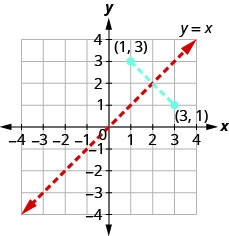

3. Graph, on the same coordinate system, the inverse of the function shown below.        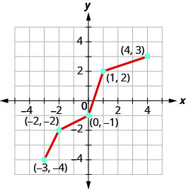

> *Find the inverse of a One-to-One Function when its given as an equation*
> Substitute y in place of f(x).
> Interchange the variables x and y.
> Solve for y.
> Rewrite y as ${f}^{-1}\left(x\right)$ .
> Verify that the functions are inverses.
>

Given function, find the inverse function

4. Find the inverse of $f\left(x\right)=4x+7.$

Solution

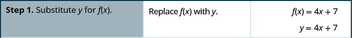

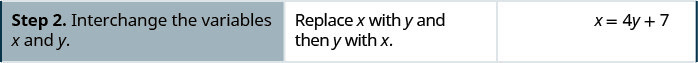

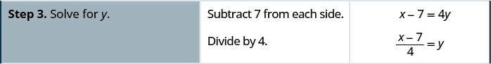

![Step 5 is to verify that the functions are inverses. To do so, we show that f superscript negative 1 of f of x equals x and that f of f superscript negative 1of x equals x. Hence, we ask whether f inverse of 4x plus 7 equals x. This becomes a question of whether 4 x plus 7 minus 7 all divided by 4 equals x. This becomes a question of whether 4x divided by 4 equals x. This is true. To show the other side, we examine whether f of f inverse of x equals x. This becomes a question of whether f of the quantity x minus 7 divided by 4 equals x. This becomes a question of whether 4 times the quantity x minus 7 divided by 4 equals x. This becomes a question of whether x minus 7 plus 7 equals x. This is true.](../../media/5_7_8.jpg)

### Practice Makes Perfect

Find the inverse of each of the following functions using the 4 step procedure outlined above.

5. $f\left(x\right)=\sqrt[3]{3x-1}$

6. $f\left(x\right)=\frac{5}{x-2}$

7. $f\left(x\right)={x}^{3}+4$

## Objective 2: Find the domain of a radical function (IA 8.7.2).

### A radical function is a function that is defined by a radical expression.
For example, $f\left(x\right)=\sqrt{x+3}$ , $g\left(x\right)=\sqrt[3]{2x-1}$ are both radical functions.

### Practice Makes Perfect
8. For the radical function $f\left(x\right)=\sqrt{x-2}$ , find the following      ⓐ $f\left(3\right)$  ⓑ $f\left(6\right)$  ⓒ $f\left(2\right)$  ⓓ $f\left(1\right)$  ⓔ Why is there a problem with part d? Explain. ⓕ What do you think is the domain of $f\left(x\right)$ ? (Hint: think of domain as all the x-values for which we can evaluate $f\left(x\right)$

9. For the radical function $f\left(x\right)=\sqrt[3]{x-2}$ , find the following    ⓐ $f\left(3\right)$  ⓑ $f\left(6\right)$  ⓒ $f\left(2\right)$  ⓓ $f\left(1\right)$  ⓔ Why is there a problem with part d? Explain. ⓕ What do you think is the domain of $f\left(x\right)$ ? (Hint: think of domain as all the x-values for which we can evaluate $f\left(x\right)$

>
>
> **Domain of a Radical Function**
>
> When the *index* of the radical is *even*, the radicand must be greater than or equal to zero.
>
> When the *index* of the radical is *odd*, the radicand can be any real number.
>

 Find the domain of a radical function.

10. Find the domain of the function $f\left(x\right)=\sqrt{3x-4}$ . Write the domain in interval notation.

Solution

Since this function has a radical with the even index of 2, we set the radicand to be greater than or equal to 0 and then solve to find the domain.

 $\begin{array}{c}3x-4\ge 0\\ 3x\ge 4\\ x\ge \frac{4}{3}\end{array}$ 

The domain expressed in interval notation is $[\frac{4}{3},\ \infty ]$

### Practice Makes Perfect

**Find the domain of a radical function.**

Find the domain of the following functions and express using interval notation.

11. $f(x)=\sqrt{3x+5}$

12. $f(x)=\sqrt[3]{4-6x}$

13. $f(x)=\sqrt[4]{5-x}$

Park rangers and other trail managers may construct rock piles, stacks, or other arrangements, usually called cairns, to mark trails or other landmarks. (Rangers and environmental scientists discourage hikers from doing the same, in order to avoid confusion and preserve the habitats of plants and animals.) A cairn in the form of a mound of gravel is in the shape of a cone with the height equal to twice the radius.

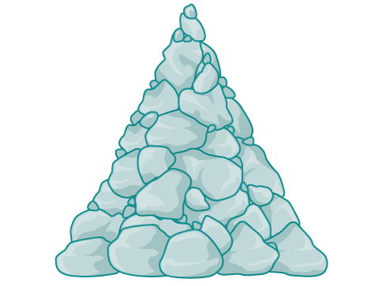

The volume is found using a formula from elementary geometry.

 $$
\begin{array}{ccc}V&   =& \frac{1}{3}\pi {r}^{2}h  \\ & =& \frac{1}{3}\pi {r}^{2}(2r)  \\ & =& \frac{2}{3}\pi {r}^{3}  \end{array}
$$
We have written the volume $V$ in terms of the radius $r.$ However, in some cases, we may start out with the volume and want to find the radius. For example: A customer purchases 100 cubic feet of gravel to construct a cone shape mound with a height twice the radius. What are the radius and height of the new cone? To answer this question, we use the formula

 $$
r=\sqrt[3]{\frac{3V}{2\pi}}
$$ This function is the inverse of the formula for $V$ in terms of $r.$ 

In this section, we will explore the inverses of polynomial and rational functions and in particular the radical functions we encounter in the process.

# Finding the Inverse of a Polynomial Function
Two functions $f$ and $g$ are inverse functions if for every coordinate pair in $f,(a,b),$ there exists a corresponding coordinate pair in the inverse function, $g,(b,\phantom{\rule{0.5em}{0ex}}a).$ In other words, the coordinate pairs of the inverse functions have the input and output interchanged. Only one-to-one functions have inverses. Recall that a one-to-one function has a  unique output value for each input value and passes the horizontal line test.
For example, suppose the Sustainability Club builds a water runoff collector in the shape of a parabolic trough as shown in . We can use the information in the figure to find the surface area of the water in the trough as a function of the depth of the water.

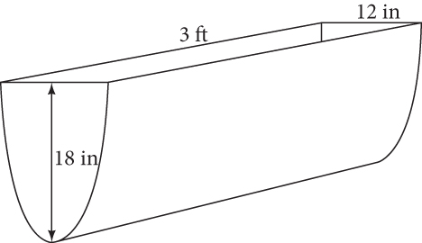

Because it will be helpful to have an equation for the parabolic cross-sectional shape, we will impose a coordinate system at the cross section, with $x$ measured horizontally and $y$ measured vertically, with the origin at the vertex of the parabola. See .

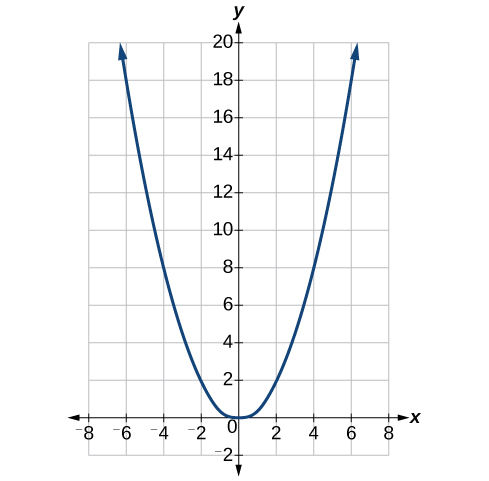

From this we find an equation for the parabolic shape. We placed the origin at the vertex of the parabola, so we know the equation will have form $y(x)=a{x}^{2}.$ Our equation will need to pass through the point (6, 18), from which we can solve for the stretch factor $a.$

 $$
\begin{array}{ccc}  18& =& a{6}^{2}  \\   a& =& \frac{18}{36}  \\ & =& \frac{1}{2}  \end{array}
$$
Our parabolic cross section has the equation
 $$
y(x)=\frac{1}{2}{x}^{2}
$$
We are interested in the **surface area** of the water, so we must determine the width at the top of the water as a function of the water depth. For any depth $y,$ the width will be given by $2x,$ so we need to solve the equation above for $x$ and find the inverse function. However, notice that the original function is not one-to-one, and indeed, given any output there are two inputs that produce the same output, one positive and one negative.
To find an inverse, we can restrict our original function to a limited domain on which it *is* one-to-one. In this case, it makes sense to restrict ourselves to positive $x$ values. On this domain, we can find an inverse by solving for the input variable:

 $$
\begin{array}{ccc}  y& =& \frac{1}{2}{x}^{2}  \\   2y& =& {x}^{2}  \\   x& =& \pm \sqrt{2y}  \\   \therefore y& =& \pm \sqrt{2x}  \end{array}
$$
This is not a function as written. Since we are limiting ourselves to positive $x$ values in the original function, we can eliminate the negative solution, which gives us the inverse function we’re looking for.
 $$
y=\sqrt{2x}
$$
Because $x$ is the distance from the center of the parabola to either side, the entire width of the water at the top will be $2x.$ The trough is 3 feet (36 inches) long, so the surface area will then be:

 $$
\begin{array}{ccc}  \text{Area}& =& l\cdot w  \\ & =& 36\cdot 2x  \\ & =& 72x  \\ & =& 72\sqrt{2y}  \end{array}
$$
This example illustrates two important points:

When finding the inverse of a quadratic, we have to limit ourselves to a domain on which the function is one-to-one.
The inverse of a quadratic function is a square root function. Both are toolkit functions and different types of power functions.
Functions involving roots are often called **radical functions**. While it is not possible to find an inverse of most polynomial functions, some basic polynomials do have inverses. Such functions are called **invertible functions**, and we use the notation ${f}^{-1}(x).$

Warning: ${f}^{-1}(x)$ is not the same as the reciprocal of the function $f\left(x\right).$ This use of “–1” is reserved to denote inverse functions. To denote the reciprocal of a function $f\left(x\right),$ we would need to write ${\left(f\left(x\right)\right)}^{-1}=\frac{1}{f\left(x\right)}.$

An important relationship between inverse functions is that they “undo” each other. If ${f}^{-1}$ is the inverse of a function $f,$
then $f$ is the inverse of the function ${f}^{-1}.$ In other words, whatever the function $f$ does to $x,$
 ${f}^{-1}$ undoes it—and vice-versa.
 $$
{f}^{-1}\left(f\left(x\right)\right)=x,\phantom{\rule{0.5em}{0ex}}\text{for\ all\}x\phantom{\rule{0.5em}{0ex}}\text{in\ the\ domain\ of\}f
$$
and
 $$
f\left({f}^{-1}\left(x\right)\right)=x,\phantom{\rule{0.5em}{0ex}}\text{for\ all\}x\phantom{\rule{0.5em}{0ex}}\text{in\ the\ domain\ of\}{f}^{-1}
$$
Note that the inverse switches the domain and range of the original function.

>
>
>
>
> **Verifying Two Functions Are Inverses of One Another**
>
>
> Two functions, $f$
> and $g,$ are inverses of one another if for all $x$ in the domain of $f$
> and $g.$
>
>
>  $$
> g\left(f\left(x\right)\right)=f\left(g\left(x\right)\right)=x
> $$

>
> How To
> *Given a polynomial function, find the inverse of the function by restricting the domain in such a way that the new function is one-to-one.*
>
>
> Replace $f\left(x\right)$ with $y.$
>
> Interchange $x$ and $y.$
>
> Solve for $y,$ and rename the function ${f}^{-1}(x).$
>
>

14. **Verifying Inverse Functions**   Show that $f\left(x\right)=\frac{1}{x+1}$ and ${f}^{-1}\left(x\right)=\frac{1}{x}-1$ are inverses, for $x\ne 0,\mathrm{-1}$ .

Solution

We must show that ${f}^{-1}\left(f\left(x\right)\right)=x$ and $f\left({f}^{-1}\left(x\right)\right)=x.$

 $$
\begin{array}{ccc}  {f}^{-1}(f(x))& =& {f}^{-1}\left(\frac{1}{x+1}\right)  \\ & =& \frac{1}{\frac{1}{x+1}}-1  \\ & =& (x+1)-1\\ & =& x  \\   f({f}^{\mathrm{-1}}(x))& =& f\left(\frac{1}{x}-1\right)  \\ & =& \frac{1}{\left(\frac{1}{x}-1\right)+1}  \\ & =& \frac{1}{\frac{1}{x}}  \\ & =& x  \end{array}
$$ Therefore, $f\left(x\right)=\frac{1}{x+1}$
and ${f}^{-1}\left(x\right)=\frac{1}{x}-1$ are inverses.

>
> Try It
> 15. Show that $f\left(x\right)=\frac{x+5}{3}$ and ${f}^{-1}\left(x\right)=3x-5$ are inverses.
>
> 

> 
Solution

>
> ${f}^{-1}\left(f\left(x\right)\right)={f}^{-1}\left(\frac{x+5}{3}\right)=3\left(\frac{x+5}{3}\right)-5=\left(x-5\right)+5=x$ and $f\left({f}^{-1}\left(x\right)\right)=f\left(3x-5\right)=\frac{\left(3x-5\right)+5}{3}=\frac{3x}{3}=x$
> 

>
>

16. **Finding the Inverse of a Cubic Function**   Find the inverse of the function $f(x)=5{x}^{3}+1.$

Solution

This is a transformation of the basic cubic toolkit function, and based on our knowledge of that function, we know it is one-to-one. Solving for the inverse by solving for $x.$

 $$
\begin{array}{ccc}  y& =& 5{x}^{3}+1  \\   x& =& 5{y}^{3}+1  \\   x-1& =& 5{y}^{3}  \\   \frac{x-1}{5}& =& {y}^{3}  \\   {f}^{-1}(x)& =& \sqrt[3]{\frac{x-1}{5}}  \end{array}
$$

>
> Try It
> 17. Find the inverse function of $f(x)=\sqrt[3]{x+4}.$
>
> 

> 
Solution

>
> ${f}^{-1}(x)={x}^{3}-4$
> 

>
>

# Restricting the Domain to Find the Inverse of a Polynomial Function
So far, we have been able to find the inverse functions of **cubic functions** without having to restrict their domains. However, as we know, not all cubic polynomials are one-to-one. Some functions that are not one-to-one may have their domain restricted so that they are one-to-one, but only over that domain. The function over the restricted domain would then have an **inverse function**. Since quadratic functions are not one-to-one, we must restrict their domain in order to find their inverses.

>
>
>
>
> **Restricting the Domain**
>
>
> If a function is not one-to-one, it cannot have an inverse. If we restrict the domain of the function so that it becomes one-to-one, thus creating a new function, this new function will have an inverse.
>

>
> How To
> *Given a polynomial function, restrict the domain of a function that is not one-to-one and then find the inverse.*
>
> Restrict the domain by determining a domain on which the original function is one-to-one.
> Replace $f(x)$ with $y.$
>
> Interchange $x$ and $y.$
>
> Solve for $y,$ and rename the function or pair of function ${f}^{\mathrm{-1}}(x).$
>
> Revise the formula for ${f}^{\mathrm{-1}}(x)$ by ensuring that the outputs of the inverse function correspond to the restricted domain of the original function.

18. **Restricting the Domain to Find the Inverse of a Polynomial Function**   Find the inverse function of $f\text{:}$   ⓐ $f(x)={(x-4)}^{2},\ x\ge 4$  ⓑ $f(x)={(x-4)}^{2},\ x\le 4$

Solution

The original function $f(x)={(x-4)}^{2}$ is not one-to-one, but the function is restricted to a domain of $x\ge 4$ or $x\le 4$ on which it is one-to-one. See .

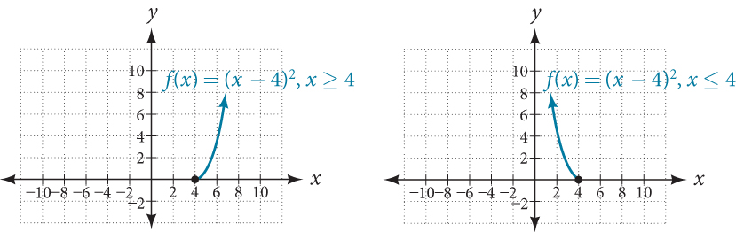

To find the inverse, start by replacing $f(x)$ with the simple variable $y.$

 $$
\begin{array}{cccc}  y& =& {(x-4)}^{2}  & \phantom{\rule{2em}{0ex}}\text{Interchange}x\text{and\}y.  \\   x& =& {(y-4)}^{2}  & \phantom{\rule{2em}{0ex}}\text{Take\ the\ square\ root}.  \\   \pm \sqrt{x}& =& y-4  & \phantom{\rule{2em}{0ex}}\text{Add}\ 4\ \text{to\ both\ sides}.  \\   4\pm \sqrt{x}& =& y  & \end{array}
$$
This is not a function as written. We need to examine the restrictions on the domain of the original function to determine the inverse. Since we reversed the roles of $x$ and $y$ for the original $f(x),$ we looked at the domain: the values $x$
could assume. When we reversed the roles of $x$ and $y,$
this gave us the values $y$ could assume. For this function, $x\ge 4,$ so for the inverse, we should have $y\ge 4,$ which is what our inverse function gives.

ⓐThe domain of the original function was restricted to $x\ge 4,$ so the outputs of the inverse need to be the same, $f\left(x\right)\ge 4,$ and we must use the + case:
 $$
{f}^{-1}(x)=4+\sqrt{x}
$$

ⓑ
The domain of the original function was restricted to $x\le 4,$ so the outputs of the inverse need to be the same, $f\left(x\right)\le 4,$ and we must use the – case:
 $$
{f}^{-1}(x)=4-\sqrt{x}
$$

19. **Finding the Inverse of a Quadratic Function When the Restriction Is Not Specified**   Restrict the domain and then find the inverse of   $$ f(x)={(x-2)}^{2}-3. $$

Solution

We can see this is a parabola with vertex at $(2,\mathrm{\u20133})$ that opens upward. Because the graph will be decreasing on one side of the vertex and increasing on the other side, we can restrict this function to a domain on which it will be one-to-one by limiting the domain to $x\ge 2.$

To find the inverse, we will use the vertex form of the quadratic. We start by replacing $f(x)$ with a simple variable, $y,$ then solve for $x.$

 $$
\begin{array}{cccc}  y& =& {(x-2)}^{2}-3  & \phantom{\rule{2em}{0ex}}\text{\hspace{1em}\hspace{1em}}\text{Interchange\}x\phantom{\rule{0.5em}{0ex}}\text{and\}y.  \\   x& =& {(y-2)}^{2}-3  & \phantom{\rule{2em}{0ex}}\text{\hspace{1em}\hspace{1em}}\text{Add\ 3\ to\ both\ sides}.  \\   x+3& =& {(y-2)}^{2}  & \phantom{\rule{2em}{0ex}}\text{\hspace{1em}\hspace{1em}}\text{Take\ the\ square\ root}.  \\   \pm \sqrt{x+3}& =& y-2  & \phantom{\rule{2em}{0ex}}\text{\hspace{1em}\hspace{1em}}\text{Add\ 2\ to\ both\ sides}.  \\   2\pm \sqrt{x+3}& =& y  & \phantom{\rule{2em}{0ex}}\text{\hspace{1em}\hspace{1em}}\text{Rename\ the\ function}.  \\   {f}^{-1}(x)& =& 2\pm \sqrt{x+3}  & \end{array}
$$

Now we need to determine which case to use. Because we restricted our original function to a domain of $x\ge 2,$ the outputs of the inverse should be the same, telling us to utilize the + case

 $$
{f}^{-1}(x)=2+\sqrt{x+3}
$$
If the quadratic had not been given in vertex form, rewriting it into vertex form would be the first step. This way we may easily observe the coordinates of the vertex to help us restrict the domain.

>
> Try It
> 20. Find the inverse of the function $f(x)={x}^{2}+1,$ on the domain $x\ge 0.$
>
> 

> 
Solution

>
> ${f}^{-1}(x)=\sqrt{x-1}$
> 

>
>

## Solving Applications of Radical Functions
Notice that the functions from previous examples were all polynomials, and their inverses were radical functions. If we want to find the **inverse of a radical function**, we will need to restrict the domain of the answer because the range of the original function is limited.

>
> How To
> *Given a radical function, find the inverse.*
>
>
> Determine the range of the original function.
> Replace $f\left(x\right)$
> with $y,$ then solve for $x.$
>
> If necessary, restrict the domain of the inverse function to the range of the original function.
>

21. **Finding the Inverse of a Radical Function**   Restrict the domain of the function $f(x)=\sqrt{x-4}$ and then find the inverse.

Solution

Note that the original function has range $f(x)\ge 0.$ Replace $f(x)$ with $y,$ then solve for $x.$

 $$
\begin{array}{cccc}  y& =& \sqrt{x-4}  & \phantom{\rule{2em}{0ex}}\text{Replace\}f(x)\phantom{\rule{0.5em}{0ex}}\text{with\}y.  \\   x& =& \sqrt{y-4}  & \phantom{\rule{2em}{0ex}}\text{Interchange\}x\phantom{\rule{0.5em}{0ex}}\text{and\}y.  \\   x& =& \sqrt{y-4}  & \phantom{\rule{2em}{0ex}}\text{Square\ each\ side}.  \\   {x}^{2}& =& y-4  & \phantom{\rule{2em}{0ex}}\text{Add\ 4}.  \\   {x}^{2}+4& =& y  & \phantom{\rule{2em}{0ex}}\text{Rename\ the\ function\}{f}^{-1}(x).  \\   {f}^{-1}(x)& =& {x}^{2}+4  & \end{array}
$$ Recall that the domain of this function must be limited to the range of the original function.

 $$
{f}^{-1}(x)={x}^{2}+4,x\ge 0
$$

>
> Try It
> 22. Restrict the domain and then find the inverse of the function $f(x)=\sqrt{2x+3}.$
>
> 

> 
Solution

>
> ${f}^{-1}(x)=\frac{{x}^{2}-3}{2},x\ge 0$
> 

>
>

## Solving Applications of Radical Functions
Radical functions are common in physical models, as we saw in the section opener. We now have enough tools to be able to solve the problem posed at the start of the section.

23. **Solving an Application with a Cubic Function**   Park rangers construct a mound of gravel in the shape of a cone with the height equal to twice the radius. The volume of the cone in terms of the radius is given by   $$ V=\frac{2}{3}\pi {r}^{3} $$ Find the inverse of the function $V=\frac{2}{3}\pi {r}^{3}$ that determines the volume $V$ of a cone and is a function of the radius $r.$ Then use the inverse function to calculate the radius of such a mound of gravel measuring 100 cubic feet. Use $\pi =\mathrm{3.14.}$

Solution

Start with the given function for $V.$ Notice that the meaningful domain for the function is $r>0$ since negative radii would not make sense in this context nor would a radius of 0. Also note the range of the function (hence, the domain of the inverse function) is $V>0.$ Solve for $r$ in terms of $V,$ using the method outlined previously. Note that in real-world applications, we do not swap the variables when finding inverses. Instead, we change which variable is considered to be the independent variable.

 $$
\begin{array}{cccc}  V& =& \frac{2}{3}\pi {r}^{3}  & \\   {r}^{3}& =& \frac{3V}{2\pi}  & \phantom{\rule{2em}{0ex}}\text{Solve\ for\}{r}^{3}.  \\   r& =& \sqrt[3]{\frac{3V}{2\pi}}  & \phantom{\rule{2em}{0ex}}\text{Solve\ for\}r.  \end{array}
$$
This is the result stated in the section opener. Now evaluate this for $V=100$ and $\pi =\mathrm{3.14.}$

 $$
\begin{array}{ccc}  r& =& \sqrt[3]{\frac{3V}{2\pi}}  \\ & =& \sqrt[3]{\frac{3\cdot 100}{2\cdot 3.14}}  \\ & \approx & \sqrt[3]{47.7707}  \\ & \approx   & 3.63  \end{array}
$$ 
Therefore, the radius is about 3.63 ft.

## Determining the Domain of a Radical Function Composed with Other Functions
When radical functions are composed with other functions, determining domain can become more complicated.

24. **Finding the Domain of a Radical Function Composed with a Rational Function**   Find the domain of the function $f(x)=\sqrt{\frac{(x+2)(x-3)}{(x-1)}}.$

Solution

Because a square root is only defined when the quantity under the radical is non-negative, we need to determine where $\frac{(x+2)(x-3)}{(x-1)}\ge 0.$ The output of a rational function can change signs (change from positive to negative or vice versa) at *x*-intercepts and at vertical asymptotes. For this equation, the graph could change signs at $x=\u20132,\ 1,\ \text{and}\ 3.$

To determine the intervals on which the rational expression is positive, we could test some values in the expression or sketch a graph. While both approaches work equally well, for this example we will use a graph as shown in .

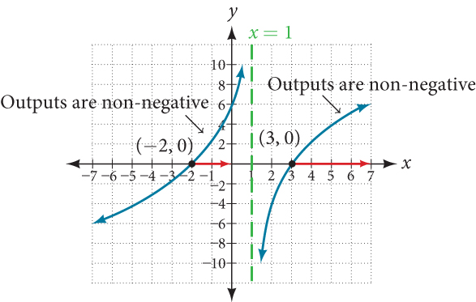

This function has two *x*-intercepts, both of which exhibit linear behavior near the *x*-intercepts. There is one vertical asymptote, corresponding to a linear factor; this behavior is similar to the basic reciprocal toolkit function, and there is no horizontal asymptote because the degree of the numerator is larger than the degree of the denominator. There is a *y*-intercept at $(0,\sqrt{6}).$

From the *y*-intercept and *x*-intercept at $x=\mathrm{-2},$ we can sketch the left side of the graph. From the behavior at the asymptote, we can sketch the right side of the graph.
From the graph, we can now tell on which intervals the outputs will be non-negative, so that we can be sure that the original function $f\left(x\right)$ will be defined. $f\left(x\right)$ has domain $\mathrm{-2}\le x<1\phantom{\rule{0.5em}{0ex}}\text{or}\phantom{\rule{0.5em}{0ex}}x\ge 3,$ or in interval notation, $[\mathrm{-2},1)\cup [3,\infty ).$

## Finding Inverses of Rational Functions
As with finding inverses of quadratic functions, it is sometimes desirable to find the **inverse of a rational function**, particularly of rational functions that are the ratio of linear functions, such as in concentration applications.

25. **Finding the Inverse of a Rational Function**   The function $C=\frac{20+0.4n}{100+n}$ represents the concentration $C$ of an acid solution after $n$ mL of 40% solution has been added to 100 mL of a 20% solution. First, find the inverse of the function; that is, find an expression for $n$ in terms of $C.$ Then use your result to determine how much of the 40% solution should be added so that the final mixture is a 35% solution.

Solution

We first want the inverse of the function in order to determine how many mL we need for a given concentration. We will solve for $n$ in terms of $C.$

 $$
\begin{array}{ccc}  C& =& \frac{20+0.4n}{100+n}  \\   C(100+n)& =& 20+0.4n  \\   100C+Cn& =& 20+0.4n  \\   100C-20& =& 0.4n-Cn  \\   100C-20& =& (0.4-C)n  \\   n& =& \frac{100C-20}{0.4-C}  \end{array}
$$

Now evaluate this function at 35%, which is $C=\mathrm{0.35.}$

 $$
\begin{array}{ccc}  n& =& \frac{100(0.35)-20}{0.4-0.35}  \\ & =& \frac{15}{0.05}  \\ & =& 300  \end{array}
$$

We can conclude that 300 mL of the 40% solution should be added.

>
> Try It
> 26. Find the inverse of the function $f(x)=\frac{x+3}{x-2}.$
>
> 

> 
Solution

>
> ${f}^{-1}(x)=\frac{2x+3}{x-1}$
> 

>
>

>
> Media
> Access these online resources for additional instruction and practice with inverses and radical functions.
>
> Graphing the Basic Square Root Function
>
> Find the Inverse of a Square Root Function
>
> Find the Inverse of a Rational Function
>
> Find the Inverse of a Rational Function and an Inverse Function Value
> Inverse Functions

# Key Concepts
The inverse of a quadratic function is a square root function.
If ${f}^{-1}$
is the inverse of a function $f,$
then $f$
is the inverse of the function ${f}^{-1}.$
See .
While it is not possible to find an inverse of most polynomial functions, some basic polynomials are invertible. See .
To find the inverse of certain functions, we must restrict the function to a domain on which it will be one-to-one. See  and .
When finding the inverse of a radical function, we need a restriction on the domain of the answer. See  and .
Inverse and radical and functions can be used to solve application problems. See  and .

# Section Exercises

## Verbal
1. Explain why we cannot find inverse functions for all polynomial functions.

Solution

It can be too difficult or impossible to solve for $x$ in terms of $y.$

2. Why must we restrict the domain of a quadratic function when finding its inverse?

3. When finding the inverse of a radical function, what restriction will we need to make?

Solution

We will need a restriction on the domain of the answer.

4. The inverse of a quadratic function will always take what form?

## Algebraic
For the following exercises, find the inverse of the function on the given domain.
5. $f\left(x\right)={\left(x-4\right)}^{2},\ [4,\infty )$

Solution

${f}^{-1}(x)=\sqrt{x}+4$

6. $f\left(x\right)={\left(x+2\right)}^{2},\ [\mathrm{-2},\infty )$

7. $f(x)={\left(x+1\right)}^{2}-3,\ [\mathrm{-1},\infty )$

Solution

${f}^{-1}(x)=\sqrt{x+3}-1$

8. $f(x)=3{x}^{2}+5,\phantom{\rule{0.5em}{0ex}}\phantom{\rule{0.5em}{0ex}}\left(\infty ,0\right]$

9. $f\left(x\right)=12-{x}^{2},\ [0,\infty )$

Solution

${f}^{-1}(x)=\sqrt{12-x}$

10. $f\left(x\right)=9-{x}^{2},\ [0,\infty )$

11. $f(x)=2{x}^{2}+4,\ [0,\infty )$

Solution

${f}^{-1}(x)=\pm \sqrt{\frac{x-4}{2}}$

For the following exercises, find the inverse of the functions.
12. $f(x)={x}^{3}+5$

13. $f\left(x\right)=3{x}^{3}+1$

Solution

${f}^{-1}(x)=\sqrt{\frac{x-1}{3}3}$

14. $f(x)=4-{x}^{3}$

15. $f\left(x\right)=4-2{x}^{3}$

Solution

${f}^{-1}(x)=\sqrt{\frac{4-x}{2}3}$

For the following exercises, find the inverse of the functions.
16. $f(x)=\sqrt{2x+1}$

17. $f(x)=\sqrt{3-4x}$

Solution

${f}^{\mathrm{-1}}(x)=\frac{3-{x}^{2}}{4},\phantom{\rule{0.5em}{0ex}}\phantom{\rule{0.5em}{0ex}}\left[0,\infty \right)$

18. $f\left(x\right)=9+\sqrt{4x-4}$

19. $f\left(x\right)=\sqrt{6x-8}+5$

Solution

${f}^{\mathrm{-1}}(x)=\frac{{(x-5)}^{2}+8}{6}$

20. $f\left(x\right)=9+2\sqrt[3]{x}$

21. $f\left(x\right)=3-\sqrt[3]{x}$

Solution

${f}^{\mathrm{-1}}(x)={(3-x)}^{2}$

22. $f\left(x\right)=\frac{2}{x+8}$

23. $f\left(x\right)=\frac{3}{x-4}$

Solution

${f}^{\mathrm{-1}}(x)=\frac{4x+3}{x}$

24. $f\left(x\right)=\frac{x+3}{x+7}$

25. $f\left(x\right)=\frac{x-2}{x+7}$

Solution

${f}^{\mathrm{-1}}(x)=\frac{7x-3}{1-x}$

26. $f\left(x\right)=\frac{3x+4}{5-4x}$

27. $f\left(x\right)=\frac{5x+1}{2-5x}$

Solution

${f}^{\mathrm{-1}}(x)=\frac{2x-1}{5x+5}$

28. $f(x)={x}^{2}+2x,\ [\mathrm{-1},\infty )$

29. $f(x)={x}^{2}+4x+1,\ [\mathrm{-2},\infty )$

Solution

${f}^{\mathrm{-1}}(x)=\sqrt{x+3}-2$

30. $f(x)={x}^{2}-6x+3,\ [3,\infty )$

## Graphical
For the following exercises, find the inverse of the function and graph both the function and its inverse.
31. $f(x)={x}^{2}+2,\phantom{\rule{0.5em}{0ex}}x\ge 0$

Solution

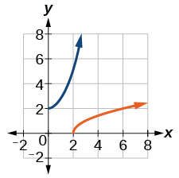

 ${f}^{-1}(x)=\sqrt{x-2}$

32. $f(x)=4-{x}^{2},\phantom{\rule{0.5em}{0ex}}x\ge 0$

33. $f(x)={\left(x+3\right)}^{2},\phantom{\rule{0.5em}{0ex}}x\ge -3$

Solution

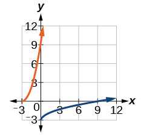

 ${f}^{-1}(x)=\sqrt{x-3}$

34. $f(x)={\left(x-4\right)}^{2},\phantom{\rule{0.5em}{0ex}}x\ge 4$

35. $f(x)={x}^{3}+3$

Solution

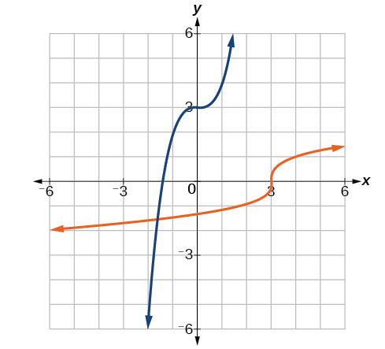

 ${f}^{-1}(x)=\sqrt[3]{x-3}$

36. $f(x)=1-{x}^{3}$

37. $f(x)={x}^{2}+4x,\phantom{\rule{0.5em}{0ex}}x\ge -2$

Solution

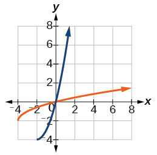

 ${f}^{-1}(x)=\sqrt{x+4}-2$

38. $f(x)={x}^{2}-6x+1,\phantom{\rule{0.5em}{0ex}}x\ge 3$

39. $f(x)=\frac{2}{x}$

Solution

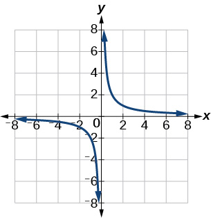

40. $f(x)=\frac{1}{{x}^{2}},\phantom{\rule{0.5em}{0ex}}x\ge 0$

For the following exercises, use a graph to help determine the domain of the functions.
41. $f(x)=\sqrt{\frac{(x+1)(x-1)}{x}}$

Solution

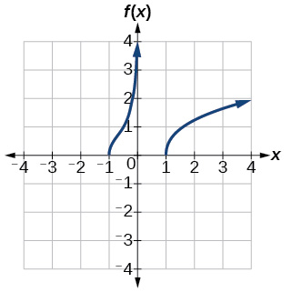

 $[-1,0)\cup [1,\infty )$

42. $f(x)=\sqrt{\frac{(x+2)(x-3)}{x-1}}$

43. $f(x)=\sqrt{\frac{x(x+3)}{x-4}}$

Solution

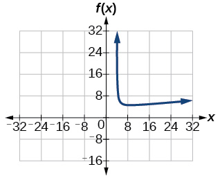

 $[-3,0]\cup (4,\infty )$

44. $f(x)=\sqrt{\frac{{x}^{2}-x-20}{x-2}}$

45. $f(x)=\sqrt{\frac{9-{x}^{2}}{x+4}}$

Solution

 $[-\mathrm{\infty},-4]\cdot [-3,3]$

## Technology
For the following exercises, use a calculator to graph the function. Then, using the graph, give three points on the graph of the inverse with *y*-coordinates given.
46. $f(x)={x}^{3}-x-2,y=1,2,3$

47. $f(x)={x}^{3}+x-2,y=0,1,2$

Solution

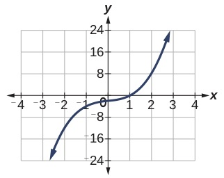

 $(\u20132,0),(0,1),(8,2)$

48. $f(x)={x}^{3}+3x-4,y=0,1,2$

49. $f(x)={x}^{3}+8x-4,y=-1,0,1$

Solution

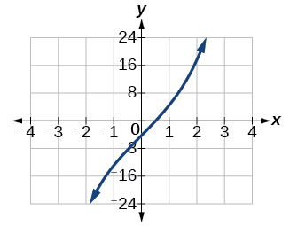

 $(\u201313,\u20131),(\u20134,0),(5,1)$

50. $f(x)={x}^{4}+5x+1,y=-1,0,1$

## Extensions
For the following exercises, find the inverse of the functions with $a,b,c$ positive real numbers.
51. $f(x)=a{x}^{3}+b$

Solution

${f}^{-1}(x)=\sqrt[3]{\frac{x-b}{a}}$

52. $f(x)={x}^{2}+bx$

53. $f(x)=\sqrt{a{x}^{2}-b}$

Solution

${f}^{-1}(x)=\frac{\sqrt{{x}^{2}-b}}{a}$

54. $f(x)=\sqrt[3]{ax+b}$

55. $f(x)=\frac{ax+b}{x+c}$

Solution

${f}^{-1}(x)=\frac{cx-b}{a-x}$

## Real-World Applications
For the following exercises, determine the function described and then use it to answer the question.
56. An object dropped from a height of 200 meters has a height, $h\left(t\right),$ in meters after $t$ seconds have lapsed, such that $h(t)=200-4.9{t}^{2}.$ Express $t$ as a function of height, $h,$ and find the time to reach a height of 50 meters.

57. An object dropped from a height of 600 feet has a height, $h\left(t\right),$ in feet after $t$ seconds have elapsed, such that $h(t)=600-16{t}^{2}.$ Express $t$ as a function of height $h,$ and find the time to reach a height of 400 feet.

Solution

$t(h)=\sqrt{\frac{600-h}{16}}$
, 3.54 seconds

58. The volume, $V,$ of a sphere in terms of its radius, $r,$ is given by $V(r)=\frac{4}{3}\pi {r}^{3}.$ Express $r$ as a function of $V,$ and find the radius of a sphere with volume of 200 cubic feet.

59. The surface area, $A,$ of a sphere in terms of its radius, $r,$ is given by $A(r)=4\pi {r}^{2}.$ Express $r$ as a function of $A,$ and find the radius of a sphere with a surface area of 1000 square inches.

Solution

$r(A)=\sqrt{\frac{A}{4\pi}},\; \approx$
8.92 in.

60. A container holds 100 mL of a solution that is 25 mL acid. If $n$ mL of a solution that is 60% acid is added, the function $C(n)=\frac{25+.6n}{100+n}$ gives the concentration, $C,$ as a function of the number of mL added, $n.$ Express $n$ as a function of $C$ and determine the number of mL that need to be added to have a solution that is 50% acid.

61. The period $T,$ in seconds, of a simple pendulum as a function of its length $l,$ in feet, is given by $T(l)=2\pi \sqrt{\frac{l}{32.2}}$ . Express $l$ as a function of $T$ and determine the length of a pendulum with period of 2 seconds.

Solution

$l\left(T\right)=32.2\left(\frac{T}{2\pi}\right),\; \approx$
3.26 ft

62. The volume of a cylinder , $V,$ in terms of radius, $r,$ and height, $h,$ is given by $V=\pi {r}^{2}h.$ If a cylinder has a height of 6 meters, express the radius as a function of $V$ and find the radius of a cylinder with volume of 300 cubic meters.

63. The surface area, $A,$ of a cylinder in terms of its radius, $r,$ and height, $h,$ is given by $A=2\pi {r}^{2}+2\pi rh.$ If the height of the cylinder is 4 feet, express the radius as a function of $A$ and find the radius if the surface area is 200 square feet.

Solution

$r(A)=\sqrt{\frac{A+8\pi}{2\pi}}$ –2, 3.99 ft

64. The volume of a right circular cone, $V,$ in terms of its radius, $r,$ and its height, $h,$ is given by $V=\frac{1}{3}\pi {r}^{2}h.$ Express $r$ in terms of $V$ if the height of the cone is 12 feet and find the radius of a cone with volume of 50 cubic inches.

65. Consider a cone with height of 30 feet. Express the radius, $r,$ in terms of the volume, $V,$ and find the radius of a cone with volume of 1000 cubic feet.

Solution

$r(V)=\sqrt{\frac{V}{10\pi}},$ ≈ 5.64 ft

**invertible function**any function that has an inverse function
